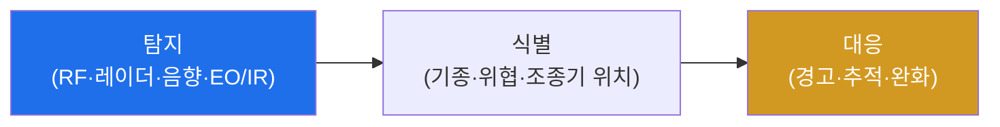

# autonomous-systems W04 — 드론 방어: 드론 탐지·RF 분석·지오펜싱

> **본 주차의 한 줄 요약**
>
> W03이 드론 공격이었다면, W04는 두 방향의 방어를 다룬다: **(A) 무단 드론으로부터의 방어**(공항·시설에 침입하는
> 적 드론 대응)와 **(B) 내 드론의 하이재킹 방어**(W03 공격 차단). **(A) 카운터-드론(C-UAS)**: ① **탐지** — 무단
> 드론을 여러 수단으로 발견: **RF 탐지**(드론-조종기 통신 신호 포착), **레이더**(소형 물체), **음향**(프로펠러
> 소리), **EO/IR 카메라**(광학). 각 수단은 한계가 있어 **다중 센서 융합**으로 신뢰도를 높인다, ② **식별·분류** —
> RF 지문으로 드론 기종·조종기 위치를 파악, 위협 수준 평가, ③ **대응** — 탐지 후 경고·추적·완화(RF 재밍·GPS
> 스푸핑·포획 등, 단 재밍은 **법적 제약**이 크다). **(B) 내 드론 방어**: **지오펜싱(geofencing)** — 드론이 특정
> 구역(공항·국경·금지구역)에 못 들어가게 GPS 기반 가상 울타리를 강제(제조사·규제), **페일세이프**(링크 끊김 시
> 귀환), **MAVLink 서명**(W03). 핵심: 드론 방어는 **탐지→식별→대응** 파이프라인이며, 다중 센서와 지오펜싱이
> 기둥이다. 단 대응(재밍 등)은 법·안전 제약이 크므로 신중해야 한다. 실물 RF·센서가 필요해 개념·로직으로 학습한다.
>
> **한 줄 결론**: 드론 방어 = 무단 드론 **탐지(RF·레이더·음향 다중 센서)→식별→대응** + 내 드론 **지오펜싱·
> 페일세이프·서명**. 대응(재밍)은 법적 제약이 크다.

---

## 학습 목표

본 주차 종료 시 학생은 다음 5가지를 **본인 손으로** 할 수 있어야 한다.

1. 카운터-드론 **탐지→식별→대응** 파이프라인을 설명한다.
2. **다중 센서 융합**으로 드론을 탐지한다(DRONE_DETECTED).
3. **RF 분석**으로 드론을 식별·분류한다(RF_CLASSIFIED).
4. **지오펜싱**을 강제한다(GEOFENCE_ENFORCED).
5. 대응(재밍)의 법적 제약을 설명한다.

> **이 주차의 시선** — 무단 드론과 하이재킹을 탐지·식별·지오펜싱으로 막는다.

---

## 0. 용어 해설 (드론 방어)

| 용어 | 영문 | 뜻 | 비유 |
|------|------|----|------|
| **C-UAS** | Counter-UAS | 카운터 드론 | 드론 방어 |
| **RF 탐지** | RF Detection | 통신 신호 포착 | 전파 감지 |
| **센서 융합** | Sensor Fusion | 다중 센서 결합 | 종합 판단 |
| **지오펜싱** | Geofencing | 가상 울타리 | 출입 금지 구역 |
| **재밍** | Jamming | 전파 방해 | 신호 차단 |

> **헷갈리기 쉬운 한 쌍** — *탐지* 는 "드론이 있음을 앎", *대응* 은 "막음(재밍·포획)"이다. 탐지는 합법적이지만
> 대응(재밍)은 법적 제약이 크다.

---

## 0.5 신입생 친화 핵심 개념

### 0.5.1 탐지→식별→대응 파이프라인

무단 드론을 여러 센서로 탐지→RF로 식별→위협에 대응. 각 단계가 다르며, 대응은 법·안전 제약을 고려한다.

### 0.5.2 다중 센서 융합

각 탐지 수단은 한계가 있다: RF는 자율(무통신) 드론을 못 잡고, 음향은 소음 환경에 약하고, 레이더는 새와 혼동,
카메라는 야간·차폐에 약하다. **여러 센서를 융합**하면 서로의 약점을 메워 신뢰도가 오른다(오탐↓, 미탐↓). 2개
이상 센서가 일치하면 고신뢰 탐지.

### 0.5.3 RF 분석·식별

드론-조종기 통신의 **RF 지문**(주파수 호핑 패턴·프로토콜·신호 특성)으로 **기종을 식별**하고, 신호 방향으로
**조종기 위치**를 추정한다. 알려진 드론 RF 시그니처 DB와 대조. 식별은 위협 수준 평가(허가된 드론 vs 무단)와
대응 결정의 근거.

### 0.5.4 지오펜싱·내 드론 방어

- **지오펜싱**: GPS 기반 가상 울타리로 드론을 **금지 구역(공항·국경) 밖에** 묶는다. 제조사(DJI 등)·규제가 강제.
  단 GPS 스푸핑(W05)으로 우회될 수 있어 완전하지 않다.
- **페일세이프·서명**: 내 드론은 링크 끊김 시 귀환(RTL), MAVLink 서명으로 하이재킹 방어(W03).

### 0.5.5 대응의 법적 제약

무단 드론 **대응(재밍·GPS 스푸핑·격추)** 은 전파법·항공법상 **엄격히 제한**된다(재밍은 대개 불법, 격추는 위험).
탐지·식별은 비교적 자유롭지만, 능동 대응은 법적 권한이 있는 기관만. 방어 설계 시 이 경계를 반드시 고려한다.

### 0.5.6 el34 맥락

RF·센서는 실물이 필요하다. 본 실습은 **센서 융합 탐지·RF 분류·지오펜싱 로직**을 결정론 시뮬로 익힌다. 실제
탐지·대응은 실물 장비·법적 인가가 필요함을 명시한다.

---

## 1. 실습 안내 (5 미션)

실행 위치 el34 **호스트**(`ssh ccc@{{TARGET_IP}}`), GPU `http://211.170.162.139:10934`.
⚠️ RF·센서·대응은 실물·법적 인가 필요 → 본 실습은 탐지·분류·지오펜싱 로직 결정론 시뮬.

### STEP 1 — GPU 헬스체크 → GEN_OK
### STEP 2 — 다중 센서 융합 탐지 → DRONE_DETECTED
### STEP 3 — RF 분석·식별 → RF_CLASSIFIED
### STEP 4 — 지오펜싱 강제 → GEOFENCE_ENFORCED
### STEP 5 — 종합 → Assessment

---

## 2. 흔한 오해·관제자 노트

- **"한 센서로 충분"** — 각 센서 한계. 다중 융합으로 신뢰도.
- **"드론 보면 재밍"** — 재밍은 대개 불법. 탐지·식별 우선, 대응은 법적 권한.
- **"지오펜싱이면 안전"** — GPS 스푸핑 우회 가능. 완전하지 않다.
- **관제 관점** — 무단 드론 탐지에 다중 센서·RF 분석이 있는지, 지오펜싱·페일세이프가 있는지, 대응이 법적
  경계 안인지 점검한다. 드론 방어는 탐지→식별→(합법적) 대응.

---

## 3. 다음 주차 (W05) 예고 — GPS 보안

W04가 "드론 방어"였다면, W05는 **GPS 보안** — GPS 스푸핑(위치 속이기)·안티스푸핑·대체 항법을 다룬다. 드론·
자율주행 모두 GPS에 의존해 스푸핑이 큰 위협이다.
