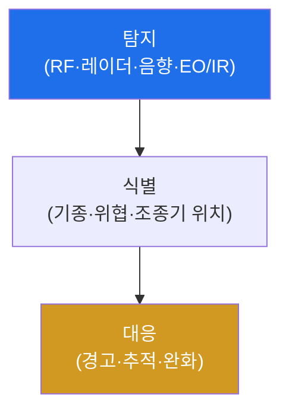

# autonomous-systems W04 — 드론 방어: 드론 탐지·RF 분석·지오펜싱

> **본 주차의 한 줄 요약**
>
> W03이 드론 공격이었다면, 이번 주 W04는 두 방향의 방어를 다룬다: **(A) 무단 드론으로부터의 방어**(공항·시설에
> 침입하는 적 드론 대응)와 **(B) 내 드론의 하이재킹 방어**(W03 공격 차단). **(A) 카운터-드론(C-UAS)**: ① **탐지** —
> 무단 드론을 여러 수단으로 발견(RF 탐지·레이더·음향·EO/IR 카메라). 각 수단은 한계가 있어 **다중 센서 융합**으로
> 신뢰도를 높인다. ② **식별·분류** — RF 지문으로 드론 기종·조종기 위치를 파악하고 위협 수준을 평가. ③ **대응** —
> 경고·추적·완화(RF 재밍·격추 등, 단 능동 대응은 **법적 제약**이 크다). **(B) 내 드론 방어**: **지오펜싱**(GPS 기반
> 가상 울타리로 금지 구역 진입 차단)·**페일세이프**(링크 끊김 시 귀환)·**MAVLink 서명**(W03). 실습에서는 다중 센서
> 융합으로 탐지하고(마커 `DRONE_DETECTED`), RF로 식별·분류하며(마커 `RF_CLASSIFIED`), 지오펜싱을 강제한다(마커
> `GEOFENCE_ENFORCED`). 핵심은 드론 방어가 **탐지→식별→대응** 파이프라인이며 다중 센서와 지오펜싱이 기둥이라는
> 것이다. 단 대응(재밍 등)은 법·안전 제약이 크므로 신중해야 한다(실물 RF·센서 필요 → 개념·로직 학습).

---

## 학습 목표

본 주차 종료 시 학생은 다음 5가지를 **본인 손으로** 할 수 있어야 한다.

1. 카운터-드론 **탐지→식별→대응** 파이프라인을 설명한다.
2. **다중 센서 융합**으로 드론을 탐지한다(마커 `DRONE_DETECTED`).
3. **RF 분석**으로 드론을 식별·분류한다(마커 `RF_CLASSIFIED`).
4. **지오펜싱**을 강제한다(마커 `GEOFENCE_ENFORCED`).
5. 대응(재밍)의 법적 제약과 지오펜싱의 한계를 종합한다(마커 `Assessment`).

> **이 주차의 시선** — 무단 드론과 하이재킹을 탐지·식별·지오펜싱으로 막되, 능동 대응의 법적 경계를 반드시 고려한다.

---

## 0. 용어 해설 (드론 방어)

| 용어 | 영문 | 뜻 | 비유 |
|------|------|----|------|
| **C-UAS** | Counter-UAS | 무단 드론에 대응하는 카운터-드론 체계 | 드론 방공 |
| **RF 탐지** | RF Detection | 드론-조종기 통신 신호를 포착 | 전파 감지 |
| **센서 융합** | Sensor Fusion | 여러 센서 결과를 결합해 신뢰도↑ | 종합 판단 |
| **RF 지문** | RF Fingerprint | 신호 특성으로 드론 기종 식별 | 목소리로 사람 식별 |
| **지오펜싱** | Geofencing | GPS 기반 가상 울타리(진입 금지 구역) | 출입 금지 경계 |
| **재밍** | Jamming | 전파 방해로 통신·항법 차단 | 신호 방해 |
| **RTL** | Return to Launch | 페일세이프 자동 귀환 | 자동 귀소 |

> **헷갈리기 쉬운 한 쌍 — 탐지 vs 대응.** *탐지·식별*은 "드론이 있음을 알고 분류"하는 것으로 비교적 자유롭다.
> *대응*은 "막음(재밍·격추)"으로 법적 권한이 있는 기관만 가능하다(재밍은 대개 불법). 방어 설계 시 이 경계가 결정적이다.

---

## 0.5 신입생 친화 핵심 개념

### 0.5.1 탐지→식별→대응 파이프라인

무단 드론을 여러 센서로 탐지 → RF로 식별 → 위협에 대응. 각 단계가 다르며, 대응은 법·안전 제약을 고려한다.

### 0.5.2 다중 센서 융합

각 탐지 수단은 한계가 있다: RF는 자율(무통신) 드론을 못 잡고, 음향은 소음 환경에 약하고, 레이더는 새와 혼동하며,
카메라는 야간·차폐에 약하다. **여러 센서를 융합**하면 서로의 약점을 메워 신뢰도가 오른다(오탐↓·미탐↓). 2개 이상
센서가 일치하면 고신뢰 탐지다.

### 0.5.3 RF 분석·식별

드론-조종기 통신의 **RF 지문**(주파수 호핑 패턴·프로토콜·신호 특성)으로 기종을 식별하고, 신호 방향으로 조종기 위치를
추정한다. 알려진 드론 RF 시그니처 DB와 대조한다. 식별은 위협 수준 평가(허가 드론 vs 무단)와 대응 결정의 근거다.

### 0.5.4 지오펜싱·내 드론 방어

- **지오펜싱**: GPS 기반 가상 울타리로 드론을 금지 구역(공항·국경) 밖에 묶는다(제조사·규제 강제). 단 GPS
  스푸핑(W05)으로 우회될 수 있어 완전하지 않다.
- **페일세이프·서명**: 내 드론은 링크 끊김 시 귀환(RTL), MAVLink 서명으로 하이재킹 방어(W03).

### 0.5.5 대응의 법적 제약

무단 드론 대응(재밍·GPS 스푸핑·격추)은 전파법·항공법상 엄격히 제한된다(재밍은 대개 불법, 격추는 위험). 탐지·식별은
비교적 자유롭지만, 능동 대응은 법적 권한이 있는 기관만 가능하다. 방어 설계 시 이 경계를 반드시 고려한다.

### 0.5.6 el34 맥락

RF·센서는 실물이 필요하다. 이번 실습은 **센서 융합 탐지·RF 분류·지오펜싱 로직**을 결정론 시뮬로 익힌다(실제 탐지·
대응은 실물 장비·법적 인가 필요).

---

## 1. 드론 방어 상세 — 탐지·식별·지오펜싱

### 1.1 다중 센서 융합 탐지 (DRONE_DETECTED)

- **한 줄 정의**: 여러 센서 결과를 결합해 드론 존재를 고신뢰로 판정한다.
- **왜 중요한가**: 단일 센서는 약점이 있어 오탐·미탐이 많다. 융합이 신뢰도를 만든다.
- **el34 맥락에서 어떻게**: RF·음향·레이더 신호를 결합해 2개 이상 일치 시 탐지하면 `DRONE_DETECTED`.
- **한계/주의**: 자율(무통신) 드론은 RF로 못 잡으므로 레이더·광학이 필요하다.

### 1.2 RF 분석·식별 (RF_CLASSIFIED)

- **한 줄 정의**: RF 지문으로 기종·조종기 위치·위협 수준을 식별한다.
- **핵심**: 시그니처 DB 대조, 방향 탐지로 조종기 위치 추정, 허가/무단 분류.
- **판정**: RF로 드론이 식별·분류되면 `RF_CLASSIFIED`.

### 1.3 지오펜싱 강제 (GEOFENCE_ENFORCED)

- **한 줄 정의**: 금지 구역 경계를 GPS 기반으로 강제한다.
- **핵심**: 구역 진입 시 차단·귀환. GPS 스푸핑 우회 가능성을 함께 인지.
- **판정**: 지오펜스가 진입을 막으면 `GEOFENCE_ENFORCED`.

---

## 2. 실습 안내 (총 5 미션)

실행 위치는 el34 **호스트**(`ssh ccc@{{TARGET_IP}}`, 비밀번호 `1`), 참고 GPU는 Ollama
(`http://211.170.162.139:10934`, gemma3:4b)다. ⚠️ RF·센서·대응은 실물·법적 인가가 필요해 탐지·분류·지오펜싱 로직을
결정론 시뮬로 익힌다. 각 미션의 마지막 줄 마커가 채점 기준이다.

### 미션 1 — GPU 헬스체크 → `GEN_OK`

> **왜 하는가?** 분석·종합에 쓸 LLM 도달·응답 확인.
> **무엇을 아는가?** Ollama 응답 형식·도달성.
> **결과 해석** — 정상 `GEN_OK` / 비정상 `GEN_EMPTY`·연결 오류.
> **실전 활용** — 종합 소견 작성에 사용.

### 미션 2 — 다중 센서 융합 탐지 → `DRONE_DETECTED`

> **왜 하는가?** 단일 센서 약점을 융합으로 메워 고신뢰 탐지한다.
> **무엇을 아는가?** RF·음향·레이더 결합·일치 판정.
> **결과 해석** — 정상: 탐지 + `DRONE_DETECTED`.
> **실전 활용** — C-UAS 탐지 체계 설계.

### 미션 3 — RF 분석·식별 → `RF_CLASSIFIED`

> **왜 하는가?** 위협 수준·대응 결정의 근거인 식별을 한다.
> **무엇을 아는가?** RF 지문·시그니처 대조·조종기 위치.
> **결과 해석** — 정상: 식별 + `RF_CLASSIFIED`.
> **실전 활용** — 드론 기종 식별·위협 평가.

### 미션 4 — 지오펜싱 강제 → `GEOFENCE_ENFORCED`

> **왜 하는가?** 금지 구역 진입을 원천 차단한다.
> **무엇을 아는가?** GPS 기반 경계·진입 차단·귀환.
> **결과 해석** — 정상: 강제 + `GEOFENCE_ENFORCED`.
> **실전 활용** — 공항·시설 드론 방어.

### 미션 5 — 종합 소견 → `Assessment`

> **왜 하는가?** 탐지·식별·지오펜싱과 "대응의 법적 제약·지오펜싱 한계"를 소견으로 묶는다.
> **무엇을 아는가?** GPU에 요약시키되 첫 줄을 `Assessment`로 강제.
> **결과 해석** — 정상: `Assessment` 포함. 없으면 `[형식 미준수 — 재실행]`.
> **실전 활용** — 드론 방어 체계 개요.

---

## 2.5 과제 (제출물)

- **A. 다중 센서 융합 탐지 실증 (필수, 40점)** — `DRONE_DETECTED` 단계를 직접 수행해 실제 명령·출력(또는 아티팩트 분석 결과)을 캡처하고, 무엇을 근거로 판정했는지 서술한다.
- **B. RF 분석·식별 분석 (필수, 30점)** — `RF_CLASSIFIED` 단계를 직접 수행해 실제 명령·출력(또는 아티팩트 분석 결과)을 캡처하고, 무엇을 근거로 판정했는지 서술한다.
- **C. 지오펜싱 강제 방어 설계 (필수, 30점)** — `GEOFENCE_ENFORCED` 단계를 직접 수행해 실제 명령·출력(또는 아티팩트 분석 결과)을 캡처하고, 무엇을 근거로 판정했는지 서술한다.

## 2.6 평가 기준

| 항목 | 미흡(0) | 보통 | 우수 |
|------|---------|------|------|
| 탐지/실증(DRONE_DETECTED) | 미수행 | 마커 도출 | 근거·해석·재현까지 |
| 분석(RF_CLASSIFIED) | 미수행 | 마커 도출 | 근거·해석·재현까지 |
| 방어(GEOFENCE_ENFORCED) | 미수행 | 마커 도출 | 근거·해석·재현까지 |

## 2.7 핵심 정리 (1줄씩)

- 이번 주 주제: **드론 방어: 드론 탐지·RF 분석·지오펜싱**.
- **다중 센서 융합 탐지**(`DRONE_DETECTED`): 여러 센서 결과를 결합해 드론 존재를 고신뢰로 판정한다.
- **RF 분석·식별**(`RF_CLASSIFIED`): RF 지문으로 기종·조종기 위치·위협 수준을 식별한다.
- **지오펜싱 강제**(`GEOFENCE_ENFORCED`): 금지 구역 경계를 GPS 기반으로 강제한다.
- 공격을 이해한 만큼 **방어의 우선순위**가 분명해진다 — 탐지 근거와 완화를 함께 익힌다.

---

## 3. 흔한 오해·관제자 노트

- **"한 센서로 충분하다."** — 각 센서는 한계가 있다. 다중 융합으로 신뢰도를 만든다.
- **"드론 보면 재밍하면 된다."** — 재밍은 대개 불법이다. 탐지·식별 우선, 대응은 법적 권한 기관만.
- **"지오펜싱이면 안전하다."** — GPS 스푸핑으로 우회된다. 완전하지 않다.
- **"자율 드론도 RF로 잡힌다."** — 무통신 드론은 RF로 못 잡는다. 레이더·광학이 필요하다.
- **관제(Blue) 관점** — (1) 다중 센서·RF 분석 탐지가 있는가, (2) 지오펜싱·페일세이프가 있는가, (3) 대응이 법적 경계
  안인가, (4) GPS 스푸핑 대비(이상 탐지)가 있는가를 점검한다.

---

## 4. 다음 주차 (W05) 예고 — GPS 보안

W04가 "드론 방어"였다면, W05는 **GPS 보안**을 다룬다. GPS 스푸핑(위치 속이기)·안티스푸핑·대체 항법을 익힌다 —
드론·자율주행 모두 GPS에 의존해 스푸핑이 큰 위협이다.
