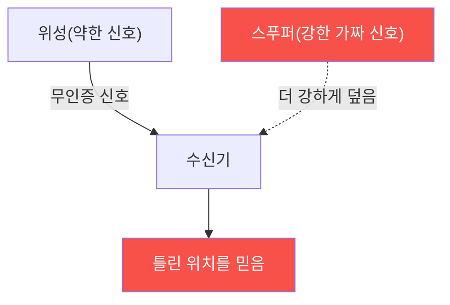

# autonomous-systems W05 — GPS 보안: GPS 스푸핑·안티스푸핑·대체 항법

> **본 주차의 한 줄 요약**
>
> 거의 모든 자율 시스템(드론·자율주행차·선박)은 위치·항법에 **GPS(GNSS)** 에 의존한다. 그런데 GPS는 치명적
> 약점이 있다: **신호가 극도로 약하고(지구 반대편 위성에서 옴), 인증이 없다**(민간 GPS는 서명이 없어 위조 가능).
> 그래서 두 공격이 가능하다: ① **재밍(jamming)** — 강한 잡음으로 GPS 신호를 덮어 **위치 상실**(드론이 GPS를
> 잃음), ② **스푸핑(spoofing)** — 진짜보다 강한 **가짜 GPS 신호**를 방송해 수신기가 **틀린 위치**를 믿게 함. 스푸핑이
> 더 위험하다 — 시스템은 속은 줄 모르고 잘못된 위치로 이동한다(2011년 이란이 미군 드론을 GPS 스푸핑으로 유도·
> 포획했다는 주장, 선박을 항로 이탈시키는 사례). 자율주행차는 잘못된 위치로, 드론은 지오펜싱(W04)을 우회해 금지
> 구역으로 유도될 수 있다. 방어: **안티스푸핑** — ① **신호 무결성 검사**(신호 강도 급변·도착각·시각 불일치 탐지),
> ② **다중 위성군(GPS+GLONASS+Galileo)** 교차 검증, ③ **암호화 신호**(군용 M-code·Galileo OSNMA 인증), ④ **대체
> 항법(alternative navigation)** — GPS를 잃거나 의심될 때 **관성항법(INS)·시각 항법(visual odometry)·지도 매칭**
> 으로 전환. 핵심: GPS를 **맹신하지 말고**, 이상을 탐지하고 대체 수단으로 회복한다.
>
> **한 줄 결론**: GPS는 약하고 무인증이라 **재밍(위치 상실)·스푸핑(위치 위조)** 에 취약하다. 방어 = **신호 무결성
> 검사 + 다중 위성군 + 암호화 신호 + 대체 항법(INS·시각)**. GPS를 맹신하지 않는다.

---

## 학습 목표

본 주차 종료 시 학생은 다음 5가지를 **본인 손으로** 할 수 있어야 한다.

1. GPS **재밍·스푸핑**의 원리와 위험을 설명한다.
2. **GPS 스푸핑을 탐지**한다(SPOOF_DETECTED).
3. **안티스푸핑** 기법을 적용한다(ANTISPOOF_APPLIED).
4. **대체 항법**으로 전환한다(ALT_NAV_ENGAGED).
5. 왜 스푸핑이 재밍보다 위험한지 설명한다.

> **이 주차의 시선** — 무인증 GPS의 스푸핑 위협을, 탐지·다중 검증·대체 항법으로 막는다.

---

## 0. 용어 해설 (GPS 보안)

| 용어 | 영문 | 뜻 | 비유 |
|------|------|----|------|
| **재밍** | Jamming | 신호 방해 | 소음으로 덮기 |
| **스푸핑** | Spoofing | 가짜 신호 | 위조 신호 |
| **GNSS** | — | 위성 항법 전체 | GPS 계열 |
| **INS** | Inertial Navigation | 관성 항법 | 자체 추측 항법 |
| **OSNMA** | — | Galileo 신호 인증 | 신호 서명 |

> **헷갈리기 쉬운 한 쌍** — *재밍* 은 "위치 상실(알아챔)", *스푸핑* 은 "위치 위조(못 알아챔)"다. 스푸핑이 더
> 위험 — 속은 줄 모른다.

---

## 0.5 신입생 친화 핵심 개념

### 0.5.1 왜 GPS가 취약한가

GPS 신호는 매우 약하고 민간 신호는 인증이 없다. 공격자가 **더 강한 가짜 신호**를 방송하면 수신기가 속아 틀린
위치를 계산한다.

### 0.5.2 스푸핑이 더 위험한 이유

- **재밍**: 신호를 덮어 **위치를 잃음**. 시스템이 GPS 상실을 **알아채고** 페일세이프 가능.
- **스푸핑**: **가짜 위치를 믿음**. 시스템이 속은 줄 **모르고** 잘못된 곳으로 이동. 은밀하고 조작 가능.
스푸핑은 드론을 유도(포획)하거나 자율주행을 오도한다. 그래서 탐지가 핵심.

### 0.5.3 스푸핑 탐지 신호

- **신호 강도 급변**: 스푸퍼는 진짜보다 강해야 해서 신호 강도가 비정상적으로 높거나 급변.
- **위치 점프**: 물리적으로 불가능한 위치 급변(순간이동).
- **불일치**: GPS 위치가 관성항법(INS)·속도·지도와 어긋남.
- **도착각·시각 이상**: 모든 신호가 한 방향(스푸퍼)에서 옴, 시각 불일치.

### 0.5.4 안티스푸핑·대체 항법

- **다중 위성군**: GPS+GLONASS+Galileo+BeiDou 교차 검증(모두 속이기 어려움).
- **암호화·인증 신호**: 군용 M-code, Galileo **OSNMA**(신호 서명)로 진위 검증.
- **센서 융합·정합성**: GPS를 INS·속도계·지도와 **교차 검증**, 어긋나면 GPS 불신.
- **대체 항법**: GPS를 잃거나 의심되면 **INS(관성)·시각 오도메트리·지형 매칭**으로 전환해 계속 항법.
핵심 원칙: GPS를 단일 진실로 믿지 말고, 다중 검증·대체 수단을 둔다.

### 0.5.5 el34 맥락

GPS 스푸핑 실행은 실물 SDR·법적 인가가 필요하다(무단 스푸핑은 불법·위험). 본 실습은 **스푸핑 탐지·안티스푸핑·
대체 항법 로직**을 결정론 시뮬로 익힌다.

---

## 1. 실습 안내 (5 미션)

실행 위치 el34 **호스트**(`ssh ccc@{{TARGET_IP}}`), GPU `http://211.170.162.139:10934`.
⚠️ GPS 스푸핑은 실물·법적 인가 필요 → 본 실습은 탐지·안티스푸핑·항법 로직 결정론 시뮬.

### STEP 1 — GPU 헬스체크 → GEN_OK
### STEP 2 — GPS 스푸핑 탐지 → SPOOF_DETECTED
### STEP 3 — 안티스푸핑 적용 → ANTISPOOF_APPLIED
### STEP 4 — 대체 항법 전환 → ALT_NAV_ENGAGED
### STEP 5 — 종합 → Assessment

---

## 2. 흔한 오해·관제자 노트

- **"GPS는 믿을 수 있다"** — 무인증·약한 신호. 스푸핑에 취약.
- **"재밍만 걱정"** — 스푸핑이 더 위험(못 알아챔). 탐지 필수.
- **"GPS만 있으면 항법"** — 대체 항법(INS·시각) 필수. 단일 의존 금지.
- **관제 관점** — 자율 시스템이 GPS 스푸핑을 탐지(다중 검증)하는지, 대체 항법이 있는지 점검한다. GPS 맹신은
  위험 — 다중 검증·대체 수단.

---

## 3. 다음 주차 (W06) 예고 — 자율주행 기초

W05가 "GPS 보안"이었다면, W06은 **자율주행 기초** — AI 인식 모델·센서 퓨전(카메라·라이다·레이더)·의사결정 등
자율주행차의 구조를 다뤄, W07 공격의 토대를 세운다.
