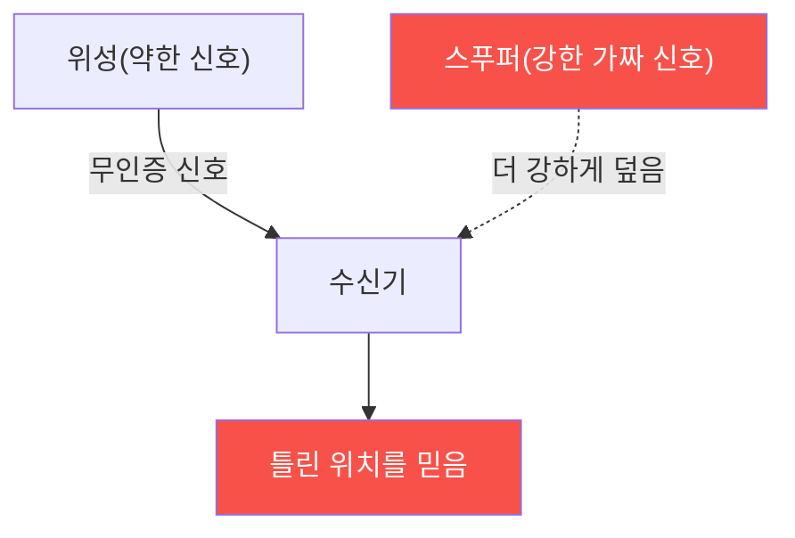

# autonomous-systems W05 — GPS 보안: GPS 스푸핑·안티스푸핑·대체 항법

> **본 주차의 한 줄 요약**
>
> 거의 모든 자율 시스템(드론·자율주행차·선박)은 위치·항법에 **GPS(GNSS)**에 의존한다. 그런데 GPS는 치명적 약점이
> 있다: **신호가 극도로 약하고(지구 반대편 위성에서 옴), 인증이 없다**(민간 GPS는 서명이 없어 위조 가능). 그래서 두
> 공격이 가능하다: ① **재밍(jamming)** — 강한 잡음으로 GPS 신호를 덮어 **위치 상실**(드론이 GPS를 잃음), ②
> **스푸핑(spoofing)** — 진짜보다 강한 **가짜 GPS 신호**를 방송해 수신기가 **틀린 위치**를 믿게 함. 스푸핑이 더
> 위험하다 — 시스템은 속은 줄 모르고 잘못된 위치로 이동한다(미군 드론 유도·선박 항로 이탈 사례). 자율주행차는 잘못된
> 위치로, 드론은 지오펜싱(W04)을 우회해 금지 구역으로 유도될 수 있다. 방어는 **안티스푸핑**이다: ① 신호 무결성 검사
> (신호 강도 급변·도착각·시각 불일치 탐지), ② 다중 위성군(GPS+GLONASS+Galileo) 교차 검증, ③ 암호화 신호(군용
> M-code·Galileo OSNMA 인증), ④ **대체 항법**(GPS를 잃거나 의심될 때 관성항법 INS·시각 항법·지도 매칭으로 전환).
> 실습에서는 스푸핑을 탐지하고(마커 `SPOOF_DETECTED`), 안티스푸핑을 적용하며(마커 `ANTISPOOF_APPLIED`), 대체 항법으로
> 전환한다(마커 `ALT_NAV_ENGAGED`). 핵심은 GPS를 **맹신하지 말고** 이상을 탐지하고 대체 수단으로 회복하는 것이다.

---

## 학습 목표

본 주차 종료 시 학생은 다음 5가지를 **본인 손으로** 할 수 있어야 한다.

1. GPS 재밍·스푸핑의 원리와 위험을 설명한다.
2. **GPS 스푸핑을 탐지**한다(마커 `SPOOF_DETECTED`).
3. **안티스푸핑** 기법(다중 위성군·무결성 검사)을 적용한다(마커 `ANTISPOOF_APPLIED`).
4. **대체 항법**(INS·시각)으로 전환한다(마커 `ALT_NAV_ENGAGED`).
5. 왜 스푸핑이 재밍보다 위험한지, 왜 GPS 단일 의존이 위험한지 종합한다(마커 `Assessment`).

> **이 주차의 시선** — 무인증 GPS의 스푸핑 위협을 탐지·다중 검증·대체 항법으로 막는다. "GPS를 단일 진실로 믿지
> 않는다"가 핵심이다.

---

## 0. 용어 해설 (GPS 보안)

| 용어 | 영문 | 뜻 | 비유 |
|------|------|----|------|
| **GNSS** | Global Navigation Satellite System | GPS·GLONASS·Galileo·BeiDou 위성 항법 총칭 | 위성 항법 계열 |
| **재밍** | Jamming | 강한 잡음으로 GPS 신호를 덮어 위치 상실 | 소음으로 덮기 |
| **스푸핑** | Spoofing | 가짜 GPS 신호로 틀린 위치를 믿게 함 | 위조 신호 |
| **INS** | Inertial Navigation System | 가속도·자이로로 위치를 추측하는 자체 항법 | 눈 감고 걸음 세기 |
| **시각 오도메트리** | Visual Odometry | 카메라 영상으로 이동을 추정 | 풍경 보고 이동 추정 |
| **OSNMA** | Open Service Navigation Message Authentication | Galileo 신호 인증(서명) | 신호 인감 |
| **센서 융합** | Sensor Fusion | GPS를 INS·속도·지도와 교차 검증 | 여러 증거 대조 |

> **헷갈리기 쉬운 한 쌍 — 재밍 vs 스푸핑.** *재밍*은 위치를 잃게 한다(시스템이 상실을 **알아챔** → 페일세이프 가능).
> *스푸핑*은 틀린 위치를 믿게 한다(시스템이 속은 줄 **모름** → 잘못된 곳으로 이동). 스푸핑이 은밀해 더 위험하다.

---

## 0.5 신입생 친화 핵심 개념

### 0.5.1 왜 GPS가 취약한가

GPS 신호는 매우 약하고 민간 신호는 인증이 없다. 공격자가 더 강한 가짜 신호를 방송하면 수신기가 속아 틀린 위치를
계산한다.

### 0.5.2 스푸핑이 더 위험한 이유

- **재밍**: 신호를 덮어 위치를 잃음. 시스템이 GPS 상실을 알아채고 페일세이프 가능.
- **스푸핑**: 가짜 위치를 믿음. 시스템이 속은 줄 모르고 잘못된 곳으로 이동. 은밀하고 조작 가능.

스푸핑은 드론을 유도(포획)하거나 자율주행을 오도한다. 그래서 탐지가 핵심이다.

### 0.5.3 스푸핑 탐지 신호

- **신호 강도 급변**: 스푸퍼는 진짜보다 강해야 해서 신호 강도가 비정상적으로 높거나 급변.
- **위치 점프**: 물리적으로 불가능한 위치 급변(순간이동).
- **불일치**: GPS 위치가 관성항법(INS)·속도·지도와 어긋남.
- **도착각·시각 이상**: 모든 신호가 한 방향(스푸퍼)에서 옴, 시각 불일치.

### 0.5.4 안티스푸핑·대체 항법

- **다중 위성군**: GPS+GLONASS+Galileo+BeiDou 교차 검증(모두 속이기 어려움).
- **암호화·인증 신호**: 군용 M-code, Galileo OSNMA(신호 서명)로 진위 검증.
- **센서 융합·정합성**: GPS를 INS·속도계·지도와 교차 검증, 어긋나면 GPS 불신.
- **대체 항법**: GPS를 잃거나 의심되면 INS(관성)·시각 오도메트리·지형 매칭으로 전환해 계속 항법.

핵심 원칙: GPS를 단일 진실로 믿지 말고, 다중 검증·대체 수단을 둔다.

### 0.5.5 el34 맥락

GPS 스푸핑 실행은 실물 SDR·법적 인가가 필요하다(무단 스푸핑은 불법·위험). 이번 실습은 **스푸핑 탐지·안티스푸핑·대체
항법 로직**을 el34에서 실제 아티팩트(설정·캡처·로그)를 만들어 strings·grep·awk 로 분석한다.

---

## 1. GPS 보안 상세 — 탐지·안티스푸핑·대체 항법

### 1.1 스푸핑 탐지 (SPOOF_DETECTED)

- **한 줄 정의**: 신호·위치 이상으로 GPS 스푸핑을 식별한다.
- **왜 중요한가**: 스푸핑은 은밀해서 탐지가 방어의 시작이다.
- **el34 맥락에서 어떻게**: 신호 강도 급변·위치 점프·INS 불일치를 탐지하면 `SPOOF_DETECTED`.
- **한계/주의**: 정교한 스푸퍼는 점진적으로 위치를 끌어 탐지를 피한다 → 다중 지표 필요.

### 1.2 안티스푸핑 적용 (ANTISPOOF_APPLIED)

- **한 줄 정의**: 다중 위성군·인증 신호·센서 정합으로 진위를 검증한다.
- **핵심**: GPS+GLONASS+Galileo 교차, OSNMA 인증, INS/지도 정합.
- **판정**: 안티스푸핑으로 위조를 걸러내면 `ANTISPOOF_APPLIED`.

### 1.3 대체 항법 전환 (ALT_NAV_ENGAGED)

- **한 줄 정의**: GPS 상실·의심 시 INS·시각으로 전환해 항법을 유지한다.
- **핵심**: GPS 불신 판정 → INS/시각 오도메트리/지형 매칭으로 폴백.
- **판정**: 대체 항법으로 계속 항법하면 `ALT_NAV_ENGAGED`.

---

## 2. 실습 안내 (총 5 미션)

실행 위치는 el34 **호스트**(`ssh ccc@{{TARGET_IP}}`, 비밀번호 `1`), 참고 GPU는 Ollama
(`http://211.170.162.139:10934`, gemma3:4b)다. ⚠️ GPS 스푸핑은 실물·법적 인가가 필요해 탐지·안티스푸핑·항법 로직을
el34에서 실제 아티팩트(설정·캡처·로그)를 만들어 strings·grep·awk 로 분석한다. 각 미션의 마지막 줄 마커가 채점 기준이다.

### 미션 1 — GPU 헬스체크 → `GEN_OK`

> **왜 하는가?** 분석·종합에 쓸 LLM 도달·응답 확인.
> **무엇을 아는가?** Ollama 응답 형식·도달성.
> **결과 해석** — 정상 `GEN_OK` / 비정상 `GEN_EMPTY`·연결 오류.
> **실전 활용** — 종합 소견 작성에 사용.

### 미션 2 — GPS 스푸핑 탐지 → `SPOOF_DETECTED`

> **왜 하는가?** 은밀한 스푸핑을 이상 신호로 잡는다.
> **무엇을 아는가?** 신호 강도·위치 점프·INS 불일치.
> **결과 해석** — 정상: 탐지 + `SPOOF_DETECTED`.
> **실전 활용** — GPS 이상 탐지 설계.

### 미션 3 — 안티스푸핑 적용 → `ANTISPOOF_APPLIED`

> **왜 하는가?** 위조 신호를 진위 검증으로 걸러낸다.
> **무엇을 아는가?** 다중 위성군·OSNMA·센서 정합.
> **결과 해석** — 정상: 적용 + `ANTISPOOF_APPLIED`.
> **실전 활용** — 항법 무결성 강화.

### 미션 4 — 대체 항법 전환 → `ALT_NAV_ENGAGED`

> **왜 하는가?** GPS를 잃어도 항법을 유지한다.
> **무엇을 아는가?** INS·시각·지형 매칭 폴백.
> **결과 해석** — 정상: 전환 + `ALT_NAV_ENGAGED`.
> **실전 활용** — GPS-거부 환경 항법.

### 미션 5 — 종합 소견 → `Assessment`

> **왜 하는가?** 탐지·안티스푸핑·대체 항법과 "GPS 맹신 금지"를 소견으로 묶는다.
> **무엇을 아는가?** GPU에 요약시키되 첫 줄을 `Assessment`로 강제.
> **결과 해석** — 정상: `Assessment` 포함. 없으면 `[형식 미준수 — 재실행]`.
> **실전 활용** — 항법 보안 개요.

---

## 3. 흔한 오해·관제자 노트

- **"GPS는 믿을 수 있다."** — 무인증·약한 신호로 스푸핑에 취약하다.
- **"재밍만 걱정하면 된다."** — 스푸핑이 더 위험하다(못 알아챔). 탐지가 필수.
- **"GPS만 있으면 항법이 된다."** — 대체 항법(INS·시각)이 필수다. 단일 의존은 금지.
- **"스푸핑은 위치를 크게 바꾼다."** — 정교한 스푸퍼는 점진적으로 끌어 탐지를 피한다. 다중 지표가 필요하다.
- **관제(Blue) 관점** — 자율 시스템이 (1) 스푸핑 이상을 탐지하는가, (2) 다중 위성군·인증 신호를 쓰는가, (3) GPS를
  INS·지도와 교차 검증하는가, (4) 대체 항법 폴백이 있는가를 점검한다.

---

## 4. 다음 주차 (W06) 예고 — 자율주행 기초

W05가 "GPS 보안"이었다면, W06은 **자율주행 기초**를 다룬다. AI 인식 모델·센서 퓨전(카메라·라이다·레이더)·의사결정 등
자율주행차의 구조를 익혀 W07 공격의 토대를 세운다.
