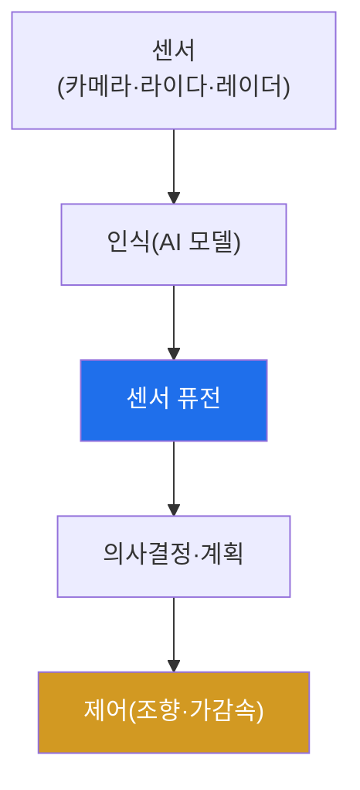

# autonomous-systems W06 — 자율주행 기초: AI 인식 모델·센서 퓨전·의사결정

> **본 주차의 한 줄 요약**
>
> 자율주행차(AV)는 가장 복잡한 CPS다. 보안을 이해하려면 **어떻게 인식·판단·주행하는지** 알아야 한다. 자율주행
> 파이프라인은 넷이다: ① **인식(perception)** — 여러 센서로 세계를 본다(카메라: 신호등·표지·차선·물체 분류 AI 비전
> 모델, 라이다: 3D 거리·형상, 레이더: 속도·악천후, 초음파: 근거리). 각 센서는 강약점이 다르다. ② **센서 퓨전** —
> 여러 센서를 결합해 각 한계를 보완하고 신뢰도 높은 세계 모델을 만든다. 핵심은 **중복성(redundancy)** — 한 센서가
> 속거나 고장나도 다른 센서가 보완한다. ③ **의사결정·계획** — 인식 결과로 경로·속도를 계획. ④ **제어** — 조향·가감속
> 실행. 보안 관점의 핵심은 자율주행이 **AI 모델과 센서에 판단을 의존**하므로, AI 모델을 속이거나(적대적 입력,
> W07·W13) 센서를 스푸핑하면 잘못된 인식→잘못된 판단→사고로 이어진다는 것이다. 그리고 OTA 업데이트가 대규모 차량에
> 배포돼 **공급망·업데이트 무결성**도 중요하다. 실습에서는 센서 퓨전과 역할을 매핑하고(마커 `FUSION_MAPPED`), 인식
> 공격 표면을 식별하며(마커 `SURFACE_IDENTIFIED`), 센서 중복성의 안전 기여를 평가한다(마커 `REDUNDANCY_ASSESSED`).
> 방어의 핵심 개념은 **센서 중복성과 정합성 검사**다(한 센서를 못 믿어도 전체는 안전).

---

## 학습 목표

본 주차 종료 시 학생은 다음 5가지를 **본인 손으로** 할 수 있어야 한다.

1. 자율주행 파이프라인(인식·퓨전·판단·제어)을 설명한다.
2. **센서 퓨전과 각 센서의 역할·중복성**을 매핑한다(마커 `FUSION_MAPPED`).
3. 인식 파이프라인의 **공격 표면**을 식별한다(마커 `SURFACE_IDENTIFIED`).
4. **센서 중복성**의 안전 기여를 평가한다(마커 `REDUNDANCY_ASSESSED`).
5. AI 모델·센서 의존이 왜 위험인지 종합한다(마커 `Assessment`).

> **이 주차의 시선** — 자율주행이 세계를 인식·판단하는 구조를 이해해, 공격(W07)·방어의 토대를 세운다. "무엇이 판단을
> 좌우하는가"를 알아야 어디를 지킬지 안다.

---

## 0. 용어 해설 (자율주행)

| 용어 | 영문 | 뜻 | 비유 |
|------|------|----|------|
| **인식** | Perception | 센서로 세계(물체·차선·신호)를 파악 | 보기 |
| **센서 퓨전** | Sensor Fusion | 여러 센서를 결합해 세계 모델 생성 | 종합 감각 |
| **LiDAR** | Light Detection and Ranging | 레이저로 3D 거리·형상 측정 | 3D 눈 |
| **중복성** | Redundancy | 이중·다중화로 한 센서 실패 보완 | 예비 감각 |
| **정합성 검사** | Consistency Check | 센서 간 결과 불일치를 탐지 | 증언 대조 |
| **적대적 입력** | Adversarial Input | AI가 오분류하도록 조작한 입력(패치·스티커) | 착시 유발 |
| **OTA** | Over-the-Air | 무선 소프트웨어 업데이트 | 원격 패치 |

> **헷갈리기 쉬운 한 쌍 — 단일 센서 vs 센서 퓨전(중복).** *단일 센서*는 하나가 속으면 곧 오판이다. *센서 퓨전*은
> 다른 센서가 보완하고 정합성 검사로 불일치를 잡아 안전하다. 중복성이 CPS 안전의 핵심이다.

---

## 0.5 신입생 친화 핵심 개념

### 0.5.1 자율주행 파이프라인

센서 → AI 인식 → 퓨전 → 판단 → 제어. 각 단계가 공격 표면이며, 특히 **인식(AI·센서)**이 속으면 전체가 오판한다.

### 0.5.2 센서별 역할과 강약점

| 센서 | 강점 | 약점 |
|------|------|------|
| **카메라** | 분류(표지·신호·차선) | 거리·악천후·저조도·적대적 패치 |
| **LiDAR** | 정확한 3D 거리·형상 | 악천후·비용·스푸핑 |
| **레이더** | 속도·악천후에 강함 | 해상도 낮음 |

각 센서가 서로의 약점을 메운다. 그래서 퓨전이 필요하다.

### 0.5.3 센서 퓨전과 중복성

퓨전은 여러 센서를 결합해 신뢰도 높은 세계 모델을 만든다. 핵심은 **중복성** — 한 센서가 속거나(스푸핑) 고장나도
다른 센서가 보완한다. 예: 카메라가 적대적 패치에 속아도 라이다가 실제 물체를 보면 정합성 검사로 불일치를 잡는다.
중복성이 CPS 안전의 기둥이다.

### 0.5.4 공격 표면 — AI와 센서

- **AI 인식 모델**: 적대적 입력(패치·스티커)으로 오분류 유도(W07·W13) — "정지"를 "속도 제한"으로.
- **센서 스푸핑**: 라이다에 가짜 반사, 카메라에 투사, GPS 스푸핑(W05).
- **OTA/공급망**: 대규모 차량 SW 업데이트가 변조되면 전 차량 위협.
- **차량 내부망(CAN)**: W12에서 다룸.

자율주행은 판단을 AI·센서에 의존해 이들이 최대 표면이다.

### 0.5.5 el34 맥락

자율주행은 실물 차량·센서가 필요하다. 이번 실습은 **센서 퓨전·공격 표면·중복성 로직**을 결정론 시뮬로 익히고, AI
모델 공격은 GPU 분석·W13에서 다룬다(실물 센서 공격은 하드웨어 필요).

---

## 1. 자율주행 상세 — 퓨전·표면·중복성

### 1.1 센서 퓨전·역할 매핑 (FUSION_MAPPED)

- **한 줄 정의**: 카메라·라이다·레이더의 역할과 결합 방식을 매핑한다.
- **왜 중요한가**: 각 센서의 강약점을 알아야 어떤 조합이 어떤 공격에 강한지 안다.
- **el34 맥락에서 어떻게**: 센서별 역할·약점·퓨전 결합을 정리하면 `FUSION_MAPPED`.
- **한계/주의**: 퓨전이 잘못 설계되면 한 센서 오류가 전체를 오염시킨다.

### 1.2 인식 공격 표면 식별 (SURFACE_IDENTIFIED)

- **한 줄 정의**: AI 모델·센서·OTA·내부망을 공격 표면으로 목록화한다.
- **핵심**: 적대적 입력·센서 스푸핑·OTA 변조·CAN 공격.
- **판정**: 인식 파이프라인 표면이 식별되면 `SURFACE_IDENTIFIED`.

### 1.3 센서 중복성 평가 (REDUNDANCY_ASSESSED)

- **한 줄 정의**: 한 센서가 속아도 다른 센서·정합성 검사가 잡는지 평가한다.
- **핵심**: 카메라 속임 → 라이다 정합성으로 탐지. 중복성이 안전에 기여하는 정도.
- **판정**: 중복성의 안전 기여가 평가되면 `REDUNDANCY_ASSESSED`.

---

## 2. 실습 안내 (총 5 미션)

실행 위치는 el34 **호스트**(`ssh ccc@{{TARGET_IP}}`, 비밀번호 `1`), 참고 GPU는 Ollama
(`http://211.170.162.139:10934`, gemma3:4b)다. ⚠️ 자율주행은 실물 차량·센서가 필요해 퓨전·표면·중복성 로직을 결정론
시뮬로 익힌다. 각 미션의 마지막 줄 마커가 채점 기준이다.

### 미션 1 — GPU 헬스체크 → `GEN_OK`

> **왜 하는가?** 분석·종합에 쓸 LLM 도달·응답 확인.
> **무엇을 아는가?** Ollama 응답 형식·도달성.
> **결과 해석** — 정상 `GEN_OK` / 비정상 `GEN_EMPTY`·연결 오류.
> **실전 활용** — 종합 소견 작성에 사용.

### 미션 2 — 센서 퓨전·역할 매핑 → `FUSION_MAPPED`

> **왜 하는가?** 센서 조합의 강약점을 파악한다.
> **무엇을 아는가?** 카메라·라이다·레이더 역할·약점·결합.
> **결과 해석** — 정상: 매핑 + `FUSION_MAPPED`.
> **실전 활용** — 자율주행 인식 아키텍처 이해.

### 미션 3 — 인식 공격 표면 식별 → `SURFACE_IDENTIFIED`

> **왜 하는가?** 어디를 공격·방어할지 표면을 목록화한다.
> **무엇을 아는가?** AI 모델·센서·OTA·CAN 표면.
> **결과 해석** — 정상: 식별 + `SURFACE_IDENTIFIED`.
> **실전 활용** — 자율주행 위협 모델링.

### 미션 4 — 센서 중복성 평가 → `REDUNDANCY_ASSESSED`

> **왜 하는가?** 한 센서가 속아도 안전한지 확인한다.
> **무엇을 아는가?** 정합성 검사·중복성의 안전 기여.
> **결과 해석** — 정상: 평가 + `REDUNDANCY_ASSESSED`.
> **실전 활용** — 안전 설계(중복성) 평가.

### 미션 5 — 종합 소견 → `Assessment`

> **왜 하는가?** 퓨전·표면·중복성과 "AI·센서 의존 위험"을 소견으로 묶는다.
> **무엇을 아는가?** GPU에 요약시키되 첫 줄을 `Assessment`로 강제.
> **결과 해석** — 정상: `Assessment` 포함. 없으면 `[형식 미준수 — 재실행]`.
> **실전 활용** — 자율주행 보안 개요.

---

## 2.5 과제 (제출물)

- **A. 센서 퓨전·역할 매핑 실증 (필수, 40점)** — `FUSION_MAPPED` 단계를 직접 수행해 실제 명령·출력(또는 아티팩트 분석 결과)을 캡처하고, 무엇을 근거로 판정했는지 서술한다.
- **B. 인식 공격 표면 식별 분석 (필수, 30점)** — `SURFACE_IDENTIFIED` 단계를 직접 수행해 실제 명령·출력(또는 아티팩트 분석 결과)을 캡처하고, 무엇을 근거로 판정했는지 서술한다.
- **C. 센서 중복성 평가 방어 설계 (필수, 30점)** — `REDUNDANCY_ASSESSED` 단계를 직접 수행해 실제 명령·출력(또는 아티팩트 분석 결과)을 캡처하고, 무엇을 근거로 판정했는지 서술한다.

## 2.6 평가 기준

| 항목 | 미흡(0) | 보통 | 우수 |
|------|---------|------|------|
| 탐지/실증(FUSION_MAPPED) | 미수행 | 마커 도출 | 근거·해석·재현까지 |
| 분석(SURFACE_IDENTIFIED) | 미수행 | 마커 도출 | 근거·해석·재현까지 |
| 방어(REDUNDANCY_ASSESSED) | 미수행 | 마커 도출 | 근거·해석·재현까지 |

## 2.7 핵심 정리 (1줄씩)

- 이번 주 주제: **자율주행 기초: AI 인식 모델·센서 퓨전·의사결정**.
- **센서 퓨전·역할 매핑**(`FUSION_MAPPED`): 카메라·라이다·레이더의 역할과 결합 방식을 매핑한다.
- **인식 공격 표면 식별**(`SURFACE_IDENTIFIED`): AI 모델·센서·OTA·내부망을 공격 표면으로 목록화한다.
- **센서 중복성 평가**(`REDUNDANCY_ASSESSED`): 한 센서가 속아도 다른 센서·정합성 검사가 잡는지 평가한다.
- 공격을 이해한 만큼 **방어의 우선순위**가 분명해진다 — 탐지 근거와 완화를 함께 익힌다.

---

## 3. 흔한 오해·블루팀 노트

- **"카메라만 있으면 된다."** — 카메라는 거리·악천후에 약하다. 라이다·레이더 퓨전이 필요하다.
- **"AI 인식은 정확하다."** — 적대적 입력에 속는다(W07). 중복성·정합성으로 보완한다.
- **"OTA는 편의 기능이다."** — 변조되면 전 차량 위협이다. 서명·무결성이 필수.
- **"센서 하나면 충분하다."** — 단일 센서는 속으면 오판이다. 중복성이 안전의 기둥.
- **관제(Blue) 관점** — 자율주행이 (1) 센서 중복성·정합성 검사를 갖췄는가, (2) AI 모델 방어(W13)가 있는가, (3) OTA
  서명·무결성이 있는가, (4) 판단을 단일 센서/모델에 의존하지 않는가를 점검한다.

---

## 4. 다음 주차 (W07) 예고 — 자율주행 공격

W06이 "자율주행 기초"였다면, W07은 **자율주행 공격**을 다룬다. 적대적 패치(표지판 오분류)·센서 스푸핑(라이다·카메라)·
OTA 변조 등 인식·업데이트 공격과 그 방어를 익힌다.
