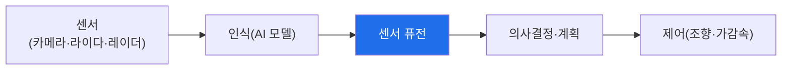

# autonomous-systems W06 — 자율주행 기초: AI 인식 모델·센서 퓨전·의사결정

> **본 주차의 한 줄 요약**
>
> 자율주행차(AV)는 가장 복잡한 CPS다. 보안을 이해하려면 **어떻게 인식·판단·주행하는지** 알아야 한다. 자율주행
> 파이프라인: ① **인식(perception)** — 여러 센서로 세계를 본다: **카메라**(신호등·표지·차선·물체 분류, AI 비전
> 모델), **라이다(LiDAR)**(3D 거리·형상), **레이더**(속도·악천후), **초음파**(근거리). 각 센서는 강약점이
> 다르다(카메라는 분류 강하나 거리 약함, 라이다는 거리 정확하나 악천후 약함), ② **센서 퓨전(sensor fusion)** —
> 여러 센서를 **결합**해 각 한계를 보완하고 신뢰도 높은 세계 모델을 만든다. 핵심은 **중복성(redundancy)** — 한
> 센서가 속거나 고장나도 다른 센서가 보완, ③ **의사결정·계획** — 인식 결과로 경로·속도를 계획(AI·규칙), ④ **제어** —
> 조향·가감속 실행. 보안 관점의 핵심: 자율주행은 **AI 모델과 센서에 판단을 의존**하므로, **AI 모델을 속이거나
> (적대적 입력, W07·W13) 센서를 스푸핑**하면 잘못된 인식→잘못된 판단→사고로 이어진다. 그리고 소프트웨어 업데이트
> (OTA)가 대규모 차량에 배포돼 **공급망·업데이트 무결성**도 중요하다. 이번 주는 자율주행 구조를 이해해 W07 공격의
> 토대를 세운다. 방어의 핵심 개념은 **센서 중복성과 정합성 검사**(한 센서를 못 믿어도 전체는 안전).
>
> **한 줄 결론**: 자율주행 = 인식(카메라·라이다·레이더)→**센서 퓨전(중복성)**→의사결정→제어. AI 모델·센서에
> 판단을 의존하므로, 이를 속이면 사고로 이어진다. 방어는 **센서 중복성·정합성 검사**다.

---

## 학습 목표

본 주차 종료 시 학생은 다음 5가지를 **본인 손으로** 할 수 있어야 한다.

1. 자율주행 **파이프라인**(인식·퓨전·판단·제어)을 설명한다.
2. **센서 퓨전과 각 센서의 역할·중복성**을 매핑한다(FUSION_MAPPED).
3. 인식 파이프라인의 **공격 표면**을 식별한다(SURFACE_IDENTIFIED).
4. **센서 중복성**의 안전 기여를 평가한다(REDUNDANCY_ASSESSED).
5. AI 모델·센서 의존이 왜 위험인지 설명한다.

> **이 주차의 시선** — 자율주행이 세계를 인식·판단하는 구조를 이해해, 공격·방어의 토대를 세운다.

---

## 0. 용어 해설 (자율주행)

| 용어 | 영문 | 뜻 | 비유 |
|------|------|----|------|
| **인식** | Perception | 센서로 세계 파악 | 보기 |
| **센서 퓨전** | Sensor Fusion | 센서 결합 | 종합 감각 |
| **LiDAR** | — | 레이저 거리 측정 | 3D 눈 |
| **중복성** | Redundancy | 이중·다중화 | 예비 감각 |
| **OTA** | Over-the-Air | 무선 SW 업데이트 | 원격 패치 |

> **헷갈리기 쉬운 한 쌍** — *단일 센서* 는 "하나가 속으면 오판", *센서 퓨전(중복)* 은 "다른 센서가 보완(안전)"
> 이다. 중복성이 안전의 핵심.

---

## 0.5 신입생 친화 핵심 개념

### 0.5.1 자율주행 파이프라인

센서→AI 인식→퓨전→판단→제어. 각 단계가 공격 표면이며, 특히 **인식(AI·센서)** 이 속으면 전체가 오판한다.

### 0.5.2 센서별 역할과 강약점

| 센서 | 강점 | 약점 |
|------|------|------|
| **카메라** | 분류(표지·신호·차선) | 거리·악천후·저조도·적대적 패치 |
| **LiDAR** | 정확한 3D 거리·형상 | 악천후·비용·스푸핑 |
| **레이더** | 속도·악천후 강함 | 해상도 낮음 |
각 센서가 서로의 약점을 메운다. 그래서 퓨전이 필요.

### 0.5.3 센서 퓨전과 중복성

**퓨전**은 여러 센서를 결합해 신뢰도 높은 세계 모델을 만든다. 핵심은 **중복성** — 한 센서가 **속거나(스푸핑)
고장나도** 다른 센서가 보완한다. 예: 카메라가 적대적 패치에 속아도 라이다가 실제 물체를 보면 정합성 검사로
불일치를 잡는다. 중복성이 CPS 안전의 기둥.

### 0.5.4 공격 표면 — AI와 센서

- **AI 인식 모델**: 적대적 입력(패치·스티커)으로 오분류 유도(W07·W13) — "정지"를 "속도 제한"으로.
- **센서 스푸핑**: 라이다에 가짜 반사, 카메라에 투사, GPS 스푸핑(W05).
- **OTA/공급망**: 대규모 차량 SW 업데이트가 변조되면 전 차량 위협.
- **차량 내부망(CAN)**: W12에서 다룸.
자율주행은 판단을 AI·센서에 의존해 이들이 최대 표면.

### 0.5.5 el34 맥락

자율주행은 실물 차량·센서가 필요하다. 본 실습은 **센서 퓨전·공격 표면·중복성 로직**을 결정론 시뮬로 익히고,
AI 모델 공격은 GPU 분석·W13에서 다룬다. 실물 센서 공격은 하드웨어가 필요함을 명시한다.

---

## 1. 실습 안내 (5 미션)

실행 위치 el34 **호스트**(`ssh ccc@{{TARGET_IP}}`), GPU `http://211.170.162.139:10934`.
⚠️ 자율주행은 실물 차량·센서 필요 → 본 실습은 퓨전·표면·중복성 로직 결정론 시뮬.

### STEP 1 — GPU 헬스체크 → GEN_OK
### STEP 2 — 센서 퓨전·역할 매핑 → FUSION_MAPPED
### STEP 3 — 인식 공격 표면 식별 → SURFACE_IDENTIFIED
### STEP 4 — 센서 중복성 평가 → REDUNDANCY_ASSESSED
### STEP 5 — 종합 → Assessment

---

## 2. 흔한 오해·관제자 노트

- **"카메라만 있으면 됨"** — 카메라는 거리·악천후 약함. 라이다·레이더 퓨전.
- **"AI 인식은 정확"** — 적대적 입력에 속는다(W07). 중복·정합성.
- **"OTA는 편의"** — 변조 시 전 차량 위협. 서명·무결성.
- **관제 관점** — 자율주행이 센서 중복성·정합성 검사를 갖췄는지, AI 모델·OTA 무결성이 있는지 점검한다.
  판단을 AI·센서에 의존하므로 이들의 방어가 핵심.

---

## 3. 다음 주차 (W07) 예고 — 자율주행 공격

W06이 "자율주행 기초"였다면, W07은 **자율주행 공격** — 적대적 패치(표지판 오분류)·센서 스푸핑(라이다·카메라)·
OTA 변조 등 인식·업데이트 공격과 방어를 다룬다.
