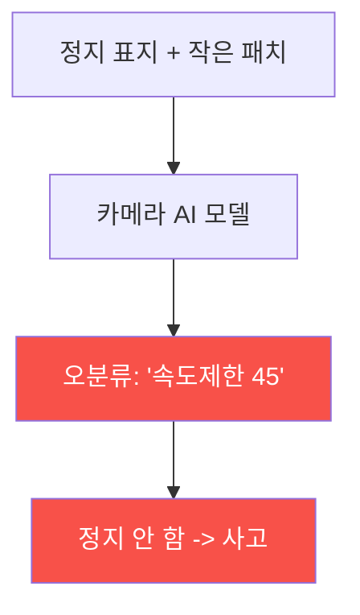

# autonomous-systems W07 — 자율주행 공격: 적대적 패치·센서 스푸핑·OTA 변조

> **본 주차의 한 줄 요약**
>
> W06의 자율주행 구조를 W07에서 **공격**한다. 자율주행은 판단을 AI·센서에 의존하므로, 이를 속이는 세 공격이
> 핵심이다: ① **적대적 패치(adversarial patch)** — AI 비전 모델을 속이는 특수 무늬. 정지 표지판에 작은 스티커·
> 패턴을 붙여 모델이 **"속도 제한 45"로 오분류**하게 하거나(실제 연구로 시연됨), 차선·보행자를 안 보이게 한다.
> 사람 눈엔 정상이지만 AI는 속는다(W13 적대적 예제의 물리판), ② **센서 스푸핑** — **라이다에 가짜 반사**를 쏘아
> 없는 물체(유령 브레이크)를 만들거나 있는 물체를 지우고, **카메라에 빛/이미지 투사**로 가짜 신호등을 보이고,
> **GPS 스푸핑**(W05)으로 위치를 속인다, ③ **OTA 변조** — 차량 소프트웨어 무선 업데이트(OTA)를 변조하면 **전
> 차량(fleet)** 에 악성 코드가 배포된다(공급망 공격, 대규모 위협). 이 공격들의 결과는 **물리적 사고** — 급정거·
> 충돌·차선 이탈·신호 위반. 방어(W06·W13에서 연결): **센서 중복성·정합성 검사**(한 센서가 속아도 배제),
> **적대적 학습·입력 검증**(모델 강건성, W13), **OTA 서명·무결성**(변조 방지), **안전 모니터(safety monitor)**
> (비정상 판단 시 안전 정지). 핵심: AI·센서를 단일 진실로 믿지 말고 교차 검증한다.
>
> **한 줄 결론**: 자율주행 공격 3대 — **적대적 패치(모델 속이기)·센서 스푸핑(라이다/카메라)·OTA 변조(전 차량)** 은
> 물리 사고를 부른다. 방어 = **센서 중복성·정합성 + 모델 강건성 + OTA 서명 + 안전 모니터**.

---

## 학습 목표

본 주차 종료 시 학생은 다음 5가지를 **본인 손으로** 할 수 있어야 한다.

1. 자율주행 **3대 공격**(패치·스푸핑·OTA)을 설명한다.
2. **적대적 패치** 오분류를 탐지한다(ADVERSARIAL_DETECTED).
3. **센서 스푸핑**(라이다 유령/제거)을 탐지한다(SENSOR_SPOOFED).
4. **OTA 무결성**을 검증한다(OTA_VERIFIED).
5. AI·센서 의존이 물리 사고로 이어지는 경로를 설명한다.

> **이 주차의 시선** — AI·센서를 속이는 물리 공격의 원리를 이해하고, 중복성·무결성으로 막는다.

---

## 0. 용어 해설 (자율주행 공격)

| 용어 | 영문 | 뜻 | 비유 |
|------|------|----|------|
| **적대적 패치** | Adversarial Patch | 모델 속이는 무늬 | 착시 스티커 |
| **센서 스푸핑** | Sensor Spoofing | 가짜 센서 입력 | 신기루 |
| **유령 물체** | Phantom Object | 없는데 있게 | 헛것 |
| **OTA** | Over-the-Air | 무선 업데이트 | 원격 패치 |
| **안전 모니터** | Safety Monitor | 이상 시 안전 정지 | 비상 감시 |

> **헷갈리기 쉬운 한 쌍** — *적대적 패치* 는 "AI 인식을 속임(SW 착시)", *센서 스푸핑* 은 "센서 입력을 위조(HW
> 신기루)"다. 둘 다 잘못된 인식을 만든다.

---

## 0.5 신입생 친화 핵심 개념

### 0.5.1 적대적 패치 — AI를 속인다

AI 모델의 약점을 노린 특수 무늬(스티커)를 표지판·도로에 붙여 **오분류**를 유도한다. 사람은 정지 표지로 보지만
AI는 다른 걸로 인식 — 물리 사고. W13 적대적 예제의 물리 세계판.

### 0.5.2 센서 스푸핑

- **라이다 스푸핑**: 레이저 펄스를 되쏘아 **없는 물체(유령)** 를 만들어 급브레이크를 유발하거나, 있는 물체를
  **지워** 충돌 유발.
- **카메라 스푸핑**: 빛·이미지 투사로 가짜 신호등·표지, 카메라 블라인딩.
- **GPS 스푸핑**: 위치 위조(W05).
센서 입력 자체를 위조해 인식을 오도.

### 0.5.3 OTA 변조 — 전 차량 위협

자율주행차는 소프트웨어를 **OTA(무선 업데이트)** 로 받는다. 업데이트 서버·경로가 뚫리거나 서명이 없으면, 변조된
펌웨어가 **수십만 대 전 차량**에 배포된다(공급망 공격). 한 번의 변조가 대규모 물리 위협 — OTA 무결성이 필수.

### 0.5.4 방어 — 중복성·강건성·무결성

- **센서 중복성·정합성**(W06): 한 센서가 속아도 다른 센서로 교차 검증·배제.
- **모델 강건성**(W13): 적대적 학습·입력 검증·이상 탐지로 패치에 강한 모델.
- **OTA 서명·무결성**: 서명 검증된 업데이트만 설치(보안 부팅과 연계).
- **안전 모니터**: 인식·판단이 비정상이면 **안전 정지/감속**(독립 안전 계층).
AI·센서를 단일 진실로 믿지 않고 교차 검증·무결성 검사한다.

### 0.5.5 el34 맥락

자율주행 공격은 실물 차량·센서가 필요하다. 본 실습은 **적대적 패치 탐지·센서 스푸핑 탐지·OTA 무결성 로직**을
결정론 시뮬로 익히고, AI 모델 강건성은 W13·GPU에서 다룬다. 실물 센서·차량 공격은 하드웨어·안전·인가가 필요함을 명시한다.

---

## 1. 실습 안내 (5 미션)

실행 위치 el34 **호스트**(`ssh ccc@{{TARGET_IP}}`), GPU `http://211.170.162.139:10934`.
⚠️ 자율주행 공격은 실물·안전·인가 필요 → 본 실습은 탐지·무결성 로직 결정론 시뮬.

### STEP 1 — GPU 헬스체크 → GEN_OK
### STEP 2 — 적대적 패치 탐지 → ADVERSARIAL_DETECTED
### STEP 3 — 센서 스푸핑 탐지 → SENSOR_SPOOFED
### STEP 4 — OTA 무결성 검증 → OTA_VERIFIED
### STEP 5 — 종합 → Assessment

---

## 2. 흔한 오해·관제자 노트

- **"AI는 사람보다 정확"** — 적대적 패치에 속는다. 강건성·중복.
- **"센서는 진실"** — 스푸핑 가능. 정합성 검사.
- **"OTA는 편의 기능"** — 변조 시 전 차량. 서명 필수.
- **관제 관점** — 자율주행이 센서 정합성·모델 강건성·OTA 서명·안전 모니터를 갖췄는지 점검한다. AI·센서 공격이
  물리 사고로 이어짐을 유의.

---

## 3. 다음 주차 (W08) 예고 — 중간 평가: 드론/자율주행 보안 종합

W01~W07로 CPS·드론·GPS·자율주행을 배웠다. W08은 이를 종합한 **드론/자율주행 보안 종합 평가** — 사이버→물리
공격 경로와 방어를 통합하는 중간 평가다.
