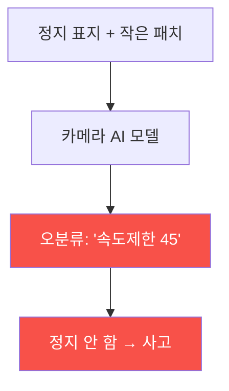

# autonomous-systems W07 — 자율주행 공격: 적대적 패치·센서 스푸핑·OTA 변조

> **본 주차의 한 줄 요약**
>
> W06의 자율주행 구조를 이번 주 W07에서 **공격**한다. 자율주행은 판단을 AI·센서에 의존하므로, 이를 속이는 세 공격이
> 핵심이다: ① **적대적 패치(adversarial patch)** — AI 비전 모델을 속이는 특수 무늬. 정지 표지판에 작은 스티커·패턴을
> 붙여 모델이 "속도 제한 45"로 오분류하게 하거나(실제 연구로 시연됨) 차선·보행자를 안 보이게 한다. 사람 눈엔 정상이지만
> AI는 속는다(W13 적대적 예제의 물리판). ② **센서 스푸핑** — 라이다에 가짜 반사를 쏘아 없는 물체(유령 브레이크)를
> 만들거나 있는 물체를 지우고, 카메라에 빛/이미지 투사로 가짜 신호등을 보이고, GPS 스푸핑(W05)으로 위치를 속인다.
> ③ **OTA 변조** — 차량 소프트웨어 무선 업데이트(OTA)를 변조하면 **전 차량(fleet)**에 악성 코드가 배포된다(공급망
> 공격). 이 공격들의 결과는 **물리적 사고** — 급정거·충돌·차선 이탈·신호 위반. 실습에서는 적대적 패치 오분류를
> 탐지하고(마커 `ADVERSARIAL_DETECTED`), 센서 스푸핑을 탐지하며(마커 `SENSOR_SPOOFED`), OTA 무결성을 검증한다(마커
> `OTA_VERIFIED`). 방어는 **센서 중복성·정합성 검사·모델 강건성(W13)·OTA 서명·안전 모니터**다. 핵심은 AI·센서를 단일
> 진실로 믿지 말고 교차 검증하는 것이다.

---

## 학습 목표

본 주차 종료 시 학생은 다음 5가지를 **본인 손으로** 할 수 있어야 한다.

1. 자율주행 3대 공격(적대적 패치·센서 스푸핑·OTA 변조)을 설명한다.
2. **적대적 패치** 오분류를 탐지한다(마커 `ADVERSARIAL_DETECTED`).
3. **센서 스푸핑**(라이다 유령/제거)을 탐지한다(마커 `SENSOR_SPOOFED`).
4. **OTA 무결성**을 검증한다(마커 `OTA_VERIFIED`).
5. AI·센서 의존이 물리 사고로 이어지는 경로를 종합한다(마커 `Assessment`).

> **이 주차의 시선** — AI·센서를 속이는 물리 공격의 원리를 이해하고, 중복성·무결성으로 막는다. 사이버 조작이 곧
> 물리 사고임을 잊지 않는다.

---

## 0. 용어 해설 (자율주행 공격)

| 용어 | 영문 | 뜻 | 비유 |
|------|------|----|------|
| **적대적 패치** | Adversarial Patch | AI 모델을 오분류시키는 물리 무늬(스티커) | 착시 스티커 |
| **센서 스푸핑** | Sensor Spoofing | 가짜 센서 입력으로 인식을 위조 | 신기루 |
| **유령 물체** | Phantom Object | 없는데 있는 것처럼 만든 라이다 반사 | 헛것 |
| **블라인딩** | Blinding | 강한 빛으로 카메라를 마비 | 눈부심 |
| **OTA** | Over-the-Air | 무선 소프트웨어 업데이트 | 원격 패치 |
| **모델 강건성** | Robustness | 적대적 입력에 견디는 모델 특성(W13) | 착시에 안 속음 |
| **안전 모니터** | Safety Monitor | 비정상 판단 시 안전 정지시키는 독립 계층 | 비상 감시원 |

> **헷갈리기 쉬운 한 쌍 — 적대적 패치 vs 센서 스푸핑.** *적대적 패치*는 AI 인식을 속인다(SW 착시). *센서 스푸핑*은
> 센서 입력 자체를 위조한다(HW 신기루). 둘 다 잘못된 인식을 만들지만, 방어 지점이 다르다(모델 강건성 vs 센서 정합성).

---

## 0.5 신입생 친화 핵심 개념

### 0.5.1 적대적 패치 — AI를 속인다

AI 모델의 약점을 노린 특수 무늬(스티커)를 표지판·도로에 붙여 오분류를 유도한다. 사람은 정지 표지로 보지만 AI는 다른
걸로 인식 — 물리 사고. W13 적대적 예제의 물리 세계판이다.

### 0.5.2 센서 스푸핑

- **라이다 스푸핑**: 레이저 펄스를 되쏘아 없는 물체(유령)를 만들어 급브레이크를 유발하거나, 있는 물체를 지워 충돌 유발.
- **카메라 스푸핑**: 빛·이미지 투사로 가짜 신호등·표지, 카메라 블라인딩.
- **GPS 스푸핑**: 위치 위조(W05).

센서 입력 자체를 위조해 인식을 오도한다.

### 0.5.3 OTA 변조 — 전 차량 위협

자율주행차는 소프트웨어를 OTA(무선 업데이트)로 받는다. 업데이트 서버·경로가 뚫리거나 서명이 없으면, 변조된 펌웨어가
수십만 대 전 차량에 배포된다(공급망 공격). 한 번의 변조가 대규모 물리 위협 — OTA 무결성이 필수다.

### 0.5.4 방어 — 중복성·강건성·무결성

- **센서 중복성·정합성(W06)**: 한 센서가 속아도 다른 센서로 교차 검증·배제.
- **모델 강건성(W13)**: 적대적 학습·입력 검증·이상 탐지로 패치에 강한 모델.
- **OTA 서명·무결성**: 서명 검증된 업데이트만 설치(보안 부팅과 연계).
- **안전 모니터**: 인식·판단이 비정상이면 안전 정지/감속(독립 안전 계층).

AI·센서를 단일 진실로 믿지 않고 교차 검증·무결성 검사를 한다.

### 0.5.5 el34 맥락

자율주행 공격은 실물 차량·센서가 필요하다. 이번 실습은 **적대적 패치 탐지·센서 스푸핑 탐지·OTA 무결성 로직**을 결정론
시뮬로 익히고, AI 모델 강건성은 W13·GPU에서 다룬다(실물 센서·차량 공격은 하드웨어·안전·인가 필요).

---

## 1. 자율주행 공격 상세 — 탐지·무결성

### 1.1 적대적 패치 탐지 (ADVERSARIAL_DETECTED)

- **한 줄 정의**: 오분류를 유발하는 적대적 패치를 이상 신호로 식별한다.
- **왜 중요한가**: 사람은 정상으로 보므로 AI/시스템 차원의 탐지가 필요하다.
- **el34 맥락에서 어떻게**: 분류 신뢰도 급변·센서 간 불일치(카메라 vs 라이다)로 탐지하면 `ADVERSARIAL_DETECTED`.
- **한계/주의**: 패치는 진화하므로 모델 강건성(W13)과 병행해야 한다.

### 1.2 센서 스푸핑 탐지 (SENSOR_SPOOFED)

- **한 줄 정의**: 라이다 유령/제거·카메라 투사 같은 위조 입력을 탐지한다.
- **핵심**: 센서 간 정합성 불일치, 물리적으로 불가능한 물체 급변.
- **판정**: 스푸핑이 탐지되면 `SENSOR_SPOOFED`.

### 1.3 OTA 무결성 검증 (OTA_VERIFIED)

- **한 줄 정의**: 업데이트의 서명·해시를 검증해 변조를 막는다.
- **핵심**: 서명 검증된 펌웨어만 설치, 보안 부팅 연계.
- **판정**: OTA 무결성이 검증되면 `OTA_VERIFIED`.

---

## 2. 실습 안내 (총 5 미션)

실행 위치는 el34 **호스트**(`ssh ccc@{{TARGET_IP}}`, 비밀번호 `1`), 참고 GPU는 Ollama
(`http://211.170.162.139:10934`, gemma3:4b)다. ⚠️ 자율주행 공격은 실물·안전·인가가 필요해 탐지·무결성 로직을 결정론
시뮬로 익힌다. 각 미션의 마지막 줄 마커가 채점 기준이다.

### 미션 1 — GPU 헬스체크 → `GEN_OK`

> **왜 하는가?** 분석·종합에 쓸 LLM 도달·응답 확인.
> **무엇을 아는가?** Ollama 응답 형식·도달성.
> **결과 해석** — 정상 `GEN_OK` / 비정상 `GEN_EMPTY`·연결 오류.
> **실전 활용** — 종합 소견 작성에 사용.

### 미션 2 — 적대적 패치 탐지 → `ADVERSARIAL_DETECTED`

> **왜 하는가?** 사람 눈에 안 보이는 AI 오분류를 잡는다.
> **무엇을 아는가?** 신뢰도 급변·센서 불일치 신호.
> **결과 해석** — 정상: 탐지 + `ADVERSARIAL_DETECTED`.
> **실전 활용** — 인식 이상 탐지.

### 미션 3 — 센서 스푸핑 탐지 → `SENSOR_SPOOFED`

> **왜 하는가?** 위조 센서 입력을 정합성으로 걸러낸다.
> **무엇을 아는가?** 라이다 유령/제거·정합성 불일치.
> **결과 해석** — 정상: 탐지 + `SENSOR_SPOOFED`.
> **실전 활용** — 센서 무결성 검증.

### 미션 4 — OTA 무결성 검증 → `OTA_VERIFIED`

> **왜 하는가?** 전 차량 위협인 OTA 변조를 막는다.
> **무엇을 아는가?** 서명·해시 검증, 보안 부팅 연계.
> **결과 해석** — 정상: 검증 + `OTA_VERIFIED`.
> **실전 활용** — 차량 공급망 보안.

### 미션 5 — 종합 소견 → `Assessment`

> **왜 하는가?** 3대 공격·탐지·무결성과 "AI/센서 조작→물리 사고"를 소견으로 묶는다.
> **무엇을 아는가?** GPU에 요약시키되 첫 줄을 `Assessment`로 강제.
> **결과 해석** — 정상: `Assessment` 포함. 없으면 `[형식 미준수 — 재실행]`.
> **실전 활용** — 자율주행 공격·방어 개요.

---

## 2.5 과제 (제출물)

- **A. 적대적 패치 탐지 실증 (필수, 40점)** — `ADVERSARIAL_DETECTED` 단계를 직접 수행해 실제 명령·출력(또는 아티팩트 분석 결과)을 캡처하고, 무엇을 근거로 판정했는지 서술한다.
- **B. 센서 스푸핑 탐지 분석 (필수, 30점)** — `SENSOR_SPOOFED` 단계를 직접 수행해 실제 명령·출력(또는 아티팩트 분석 결과)을 캡처하고, 무엇을 근거로 판정했는지 서술한다.
- **C. OTA 무결성 검증 방어 설계 (필수, 30점)** — `OTA_VERIFIED` 단계를 직접 수행해 실제 명령·출력(또는 아티팩트 분석 결과)을 캡처하고, 무엇을 근거로 판정했는지 서술한다.

## 2.6 평가 기준

| 항목 | 미흡(0) | 보통 | 우수 |
|------|---------|------|------|
| 탐지/실증(ADVERSARIAL_DETECTED) | 미수행 | 마커 도출 | 근거·해석·재현까지 |
| 분석(SENSOR_SPOOFED) | 미수행 | 마커 도출 | 근거·해석·재현까지 |
| 방어(OTA_VERIFIED) | 미수행 | 마커 도출 | 근거·해석·재현까지 |

## 2.7 핵심 정리 (1줄씩)

- 이번 주 주제: **자율주행 공격: 적대적 패치·센서 스푸핑·OTA 변조**.
- **적대적 패치 탐지**(`ADVERSARIAL_DETECTED`): 오분류를 유발하는 적대적 패치를 이상 신호로 식별한다.
- **센서 스푸핑 탐지**(`SENSOR_SPOOFED`): 라이다 유령/제거·카메라 투사 같은 위조 입력을 탐지한다.
- **OTA 무결성 검증**(`OTA_VERIFIED`): 업데이트의 서명·해시를 검증해 변조를 막는다.
- 공격을 이해한 만큼 **방어의 우선순위**가 분명해진다 — 탐지 근거와 완화를 함께 익힌다.

---

## 3. 흔한 오해·블루팀 노트

- **"AI는 사람보다 정확하다."** — 적대적 패치에 속는다. 강건성·중복성으로 보완한다.
- **"센서는 진실이다."** — 스푸핑이 가능하다. 정합성 검사가 필요하다.
- **"OTA는 편의 기능이다."** — 변조 시 전 차량 위협이다. 서명이 필수.
- **"공격은 근처에서만 된다."** — OTA·적대적 패치는 원격·비대면으로도 가능하다.
- **관제(Blue) 관점** — 자율주행이 (1) 센서 정합성·중복성, (2) 모델 강건성(W13), (3) OTA 서명·무결성, (4) 안전 모니터
  (비정상 시 안전 정지)를 갖췄는지 점검한다.

---

## 4. 다음 주차 (W08) 예고 — 중간 평가: 드론/자율주행 보안 종합

W01~W07로 CPS·드론·GPS·자율주행을 배웠다. W08은 이를 종합한 **드론/자율주행 보안 종합 평가**로, 사이버→물리 공격
경로와 방어를 통합하는 중간 평가다.
