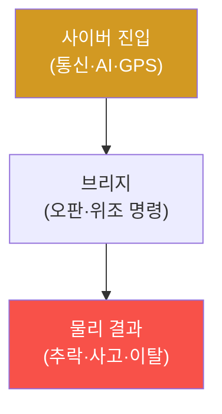

# autonomous-systems W08 — 중간 평가: 드론/자율주행 보안 종합

> **본 주차의 한 줄 요약**
>
> W01~W07로 CPS 위협 모델·드론(공격/방어)·GPS·자율주행(기초/공격)을 배웠다. 이번 주 W08은 이를 **하나의 종합
> 평가**로 통합하는 중간 평가다. 실제 CPS 보안 평가는 한 기법이 아니라, 자율 시스템을 **사이버·물리·브리지 3계층**
> (W01)에서 점검하고, 취약점을 연결해 **사이버→물리 공격 경로**를 구성하며(사이버 진입이 물리 사고로), **다층 방어**를
> 안전 우선순위로 제안한다. 핵심 통합 관점은 셋이다: ① **사이버→물리 경로**(통신/AI/GPS를 통한 사이버 공격이 어떻게
> 물리 결과(추락·사고)로 이어지는지 추적), ② **다층 방어**(통신 보안·센서 중복성·GPS 안티스푸핑·AI 강건성·페일세이프·
> 안전 모니터를 겹층으로 — 한 겹 뚫려도 다음 겹), ③ **안전 최우선**(인명·물리 피해가 걸린 위협을 데이터 위협보다
> 우선). 실습에서는 사이버→물리 공격 경로를 구성하고(마커 `CPS_PATH`), 다층 방어를 평가하며(마커 `DEFENSE_LAYERED`),
> 안전 우선순위로 정렬한다(마커 `SAFETY_PRIORITIZED`). 이 평가의 핵심은 부분 기법(드론 하이재킹·GPS 스푸핑·적대적
> 패치)을 전체 CPS 위협 모델로 통합하고, 사이버 공격의 물리 결과를 이해하며, 안전 우선의 다층 방어를 설계하는 능력이다.

---

## 학습 목표

본 주차 종료 시 학생은 다음 5가지를 **본인 손으로** 할 수 있어야 한다.

1. CPS를 사이버·물리·브리지 3계층에서 종합 평가한다.
2. **사이버→물리 공격 경로**를 구성한다(마커 `CPS_PATH`).
3. **다층 방어**를 평가한다(마커 `DEFENSE_LAYERED`).
4. **안전 우선순위**로 방어를 정렬한다(마커 `SAFETY_PRIORITIZED`).
5. 사이버 공격의 물리 결과와 안전 최우선 원칙을 종합한다(마커 `Assessment`).

> **이 주차의 시선** — 낱개 기법을 "전체 CPS 위협 모델 + 다층 방어"로 통합한다. 승부처는 사이버가 물리로 번지는
> 경로를 잇고, 안전을 최우선으로 방어를 정렬하는 것이다.

---

## 0. 용어 해설 (종합 평가)

| 용어 | 영문 | 뜻 | 비유 |
|------|------|----|------|
| **3계층 점검** | 3-Layer Review | 사이버·물리·브리지에서 취약점 점검 | 3중 검진 |
| **사이버→물리 경로** | Cyber-to-Physical Path | 사이버 진입이 물리 사고로 이어지는 사슬 | 도미노 |
| **다층 방어** | Defense in Depth | 여러 방어를 겹층으로 배치 | 다중 방벽 |
| **안전 우선순위** | Safety Prioritization | 인명·물리 위협을 최우선으로 | 응급 분류 |
| **독립 안전 계층** | Independent Safety Layer | 보안과 분리된 페일세이프·안전 모니터 | 최후 안전망 |

> **헷갈리기 쉬운 한 쌍 — 취약점 나열 vs 사이버→물리 경로.** *나열*은 "여기 하이재킹, 저기 스푸핑"이고, *경로*는
> "통신 하이재킹→위조 명령→추락"처럼 사이버가 물리 사고로 이어지는 사슬을 잇는 것이다. CPS 평가의 가치는 이 물리
> 결과의 경로에 있다.

---

## 0.5 종합 — 경로·다층·안전

### 0.5.1 사이버→물리 공격 경로

CPS 평가의 핵심은 사이버 취약점이 물리 결과로 이어지는 경로를 추적하는 것이다. 통신 하이재킹·GPS 스푸핑·적대적
패치가 각각 추락·이탈·사고로 이어진다.

### 0.5.2 다층 방어

한 겹이 아니라 겹층으로: 통신 보안(MAVLink 서명·WiFi 암호, W02·W03) → GPS 안티스푸핑(W05) → 센서 중복성(W06) →
AI 강건성(W07·W13) → 페일세이프·안전 모니터(W01·W04). 각 겹이 서로의 빈틈을 메운다. 한 겹 뚫려도 다음 겹이 물리
안전을 지킨다.

### 0.5.3 안전 우선순위

CPS는 인명·물리 피해를 데이터 위협보다 우선한다(W01). 방어 자원을 인명 위협(하이재킹·사고 유발)에 먼저 배정한다.
그리고 보안이 뚫려도 안전하도록 **독립 안전 계층**(페일세이프·안전 모니터)을 최후 보루로 둔다.

---

## 1. 통합 평가 상세 — 경로·다층·안전

### 1.1 사이버→물리 경로 구성 (CPS_PATH)

- **한 줄 정의**: 사이버 진입→브리지→물리 결과의 침해 경로를 잇는다.
- **왜 중요한가**: 물리 결과의 경로가 실제 위협을 증명한다.
- **el34 맥락에서 어떻게**: 예 — MAVLink 무서명(사이버)→위조 착륙 명령(브리지)→추락(물리)로 구성하면 `CPS_PATH`.
- **한계/주의**: 각 단계가 재현 가능해야 경로 신뢰도가 선다.

### 1.2 다층 방어 평가 (DEFENSE_LAYERED)

- **한 줄 정의**: 통신·GPS·센서·AI·안전 계층의 겹층 방어를 평가한다.
- **핵심**: 각 겹이 담당 공격을 막고, 한 겹 실패 시 다음 겹이 보완하는지.
- **판정**: 겹층 방어가 구성·평가되면 `DEFENSE_LAYERED`.

### 1.3 안전 우선순위 (SAFETY_PRIORITIZED)

- **한 줄 정의**: 인명·물리 위협을 최우선으로 방어를 정렬한다.
- **핵심**: 물리 사고 유발 위협 먼저, 독립 안전 계층을 최후 보루로.
- **판정**: 안전 우선 정렬이 이뤄지면 `SAFETY_PRIORITIZED`.

---

## 2. 중간 평가 안내 (총 5 미션)

실행 위치는 el34 **호스트**(`ssh ccc@{{TARGET_IP}}`, 비밀번호 `1`), 참고 GPU는 Ollama
(`http://211.170.162.139:10934`, gemma3:4b)다. ⚠️ CPS는 실물이 필요해 경로·다층 방어·안전 로직을 결정론 시뮬로
익힌다. 각 미션의 마지막 줄 마커가 채점 기준이다.

### 미션 1 — GPU 헬스체크 → `GEN_OK`

> **왜 하는가?** 분석·종합에 쓸 LLM 도달·응답 확인.
> **무엇을 아는가?** Ollama 응답 형식·도달성.
> **결과 해석** — 정상 `GEN_OK` / 비정상 `GEN_EMPTY`·연결 오류.
> **실전 활용** — 종합 소견 작성에 사용.

### 미션 2 — 사이버→물리 공격 경로 → `CPS_PATH`

> **왜 하는가?** 사이버 취약점이 물리 사고가 되는 경로를 증명한다.
> **무엇을 아는가?** 사이버 진입→브리지→물리 결과 사슬.
> **결과 해석** — 정상: 경로 구성 + `CPS_PATH`.
> **실전 활용** — CPS 침투 보고의 핵심.

### 미션 3 — 다층 방어 평가 → `DEFENSE_LAYERED`

> **왜 하는가?** 겹층 방어가 각 공격을 막는지 평가한다.
> **무엇을 아는가?** 통신·GPS·센서·AI·안전 계층.
> **결과 해석** — 정상: 다층 평가 + `DEFENSE_LAYERED`.
> **실전 활용** — CPS 방어 아키텍처 설계.

### 미션 4 — 안전 우선순위 → `SAFETY_PRIORITIZED`

> **왜 하는가?** 유한한 자원을 인명·물리 위협에 먼저 쓴다.
> **무엇을 아는가?** 안전 우선 정렬·독립 안전 계층.
> **결과 해석** — 정상: 정렬 + `SAFETY_PRIORITIZED`.
> **실전 활용** — 안전 필수 시스템 우선순위.

### 미션 5 — 종합 소견 → `Assessment`

> **왜 하는가?** 경로·다층·안전과 "사이버 공격의 물리 결과"를 소견으로 묶는다.
> **무엇을 아는가?** GPU에 요약시키되 첫 줄을 `Assessment`로 강제.
> **결과 해석** — 정상: `Assessment` 포함. 없으면 `[형식 미준수 — 재실행]`.
> **실전 활용** — CPS 보안 종합 평가 개요.

---

## 2.5 과제 (제출물)

- **A. 사이버→물리 경로 구성 실증 (필수, 40점)** — `CPS_PATH` 단계를 직접 수행해 실제 명령·출력(또는 아티팩트 분석 결과)을 캡처하고, 무엇을 근거로 판정했는지 서술한다.
- **B. 다층 방어 평가 분석 (필수, 30점)** — `DEFENSE_LAYERED` 단계를 직접 수행해 실제 명령·출력(또는 아티팩트 분석 결과)을 캡처하고, 무엇을 근거로 판정했는지 서술한다.
- **C. 안전 우선순위 방어 설계 (필수, 30점)** — `SAFETY_PRIORITIZED` 단계를 직접 수행해 실제 명령·출력(또는 아티팩트 분석 결과)을 캡처하고, 무엇을 근거로 판정했는지 서술한다.

## 2.6 평가 기준

| 항목 | 미흡(0) | 보통 | 우수 |
|------|---------|------|------|
| 탐지/실증(CPS_PATH) | 미수행 | 마커 도출 | 근거·해석·재현까지 |
| 분석(DEFENSE_LAYERED) | 미수행 | 마커 도출 | 근거·해석·재현까지 |
| 방어(SAFETY_PRIORITIZED) | 미수행 | 마커 도출 | 근거·해석·재현까지 |

## 2.7 핵심 정리 (1줄씩)

- 이번 주 주제: **중간 평가: 드론/자율주행 보안 종합**.
- **사이버→물리 경로 구성**(`CPS_PATH`): 사이버 진입→브리지→물리 결과의 침해 경로를 잇는다.
- **다층 방어 평가**(`DEFENSE_LAYERED`): 통신·GPS·센서·AI·안전 계층의 겹층 방어를 평가한다.
- **안전 우선순위**(`SAFETY_PRIORITIZED`): 인명·물리 위협을 최우선으로 방어를 정렬한다.
- 공격을 이해한 만큼 **방어의 우선순위**가 분명해진다 — 탐지 근거와 완화를 함께 익힌다.

---

## 3. 흔한 오해·관제자 노트

- **"한 방어면 충분하다."** — 겹층 방어다. 한 겹 뚫려도 다음 겹이 막는다.
- **"사이버와 물리는 별개다."** — 사이버가 물리로 번진다. 경로를 추적한다.
- **"데이터 보호가 우선이다."** — CPS는 인명·물리가 우선이다. 안전 최우선.
- **"보안만 잘하면 안전하다."** — 보안이 뚫려도 안전하도록 독립 안전 계층을 둔다.
- **관제(Blue) 관점** — CPS가 (1) 3계층에서 평가됐는가, (2) 다층 방어·독립 안전 계층이 있는가, (3) 안전 우선순위인가,
  (4) 사이버→물리 경로가 차단되는가를 종합 평가한다.

---

## 4. 다음 주차 (W09) 예고 — 로봇 보안

중간 평가 후 W09는 **로봇 보안**을 다룬다. ROS2·시리얼 통신·펌웨어로 이뤄진 로봇 시스템의 보안을 익혀 W10(ROS2 심화)의
토대를 세운다.
