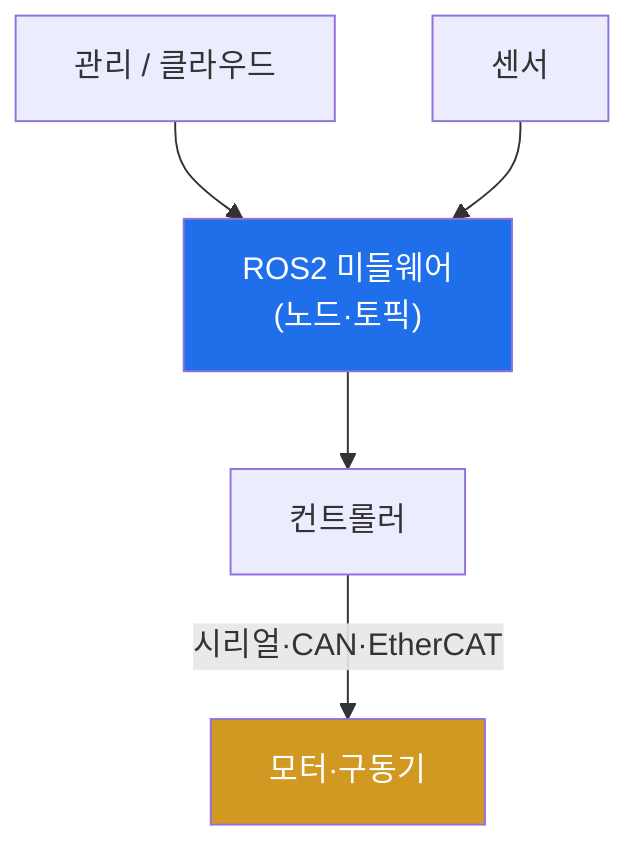

# autonomous-systems W09 — 로봇 보안: ROS2·시리얼 통신·펌웨어

> **본 주차의 한 줄 요약**
>
> 로봇(산업 로봇 팔·서비스 로봇·자율 이동 로봇)은 물리 세계를 직접 움직이는 CPS다. 로봇 시스템의 구성과 공격 표면은
> 이렇다: ① **미들웨어(ROS/ROS2)** — 로봇 소프트웨어의 사실상 표준. 여러 **노드(node)**가 **토픽(topic)**으로 메시지를
> 주고받는 분산 구조. ROS1은 보안이 전무(인증·암호화 없음)했고, ROS2는 DDS 기반으로 보안(SROS2)을 **옵션으로**
> 제공하지만 끄고 쓰는 경우가 많다 → 네트워크에 붙으면 토픽 감청·명령 주입(W10 심화). ② **시리얼/필드버스 통신** —
> 로봇 컨트롤러와 모터·센서 간 시리얼(UART)·CAN·EtherCAT 통신. 대개 인증이 없어 접근하면 모터 명령을 직접 주입.
> ③ **펌웨어** — 컨트롤러·구동기 펌웨어에 하드코딩 비밀·취약점·업데이트 부재(iot 원리와 동일). ④ **원격 관리·클라우드**.
> 로봇 공격의 결과는 **물리적**이다 — 로봇 팔이 사람을 치거나, 이동 로봇이 폭주하거나, 작업을 파괴. 산업 로봇은 특히
> 안전 표준(ISO 10218 등)과 **안전 정지**가 필수다. 실습에서는 로봇 통신 취약성을 평가하고(마커 `ROBOT_INSECURE`),
> 공격 표면을 매핑하며(마커 `SURFACE_MAPPED`), ROS2 보안·펌웨어 서명·안전 정지로 강화한다(마커 `ROBOT_HARDENED`).
> 방어의 핵심은 **ROS2 보안(SROS2)·시리얼 격리·펌웨어 서명·독립 안전 정지**다.

---

## 학습 목표

본 주차 종료 시 학생은 다음 5가지를 **본인 손으로** 할 수 있어야 한다.

1. 로봇 시스템 구성(ROS·시리얼·펌웨어)을 설명한다.
2. 로봇 통신·인터페이스 **취약성**을 평가한다(마커 `ROBOT_INSECURE`).
3. 로봇 **공격 표면**을 매핑한다(마커 `SURFACE_MAPPED`).
4. **ROS2 보안·펌웨어 서명·안전 정지**로 강화한다(마커 `ROBOT_HARDENED`).
5. 로봇 보안이 왜 기능 안전(안전 표준)과 함께 가는지 종합한다(마커 `Assessment`).

> **이 주차의 시선** — 물리를 움직이는 로봇의 무보안 통신을 ROS2 보안·격리·안전 정지로 막는다. "ROS2니까 안전"이
> 왜 오해인지가 핵심이다.

---

## 0. 용어 해설 (로봇 보안)

| 용어 | 영문 | 뜻 | 비유 |
|------|------|----|------|
| **ROS/ROS2** | Robot Operating System | 로봇 소프트웨어 미들웨어(사실상 표준) | 로봇 OS |
| **노드/토픽** | Node/Topic | 프로세스 / 메시지 채널 | 부서 / 회람 |
| **DDS** | Data Distribution Service | ROS2의 하부 통신 프로토콜 | 배송망 |
| **SROS2** | Secure ROS2 | ROS2의 인증·암호화·접근 제어(옵션) | 보안 옵션 |
| **필드버스** | Fieldbus | 산업 통신(CAN·EtherCAT·UART) | 공장 신경망 |
| **펌웨어** | Firmware | 컨트롤러·구동기 내장 소프트웨어 | 기기 두뇌 |
| **안전 정지** | Safe Stop / E-stop | 물리적 비상 정지(보안과 분리) | 비상 정지 버튼 |

> **헷갈리기 쉬운 한 쌍 — ROS1 vs ROS2+SROS2.** *ROS1*은 보안이 전무하다. *ROS2*는 SROS2로 보안을 제공하지만
> **켜야** 안전하다 — 기본으로 끄고 쓰면 ROS2도 무방비다. "ROS2니까 안전"은 오해다.

---

## 0.5 신입생 친화 핵심 개념

### 0.5.1 로봇 구성

ROS2가 노드·토픽으로 로봇 SW를 잇고, 컨트롤러가 시리얼/필드버스로 모터를 움직인다. ROS 계층·시리얼 계층 모두 공격
표면이다.

### 0.5.2 ROS의 무보안 문제

ROS1은 인증·암호화가 전무했다 — 네트워크에 붙으면 토픽을 감청하고 명령을 주입(로봇 팔 움직이기). ROS2는 DDS 기반으로
**SROS2**(인증·암호화·접근 제어)를 제공하지만 기본으로 꺼져 있거나 설정을 안 해 무방비인 경우가 많다. "ROS2니까
안전"은 오해 — SROS2를 켜야 안전하다(W10 심화).

### 0.5.3 시리얼·펌웨어

- **시리얼/필드버스**: 컨트롤러-모터 통신(UART·CAN·EtherCAT)은 대개 무인증이다. 물리·네트워크 접근으로 모터 명령을
  직접 주입한다(자동차 CAN, W12와 유사).
- **펌웨어**: 컨트롤러·구동기 펌웨어에 하드코딩 비밀·취약점·업데이트 부재. 추출·분석으로 비밀이 노출된다.

### 0.5.4 방어 — 보안 + 안전 정지

- **ROS2 보안(SROS2)**: 노드 인증·토픽 암호화·접근 제어 활성(W10).
- **시리얼/필드버스 격리**: 로봇 내부 통신을 네트워크에서 격리, 가능하면 인증·암호.
- **펌웨어 서명**: 서명된 펌웨어만 설치.
- **독립 안전 시스템**: 보안과 분리된 안전 계층이 이상·충돌 위험 시 물리적으로 정지(E-stop, ISO 10218). 보안이 뚫려도
  사람이 안 다치게.

로봇 보안은 사이버 보안과 **기능 안전(functional safety)**이 함께 간다.

### 0.5.5 el34 맥락

로봇은 실물 하드웨어가 필요하다. 이번 실습은 **ROS/시리얼 취약성·공격 표면·방어 로직**을 결정론 시뮬로 익히고, W10에서
ROS2/DDS를 더 구체적으로 다룬다(실물 로봇 공격은 하드웨어·안전 필요).

---

## 1. 로봇 보안 상세 — 취약성·표면·강화

### 1.1 통신 취약성 평가 (ROBOT_INSECURE)

- **한 줄 정의**: ROS·시리얼·펌웨어의 인증·암호화 상태를 평가한다.
- **왜 중요한가**: 무보안 통신이 물리 명령 주입의 입구다.
- **el34 맥락에서 어떻게**: SROS2 미사용·무인증 시리얼·펌웨어 비밀을 점검해 취약을 판정하면 `ROBOT_INSECURE`.
- **한계/주의**: "ROS2 사용" 자체로는 보안이 아니다(SROS2 활성 여부가 관건).

### 1.2 공격 표면 매핑 (SURFACE_MAPPED)

- **한 줄 정의**: ROS 토픽·시리얼·펌웨어·원격 관리를 표면으로 목록화한다.
- **핵심**: 각 표면의 공격(토픽 감청/주입·모터 명령 주입·펌웨어 비밀)과 물리 위험.
- **판정**: 표면이 매핑되면 `SURFACE_MAPPED`.

### 1.3 로봇 강화 (ROBOT_HARDENED)

- **한 줄 정의**: SROS2·시리얼 격리·펌웨어 서명·독립 안전 정지를 적용한다.
- **핵심**: 보안 계층 + 기능 안전(E-stop) 병행. 보안이 뚫려도 물리 안전.
- **판정**: 강화가 적용되면 `ROBOT_HARDENED`.

---

## 2. 실습 안내 (총 5 미션)

실행 위치는 el34 **호스트**(`ssh ccc@{{TARGET_IP}}`, 비밀번호 `1`), 참고 GPU는 Ollama
(`http://211.170.162.139:10934`, gemma3:4b)다. ⚠️ 로봇은 실물 하드웨어가 필요해 취약성·표면·방어 로직을 결정론
시뮬로 익힌다. 각 미션의 마지막 줄 마커가 채점 기준이다.

### 미션 1 — GPU 헬스체크 → `GEN_OK`

> **왜 하는가?** 분석·종합에 쓸 LLM 도달·응답 확인.
> **무엇을 아는가?** Ollama 응답 형식·도달성.
> **결과 해석** — 정상 `GEN_OK` / 비정상 `GEN_EMPTY`·연결 오류.
> **실전 활용** — 종합 소견 작성에 사용.

### 미션 2 — 로봇 통신 취약성 → `ROBOT_INSECURE`

> **왜 하는가?** 물리 명령 주입의 입구인 통신 상태를 평가한다.
> **무엇을 아는가?** SROS2 여부·시리얼 인증·펌웨어 비밀.
> **결과 해석** — 정상: 취약 판정 + `ROBOT_INSECURE`.
> **실전 활용** — 로봇 보안 진단.

### 미션 3 — 공격 표면 매핑 → `SURFACE_MAPPED`

> **왜 하는가?** 어디를 공격·방어할지 표면을 목록화한다.
> **무엇을 아는가?** ROS 토픽·시리얼·펌웨어·원격 관리.
> **결과 해석** — 정상: 매핑 + `SURFACE_MAPPED`.
> **실전 활용** — 로봇 위협 모델링.

### 미션 4 — 로봇 강화 → `ROBOT_HARDENED`

> **왜 하는가?** 보안 + 기능 안전으로 물리 사고를 막는다.
> **무엇을 아는가?** SROS2·시리얼 격리·펌웨어 서명·E-stop.
> **결과 해석** — 정상: 강화 + `ROBOT_HARDENED`.
> **실전 활용** — 로봇 보안·안전 설계.

### 미션 5 — 종합 소견 → `Assessment`

> **왜 하는가?** 취약성·표면·강화와 "보안+기능 안전"을 소견으로 묶는다.
> **무엇을 아는가?** GPU에 요약시키되 첫 줄을 `Assessment`로 강제.
> **결과 해석** — 정상: `Assessment` 포함. 없으면 `[형식 미준수 — 재실행]`.
> **실전 활용** — 로봇 보안 개요.

---

## 2.5 과제 (제출물)

- **A. 통신 취약성 평가 실증 (필수, 40점)** — `ROBOT_INSECURE` 단계를 직접 수행해 실제 명령·출력(또는 아티팩트 분석 결과)을 캡처하고, 무엇을 근거로 판정했는지 서술한다.
- **B. 공격 표면 매핑 분석 (필수, 30점)** — `SURFACE_MAPPED` 단계를 직접 수행해 실제 명령·출력(또는 아티팩트 분석 결과)을 캡처하고, 무엇을 근거로 판정했는지 서술한다.
- **C. 로봇 강화 방어 설계 (필수, 30점)** — `ROBOT_HARDENED` 단계를 직접 수행해 실제 명령·출력(또는 아티팩트 분석 결과)을 캡처하고, 무엇을 근거로 판정했는지 서술한다.

## 2.6 평가 기준

| 항목 | 미흡(0) | 보통 | 우수 |
|------|---------|------|------|
| 탐지/실증(ROBOT_INSECURE) | 미수행 | 마커 도출 | 근거·해석·재현까지 |
| 분석(SURFACE_MAPPED) | 미수행 | 마커 도출 | 근거·해석·재현까지 |
| 방어(ROBOT_HARDENED) | 미수행 | 마커 도출 | 근거·해석·재현까지 |

## 2.7 핵심 정리 (1줄씩)

- 이번 주 주제: **로봇 보안: ROS2·시리얼 통신·펌웨어**.
- **통신 취약성 평가**(`ROBOT_INSECURE`): ROS·시리얼·펌웨어의 인증·암호화 상태를 평가한다.
- **공격 표면 매핑**(`SURFACE_MAPPED`): ROS 토픽·시리얼·펌웨어·원격 관리를 표면으로 목록화한다.
- **로봇 강화**(`ROBOT_HARDENED`): SROS2·시리얼 격리·펌웨어 서명·독립 안전 정지를 적용한다.
- 공격을 이해한 만큼 **방어의 우선순위**가 분명해진다 — 탐지 근거와 완화를 함께 익힌다.

---

## 3. 흔한 오해·블루팀 노트

- **"ROS2니까 안전하다."** — SROS2를 켜야 안전하다. 기본은 무방비.
- **"내부 시리얼은 안전하다."** — 무인증이라 접근 시 명령이 주입된다. 격리·인증이 필요.
- **"보안만 하면 된다."** — 안전 정지(E-stop)는 별도다. 기능 안전과 함께 간다.
- **"펌웨어는 건드릴 수 없다."** — 추출·분석으로 하드코딩 비밀이 노출된다. 서명·비밀 제거가 필요.
- **관제(Blue) 관점** — 로봇이 (1) SROS2 활성, (2) 시리얼/필드버스 격리, (3) 펌웨어 서명, (4) 독립 안전 정지(E-stop)를
  갖췄는지 점검한다. 로봇 보안은 기능 안전과 함께 간다.

---

## 4. 다음 주차 (W10) 예고 — ROS2 보안

W09가 "로봇 보안 개론"이었다면, W10은 **ROS2 보안** 심화를 다룬다. DDS 통신·토픽 스니핑·명령 인젝션·SROS2(인증·
암호화·접근 제어)를 구체적으로 익힌다.
