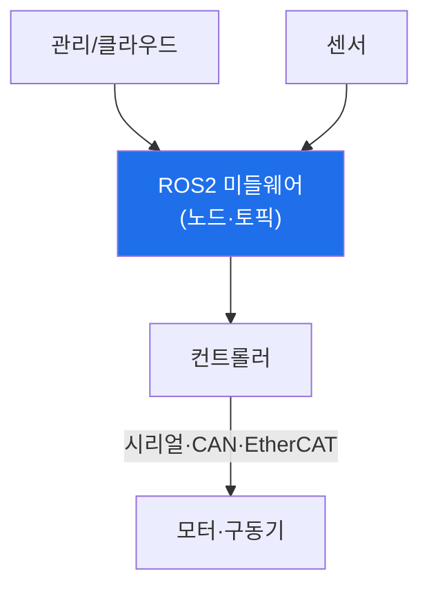

# autonomous-systems W09 — 로봇 보안: ROS2·시리얼 통신·펌웨어

> **본 주차의 한 줄 요약**
>
> 로봇(산업 로봇 팔·서비스 로봇·자율 이동 로봇)은 물리 세계를 직접 움직이는 CPS다. 로봇 시스템의 구성과 공격
> 표면: ① **미들웨어(ROS/ROS2)** — 로봇 소프트웨어의 사실상 표준. 여러 **노드(node)** 가 **토픽(topic)** 으로
> 메시지를 주고받는 분산 구조. **원래 ROS1은 보안이 전무**(인증·암호화 없음)했고, ROS2는 DDS 기반으로 보안
> (SROS2)을 **옵션으로** 제공하지만 **끄고 쓰는 경우가 많다** → 네트워크에 붙으면 토픽 감청·명령 주입(W10 심화),
> ② **시리얼/필드버스 통신** — 로봇 컨트롤러와 모터·센서 간 **시리얼(UART)·CAN·EtherCAT** 통신. 대개 인증이
> 없어, 접근하면 모터 명령을 직접 주입, ③ **펌웨어** — 컨트롤러·구동기 펌웨어에 하드코딩 비밀·취약점·업데이트
> 부재(iot W03·W04와 동일 원리), ④ **원격 관리·클라우드**. 로봇 공격의 결과는 **물리적**이다 — 로봇 팔이 사람을
> 치거나, 이동 로봇이 폭주하거나, 작업을 파괴. 산업 로봇은 특히 **안전 표준(ISO 10218 등)** 과 **안전 정지**가
> 필수다. 방어: **ROS2 보안(SROS2: 인증·암호화·접근 제어)**, 시리얼/필드버스 보호·격리, 펌웨어 서명, **독립
> 안전 시스템**(보안 뚫려도 물리 안전 정지). 이번 주는 로봇 구조·공격 표면·기본 방어를 익히고, W10에서 ROS2/DDS를
> 심화한다.
>
> **한 줄 결론**: 로봇은 ROS(대개 무보안)·시리얼(무인증)·펌웨어로 구성돼 토픽/명령 주입에 취약하며, 결과는 물리
> 사고다. 방어 = **ROS2 보안(SROS2) + 시리얼 격리 + 펌웨어 서명 + 독립 안전 정지**.

---

## 학습 목표

본 주차 종료 시 학생은 다음 5가지를 **본인 손으로** 할 수 있어야 한다.

1. 로봇 시스템 **구성**(ROS·시리얼·펌웨어)을 설명한다.
2. 로봇 통신·인터페이스 **취약성**을 평가한다(ROBOT_INSECURE).
3. 로봇 **공격 표면**을 매핑한다(SURFACE_MAPPED).
4. **ROS2 보안·펌웨어 서명·안전 정지**로 강화한다(ROBOT_HARDENED).
5. 로봇 보안이 왜 안전 표준과 함께 가는지 설명한다.

> **이 주차의 시선** — 물리를 움직이는 로봇의 무보안 통신을, ROS2 보안·격리·안전 정지로 막는다.

---

## 0. 용어 해설 (로봇 보안)

| 용어 | 영문 | 뜻 | 비유 |
|------|------|----|------|
| **ROS/ROS2** | Robot Operating System | 로봇 미들웨어 | 로봇 OS |
| **노드/토픽** | Node/Topic | 프로세스/메시지 채널 | 부서/회람 |
| **SROS2** | Secure ROS2 | ROS2 보안 | 보안 옵션 |
| **필드버스** | Fieldbus | 산업 통신(CAN·EtherCAT) | 공장 신경 |
| **안전 정지** | Safe Stop | 물리 비상 정지 | E-stop |

> **헷갈리기 쉬운 한 쌍** — *ROS1* 은 "보안 전무", *ROS2+SROS2* 는 "보안 가능(단 켜야 함)"이다. 켜지 않으면
> ROS2도 무방비.

---

## 0.5 신입생 친화 핵심 개념

### 0.5.1 로봇 구성

ROS2가 노드·토픽으로 로봇 SW를 잇고, 컨트롤러가 시리얼/필드버스로 모터를 움직인다. ROS 계층·시리얼 계층 모두
공격 표면.

### 0.5.2 ROS의 무보안 문제

ROS1은 **인증·암호화가 전무**했다 — 네트워크에 붙으면 토픽을 감청하고 명령을 주입(로봇 팔 움직이기). ROS2는
DDS 기반으로 **SROS2**(인증·암호화·접근 제어)를 제공하지만 **기본으로 꺼져** 있거나 설정을 안 해 무방비인
경우가 많다. "ROS2니까 안전"은 오해 — SROS2를 켜야 안전(W10 심화).

### 0.5.3 시리얼·펌웨어

- **시리얼/필드버스**: 컨트롤러-모터 통신(UART·CAN·EtherCAT)은 대개 **무인증**. 물리·네트워크 접근으로 모터
  명령 직접 주입(자동차 CAN, W12와 유사).
- **펌웨어**: 컨트롤러·구동기 펌웨어에 하드코딩 비밀·취약점·업데이트 부재(iot W03·W04). 추출·분석으로 비밀 노출.

### 0.5.4 방어 — 보안 + 안전 정지

- **ROS2 보안(SROS2)**: 노드 인증·토픽 암호화·접근 제어 활성(W10).
- **시리얼/필드버스 격리**: 로봇 내부 통신을 네트워크에서 격리, 가능하면 인증·암호.
- **펌웨어 서명**: 서명된 펌웨어만.
- **독립 안전 시스템**: 보안과 **분리된 안전 계층**이 이상·충돌 위험 시 물리적으로 정지(E-stop, ISO 10218).
  보안이 뚫려도 사람이 안 다치게.
로봇 보안은 사이버 보안과 **기능 안전(functional safety)** 이 함께 간다.

### 0.5.5 el34 맥락

로봇은 실물 하드웨어가 필요하다. 본 실습은 **ROS/시리얼 취약성·공격 표면·방어 로직**을 결정론 시뮬로 익히고,
W10에서 ROS2/DDS를 더 구체적으로 다룬다. 실물 로봇 공격은 하드웨어·안전이 필요함을 명시한다.

---

## 1. 실습 안내 (5 미션)

실행 위치 el34 **호스트**(`ssh ccc@{{TARGET_IP}}`), GPU `http://211.170.162.139:10934`.
⚠️ 로봇은 실물 하드웨어 필요 → 본 실습은 취약성·표면·방어 로직 결정론 시뮬.

### STEP 1 — GPU 헬스체크 → GEN_OK
### STEP 2 — 로봇 통신 취약성 → ROBOT_INSECURE
### STEP 3 — 공격 표면 매핑 → SURFACE_MAPPED
### STEP 4 — 로봇 강화 → ROBOT_HARDENED
### STEP 5 — 종합 → Assessment

---

## 2. 흔한 오해·관제자 노트

- **"ROS2니까 안전"** — SROS2를 켜야 안전. 기본은 무방비.
- **"내부 시리얼은 안전"** — 무인증이라 접근 시 명령 주입. 격리·인증.
- **"보안만 하면 됨"** — 안전 정지(E-stop) 별도. 기능 안전과 함께.
- **관제 관점** — 로봇이 SROS2·시리얼 격리·펌웨어 서명·독립 안전 정지를 갖췄는지 점검한다. 로봇 보안은 기능
  안전과 함께.

---

## 3. 다음 주차 (W10) 예고 — ROS2 보안

W09가 "로봇 보안 개론"이었다면, W10은 **ROS2 보안** 심화 — DDS 통신, 토픽 스니핑, 명령 인젝션, SROS2(인증·
암호화)를 구체적으로 다룬다.
