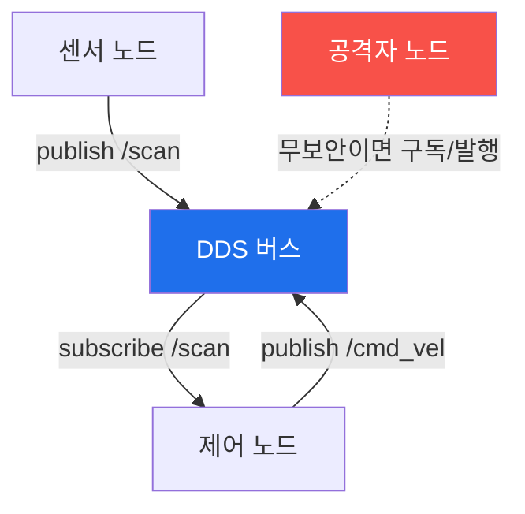

# autonomous-systems W10 — ROS2 보안: DDS·토픽 스니핑·명령 인젝션·SROS2

> **본 주차의 한 줄 요약**
>
> W09에서 본 로봇 미들웨어 **ROS2**를 심화한다. ROS2는 통신에 **DDS(Data Distribution Service)**를 쓴다 — 노드들이
> **토픽**을 발행/구독하는 분산 pub/sub 미들웨어. 문제는 **기본 DDS는 인증·암호화가 없다**는 것이다: ① **토픽 스니핑** —
> 같은 네트워크(또는 멀티캐스트 도달 범위)에 붙으면 `ros2 topic list/echo`로 모든 토픽을 감청한다(로봇 위치·센서·
> 카메라·명령 노출). ② **명령 인젝션** — 인증이 없으니 공격자가 `/cmd_vel`(속도 명령)·`/joint_trajectory`(관절 명령)
> 같은 제어 토픽에 직접 발행해 로봇을 움직인다(팔 휘두르기·이동 로봇 폭주). MAVLink 인젝션(W03)의 로봇판. ③ **노드
> 사칭·서비스 남용** — 가짜 노드가 정당한 노드인 척, 서비스 호출 남용. 이 공격들은 ROS 네트워크가 무방비일 때 로봇을
> 완전히 조종하게 한다 — 물리 사고. 방어는 **SROS2(Secure ROS2)**다: ① 인증(노드 신원을 인증서로 검증), ② 암호화
> (DDS 통신 암호화로 스니핑 방어), ③ 접근 제어(노드별 허용 토픽/서비스 제한, 최소 권한). SROS2는 DDS-Security 표준
> 기반이며 **켜야** 안전하다. 실습에서는 토픽 스니핑을 이해하고(마커 `TOPIC_SNIFFED`), 명령 인젝션을 탐지하며(마커
> `COMMAND_INJECTED`), SROS2를 적용한다(마커 `SROS2_ENFORCED`).

---

## 학습 목표

본 주차 종료 시 학생은 다음 5가지를 **본인 손으로** 할 수 있어야 한다.

1. ROS2의 DDS pub/sub 구조와 무보안 문제를 설명한다.
2. **토픽 스니핑**을 이해·탐지한다(마커 `TOPIC_SNIFFED`).
3. 제어 토픽 **명령 인젝션**을 탐지한다(마커 `COMMAND_INJECTED`).
4. **SROS2**(인증·암호·접근 제어)를 적용한다(마커 `SROS2_ENFORCED`).
5. 왜 SROS2를 켜야 안전한지 종합한다(마커 `Assessment`).

> **이 주차의 시선** — ROS2 DDS의 무보안을 공격으로 이해하고, SROS2 세 겹(인증·암호·접근 제어)으로 막는다.

---

## 0. 용어 해설 (ROS2 보안)

| 용어 | 영문 | 뜻 | 비유 |
|------|------|----|------|
| **DDS** | Data Distribution Service | ROS2의 pub/sub 통신 미들웨어 | 회람 시스템 |
| **토픽** | Topic | 발행/구독하는 메시지 채널 | 방송 채널 |
| **cmd_vel** | — | 로봇 속도 명령 토픽 | 조종 명령 |
| **노드 사칭** | Node Spoofing | 가짜 노드가 정당 노드인 척 | 위장 |
| **SROS2** | Secure ROS2 | ROS2 보안(DDS-Security 기반) | 보안 계층 |
| **접근 제어** | Access Control | 노드별 허용 토픽/서비스 제한 | 권한 명단 |
| **인증서** | Certificate | 노드 신원을 증명하는 자격 | 신분증 |

> **헷갈리기 쉬운 한 쌍 — 토픽 스니핑 vs 명령 인젝션.** *스니핑*은 토픽을 읽는 것(감청·정찰), *인젝션*은 제어 토픽에
> 쓰는 것(로봇 조종)이다. 무보안 DDS는 둘 다 가능하다 — 암호화가 스니핑을, 인증·접근 제어가 인젝션을 막는다.

---

## 0.5 신입생 친화 핵심 개념

### 0.5.1 DDS pub/sub

노드들이 DDS 버스로 토픽을 주고받는다. **무보안이면** 공격자 노드도 붙어 구독(스니핑)·발행(인젝션)할 수 있다.
IoT MQTT와 같은 pub/sub 위험이다.

### 0.5.2 토픽 스니핑

기본 DDS는 암호화가 없어, 네트워크에 붙으면 `ros2 topic list`로 토픽을 나열하고 `ros2 topic echo /camera`로 영상·
위치·센서·명령을 감청한다. 로봇의 모든 정보가 노출 — 정찰·프라이버시 침해.

### 0.5.3 명령 인젝션

인증이 없으니 공격자가 제어 토픽에 발행한다: `/cmd_vel`에 속도 명령→로봇 이동, `/joint_trajectory`에 관절 명령→로봇
팔 움직임. 정당한 노드인 척 발행하면 로봇이 따른다. 물리 사고(충돌·타격)로 직결된다.

### 0.5.4 SROS2 방어

**SROS2**(DDS-Security 기반)는 세 겹으로 막는다.

- **인증(Authentication)**: 각 노드가 인증서로 신원 증명 → 가짜 노드 차단.
- **암호화(Encryption)**: DDS 통신 암호화 → 토픽 스니핑 방어.
- **접근 제어(Access Control)**: 노드별 허용 토픽/서비스 제한(최소 권한) → 센서 노드가 /cmd_vel 발행 못 하게.

SROS2를 켜면 무보안 DDS의 스니핑·인젝션이 막힌다. 단 **기본 꺼짐**이라 명시적으로 설정해야 한다.

### 0.5.5 el34 맥락

ROS2/DDS는 실물 로봇·ROS 환경이 필요하다. 이번 실습은 **토픽 스니핑·명령 인젝션·SROS2 접근 제어 로직**을 결정론
시뮬로 익힌다(실제 ROS2 공격은 로봇·네트워크 환경 필요).

---

## 1. ROS2 보안 상세 — 스니핑·인젝션·SROS2

### 1.1 토픽 스니핑 (TOPIC_SNIFFED)

- **한 줄 정의**: 무암호 DDS에서 토픽을 감청한다.
- **왜 중요한가**: 로봇 정보 노출은 정찰·프라이버시 침해이자 인젝션의 사전 단계.
- **el34 맥락에서 어떻게**: 토픽 나열·echo로 감청 가능함을 확인하면 `TOPIC_SNIFFED`.
- **한계/주의**: 암호화(SROS2)가 없으면 근본적으로 막기 어렵다.

### 1.2 명령 인젝션 (COMMAND_INJECTED)

- **한 줄 정의**: 제어 토픽에 위조 명령을 발행해 로봇을 움직인다.
- **핵심**: 인증 부재로 누구나 /cmd_vel 발행. 정당 노드 사칭.
- **판정**: 제어 토픽 인젝션이 탐지/재현되면 `COMMAND_INJECTED`.

### 1.3 SROS2 강화 (SROS2_ENFORCED)

- **한 줄 정의**: 인증·암호화·접근 제어를 활성해 스니핑·인젝션을 막는다.
- **핵심**: 인증서 기반 노드 인증 + 통신 암호화 + 노드별 토픽 권한.
- **판정**: SROS2가 적용돼 무단 구독/발행이 차단되면 `SROS2_ENFORCED`.

---

## 2. 실습 안내 (총 5 미션)

실행 위치는 el34 **호스트**(`ssh ccc@{{TARGET_IP}}`, 비밀번호 `1`), 참고 GPU는 Ollama
(`http://211.170.162.139:10934`, gemma3:4b)다. ⚠️ ROS2는 실물 로봇·환경이 필요해 스니핑·인젝션·SROS2 로직을 결정론
시뮬로 익힌다. 각 미션의 마지막 줄 마커가 채점 기준이다.

### 미션 1 — GPU 헬스체크 → `GEN_OK`

> **왜 하는가?** 분석·종합에 쓸 LLM 도달·응답 확인.
> **무엇을 아는가?** Ollama 응답 형식·도달성.
> **결과 해석** — 정상 `GEN_OK` / 비정상 `GEN_EMPTY`·연결 오류.
> **실전 활용** — 종합 소견 작성에 사용.

### 미션 2 — 토픽 스니핑 → `TOPIC_SNIFFED`

> **왜 하는가?** 무암호 DDS의 감청 위험을 이해한다.
> **무엇을 아는가?** 토픽 나열·echo 감청.
> **결과 해석** — 정상: 스니핑 이해 + `TOPIC_SNIFFED`.
> **실전 활용** — ROS2 정찰·감청 위험 평가.

### 미션 3 — 명령 인젝션 → `COMMAND_INJECTED`

> **왜 하는가?** 제어 토픽 인젝션이 로봇 폭주로 이어짐을 확인한다.
> **무엇을 아는가?** /cmd_vel 발행·노드 사칭.
> **결과 해석** — 정상: 인젝션 + `COMMAND_INJECTED`.
> **실전 활용** — ROS2 제어 인젝션 위험.

### 미션 4 — SROS2 강화 → `SROS2_ENFORCED`

> **왜 하는가?** 인증·암호·접근 제어로 스니핑·인젝션을 막는다.
> **무엇을 아는가?** 인증서·암호화·토픽 권한.
> **결과 해석** — 정상: 강화 + `SROS2_ENFORCED`.
> **실전 활용** — ROS2 보안 배포.

### 미션 5 — 종합 소견 → `Assessment`

> **왜 하는가?** 스니핑·인젝션·SROS2와 "켜야 안전"을 소견으로 묶는다.
> **무엇을 아는가?** GPU에 요약시키되 첫 줄을 `Assessment`로 강제.
> **결과 해석** — 정상: `Assessment` 포함. 없으면 `[형식 미준수 — 재실행]`.
> **실전 활용** — ROS2 보안 개요.

---

## 3. 흔한 오해·관제자 노트

- **"ROS2는 최신이라 안전하다."** — 기본 DDS는 무보안이다. SROS2를 켜야 한다.
- **"토픽은 내부라 안전하다."** — 네트워크에 붙으면 감청된다. 암호화가 필요하다.
- **"제어 토픽은 보호된다."** — 인증이 없으면 누구나 발행한다. 접근 제어가 필요하다.
- **"SROS2는 성능을 떨어뜨린다."** — 무보안 DDS는 로봇 폭주로 이어진다. 보안이 안전이다.
- **관제(Blue) 관점** — ROS2에 (1) SROS2 인증·암호·접근 제어가 켜졌는가, (2) 제어 토픽이 인가 노드만 발행하는가,
  (3) 무단 노드가 차단되는가를 점검한다.

---

## 4. 다음 주차 (W11) 예고 — OT/ICS 보안

W10이 "ROS2 보안"이었다면, W11은 **OT/ICS(산업 제어)**를 다룬다. PLC·Modbus·SCADA·Stuxnet을 익힌다 — 자율
시스템이 산업 현장과 만나는 지점의 보안이다.
