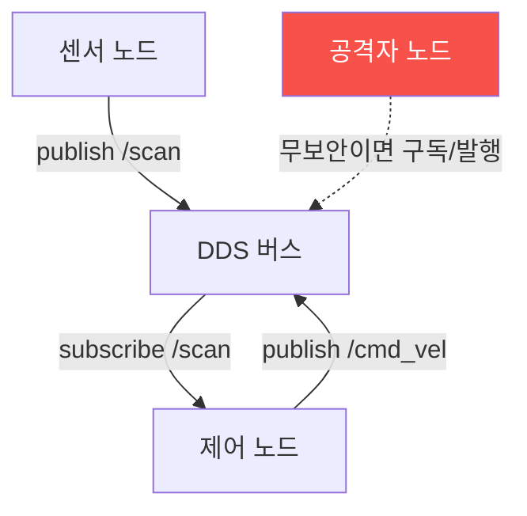

# autonomous-systems W10 — ROS2 보안: DDS·토픽 스니핑·명령 인젝션·SROS2

> **본 주차의 한 줄 요약**
>
> W09에서 본 로봇 미들웨어 **ROS2**를 심화한다. ROS2는 통신에 **DDS(Data Distribution Service)** 를 쓴다 —
> 노드들이 **토픽**을 발행/구독하는 분산 pub/sub 미들웨어. 문제는 **기본 DDS는 인증·암호화가 없다**는 것: ①
> **토픽 스니핑** — 같은 네트워크(또는 멀티캐스트 도달 범위)에 붙으면 `ros2 topic list/echo`로 **모든 토픽을
> 감청**한다. 로봇 위치·센서·카메라·명령이 그대로 노출, ② **명령 인젝션** — 인증이 없으니 공격자가 `/cmd_vel`
> (속도 명령)·`/joint_trajectory`(관절 명령) 같은 **제어 토픽에 직접 발행**해 로봇을 움직인다(팔 휘두르기·이동
> 로봇 폭주). MAVLink 인젝션(W03)의 로봇판, ③ **노드 사칭·서비스 남용** — 가짜 노드가 정당한 노드인 척, 서비스
> 호출 남용. 이 공격들은 ROS 네트워크가 무방비일 때 로봇을 완전히 조종하게 한다 — 물리 사고. 방어는 **SROS2
> (Secure ROS2)**: ① **인증(authentication)** — 노드 신원을 인증서로 검증, ② **암호화(encryption)** — DDS 통신
> 암호화로 스니핑 방어, ③ **접근 제어(access control)** — 노드별 허용 토픽/서비스 제한(최소 권한, iot MQTT ACL과
> 유사). SROS2는 DDS-Security 표준 기반이며, **켜야** 안전하다. 이번 주는 ROS2 공격(스니핑·인젝션)과 SROS2 방어를
> 구체적으로 익힌다.
>
> **한 줄 결론**: ROS2의 DDS는 기본 무보안이라 **토픽 스니핑·명령 인젝션**에 취약하다. 방어 = **SROS2(인증·
> 암호화·접근 제어)** — DDS-Security 기반, 반드시 켠다.

---

## 학습 목표

본 주차 종료 시 학생은 다음 5가지를 **본인 손으로** 할 수 있어야 한다.

1. ROS2 **DDS** pub/sub 구조를 설명한다.
2. **토픽 스니핑**을 탐지·이해한다(TOPIC_SNIFFED).
3. **명령 인젝션**을 탐지한다(COMMAND_INJECTED).
4. **SROS2**(인증·암호·접근 제어)를 적용한다(SROS2_ENFORCED).
5. 왜 SROS2를 켜야 안전한지 설명한다.

> **이 주차의 시선** — ROS2 DDS의 무보안을 공격으로 이해하고, SROS2로 막는다.

---

## 0. 용어 해설 (ROS2 보안)

| 용어 | 영문 | 뜻 | 비유 |
|------|------|----|------|
| **DDS** | Data Distribution Service | ROS2 통신 미들웨어 | 회람 시스템 |
| **토픽** | Topic | pub/sub 채널 | 방송 채널 |
| **cmd_vel** | — | 속도 명령 토픽 | 조종 명령 |
| **SROS2** | Secure ROS2 | ROS2 보안 | 보안 계층 |
| **DDS-Security** | — | DDS 보안 표준 | 보안 규격 |

> **헷갈리기 쉬운 한 쌍** — *토픽 스니핑* 은 "감청(읽기)", *명령 인젝션* 은 "제어 토픽에 발행(쓰기)"이다. 무보안
> DDS는 둘 다 가능.

---

## 0.5 신입생 친화 핵심 개념

### 0.5.1 DDS pub/sub

노드들이 DDS 버스로 토픽을 주고받는다. **무보안이면** 공격자 노드도 붙어 구독(스니핑)·발행(인젝션)할 수 있다.
iot MQTT(W02)와 같은 pub/sub 위험.

### 0.5.2 토픽 스니핑

기본 DDS는 암호화가 없어, 네트워크에 붙으면 `ros2 topic list`로 토픽을 나열하고 `ros2 topic echo /camera`로
**영상·위치·센서·명령을 감청**한다. 로봇의 모든 정보가 노출 — 정찰·프라이버시 침해.

### 0.5.3 명령 인젝션

인증이 없으니 공격자가 **제어 토픽에 발행**한다: `/cmd_vel`에 속도 명령→로봇 이동, `/joint_trajectory`에 관절
명령→로봇 팔 움직임. 정당한 노드인 척 발행하면 로봇이 따른다. 물리 사고(충돌·타격)로 직결.

### 0.5.4 SROS2 방어

**SROS2**(DDS-Security 기반)는 세 겹으로 막는다:
- **인증(Authentication)**: 각 노드가 **인증서**로 신원 증명 → 가짜 노드 차단.
- **암호화(Encryption)**: DDS 통신 암호화 → 토픽 스니핑 방어.
- **접근 제어(Access Control)**: 노드별 **허용 토픽/서비스** 제한(최소 권한) → 센서 노드가 /cmd_vel 발행 못 하게.
SROS2를 켜면 무보안 DDS의 스니핑·인젝션이 막힌다. 단 **기본 꺼짐**이라 명시적으로 설정해야 한다.

### 0.5.5 el34 맥락

ROS2/DDS는 실물 로봇·ROS 환경이 필요하다. 본 실습은 **토픽 스니핑·명령 인젝션·SROS2 접근 제어 로직**을 결정론
시뮬로 익힌다. 실제 ROS2 공격은 로봇·네트워크 환경이 필요함을 명시한다.

---

## 1. 실습 안내 (5 미션)

실행 위치 el34 **호스트**(`ssh ccc@{{TARGET_IP}}`), GPU `http://211.170.162.139:10934`.
⚠️ ROS2는 실물 로봇·환경 필요 → 본 실습은 스니핑·인젝션·SROS2 로직 결정론 시뮬.

### STEP 1 — GPU 헬스체크 → GEN_OK
### STEP 2 — 토픽 스니핑 → TOPIC_SNIFFED
### STEP 3 — 명령 인젝션 → COMMAND_INJECTED
### STEP 4 — SROS2 강화 → SROS2_ENFORCED
### STEP 5 — 종합 → Assessment

---

## 2. 흔한 오해·관제자 노트

- **"ROS2는 최신이라 안전"** — 기본 DDS는 무보안. SROS2 켜야.
- **"토픽은 내부라 안전"** — 네트워크 붙으면 감청. 암호화 필요.
- **"제어 토픽은 보호됨"** — 인증 없으면 누구나 발행. 접근 제어.
- **관제 관점** — ROS2에 SROS2(인증·암호·접근 제어)가 켜졌는지, 제어 토픽이 인가된 노드만 발행하는지 점검한다.
  DDS 무보안이 로봇 폭주로.

---

## 3. 다음 주차 (W11) 예고 — OT/ICS 보안

W10이 "ROS2 보안"이었다면, W11은 **OT/ICS**(산업 제어) — PLC·Modbus·SCADA·Stuxnet을 다룬다. 자율 시스템이
산업 현장과 만나는 지점의 보안이다.
