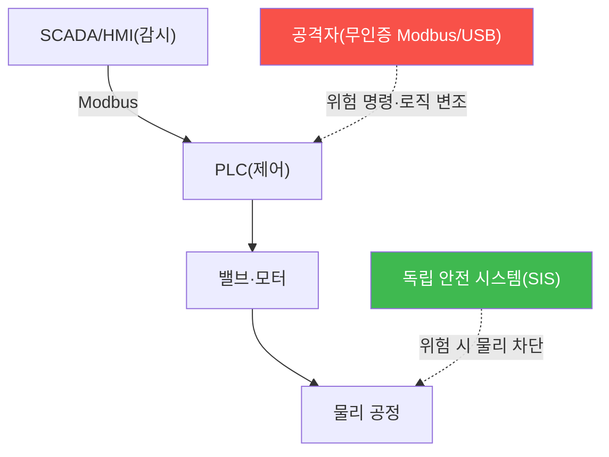

# autonomous-systems W11 — OT/ICS 보안: PLC·Modbus·SCADA·Stuxnet

> **본 주차의 한 줄 요약**
>
> 자율 시스템은 결국 **산업 현장(OT/ICS)**과 만난다 — 자동화 공장·물류·발전이 자율 로봇·제어 시스템으로 돌아간다.
> **OT(운영 기술)/ICS(산업 제어 시스템)**는 물리 공정을 제어하는 CPS의 산업판이다. 구성은 ① **PLC(Programmable
> Logic Controller)**(밸브·모터·센서를 제어하는 산업 컨트롤러, 래더 로직으로 프로그램), ② **SCADA/HMI**(감시·제어
> 인터페이스), ③ **산업 프로토콜(Modbus·DNP3·Profinet)**(대개 인증·암호화 없음 — 수십 년 전 설계)이다. OT 보안의
> 특수성은 **안전·가용성 최우선**(공정이 멈추거나 오작동하면 재앙)·**패치 불가**(24/7 가동)·**에어갭 신화**다. 공격은
> 무인증 Modbus로 PLC에 위험 명령(밸브 열기·모터 정지)을 보내거나 PLC 로직 자체를 조작한다. **Stuxnet**이 결정적
> 사례다 — 에어갭된 원심분리기를 USB로 침투해 PLC 로직을 변조, 원심분리기를 물리 파괴하면서 HMI에는 정상으로 위장
> (운영자가 못 알아채게). 교훈은 (1) 에어갭도 뚫린다, (2) OT 공격은 물리 파괴, (3) 센서/HMI 값 조작으로 은폐다.
> 실습에서는 PLC/Modbus 취약성을 평가하고(마커 `ICS_VULNERABLE`), Stuxnet식 패턴을 이해하며(마커 `STUXNET_PATTERN`),
> 분리·무결성·독립 안전으로 방어한다(마커 `ICS_DEFENDED`). 방어는 **Purdue 분리·명령 화이트리스트·PLC 로직 무결성·
> 독립 안전 계기 시스템(SIS)**이다.

---

## 학습 목표

본 주차 종료 시 학생은 다음 5가지를 **본인 손으로** 할 수 있어야 한다.

1. OT/ICS 구성(PLC·SCADA·Modbus)과 IT와의 차이(안전·가용성 우선)를 설명한다.
2. **PLC/Modbus 취약성**을 평가한다(마커 `ICS_VULNERABLE`).
3. **Stuxnet식 공격**(로직 변조+HMI 위장)을 이해한다(마커 `STUXNET_PATTERN`).
4. **분리·무결성·독립 안전**으로 방어한다(마커 `ICS_DEFENDED`).
5. 왜 OT는 안전 최우선이며 에어갭이 신화인지 종합한다(마커 `Assessment`).

> **이 주차의 시선** — 자율 산업 시스템의 OT 위험을 분리와 독립 안전으로 막는다. "에어갭도 뚫린다"와 "물리 파괴 +
> 은폐"가 핵심이다.

---

## 0. 용어 해설 (OT/ICS)

| 용어 | 영문 | 뜻 | 비유 |
|------|------|----|------|
| **PLC** | Programmable Logic Controller | 밸브·모터를 제어하는 산업 컨트롤러 | 공정 두뇌 |
| **SCADA/HMI** | — | 공정 감시·제어 시스템/인터페이스 | 관제 화면 |
| **Modbus** | — | 인증·암호가 없는 산업 통신 프로토콜 | 낡은 명령선 |
| **Purdue 모델** | — | IT/OT를 계층(0~5)으로 분리하는 기준 | 층별 방화벽 |
| **Stuxnet** | — | PLC 로직을 변조해 물리 파괴한 악성코드 | 물리 파괴 웜 |
| **SIS** | Safety Instrumented System | 제어와 분리된 독립 안전 차단 시스템 | 비상 차단 |
| **에어갭** | Air Gap | 네트워크를 물리적으로 분리 | 섬처럼 고립 |

> **헷갈리기 쉬운 한 쌍 — 제어 시스템 vs 독립 안전 시스템(SIS).** *제어 시스템*(PLC·SCADA)은 공정을 운영한다(뚫리면
> 위험). *SIS*는 위험 시 공정을 물리적으로 차단하는 **분리된** 안전 계층이다. 제어가 뚫려도 SIS가 최후 보루로 안전을
> 지킨다.

---

## 0.5 신입생 친화 핵심 개념

### 0.5.1 OT/ICS 구조

HMI가 PLC를 감시·제어, PLC가 밸브·모터를 움직인다. 무인증 Modbus·USB로 PLC를 조작하면 물리 재앙이다. SIS가 최후
안전 차단이다.

### 0.5.2 무인증 프로토콜·위험 명령

Modbus·DNP3는 인증·암호화가 없어, 네트워크에 붙으면 PLC에 위험 명령을 보낸다: 밸브 강제 개방·모터 과속·안전 인터록
해제. 자율 산업 시스템이 무인증 OT에 의존하면 그 표면이 그대로 위험이 된다.

### 0.5.3 Stuxnet — 로직 변조와 은폐

Stuxnet은 두 가지를 했다: (1) **PLC 래더 로직 변조** — 원심분리기 회전을 이상하게 조작해 물리 파괴, (2) **HMI 위장** —
조작 중에도 운영자 화면엔 정상값을 보여 못 알아채게. 이 "물리 파괴 + 은폐"가 OT 공격의 전형이다. 방어는 로직 무결성
검증과 다중 소스 상태 확인이 필요하다.

### 0.5.4 방어 — 분리·무결성·독립 안전

- **네트워크 분리(Purdue 모델)**: IT/OT 계층 분리(0~5), 방화벽·DMZ·데이터 다이오드. IT 침해가 OT로 못 가게.
- **명령 화이트리스트·이상 탐지**: 허용된 명령만, 위험 명령·비정상 로직 변경 탐지.
- **PLC 로직 무결성**: 로직 변경 감지·서명 검증(Stuxnet식 변조 탐지).
- **독립 안전 시스템(SIS)**: 제어와 분리된 안전 계층이 위험 시 물리적으로 차단 — 보안이 뚫려도 안전.

안전을 절대 우선하며 보안을 더한다.

### 0.5.5 el34 맥락

OT/ICS는 실물 산업 장비가 필요하다. 이번 실습은 **Modbus 취약성·Stuxnet 패턴·분리 방어 로직**을 실제 아티팩트 분석으로
익힌다. 실제 OT 테스트는 물리 안전을 절대 우선하며 극도로 신중해야 함을 명시한다.

---

## 1. OT/ICS 상세 — 취약성·Stuxnet·방어

### 1.1 PLC/Modbus 취약성 (ICS_VULNERABLE)

- **한 줄 정의**: 무인증 Modbus·PLC의 위험 명령 수용 여부를 평가한다.
- **왜 중요한가**: 무인증 프로토콜이 물리 파괴 명령의 입구다.
- **el34 맥락에서 어떻게**: Modbus 무인증·위험 명령 수용을 점검해 취약을 판정하면 `ICS_VULNERABLE`.
- **한계/주의**: OT는 패치가 어려워 분리·보상 통제가 현실적 방어다.

### 1.2 Stuxnet식 패턴 (STUXNET_PATTERN)

- **한 줄 정의**: 로직 변조 + HMI 위장의 은폐형 공격을 이해한다.
- **핵심**: PLC 로직을 바꾸면서 운영자 화면엔 정상값 → 물리 파괴를 숨김.
- **판정**: 로직 변조+은폐 패턴을 식별하면 `STUXNET_PATTERN`.

### 1.3 OT 방어 (ICS_DEFENDED)

- **한 줄 정의**: Purdue 분리·로직 무결성·명령 화이트리스트·SIS를 적용한다.
- **핵심**: 보안 계층 + 독립 안전 계층(SIS). 보안이 뚫려도 물리 안전 차단.
- **판정**: 방어가 적용되면 `ICS_DEFENDED`.

---

## 2. 실습 안내 (총 5 미션)

실행 위치는 el34 **호스트**(`ssh ccc@{{TARGET_IP}}`, 비밀번호 `1`), 참고 GPU는 Ollama
(`http://211.170.162.139:10934`, gemma3:4b)다. ⚠️ OT는 실물 장비·안전 최우선이라 취약성·공격 패턴·방어 로직을 결정론
실제 아티팩트 분석으로 익힌다. 각 미션의 마지막 줄 마커가 채점 기준이다.

### 미션 1 — GPU 헬스체크 → `GEN_OK`

> **왜 하는가?** 분석·종합에 쓸 LLM 도달·응답 확인.
> **무엇을 아는가?** Ollama 응답 형식·도달성.
> **결과 해석** — 정상 `GEN_OK` / 비정상 `GEN_EMPTY`·연결 오류.
> **실전 활용** — 종합 소견 작성에 사용.

### 미션 2 — PLC/Modbus 취약성 → `ICS_VULNERABLE`

> **왜 하는가?** 무인증 프로토콜의 위험 명령 수용을 평가한다.
> **무엇을 아는가?** Modbus 무인증·위험 명령.
> **결과 해석** — 정상: 취약 판정 + `ICS_VULNERABLE`.
> **실전 활용** — OT 취약성 진단.

### 미션 3 — Stuxnet식 공격 패턴 → `STUXNET_PATTERN`

> **왜 하는가?** 로직 변조+은폐의 전형을 이해한다.
> **무엇을 아는가?** PLC 로직 변조·HMI 위장.
> **결과 해석** — 정상: 패턴 식별 + `STUXNET_PATTERN`.
> **실전 활용** — 은폐형 OT 공격 탐지 전략.

### 미션 4 — OT 방어 → `ICS_DEFENDED`

> **왜 하는가?** 분리·무결성·독립 안전으로 물리 파괴를 막는다.
> **무엇을 아는가?** Purdue·로직 무결성·화이트리스트·SIS.
> **결과 해석** — 정상: 방어 + `ICS_DEFENDED`.
> **실전 활용** — OT 방어 아키텍처.

### 미션 5 — 종합 소견 → `Assessment`

> **왜 하는가?** 취약성·Stuxnet·방어와 "안전 최우선·에어갭 신화"를 소견으로 묶는다.
> **무엇을 아는가?** GPU에 요약시키되 첫 줄을 `Assessment`로 강제.
> **결과 해석** — 정상: `Assessment` 포함. 없으면 `[형식 미준수 — 재실행]`.
> **실전 활용** — OT 보안 개요.

---

## 2.5 과제 (제출물)

- **A. PLC/Modbus 취약성 실증 (필수, 40점)** — `ICS_VULNERABLE` 단계를 직접 수행해 실제 명령·출력(또는 아티팩트 분석 결과)을 캡처하고, 무엇을 근거로 판정했는지 서술한다.
- **B. Stuxnet식 패턴 분석 (필수, 30점)** — `STUXNET_PATTERN` 단계를 직접 수행해 실제 명령·출력(또는 아티팩트 분석 결과)을 캡처하고, 무엇을 근거로 판정했는지 서술한다.
- **C. OT 방어 방어 설계 (필수, 30점)** — `ICS_DEFENDED` 단계를 직접 수행해 실제 명령·출력(또는 아티팩트 분석 결과)을 캡처하고, 무엇을 근거로 판정했는지 서술한다.

## 2.6 평가 기준

| 항목 | 미흡(0) | 보통 | 우수 |
|------|---------|------|------|
| 탐지/실증(ICS_VULNERABLE) | 미수행 | 마커 도출 | 근거·해석·재현까지 |
| 분석(STUXNET_PATTERN) | 미수행 | 마커 도출 | 근거·해석·재현까지 |
| 방어(ICS_DEFENDED) | 미수행 | 마커 도출 | 근거·해석·재현까지 |

## 2.7 핵심 정리 (1줄씩)

- 이번 주 주제: **OT/ICS 보안: PLC·Modbus·SCADA·Stuxnet**.
- **PLC/Modbus 취약성**(`ICS_VULNERABLE`): 무인증 Modbus·PLC의 위험 명령 수용 여부를 평가한다.
- **Stuxnet식 패턴**(`STUXNET_PATTERN`): 로직 변조 + HMI 위장의 은폐형 공격을 이해한다.
- **OT 방어**(`ICS_DEFENDED`): Purdue 분리·로직 무결성·명령 화이트리스트·SIS를 적용한다.
- 공격을 이해한 만큼 **방어의 우선순위**가 분명해진다 — 탐지 근거와 완화를 함께 익힌다.

---

## 3. 흔한 오해·관제자 노트

- **"에어갭이니 안전하다."** — Stuxnet은 USB로 뚫었다. 분리 + 무결성이 필요하다.
- **"HMI가 정상이면 괜찮다."** — Stuxnet은 HMI를 위장했다. 다중 소스 상태 확인이 필요하다.
- **"IT 보안 그대로 쓰면 된다."** — OT는 안전·가용성 우선이다. 독립 SIS가 필수.
- **"OT는 패치하면 된다."** — 24/7 가동이라 패치가 어렵다. 분리·보상 통제가 현실적이다.
- **관제(Blue) 관점** — (1) IT/OT가 Purdue로 분리됐는가, (2) PLC 로직 무결성·명령 화이트리스트가 있는가, (3) 독립
  SIS가 있는가, (4) 다중 소스로 은폐를 탐지하는가를 점검한다. OT는 물리 안전 절대 우선.

---

## 4. 다음 주차 (W12) 예고 — V2X/자동차 보안

W11이 "OT/ICS"였다면, W12는 **V2X/자동차 보안**을 다룬다. CAN 버스·ECU·커넥티드카를 익힌다 — 자율주행(W06·W07)의
차량 내부·차량 간 통신 보안이다.
