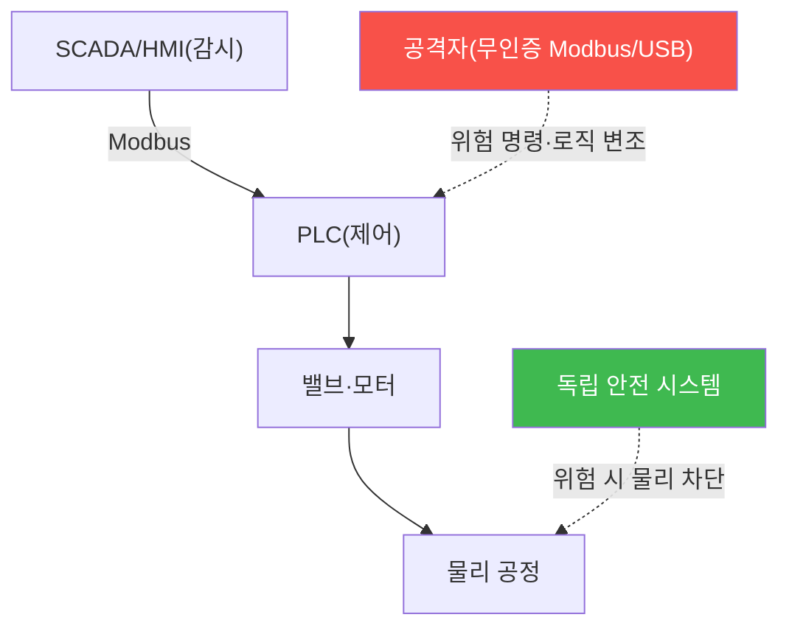

# autonomous-systems W11 — OT/ICS 보안: PLC·Modbus·SCADA·Stuxnet

> **본 주차의 한 줄 요약**
>
> 자율 시스템은 결국 **산업 현장(OT/ICS)** 과 만난다 — 자동화 공장·물류·발전이 자율 로봇·제어 시스템으로 돌아간다.
> **OT(운영 기술)/ICS(산업 제어 시스템)** 는 물리 공정을 제어하는 CPS의 산업판이다. 구성: ① **PLC(Programmable
> Logic Controller)** — 밸브·모터·센서를 제어하는 산업 컨트롤러(래더 로직으로 프로그램), ② **SCADA/HMI** — 감시·
> 제어 인터페이스, ③ **산업 프로토콜(Modbus·DNP3·Profinet)** — 대개 **인증·암호화 없음**(수십 년 전 설계). OT
> 보안의 특수성(iot-security W12와 공통): **안전·가용성 최우선**(공정이 멈추거나 오작동하면 재앙), **패치 불가**
> (24/7 가동), **에어갭 신화**. 공격: 무인증 Modbus로 PLC에 **위험 명령**(밸브 열기·모터 정지)을 보내거나, PLC
> 로직 자체를 조작한다. **Stuxnet**이 결정적 사례 — 에어갭된 원심분리기를 USB로 침투해 **PLC 로직을 변조**,
> 원심분리기를 물리 파괴하면서 **HMI에는 정상으로 위장**(운영자가 못 알아채게). 교훈: (1) 에어갭도 뚫린다, (2) OT
> 공격은 물리 파괴, (3) 센서/HMI 값 조작으로 은폐. 방어: **네트워크 분리(Purdue 모델)** — IT/OT 계층 분리,
> **명령 화이트리스트·이상 탐지**, **PLC 로직 무결성 검증**, **독립 안전 계기 시스템(SIS)** — 보안 뚫려도 물리
> 안전 정지. 자율 산업 시스템이 늘수록 OT 보안은 더 중요해진다.
>
> **한 줄 결론**: OT/ICS는 안전·가용성 최우선인데 PLC·Modbus가 무인증이라 위험 명령·로직 변조(Stuxnet)에 취약하다.
> 방어 = **Purdue 분리 + 명령 화이트리스트 + PLC 로직 무결성 + 독립 안전 시스템(SIS)**.

---

## 학습 목표

본 주차 종료 시 학생은 다음 5가지를 **본인 손으로** 할 수 있어야 한다.

1. OT/ICS 구성(PLC·SCADA·Modbus)과 IT와의 차이를 설명한다.
2. **PLC/Modbus 취약성**을 평가한다(ICS_VULNERABLE).
3. **Stuxnet식 공격**(로직 변조+HMI 위장)을 이해한다(STUXNET_PATTERN).
4. **분리·무결성·독립 안전**으로 방어한다(ICS_DEFENDED).
5. 왜 OT는 안전 최우선인지 설명한다.

> **이 주차의 시선** — 자율 산업 시스템의 OT 위험을, 분리와 독립 안전으로 막는다.

---

## 0. 용어 해설 (OT/ICS)

| 용어 | 영문 | 뜻 | 비유 |
|------|------|----|------|
| **PLC** | Programmable Logic Controller | 산업 컨트롤러 | 공정 두뇌 |
| **SCADA/HMI** | — | 감시 제어/인터페이스 | 관제 화면 |
| **Modbus** | — | 무인증 산업 프로토콜 | 낡은 명령선 |
| **Stuxnet** | — | PLC 파괴 악성코드 | 물리 파괴 웜 |
| **SIS** | Safety Instrumented System | 독립 안전 시스템 | 비상 차단 |

> **헷갈리기 쉬운 한 쌍** — *제어 시스템* 은 "공정 운영(뚫리면 위험)", *독립 안전 시스템(SIS)* 은 "위험 시 물리
> 차단(보안과 분리)"이다. SIS가 최후 보루.

---

## 0.5 신입생 친화 핵심 개념

### 0.5.1 OT/ICS 구조

HMI가 PLC를 감시·제어, PLC가 밸브·모터를 움직인다. 무인증 Modbus·USB로 PLC를 조작하면 물리 재앙. SIS가 최후
안전 차단.

### 0.5.2 무인증 프로토콜·위험 명령

Modbus·DNP3는 인증·암호화가 없어, 네트워크에 붙으면 PLC에 **위험 명령**을 보낸다: 밸브 강제 개방·모터 과속·
안전 인터록 해제. iot-security W12와 동일 원리. 자율 산업 시스템이 무인증 OT에 의존하면 그 표면이 그대로 위험.

### 0.5.3 Stuxnet — 로직 변조와 은폐

Stuxnet은 두 가지를 했다: (1) **PLC 래더 로직 변조** — 원심분리기 회전을 이상하게 조작해 물리 파괴, (2) **HMI
위장** — 조작 중에도 운영자 화면엔 정상값을 보여 **못 알아채게**. 이 "물리 파괴 + 은폐"가 OT 공격의 전형.
방어는 로직 무결성 검증과 다중 소스 상태 확인이 필요.

### 0.5.4 방어 — 분리·무결성·독립 안전

- **네트워크 분리(Purdue 모델)**: IT/OT 계층 분리(0~5), 방화벽·DMZ·데이터 다이오드. IT 침해가 OT로 못 가게.
- **명령 화이트리스트·이상 탐지**: 허용된 명령만, 위험 명령·비정상 로직 변경 탐지.
- **PLC 로직 무결성**: 로직 변경 감지·서명 검증(Stuxnet식 변조 탐지).
- **독립 안전 시스템(SIS)**: 제어와 **분리된** 안전 계층이 위험 시 물리적으로 차단 — 보안 뚫려도 안전.
안전을 절대 우선하며 보안을 더한다.

### 0.5.5 el34 맥락

OT/ICS는 실물 산업 장비가 필요하다. 본 실습은 **Modbus 취약성·Stuxnet 패턴·분리 방어 로직**을 결정론 시뮬로
익힌다. 실제 OT 테스트는 물리 안전을 절대 우선하며 극도로 신중해야 함을 명시한다.

---

## 1. 실습 안내 (5 미션)

실행 위치 el34 **호스트**(`ssh ccc@{{TARGET_IP}}`), GPU `http://211.170.162.139:10934`.
⚠️ OT는 실물 장비·안전 최우선 → 본 실습은 취약성·공격 패턴·방어 로직 결정론 시뮬.

### STEP 1 — GPU 헬스체크 → GEN_OK
### STEP 2 — PLC/Modbus 취약성 → ICS_VULNERABLE
### STEP 3 — Stuxnet식 공격 패턴 → STUXNET_PATTERN
### STEP 4 — OT 방어 → ICS_DEFENDED
### STEP 5 — 종합 → Assessment

---

## 2. 흔한 오해·관제자 노트

- **"에어갭이니 안전"** — Stuxnet은 USB로 뚫었다. 분리+무결성.
- **"HMI가 정상이면 OK"** — Stuxnet은 HMI를 위장. 다중 소스 확인.
- **"IT 보안 그대로"** — OT는 안전·가용성 우선. 독립 SIS.
- **관제 관점** — IT/OT가 Purdue로 분리됐는지, PLC 로직 무결성·명령 화이트리스트·독립 SIS가 있는지 점검한다.
  OT는 물리 안전 절대 우선.

---

## 3. 다음 주차 (W12) 예고 — V2X/자동차 보안

W11이 "OT/ICS"였다면, W12는 **V2X/자동차 보안** — CAN 버스·ECU·커넥티드카를 다룬다. 자율주행(W06·W07)의 차량
내부·차량 간 통신 보안이다.
