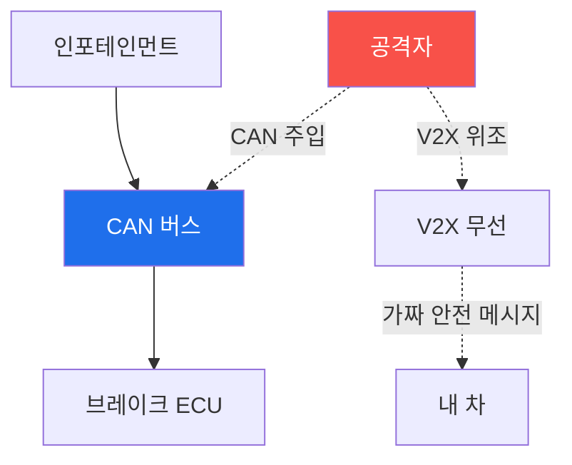

# autonomous-systems W12 — V2X/자동차 보안: CAN 버스·ECU·커넥티드카

> **본 주차의 한 줄 요약**
>
> 자율주행(W06·W07)의 차량은 **내부 네트워크(CAN)**와 **외부 통신(V2X)**을 모두 보안해야 한다. ① **CAN 버스·ECU
> (내부)** — 차량은 수십~수백 ECU가 CAN 버스로 연결돼 엔진·브레이크·조향을 제어한다. CAN은 1980년대 설계라 **인증·
> 암호화가 없고 브로드캐스트**라, 약한 ECU(인포테인먼트) 하나 뚫으면 CAN에 위조 메시지를 주입해 브레이크·조향을
> 속인다(Jeep 해킹). ② **V2X(Vehicle-to-Everything, 외부)** — 커넥티드/자율 차는 다른 차(V2V)·인프라(V2I, 신호등)·
> 보행자(V2P)와 무선 통신해 안전 정보(위치·속도·경고)를 교환한다. 문제는 V2X 메시지가 **위조**되면 심각하다는 것이다 —
> 가짜 "급정거 경고"·"유령 차량"·가짜 신호등 상태를 방송해 차량들이 잘못 반응(급브레이크·사고). 또 V2X는 위치를
> 방송해 **프라이버시** 문제도 있다. 실습에서는 CAN/V2X 취약성을 평가하고(마커 `V2X_VULNERABLE`), 위조 V2X 안전
> 메시지를 탐지하며(마커 `MESSAGE_SPOOFED`), PKI 서명·오작동 탐지로 방어한다(마커 `V2X_SECURED`). 방어는 **(CAN)
> 도메인 분리·SecOC 메시지 인증·차량 IDS, (V2X) PKI 메시지 서명(IEEE 1609.2)·오작동 탐지·가명 프라이버시**다. 자율주행
> 안전은 믿을 수 있는 V2X와 무결한 CAN에 달렸다.

---

## 학습 목표

본 주차 종료 시 학생은 다음 5가지를 **본인 손으로** 할 수 있어야 한다.

1. 차량 CAN(내부)·V2X(외부) 보안을 구분해 설명한다.
2. **CAN/V2X 취약성**을 평가한다(마커 `V2X_VULNERABLE`).
3. **위조 V2X 안전 메시지**를 탐지한다(마커 `MESSAGE_SPOOFED`).
4. **PKI 서명·오작동 탐지**로 방어한다(마커 `V2X_SECURED`).
5. 위조 V2X가 왜 연쇄 사고로 이어지는지 종합한다(마커 `Assessment`).

> **이 주차의 시선** — 차량 내부·외부 통신의 무인증 위험을 메시지 인증과 오작동 탐지로 막는다. "서명만으로는 부족
> (정당한 참여자의 거짓 정보)"이 핵심이다.

---

## 0. 용어 해설 (V2X/자동차)

| 용어 | 영문 | 뜻 | 비유 |
|------|------|----|------|
| **CAN** | Controller Area Network | ECU들을 잇는 차량 내부망(무인증·브로드캐스트) | 내부 신경망 |
| **ECU** | Electronic Control Unit | 엔진·브레이크·조향 등을 제어하는 유닛 | 부위별 제어기 |
| **V2X** | Vehicle-to-Everything | 차-차·차-인프라·차-보행자 무선 통신 | 차간 대화 |
| **SecOC** | Secure Onboard Communication | CAN 메시지 인증 표준 | 내부 서명 |
| **PKI** | Public Key Infrastructure | 공개키 기반 신뢰 체계(서명 검증) | 인감 등록소 |
| **오작동 탐지** | Misbehavior Detection | 서명은 유효해도 모순된 메시지를 배제 | 거짓말 탐지 |
| **가명 인증서** | Pseudonym Certificate | 위치 추적 방지용 순환 인증서 | 익명 신분증 |

> **헷갈리기 쉬운 한 쌍 — CAN vs V2X.** *CAN*은 차량 내부(ECU 간), *V2X*는 차량 외부(차·인프라 간) 통신이다. 둘 다
> 무인증이면 위험하지만 방어가 다르다 — CAN은 SecOC·도메인 분리, V2X는 PKI 서명·오작동 탐지.

---

## 0.5 신입생 친화 핵심 개념

### 0.5.1 CAN(내부) + V2X(외부)

내부는 CAN(ECU 간), 외부는 V2X(차·인프라 간). 둘 다 무인증이면 메시지 주입·위조로 사고를 유발한다.

### 0.5.2 CAN 메시지 주입 (내부)

CAN은 발신자 인증이 없어, 약한 ECU를 뚫으면 브레이크·조향 CAN ID로 위조 메시지를 주입한다. 방어는 도메인 분리
게이트웨이·SecOC 메시지 인증이다.

### 0.5.3 V2X 위조 (외부)

V2X는 차·인프라가 안전 정보를 방송한다. 위조되면: 가짜 "전방 급정거"로 뒤차 급브레이크, 유령 차량으로 회피 기동
유발, 가짜 신호등 상태, 위치 위조. 하나의 위조 메시지가 여러 차량을 오작동시켜 연쇄 사고를 낸다. 그래서 V2X 메시지는
반드시 인증돼야 한다.

### 0.5.4 방어 — 인증·오작동 탐지

- **CAN**: 도메인 분리(게이트웨이)·SecOC 메시지 인증·차량 IDS.
- **V2X PKI 서명**: 인증된 참여자의 서명된 메시지만 신뢰(IEEE 1609.2). 위조자는 유효 서명을 못 만든다.
- **오작동 탐지(misbehavior detection)**: 서명이 유효해도 물리적으로 불가능/모순된 메시지(순간이동·물리 법칙 위반·
  센서와 모순)를 탐지해 배제한다. 정당한 참여자가 거짓 정보를 방송하는 경우 대비.
- **프라이버시**: 가명 인증서를 순환해 위치 추적 방지.

서명(진위) + 오작동 탐지(내용 정합성)의 이중 방어다.

### 0.5.5 el34 맥락

차량 CAN·V2X는 실물 차량·V2X 장비가 필요하다. 이번 실습은 **CAN/V2X 취약성·위조 탐지·PKI/오작동 탐지 로직**을
el34에서 실제 아티팩트(설정·캡처·로그)를 만들어 strings·grep·awk 로 분석한다(실물 차량 공격은 하드웨어·안전·인가 필요).

---

## 1. V2X/자동차 상세 — 취약성·위조 탐지·방어

### 1.1 CAN/V2X 취약성 (V2X_VULNERABLE)

- **한 줄 정의**: CAN 무인증·V2X 무서명 상태를 평가한다.
- **왜 중요한가**: 무인증 통신이 메시지 주입·위조의 입구다.
- **el34 맥락에서 어떻게**: CAN 무인증·V2X 서명 부재를 점검해 취약을 판정하면 `V2X_VULNERABLE`.
- **한계/주의**: CAN은 레거시라 SecOC 도입이 점진적이다.

### 1.2 위조 V2X 메시지 탐지 (MESSAGE_SPOOFED)

- **한 줄 정의**: 가짜 안전 메시지(급정거·유령 차량)를 탐지한다.
- **핵심**: 서명 검증 실패 또는 물리 모순(순간이동·센서 불일치).
- **판정**: 위조 메시지가 탐지되면 `MESSAGE_SPOOFED`.

### 1.3 PKI 서명·오작동 탐지 방어 (V2X_SECURED)

- **한 줄 정의**: 서명 검증 + 오작동 탐지로 위조·거짓 메시지를 막는다.
- **핵심**: PKI 서명(진위) + 오작동 탐지(정합성) + 가명 프라이버시.
- **판정**: 이중 방어로 위조·거짓이 배제되면 `V2X_SECURED`.

---

## 2. 실습 안내 (총 5 미션)

실행 위치는 el34 **호스트**(`ssh ccc@{{TARGET_IP}}`, 비밀번호 `1`), 참고 GPU는 Ollama
(`http://211.170.162.139:10934`, gemma3:4b)다. ⚠️ 차량 CAN·V2X는 실물·안전·인가가 필요해 취약성·탐지·방어 로직을
el34에서 실제 아티팩트(설정·캡처·로그)를 만들어 strings·grep·awk 로 분석한다. 각 미션의 마지막 줄 마커가 채점 기준이다.

### 미션 1 — GPU 헬스체크 → `GEN_OK`

> **왜 하는가?** 분석·종합에 쓸 LLM 도달·응답 확인.
> **무엇을 아는가?** Ollama 응답 형식·도달성.
> **결과 해석** — 정상 `GEN_OK` / 비정상 `GEN_EMPTY`·연결 오류.
> **실전 활용** — 종합 소견 작성에 사용.

### 미션 2 — CAN/V2X 취약성 → `V2X_VULNERABLE`

> **왜 하는가?** 무인증 통신의 위험을 평가한다.
> **무엇을 아는가?** CAN 무인증·V2X 무서명.
> **결과 해석** — 정상: 취약 판정 + `V2X_VULNERABLE`.
> **실전 활용** — 차량 통신 보안 진단.

### 미션 3 — 위조 V2X 메시지 탐지 → `MESSAGE_SPOOFED`

> **왜 하는가?** 연쇄 사고를 부르는 위조 안전 메시지를 잡는다.
> **무엇을 아는가?** 서명 실패·물리 모순.
> **결과 해석** — 정상: 탐지 + `MESSAGE_SPOOFED`.
> **실전 활용** — V2X 무결성 검증.

### 미션 4 — PKI 서명·오작동 탐지 방어 → `V2X_SECURED`

> **왜 하는가?** 서명 + 정합성 이중 방어로 위조·거짓을 막는다.
> **무엇을 아는가?** PKI 서명·오작동 탐지·가명.
> **결과 해석** — 정상: 방어 + `V2X_SECURED`.
> **실전 활용** — 커넥티드카 통신 보안.

### 미션 5 — 종합 소견 → `Assessment`

> **왜 하는가?** CAN·V2X·이중 방어와 "서명만으론 부족"을 소견으로 묶는다.
> **무엇을 아는가?** GPU에 요약시키되 첫 줄을 `Assessment`로 강제.
> **결과 해석** — 정상: `Assessment` 포함. 없으면 `[형식 미준수 — 재실행]`.
> **실전 활용** — 차량 통신 보안 개요.

---

## 2.5 과제 (제출물)

- **A. CAN/V2X 취약성 실증 (필수, 40점)** — `V2X_VULNERABLE` 단계를 직접 수행해 실제 명령·출력(또는 아티팩트 분석 결과)을 캡처하고, 무엇을 근거로 판정했는지 서술한다.
- **B. 위조 V2X 메시지 탐지 분석 (필수, 30점)** — `MESSAGE_SPOOFED` 단계를 직접 수행해 실제 명령·출력(또는 아티팩트 분석 결과)을 캡처하고, 무엇을 근거로 판정했는지 서술한다.
- **C. PKI 서명·오작동 탐지 방어 방어 설계 (필수, 30점)** — `V2X_SECURED` 단계를 직접 수행해 실제 명령·출력(또는 아티팩트 분석 결과)을 캡처하고, 무엇을 근거로 판정했는지 서술한다.

## 2.6 평가 기준

| 항목 | 미흡(0) | 보통 | 우수 |
|------|---------|------|------|
| 탐지/실증(V2X_VULNERABLE) | 미수행 | 마커 도출 | 근거·해석·재현까지 |
| 분석(MESSAGE_SPOOFED) | 미수행 | 마커 도출 | 근거·해석·재현까지 |
| 방어(V2X_SECURED) | 미수행 | 마커 도출 | 근거·해석·재현까지 |

## 2.7 핵심 정리 (1줄씩)

- 이번 주 주제: **V2X/자동차 보안: CAN 버스·ECU·커넥티드카**.
- **CAN/V2X 취약성**(`V2X_VULNERABLE`): CAN 무인증·V2X 무서명 상태를 평가한다.
- **위조 V2X 메시지 탐지**(`MESSAGE_SPOOFED`): 가짜 안전 메시지(급정거·유령 차량)를 탐지한다.
- **PKI 서명·오작동 탐지 방어**(`V2X_SECURED`): 서명 검증 + 오작동 탐지로 위조·거짓 메시지를 막는다.
- 공격을 이해한 만큼 **방어의 우선순위**가 분명해진다 — 탐지 근거와 완화를 함께 익힌다.

---

## 3. 흔한 오해·관제자 노트

- **"CAN은 내부라 안전하다."** — 무인증이라 한 ECU만 뚫려도 전체를 조종한다. SecOC·도메인 분리가 필요하다.
- **"V2X 서명이면 충분하다."** — 정당한 참여자의 거짓 정보가 가능하다. 오작동 탐지를 병행한다.
- **"위조 경고쯤은 괜찮다."** — 여러 차량이 연쇄 오작동·사고를 낸다. 심각하다.
- **"V2X는 위치만 공유한다."** — 위치 방송이 프라이버시 추적으로 이어진다. 가명 인증서가 필요하다.
- **관제(Blue) 관점** — 차량이 (1) CAN 도메인 분리·SecOC, (2) V2X PKI 서명, (3) 오작동 탐지, (4) 가명 프라이버시를
  갖췄는지 점검한다. 차량 안전은 무결한 통신에 달렸다.

---

## 4. 다음 주차 (W13) 예고 — AI 모델 공격/방어

W12가 "V2X/자동차"였다면, W13은 **AI 모델 공격/방어**를 다룬다. 적대적 입력·모델 로버스트니스·검증을 익혀 자율
시스템의 AI 인식(W07)을 모델 수준에서 심화한다.
