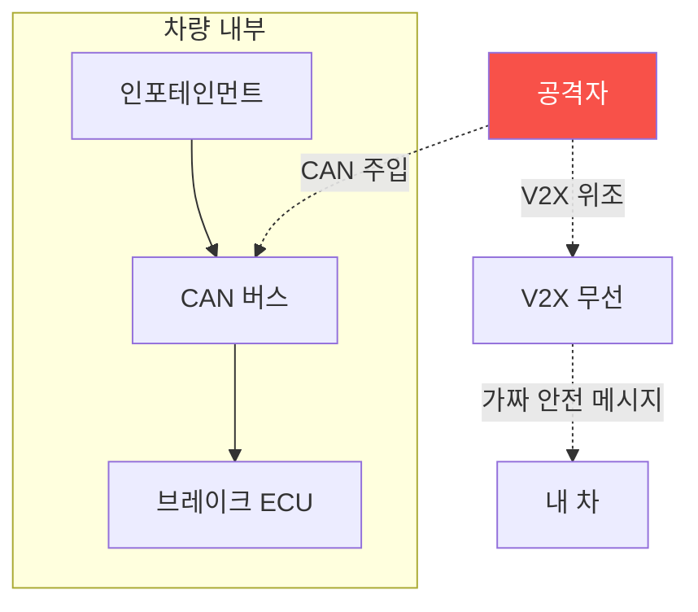

# autonomous-systems W12 — V2X/자동차 보안: CAN 버스·ECU·커넥티드카

> **본 주차의 한 줄 요약**
>
> 자율주행(W06·W07)의 차량은 **내부 네트워크(CAN)** 와 **외부 통신(V2X)** 을 모두 보안해야 한다. ① **CAN
> 버스·ECU(내부)** — 차량은 수십~수백 ECU가 **CAN 버스**로 연결돼 엔진·브레이크·조향을 제어한다. CAN은
> 1980년대 설계라 **인증·암호화가 없고 브로드캐스트**라, 약한 ECU(인포테인먼트) 하나 뚫으면 CAN에 **위조
> 메시지를 주입**해 브레이크·조향을 속인다(Jeep 해킹). ② **V2X(Vehicle-to-Everything, 외부)** — 커넥티드/자율
> 차는 다른 차(V2V)·인프라(V2I, 신호등)·보행자(V2P)와 **무선 통신**해 안전 정보(위치·속도·경고)를 교환한다.
> 문제: V2X 메시지가 **위조**되면 심각하다 — 가짜 "급정거 경고"·"유령 차량"·가짜 신호등 상태를 방송해 차량들이
> 잘못 반응(급브레이크·사고). 또 V2X는 위치를 방송해 **프라이버시** 문제도. 방어: **(CAN)** 도메인 분리 게이트
> 웨이·SecOC 메시지 인증·차량 IDS(iot W13), **(V2X)** **PKI(공개키 기반) 메시지 서명** — 인증된 참여자의 서명된
> 메시지만 신뢰(IEEE 1609.2), **오작동 탐지(misbehavior detection)** — 물리적으로 불가능하거나 모순된 메시지
> (순간이동 차량·모순 경고) 탐지·배제, **프라이버시(가명 인증서 순환)**. 자율주행 안전은 **믿을 수 있는 V2X와
> 무결한 CAN**에 달렸다.
>
> **한 줄 결론**: 차량은 내부 CAN(무인증→메시지 주입)과 외부 V2X(위조 안전 메시지)를 보안해야 한다. 방어 =
> **CAN 도메인 분리·SecOC + V2X PKI 서명·오작동 탐지 + 프라이버시(가명)**.

---

## 학습 목표

본 주차 종료 시 학생은 다음 5가지를 **본인 손으로** 할 수 있어야 한다.

1. 차량 **CAN(내부)·V2X(외부)** 보안을 구분해 설명한다.
2. **CAN/V2X 취약성**을 평가한다(V2X_VULNERABLE).
3. **위조 V2X 안전 메시지**를 탐지한다(MESSAGE_SPOOFED).
4. **PKI 서명·오작동 탐지**로 방어한다(V2X_SECURED).
5. 위조 V2X가 왜 사고로 이어지는지 설명한다.

> **이 주차의 시선** — 차량 내부·외부 통신의 무인증 위험을, 메시지 인증과 오작동 탐지로 막는다.

---

## 0. 용어 해설 (V2X/자동차)

| 용어 | 영문 | 뜻 | 비유 |
|------|------|----|------|
| **CAN** | Controller Area Network | 차량 내부망 | 내부 신경 |
| **V2X** | Vehicle-to-Everything | 차량 외부 통신 | 차간 대화 |
| **SecOC** | Secure Onboard Comm | CAN 메시지 인증 | 내부 서명 |
| **PKI** | Public Key Infra | 공개키 인증 | 신뢰 체계 |
| **오작동 탐지** | Misbehavior Detection | 모순 메시지 탐지 | 거짓말 탐지 |

> **헷갈리기 쉬운 한 쌍** — *CAN* 은 "차량 내부(ECU 간)", *V2X* 는 "차량 외부(차·인프라 간)"다. 둘 다 무인증이면
> 위험.

---

## 0.5 신입생 친화 핵심 개념

### 0.5.1 CAN(내부) + V2X(외부)

내부는 CAN(ECU 간), 외부는 V2X(차·인프라 간). 둘 다 무인증이면 메시지 주입·위조로 사고를 유발.

### 0.5.2 CAN 메시지 주입 (내부)

CAN은 발신자 인증이 없어, 약한 ECU를 뚫으면 브레이크·조향 CAN ID로 **위조 메시지**를 주입한다(iot W13 상세).
방어는 도메인 분리 게이트웨이·SecOC 메시지 인증.

### 0.5.3 V2X 위조 (외부)

V2X는 차·인프라가 안전 정보를 방송한다. **위조**되면: 가짜 "전방 급정거"로 뒤차 급브레이크, **유령 차량**으로
회피 기동 유발, 가짜 신호등 상태, 위치 위조. 하나의 위조 메시지가 여러 차량을 오작동시켜 연쇄 사고. 그래서 V2X
메시지는 반드시 **인증**돼야 한다.

### 0.5.4 방어 — 인증·오작동 탐지

- **CAN**: 도메인 분리(게이트웨이)·SecOC 메시지 인증·차량 IDS(iot W13).
- **V2X PKI 서명**: 인증된 참여자의 **서명된 메시지만 신뢰**(IEEE 1609.2). 위조자는 유효 서명 못 만듦.
- **오작동 탐지(misbehavior detection)**: 서명이 유효해도 **물리적으로 불가능/모순된 메시지**(순간이동·물리 법칙
  위반·다른 센서와 모순)를 탐지해 배제. 정당한 참여자가 거짓 정보를 방송하는 경우 대비.
- **프라이버시**: 가명 인증서를 순환해 위치 추적 방지.
서명(진위)+오작동 탐지(내용 정합성)의 이중 방어.

### 0.5.5 el34 맥락

차량 CAN·V2X는 실물 차량·V2X 장비가 필요하다. 본 실습은 **CAN/V2X 취약성·위조 탐지·PKI/오작동 탐지 로직**을
결정론 시뮬로 익힌다. 실물 차량 공격은 하드웨어·안전·인가가 필요함을 명시한다.

---

## 1. 실습 안내 (5 미션)

실행 위치 el34 **호스트**(`ssh ccc@{{TARGET_IP}}`), GPU `http://211.170.162.139:10934`.
⚠️ 차량 CAN·V2X는 실물·안전·인가 필요 → 본 실습은 취약성·탐지·방어 로직 결정론 시뮬.

### STEP 1 — GPU 헬스체크 → GEN_OK
### STEP 2 — CAN/V2X 취약성 → V2X_VULNERABLE
### STEP 3 — 위조 V2X 메시지 탐지 → MESSAGE_SPOOFED
### STEP 4 — PKI 서명·오작동 탐지 방어 → V2X_SECURED
### STEP 5 — 종합 → Assessment

---

## 2. 흔한 오해·관제자 노트

- **"CAN은 내부라 안전"** — 무인증이라 한 ECU 뚫리면 전체. SecOC.
- **"V2X 서명이면 충분"** — 정당한 참여자의 거짓 정보 가능. 오작동 탐지 병행.
- **"위조 경고쯤이야"** — 여러 차량 연쇄 오작동·사고. 심각.
- **관제 관점** — CAN에 도메인 분리·SecOC, V2X에 PKI 서명·오작동 탐지·가명 프라이버시가 있는지 점검한다.
  차량 안전은 무결한 통신에 달림.

---

## 3. 다음 주차 (W13) 예고 — AI 모델 공격/방어

W12가 "V2X/자동차"였다면, W13은 **AI 모델 공격/방어** — 적대적 입력·모델 로버스트니스·검증을 다룬다. 자율
시스템의 AI 인식(W07)을 모델 수준에서 심화한다.
