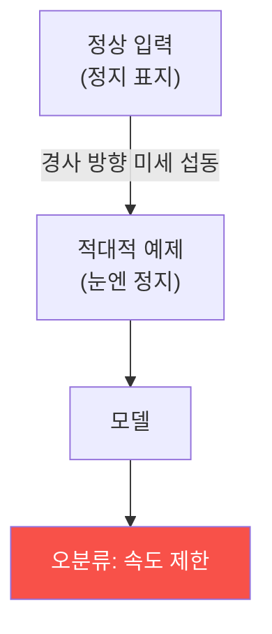

# autonomous-systems W13 — AI 모델 공격/방어: 적대적 입력·로버스트니스·검증

> **본 주차의 한 줄 요약**
>
> 자율 시스템은 인식·판단을 **AI 모델**에 의존한다(W06·W07). 이번 주 W13은 그 AI 모델 자체의 공격/방어를 **모델
> 수준**에서 심화한다. 핵심 위협은 **적대적 예제(adversarial example)** — 모델이 오분류하도록 입력에 더한 사람 눈엔
> 안 보이는(또는 자연스러운) 작은 변형이다. 원리는, 신경망은 고차원 결정 경계를 갖는데 입력을 **경계 너머로 미는
> 최소 변형**을 경사(gradient) 방향으로 계산하면(FGSM·PGD 등) 모델을 속인다는 것이다. 정지 표지 픽셀에 미세
> 노이즈→"속도 제한", 사람에 패치→"미탐지"(W07 물리판). 자율 시스템에선 이것이 **물리 사고**다. 방어는 모델의
> **로버스트니스(강건성)**를 높이는 것이다: ① 적대적 학습(적대적 예제를 학습에 포함, 가장 효과적), ② 입력 전처리·정제
> (노이즈 제거·랜덤화로 섭동 완화), ③ 탐지(적대적 입력의 통계적 이상 탐지·거부), ④ 정합성/중복(W06, 여러 센서·모델
> 교차 검증), ⑤ 형식 검증(일정 섭동 내 출력 불변을 수학적으로 보장). 실습에서는 적대적 섭동으로 오분류를 유도하고
> (마커 `ADVERSARIAL_CRAFTED`), 로버스트니스를 측정하며(마커 `ROBUSTNESS_MEASURED`), 적대적 학습·탐지·검증으로
> 강화한다(마커 `MODEL_HARDENED`). 완벽한 방어는 없어 **심층 방어**로 위험을 낮춘다 — AI는 정확도만이 아니라
> **강건성**이 안전의 요건이다.

---

## 학습 목표

본 주차 종료 시 학생은 다음 5가지를 **본인 손으로** 할 수 있어야 한다.

1. 적대적 예제의 원리(결정 경계·경사)를 설명한다.
2. 적대적 섭동으로 **오분류를 유도**한다(마커 `ADVERSARIAL_CRAFTED`).
3. 모델 **로버스트니스**를 측정한다(마커 `ROBUSTNESS_MEASURED`).
4. **적대적 학습·탐지·검증**으로 강화한다(마커 `MODEL_HARDENED`).
5. 왜 정확도만이 아니라 강건성이 안전의 요건인지 종합한다(마커 `Assessment`).

> **이 주차의 시선** — AI 모델의 근본 취약점(적대적 예제)을 이해하고, 강건성으로 안전을 높인다. "정확도 99%라도
> 섭동에 무너지면 안전하지 않다"가 핵심이다.

---

## 0. 용어 해설 (AI 모델 보안)

| 용어 | 영문 | 뜻 | 비유 |
|------|------|----|------|
| **적대적 예제** | Adversarial Example | 오분류를 유도하는 미세 변형 입력 | 착시 |
| **결정 경계** | Decision Boundary | 모델이 클래스를 가르는 경계 | 판단 선 |
| **경사(그래디언트)** | Gradient | 손실을 줄이는 방향(공격이 악용) | 오르막 방향 |
| **로버스트니스** | Robustness | 섭동에도 정확도를 유지하는 강건성 | 흔들림에 강함 |
| **적대적 학습** | Adversarial Training | 적대적 예제를 학습에 포함 | 예방접종 |
| **강건 정확도** | Robust Accuracy | 최악(적대) 입력에서의 정확도 | 악조건 성적 |
| **형식 검증** | Formal Verification | 일정 섭동 내 출력 불변을 수학적으로 증명 | 증명서 |

> **헷갈리기 쉬운 한 쌍 — 정확도 vs 로버스트니스.** *정확도*는 정상 입력을 맞히는 능력, *로버스트니스*는 섭동(공격)
> 입력에도 안 틀리는 능력이다. 자율 시스템 안전엔 둘 다 필요하며, 특히 최악 입력에서의 **강건 정확도**가 중요하다.

---

## 0.5 신입생 친화 핵심 개념

### 0.5.1 적대적 예제 — 경계를 넘는 최소 변형

모델의 결정 경계 바로 안쪽 입력을, 경사를 따라 **경계 너머로 미는 최소 변형**을 더하면 오분류한다. 사람 눈엔 거의
안 보이지만 모델은 속는다.

### 0.5.2 공격 방법 (개념)

- **FGSM**: 손실의 경사 부호 방향으로 한 번에 섭동(빠름).
- **PGD**: 여러 번 반복해 더 강한 섭동(강력).
- **물리 패치(W07)**: 프린트 가능한 큰 섭동(실세계).

핵심은 **경사 정보**로 모델의 약점을 정확히 찌른다는 것이다.

### 0.5.3 로버스트니스 측정

모델이 **얼마나 큰 섭동까지 견디는지**(정확도 유지)를 측정한다. 정상 정확도 99%라도 작은 섭동에 10%로 떨어지면
강건하지 않다. 자율 시스템 안전엔 **적대적 정확도(robust accuracy)**가 중요하다 — 최악의 입력에도 안전한가.

### 0.5.4 방어 — 심층 방어

- **적대적 학습**: 적대적 예제를 학습에 포함해 경계를 강하게(가장 효과적, 비용 큼).
- **입력 전처리**: 노이즈 제거·JPEG 압축·랜덤화로 섭동 완화(부분적).
- **탐지**: 적대적 입력의 이상(비정상 신뢰도 분포·일관성 결여) 탐지·거부.
- **중복·정합성(W06)**: 여러 센서·모델 앙상블로 교차 검증(한 모델 속아도 배제).
- **형식 검증**: 안전 필수 영역에서 일정 섭동 내 출력 불변을 수학적으로 증명.

어느 하나로 완벽하지 않아 겹층으로 위험을 낮춘다.

### 0.5.5 el34 맥락

적대적 예제 실제 생성은 GPU·모델이 필요하다. 이번 실습은 **적대적 섭동·로버스트니스·방어 로직**을 결정론 시뮬로
익힌다(실제 모델 공격/적대적 학습은 GPU 훈련 환경 필요).

---

## 1. AI 모델 보안 상세 — 섭동·측정·강화

### 1.1 적대적 섭동 오분류 (ADVERSARIAL_CRAFTED)

- **한 줄 정의**: 경사 방향 최소 변형으로 모델을 오분류시킨다.
- **왜 중요한가**: 사람 눈엔 안 보이는 변형이 물리 사고를 부른다.
- **el34 맥락에서 어떻게**: FGSM/PGD식 섭동으로 오분류를 유도하면 `ADVERSARIAL_CRAFTED`.
- **한계/주의**: 실제 생성은 GPU 필요, 여기서는 원리를 시뮬로 익힌다.

### 1.2 로버스트니스 측정 (ROBUSTNESS_MEASURED)

- **한 줄 정의**: 섭동 크기별 정확도(강건 정확도)를 측정한다.
- **핵심**: 정상 정확도와 적대적 정확도의 격차로 강건성 평가.
- **판정**: 강건성이 측정되면 `ROBUSTNESS_MEASURED`.

### 1.3 모델 강화 (MODEL_HARDENED)

- **한 줄 정의**: 적대적 학습·탐지·검증·중복으로 강건성을 높인다.
- **핵심**: 적대적 학습 + 입력 정제 + 탐지 + 앙상블/형식 검증의 겹층.
- **판정**: 강화 후 강건 정확도가 오르면 `MODEL_HARDENED`.

---

## 2. 실습 안내 (총 5 미션)

실행 위치는 el34 **호스트**(`ssh ccc@{{TARGET_IP}}`, 비밀번호 `1`), 참고 GPU는 Ollama
(`http://211.170.162.139:10934`, gemma3:4b)다. ⚠️ 실제 적대적 학습은 GPU 훈련이 필요해 섭동·강건성·방어 로직을
결정론 시뮬로 익힌다. 각 미션의 마지막 줄 마커가 채점 기준이다.

### 미션 1 — GPU 헬스체크 → `GEN_OK`

> **왜 하는가?** 분석·종합에 쓸 LLM 도달·응답 확인.
> **무엇을 아는가?** Ollama 응답 형식·도달성.
> **결과 해석** — 정상 `GEN_OK` / 비정상 `GEN_EMPTY`·연결 오류.
> **실전 활용** — 종합 소견 작성에 사용.

### 미션 2 — 적대적 섭동 오분류 → `ADVERSARIAL_CRAFTED`

> **왜 하는가?** 미세 변형이 모델을 속이는 원리를 확인한다.
> **무엇을 아는가?** 경사 기반 섭동·경계 넘기기.
> **결과 해석** — 정상: 오분류 유도 + `ADVERSARIAL_CRAFTED`.
> **실전 활용** — 모델 취약성 실증.

### 미션 3 — 로버스트니스 측정 → `ROBUSTNESS_MEASURED`

> **왜 하는가?** 정확도가 아니라 강건성을 정량화한다.
> **무엇을 아는가?** 섭동별 정확도·강건 정확도.
> **결과 해석** — 정상: 측정 + `ROBUSTNESS_MEASURED`.
> **실전 활용** — 안전 필수 AI 강건성 평가.

### 미션 4 — 모델 강화 → `MODEL_HARDENED`

> **왜 하는가?** 적대적 학습·탐지·중복으로 강건성을 높인다.
> **무엇을 아는가?** 적대적 학습·입력 정제·탐지·앙상블·검증.
> **결과 해석** — 정상: 강화 + `MODEL_HARDENED`.
> **실전 활용** — 강건 AI 모델 설계.

### 미션 5 — 종합 소견 → `Assessment`

> **왜 하는가?** 섭동·측정·강화와 "강건성이 안전 요건"을 소견으로 묶는다.
> **무엇을 아는가?** GPU에 요약시키되 첫 줄을 `Assessment`로 강제.
> **결과 해석** — 정상: `Assessment` 포함. 없으면 `[형식 미준수 — 재실행]`.
> **실전 활용** — AI 모델 보안 개요.

---

## 2.5 과제 (제출물)

- **A. 적대적 섭동 오분류 실증 (필수, 40점)** — `ADVERSARIAL_CRAFTED` 단계를 직접 수행해 실제 명령·출력(또는 아티팩트 분석 결과)을 캡처하고, 무엇을 근거로 판정했는지 서술한다.
- **B. 로버스트니스 측정 분석 (필수, 30점)** — `ROBUSTNESS_MEASURED` 단계를 직접 수행해 실제 명령·출력(또는 아티팩트 분석 결과)을 캡처하고, 무엇을 근거로 판정했는지 서술한다.
- **C. 모델 강화 방어 설계 (필수, 30점)** — `MODEL_HARDENED` 단계를 직접 수행해 실제 명령·출력(또는 아티팩트 분석 결과)을 캡처하고, 무엇을 근거로 판정했는지 서술한다.

## 2.6 평가 기준

| 항목 | 미흡(0) | 보통 | 우수 |
|------|---------|------|------|
| 탐지/실증(ADVERSARIAL_CRAFTED) | 미수행 | 마커 도출 | 근거·해석·재현까지 |
| 분석(ROBUSTNESS_MEASURED) | 미수행 | 마커 도출 | 근거·해석·재현까지 |
| 방어(MODEL_HARDENED) | 미수행 | 마커 도출 | 근거·해석·재현까지 |

## 2.7 핵심 정리 (1줄씩)

- 이번 주 주제: **AI 모델 공격/방어: 적대적 입력·로버스트니스·검증**.
- **적대적 섭동 오분류**(`ADVERSARIAL_CRAFTED`): 경사 방향 최소 변형으로 모델을 오분류시킨다.
- **로버스트니스 측정**(`ROBUSTNESS_MEASURED`): 섭동 크기별 정확도(강건 정확도)를 측정한다.
- **모델 강화**(`MODEL_HARDENED`): 적대적 학습·탐지·검증·중복으로 강건성을 높인다.
- 공격을 이해한 만큼 **방어의 우선순위**가 분명해진다 — 탐지 근거와 완화를 함께 익힌다.

---

## 3. 흔한 오해·블루팀 노트

- **"정확도가 높으면 안전하다."** — 섭동에 약할 수 있다. 강건성을 따로 측정한다.
- **"적대적 예제는 이론이다."** — 물리 패치로 실세계에서 시연된다(W07). 자율 시스템 사고로 이어진다.
- **"한 방어면 충분하다."** — 완벽한 방어는 없다. 심층 방어로 위험을 낮춘다.
- **"강건 모델은 정확도를 희생한다."** — 절충은 있으나, 안전 필수 시스템엔 강건성이 요건이다.
- **관제(Blue) 관점** — 자율 AI가 (1) 적대적 학습, (2) 적대적 입력 탐지, (3) 센서/모델 중복, (4) 형식 검증(안전 필수)을
  갖췄는지, 강건 정확도가 측정됐는지 점검한다.

---

## 4. 다음 주차 (W14) 예고 — CPS 인시던트 대응

W13이 "AI 모델 보안"이었다면, W14는 **CPS 인시던트 대응**을 다룬다. 사이버물리 인시던트의 특수성(물리 안전 우선·증거
보존·안전 복구)을 익힌다 — 사이버 IR의 CPS판이다.
