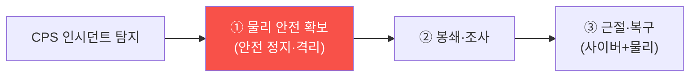

# autonomous-systems W14 — CPS 인시던트 대응: 사이버물리 인시던트의 특수성

> **본 주차의 한 줄 요약**
>
> 사이버 인시던트 대응(IR, agent-ir 과목)은 데이터·시스템 침해를 다뤘다. **CPS 인시던트 대응**은 여기에 **물리
> 차원**이 더해져 특수하다. 핵심 차이: ① **물리 안전이 최우선** — 일반 IR은 "봉쇄→근절→복구"지만, CPS는 그 전에
> **물리적 안전 확보**가 최우선이다. 드론·로봇·차량·산업 공정이 위험한 상태면, 조사보다 **먼저 안전 정지·격리**
> (사람이 안 다치게). 침해된 시스템을 무작정 끄면 오히려 위험할 수도(급정지가 사고를 유발) — 안전한 순서로,
> ② **하이브리드 증거** — 사이버 증거(로그·네트워크·펌웨어)와 **물리 증거**(센서 기록·구동기 상태·물리 손상·
> 블랙박스)를 함께 수집한다. Stuxnet처럼 HMI가 위장됐을 수 있어(W11) **물리 실측과 사이버 기록을 대조**한다,
> ③ **복구가 물리 상태 포함** — 소프트웨어 복원만이 아니라 **물리 시스템을 안전한 상태로** 되돌리고 검증(구동기
> 재보정·안전 점검), ④ **안전-보안-운영의 협업** — IR 팀만이 아니라 **안전 담당·현장 운영**이 함께(물리 위험
> 판단). ⑤ **다운타임의 물리적 의미** — 자율 시스템 정지가 물리 서비스 중단(생산·교통). 핵심: CPS IR은 **물리
> 안전을 절대 우선**하며, 사이버·물리 증거를 대조하고, 물리 상태까지 안전하게 복구한다. 자율 시스템이 늘수록 이
> 특수한 대응 역량이 중요해진다.
>
> **한 줄 결론**: CPS 인시던트 대응은 일반 IR에 **물리 차원**이 더해진다 — **물리 안전 최우선(안전 정지), 하이브
> 리드 증거(사이버+물리 대조), 물리 상태 복구, 안전-보안-운영 협업**.

---

## 학습 목표

본 주차 종료 시 학생은 다음 5가지를 **본인 손으로** 할 수 있어야 한다.

1. CPS IR이 일반 IR과 **어떻게 다른지** 설명한다.
2. **물리 안전 우선 트리아지**를 수행한다(SAFETY_FIRST_TRIAGE).
3. **하이브리드 증거**(사이버+물리)를 수집한다(EVIDENCE_COLLECTED).
4. **안전한 복구**(물리 상태 검증)를 수행한다(SAFE_RECOVERY).
5. 왜 물리 안전이 조사보다 우선인지 설명한다.

> **이 주차의 시선** — 물리 안전을 최우선으로 하는 CPS 특유의 인시던트 대응을 익힌다.

---

## 0. 용어 해설 (CPS IR)

| 용어 | 영문 | 뜻 | 비유 |
|------|------|----|------|
| **안전 정지** | Safe Stop | 물리 안전 확보 | 비상 정지 |
| **하이브리드 증거** | Hybrid Evidence | 사이버+물리 | 종합 기록 |
| **물리 상태 복구** | Physical Recovery | 구동기·공정 복원 | 재보정 |
| **블랙박스** | Black Box | 물리 기록 장치 | 비행 기록 |
| **안전-보안 협업** | Safety-Security | 공동 대응 | 합동 팀 |

> **헷갈리기 쉬운 한 쌍** — *일반 IR* 은 "봉쇄→근절→복구", *CPS IR* 은 "**안전 확보** 먼저, 그다음 IR"이다. 물리
> 안전이 앞선다.

---

## 0.5 신입생 친화 핵심 개념

### 0.5.1 물리 안전 최우선

일반 IR과 달리 **첫 단계가 물리 안전**이다. 드론·로봇·차량·공정이 위험하면 조사보다 먼저 안전 정지·격리 —
사람이 안 다치게. 단, 급정지가 더 위험할 수 있어 **안전한 방식**으로.

### 0.5.2 하이브리드 증거

- **사이버 증거**: 로그·네트워크 캡처·펌웨어 이미지·메모리(agent-ir 기법).
- **물리 증거**: 센서 기록·구동기 상태·물리 손상·블랙박스·CCTV.
- **대조**: Stuxnet처럼 **HMI/로그가 위장**됐을 수 있어(W11), 물리 실측과 사이버 기록을 **대조**해 진실을 찾는다.
사이버만 보면 속을 수 있다 — 물리와 교차 검증.

### 0.5.3 안전한 복구

복구는 소프트웨어 복원만이 아니다:
- **사이버**: 악성 코드 제거·펌웨어 재설치(서명 검증)·자격 순환.
- **물리**: 구동기 재보정·물리 상태 안전 확인·안전 시스템(SIS) 점검·손상 수리.
- **검증**: 복구 후 **안전하게 재가동되는지** 단계적 검증(바로 전면 가동 X).
물리 상태가 안전해야 진짜 복구.

### 0.5.4 협업과 준비

- **안전-보안-운영 협업**: IR 팀 + 안전 담당 + 현장 운영이 함께(물리 위험 판단은 현장 지식 필요).
- **사전 준비**: CPS용 IR 플레이북(안전 정지 절차·하이브리드 증거·복구 검증), 물리 격리 수단, 블랙박스·로깅.
- **AI 속도 결합**: agent-ir처럼 AI로 사이버 분석을 가속하되, **물리 안전 결정은 신중히**(자동 물리 조작 위험).

### 0.5.5 el34 맥락

CPS IR은 실물 시스템이 필요하다. 본 실습은 **안전 우선 트리아지·하이브리드 증거·안전 복구 로직**을 결정론 시뮬로
익힌다. 실제 물리 대응은 안전 담당·현장과 함께해야 함을 명시한다.

---

## 1. 실습 안내 (5 미션)

실행 위치 el34 **호스트**(`ssh ccc@{{TARGET_IP}}`), GPU `http://211.170.162.139:10934`.
⚠️ CPS IR은 실물·안전 담당 필요 → 본 실습은 트리아지·증거·복구 로직 결정론 시뮬.

### STEP 1 — GPU 헬스체크 → GEN_OK
### STEP 2 — 물리 안전 우선 트리아지 → SAFETY_FIRST_TRIAGE
### STEP 3 — 하이브리드 증거 수집 → EVIDENCE_COLLECTED
### STEP 4 — 안전한 복구 → SAFE_RECOVERY
### STEP 5 — 종합 → Assessment

---

## 2. 흔한 오해·관제자 노트

- **"조사부터"** — CPS는 물리 안전 확보가 먼저. 사람 안전.
- **"끄면 안전"** — 급정지가 사고 유발 가능. 안전한 방식으로.
- **"사이버 로그면 충분"** — HMI 위장 가능. 물리와 대조.
- **관제 관점** — CPS IR이 물리 안전 우선·하이브리드 증거·안전 복구·안전-보안 협업 절차를 갖췄는지 점검한다.
  CPS는 물리 안전이 조사보다 앞선다.

---

## 3. 다음 주차 (W15) 예고 — 종합 평가: 전체 CPS 침투+방어

W14가 "CPS 인시던트 대응"이었다면, 마지막 W15는 **종합 평가** — 전체 CPS를 침투 평가하고 방어를 종합하는
캡스톤이다. 과목을 마무리한다.
