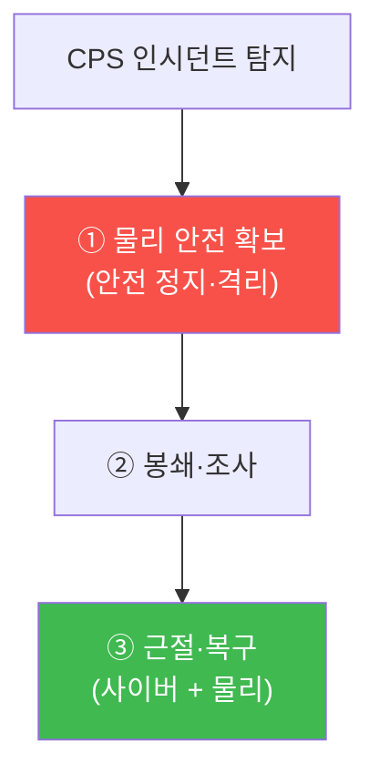

# autonomous-systems W14 — CPS 인시던트 대응: 사이버물리 인시던트의 특수성

> **본 주차의 한 줄 요약**
>
> 사이버 인시던트 대응(IR)은 데이터·시스템 침해를 다뤘다. **CPS 인시던트 대응**은 여기에 **물리 차원**이 더해져
> 특수하다. 핵심 차이는 넷이다: ① **물리 안전이 최우선** — 일반 IR은 "봉쇄→근절→복구"지만, CPS는 그 전에 **물리적
> 안전 확보**가 최우선이다. 드론·로봇·차량·산업 공정이 위험한 상태면 조사보다 먼저 안전 정지·격리(사람이 안 다치게).
> 단 침해된 시스템을 무작정 끄면 오히려 위험할 수 있어(급정지가 사고 유발) 안전한 순서로 한다. ② **하이브리드 증거** —
> 사이버 증거(로그·네트워크·펌웨어)와 물리 증거(센서 기록·구동기 상태·물리 손상·블랙박스)를 함께 수집한다. Stuxnet
> 처럼 HMI가 위장됐을 수 있어(W11) 물리 실측과 사이버 기록을 대조한다. ③ **복구가 물리 상태 포함** — 소프트웨어
> 복원만이 아니라 물리 시스템을 안전한 상태로 되돌리고 검증(구동기 재보정·안전 점검). ④ **안전-보안-운영의 협업** —
> IR 팀만이 아니라 안전 담당·현장 운영이 함께(물리 위험 판단). 실습에서는 물리 안전 우선 트리아지를 수행하고(마커
> `SAFETY_FIRST_TRIAGE`), 하이브리드 증거를 수집하며(마커 `EVIDENCE_COLLECTED`), 안전한 복구를 수행한다(마커
> `SAFE_RECOVERY`). 핵심은 CPS IR이 **물리 안전을 절대 우선**하며, 사이버·물리 증거를 대조하고, 물리 상태까지
> 안전하게 복구한다는 것이다.

---

## 학습 목표

본 주차 종료 시 학생은 다음 5가지를 **본인 손으로** 할 수 있어야 한다.

1. CPS IR이 일반 IR과 어떻게 다른지(물리 안전 우선·하이브리드 증거) 설명한다.
2. **물리 안전 우선 트리아지**를 수행한다(마커 `SAFETY_FIRST_TRIAGE`).
3. **하이브리드 증거**(사이버+물리)를 수집·대조한다(마커 `EVIDENCE_COLLECTED`).
4. **안전한 복구**(물리 상태 검증)를 수행한다(마커 `SAFE_RECOVERY`).
5. 왜 물리 안전이 조사보다 우선인지 종합한다(마커 `Assessment`).

> **이 주차의 시선** — 물리 안전을 최우선으로 하는 CPS 특유의 인시던트 대응을 익힌다. "끄는 것도 안전한 방식으로"가
> 핵심이다.

---

## 0. 용어 해설 (CPS IR)

| 용어 | 영문 | 뜻 | 비유 |
|------|------|----|------|
| **안전 정지** | Safe Stop | 물리 위험을 먼저 제거(안전한 방식) | 비상 정지 |
| **트리아지** | Triage | 위험도·우선순위 판정 | 응급 분류 |
| **하이브리드 증거** | Hybrid Evidence | 사이버 + 물리 증거를 함께 수집·대조 | 종합 기록 |
| **블랙박스** | Black Box | 물리 상태를 기록하는 장치 | 비행 기록 장치 |
| **물리 상태 복구** | Physical Recovery | 구동기·공정을 안전 상태로 복원·검증 | 재보정 |
| **안전-보안 협업** | Safety-Security | IR·안전·운영의 공동 대응 | 합동 대응팀 |

> **헷갈리기 쉬운 한 쌍 — 일반 IR vs CPS IR.** *일반 IR*은 봉쇄→근절→복구 순이다. *CPS IR*은 그 앞에 **물리 안전
> 확보**가 온다. 물리 안전이 조사·봉쇄보다 앞서는 것이 CPS IR의 결정적 차이다.

---

## 0.5 핵심 개념

### 0.5.1 물리 안전 최우선

일반 IR과 달리 첫 단계가 물리 안전이다. 드론·로봇·차량·공정이 위험하면 조사보다 먼저 안전 정지·격리 — 사람이 안
다치게. 단 급정지가 더 위험할 수 있어 안전한 방식으로 한다.

### 0.5.2 하이브리드 증거

- **사이버 증거**: 로그·네트워크 캡처·펌웨어 이미지·메모리.
- **물리 증거**: 센서 기록·구동기 상태·물리 손상·블랙박스·CCTV.
- **대조**: Stuxnet처럼 HMI/로그가 위장됐을 수 있어(W11), 물리 실측과 사이버 기록을 대조해 진실을 찾는다.

사이버만 보면 속을 수 있다 — 물리와 교차 검증한다.

### 0.5.3 안전한 복구

복구는 소프트웨어 복원만이 아니다.

- **사이버**: 악성 코드 제거·펌웨어 재설치(서명 검증)·자격 순환.
- **물리**: 구동기 재보정·물리 상태 안전 확인·안전 시스템(SIS) 점검·손상 수리.
- **검증**: 복구 후 안전하게 재가동되는지 단계적 검증(바로 전면 가동 금지).

물리 상태가 안전해야 진짜 복구다.

### 0.5.4 협업과 준비

- **안전-보안-운영 협업**: IR 팀 + 안전 담당 + 현장 운영이 함께(물리 위험 판단은 현장 지식 필요).
- **사전 준비**: CPS용 IR 플레이북(안전 정지 절차·하이브리드 증거·복구 검증), 물리 격리 수단, 블랙박스·로깅.
- **AI 속도 결합**: AI로 사이버 분석을 가속하되, 물리 안전 결정은 신중히(자동 물리 조작 위험).

### 0.5.5 el34 맥락

CPS IR은 실물 시스템이 필요하다. 이번 실습은 **안전 우선 트리아지·하이브리드 증거·안전 복구 로직**을 결정론 시뮬로
익힌다. 실제 물리 대응은 안전 담당·현장과 함께해야 함을 명시한다.

---

## 1. CPS IR 상세 — 트리아지·증거·복구

### 1.1 물리 안전 우선 트리아지 (SAFETY_FIRST_TRIAGE)

- **한 줄 정의**: 물리 위험을 먼저 판정·제거하고 그다음 사이버 조사로 간다.
- **왜 중요한가**: 사람 안전이 데이터·조사보다 앞선다.
- **el34 맥락에서 어떻게**: 위험 상태면 안전 정지/격리(안전한 방식) 후 조사하면 `SAFETY_FIRST_TRIAGE`.
- **한계/주의**: 급정지가 더 위험할 수 있어 안전한 순서를 택한다.

### 1.2 하이브리드 증거 수집 (EVIDENCE_COLLECTED)

- **한 줄 정의**: 사이버·물리 증거를 함께 수집하고 대조한다.
- **핵심**: 로그·펌웨어(사이버) + 센서·구동기·블랙박스(물리), HMI 위장 대비 대조.
- **판정**: 하이브리드 증거가 수집·대조되면 `EVIDENCE_COLLECTED`.

### 1.3 안전한 복구 (SAFE_RECOVERY)

- **한 줄 정의**: 사이버 복원 + 물리 상태 안전 복구 + 단계적 검증.
- **핵심**: 펌웨어 재설치·자격 순환 + 구동기 재보정·SIS 점검 + 안전 재가동 검증.
- **판정**: 물리 상태까지 안전하게 복구·검증되면 `SAFE_RECOVERY`.

---

## 2. 실습 안내 (총 5 미션)

실행 위치는 el34 **호스트**(`ssh ccc@{{TARGET_IP}}`, 비밀번호 `1`), 참고 GPU는 Ollama
(`http://211.170.162.139:10934`, gemma3:4b)다. ⚠️ CPS IR은 실물·안전 담당이 필요해 트리아지·증거·복구 로직을 결정론
시뮬로 익힌다. 각 미션의 마지막 줄 마커가 채점 기준이다.

### 미션 1 — GPU 헬스체크 → `GEN_OK`

> **왜 하는가?** 분석·종합에 쓸 LLM 도달·응답 확인.
> **무엇을 아는가?** Ollama 응답 형식·도달성.
> **결과 해석** — 정상 `GEN_OK` / 비정상 `GEN_EMPTY`·연결 오류.
> **실전 활용** — 종합 소견 작성에 사용.

### 미션 2 — 물리 안전 우선 트리아지 → `SAFETY_FIRST_TRIAGE`

> **왜 하는가?** 사람 안전을 조사보다 먼저 확보한다.
> **무엇을 아는가?** 위험 판정·안전 정지·격리(안전한 방식).
> **결과 해석** — 정상: 안전 우선 트리아지 + `SAFETY_FIRST_TRIAGE`.
> **실전 활용** — CPS IR 초동 대응.

### 미션 3 — 하이브리드 증거 수집 → `EVIDENCE_COLLECTED`

> **왜 하는가?** HMI 위장에 속지 않게 물리·사이버를 대조한다.
> **무엇을 아는가?** 사이버 + 물리 증거·대조.
> **결과 해석** — 정상: 수집·대조 + `EVIDENCE_COLLECTED`.
> **실전 활용** — CPS 포렌식.

### 미션 4 — 안전한 복구 → `SAFE_RECOVERY`

> **왜 하는가?** 물리 상태까지 안전하게 되돌린다.
> **무엇을 아는가?** 사이버 복원 + 물리 재보정 + 단계적 검증.
> **결과 해석** — 정상: 안전 복구 + `SAFE_RECOVERY`.
> **실전 활용** — CPS 복구 절차.

### 미션 5 — 종합 소견 → `Assessment`

> **왜 하는가?** 트리아지·증거·복구와 "물리 안전 우선"을 소견으로 묶는다.
> **무엇을 아는가?** GPU에 요약시키되 첫 줄을 `Assessment`로 강제.
> **결과 해석** — 정상: `Assessment` 포함. 없으면 `[형식 미준수 — 재실행]`.
> **실전 활용** — CPS IR 개요.

---

## 2.5 과제 (제출물)

- **A. 물리 안전 우선 트리아지 실증 (필수, 40점)** — `SAFETY_FIRST_TRIAGE` 단계를 직접 수행해 실제 명령·출력(또는 아티팩트 분석 결과)을 캡처하고, 무엇을 근거로 판정했는지 서술한다.
- **B. 하이브리드 증거 수집 분석 (필수, 30점)** — `EVIDENCE_COLLECTED` 단계를 직접 수행해 실제 명령·출력(또는 아티팩트 분석 결과)을 캡처하고, 무엇을 근거로 판정했는지 서술한다.
- **C. 안전한 복구 방어 설계 (필수, 30점)** — `SAFE_RECOVERY` 단계를 직접 수행해 실제 명령·출력(또는 아티팩트 분석 결과)을 캡처하고, 무엇을 근거로 판정했는지 서술한다.

## 2.6 평가 기준

| 항목 | 미흡(0) | 보통 | 우수 |
|------|---------|------|------|
| 탐지/실증(SAFETY_FIRST_TRIAGE) | 미수행 | 마커 도출 | 근거·해석·재현까지 |
| 분석(EVIDENCE_COLLECTED) | 미수행 | 마커 도출 | 근거·해석·재현까지 |
| 방어(SAFE_RECOVERY) | 미수행 | 마커 도출 | 근거·해석·재현까지 |

## 2.7 핵심 정리 (1줄씩)

- 이번 주 주제: **CPS 인시던트 대응: 사이버물리 인시던트의 특수성**.
- **물리 안전 우선 트리아지**(`SAFETY_FIRST_TRIAGE`): 물리 위험을 먼저 판정·제거하고 그다음 사이버 조사로 간다.
- **하이브리드 증거 수집**(`EVIDENCE_COLLECTED`): 사이버·물리 증거를 함께 수집하고 대조한다.
- **안전한 복구**(`SAFE_RECOVERY`): 사이버 복원 + 물리 상태 안전 복구 + 단계적 검증.
- 공격을 이해한 만큼 **방어의 우선순위**가 분명해진다 — 탐지 근거와 완화를 함께 익힌다.

---

## 3. 흔한 오해·블루팀 노트

- **"조사부터 한다."** — CPS는 물리 안전 확보가 먼저다. 사람 안전이 우선.
- **"끄면 안전하다."** — 급정지가 사고를 유발할 수 있다. 안전한 방식으로 정지한다.
- **"사이버 로그면 충분하다."** — HMI 위장이 가능하다. 물리 증거와 대조한다.
- **"복구는 SW 복원이다."** — 물리 상태(구동기·공정)까지 안전하게 복구·검증해야 한다.
- **관제(Blue) 관점** — CPS IR이 (1) 물리 안전 우선 트리아지, (2) 하이브리드 증거·대조, (3) 안전한 물리 복구, (4)
  안전-보안-운영 협업 절차를 갖췄는지 점검한다. CPS는 물리 안전이 조사보다 앞선다.

---

## 4. 다음 주차 (W15) 예고 — 종합 평가: 전체 CPS 침투+방어

W14가 "CPS 인시던트 대응"이었다면, 마지막 W15는 **종합 평가**다. 전체 CPS를 침투 평가하고 방어를 종합하는 캡스톤으로
과목을 마무리한다.
