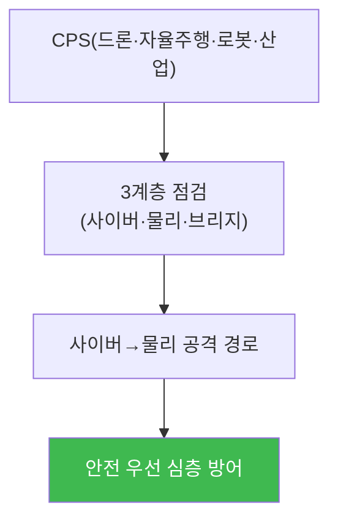

# autonomous-systems W15 — 종합 평가: 전체 CPS 침투+방어

> **본 주차의 한 줄 요약**
>
> 마지막 주는 W01~W14를 하나의 **종합 평가**로 통합한다. 실제 CPS 보안 평가는 한 시스템·한 기법이 아니라,
> 자율 시스템(드론·자율주행·로봇·산업)을 **사이버·물리·브리지 3계층**(W01)에서 점검하고, 취약점을 연결해
> **사이버→물리 공격 경로**를 구성하며, **안전 우선 다층 방어**를 종합한다. 그리고 이 과목의 결론을 확인하며
> 마친다: **CPS는 사이버 공격이 곧 물리 결과가 되는 시스템이며, 방어는 안전 최우선의 심층 방어다.** 핵심 원칙:
> ① **3계층 위협 모델**(사이버·물리·브리지)으로 전면 점검, ② **사이버→물리 경로** 추적(통신·AI·센서·GPS 공격이
> 물리 사고로), ③ **심층 방어**(통신 보안·센서 중복성·GPS 안티스푸핑·AI 강건성·OT 분리·V2X 인증), ④ **안전
> 최우선**(보안 뚫려도 안전하도록 독립 안전 계층·페일세이프), ⑤ **CPS 특유의 대응**(물리 안전 우선 IR). 자율
> 시스템이 우리 삶에 깊이 들어올수록(드론 배송·자율주행·스마트 공장), 이 사이버-물리 보안 역량은 필수가 된다.
> 사이버 방어자도 물리 세계를 움직이는 CPS를 이해해야 완전하다 — 데이터가 아니라 **생명과 안전**이 걸려 있다.
>
> **한 줄 결론**: CPS 보안 평가 = **3계층 점검 + 사이버→물리 경로 + 안전 우선 심층 방어**. 결론 — CPS는 사이버
> 공격이 물리 결과가 되며, 방어는 안전 최우선·심층 방어이고, 생명이 걸려 있다.

---

## 학습 목표

본 주차 종료 시 학생은 다음 5가지를 **본인 손으로** 할 수 있어야 한다.

1. 전체 CPS를 **종합 침투 평가**한다(FULL_CPS_PENTEST).
2. **안전 우선 다층 방어**를 종합한다(DEFENSE_SYNTHESIZED).
3. CPS 보안의 **핵심 원칙**을 종합한다(SYNTHESIS).
4. 사이버 공격의 물리 결과를 설명한다.
5. 사이버 방어자에게 CPS 이해가 왜 필수인지 설명한다.

> **이 주차의 시선** — 배운 모든 것을 전체 CPS 평가·안전 우선 방어로 통합하며 마친다.

---

## 0. 용어 해설 (종합)

| 용어 | 관련 주차 | 평가에서 |
|------|-----------|----------|
| **3계층** | W01 | 사이버·물리·브리지 |
| **사이버→물리 경로** | W01·W08 | 물리 결과 |
| **심층 방어** | W02~13 | 겹층 |
| **안전 최우선** | W01·W14 | 독립 안전 계층 |
| **CPS IR** | W14 | 물리 안전 우선 |

---

## 0.5 종합 — 시스템·경로·안전

### 0.5.1 전체 CPS 평가

자율 시스템을 3계층에서 점검하고, 사이버→물리 경로를 추적하고, 안전 우선 심층 방어를 설계한다.

### 0.5.2 CPS 보안의 5대 원칙

- **3계층 위협 모델**: 사이버·물리·브리지 전면 점검(W01).
- **사이버→물리 경로**: 통신·AI·센서·GPS 공격이 물리 사고로(W03·W05·W07).
- **심층 방어**: 통신 보안·센서 중복성·안티스푸핑·AI 강건성·OT 분리·V2X 인증(W02~13).
- **안전 최우선**: 독립 안전 계층·페일세이프 — 보안 뚫려도 안전(W01·W11·W14).
- **CPS 대응**: 물리 안전 우선 IR·하이브리드 증거(W14).

### 0.5.3 생명이 걸린 보안

CPS 보안은 데이터가 아니라 **생명과 안전**을 지킨다. 드론이 추락하지 않게, 자율주행이 사고 내지 않게, 로봇이
사람을 다치지 않게, 공장이 폭발하지 않게. 그래서 **안전이 절대 우선**이고, 보안이 안전을 방해하면 안 된다.
사이버-물리 시스템 보안은 사이버 보안의 최전선이다.

---

## 1. 종합 평가 안내 (5 미션)

실행 위치 el34 **호스트**(`ssh ccc@{{TARGET_IP}}`), GPU `http://211.170.162.139:10934`.
⚠️ CPS는 실물 필요 → 본 실습은 종합 평가·방어·원칙 로직 결정론 시뮬.

### STEP 1 — GPU 헬스체크 → GEN_OK
### STEP 2 — 전체 CPS 종합 평가 → FULL_CPS_PENTEST
### STEP 3 — 안전 우선 다층 방어 → DEFENSE_SYNTHESIZED
### STEP 4 — 핵심 원칙 종합 → SYNTHESIS
### STEP 5 — 최종 종합 → Assessment

---

## 2. 흔한 오해·관제자 노트

- **"한 시스템만 평가"** — 전체 CPS 3계층. 놓친 계층이 진입점.
- **"보안이 곧 안전"** — 보안≠안전. 독립 안전 계층.
- **"데이터가 우선"** — CPS는 생명·물리 우선. 안전 최우선.
- **관제 관점** — CPS가 3계층 점검·사이버→물리 경로·안전 우선 심층 방어·독립 안전 계층을 갖췄는지 종합 평가한다.
  CPS 보안 성숙도의 척도.

---

## 3. 과목을 마치며

CPS(사이버물리시스템)는 사이버 공격이 **물리 세계**를 움직이는, 사이버 보안의 최전선이다. 여러분은 이제 드론·
자율주행·로봇·산업 시스템의 각 위협과 방어를, **3계층 위협 모델·사이버→물리 경로·안전 우선 심층 방어**로 통합해
평가·구축할 수 있다. 자율 시스템은 우리 삶에 깊이 들어오고 있고, 그 보안은 **생명과 안전**을 지킨다. 사이버
방어자도 물리 세계를 이해해야 완전하다 — 그것이 이 과목이 남기는 것이다. 수고했다.
