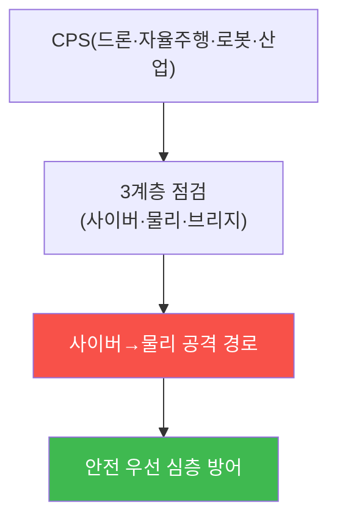

# autonomous-systems W15 — 종합 평가: 전체 CPS 침투+방어

> **본 주차의 한 줄 요약**
>
> 마지막 주는 W01~W14를 하나의 **종합 평가**로 통합한다. 실제 CPS 보안 평가는 한 시스템·한 기법이 아니라, 자율
> 시스템(드론·자율주행·로봇·산업)을 **사이버·물리·브리지 3계층**(W01)에서 점검하고, 취약점을 연결해 **사이버→물리
> 공격 경로**를 구성하며, **안전 우선 다층 방어**를 종합한다. 그리고 이 과목의 결론을 확인하며 마친다: **CPS는
> 사이버 공격이 곧 물리 결과가 되는 시스템이며, 방어는 안전 최우선의 심층 방어다.** 핵심 원칙은 다섯이다: ① 3계층
> 위협 모델(사이버·물리·브리지)로 전면 점검, ② 사이버→물리 경로 추적(통신·AI·센서·GPS 공격이 물리 사고로), ③ 심층
> 방어(통신 보안·센서 중복성·GPS 안티스푸핑·AI 강건성·OT 분리·V2X 인증), ④ 안전 최우선(보안 뚫려도 안전하도록 독립
> 안전 계층·페일세이프), ⑤ CPS 특유의 대응(물리 안전 우선 IR). 실습에서는 전체 CPS를 종합 침투 평가하고(마커
> `FULL_CPS_PENTEST`), 안전 우선 다층 방어를 종합하며(마커 `DEFENSE_SYNTHESIZED`), 핵심 원칙을 종합한다(마커
> `SYNTHESIS`). 자율 시스템이 삶에 깊이 들어올수록 이 사이버-물리 보안 역량은 필수가 된다 — 데이터가 아니라
> **생명과 안전**이 걸려 있다.

---

## 학습 목표

본 주차 종료 시 학생은 다음 5가지를 **본인 손으로** 할 수 있어야 한다.

1. 전체 CPS를 3계층에서 **종합 침투 평가**한다(마커 `FULL_CPS_PENTEST`).
2. **안전 우선 다층 방어**를 종합한다(마커 `DEFENSE_SYNTHESIZED`).
3. CPS 보안의 **핵심 원칙 5가지**를 종합한다(마커 `SYNTHESIS`).
4. 사이버 공격의 물리 결과와 안전 최우선 원칙을 설명한다.
5. 사이버 방어자에게 CPS 이해가 왜 필수인지 최종 소견으로 종합한다(마커 `Assessment`).

> **이 주차의 시선** — 배운 모든 것을 전체 CPS 평가·안전 우선 방어로 통합하며 마친다. "생명이 걸린 보안"이 이 과목의
> 결론이다.

---

## 0. 용어 해설 (종합 평가)

| 용어 | 영문 | 뜻 | 비유 |
|------|------|----|------|
| **3계층 점검** | 3-Layer Review | 사이버·물리·브리지 전면 점검 | 3중 검진 |
| **사이버→물리 경로** | Cyber-to-Physical Path | 사이버 공격이 물리 사고로 이어지는 사슬 | 도미노 |
| **심층 방어** | Defense in Depth | 여러 방어를 겹층으로 | 다중 방벽 |
| **독립 안전 계층** | Independent Safety Layer | 보안과 분리된 페일세이프·SIS | 최후 안전망 |
| **안전 최우선** | Safety-first | 인명·물리를 데이터보다 우선 | 사람 먼저 |
| **CPS IR** | CPS Incident Response | 물리 안전 우선 인시던트 대응 | 물리 우선 대응 |

> **헷갈리기 쉬운 한 쌍 — 보안(Security) vs 안전(Safety), 다시.** CPS 종합에서 이 구별이 가장 중요하다. 보안은 공격
> 방어, 안전은 물리적 무해다. CPS는 **보안이 뚫려도 안전**하도록 독립 안전 계층을 두며, 보안이 안전을 방해해선 안
> 된다. 안전이 절대 우선이다.

---

## 0.5 종합 — 시스템·경로·안전

### 0.5.1 전체 CPS 평가

자율 시스템을 3계층에서 점검하고, 사이버→물리 경로를 추적하고, 안전 우선 심층 방어를 설계한다.

### 0.5.2 CPS 보안의 5대 원칙

- **3계층 위협 모델**: 사이버·물리·브리지 전면 점검(W01).
- **사이버→물리 경로**: 통신·AI·센서·GPS 공격이 물리 사고로(W03·W05·W07).
- **심층 방어**: 통신 보안·센서 중복성·안티스푸핑·AI 강건성·OT 분리·V2X 인증(W02~13).
- **안전 최우선**: 독립 안전 계층·페일세이프 — 보안 뚫려도 안전(W01·W11·W14).
- **CPS 대응**: 물리 안전 우선 IR·하이브리드 증거(W14).

### 0.5.3 생명이 걸린 보안

CPS 보안은 데이터가 아니라 **생명과 안전**을 지킨다. 드론이 추락하지 않게, 자율주행이 사고 내지 않게, 로봇이 사람을
다치지 않게, 공장이 폭발하지 않게. 그래서 안전이 절대 우선이고, 보안이 안전을 방해하면 안 된다. 사이버-물리 시스템
보안은 사이버 보안의 최전선이다.

---

## 1. 종합 평가 상세 — 침투·방어·원칙

### 1.1 전체 CPS 종합 평가 (FULL_CPS_PENTEST)

- **한 줄 정의**: 대상 CPS를 3계층에서 점검하고 사이버→물리 경로를 구성한다.
- **왜 중요한가**: 놓친 계층이 진입점이 된다. 전면 점검이 필요하다.
- **el34 맥락에서 어떻게**: 드론/자율주행/로봇/산업 중 하나를 3계층·경로로 평가하면 `FULL_CPS_PENTEST`.
- **한계/주의**: 실물 하드웨어 없이 로직·경로 시뮬로 익힌다.

### 1.2 안전 우선 다층 방어 (DEFENSE_SYNTHESIZED)

- **한 줄 정의**: 통신·센서·AI·OT·V2X 방어와 독립 안전 계층을 겹층으로 종합한다.
- **핵심**: 각 겹이 담당 위협을 막고, 독립 안전 계층이 최후 보루.
- **판정**: 안전 우선 다층 방어가 종합되면 `DEFENSE_SYNTHESIZED`.

### 1.3 핵심 원칙 종합 (SYNTHESIS)

- **한 줄 정의**: 5대 원칙(3계층·경로·심층 방어·안전 최우선·CPS IR)을 정리한다.
- **핵심**: "사이버 공격=물리 결과, 방어=안전 우선 심층 방어" 결론 명시.
- **판정**: 5대 원칙이 종합되면 `SYNTHESIS`.

---

## 2. 종합 평가 안내 (총 5 미션)

실행 위치는 el34 **호스트**(`ssh ccc@{{TARGET_IP}}`, 비밀번호 `1`), 참고 GPU는 Ollama
(`http://211.170.162.139:10934`, gemma3:4b)다. ⚠️ CPS는 실물이 필요해 종합 평가·방어·원칙 로직을 결정론 시뮬로
익힌다. 각 미션의 마지막 줄 마커가 채점 기준이다.

### 미션 1 — GPU 헬스체크 → `GEN_OK`

> **왜 하는가?** 분석·종합에 쓸 LLM 도달·응답 확인.
> **무엇을 아는가?** Ollama 응답 형식·도달성.
> **결과 해석** — 정상 `GEN_OK` / 비정상 `GEN_EMPTY`·연결 오류.
> **실전 활용** — 최종 소견 작성에 사용.

### 미션 2 — 전체 CPS 종합 평가 → `FULL_CPS_PENTEST`

> **왜 하는가?** 대상 CPS를 3계층·경로로 전면 평가한다.
> **무엇을 아는가?** 3계층 점검·사이버→물리 경로.
> **결과 해석** — 정상: 종합 평가 + `FULL_CPS_PENTEST`.
> **실전 활용** — CPS 침투 평가 보고.

### 미션 3 — 안전 우선 다층 방어 → `DEFENSE_SYNTHESIZED`

> **왜 하는가?** 겹층 방어 + 독립 안전 계층을 종합한다.
> **무엇을 아는가?** 통신·센서·AI·OT·V2X 방어·안전 계층.
> **결과 해석** — 정상: 방어 종합 + `DEFENSE_SYNTHESIZED`.
> **실전 활용** — CPS 방어 아키텍처.

### 미션 4 — 핵심 원칙 종합 → `SYNTHESIS`

> **왜 하는가?** CPS 보안의 5대 원칙을 정리한다.
> **무엇을 아는가?** 3계층·경로·심층 방어·안전 최우선·CPS IR.
> **결과 해석** — 정상: 원칙 종합 + `SYNTHESIS`.
> **실전 활용** — CPS 보안 성숙도 기준.

### 미션 5 — 최종 종합 소견 → `Assessment`

> **왜 하는가?** 평가·방어·원칙과 "생명이 걸린 보안"을 최종 소견으로 묶는다.
> **무엇을 아는가?** GPU에 요약시키되 첫 줄을 `Assessment`로 강제.
> **결과 해석** — 정상: `Assessment` 포함. 없으면 `[형식 미준수 — 재실행]`.
> **실전 활용** — CPS 보안 종합 소견.

---

## 3. 흔한 오해·관제자 노트

- **"한 시스템만 평가하면 된다."** — 전체 CPS 3계층을 본다. 놓친 계층이 진입점이다.
- **"보안이 곧 안전이다."** — 보안≠안전. 독립 안전 계층이 필요하다.
- **"데이터가 우선이다."** — CPS는 생명·물리가 우선이다. 안전 최우선.
- **"보안을 위해 안전을 미룬다."** — 안전이 절대 우선이다. 보안이 안전을 방해해선 안 된다.
- **관제(Blue) 관점** — CPS가 (1) 3계층 점검, (2) 사이버→물리 경로 차단, (3) 안전 우선 심층 방어, (4) 독립 안전 계층을
  갖췄는지 종합 평가한다. CPS 보안 성숙도의 척도다.

---

## 4. 과목을 마치며

CPS(사이버물리시스템)는 사이버 공격이 **물리 세계**를 움직이는, 사이버 보안의 최전선이다. 여러분은 이제 드론·자율주행·
로봇·산업 시스템의 각 위협과 방어를 **3계층 위협 모델·사이버→물리 경로·안전 우선 심층 방어**로 통합해 평가·구축할 수
있다. 자율 시스템은 우리 삶에 깊이 들어오고 있고, 그 보안은 **생명과 안전**을 지킨다. 사이버 방어자도 물리 세계를
이해해야 완전하다 — 그것이 이 과목이 남기는 것이다. 수고했다.
