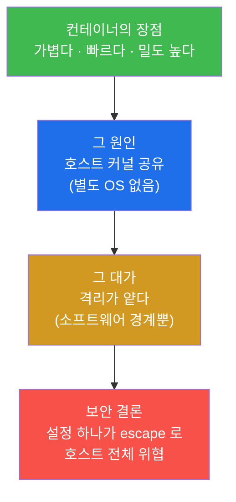
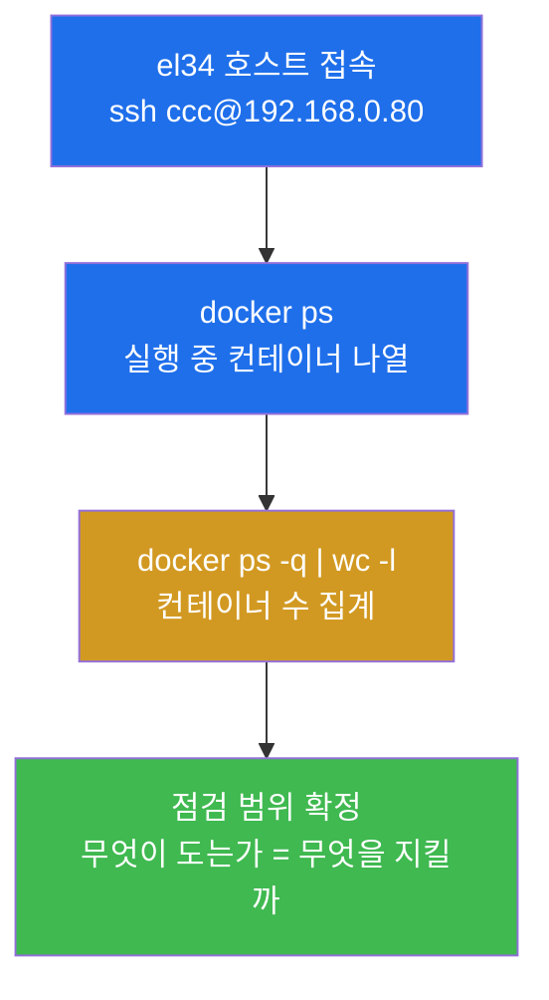
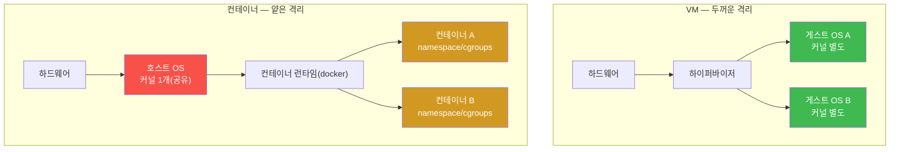
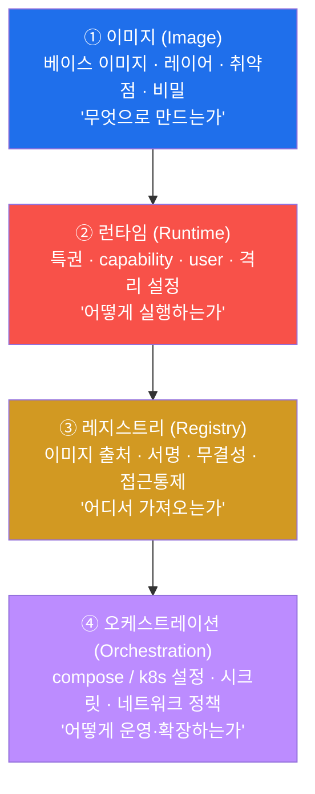
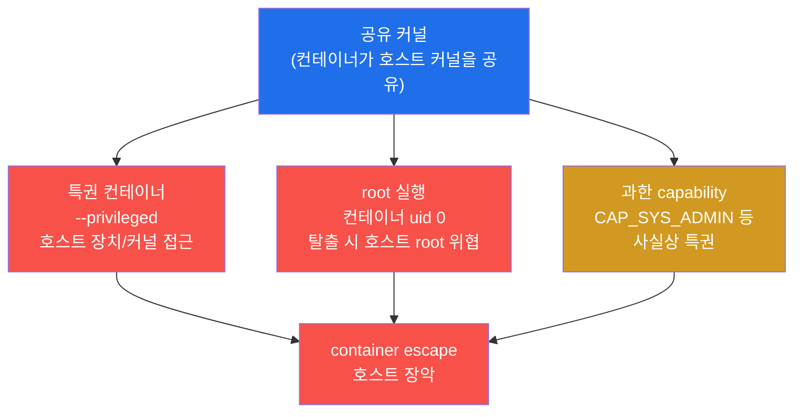
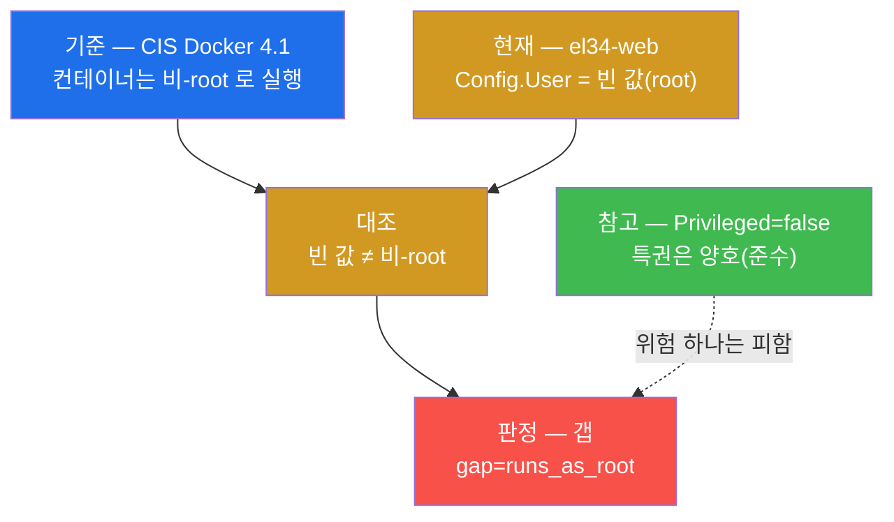
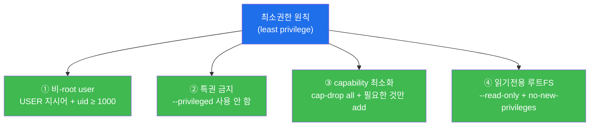
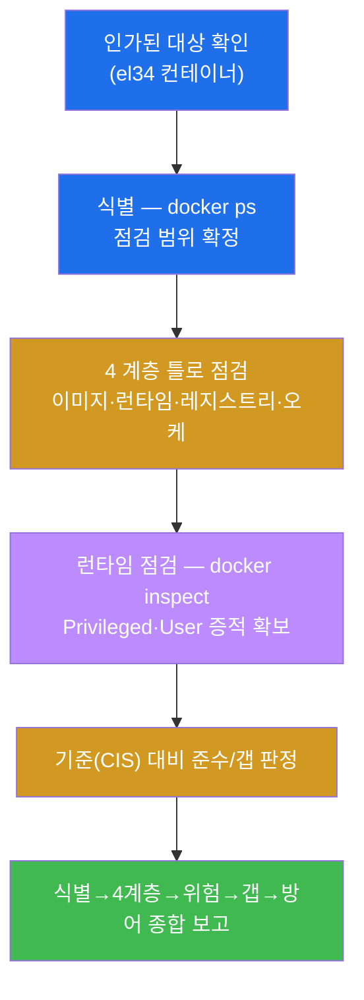
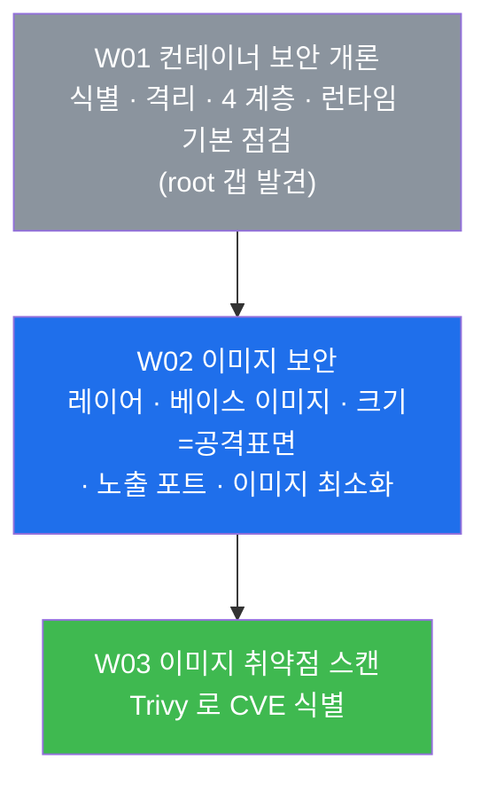

# 클라우드·컨테이너 W01 — 컨테이너 보안 개론 (식별·격리·4계층·기본 점검)

> **본 주차의 한 줄 요약**
>
> 컨테이너는 VM 보다 가볍지만, 그 가벼움의 대가로 **호스트의 커널을 여러 컨테이너가 함께 쓴다**(공유
> 커널). 그래서 격리가 VM 보다 얕고, 설정 하나(특권·root 실행·과한 권한)가 잘못되면 컨테이너 하나의
> 침해가 **호스트 전체로 번질 수 있다**(container escape). 본 주차에 학생은 el34 의 docker 컨테이너를
> 직접 식별하고(`docker ps`), 컨테이너와 VM 의 격리 차이를 정리하며, 컨테이너 보안을 **4 계층**(NIST
> SP 800-190 — 이미지·런타임·레지스트리·오케스트레이션)으로 나눠 보는 틀을 익힌다. 마지막에는
> `docker inspect` 로 el34-web 의 런타임 설정을 점검해, 특권은 꺼져 있지만(`Privileged=false`)
> **컨테이너가 root 로 실행되는 갭**(CIS Docker Benchmark 4.1 위반)을 본인 손으로 찾아낸다.
>
> **컨테이너 보안 점검자의 한 줄 결론**: 컨테이너 보안은 "뚫리느냐"를 막연히 걱정하는 것이 아니라,
> **"무엇이 돌고 있고(식별) → 격리가 얼마나 얕으며(공유 커널) → 어느 계층을 점검하고(4 계층) → 런타임
> 설정에 어떤 갭이 있는가(특권·root·권한)를 기준(CIS/NIST)에 대조해 증거로 밝히는** 일이다.

---

## 학습 목표

본 주차 종료 시 학생은 다음 6 가지를 **본인 손으로** 할 수 있어야 한다.

1. el34 호스트(`ssh ccc@192.168.0.80`)에서 `docker ps` 로 **실행 중인 컨테이너를 식별·집계**하고,
   무엇이 도는지를 보안 점검의 출발점으로 삼는다.
2. **컨테이너와 VM 의 격리 차이**(VM = 하드웨어 가상화 + 별도 게스트 OS / 컨테이너 = 호스트 커널 공유)를
   비유 없이 설명하고, 왜 컨테이너의 격리가 더 얕은지를 근거와 함께 말한다.
3. **컨테이너 보안 4 계층**(NIST SP 800-190 — 이미지 / 런타임 / 레지스트리 / 오케스트레이션)을 정리하고,
   각 계층이 무엇을 통제하며 이 트랙의 어느 주차에서 다루는지 매핑한다.
4. **공유 커널의 위험**(특권 컨테이너 · root 실행 · 과한 capability)이 왜 container escape(컨테이너 탈출)
   로 이어지는지 설명하고, escape 가 곧 호스트 위협임을 근거와 함께 말한다.
5. `docker inspect` 로 el34-web 의 **런타임 기본 설정**(Privileged · User)을 읽어, 특권은 양호하지만
   **root 실행 갭(CIS Docker 4.1)** 이 존재함을 증적(설정 출력)과 함께 판정한다.
6. 컨테이너 보안 **방어 개요**(비-root user · 특권 금지 · capability 최소화 · 읽기전용 루트FS)를
   최소권한(least privilege) 원칙으로 설명하고, 식별 → 4 계층 → 위험 → 갭 → 방어를 한 페이지 개론
   보고서로 종합한다.

> **점검자의 시선** — 본 주차는 컨테이너를 "만드는" 주가 아니라, 이미 돌고 있는 컨테이너를 **점검자
> (auditor)의 눈으로 들여다보는** 개론이다. 채점은 "위험하다"는 막연한 선언이 아니라, **무엇을
> 어떻게 점검해 어떤 기준(CIS/NIST) 대비 무엇이 갭인가를 증적과 함께 보였는가**를 본다. 핵심 산출물은
> el34-web 의 `gap=runs_as_root` 발견(미션 6)과, 그것을 4 계층·방어 맥락에 자리매김한 개론 보고서다.

---

## 0. 용어 해설 (컨테이너 보안 입문)

본 주차는 컨테이너 보안의 첫 주차이므로, 앞으로 트랙 전체에서 쓰는 핵심 용어를 먼저 정리한다. 한 줄
정의로는 부족한 핵심어는 다음 절(0.5)에서 일상 비유로 다시 풀어 설명한다.

| 용어 | 영문 | 뜻 | 비유 |
|------|------|----|------|
| **컨테이너** | container | 호스트 커널을 공유한 채 격리된 프로세스 묶음(앱 + 의존성) | 같은 건물(커널) 안의 칸막이 사무실 |
| **이미지** | image | 컨테이너를 만들기 위한 읽기 전용 템플릿(레이어의 누적) | 사무실을 짓는 설계도 + 자재 |
| **가상머신(VM)** | Virtual Machine | 하이퍼바이저 위에서 별도 게스트 OS 를 돌리는 가상 컴퓨터 | 부지째 따로 지은 독립 건물 |
| **커널** | kernel | OS 의 핵심(프로세스·메모리·장치·파일시스템 관리) | 건물의 중앙 설비실(전기·수도·보안) |
| **공유 커널** | shared kernel | 여러 컨테이너가 호스트의 **하나의 커널**을 함께 사용 | 모든 칸막이가 같은 설비실을 공유 |
| **격리** | isolation | 한 워크로드가 다른 워크로드·호스트에 영향을 못 주게 막는 경계 | 사무실 사이의 칸막이 두께 |
| **컨테이너 탈출** | container escape | 컨테이너 안에서 격리를 깨고 호스트(또는 다른 컨테이너)로 빠져나가는 공격 | 칸막이를 부수고 설비실에 침입 |
| **특권 컨테이너** | privileged container | `--privileged` 로 호스트의 거의 모든 장치·커널 기능에 접근 가능한 컨테이너 | 마스터키를 들고 다니는 입주자 |
| **capability** | Linux capability | root 권한을 잘게 쪼갠 단위 권한(예: `CAP_NET_ADMIN`, `CAP_SYS_ADMIN`) | 마스터키를 용도별로 나눈 개별 열쇠 |
| **루트(root)** | root / uid 0 | 시스템의 최고 권한 사용자(uid 0) | 건물의 시설 관리소장 |
| **docker inspect** | — | 컨테이너·이미지의 상세 설정(런타임·네트워크·권한)을 JSON 으로 출력 | 사무실 임대 계약서 전문 열람 |
| **NIST SP 800-190** | Application Container Security Guide | 미국 NIST 의 컨테이너 보안 표준(4 계층 위험·통제 정리) | 컨테이너 시설의 국가 안전 지침서 |
| **CIS Docker Benchmark** | Center for Internet Security Docker Benchmark | Docker 보안 설정을 항목별로 합의한 점검 기준서 | 시설 종류별 표준 안전 점검표 |
| **최소권한** | least privilege | 필요한 최소한의 권한만 부여하는 보안 원칙 | 출입증에 꼭 필요한 층만 개방 |
| **오케스트레이션** | orchestration | 다수 컨테이너의 배포·확장·운영을 자동화(compose / Kubernetes) | 여러 건물을 한 번에 관리하는 본사 관제 |

---

## 0.5 핵심 개념

위 표는 한 줄 정의에 그치므로, 컨테이너를 처음 다루는 학생이 헷갈리기 쉬운 핵심 용어를 일상 비유와
함께 풀어 설명한다. 본 절을 먼저 읽어두면 본문(§1~§5)에서 같은 용어가 다시 나올 때 흐름이 끊기지
않는다.

### 0.5.1 컨테이너 vs VM — 독립 건물 vs 칸막이 사무실

학생이 회사를 차린다고 하자. 사무 공간을 마련하는 방법은 두 가지다.

- **독립 건물을 따로 짓는다.** 전기·수도·보안 설비(= 커널)를 건물마다 별도로 갖춘다. 옆 건물에서
  무슨 일이 나도 우리 건물은 완전히 분리되어 안전하다. 대신 건물 한 채를 통째로 짓고 유지해야 하니
  **비싸고 무겁다**. 이것이 **VM(가상머신)** 이다. 하이퍼바이저(VMware·KVM 같은 가상화 계층) 위에
  게스트 OS(커널 포함)를 **통째로** 올린다.
- **한 건물 안에 칸막이를 세워 여러 사무실을 만든다.** 전기·수도·보안 설비(= 커널)는 건물 하나의
  것을 **모두가 공유**한다. 칸막이만 세우면 되니 **싸고 가볍고 빠르다**. 대신 칸막이는 벽보다 얇아,
  한 사무실의 사고가 설비실을 통해 다른 사무실로 번질 수 있다. 이것이 **컨테이너** 다.

이 비유의 핵심은 **"커널을 따로 쓰느냐, 함께 쓰느냐"** 다.

**컨테이너** 는 호스트의 커널을 공유하면서, Linux 의 namespace(이름공간 — 프로세스·네트워크·파일시스템
등을 컨테이너별로 분리)와 cgroups(자원 제한)로 **격리된 프로세스 묶음**이다. 별도의 OS 를 부팅하지
않으므로 시작이 빠르고(초 단위) 메모리도 적게 쓴다.

**VM** 은 하이퍼바이저 위에서 **자체 게스트 OS(커널 포함)** 를 돌리는 가상 컴퓨터다. 커널까지 따로
가지므로 격리가 강하지만, 부팅·메모리·디스크가 무겁다.

| 한 건물의 칸막이 사무실 (컨테이너) | 독립 건물 (VM) |
|------------------------------------|----------------|
| 설비실(커널)을 모두가 공유 | 건물마다 설비실(커널)을 별도 |
| 칸막이(namespace) = 얇은 격리 | 벽·부지(하이퍼바이저) = 두꺼운 격리 |
| 입주가 빠르고 싸다(초 단위 기동) | 신축이 느리고 비싸다(분 단위 부팅) |
| 한 사무실 사고가 설비실 통해 번질 위험 | 건물째 분리되어 번지기 어려움 |

여기서 보안의 출발점이 나온다 — 컨테이너는 가볍지만 격리가 얕으므로, **그 얇은 칸막이를 설정으로
보강**(특권 끄기·비-root·권한 최소화)하는 것이 컨테이너 보안의 핵심이다.

### 0.5.2 공유 커널 — 모두가 같은 설비실을 쓴다

앞 비유를 이어가자. 칸막이 사무실들이 같은 건물의 **설비실(전기·수도·중앙 보안)** 을 공유한다는 것은
편리하지만 위험하기도 하다. 어떤 입주자가 설비실 문을 열 수 있게 되면(= 커널 권한 획득), 칸막이를
넘어 **다른 모든 사무실에 영향을 줄 수 있기 때문**이다.

**공유 커널(shared kernel)** 이란, 호스트에서 돌아가는 모든 컨테이너가 **호스트의 단 하나의 커널**을
함께 쓴다는 뜻이다. 컨테이너 안의 프로세스도 결국 호스트 커널에 시스템 콜(system call — 프로그램이
커널에 기능을 요청하는 통로)을 보낸다. 컨테이너 격리는 이 커널 위에 namespace/cgroups 라는 **소프트웨어
경계**를 그은 것이지, VM 처럼 커널 자체가 분리된 것이 아니다.

그래서 결론은 이렇다 — **커널의 취약점이나 과도한 권한이 컨테이너 격리를 무력화하면, 한 컨테이너의
침해가 호스트와 다른 컨테이너로 번진다.** 이 "번짐"이 바로 다음에 설명할 container escape 다.

### 0.5.3 컨테이너 탈출(container escape) — 칸막이를 부수고 설비실로

학생의 사무실(컨테이너)에 도둑이 들어왔다고 하자. 칸막이 안에서 도둑이 할 수 있는 일은 원래 그
사무실 범위로 제한된다. 그런데 만약 그 사무실이 **설비실 마스터키**(= 특권/과한 권한)를 보관하고
있었다면, 도둑은 칸막이를 넘어 설비실(호스트 커널)로 들어가 건물 전체를 장악한다.

**컨테이너 탈출(container escape)** 은 공격자가 컨테이너 내부에서 격리 경계를 깨고 **호스트(또는 다른
컨테이너)** 로 빠져나가는 공격이다. 컨테이너 안에서 코드 실행을 얻은 공격자가, 잘못된 설정(특권·과한
capability)이나 커널/런타임 취약점을 이용해 호스트 권한을 획득한다.

왜 이것이 컨테이너 보안에서 가장 큰 위협인가 — 컨테이너는 보통 **여러 개가 한 호스트에 모여** 돌기
때문이다. 한 컨테이너가 탈출하면 같은 호스트의 다른 컨테이너(예: el34 의 41 컨테이너가 같은 VM 위에
있다)까지 위험해진다. 그래서 컨테이너 보안의 많은 통제(특권 금지·비-root·capability 최소화·읽기전용
루트FS)는 결국 **"탈출이 일어나도 피해를 최소화"** 하기 위한 것이다.

### 0.5.4 특권 컨테이너와 capability — 마스터키 vs 용도별 열쇠

건물 관리에서 입주자에게 줄 수 있는 권한은 두 극단 사이에 있다.

- **마스터키 한 개를 통째로 준다.** 모든 문(장치·커널 기능)을 다 열 수 있다. 편하지만, 그 입주자가
  악의를 품거나 침해당하면 건물 전체가 끝난다. 이것이 **특권 컨테이너(`--privileged`)** 다.
- **꼭 필요한 층의 열쇠만 골라 준다.** 예컨대 "네트워크 설비만 손댈 수 있는 열쇠"처럼 용도별로 잘게
  나눈 권한이다. 이렇게 잘게 쪼갠 단위 권한이 **Linux capability** 다.

**특권 컨테이너** 는 `--privileged` 플래그로 실행되어, 호스트의 거의 모든 장치(`/dev`)와 커널 기능에
접근할 수 있다. 사실상 컨테이너 격리를 대부분 무력화하므로, 보안상 **가능하면 절대 쓰지 않는다**(CIS
Docker Benchmark 권고).

**Linux capability** 는 전통적으로 root(uid 0)에게 한꺼번에 주어지던 막강한 권한을, 약 40여 개의 작은
단위로 쪼갠 것이다. 대표적으로 `CAP_NET_ADMIN`(네트워크 설정 변경), `CAP_SYS_ADMIN`(거의 모든 시스템
관리 — 사실상 준-특권), `CAP_NET_RAW`(raw 소켓) 등이 있다. 컨테이너는 기본적으로 일부 capability 만
갖지만, `--cap-add` 로 위험한 capability(특히 `CAP_SYS_ADMIN`)를 추가하면 **특권에 준하는 위험**이
된다. 따라서 안전한 방향은 **`--cap-drop all` 로 전부 떨어뜨린 뒤, 정말 필요한 것만 `--cap-add`** 하는
최소권한 방식이다. 컨테이너가 실제로 어떤 capability 를 추가/제거했는지는 다음에 설명할 `docker
inspect` 의 `CapAdd`/`CapDrop` 필드로 확인한다.

### 0.5.5 root 실행(uid 0) — 컨테이너 안의 소장님

칸막이 사무실 안에 **시설 관리소장(root)** 이 상주한다고 하자. 평소에는 칸막이가 그를 가두지만, 만약
누군가 칸막이를 부수는 데 성공하면(escape), 빠져나가는 사람이 **일반 직원이냐 소장이냐**에 따라 피해가
크게 달라진다. 소장(root)이 빠져나가면 설비실(호스트)에서 할 수 있는 일이 훨씬 많다.

컨테이너는 명시적으로 사용자를 지정하지 않으면 **기본적으로 root(uid 0)로 프로세스를 실행**한다.
컨테이너 안의 root 는 host 의 root 와 항상 같지는 않지만(user namespace 를 쓰면 분리됨), el34 처럼
user namespace 를 쓰지 않는 기본 구성에서는 **컨테이너의 uid 0 가 호스트의 uid 0 와 사실상 동일**하게
매핑된다. 그래서 컨테이너가 root 로 돌면, escape 가 일어났을 때 호스트에서 곧장 최고 권한을 휘두를 수
있는 위험이 커진다.

CIS Docker Benchmark 의 항목 **4.1** 이 바로 이것을 다룬다 — **"컨테이너는 비-root(non-root) 사용자로
실행하라"**. el34-web 은 이 권고에 어긋나 root 로 실행되며, 본 주차 미션 6 에서 학생이 직접 이 갭을
찾아낸다.

### 0.5.6 docker inspect — 임대 계약서 전문 읽기

사무실을 점검하려는 안전 검사관은 겉모습만 보지 않는다. **임대 계약서 전문**을 꺼내 "이 사무실은 어떤
권한으로 운영되는가, 마스터키를 갖고 있는가, 어떤 열쇠가 추가됐는가"를 한 줄씩 확인한다.

**`docker inspect`** 가 바로 그 계약서 전문이다. 컨테이너(또는 이미지)의 모든 설정 — 런타임 권한
(`HostConfig.Privileged`, `HostConfig.CapAdd`/`CapDrop`), 실행 사용자(`Config.User`), 네트워크, 마운트,
환경 변수 등 — 을 JSON 으로 출력한다. `--format` 옵션으로 원하는 필드만 뽑아낼 수 있어, 점검자는 이
한 명령으로 "이 컨테이너가 안전하게 설정됐는가"를 증거로 확인한다.

```bash
# 특권 여부와 실행 사용자만 뽑아 보기
docker inspect el34-web --format 'Priv={{.HostConfig.Privileged}} User=[{{.Config.User}}]'
```

이 출력값(예: `Priv=false User=[]`)이 곧 **점검의 증적**이다. `User=[]`(빈 값)는 사용자를 지정하지
않았다는 뜻이고, 컨테이너는 그 경우 root 로 돈다 — 이것이 미션 6 의 `gap=runs_as_root` 판정 근거다.

---

이 6 용어가 본 주차 본문의 기반이다. 본문에서 다시 등장할 때 막히면 본 절로 돌아오면 흐름이 끊기지
않는다.

---

## 1. 왜 컨테이너 보안을 따로 배우는가

### 1.1 한 줄 답: 가벼움의 대가는 얕은 격리다

컨테이너는 지난 10여 년간 서버 운영의 기본 단위가 되었다. 빠르고 가볍기 때문이다. 그러나 그 가벼움은
공짜가 아니다 — **호스트 커널을 공유**하는 대가로 얻은 것이다(§0.5.1~0.5.2). VM 은 게스트 OS 가 통째로
분리되어 격리가 두껍지만, 컨테이너의 격리는 같은 커널 위에 그은 소프트웨어 경계(namespace/cgroups)일
뿐이다. 그래서 컨테이너 보안의 첫 명제는 이렇다.



같은 호스트에 컨테이너가 수십 개씩 모여 돈다(el34 는 한 VM 에 41 컨테이너). 그래서 **한 컨테이너의
잘못된 설정**(특권·root·과한 권한)은 그 컨테이너만의 문제가 아니라, 탈출(escape) 시 호스트와 이웃
컨테이너 전부의 문제가 된다.

### 1.2 실제 컨테이너 사고 3건 (이 강의의 동기)

컨테이너 보안을 따로 배우는 이유는 추상적 우려가 아니라, 실제로 반복된 사고 유형 때문이다.

| 사고 유형 | 원인 | 어느 통제가 실패했나 |
|-----------|------|---------------------|
| **특권 컨테이너 escape**(`--privileged` + 호스트 마운트) | CI 러너·모니터링 에이전트를 편의상 특권으로 실행 → 호스트 `/` 마운트 후 탈출 | 런타임 통제(특권 금지·최소권한) 부재 |
| **취약 이미지로 인한 침해**(예: Log4Shell 류 라이브러리 포함 이미지 대량 배포) | 베이스 이미지·라이브러리의 알려진 취약점 미스캔 | 이미지 계층 통제(취약점 스캔) 부재 |
| **노출된 컨테이너 API/레지스트리**(인증 없는 Docker API·공개 레지스트리) | 오케스트레이션/레지스트리 설정 오류로 외부에서 컨테이너 생성·이미지 변조 | 레지스트리·오케스트레이션 계층 통제 부재 |

위 세 유형은 각각 **런타임 · 이미지 · 레지스트리/오케스트레이션** 계층의 실패다. 즉 컨테이너 보안은
한 군데만 막아서는 안 되고, 다음 절의 **4 계층**을 모두 봐야 한다는 것이 사고들의 공통 교훈이다.

### 1.3 한계 — 컨테이너 보안이 만능은 아니다

컨테이너 보안을 잘해도 그것이 애플리케이션 자체의 취약점(SQLi·XSS 등 OWASP Top 10)이나 OS 패치,
네트워크 방어를 대신하지는 못한다. 컨테이너 보안은 **격리·이미지·런타임·공급망**의 위험을 다루는
한 축이며, secuops/web-vuln/compliance 등 다른 트랙의 통제와 **함께** 작동해야 전체 방어가 된다. 본
트랙은 그 한 축을 깊게 파는 과정이고, 본 주차는 그 개론이다.

---

## 2. 컨테이너 식별 — 점검의 출발점

### 2.1 한 줄 정의와 왜 중요한가

**컨테이너 식별** 은 호스트에서 **무엇이 실행 중인가**(이름·수·이미지·포트)를 파악하는 작업이다.
보안 점검의 첫걸음은 언제나 자산 인벤토리다 — **모르는 것은 지킬 수 없기 때문**이다. 어떤 컨테이너가
도는지 모르면, 그중 어느 것이 특권으로 떠 있는지, 어느 것이 외부에 포트를 열었는지도 알 수 없다.

### 2.2 el34 에서 어떻게

el34 는 단일 VM(192.168.0.80) 위에서 docker 로 **41 개 컨테이너**가 돈다(web/ips/siem/fw/attacker/
bastion 등 보안 핵심 컨테이너 + OpenCTI/MISP 등 부가 스택). 점검자는 호스트에 SSH 로 들어간 뒤
`docker ps` 로 목록과 수를 확인한다.

```bash
echo "containers=$(docker ps -q | wc -l)"
docker ps --format '{{.Names}}' | head -8
```

- `docker ps` — 실행 중인 컨테이너를 나열한다(`-a` 를 붙이면 멈춘 것까지). `--format '{{.Names}}'` 는
  이름만 뽑는 Go 템플릿 표현이다.
- `docker ps -q | wc -l` — `-q`(quiet)는 컨테이너 ID 만 한 줄씩 출력하고, `wc -l` 로 줄 수를 세면
  **실행 중 컨테이너 수**가 된다.

이 출력(예: `containers=41`)이 곧 본 주차 점검의 범위다.



### 2.3 한계

컨테이너 수를 세는 것은 시작일 뿐이다. 진짜 인벤토리는 각 컨테이너에 **이미지 출처·역할·노출 포트·
권한 설정**을 매핑하는 것이다. 본 주차는 식별(범위 확정)까지 다루고, 이미지 분석은 W02, 취약점 스캔은
W03 에서 깊이 들어간다.

---

## 3. 컨테이너 vs VM — 격리 차이의 정밀화

### 3.1 한 줄 정의와 왜 중요한가

**컨테이너와 VM 의 차이**는 한마디로 **커널을 공유하느냐(컨테이너) 별도로 두느냐(VM)** 다(§0.5.1).
이 차이가 보안에서 중요한 이유는, **격리의 두께가 다르기 때문**이다. VM 은 게스트 OS·커널이 통째로
분리되어 탈출이 매우 어렵지만, 컨테이너는 같은 커널 위의 소프트웨어 경계라 탈출 위험이 상대적으로
높다. 따라서 컨테이너에는 **VM 에는 없는 추가 설정 통제**(특권 금지·비-root·capability 최소화)가
필요하다.

### 3.2 구조 비교



위 그림에서 핵심은 색이다. VM 쪽은 게스트 OS(초록)가 커널을 따로 갖고, 컨테이너 쪽은 **호스트 커널
하나(빨강)** 를 두 컨테이너가 공유한다. 빨간 커널이 무너지면(취약점·과한 권한) 그 위의 두 컨테이너
(주황)가 모두 위험해진다 — 이것이 공유 커널의 보안 의미다.

### 3.3 el34 에서 어떻게

el34 의 보안 컨테이너(el34-web 등)는 모두 단일 호스트 VM(192.168.0.80)의 **하나의 커널**을 공유한다.
즉 el34 안의 한 컨테이너에서 escape 가 일어나면, 같은 커널 위의 다른 40 개 컨테이너까지 위협 범위에
든다. lab 에서는 이 차이를 한 줄로 정리한다.

```bash
echo "VM: 하드웨어 가상화 + 게스트 OS 별도 → 강한 격리, 무겁다"
echo "컨테이너: 호스트 커널 공유 + 프로세스 격리 → 가볍다, 격리 얕다"
echo "→ 컨테이너 보안 = 얕은 격리를 설정(특권/권한/user)으로 보강"
```

### 3.4 한계

컨테이너의 격리가 "얕다"는 것이 "쓸모없다"는 뜻은 아니다. namespace/cgroups 격리는 일상적 운영에서
충분히 유용하며, user namespace·seccomp·AppArmor 같은 추가 통제를 더하면 격리를 크게 강화할 수 있다.
또 gVisor·Kata Containers 처럼 컨테이너에 VM 급 격리를 입히는 기술도 있다. 핵심은 **"기본 컨테이너의
격리는 얕으니 설정으로 보강해야 한다"** 는 것이지, 컨테이너가 무조건 위험하다는 것이 아니다.

---

## 4. 컨테이너 보안 4 계층 (NIST SP 800-190)

### 4.1 한 줄 정의와 왜 중요한가

미국 NIST 의 **SP 800-190(Application Container Security Guide)** 은 컨테이너 보안의 위험과 통제를
**4 계층**으로 나눠 정리한다 — **이미지 · 런타임 · 레지스트리 · 오케스트레이션**. 이 틀이 중요한 이유는,
§1.2 의 사고들이 보여주듯 컨테이너 위협이 **여러 계층에 흩어져 있기** 때문이다. 한 계층만 단단히
막고 다른 계층을 비워두면, 공격자는 약한 계층을 파고든다. 4 계층은 점검자에게 **빠짐없이 훑을 체크
포인트**를 준다.

> **용어 — NIST SP 800-190.** NIST(미국 국립표준기술연구소)가 펴낸 컨테이너 보안 표준 문서다. 컨테이너
> 생태계의 주요 구성요소(이미지·레지스트리·오케스트레이터·런타임 등)별로 **무엇이 위험하고 어떻게
> 통제하는가**를 정리한다. 이 트랙은 이 4 계층 틀을 따라 W01~W15 의 주제를 배치한다.

### 4.2 4 계층 각각이 무엇을 통제하나



- **① 이미지** — 컨테이너는 이미지에서 태어나므로, 이미지에 든 패키지·라이브러리·비밀이 그대로 위험이
  된다. 큰 베이스 이미지일수록 패키지가 많고, 패키지가 많을수록 알려진 취약점(CVE)도 많다. 통제는
  최소 베이스·취약점 스캔·비밀 분리다(W02·W03).
- **② 런타임** — 컨테이너를 **어떤 권한으로 실행하느냐**가 격리의 두께를 좌우한다. 특권 컨테이너,
  root 실행, 과한 capability 가 escape 위험을 키운다. 통제는 특권 금지·비-root·capability 최소화·
  읽기전용 루트FS다(본 주차 §5·§6, 이후 심화).
- **③ 레지스트리** — 이미지를 보관·배포하는 저장소다. 출처가 검증되지 않거나 서명이 없으면 변조된
  이미지가 끼어들 수 있다(공급망 공격). 통제는 신뢰 레지스트리·이미지 서명·접근통제다(W11 계열).
- **④ 오케스트레이션** — 다수 컨테이너를 자동 배포·확장하는 계층(docker compose, Kubernetes). 설정
  오류(노출된 API·과한 권한·평문 시크릿)가 전체를 위태롭게 한다. 통제는 RBAC·네트워크 정책·시크릿
  관리다(W12 계열).

### 4.3 el34 에서 어떻게

el34 의 컨테이너 한 대(el34-web)에도 이 4 계층이 모두 응축되어 있다 — 그것은 **어떤 이미지**(Ubuntu
22.04 베이스, W02 에서 점검)로 만들어졌고, **어떤 런타임 설정**(Privileged·User, 본 주차 §5 점검)으로
돌며, 어떤 레지스트리에서 왔고, 어떤 compose 로 운영되는가. lab 에서는 4 계층을 한 줄씩 정리한다.

```bash
echo "1) 이미지: 베이스 이미지·레이어·취약점"
echo "2) 런타임: 특권/capabilities/user/격리"
echo "3) 레지스트리: 출처·서명·무결성"
echo "4) 오케스트레이션: compose/k8s 설정"
echo "→ 각 계층마다 통제. 한 계층만 강해도 부족"
```

### 4.4 한계

4 계층은 **위험을 분류하는 틀**이지, 그 자체가 보안을 보장하지는 않는다. 각 계층마다 실제 통제(스캔
도구·런타임 정책·서명 검증 등)를 적용하고 정기적으로 점검해야 의미가 있다. 본 주차는 4 계층의 **지도**
를 익히는 단계이고, 트랙의 후속 주차들이 각 계층을 하나씩 깊게 다룬다.

---

## 5. 공유 커널의 위험 — escape 로 가는 세 길

### 5.1 한 줄 정의와 왜 중요한가

공유 커널 환경에서 컨테이너가 호스트로 탈출(escape)하게 만드는 대표적 **잘못된 런타임 설정**은 세
가지다 — **특권 컨테이너 · root 실행 · 과한 capability**. 이 세 가지가 위험한 이유는, 모두 **컨테이너가
호스트 커널에 미치는 영향력을 키워** 격리를 얇게 만들기 때문이다(§0.5.4·0.5.5).

### 5.2 세 가지 위험



- **특권 컨테이너(`--privileged`)** — 호스트의 장치(`/dev`)와 거의 모든 커널 기능에 접근할 수 있어,
  사실상 격리가 사라진다. escape 가 거의 자명해진다.
- **root 실행** — 컨테이너가 uid 0 로 돌면, escape 시 호스트에서 최고 권한으로 행동할 여지가 커진다.
  el34-web 이 바로 이 경우다(§6).
- **과한 capability** — `CAP_SYS_ADMIN` 같은 강력한 capability 를 추가하면, 특권을 안 걸어도 특권에
  준하는 위험이 생긴다. 그래서 capability 는 **떨어뜨리고(drop) 필요한 것만 더하는** 것이 원칙이다.

### 5.3 el34 에서 어떻게

el34 의 컨테이너들도 같은 호스트 커널을 공유하므로(§3.3), 위 세 위험이 그대로 적용된다. 다행히
el34-web 은 **특권이 꺼져 있어(`Privileged=false`)** 가장 큰 위험 하나는 피한다. 그러나 **root 로
실행되는 갭**은 남아 있다(§6 에서 확인). lab 에서는 이 위험들을 한 줄로 정리한다.

```bash
echo "특권 컨테이너(--privileged): 호스트 장치/커널 접근 → escape 시 호스트 장악"
echo "root 실행: 컨테이너 root = 탈출 시 호스트 권한 위협"
echo "과한 capability: CAP_SYS_ADMIN 등은 사실상 특권"
echo "→ 커널 공유라 컨테이너 탈출이 곧 호스트 위협(escape)"
```

### 5.4 한계

이 세 가지는 **가장 흔하고 영향이 큰** 위험이지만 전부는 아니다. 호스트 디렉터리 마운트(`-v
/:/host`), 호스트 네트워크/PID namespace 공유(`--network=host`, `--pid=host`), 커널 자체의 0-day
취약점도 escape 경로가 된다. 본 주차는 점검 가능한 핵심 세 가지(특권·root·capability)에 집중하고,
나머지 경로는 이후 런타임 보안 주차에서 다룬다.

---

## 6. 기본 점검 — docker inspect 로 런타임 갭 찾기

### 6.1 한 줄 정의와 왜 중요한가

**런타임 기본 점검** 은 `docker inspect` 로 컨테이너의 실행 설정(특권 여부·실행 사용자 등)을 읽어,
CIS Docker Benchmark 기준 대비 **준수/갭을 판정**하는 작업이다(§0.5.6). 이것이 본 주차의 가장 실전적인
실습이다 — 추상적 위험(§5)을 **실제 컨테이너의 구체적 설정값**으로 확인하기 때문이다.

### 6.2 무엇을 점검하나

본 주차에서 점검하는 두 항목은 §5 의 위험 중 점검이 가장 쉽고 영향이 큰 둘이다.

- **Privileged(특권 여부)** — `HostConfig.Privileged` 가 `true` 면 특권 컨테이너(치명적 갭). `false`
  여야 한다.
- **User(실행 사용자)** — `Config.User` 가 비어 있으면 컨테이너가 root(uid 0)로 돈다(CIS Docker 4.1
  위반). 비-root 사용자(예: uid ≥ 1000)가 지정돼야 한다.

> **용어 — CIS Docker Benchmark 4.1.** CIS 가 펴낸 Docker 보안 점검표의 한 항목으로, **"컨테이너를
> root 가 아닌 사용자로 실행하라"** 를 요구한다. root 실행은 escape 시 피해를 키우므로, 이미지의
> `USER` 지시어나 실행 시 `--user` 로 비-root 를 지정하는 것이 권고다.

### 6.3 el34 에서 어떻게 — 갭 판정

el34-web 을 점검하면 **특권은 양호하나 root 실행 갭**이 드러난다.

```bash
docker inspect el34-web --format 'Priv={{.HostConfig.Privileged}} User=[{{.Config.User}}]'
U=$(docker inspect el34-web --format '{{.Config.User}}'); [ -z "$U" ] && echo "gap=runs_as_root" || echo "user=$U"
```

- 첫 줄은 `Priv=false User=[]` 처럼 나온다 — **특권은 꺼져 있고(`false`, 양호), 사용자는 지정되지
  않았다(`[]`, 빈 값)**.
- 둘째 줄은 `$U`(사용자 값)가 비었는지 검사한다. `[ -z "$U" ]` 가 참이면(빈 값이면) `gap=runs_as_root`
  를 출력한다 — 즉 **컨테이너가 root 로 돈다는 갭** 판정이다.

이 출력값이 곧 증적이다. "위험해 보인다"가 아니라 **`Config.User` 가 비어 있다는 설정 출력 → CIS
Docker 4.1 미달 → 갭** 의 삼박자(기준·현재·판정)로 보고한다.



### 6.4 한계

본 점검은 두 항목(Privileged·User)만 본다. 완전한 런타임 점검은 capability(`CapAdd`/`CapDrop`),
seccomp/AppArmor 프로파일, 읽기전용 루트FS(`ReadonlyRootfs`), 호스트 마운트, namespace 공유까지 함께
봐야 한다. 또 "root 로 돈다"가 항상 치명적인 것은 아니다 — user namespace 로 컨테이너 root 를 호스트의
비-root 로 매핑하면 위험이 크게 준다. 다만 el34 는 그 매핑을 쓰지 않는 기본 구성이므로, root 실행은
실제 갭으로 보고한다. 더 깊은 런타임 통제는 이후 주차의 주제다.

---

## 7. 방어 개요 — 최소권한으로 escape 영향 줄이기

### 7.1 한 줄 정의와 왜 중요한가

컨테이너 런타임 방어의 핵심 원칙은 **최소권한(least privilege)** 이다 — 컨테이너에 **꼭 필요한 최소한의
권한만** 부여하는 것. 왜 중요한가 — 공유 커널 환경에서 escape 를 100% 막을 수는 없으므로, **escape 가
일어나더라도 피해를 최소화**하도록 평소에 권한을 좁혀 두는 것이 현실적 방어이기 때문이다.

### 7.2 네 가지 방어 통제



- **① 비-root user** — 이미지에 `USER` 지시어로 비-root(uid ≥ 1000)를 지정하거나 실행 시 `--user` 로
  지정한다. el34-web 의 갭(§6)을 정확히 메우는 통제다.
- **② 특권 금지** — `--privileged` 를 쓰지 않는다. 정말 특정 장치가 필요하면 `--device` 로 그 장치만
  노출한다.
- **③ capability 최소화** — `--cap-drop all` 로 전부 떨어뜨린 뒤, 꼭 필요한 capability 만 `--cap-add`
  한다(예: 80 포트 바인딩이 꼭 필요하면 `--cap-add NET_BIND_SERVICE`).
- **④ 읽기전용 루트FS** — `--read-only` 로 루트 파일시스템을 읽기 전용으로 만들면 악성코드가 파일을
  심기 어렵다. `--security-opt no-new-privileges` 는 실행 후 권한 상승(setuid 등)을 차단한다.

> **용어 — no-new-privileges.** 컨테이너 프로세스가 실행 도중 새 권한을 얻는 것(예: setuid 바이너리로
> 권한 상승)을 커널 차원에서 막는 옵션이다. 권한 상승 경로를 닫아 escape 난도를 높인다.

### 7.3 el34 에서 어떻게

el34-web 의 갭(root 실행)에 대한 정석 시정은 §7.2 의 **① 비-root user** 다. lab 에서는 네 통제를 한 줄씩
정리한다.

```bash
echo "1) 비-root user(USER 지시어 + uid≥1000)"
echo "2) 특권 금지(--privileged 사용 안 함)"
echo "3) capability 최소화(drop all + 필요한 것만 add)"
echo "4) 읽기전용 루트FS(--read-only) + no-new-privileges"
echo "→ 핵심: 얕은 격리를 최소권한 설정으로 보강"
```

### 7.4 한계

위 네 통제는 런타임 계층의 기본이며 가장 효과가 크지만, 4 계층 전체를 대신하지는 못한다. 이미지
취약점(① 계층)·레지스트리 신뢰(③)·오케스트레이션 설정(④)은 별도로 다뤄야 한다. 또 통제를 설정만
하고 점검하지 않으면 시간이 지나며 표류(drift)한다 — 그래서 정기 점검(SCA·이미지 스캔)이 필요하며,
이는 이후 주차에서 자동화한다.

---

## 8. 점검 명령 빠른 복습 — "무엇을 어디서 보나"

본 주차의 핵심 점검 명령을 한 번에 정리한다. 모든 명령은 el34 호스트(`ssh ccc@192.168.0.80`, 비밀번호
1)에서 실행하며, **신규 도구 설치는 없다**(호스트의 `docker` CLI 만 사용).

| 무엇을 | 명령 | 무엇을 보나 |
|--------|------|-------------|
| docker 가용 | `docker version --format 'docker={{.Server.Version}}'` | CLI 접근·서버 버전 |
| 컨테이너 식별 | `docker ps -q \| wc -l` + `docker ps --format '{{.Names}}'` | 실행 중 수·이름(점검 범위) |
| 컨테이너 vs VM | (개념 정리) | 커널 공유 = 얕은 격리 |
| 보안 4 계층 | (NIST 800-190 정리) | 이미지/런타임/레지스트리/오케 |
| 공유 커널 위험 | (개념 정리) | 특권·root·과한 cap → escape |
| 런타임 기본 점검 | `docker inspect el34-web --format 'Priv={{.HostConfig.Privileged}} User=[{{.Config.User}}]'` | `Priv=false`(양호) + `User=[]`(root 갭) |

> **점검 관용구.** 미션 6 의 명령은 `[ -z "$U" ] && echo "gap=runs_as_root" || echo "user=$U"` 형태로
> 판정을 셸 한 줄로 자동화해 두었다. 학생은 출력에 `gap=runs_as_root` 가 나오는지로 갭 판정을 읽는다 —
> 이것이 "기준(CIS 4.1) + 현재(빈 User) + 판정(갭)"의 증적이다.

---

## 9. 실습 안내 — lab 8 미션 (4 축 설명)

본 주차 lab 은 8 미션으로 구성되며, lab 의 `order` 와 1:1 로 대응한다. 각 미션을 **4 축**으로 설명한다
— 왜 하는가 / 무엇을 알 수 있는가 / 결과 해석(정상 vs 갭) / 실전 활용.

> **실습 진행 원칙.** 모든 명령은 el34 호스트(`ssh ccc@192.168.0.80`)에서 `docker` CLI 로 실행한다.
> 이번 주는 **신규 설치가 없고**, 점검 대상은 인가된 el34 컨테이너(주로 `el34-web`)뿐이다. 합격 임계값은
> 0.7 이다.

### 미션 1 — 점검: docker 가용 (10점)

> **왜 하는가?** 모든 컨테이너 보안 점검의 도구는 `docker` CLI 다. 본격 점검 전, 호스트에서 docker 가
> 동작하는지부터 확인한다(도구가 안 되면 이후 점검이 무의미하다).
>
> **무엇을 알 수 있는가?** `docker version` 으로 CLI 접근 가능 여부와 서버 버전. 점검 환경이 준비됐는지.
>
> **결과 해석.** 정상: 출력에 `docker` 가 나옴(버전 또는 `docker_ok`). 비정상: 명령이 없거나 권한
> 오류면 호스트 SSH·docker 데몬·사용자 권한을 점검한다.
>
> **실전 활용.** 컨테이너 점검 착수 시 첫 확인. dashboard 보다 빠르게 환경 가동을 검증하는 단계다.

### 미션 2 — 컨테이너 식별 (14점)

> **왜 하는가?** 모르는 것은 지킬 수 없다. 점검의 1 단계는 호스트에서 **무엇이 도는가**(수·이름)를
> 집계해 점검 범위를 확정하는 것이다(§2).
>
> **무엇을 알 수 있는가?** 실행 중 컨테이너 수(`containers=<n>`)와 이름 일부 — 곧 본 주차 점검 범위.
> el34 는 41 컨테이너(web/ips/siem/fw/attacker 등)가 돈다.
>
> **결과 해석.** 정상: 출력에 `containers=` 와 집계 값이 나옴(식별 성공). 비정상: 0 이거나 오류면
> docker 데몬·권한을 재확인한다.
>
> **실전 활용.** 운영 인수 시 첫 30초 명령. 어떤 컨테이너가 특권·외부 포트로 떠 있는지 좁혀가는
> 출발점이 된다.

### 미션 3 — 컨테이너 vs VM (12점)

> **왜 하는가?** 컨테이너 보안의 모든 통제는 "격리가 얕다"는 전제에서 나온다. 그 전제의 근거인 **커널
> 공유**(컨테이너) vs **별도 OS**(VM)의 차이를 명확히 정리한다(§3).
>
> **무엇을 알 수 있는가?** 컨테이너와 VM 의 격리 차이와, 왜 컨테이너에 추가 설정 통제(특권 금지·비-root)
> 가 필요한지.
>
> **결과 해석.** 정상: 출력에 `커널`(공유)이 포함됨 — 격리 차이를 핵심어로 정리했다는 뜻. 비정상:
> 커널 공유 개념이 빠지면 §3·§0.5.1 을 다시 읽는다.
>
> **실전 활용.** 컨테이너 보안 설계·점검의 사고 틀. "왜 이 통제가 컨테이너에만 필요한가"를 설명하는
> 근거가 된다.

### 미션 4 — 보안 4 계층 (NIST 800-190) (12점)

> **왜 하는가?** 컨테이너 위협은 여러 계층에 흩어져 있다. 한 계층만 막으면 다른 계층이 뚫린다. 4 계층
> 틀로 **빠짐없이 훑을 체크포인트**를 세운다(§4).
>
> **무엇을 알 수 있는가?** 이미지·런타임·레지스트리·오케스트레이션 각각이 무엇을 통제하며, 이 트랙의
> 어느 주차에서 다루는지의 지도.
>
> **결과 해석.** 정상: 출력에 `런타임`(2 계층)이 포함됨 — 4 계층을 정리했다는 뜻. 비정상: 계층이 누락
> 되면 §4.2 의 4 노드를 다시 확인한다.
>
> **실전 활용.** 컨테이너 보안 점검 체크리스트의 골격. 점검을 시작할 때 "어느 계층부터 볼까"의 기준이
> 된다.

### 미션 5 — 공유 커널 위험 (12점)

> **왜 하는가?** 공유 커널은 escape 의 토대다. escape 로 가는 세 길(특권·root·과한 capability)을 정리해,
> 다음 미션의 실제 점검(특권·user)과 연결한다(§5).
>
> **무엇을 알 수 있는가?** 왜 특권·root·과한 capability 가 escape 위험을 키우는지, 그리고 escape 가 곧
> 호스트 위협인 이유.
>
> **결과 해석.** 정상: 출력에 `escape`(탈출)가 포함됨 — 위험의 핵심을 짚었다는 뜻. 비정상: escape 개념이
> 빠지면 §0.5.3·§5.2 를 다시 읽는다.
>
> **실전 활용.** 런타임 위험 평가의 사고 틀. 어떤 컨테이너가 위험한지(특권·root·과한 cap) 우선순위를
> 매기는 근거가 된다.

### 미션 6 — 기본 점검: Privileged / User (16점, 핵심)

> **왜 하는가?** 본 주차의 핵심 산출물이다. 추상적 위험(§5)을 `docker inspect` 로 **el34-web 의 구체적
> 설정값**으로 확인해, root 실행 갭(CIS Docker 4.1)을 본인 손으로 찾는다(§6).
>
> **무엇을 알 수 있는가?** el34-web 의 `Privileged`(특권 여부)와 `User`(실행 사용자) 실제 값, 그리고
> CIS Docker 4.1 대비 준수/갭. el34-web 은 `Privileged=false`(양호)지만 `User` 가 비어 root 로 돈다.
>
> **결과 해석.** 정상(갭 판정 성공): 출력에 `gap=runs_as_root` 가 나옴 — `Config.User` 가 빈 값이라
> 컨테이너가 root 로 도는 갭이다(CIS 4.1 미달). 비정상: `user=<값>` 이 나오면 비-root 가 지정된 것이고,
> inspect 가 실패하면 컨테이너 이름·docker 권한을 점검한다.
>
> **실전 활용.** 모든 컨테이너 런타임 점검의 1 순위 항목. "특권 켜졌나 / root 로 도나"를 `docker inspect`
> 한 줄로 증적과 함께 판정하는 표준 절차다.

### 미션 7 — 방어 개요: 최소권한 (12점)

> **왜 하는가?** 갭을 찾았으면 **어떻게 막을지**가 따라와야 한다. escape 영향을 줄이는 런타임 방어를
> 최소권한 원칙으로 정리한다(§7).
>
> **무엇을 알 수 있는가?** 비-root user·특권 금지·capability 최소화·읽기전용 루트FS 라는 네 통제와,
> 그것이 escape 피해를 어떻게 줄이는지. 미션 6 의 갭(root)을 메우는 통제가 무엇인지.
>
> **결과 해석.** 정상: 출력에 `최소권한`(least privilege)이 포함됨 — 방어 원칙을 정리했다는 뜻. 비정상:
> 네 통제 중 핵심이 빠지면 §7.2 를 다시 확인한다.
>
> **실전 활용.** 컨테이너 배포 표준(보안 baseline)의 골격. 새 컨테이너를 띄울 때 적용할 런타임 정책의
> 기준이 된다.

### 미션 8 — 컨테이너 개론 보고서 (12점)

> **왜 하는가?** 점검의 산출물은 보고서다. 미션 1–7 을 식별 → 4 계층 → 위험 → 갭 → 방어의 한 흐름으로
> 종합해야 개론 학습이 완성된다.
>
> **무엇을 알 수 있는가?** 전 미션을 한 문서로 묶는 법 — 식별/4 계층 + 공유 커널 위험/root 갭 + 최소권한
> 방어. 준수(특권 양호)와 갭(root 실행)을 함께 제시하는 균형 잡힌 보고.
>
> **결과 해석.** 정상: 보고서에 `4계층` + root 갭 + 방어가 포함됨. 비정상: 갭이나 방어가 빠지면 보고서
> 양식(§미션 8 instruction)을 다시 채운다.
>
> **실전 활용.** 컨테이너 보안 점검 보고서의 입문 구조(개요 → 식별 → 4 계층 → 위험/갭 → 방어 → 결론).
> 이후 주차의 더 정밀한 점검 보고서로 발전시키는 기반이 된다.

---

## 10. 실습 수칙 — 인가된 점검과 증적 중심

컨테이너 보안 점검도 **허가받은 대상에 대해서만** 한다. 다음 수칙을 지킨다.

- **인가된 대상만 점검한다.** el34 의 정해진 컨테이너(`el34-web` 등)만 점검하며, 같은 명령을 그 밖의
  어떤 시스템에도 시도하지 않는다.
- **점검만, 변경은 하지 않는다.** 본 주차는 `docker ps`·`docker inspect` 같은 **읽기 전용** 점검이다.
  컨테이너를 멈추거나 설정을 바꾸지 않는다(시정은 운영팀의 변경관리로).
- **증적 우선.** "위험하다"가 아니라 **기준(CIS 4.1) + 현재(설정 출력) + 판정(갭/준수)** 의 삼박자로
  보고한다. `docker inspect` 의 출력값 자체가 증적이다.



---

## 11. 핵심 정리 (1줄씩)

1. **공유 커널** — 컨테이너는 호스트 커널을 공유한다. 가볍지만 격리가 얕아, 설정 하나가 escape 로
   호스트 전체를 위협한다.
2. **컨테이너 vs VM** — VM 은 별도 OS(두꺼운 격리), 컨테이너는 커널 공유(얇은 격리). 컨테이너에는 추가
   설정 통제가 필요하다.
3. **보안 4 계층(NIST 800-190)** — 이미지 / 런타임 / 레지스트리 / 오케스트레이션. 한 계층만 강해도 부족,
   빠짐없이 점검한다.
4. **공유 커널 위험** — 특권 · root 실행 · 과한 capability 가 escape 로 가는 세 길. 점검이 쉬운 둘(특권·
   user)부터 본다.
5. **el34-web 기본 점검** — `docker inspect` 로 `Privileged=false`(양호)이나 `User` 비어 root 실행
   (CIS Docker 4.1 갭 = `gap=runs_as_root`).
6. **방어 = 최소권한** — 비-root user + 특권 금지 + capability 최소화 + 읽기전용 루트FS. escape 가 나도
   피해를 줄인다.

---

## 12. 다음 주차 (W02) 예고 — 이미지 보안

본 주차(W01)는 컨테이너 보안의 **개론**이었다 — 식별·격리·4 계층·런타임 기본 점검. W01 이 4 계층 중
주로 **② 런타임**(Privileged·User)을 살짝 맛봤다면, W02 는 첫 번째 계층인 **① 이미지(Image)** 로
들어간다.



W02 에서는 **"이미지가 곧 공격 표면"** 이라는 명제를 다룬다 — `docker history` 로 레이어를 분석하고,
el34-web 의 베이스 이미지(Ubuntu 22.04 full OS, 약 560MB)와 노출 포트(EXPOSE 22)를 점검해, 큰 이미지가
왜 더 많은 취약점과 침해 후 악용 도구를 품는지, 그리고 멀티스테이지 빌드·distroless 같은 **이미지
최소화**로 표면을 어떻게 줄이는지를 본인 손으로 확인한다. 본 주차에서 익힌 `docker inspect`·`docker ps`
가 W02 의 `docker history`·`docker images` 로 자연스럽게 이어진다.
