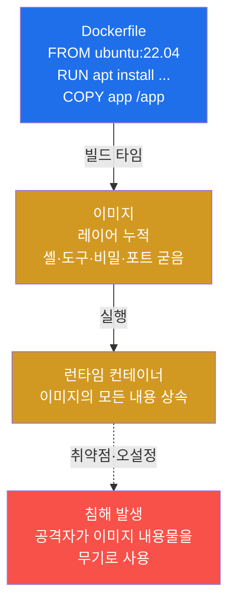
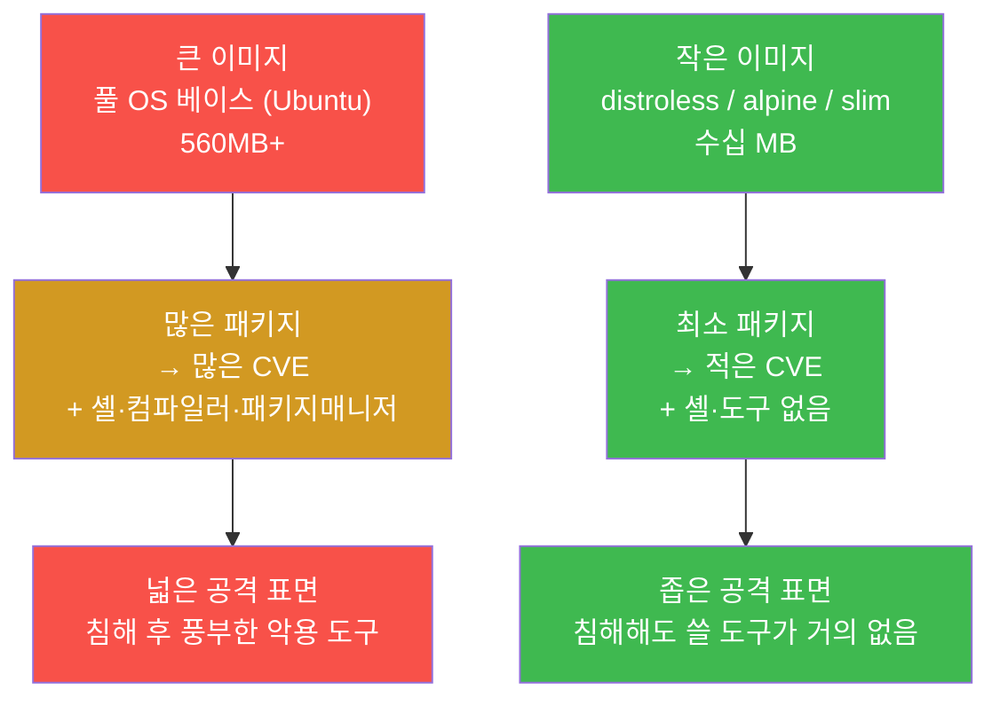
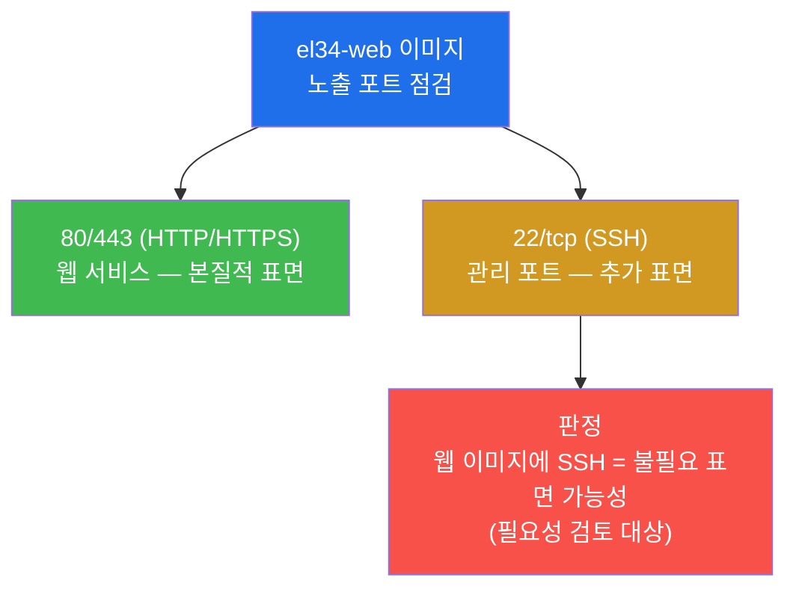
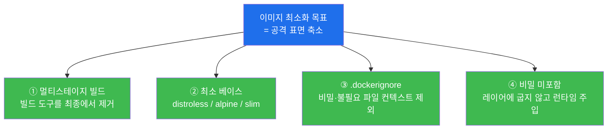
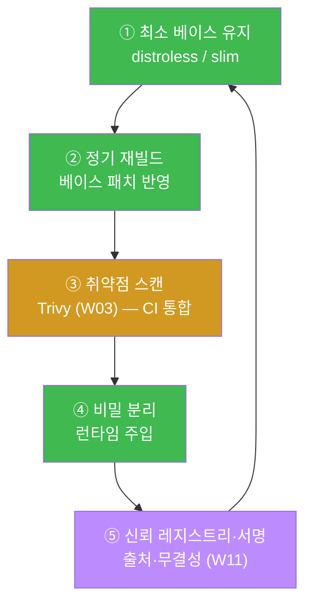
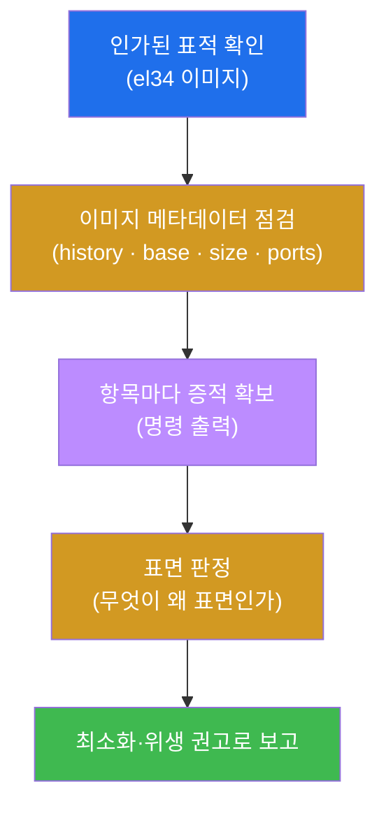
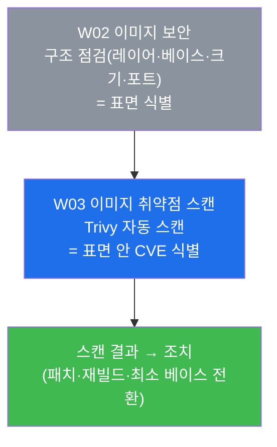

# 클라우드·컨테이너 W02 — 이미지 보안 (이미지가 곧 공격 표면)

> **본 주차의 한 줄 요약**
>
> 컨테이너는 **이미지(image)** 라는 설계도에서 태어난다. W01 에서 학생은 컨테이너 보안의 4계층
> (이미지 → 런타임 → 레지스트리 → 오케스트레이션)을 배웠고, 그 **첫 번째 계층이 이미지**였다. 본
> 주차는 그 이미지 자체를 **점검자(CIS Docker / NIST SP 800-190 의 이미지 항목)** 의 눈으로 해부한다.
> 이미지에 담긴 모든 패키지·도구·열린 포트·비밀은 그대로 런타임의 **공격 표면(attack surface)** 이
> 되기 때문이다. 학생은 el34 의 실제 이미지(`el34-web` 등)를 대상으로 레이어·빌드 히스토리·베이스
> OS·크기·노출 포트를 직접 읽어 "이 이미지의 표면이 어디까지인가"를 증적으로 보이고, 마지막에 이미지를
> 작게 만드는 방어(멀티스테이지 빌드·distroless·.dockerignore)를 정리한다.
>
> **점검자 한 줄 결론**: 이미지 보안은 "이미지가 돌아가는가"가 아니라 **"이 이미지가 외부에 무엇을
> 노출하고, 침해 후 공격자에게 무엇을 쥐여 주는가"** 를 점검하는 일이다. 작은 이미지가 곧 작은 표면이다.

---

## 학습 목표

본 주차 종료 시 학생은 다음 6가지를 **본인 손으로** 할 수 있어야 한다.

1. 컨테이너 이미지가 **레이어(layer)의 누적**으로 만들어진다는 구조를 설명하고, `docker history`
   로 el34 이미지의 빌드 단계를 레이어별로 읽어낸다.
2. **베이스 이미지(base image)** 가 무엇인지 식별하고(`el34-web` = Ubuntu 22.04 풀베이스), 풀 OS
   베이스가 왜 큰 공격 표면을 만드는지 distroless/alpine/slim 과 비교해 설명한다.
3. 이미지 크기를 **공격 표면의 척도**로 해석하고(el34-web 560MB · attacker 4GB), 크기 ↔ 패키지 수 ↔
   CVE 수 ↔ 침해 후 악용 도구의 상관을 본인 말로 설명한다.
4. 이미지에 정의된 **노출 포트(EXPOSE)** 를 `docker inspect` 로 점검하고, `el34-web` 에 포함된
   **EXPOSE 22(SSH)** 가 왜 불필요한 추가 표면일 수 있는지 판정한다.
5. **이미지 최소화** 기법(멀티스테이지 빌드 · distroless/alpine/slim · `.dockerignore` · 비밀 미포함)을
   각각 "무엇을 왜 줄이는가"로 구분해 설명하고, 이미지 위생(image hygiene)의 한 바퀴를 정리한다.
6. 본 주차의 점검 결과(레이어·베이스·크기·노출 포트)와 최소화·위생 방어를 **이미지 보안 보고서**
   한 장으로 종합하고, "이미지가 곧 공격 표면"이라는 결론을 증적과 함께 제시한다.

---

## 0. 용어 해설 (이미지 보안 입문)

본 주차에 처음 등장하거나 특히 중요한 용어를 먼저 정리한다. 본문에서 다시 나올 때 막히면 이 표로
돌아오면 흐름이 끊기지 않는다.

| 용어 | 영문 | 뜻 | 비유 |
|------|------|----|------|
| **이미지** | Image | 컨테이너를 만들어 내는 읽기 전용 템플릿(파일시스템 + 메타데이터) | 붕어빵 틀 |
| **컨테이너** | Container | 이미지를 실행해 생긴 살아 있는 인스턴스 | 틀에서 구워진 붕어빵 |
| **레이어** | Layer | Dockerfile 의 명령 한 줄(RUN/COPY 등)이 만든 변경분 한 겹 | 양파의 한 켜 |
| **베이스 이미지** | Base image | 내 이미지의 출발점이 되는 바닥 이미지(`FROM` 으로 지정) | 집을 올릴 땅·기초 |
| **공격 표면** | Attack surface | 공격자가 노릴 수 있는 모든 진입점·도구·코드의 합 | 건물의 출입구·창문 총수 |
| **docker history** | — | 이미지가 어떤 명령으로 어떤 레이어를 쌓았는지 보여주는 명령 | 건물의 시공 일지 |
| **EXPOSE** | — | 이미지가 "이 포트로 서비스한다"고 선언한 메타데이터 | 가게 간판에 적힌 영업 안내 |
| **멀티스테이지 빌드** | Multi-stage build | 빌드 단계와 최종 이미지를 나눠, 산출물만 최종에 담는 기법 | 공방에서 만들고 완성품만 진열 |
| **distroless** | Distroless | 셸·패키지매니저 없이 앱과 런타임만 담은 극소 베이스 | 가구 없이 꼭 필요한 짐만 들인 방 |
| **alpine / slim** | — | 매우 작은 리눅스 배포판(alpine) / 군더더기를 뺀 경량 변형(slim) | 초소형/간소화 모델 |
| **.dockerignore** | — | 빌드 컨텍스트에서 제외할 파일 목록(비밀·불필요 파일 차단) | 이삿짐에서 버릴 것 표시 |
| **CVE** | Common Vulnerabilities and Exposures | 공개된 알려진 취약점에 붙는 전 세계 공통 식별번호 | 리콜 대상 부품의 일련번호 |
| **CIS Docker Benchmark** | — | 컨테이너 보안 설정을 항목으로 정리한 표준 점검 기준서 | 시설 표준 안전 점검표 |
| **NIST SP 800-190** | — | 미국 NIST 의 컨테이너 보안 가이드(이미지·레지스트리·런타임 등) | 컨테이너 보안 공식 지침서 |

> **헷갈리기 쉬운 한 쌍 — 이미지 vs 컨테이너.** 둘은 자주 섞여 쓰이지만 분명히 다르다. **이미지** 는
> 디스크에 저장된 **읽기 전용 설계도**이고(붕어빵 틀), **컨테이너** 는 그 이미지를 실행해 생긴
> **살아 움직이는 프로세스**다(구워진 붕어빵). 한 이미지에서 컨테이너 100개를 찍어낼 수 있다. 본 주차가
> 보는 것은 **틀(이미지)** 이다. 틀에 불순물(불필요한 도구·비밀·열린 포트)이 들어 있으면, 거기서 구워진
> 모든 컨테이너가 그 불순물을 그대로 물려받기 때문이다. 그래서 "런타임을 단속하기 전에 이미지를 먼저
> 깨끗이 만든다"가 컨테이너 보안의 출발점이다.
>
> **헷갈리기 쉬운 또 한 쌍 — 빌드 타임 vs 런타임.** **빌드 타임(build time)** 은 Dockerfile 로 이미지를
> *만드는* 시점이고, **런타임(run time)** 은 그 이미지를 *실행하는* 시점이다. 이번 주의 핵심 통찰은
> **빌드 타임에 무엇을 넣었는가가 런타임의 표면을 결정한다**는 것이다. 빌드 때 셸·컴파일러·비밀을
> 이미지에 구워 넣으면, 런타임에 그것들이 고스란히 공격자의 무기가 된다. 즉 이미지 보안은 "런타임에
> 막는" 사후 대응이 아니라 "빌드 타임에 안 넣는" 사전 설계다.

---

## 1. 이번 주의 통찰 — 이미지가 곧 공격 표면

### 1.1 한 줄 답: 이미지에 든 모든 것이 런타임의 무기가 된다

W01 에서 학생은 컨테이너 보안의 4계층을 배웠다 — **이미지 → 런타임 → 레지스트리 → 오케스트레이션**.
이 중 **가장 아래, 가장 먼저 다뤄야 할 계층이 이미지**다. 이유는 단순하다. 컨테이너 안에 존재하는
모든 것(셸, 패키지 매니저, 컴파일러, 라이브러리, 설정 파일, 그리고 실수로 들어간 비밀)은 **빌드
타임에 이미지로 들어간 것**이고, 런타임에는 그것을 빼거나 더하기 어렵다. 공격자가 컨테이너 하나를
침해했을 때 그가 손에 쥐는 무기고는 곧 **그 이미지에 무엇이 들어 있었는가**로 결정된다.

풀 OS 베이스 이미지(예: Ubuntu)는 사람이 쓰기 편하도록 셸·패키지매니저(`apt`)·네트워크 도구(`curl`,
`wget`)·심지어 컴파일러까지 품고 있다. 정상 운영에는 이 중 대부분이 쓰이지 않는다. 그러나 공격자에게는
이것들이 전부 유용하다 — 셸로 명령을 내리고, `curl` 로 추가 악성코드를 내려받고, 패키지매니저로 도구를
설치하고, 컴파일러로 익스플로잇을 빌드한다. 즉 **편의 기능이 곧 침해 후 공격 도구**가 된다.

### 1.2 빌드 타임이 런타임을 결정한다 — 표면의 형성 흐름



화살표가 한 방향이라는 점이 핵심이다. **빌드 타임에 이미지로 들어간 것은 런타임까지 흘러가고, 결국
침해 시 공격자에게 도달한다.** 그래서 표면을 줄이는 가장 효과적인 지점은 사후의 런타임 차단이 아니라
사전의 빌드 설계다 — 애초에 안 넣으면 공격자도 못 쓴다.

### 1.3 "왜 중요한가" — 큰 이미지 vs 작은 이미지

같은 앱이라도 어떤 베이스 위에 올리느냐에 따라 표면이 크게 달라진다. 다음 대조가 이번 주 전체의 통찰을
한눈에 보여준다.



큰 이미지가 위험한 이유는 두 갈래다. 첫째, **패키지가 많을수록 그 안의 알려진 취약점(CVE)도 많다** —
패키지 하나하나가 잠재적 약점이다(이 CVE 들을 스캐너로 찾아내는 것이 다음 주 W03 의 주제다). 둘째,
설령 취약점으로 못 뚫더라도, 일단 침해되고 나면 **이미지에 들어 있던 셸·`curl`·컴파일러가 그대로
공격자의 도구**가 된다. 작은 이미지(distroless 등)는 이 두 위험을 동시에 줄인다 — 패키지가 적어 CVE 가
적고, 셸조차 없어 침해해도 공격자가 손에 쥘 게 거의 없다.

### 1.4 한계 — 작게 만들기의 트레이드오프

이미지를 무조건 작게만 만들 수는 없다. distroless 처럼 셸이 없는 이미지는 **디버깅이 어렵다** — 문제가
생겨도 컨테이너 안에 들어가 `ls`·`cat` 을 칠 셸이 없다(별도 디버그 컨테이너를 붙여야 한다). alpine 은
glibc 대신 musl libc 를 써서 일부 소프트웨어와 **호환성 문제**가 생기기도 한다. 그래서 이미지 최소화는
"무조건 가장 작은 것"이 아니라, **앱의 요구·운영 편의·보안 표면 사이의 합리적 균형**을 찾는 일이다.
본 주차는 표면 관점에서 "왜 작게 만드는가"를 먼저 확실히 이해하는 데 초점을 둔다.

---

## 2. 이미지 레이어와 빌드 히스토리

### 2.1 레이어란 무엇인가 — 양파처럼 쌓인 변경분

**한 줄 정의.** 레이어(layer)는 Dockerfile 의 명령 한 줄(주로 `RUN`·`COPY`·`ADD`)이 만들어 낸
**파일시스템 변경분 한 겹**이다. 이미지는 이 겹들이 위로 쌓여 만들어진다 — 양파처럼.

Dockerfile 의 각 명령은 바로 아래까지 쌓인 레이어 위에 새 겹을 하나 더 얹는다. 예를 들어
`FROM ubuntu:22.04` 는 우분투 베이스 레이어들을 깔고, `RUN apt-get install -y curl` 은 그 위에
`curl` 이 설치된 변경분을 한 겹 더 얹으며, `COPY app /app` 은 또 그 위에 앱 파일을 한 겹 얹는다.

> **용어 — 이미지 / 레이어 / Dockerfile.** **Dockerfile** 은 이미지를 어떻게 만들지 적은 조리법이다.
> 그 조리법의 명령 한 줄 한 줄이 **레이어**를 만들고, 레이어들이 쌓인 최종 결과가 **이미지**다.
> 레이어는 **불변(immutable)·캐시 가능**이라는 두 성질이 있다 — 한번 만들어진 레이어는 바뀌지 않으며,
> 같은 명령은 캐시를 재사용해 빌드를 빠르게 한다. 이 "불변" 성질이 다음에 설명할 **비밀 잔존 문제**의
> 뿌리가 된다.

### 2.2 왜 중요한가 — 비밀은 삭제해도 이전 레이어에 남는다

레이어 구조가 보안적으로 중요한 이유는 **각 레이어가 독립적으로 영구 보존**되기 때문이다. 가장 흔한
사고가 "비밀을 넣었다가 지운" 경우다. 다음 Dockerfile 을 보자.

```dockerfile
COPY id_rsa /tmp/id_rsa        # ← (레이어 A) 비밀 키가 이미지에 들어옴
RUN use-the-key.sh             #   (레이어 B) 키로 무언가를 함
RUN rm /tmp/id_rsa             # ← (레이어 C) 키를 "삭제"
```

작성자는 `rm` 으로 키를 지웠으니 안전하다고 생각하지만 **그렇지 않다**. 레이어 C 는 "키 파일이 보이지
않게" 덮을 뿐, **레이어 A 안에는 키가 그대로 들어 있다.** 이미지를 받은 사람은 레이어 A 를 직접 꺼내
지워진 비밀을 복원할 수 있다. 즉 **이미지에 한번 들어간 비밀은 나중에 지워도 이미지 히스토리에
영구히 남는다.** 이것이 비밀을 이미지에 "굽지(bake) 말라"는 원칙(§5.4)의 직접적 근거다.

### 2.3 el34 에서 어떻게 보나 — docker history

**`docker history`** 는 이미지가 어떤 명령으로 어떤 레이어를 쌓았는지, 각 레이어의 크기와 함께 보여주는
명령이다(건물의 시공 일지에 해당). el34 호스트에서 다음과 같이 본다.

```bash
docker history el34-web --format '{{.Size}} {{.CreatedBy}}' | head
```

- `{{.Size}}` — 해당 레이어가 추가한 용량. 어떤 명령이 이미지를 살찌웠는지 알려준다.
- `{{.CreatedBy}}` — 그 레이어를 만든 명령(예: `RUN apt-get install ...`). 빌드 단계를 역추적한다.

출력에서 학생이 읽어야 할 것은 두 가지다. 첫째, **큰 레이어가 무엇인가** — 용량이 큰 `RUN apt-get
install` 줄이 보이면 거기서 패키지가 대량 설치돼 표면이 커졌다는 뜻이다. 둘째, **의심스러운 COPY 가
있는가** — 비밀이나 불필요한 파일이 들어간 흔적은 없는지 본다. el34-web 이미지는 풀 우분투 위에 웹
스택을 설치한 여러 레이어로 구성되어 있어, history 를 보면 베이스 우분투 → 패키지 설치 → 앱·설정
복사의 흐름이 드러난다.

### 2.4 한계 — history 는 단서이지 전수 검사가 아니다

`docker history` 는 빌드 단계를 빠르게 훑는 좋은 출발점이지만, 그 자체로 "비밀이 없다"를 보장하지는
않는다. `CreatedBy` 가 길게 잘려 보이거나, squash(레이어 병합)된 이미지는 단계가 합쳐져 보인다. 비밀이
실제로 굽혔는지 정밀하게 찾으려면 각 레이어를 추출해 검사하는 전용 도구(예: dive, trivy 의 secret
스캔)가 필요하다. 본 주차는 history 로 "구조를 읽는" 데까지를 다루고, 자동 취약점·비밀 스캔은 W03
(Trivy)에서 이어 간다.

---

## 3. 베이스 이미지 — 표면의 출발점

### 3.1 베이스 이미지란 무엇인가

**한 줄 정의.** 베이스 이미지(base image)는 내 이미지가 출발하는 바닥 이미지로, Dockerfile 의 `FROM`
줄로 지정한다(집을 올리는 땅·기초에 해당). 내가 추가한 레이어들은 모두 이 베이스 위에 쌓이므로,
**베이스가 무엇이냐가 이미지 표면의 8할을 결정**한다.

베이스 선택지는 크게 세 갈래다. **풀 OS 베이스**(예: `ubuntu`, `debian`)는 일반 리눅스처럼 셸·패키지
매니저·각종 도구를 모두 갖춰 편리하지만 무겁다. **경량 베이스**(예: `alpine`, `*-slim`)는 군더더기를
덜어내 수십 MB 수준으로 작다. **distroless** 는 셸·패키지매니저조차 없이 앱과 런타임(예: glibc,
인증서)만 담아 표면을 극단적으로 줄인다.

> **용어 — distroless / alpine / slim.** **distroless** 는 구글이 만든 베이스 계열로, 운영체제의
> "배포판스러운" 요소(셸, `apt`/`apk` 같은 패키지매니저, 일반 유틸)를 모두 빼고 **앱 실행에 꼭 필요한
> 것만** 남긴 이미지다 — 셸이 없으니 침해돼도 공격자가 명령을 칠 곳이 없다. **alpine** 은 5MB 안팎의
> 초소형 리눅스 배포판으로, 패키지매니저(`apk`)는 있되 매우 가볍다(단 musl libc 라 호환성 주의).
> **slim** 은 데비안/파이썬 등의 공식 이미지에서 문서·로케일 등 불필요한 것을 덜어낸 경량 변형이다.
> 보안 표면은 보통 **distroless < alpine < slim < 풀 OS** 순으로 커진다.

### 3.2 왜 중요한가 — 베이스가 패키지·CVE·도구를 결정한다

베이스가 표면을 좌우하는 이유는 §1.3 에서 본 그대로다. 풀 OS 베이스는 수백 개의 패키지를 깔고
들어오는데, 그 패키지 하나하나가 (a) 잠재적 CVE 의 출처이고 (b) 침해 후 공격자가 쓸 수 있는 도구다.
앱이 정작 쓰는 것은 그중 극히 일부다. distroless 로 바꾸면 이 "안 쓰는데 위험만 키우는" 패키지들이
통째로 사라진다 — 그래서 같은 앱을 풀 우분투(수백 MB) 대신 distroless(수십 MB)에 담으면 표면이 한
자릿수 분율로 줄어드는 일이 흔하다.

### 3.3 el34 에서 어떻게 보나 — el34-web 은 Ubuntu 22.04 풀베이스

el34 의 `el34-web` 컨테이너는 **Ubuntu 22.04 풀베이스** 위에 Apache + ModSecurity 웹 스택을 올린
이미지다(W01 에서 본 그 dmz 의 웹/WAF 컨테이너). 베이스 OS 는 컨테이너 안의 `/etc/os-release` 로
확인한다.

```bash
ssh ccc@10.20.32.80 'cat /etc/os-release | head -1'
```

- `/etc/os-release` — 리눅스 배포판의 이름·버전을 담은 표준 파일. 첫 줄(`PRETTY_NAME`)에
  `Ubuntu 22.04...` 가 나오면 풀 우분투 베이스임을 확인한 것이다.

el34-web 이 풀 우분투 베이스라는 사실은 **기능은 풍부하나 표면이 넓다**는 판정으로 이어진다. 웹
서버를 돌리는 데 필요 없는 셸·패키지매니저·각종 유틸이 함께 들어 있기 때문이다. 보안 권고(CIS Docker /
NIST 800-190)는 운영 이미지에 최소 베이스(distroless/alpine/slim)를 쓰라는 것이지만, 학습 환경인 el34
는 학생이 컨테이너 안에 들어가 직접 점검·실습할 수 있도록 일부러 셸이 있는 풀베이스를 쓴다 — 이것이
이 주차의 좋은 점검 대상이 되는 이유다.

### 3.4 한계 — 베이스만 바꾼다고 끝나지 않는다

베이스를 distroless 로 바꾸는 것은 표면 축소의 가장 큰 한 수지만 만능은 아니다. 앱 자체에 취약점이
있으면 베이스가 작아도 뚫린다. 또한 distroless 는 디버깅이 어렵고(§1.4), 일부 앱은 셸 스크립트로
기동(entrypoint)하므로 셸 없는 베이스로 옮기려면 빌드 방식을 바꿔야 한다. 즉 베이스 최소화는
"표면 축소의 필요조건이지 충분조건은 아니다" — 앱 취약점 관리(W03 스캔)·런타임 통제(W04~)와 함께
가야 한다.

---

## 4. 이미지 크기와 노출 포트 — 표면의 두 척도

### 4.1 이미지 크기 = 공격 표면의 척도

**한 줄 정의.** 이미지 크기는 그 안에 담긴 파일·패키지의 총량으로, **공격 표면의 거친 척도**다 — 클수록
더 많은 패키지, 더 많은 CVE, 더 많은 침해 후 악용 도구를 뜻한다.

el34 호스트에서 이미지 크기는 다음과 같이 본다.

```bash
docker images --format '{{.Repository}} {{.Size}}'
```

el34 의 실제 측정값을 보면 척도의 의미가 와닿는다. **`el34-web` 이미지는 약 560MB** 로, 풀 우분투
베이스 위에 웹 스택을 올린 결과 적지 않은 크기다. **공격용 `attacker` 이미지는 약 4GB** 에 달하는데,
이는 nmap·sqlmap·nuclei·메타스플로잇 등 수많은 공격 도구를 의도적으로 모두 담았기 때문이다(공격 실습
편의가 목적이므로 이 경우 큰 크기는 의도된 것이다). 같은 척도로 distroless 기반 앱 이미지는 보통 수십
MB 에 그친다. **560MB 와 수십 MB 의 차이가 곧 공격 표면의 차이**다.

### 4.2 왜 중요한가 — 크기가 직접적 위험은 아니지만 강력한 신호다

이미지 크기 자체가 취약점은 아니다. 그러나 크기는 표면을 가늠하는 **빠르고 강력한 신호**다. 운영자가
수백 개 이미지를 점검할 때, 크기 정렬만으로도 "표면이 의심스러운" 이미지를 먼저 추려낼 수 있다 — 앱은
작은데 이미지가 유독 크다면 불필요한 도구·캐시·빌드 산출물이 끼어 있을 가능성이 높다. 그래서 이미지
크기는 이미지 위생의 1차 트리아지(triage) 지표로 쓰인다.

### 4.3 노출 포트(EXPOSE) — 이미지가 선언한 서비스 면

**한 줄 정의.** `EXPOSE` 는 Dockerfile 에 적는 메타데이터로, "이 이미지는 이 포트로 서비스한다"는
**선언**이다(가게 간판의 영업 안내에 해당). 이미지가 어떤 네트워크 면을 의도하는지 알려 준다.

> **용어 — EXPOSE.** Dockerfile 의 `EXPOSE 80` 같은 줄은 그 자체로 포트를 외부에 여는 것은 *아니다* —
> 실제 개방은 런타임에 `-p`(포트 매핑)로 결정된다. 다만 `EXPOSE` 는 이미지 제작자가 의도한 서비스
> 포트를 문서화한 메타데이터이며, 점검 관점에서는 **"이 이미지가 어떤 네트워크 표면을 전제하는가"** 를
> 읽는 단서가 된다. 웹 이미지인데 `EXPOSE 22`(SSH)가 들어 있다면, 웹 서비스에 불필요한 관리 포트가
> 이미지에 굳어 있다는 신호다.

el34 호스트에서 이미지의 노출 포트는 다음과 같이 본다.

```bash
docker inspect el34-web --format '{{.Config.ExposedPorts}}'
```

el34-web 의 노출 포트에는 웹 서비스용 **80/443** 과 함께 **22/tcp(SSH)** 가 포함되어 있다. 즉 이
웹 이미지에는 **SSH 서버가 함께 담겨 있고, 22 포트가 노출 포트로 선언**되어 있다. 웹 서비스를 제공하는
데 SSH 는 본질적으로 불필요하므로, 이는 **추가 공격 표면(필요성 검토 대상)** 으로 판정한다. 공격자
관점에서 SSH 는 무차별 대입(brute force)·자격 증명 탈취의 표적이 되는 매력적인 면이다.



### 4.4 한계 — 메타데이터와 실제 개방은 다르다

주의할 점은 §4.3 의 용어 풀이에서 언급한 대로, **`EXPOSE`(메타데이터)와 실제 포트 개방(런타임 `-p`)은
별개**라는 것이다. `EXPOSE 22` 가 있어도 런타임에 매핑하지 않으면 외부에서 직접 닿지 않을 수 있다.
그러나 반대로 `EXPOSE` 에 없는 포트도 컨테이너 안에서 데몬이 떠 있으면 내부망에서는 열려 있을 수 있다.
따라서 완전한 점검은 이미지의 `EXPOSE`(의도)와 런타임의 실제 리스닝 포트(`ss`/`netstat`, W04~)와 외부
방화벽 정책을 **함께** 봐야 한다. 본 주차는 이미지 측면(EXPOSE 메타데이터)을 점검한다.

---

## 5. 이미지 최소화 — 표면을 줄이는 네 가지 기법

이미지 보안의 방어는 한 문장으로 "**작게 만들고, 비밀을 빼고, 자주 패치한다**"로 요약된다. 그 구체적
기법을 네 가지로 나눠 각각 "무엇을 왜 줄이는가"로 설명한다.



### 5.1 멀티스테이지 빌드 — 빌드 도구를 최종 이미지에서 빼낸다

**멀티스테이지 빌드(multi-stage build)** 는 하나의 Dockerfile 을 여러 단계(stage)로 나눠, **빌드에만
필요한 도구는 빌드 단계에 두고 최종 이미지에는 산출물만 담는** 기법이다. 예를 들어 Go·Java·프런트엔드
앱은 컴파일러·빌드 도구가 있어야 *만들* 수 있지만, *실행* 에는 결과물(바이너리·정적 파일)만 있으면
된다. 멀티스테이지는 "공방에서 만들고 완성품만 진열장에 내놓는" 것과 같다.

```dockerfile
# 1단계(builder): 빌드 도구 포함 — 여기서만 쓰임
FROM golang:1.22 AS builder
COPY . /src
RUN go build -o /app /src        # 컴파일러로 바이너리 생성

# 2단계(최종): 산출물만 복사 — 컴파일러는 안 따라옴
FROM gcr.io/distroless/static
COPY --from=builder /app /app    # 결과물 /app 만 가져옴
```

핵심은 마지막 `FROM` 이 새 단계를 시작하면서 **앞 단계의 컴파일러·소스·중간 산출물을 버린다**는 것이다.
최종 이미지에는 `/app` 바이너리와 distroless 베이스만 남아, 컴파일러로 익스플로잇을 빌드하는 식의
침해 후 악용이 원천 차단된다.

### 5.2 최소 베이스 — distroless / alpine / slim

§3 에서 본 베이스 선택이 곧 최소화의 두 번째 기법이다. **최종 이미지의 베이스를 풀 OS 대신
distroless/alpine/slim 으로 두면**, 셸·패키지매니저·불필요 유틸이 통째로 빠져 표면이 크게 줄어든다.
멀티스테이지(§5.1)와 함께 쓰는 것이 정석이다 — 빌드는 풀 베이스에서 편하게 하고, 최종만 최소 베이스로
받는다(§5.1 예시의 2단계가 바로 그 결합이다).

### 5.3 .dockerignore — 불필요·민감 파일을 빌드에서 제외한다

**`.dockerignore`** 는 `.gitignore` 처럼, **빌드 컨텍스트에서 제외할 파일 목록**을 적는 파일이다.
`docker build` 는 빌드 디렉터리 전체를 빌드 엔진에 보내는데, 여기에 `.git/`·로컬 설정·`.env`·키
파일이 섞여 있으면 `COPY . .` 한 줄로 그것들이 통째로 이미지에 들어갈 수 있다. `.dockerignore` 에
이들을 적어 두면 빌드 컨텍스트에서부터 빠져, **비밀이나 불필요 파일이 이미지에 실수로 굽히는 사고**를
예방한다.

```
.git
.env
*.key
id_rsa
node_modules
```

### 5.4 비밀 미포함 — 레이어에 굽지 말고 런타임에 주입한다

§2.2 에서 본 "비밀은 삭제해도 레이어에 남는다"는 문제의 정답이 이것이다. **비밀(API 키·DB 암호·인증서
개인키)은 절대 이미지에 굽지(bake) 않는다.** 대신 컨테이너를 실행하는 런타임에 주입한다 — 환경 변수,
도커 secret/볼륨 마운트, 또는 외부 비밀 관리자(Vault 등)에서 가져온다. 이렇게 하면 이미지 자체에는
비밀이 없으므로, 이미지가 레지스트리에 올라가거나 유출돼도 비밀이 함께 새지 않는다. "이미지는 누구나
받아볼 수 있다고 가정하고, 비밀은 거기에 두지 않는다"가 원칙이다.

### 5.5 한계 — 최소화는 위생의 시작일 뿐

네 기법으로 이미지를 작게·깨끗하게 만들어도, 그것으로 이미지 보안이 끝나는 것은 아니다. 작은 이미지
안의 앱·라이브러리에도 CVE 는 있을 수 있고(→ 정기 스캔 W03), 베이스 자체에도 시간이 지나면 새 취약점이
발견된다(→ 정기 재빌드). 즉 최소화는 표면을 줄이는 **출발점**이고, 그 위에 다음 절의 "이미지 위생"
순환이 더해져야 지속적인 이미지 보안이 된다.

---

## 6. 이미지 위생 — 한 번이 아니라 순환이다

### 6.1 위생의 한 바퀴

**이미지 위생(image hygiene)** 은 이미지를 한 번 잘 만들고 끝내는 것이 아니라, **작게 유지 → 자주 패치
→ 스캔 → 비밀 분리 → 신뢰 출처**의 순환을 반복하는 운영 습관이다. 손을 한 번 씻는 게 아니라 계속
씻듯이, 이미지도 주기적으로 다시 빌드하고 점검해야 깨끗하게 유지된다.



### 6.2 각 단계가 막는 위험

- **최소 베이스 유지(①)** — §5 의 결과를 운영 내내 유지한다. 새 기능을 넣다 보면 이미지가 다시
  비대해지기 쉬우므로, 크기·표면을 정기적으로 재점검한다.
- **정기 재빌드(②)** — 베이스 이미지(우분투·distroless 등)에도 시간이 지나면 새 CVE 가 패치된다.
  이미지를 오래 안 다시 빌드하면 옛 취약점을 그대로 들고 있게 된다. 정기 재빌드로 최신 패치를 받는다.
- **취약점 스캔(③)** — 이미지 안의 패키지·라이브러리에 알려진 CVE 가 있는지 자동으로 검사한다. 이것이
  바로 **다음 주 W03 의 주제(Trivy)** 이며, CI 파이프라인에 넣어 빌드할 때마다 자동 점검한다.
- **비밀 분리(④)** — §5.4 의 원칙을 운영 표준으로 강제한다. 빌드 파이프라인에서 비밀이 이미지에 굽지
  않도록 점검(예: 비밀 스캔)한다.
- **신뢰 레지스트리·서명(⑤)** — 이미지를 어디서 받아 오는가도 보안이다. 출처가 불분명한 이미지에는
  악성코드가 심겨 있을 수 있다. 신뢰할 수 있는 레지스트리만 쓰고 이미지에 서명해 무결성을 검증한다 —
  이것은 4계층 중 **레지스트리 계층의 주제로 W11** 에서 깊게 다룬다.

### 6.3 한계 — 위생은 사람·프로세스의 문제이기도 하다

위 순환은 도구만으로 완성되지 않는다. "정기"가 실제로 지켜지려면 빌드 파이프라인·일정·책임자가
정해져야 하고, 스캔에서 나온 취약점에 **누가 언제까지 조치하는가**(패치 SLA)가 합의돼야 한다. 도구는
신호를 줄 뿐, 그 신호에 따라 움직이는 것은 운영 프로세스다. 본 주차는 위생의 "무엇을·왜"를 정리하고,
자동 스캔(W03)·레지스트리 신뢰(W11)에서 "어떻게"를 구체화한다.

---

## 7. 점검 명령 빠른 복습 — "무엇을 어디서 보나"

본 주차의 점검은 모두 el34 호스트(`ssh ccc@192.168.0.80`, 비밀번호 1)에서 `docker` CLI 로 수행하며,
신규 도구 설치는 없다. 각 명령이 무엇을 보여 주는지 한눈에 정리한다.

> **점검 경로.** el34 의 모든 컨테이너는 타깃 VM(192.168.0.80) 한 대 위에서 돈다. 점검자는 호스트에
> SSH 로 들어간 뒤, 이미지 메타데이터는 `docker history`·`docker inspect`·`docker images` 로 호스트에서
> 직접 읽고, 베이스 OS 처럼 컨테이너 내부 파일이 필요한 항목만 `ssh ccc@10.20.32.80` 으로 진입해 본다.

### 7.1 레이어/히스토리 (§2)

```bash
docker history el34-web --format '{{.Size}} {{.CreatedBy}}' | head
```

무엇을 보나 — 레이어별 크기와 그 레이어를 만든 명령. 큰 레이어(대량 패키지 설치)와 의심스러운 COPY 를
찾는다. 비밀은 삭제해도 이전 레이어에 잔존한다는 점을 기억한다.

### 7.2 베이스 이미지 (§3)

```bash
ssh ccc@10.20.32.80 'cat /etc/os-release | head -1'
```

무엇을 보나 — 베이스 OS. el34-web 은 `Ubuntu 22.04`(풀베이스) → 표면이 넓다는 판정.

### 7.3 이미지 크기 (§4.1)

```bash
docker images --format '{{.Repository}} {{.Size}}'
```

무엇을 보나 — 이미지별 크기 = 공격 표면의 척도. el34-web 약 560MB, attacker 약 4GB(도구 다수).

### 7.4 노출 포트 (§4.3)

```bash
docker inspect el34-web --format '{{.Config.ExposedPorts}}'
```

무엇을 보나 — 이미지가 선언한 노출 포트. el34-web 은 80/443 외에 **22/tcp(SSH)** 포함 → 웹 이미지의
SSH 는 불필요 표면 가능성(검토 대상).

### 7.5 최소화/위생 (§5–6)

이 둘은 명령 점검이 아니라 **설계·운영 원칙**이다. 멀티스테이지 빌드 · 최소 베이스 · `.dockerignore` ·
비밀 미포함(최소화)과 정기 재빌드 · 스캔 · 비밀 분리 · 신뢰 레지스트리(위생)를 보고서에 정리한다.

---

## 8. 실습 안내 — lab 8 미션 (4 축 설명)

본 주차 실습은 8 미션으로 구성된다. 각 미션을 **4 축**으로 설명한다 — 왜 하는가 / 무엇을 알 수 있는가 /
결과 해석(정상 vs 비정상) / 실전 활용. 미션은 점검(대상 도달) → 레이어/히스토리 → 베이스 → 크기 →
노출 포트 → 최소화 → 위생 → 종합 보고 순서로 흐르며, lab 의 `order` 와 1:1 로 대응한다.

> **실습 진행 원칙.** 모든 명령은 el34 호스트(`ssh ccc@192.168.0.80`)에서 `docker` CLI 로 수행한다.
> 신규 도구 설치는 없으며(스캐너 Trivy 는 다음 주 W03), 각 미션은 **인가된 표적(el34)** 만 점검한다.
> 합격 임계값은 0.7 이다.

### 미션 1 — 점검: 대상 이미지 확인 (10점)

> **왜 하는가?** 모든 점검의 전제는 표적에 접근이 된다는 것이다. 점검자는 본격 분석 전 항상 대상
> 이미지가 실제로 존재하고 점검 가능한 상태인지부터 확인한다.
>
> **무엇을 알 수 있는가?** `docker inspect` 로 `el34-web` 이미지가 식별되는지 — 이미지 보안 점검의
> 대상이 살아 있고 조회 가능한지.
>
> **결과 해석.** 정상: 출력에 `target_ok` 가 나옴(대상 식별 성공). 비정상: 응답이 없으면 호스트 SSH·
> 컨테이너 상태(`docker ps`)부터 점검한다.
>
> **실전 활용.** 이미지 점검 착수 시 첫 확인. 점검 범위의 이미지가 실제 존재·조회 가능한지 검증하는
> 단계다.

### 미션 2 — 레이어/히스토리 (14점)

> **왜 하는가?** 이미지는 레이어의 누적이다(§2). 빌드 히스토리를 읽어야 "이 이미지가 어떻게 만들어져
> 무엇을 품게 됐는가"를 알 수 있고, 비밀 잔존 같은 위험도 여기서 단서를 잡는다.
>
> **무엇을 알 수 있는가?** `docker history` 로 레이어 수와 각 레이어를 만든 명령·크기. 어떤 단계에서
> 패키지가 대량 설치돼 표면이 커졌는지, 의심스러운 COPY 는 없는지.
>
> **결과 해석.** 정상: 출력에 `layers=<수>` 와 레이어별 명령·크기가 나옴(히스토리 분석 성공). 비정상:
> 빈 출력이면 이미지 이름·존재 여부를 재확인한다.
>
> **실전 활용.** 이미지 감사의 기본기. 빌드 단계를 역추적해 불필요·위험 레이어를 식별하고, "비밀은
> 삭제해도 이전 레이어에 남는다"는 원칙을 실물로 확인한다.

### 미션 3 — 베이스 이미지 (12점)

> **왜 하는가?** 베이스 이미지가 표면의 8할을 결정한다(§3). 풀 OS 베이스인지 최소 베이스인지가
> 패키지·CVE·침해 후 도구의 양을 좌우한다.
>
> **무엇을 알 수 있는가?** `/etc/os-release` 로 베이스 OS. el34-web 은 Ubuntu 22.04(풀베이스)라 표면이
> 넓다는 판정으로 이어진다.
>
> **결과 해석.** 정상: 출력에 `Ubuntu` 가 나옴(베이스 식별 성공) — 풀 OS 베이스 = 표면 큼. 비정상:
> 못 읽으면 컨테이너 진입·경로를 점검한다.
>
> **실전 활용.** 이미지 표면 평가의 출발점. "이 앱에 정말 풀 OS 베이스가 필요한가, distroless 로
> 옮길 수 있는가"를 판단하는 근거가 된다.

### 미션 4 — 이미지 크기: 공격 표면 (12점)

> **왜 하는가?** 크기는 표면의 빠른 척도다(§4.1). 클수록 패키지·CVE·악용 도구가 많다.
>
> **무엇을 알 수 있는가?** `docker images` 로 이미지별 크기. el34-web 약 560MB, attacker 약 4GB 처럼
> 크기를 표면 관점으로 해석하는 법.
>
> **결과 해석.** 정상: 출력에 `size_check` 와 함께 el34 이미지 크기가 나옴(분석 성공). 비정상:
> el34 이미지가 안 보이면 필터(`grep -i el34`)·이미지 목록을 재확인한다.
>
> **실전 활용.** 다수 이미지 점검 시 1차 트리아지. 앱 대비 유독 큰 이미지를 먼저 추려 표면을 의심한다.

### 미션 5 — 노출 포트: EXPOSE (14점)

> **왜 하는가?** 이미지가 선언한 노출 포트는 의도된 네트워크 표면이다(§4.3). 웹 이미지에 불필요한
> 관리 포트가 굳어 있으면 추가 표면이 된다.
>
> **무엇을 알 수 있는가?** `docker inspect` 의 `ExposedPorts`. el34-web 은 80/443 외에 22/tcp(SSH)를
> 포함한다 — 웹 이미지에 SSH 서버가 함께 들어 있다는 신호.
>
> **결과 해석.** 정상: 출력에 `22` 가 나옴(노출 포트 점검 성공) — 웹 이미지의 SSH = 불필요 표면
> 가능성(검토 대상). 비정상: ExposedPorts 가 비면 이미지·명령을 재확인한다.
>
> **실전 활용.** 이미지가 전제하는 네트워크 면을 점검하는 표준 절차. 단, 메타데이터(EXPOSE)와 실제
> 개방(런타임 `-p`)은 별개이므로 런타임·방화벽과 함께 본다(§4.4).

### 미션 6 — 이미지 최소화 (12점)

> **왜 하는가?** 표면을 줄이는 구체적 방어를 정리하기 위함이다(§5). "왜 작게 만드는가"를 알았으니
> "어떻게 작게 만드는가"를 기법으로 묶는다.
>
> **무엇을 알 수 있는가?** 멀티스테이지 빌드 · distroless/alpine/slim · `.dockerignore` · 비밀 미포함의
> 네 기법이 각각 무엇을 왜 줄이는지.
>
> **결과 해석.** 정상: 출력에 `멀티스테이지` 등 최소화 기법이 정리됨(정리 성공). 비정상: 기법이
> 누락되면 §5 를 다시 본다.
>
> **실전 활용.** 새 이미지를 설계하거나 기존 이미지를 다이어트할 때의 체크리스트. 빌드 도구 분리 + 최소
> 베이스가 정석 조합이다.

### 미션 7 — 방어: 이미지 위생 (12점)

> **왜 하는가?** 최소화는 한 번이지만 위생은 순환이다(§6). 작게 만든 이미지를 운영 내내 깨끗하게
> 유지하는 습관을 정리한다.
>
> **무엇을 알 수 있는가?** 최소 베이스 유지 · 정기 재빌드(패치) · 취약점 스캔(W03) · 비밀 분리 · 신뢰
> 레지스트리(W11)로 이어지는 이미지 위생의 한 바퀴.
>
> **결과 해석.** 정상: 출력에 `스캔` 등 위생 통제가 정리됨(정리 성공). 비정상: 순환 단계가 빠지면 §6
> 의 다이어그램으로 돌아간다.
>
> **실전 활용.** 컨테이너 운영의 표준 위생 절차. "작게 만들고, 자주 패치하고, 스캔하고, 비밀을
> 분리한다"를 파이프라인에 넣는다.

### 미션 8 — 이미지 보안 보고서 (14점)

> **왜 하는가?** 점검의 산출물은 보고서다. 미션 1–7 의 결과를 한 문서로 종합해야 점검이 완성된다.
>
> **무엇을 알 수 있는가?** 레이어/베이스/크기(분석) · 노출 포트(표면) · 최소화/위생(방어)을 묶어, "이
> 이미지가 곧 공격 표면이며 어떻게 줄이는가"를 증적과 함께 제시하는 법.
>
> **결과 해석.** 정상: 보고서에 분석·`표면`·최소화가 모두 포함됨(종합 성공). 비정상: 표면 관점이
> 빠지면 크기·노출 포트의 의미를 다시 연결한다.
>
> **실전 활용.** 이미지 보안 점검 보고서의 표준 구조(분석 → 표면 → 방어 → 결론). 운영팀·심사에 제출하는
> 산출물이며, 다음 점검·다음 주 스캔(W03)의 토대가 된다.

---

## 9. 점검 수칙 — 인가된 점검과 증적 중심

이미지 보안 점검도 **허가받은 표적에 대해서만** 한다. 다음 수칙을 지킨다.

- **인가된 표적만 점검한다.** el34 의 정해진 이미지(`el34-web` 등)에 대해서만 조회하며, 같은 명령을
  그 밖의 시스템·레지스트리에 함부로 던지지 않는다.
- **점검만, 변경은 하지 않는다.** 본 주차의 명령(`docker history`·`inspect`·`images`·`exec ... cat`)은
  모두 **읽기 전용 조회**다. 이미지를 새로 빌드하거나 컨테이너 설정을 바꾸지 않는다.
- **증적 우선.** "표면이 넓다"가 아니라 **무엇이(560MB·EXPOSE 22 등) 왜 표면인가 + 명령 출력**의
  삼박자로 보인다. 근거 없는 인상은 점검이 아니다.
- **재현 가능하게 기록한다.** 모든 판정은 같은 `docker` 명령으로 다른 점검자가 재현할 수 있어야 한다.



---

## 10. 다음 주차 (W03) 예고 — 이미지 취약점 스캔 (Trivy)

본 주차에서 학생은 이미지를 **구조(레이어·베이스·크기·노출 포트)** 관점에서 손으로 점검하고, "이미지가
곧 공격 표면"임을 확인했다. 특히 §1.3 에서 "큰 이미지 = 많은 패키지 = 많은 CVE"라고 했는데, 그 CVE 가
**구체적으로 무엇이고 몇 개인지**는 아직 손으로 세지 않았다 — 패키지 수백 개의 알려진 취약점을 사람이
일일이 찾는 것은 불가능하다.

W03 부터는 이 작업을 **자동 스캐너**로 넘긴다. **Trivy** 는 이미지 안의 패키지·라이브러리를 취약점
데이터베이스와 대조해, 어떤 CVE 가 어느 심각도(Critical/High/...)로 들어 있는지 자동으로 보고하는
도구다. 흥미로운 점은, **본 주차에서 "표면이 넓다"고 판정한 풀베이스 이미지(el34-web)를 W03 에서
Trivy 로 스캔하면 그 넓은 표면이 구체적 CVE 목록으로 드러난다**는 것 — 손 점검(구조)과 자동 스캔(취약점)이
같은 결론을 두 방식으로 가리킨다. W02 가 "이미지의 표면이 어디까지인가"를 보였다면, W03 은 "그 표면
안에 어떤 알려진 구멍이 있는가"를 연다.


