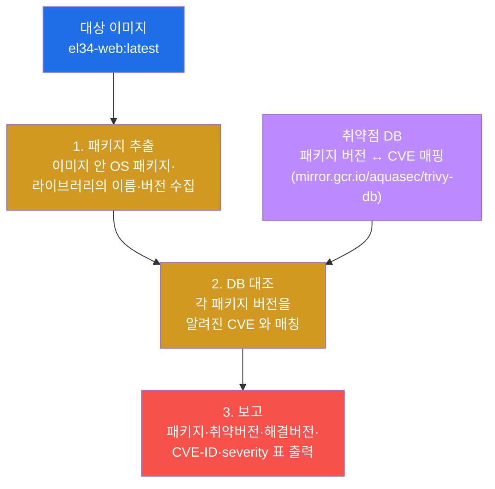
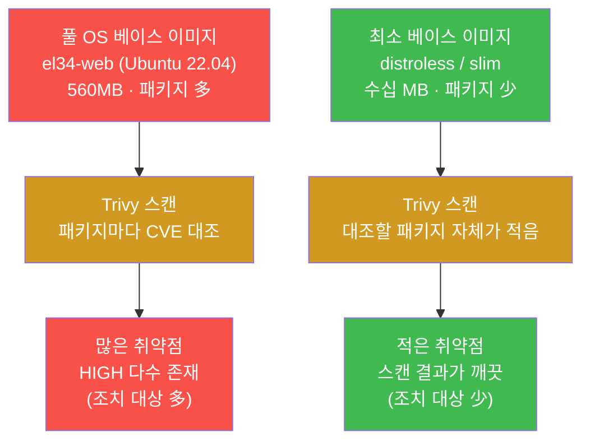
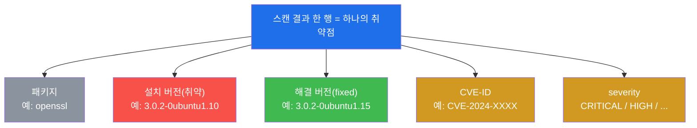
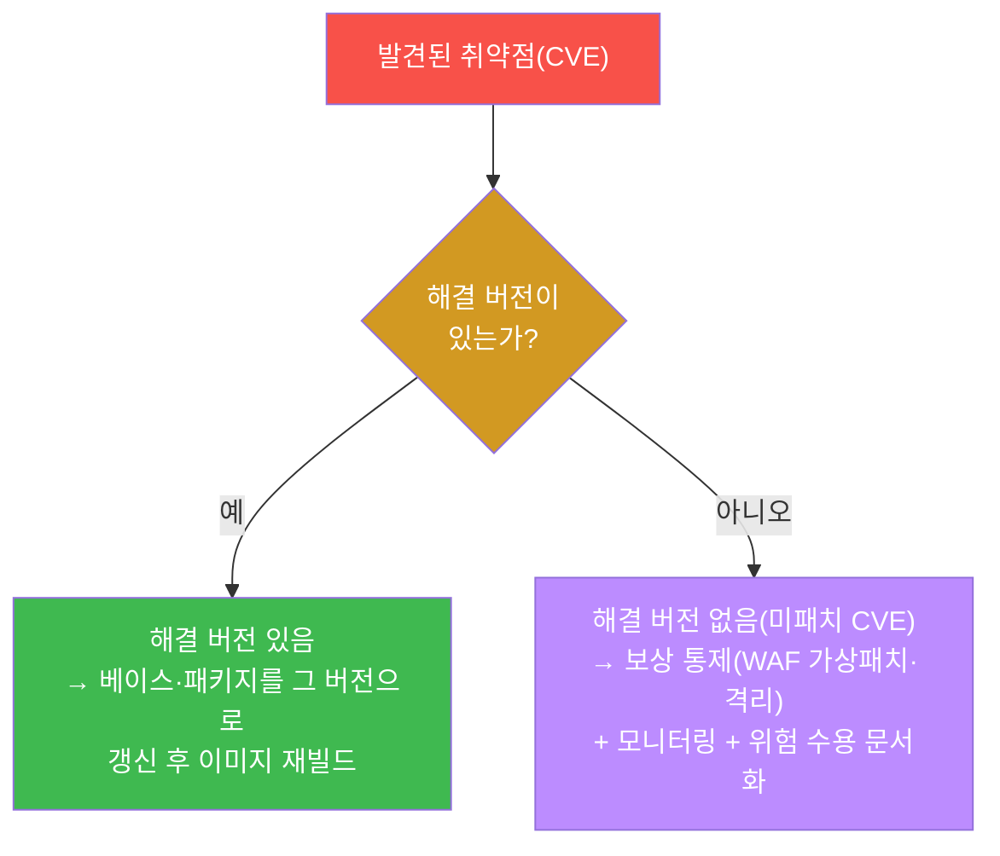
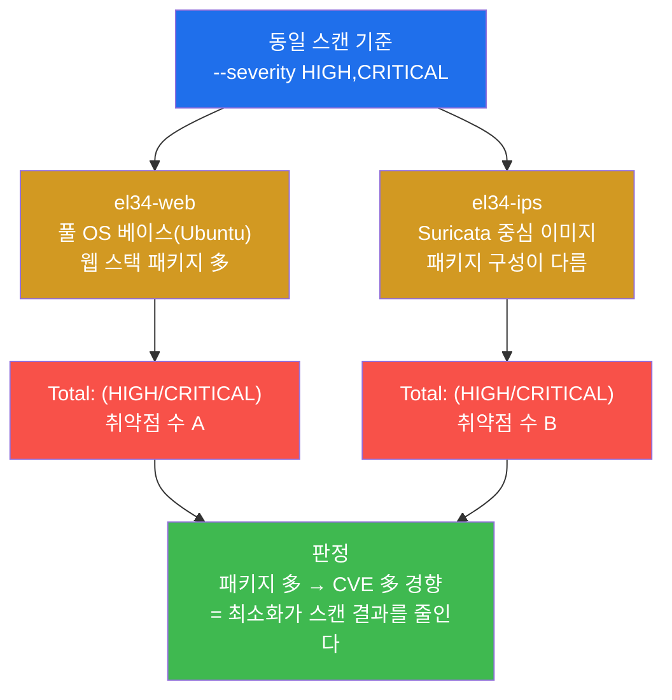
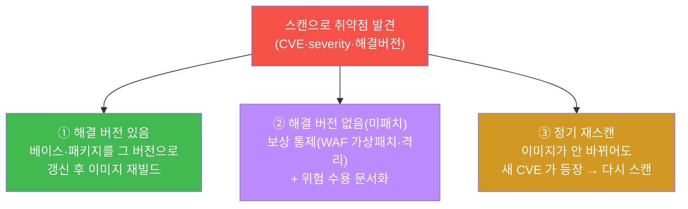
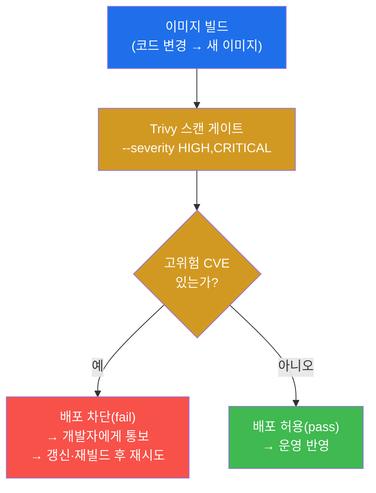
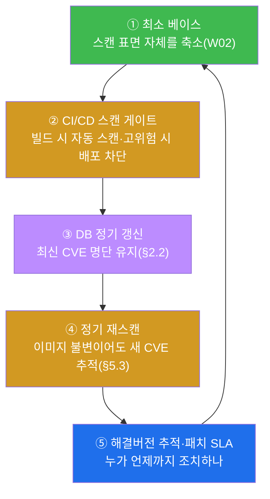
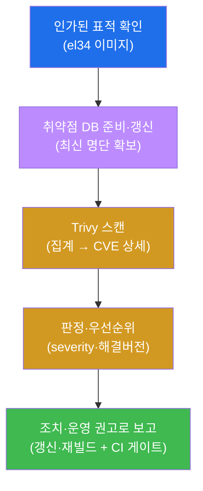
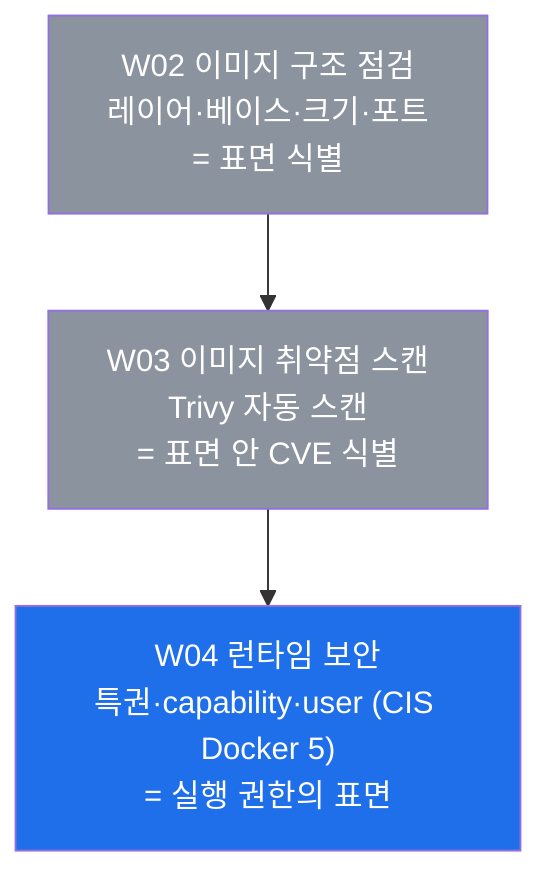

# 클라우드·컨테이너 W03 — 이미지 취약점 스캔 (Trivy 로 알려진 CVE 찾기)

> **본 주차의 한 줄 요약**
>
> W02 에서 학생은 이미지를 **구조(레이어·베이스·크기·노출 포트)** 의 눈으로 손수 점검하고 "이미지가 곧
> 공격 표면"임을 확인했다. 그때 "큰 이미지 = 많은 패키지 = 많은 CVE"라고 했지만, 그 **CVE 가 구체적으로
> 무엇이고 몇 개인지**는 아직 세지 않았다 — 패키지 수백 개의 알려진 취약점을 사람이 일일이 찾는 것은
> 불가능하기 때문이다. 본 주차는 그 작업을 **자동 스캐너 Trivy** 에 넘긴다. 학생은 el34 호스트에 설치된
> Trivy(0.71.2)로 실제 이미지(`el34-web` 등)를 스캔해, 어떤 패키지의 어떤 CVE 가 어느 **심각도
> (severity)** 로 들어 있는지, **해결 버전(fixed version)** 은 있는지를 증적으로 뽑아낸다. 마지막에
> 그 결과를 어떻게 **조치(갱신·재빌드)** 하고 어떻게 **운영(CI/CD 스캔 게이트)** 에 제도화하는지 정리한다.
>
> **점검자 한 줄 결론**: 이미지 취약점 관리는 "스캔을 한 번 돌리는 일"이 아니라 **"발견된 CVE 를
> 심각도로 분류하고, 해결 버전으로 다시 구워(재빌드) 표면을 닫고, 그 스캔을 파이프라인에 박아 배포 전
> 게이트로 만드는"** 순환이다. W02 의 손 점검(구조)과 W03 의 자동 스캔(취약점)은 같은 결론 — "이 이미지의
> 표면이 위험하다" — 을 두 방식으로 가리킨다.

---

## 학습 목표

본 주차 종료 시 학생은 다음 6가지를 **본인 손으로** 할 수 있어야 한다.

1. **이미지 취약점 스캔(SCA)** 이 무엇인지, 스캐너가 "패키지 목록 추출 → 취약점 DB 대조 → CVE 보고"의
   세 단계로 동작한다는 원리를 설명하고, el34 호스트에서 `trivy --version` 으로 Trivy 가 가용한지
   확인한다.
2. **취약점 DB(vulnerability database)** 가 무엇이며 왜 정기 갱신이 스캔 정확도를 좌우하는지 설명하고,
   `trivy image --download-db-only` 로 DB 를 준비한다.
3. `trivy image` 로 `el34-web` 이미지를 **HIGH/CRITICAL** severity 로 스캔해 취약점 집계(`Total:`)를
   읽어내고, el34-web 풀베이스 이미지에 실제로 HIGH 취약점이 존재함을 증적으로 보인다.
4. 개별 취약점의 구성요소(**패키지 · 취약 버전 · 해결 버전 · CVE-ID · severity**)를 해석하고, "해결
   버전이 있으면 패치 가능, 없으면 보상 통제"라는 판정을 내린다.
5. 베이스가 다른 이미지(`el34-web` 대 `el34-ips`)의 취약점 수를 비교해 **"큰 베이스 = 많은 CVE"** 라는
   W02 의 통찰을 스캔 결과로 입증하고, 최소화가 스캔 결과를 직접 줄인다는 것을 설명한다.
6. 발견된 취약점의 **조치(해결 버전으로 갱신 후 재빌드 / 미패치는 보상 통제)** 와 **스캔 운영(CI/CD 게이트
   · 최소 베이스 · 정기 재스캔 · DB 갱신)** 을 **이미지 취약점 보고서** 한 장으로 종합하고, "이미지는
   불변이므로 패치란 '고치기'가 아니라 '다시 굽기'"라는 결론을 제시한다.

---

## 강의 시간 배분 (총 3시간 40분)

| 시간        | 내용                                                                       | 유형      |
|-------------|----------------------------------------------------------------------------|-----------|
| 0:00–0:25   | 이론 — 왜 손 점검(W02) 다음에 자동 스캔인가 (수백 패키지 ↔ CVE 의 규모 문제) | 강의      |
| 0:25–0:55   | 이론 — Trivy 의 동작 원리 (패키지 추출 → DB 대조 → CVE 보고) + 취약점 DB     | 강의      |
| 0:55–1:05   | 휴식                                                                        | —         |
| 1:05–1:35   | 이론 — CVE·severity·해결 버전 읽는 법 + 조치/CI 게이트 (el34 실측)          | 강의/토론 |
| 1:35–2:00   | 실습 — Trivy 가용 확인 + 취약점 DB 준비 (미션 1–2)                          | 실습      |
| 2:00–2:30   | 실습 — 이미지 스캔(집계) + 취약점 상세(CVE) (미션 3–4)                      | 실습      |
| 2:30–2:40   | 휴식                                                                        | —         |
| 2:40–3:10   | 실습 — 이미지 비교(표면 차이) + 조치(패치/재빌드) (미션 5–6)                | 실습      |
| 3:10–3:30   | 실습 — 스캔 운영(CI/CD) + 이미지 취약점 보고서 (미션 7–8)                   | 실습      |
| 3:30–3:40   | 정리 + 채점 기준 안내 + 다음 주차(W04 — 런타임 보안 CIS Docker 5) 예고      | 정리      |

---

## 0. 용어 해설 (이미지 취약점 스캔 입문)

본 주차에 처음 등장하거나 특히 중요한 용어를 먼저 정리한다. 본문에서 다시 나올 때 막히면 이 표로
돌아오면 흐름이 끊기지 않는다.

| 용어 | 영문 | 뜻 | 비유 |
|------|------|----|------|
| **이미지 취약점 스캔** | Image vulnerability scanning | 이미지 안의 패키지·라이브러리에 알려진 취약점이 있는지 자동으로 검사하는 것 | 식자재 전수 유통기한·리콜 점검 |
| **Trivy** | — | 이미지·파일시스템의 취약점·비밀·오설정을 찾는 오픈소스 스캐너(Aqua Security) | 자동 안전 점검 기계 |
| **CVE** | Common Vulnerabilities and Exposures | 공개된 알려진 취약점에 붙는 전 세계 공통 식별번호(`CVE-연도-번호`) | 리콜 대상 부품의 일련번호 |
| **취약점 DB** | Vulnerability database | 어느 패키지의 어느 버전이 어느 CVE 에 취약한지 모은 데이터베이스 | 전국 리콜 부품 명단 |
| **severity** | Severity | 취약점의 심각도 등급(CRITICAL > HIGH > MEDIUM > LOW > UNKNOWN) | 위험물 등급 표시 |
| **해결 버전** | Fixed version | 그 CVE 가 고쳐진 패키지 버전(이 버전 이상으로 올리면 패치) | 리콜 후 교체 부품 번호 |
| **SCA** | Software Composition Analysis | 소프트웨어를 구성하는 부품(패키지·라이브러리)의 위험을 분석하는 것 | 완성품의 부품표 안전 검사 |
| **CI/CD 게이트** | CI/CD gate | 빌드/배포 자동화 단계에서 스캔을 돌려 위험하면 배포를 막는 관문 | 출하 전 품질 검사 통과선 |
| **패키지** | Package | OS·언어가 설치하는 소프트웨어 단위(예: `openssl`, `libc`) | 완성품에 들어간 부품 한 개 |
| **불변** | Immutable | 한번 만들어진 이미지는 바뀌지 않는 성질(고치려면 다시 빌드) | 이미 구워 나온 붕어빵 |

> **헷갈리기 쉬운 한 쌍 — 취약점(CVE) vs 익스플로잇(exploit).** 둘은 자주 섞이지만 다르다. **취약점(CVE)**
> 은 소프트웨어에 *존재하는 약점 그 자체*다(예: 특정 버전의 `openssl` 에 있는 결함). **익스플로잇** 은 그
> 약점을 *실제로 찔러 침해하는 공격 코드·기법*이다. Trivy 가 찾아 주는 것은 **CVE(약점이 있다는 사실)**
> 이지, 그 약점이 지금 이 환경에서 실제로 악용 가능한지(exploitability)까지 단정하지는 않는다. 그래서
> 스캔 결과는 "여기에 알려진 약점이 N 개 있으니 조치 대상이다"라는 **위험 신호**이지, "지금 당장 뚫린다"는
> 확정은 아니다. 그럼에도 알려진 약점을 방치하는 것은 가장 흔한 침해 원인이므로, 신호를 받으면 조치한다.
>
> **헷갈리기 쉬운 또 한 쌍 — 스캔 vs 점검(W02).** W02 의 손 점검은 사람이 `docker history`·`inspect`
> 로 **구조(레이어·베이스·크기·포트)** 를 읽어 "표면이 넓다/좁다"를 *정성적으로* 판단했다. 본 주차의
> **스캔** 은 도구(Trivy)가 패키지 하나하나를 DB 와 대조해 **"몇 개의, 어떤 CVE 가, 어느 severity 로"**
> 있는지 *정량적으로* 보고한다. 즉 W02 가 "표면이 어디까지인가(윤곽)"였다면, W03 은 "그 표면 안에 어떤
> 알려진 구멍이 몇 개 뚫려 있는가(내용물)"다. 둘은 경쟁이 아니라 보완 — 구조가 넓다고 본 이미지를 스캔하면
> 실제로 CVE 가 많이 나온다.

---

## 1. 이번 주의 통찰 — 사람이 못 세는 것을 스캐너가 센다

### 1.1 한 줄 답: 패키지 수백 개의 알려진 약점은 자동으로만 셀 수 있다

W02 의 결론은 "이미지가 곧 공격 표면"이었고, 그 표면을 키우는 주범이 **풀 OS 베이스가 깔고 들어오는
수백 개의 패키지**였다. 그런데 그 패키지들이 *실제로 어떤 취약점을 품고 있는지*는 W02 에서 손으로 세지
않았다. 이유는 단순하다. 우분투 풀베이스 하나에도 수백 개의 패키지가 들어 있고, 각 패키지마다 그동안
공개된 CVE 가 여럿 있을 수 있다. 사람이 "이 `openssl` 버전에 알려진 CVE 가 있나?"를 패키지마다 일일이
찾아보는 것은 현실적으로 불가능하다.

**이미지 취약점 스캔(image vulnerability scanning)** 은 바로 이 일을 자동화한다. 스캐너는 이미지 안에
설치된 모든 패키지의 **이름과 버전**을 추출한 뒤, 그것을 **취약점 DB**(어느 패키지의 어느 버전이 어느
CVE 에 취약한지 모은 명단)와 기계적으로 대조한다. 결과로 "이 패키지의 이 버전은 이 CVE 에 취약하고,
심각도는 HIGH 이며, 해결 버전은 이것이다"를 한 줄씩 보고한다. 사람은 그 보고를 보고 *판단과 조치*에
집중하면 된다.

> **용어 — SCA(Software Composition Analysis).** 요즘 소프트웨어는 직접 짠 코드보다 **남이 만든 부품
> (패키지·오픈소스 라이브러리)** 이 훨씬 많다. SCA 는 그 "부품 구성"을 분석해 위험을 찾는 활동 전체를
> 가리키는 용어다(완성품의 부품표를 펴 놓고 리콜 부품이 섞였는지 보는 것). 이미지 취약점 스캔은 SCA 를
> *컨테이너 이미지에 적용한 한 형태*다 — 이미지에 들어간 OS 패키지·언어 라이브러리를 부품으로 보고,
> 그중 알려진 취약점이 있는 부품을 골라낸다.

### 1.2 스캐너의 3단계 — 추출 · 대조 · 보고



이 세 단계가 스캐너의 전부다. 핵심은 **2단계의 대조가 DB 에 전적으로 의존**한다는 점이다 — DB 가
낡았으면 어제 공개된 CVE 를 놓친다. 그래서 §2.2 에서 DB 준비·갱신을 별도 단계로 다룬다. 또 하나, 스캐너는
"패키지 버전이 취약 목록에 있다"는 사실만 본다 — 그 약점이 *이 환경에서 실제로 악용되는지*는 판단하지
않는다(§0 의 CVE vs 익스플로잇 구분). 그래서 스캔 결과는 **조치 대상 후보 목록**이고, 사람이 severity 와
맥락으로 우선순위를 정해 조치한다.

### 1.3 왜 중요한가 — W02 의 "표면"이 W03 에서 숫자로 드러난다

W02 §1.3 에서 "큰 이미지 = 많은 패키지 = 많은 CVE"라고 했다. 본 주차는 그 마지막 항(많은 CVE)을 실제
숫자로 확인한다. 같은 논리를 스캔 관점에서 다시 그리면 다음과 같다.



이 그림이 본 주차의 통찰을 한눈에 보여 준다. **W02 에서 "표면을 줄여라(최소 베이스)"라고 한 권고가, W03
의 스캔에서 곧바로 "취약점 수가 줄어든다"는 결과로 돌아온다.** 즉 이미지 최소화는 추상적 권고가 아니라
스캔 숫자로 측정되는 구체적 효과를 낳는다 — 미션 5에서 실제로 두 이미지의 취약점 수를 비교해 이를 본인
눈으로 확인한다.

### 1.4 한계 — 스캔은 발견이지 조치가 아니다

자동 스캔에도 분명한 한계가 있다. 첫째, **스캔은 "약점이 있다"를 알려줄 뿐 고쳐 주지는 않는다.** 발견
다음에는 사람이 갱신·재빌드(§5)를 해야 표면이 실제로 닫힌다. 둘째, **DB 에 없는 취약점은 못 잡는다** —
아직 공개되지 않은 0-day, 또는 직접 짠 앱 코드의 로직 결함은 패키지 CVE 매칭으로는 보이지 않는다(앱
코드 결함은 web-vuln 트랙·SAST 의 영역이다). 셋째, **거짓 양성/음성**이 있을 수 있다 — 버전만으로
판정하다 보니 이미 백포트 패치가 적용된 패키지를 취약으로 표시하거나(거짓 양성), 비표준 경로로 설치된
부품을 놓칠 수 있다(거짓 음성). 그래서 스캔은 **자동 발견의 출발점**이고, 그 위에 사람의 판단(severity
분류·조치 우선순위)과 운영(CI 게이트·정기 재스캔)이 얹혀야 이미지 취약점 *관리*가 된다.

---

## 2. Trivy — 이미지 취약점 스캐너

### 2.1 Trivy 란 무엇인가

**한 줄 정의.** Trivy(트리비)는 컨테이너 이미지·파일시스템 등에서 **알려진 취약점(CVE)·비밀·오설정**을
찾아 주는 오픈소스 스캐너로, Aqua Security 가 만들었다(자동 안전 점검 기계에 해당). 본 주차에서는 그중
가장 기본인 **이미지의 취약점(CVE) 스캔** 기능을 쓴다.

Trivy 가 널리 쓰이는 이유는 세 가지다. 첫째, **설치·사용이 단순하다** — 바이너리 하나로 동작하고,
`trivy image <이미지이름>` 한 줄이면 스캔이 시작된다. 둘째, **빠르다** — 취약점 DB 를 로컬에 캐시해 두고
패키지 버전만 대조하므로 결과가 금방 나온다. 셋째, **CI/CD 통합이 쉽다** — 종료 코드와 출력 형식을 정해
빌드 파이프라인의 게이트(§6)로 박기 좋다.

> **용어 — Trivy 의 스캐너 종류.** Trivy 는 한 도구로 여러 종류를 스캔할 수 있다. **vuln**(패키지의
> 알려진 CVE), **secret**(이미지에 굽힌 비밀·키), **misconfig**(설정 파일의 오설정) 등이다. 본 주차는
> 이 중 **vuln(취약점) 스캔**에 집중하며, 실습 명령에서 `--scanners vuln` 으로 명시해 취약점만 본다.
> 비밀·오설정 스캔은 같은 도구의 확장이며, 운영에서는 함께 돌리기도 한다.

### 2.2 취약점 DB — 스캔 정확도의 심장

**한 줄 정의.** 취약점 DB(vulnerability database)는 **"어느 패키지의 어느 버전이 어느 CVE 에
취약한가"를 모아 둔 데이터베이스**다(전국 리콜 부품 명단에 해당). §1.2 의 2단계(대조)는 전적으로 이 DB
에 대고 이뤄진다.

DB 가 왜 결정적인지는 분명하다. 새 CVE 는 **매일** 공개된다. 어제까지 안전하던 패키지가 오늘 새 CVE 의
대상이 될 수 있다. DB 가 낡으면 그 새 CVE 를 스캐너가 모르므로, 같은 이미지를 스캔해도 어제와 오늘 결과가
다를 수 있다. 그래서 정확한 스캔의 전제는 **최신 DB** 다 — "스캐너의 정확도는 곧 DB 의 최신성"이라고
말한다.

> **용어 — Trivy DB 의 출처.** Trivy 는 취약점 DB 를 **컨테이너 레지스트리에서 OCI 아티팩트로** 내려받아
> 로컬 캐시(`~/.cache/trivy`)에 둔다. el34 에서 그 출처는 **`mirror.gcr.io/aquasec/trivy-db`** 다 —
> 구글이 운영하는 Docker Hub 미러를 통해 Aqua 의 `trivy-db` 를 받는다. 이렇게 미러를 쓰면 레이트
> 리밋·접속 문제를 줄일 수 있다. DB 는 한번 받아 두면 캐시에서 재사용되므로, 두 번째 스캔부터는
> 다운로드 없이 빠르게 돈다.

el34 호스트에서는 본격 스캔 전에 DB 만 미리 준비해 둘 수 있다.

```bash
/usr/local/bin/trivy image --download-db-only 2>&1 | tail -1; echo db_ready
```

이 명령은 스캔은 하지 않고 **DB 만 내려받아 캐시**한다(`--download-db-only`). 이미 최신 DB 가 캐시에
있으면 즉시 끝난다. 마지막의 `; echo db_ready` 는 명령이 끝났음을 표시하는 마커로, 출력에 `db_ready` 가
보이면 DB 준비가 완료된 것이다. 실무에서는 이처럼 DB 갱신을 **스캔과 분리**해 정기 작업으로 돌려, 스캔할
때마다 최신 명단을 쓰도록 한다.

### 2.3 el34 에서 어떻게 보나 — 호스트의 Trivy 0.71.2

본 주차의 모든 스캔은 **el34 호스트(`ssh ccc@192.168.0.151`, 비밀번호 1)에 설치된 Trivy** 로 한다.
W02 의 점검 명령이 `docker` CLI 였다면, 본 주차는 호스트의 `trivy` CLI 가 도구다. Trivy 는 호스트의
**`/usr/local/bin/trivy`** 에 설치되어 있고, 버전은 **0.71.2** 다. 가용성은 다음으로 확인한다.

```bash
/usr/local/bin/trivy --version 2>/dev/null | head -1
```

출력에 `Version:` 줄이 나오면 Trivy 가 설치·동작 중인 것이다. el34 호스트가 Trivy 로 이미지를 스캔할 수
있는 이유는, 호스트의 도커 데몬이 모든 컨테이너 이미지(`el34-web` 등)를 보유하고 있고, Trivy 가 그
도커가 가진 이미지를 직접 읽어 패키지를 추출하기 때문이다. 즉 컨테이너 안에 들어갈 필요 없이 **호스트에서
이미지 자체**를 스캔한다.

> **점검 경로 정리.** el34 의 모든 이미지·컨테이너는 타깃 VM(192.168.0.151) 한 대 위에 있다. 점검자는
> 호스트에 SSH 로 들어간 뒤, 호스트의 `trivy image <이미지이름>` 으로 그 호스트가 보유한 이미지를 직접
> 스캔한다. 신규 도구 설치는 없다 — Trivy 는 이미 호스트에 설치돼 있다.

### 2.4 한계 — Trivy 는 신호기이지 만능 진단기가 아니다

Trivy 도 §1.4 의 일반 한계를 그대로 안고 있다. **DB 에 등재된 CVE 만** 보고하므로 0-day·앱 로직 결함은
보이지 않고, **버전 매칭** 방식이라 백포트 패치가 적용된 패키지를 거짓 양성으로 표시할 수 있다. 또한
Trivy 의 vuln 스캔은 "알려진 약점이 있다"까지를 알려줄 뿐, 그 약점이 *이 컨테이너의 실제 실행 경로에서
도달 가능한가*(reachability)는 판정하지 않는다. 따라서 Trivy 결과는 **조치 후보 목록**으로 받고,
severity·맥락·해결 버전 유무로 우선순위를 정해 사람·운영이 처리한다. 본 주차는 vuln 스캔으로 "무엇이
취약한가"를 자동으로 뽑는 데까지를 다룬다.

---

## 3. CVE · severity · 해결 버전 — 스캔 결과 읽는 법

스캔 결과의 각 줄은 정해진 다섯 요소로 이뤄진다. 이 셋(CVE·severity·해결 버전)을 정확히 읽어야 "무엇을
먼저, 어떻게 조치할지"를 판단할 수 있다.



### 3.1 CVE — 알려진 취약점의 만국 공통 번호

**한 줄 정의.** CVE(Common Vulnerabilities and Exposures)는 공개된 알려진 취약점 하나하나에 붙는
**전 세계 공통 식별번호**로, `CVE-연도-번호`(예: `CVE-2024-3094`) 형식이다(리콜 부품의 일련번호에 해당).

CVE 번호가 중요한 이유는 **모두가 같은 약점을 같은 이름으로 부를 수 있게** 해 주기 때문이다. 스캐너 보고서,
보안 공지, 패치 노트, 위협 인텔리전스가 모두 같은 CVE 번호를 쓰므로, 학생은 스캔에 나온 `CVE-2024-XXXX`
하나로 그 약점의 상세 설명·영향 범위·패치 정보를 찾아 연결할 수 있다. 스캔에서 CVE 가 나왔다는 것은 "이
패키지 버전에, 전 세계가 아는 그 약점이 들어 있다"는 뜻이다.

### 3.2 severity — 무엇부터 조치할지의 기준

**한 줄 정의.** severity(심각도)는 취약점이 얼마나 위험한지의 등급으로, 보통 **CRITICAL > HIGH > MEDIUM >
LOW > UNKNOWN** 순이다(위험물 등급 표시에 해당). 수백 개 취약점을 다 동시에 고칠 수는 없으므로, severity
는 **조치 우선순위의 1차 기준**이 된다.

> **용어 — severity 등급은 어디서 오나.** 각 CVE 의 심각도는 보통 **CVSS(Common Vulnerability Scoring
> System)** 라는 표준 점수(0.0~10.0)에 근거해 매겨지며, 그 점수대가 CRITICAL/HIGH/... 등급으로 환산된다.
> Trivy 는 이 등급을 그대로 표시하고, `--severity HIGH,CRITICAL` 처럼 **특정 등급만 필터**할 수 있다.
> 운영에서는 보통 CRITICAL·HIGH 를 우선 조치 대상으로 삼고, MEDIUM 이하는 일정·맥락에 따라 처리한다 —
> "모든 취약점을 0으로"가 아니라 "위험한 것부터 합리적으로"가 현실적 원칙이다.

본 주차의 실습은 일관되게 **`--severity HIGH,CRITICAL`** 로 고위험만 필터해 본다. 이유는 두 가지다.
첫째, 학습 초점을 "조치가 시급한 것"에 맞추기 위함이고, 둘째, 결과가 간결해져 집계(`Total:`)와 개별
CVE 를 또렷이 읽을 수 있기 때문이다. el34-web 풀베이스 이미지는 이 필터로 스캔해도 **HIGH 취약점이
존재**한다 — 풀 OS 베이스가 깔고 들어온 패키지들의 알려진 CVE 다.

### 3.3 해결 버전(fixed version) — 패치가 가능한가의 갈림길

**한 줄 정의.** 해결 버전(fixed version)은 그 CVE 가 **고쳐진 패키지 버전**으로, 설치 버전을 이 버전
이상으로 올리면 해당 취약점이 제거된다(리콜 후 교체 부품 번호에 해당). 스캔 결과에서 **해결 버전의 유무가
조치 방향을 가른다.**



해결 버전이 **있으면** 길이 분명하다 — 그 버전으로 패키지·베이스를 올려 이미지를 다시 빌드하면 약점이
사라진다(§5.1). 해결 버전이 **없으면**(아직 패치가 나오지 않은 미패치 CVE), 올릴 버전이 없으므로 직접
제거가 불가능하다. 이때는 **보상 통제(compensating control)** — 예컨대 WAF 로 그 취약점 경로를 막는
가상 패치(virtual patch), 해당 컨테이너의 망 격리, 모니터링 강화 — 로 위험을 낮추고, "왜 지금 못
고치는가 / 어떻게 위험을 통제하는가"를 문서화해 **위험 수용(risk acceptance)** 으로 관리한다.

### 3.4 한계 — 숫자만으로 우선순위를 정하지 않는다

severity 만으로 기계적으로 줄 세우는 것은 위험하다. CRITICAL 이라도 그 패키지가 이 컨테이너에서 실제로
실행되지 않는 경로에 있다면 실질 위험은 낮을 수 있고, 반대로 HIGH 라도 인터넷에 노출된 핵심 컴포넌트라면
더 급할 수 있다(§1.4 의 reachability·맥락). 그래서 성숙한 운영은 severity 를 **출발점**으로 삼되, 노출
면·자산 중요도·해결 버전 유무·악용 사례(KEV 등재 여부 등)를 함께 고려해 우선순위를 정한다. 본 주차는
severity·해결 버전을 정확히 읽는 기본기까지를 다루고, 정교한 우선순위 정책은 운영 정책의 영역이다.

---

## 4. 이미지 비교 — 스캔으로 측정하는 "표면 차이"

### 4.1 같은 스캔을 여러 이미지에 — 표면이 숫자로 보인다

W02 §1.3 의 통찰("큰 베이스 = 많은 CVE")은 말로만 들으면 추상적이다. 본 주차는 그것을 **실측**한다.
방법은 단순하다 — **같은 스캔(같은 severity 필터)을 베이스가 다른 두 이미지에 돌려 취약점 수를 나란히
비교**한다. 패키지가 많은 이미지일수록 대조 대상이 많아 CVE 도 많이 나오는 경향이 그대로 숫자로 드러난다.



미션 5에서 학생은 `el34-web` 과 `el34-ips` 두 이미지에 같은 스캔을 돌려 각각의 `Total:` 을 나란히 본다.
중요한 것은 *어느 쪽 숫자가 크냐*의 단순 비교가 아니라, **이미지의 패키지 구성(표면)이 스캔 결과(CVE 수)에
직접 반영된다**는 원리를 본인 눈으로 확인하는 것이다. 이것이 W02 의 "최소 베이스를 쓰라"는 권고가 W03 의
스캔 숫자로 회수되는 지점이다.

### 4.2 왜 중요한가 — 최소화의 효과를 측정 가능하게 만든다

이미지 비교가 운영에서 가치 있는 이유는, 추상적 권고("작게 만들어라")를 **측정 가능한 지표(취약점 수)** 로
바꿔 주기 때문이다. 예컨대 같은 앱을 풀베이스와 슬림/distroless 두 버전으로 빌드해 각각 스캔하면, 베이스
교체가 취약점 수를 몇 개에서 몇 개로 줄였는지 숫자로 보고할 수 있다. 이는 보안 개선을 "느낌"이 아니라
"수치"로 입증하는 근거가 되고, 의사결정(베이스 전환에 들일 노력 대비 효과)을 정량적으로 돕는다.

### 4.3 한계 — 단순 개수 비교의 함정

취약점 **개수**만으로 두 이미지의 안전을 단정하는 것은 조심해야 한다. 개수가 적어도 그중 하나가 노출된
경로의 CRITICAL 이면 더 위험할 수 있고, 개수가 많아도 모두 미사용·미도달 패키지의 LOW 라면 실질 위험은
낮을 수 있다. 또 베이스가 다르면 같은 약점도 다른 패키지명·버전으로 표시돼 단순 대조가 어긋날 수 있다.
따라서 비교는 "표면이 결과에 비례한다"는 **경향**을 보이는 학습 도구로 쓰고, 실제 안전 판정은 severity·맥락
까지 함께 본다(§3.4). 본 주차의 비교는 이 경향을 증적으로 체득하는 데 초점을 둔다.

---

## 5. 조치 — 발견한 취약점을 어떻게 닫는가

스캔으로 취약점을 찾았으면 다음은 조치다. 핵심 원칙은 한 문장 — **"이미지는 불변이므로, 패치란 '고치기'가
아니라 '다시 굽기(재빌드)'다."** 이를 세 갈래로 나눠 설명한다.



### 5.1 해결 버전이 있으면 — 갱신 후 재빌드

가장 깨끗한 조치다. 취약한 패키지에 **해결 버전이 있으면**, 베이스 이미지나 그 패키지를 해결 버전 이상으로
올리고 **이미지를 다시 빌드**한다. 여기서 학생이 꼭 잡아야 할 개념이 **이미지의 불변성**이다.

> **용어 — 이미지는 불변(immutable)이다.** 이미 만들어진(빌드된) 이미지는 그 자리에서 패키지만
> 살짝 고쳐 끼울 수 없다 — 이미지는 "이미 구워 나온 붕어빵"과 같아서, 반죽(패키지)을 바꾸려면 *다시
> 구워야* 한다. 그래서 컨테이너 세계의 "패치"는 실행 중인 컨테이너 안에서 `apt upgrade` 를 치는 것이
> 아니라(그렇게 해도 이미지 원본은 그대로다), **Dockerfile 의 베이스/패키지 버전을 올려 이미지를 새로
> 빌드하고, 그 새 이미지로 컨테이너를 다시 띄우는** 것이다. 이 "다시 굽기" 사고가 W02 의 빌드 타임 통찰과
> 직결된다 — 표면은 빌드 타임에 결정되므로, 표면을 바꾸려면 빌드부터 다시 한다.

베이스 이미지를 최신으로 올리는 것이 특히 효과적이다. 베이스 한 줄(`FROM`)을 갱신하면 그 베이스가 패치한
수많은 패키지 CVE 가 한꺼번에 사라지기 때문이다(W02 §6.1 의 "정기 재빌드"가 바로 이것). 그래서 정기적인
베이스 갱신·재빌드는 이미지 취약점 관리의 가장 기본적인 위생 동작이다.

### 5.2 해결 버전이 없으면 — 보상 통제와 위험 수용

아직 패치가 나오지 않은 **미패치 CVE** 는 올릴 버전이 없으므로 직접 제거가 불가능하다. 이때는 위험을
*우회·완화*하는 **보상 통제(compensating control)** 를 적용한다. 예를 들어 그 취약점이 특정 HTTP 경로로
악용된다면 **WAF 로 그 경로·패턴을 막는 가상 패치(virtual patch)** 를 걸고(el34 의 ModSecurity 가 이
역할을 할 수 있다), 위험 컨테이너를 망에서 **격리**하며, 그 지점의 **모니터링을 강화**한다. 그리고 "왜
지금 못 고치는지, 어떤 통제로 위험을 낮췄는지, 패치가 나오면 언제 적용할지"를 문서화해 **위험 수용(risk
acceptance)** 으로 관리한다 — 방치가 아니라 *의식적으로 통제 하에 둔 위험*으로 다룬다.

### 5.3 그리고 항상 — 정기 재스캔

마지막으로, 조치는 한 번으로 끝나지 않는다. **이미지가 전혀 바뀌지 않아도, 시간이 지나면 그 안의 패키지에
새 CVE 가 공개될 수 있다.** 어제 깨끗했던 이미지가 오늘 새 CVE 의 대상이 되는 것이다. 그래서 조치 체계의
필수 요소가 **정기 재스캔** 이다 — DB 를 갱신(§2.2)하고 같은 이미지를 다시 스캔해 새로 뜬 취약점을
추적한다. 이 "이미지는 그대로인데 위험은 변한다"는 성질이 다음 절(스캔 운영)의 직접적 근거다.

### 5.4 한계 — 조치에는 사람·일정·합의가 필요하다

기술적 조치 방법(재빌드·보상 통제·재스캔)을 안다고 조치가 자동으로 되는 것은 아니다. "누가, 언제까지,
어느 severity 부터 고치는가"라는 **패치 SLA** 와 책임자가 정해져야 실제로 굴러간다. 또 재빌드는
회귀(regression) 위험이 있어 테스트가 따라야 하고, 보상 통제는 임시방편이므로 패치가 나오면 본조치로
대체해야 한다. 즉 조치는 도구의 문제이자 **프로세스·합의의 문제**다. 본 주차는 조치의 "무엇을·왜·어떻게"를
정리하고, 그것을 자동·정기로 굴리는 운영을 다음 절에서 다룬다.

---

## 6. 스캔 운영 — 일회성이 아니라 파이프라인의 게이트로

### 6.1 CI/CD 게이트 — 배포 전에 자동으로 막는다

이미지 스캔의 진짜 가치는 **사람이 가끔 손으로 돌리는 일회성**이 아니라, **빌드/배포 자동화에 박혀
배포할 때마다 자동으로 도는 게이트**일 때 나온다.

> **용어 — CI/CD 와 게이트.** **CI/CD** 는 코드 변경을 자동으로 빌드·테스트·배포하는 파이프라인을
> 가리킨다(CI=지속적 통합, CD=지속적 배포). **게이트(gate)** 는 그 파이프라인 중간에 둔 "통과 검사선"이다
> — 출하 전 품질 검사를 통과해야 다음 단계로 넘어가는 것과 같다. **이미지 스캔 게이트** 는 이미지를 빌드한
> 직후 Trivy 로 스캔해, **CRITICAL/HIGH 가 나오면 배포를 자동으로 막는(fail)** 관문이다. 취약한 이미지가
> 운영에 배포되는 것을 사람의 기억이 아니라 자동화로 차단한다.



이 게이트가 있으면, 취약한 이미지를 배포하려는 시도가 **사람의 깜빡임과 무관하게** 자동으로 멈춘다.
개발자는 빌드 단계에서 즉시 피드백을 받아 갱신·재빌드 후 다시 올린다 — 취약점을 운영까지 흘려보내지 않고
빌드 단계에서 잡는, W02 의 "빌드 타임에 막는다"가 자동화로 구현된 모습이다.

### 6.2 스캔 운영의 한 바퀴

게이트 하나만으로는 부족하다. 이미지 스캔은 W02 의 "이미지 위생"과 맞물린 **순환**으로 운영된다.



각 단계가 막는 것을 풀어 보면 이렇다. **최소 베이스(①)** 는 스캔할 패키지 자체를 줄여 취약점이 나올
여지를 원천적으로 좁힌다(W02 의 결과를 스캔 입력으로 가져온 것). **CI/CD 게이트(②)** 는 취약한 이미지의
배포를 자동 차단한다. **DB 갱신(③)** 은 스캔이 늘 최신 CVE 를 보게 한다. **정기 재스캔(④)** 은 이미
배포된 이미지에 새로 뜬 CVE 를 잡는다. **해결 버전 추적·패치 SLA(⑤)** 는 발견을 실제 조치로 잇는
사람·일정의 약속이다. 이 다섯이 한 바퀴를 돌 때, 이미지 취약점은 *한 번 스캔하고 끝*이 아니라
*지속적으로 관리되는* 상태가 된다.

### 6.3 한계 — 게이트는 너무 빡빡하지도, 너무 느슨하지도 않아야

게이트 운영에도 균형이 필요하다. 임계를 너무 빡빡하게(예: 모든 LOW 까지 배포 차단) 잡으면 거짓 양성·미패치
CVE 때문에 배포가 자주 막혀 개발이 멈추고, 그러면 팀이 게이트를 끄거나 우회하게 된다 — 결국 보안이
약해진다. 반대로 너무 느슨하면 게이트가 무의미해진다. 그래서 보통 **CRITICAL·HIGH 는 차단, 그 이하는
경고·기록**처럼 합리적 임계를 두고, 미패치 CVE 는 예외 처리(위험 수용 문서)와 함께 통과시키는 식으로
운영한다. 핵심은 "게이트가 실제로 켜진 채 유지되도록" 현실적인 정책을 잡는 것이다.

---

## 7. 스캔 명령 빠른 복습 — "무엇을 어디서 보나"

본 주차의 스캔은 모두 el34 호스트(`ssh ccc@192.168.0.151`, 비밀번호 1)에서 **`/usr/local/bin/trivy`**
로 수행하며, 신규 도구 설치는 없다(Trivy 0.71.2 가 이미 설치돼 있다). 각 명령이 무엇을 보여 주는지
한눈에 정리한다.

> **공통 옵션 풀이.** 본 주차 스캔 명령에 반복해서 쓰는 옵션은 셋이다. **`--scanners vuln`** — 취약점만
> 스캔(비밀·오설정 제외). **`--severity HIGH,CRITICAL`** — 고위험 등급만 필터. **`--no-progress`** —
> 진행 막대를 숨겨 출력을 깔끔하게. 결과의 **`Total:`** 줄이 취약점 집계이고, **`CVE-`** 로 시작하는
> 줄들이 개별 취약점이다.

### 7.1 Trivy 가용 확인 (§2.3)

```bash
/usr/local/bin/trivy --version 2>/dev/null | head -1
```

무엇을 보나 — `Version:` 줄. Trivy(0.71.2)가 호스트에 설치·동작 중인지 확인한다.

### 7.2 취약점 DB 준비 (§2.2)

```bash
/usr/local/bin/trivy image --download-db-only 2>&1 | tail -1; echo db_ready
```

무엇을 보나 — DB 다운로드/캐시 완료. `db_ready` 가 나오면 최신 명단으로 스캔할 준비가 된 것이다.

### 7.3 이미지 스캔 — 집계 (§3.2)

```bash
/usr/local/bin/trivy image --scanners vuln --severity HIGH,CRITICAL --no-progress el34-web:latest 2>/dev/null | grep -iE 'Total:'
```

무엇을 보나 — `Total: N (HIGH: .., CRITICAL: ..)` 집계. el34-web 풀베이스에 고위험 CVE 가 몇 개 있는지.

### 7.4 취약점 상세 — CVE (§3.1, §3.3)

```bash
/usr/local/bin/trivy image --scanners vuln --severity HIGH,CRITICAL --no-progress el34-web:latest 2>/dev/null | grep -iE 'CVE-' | head -3
```

무엇을 보나 — 개별 취약점 줄(패키지·취약 버전·해결 버전·CVE-ID·severity). 해결 버전이 패치 목표다.

### 7.5 이미지 비교 (§4.1)

```bash
for img in el34-web el34-ips; do echo -n "$img "; /usr/local/bin/trivy image --scanners vuln --severity HIGH,CRITICAL --no-progress "$img:latest" 2>/dev/null | grep -iE 'Total:'; done
```

무엇을 보나 — 두 이미지의 `Total:` 을 나란히. 패키지 수(표면)가 CVE 수에 비례하는 경향을 본다.

### 7.6 조치·운영 (§5–6)

이 둘은 명령 점검이 아니라 **판단·운영 원칙**이다. 해결 버전 유무에 따른 갱신·재빌드 / 보상 통제(조치)와
CI/CD 게이트 · 최소 베이스 · DB 갱신 · 정기 재스캔(운영)을 보고서에 정리한다.

---

## 8. 실습 안내 — lab 8 미션 (4 축 설명)

본 주차 실습은 8 미션으로 구성된다. 각 미션을 **4 축**으로 설명한다 — 왜 하는가 / 무엇을 알 수 있는가 /
결과 해석(정상 vs 비정상) / 실전 활용. 미션은 가용 확인 → DB 준비 → 스캔(집계) → 취약점 상세 → 이미지
비교 → 조치 → 스캔 운영 → 종합 보고 순서로 흐르며, lab 의 `order` 와 1:1 로 대응한다.

> **실습 진행 원칙.** 모든 명령은 el34 호스트(`ssh ccc@192.168.0.151`, 비밀번호 1)에서
> **`/usr/local/bin/trivy`** 로 수행한다. 신규 도구 설치는 없으며(Trivy 0.71.2 가 이미 설치됨), 각
> 미션은 **인가된 표적(el34 이미지)** 만 스캔한다. 합격 임계값은 0.7 이다.

### 미션 1 — Trivy 가용 확인 (10점)

> **왜 하는가?** 모든 스캔의 전제는 스캐너가 동작한다는 것이다. 점검자는 본격 스캔 전 항상 도구가
> 설치·실행 가능한 상태인지부터 확인한다(§2.3).
>
> **무엇을 알 수 있는가?** `trivy --version` 으로 el34 호스트의 Trivy 가 가용한지 — 이미지 취약점
> 스캔의 도구가 살아 있는지. el34 호스트의 Trivy 는 `/usr/local/bin/trivy`, 버전 0.71.2 다.
>
> **결과 해석.** 정상: 출력에 `Version:` 이 나옴(Trivy 가용). 비정상: 응답이 없으면 설치 경로
> `/usr/local/bin/trivy` 와 호스트 SSH 부터 점검한다.
>
> **실전 활용.** 스캔 착수 시 첫 확인. CI 파이프라인에서도 스캐너 버전 고정·가용성 점검이 첫 단계다.

### 미션 2 — 취약점 DB 준비 (10점)

> **왜 하는가?** 스캐너의 정확도는 DB 의 최신성에 달려 있다(§2.2). 새 CVE 가 매일 추가되므로, 정확한
> 스캔의 전제로 DB 를 먼저 준비·갱신한다.
>
> **무엇을 알 수 있는가?** `--download-db-only` 로 취약점 DB 가 로컬 캐시(`~/.cache/trivy`)에 준비됐는지.
> el34 의 DB 출처는 `mirror.gcr.io/aquasec/trivy-db` 다.
>
> **결과 해석.** 정상: 출력에 `db_ready` 가 나옴(DB 준비 완료, 이미 최신이면 즉시 끝남). 비정상:
> 다운로드가 실패하면 네트워크·미러 접근을 확인한다.
>
> **실전 활용.** 실무에서는 DB 갱신을 스캔과 분리해 정기 작업으로 돌려, 스캔이 늘 최신 CVE 명단을 쓰도록
> 한다(§6.2 의 ③).

### 미션 3 — 이미지 스캔: 집계 HIGH/CRITICAL (16점)

> **왜 하는가?** 스캔의 1차 산출물은 "고위험 취약점이 몇 개인가"라는 집계다(§3.2). 이 숫자가 이미지의
> 위험 규모를 한눈에 보여 준다.
>
> **무엇을 알 수 있는가?** `trivy image --scanners vuln --severity HIGH,CRITICAL` 로 el34-web 의
> `Total: N (HIGH/CRITICAL)` 집계. el34-web 풀베이스에는 실제로 HIGH 취약점이 존재한다 — W02 에서
> "표면이 넓다"고 본 그 이미지의 CVE 가 숫자로 드러난다.
>
> **결과 해석.** 정상: 출력에 `Total:` 집계가 나옴(스캔 성공). 비정상: 빈 출력이면 이미지 이름
> (`el34-web:latest`)·DB 준비(미션 2)를 재확인한다.
>
> **실전 활용.** 이미지 위험 평가의 출발점. 다수 이미지를 운영할 때 `Total:` 로 위험 규모를 빠르게 가늠해
> 조치 우선순위를 잡는다.

### 미션 4 — 취약점 상세: CVE/패키지 (14점)

> **왜 하는가?** 집계(몇 개)를 넘어 개별 취약점(어느 패키지의 어느 CVE)을 봐야 조치가 가능하다(§3.1, §3.3).
> 조치는 집계가 아니라 개별 CVE·해결 버전에 한다.
>
> **무엇을 알 수 있는가?** 스캔 결과의 각 행 — 패키지 · 취약 버전 · 해결 버전 · CVE-ID · severity. 특히
> **해결 버전(fixed version)** 의 유무가 조치 방향(패치 가능/보상 통제)을 가른다.
>
> **결과 해석.** 정상: CVE ID(또는 `cve_listed` 마커)가 나옴(상세 확인 성공). 비정상: CVE 가 안 보이면
> severity 필터·이미지 이름을 재확인한다.
>
> **실전 활용.** 조치 계획의 기본 자료. 각 CVE 의 해결 버전을 보고 "어디까지 올리면 닫히는가"를 정하고,
> 해결 버전이 없는 미패치 CVE 는 보상 통제 대상으로 분류한다.

### 미션 5 — 다른 이미지와 비교: 표면 차이 (12점)

> **왜 하는가?** W02 의 "큰 베이스 = 많은 CVE"를 스캔으로 실증하기 위함이다(§4.1). 같은 스캔을 다른
> 이미지에 돌려 표면이 결과에 반영됨을 본인 눈으로 본다.
>
> **무엇을 알 수 있는가?** `el34-web` 과 `el34-ips` 두 이미지의 `Total:` 비교. 패키지 구성(표면)이
> 취약점 수에 비례하는 경향 — 최소화(W02)가 스캔 결과를 직접 줄인다는 입증.
>
> **결과 해석.** 정상: 두 이미지의 Total 이 비교 출력되고 `compared` 가 나옴(비교 성공). 비정상: 한쪽
> Total 이 비면 그 이미지 이름·존재를 재확인한다.
>
> **실전 활용.** 베이스 전환의 효과를 정량으로 보고할 때의 방법. "풀베이스 N개 → 슬림 M개"처럼 개선을
> 숫자로 입증한다. 단, 단순 개수만으로 안전을 단정하지 않는다(§4.3).

### 미션 6 — 조치: 패치/갱신 (12점)

> **왜 하는가?** 스캔은 발견이고, 표면을 실제로 닫는 것은 조치다(§5). "이미지는 불변 → 패치란 다시
> 굽기"라는 핵심 원칙을 정리한다.
>
> **무엇을 알 수 있는가?** 조치 세 갈래 — ① 해결 버전 있음: 베이스·패키지 갱신 후 **재빌드** ② 해결
> 버전 없음: 보상 통제(WAF 가상패치·격리)+위험 수용 ③ 정기 재스캔(이미지가 안 바뀌어도 새 CVE 등장).
>
> **결과 해석.** 정상: 출력에 `재빌드` 등 조치 방법이 정리됨(정리 성공). 비정상: "재빌드" 개념이 빠지면
> §5.1 의 이미지 불변성을 다시 본다.
>
> **실전 활용.** 취약점 발견 후 표준 조치 흐름. 해결 버전 유무로 갈래를 정하고, 미패치는 보상 통제로
> 관리하며, 정기 재스캔으로 추적한다.

### 미션 7 — 방어: 스캔 운영 (12점)

> **왜 하는가?** 스캔은 일회성이 아니라 파이프라인에 박힌 게이트일 때 가치가 난다(§6). 발견·조치를 자동·정기로
> 굴리는 운영을 정리한다.
>
> **무엇을 알 수 있는가?** 스캔 운영의 한 바퀴 — **CI/CD 통합**(빌드 시 스캔, CRITICAL/HIGH 면 배포 차단)
> · 최소 베이스(표면 축소) · 정기 재스캔 · DB 갱신 · 해결 버전 추적·패치 SLA.
>
> **결과 해석.** 정상: 출력에 `CI/CD` 등 운영 통제가 정리됨(정리 성공). 비정상: 게이트·정기성 개념이
> 빠지면 §6 의 다이어그램으로 돌아간다.
>
> **실전 활용.** 컨테이너 운영의 표준 절차. 스캔을 빌드 파이프라인에 박아 "배포 전 게이트"로 만들고,
> 임계는 현실적으로(고위험 차단, 그 이하 경고) 잡는다(§6.3).

### 미션 8 — 이미지 취약점 보고서 (14점)

> **왜 하는가?** 점검의 산출물은 보고서다. 미션 1–7 의 결과(스캔·상세·비교·조치·운영)를 한 문서로
> 종합해야 점검이 완성된다.
>
> **무엇을 알 수 있는가?** 스캔 결과(el34-web Total/HIGH) · CVE 상세/이미지 비교 · 조치(갱신·재빌드) ·
> 스캔 운영(CI/CD)을 묶어, "이미지 취약점은 Trivy 로 자동 발견하고 최소 베이스+갱신+CI 통합으로 관리한다"를
> 증적과 함께 제시하는 법.
>
> **결과 해석.** 정상: 보고서에 스캔(`Trivy`)·조치·운영이 모두 포함됨(종합 성공). 비정상: 조치·운영이
> 빠지고 스캔 결과만 있으면 "발견 다음의 닫기"를 다시 연결한다.
>
> **실전 활용.** 이미지 취약점 보고서의 표준 구조(스캔 → 상세/비교 → 조치 → 운영 → 결론). 운영팀·심사에
> 제출하는 산출물이며, 다음 점검(W04 런타임 보안)의 토대가 된다.

---

## 9. 점검 수칙 — 인가된 스캔과 증적 중심

이미지 취약점 스캔도 **허가받은 표적에 대해서만** 한다. 다음 수칙을 지킨다.

- **인가된 표적만 스캔한다.** el34 의 정해진 이미지(`el34-web`·`el34-ips` 등)에 대해서만 `trivy image`
  를 돌리며, 같은 명령을 그 밖의 시스템·레지스트리·외부 이미지에 함부로 던지지 않는다.
- **스캔만, 변경은 하지 않는다.** 본 주차의 명령(`trivy --version`·`--download-db-only`·`trivy image`)은
  모두 **읽기 전용 조회**다. 이미지를 새로 빌드하거나 컨테이너를 바꾸지 않는다(갱신·재빌드는 조치 *계획*
  으로 보고서에 정리할 뿐, 본 실습에서 실제 빌드는 하지 않는다).
- **증적 우선.** "취약하다"가 아니라 **무엇이(CVE-ID·severity) 왜 위험하고 어떻게 닫는가(해결 버전) +
  스캔 출력**의 삼박자로 보인다. 근거 없는 인상은 점검이 아니다.
- **재현 가능하게 기록한다.** 모든 판정은 같은 `trivy` 명령(같은 severity 필터·같은 이미지 태그)으로
  다른 점검자가 재현할 수 있어야 한다. DB 버전이 다르면 결과가 달라질 수 있으므로 스캔 시점·DB 갱신
  여부도 함께 기록한다.



---

## 10. 다음 주차 (W04) 예고 — 런타임 보안 (특권·Capability·User · CIS Docker 5)

본 주차까지 학생은 컨테이너 보안 4계층(**이미지 → 런타임 → 레지스트리 → 오케스트레이션**) 중 **첫 계층인
이미지**를 두 방식으로 끝냈다 — W02 의 구조 점검(표면 식별)과 W03 의 취약점 스캔(표면 안 CVE 식별). 이미지
계층의 질문은 "이 *이미지(설계도)* 가 무엇을 품고 있는가"였다.

W04 부터는 **두 번째 계층, 런타임(runtime)** 으로 내려간다. 같은 이미지라도 **어떻게 실행하느냐**에 따라
위험이 크게 달라지기 때문이다. 예컨대 컨테이너를 **특권 모드(privileged)** 로 띄우거나, 불필요한 **커널
권한(capability)** 을 준 채 돌리거나, **root 사용자**로 실행하면, 이미지가 아무리 깨끗해도 침해 시
피해가 커진다. W04 는 `docker inspect` 로 실행 중인 컨테이너의 **특권 여부 · capability(추가/제거) ·
실행 사용자(User)** 를 점검해 **CIS Docker Benchmark 5번 영역(컨테이너 런타임)** 의 갭을 찾는다 —
el34-web 의 경우 특권은 꺼져 있어(Priv=false) 양호하지만, 불필요한 capability 가 붙어 있거나 root 로
실행되는 갭이 점검 대상이 된다. W03 이 "이미지 안에 어떤 약점이 있는가(빌드 타임의 표면)"였다면, W04 는
"그 이미지를 어떤 권한으로 돌리는가(런타임의 표면)"를 본다.


