# 클라우드·컨테이너 W04 — 런타임 보안 (특권·Capability·User)

> **본 주차의 한 줄 요약**
>
> 같은 이미지라도 **어떤 옵션으로 실행하느냐**에 따라 위험이 하늘과 땅 차이다. W01 에서 학생은
> 컨테이너 보안 4계층(이미지 → 런타임 → 레지스트리 → 오케스트레이션)을 배우고 그중 **런타임 계층**을
> 살짝 맛봤다(특권 여부·root 실행). W02·W03 이 첫 번째 계층인 **이미지**(공격 표면·CVE 스캔)를 깊이
> 팠다면, 본 주차는 두 번째 계층인 **런타임(runtime)** 으로 정식 입문한다. 런타임 보안이란 "이미지를
> 어떻게 실행하는가"의 설정 — **특권(privileged) · capability(권한 조각) · 실행 사용자(user) · 읽기전용
> 루트FS · no-new-privileges** — 을 점검해, 침해가 일어났을 때 그 피해가 컨테이너 밖(호스트)으로 번지는
> **폭발 반경(blast radius)** 을 가늠하고 줄이는 일이다. 학생은 el34 의 실제 컨테이너(`el34-web`)를
> 대상으로 `docker inspect` 로 런타임 설정을 한 줄씩 읽어, **특권은 꺼져 있어 양호하지만(CIS Docker
> 5.4 준수), capability 를 하나도 떨어뜨리지 않았고(CIS 5.3 갭) root 로 실행된다(CIS 4.1 갭)** 는
> 사실을 본인 손으로 증적과 함께 판정한다.
>
> **점검자 한 줄 결론**: 런타임 보안은 "컨테이너가 도는가"가 아니라 **"이 컨테이너가 침해됐을 때
> 격리를 깨고 호스트까지 번질 수 있는 권한을 얼마나 쥐고 있는가"** 를 점검하는 일이다. 최소권한
> (least privilege)이 곧 작은 폭발 반경이다.

---

## 학습 목표

본 주차 종료 시 학생은 다음 6가지를 **본인 손으로** 할 수 있어야 한다.

1. **런타임 보안**이 이미지 보안과 어떻게 다른지(이미지 = 무엇을 담는가 / 런타임 = 어떻게 실행하는가)
   설명하고, 같은 이미지도 실행 옵션에 따라 위험이 달라지는 이유를 근거와 함께 말한다.
2. **특권 컨테이너(`--privileged`)** 가 왜 격리를 사실상 무력화하는지 설명하고, `docker inspect` 로
   `HostConfig.Privileged` 를 읽어 el34-web 이 **CIS Docker 5.4 를 준수**(특권 아님)함을 판정한다.
3. **Linux capability(CapAdd / CapDrop)** 가 root 권한을 잘게 쪼갠 단위 권한임을 설명하고, el34-web 이
   `CAP_NET_ADMIN` 을 추가한 채 **아무 capability 도 drop 하지 않아 CIS Docker 5.3 갭**(기본 cap 전부
   잔존)임을 증적과 함께 판정한다.
4. 컨테이너의 **실행 사용자(User / uid 0)** 를 `docker inspect` + `docker exec id -u` 로 확인하고,
   el34-web 이 **root 로 실행되어 CIS Docker 4.1 갭**(`gap=runs_as_root`)임을 본인 손으로 찾아낸다.
5. **읽기전용 루트FS(`--read-only`)** 와 **no-new-privileges** 가 각각 무엇을 막는 추가 강화 통제인지
   설명하고, el34-web 의 `ReadonlyRootfs`·`SecurityOpt` 설정을 점검한다.
6. 런타임 갭이 침해의 **폭발 반경(escape 시 호스트 위협)** 을 키우는 메커니즘을 설명하고, **최소권한
   런타임**(비-root · cap-drop ALL · 특권 금지 · read-only · no-new-privileges)을 방어로 정리해
   점검 → 영향 → 방어를 런타임 보안 보고서 한 장으로 종합한다.

> **점검자의 시선** — 본 주차는 컨테이너를 "고치는" 주가 아니라, 이미 돌고 있는 컨테이너의 **실행
> 설정을 점검자(auditor)의 눈으로** 들여다보는 주다. 채점은 "위험하다"는 막연한 선언이 아니라,
> **무엇을 어떤 명령으로 읽어 어떤 기준(CIS Docker 4·5) 대비 무엇이 갭인가를 증적(설정 출력)과 함께
> 보였는가**를 본다. 핵심 산출물은 el34-web 의 `gap=no_capdrop`(미션 3)과 `gap=runs_as_root`(미션 4)
> 발견, 그리고 그것을 폭발 반경·최소권한 맥락에 자리매김한 런타임 보안 보고서다.

---

## 0. 용어 해설 (런타임 보안 입문)

본 주차에 처음 등장하거나 특히 중요한 용어를 먼저 정리한다. 한 줄 정의로는 부족한 핵심어는 다음
절(0.5)에서 일상 비유로 다시 풀어 설명한다. 본문에서 같은 용어가 다시 나올 때 막히면 이 표로 돌아오면
흐름이 끊기지 않는다.

| 용어 | 영문 | 뜻 | 비유 |
|------|------|----|------|
| **런타임 보안** | runtime security | 이미지를 "어떻게 실행하는가"(특권·권한·사용자·격리 옵션)를 점검·통제하는 분야 | 같은 차를 어떤 운전 모드로 모는가 |
| **특권 컨테이너** | privileged container | `--privileged` 로 호스트의 거의 모든 장치·커널 기능에 접근 가능한 컨테이너 | 모든 문을 여는 마스터키 소지자 |
| **Linux capability** | Linux capability | root 권한을 약 40개의 작은 단위로 쪼갠 개별 권한 | 마스터키를 용도별로 나눈 낱개 열쇠 |
| **CapAdd / CapDrop** | — | 컨테이너에 **추가한**(add) / **제거한**(drop) capability 목록 | 더 받은 열쇠 / 반납한 열쇠 |
| **CAP_NET_ADMIN** | — | 네트워크 인터페이스·라우팅·방화벽 규칙을 바꿀 수 있는 capability | 건물 통신·배선실 열쇠 |
| **root (uid 0)** | root / uid 0 | 시스템 최고 권한 사용자(uid 0). 컨테이너 기본 실행 사용자 | 시설 관리소장 |
| **읽기전용 루트FS** | read-only root filesystem | `--read-only` 로 컨테이너 루트 파일시스템에 쓰기를 막는 설정 | 전시장처럼 "보기만, 손대지 마" |
| **no-new-privileges** | — | 실행 중 새 권한 획득(setuid 권한상승)을 커널이 막는 보안 옵션 | 입장 후 승급 금지 도장 |
| **CIS Docker Benchmark** | Center for Internet Security Docker Benchmark | Docker 보안 설정을 항목별로 합의한 표준 점검 기준서 | 시설 종류별 표준 안전 점검표 |
| **container escape** | container escape | 컨테이너 안에서 격리를 깨고 호스트로 빠져나가는 공격 | 칸막이를 부수고 설비실 침입 |
| **폭발 반경** | blast radius | 한 번의 침해가 미치는 피해 범위 | 폭발 한 번이 무너뜨리는 반경 |
| **최소권한** | least privilege | 필요한 최소한의 권한만 부여하는 보안 원칙 | 출입증에 꼭 필요한 층만 개방 |
| **docker inspect** | — | 컨테이너의 상세 설정(런타임·권한·사용자)을 JSON/템플릿으로 출력 | 임대 계약서 전문 열람 |
| **setuid** | set-user-ID | 실행 시 파일 소유자(주로 root) 권한으로 동작하게 하는 실행 비트 | 잠깐 소장 권한을 빌리는 임시 출입증 |

> **CIS Docker Benchmark 의 번호 읽는 법.** 본 주차에 자주 나오는 `CIS Docker 4.1`·`5.3`·`5.4` 는
> CIS Docker Benchmark 문서의 **절(section) 번호**다. 큰 분류로 **4번 절은 "컨테이너 이미지·빌드"**
> 영역(예: 4.1 = 비-root 사용자로 실행)을, **5번 절은 "컨테이너 런타임"** 영역(예: 5.3 = 불필요
> capability 제거, 5.4 = 특권 컨테이너 금지)을 다룬다. 즉 번호는 "어느 기준 항목에 비춰 판정했는가"를
> 가리키는 주소이며, 보고서에 번호를 붙이면 "감(感)이 아니라 표준 항목에 근거한 판정"이 된다.

---

## 0.5 핵심 개념

위 표는 한 줄 정의에 그치므로, 런타임 보안을 처음 다루는 학생이 헷갈리기 쉬운 핵심 용어를 일상 비유와
함께 풀어 설명한다. 본 절을 먼저 읽어두면 본문(§1~§7)에서 같은 용어가 다시 나올 때 흐름이 끊기지 않는다.

### 0.5.1 런타임 보안 — 같은 차, 다른 운전 모드

학생이 자동차 한 대(= 이미지)를 샀다고 하자. 같은 차라도 **어떻게 모느냐**에 따라 위험이 전혀 다르다.
안전벨트를 매고 규정 속도로 몰면 사고가 나도 피해가 작지만, 벨트를 풀고 시속 200km 로 몰면 같은 차가
흉기가 된다. **차 자체(이미지)** 가 아니라 **운전 방식(실행 옵션)** 이 위험을 좌우하는 것이다.

**런타임 보안(runtime security)** 이 바로 이 "운전 방식"을 본다. W02·W03 의 이미지 보안이 "차에 무엇이
실려 있는가(셸·도구·CVE)"를 점검했다면, 런타임 보안은 "그 차를 **어떤 권한·어떤 사용자·어떤 격리
설정으로 굴리는가**"를 점검한다. 구체적으로는 다음 다섯 가지다.

- **특권(privileged)** — 마스터키를 통째로 쥐여 주고 모느냐.
- **capability** — 어떤 낱개 열쇠(권한 조각)를 더 주고 어떤 걸 반납시켰느냐.
- **실행 사용자(user)** — 운전석에 일반 직원이 앉았느냐, 소장(root)이 앉았느냐.
- **읽기전용 루트FS** — 차 내부를 손대지 못하게 잠갔느냐.
- **no-new-privileges** — 운전 중에 권한을 슬쩍 올리는 길을 막았느냐.

이 다섯 가지의 핵심 메시지는 하나다 — **같은 이미지를 써도 실행 옵션이 나쁘면 위험이 커지고, 좋으면
줄어든다.** 그래서 이미지를 아무리 깨끗이 만들어도(W02·W03), 그것을 root·특권·과한 권한으로 실행하면
(W04) 헛수고가 된다. 이미지 보안과 런타임 보안은 **둘 다** 필요하다.

### 0.5.2 특권 컨테이너 — 마스터키를 통째로 쥐여 주기

건물 입주자에게 줄 수 있는 가장 위험한 권한은 **모든 문을 여는 마스터키**다. 평소엔 편하지만, 그
입주자가 침해당하면 건물 전체가 끝난다.

**특권 컨테이너(`--privileged`)** 가 바로 이 마스터키다. `docker run --privileged` 로 실행하면 컨테이너가
호스트의 거의 모든 **장치(`/dev` — 디스크·네트워크 카드 등)** 와 **커널 기능**에 접근할 수 있게 된다.
이렇게 되면 컨테이너 격리(namespace/cgroups)가 사실상 의미를 잃는다 — 컨테이너 안에서 호스트 디스크를
직접 마운트하거나 커널 모듈을 건드릴 수 있기 때문이다. 즉 특권 컨테이너는 **침해되는 순간 곧
container escape(호스트 장악)** 로 이어진다고 봐도 무방하다.

그래서 **CIS Docker Benchmark 5.4** 는 "특권 컨테이너를 쓰지 말라"를 명시한다. 정말로 특정 장치 하나가
필요하면 `--device /dev/특정장치` 로 그 장치만 노출하지, 마스터키(`--privileged`)를 통째로 주지 않는다.
다행히 본 주차의 점검 대상 **el34-web 은 `Privileged=false`** 라, 이 가장 큰 위험 하나는 피한다(미션 2
에서 확인 = 양호).

### 0.5.3 Linux capability — 마스터키를 낱개 열쇠로 쪼개기

마스터키(특권)는 너무 위험하니, 리눅스는 **소장(root)의 막강한 권한을 약 40개의 작은 조각으로 쪼개**
두었다. 이 한 조각 한 조각이 **Linux capability** 다 — 용도별 낱개 열쇠라고 보면 된다. 대표적인 예는
다음과 같다.

- **`CAP_NET_ADMIN`** — 네트워크 인터페이스 설정, 라우팅 테이블, 방화벽 규칙을 바꾸는 권한(통신·배선실
  열쇠). el34-web 이 바로 이 capability 를 추가로 받고 있다(미션 3).
- **`CAP_NET_RAW`** — raw 소켓 사용(예: `ping`, 패킷 직접 조립).
- **`CAP_SYS_ADMIN`** — 거의 모든 시스템 관리 작업을 할 수 있는 **사실상 준-특권**. 가장 위험한
  capability 로, 이것 하나만 추가해도 특권에 준하는 위험이 된다.

컨테이너는 기본적으로 **일부 capability 를 가진 채** 시작한다. 여기서 두 방향의 조정이 가능하다 —
`--cap-add` 로 더 주거나, `--cap-drop` 으로 떼어 낸다. 이 추가·제거 내역이 `docker inspect` 의
**`CapAdd`(추가한 것) / `CapDrop`(제거한 것)** 필드에 그대로 기록된다.

여기서 본 주차의 핵심 갭이 나온다. **안전한 방향은 `--cap-drop ALL` 로 기본 capability 를 전부 떨어뜨린
뒤, 정말 필요한 것만 `--cap-add` 로 도로 주는 것**이다(CIS Docker 5.3). 그런데 **el34-web 은 CapDrop 이
비어 있다** — 즉 아무것도 떨어뜨리지 않아 **기본 capability 가 전부 그대로 살아 있고**, 거기에
`CAP_NET_ADMIN` 까지 더 받았다. "낱개 열쇠를 정리해 반납하기는커녕 오히려 한 개 더 받은" 상태이므로,
이것이 미션 3 에서 학생이 찾아내는 `gap=no_capdrop` 갭이다.

### 0.5.4 root 실행(uid 0) — 운전석에 소장이 앉아 있다

W01 에서 배운 내용을 다시 짚는다. 컨테이너는 사용자를 명시하지 않으면 **기본적으로 root(uid 0)로
프로세스를 실행**한다. 운전석에 일반 직원이 아니라 **시설 관리소장(root)** 이 앉아 있는 셈이다.

평소에는 칸막이(컨테이너 격리)가 소장을 가두므로 큰 문제가 안 된다. 그러나 만약 누군가 격리를
깨는 데 성공하면(escape), **빠져나가는 사람이 일반 직원이냐 소장이냐**에 따라 피해가 천지차이다.
el34 처럼 user namespace(컨테이너 root 를 호스트의 비-root 로 바꿔 매핑하는 기능)를 쓰지 않는 기본
구성에서는 **컨테이너의 uid 0 가 호스트의 uid 0 와 사실상 동일**하게 매핑되므로, root 로 도는 컨테이너가
탈출하면 호스트에서 곧장 최고 권한을 휘두를 수 있다.

**CIS Docker Benchmark 4.1** 이 바로 이것을 다룬다 — **"컨테이너는 비-root(non-root) 사용자로 실행하라."**
시정은 이미지의 `USER` 지시어로 비-root(uid ≥ 1000)를 굽거나, 실행 시 `--user 1000` 으로 지정하는
것이다. **el34-web 은 사용자를 지정하지 않아 root 로 돌며**, 이것이 미션 4 의 `gap=runs_as_root` 갭이다
(W01 미션 6 에서 이미 한 번 본 그 갭을, 본 주차에서 더 정밀하게 — 컨테이너 내부 실제 uid 까지 — 확인한다).

### 0.5.5 읽기전용 루트FS · no-new-privileges — 침해 후 피해를 더 줄이는 두 장치

앞의 세 가지(특권·capability·user)가 "침해됐을 때 호스트로 번지는 권한"을 다룬다면, 다음 두 가지는
"침해된 컨테이너 **안에서** 공격자가 할 수 있는 일"을 더 좁히는 추가 강화 장치다.

**읽기전용 루트FS(`--read-only`)** 는 컨테이너의 루트 파일시스템(`/`)을 **쓰기 금지**로 만든다. 전시장에
"보기만 하고 손대지 마세요" 팻말을 붙이는 것과 같다. 이렇게 하면 공격자가 컨테이너에 침투해도 **악성
파일(webshell·백도어)을 새로 심거나 기존 파일을 변조하기 어렵다.** 쓰기가 꼭 필요한 일부 경로(예:
`/tmp`, 로그 디렉터리)만 `tmpfs`(메모리 임시 파일시스템)나 명시적 볼륨으로 따로 열어 준다.

**no-new-privileges** 는 컨테이너 프로세스가 **실행 도중 새 권한을 얻는 것**을 커널 차원에서 막는
옵션이다. 가장 대표적인 차단 대상이 **setuid** 다 — setuid 는 어떤 실행 파일을 실행할 때 잠깐 파일
소유자(주로 root)의 권한을 빌리게 하는 리눅스 기능인데(임시 출입증), 공격자는 이를 악용해 일반 권한에서
root 로 **권한 상승(privilege escalation)** 을 시도한다. `--security-opt no-new-privileges` 를 켜면 이
승급 경로가 막혀, 침해 후 권한 상승의 난도가 크게 올라간다.

el34-web 의 이 두 설정은 미션 5 에서 `ReadonlyRootfs`·`SecurityOpt` 필드로 점검한다. 이 둘은 특권·user
같은 "치명적 갭"이라기보다, **있으면 폭발 반경을 더 줄여 주는 권고 강화책**으로 다룬다.

### 0.5.6 폭발 반경(blast radius) — 침해 한 번이 무너뜨리는 범위

보안에서 위험을 가늠할 때 "뚫리느냐 안 뚫리느냐"만 보면 안 된다. **뚫렸을 때 피해가 어디까지
번지는가**가 더 중요하다. 이 "한 번의 침해가 미치는 범위"를 **폭발 반경(blast radius)** 이라 부른다.

런타임 보안의 모든 통제는 결국 **폭발 반경을 줄이는** 일이다. 같은 컨테이너가 똑같이 뚫려도,

- **root + 특권 + cap 잔존** 이면 → 폭발 반경이 호스트 전체(같은 호스트의 다른 컨테이너까지)로 커진다.
- **비-root + 특권 없음 + cap-drop ALL** 이면 → 폭발 반경이 그 컨테이너 안으로 좁혀진다.

el34 는 한 호스트(192.168.0.80)에 **41개 컨테이너**가 같은 커널을 공유하며 돈다(W01 §3.3). 그래서 한
컨테이너의 폭발 반경이 호스트까지 닿으면, 나머지 40개까지 위험해진다. **최소권한(least privilege)** 이
중요한 이유가 여기 있다 — escape 를 100% 막을 수는 없으니, **escape 가 나더라도 폭발 반경이 그 컨테이너
안에 머물도록** 평소에 권한을 좁혀 두는 것이 현실적 방어다.

---

이 6개념이 본 주차 본문의 기반이다. 본문에서 다시 등장할 때 막히면 본 절로 돌아오면 흐름이 끊기지 않는다.

---

## 1. 런타임 보안이란 무엇인가 — 이미지 vs 런타임

### 1.1 한 줄 답: 같은 이미지도 실행 옵션이 위험을 가른다

W02·W03 에서 학생은 이미지를 점검했다 — 무엇이 담겼고(셸·도구), 어떤 CVE 가 있는가. 그러나 이미지가
아무리 깨끗해도, **그 이미지를 실행하는 순간 붙이는 옵션**이 나쁘면 위험은 되살아난다. 같은
`el34-web` 이미지를 두 가지 방식으로 띄운다고 하자.

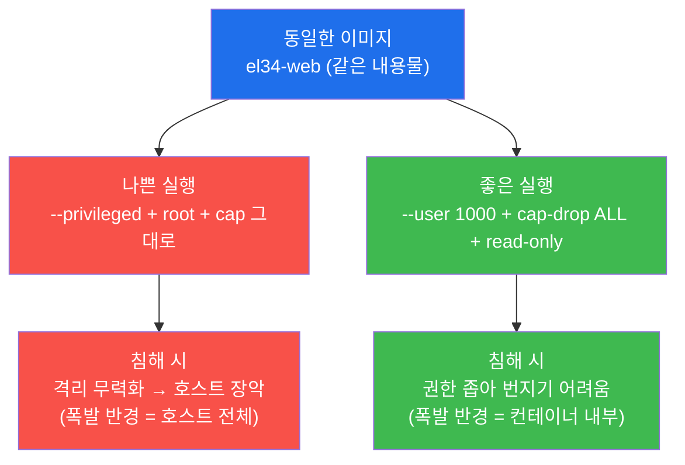

위 그림의 핵심은 **출발점(이미지)이 같다**는 것이다. 차이를 만드는 것은 오직 실행 옵션이다. 그래서
런타임 보안은 이미지 보안과 **별개의 점검 축**이며, 둘 다 통과해야 컨테이너가 안전하다. 이미지 보안이
"무엇을 담는가"라면, 런타임 보안은 **"어떻게 실행하는가"** 다(§0.5.1).

### 1.2 런타임 보안이 보는 다섯 항목

본 주차가 점검하는 런타임 설정은 다섯 가지이며, 모두 `docker inspect` 한 명령으로 읽을 수 있다.
앞의 세 가지는 "침해 시 호스트로 번지는 권한", 뒤의 두 가지는 "침해된 컨테이너 안에서의 운신 폭"을
좁힌다(§0.5.5).

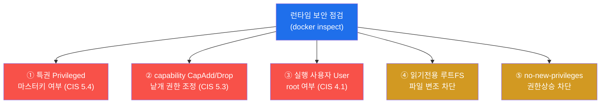

빨간 세 항목(특권·cap·user)은 잘못되면 **escape 위험을 직접 키우는** 핵심 점검 항목이라 빨강으로,
주황 두 항목(read-only·no-new-privileges)은 **있으면 폭발 반경을 더 줄이는** 강화 권고라 주황으로
표시했다. 본 주차 lab 의 미션 2~5 가 이 다섯 항목을 차례로 점검한다.

### 1.3 왜 중요한가 — 런타임 갭은 "침해의 증폭기"다

런타임 설정이 보안에서 결정적인 이유는, 그것이 **침해 자체를 막는 것이 아니라 침해의 결과를 좌우**하기
때문이다. 공격자가 웹 취약점(예: W02·web-vuln 트랙에서 다루는 RCE)으로 컨테이너 안에 코드 실행을
얻었다고 하자. 이때부터 일어나는 일은 전적으로 런타임 설정에 달려 있다 — root 로 돌고 있었다면 컨테이너
안에서 곧장 최고 권한을 쥐고, cap 이 잔존하고 특권까지 걸려 있었다면 호스트로 탈출한다. 반대로
비-root·최소 cap·read-only 였다면 같은 코드 실행을 얻고도 할 수 있는 일이 크게 제한된다. 즉 **런타임
보안은 "뚫림"을 "재앙"으로 키우지 않게 막는 안전장치**다.

### 1.4 한계 — 런타임 보안이 침투 자체를 막지는 않는다

런타임 보안을 완벽히 해도 그것이 애플리케이션 취약점(SQLi·RCE 등)으로 컨테이너 안에 처음 침투하는
것 자체를 막지는 못한다. 런타임 통제는 **"침투 이후"의 피해(폭발 반경)를 줄이는** 축이고, 침투를 막는
일은 이미지 보안(W02·W03)·앱 보안(web-vuln 트랙)·네트워크 방어(secuops 트랙)가 함께 맡는다. 본 주차는
침투 이후를 좁히는 런타임 계층을 깊이 다루며, 다른 축과 **함께** 작동해야 전체 방어가 된다.

---

## 2. 특권 컨테이너 — 격리를 무력화하는 마스터키 (CIS Docker 5.4)

### 2.1 한 줄 정의와 왜 중요한가

**특권 컨테이너(privileged container)** 는 `--privileged` 플래그로 실행되어 호스트의 거의 모든 장치
(`/dev`)와 커널 기능에 접근할 수 있는 컨테이너다(§0.5.2). 이것이 위험한 이유는 명확하다 — **컨테이너
격리(namespace/cgroups)를 사실상 무력화**하기 때문이다. 특권 컨테이너는 호스트 디스크를 직접 마운트하고
커널 모듈을 조작할 수 있어, 침해되면 곧장 container escape(호스트 장악)로 이어진다.

> **용어 — CIS Docker Benchmark 5.4.** CIS Docker 기준의 런타임(5번 절) 항목으로, **"특권 컨테이너를
> 사용하지 말라(Do not use privileged containers)"** 를 요구한다. `--privileged` 는 격리를 거의 다
> 풀어 버리므로, 정말 특정 장치가 필요하면 `--device` 로 그 장치만 노출하고 `--privileged` 는 쓰지
> 않는 것이 권고다.

### 2.2 왜 그토록 위험한가 — 마스터키의 의미

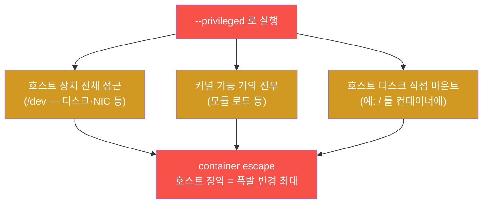

특권이 위험한 이유는 한 가지 경로가 아니라 **여러 경로가 동시에 열리기** 때문이다. 호스트 장치에
직접 접근하고, 커널 기능을 쓰며, 호스트 파일시스템을 마운트할 수 있으니, 공격자가 컨테이너 안에서
코드 실행만 얻으면 호스트로 빠져나가는 길이 사방에 열려 있다. 실제로 보안 사고에서 가장 흔한 컨테이너
escape 유형 중 하나가 "편의상 `--privileged` 로 띄운 CI 러너·모니터링 에이전트가 침해된" 경우다
(W01 §1.2 의 사고 표 첫 줄).

### 2.3 el34 에서 어떻게 — el34-web 은 특권 아님(CIS 5.4 준수)

el34-web 의 특권 여부는 `docker inspect` 의 `HostConfig.Privileged` 필드로 본다. el34 호스트
(`ssh ccc@192.168.0.80`)에서 다음과 같이 점검한다(미션 2).

```bash
docker inspect el34-web --format 'privileged={{.HostConfig.Privileged}}'
P=$(docker inspect el34-web --format '{{.HostConfig.Privileged}}')
[ "$P" = "false" ] && echo "compliant=not_privileged" || echo "gap=privileged"
```

- 첫 줄은 `privileged=false` 처럼 나온다 — `HostConfig.Privileged` 값이 곧 증적이다.
- 둘째·셋째 줄은 그 값을 변수 `$P` 에 담아, `false` 면 `compliant=not_privileged`(준수)를, 아니면
  `gap=privileged`(갭)를 출력하는 판정 자동화다.

el34-web 은 `Privileged=false` 이므로 **CIS Docker 5.4 를 준수**한다 — 가장 큰 위험(특권) 하나는 피한
양호 항목이다. 본 주차의 점검에서 "전부 갭"이 아니라 **준수 항목과 갭 항목이 섞여 있다**는 점이
중요하다. 점검자는 갭만 나열하는 사람이 아니라, 무엇이 양호하고 무엇이 갭인지를 **균형 있게** 보고하는
사람이다.

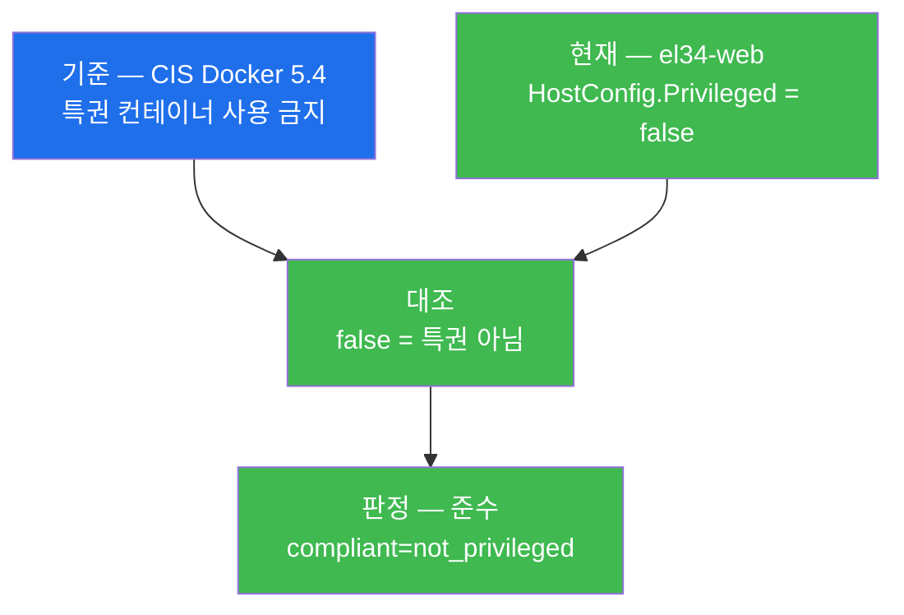

### 2.4 한계 — 특권만 없다고 안전한 것은 아니다

`Privileged=false` 는 필요조건이지 충분조건이 아니다. 특권을 켜지 않아도, 위험한 capability 하나
(`CAP_SYS_ADMIN`)를 `--cap-add` 하면 특권에 준하는 위험이 되고(§3), `--network=host`·`--pid=host`
같은 namespace 공유나 호스트 디렉터리 마운트(`-v /:/host`)도 escape 경로가 된다. 그래서 특권 점검은
런타임 점검의 **첫 항목**일 뿐이며, capability·user·격리 옵션까지 함께 봐야 완전한 점검이 된다 — 그것이
다음 절들의 주제다.

---

## 3. Linux capability — root 를 쪼갠 권한 (CIS Docker 5.3)

### 3.1 한 줄 정의와 왜 중요한가

**Linux capability** 는 전통적으로 root(uid 0)에게 한꺼번에 주어지던 막강한 권한을 약 40개의 작은
단위로 쪼갠 것이다(§0.5.3). 컨테이너에 어떤 capability 가 살아 있느냐가 중요한 이유는, **각 capability
가 곧 escape 로 가는 작은 문 하나**이기 때문이다. 불필요한 capability 가 잔존할수록 공격자가 노릴 수
있는 문이 많아진다. 그래서 안전한 방향은 **전부 떨어뜨린 뒤 필요한 것만 도로 주는** 최소권한이다.

> **용어 — CIS Docker Benchmark 5.3.** CIS Docker 기준의 런타임 항목으로, **"불필요한 capability 를
> 제거하라"** 를 요구한다(원문 취지: 기본 cap 을 모두 drop 한 뒤 꼭 필요한 것만 add). 즉 `--cap-drop
> ALL` 을 기본으로 하고, 앱에 정말 필요한 capability(예: 80 포트 바인딩이면 `CAP_NET_BIND_SERVICE`)만
> 명시적으로 `--cap-add` 하라는 것이다.

### 3.2 CapAdd / CapDrop 읽는 법

`docker inspect` 는 컨테이너의 capability 조정 내역을 두 필드로 보여 준다.

- **`HostConfig.CapAdd`** — 기본값에 **추가로 더한** capability 목록(받은 낱개 열쇠).
- **`HostConfig.CapDrop`** — 기본값에서 **떼어 낸** capability 목록(반납한 열쇠).

핵심 해석 규칙은 이렇다. **CapDrop 이 비어 있으면, 기본 capability 가 하나도 제거되지 않고 전부 그대로
살아 있다는 뜻**이다. 여기에 CapAdd 까지 있으면 "정리는커녕 권한을 더 받은" 상태다. 반대로 CapDrop 에
`ALL`(또는 구체적 `CAP_*` 목록)이 보이면, 최소권한 방향으로 정리했다는 신호다.

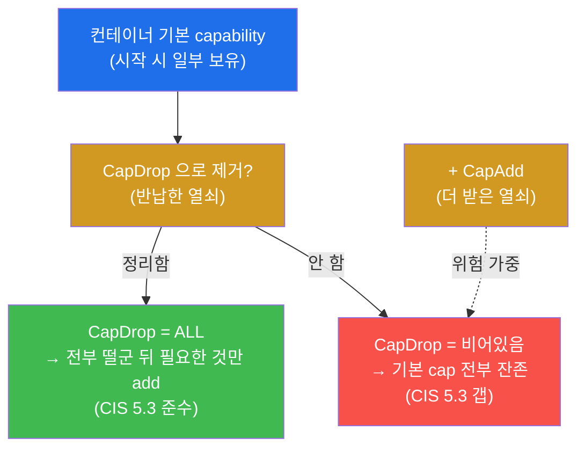

### 3.3 el34 에서 어떻게 — el34-web 은 CapDrop 비어있음 + NET_ADMIN (CIS 5.3 갭)

el34-web 의 capability 는 다음과 같이 점검한다(미션 3).

```bash
docker inspect el34-web --format 'CapAdd={{.HostConfig.CapAdd}} CapDrop={{.HostConfig.CapDrop}}'
D=$(docker inspect el34-web --format '{{.HostConfig.CapDrop}}')
echo "$D" | grep -qiE 'ALL|CAP_' && echo "compliant=caps_dropped" || echo "gap=no_capdrop"
```

- 첫 줄은 `CapAdd=[NET_ADMIN] CapDrop=[]` 처럼 나온다 — **`CAP_NET_ADMIN` 을 추가로 받았고
  (CapAdd), 떨어뜨린 것은 하나도 없다(CapDrop 이 빈 `[]`)**.
- 둘째·셋째 줄은 `CapDrop` 값에 `ALL` 또는 `CAP_` 문자열이 있는지 검사한다. 비어 있으면 그 검사가
  실패하므로 `gap=no_capdrop`(갭)를 출력한다.

이 출력이 곧 증적이다. **el34-web 은 `CAP_NET_ADMIN` 을 더 받은 채 기본 capability 를 하나도 떨어뜨리지
않아**(CapDrop 빈 값), 기본 cap 전부 + NET_ADMIN 이 모두 살아 있다 — **CIS Docker 5.3 갭**이다. 정석
시정은 `--cap-drop ALL` 로 전부 떨군 뒤, 이 컨테이너가 정말 `CAP_NET_ADMIN` 이 필요하다면 그것만
`--cap-add NET_ADMIN` 으로 도로 주는 것이다.

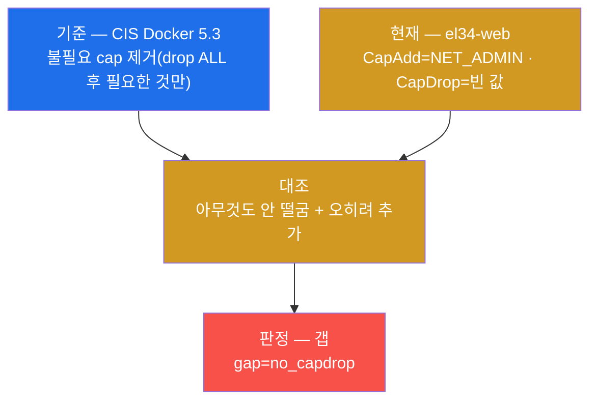

### 3.4 한계 — capability 의 위험은 종류마다 다르다

capability 가 잔존한다고 모두 똑같이 위험한 것은 아니다. `CAP_SYS_ADMIN`·`CAP_SYS_MODULE`·
`CAP_SYS_PTRACE` 처럼 escape 와 직결되는 위험한 것이 있는 반면, 비교적 영향이 작은 것도 있다. el34-web
의 `CAP_NET_ADMIN` 은 네트워크 설정 변경 권한으로, 그 자체로 곧장 호스트 장악은 아니지만 네트워크
조작·패킷 가로채기 등에 악용될 수 있다. 그러나 핵심은 **"위험한 cap 만 골라 떨구는" 것이 아니라
"전부 떨군 뒤 필요한 것만 더하는" 최소권한**이라는 점이다 — 어떤 cap 이 위험한지 일일이 판단하는 것보다,
기본을 `cap-drop ALL` 로 두는 편이 안전하고 단순하다. el34-web 처럼 CapDrop 이 비어 있다는 사실 자체가
이 최소권한 원칙을 따르지 않았다는 갭이다.

---

## 4. 실행 사용자 — 운전석의 root (CIS Docker 4.1)

### 4.1 한 줄 정의와 왜 중요한가

**실행 사용자(User)** 는 컨테이너 안의 프로세스가 어떤 uid 로 도는가다(§0.5.4). 컨테이너는 사용자를
지정하지 않으면 **기본적으로 root(uid 0)** 로 실행된다. 이것이 중요한 이유는, root 로 도는 컨테이너가
침해·탈출되면 **호스트에서 곧장 최고 권한**으로 행동할 여지가 커지기 때문이다(user namespace 미사용 시
컨테이너 uid 0 ≈ 호스트 uid 0).

> **용어 — CIS Docker Benchmark 4.1.** CIS Docker 기준의 이미지·빌드(4번 절) 항목으로, **"컨테이너를
> root 가 아닌 사용자로 실행하라"** 를 요구한다. 시정은 이미지의 `USER` 지시어로 비-root(uid ≥ 1000)를
> 굽거나, 실행 시 `--user 1000` 으로 지정하는 것이다. (이 항목은 4번 절에 있지만, 실제 점검은 런타임에
> "지금 무엇으로 도는가"를 확인하므로 본 주차에서 다룬다.)

### 4.2 두 가지로 확인한다 — 설정값과 실제 uid

실행 사용자는 두 단계로 확인하는 것이 정확하다.

- **설정값(`Config.User`)** — 이미지/실행 옵션에 지정된 사용자. **비어 있으면 root 로 돈다**는 신호다.
- **실제 uid(`docker exec ... id -u`)** — 컨테이너 안에서 진짜로 실행 중인 uid. **`0` 이면 root** 다.

설정값만 보지 않고 실제 uid 까지 확인하는 이유는, 설정과 실제가 어긋날 가능성을 닫기 위해서다. 둘 다
root 를 가리키면 의심의 여지 없이 root 실행 갭이다.

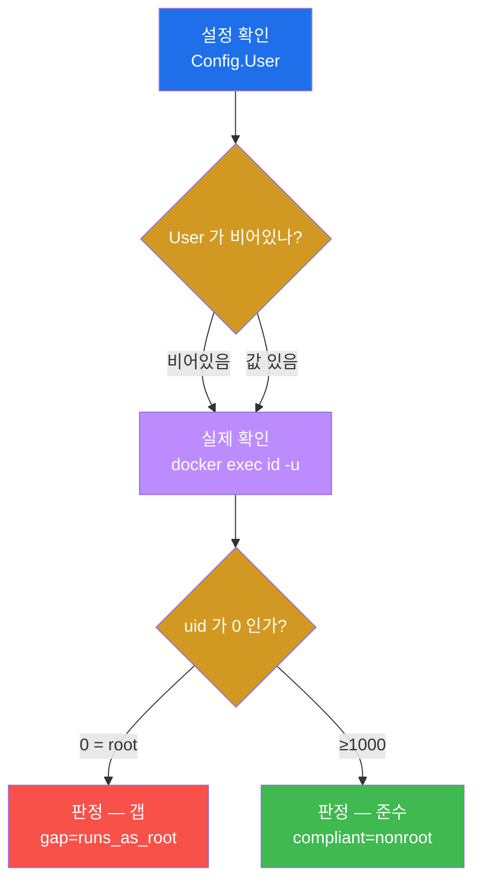

### 4.3 el34 에서 어떻게 — el34-web 은 root 실행(CIS 4.1 갭)

el34-web 의 실행 사용자는 다음과 같이 점검한다(미션 4).

```bash
U=$(docker inspect el34-web --format '{{.Config.User}}')
echo "user=[$U]"
ssh ccc@10.20.32.80 id -u | grep -q '^0$' && echo "gap=runs_as_root" || echo "compliant=nonroot"
```

- 첫 두 줄은 `user=[]` 처럼 나온다 — **`Config.User` 가 빈 값**이라 사용자를 지정하지 않았다는 뜻이다.
- 셋째 줄은 `ssh ccc@10.20.32.80 id -u` 로 컨테이너 안의 실제 uid 를 찍어, 그것이 `0`(root)이면
  `gap=runs_as_root` 를 출력한다.

> **도구 — `docker exec`.** 실행 중인 컨테이너 안에서 명령을 한 번 실행하는 도구다. `docker exec
> el34-web id -u` 는 el34-web 컨테이너 안에서 `id -u`(현재 사용자의 uid 출력)를 실행한다. 출력이
> `0` 이면 그 컨테이너의 주 프로세스가 root 로 돈다는 직접 증거다.

el34-web 은 `Config.User` 가 비고 컨테이너 내부 uid 가 0 이므로 **root 로 실행 = CIS Docker 4.1 갭**
(`gap=runs_as_root`)이다. W01 미션 6 에서 설정값(`Config.User` 빈 값)만으로 한 번 본 그 갭을, 본
주차에서는 **컨테이너 내부의 실제 uid 까지 확인**해 더 확실히 못 박는다.

### 4.4 한계 — user namespace 가 있으면 위험이 준다

"root 로 돈다"가 항상 똑같이 치명적인 것은 아니다. **user namespace(사용자 이름공간)** 를 쓰면 컨테이너
안의 uid 0(root)를 호스트의 비-root(예: uid 100000)로 매핑해, escape 가 나도 호스트에서는 일반 권한밖에
못 쓰게 만들 수 있다. 그러나 el34 는 이 매핑을 쓰지 않는 기본 구성이므로, **컨테이너 root = 호스트 root**
로 보고 root 실행을 실제 갭으로 판정한다. 가장 단순하고 권고되는 시정은 user namespace 같은 고급 기능
이전에 **애초에 비-root 사용자로 실행**(USER 지시어 / `--user`)하는 것이다.

---

## 5. 추가 강화 — 읽기전용 루트FS와 no-new-privileges

### 5.1 한 줄 정의와 왜 중요한가

앞의 세 항목(특권·cap·user)이 "호스트로 번지는 권한"을 다뤘다면, **읽기전용 루트FS**와
**no-new-privileges** 는 **침해된 컨테이너 안에서 공격자의 운신 폭을 더 좁히는** 추가 강화 통제다
(§0.5.5). 둘 다 침투 자체를 막지는 않지만, 침투 후 **악성 파일 설치**와 **권한 상승**을 어렵게 만들어
폭발 반경을 한 번 더 줄인다.

### 5.2 두 통제가 각각 막는 것

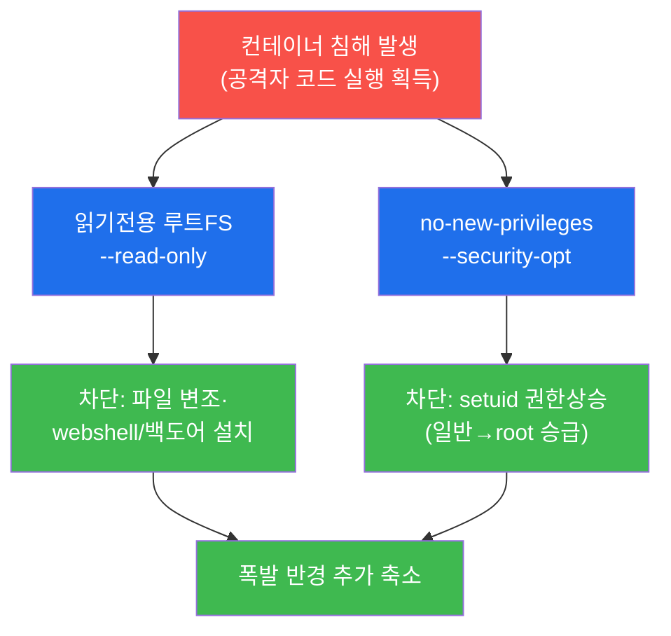

- **읽기전용 루트FS(`--read-only`)** — 루트 파일시스템에 쓰기를 막아, 공격자가 webshell·백도어를 새로
  심거나 기존 바이너리를 변조하기 어렵게 한다. 쓰기가 꼭 필요한 경로(`/tmp` 등)만 `tmpfs`·볼륨으로
  따로 연다.
- **no-new-privileges(`--security-opt no-new-privileges`)** — 실행 중 새 권한 획득(특히 setuid 를 통한
  권한 상승)을 커널이 막아, 침해 후 일반 권한에서 root 로 올라서는 경로를 닫는다.

### 5.3 el34 에서 어떻게 — ReadonlyRootfs · SecurityOpt 점검

el34-web 의 추가 강화 설정은 다음과 같이 점검한다(미션 5).

```bash
docker inspect el34-web --format 'ReadonlyRootfs={{.HostConfig.ReadonlyRootfs}} SecurityOpt={{.HostConfig.SecurityOpt}}'
echo rofs_checked
```

- `HostConfig.ReadonlyRootfs` — `true` 면 읽기전용(강화됨), `false` 면 쓰기 가능(침해 후 변조 가능).
- `HostConfig.SecurityOpt` — `no-new-privileges`·seccomp·AppArmor 등 추가 보안 옵션 목록. 비어 있으면
  이런 강화가 적용되지 않았다는 뜻이다.

이 두 항목은 특권·user 같은 "치명적 갭"이라기보다, **있으면 폭발 반경을 더 줄여 주는 권고 강화책**이다.
점검 결과 `ReadonlyRootfs=false` 이거나 `SecurityOpt` 가 비어 있다면, "치명적 갭은 아니나 강화 여지"로
보고서에 권고한다. 미션 5 의 합격 기준은 이 두 필드가 출력되어 점검됐음(`rofs_checked`)을 확인하는
것이다.

### 5.4 한계 — 강화 통제는 호환성을 함께 봐야 한다

읽기전용 루트FS 는 강력하지만, 앱이 런타임에 특정 경로에 파일을 쓰도록 설계됐다면(로그·캐시·세션) 그
경로를 빠짐없이 `tmpfs`·볼륨으로 열어 줘야 정상 동작한다 — 무작정 켜면 앱이 깨질 수 있다. seccomp·
AppArmor 같은 프로파일도 너무 좁게 잡으면 정상 기능까지 막는다. 그래서 이 강화 통제들은 **앱의 실제
쓰기·시스템콜 요구를 파악한 뒤 단계적으로** 적용하는 것이 실무다. 본 주차는 "무엇을·왜"를 점검·이해하는
데 초점을 두고, 세부 프로파일 작성은 이후 심화에서 다룬다.

---

## 6. 영향 — 런타임 갭이 키우는 폭발 반경

### 6.1 한 줄 정의와 왜 중요한가

지금까지 찾은 갭(root 실행 · cap 미드롭)이 실제로 어떤 피해로 이어지는가를 정리하는 것이 영향 분석이다.
한마디로 **런타임 갭은 침해의 "폭발 반경(blast radius)"을 키운다**(§0.5.6). 같은 침투라도 권한이 넓으면
피해가 호스트까지 번지고, 좁으면 컨테이너 안에 머문다. 이 영향을 정리해야 갭의 우선순위와 시정의
시급성을 설득력 있게 보고할 수 있다.

### 6.2 갭별 영향

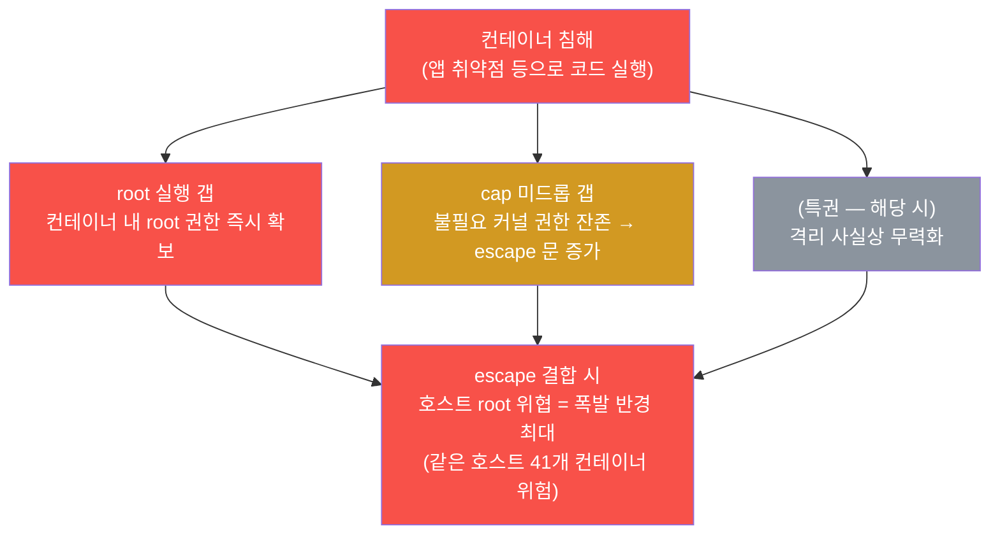

- **root 실행** — 침해 시 컨테이너 안에서 곧장 root 권한을 쥔다. escape 와 결합하면 호스트 root 위협으로
  직결된다.
- **cap 미드롭** — 불필요한 커널 권한이 잔존해, escape 로 가는 문이 그만큼 많아진다.
- **특권(el34-web 은 해당 없음)** — 만약 켜져 있었다면 격리가 사실상 무력화돼 폭발 반경이 곧장 호스트
  전체였을 것이다. el34-web 은 이 항목이 양호해 최악은 피한다.

핵심 메시지는 **"런타임 갭은 침해의 폭발 반경을 키운다"** 이며, el34 처럼 한 호스트에 41개 컨테이너가
공존하는 환경에서는 한 컨테이너의 반경이 호스트까지 닿으면 나머지까지 위험해진다. 미션 6 의 합격
기준은 이 영향 정리에 `escape`(탈출)가 포함되는지다.

### 6.3 한계 — 영향은 정성적 추정이며 환경에 따라 달라진다

폭발 반경은 단정적 수치가 아니라 **조건부 추정**이다. root 실행이라도 user namespace 가 있으면(§4.4)
호스트 위협이 줄고, cap 이 잔존해도 커널·런타임에 추가 취약점이 없으면 실제 escape 까지 이어지지 않을
수 있다. 즉 영향 분석은 "최악의 경우 이만큼 번질 수 있다"는 위험 시나리오이며, 실제 피해는 다른 통제
(이미지·네트워크·커널 패치)의 상태에 좌우된다. 보고서에는 이 가정을 명시해, 영향을 과장하거나 과소
평가하지 않는다.

---

## 7. 방어 — 최소권한 런타임

### 7.1 한 줄 정의와 왜 중요한가

런타임 방어의 핵심 원칙은 **최소권한(least privilege)** 이다 — 컨테이너에 **꼭 필요한 최소한의 권한만**
부여하는 것. 왜 중요한가 — 공유 커널 환경에서 침투·escape 를 100% 막을 수는 없으므로, **침해가 나더라도
폭발 반경이 그 컨테이너 안에 머물도록** 평소에 권한을 좁혀 두는 것이 가장 현실적인 방어이기 때문이다.
최소권한이 곧 작은 폭발 반경이다.

### 7.2 다섯 가지 최소권한 통제

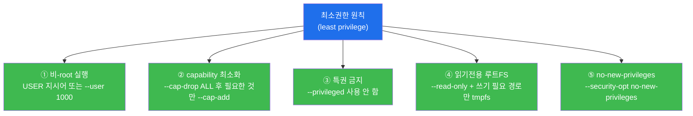

- **① 비-root 실행** — el34-web 의 root 갭(§4)을 정확히 메우는 통제. 이미지에 `USER` 로 비-root(uid ≥
  1000)를 굽거나 실행 시 `--user 1000` 으로 지정한다.
- **② capability 최소화** — el34-web 의 cap 미드롭 갭(§3)을 메우는 통제. `--cap-drop ALL` 로 전부 떨군
  뒤, 정말 필요한 것만(예: 네트워크 설정이 필요하면 `--cap-add NET_ADMIN`) 도로 준다.
- **③ 특권 금지** — `--privileged` 를 쓰지 않는다(el34-web 은 이미 준수). 특정 장치가 필요하면
  `--device` 로 그 장치만 노출한다.
- **④ 읽기전용 루트FS** — `--read-only` 로 루트FS 쓰기를 막고, 쓰기 필요 경로만 `tmpfs`·볼륨으로 연다.
- **⑤ no-new-privileges** — `--security-opt no-new-privileges` 로 setuid 권한 상승을 차단한다.

### 7.3 el34 에서 어떻게 — 갭과 시정의 대응

el34-web 점검 결과를 시정과 짝지으면 다음과 같다. **양호(특권)는 유지**하고, **갭(cap·user)은 위
①②로 메우며**, **강화 여지(④⑤)는 추가 적용**한다.

| el34-web 점검 결과 | 판정 | 대응 통제 |
|--------------------|------|-----------|
| `Privileged=false` (CIS 5.4) | 준수(양호) | ③ 특권 금지 — 현 상태 유지 |
| `CapDrop` 비어있음 + `NET_ADMIN` (CIS 5.3) | **갭** | ② cap-drop ALL 후 필요한 것만 add |
| `User` 빈 값 + uid 0 (CIS 4.1) | **갭** | ① 비-root 실행(USER / --user) |
| `ReadonlyRootfs`·`SecurityOpt` | 강화 여지 | ④ read-only + ⑤ no-new-privileges |

미션 7 의 합격 기준은 이 방어 정리에 `최소권한`(least privilege)이 포함되는지다. 핵심은 개별 옵션의
나열이 아니라, **"최소권한으로 escape 폭발 반경을 최소화한다"** 는 한 원칙으로 다섯 통제를 꿰는 것이다.

### 7.4 한계 — 방어는 설정하고 끝이 아니라 점검·유지해야 한다

위 다섯 통제는 런타임 계층의 기본이며 효과가 크지만, **설정만 하고 점검하지 않으면 시간이 지나며
표류(drift)** 한다 — 새 컨테이너가 옛 습관대로 root·특권으로 다시 떠오르기 쉽다. 그래서 본 주차의
점검(`docker inspect`)을 **정기적으로** 돌려 baseline 준수를 확인하고, 가능하면 배포 파이프라인에서
특권·root 를 자동 거부하도록 정책(admission control)으로 강제하는 것이 다음 단계다. 또 런타임 방어는
4계층의 한 축이므로, 이미지(W02·W03)·격리(W05)·오케스트레이션 통제와 함께 가야 전체가 닫힌다.

---

## 8. 점검 명령 빠른 복습 — "무엇을 어디서 보나"

본 주차의 점검은 모두 el34 호스트(`ssh ccc@192.168.0.80`, 비밀번호 1)에서 `docker` CLI 로 수행하며,
**신규 도구 설치는 없다.** 점검 대상은 인가된 컨테이너 `el34-web` 뿐이고, 모든 명령은 **읽기 전용**이다
(설정을 바꾸지 않는다). 각 명령이 무엇을 보여 주는지 한눈에 정리한다.

| 무엇을 | 명령(핵심 필드) | 무엇을 보나 / el34-web 결과 |
|--------|------------------|------------------------------|
| 대상 확인 | `docker inspect el34-web --format '{{.State.Status}}'` | 컨테이너 가동 여부(`target_ok`) |
| 특권 (CIS 5.4) | `... --format '{{.HostConfig.Privileged}}'` | `false` = **준수**(특권 아님) |
| capability (CIS 5.3) | `... --format '{{.HostConfig.CapAdd}} {{.HostConfig.CapDrop}}'` | CapAdd=NET_ADMIN, CapDrop=빈값 = **갭** |
| 실행 사용자 (CIS 4.1) | `... '{{.Config.User}}'` + `ssh ccc@10.20.32.80 id -u` | User 빈값 + uid 0 = root = **갭** |
| 읽기전용·보안옵션 | `... '{{.HostConfig.ReadonlyRootfs}} {{.HostConfig.SecurityOpt}}'` | 강화 여부(강화 여지) |

> **점검 관용구.** 미션 2~4 의 명령은 `[ 조건 ] && echo "compliant=..." || echo "gap=..."` 형태로
> 판정을 셸 한 줄로 자동화해 두었다. 학생은 출력에 `compliant=...`(준수) 또는 `gap=...`(갭)가
> 나오는지로 결과를 읽는다 — 이것이 "기준(CIS 4·5) + 현재(설정 출력) + 판정(준수/갭)"의 삼박자
> 증적이다. el34-web 의 핵심 산출물은 **`compliant=not_privileged`(양호) · `gap=no_capdrop`(갭) ·
> `gap=runs_as_root`(갭)** 세 줄이다.

---

## 9. 실습 안내 — lab 8 미션 (4 축 설명)

본 주차 실습은 8 미션으로 구성된다. 각 미션을 **4 축**으로 설명한다 — 왜 하는가 / 무엇을 알 수 있는가 /
결과 해석(준수 vs 갭) / 실전 활용. 미션은 대상 확인 → 특권 → capability → user → 추가 강화 → 영향 →
방어 → 종합 보고 순서로 흐르며, lab 의 `order` 와 1:1 로 대응한다.

> **실습 진행 원칙.** 모든 명령은 el34 호스트(`ssh ccc@192.168.0.80`)에서 `docker` CLI 로 수행한다.
> 신규 도구 설치는 없으며, 점검 대상은 **인가된 컨테이너(`el34-web`)** 뿐이다. 본 주차는 `docker
> inspect`·`docker exec ... id -u` 같은 **읽기 전용 점검**으로, 컨테이너를 멈추거나 설정을 바꾸지
> 않는다. 합격 임계값은 0.7 이다.

### 미션 1 — 대상 확인 (10점)

> **왜 하는가?** 모든 점검의 전제는 대상이 살아 있다는 것이다. 런타임 점검 대상(el34-web)이 실제로 떠
> 있는지부터 확인한다 — 대상이 없으면 이후 점검이 무의미하다.
>
> **무엇을 알 수 있는가?** `docker inspect ... '{{.State.Status}}'` 로 el34-web 의 상태(running 등).
> 런타임 보안은 "이미지를 어떻게 실행하는가"의 설정을 보므로, 그 실행 인스턴스가 존재함을 먼저 확인한다.
>
> **결과 해석.** 정상: 출력에 `target_ok` 가 나옴(대상 가동 확인). 비정상: 응답이 없거나 상태가 비정상
> 이면 호스트 SSH·`docker ps`·컨테이너 이름을 점검한다.
>
> **실전 활용.** 런타임 점검 착수 시 첫 확인. 점검 대상 컨테이너가 실제 가동·조회 가능한지 검증하는
> 단계다.

### 미션 2 — 특권 점검 (CIS 5.4) (12점)

> **왜 하는가?** 특권 컨테이너는 격리를 사실상 무력화해 침해 시 곧장 호스트 장악으로 이어진다(§2).
> 런타임 점검의 첫 항목으로, 가장 치명적일 수 있는 특권 여부부터 본다.
>
> **무엇을 알 수 있는가?** `HostConfig.Privileged` 의 실제 값. el34-web 은 `false`(특권 아님) — CIS
> Docker 5.4 준수, 가장 큰 위험 하나를 피한 양호 항목.
>
> **결과 해석.** 정상(준수): 출력에 `compliant=not_privileged` 가 나옴 — `Privileged=false` 이므로 특권
> 갭이 없다는 뜻. 만약 `gap=privileged` 가 나오면 즉시 시정 대상(특권 금지)이다.
>
> **실전 활용.** 모든 컨테이너 런타임 점검의 1순위 확인. "특권으로 떠 있는 컨테이너가 있는가"는
> `docker inspect` 한 줄로 가장 먼저 걸러야 하는 항목이다.

### 미션 3 — Capability 점검 (CIS 5.3) (16점, 핵심)

> **왜 하는가?** 본 주차의 핵심 산출물 중 하나다. capability 는 root 를 쪼갠 권한이며, 떨어뜨리지 않으면
> 불필요한 커널 권한이 잔존해 escape 문이 많아진다(§3). el34-web 의 cap 갭을 본인 손으로 찾는다.
>
> **무엇을 알 수 있는가?** `CapAdd`/`CapDrop` 의 실제 값. el34-web 은 `CapAdd=NET_ADMIN`(추가) +
> `CapDrop` 빈 값(아무것도 안 떨굼) → 기본 cap 전부 + NET_ADMIN 잔존 = CIS Docker 5.3 갭.
>
> **결과 해석.** 정상(갭 판정 성공): 출력에 `gap=no_capdrop` 가 나옴 — CapDrop 이 비어 기본 cap 전부가
> 잔존한다는 갭이다. 만약 `compliant=caps_dropped` 면 cap 을 정리(drop ALL 등)한 양호 상태다.
>
> **실전 활용.** 런타임 최소권한 점검의 핵심. "기본 cap 을 떨어뜨렸는가(`cap-drop ALL`)"는 컨테이너
> 권한 위생의 척도이며, CapDrop 빈 값은 최소권한 미적용의 직접 증거다.

### 미션 4 — 실행 사용자 점검 (CIS 4.1) (14점, 핵심)

> **왜 하는가?** root 로 도는 컨테이너는 침해·탈출 시 호스트에서 최고 권한을 휘두를 여지가 크다(§4).
> W01 에서 본 그 갭을, 본 주차에서는 컨테이너 내부 실제 uid 까지 확인해 더 확실히 못 박는다.
>
> **무엇을 알 수 있는가?** `Config.User`(설정값)와 `docker exec ... id -u`(실제 uid). el34-web 은 User
> 빈 값 + uid 0 → root 실행 = CIS Docker 4.1 갭.
>
> **결과 해석.** 정상(갭 판정 성공): 출력에 `gap=runs_as_root` 가 나옴 — User 가 비고 내부 uid 가 0
> 이라 root 로 돈다는 갭이다. 만약 `compliant=nonroot`(uid ≥ 1000)면 비-root 로 지정된 양호 상태다.
>
> **실전 활용.** 모든 컨테이너 점검의 단골 1순위 항목. "이 컨테이너가 root 로 도는가"를 설정값 +
> 실제 uid 의 두 증거로 판정하는 표준 절차다.

### 미션 5 — 읽기전용 루트FS·no-new-privileges (12점)

> **왜 하는가?** 특권·cap·user 가 "호스트로 번지는 권한"이라면, 이 둘은 침해된 컨테이너 안에서 공격자의
> 운신 폭을 더 좁히는 추가 강화다(§5). 폭발 반경을 한 번 더 줄이는 통제를 점검한다.
>
> **무엇을 알 수 있는가?** `ReadonlyRootfs`(읽기전용 여부)와 `SecurityOpt`(no-new-privileges 등 추가
> 옵션). false/빈 값이면 침해 후 파일 변조·권한 상승을 막는 강화가 적용되지 않았다는 뜻이다.
>
> **결과 해석.** 정상: 출력에 두 필드가 나오고 `rofs_checked` 가 찍힘(점검 완료). `ReadonlyRootfs=false`
> 나 `SecurityOpt` 빈 값은 치명적 갭이라기보다 **강화 여지**로 보고한다.
>
> **실전 활용.** 런타임 baseline 의 강화 단계 점검. 핵심 갭(user·cap)을 메운 뒤, read-only·
> no-new-privileges 로 폭발 반경을 추가로 줄이는 권고 항목이다.

### 미션 6 — 영향 정리 (10점)

> **왜 하는가?** 갭을 찾았으면 그것이 **어떤 피해로 이어지는가**를 정리해야 시정의 시급성을 설득할 수
> 있다. 런타임 갭이 침해의 폭발 반경을 키우는 메커니즘을 정리한다(§6).
>
> **무엇을 알 수 있는가?** root 실행·cap 미드롭이 escape 와 결합될 때 호스트 위협(폭발 반경)으로
> 이어지는 경로. 최소권한이 그 반경을 어떻게 줄이는지.
>
> **결과 해석.** 정상: 출력에 `escape`(탈출)가 포함됨 — 갭이 호스트 위협으로 번지는 핵심을 짚었다는
> 뜻. 비정상: escape 개념이 빠지면 §0.5.6·§6.2 를 다시 읽는다.
>
> **실전 활용.** 위험 평가·보고의 사고 틀. 어떤 런타임 갭부터 시정할지 우선순위를 "폭발 반경" 기준으로
> 매기는 근거가 된다.

### 미션 7 — 방어: 최소권한 런타임 (12점)

> **왜 하는가?** 갭과 영향을 보였으면 **어떻게 막을지**가 따라와야 한다. escape 폭발 반경을 줄이는
> 런타임 방어를 최소권한 원칙으로 정리한다(§7).
>
> **무엇을 알 수 있는가?** 비-root 실행 · cap-drop ALL · 특권 금지 · read-only · no-new-privileges 의
> 다섯 통제와, 미션 3·4 의 갭(cap·user)을 각각 어느 통제로 메우는지.
>
> **결과 해석.** 정상: 출력에 `최소권한`(least privilege)이 포함됨 — 다섯 통제를 한 원칙으로 꿰었다는
> 뜻. 비정상: 핵심 통제가 빠지면 §7.2 의 다섯 노드를 다시 확인한다.
>
> **실전 활용.** 컨테이너 배포 표준(보안 baseline)의 골격. 새 컨테이너를 띄울 때 적용할 런타임 정책의
> 기준이 된다.

### 미션 8 — 런타임 보안 보고서 (14점)

> **왜 하는가?** 점검의 산출물은 보고서다. 미션 1–7 을 점검(특권 양호·cap 갭·user 갭) → 영향(폭발 반경)
> → 방어(최소권한)의 한 흐름으로 종합해야 점검이 완성된다.
>
> **무엇을 알 수 있는가?** 준수(특권)와 갭(cap·user)을 함께 제시하는 균형 잡힌 보고법. CIS Docker 4·5
> 항목 번호로 판정 근거를 명시하는 법.
>
> **결과 해석.** 정상: 보고서에 점검·갭·방어가 포함되고 `CIS`(기준 근거)가 명시됨(종합 성공). 비정상:
> 갭이나 방어가 빠지면 미션 8 의 보고서 양식을 다시 채운다.
>
> **실전 활용.** 런타임 보안 점검 보고서의 표준 구조(점검 → 영향 → 방어 → 결론). 운영팀·심사에 제출하는
> 산출물이며, 다음 점검(W05 격리)의 토대가 된다.

---

## 10. 점검 수칙 — 인가된 점검과 증적 중심

런타임 보안 점검도 **허가받은 대상에 대해서만** 한다. 다음 수칙을 지킨다.

- **인가된 대상만 점검한다.** el34 의 정해진 컨테이너(`el34-web`)에 대해서만 조회하며, 같은 명령을 그
  밖의 어떤 시스템·컨테이너에도 함부로 던지지 않는다.
- **점검만, 변경은 하지 않는다.** 본 주차의 명령(`docker inspect`·`docker exec ... id -u`)은 모두
  **읽기 전용 조회**다. 컨테이너를 멈추거나 설정(`--user`·`--cap-drop` 등)을 실제로 바꾸지 않는다 —
  시정은 운영팀의 변경관리 절차로 한다.
- **증적 우선.** "위험하다"가 아니라 **기준(CIS 4.1·5.3·5.4) + 현재(설정 출력) + 판정(준수/갭)** 의
  삼박자로 보고한다. `docker inspect` 의 출력값 자체가 증적이다.
- **준수와 갭을 균형 있게.** el34-web 처럼 양호(특권)와 갭(cap·user)이 섞인 경우, 갭만 나열하지 않고
  무엇이 양호한지도 함께 보고한다.

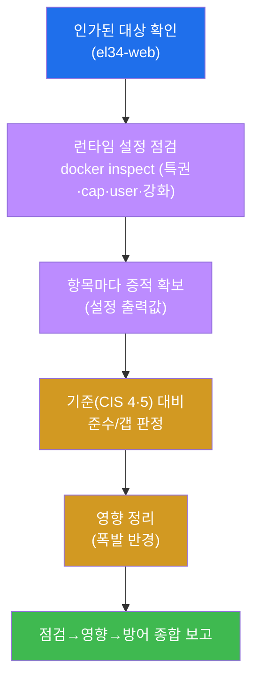

---

## 11. 핵심 정리 (1줄씩)

1. **런타임 보안** — "이미지를 어떻게 실행하는가"(특권·cap·user·격리)의 점검. 같은 이미지도 실행 옵션이
   위험을 가른다.
2. **특권(CIS 5.4)** — `--privileged` 는 격리를 무력화한다. el34-web 은 `Privileged=false` = **준수**
   (`compliant=not_privileged`).
3. **capability(CIS 5.3)** — root 를 쪼갠 권한. el34-web 은 CapDrop 비어있음 + NET_ADMIN = 기본 cap
   전부 잔존 = **갭**(`gap=no_capdrop`). 정석은 cap-drop ALL 후 필요한 것만 add.
4. **실행 사용자(CIS 4.1)** — el34-web 은 User 빈 값 + 내부 uid 0 = root 실행 = **갭**
   (`gap=runs_as_root`). 시정은 USER/`--user` 로 비-root.
5. **추가 강화** — 읽기전용 루트FS(파일 변조 차단)·no-new-privileges(권한상승 차단)는 폭발 반경을 더
   줄이는 권고책.
6. **영향·방어** — 런타임 갭은 침해의 **폭발 반경**을 키운다. **최소권한**(비-root + cap-drop ALL +
   특권 금지 + read-only + no-new-privileges)이 그 반경을 줄이는 근본 방어다.

---

## 12. 다음 주차 (W05) 예고 — 컨테이너 격리 (Namespace·Cgroups)

본 주차(W04)는 런타임 보안의 **권한·사용자 측면**을 다뤘다 — 특권·capability·user 가 침해의 폭발 반경을
어떻게 좌우하는지. 그런데 우리는 줄곧 "컨테이너 격리"를 전제로 이야기했다 — escape 란 그 격리를 깨고
나가는 것이라고. 그렇다면 **그 격리 자체는 무엇으로 만들어져 있는가?**

W05 는 컨테이너 격리의 두 기둥인 **namespace(이름공간)** 와 **cgroups(자원 제한)** 로 들어간다.
**namespace** 는 컨테이너가 "무엇을 볼 수 있는가"를 분리하고(프로세스·네트워크·파일시스템 등을
컨테이너별로 격리), **cgroups** 는 컨테이너가 "자원을 얼마나 쓸 수 있는가"를 제한한다(CPU·메모리 한도).
학생은 `/proc/1/ns` 로 namespace 격리를 직접 들여다보고, pid/net 격리와 cgroups 자원 한도를 점검하며,
**공유 커널이라는 근본 한계**(W01 §0.5.2) 위에서 이 격리가 어디까지 막아 주고 어디부터 한계인지를 본인
손으로 확인한다. 본 주차에서 익힌 "권한을 좁혀 폭발 반경을 줄인다"는 사고가, W05 의 "격리로 무엇이
보이고 무엇을 못 쓰게 막는가"와 만나 런타임 보안의 그림을 완성한다.

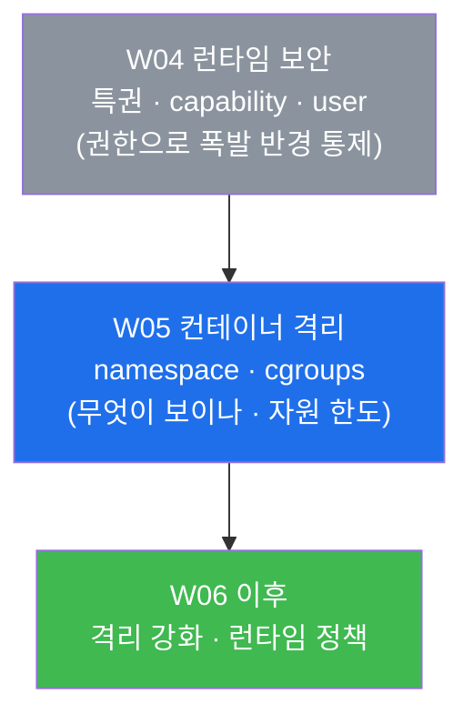
