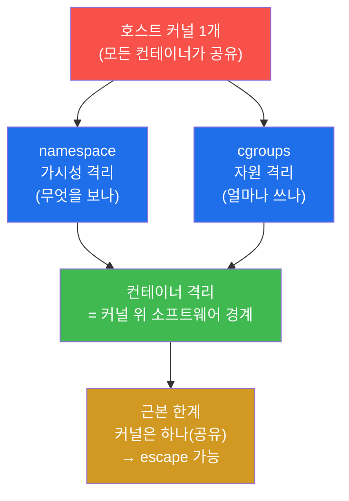
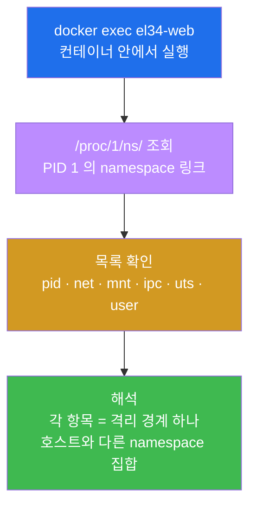
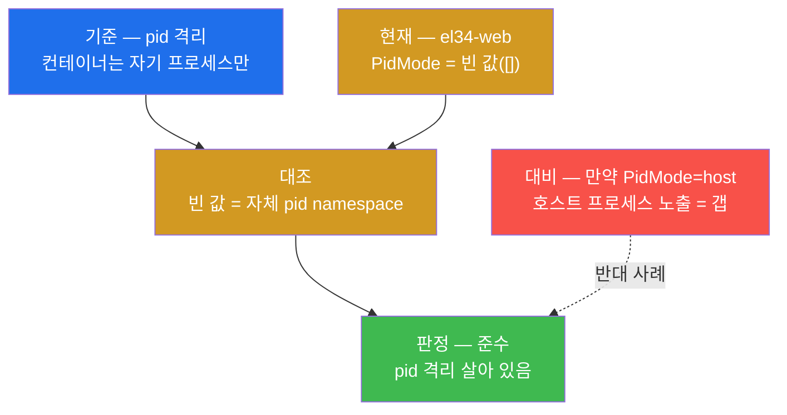
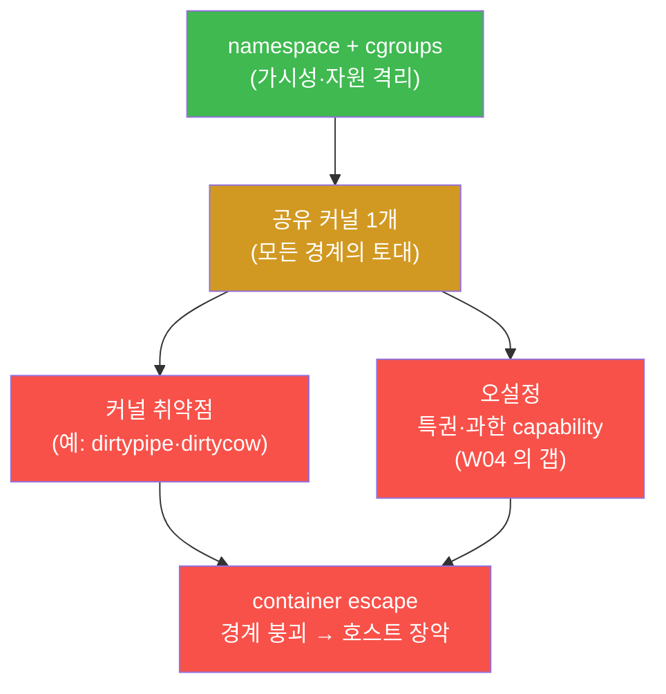
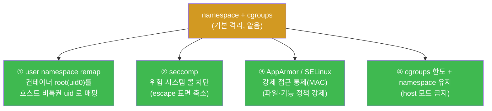
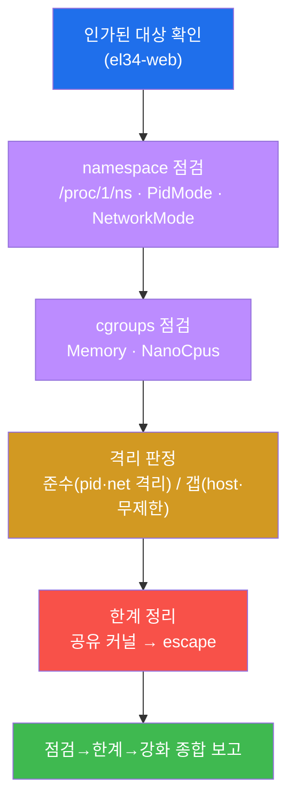
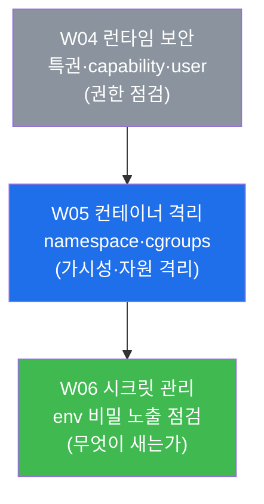

# 클라우드·컨테이너 W05 — 컨테이너 격리 (Namespace·Cgroups)

> **본 주차의 한 줄 요약**
>
> W04 까지 학생은 컨테이너를 **어떤 권한으로 실행하는가**(특권·capability·root 실행)를 점검했다. 본
> 주차는 한 걸음 더 안으로 들어가, 컨테이너 격리를 **실제로 만들어 내는 두 커널 기능**을 들여다본다 —
> **namespace**(컨테이너가 "무엇을 볼 수 있는가"를 분리)와 **cgroups**(컨테이너가 "자원을 얼마나 쓸 수
> 있는가"를 제한). 컨테이너는 VM 처럼 커널을 따로 갖는 것이 아니라, **호스트의 단 하나의 커널 위에
> 이 두 기능으로 소프트웨어 경계를 그은** 것일 뿐이다(W01 의 공유 커널). 학생은 el34 의 실제 컨테이너
> `el34-web` 을 대상으로 `/proc/1/ns/` 의 namespace 목록을 읽고, pid namespace(프로세스 가시성 격리)와
> net namespace(네트워크 격리, `el34-dmz`)가 살아 있음을 확인하며, cgroups 의 메모리·CPU 한도를
> 점검한다. 마지막으로 이 격리가 왜 **근본적으로 얕은가**(공유 커널 → escape)와, 그 얕음을 메우는
> 커널 보안 모듈(user namespace remap · seccomp · AppArmor/SELinux)을 정리한다.
>
> **점검자 한 줄 결론**: 컨테이너 격리는 "있다/없다"의 이분법이 아니라, **namespace(가시성)와
> cgroups(자원)라는 두 축이 각각 켜져 있는가, 어디까지 격리하는가, 그리고 그 경계가 공유 커널 위에
> 그어졌다는 근본 한계를 무엇으로 보강했는가**를 증적과 함께 밝히는 일이다.

---

## 학습 목표

본 주차 종료 시 학생은 다음 6 가지를 **본인 손으로** 할 수 있어야 한다.

1. 컨테이너 격리가 **namespace(가시성 분리)** 와 **cgroups(자원 제한)** 라는 두 커널 기능으로 이루어짐을
   설명하고, 이 둘이 호스트의 **하나의 커널 위에 그은 소프트웨어 경계**임을 W01 의 공유 커널과 연결해
   말한다.
2. `docker exec el34-web ... ls /proc/1/ns/` 로 컨테이너 PID 1 이 속한 **namespace 목록**(pid·net·mnt·
   ipc·uts·user 등)을 읽고, 각 namespace 가 어떤 가시성을 격리하는지 항목별로 설명한다.
3. **pid namespace 격리**를 `docker inspect` 의 `PidMode` 로 점검해, `PidMode=[]`(빈 값)이 곧 **자체 pid
   namespace = 격리(준수)** 이고 `host` 면 호스트 프로세스가 노출되는 갭임을 판정한다.
4. **net namespace 격리**를 `NetworkMode` 로 점검해, el34-web 이 커스텀 네트워크 `el34-dmz` 에 격리되어
   있음(`compliant=isolated_net`)을 확인하고, `host` 모드가 왜 네트워크 격리를 없애는 갭인지 설명한다.
5. **cgroups 자원 한도**(`HostConfig.Memory`·`NanoCpus`)를 점검해, 한도 `0`(무제한)이 **자원 고갈 DoS**
   위험(갭)임을 판정하고, `--memory`/`--cpus` 한도가 왜 격리의 일부인지 설명한다.
6. namespace/cgroups 격리의 **근본 한계**(공유 커널 → escape)를 설명하고, 그 한계를 보강하는 커널 보안
   모듈(**user namespace remap · seccomp · AppArmor/SELinux**)을 다층 방어로 정리해, 점검(namespace·
   cgroups) → 한계 → 강화의 한 흐름을 격리 보고서로 종합한다.

> **점검자의 시선** — 본 주차는 컨테이너를 "격리하는" 주가 아니라, 이미 돌고 있는 컨테이너의 격리가
> **무엇으로(namespace·cgroups) 어디까지 그어져 있는가**를 점검자(auditor)의 눈으로 확인하는 주다.
> 채점은 "격리가 된다/안 된다"는 막연한 선언이 아니라, **어느 namespace 가 살아 있고(pid·net),
> 자원 한도가 설정돼 있는가(cgroups), 그리고 공유 커널이라는 근본 한계를 무엇으로 메웠는가**를 설정
> 출력으로 보였는가를 본다. 핵심 산출물은 el34-web 의 `PidMode=[]`(pid 격리 준수)·`compliant=
> isolated_net`(net 격리 준수) 확인과, 그것을 공유 커널 한계·강화 방어 맥락에 자리매김한 격리 보고서다.

---

## 0. 용어 해설 (컨테이너 격리)

본 주차에 처음 등장하거나 특히 중요한 용어를 먼저 정리한다. 한 줄 정의로는 부족한 핵심어는 다음
절(0.5)에서 일상 비유로 다시 풀어 설명한다. 본문(§1~§7)에서 같은 용어가 다시 나올 때 막히면 이 표로
돌아오면 흐름이 끊기지 않는다.

| 용어 | 영문 | 뜻 | 비유 |
|------|------|----|------|
| **격리** | isolation | 한 컨테이너가 다른 컨테이너·호스트를 보거나 영향 주지 못하게 막는 경계 | 사무실 사이 칸막이 |
| **namespace** | namespace | 프로세스가 **무엇을 볼 수 있는가**(프로세스·네트워크·파일시스템 등)를 분리하는 커널 기능 | 칸막이 — 옆 사무실이 안 보임 |
| **cgroups** | control groups | 프로세스 그룹이 **자원을 얼마나 쓸 수 있는가**(메모리·CPU 등)를 제한하는 커널 기능 | 사무실별 전기·수도 사용량 상한 |
| **pid namespace** | PID namespace | 프로세스 목록(PID)을 분리 — 컨테이너는 자기 프로세스만 본다 | 우리 사무실 직원 명부만 보임 |
| **net namespace** | network namespace | 네트워크(IP·인터페이스·라우팅)를 분리 — 컨테이너는 자체 네트워크를 가진다 | 사무실 전용 전화 회선 |
| **mnt namespace** | mount namespace | 파일시스템 마운트(보이는 디렉터리 트리)를 분리 | 우리 사무실 캐비닛만 보임 |
| **ipc namespace** | IPC namespace | 프로세스 간 통신(공유 메모리·세마포어)을 분리 | 사무실 내부 인터폰망 |
| **uts namespace** | UTS namespace | 호스트명(hostname)·도메인명을 분리 | 사무실 문패(이름) |
| **user namespace** | user namespace | uid/gid 매핑을 분리 — 컨테이너 root 를 호스트 비특권 사용자로 매핑 가능 | 사무실 안 직급≠건물 직급 |
| **PidMode** | — | `docker inspect` 가 보여주는 pid namespace 설정(빈 값=격리, `host`=공유) | 명부를 따로 쓰나 공용을 쓰나 |
| **NetworkMode** | — | 컨테이너의 네트워크 모드(`host`=공유, 커스텀/bridge=격리) | 공용 회선이냐 전용 회선이냐 |
| **공유 커널** | shared kernel | 모든 컨테이너가 호스트의 **하나의 커널**을 함께 사용 | 모든 사무실이 같은 설비실 공유 |
| **컨테이너 탈출** | container escape | 격리 경계를 깨고 호스트(또는 다른 컨테이너)로 빠져나가는 공격 | 칸막이를 부수고 설비실로 |
| **자원 고갈 DoS** | resource exhaustion DoS | 한 컨테이너가 자원을 독식해 호스트·이웃 컨테이너를 마비시키는 공격 | 한 사무실이 전기를 다 써 정전 |
| **seccomp** | secure computing mode | 프로세스가 호출할 수 있는 **시스템 콜을 제한**하는 커널 기능 | 설비실에 걸 수 있는 요청 종류 제한 |
| **AppArmor / SELinux** | — | 파일·기능 접근을 정책으로 강제하는 **강제 접근 통제(MAC)** | 출입증으로 들어갈 문을 강제 지정 |

---

## 0.5 신입생 친화 핵심 용어 개념 설명

위 표는 한 줄 정의에 그치므로, 컨테이너 격리를 처음 깊이 다루는 학생이 헷갈리기 쉬운 핵심 용어를
일상 비유와 함께 풀어 설명한다.

### 0.5.1 namespace — 칸막이가 "시야"를 가른다

W01 에서 컨테이너를 **한 건물 안의 칸막이 사무실**에 비유했다. 그 "칸막이"의 정체가 바로
**namespace** 다. namespace 는 한 프로세스(컨테이너)가 **무엇을 볼 수 있는가**를 가르는 커널 기능이다.

같은 건물(호스트 커널) 안에 있어도, 칸막이(namespace)가 있으면 옆 사무실(다른 컨테이너)의 직원
명부도, 전화 회선도, 캐비닛도 보이지 않는다. 컨테이너 안에서 `ps` 를 쳐도 **자기 사무실 직원(자기
프로세스)만** 보이고, 호스트나 옆 컨테이너의 프로세스는 보이지 않는다. 이것이 pid namespace 의
효과다. 마찬가지로 net namespace 는 전화 회선(IP·네트워크)을, mnt namespace 는 캐비닛(파일시스템)을
사무실마다 따로 둔다.

핵심은 namespace 가 **"권한"이 아니라 "시야"를 가른다**는 점이다. W04 에서 본 특권·capability·root 가
"무엇을 **할 수 있는가**"(권한)였다면, namespace 는 "무엇을 **볼 수 있는가**"(가시성)다. 컨테이너
격리는 이 둘이 함께 작동해야 완성된다 — 못 보면 건드리기 어렵고, 권한이 좁으면 봐도 못 건드린다.

리눅스에는 여러 종류의 namespace 가 있고, 컨테이너는 보통 다음 6 종을 자체로 갖는다.

| namespace | 무엇을 분리하나 | 안 되면(host 공유) 무슨 일이 |
|-----------|-----------------|------------------------------|
| **pid** | 프로세스 목록(PID) | 컨테이너가 호스트의 모든 프로세스를 보고 신호를 보낼 수 있음 |
| **net** | 네트워크(IP·인터페이스·라우팅) | 컨테이너가 호스트 네트워크 스택을 그대로 씀(격리 없음) |
| **mnt** | 파일시스템 마운트 | 컨테이너가 호스트의 디렉터리 트리를 봄 |
| **ipc** | 프로세스 간 통신(공유 메모리 등) | 컨테이너가 호스트/다른 컨테이너와 IPC 를 공유 |
| **uts** | 호스트명·도메인명 | 컨테이너가 호스트명을 바꾸면 호스트에 영향 |
| **user** | uid/gid 매핑 | (기본 미사용) 컨테이너 root 가 호스트 root 와 동일 |

이 표의 오른쪽 열이 본 주차 점검의 핵심이다 — **각 namespace 가 자체로 살아 있으면 격리(준수),
`host` 로 공유되면 그 경계가 사라진 갭**이다.

### 0.5.2 cgroups — 칸막이로는 막지 못하는 "자원 독식"을 막는다

namespace(칸막이)는 시야를 가르지만, **자원 사용량**은 막지 못한다. 칸막이가 아무리 촘촘해도, 한
사무실이 건물 전체의 전기를 다 끌어 쓰면 다른 사무실은 정전된다. 컨테이너도 마찬가지다 — namespace
로 시야를 격리해도, 한 컨테이너가 호스트의 메모리·CPU 를 전부 빨아들이면 같은 호스트의 다른 컨테이너
(el34 의 다른 40 컨테이너)가 마비된다. 이것이 **자원 고갈 DoS(resource exhaustion DoS)** 다.

**cgroups(control groups)** 는 바로 이 자원 사용량에 상한을 거는 커널 기능이다 — "이 사무실은 전기를
이 이상 못 쓴다"처럼, 컨테이너가 쓸 수 있는 메모리·CPU·디스크 I/O 등을 제한한다. 그래서 컨테이너
격리는 **두 기둥**으로 이해해야 한다.

- **namespace = 가시성 격리** ("무엇을 보나") — 칸막이.
- **cgroups = 자원 격리** ("얼마나 쓰나") — 사용량 상한.

이 둘 중 하나만 있으면 격리가 반쪽이다. namespace 만 있고 cgroups 한도가 없으면, 옆 사무실은 안 보여도
한 사무실이 자원을 독식해 건물을 마비시킬 수 있다. 그래서 본 주차는 namespace(미션 2~4)와 cgroups
(미션 5)를 **함께** 점검한다.

### 0.5.3 공유 커널 — 칸막이의 토대가 하나라는 근본 한계

W01 에서 강조한 **공유 커널(shared kernel)** 을 다시 짚는다. namespace 와 cgroups 는 모두 **호스트의
하나의 커널이 제공하는 기능**이다. 즉 컨테이너 격리는 **같은 설비실(커널) 안에 세운 칸막이**이지,
VM 처럼 건물(커널) 자체를 따로 지은 것이 아니다.

이 사실이 격리의 **근본 한계**를 만든다. 칸막이(namespace)와 사용량 상한(cgroups)이 아무리 잘
설정돼 있어도, 그 모두를 떠받치는 **설비실(커널) 자체에 결함**(커널 취약점)이 있거나, 누군가 설비실
열쇠(특권·과한 capability — W04 의 주제)를 손에 넣으면 칸막이는 무력화된다. 그 결과가 **컨테이너
탈출(container escape)** — 칸막이를 넘어 설비실(호스트)로, 나아가 건물 전체(다른 컨테이너)로 빠져
나가는 것이다.

그래서 본 주차의 결론은 이렇다 — **namespace·cgroups 는 격리의 필수 토대지만 충분하지 않다.** 공유
커널이라는 근본 한계를 메우려면 §6 의 커널 보안 모듈(user namespace · seccomp · AppArmor/SELinux)을
더해 **다층으로** 보강해야 한다.

### 0.5.4 seccomp 와 AppArmor/SELinux — 설비실로 보낼 수 있는 요청을 제한한다

공유 커널의 한계를 메우는 핵심 발상은 **"컨테이너가 커널에 보낼 수 있는 요청 자체를 좁히는 것"** 이다.
컨테이너 안의 프로세스는 결국 호스트 커널에 **시스템 콜(system call — 프로그램이 커널에 기능을 요청
하는 통로, 예: 파일 열기·프로세스 생성)** 을 보내 일을 한다. escape 공격도 결국 위험한 시스템 콜을
통해 일어난다.

- **seccomp(secure computing mode)** 는 프로세스가 호출할 수 있는 **시스템 콜의 종류를 제한**하는 커널
  기능이다. "이 컨테이너는 위험한 시스템 콜(예: 커널 모듈 적재, 새 네임스페이스 생성)을 아예 못
  부른다"고 못 박으면, escape 에 쓰일 통로 자체가 막힌다. 즉 **공격 표면을 시스템 콜 수준에서 축소**
  한다.
- **AppArmor / SELinux** 는 **강제 접근 통제(MAC, Mandatory Access Control)** 다. 보통의 리눅스 권한
  (소유자·그룹)과 별개로, 커널이 **정책 파일에 적힌 대로** "이 프로세스는 이 파일만 읽고, 이 기능만
  쓴다"를 강제한다. root 라도 정책을 벗어나면 막힌다. 출입증(정책)으로 들어갈 수 있는 문을 미리
  지정해 두는 셈이다.

이 둘은 §6 의 user namespace remap(컨테이너 root 를 호스트 비특권 사용자로 매핑)과 함께, 얕은
namespace/cgroups 격리 위에 덧대는 **추가 방어막**이다.

### 0.5.5 PidMode 와 NetworkMode — `docker inspect` 로 읽는 격리 설정

점검자는 namespace 격리가 살아 있는지를 컨테이너 안에 들어가지 않고도 `docker inspect` 의 두 필드로
바로 읽는다.

- **`HostConfig.PidMode`** — pid namespace 설정이다. **빈 값(`[]`)이면 컨테이너가 자체 pid namespace 를
  가진다(격리, 준수)**. 값이 `host` 면 `--pid=host` 로 실행돼 **호스트의 모든 프로세스가 컨테이너에
  노출**된다(격리 깨짐 = 갭).
- **`HostConfig.NetworkMode`** — net namespace 설정이다. 값이 `host` 면 `--net=host` 로 **호스트 네트워크
  스택을 그대로 공유**해 net 격리가 없다(갭). 커스텀 네트워크 이름(el34-web 의 경우 **`el34-dmz`**)이나
  기본 `bridge` 면 컨테이너가 **자체 net namespace** 를 가진다(격리, 준수).

이 두 출력값이 곧 격리 점검의 증적이다 — "격리돼 보인다"가 아니라 **`PidMode=[]` → 자체 pid
namespace → 격리(준수)**, **`NetworkMode=el34-dmz` → 자체 net namespace → `compliant=isolated_net`**
의 형태로 설정값을 근거로 판정한다.

---

## 1. 격리는 어떻게 "만들어지는가" — W04 권한에서 W05 메커니즘으로

### 1.1 한 줄 답: namespace(가시성) + cgroups(자원)가 격리의 두 기둥이다

W01~W04 의 흐름을 짚자. W01 에서 학생은 컨테이너가 **공유 커널** 위에 격리된 프로세스라는 개론을
배웠고, W04 에서는 컨테이너를 **어떤 권한으로 실행하는가**(특권·capability·root)를 점검했다. 그러나
아직 답하지 않은 질문이 하나 있다 — **그 격리는 도대체 무엇으로 만들어지는가?**

답은 리눅스 커널의 두 기능이다. **namespace** 가 컨테이너의 **시야**(무엇을 보나)를 가르고,
**cgroups** 가 컨테이너의 **자원**(얼마나 쓰나)을 제한한다. 이 둘이 호스트 커널 위에 그어진
소프트웨어 경계가 곧 "컨테이너 격리"의 실체다.



위 그림의 핵심은 맨 아래다 — 격리(초록)는 두 기둥(파랑)으로 세워지지만, 그 모두가 **하나의 호스트
커널(빨강)** 위에 얹혀 있어 근본 한계(주황)를 안고 있다. 본 주차는 이 두 기둥을 점검하고(§2~§5), 그
근본 한계와 보강(§6)을 정리하는 순서로 간다.

### 1.2 권한(W04) vs 가시성(W05) — 무엇이 다른가

W04 와 W05 는 둘 다 "컨테이너 격리"를 다루지만 보는 축이 다르다. 이 차이를 분명히 해야 두 주차가
어떻게 맞물리는지 이해된다.

| 보는 축 | W04 (권한) | W05 (격리 메커니즘) |
|---------|-----------|---------------------|
| 질문 | 컨테이너가 무엇을 **할 수 있는가** | 컨테이너가 무엇을 **보고**, 자원을 **얼마나 쓰는가** |
| 대상 | 특권(Privileged)·capability·실행 사용자(User) | namespace(pid/net/mnt 등)·cgroups |
| 갭의 예 | root 실행·`CAP_NET_ADMIN` 추가 | `--pid=host`·`--net=host`·메모리 무제한 |
| 점검 필드 | `Privileged`·`CapAdd`·`User` | `PidMode`·`NetworkMode`·`Memory`·`NanoCpus` |

두 축은 독립이 아니라 맞물린다. 예컨대 W04 에서 본 **과한 권한**(특권·`CAP_SYS_ADMIN`)은 본 주차에서
보는 **namespace 격리**를 깨뜨리는 열쇠가 된다 — 권한이 충분하면 칸막이를 부수고 나갈 수 있기
때문이다. 그래서 견고한 격리는 **가시성(namespace)·자원(cgroups)·권한(W04)** 을 모두 좁혀야 완성된다.

### 1.3 한계 — 격리 점검은 "설정"을 보는 것이지 "안전 증명"이 아니다

본 주차의 점검은 `docker inspect`·`/proc/1/ns/` 로 **격리가 어떻게 설정돼 있는가**를 읽는 일이다.
그러나 namespace 가 다 살아 있고 cgroups 한도가 걸려 있어도, 그것이 "이 컨테이너는 절대 탈출당하지
않는다"를 뜻하지는 않는다 — 공유 커널의 0-day 취약점이나 W04 의 과한 권한이 남아 있으면 격리는 여전히
깨질 수 있다(§5·§6). 즉 격리 점검은 **필요한 통제가 켜져 있는지**를 확인하는 것이고, 완전한 안전은
§6 의 추가 보강과 다른 주차의 통제(이미지 스캔 W03·런타임 권한 W04·시크릿 W06)와 함께 가야 이뤄진다.

---

## 2. Namespace 목록 — 컨테이너의 격리 경계들

### 2.1 한 줄 정의와 왜 중요한가

**namespace** 는 프로세스가 **무엇을 볼 수 있는가**를 분리하는 커널 기능이며, 컨테이너는 보통 6 종
(pid·net·mnt·ipc·uts·user)을 자체로 갖는다(§0.5.1). 이것이 중요한 이유는, **컨테이너가 호스트와 다른
namespace 집합에 속해 있다는 사실 자체가 격리의 1 차 증거**이기 때문이다. 컨테이너의 PID 1(컨테이너
init 프로세스)이 어떤 namespace 들에 속해 있는지를 보면, 어느 경계가 그어져 있는지 한눈에 드러난다.

### 2.2 el34 에서 어떻게 — `/proc/1/ns/`

리눅스는 각 프로세스가 속한 namespace 들을 **`/proc/<PID>/ns/`** 디렉터리의 링크로 노출한다. 컨테이너
안에서 PID 1 은 컨테이너의 init 프로세스이므로, **`/proc/1/ns/`** 를 보면 그 컨테이너의 격리 경계
목록이 나온다. el34 호스트에서 다음과 같이 본다.

```bash
docker exec el34-web sh -c "ls /proc/1/ns/"; echo ns_listed
```

- `docker exec el34-web sh -c "..."` — el34-web 컨테이너 **안에서** 명령을 실행한다. 컨테이너 내부의
  `/proc/1/ns/` 를 봐야 그 컨테이너의 namespace 가 나오기 때문이다.
- `/proc/1/ns/` — PID 1 이 속한 namespace 들의 링크 모음. 출력에 `pid`·`net`·`mnt`·`ipc`·`uts`·`user`
  (+`cgroup`·`time` 등 커널 버전에 따라)가 나온다. **각 항목이 격리 경계 하나**다.

출력에 `pid net mnt ipc uts user ...` 같은 목록과 `ns_listed` 가 나오면, 컨테이너가 **여러 격리
경계를 자체로 갖고 있음**을 확인한 것이다. 이것이 미션 2 의 합격 신호다.



### 2.3 각 namespace 가 무엇을 격리하나

`/proc/1/ns/` 목록에 나오는 항목들이 각각 무엇을 분리하는지 정리한다(§0.5.1 표의 심화).

- **pid** — 프로세스 목록을 분리한다. 컨테이너 안의 `ps` 는 **자기 프로세스만** 본다. 호스트나 다른
  컨테이너의 프로세스는 보이지 않고, 그들에게 신호(kill)도 보낼 수 없다(§3 에서 점검).
- **net** — 네트워크 스택(IP·인터페이스·라우팅·포트)을 분리한다. 컨테이너는 **자체 IP·인터페이스**를
  가진다(§4 에서 점검, el34-web 은 `el34-dmz`).
- **mnt** — 마운트 지점(보이는 디렉터리 트리)을 분리한다. 컨테이너는 자기 루트 파일시스템만 보고,
  호스트의 디렉터리 트리는 보이지 않는다.
- **ipc** — 프로세스 간 통신 자원(System V IPC·POSIX 메시지 큐·공유 메모리)을 분리한다. 한 컨테이너의
  공유 메모리를 다른 컨테이너가 들여다보지 못한다.
- **uts** — 호스트명(hostname)·도메인명을 분리한다. 컨테이너가 자기 호스트명을 바꿔도 호스트에 영향이
  없다("UTS"는 UNIX Time-sharing System 의 약자로, 역사적으로 호스트명을 담던 구조에서 유래).
- **user** — uid/gid 매핑을 분리한다. 이것을 쓰면 컨테이너의 root(uid 0)를 호스트의 비특권 사용자로
  매핑할 수 있다(§6.2 의 핵심 강화). 다만 **el34 는 기본 구성이라 user namespace remap 을 쓰지 않으며**,
  그래서 컨테이너 root 가 호스트 root 와 사실상 동일하게 매핑된다 — 이것이 §6 에서 user namespace 를
  강화책으로 강조하는 이유다.

### 2.4 한계 — 목록이 있다고 모두 "격리됐다"는 아니다

`/proc/1/ns/` 에 항목이 보인다는 것은 그 namespace 종류가 **존재**한다는 뜻이지, 그것이 **호스트와
분리됐는지**까지 한 줄로 보장하지는 않는다. 예컨대 `--pid=host` 로 떠도 `/proc/1/ns/pid` 항목 자체는
보일 수 있으나, 그 pid namespace 가 호스트의 것과 **같을** 수 있다. 그래서 진짜 격리 판정은 다음
절들처럼 `docker inspect` 의 `PidMode`·`NetworkMode` 로 **호스트와 공유했는지**를 확인해야 한다. 본
미션은 "어떤 경계가 있는가"의 목록을 읽는 단계이고, "그 경계가 호스트와 분리됐는가"는 §3·§4 에서
판정한다.

---

## 3. PID Namespace 격리 — 컨테이너는 호스트 프로세스를 못 본다

### 3.1 한 줄 정의와 왜 중요한가

**pid namespace** 는 프로세스 목록(PID)을 분리해, 컨테이너 안에서는 **자기 프로세스만** 보이게 한다
(§0.5.1). 이것이 중요한 이유는, 만약 컨테이너가 호스트의 모든 프로세스를 볼 수 있다면(`--pid=host`),
침해된 컨테이너가 **호스트·이웃 컨테이너의 프로세스를 정찰하고 신호(kill)를 보내** 다른 워크로드를
방해하거나 정보를 빼낼 수 있기 때문이다. pid 격리는 그 가시성을 끊는다.

### 3.2 무엇을 점검하나 — `PidMode`

pid 격리 여부는 `docker inspect` 의 **`HostConfig.PidMode`** 로 읽는다(§0.5.5).

- **`PidMode=[]`(빈 값)** — 컨테이너가 **자체 pid namespace** 를 가진다. 자기 프로세스만 보인다(격리,
  준수).
- **`PidMode=host`** — `--pid=host` 로 실행돼 **호스트의 pid namespace 를 공유**한다. 호스트의 모든
  프로세스가 컨테이너에 노출된다(격리 깨짐 = 갭).

### 3.3 el34 에서 어떻게 — el34-web 은 pid 격리(준수)

el34-web 을 점검하면 **자체 pid namespace(격리)** 가 확인된다. 컨테이너 내부 프로세스 수와 `PidMode`
를 함께 본다.

```bash
echo -n "container_procs="; docker exec el34-web sh -c "ps -e 2>/dev/null | wc -l"
docker inspect el34-web --format 'PidMode=[{{.HostConfig.PidMode}}]'
```

- 첫 줄은 컨테이너 안에서 보이는 프로세스 수를 센다. el34-web 안에서는 **자기 프로세스 몇 개만** 보이며
  (호스트의 수백 개가 아니라), 이것이 pid 격리가 작동하는 정황 증거다.
- 둘째 줄은 `PidMode` 를 뽑는다. el34-web 은 **`PidMode=[]`**(대괄호 사이가 비어 있음)로 나온다 —
  즉 **자체 pid namespace = 격리(준수)** 다. 이것이 미션 3 의 합격 신호다.



### 3.4 한계 — pid 격리만으로 탈출을 막지는 못한다

pid namespace 가 살아 있어도, 그것은 "프로세스를 못 보게" 할 뿐이다. 공유 커널의 취약점이나 W04 의
과한 권한(특권·`CAP_SYS_PTRACE` 등)이 있으면, 격리를 깨고 호스트 프로세스에 접근하는 다른 경로가
남는다. 또 pid 격리는 net·mnt 등 다른 namespace 와 **함께** 봐야 한다 — 한 종류만 격리되고 다른
종류가 `host` 면 전체 격리는 그만큼 약해진다. el34-web 은 pid 가 격리됐으나, 다음 절에서 net 격리도
함께 확인한다.

---

## 4. Network Namespace — 컨테이너의 네트워크 격리

### 4.1 한 줄 정의와 왜 중요한가

**net namespace** 는 네트워크 스택(IP·인터페이스·라우팅·포트 공간)을 분리해, 컨테이너가 **자체
네트워크**를 갖게 한다(§0.5.1). 이것이 중요한 이유는, 만약 컨테이너가 호스트 네트워크를 그대로
쓰면(`--net=host`), 컨테이너의 서비스가 **호스트의 모든 인터페이스에 직접 바인딩**되고, 컨테이너가
호스트의 모든 포트·트래픽을 들여다볼 수 있어 **네트워크 단위 격리가 사라지기** 때문이다. el34 처럼
4-tier 망(ext/pipe/dmz/int)을 구획한 환경에서는, 컨테이너가 자기 네트워크에 묶여 있어야 망 구획이
의미를 갖는다.

### 4.2 무엇을 점검하나 — `NetworkMode`

net 격리 여부는 `docker inspect` 의 **`HostConfig.NetworkMode`** 로 읽는다(§0.5.5).

- **`NetworkMode=host`** — `--net=host` 로 **호스트 네트워크 스택을 공유**한다(격리 없음 = 갭).
- **커스텀 네트워크 이름**(el34-web 은 **`el34-dmz`**) 또는 기본 `bridge` — 컨테이너가 **자체 net
  namespace** 를 가지며, 도커 네트워크에 격리되어 붙는다(격리, 준수).

### 4.3 el34 에서 어떻게 — el34-web 은 `el34-dmz`(격리, 준수)

el34-web 은 dmz 망의 웹/WAF 컨테이너로, 커스텀 도커 네트워크 **`el34-dmz`** 에 붙어 있다. 다음 명령은
`NetworkMode` 를 출력하고, `host` 인지 아닌지로 판정까지 자동화한다.

```bash
docker inspect el34-web --format 'NetMode={{.HostConfig.NetworkMode}}'; N=$(docker inspect el34-web --format '{{.HostConfig.NetworkMode}}'); [ "$N" = "host" ] && echo "gap=host_network" || echo "compliant=isolated_net"
```

- 첫 부분은 `NetMode=el34-dmz` 처럼 네트워크 모드를 출력한다 — el34-web 은 커스텀 네트워크에 붙어 있다.
- 뒷부분은 `$N`(네트워크 모드)이 `host` 인지 검사한다. el34-web 은 `host` 가 **아니므로**,
  `else` 가지로 가서 **`compliant=isolated_net`**(격리됨, 준수)을 출력한다. 이것이 미션 4 의 합격
  신호다. 만약 어떤 컨테이너가 `host` 였다면 `gap=host_network`(네트워크 격리 없음 갭)가 나온다.

```mermaid
graph TD
    INSP["docker inspect<br/>NetworkMode 확인"]
    HOST["host 모드?<br/>(--net=host)"]
    GAP["gap=host_network<br/>호스트 네트워크 공유<br/>격리 없음"]
    OK["compliant=isolated_net<br/>el34-dmz 커스텀 네트워크<br/>자체 net namespace(격리)"]
    INSP --> HOST
    HOST -->|예| GAP
    HOST -->|아니오(el34-web)| OK
    style INSP fill:#1f6feb,color:#fff
    style HOST fill:#d29922,color:#fff
    style GAP fill:#f85149,color:#fff
    style OK fill:#3fb950,color:#fff
```

### 4.4 한계 — net namespace 격리와 망 정책은 별개다

net namespace 가 격리됐다는 것은 컨테이너가 **자체 네트워크 스택**을 가진다는 뜻이지, 그 컨테이너가
어디로 통신할 수 있는가(방화벽·세그먼트 정책)까지 정한 것은 아니다. el34-web 이 `el34-dmz` 에
격리돼 있어도, dmz↔int 통신 허용 범위는 별도의 방화벽·네트워크 정책으로 통제된다(secuops 트랙의
주제). 즉 net 격리는 **컨테이너에 자체 네트워크를 준다**는 토대이고, 그 위에서 무엇을 허용/차단할지는
별도 정책이다. 본 주차는 "자체 net namespace 를 갖는가"(격리 토대)를 점검한다.

---

## 5. Cgroups 자원 제한 — 자원 고갈 DoS 막기

### 5.1 한 줄 정의와 왜 중요한가

**cgroups(control groups)** 는 컨테이너가 쓸 수 있는 **자원(메모리·CPU 등)에 상한을 거는** 커널
기능이다(§0.5.2). 이것이 격리의 한 축인 이유는, namespace(가시성)만으로는 **자원 독식**을 막지 못하기
때문이다. 한도가 없으면 한 컨테이너가 호스트의 메모리·CPU 를 전부 빨아들여, 같은 호스트의 다른 40
컨테이너를 마비시키는 **자원 고갈 DoS(resource exhaustion DoS)** 가 가능하다. cgroups 한도는 이를
막는다.

### 5.2 무엇을 점검하나 — `Memory`·`NanoCpus`

cgroups 한도는 `docker inspect` 의 두 필드로 읽는다.

- **`HostConfig.Memory`** — 메모리 한도(바이트 단위). **`0` 이면 무제한**(한도 없음 = 갭). 양수면 그
  바이트만큼으로 제한된 것이다(예: `536870912` = 512MB).
- **`HostConfig.NanoCpus`** — CPU 한도(10억분의 1 CPU 단위, `--cpus` 가 설정한 값). `0` 이면 CPU
  무제한, 양수면 제한이다(예: `1000000000` = 1.0 CPU).

> **용어 — NanoCpus.** 도커가 CPU 한도를 저장하는 내부 단위로, `1.0` CPU 가 `1000000000`(10억)으로
> 표현된다. `--cpus=0.5` 로 띄우면 `NanoCpus=500000000` 이 된다. 직접 읽기는 큰 숫자지만, 0 이냐
> 양수냐만 봐도 "CPU 한도가 걸렸는가"를 판정할 수 있다.

### 5.3 el34 에서 어떻게 — 한도 점검과 판정

el34-web 의 자원 한도를 점검하고, 메모리 한도가 `0`(무제한)인지로 판정을 자동화한다.

```bash
docker inspect el34-web --format 'Memory={{.HostConfig.Memory}} NanoCpus={{.HostConfig.NanoCpus}}'; M=$(docker inspect el34-web --format '{{.HostConfig.Memory}}'); [ "$M" = "0" ] && echo "gap=no_mem_limit" || echo "compliant=mem_limited"
```

- 첫 부분은 `Memory=<바이트> NanoCpus=<값>` 형태로 두 한도를 함께 출력한다.
- 뒷부분은 메모리 한도 `$M` 이 `0` 인지 검사한다. **`0` 이면 `gap=no_mem_limit`**(메모리 무제한 =
  자원 고갈 DoS 위험, 갭), **양수면 `compliant=mem_limited`**(한도 설정됨, 준수)을 출력한다. 어느
  쪽이 나오든 출력에 `mem` 문자열이 포함되며, 이것이 미션 5 의 합격 신호다(점검을 수행했다는 증적).

판정의 핵심은 값 자체다 — "자원이 위험하다"가 아니라 **`Memory` 출력값(0 또는 바이트) → 무제한이면
DoS 위험 갭, 한도 있으면 준수**의 형태로 증적과 함께 보고한다. 운영 권고는 모든 컨테이너에 `--memory`/
`--cpus` 로 합리적 한도를 거는 것이다.

```mermaid
graph TD
    INSP["docker inspect<br/>Memory · NanoCpus 확인"]
    ZERO["Memory = 0?<br/>(무제한)"]
    GAP["gap=no_mem_limit<br/>한 컨테이너가 호스트<br/>메모리 독식 → DoS"]
    OK["compliant=mem_limited<br/>한도 설정됨<br/>자원 격리 작동"]
    INSP --> ZERO
    ZERO -->|예(무제한)| GAP
    ZERO -->|아니오(한도 있음)| OK
    style INSP fill:#1f6feb,color:#fff
    style ZERO fill:#d29922,color:#fff
    style GAP fill:#f85149,color:#fff
    style OK fill:#3fb950,color:#fff
```

### 5.4 한계 — 메모리·CPU 외에도 자원은 많다

본 점검은 가장 중요한 둘(메모리·CPU)을 본다. 그러나 완전한 자원 격리는 디스크 I/O(`--device-write-bps`),
PID 수(`--pids-limit` — fork 폭탄 방지), 파일 디스크립터, 네트워크 대역폭까지 함께 봐야 한다. 또
cgroups 한도는 **자원 고갈은 막아도 escape 는 막지 못한다** — cgroups 는 "얼마나 쓰나"를 제한할 뿐
"무엇을 할 수 있나"(권한)나 "커널 경계를 넘는가"(escape)와는 다른 축이다. 다음 절에서 그 근본 한계를
다룬다.

---

## 6. 격리의 한계와 강화 — 공유 커널을 무엇으로 메우나

### 6.1 격리의 근본 한계 — 공유 커널 위의 소프트웨어 경계

지금까지 본 namespace(§2~§4)와 cgroups(§5)는 모두 **호스트의 하나의 커널이 제공하는 기능**이다
(§0.5.3). 즉 컨테이너 격리는 VM 처럼 커널이 분리된 것이 아니라, **공유 커널 위에 그은 소프트웨어
경계**일 뿐이다. 여기서 격리의 근본 한계가 나온다.



el34 호스트에서는 이 한계를 한 줄로 정리한다.

```bash
echo "namespace/cgroups는 호스트 커널 위 소프트웨어 경계 → 커널 취약점/오설정 시 escape 가능"
```

이 문장의 핵심은 **escape** 다 — namespace/cgroups 가 아무리 잘 설정돼 있어도, 그 토대인 공유 커널이
취약하거나(예: `dirtypipe`·`dirtycow` 같은 커널 권한상승 취약점) 오설정(특권·과한 capability, W04)이
있으면 경계가 깨져 컨테이너가 호스트로 탈출한다. 출력에 `escape` 가 포함되는 것이 미션 6 의 합격
신호다.

> **용어 — dirtypipe / dirtycow.** 리눅스 커널에서 발견된 권한상승(LPE) 취약점의 예다. dirtycow
> (CVE-2016-5195)·dirtypipe(CVE-2022-0847)는 모두 **커널의 결함을 이용해 일반 사용자가 root 권한을
> 얻거나 임의 파일을 덮어쓰는** 취약점으로, 컨테이너 안에서 이런 커널 취약점을 찌르면 **공유 커널을
> 통해 호스트로 탈출**할 수 있다. 컨테이너 격리가 "공유 커널 위의 경계"라는 한계를 가장 잘 보여 주는
> 사례다.

### 6.2 격리 강화 — 커널 보안 모듈로 다층 보강

공유 커널의 한계를 100% 없앨 수는 없으므로(그러려면 VM 으로 가야 한다), 현실적 방어는 **얕은 격리
위에 커널 보안 모듈을 덧대 다층으로 보강**하는 것이다. 핵심 네 가지를 정리한다.



el34 호스트에서는 강화 방어를 한 줄로 정리한다.

```bash
echo "user namespace remap + seccomp(시스템콜 제한) + AppArmor/SELinux + cgroups 한도 + pid/net 격리 유지"
```

출력에 `seccomp` 가 포함되는 것이 미션 7 의 합격 신호다. 네 통제를 풀어 설명하면 다음과 같다.

- **① user namespace remap** — 컨테이너의 root(uid 0)를 **호스트의 비특권 사용자**(예: uid 100000)로
  매핑한다. 그러면 escape 가 일어나도 호스트에서는 비특권 사용자일 뿐이라 피해가 크게 준다. el34 는
  기본 구성이라 이 매핑을 쓰지 않으므로(§2.3 의 user namespace), 운영 강화에서 가장 먼저 권고되는
  통제다.
- **② seccomp** — 컨테이너가 호출할 수 있는 **시스템 콜의 종류를 제한**한다(§0.5.4). escape 에 쓰일
  위험한 시스템 콜(커널 모듈 적재 등)을 막아 공격 표면을 시스템 콜 수준에서 줄인다. 도커는 기본
  seccomp 프로파일을 제공하며, 더 좁은 커스텀 프로파일을 적용할 수 있다.
- **③ AppArmor / SELinux** — **강제 접근 통제(MAC)** 로, 정책 파일에 적힌 대로 프로세스의 파일·기능
  접근을 강제한다(§0.5.4). root 라도 정책을 벗어나면 막힌다.
- **④ cgroups 한도 + namespace 격리 유지** — §5 의 자원 한도를 걸고, pid/net 등 namespace 를
  **`host` 모드로 풀지 않는다**. 즉 본 주차에서 점검한 격리를 운영 내내 유지하는 것 자체가 방어다.

### 6.3 한계 — 강화도 만능은 아니며, 결국 다층이다

위 네 통제를 모두 적용해도 공유 커널의 0-day 취약점을 원천 차단하지는 못한다 — 그래서 정말 강한 격리가
필요하면 gVisor(사용자 공간 커널)·Kata Containers(경량 VM)처럼 **컨테이너에 VM 급 격리를 입히는
기술**을 쓴다(W01 §3.4 에서 언급). 또 강화 모듈도 설정해 두고 점검하지 않으면 시간이 지나며 표류한다.
핵심은 **단일 통제에 의존하지 않고 다층으로 쌓는 것**(namespace·cgroups + user ns + seccomp + MAC + 권한
최소화 W04)이며, 본 주차는 그 다층의 토대인 격리 메커니즘과 1차 강화를 다룬다.

---

## 7. 점검 명령 빠른 복습 — "무엇을 어디서 보나"

본 주차의 점검은 모두 el34 호스트(`ssh ccc@192.168.0.151`, 비밀번호 1)에서 `docker` CLI 로 수행하며,
신규 도구 설치는 없다(호스트의 `docker` CLI 만 사용). 각 명령이 무엇을 보여 주는지 한눈에 정리한다.

> **점검 경로.** el34 의 모든 컨테이너는 타깃 VM(192.168.0.151) 한 대 위에서 돈다. namespace 격리
> 설정(`PidMode`·`NetworkMode`)과 cgroups 한도(`Memory`·`NanoCpus`)는 `docker inspect` 로 호스트에서
> 바로 읽고, namespace **목록**(`/proc/1/ns/`)처럼 컨테이너 내부가 필요한 항목만 `docker exec
> el34-web` 으로 진입해 본다.

| 무엇을 | 명령 | 무엇을 보나 |
|--------|------|-------------|
| 대상 확인 | `docker inspect el34-web --format 'state={{.State.Status}}'` | el34-web 가동 여부(`target_ok`) |
| namespace 목록 | `docker exec el34-web sh -c "ls /proc/1/ns/"` | pid/net/mnt/ipc/uts/user = 격리 경계들(`ns_listed`) |
| pid 격리 | `docker inspect el34-web --format 'PidMode=[{{.HostConfig.PidMode}}]'` | `PidMode=[]`(빈 값) = 자체 pid namespace(격리) |
| net 격리 | `docker inspect el34-web --format 'NetMode={{.HostConfig.NetworkMode}}'` | `el34-dmz`(커스텀) = `compliant=isolated_net` |
| cgroups 한도 | `docker inspect el34-web --format 'Memory={{.HostConfig.Memory}} NanoCpus={{.HostConfig.NanoCpus}}'` | `0`=무제한 갭 / 양수=한도(준수) |
| 격리 한계 | (개념 정리) | 공유 커널 위 경계 → `escape` 가능 |
| 격리 강화 | (개념 정리) | user ns · `seccomp` · AppArmor/SELinux |

> **점검 관용구.** 미션 4·5 의 명령은 `[ "$N" = "host" ] && echo "gap=..." || echo "compliant=..."`
> 형태로 판정을 셸 한 줄로 자동화해 두었다. 학생은 출력에 `compliant=isolated_net`(net 격리 준수)·
> `mem`(cgroups 점검 수행)이 나오는지로 판정을 읽는다 — 이것이 "기준 + 현재(설정값) + 판정"의 증적이다.

---

## 8. 실습 안내 — lab 8 미션 (4 축 설명)

본 주차 lab 은 8 미션으로 구성되며, lab 의 `order` 와 1:1 로 대응한다. 각 미션을 **4 축**으로 설명한다
— 왜 하는가 / 무엇을 알 수 있는가 / 결과 해석(정상 vs 갭) / 실전 활용.

> **실습 진행 원칙.** 모든 명령은 el34 호스트(`ssh ccc@192.168.0.151`)에서 `docker` CLI 로 실행한다.
> 이번 주는 **신규 설치가 없고**, 점검 대상은 인가된 el34 컨테이너 `el34-web` 뿐이며 모두 **읽기 전용**
> 점검이다(컨테이너를 멈추거나 설정을 바꾸지 않는다). 합격 임계값은 0.7 이다.

### 미션 1 — 점검: 대상 확인 (10점)

> **왜 하는가?** 모든 격리 점검의 전제는 대상이 실제로 돌고 있고 조회 가능하다는 것이다. 본격 점검
> 전, el34-web 이 가동 중인지부터 확인한다.
>
> **무엇을 알 수 있는가?** `docker inspect` 의 `State.Status` 로 el34-web 의 가동 상태. 격리 점검의
> 대상이 살아 있고 조회 가능한지.
>
> **결과 해석.** 정상: 출력에 `target_ok` 가 나옴(대상 확인 성공). 비정상: 응답이 없으면 호스트 SSH·
> 컨테이너 상태(`docker ps`)·이름을 점검한다.
>
> **실전 활용.** 격리 점검 착수 시 첫 확인. 점검 대상 컨테이너가 실제 존재·조회 가능한지 검증하는
> 단계다.

### 미션 2 — Namespace 목록 (14점)

> **왜 하는가?** 컨테이너 격리의 1 차 증거는 "어떤 격리 경계가 있는가"다(§2). PID 1 의 namespace
> 목록을 읽어, 컨테이너가 호스트와 다른 namespace 집합을 가짐을 확인한다.
>
> **무엇을 알 수 있는가?** `/proc/1/ns/` 로 컨테이너 PID 1 이 속한 namespace 들(pid·net·mnt·ipc·uts·
> user 등). 각 항목이 격리 경계 하나다.
>
> **결과 해석.** 정상: 출력에 namespace 목록과 `ns_listed` 가 나옴(목록 확인 성공). 비정상: 빈 출력이면
> 컨테이너 이름·`docker exec` 권한을 재확인한다.
>
> **실전 활용.** 컨테이너 격리 점검의 기본기. "이 컨테이너에 어떤 경계가 그어져 있는가"를 한눈에
> 파악하는 출발점이다.

### 미션 3 — PID Namespace 격리 (12점)

> **왜 하는가?** pid 격리는 컨테이너가 호스트·이웃 프로세스를 못 보게 하는 핵심 경계다(§3). 침해된
> 컨테이너가 호스트 프로세스를 정찰·방해하지 못하게 막는다.
>
> **무엇을 알 수 있는가?** 컨테이너 내부 프로세스 수와 `PidMode`. el34-web 은 `PidMode=[]`(빈 값)으로
> 자체 pid namespace 를 가진다(격리, 준수).
>
> **결과 해석.** 정상: 출력에 `PidMode=[]`(빈 값)이 나옴 — 자체 pid namespace = 격리(준수). 비정상:
> `PidMode=host` 면 호스트 프로세스가 노출되는 갭이고, inspect 가 실패하면 컨테이너 이름·docker
> 권한을 점검한다.
>
> **실전 활용.** 런타임 격리 점검의 1 순위 항목 중 하나. "이 컨테이너가 호스트 프로세스를 보는가"를
> `docker inspect` 한 줄로 판정하는 표준 절차다.

### 미션 4 — 네트워크 Namespace (12점)

> **왜 하는가?** net 격리는 컨테이너가 자체 네트워크를 갖게 해, 호스트 네트워크 스택 공유(`--net=host`)
> 를 막는 경계다(§4). el34 의 망 구획(dmz 등)이 의미를 가지려면 컨테이너가 자기 네트워크에 묶여야 한다.
>
> **무엇을 알 수 있는가?** `NetworkMode`. el34-web 은 커스텀 네트워크 `el34-dmz` 에 붙어 자체 net
> namespace 를 가진다(격리, 준수).
>
> **결과 해석.** 정상: 출력에 `NetMode=el34-dmz` 와 `compliant=isolated_net` 이 나옴(net 격리 준수).
> 비정상: `NetworkMode=host` 면 `gap=host_network`(네트워크 격리 없음 갭)이 나온다.
>
> **실전 활용.** 컨테이너 네트워크 격리 점검의 표준 절차. `host` 모드 컨테이너를 가려내, 망 격리를
> 우회하는 설정을 찾는 근거가 된다.

### 미션 5 — Cgroups 자원 제한 (12점)

> **왜 하는가?** namespace(가시성)만으로는 자원 독식을 못 막는다(§5). cgroups 한도를 점검해 자원 고갈
> DoS 위험(메모리 무제한)을 가려낸다.
>
> **무엇을 알 수 있는가?** `Memory`·`NanoCpus` 한도. `0` 이면 무제한(자원 고갈 DoS 위험, 갭), 양수면
> 한도가 걸린 것(준수).
>
> **결과 해석.** 정상: 출력에 `Memory=`·`NanoCpus=` 와 판정(`mem` 포함: `gap=no_mem_limit` 또는
> `compliant=mem_limited`)이 나옴(점검 성공). 비정상: inspect 가 실패하면 컨테이너 이름·docker 권한을
> 점검한다.
>
> **실전 활용.** 자원 격리 점검의 핵심. 한도 없는 컨테이너를 찾아 `--memory`/`--cpus` 적용을 권고하는,
> DoS 예방의 기본 절차다.

### 미션 6 — 격리의 한계 (공유 커널) (10점)

> **왜 하는가?** namespace/cgroups 가 다 살아 있어도 격리는 근본적으로 얕다(§6.1). 그 이유(공유 커널)를
> 정리해야 다음 미션의 강화 방어로 자연스럽게 이어진다.
>
> **무엇을 알 수 있는가?** namespace/cgroups 가 공유 커널 위 소프트웨어 경계라는 점, 그래서 커널
> 취약점·오설정 시 escape 가 가능하다는 점.
>
> **결과 해석.** 정상: 출력에 `escape`(탈출)가 포함됨 — 한계의 핵심을 짚었다는 뜻. 비정상: escape
> 개념이 빠지면 §0.5.3·§6.1 을 다시 읽는다.
>
> **실전 활용.** 컨테이너 격리의 위험 평가 사고 틀. "격리됐으니 안전하다"는 오해를 막고, 추가 강화가
> 왜 필요한지 설명하는 근거가 된다.

### 미션 7 — 격리 강화 방어 (12점)

> **왜 하는가?** 한계를 알았으면 **무엇으로 메울지**가 따라와야 한다(§6.2). 공유 커널의 얕은 격리를
> 보강하는 커널 보안 모듈을 정리한다.
>
> **무엇을 알 수 있는가?** user namespace remap · seccomp · AppArmor/SELinux · cgroups 한도 + namespace
> 유지라는 다층 강화와, 각각이 escape 위험을 어떻게 줄이는지.
>
> **결과 해석.** 정상: 출력에 `seccomp` 가 포함됨 — 강화 방어를 정리했다는 뜻. 비정상: 핵심 통제가
> 빠지면 §6.2 의 다이어그램으로 돌아간다.
>
> **실전 활용.** 컨테이너 보안 강화(hardening) 표준의 골격. 새 컨테이너를 띄울 때 적용할 격리 강화
> 정책의 기준이 된다.

### 미션 8 — 격리 점검 보고서 (12점)

> **왜 하는가?** 점검의 산출물은 보고서다. 미션 1–7 을 점검(namespace·cgroups) → 한계(공유 커널) →
> 강화(user ns/seccomp/AppArmor)의 한 흐름으로 종합해야 격리 학습이 완성된다.
>
> **무엇을 알 수 있는가?** 전 미션을 한 문서로 묶는 법 — namespace(pid 격리·net 격리 `el34-dmz`)/
> cgroups 점검 + 공유 커널 한계 + 다층 강화. 준수(pid·net 격리)와 한계(공유 커널)를 함께 제시하는
> 균형 잡힌 보고.
>
> **결과 해석.** 정상: 보고서에 `namespace` + 한계 + 강화가 포함됨. 비정상: 한계나 강화가 빠지면
> 보고서 양식(미션 8 instruction)을 다시 채운다.
>
> **실전 활용.** 컨테이너 격리 점검 보고서의 표준 구조(점검 → 한계 → 강화 → 결론). 운영팀·심사에
> 제출하는 산출물이며, 다음 점검·다음 주 시크릿(W06)의 토대가 된다.

---

## 9. 점검 수칙 — 인가된 점검과 증적 중심

컨테이너 격리 점검도 **허가받은 대상에 대해서만** 한다. 다음 수칙을 지킨다.

- **인가된 대상만 점검한다.** el34 의 정해진 컨테이너(`el34-web`)만 점검하며, 같은 명령(`docker
  inspect`·`docker exec ... ls /proc/1/ns/`)을 그 밖의 어떤 시스템·컨테이너에도 함부로 시도하지
  않는다.
- **점검만, 변경은 하지 않는다.** 본 주차의 명령은 모두 **읽기 전용** 조회다(`docker inspect`,
  `docker exec ... ls`/`ps`/`wc`). 컨테이너를 멈추거나 namespace·cgroups 설정을 바꾸지 않는다 — 시정은
  운영팀의 변경관리로 한다.
- **증적 우선.** "격리돼 있다/없다"가 아니라 **기준 + 현재(설정 출력) + 판정**의 삼박자로 보고한다.
  `PidMode=[]`·`NetworkMode=el34-dmz`·`Memory=<값>` 같은 `docker inspect` 출력값 자체가 증적이다.



---

## 10. 핵심 정리 (1줄씩)

1. **격리의 두 기둥** — namespace(가시성: 무엇을 보나) + cgroups(자원: 얼마나 쓰나). 둘 다 호스트
   커널 위에 그은 소프트웨어 경계다.
2. **namespace 6 종** — pid·net·mnt·ipc·uts·user. `/proc/1/ns/` 로 컨테이너 PID 1 의 격리 경계 목록을
   읽는다.
3. **pid 격리** — `PidMode=[]`(빈 값)이면 자체 pid namespace(격리, 준수). `host` 면 호스트 프로세스
   노출(갭). el34-web 은 준수.
4. **net 격리** — `NetworkMode=el34-dmz`(커스텀 네트워크)면 자체 net namespace(`compliant=isolated_net`,
   준수). `host` 면 격리 없음(갭). el34-web 은 준수.
5. **cgroups 한도** — `Memory=0`(무제한)이면 자원 고갈 DoS 위험(갭). 양수면 한도(준수). `--memory`/
   `--cpus` 권고.
6. **근본 한계와 강화** — 공유 커널 위 경계라 escape 가능. user namespace remap + seccomp + AppArmor/
   SELinux + cgroups 한도로 다층 보강한다.

---

## 11. 다음 주차 (W06) 예고 — 컨테이너 시크릿 관리

본 주차(W05)는 컨테이너 격리의 **메커니즘**(namespace·cgroups)과 그 한계·강화를 다뤘다. 격리가
"무엇을 보고, 얼마나 쓰는가"의 경계였다면, W06 은 그 컨테이너 안에 **무엇이 들어 있으면 안 되는가** —
특히 **비밀(secret)** 로 넘어간다.



W06 에서는 컨테이너의 **환경 변수(env)에 박힌 비밀**(비밀번호·API 키·토큰)을 `docker inspect` 로
찾아낸다 — el34-web 의 env 에 노출된 `SSH_PASS` 가 그 점검 대상이다. 본 주차에서 익힌 `docker inspect`
로 컨테이너 설정을 읽는 기술이, W06 의 `docker inspect ... .Config.Env` 로 자연스럽게 이어진다. 격리로
컨테이너를 가두었어도(W05), 그 안에 비밀을 평문으로 두면(W06) 침해 시 그대로 새어 나가기 때문이다 —
격리와 시크릿 위생은 함께 가야 컨테이너가 안전해진다.
