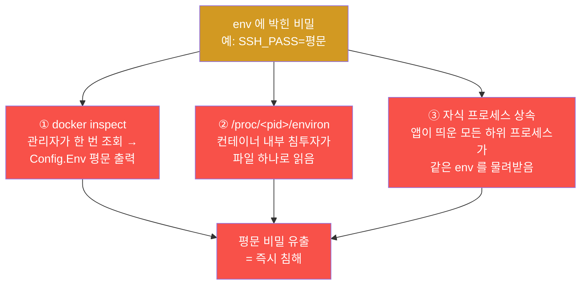
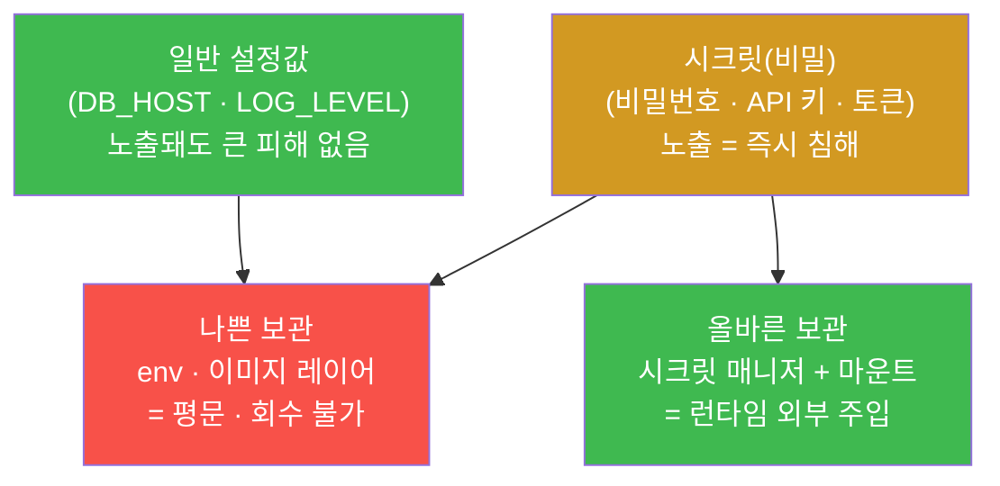
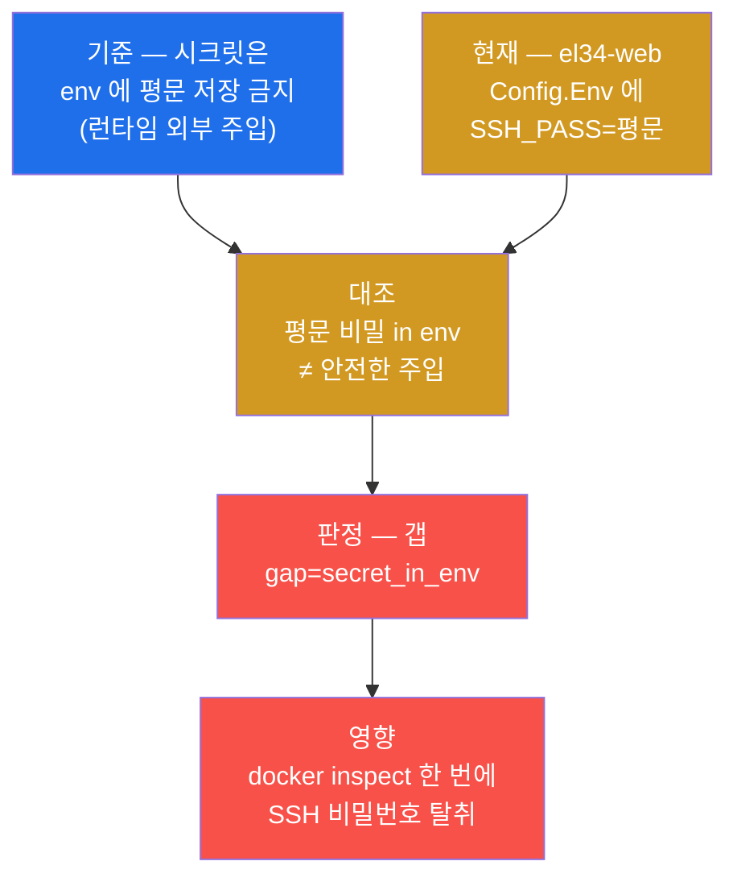
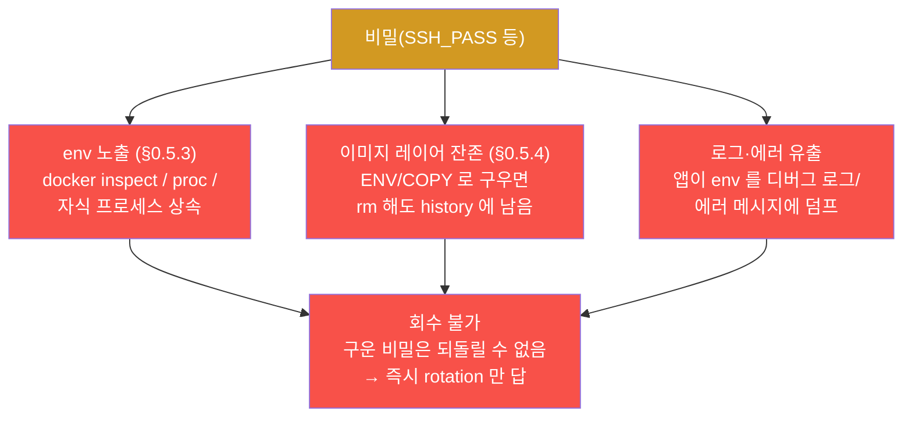
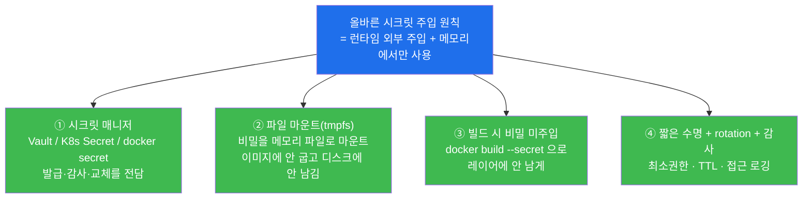
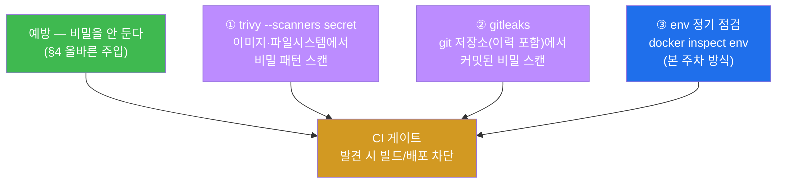
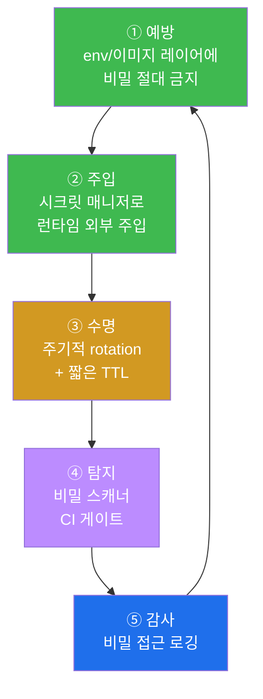
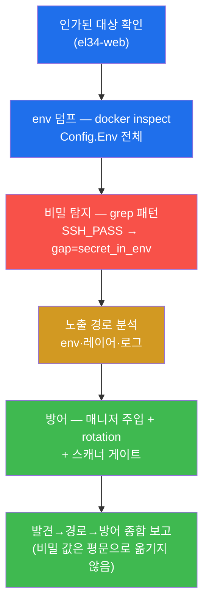
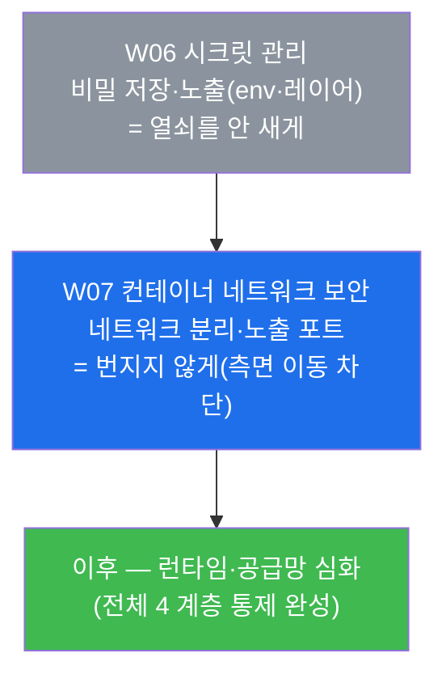

# 클라우드·컨테이너 W06 — 컨테이너 시크릿 관리 (환경변수 비밀 노출)

> **본 주차의 한 줄 요약**
>
> 컨테이너 안에서 돌아가는 앱은 데이터베이스 암호·API 키·SSH 비밀번호 같은 **비밀(secret)** 을
> 어디선가 받아 와야 한다. 문제는 그 비밀을 **어디에 두느냐**다. 가장 흔하면서 가장 나쁜 선택이
> **환경변수(env)** 에 박아 두는 것이다 — env 는 `docker inspect` 한 번, `/proc/<pid>/environ`
> 파일 하나, 자식 프로세스 상속 등 **여러 경로로 평문이 새어 나오기** 때문이다. 본 주차에 학생은 el34
> 호스트(`ssh ccc@192.168.0.151`)에서 `docker inspect` 로 `el34-web` 의 환경변수를 직접 덤프해, 거기
> **`SSH_PASS` 라는 비밀번호가 평문으로 박혀 있는 갭**(`gap=secret_in_env`)을 본인 손으로 찾아낸다.
> 그다음 왜 env·이미지 레이어에 비밀을 두면 회수가 불가능한지(노출 경로)를 정리하고, 올바른 시크릿
> 주입(시크릿 매니저·tmpfs 마운트·런타임 외부 주입)과 비밀 스캐너(trivy/gitleaks)·rotation 까지 방어를
> 종합한다.
>
> **시크릿 점검자의 한 줄 결론**: 시크릿 관리는 "비밀을 암호화했는가"를 막연히 묻는 일이 아니라,
> **"비밀이 어디에 저장되어(env·이미지·파일) → 어떤 경로로 새며(inspect·proc·레이어·로그) → 노출을
> 어떻게 증명하고(평문 덤프) → 올바른 주입(매니저·마운트)과 rotation 으로 어떻게 막는가"** 를 증거와
> 함께 밝히는 일이다. 핵심 명제는 단 하나 — **비밀은 이미지/env 에 '굽지(bake)' 말고, 런타임에 외부에서
> 주입해 메모리에서만 쓴다.**

---

## 학습 목표

본 주차 종료 시 학생은 다음 6 가지를 **본인 손으로** 할 수 있어야 한다.

1. **시크릿(비밀)** 이 무엇인지(비밀번호·API 키·토큰·인증서처럼 노출 즉시 침해로 이어지는 값) 정의하고,
   왜 시크릿 관리가 컨테이너 보안의 독립된 주제인지를 근거와 함께 설명한다.
2. `docker inspect` 로 `el34-web` 의 **환경변수(env) 전체를 덤프**하고, 변수명 패턴(pass/secret/key/
   token)으로 비밀 후보를 걸러내 **`SSH_PASS` 평문 노출 갭**(`gap=secret_in_env`)을 증적과 함께 판정한다.
3. env 에 둔 비밀이 **`docker inspect`·`/proc/<pid>/environ`·자식 프로세스 상속** 으로 새는 경로를
   설명하고, env 가 왜 비밀을 두기에 가장 나쁜 곳 중 하나인지를 본인 말로 말한다.
4. **이미지 레이어에 구운 비밀**이 `rm` 으로 지워도 이전 레이어(`docker history`)에 잔존해 **회수가
   불가능**함을 설명하고, env·레이어·로그라는 세 노출 경로를 한 흐름으로 정리한다.
5. **올바른 시크릿 주입**(시크릿 매니저 — Vault / Kubernetes Secret / docker secret, tmpfs 파일 마운트,
   빌드 시 비밀 미주입)을 각각 "무엇을 왜 막는가"로 구분해 설명하고, **rotation(주기적 교체)** 과 접근
   감사의 필요성을 말한다.
6. **비밀 자동 탐지**(이미지 스캐너 trivy 의 secret 스캔 · 리포지토리 스캐너 gitleaks · CI 게이트)를
   예방(안 두기)·탐지(이중 안전망)의 관점으로 정리하고, 발견·노출 경로·방어를 **시크릿 관리 보고서**
   한 장으로 종합한다.

> **점검자의 시선** — 본 주차는 비밀을 "만드는" 주가 아니라, 이미 돌고 있는 컨테이너의 비밀이 **어디서
> 새는지를 점검자(auditor)의 눈으로 들여다보는** 주차다. 채점은 "위험하다"는 막연한 선언이 아니라,
> **env 에 평문 비밀이 있다는 설정 출력(증적) → 노출 경로 설명 → 올바른 주입·rotation 방어** 의 삼박자로
> 본다. 핵심 산출물은 `el34-web` env 의 **`SSH_PASS` 평문 노출 발견**(미션 3, `gap=secret_in_env`)과,
> 그것을 노출 경로·시크릿 매니저·rotation 맥락에 자리매김한 시크릿 관리 보고서다.

---

## 0. 용어 해설 (시크릿 관리 입문)

본 주차에 처음 등장하거나 특히 중요한 용어를 먼저 정리한다. 한 줄 정의로 부족한 핵심어는 다음 절(0.5)
에서 일상 비유로 다시 풀어 설명한다. 본문에서 같은 용어가 다시 나올 때 막히면 이 표로 돌아오면 흐름이
끊기지 않는다.

| 용어 | 영문 | 뜻 | 비유 |
|------|------|----|------|
| **시크릿 / 비밀** | secret | 노출되면 즉시 침해로 이어지는 값(비밀번호·API 키·토큰·인증서 개인키) | 금고 안의 현금·집 열쇠 |
| **환경변수** | environment variable (env) | 프로세스에 전달되는 `이름=값` 형태의 설정값(예: `DB_HOST=...`) | 직원 책상에 붙인 메모지 |
| **평문** | plaintext / cleartext | 암호화되지 않은 채 그대로 읽히는 값 | 봉투 없이 그대로 보이는 쪽지 |
| **docker inspect** | — | 컨테이너의 모든 설정(env·권한·마운트 등)을 JSON 으로 출력하는 명령 | 사무실 임대 계약서 전문 열람 |
| **/proc/\<pid\>/environ** | — | 실행 중 프로세스의 환경변수를 담은 리눅스 가상 파일 | 직원이 들고 있는 메모지 사본 |
| **이미지 레이어** | image layer | Dockerfile 명령 한 줄이 만든 변경분 한 겹(불변·영구 보존) | 양파의 한 켜 |
| **docker history** | — | 이미지가 어떤 명령으로 어떤 레이어를 쌓았는지 보여주는 명령 | 건물의 시공 일지 |
| **시크릿 매니저** | secret manager | 비밀을 안전하게 보관·발급·교체·감사하는 전용 시스템 | 은행 대여금고 + 출납 기록 |
| **HashiCorp Vault** | Vault | 대표적 시크릿 매니저(동적 발급·짧은 수명·감사 로깅) | 신원 확인 후 빌려주는 금고 |
| **Kubernetes Secret** | K8s Secret | 쿠버네티스가 비밀을 별도 객체로 관리·주입하는 리소스 | 본사가 지점에 보내는 봉인 서류 |
| **docker secret** | — | docker swarm 이 비밀을 파일로 안전하게 주입하는 기능 | 손에서 손으로 건네는 봉인 봉투 |
| **tmpfs 마운트** | tmpfs mount | 디스크가 아닌 **메모리**에 올린 임시 파일시스템(전원 끄면 사라짐) | 칠판(쓰고 지우는 휘발성) |
| **rotation** | secret rotation | 비밀을 주기적으로 새 값으로 **교체**하는 것 | 자물쇠를 정기적으로 바꿔 다는 것 |
| **gitleaks** | — | 소스 코드 저장소(git)에서 비밀을 찾아내는 스캐너 | 서류함을 뒤져 유출 쪽지 찾기 |
| **trivy** | — | 이미지·파일시스템의 취약점과 **비밀**을 스캔하는 도구 | 짐 검색대(X-ray) |
| **CI 게이트** | CI gate | 빌드/배포 파이프라인에서 조건 위반 시 막는 자동 관문 | 통과 전 보안 검색대 |
| **최소권한** | least privilege | 필요한 최소한의 권한만 부여하는 보안 원칙 | 출입증에 꼭 필요한 층만 개방 |

> **헷갈리기 쉬운 한 쌍 — env(환경변수) vs 시크릿(비밀).** env 는 비밀을 "담는 그릇"일 뿐, 그 자체가
> 비밀은 아니다. `DB_HOST=db.internal` 처럼 비밀이 아닌 설정도 env 에 들어간다. 본 주차의 문제는
> **"비밀(SSH_PASS) 같은 값을 env 라는 새기 쉬운 그릇에 담았다"** 는 것이다. 즉 env 를 쓰지 말라는 게
> 아니라(설정은 env 가 적합하다), **비밀만큼은 env 에 두지 말라**는 것이 핵심이다.

---

## 0.5 신입생 친화 핵심 용어 개념 설명

위 표는 한 줄 정의에 그치므로, 시크릿 관리를 처음 다루는 학생이 헷갈리기 쉬운 핵심 용어를 일상 비유와
함께 풀어 설명한다. 본 절을 먼저 읽어두면 본문(§1~§6)에서 같은 용어가 다시 나올 때 흐름이 끊기지
않는다.

### 0.5.1 시크릿(비밀)이란 — 금고 안에 두어야 할 값

학생이 집을 관리한다고 하자. 집 안의 물건 중 대부분(가구·책·옷)은 누가 봐도 큰일이 나지 않는다. 그러나
**현금·집 열쇠·인감도장** 같은 것은 다르다 — 남이 보거나 가져가는 순간 곧장 피해로 이어진다. 그래서
이런 것만큼은 아무 데나 두지 않고 **금고**에 넣는다.

**시크릿(secret)** 이 바로 그 "금고에 둘 값"이다. 컴퓨터 시스템에서는 **비밀번호·API 키·토큰·인증서의
개인키** 가 여기 해당한다. 이들의 공통점은 **노출되는 즉시 침해로 직결**된다는 것이다. 예를 들어 DB
비밀번호가 새면 공격자가 데이터베이스에 곧장 접속하고, SSH 비밀번호가 새면 서버에 직접 로그인한다.
일반 설정값(서버 주소·포트 번호 등)과 달리, 시크릿은 **"한 번 새면 끝"** 이라는 점에서 특별한 취급이
필요하다 — 이것이 시크릿 관리를 따로 배우는 이유다.

### 0.5.2 환경변수(env)란 — 책상에 붙인 메모지

회사에서 직원(프로세스)이 일을 하려면 몇 가지 정보가 필요하다. "거래처 주소는 여기, 담당자 번호는
이것." 이런 정보를 **책상에 메모지로 붙여 두면** 직원은 언제든 보고 쓸 수 있어 편하다.

**환경변수(environment variable, 줄여서 env)** 가 바로 그 메모지다. `이름=값` 형태(예:
`DB_HOST=db.internal`, `LOG_LEVEL=info`)로 프로세스에 전달되는 설정값이며, 프로그램은 코드를 고치지
않고도 env 만 바꿔 동작을 조절할 수 있다. 컨테이너에서는 `docker run -e KEY=VALUE` 나 Dockerfile 의
`ENV`, compose 의 `environment:` 로 설정한다.

문제는 메모지의 본질이다 — **메모지는 누구나 지나가다 볼 수 있다.** env 는 편리한 만큼 **숨겨지지
않는다**. 거래처 주소(일반 설정)를 메모지에 붙이는 것은 괜찮지만, **금고 비밀번호(시크릿)를 책상 메모지에
붙여 두는 것**은 재앙이다. el34-web 이 바로 그렇게 SSH 비밀번호(`SSH_PASS`)를 env 메모지에 붙여 둔
상태다(§2, 미션 3).

### 0.5.3 env 가 새는 세 경로 — 메모지가 복사되는 길

책상에 붙인 메모지(env)는 한 곳에만 있는 게 아니다. 세 가지 길로 퍼진다.



- **① `docker inspect`** — 호스트에서 컨테이너를 조회할 수 있는 사람(운영자·CI 계정·침해된 관리자
  계정)이면 누구나 `Config.Env` 를 통째로 본다. **암호화 한 겹도 없이 평문**이다. el34-web 은 이 한
  명령으로 `SSH_PASS` 가 그대로 드러난다 — 본 주차 미션 2·3 이 정확히 이 경로다.
- **② `/proc/<pid>/environ`** — 리눅스는 실행 중인 모든 프로세스의 환경변수를 `/proc/<pid>/environ`
  이라는 가상 파일로 노출한다. 컨테이너 안에 발판을 얻은 공격자(예: 웹 취약점으로 셸을 딴 경우)는 이
  파일 하나를 읽어 env 비밀을 가져간다. 즉 env 비밀은 **컨테이너 내부 침투자에게도** 곧장 노출된다.
- **③ 자식 프로세스 상속** — env 는 부모에서 자식으로 **자동 상속**된다. 앱이 실행한 모든 하위 프로세스
  (예: 셸 스크립트, 외부 명령 호출)가 같은 비밀을 물려받으므로, 그중 하나만 로그를 남기거나 외부로
  값을 보내도 비밀이 샌다.

세 경로의 공통 교훈은 **"env 에 둔 비밀은 숨겨지지 않는다"** 는 것이다. 그래서 env 는 비밀을 두기에
**가장 나쁜 곳 중 하나**다.

### 0.5.4 이미지 레이어 잔존 — 지워도 시공 일지에 남는다

또 다른 흔한 실수는 비밀을 **이미지 안에 구워 넣는(bake)** 것이다. 비유하자면, 건물을 지을 때 벽 안에
금고 비밀번호 쪽지를 넣고 나중에 "빼면 되지" 하는 것과 같다. 그런데 컨테이너 이미지는 **시공 일지
(`docker history`)** 가 모든 공사 단계를 영구히 기록한다.

W02 에서 배운 대로, 이미지는 **레이어(layer)** — Dockerfile 명령 한 줄이 만든 변경분 한 겹 — 가 쌓여
만들어지며, 각 레이어는 **불변(immutable)** 으로 영구 보존된다. 그래서 다음과 같이 비밀을 넣었다가
지워도:

```dockerfile
COPY secret.env /app/secret.env   # ← 레이어 A: 비밀이 이미지에 들어옴
RUN load-secret.sh                #   레이어 B: 비밀로 무언가를 함
RUN rm /app/secret.env            # ← 레이어 C: 비밀을 "삭제"
```

레이어 C 의 `rm` 은 비밀 파일이 **보이지 않게 덮을 뿐**, 레이어 A 안에는 비밀이 **그대로 남아 있다**.
이미지를 받은 사람은 레이어 A 를 직접 꺼내 지워진 비밀을 복원할 수 있다. 즉 **이미지/env 에 한 번 구운
비밀은 나중에 지워도 회수가 불가능**하다. 이것이 본 주차 미션 4 의 핵심 — "구우면 회수 불가" — 이고,
"비밀은 런타임에 외부에서 주입하라"는 원칙(§4)의 직접적 근거다.

### 0.5.5 시크릿 매니저 — 은행 대여금고

집 금고도 좋지만, 정말 중요한 것은 은행 **대여금고**에 맡긴다. 은행은 (a) 신원을 확인하고 빌려주며
(b) 누가 언제 열었는지 기록하고 (c) 필요하면 잠금을 바꿔 준다. 비밀도 마찬가지다 — 앱마다 env 메모지에
흩어 두지 말고, **전용 시스템 하나가 발급·기록·교체를 책임지게** 하는 것이 안전하다.

**시크릿 매니저(secret manager)** 가 그 은행 대여금고다. 대표적으로 세 가지를 기억한다.

- **HashiCorp Vault** — 가장 널리 쓰이는 시크릿 매니저. 앱이 신원(토큰·인증서)을 제시하면 비밀을
  **그때그때 발급**하고, **짧은 수명(TTL)** 을 주어 시간이 지나면 자동 만료시키며, **누가 무엇을
  꺼냈는지 감사 로그**를 남긴다.
- **Kubernetes Secret** — 쿠버네티스 환경에서 비밀을 코드/이미지와 분리된 별도 객체로 관리하고,
  컨테이너에는 **파일이나 env 로 런타임에 주입**한다(이미지에 굽지 않는다).
- **docker secret** — docker swarm 의 기능으로, 비밀을 컨테이너 안의 `/run/secrets/` **파일**로 안전하게
  넣어 준다(역시 이미지에 안 굽고, env 도 거치지 않는다).

공통점은 **"비밀이 이미지·env 가 아니라 외부 금고에 있고, 런타임에 필요할 때만 꺼내 쓴다"** 는 것이다.

### 0.5.6 tmpfs 마운트와 rotation — 칠판과 자물쇠 교체

시크릿 매니저에서 꺼낸 비밀을 **어디에 두고 쓰느냐**도 중요하다. 비밀을 디스크 파일에 쓰면 그 디스크가
유출될 때 함께 샌다. 그래서 비밀은 **칠판** 같은 곳에 둔다 — 쓰고 나면 지워지고, 전원이 꺼지면 사라지는
휘발성 공간.

**tmpfs 마운트(tmpfs mount)** 가 그 칠판이다. tmpfs 는 디스크가 아니라 **메모리(RAM)** 에 올린 임시
파일시스템으로, 컨테이너가 멈추면 내용이 **흔적 없이 사라진다**. 비밀을 tmpfs 파일로 마운트하면 디스크에
기록되지 않아, 이미지 레이어 잔존(§0.5.4)이나 디스크 포렌식으로 새지 않는다.

**rotation(비밀 교체)** 은 자물쇠를 **정기적으로 바꿔 다는** 것이다. 아무리 잘 숨겨도 비밀은 시간이
지나며 샐 위험이 누적되므로, 주기적으로 새 값으로 갈아 끼워 **이미 샜을지 모를 옛 비밀을 무력화**한다.
특히 이번 주처럼 **이미 노출된 비밀(SSH_PASS)** 은 발견 즉시 rotation(교체)해야 한다 — 노출된 비밀은
"발견했으니 안전"이 아니라 "이미 샜다고 가정"하고 즉시 바꾸는 것이 원칙이다.

---

이 6 용어가 본 주차 본문의 기반이다. 본문에서 다시 등장할 때 막히면 본 절로 돌아오면 흐름이 끊기지
않는다.

---

## 1. 왜 시크릿 관리를 따로 배우는가

### 1.1 한 줄 답: 비밀은 노출되는 즉시 침해다

지금까지의 컨테이너 보안 주차(W01 런타임 권한 · W02 이미지 표면 · W05 격리)는 모두 **"뚫리기 어렵게"**
만드는 통제였다. 그런데 시크릿은 성격이 다르다. **비밀은 한 번 노출되면 그 순간 끝이다** — 공격자가
DB 암호를 손에 넣으면 더는 "뚫을" 필요가 없다. **정문 열쇠를 그냥 주운 것**과 같다. 그래서 시크릿
관리는 다른 통제와 별개의 독립 주제로 다룬다.



위 그림의 핵심은 오른쪽 두 갈래다. 같은 시크릿이라도 **어디에 두느냐**(나쁜 보관 vs 올바른 보관)에
따라 운명이 갈린다. 본 주차는 el34-web 에서 "나쁜 보관"(env 평문)을 실제로 찾아내고, "올바른 보관"
(매니저·마운트)으로 어떻게 옮기는지를 배운다.

### 1.2 실제 비밀 노출 사고 3건 (이 강의의 동기)

시크릿 관리를 따로 배우는 이유는 추상적 우려가 아니라, 실제로 반복된 사고 유형 때문이다.

| 사고 유형 | 원인 | 왜 일어났나 |
|-----------|------|-------------|
| **공개 이미지에 비밀 잔존** | Dockerfile 에 `ENV AWS_SECRET_KEY=...` 나 키 파일 `COPY` 후 `rm` → 레이어에 잔존한 채 공개 레지스트리에 푸시 | 비밀을 이미지에 구움 + 레이어 불변성 무지 |
| **소스 저장소에 비밀 커밋** | `.env`·키 파일을 실수로 git 에 커밋 → 공개 저장소에서 봇이 수 분 내 수집·악용 | 비밀과 코드를 분리하지 않음 + 스캐너(gitleaks) 게이트 부재 |
| **env 평문 노출로 측면 이동** | 한 컨테이너 침해 후 `docker inspect`/`/proc/environ` 으로 env 의 DB·SSH 비밀 탈취 → 옆 시스템으로 확산 | 비밀을 env 에 평문 저장(본 주차 el34-web 의 갭과 동일 유형) |

세 사고의 공통점은 **비밀을 "새기 쉬운 곳"(이미지·git·env)에 평문으로 두었다**는 것이다. 즉 시크릿
보안은 암호 알고리즘의 문제가 아니라 **"비밀을 어디에 두는가"** 의 문제이며, 본 주차는 그중에서도 가장
흔한 **env 평문 노출**을 el34 에서 직접 점검한다.

### 1.3 한계 — 시크릿 관리가 만능은 아니다

시크릿을 완벽히 관리해도 그것이 애플리케이션 취약점(SQLi·XSS)이나 잘못된 접근통제, 네트워크 방어를
대신하지는 못한다. 또한 시크릿 매니저(Vault 등)를 도입해도 **그 매니저에 접근하는 토큰** 자체가 또
하나의 비밀이므로, 결국 "최초 신뢰(root of trust)를 어떻게 안전하게 부트스트랩하는가"라는 문제가 남는다.
시크릿 관리는 비밀의 **저장·주입·수명**을 다루는 한 축이며, 다른 트랙의 통제와 **함께** 작동해야 전체
방어가 된다. 본 주차는 그 한 축, 특히 **env 노출 점검과 올바른 주입**에 집중한다.

---

## 2. 환경변수 비밀 노출 — el34-web 의 갭 찾기

### 2.1 한 줄 정의와 왜 중요한가

**환경변수 비밀 노출** 은 컨테이너의 env 에 비밀번호·키·토큰 같은 시크릿이 **평문으로 박혀 있는** 상태를
말한다. 이것이 본 주차의 가장 실전적인 점검이다 — §1 의 추상적 명제("비밀은 노출되면 끝")를 **실제
컨테이너의 구체적 env 값**으로 확인하기 때문이다. el34-web 을 점검하면 env 에 **`SSH_PASS`(SSH
비밀번호)가 평문으로 들어 있는 갭**이 드러난다.

### 2.2 무엇을 점검하나 — 두 단계

env 비밀 노출 점검은 두 단계로 한다.

- **① env 전체 덤프** — `docker inspect` 의 `Config.Env` 로 컨테이너에 설정된 환경변수를 모두 출력한다.
  비밀이 여기 박혀 있는 경우가 흔하므로, 먼저 전체를 펼쳐 본다.
- **② 비밀 후보 필터** — 덤프한 env 에서 **변수명 패턴**(`pass`/`secret`/`token`/`key`/`cred`)으로
  비밀로 보이는 항목만 걸러낸다. 자동 비밀 탐지의 가장 기본적인 방식이다.

> **용어 — `docker inspect --format` 과 Go 템플릿.** `docker inspect el34-web --format '{{range
> .Config.Env}}{{println .}}{{end}}'` 에서 `{{range .Config.Env}}...{{end}}` 는 컨테이너에 설정된 모든
> 환경변수를 **한 줄씩 출력**하는 Go 템플릿 표현이다. `Config.Env` 는 컨테이너의 환경변수 배열이며,
> 여기에 비밀이 들어 있으면 **암호화 한 겹 없이 평문으로** 그대로 나온다.

### 2.3 el34 에서 어떻게 — 갭 판정

el34-web 을 점검하면 **env 에 비밀(SSH_PASS)이 평문으로 노출된 갭**이 드러난다. 점검은 호스트에 SSH 로
들어가 `docker` CLI 로 한다(신규 설치 없음).

```bash
# ① env 전체 덤프
docker inspect el34-web --format '{{range .Config.Env}}{{println .}}{{end}}' | head

# ② 비밀 후보 필터 + 갭 판정
D=$(docker inspect el34-web --format '{{range .Config.Env}}{{println .}}{{end}}' | grep -ciE 'pass|secret|token|key|cred')
[ "$D" -gt 0 ] && echo "gap=secret_in_env" || echo "compliant=no_env_secret"
```

- ① 의 출력에는 `el34-web` 의 환경변수가 한 줄씩 나오며, 그 안에 **`SSH_PASS=<평문 비밀번호>`** 가
  포함된다. 즉 **`docker inspect` 단 한 번**으로 SSH 비밀번호가 그대로 드러난다.
- ② 는 변수명에 `pass`/`secret`/`token`/`key`/`cred` 가 든 줄의 개수(`$D`)를 세고, **1 개 이상이면
  `gap=secret_in_env`** 를 출력한다 — 즉 **env 에 비밀이 있다는 갭** 판정이다. el34-web 은 `SSH_PASS`
  때문에 이 판정이 참이 된다.

이 출력값이 곧 증적이다. "위험해 보인다"가 아니라 **`Config.Env` 에 `SSH_PASS` 평문이 있다는 출력 →
env 비밀 저장은 부적합 → 갭(`gap=secret_in_env`)** 의 삼박자(기준·현재·판정)로 보고한다.



### 2.4 한계

본 점검은 **변수명 패턴**(pass/key/token 등)으로 비밀 후보를 찾는다. 이는 빠르고 효과적이지만 완벽하지는
않다 — 변수명이 비밀처럼 안 보이는데(`DB_DSN`, `CONN_STRING`) 실제로는 비밀(접속 문자열에 암호 포함)인
경우, 또는 반대로 변수명에 `key` 가 들어가지만 비밀이 아닌 경우(`SORT_KEY=name`)가 있다. 정밀한 점검은
값(value)까지 보는 전용 비밀 스캐너(trivy secret·gitleaks, §5)와 사람의 검토가 필요하다. 본 주차는
패턴 점검으로 **명백한 노출(SSH_PASS)을 잡는** 데까지를 다루고, 자동 스캔은 §5 에서 보강한다.

---

## 3. 비밀이 새는 경로 — env 와 이미지 레이어

### 3.1 한 줄 정의와 왜 중요한가

**비밀 노출 경로** 란, env·이미지에 둔 비밀이 **실제로 어떤 통로로 공격자에게 도달하는가**이다. 이것을
정확히 아는 것이 중요한 이유는, "비밀을 env 에 두면 안 된다"를 막연한 금기가 아니라 **구체적 위협**으로
이해해야 올바른 방어(런타임 외부 주입)의 필요성을 납득하기 때문이다. 노출 경로는 크게 **env 의 세 길**과
**이미지 레이어 잔존**, 그리고 **로그 유출**로 정리된다.

### 3.2 세 갈래 노출 경로



- **env 노출** — §0.5.3 에서 본 세 길(`docker inspect` 한 번 / `/proc/<pid>/environ` 파일 / 자식
  프로세스 상속)로 평문이 샌다. el34-web 의 `SSH_PASS` 가 정확히 이 경로다.
- **이미지 레이어 잔존** — §0.5.4 에서 본 대로, Dockerfile 의 `ENV`/`COPY` 로 비밀을 구우면 `rm` 으로
  지워도 이전 레이어에 영구히 남아(`docker history`) **회수가 불가능**하다.
- **로그·에러 유출** — 앱이 디버깅용으로 환경변수 전체를 로그에 찍거나, 에러 스택에 설정값을 노출하면
  비밀이 로그 파일·모니터링 시스템으로 흘러 들어간다. 로그는 보통 더 넓게 공유되므로 노출 범위가 커진다.

### 3.3 el34 에서 어떻게

el34-web 의 `SSH_PASS` 는 위 경로 중 **env 노출**(특히 `docker inspect`)에 해당한다 — 호스트에서
컨테이너를 조회할 수 있는 사람이면 누구나 평문을 본다(§2.3). lab 에서는 이 노출 경로들을 한 줄씩
정리한다.

```bash
echo "1) env: docker inspect 한 번/proc/자식 프로세스 상속으로 평문 노출"
echo "2) 이미지 레이어: Dockerfile 에 ENV/COPY 로 구우면 삭제해도 이전 레이어에 잔존(history)"
echo "3) 로그·에러 메시지에 env 가 덤프되며 유출"
echo "→ 비밀은 '구워 넣으면' 회수 불가. 런타임에 외부에서 주입해야"
```

이 정리의 핵심 단어가 **레이어**(이미지 레이어 잔존)다 — 미션 4 는 출력에 `레이어` 가 포함되는지로
"비밀은 구우면 회수 불가"라는 핵심을 짚었는지 확인한다.

### 3.4 한계

위 세 경로가 가장 흔하지만 전부는 아니다. 비밀은 **셸 히스토리**(`~/.bash_history` 에 `mysql
-p비밀번호` 가 남음), **백업·코어 덤프**(메모리 덤프에 비밀이 찍힘), **프로세스 인자**(`ps` 로 보이는
커맨드라인 인자) 등으로도 샌다. 본 주차는 컨테이너 맥락에서 점검 가능한 핵심(env·레이어·로그)에
집중하고, 나머지는 운영 보안의 일반 원칙으로 남겨 둔다.

---

## 4. 올바른 시크릿 주입 — 굽지 말고 런타임에 넣는다

### 4.1 한 줄 정의와 왜 중요한가

올바른 시크릿 관리의 핵심 원칙은 단 한 문장이다 — **비밀은 이미지/env 가 아니라 런타임에 외부에서
주입하고, 메모리에서만 쓴다.** 왜 중요한가 — §3 에서 본 노출 경로(env·레이어·로그)는 모두 **"비밀이
이미지나 env 라는 '굳는 곳'에 들어가서"** 생긴 문제이기 때문이다. 비밀을 굳는 곳에서 빼내 **실행할 때만
잠깐 넣어 주면**, 이미지가 유출돼도(레이어에 비밀이 없으니) 비밀은 함께 새지 않는다.

### 4.2 네 가지 통제



### 4.3 각 통제가 무엇을 왜 막는가

- **① 시크릿 매니저(Vault / Kubernetes Secret / docker secret)** — §0.5.5 에서 본 "은행 대여금고"다.
  비밀을 코드/이미지/env 와 분리된 전용 시스템에 두고, 앱이 신원을 증명하면 런타임에 발급한다. **Vault**
  는 동적 발급·짧은 TTL·감사 로깅을, **Kubernetes Secret** 은 비밀을 별도 객체로 두고 파일/env 로 주입을,
  **docker secret** 은 `/run/secrets/` 파일 주입을 제공한다. 공통적으로 **비밀이 이미지·env 에서 사라진다**.
- **② 파일 마운트(tmpfs)** — 비밀을 런타임에 **tmpfs(메모리) 파일**로 마운트한다(§0.5.6). 이미지에
  굽지 않으므로 레이어 잔존이 없고, 디스크에 쓰지 않으므로 디스크 유출·포렌식으로도 새지 않는다. 컨테이너가
  멈추면 비밀도 메모리와 함께 사라진다.
- **③ 빌드 시 비밀 미주입** — 빌드 과정에서 비밀이 필요해도(예: private 패키지 받기) **레이어에 남기지
  않는다**. docker BuildKit 의 `--secret` 마운트를 쓰면 빌드 중에만 비밀을 노출하고 최종 이미지 레이어에는
  남기지 않는다 — §3 의 "이미지 레이어 잔존"을 원천 차단하는 통제다.
- **④ 짧은 수명 + rotation + 감사** — 비밀에 **최소권한**(꼭 필요한 범위만)과 **짧은 수명(TTL)** 을
  주고, 주기적으로 **rotation(교체)** 하며, **누가 언제 꺼냈는지 감사 로깅**한다. 비밀이 새더라도 곧
  만료/교체되어 피해 창이 좁아진다.

### 4.4 el34 에서 어떻게

el34-web 의 갭(env 에 SSH_PASS 평문)에 대한 정석 시정은 §4.3 의 통제들이다 — SSH_PASS 를 env 에서 빼고,
시크릿 매니저나 마운트로 런타임에 주입하며, 노출된 기존 비밀은 즉시 rotation 한다. lab 에서는 네 통제를
한 줄씩 정리한다.

```bash
echo "1) 시크릿 매니저: HashiCorp Vault / Kubernetes Secret / docker secret"
echo "2) 파일 마운트: 비밀을 런타임에 tmpfs 파일로 마운트(이미지에 안 구움)"
echo "3) 빌드 시 비밀 주입 금지(--secret 마운트, 레이어에 안 남게)"
echo "4) 최소 권한 + 짧은 수명(rotation) + 접근 감사"
echo "→ 핵심: 이미지/env 가 아니라 런타임 외부 주입 + 메모리에서만 사용"
```

이 정리의 대표 키워드가 **Vault**(시크릿 매니저)다 — 미션 5 는 출력에 `Vault` 가 포함되는지로 "올바른
주입 = 외부 매니저"라는 핵심을 짚었는지 확인한다.

### 4.5 한계

올바른 주입을 도입해도 **부트스트랩 문제**가 남는다(§1.3) — 시크릿 매니저에 접근하는 최초 토큰/인증서
자체가 비밀이므로, 그것을 어떻게 안전하게 처음 넣어 주는가가 과제다(보통 워크로드 신원·클라우드 IAM
역할로 해결한다). 또한 매니저를 쓰더라도 **앱이 비밀을 받아 env 에 다시 써 버리면** 노출이 부활한다 —
받은 비밀을 메모리에서만 쓰는 규율이 필요하다. 즉 도구 도입만으로 끝나지 않고, "비밀을 다시 굳히지
않는" 운영 습관이 함께 가야 한다.

---

## 5. 비밀 탐지 자동화 — 예방 위의 이중 안전망

### 5.1 한 줄 정의와 왜 중요한가

**비밀 탐지 자동화** 는 이미지·코드·설정에 비밀이 들어갔는지를 **도구로 자동 검사**하는 것이다. §4 의
"안 두기"(예방)가 최선이지만, 사람은 실수한다 — 그래서 **새는지 자동으로 잡는 이중 안전망**이 필요하다.
예방(안 두기)과 탐지(새면 잡기)는 한쪽이 다른 쪽을 대체하지 않고 **함께** 작동한다.

### 5.2 무엇으로 탐지하나



- **① trivy(secret 스캔)** — W03 에서 이미지 취약점(CVE) 스캐너로 만난 **trivy** 는 `--scanners secret`
  옵션으로 이미지·파일시스템 안의 **비밀**(API 키·토큰·개인키 패턴)도 찾아낸다. 빌드된 이미지에 비밀이
  구워졌는지(§3 레이어 잔존)를 자동으로 잡는다.
- **② gitleaks** — **소스 코드 저장소(git)** 에 비밀이 커밋됐는지를 검사하는 전용 스캐너다. 현재
  파일뿐 아니라 **과거 커밋 이력**까지 뒤져, 한 번 커밋됐다 지워진 비밀(이력에 남음)도 찾는다 — §1.2 의
  "소스 저장소에 비밀 커밋" 사고를 막는 도구다.
- **③ env 정기 점검** — 본 주차에서 한 `docker inspect` 의 env 점검을 정기적으로 돌려, 운영 중 컨테이너의
  env 에 비밀이 새로 들어가지 않았는지 확인한다.

> **용어 — CI 게이트.** CI(지속적 통합) 파이프라인은 코드를 빌드·테스트·배포하는 자동 흐름이다. 그
> 중간에 **게이트(gate)** 를 두어, 비밀 스캐너가 비밀을 발견하면 **빌드/배포를 자동으로 막는다**. 사람이
> 검토를 잊어도 도구가 관문에서 멈춰 세우므로, 비밀이 배포까지 흘러가는 것을 구조적으로 차단한다.

### 5.3 el34 에서 어떻게

el34 의 점검 맥락에서는 본 주차의 `docker inspect` env 점검(③)이 운영 중 노출을 잡는 방식이고, 빌드
파이프라인이 있다면 trivy(①)·gitleaks(②)를 CI 게이트로 추가한다. lab 에서는 탐지 자동화를 한 줄씩
정리한다.

```bash
echo "1) 이미지 비밀 스캔: trivy(--scanners secret), gitleaks(리포지토리)"
echo "2) env/설정 비밀 점검을 CI 게이트로(발견 시 배포 차단)"
echo "3) docker inspect env 정기 점검(이번 실습 방식)"
echo "→ 비밀은 '안 두기'가 최선, 그래도 새는지 자동 탐지로 이중 안전망"
```

이 정리의 대표 키워드가 **gitleaks**(저장소 비밀 스캐너)다 — 미션 6 은 출력에 `gitleaks` 가 포함되는지로
탐지 자동화를 정리했는지 확인한다.

### 5.4 한계

비밀 스캐너는 **패턴 기반**이라 한계가 있다. 알려진 형식(AWS 키·JWT 등)은 잘 잡지만, 형식이 특이한
자체 비밀이나 단순 문자열 비밀번호는 놓칠 수 있고(거짓 음성), 반대로 비밀이 아닌 무작위 문자열을 비밀로
오인할 수도 있다(거짓 양성 → 무시 습관 유발). 그래서 스캐너는 **예방(§4)을 대체하지 못하고 보완**한다 —
"안 두기"가 1차, "새면 잡기"가 2차다. 또 스캐너가 비밀을 발견했다면 그 비밀은 **이미 노출됐다고 가정**하고
즉시 rotation(§6)해야 한다.

---

## 6. 방어 종합 — 예방·주입·수명·탐지·감사

### 6.1 한 줄 정의와 왜 중요한가

시크릿 관리의 방어는 한 가지 통제가 아니라 **다섯 축의 결합**이다 — **예방(안 굽기) · 주입(매니저) ·
수명(rotation) · 탐지(스캐너) · 감사(로깅)**. 한 축만으로는 부족하다. 예방을 해도 실수로 새고(→ 탐지),
탐지로 잡아도 이미 샜을 수 있으며(→ rotation), rotation 을 해도 누가 꺼냈는지 모르면 사고 추적이 안
된다(→ 감사). 다섯 축이 맞물려야 시크릿 보안이 완성된다.

### 6.2 다섯 축



- **① 예방** — §4 의 원칙. env·이미지 레이어에 비밀을 절대 두지 않는다. 가장 효과가 크다("애초에
  없으면 못 샌다").
- **② 주입** — 시크릿 매니저(Vault/Secret)로 런타임에 외부 주입한다(§4.3 ①). 예방을 실현하는 구체적 수단.
- **③ 수명** — 주기적 **rotation** 과 짧은 TTL 로, 새더라도 곧 무력화되게 한다. **이미 노출된
  SSH_PASS 같은 비밀은 발견 즉시 rotation** 한다.
- **④ 탐지** — §5 의 스캐너(trivy/gitleaks)를 CI 게이트로 두어, 예방이 뚫려도 잡는다.
- **⑤ 감사** — 누가 언제 어떤 비밀을 꺼냈는지 로깅해, 사고 시 영향 범위를 추적하고 책임을 명확히 한다.

### 6.3 el34 에서 어떻게

el34-web 의 갭(env 의 SSH_PASS)에 다섯 축을 적용하면 — 예방(env 에서 제거)·주입(매니저/마운트)·수명
(**노출된 SSH_PASS 즉시 rotation**)·탐지(스캐너 CI 게이트)·감사(접근 로깅)의 순서로 시정한다. lab 에서는
다섯 축을 한 줄씩 정리한다.

```bash
echo "1) 예방: env/이미지 레이어에 비밀 절대 금지"
echo "2) 주입: 시크릿 매니저(Vault/Secret)로 런타임 외부 주입"
echo "3) 수명: 주기적 rotation + 짧은 TTL"
echo "4) 탐지: 비밀 스캐너 CI 게이트"
echo "5) 감사: 비밀 접근 로깅"
echo "→ 노출된 SSH_PASS 같은 기존 비밀은 즉시 rotation"
```

이 종합의 대표 키워드가 **rotation**(수명 관리)이다 — 미션 7 은 출력에 `rotation` 이 포함되는지로 방어
종합(특히 "노출된 비밀 즉시 교체")을 짚었는지 확인한다.

### 6.4 한계

다섯 축은 **기술 통제의 틀**이지, 그 자체가 보안을 보장하지는 않는다. rotation 주기·패치 SLA·감사 로그
검토 책임자가 정해지지 않으면 통제는 문서로만 남는다. 또한 비밀이 한 번 노출되면 rotation 으로 옛 비밀은
막아도, **노출된 그 시점부터 교체까지의 창**에 일어난 일은 되돌릴 수 없다(그사이 데이터 유출 등). 그래서
가장 중요한 것은 역시 **예방(① 안 두기)** 이며, 나머지 네 축은 그 예방이 실패할 때를 위한 안전망이다.

---

## 7. 점검 명령 빠른 복습 — "무엇을 어디서 보나"

본 주차의 점검은 모두 el34 호스트(`ssh ccc@192.168.0.151`, 비밀번호 1)에서 `docker` CLI 로 수행하며,
**신규 도구 설치는 없다**. 점검 대상은 인가된 컨테이너 `el34-web` 이며, 모든 명령은 **읽기 전용** 조회다.

| 무엇을 | 명령 | 무엇을 보나 |
|--------|------|-------------|
| 대상 확인 | `docker inspect el34-web --format 'state={{.State.Status}}'` | el34-web 가동(`target_ok`) |
| env 덤프 | `docker inspect el34-web --format '{{range .Config.Env}}{{println .}}{{end}}'` | 환경변수 전체(여기에 `SSH_PASS`) |
| 비밀 탐지 | env 덤프를 `grep -iE 'pass / secret / token / key / cred'` 로 거름 | 비밀 후보 → `gap=secret_in_env` |
| 노출 경로 | (개념 정리) | env(inspect/proc/자식)·레이어·로그 |
| 올바른 주입 | (개념 정리) | 매니저(Vault)·tmpfs 마운트·빌드 미주입 |
| 탐지 자동화 | (개념 정리) | trivy secret·gitleaks·CI 게이트 |

> **점검 관용구.** 미션 3 의 명령은 `[ "$D" -gt 0 ] && echo "gap=secret_in_env" || echo
> "compliant=no_env_secret"` 형태로 판정을 셸 한 줄로 자동화해 두었다. `$D` 는 비밀 패턴에 걸린 env 줄
> 수이며, 1 개 이상이면 갭(`gap=secret_in_env`)이다. el34-web 은 `SSH_PASS` 때문에 이 판정이 참이 된다 —
> 이것이 "기준(env 비밀 금지) + 현재(SSH_PASS 평문) + 판정(갭)"의 증적이다.

---

## 8. 실습 안내 — lab 8 미션 (4 축 설명)

본 주차 lab 은 8 미션으로 구성되며, lab 의 `order` 와 1:1 로 대응한다. 미션은 대상 확인 → env 덤프 →
**비밀 탐지(SSH_PASS)** → 노출 경로 → 올바른 주입 → 탐지 자동화 → 방어 종합 → 보고서 순서로 흐른다.
각 미션을 **4 축**으로 설명한다 — 왜 하는가 / 무엇을 알 수 있는가 / 결과 해석(정상 vs 갭) / 실전 활용.

> **실습 진행 원칙.** 모든 명령은 el34 호스트(`ssh ccc@192.168.0.151`)에서 `docker` CLI 로 실행한다.
> 이번 주는 **신규 설치가 없고**, 점검 대상은 인가된 컨테이너 `el34-web` 뿐이다. 모든 명령은 **읽기
> 전용** 조회이며(비밀을 바꾸거나 컨테이너를 멈추지 않는다), 합격 임계값은 0.7 이다.

### 미션 1 — 대상 확인 (10점)

> **왜 하는가?** 모든 점검의 전제는 표적에 접근이 된다는 것이다. 시크릿 점검 대상(`el34-web`)이 실제로
> 가동 중이고 조회 가능한지부터 확인한다(본격 분석 전 환경 검증).
>
> **무엇을 알 수 있는가?** `docker inspect` 의 `State.Status` 로 el34-web 가동 여부. 그리고 본 주차의
> 점검 대상이 무엇이며 "시크릿"이 무슨 뜻인지(노출 즉시 침해되는 비밀값) 재확인한다.
>
> **결과 해석.** 정상: 출력에 `target_ok` 가 나옴(대상 가동 확인). 비정상: 응답이 없거나 오류면 호스트
> SSH·컨테이너 상태(`docker ps`)·docker 권한을 점검한다.
>
> **실전 활용.** 시크릿 점검 착수 시 첫 확인. 점검 대상이 실제 존재·조회 가능한지 검증하는 단계다.

### 미션 2 — 환경변수 덤프 (12점)

> **왜 하는가?** 비밀은 env 에 박혀 있는 경우가 흔하다(§2). 비밀을 찾으려면 먼저 컨테이너의 환경변수
> 전체를 펼쳐 봐야 한다.
>
> **무엇을 알 수 있는가?** `docker inspect` 의 `Config.Env` 로 el34-web 에 설정된 모든 환경변수. env 가
> `docker inspect`·`/proc`·자식 프로세스로 새는, 비밀을 두기 가장 나쁜 곳임을 실물로 확인한다.
>
> **결과 해석.** 정상: env 목록과 `env_dumped` 가 출력됨(덤프 성공). 출력 안에 `SSH_PASS` 가 보이면 이미
> 노출이 눈에 띈다. 비정상: 빈 출력이면 컨테이너 이름·docker 권한을 재확인한다.
>
> **실전 활용.** 컨테이너 비밀 점검의 1 단계. 운영 인수 시 "이 컨테이너 env 에 비밀이 있나"를 보는
> 첫 명령이다.

### 미션 3 — 비밀 탐지: env grep (16점, 핵심)

> **왜 하는가?** 본 주차의 핵심 산출물이다. 덤프한 env 에서 비밀 후보(pass/secret/key/token)를 걸러,
> el34-web 의 **`SSH_PASS` 평문 노출 갭**을 본인 손으로 찾는다(§2.3).
>
> **무엇을 알 수 있는가?** 변수명 패턴으로 비밀을 자동 탐지하는 법과, el34-web 의 실제 갭. el34-web 은
> env 에 `SSH_PASS` 가 있어 **`docker inspect` 권한만으로 SSH 비밀번호가 평문 탈취**된다.
>
> **결과 해석.** 정상(갭 판정 성공): 출력에 `gap=secret_in_env` 가 나옴 — env 에 비밀(SSH_PASS)이 있다는
> 갭이다. 비정상: `compliant=no_env_secret` 이 나오면 비밀이 안 걸린 것이고(대상·명령 재확인), inspect 가
> 실패하면 컨테이너 이름·docker 권한을 점검한다.
>
> **실전 활용.** 모든 컨테이너 시크릿 점검의 1 순위 항목. "env 에 비밀이 평문으로 있나"를 `docker
> inspect` + `grep` 한 줄로 증적과 함께 판정하는 표준 절차다.

### 미션 4 — 왜 위험한가: 노출 경로 (10점)

> **왜 하는가?** 갭을 찾았으면 **왜 위험한지**를 알아야 방어의 필요성을 납득한다. env/이미지 레이어의
> 비밀이 새는 경로를 정리한다(§3).
>
> **무엇을 알 수 있는가?** env 노출(inspect/proc/자식)·이미지 레이어 잔존(history)·로그 유출이라는 세
> 경로와, "구운 비밀은 회수 불가"라는 핵심.
>
> **결과 해석.** 정상: 출력에 `레이어`(이미지 레이어 잔존)가 포함됨 — 노출 경로의 핵심을 짚었다는 뜻.
> 비정상: 레이어/회수 불가 개념이 빠지면 §0.5.4·§3.2 를 다시 읽는다.
>
> **실전 활용.** 시크릿 위험 평가의 사고 틀. "이 비밀이 어디로 샐 수 있나"를 설명하는 근거가 된다.

### 미션 5 — 올바른 시크릿 주입 (12점)

> **왜 하는가?** 위험을 알았으면 **어떻게 막을지**가 따라와야 한다. 비밀을 안전하게 다루는 올바른 주입을
> 정리한다(§4).
>
> **무엇을 알 수 있는가?** 시크릿 매니저(Vault/K8s Secret/docker secret)·tmpfs 파일 마운트·빌드 시 비밀
> 미주입·rotation 의 통제가 각각 무엇을 왜 막는지. 핵심은 "이미지/env 가 아니라 런타임 외부 주입".
>
> **결과 해석.** 정상: 출력에 `Vault`(시크릿 매니저)가 포함됨 — 올바른 주입의 핵심을 짚었다는 뜻.
> 비정상: 매니저/마운트가 빠지면 §4.3 의 네 통제를 다시 본다.
>
> **실전 활용.** 컨테이너 비밀 주입 표준의 골격. 새 컨테이너에 비밀을 넣을 때 적용할 방식(env 금지,
> 매니저/마운트)의 기준이 된다.

### 미션 6 — 탐지 자동화 (12점)

> **왜 하는가?** 예방(안 두기)을 해도 사람은 실수한다. 비밀이 새는지 자동으로 잡는 이중 안전망을
> 정리한다(§5).
>
> **무엇을 알 수 있는가?** 이미지·파일 비밀 스캐너(trivy `--scanners secret`)·저장소 스캐너(gitleaks)·
> env 정기 점검·CI 게이트로 비밀 노출을 자동 탐지하는 법.
>
> **결과 해석.** 정상: 출력에 `gitleaks`(저장소 비밀 스캐너)가 포함됨 — 탐지 자동화를 정리했다는 뜻.
> 비정상: 스캐너/CI 게이트가 빠지면 §5.2 를 다시 본다.
>
> **실전 활용.** 비밀 누출 방지 파이프라인의 골격. 빌드/배포에 비밀 스캔 게이트를 넣어 노출을 구조적으로
> 막는다.

### 미션 7 — 방어 종합 (12점)

> **왜 하는가?** 개별 통제를 한 흐름으로 묶어야 시크릿 관리가 완성된다. 예방·주입·수명·탐지·감사의 다섯
> 축을 종합한다(§6).
>
> **무엇을 알 수 있는가?** 예방(안 굽기)·주입(매니저)·rotation(수명)·탐지(스캐너)·감사(로깅)가 어떻게
> 맞물리는지, 그리고 **이미 노출된 SSH_PASS 는 즉시 rotation** 해야 함.
>
> **결과 해석.** 정상: 출력에 `rotation`(수명 관리)이 포함됨 — 방어 종합(특히 노출 비밀 즉시 교체)을
> 짚었다는 뜻. 비정상: rotation/다섯 축의 핵심이 빠지면 §6.2 를 다시 본다.
>
> **실전 활용.** 시크릿 관리 보안 baseline 의 골격. 조직의 비밀 취급 표준(예방→주입→수명→탐지→감사)을
> 세우는 기준이 된다.

### 미션 8 — 시크릿 관리 보고서 (14점)

> **왜 하는가?** 점검의 산출물은 보고서다. 미션 1–7 을 발견 → 노출 경로 → 방어의 한 흐름으로 종합해야
> 시크릿 점검이 완성된다.
>
> **무엇을 알 수 있는가?** env 비밀 노출(SSH_PASS) 발견 · 노출 경로(env/레이어/로그) · 방어(매니저
> 주입/rotation/스캔)를 한 문서로 묶는 법. "비밀은 런타임 외부 주입이 근본"이라는 결론을 증적과 함께
> 제시한다.
>
> **결과 해석.** 정상: 보고서에 노출(SSH_PASS) + 위험(노출 경로) + 방어(매니저/`rotation`/스캔)가 모두
> 포함됨(종합 성공). 비정상: 방어나 노출 경로가 빠지면 보고서 양식(미션 8 instruction)을 다시 채운다.
>
> **실전 활용.** 시크릿 보안 점검 보고서의 표준 구조(발견 → 노출 경로 → 방어 → 결론). 운영팀·심사에
> 제출하는 산출물이며, 노출된 SSH_PASS 즉시 rotation 같은 구체적 조치 권고를 담는다.

---

## 9. 점검 수칙 — 인가된 점검과 증적 중심

시크릿 점검은 비밀을 다루므로 더욱 **허가받은 대상에 대해서만**, 그리고 **읽기 전용**으로 한다. 다음
수칙을 지킨다.

- **인가된 대상만 점검한다.** el34 의 정해진 컨테이너(`el34-web`)만 점검하며, 같은 명령을 그 밖의 어떤
  시스템에도 시도하지 않는다. 타인의 비밀을 동의 없이 들여다보는 것은 점검이 아니라 침해다.
- **점검만, 변경은 하지 않는다.** 본 주차는 `docker inspect` 같은 **읽기 전용** 조회다. 비밀을 바꾸거나
  컨테이너를 멈추지 않는다(rotation·env 제거 같은 실제 시정은 운영팀의 변경관리로).
- **발견한 비밀은 보고서에 평문으로 옮기지 않는다.** "env 에 `SSH_PASS` 가 평문으로 존재함(`gap=
  secret_in_env`)"처럼 **사실과 판정**만 기록하고, 실제 비밀 값 자체는 보고서·로그·채팅에 남기지 않는다
  (옮기는 순간 노출 범위가 또 넓어진다).
- **증적 우선.** "비밀이 위험하다"가 아니라 **기준(env 비밀 금지) + 현재(SSH_PASS 평문 노출) + 판정
  (`gap=secret_in_env`)** 의 삼박자로 보고한다. `docker inspect` 의 출력값 자체가 증적이다.



---

## 10. 핵심 정리 (1줄씩)

1. **시크릿 = 노출 즉시 침해** — 비밀번호·API 키·토큰은 일반 설정과 달리 한 번 새면 끝이라, 따로 관리한다.
2. **env 는 새는 그릇** — env 비밀은 `docker inspect` 한 번·`/proc/<pid>/environ`·자식 상속으로 평문
   유출된다. el34-web 은 env 에 `SSH_PASS` 평문 노출(`gap=secret_in_env`).
3. **이미지 레이어 잔존** — 비밀을 이미지에 구우면 `rm` 해도 이전 레이어(`docker history`)에 남아 **회수
   불가**. 로그·에러로도 샌다.
4. **올바른 주입 = 외부에서 런타임 주입** — 시크릿 매니저(Vault/K8s Secret/docker secret)·tmpfs 마운트·
   빌드 시 비밀 미주입. 이미지/env 에 굽지 않는다.
5. **탐지 자동화 = 이중 안전망** — trivy(secret 스캔)·gitleaks(저장소)·env 정기 점검을 CI 게이트로.
   예방(안 두기)이 최선, 탐지가 보완.
6. **방어 = 다섯 축** — 예방·주입·rotation·탐지·감사. **이미 노출된 SSH_PASS 는 즉시 rotation**.

---

## 11. 다음 주차 (W07) 예고 — 컨테이너 네트워크 보안

본 주차(W06)는 비밀이 **어디에 저장되어 어떻게 새는가**(env·레이어)를 다뤘다. 시크릿 노출은 공격자에게
"열쇠"를 쥐여 주는 문제였다 — 그런데 열쇠를 쥔 공격자가 한 컨테이너를 장악한 뒤 **옆 컨테이너로 번지는
경로**(측면 이동, lateral movement)는 무엇이 막는가? 그 답이 **네트워크 분리**다.

W07 은 컨테이너 보안 4 계층 중 다시 **런타임/오케스트레이션** 측면으로 돌아와, **컨테이너 네트워크
보안**을 다룬다. el34 는 4-tier(ext/pipe/dmz/int)를 **docker 네트워크**로 구현하는데, 학생은 `docker
network` 로 네트워크 분리(segmentation)와 각 컨테이너의 소속·노출 포트를 점검하고, **동서(east-west)
트래픽 제어**와 **최소 노출** 원칙으로 측면 이동을 어떻게 막는지를 본인 손으로 확인한다. 본 주차에서 익힌
`docker inspect` 가 W07 의 `docker network inspect` 로 자연스럽게 이어진다.


