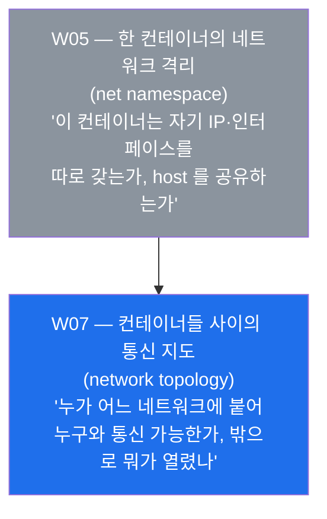
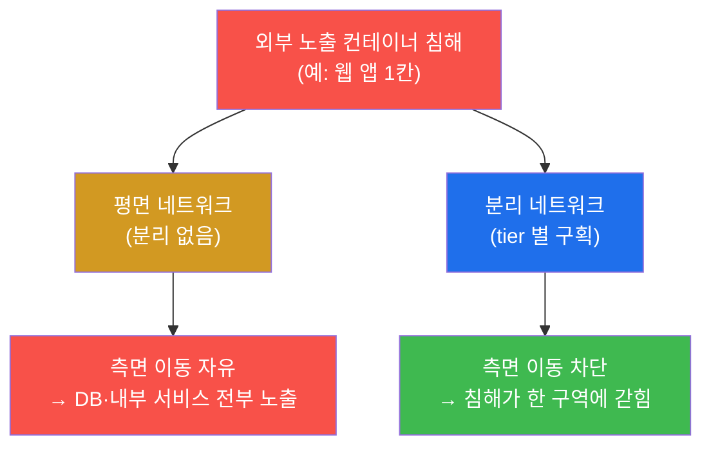
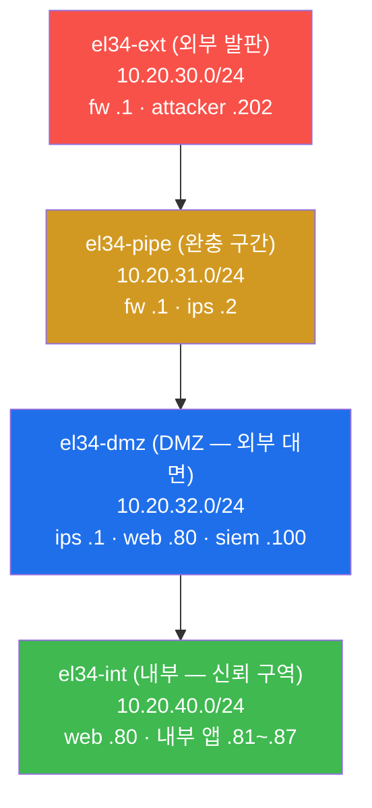
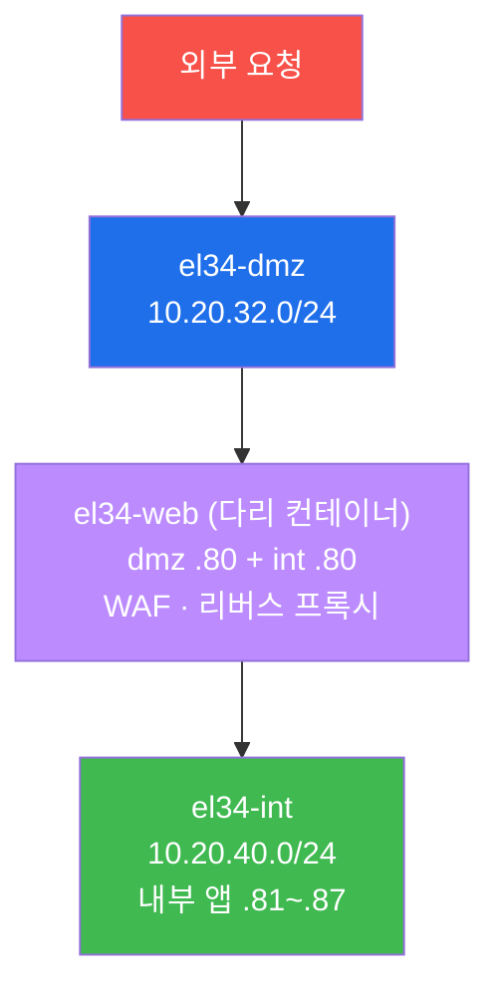
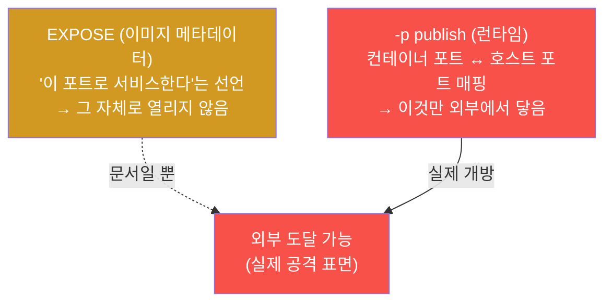
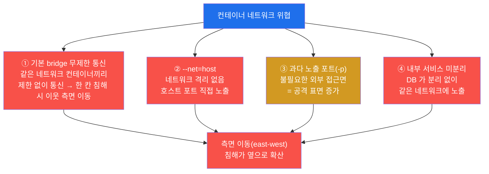
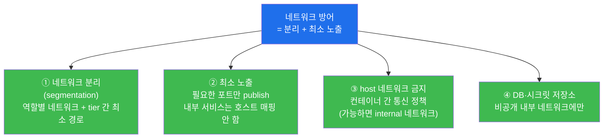
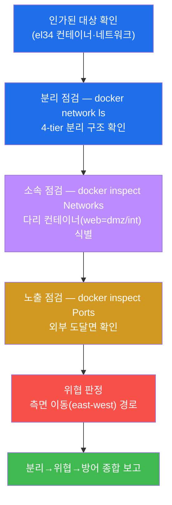
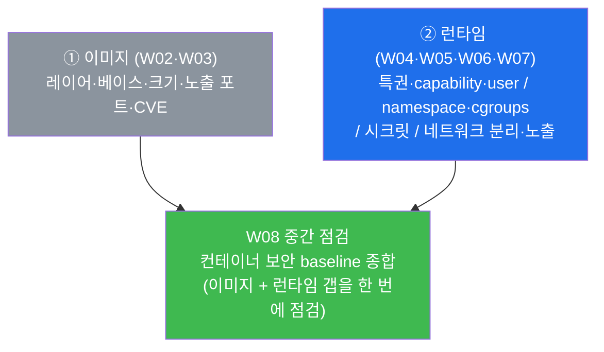

# 클라우드·컨테이너 W07 — 컨테이너 네트워크 보안 (분리·노출 포트)

> **본 주차의 한 줄 요약**
>
> 컨테이너는 혼자 돌지 않는다. 한 호스트 위에서 수십 개가 모여 서로 통신하며 하나의 서비스를 이룬다.
> 그래서 "어떤 컨테이너가 누구와 통신할 수 있는가(분리, segmentation)"와 "무엇이 호스트 밖으로
> 열려 있는가(노출 포트, published port)"가 곧 보안의 경계선이 된다. W05 에서 학생은 한 컨테이너의
> **네트워크 격리(net namespace — 자기 IP·인터페이스를 따로 갖는가)** 를 점검했다. 본 주차는 한 칸을
> 넘어 **컨테이너들 사이의 통신 지도** 전체를 본다. el34 는 4-tier(ext·pipe·dmz·int)를 **docker
> 네트워크로 분리**해 구현하며, 학생은 `docker network ls`·`docker inspect` 로 이 분리 구조와
> el34-web 의 네트워크 소속(web 은 dmz 와 int 를 잇는 다리), 그리고 외부로 매핑된 포트를 본인 손으로
> 읽어, "분리가 측면 이동(east-west)을 어떻게 막고, 최소 노출이 공격 표면을 어떻게 줄이는가"를
> 증적으로 밝힌다.
>
> **점검자 한 줄 결론**: 컨테이너 네트워크 보안은 "포트가 열렸는가"를 막연히 세는 것이 아니라,
> **분리(누가 누구와 통신 가능한가) + 최소 노출(밖으로 무엇이 열렸는가)** 의 두 축으로, 침해 한 건이
> 옆으로 번지지 않게(확산 차단) 하고 외부 접근면을 최소로 좁히는 일이다.

---

## 학습 목표

본 주차 종료 시 학생은 다음 6 가지를 **본인 손으로** 할 수 있어야 한다.

1. **docker 네트워크**가 컨테이너 그룹을 격리한다는 원리(같은 네트워크에 붙은 컨테이너만 서로 직접
   통신 가능)를 설명하고, `docker network ls` 로 el34 의 4-tier 분리 구조(ext·pipe·dmz·int)를
   나열한다.
2. **네트워크 분리(segmentation)** 가 왜 보안의 핵심인지를 **측면 이동(east-west)** 차단 관점에서
   설명하고, 평면(flat) 네트워크와 분리 네트워크의 침해 확산 차이를 근거와 함께 말한다.
3. `docker inspect` 로 컨테이너의 **네트워크 소속**(`NetworkSettings.Networks`)을 읽어, el34-web 이
   **dmz 와 int 두 네트워크에 붙은 다리(bridge) 컨테이너**임을 식별하고, 다리 컨테이너가 왜 침해 시
   영향이 큰지 판정한다.
4. **노출 포트(published port, `-p`)** 와 이미지의 `EXPOSE` 메타데이터의 차이를 구분하고,
   `docker inspect` 의 `NetworkSettings.Ports` 로 el34-web 의 실제 호스트 매핑을 읽어 "무엇이 외부에서
   닿는가"를 증적으로 확인한다.
5. 컨테이너 네트워크의 **대표 위협**(기본 bridge 의 무제한 통신 · `--net=host` 격리 부재 · 과다 노출
   포트 · 내부 서비스(DB) 미분리)을 정리하고, 왜 평면·과노출 네트워크가 "측면 이동의 고속도로"가
   되는지 설명한다.
6. 컨테이너 네트워크 **방어**(tier 분리 · 최소 노출 · host 네트워크 금지 · `internal` 네트워크 · DB
   비공개)를 정리하고, 점검(분리·소속·노출) → 위협(측면 이동) → 방어를 **네트워크 보안 보고서** 한
   장으로 종합한다.

> **점검자의 시선** — 본 주차는 컨테이너를 "연결하는" 주가 아니라, 이미 연결되어 돌고 있는 망을
> **점검자(auditor)의 눈으로** 들여다보는 주다. 채점은 "위험해 보인다"가 아니라, **무엇이(어떤
> 네트워크·소속·포트) 왜 분리/노출의 의미를 갖는가를 `docker network`·`docker inspect` 출력과 함께
> 보였는가**를 본다. 핵심 산출물은 el34 4-tier 분리 확인 + el34-web 의 dmz/int 다리 식별 + 노출 포트
> 점검을, 측면 이동 위협·분리/최소노출 방어 맥락에 자리매김한 네트워크 보안 보고서다.

---

## 0. 용어 해설 (컨테이너 네트워크 보안 입문)

본 주차에 처음 등장하거나 특히 중요한 용어를 먼저 정리한다. 한 줄 정의로는 부족한 핵심어(분리·측면
이동·다리 컨테이너·노출 포트)는 다음 절(0.5)에서 일상 비유로 다시 풀어 설명한다. 본문(§1~§7)에서
같은 용어가 다시 나올 때 막히면 이 표로 돌아오면 흐름이 끊기지 않는다.

| 용어 | 영문 | 뜻 | 비유 |
|------|------|----|------|
| **docker 네트워크** | docker network | 컨테이너를 묶어 통신 범위를 정하는 가상 네트워크(같은 것에 붙은 컨테이너끼리만 직접 통신) | 같은 층에 배선된 사내 LAN |
| **bridge(브리지) 드라이버** | bridge driver | 한 호스트 안에서 컨테이너들을 잇는 docker 의 기본 가상 스위치 방식 | 한 건물 안의 네트워크 스위치 |
| **네트워크 분리** | segmentation | 망을 역할별로 여러 구역으로 나눠, 구역 사이 통신을 통제하는 것 | 건물을 방화구획으로 나눔 |
| **tier(계층/구역)** | tier | 역할이 같은 컨테이너들을 묶은 망 구역(예: 외부·완충·DMZ·내부) | 건물의 층(로비/사무층/금고층) |
| **네트워크 소속** | network membership | 한 컨테이너가 어떤 네트워크(들)에 붙어 있는가 | 직원이 출입 가능한 층 목록 |
| **다리 컨테이너** | bridge/multi-homed container | 두 개 이상의 네트워크에 동시에 붙어 그 사이를 잇는 컨테이너 | 두 층을 잇는 연결 통로(엘리베이터) |
| **노출 포트(publish)** | published port (`-p`) | 컨테이너 포트를 호스트 포트에 매핑해 **외부에서 닿게** 만든 것 | 건물 밖으로 낸 정식 출입문 |
| **EXPOSE** | — | 이미지가 "이 포트로 서비스한다"고 적어 둔 메타데이터(그 자체로 여는 것은 아님) | 간판에 적힌 영업 안내 |
| **측면 이동** | east-west / lateral movement | 침입한 한 컨테이너에서 같은 망의 다른 컨테이너로 옆으로 번지는 공격 | 한 사무실에서 옆 사무실로 침입 확대 |
| **남북 트래픽** | north-south traffic | 외부 ↔ 내부로 드나드는 트래픽(망의 경계를 넘나듦) | 건물 정문을 통한 출입 |
| **평면 네트워크** | flat network | 분리 없이 모두가 한 망에 있어 서로 무제한 통신하는 구조 | 칸막이 없는 한 통의 사무실 |
| **host 네트워크** | `--net=host` | 컨테이너가 호스트의 네트워크 스택을 그대로 공유(네트워크 격리 없음) | 사무실 문을 떼어 복도와 합침 |
| **internal 네트워크** | internal network | 외부 라우팅이 차단된, 내부 통신 전용 docker 네트워크 | 외부 출입구가 없는 금고층 |
| **공격 표면** | attack surface | 공격자가 노릴 수 있는 모든 진입점의 합 | 건물의 출입문·창문 총수 |

---

## 0.5 핵심 개념

위 표는 한 줄 정의에 그치므로, 컨테이너 네트워크를 처음 다루는 학생이 헷갈리기 쉬운 핵심 용어를
일상 비유로 다시 풀어 설명한다. 본 절을 먼저 읽어두면 본문에서 같은 용어가 다시 나올 때 흐름이 끊기지
않는다.

### 0.5.1 docker 네트워크와 분리 — 한 건물을 방화구획으로 나누기

학생이 큰 회사 건물 하나를 관리한다고 하자(이 건물이 **호스트 한 대**다). 그 안에 부서(컨테이너)가
수십 개 들어 있다. 모든 부서를 칸막이 없는 한 통의 사무실에 몰아넣으면(= **평면 네트워크**) 편하긴
하지만, 한 부서에 불이 나면(침해되면) 순식간에 건물 전체로 번진다. 그래서 안전한 건물은 **방화구획**으로
나뉜다 — 로비, 일반 사무층, 금고층을 벽과 문으로 갈라, 한 구역의 사고가 다른 구역으로 넘어가지 못하게
한다. 이 "구역 나누기"가 바로 **네트워크 분리(segmentation)** 다.

**docker 네트워크** 는 이 구역을 컨테이너 세계에서 구현한 것이다. 한 docker 네트워크는 거기에 붙은
컨테이너들만 묶는 가상 LAN 이며, **같은 네트워크에 붙은 컨테이너끼리만 서로의 IP 로 직접 통신**할 수
있다. 다른 네트워크에 있는 컨테이너에는 (별도 라우팅이 없는 한) 직접 닿지 못한다. 즉 docker 네트워크
하나하나가 곧 하나의 **구역(tier)** 이고, 어떤 컨테이너를 어느 네트워크에 붙이느냐가 "누가 누구와
통신할 수 있는가"를 결정한다.

> **용어 — bridge 드라이버.** docker 가 한 호스트 안에서 컨테이너들을 잇는 기본 방식이 **bridge(브리지)**
> 다. 호스트 안에 가상 스위치를 하나 만들고, 같은 bridge 네트워크에 붙은 컨테이너들을 거기에 연결해
> 서로 통신하게 한다(건물 한 층의 네트워크 스위치에 해당). el34 의 4-tier 는 모두 이 bridge 드라이버로
> 만든 **여러 개의 분리된 bridge 네트워크**다. 이름이 같은 "bridge"라도, docker 가 기본 제공하는
> `bridge` 라는 이름의 네트워크(아무 옵션 없이 컨테이너를 띄우면 붙는 곳)와, 운영자가 역할별로 따로
> 만든 사용자 정의 bridge 네트워크(el34-ext 등)는 **다른 망**임에 주의한다.

### 0.5.2 측면 이동(east-west) — 옆 사무실로 번지는 침입

보안에서 트래픽 방향을 두 가지로 나눠 부른다. **남북(north-south)** 은 외부 ↔ 내부로 망의 경계를
드나드는 트래픽이다(건물 정문 출입). **동서(east-west)** 는 내부에서 내부로, 같은 망 안의 컨테이너끼리
오가는 트래픽이다(같은 층 사무실 사이 이동). 전통적 방어는 정문(남북)만 지켰지만, 현대의 침해는 일단
한 컨테이너에 들어온 공격자가 **옆으로 번지는** 단계에서 피해가 커진다 — 이것이 **측면 이동(east-west,
lateral movement)** 이다.

비유하자면, 도둑이 1층 로비의 작은 안내데스크(외부에 노출된 컨테이너)에 침입했다고 하자. 만약 건물이
평면이면 안내데스크에서 곧장 금고층(내부 DB)까지 걸어 들어갈 수 있다. 그러나 구역이 분리돼 있으면,
도둑은 안내데스크 구역에 갇히고 금고층으로 가는 문은 닫혀 있다. **분리의 진짜 가치는 "정문을 더 잘
지키는 것"이 아니라, 정문이 한 번 뚫려도 거기서 더 못 번지게 막는 것**이다. 본 주차의 핵심 명제가
바로 이것이다 — **분리는 측면 이동을 막아 침해를 한 구역에 가둔다.**

### 0.5.3 노출 포트(publish, `-p`) vs EXPOSE — 정식 출입문 vs 영업 안내 간판

건물 안의 부서끼리는 복도로 오갈 수 있지만, **건물 밖 사람이 들어오려면 정식 출입문**이 있어야 한다.
컨테이너도 마찬가지다. 컨테이너는 자기만의 네트워크(net namespace, W05)를 가져 기본적으로 호스트 밖과
직접 닿지 않는다. 호스트 밖(또는 다른 머신)에서 컨테이너에 닿게 하려면, 컨테이너의 포트를 **호스트의
포트에 매핑**해야 한다 — 이것이 `docker run -p 8080:80` 같은 **노출 포트(publish)** 다. 즉 **`-p` 로
매핑된 포트만이 외부로 난 정식 출입문**이고, 매핑하지 않은 포트는 컨테이너가 내부에서 듣고 있어도
밖에서는 직접 닿지 못한다.

여기서 자주 혼동되는 것이 **EXPOSE** 다. Dockerfile 의 `EXPOSE 80` 은 "이 이미지는 80 포트로
서비스한다"는 **안내 간판(메타데이터)** 일 뿐, 그 자체로 포트를 여는 것이 *아니다*(W02 §4.3 에서 본
그대로다). 실제 개방은 런타임의 `-p` 로 결정된다. 점검자는 이 둘을 분명히 구분해야 한다 — **간판
(EXPOSE)을 봤다고 문이 열린 게 아니고, 실제로 난 문(`-p` 매핑)을 봐야 "무엇이 외부에서 닿는가"를 안다.**

### 0.5.4 다리 컨테이너 — 두 층을 잇는 연결 통로

분리된 건물에서 가장 민감한 지점은 **두 구역을 잇는 연결 통로(엘리베이터)** 다. 로비와 금고층이 벽으로
갈려 있어도, 그 둘을 잇는 통로가 하나 있다면 그 통로가 곧 양쪽을 오가는 길이 된다. 통로 자체가
침해되면, 분리해 둔 두 구역이 한꺼번에 위험해진다.

컨테이너 세계의 이 통로가 **다리 컨테이너(multi-homed container)** 다. 한 컨테이너가 **두 개 이상의
docker 네트워크에 동시에 붙으면**, 그 컨테이너는 두 네트워크 모두와 통신할 수 있어 사실상 둘 사이의
다리가 된다. el34-web 이 바로 그렇다 — web 은 외부에 가까운 **dmz** 네트워크와 내부 앱이 있는 **int**
네트워크에 동시에 붙어, 외부 요청을 받아 내부 앱으로 전달하는 정상적 역할(리버스 프록시/WAF)을 한다.
그러나 보안 관점에서는, **다리 컨테이너가 침해되면 양쪽 네트워크가 모두 노출**되므로, 다리는 가장
단단히 지켜야 할 컨테이너이며 네트워크 소속은 꼭 필요한 만큼으로 **최소화**해야 한다.

---

이 네 개념(분리 · 측면 이동 · 노출 포트 · 다리 컨테이너)이 본 주차 본문의 기반이다. 본문에서 다시
등장할 때 막히면 본 절로 돌아오면 흐름이 끊기지 않는다.

---

## 1. 왜 컨테이너 네트워크를 따로 배우는가

### 1.1 한 줄 답: 한 호스트에 수십 컨테이너가 모여 통신한다

컨테이너는 혼자 돌지 않는다. 하나의 서비스는 보통 웹 서버, 애플리케이션, 데이터베이스, 캐시, 로그
수집기 등 여러 컨테이너가 **서로 통신**하며 이뤄진다. el34 만 해도 단일 호스트(192.168.0.80) 위에서
**41 개 컨테이너**(web/ips/fw/siem/attacker/취약앱 등)가 돈다(W01 §2.2). 이렇게 많은 컨테이너가 한
호스트에 모여 통신하므로, **"누가 누구와 통신할 수 있는가"** 가 곧 보안의 경계선이 된다.

이전 주차들이 한 컨테이너의 **안쪽**(이미지·런타임·격리·시크릿)을 봤다면, 본 주차는 컨테이너들
**사이의 연결**을 본다. 특히 W05 에서 점검한 것과의 차이를 분명히 해 두자.



W05 는 **한 칸(컨테이너)의 격리**를 물었다("이 컨테이너가 `--net=host` 로 호스트 망에 풀려 있지
않은가"). W07 은 한 칸을 넘어 **칸들의 배치도 전체**를 본다("어떤 네트워크 구역들이 있고, 각 컨테이너가
어디에 붙어 누구와 통신하며, 외부로는 무엇이 열려 있는가"). 둘은 격리의 다른 층위다 — 전자는 한
컨테이너가 망에서 격리됐는가, 후자는 망 자체가 잘 나뉘어(segmented) 있는가다.

### 1.2 핵심 위협은 "옆으로 번짐"이다 — 측면 이동

네트워크 보안을 따로 배우는 가장 큰 이유는 **측면 이동(east-west)** 때문이다(§0.5.2). 공격자는 보통
외부에 노출된 가장 약한 컨테이너 하나(예: 웹 앱)를 먼저 뚫는다. 그 한 칸의 침해 자체보다 무서운 것은,
거기서 **같은 호스트의 다른 컨테이너로 옆으로 번지는** 단계다. 망이 분리돼 있지 않으면, 웹 앱 한 칸의
침해가 곧장 데이터베이스·내부 서비스·심지어 다른 고객의 컨테이너로 이어진다.



같은 한 칸이 뚫려도, 평면 네트워크(주황)에서는 침해가 전체로 퍼지고(빨강), 분리 네트워크(파랑)에서는
한 구역에 갇힌다(초록). 이 차이를 만드는 것이 바로 네트워크 분리이며, 본 주차가 점검하려는 핵심이다.

### 1.3 한계 — 네트워크 보안만으로 끝나지 않는다

네트워크를 잘 분리해도 그것이 애플리케이션 취약점(SQLi·RCE 등, web-vuln 트랙)이나 컨테이너 런타임
오설정(특권·root, W04)을 대신하지는 못한다. 분리는 **침해의 "확산"을 막는** 통제이지, **최초 침입
자체를 막는** 통제가 아니다. 정문(남북)이 뚫리는 것은 다른 계층의 통제(WAF·취약점 관리·런타임 강화)가
맡고, 네트워크 분리는 그 뒤 "더 못 번지게" 하는 한 축이다. 컨테이너 보안 4 계층(W01) 중 네트워크는
주로 **런타임·오케스트레이션** 계층에 걸쳐 있으며, 다른 계층의 통제와 **함께** 작동해야 전체 방어가
된다.

---

## 2. docker 네트워크와 분리(segmentation)

### 2.1 한 줄 정의와 왜 중요한가

**docker 네트워크** 는 컨테이너들을 묶어 통신 범위를 정하는 가상 네트워크로, **같은 네트워크에 붙은
컨테이너끼리만 서로의 IP 로 직접 통신**할 수 있다(§0.5.1). 이것이 중요한 이유는, 어떤 컨테이너를
어느 네트워크에 붙이느냐가 곧 **"누가 누구와 통신할 수 있는가"의 통제**이기 때문이다. 네트워크를
역할별로 여러 개로 나눠 통신을 통제하는 것이 **분리(segmentation)** 이고, 분리는 §1.2 의 측면 이동을
막는 가장 직접적인 수단이다.

### 2.2 el34 에서 어떻게 — 4-tier 를 docker 네트워크로 분리

el34 는 보안 실습용으로 **4-tier(4 구역)** 망을 docker 네트워크로 구현한다. 네 구역은 외부에서
안쪽으로 갈수록 신뢰도가 높아지는 순서로 배치되며, 각 구역은 **별도의 bridge 네트워크**다.



- **el34-ext**(10.20.30.0/24) — 가장 바깥 구역. 방화벽(fw, .1)과 내부 공격자 발판(attacker, .202)이
  여기 있다. 외부에서 들어온 트래픽이 처음 닿는 곳이다.
- **el34-pipe**(10.20.31.0/24) — 외부와 DMZ 사이의 완충 구간. 방화벽(fw, .1)과 침입탐지(ips,
  Suricata, .2)가 트래픽을 검사한다.
- **el34-dmz**(10.20.32.0/24) — 외부 대면 서비스 구역(DMZ). 웹/WAF(web, .80), 침입탐지의 안쪽
  인터페이스(ips, .1), 보안관제(siem, .100)가 있다.
- **el34-int**(10.20.40.0/24) — 가장 안쪽 신뢰 구역. 내부 애플리케이션(취약 웹앱 .81~.87 등)이 여기
  있다. **외부에서 직접 도달할 수 없고, 반드시 web 을 거쳐야** 닿는다.

> **용어 — DMZ.** DMZ(DeMilitarized Zone, 비무장지대)는 외부에 서비스를 제공하되 내부 신뢰망과는
> 분리해 두는 **중간 완충 구역**이다. 외부에 직접 노출되는 서비스(웹 서버 등)를 DMZ 에 두고, 진짜
> 중요한 자산(DB·내부 앱)은 더 안쪽(int)에 두어, DMZ 가 뚫려도 내부까지 바로 번지지 않게 한다.

el34 의 패킷 흐름은 이 구역들을 차례로 거친다 — **외부 → fw(방화벽) → ips(침입탐지) → web(WAF) →
내부 앱**. 각 단계가 다른 네트워크 구역에 있으므로, 한 구역이 침해돼도 다음 구역으로 가려면 그
경계를 다시 넘어야 한다.

호스트에서 정의된 docker 네트워크 목록은 다음과 같이 본다(lab 미션 2).

```bash
docker network ls --format '{{.Name}} {{.Driver}}'; echo nets_listed
```

- `docker network ls` — 호스트에 정의된 docker 네트워크 목록을 보여 준다. `--format '{{.Name}}
  {{.Driver}}'` 는 네트워크 이름과 드라이버(bridge/host/none 등)만 뽑는 Go 템플릿이다.
- 출력에는 el34 가 만든 4-tier 네트워크(`el34-ext`·`el34-pipe`·`el34-dmz`·`el34-int`, 모두 bridge)와
  함께, **docker 가 항상 기본 제공하는 세 네트워크 — `bridge`(기본 bridge)·`host`·`none`** 도 같이
  나온다. 점검자는 이 목록에서 **운영자가 역할별로 나눈 사용자 정의 네트워크가 실제로 존재하는가**(=
  분리가 적용됐는가)를 먼저 확인한다.

### 2.3 한계 — 분리는 "구역을 나눈" 것이지 "문을 닫은" 것은 아니다

네트워크를 여러 개로 나눴다는 사실만으로 통신이 완벽히 통제되는 것은 아니다. 한 컨테이너가 여러
네트워크에 동시에 붙으면(다리 컨테이너, §4) 그만큼 구역 사이의 통로가 생기고, 같은 네트워크 안에서는
여전히 무제한 통신이 가능하다(§5.1). 또 docker 의 기본 bridge 드라이버는 컨테이너 간 세밀한 정책
(누가 누구에게만 접근)을 강제하지 못한다 — 그런 정밀 통제는 별도 도구(방화벽 규칙·Kubernetes
NetworkPolicy 등)나 `internal` 네트워크가 필요하다. 본 주차는 **분리 구조가 있는가와 소속·노출이
어떤가**를 점검하는 데 집중한다.

---

## 3. 컨테이너 네트워크 소속 — 누가 어디에 붙어 있는가

### 3.1 한 줄 정의와 왜 중요한가

**네트워크 소속(network membership)** 은 한 컨테이너가 **어떤 네트워크(들)에 붙어 있는가**를 뜻한다.
이것이 중요한 이유는, 소속이 곧 그 컨테이너의 **통신 가능 범위**이기 때문이다 — 한 컨테이너가 붙은
네트워크가 그 컨테이너가 직접 통신할 수 있는 구역의 전부이며, 여러 네트워크에 붙어 있으면 그 사이의
**다리**가 된다(§0.5.4).

### 3.2 el34 에서 어떻게 — web 은 dmz 와 int 의 다리

el34-web 의 네트워크 소속은 `docker inspect` 의 `NetworkSettings.Networks` 로 본다(lab 미션 3).

```bash
docker inspect el34-web --format '{{range $k,$v := .NetworkSettings.Networks}}{{$k}}={{$v.IPAddress}} {{end}}'; echo nets_membership
```

- `.NetworkSettings.Networks` — 컨테이너가 붙은 네트워크와 각 네트워크에서의 IP 를 담은 맵(map)이다.
- `{{range $k,$v := ...}}` 는 Go 템플릿의 반복 구문으로, 붙은 네트워크 이름(`$k`)과 그 IP
  (`$v.IPAddress`)를 하나씩 출력한다. **출력 항목이 여러 개면 그 컨테이너는 여러 네트워크에 붙은
  다리**라는 뜻이다.

el34-web 을 점검하면 **dmz(10.20.32.80)와 int(10.20.40.80) 두 네트워크에 모두 붙어** 있음이 드러난다.
이는 web 이 외부 대면 구역(dmz)에서 요청을 받아 내부 앱 구역(int)으로 전달하는 정상적 역할(WAF +
리버스 프록시)을 하기 때문이다 — el34 에서 외부 요청이 내부 앱에 닿는 유일한 경로가 web 이다.



보안 판정은 이렇다 — web 이 두 구역의 **다리**라는 것은 곧 **web 이 침해되면 dmz 와 int 양쪽이 모두
노출**된다는 뜻이다. 그래서 다리 컨테이너 web 은 가장 단단히 지켜야 할 자산이고(그래서 el34 가 web 에
WAF=ModSecurity 를 붙였다), 다른 컨테이너의 네트워크 소속은 꼭 필요한 만큼으로 **최소화**해야 한다 —
이유 없이 여러 네트워크에 붙은 컨테이너는 불필요한 다리를 만든다.

### 3.3 한계 — 소속은 "어디에 붙었나"이지 "무엇을 막았나"가 아니다

`NetworkSettings.Networks` 는 컨테이너가 어느 네트워크에 붙어 있는지를 알려 주지만, 그 네트워크 안에서
실제로 어떤 통신이 허용/차단되는지(세밀한 정책)까지는 보여 주지 않는다. 또한 한 컨테이너가 두
네트워크에 붙어 있다고 해서 그 둘 사이로 트래픽을 무조건 **포워딩**하는 것은 아니다(포워딩 여부는 그
컨테이너의 설정에 달렸다). 따라서 완전한 점검은 소속(이 절) + 실제 통신 정책(방화벽·라우팅) + 다리
컨테이너의 역할을 **함께** 봐야 한다. 본 주차는 소속을 읽어 다리 컨테이너를 식별하는 데까지를 다룬다.

---

## 4. 노출 포트 — 외부로 무엇이 열렸는가

### 4.1 한 줄 정의와 왜 중요한가

**노출 포트(published port, `-p`)** 는 컨테이너의 포트를 호스트의 포트에 매핑해 **호스트 밖에서 닿게**
만든 것이다(§0.5.3). 이것이 중요한 이유는, **매핑된 포트만이 외부로 난 출입문**이기 때문이다. 컨테이너
네트워크 보안의 두 축 중 하나가 분리(측면 이동 차단)라면, 다른 하나가 바로 이 **최소 노출** — 외부로
여는 문을 꼭 필요한 만큼으로 줄여 공격 표면을 작게 하는 것이다.

### 4.2 publish(`-p`) vs EXPOSE — 다시 한 번 분명히

W02 §4.3 에서 본 구분을 본 주차에서 다시 확인한다. **`EXPOSE`(이미지 메타데이터)** 는 "이 이미지는
이 포트를 쓴다"는 안내일 뿐 포트를 열지 않는다. **실제 외부 개방은 런타임의 `-p`(publish)** 로
결정된다. 점검에서 둘을 섞으면 안 된다.



점선(EXPOSE)은 "닿을 수도 있다는 안내"일 뿐이고, 실선(`-p`)만이 실제 외부 도달을 만든다. 그래서
"무엇이 외부에서 닿는가"를 알려면 **EXPOSE 가 아니라 실제 포트 매핑**을 봐야 한다.

### 4.3 el34 에서 어떻게 — 실제 포트 매핑 점검

컨테이너의 실제 포트 매핑은 `docker inspect` 의 `NetworkSettings.Ports` 로 본다(lab 미션 4).

```bash
docker inspect el34-web --format '{{json .NetworkSettings.Ports}}'; echo ports_checked
```

- `.NetworkSettings.Ports` — **컨테이너 포트 ↔ 호스트 포트 매핑**을 담은 맵이다. 어떤 항목에
  `HostIp`/`HostPort` 가 채워져 있으면 그 포트는 호스트로 매핑(publish)되어 외부에서 닿고, 매핑 값이
  비어 있으면(`null`) 외부로 직접 열려 있지 않다는 뜻이다.
- `{{json ...}}` 는 그 맵을 JSON 으로 출력하는 템플릿이라, 매핑 구조를 그대로 읽을 수 있다.

el34 에서 외부 진입은 컨테이너의 직접 매핑보다 **방화벽(fw)의 포트 분기(DNAT)** 로 이뤄진다는 점이
중요한 el34 사실이다 — 공인 IP `.161` 로 들어온 80/443 트래픽을 fw 가 내부 web(dmz .80)으로
전달(DNAT)한다. 즉 점검자는 (a) 컨테이너 자체의 `-p` 매핑과 (b) 호스트/방화벽 수준의 외부 진입 경로를
**함께** 봐야 "실제로 외부에서 무엇이 닿는가"의 전체 그림이 나온다. 핵심 원칙은 **매핑된(외부로 닿는)
포트는 최소로, 내부 서비스(DB 등)는 절대 호스트로 매핑하지 않는다**는 것이다 — 매핑 하나하나가 곧
외부 공격 표면이기 때문이다.

### 4.4 한계 — 메타데이터·매핑·방화벽을 함께 봐야 한다

§4.2 에서 본 대로 `EXPOSE`(의도)와 실제 매핑(`-p`)은 별개이고, 여기에 더해 el34 처럼 **방화벽 DNAT 로
외부 진입을 따로 거는** 구성에서는 컨테이너의 `-p` 매핑만 봐서는 외부 도달 전체를 알 수 없다. 반대로,
`-p` 로 매핑하지 않아도 컨테이너 안에서 데몬이 떠 있으면 **같은 네트워크의 다른 컨테이너에서는** 닿을
수 있다(이것이 측면 이동의 통로다). 따라서 완전한 노출 점검은 (a) 이미지 EXPOSE + (b) 컨테이너 포트
매핑 + (c) 호스트/방화벽 정책 + (d) 컨테이너 내부 리스너를 함께 봐야 한다. 본 주차는 컨테이너 포트
매핑(`NetworkSettings.Ports`)을 점검의 중심으로 다룬다.

---

## 5. 컨테이너 네트워크 위협 — 측면 이동의 고속도로

### 5.1 한 줄 정의와 왜 중요한가

컨테이너 네트워크에서 침해를 옆으로 번지게 하는 대표적 **잘못된 구성**은 네 가지다 — **기본 bridge 의
무제한 통신 · `--net=host` 격리 부재 · 과다 노출 포트 · 내부 서비스(DB) 미분리**. 이 넷이 위험한
이유는, 모두 **컨테이너 사이의 통신을 필요 이상으로 열어** 측면 이동(east-west)을 쉽게 만들기
때문이다(§1.2).

### 5.2 네 가지 위협



- **① 기본 bridge 의 무제한 통신** — docker 의 기본 bridge 네트워크(또는 분리 없이 한 네트워크에 다
  몰아넣은 경우)에서는 **같은 네트워크의 컨테이너끼리 제한 없이 통신**한다. 한 컨테이너가 뚫리면 옆
  컨테이너로 곧장 측면 이동할 수 있다. 평면 네트워크가 바로 이 상태다.
- **② `--net=host`(host 네트워크)** — 컨테이너가 호스트의 네트워크 스택을 그대로 공유해 **네트워크
  격리가 사라진다**(W05 의 net namespace 갭과 같은 문제다). 컨테이너가 여는 포트가 호스트 포트로
  직접 노출되고, 컨테이너가 호스트의 모든 네트워크 인터페이스를 본다.
- **③ 과다 노출 포트(`-p`)** — 꼭 필요하지 않은 포트까지 호스트로 매핑하면, 매핑 하나하나가 외부
  공격 표면이 된다(§4). 특히 관리 포트(SSH 등)나 디버그 포트가 외부로 열리면 무차별 대입·악용의
  표적이 된다.
- **④ 내부 서비스(DB) 미분리** — 데이터베이스처럼 절대 외부에 닿으면 안 되는 서비스를 분리 없이 웹
  앱과 **같은 네트워크에** 두면, 웹 앱 한 칸의 침해가 곧장 DB 접근으로 이어진다.

> **el34 에서의 의미.** el34 는 4-tier 로 분리해 ①·④ 의 평면 위험을 구조적으로 줄였고, web 은 host
> 네트워크가 아니라 사용자 정의 네트워크(dmz)에 붙어 ② 도 피한다(W05 에서 `compliant=isolated_net`
> 확인). 그래서 el34 는 이 위협들의 **반례(좋은 분리)** 로서 학습 대상이 된다 — 만약 이 분리가 없었다면
> attacker(.202)가 외부 노출 컨테이너를 뚫은 순간 내부 앱(int .81~.87)까지 평면으로 노출됐을 것이다.

### 5.3 한계 — 네트워크 위협이 이 넷뿐인 것은 아니다

위 네 가지는 가장 흔하고 점검이 쉬운 위협이지만 전부는 아니다. DNS 스푸핑·ARP 스푸핑 같은 같은 망
내부의 중간자 공격, 컨테이너 런타임/네트워크 플러그인 자체의 취약점, 잘못된 라우팅으로 의도치 않게
열린 경로 등도 네트워크 위협이다. 본 주차는 점검 가능한 핵심 네 가지(평면 통신·host 네트워크·과노출·
DB 미분리)에 집중하고, 더 정밀한 통신 정책·런타임 강화는 이후 운영 단계의 주제다.

---

## 6. 네트워크 방어 — 분리 + 최소 노출

### 6.1 한 줄 정의와 왜 중요한가

컨테이너 네트워크 방어의 두 기둥은 **분리(segmentation)** 와 **최소 노출(minimal exposure)** 이다 —
망을 역할별로 나눠 측면 이동을 막고(분리), 외부로 여는 문을 꼭 필요한 만큼으로 줄인다(최소 노출). 왜
중요한가 — §5 의 위협이 모두 "필요 이상으로 열린 통신"에서 나오므로, 방어의 본질은 **통신을 기본적으로
좁히고(deny by default), 꼭 필요한 경로만 여는** 것이기 때문이다.

### 6.2 네 가지 방어 통제



- **① 네트워크 분리(segmentation)** — 역할(외부 대면 / 내부 앱 / 데이터)별로 네트워크를 나누고, 구역
  사이는 꼭 필요한 컨테이너(다리)만 최소 경로로 잇는다. el34 의 4-tier 가 바로 이 방어의 본보기다 —
  내부 앱(int)은 외부에서 직접 닿지 못하고 반드시 web 을 거친다.
- **② 최소 노출** — 외부로 여는 포트를 꼭 필요한 것만 `-p` 로 매핑하고, **내부 서비스(DB·캐시 등)는
  호스트로 매핑하지 않는다.** 노출 하나하나가 공격 표면이므로, "기본은 닫고 필요한 문만 연다"가 원칙이다.
- **③ host 네트워크 금지** — `--net=host` 를 쓰지 않아 컨테이너의 네트워크 격리를 유지한다. 컨테이너
  사이 통신은 사용자 정의 네트워크로 통제하고, 가능하면 외부 라우팅이 없는 **`internal` 네트워크**를
  쓴다.
- **④ DB·시크릿 저장소 비공개** — 데이터베이스, 비밀 저장소처럼 절대 외부에 닿으면 안 되는 서비스는
  외부 라우팅이 차단된 **비공개 내부 네트워크에만** 붙인다.

> **용어 — internal 네트워크.** docker 네트워크를 만들 때 `--internal` 옵션을 주면, 그 네트워크에
> 붙은 컨테이너는 **외부(인터넷·다른 네트워크)와의 라우팅이 차단**되고 같은 네트워크 안에서만 통신할
> 수 있다(외부 출입구가 없는 금고층). DB 처럼 내부 통신만 필요한 서비스를 internal 네트워크에 두면,
> 설령 그 컨테이너가 침해돼도 외부로 직접 데이터를 빼내기 어렵다.

### 6.3 el34 에서 어떻게

el34 의 4-tier 분리는 위 ①·③·④ 의 좋은 예다 — 역할별 네트워크로 나뉘어 있고(①), web 은 host
네트워크가 아니라 사용자 정의 dmz/int 에 붙으며(③), 내부 앱은 가장 안쪽 int 구역에 격리돼 외부에서
직접 닿지 못한다(④). 외부 진입은 fw 가 통제된 경로(.161 → DNAT → web)로만 허용해 최소 노출(②)에
가깝게 운영된다. 즉 el34 는 본 주차가 가르치는 분리·최소노출 방어가 실제로 어떻게 적용되는지를 보여
주는 살아 있는 본보기다.

### 6.4 한계 — 분리는 설정만으로 끝나지 않는다

네트워크를 잘 나눠 두어도, 새 컨테이너를 추가하다 보면 무심코 여러 네트워크에 붙이거나(불필요한 다리),
편의상 포트를 호스트로 매핑하면서 분리가 시간이 지나며 표류(drift)한다. 또 docker 의 기본 bridge 는
같은 네트워크 안의 세밀한 정책(누가 누구에게만 접근)을 강제하지 못하므로, 더 엄격한 통제가 필요하면
Kubernetes NetworkPolicy 나 서비스 메시 같은 상위 도구가 필요하다. 즉 네트워크 방어는 한 번 설정으로
끝나는 것이 아니라 **정기적으로 소속·노출을 재점검**해야 유지된다 — 그 점검 절차가 바로 본 주차의
실습이다.

---

## 7. 점검 명령 빠른 복습 — "무엇을 어디서 보나"

본 주차의 점검은 모두 el34 호스트(`ssh ccc@192.168.0.80`, 비밀번호 1)에서 `docker` CLI 로 수행하며,
**신규 도구 설치는 없다**(호스트의 `docker` CLI 만 사용). 점검 대상은 인가된 el34 컨테이너(주로
`el34-web`)뿐이다.

| 무엇을 | 명령 | 무엇을 보나 |
|--------|------|-------------|
| 대상 확인 | `docker inspect el34-web --format 'state={{.State.Status}}'` | 점검 대상 가동 여부(`target_ok`) |
| 네트워크 목록(분리) | `docker network ls --format '{{.Name}} {{.Driver}}'` | el34-ext/pipe/dmz/int(4-tier 분리) + 기본 bridge/host/none |
| 네트워크 소속 | `docker inspect el34-web --format '{{range $k,$v := .NetworkSettings.Networks}}{{$k}}={{$v.IPAddress}} {{end}}'` | web = dmz+int(두 구역의 다리) |
| 노출 포트 | `docker inspect el34-web --format '{{json .NetworkSettings.Ports}}'` | 컨테이너↔호스트 포트 매핑(외부 도달면) |
| 분리의 의미 | (개념 정리) | 측면 이동(east-west) 차단 |
| 네트워크 위협 | (개념 정리) | 평면 통신·host 네트워크·과노출·DB 미분리 |
| 네트워크 방어 | (개념 정리) | 분리 + 최소 노출 + host 금지 + internal/DB 비공개 |

> **점검 관용구.** 본 주차의 점검 명령들은 끝에 `echo target_ok` / `echo nets_listed` / `echo
> nets_membership` / `echo ports_checked` 같은 **확인 토큰**을 찍어 둔다. 이는 명령이 끝까지
> 수행됐고 그 단계 점검이 완료됐음을 나타내는 표식이다 — 학생은 이 토큰이 출력에 나오는지로 각 단계
> 통과를 확인한다.

---

## 8. 실습 안내 — lab 8 미션 (4 축 설명)

본 주차 lab 은 8 미션으로 구성되며, lab 의 `order` 와 1:1 로 대응한다. 미션은 대상 확인 → 네트워크
목록(분리) → 네트워크 소속(다리) → 노출 포트 → 분리의 의미 → 네트워크 위협 → 네트워크 방어 → 종합
보고의 순서로 흐른다. 각 미션을 **4 축**으로 설명한다 — 왜 하는가 / 무엇을 알 수 있는가 / 결과
해석(정상 vs 갭) / 실전 활용.

> **실습 진행 원칙.** 모든 명령은 el34 호스트(`ssh ccc@192.168.0.80`)에서 `docker` CLI 로 실행한다.
> 이번 주는 **신규 설치가 없고**, 점검 대상은 인가된 el34 컨테이너(주로 `el34-web`)뿐이다. 본 주차의
> 명령은 모두 **읽기 전용**(`docker network ls`·`docker inspect`)이며 네트워크 구성을 바꾸지 않는다.
> 합격 임계값은 0.7 이다.

### 미션 1 — 점검: 대상 확인 (10점)

> **왜 하는가?** 모든 네트워크 점검의 전제는 대상 컨테이너가 실제로 돌고 있다는 것이다. 점검자는
> 본격 분석 전 항상 대상(el34-web)이 가동 중이고 조회 가능한지부터 확인한다.
>
> **무엇을 알 수 있는가?** `docker inspect ... .State.Status` 로 el34-web 의 가동 상태 — 네트워크 보안
> 점검의 대상이 살아 있고 조회 가능한지.
>
> **결과 해석.** 정상: 출력에 `target_ok` 가 나옴(대상 확인 성공). 비정상: 응답이 없거나 오류면 호스트
> SSH·컨테이너 상태(`docker ps`)·docker 권한부터 점검한다.
>
> **실전 활용.** 네트워크 점검 착수 시 첫 확인. 점검 대상이 실제 가동·조회 가능한지 검증하는 단계다.

### 미션 2 — 네트워크 목록 (분리) (14점)

> **왜 하는가?** 네트워크 보안의 1 단계는 **분리 구조가 있는가**를 확인하는 것이다. 호스트에 어떤
> docker 네트워크가 정의돼 있는지를 봐야 "이 환경이 평면인가 분리됐는가"를 안다(§2).
>
> **무엇을 알 수 있는가?** `docker network ls` 로 정의된 네트워크 목록. el34 는 4-tier(el34-ext/pipe/
> dmz/int)를 별도 bridge 네트워크로 분리했으며, 함께 docker 기본 네트워크(bridge/host/none)도 보인다.
> 같은 네트워크에 붙은 컨테이너끼리만 직접 통신한다는 분리 원리를 실물로 확인한다.
>
> **결과 해석.** 정상: 출력에 네트워크 목록(el34-ext/pipe/dmz/int 등)과 `nets_listed` 가 나옴(목록
> 확인 성공). 비정상: 빈 출력이거나 오류면 docker 데몬·권한을 재확인한다.
>
> **실전 활용.** 컨테이너 망 점검의 출발점. "이 호스트가 역할별로 망을 나눴는가, 아니면 다 한 망에
> 몰아넣었는가"를 30 초 만에 판단하는 명령이다.

### 미션 3 — 컨테이너 네트워크 소속 (12점)

> **왜 하는가?** 네트워크가 나뉘어 있어도, 한 컨테이너가 여러 네트워크에 붙으면 그 사이의 다리가 된다.
> el34-web 이 어디에 붙어 있는지를 봐야 "이 컨테이너가 어느 구역들과 통신하는가, 다리인가"를 안다(§3).
>
> **무엇을 알 수 있는가?** `NetworkSettings.Networks` 로 el34-web 의 소속 네트워크와 IP. web 은
> dmz(10.20.32.80)와 int(10.20.40.80) 두 네트워크에 붙은 **다리 컨테이너**임이 드러난다 — 외부 요청을
> 내부 앱으로 잇는 정상 역할이자, 침해 시 양쪽이 노출되는 민감 지점.
>
> **결과 해석.** 정상: 소속 네트워크와 IP(예: el34-dmz/el34-int)와 `nets_membership` 이 나옴(소속 확인
> 성공). 출력 항목이 둘 이상이면 다리 컨테이너다. 비정상: inspect 가 실패하면 컨테이너 이름·docker
> 권한을 점검한다.
>
> **실전 활용.** 망 점검에서 "어느 컨테이너가 구역들을 잇는 다리인가"를 식별하는 표준 절차. 다리는
> 가장 단단히 지켜야 하고, 불필요한 다리는 소속을 줄여 없앤다.

### 미션 4 — 노출 포트 점검 (12점)

> **왜 하는가?** 네트워크 보안의 다른 한 축은 최소 노출이다. 외부로 매핑된 포트가 곧 외부 공격 표면이
> 므로, el34-web 의 실제 포트 매핑을 읽어 "무엇이 외부에서 닿는가"를 확인한다(§4).
>
> **무엇을 알 수 있는가?** `NetworkSettings.Ports` 로 컨테이너↔호스트 포트 매핑. 매핑된(publish) 포트만
> 외부에서 직접 닿는다는 것, 그리고 `EXPOSE`(메타데이터)와 실제 매핑(`-p`)이 다르다는 것.
>
> **결과 해석.** 정상: 포트 매핑 정보와 `ports_checked` 가 나옴(노출 점검 성공). 매핑이 비어 있으면
> 그 포트는 외부로 직접 열려 있지 않다는 뜻이다(el34 는 외부 진입을 fw DNAT 로 처리한다). 비정상:
> 출력이 비면 컨테이너·명령을 재확인한다.
>
> **실전 활용.** 컨테이너의 외부 노출면을 점검하는 표준 절차. 단, 메타데이터·매핑·방화벽 정책을 함께
> 봐야 외부 도달 전체를 안다(§4.4).

### 미션 5 — 분리(segmentation) 의미 (12점)

> **왜 하는가?** 분리 구조를 봤으면(미션 2·3) "왜 그것이 보안에 중요한가"를 정리해야 점검이 의미를
> 갖는다. 4-tier 분리가 측면 이동을 어떻게 막는지를 명확히 한다(§1.2·§2).
>
> **무엇을 알 수 있는가?** 분리의 보안 효과 — int 의 내부 앱은 ext 에서 직접 도달 불가, 반드시
> web/ips 를 경유한다는 것. 한 tier 침해가 다른 tier 로 자동 확산되지 않는다(east-west 차단). 평면
> 네트워크면 한 번에 전체가 노출된다는 대조.
>
> **결과 해석.** 정상: 출력에 `segmentation_explained` 가 나옴(분리 의미 정리 성공). 비정상: east-west
> 차단 개념이 빠지면 §1.2·§0.5.2 를 다시 읽는다.
>
> **실전 활용.** 컨테이너 망 설계·점검의 사고 틀. "왜 망을 나눠야 하는가"를 측면 이동 차단으로
> 설명하는 근거가 된다.

### 미션 6 — 네트워크 위협 (10점)

> **왜 하는가?** 좋은 분리(미션 5)를 이해했으면, 그것이 깨졌을 때의 위험도 알아야 한다. 측면 이동을
> 쉽게 만드는 네트워크 오구성을 정리해 방어(미션 7)와 연결한다(§5).
>
> **무엇을 알 수 있는가?** 기본 bridge 의 무제한 통신·`--net=host` 격리 부재·과다 노출 포트·내부
> 서비스(DB) 미분리가 왜 측면 이동의 통로가 되는지, 그리고 평면/과노출 네트워크가 왜 "확산 경로"인지.
>
> **결과 해석.** 정상: 출력에 `측면 이동`(east-west)이 포함됨 — 네트워크 위협의 핵심을 짚었다는 뜻.
> 비정상: 측면 이동 개념이 빠지면 §5.2·§0.5.2 를 다시 읽는다.
>
> **실전 활용.** 망 위험 평가의 사고 틀. 어떤 구성이 위험한지(평면·host·과노출·DB 미분리) 우선순위를
> 매기는 근거가 된다.

### 미션 7 — 네트워크 방어 (12점)

> **왜 하는가?** 위협을 알았으면(미션 6) 막는 법이 따라와야 한다. 측면 이동을 막고 노출을 줄이는
> 네트워크 방어를 정리한다(§6).
>
> **무엇을 알 수 있는가?** 네트워크 분리(역할별 + tier 간 최소 경로) · 최소 노출(필요한 포트만 publish,
> 내부 서비스 호스트 매핑 안 함) · host 네트워크 금지(가능하면 internal 네트워크) · DB/시크릿 비공개
> 내부 네트워크라는 네 통제, 그리고 그것이 어떻게 분리+최소노출로 귀결되는지.
>
> **결과 해석.** 정상: 출력에 `분리`가 포함됨 — 방어의 핵심(segmentation)을 정리했다는 뜻. 비정상: 네
> 통제 중 핵심이 빠지면 §6.2 를 다시 확인한다.
>
> **실전 활용.** 컨테이너 망 배포 표준(보안 baseline)의 골격. 새 서비스를 띄울 때 적용할 네트워크
> 정책의 기준이 된다.

### 미션 8 — 네트워크 보안 보고서 (14점)

> **왜 하는가?** 점검의 산출물은 보고서다. 미션 1–7 을 분리 점검 → 위협(측면 이동) → 방어(분리/최소
> 노출)의 한 흐름으로 종합해야 본 주차 학습이 완성된다.
>
> **무엇을 알 수 있는가?** 전 미션을 한 문서로 묶는 법 — el34 4-tier 분리(ext/pipe/dmz/int)·web=dmz/int
> 다리·노출 포트 점검 + 측면 이동 위협 + 분리/최소노출 방어. 점검·위협·방어를 균형 있게 제시하는 보고
> 구조.
>
> **결과 해석.** 정상: 보고서에 `분리`(점검·방어의 핵심)가 포함되고 분리/위협/방어가 모두 담김(종합
> 성공). 비정상: 측면 이동 위협이나 방어가 빠지면 보고서 양식(미션 8 instruction)을 다시 채운다.
>
> **실전 활용.** 컨테이너 네트워크 보안 점검 보고서의 표준 구조(분리 점검 → 위협 → 방어 → 결론).
> 운영팀·심사에 제출하는 산출물이며, 다음 점검의 토대가 된다.

---

## 9. 실습 수칙 — 인가된 점검과 증적 중심

컨테이너 네트워크 점검도 **허가받은 대상에 대해서만** 한다. 다음 수칙을 지킨다.

- **인가된 대상만 점검한다.** el34 의 정해진 컨테이너(`el34-web` 등)와 그 호스트의 docker 네트워크만
  조회하며, 같은 명령을 그 밖의 어떤 시스템·네트워크에도 시도하지 않는다.
- **점검만, 변경은 하지 않는다.** 본 주차의 명령(`docker network ls`·`docker inspect`)은 모두 **읽기
  전용 조회**다. 네트워크를 새로 만들거나 컨테이너의 소속·포트 매핑을 바꾸지 않는다(시정은 운영팀의
  변경관리로).
- **증적 우선.** "분리가 잘됐다/위험하다"가 아니라 **무엇이(el34-ext/pipe/dmz/int·web=dmz/int 다리·
  포트 매핑) 왜 분리/노출의 의미를 갖는가 + 명령 출력**의 삼박자로 보고한다. `docker network`·`docker
  inspect` 의 출력값 자체가 증적이다.



---

## 10. 핵심 정리 (1줄씩)

1. **컨테이너 네트워크 보안 = 분리 + 최소 노출** — 누가 누구와 통신하는가(분리)와 밖으로 무엇이
   열렸는가(노출)의 두 축으로 본다.
2. **docker 네트워크 = 통신 구역** — 같은 네트워크에 붙은 컨테이너끼리만 직접 통신한다. 역할별로 나누는
   것이 분리(segmentation)다.
3. **el34 4-tier** — ext(10.20.30)·pipe(.31)·dmz(.32)·int(.40)를 별도 bridge 네트워크로 분리. 내부
   앱(int)은 외부에서 직접 닿지 못하고 web 을 거친다.
4. **다리 컨테이너 web** — el34-web 은 dmz·int 두 네트워크에 붙은 다리. 침해 시 양쪽 노출 → 가장 단단히
   지키고 소속은 최소화.
5. **노출 포트(publish, `-p`)** — 매핑된 포트만 외부에서 닿는다. `EXPOSE`(메타데이터)와 다르며, 노출은
   최소로(내부 서비스는 호스트 매핑 안 함).
6. **위협 = 측면 이동(east-west)** — 평면 통신·`--net=host`·과노출·DB 미분리가 침해 확산의 고속도로.
   방어는 분리 + 최소 노출 + host 금지 + internal/DB 비공개.

---

## 11. 다음 주차 (W08) 예고 — 중간 점검 (컨테이너 보안 baseline)

본 주차(W07)로 학생은 컨테이너 보안 4 계층(W01) 중 **② 런타임**(특권·capability·user·격리·시크릿·
네트워크)을 한 바퀴 돌았다 — W04(특권·capability·user) · W05(namespace·cgroups) · W06(시크릿) ·
W07(네트워크 분리·노출). 그리고 W02·W03 에서 **① 이미지**(레이어·베이스·크기·노출 포트·CVE 스캔)를
다뤘다. W08 은 이 W01~W07 의 점검 항목을 하나로 묶어, **el34 컨테이너의 보안 baseline 을 종합 점검**
하는 중간 점검이다.



W08 에서는 지금까지 본인 손으로 찾은 갭들 — root 실행(W04) · env 비밀 노출(W06) · 넓은 이미지 표면
(W02) 등 — 과 양호 항목(특권 꺼짐 · 네트워크 분리 등)을 한 보고서로 종합해, "이 컨테이너 환경이 CIS
Docker / NIST SP 800-190 기준에 비춰 어디가 준수이고 어디가 갭인가"를 균형 있게 판정한다. 본 주차에서
익힌 `docker network ls`·`docker inspect`(소속·포트)는 그 종합 점검의 네트워크 파트로 그대로 이어진다.
