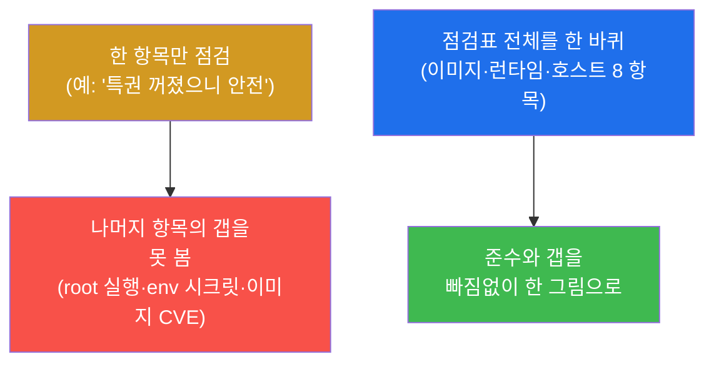
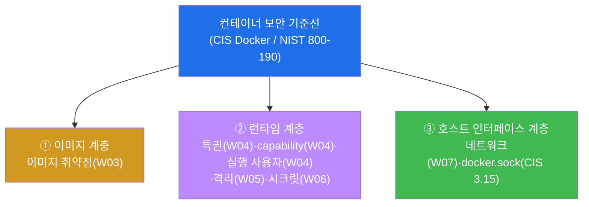
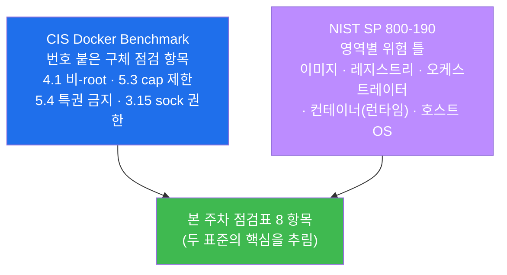
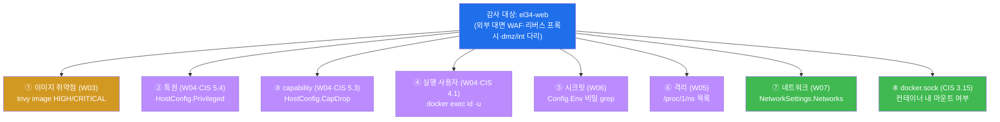
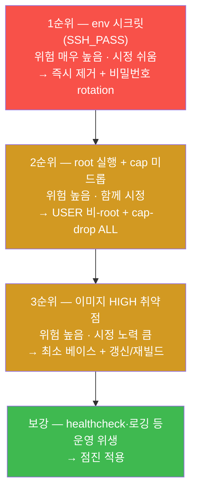
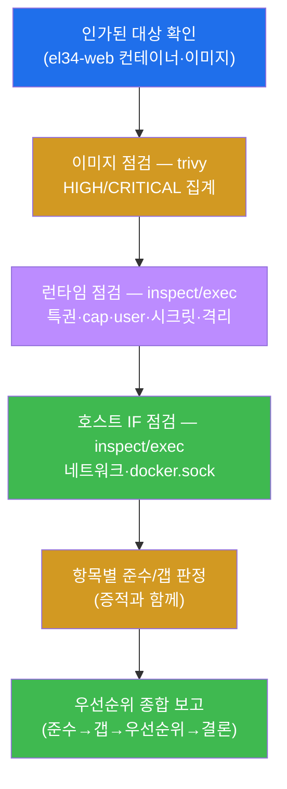
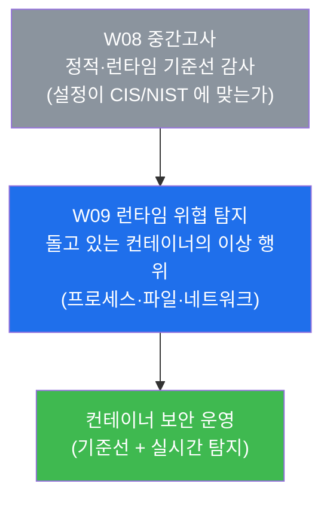

# 클라우드·컨테이너 W08 — 중간고사: 컨테이너 보안 기준선 종합 감사 (W01~W07)

> **본 주차의 한 줄 요약**
>
> 지난 7주 동안 학생은 컨테이너 보안을 **한 항목씩** 익혔다 — 식별(W01)·이미지 레이어(W02)·이미지
> 취약점 스캔(W03)·런타임 특권/capability/실행 사용자(W04)·격리(W05)·시크릿(W06)·네트워크 분리/노출
> (W07). 중간고사는 이 항목들을 **따로따로** 보지 않고, **한 컨테이너(el34-web) 하나를 위에서 아래로
> 한 바퀴 감사하는** 종합 점검으로 통합한다. 학생은 한 컨테이너를 **CIS Docker Benchmark** 와 **NIST
> SP 800-190** 이라는 두 기준선에 비추어, 이미지·런타임·시크릿·네트워크·호스트 인터페이스를 항목별로
> 점검하고, 각 항목이 **준수(compliant)인가 갭(gap)인가**를 명령 출력이라는 증적과 함께 판정한 뒤,
> 마지막에 **갭을 위험·노력 기준으로 우선순위화한 한 장의 기준선 감사 보고서**로 종합하는 능력을
> 평가받는다.
>
> **점검자 한 줄 결론**: 어떤 단일 점검 항목도 컨테이너의 보안 상태 전체를 말해 주지 않는다. 특권이
> 꺼져 있어도(준수) root 로 돌 수 있고(갭), 네트워크가 잘 분리돼 있어도(준수) 이미지에 HIGH 취약점이
> 쌓여 있을 수 있다(갭). **기준선(baseline) 감사** 란 한 항목의 양호함에 안심하지 않고, 정해진 점검표를
> 끝까지 돌려 **준수와 갭을 빠짐없이 한 그림으로 모으고 우선순위로 줄 세우는** 일이다.

---

## 학습 목표

본 주차(중간 평가) 종료 시 학생은 다음 6 가지를 **본인 손으로** 할 수 있어야 한다.

1. **컨테이너 보안 기준선(baseline)** 의 개념과, 그 표준인 **CIS Docker Benchmark** 와 **NIST SP
   800-190** 이 무엇을 점검하라고 하는지를 설명하고, 한 컨테이너를 항목별로 감사하는 절차를 본인
   말로 정리한다.
2. W01~W07 에서 배운 점검 항목 8 가지(이미지 취약점·특권·capability·실행 사용자·시크릿·격리·네트워크·
   docker.sock)를 **하나의 점검표**로 묶고, 각 항목이 컨테이너 보안 어느 계층(이미지/런타임/호스트
   인터페이스)에 속하는지를 설명한다.
3. el34-web 한 컨테이너를 대상으로 각 항목을 `docker inspect`·`docker exec`·`trivy` 로 점검하고, 그
   출력을 읽어 **준수(compliant)/갭(gap)** 을 직접 판정한다(예: Privileged=false 는 준수, CapDrop
   비어 있음은 갭).
4. 각 점검 항목이 왜 보안에 중요한지를 **공격자 관점**(이 갭이 어떻게 악용되는가)으로 설명하고,
   특히 root 실행·env 시크릿·docker.sock 마운트가 어떻게 **컨테이너 탈출(escape)/권한 상승** 으로
   이어지는지를 말한다.
5. el34-web 의 실제 감사 결과 — **준수**(특권 없음·namespace 격리·4-tier 네트워크 분리·docker.sock
   미마운트)와 **갭**(이미지 HIGH 취약점·CapDrop 미설정·root 실행·env 시크릿 SSH_PASS)을 증적과 함께
   판정한다.
6. 판정한 준수/갭을 **위험도와 시정 노력** 기준으로 우선순위화하고, 점검 → 판정 → 우선순위 → 시정
   권고를 **한 장의 기준선 감사 보고서**로 종합한다.

> **중간고사의 시선** — 본 주차는 새 도구를 배우는 주가 아니라, 지금까지 배운 점검을 **한 컨테이너
> 위에서 통합**하는 주다. 채점은 "안전하다/위험하다"라는 인상 평가가 아니라, **각 항목을 올바른
> 명령으로 점검하고 그 출력으로 준수/갭을 판정했는가**, 그리고 **흩어진 판정을 우선순위가 있는 한
> 보고서로 종합했는가**를 본다. 핵심 산출물은 el34-web 한 컨테이너의 8 항목 감사 결과를, 준수 4 +
> 갭 4 로 정리하고 우선순위를 매긴 기준선 감사 보고서다.

---

## 0. 용어 해설 (중간고사에서 다시 쓰는 핵심어)

본 주차는 W01~W07 의 용어를 종합한다. 처음 나오거나 시험에서 특히 중요한 용어를 다시 정리한다. 이미
앞 주차에서 정의한 용어라도, 중간고사에서 **이 의미로 쓴다**는 것을 분명히 하기 위해 다시 적는다.
한 줄 정의로는 부족한 핵심어(기준선·준수/갭·최소 권한·컨테이너 탈출)는 다음 절(0.5)에서 일상 비유로
다시 풀어 설명한다.

| 용어 | 영문 | 뜻 | 비유 |
|------|------|----|------|
| **기준선** | baseline | 시스템이 최소한 지켜야 할 보안 설정의 합의된 기준선 | 건물이 통과해야 할 소방 점검표 |
| **기준선 감사** | baseline audit | 한 시스템을 기준선 점검표에 비춰 항목별로 맞는지 확인하는 일 | 소방관이 점검표를 들고 한 칸씩 확인 |
| **CIS Docker Benchmark** | — | CIS 가 펴낸 Docker 보안 설정 권고 모음(번호로 된 항목) | 업계 합의 컨테이너 점검표 |
| **NIST SP 800-190** | — | 미국 NIST 의 컨테이너 보안 가이드(이미지·런타임·오케스트레이션·호스트) | 정부 발간 컨테이너 보안 지침서 |
| **준수** | compliant | 점검 항목이 기준선을 만족하는 상태(양호) | 점검 칸에 ✓ |
| **갭** | gap / finding | 점검 항목이 기준선을 못 만족하는 상태(미흡, 시정 필요) | 점검 칸에 ✗(지적사항) |
| **최소 권한** | least privilege | 작업에 꼭 필요한 권한만 주고 나머지는 모두 뺌 | 출입증에 필요한 층만 허용 |
| **특권 컨테이너** | privileged container | `--privileged` 로 거의 모든 호스트 권한을 가진 컨테이너 | 만능 마스터키를 쥔 입주자 |
| **capability** | Linux capability | root 권한을 잘게 쪼갠 단위(예: 네트워크 관리 권한 하나) | 마스터키를 기능별로 나눈 개별 열쇠 |
| **시크릿** | secret | 비밀번호·토큰·키처럼 노출되면 안 되는 민감 값 | 금고 비밀번호 |
| **namespace 격리** | namespace isolation | 프로세스·네트워크·파일시스템 등을 컨테이너별로 분리하는 커널 기능 | 한 건물 안 칸막이 사무실 |
| **컨테이너 탈출** | container escape | 컨테이너 안 공격자가 호스트(또는 다른 컨테이너)로 빠져나가는 것 | 사무실 칸막이를 뚫고 건물 전체로 |
| **docker.sock** | Docker socket | docker 데몬을 제어하는 Unix 소켓(`/var/run/docker.sock`) | 모든 입주를 통제하는 관리실 직통 전화 |
| **공격 표면** | attack surface | 공격자가 노릴 수 있는 모든 진입점의 합 | 건물의 출입문·창문 총수 |

> **헷갈리기 쉬운 한 쌍 — 준수(compliant) vs 갭(gap).** 둘은 같은 점검 항목에 대한 정반대의 판정이다.
> **준수** 는 그 항목이 기준선을 만족한다는 뜻(점검표의 ✓)이고, **갭** 은 못 만족해 시정이 필요하다는
> 뜻(점검표의 ✗, 다른 말로 finding·지적사항)이다. 중간고사에서 중요한 것은 **"준수가 많으니 안전하다"
> 가 아니라, 갭 하나하나가 어떤 위험을 남기는가**를 보는 눈이다. 갭이 단 하나라도 — 예컨대 env 에 든
> 시크릿 하나라도 — 치명적 침해의 입구가 될 수 있기 때문에, 감사는 준수를 세는 일이 아니라 **갭을
> 빠짐없이 찾아 우선순위로 줄 세우는** 일이다.

---

## 0.5 신입생 친화 핵심 용어 개념 설명

위 표는 한 줄 정의에 그치므로, 컨테이너 보안 감사를 처음 종합하는 학생이 헷갈리기 쉬운 핵심 용어를
일상 비유로 다시 풀어 설명한다. 본 절을 먼저 읽어두면 본문에서 같은 용어가 다시 나올 때 흐름이 끊기지
않는다.

### 0.5.1 기준선 감사 — 점검표를 들고 한 칸씩 확인하기

소방관이 건물을 점검하는 장면을 떠올려 보자. 소방관은 자기 감으로 "이 건물 안전해 보인다"라고
판정하지 않는다. **정해진 점검표(소화기 위치·비상구 표시·방화문 작동·전기 배선…)** 를 들고 한 칸씩
확인하며 ✓ 또는 ✗ 를 매긴다. 이 점검표가 곧 **기준선(baseline)** 이고, 점검표를 들고 한 칸씩 확인해
✓/✗ 를 매기는 일이 **기준선 감사(baseline audit)** 다.

컨테이너 보안도 똑같다. "이 컨테이너 잘 만든 것 같다"는 인상으로는 부족하다. 업계가 합의한 점검표 —
**CIS Docker Benchmark**(번호 붙은 권고 항목 모음)와 **NIST SP 800-190**(이미지·런타임·호스트를 망라한
가이드) — 를 들고, 이미지에 취약점은 없는가, 특권은 꺼져 있는가, root 로 돌지는 않는가… 를 한 항목씩
확인해 준수(✓)인지 갭(✗)인지를 매긴다. 본 중간고사가 바로 이 점검표를 들고 el34-web 한 컨테이너를
한 바퀴 도는 일이다.

> **용어 — CIS Docker Benchmark / NIST SP 800-190.** **CIS Docker Benchmark** 는 CIS(Center for
> Internet Security)라는 비영리 단체가 펴낸 Docker 보안 설정 권고 모음으로, 각 권고에 `5.4`(특권
> 금지), `5.3`(capability 제한), `4.1`(비-root 사용자), `3.15`(docker.sock 권한) 같은 **번호**가
> 붙어 있어 "어느 항목을 점검했다"를 공통 언어로 가리킬 수 있다. **NIST SP 800-190**(Application
> Container Security Guide)은 미국 표준기술연구소(NIST)가 펴낸 컨테이너 보안 지침으로, 위험을 **이미지
> · 레지스트리 · 오케스트레이터 · 컨테이너(런타임) · 호스트 OS** 의 영역별로 정리한다. 본 주차의 8
> 항목은 이 두 표준의 핵심 권고를 한 점검표로 추린 것이다.

### 0.5.2 컨테이너 보안의 세 층 — 이미지·런타임·호스트 인터페이스

기준선 감사를 항목 8 개로 나열만 하면 외우기 어렵다. 그래서 W01 에서 배운 컨테이너 보안의 **계층**
틀로 묶어 본다. 컨테이너 하나를 점검할 때 우리가 보는 면은 크게 셋이다.

**① 이미지(image)** 는 컨테이너의 "설계도 + 재료"다. 컨테이너가 돌기 전부터 디스크에 들어 있는
파일·패키지의 묶음으로, 여기에 취약한 패키지(CVE)가 들어 있으면 그 컨테이너는 태어날 때부터 약점을
안고 시작한다(점검 항목: 이미지 취약점). **② 런타임(runtime)** 은 컨테이너가 "돌고 있는 동안의
상태"다 — 특권을 가졌는가, 어떤 capability 를 들고 있는가, 누구(root/비-root)로 도는가, 어떤
namespace 로 격리됐는가, 환경변수에 무엇이 들었는가(점검 항목: 특권·capability·실행 사용자·격리·
시크릿). **③ 호스트 인터페이스(host interface)** 는 컨테이너가 "호스트와 맞닿는 면"이다 — 어떤
네트워크에 붙어 있는가, 호스트의 docker.sock 같은 위험한 자원을 마운트했는가(점검 항목: 네트워크·
docker.sock). 이 세 층으로 묶으면 8 항목이 "왜 이걸 보는가"와 함께 머리에 들어온다.

### 0.5.3 최소 권한 — 필요한 만큼만 쥐여 주기

본 주차 갭의 절반(특권·capability·실행 사용자)은 모두 한 원리의 위반이다 — **최소 권한(least
privilege)**. 최소 권한이란 어떤 주체에게 **작업에 꼭 필요한 권한만 주고 나머지는 전부 뺀다**는
원칙이다. 비유하면, 청소 용역에게 건물 마스터키(모든 층·모든 금고를 여는 만능 열쇠)를 통째로 주지
않고, 청소할 층의 문만 여는 출입증을 주는 것이다.

컨테이너에서 이 원리는 세 가지로 나타난다. **특권(privileged)** 컨테이너는 마스터키를 통째로 쥔
입주자다 — 거의 모든 호스트 권한을 가져, 침해되면 호스트 전체가 위험하다(그래서 끄는 것이 준수).
**capability** 는 그 마스터키를 기능별로 쪼갠 개별 열쇠다 — root 의 권한을 `NET_ADMIN`(네트워크
관리), `SYS_ADMIN`(시스템 관리) 등으로 잘게 나눈 것으로, **꼭 필요한 열쇠만 남기고 나머지는 모두
빼는 것(drop ALL 후 필요한 것만 add)** 이 권고다. **실행 사용자(user)** 는 컨테이너 안에서 프로세스가
누구로 도는가다 — root(uid 0)로 돌면 컨테이너 안에서 만능 권한을 갖고, 만약 탈출에 성공하면 호스트
에서도 강한 권한을 노릴 수 있으므로, **비-root 사용자로 도는 것**이 권고다.

### 0.5.4 컨테이너 탈출 — 칸막이를 뚫고 건물 전체로

컨테이너 보안 갭이 왜 무서운지를 한 단어로 말하면 **컨테이너 탈출(container escape)** 이다. 컨테이너는
namespace 로 격리된 "칸막이 사무실"이지만(§0.5.2의 격리), 가상 머신처럼 완전히 분리된 별도 컴퓨터는
아니다 — **호스트의 커널을 공유**한다(한 건물의 골조·배관을 공유하는 칸막이 사무실). 그래서 어떤
갭들은 공격자가 이 칸막이를 뚫고 **호스트나 다른 컨테이너로 빠져나가게(escape)** 만든다.

본 주차의 갭들이 위험한 이유가 바로 이 탈출과 연결되기 때문이다. **특권/과다 capability** 는 칸막이를
얇게 만들어 커널 자원에 손대게 하고, **root 실행** 은 탈출에 성공했을 때 호스트에서도 강한 권한을
쥐게 하며, **docker.sock 마운트** 는 아예 칸막이를 우회해 관리실 직통 전화(docker 데몬)를 컨테이너
안에서 쥐게 한다 — docker.sock 을 쥔 컨테이너는 새 특권 컨테이너를 띄워 호스트 파일시스템을
마운트할 수 있어, 사실상 **즉시 호스트 장악**이 가능하다(§9에서 다시 본다). 감사가 이 항목들을
집요하게 보는 이유는, 이것들이 "칸막이 하나의 문제"가 아니라 "건물 전체로 번지는 입구"이기 때문이다.

---

이 네 개념(기준선 감사 · 세 층 · 최소 권한 · 컨테이너 탈출)이 본 주차 본문의 기반이다. 본문에서 다시
등장할 때 막히면 본 절로 돌아오면 흐름이 끊기지 않는다.

---

## 1. 왜 항목 하나로는 컨테이너 보안을 못 판단하는가

### 1.1 한 줄 답: 보안 상태는 점검표 전체를 돌려야 보인다

W01 에서 컨테이너 보안을 **이미지·런타임·오케스트레이션·호스트** 의 여러 계층으로 봐야 한다고 배웠다.
중간고사는 그 이유를 한 컨테이너 위에서 실증한다. 핵심은 **한 항목의 양호함이 다른 항목의 안전을
보장하지 않는다**는 것이다. el34-web 만 봐도, 특권은 꺼져 있고(준수) namespace 로 잘 격리돼 있지만
(준수), 동시에 root 로 돌고(갭) 환경변수에 SSH 비밀번호가 들어 있다(갭). 만약 점검자가 "특권이
꺼졌으니 됐다"에서 멈췄다면, root 실행과 env 시크릿이라는 더 직접적인 위험을 영영 못 봤을 것이다.



한 항목 점검(주황)은 나머지 갭을 놓치고(빨강), 점검표 전체 감사(파랑)라야 준수와 갭이 모두 한 그림으로
드러난다(초록). 이 차이를 만드는 것이 **기준선 감사**이며, 본 주차가 가르치려는 핵심이다.

### 1.2 점검 항목은 세 계층에 걸쳐 있다

본 주차가 통합하는 8 항목은 §0.5.2 에서 본 세 계층 — **이미지 · 런타임 · 호스트 인터페이스** — 에
나뉘어 걸쳐 있다. 한 계층만 봐서는 안 되는 이유가 여기서 분명해진다.



이미지 계층은 컨테이너가 돌기 전부터 디스크에 있는 약점(CVE)을, 런타임 계층은 돌고 있는 동안의
권한·격리·비밀을, 호스트 인터페이스 계층은 호스트와 맞닿는 면(네트워크·docker.sock)을 본다. 세 계층은
공격의 단계가 다르다 — 이미지 갭은 침입의 발판(취약 패키지)을, 런타임 갭은 침입 후 권한 확대와 정보
탈취를, 호스트 인터페이스 갭은 컨테이너 탈출과 호스트 장악을 가능케 한다. 그래서 셋을 모두 점검해야
한 컨테이너의 보안 상태가 온전히 보인다.

### 1.3 "왜 중요한가" — 한 갭이 사슬의 시작이 된다

컨테이너 침해는 보통 한 갭에서 시작해 다른 갭으로 이어진다. 예를 들어 이미지의 취약 패키지(이미지
갭)로 코드 실행을 얻은 공격자가, 그 컨테이너가 root 로 돌고 있다는 점(런타임 갭)을 이용해 컨테이너
안에서 강한 권한을 쥐고, env 에 든 SSH 비밀번호(시크릿 갭)로 다른 시스템에 로그인하며, 만약
docker.sock 이 마운트돼 있었다면(호스트 인터페이스 갭) 호스트까지 장악한다. **갭 하나하나는 작아
보여도, 이어지면 완전한 침해 사슬**이 된다. 그래서 감사는 "치명적인 한 갭"만 찾는 것이 아니라 모든
갭을 모아, 어떤 갭들이 이어지면 위험한지를 우선순위로 판단하는 일이다.

### 1.4 한계 — 이 시험이 다루지 않는 것

본 중간고사는 W01~W07 의 범위 안에서 한 컨테이너의 정적·런타임 기준선을 감사한다. 따라서 **W09 이후에
배울 내용**은 시험 대상이 아니다 — 오케스트레이션(Kubernetes Pod 보안·NetworkPolicy)의 깊은 점검,
런타임 위협 탐지(falco 등 행위 기반 실시간 탐지), 이미지 서명·공급망(supply chain) 무결성 검증,
레지스트리 보안은 다루지 않는다. 또한 본 시험은 **읽기 전용 점검**이다 — 갭을 발견하되 그 자리에서
시정(이미지 재빌드·설정 변경)하지 않는다. 시정은 운영팀의 변경관리로 넘기고, 본 시험은 **판정과
우선순위 권고**까지를 평가한다(§9).

---

## 2. 기준선과 표준 — CIS Docker / NIST SP 800-190

### 2.1 한 줄 정의와 왜 중요한가

**기준선(baseline)** 은 한 시스템이 최소한 지켜야 할 보안 설정의 합의된 기준이고, **기준선 감사** 는
그 기준선 점검표에 비춰 시스템을 항목별로 확인하는 일이다(§0.5.1). 이것이 중요한 이유는, 기준선이
없으면 점검이 **점검자의 주관**에 휘둘리기 때문이다. 같은 컨테이너를 두 사람이 봐도 "안전하다/위험
하다"가 갈린다면 점검이 신뢰받지 못한다. 합의된 기준선(CIS·NIST)을 쓰면, **누가 점검해도 같은 항목을
같은 기준으로 판정**하므로 결과가 재현 가능하고 감사로서 인정받는다.

### 2.2 두 표준이 무엇을 점검하라고 하는가

본 주차는 두 표준의 핵심을 한 점검표로 추려 쓴다. 둘은 서로 보완한다 — **CIS 는 "어떤 설정을 어떻게"**
라는 구체적 점검 항목(번호)을, **NIST 는 "어느 영역의 위험을 봐야 하나"** 라는 큰 틀을 준다.



- **CIS Docker Benchmark** — Docker 호스트·데몬·이미지·런타임 설정을 번호로 정리한 권고 모음이다. 본
  주차에서 직접 인용하는 번호는 **4.1**(컨테이너를 비-root 사용자로 실행), **5.3**(불필요한
  capability 제한 = drop ALL 후 필요한 것만), **5.4**(특권 컨테이너 사용 금지), **3.15**(docker.sock
  권한 점검)이다. 각 갭/준수를 이 번호로 가리키면 보고서가 표준에 근거한 것이 된다.
- **NIST SP 800-190**(Application Container Security Guide) — 컨테이너 생애주기의 위험을 **이미지 →
  레지스트리 → 오케스트레이터 → 컨테이너(런타임) → 호스트 OS** 영역별로 정리한다. 본 주차의 이미지
  취약점은 NIST 의 "이미지" 영역, 특권·capability·user·격리·시크릿은 "컨테이너(런타임)" 영역,
  네트워크·docker.sock 은 "호스트 OS" 영역에 대응한다 — 이것이 §1.2 의 세 계층 틀과 정확히 겹친다.

> **용어 — CVE.** 이미지 취약점 점검(§3)에서 다시 나오는 **CVE**(Common Vulnerabilities and
> Exposures)는 공개된 보안 취약점에 붙는 표준 식별 번호(예: `CVE-2023-xxxxx`)다. 어떤 패키지에 알려진
> 취약점이 있으면 거기에 CVE 번호가 붙고, 심각도(LOW/MEDIUM/HIGH/CRITICAL)로 등급이 매겨진다. 이미지
> 스캐너(trivy)는 이미지 안 패키지들의 버전을 CVE 데이터베이스와 대조해 "이 이미지에 어떤 CVE 가 몇
> 개 있는가"를 알려 준다.

### 2.3 한계 — 기준선 통과가 "안전 완료"는 아니다

기준선은 **최소선(minimum)** 이지 **상한선이 아니다.** 점검표의 모든 항목을 준수해도, 그것은 "알려진
기본 위험을 피했다"는 뜻이지 "어떤 공격에도 안전하다"는 뜻이 아니다. 애플리케이션 자체의 취약점
(SQLi·RCE 등 web-vuln 트랙), 제로데이 취약점, 잘못된 비즈니스 로직은 기준선 점검표 밖에 있다. 또
기준선은 시간이 지나며 표류(drift)한다 — 오늘 준수여도 새 패키지를 깔거나 설정을 바꾸면 내일 갭이
될 수 있어, 감사는 **한 번이 아니라 주기적으로** 돌려야 한다. 본 주차는 한 시점의 기준선 감사를
완결하는 데까지를 다룬다.

---

## 3. el34-web 감사 지도 — 무엇을 어떤 명령으로 보나

중간고사의 모든 점검은 el34 의 **한 컨테이너 `el34-web`** 을 대상으로 한다. 왜 web 인가 — web 은
외부 대면 WAF + 리버스 프록시로서 외부 요청이 내부 앱에 닿는 유일한 길목이며(W07), dmz 와 int 두
네트워크를 잇는 다리 컨테이너라 침해 시 영향이 가장 큰 자산이기 때문이다. 가장 단단해야 할 이
컨테이너를 기준선으로 감사하는 것이 시험의 시나리오다.

### 3.1 8 항목을 세 계층 지도 위에 올리기



이 그림이 중간고사 전체의 지도다 — 노랑(이미지) 1 항목, 보라(런타임) 5 항목, 초록(호스트 인터페이스)
2 항목으로, §1.2 의 세 계층에 정확히 대응한다. 학생이 시험에서 할 일은 이 8 항목을 각 명령으로 점검해
준수/갭을 판정하고, 마지막에 한 보고서로 종합하는 것이다.

### 3.2 점검 명령의 큰 틀 — inspect · exec · trivy

8 항목은 세 종류의 명령으로 점검한다. 이 셋의 차이를 분명히 해 두면 각 미션에서 "왜 이 명령인가"가
바로 이해된다.

- **`docker inspect`** — 컨테이너의 **설정·메타데이터**(특권 여부·CapDrop·환경변수·네트워크 소속·포트
  매핑)를 읽는다. 컨테이너를 만들 때 docker 데몬에 기록된 "이 컨테이너는 이렇게 돌도록 설정됐다"는
  명세를 그대로 보여 준다. 본 주차의 특권·capability·시크릿·네트워크 점검이 이 명령을 쓴다.
- **`docker exec`** — 컨테이너 **안에서 명령을 실행**한다. 설정이 아니라 "지금 컨테이너 안의 실제
  상태"를 봐야 할 때 쓴다 — 실행 사용자(`id -u`)·namespace 목록(`ls /proc/1/ns`)·컨테이너 내부의
  docker.sock 존재 여부가 그렇다.
- **`trivy image`** — 이미지 안 패키지들을 CVE 데이터베이스와 대조해 **취약점을 스캔**한다(W03). 이것은
  컨테이너가 아니라 그 컨테이너가 만들어진 **이미지**를 보는 도구다. 본 주차의 이미지 취약점 점검이
  이 명령을 쓴다.

> **점검 관용구.** 본 주차의 점검 명령들은 끝에 `echo target_ok` / `echo nets_ok` / `echo sock_checked`
> 같은 **확인 토큰**을 찍거나, 판정 결과를 `compliant=...` / `gap=...` 형태로 출력한다. 토큰은 명령이
> 끝까지 수행돼 그 단계 점검이 완료됐음을, `compliant`/`gap` 접두는 그 항목의 **판정 결과**를 나타낸다 —
> 학생은 이 출력으로 각 항목의 통과·판정을 확인한다.

---

## 4. ① 이미지 계층 — 이미지 취약점 (W03)

### 4.1 한 줄 정의와 왜 중요한가

**이미지 취약점 점검** 은 컨테이너가 만들어진 이미지 안의 패키지들을 CVE 데이터베이스와 대조해, 알려진
취약점이 몇 개 있는지를 보는 일이다(W03). 이것이 중요한 이유는, 이미지 갭은 컨테이너가 **돌기도 전에
이미 들어 있는** 약점이기 때문이다 — 런타임을 아무리 잘 강화해도, 베이스 이미지에 원격 코드 실행이
가능한 HIGH 취약점이 있으면 그것이 곧 침입의 발판이 된다. 그래서 이미지 점검은 감사의 첫 항목으로
둔다.

### 4.2 el34 에서 어떻게 — trivy 로 HIGH/CRITICAL 집계

el34-web 이미지의 취약점은 호스트의 `trivy` 로 스캔한다(lab 미션 2).

```bash
/usr/local/bin/trivy image --scanners vuln --severity HIGH,CRITICAL --no-progress el34-web:latest 2>/dev/null | grep -iE 'Total:'
```

- `trivy image` — 지정한 이미지(`el34-web:latest`)의 패키지를 CVE DB 와 대조해 취약점을 찾는다.
- `--scanners vuln` 은 취약점(CVE)만 보겠다는 뜻이고, `--severity HIGH,CRITICAL` 은 심각도가 높은
  것만 추린다(LOW/MEDIUM 잡음 제외). `--no-progress` 는 진행 막대를 끄고, `grep 'Total:'` 은 결과
  요약의 **집계 줄**(심각도별 개수)만 뽑는다.

el34-web 을 스캔하면 **HIGH 취약점이 존재**한다 — 즉 이 항목은 **갭**이다. 베이스 이미지의 패키지들이
시간이 지나며 CVE 가 누적됐기 때문으로, 시정은 **최소 베이스 이미지로 교체 + 패키지 갱신/재빌드**다.
점검자는 "취약점이 있다/없다"가 아니라 **집계 숫자(HIGH 몇 개)** 를 증적으로 제시하고, 그것이 NIST
의 "이미지" 영역 위험에 해당함을 판정한다.

### 4.3 한계 — 스캔은 "알려진" 취약점만 본다

trivy 의 스캔은 **CVE 데이터베이스에 등록된 알려진 취약점**만 잡는다. 아직 공개되지 않은 제로데이,
애플리케이션 자체 코드의 로직 취약점, 설정 실수는 이미지 스캔으로 잡히지 않는다. 또 심각도(HIGH)가
높다고 모두 실제로 악용 가능한 것은 아니다 — 그 취약 패키지가 실제로 공격 경로에 노출돼 있는지는
별도 판단이 필요하다. 본 주차는 HIGH/CRITICAL 집계로 이미지 표면의 위험을 **정량화**하는 데까지를
다룬다.

---

## 5. ② 런타임 계층 — 특권·capability·실행 사용자 (W04)

런타임 계층의 다섯 항목 중 셋(특권·capability·실행 사용자)은 모두 **최소 권한(§0.5.3)** 의 점검이다.
한 묶음으로 보면 "이 컨테이너가 필요 이상의 권한을 쥐고 있지 않은가"라는 한 질문의 세 측면이다.

### 5.1 특권 (CIS 5.4) — 마스터키를 쥐었는가

**특권 컨테이너(privileged)** 는 `--privileged` 플래그로 거의 모든 호스트 권한과 디바이스 접근을 가진
컨테이너다(§0.5.3). 이것이 위험한 이유는, 특권 컨테이너가 침해되면 호스트의 커널 자원에 직접 손대
컨테이너 탈출이 매우 쉬워지기 때문이다 — 그래서 CIS 5.4 는 특권 컨테이너 사용을 **금지**한다.

el34-web 의 특권 여부는 `docker inspect` 의 `HostConfig.Privileged` 로 본다(lab 미션 3).

```bash
P=$(docker inspect el34-web --format '{{.HostConfig.Privileged}}'); echo "privileged=$P"; [ "$P" = "false" ] && echo "compliant=not_privileged" || echo "gap=privileged"
```

- `HostConfig.Privileged` 는 컨테이너가 특권 모드인지를 `true`/`false` 로 담는다.
- 뒤의 `[ "$P" = "false" ] && ... || ...` 는 그 값이 `false` 면 `compliant=not_privileged`(준수)를,
  아니면 `gap=privileged`(갭)를 출력하는 **판정 한 줄**이다.

el34-web 은 `Privileged=false` — 즉 이 항목은 **준수(CIS 5.4)** 다. 특권을 꺼 둔 것은 잘한 설정이며,
보고서의 준수 항목에 들어간다.

### 5.2 capability (CIS 5.3) — 불필요한 열쇠를 뺐는가

**capability** 는 root 의 권한을 기능별로 쪼갠 개별 단위다(§0.5.3). docker 컨테이너는 기본적으로
일정한 capability 묶음을 갖고 시작하는데, CIS 5.3 은 **불필요한 capability 를 모두 빼라(drop ALL 후
꼭 필요한 것만 add)** 고 권고한다 — 안 쓰는 열쇠를 들고 있으면 공격자가 그 열쇠로 권한을 확대할 수
있기 때문이다.

el34-web 이 어떤 capability 를 뺐는지는 `docker inspect` 의 `HostConfig.CapDrop` 으로 본다(lab 미션 4).

```bash
docker inspect el34-web --format 'CapDrop={{.HostConfig.CapDrop}}'; D=$(docker inspect el34-web --format '{{.HostConfig.CapDrop}}'); echo "$D" | grep -qiE 'ALL|CAP_' && echo "compliant=caps_dropped" || echo "gap=no_capdrop"
```

- `HostConfig.CapDrop` 은 컨테이너가 **명시적으로 뺀** capability 목록이다. 비어 있으면(`[]`) 아무것도
  안 뺐다는 뜻 — 기본 묶음을 그대로 들고 있다.
- 판정 한 줄은 그 목록에 `ALL` 또는 `CAP_` 가 보이면 `compliant=caps_dropped`(준수)를, 아니면
  `gap=no_capdrop`(갭)를 출력한다.

el34-web 은 `CapDrop` 이 **비어 있다** — 즉 불필요한 capability 를 빼지 않았으므로 이 항목은 **갭(CIS
5.3)** 이다. 시정은 `--cap-drop ALL` 로 모두 뺀 뒤 웹 서버가 80/443 을 바인딩하는 데 필요한 최소
capability(`NET_BIND_SERVICE` 등)만 다시 add 하는 것이다.

### 5.3 실행 사용자 (CIS 4.1) — root 로 도는가

**실행 사용자** 는 컨테이너 안에서 프로세스가 누구(uid)로 도는가다. root(uid 0)로 돌면 컨테이너 안에서
만능 권한을 갖고, 이미지/런타임 갭으로 탈출에 성공했을 때 호스트에서도 강한 권한을 노릴 수 있다 —
그래서 CIS 4.1 은 컨테이너를 **비-root 사용자로 실행**하라고 권고한다(§0.5.3).

el34-web 의 실행 사용자는 컨테이너 안에서 `id -u` 로 본다(lab 미션 5).

```bash
docker exec el34-web id -u | grep -q '^0$' && echo "gap=runs_as_root" || echo "compliant=nonroot"
```

- `id -u` 는 현재 프로세스의 사용자 uid 를 숫자로 출력한다. `0` 이면 root 다.
- `grep -q '^0$'` 가 그 값이 정확히 `0` 인지를 보고, 맞으면 `gap=runs_as_root`(갭), 아니면
  `compliant=nonroot`(준수)를 출력한다.

el34-web 은 **root(uid 0)로 실행** 중 — 즉 이 항목은 **갭(CIS 4.1)** 이다. 시정은 Dockerfile 에
`USER` 지시문으로 비-root 사용자를 지정하고, 그 사용자가 필요한 파일/포트에 접근할 수 있게 권한을
조정하는 것이다.

> **세 항목의 묶음 판정.** 특권(준수)·capability(갭)·실행 사용자(갭)는 모두 최소 권한의 측면이다.
> el34-web 은 "특권이라는 마스터키는 안 쥐었지만(준수), 안 쓰는 개별 열쇠를 빼지 않았고(갭) root 라는
> 만능 신분으로 돈다(갭)"로 요약된다. 이 묶음에서 가장 시급한 시정은 **root → 비-root + cap drop
> ALL** 을 함께 적용하는 것이다(§9 우선순위).

---

## 6. ② 런타임 계층 — 격리 (W05) · 시크릿 (W06)

### 6.1 격리 (W05) — namespace 로 칸막이가 쳐져 있는가

**namespace 격리** 는 프로세스·네트워크·파일시스템·사용자 등을 컨테이너별로 분리하는 커널 기능이다
(§0.5.2·§0.5.4). 컨테이너가 자기만의 namespace 들을 갖고 있어야 호스트·다른 컨테이너와 칸막이가
쳐진다 — 만약 `--pid=host`·`--net=host` 처럼 호스트 namespace 를 공유하면 그 칸막이가 사라진다.

el34-web 의 namespace 격리는 컨테이너 안에서 PID 1 의 namespace 목록을 보아 확인한다(lab 미션 6).

```bash
docker exec el34-web sh -c "ls /proc/1/ns/ | tr '\n' ' '"; echo; echo ns_ok
```

- `/proc/1/ns/` 는 PID 1(컨테이너의 첫 프로세스)이 속한 namespace 들을 링크로 보여 주는 커널
  디렉터리다. `mnt`(파일시스템)·`net`(네트워크)·`pid`(프로세스)·`uts`(호스트명)·`ipc`·`user` 등이
  나온다.
- `tr '\n' ' '` 는 줄바꿈을 공백으로 바꿔 한 줄로 보여 주고, `echo ns_ok` 는 점검 완료 토큰이다.

el34-web 은 자체 namespace 들을 갖고 있다 — 즉 칸막이가 쳐져 있어 이 항목은 **준수(W05)** 다. 다만
한계가 있다 — namespace 로 격리돼도 컨테이너는 **호스트 커널을 공유**하므로(§0.5.4), 커널 자체의
취약점을 통한 탈출까지 막아 주지는 않는다. 격리는 "칸막이"이지 "별도 건물(VM)"이 아니라는 점을 판정에
함께 적는다.

### 6.2 시크릿 (W06) — 비밀이 환경변수에 노출됐는가

**시크릿(secret)** 은 비밀번호·토큰·키처럼 노출되면 안 되는 민감 값이다. 이것을 **환경변수(env)** 에
넣는 것은 흔하지만 위험한 실수다 — env 는 `docker inspect` 로 누구나 읽을 수 있고, 자식 프로세스에
상속되며, 로그·오류 메시지에 새기 쉽기 때문이다(W06). 그래서 시크릿은 env 가 아니라 **외부 시크릿
관리자(secrets manager)나 마운트된 파일**로 주입해야 한다.

el34-web 의 환경변수에 비밀이 들어 있는지는 `docker inspect` 의 `Config.Env` 를 비밀 키워드로 세어
본다(lab 미션 6 — lab 의 order 6).

```bash
D=$(docker inspect el34-web --format '{{range .Config.Env}}{{println .}}{{end}}' | grep -ciE 'pass|secret|token|key|cred'); echo "env_secrets=$D"; [ "$D" -gt 0 ] && echo "gap=secret_in_env" || echo "compliant=no_env_secret"
```

- `Config.Env` 는 컨테이너의 환경변수 목록이다. `{{range ...}}{{println .}}{{end}}` 로 한 줄씩
  출력한 뒤, `grep -ciE 'pass|secret|token|key|cred'` 로 비밀로 보이는 이름이 든 줄의 **개수**를
  센다(`-c` 개수, `-i` 대소문자 무시, `-E` 확장 정규식).
- 그 개수가 0 보다 크면 `gap=secret_in_env`(갭), 아니면 `compliant=no_env_secret`(준수)다.

el34-web 의 env 에는 **`SSH_PASS` 같은 비밀이 노출**돼 있다 — 즉 이 항목은 **갭(W06)** 이다. 이것은
본 감사에서 **가장 직접적이고 시급한 갭**이다 — env 에 든 비밀번호는 컨테이너에 접근할 수 있는 누구
에게나 즉시 노출되고, 그 SSH 비밀번호로 다른 시스템에 측면 이동할 수 있기 때문이다. 시정은 env 에서
비밀을 제거하고 **즉시 rotation(비밀번호 교체)** 한 뒤, 시크릿을 외부 관리자/마운트 파일로 주입하는
것이다(§9 우선순위 1순위).

---

## 7. ③ 호스트 인터페이스 계층 — 네트워크 (W07) · docker.sock (CIS 3.15)

### 7.1 네트워크 (W07) — 분리된 망에 붙어 있는가

**네트워크 점검** 은 컨테이너가 어떤 docker 네트워크(들)에 붙어 있는가를 보는 일이다(W07). 평면
네트워크에 다 몰아넣으면 한 컨테이너 침해가 옆으로 번지므로(측면 이동), 역할별로 분리된 네트워크에
붙어 있는 것이 좋다.

el34-web 의 네트워크 소속은 `docker inspect` 의 `NetworkSettings.Networks` 로 본다(lab 미션 8).

```bash
docker inspect el34-web --format '{{range $k,$v := .NetworkSettings.Networks}}{{$k}} {{end}}'; echo nets_ok
```

- `NetworkSettings.Networks` 는 컨테이너가 붙은 네트워크들의 맵이다. `{{range $k,$v := ...}}` 로 붙은
  네트워크 이름(`$k`)을 하나씩 출력하고, `echo nets_ok` 는 점검 완료 토큰이다.

el34-web 은 **el34 의 4-tier 분리 네트워크**(ext/pipe/dmz/int)의 일부에 붙어 있으며, 구체적으로는
**dmz 와 int 두 네트워크의 다리** 다(W07 §3.2). 망이 역할별로 분리돼 있다는 점에서 이 항목은
**준수(W07)** 다 — el34 는 평면이 아니라 4-tier 로 나뉘어 측면 이동을 구조적으로 줄였다. 다만 web 이
다리 컨테이너라는 점은 판정에 함께 적는다 — 분리는 잘됐으나, 그 다리인 web 이 침해되면 dmz·int 양쪽이
노출되므로 web 은 가장 단단히 지켜야 한다(그래서 이 컨테이너를 감사 대상으로 골랐다).

### 7.2 docker.sock (CIS 3.15) — 관리실 직통 전화가 컨테이너에 들어가 있는가

**docker.sock**(`/var/run/docker.sock`)은 docker 데몬을 제어하는 Unix 소켓으로, 이것을 쥔 주체는
컨테이너를 만들고·지우고·호스트 파일시스템을 마운트할 수 있다 — 사실상 docker 의 관리실 직통
전화다(§0.5.4). 이 소켓을 **컨테이너 안에 마운트**하면, 그 컨테이너가 침해됐을 때 공격자는 소켓으로
새 특권 컨테이너를 띄워 호스트를 통째로 장악할 수 있다(가장 잘 알려진 컨테이너 탈출 경로 중 하나).
그래서 CIS 3.15 는 docker.sock 의 노출/권한을 점검 대상으로 둔다.

el34-web 안에 docker.sock 이 마운트돼 있는지는 컨테이너 안에서 소켓 파일 존재를 본다(lab 미션 9).

```bash
docker exec el34-web sh -c "ls -la /var/run/docker.sock 2>/dev/null || echo no_sock_in_container"; echo sock_checked
```

- `ls -la /var/run/docker.sock` 은 컨테이너 안에 그 소켓이 있으면 권한·소유자와 함께 보여 주고, 없으면
  `||` 뒤의 `echo no_sock_in_container` 가 실행된다. `echo sock_checked` 는 점검 완료 토큰이다.

el34-web 안에는 docker.sock 이 **마운트돼 있지 않다**(`no_sock_in_container`) — 즉 이 항목은
**준수(양호)** 다. 컨테이너에 docker.sock 을 넣지 않은 것은 잘한 설정으로, 가장 위험한 탈출 경로
하나를 차단한 것이다.

> **호스트의 docker.sock 권한 — 점검의 다른 면.** CIS 3.15 는 두 가지를 본다 — (a) 컨테이너에
> docker.sock 이 **마운트됐는가**(위 점검, el34-web 은 미마운트=양호)와, (b) **호스트의** docker.sock
> 파일 권한이 적절한가다. el34 호스트의 `/var/run/docker.sock` 은 권한 **660**(소유자 root, 그룹
> docker 에 읽기·쓰기, 그 외 접근 없음)으로, docker 그룹에 속한 사용자만 데몬에 접근하게 제한돼
> 있다 — 이는 의도된 표준 권한이다. 핵심 원칙은 **소켓을 컨테이너에 넣지 않고, 호스트에서도 docker
> 그룹 밖에는 노출하지 않는** 것이다. 본 시험의 점검은 컨테이너 내 미마운트 확인까지를 평가한다.

---

## 8. 판정 프레임워크 — el34-web 8 항목 한 표로

중간고사의 핵심 능력은 **각 항목을 점검해 준수/갭을 즉시 판정**하는 것이다. 다음 표가 el34-web 감사의
정답지다 — 학생은 각 항목을 알맞은 명령으로 점검하고, 그 출력으로 이 판정을 증적과 함께 재현한다.

| # | 점검 항목 | 계층 | 표준 | 점검 명령(핵심) | el34-web 판정 | 증적 |
|---|----------|------|------|----------------|--------------|------|
| ① | 이미지 취약점 | 이미지 | NIST 이미지/W03 | `trivy image --severity HIGH,CRITICAL` | **갭** (HIGH 존재) | Total: 집계 |
| ② | 특권 | 런타임 | CIS 5.4 | inspect `HostConfig.Privileged` | **준수** (false) | `compliant=not_privileged` |
| ③ | capability | 런타임 | CIS 5.3 | inspect `HostConfig.CapDrop` | **갭** (미설정) | `gap=no_capdrop` |
| ④ | 실행 사용자 | 런타임 | CIS 4.1 | exec `id -u` | **갭** (root uid0) | `gap=runs_as_root` |
| ⑤ | 시크릿 | 런타임 | NIST 런타임/W06 | inspect `Config.Env` grep | **갭** (SSH_PASS) | `gap=secret_in_env` |
| ⑥ | 격리 | 런타임 | CIS/W05 | exec `ls /proc/1/ns` | **준수** (자체 ns) | `ns_ok` + ns 목록 |
| ⑦ | 네트워크 | 호스트 IF | W07 | inspect `NetworkSettings.Networks` | **준수** (4-tier 분리) | `nets_ok` + dmz/int |
| ⑧ | docker.sock | 호스트 IF | CIS 3.15 | exec `ls docker.sock` | **준수** (미마운트) | `no_sock_in_container` |

이 표를 두 방향으로 읽는다. **"무엇이 준수인가"** — 특권 없음·격리·네트워크 분리·docker.sock 미마운트
(4 항목). **"무엇이 갭인가"** — 이미지 HIGH 취약점·CapDrop 미설정·root 실행·env 시크릿(4 항목). el34-web
은 **격리와 분리·특권 통제는 양호하나, 최소 권한(cap·root)과 시크릿·이미지 위생에 갭** 이 있는
컨테이너로 요약된다. 두 방향을 모두 말할 수 있으면 기준선 감사의 사고를 체득한 것이다.

> **시험의 채점 포인트.** 각 항목을 올바른 명령으로 점검하고, 그 출력으로 준수/갭을 판정하며, 마지막에
> 갭을 우선순위가 있는 한 보고서로 종합하는 것. "안전하다/위험하다"는 인상이 아니라 **명령 출력이라는
> 증적**이 점수다.

---

## 9. 우선순위 — 갭을 위험·노력으로 줄 세우기

감사의 마지막 단계는 **갭을 모아 우선순위로 줄 세우는** 것이다. 갭 4 개를 똑같이 다루지 않고, **위험도
(악용되면 얼마나 치명적인가)** 와 **시정 노력(고치기 쉬운가)** 을 함께 보아 순서를 정한다. 이것이
보고서를 "지적사항 나열"에서 "행동 가능한 권고"로 바꾸는 핵심이다.



- **1순위 — env 시크릿(SSH_PASS) 즉시 제거 + rotation.** 위험이 가장 직접적(노출된 비밀번호는 즉시
  악용 가능)인데 시정은 비교적 쉽다(env 에서 빼고 비밀번호를 바꾸면 된다). "위험 높음 + 노력 적음"은
  항상 최우선이다.
- **2순위 — root 실행 → 비-root + capability drop ALL(함께).** 두 갭은 모두 최소 권한 위반이고 함께
  고치는 것이 자연스럽다 — Dockerfile 에 `USER` 로 비-root 를 지정하고 `--cap-drop ALL` 후 필요한
  최소 capability 만 add 한다.
- **3순위 — 이미지 HIGH 취약점 갱신/재빌드.** 위험은 높지만 시정 노력이 크다(베이스 교체·재빌드·회귀
  테스트). 그래서 1·2 순위 뒤에 두되, 정기 패치 주기에 반드시 넣는다.
- **보강 — 운영 위생.** healthcheck 추가, 로깅 정비 같은 항목은 치명적 갭은 아니나 운영 성숙도를
  높이므로 점진적으로 적용한다.

> **왜 우선순위인가.** 현실의 운영팀은 자원이 한정돼 모든 갭을 한 번에 못 고친다. 그래서 감사 보고서의
> 가치는 "무엇이 갭인가"를 넘어 **"무엇부터 고쳐야 하는가"** 에 있다. 위험과 노력을 함께 본 우선순위가
> 있어야 보고서가 경영진·운영팀에게 실제로 행동을 끌어내는 문서가 된다.

---

## 10. 실습 안내 — 중간고사 lab 10 미션 (4 축 설명)

중간고사 실습은 10 미션으로 구성되며, lab 의 `order` 와 1:1 로 대응한다. 미션은 한 컨테이너(el34-web)를
대상 식별 → 이미지 → 런타임(특권·cap·user·시크릿·격리) → 호스트 인터페이스(네트워크·docker.sock) →
종합 보고의 순서로 흐른다. 각 미션을 **4 축**으로 설명한다 — 왜 하는가 / 무엇을 알 수 있는가 / 결과
해석(준수 vs 갭) / 실전 활용.

> **시험 진행 원칙.** 모든 명령은 el34 호스트(`ssh ccc@192.168.0.80`, 비밀번호 1)에서 `docker
> inspect`·`docker exec`·`trivy` 로 실행한다. 이번 주는 **신규 설치가 없고**, 점검 대상은 인가된
> el34 컨테이너(`el34-web`) 하나뿐이다. 본 주차의 명령은 모두 **읽기 전용 점검**이며 컨테이너 설정을
> 바꾸지 않는다(시정은 권고만, 변경은 운영팀의 변경관리로). 합격 임계값은 0.7 이다.

### 미션 1 — 점검: 대상 식별 (8점)

> **왜 하는가?** 모든 기준선 감사의 전제는 대상 컨테이너가 실제로 돌고 있다는 것이다. 점검자는 본격
> 감사 전 항상 대상(el34-web)이 가동 중이고 조회 가능한지부터 확인한다.
>
> **무엇을 알 수 있는가?** `docker inspect ... .State.Status` 로 el34-web 의 가동 상태 — 기준선 감사의
> 대상이 살아 있고 조회 가능한지.
>
> **결과 해석.** 정상: 출력에 `target_ok` 가 나옴(대상 확인 성공). 비정상: 응답이 없거나 오류면 호스트
> SSH·컨테이너 상태(`docker ps`)·docker 권한부터 점검한다.
>
> **실전 활용.** 컨테이너 감사 착수 시 첫 확인. 점검 대상이 실제 가동·조회 가능한지 검증하는 단계다.

### 미션 2 — ① 이미지 취약점 (W03) (12점)

> **왜 하는가?** 감사의 첫 실질 항목은 이미지다. 컨테이너가 돌기 전부터 들어 있는 약점(CVE)을 봐야
> 침입의 발판이 될 이미지 표면을 안다(§4).
>
> **무엇을 알 수 있는가?** `trivy image --severity HIGH,CRITICAL` 로 el34-web 이미지의 심각도 높은
> 취약점 집계. 이미지 갭이 NIST 의 "이미지" 영역 위험에 해당한다는 것.
>
> **결과 해석.** 갭(예상): `Total:` 집계에 HIGH 취약점이 잡힘 — 베이스 패키지에 CVE 가 누적됐다는 뜻.
> 시정은 최소 베이스 + 갱신/재빌드. 출력이 비면 trivy 경로·이미지 태그(`el34-web:latest`)를 재확인.
>
> **실전 활용.** 배포 전·정기 점검의 이미지 위생 검사. CI 파이프라인에서 HIGH/CRITICAL 이 있으면
> 빌드를 막는 게이트로 쓰는 표준 절차.

### 미션 3 — ② 특권 (W04, CIS 5.4) (10점)

> **왜 하는가?** 런타임 최소 권한의 첫 점검은 특권이다. 특권 컨테이너는 호스트 권한을 거의 다 쥐어
> 탈출이 쉬우므로 가장 먼저 확인한다(§5.1).
>
> **무엇을 알 수 있는가?** `HostConfig.Privileged` 로 el34-web 이 특권 모드인지. CIS 5.4(특권 금지)
> 준수 여부.
>
> **결과 해석.** 준수: `Privileged=false` → `compliant=not_privileged`. 잘 끈 설정이다. 만약 `true`
> 였다면 `gap=privileged` 로 최우선 갭이 됐을 것.
>
> **실전 활용.** 컨테이너 점검의 1순위 확인. 특권 컨테이너는 운영에서 극히 예외적으로만 허용하고,
> 발견 즉시 사유를 검증한다.

### 미션 4 — ③ Capability (W04, CIS 5.3) (10점)

> **왜 하는가?** 특권을 안 썼어도, 불필요한 개별 capability 를 들고 있으면 그것으로 권한이 확대된다.
> 안 쓰는 열쇠를 뺐는지 확인한다(§5.2).
>
> **무엇을 알 수 있는가?** `HostConfig.CapDrop` 으로 el34-web 이 어떤 capability 를 명시적으로 뺐는지.
> CIS 5.3(drop ALL 후 최소만) 준수 여부.
>
> **결과 해석.** 갭: `CapDrop` 이 비어 있음 → `gap=no_capdrop`. 기본 capability 묶음을 그대로 들고
> 있다는 뜻. 시정은 `--cap-drop ALL` 후 `NET_BIND_SERVICE` 등 최소만 add.
>
> **실전 활용.** 최소 권한 적용의 표준 절차. 컨테이너마다 실제 필요한 capability 만 남기는 점검.

### 미션 5 — ④ 실행 사용자 (W04, CIS 4.1) (10점)

> **왜 하는가?** 컨테이너가 root 로 돌면 안에서 만능 권한을 갖고, 탈출 시 호스트에서도 위험하다. 누구로
> 도는지 확인한다(§5.3).
>
> **무엇을 알 수 있는가?** 컨테이너 안 `id -u` 로 실행 사용자 uid. CIS 4.1(비-root 실행) 준수 여부.
>
> **결과 해석.** 갭: uid 가 `0`(root) → `gap=runs_as_root`. 시정은 Dockerfile `USER` 로 비-root 지정.
> 핵심 — 이 갭은 cap 미드롭과 함께 묶어 시정하는 것이 자연스럽다.
>
> **실전 활용.** 컨테이너 강화의 가장 기본 점검. 비-root 실행은 이미지 빌드 단계에서 `USER` 로 보장한다.

### 미션 6 — ⑤ 시크릿 노출 (W06) (12점)

> **왜 하는가?** 비밀번호·토큰이 환경변수에 들어 있으면 `inspect` 로 누구나 읽고 측면 이동에 쓰인다.
> env 의 시크릿 노출을 점검한다(§6.2).
>
> **무엇을 알 수 있는가?** `Config.Env` 를 비밀 키워드(pass/secret/token/key/cred)로 세어, env 에
> 노출된 비밀이 있는지.
>
> **결과 해석.** 갭: 개수>0 → `gap=secret_in_env`(el34-web 은 `SSH_PASS` 노출). **이 감사에서 가장
> 시급한 갭** — 시정은 env 에서 제거 + 즉시 rotation + 외부 시크릿 주입.
>
> **실전 활용.** 시크릿 위생 점검의 핵심. CI/배포 매니페스트에서 평문 시크릿을 잡아내는 표준 검사.

### 미션 7 — ⑥ 격리 (W05) (10점)

> **왜 하는가?** 컨테이너가 자기 namespace 로 칸막이가 쳐져 있어야 호스트·이웃과 분리된다. 격리 상태를
> 확인한다(§6.1).
>
> **무엇을 알 수 있는가?** `/proc/1/ns/` 목록으로 el34-web 이 자체 namespace(mnt/net/pid/uts/ipc/user
> 등)를 갖는지. 호스트 namespace 공유(--net=host 등)가 아닌지.
>
> **결과 해석.** 준수: namespace 목록과 `ns_ok` 출력 — 자체 격리됨. 단 **공유 커널 한계**(커널 취약점
> 탈출은 못 막음)를 판정에 함께 적는다.
>
> **실전 활용.** 격리 검증의 표준 절차. host namespace 공유 옵션 남용을 잡아내는 점검.

### 미션 8 — ⑦ 네트워크 (W07) (10점)

> **왜 하는가?** 평면 네트워크는 측면 이동의 고속도로다. 컨테이너가 분리된 망에 붙어 있는지 확인한다
> (§7.1).
>
> **무엇을 알 수 있는가?** `NetworkSettings.Networks` 로 el34-web 의 소속 네트워크. el34 의 4-tier
> 분리(ext/pipe/dmz/int)와, web 이 dmz/int 다리 컨테이너라는 것.
>
> **결과 해석.** 준수: 소속 네트워크와 `nets_ok` 출력 — 4-tier 로 분리됨. 단 web 이 **다리**라 침해 시
> 양쪽 노출 → 가장 단단히 지켜야 함을 판정에 함께 적는다.
>
> **실전 활용.** 망 분리 검증의 표준 절차. 평면/과다 소속을 잡아내는 점검.

### 미션 9 — ⑧ docker.sock 권한 (CIS 3.15) (10점)

> **왜 하는가?** docker.sock 을 마운트한 컨테이너는 침해 시 호스트를 통째로 장악할 수 있다(대표적 탈출
> 경로). 컨테이너에 sock 이 들어가 있는지 확인한다(§7.2).
>
> **무엇을 알 수 있는가?** 컨테이너 안 `/var/run/docker.sock` 존재 여부. 마운트되면 컨테이너→호스트
> docker 장악 위험이라는 것.
>
> **결과 해석.** 준수: `no_sock_in_container` + `sock_checked` — 컨테이너에 sock 이 없어 양호. 가장
> 위험한 탈출 경로 하나를 차단한 상태. (호스트의 sock 권한은 660 으로 docker 그룹만 접근 — §7.2 참고.)
>
> **실전 활용.** 컨테이너 탈출 경로 점검의 핵심. CI/CD 러너 등 sock 을 무심코 마운트하기 쉬운 곳을
> 잡아내는 표준 검사.

### 미션 10 — 종합 기준선 감사 보고서 (12점)

> **왜 하는가?** 감사의 산출물은 보고서다. 미션 1–9 의 판정을 준수/갭/우선순위로 종합해야 본 중간고사의
> 종합 사고가 완성된다(§8·§9).
>
> **무엇을 알 수 있는가?** 8 항목을 **준수 4**(특권 없음·격리·4-tier 분리·docker.sock 미마운트)와
> **갭 4**(이미지 HIGH·cap 미드롭·root 실행·env 시크릿)로 정리하고, 갭을 위험·노력 기준 우선순위로
> 줄 세우는 법.
>
> **결과 해석.** 정상: 보고서에 준수/갭 종합 + 우선순위(① env 시크릿 즉시 rotation ② root→비-root +
> cap drop ALL ③ 이미지 갱신/재빌드)가 포함됨. 우선순위가 빠지면 §9 를 다시 채운다.
>
> **실전 활용.** 컨테이너 기준선 감사 보고서의 표준 구조(개요 → 준수 → 갭 → 우선순위 → 결론). 경영진·
> 감사·운영팀에 제출하는 산출물이며, 다음 점검과 시정 작업의 토대가 된다.

---

## 11. 시험 수칙 — 인가된 점검과 증적 중심

본 중간고사도 **허가받은 대상에 대해서만** 한다. 다음 수칙을 반드시 지킨다.

- **인가된 대상만 점검한다.** el34 의 정해진 컨테이너(`el34-web`)와 그 이미지만 점검하며, 같은 명령을
  그 밖의 어떤 컨테이너·시스템·네트워크에도 시도하지 않는다.
- **점검만, 변경은 하지 않는다.** 본 주차의 명령(`docker inspect`·`docker exec`(읽기 조회)·`trivy
  image`)은 모두 **읽기 전용 감사**다. 컨테이너를 새로 만들거나 설정(특권·cap·user·env·네트워크)을
  바꾸지 않는다 — 갭은 **판정·권고만** 하고, 시정은 운영팀의 변경관리로 넘긴다.
- **증적 우선.** "안전하다/위험하다"가 아니라 **무엇이(어떤 inspect/exec/trivy 출력) 왜 준수/갭의
  의미를 갖는가 + 명령 출력**의 삼박자로 보고한다. `compliant=...`/`gap=...` 와 명령 출력값 자체가
  증적이다.



---

## 12. 핵심 정리 (1줄씩)

1. **기준선 감사 = 점검표를 끝까지 돌리기** — 한 항목의 양호함에 안심하지 않고, CIS Docker / NIST
   800-190 점검표로 준수와 갭을 빠짐없이 모은다.
2. **세 계층** — 이미지(CVE) · 런타임(특권·cap·user·격리·시크릿) · 호스트 인터페이스(네트워크·
   docker.sock). 8 항목이 이 셋에 걸쳐 있다.
3. **el34-web 준수 4** — 특권 없음(CIS 5.4) · namespace 격리(W05) · 4-tier 네트워크 분리(W07) ·
   docker.sock 미마운트(CIS 3.15).
4. **el34-web 갭 4** — 이미지 HIGH 취약점(W03) · CapDrop 미설정(CIS 5.3) · root 실행(CIS 4.1) · env
   시크릿 SSH_PASS(W06).
5. **갭은 이어지면 사슬** — 이미지 CVE → root 실행 → env 시크릿 → (docker.sock) 호스트 장악. 그래서
   갭을 모아 우선순위로 본다.
6. **우선순위 = 위험 × 노력** — ① env 시크릿 즉시 rotation ② root→비-root + cap drop ALL ③ 이미지
   갱신/재빌드. 보고서의 가치는 "무엇부터 고치나"에 있다.

---

## 13. 다음 주차 (W09) 예고 — 런타임 위협 탐지로

본 주차(중간고사)로 학생은 한 컨테이너의 **정적·런타임 기준선** 을 한 바퀴 감사했다 — 이미지·특권·
capability·user·격리·시크릿·네트워크·docker.sock 을 점검표로 묶어, 준수와 갭을 우선순위가 있는 한
보고서로 종합했다. 그러나 본 시험의 감사는 **"한 시점의 설정이 기준선에 맞는가"** 까지다 — 컨테이너가
**돌고 있는 동안 실제로 무슨 행위를 하는가**(의심스러운 프로세스 실행·예상 밖 파일 접근·이상 네트워크
연결)는 아직 보지 않았다.

W09 부터는 그 **런타임 동안의 행위** 로 들어간다. 기준선 감사가 "출생증명서와 설정표를 점검"하는
일이라면, 런타임 위협 탐지는 "실시간 CCTV 로 행동을 지켜보는" 일이다 — 기준선은 깨끗해도 침해는
런타임에 일어나기 때문이다. 중간고사가 "이 컨테이너가 기준선에 맞게 설정됐는가"를 보였다면, W09 는
"이 컨테이너가 지금 이상 행위를 하고 있지 않은가"를 연다.


