# 클라우드·컨테이너 W09 — CIS Docker Benchmark (데몬·호스트 구성)

> **본 주차의 한 줄 요약**
>
> 지금까지 우리는 "컨테이너 한 칸"을 들여다봤다 — 이미지에 무엇이 담겼나(W02·W03), 어떤 권한으로
> 실행되나(W04 런타임 특권·cap·user), 어떻게 격리되나(W05), 비밀은 안전한가(W06), 망은 잘 나뉘었나
> (W07). 그러나 그 컨테이너들은 모두 **하나의 Docker 데몬**이 만들고 굴린다. 데몬은 컨테이너 41개를
> 통제하는 "관제탑"이고, 그 데몬을 떠받치는 **호스트(el34, 192.168.0.80)** 가 가장 밑바닥의 토대다.
> 관제탑(데몬)이나 토대(호스트)가 흔들리면, 그 위에 아무리 잘 강화한 컨테이너를 올려도 한꺼번에
> 무너진다. 본 주차는 시선을 **컨테이너 한 칸에서 그것을 떠받치는 데몬·호스트로** 끌어올려, **CIS
> Docker Benchmark** 라는 표준 점검표로 데몬 제어 소켓(docker.sock, CIS 3.15)·데몬 설정(daemon.json)·
> 컨테이너 가용성 통제(healthcheck CIS 5.26·restart policy)를 본인 손으로 점검한다. 그리고 수백 항목에
> 이르는 이 기준표를 사람이 매번 손으로 훑을 수는 없으니, **docker-bench-security** 라는 공식 자동
> 점검 스크립트로 정기 점검하는 운영 방식까지 익힌다.
>
> **점검자 한 줄 결론**: 컨테이너 보안은 컨테이너만 강화한다고 끝나지 않는다. **그 컨테이너를 만들고
> 굴리는 데몬과, 데몬이 올라탄 호스트** 가 CIS 기준선에 맞는지를 함께 점검해야 토대가 닫힌다 — 그리고
> 그 점검은 한 번이 아니라 **docker-bench 로 정기 자동화**해야 표류하지 않는다.

---

## 학습 목표

본 주차 종료 시 학생은 다음 6 가지를 **본인 손으로** 할 수 있어야 한다.

1. **CIS Docker Benchmark** 가 무엇이며 어떤 6 개 절(호스트·데몬·데몬 설정 파일·이미지·런타임·운영)로
   구성되는지 설명하고, 본 주차의 점검이 그중 어느 절(주로 1·2·3, 그리고 5의 가용성 항목)에 해당하는지를
   말한다.
2. **`/var/run/docker.sock`(데몬 제어 소켓)** 이 왜 "사실상 호스트 root 권한"과 같은지 설명하고,
   `stat`/`ls -la` 로 그 권한을 읽어 el34 가 **660 root:docker = CIS 3.15 준수**임을 증적과 함께
   판정한다.
3. **`/etc/docker/daemon.json`(데몬 전역 설정)** 의 역할과 대표 보안 옵션(`icc`·`userns-remap`·
   `live-restore`)이 각각 무엇을 통제하는지 설명하고, el34 호스트에 daemon.json 이 **존재**함을 확인한
   뒤 어떤 CIS 권고 옵션이 설정됐는지를 읽는다.
4. **Healthcheck(CIS 5.26)** 와 **restart policy** 가 각각 가용성·복원력 통제로서 무엇을 보장하는지
   설명하고, `docker inspect` 로 el34-web 이 **healthcheck 없음(CIS 5.26 갭)** 이지만 **restart
   `unless-stopped`(준수)** 임을 본인 손으로 판정한다.
5. CIS Docker Benchmark 의 수백 항목을 사람이 매번 손으로 점검할 수 없음을 설명하고, **docker-bench-
   security**(공식 셸 스크립트)가 호스트·데몬·이미지·런타임 항목을 자동 점검해 `[PASS]`/`[WARN]`/
   `[INFO]` 리포트로 내놓는다는 것을 정리한다.
6. 데몬·호스트 갭이 침해의 폭발 반경(컨테이너 한 칸이 아니라 **데몬 전체 = 호스트 전체**)을 어떻게
   키우는지 설명하고, CIS Docker 방어(docker.sock 권한 · daemon 보안 옵션 · healthcheck · 최소권한
   런타임 · docker-bench 정기 자동화)를 **CIS Docker 보고서** 한 장으로 종합한다.

> **점검자의 시선** — 본 주차는 컨테이너를 "고치는" 주가 아니라, 컨테이너들을 떠받치는 **데몬·호스트
> 구성을 점검자(auditor)의 눈으로** 들여다보는 주다. 채점은 "위험해 보인다"가 아니라, **무엇을(어떤
> 권한·설정·필드) 어떤 기준(CIS Docker 3.15·5.26 등) 대비 무엇이 준수/갭인가를 명령 출력(증적)과 함께
> 보였는가** 를 본다. 핵심 산출물은 el34 의 `compliant=sock_660`(미션 2)·`gap=no_healthcheck`(미션 4)·
> `compliant=restart_unless-stopped`(미션 5) 판정과, 그것을 데몬·호스트 폭발 반경·docker-bench 자동화
> 맥락에 자리매김한 CIS Docker 보고서다.

---

## 0. 용어 해설 (CIS Docker 데몬·호스트 점검 입문)

본 주차에 처음 등장하거나 특히 중요한 용어를 먼저 정리한다. 한 줄 정의로는 부족한 핵심어(CIS Docker
Benchmark · docker.sock · daemon.json · healthcheck)는 다음 절(0.5)에서 일상 비유로 다시 풀어
설명한다. 본문(§1~§7)에서 같은 용어가 다시 나올 때 막히면 이 표로 돌아오면 흐름이 끊기지 않는다.

| 용어 | 영문 | 뜻 | 비유 |
|------|------|----|------|
| **Docker 데몬** | Docker daemon (`dockerd`) | 호스트에서 컨테이너·이미지·네트워크를 실제로 만들고 굴리는 백그라운드 서버 프로세스 | 모든 컨테이너를 통제하는 관제탑 |
| **CIS Docker Benchmark** | Center for Internet Security Docker Benchmark | Docker 보안 설정을 항목별로 합의한 표준 점검 기준서(수백 항목, 6개 절) | 시설 종류별 표준 안전 점검표 |
| **docker.sock(데몬 제어 소켓)** | Docker socket | `/var/run/docker.sock` — 데몬에 명령을 보내는 유닉스 소켓. 이걸 쥐면 모든 컨테이너를 제어 | 관제탑으로 직통하는 무전기 |
| **유닉스 소켓** | unix domain socket | 같은 호스트의 프로세스끼리 통신하는 특수 파일. 일반 파일처럼 소유자·권한을 가진다 | 같은 건물 안의 내선 전화 |
| **8진수 권한** | octal permission | 파일의 읽기·쓰기·실행 권한을 소유자/그룹/기타 세 자리 숫자로 표기(예: 660) | 출입증의 층별 개방 등급 |
| **daemon.json** | — | `/etc/docker/daemon.json` — 데몬 전역 보안·동작 옵션을 담는 설정 파일 | 관제탑의 운영 규정집 |
| **icc(컨테이너 간 통신)** | inter-container communication | 기본 bridge 망에서 컨테이너끼리 자유 통신을 허용할지 여부(`icc=false` 면 기본 차단) | 부서 간 자유 출입 허용 여부 |
| **userns-remap(사용자 네임스페이스 매핑)** | user namespace remap | 컨테이너의 root(uid 0)를 호스트의 비-root 로 매핑하는 데몬 기능 | 컨테이너 소장을 호스트에선 평사원으로 강등 |
| **live-restore** | — | 데몬이 재시작·중단돼도 컨테이너는 계속 돌게 하는 옵션(데몬 장애 시 가용성 유지) | 관제탑 교대 중에도 비행기는 계속 운항 |
| **Healthcheck** | health check | 컨테이너 내부 상태를 주기적으로 점검해 정상/비정상(healthy/unhealthy)을 판정하는 기능 | 환자 활력징후 정기 측정 |
| **restart policy** | restart policy | 컨테이너가 죽었을 때 자동 재시작할지를 정하는 정책(`unless-stopped`·`on-failure`·`always`) | 정전 후 자동 재가동 설정 |
| **docker-bench-security** | — | CIS Docker Benchmark 를 자동 점검하는 Docker 공식 셸 스크립트 | 점검표를 자동으로 훑는 검사 로봇 |
| **폭발 반경** | blast radius | 한 번의 침해가 미치는 피해 범위(W04 에서 도입) | 폭발 한 번이 무너뜨리는 반경 |
| **가용성** | availability | 서비스가 필요할 때 정상 동작하는 성질(보안 3요소 CIA 의 한 축) | 가게가 영업시간에 열려 있음 |

> **CIS Docker Benchmark 의 번호 읽는 법(W04 에서 도입, 본 주차 확장).** `CIS Docker 3.15`·`5.26`
> 같은 번호는 CIS Docker Benchmark 문서의 **절(section) 번호**다. 본 주차에서 처음 다루는 앞 절들을
> 정리하면 — **1번 절 = 호스트 구성**(커널·감사 로그 등), **2번 절 = Docker 데몬 구성**(데몬 실행
> 옵션), **3번 절 = 데몬 설정 파일·디렉터리**(예: 3.15 = docker.sock 권한, daemon.json 파일 권한),
> **4번 절 = 컨테이너 이미지·빌드**, **5번 절 = 컨테이너 런타임**(W04 에서 본 5.3·5.4, 그리고 본 주차의
> 5.26 = healthcheck), **6번 절 = Docker 보안 운영**(정기 점검·이미지 정리 등)이다. W04 가 4·5번 절
> (컨테이너 한 칸의 이미지·런타임)을 봤다면, 본 주차는 **1·2·3번 절(데몬·호스트 토대) + 5번 절의 가용성
> 항목**으로 시선을 넓힌다.

---

## 0.5 신입생 친화 핵심 용어 개념 설명

위 표는 한 줄 정의에 그치므로, 데몬·호스트 점검을 처음 다루는 학생이 헷갈리기 쉬운 핵심 용어를 일상
비유와 함께 풀어 설명한다. 본 절을 먼저 읽어두면 본문(§1~§7)에서 같은 용어가 다시 나올 때 흐름이 끊기지
않는다.

### 0.5.1 Docker 데몬과 호스트 — 관제탑과 그 토대

학생이 큰 공항(= **호스트 한 대**)을 운영한다고 하자. 활주로 위에는 비행기(= **컨테이너**)가 수십 대
오간다. 지금까지(W02~W07) 우리는 비행기 한 대 한 대를 점검했다 — 화물이 안전한가, 조종사는 권한이
적절한가, 항로는 분리됐는가. 그런데 이 비행기들을 모두 띄우고 내리게 지시하는 곳이 따로 있다. 바로
**관제탑(= Docker 데몬, `dockerd`)** 이다.

**Docker 데몬** 은 호스트에서 항상 돌고 있는 서버 프로세스로, 컨테이너를 만들고(`docker run`), 멈추고,
이미지를 받고, 네트워크를 잇는 **모든 실제 작업을 수행**한다. 우리가 치는 `docker ...` 명령은 사실
이 데몬에게 보내는 요청일 뿐이고, 일은 데몬이 한다. 그래서 **데몬을 장악하면 그 호스트의 컨테이너
전부를 장악**하는 것과 같다 — 관제탑을 점령하면 공항의 모든 비행기를 마음대로 띄우고 내릴 수 있는
것과 같다.

그리고 그 관제탑이 서 있는 **땅 자체가 호스트(el34, 192.168.0.80)** 다. 호스트의 커널·파일시스템·감사
설정이 부실하면 관제탑도 비행기도 함께 위험해진다. 그래서 본 주차는 비행기(컨테이너) 한 대가 아니라
**관제탑(데몬)과 그것이 선 땅(호스트)** 이 표준 안전 기준(CIS Docker Benchmark)에 맞는지를 점검한다.
이것이 컨테이너 보안의 **토대**다 — 토대가 흔들리면 위에 올린 모든 강화가 무의미해진다.

### 0.5.2 CIS Docker Benchmark — 시설 종류별 표준 안전 점검표

새 건물을 지으면 소방·전기·구조 점검을 받는다. 이때 점검관이 즉흥적으로 "위험해 보인다"고 하지 않고,
**합의된 표준 점검표** 의 항목을 하나씩 대조한다("3.15 항 — 비상구 폭 1.2m 이상: 적합"). 누가 점검해도
같은 기준으로 판정되고, 결과를 항목 번호로 추적할 수 있기 때문이다.

**CIS Docker Benchmark** 가 바로 Docker 의 이 표준 점검표다. **CIS(Center for Internet Security)** 는
미국의 비영리 보안 단체로, 운영체제·클라우드·컨테이너 등 다양한 시스템의 보안 설정 기준을 전문가
합의로 발간한다. 그중 Docker 편이 CIS Docker Benchmark 이고, **수백 개 항목**을 다음 6 개 절로 나눠
놓았다.

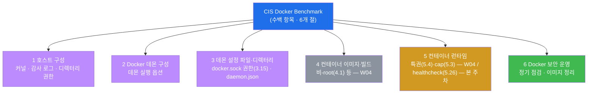

위 그림에서 **회색(4번 절)** 은 W04 에서 이미 다룬 영역(이미지·비-root)이고, **보라(1·2·3번 절)** 가
본 주차에서 새로 들어가는 **데몬·호스트 토대** 다. **주황(5번 절)** 은 W04 에서 일부(특권 5.4·cap
5.3)를 봤지만 본 주차에서 **가용성 항목(healthcheck 5.26)** 을 새로 점검하는 영역이고, **초록(6번 절)**
은 정기 자동 점검(docker-bench)으로 이어지는 운영 영역이다. 즉 본 주차는 **W04·W07 에서 본 "컨테이너
한 칸"의 점검을, 데몬·호스트와 운영(자동화)까지 360도로 닫는** 주다.

### 0.5.3 docker.sock — 관제탑으로 직통하는 무전기

공항 관제탑에 누구나 무전을 보낼 수 있다면 어떻게 될까? 아무 무전기를 주운 사람이 "3번 비행기, 지금
이륙"이라 외칠 수 있다면 공항 전체가 위험해진다. 그래서 관제 무전기는 **인가된 사람만** 쥐어야 한다.

**`/var/run/docker.sock`** 이 바로 Docker 데몬으로 직통하는 무전기다. 이것은 **유닉스 소켓(unix
domain socket)** — 같은 호스트 안의 프로세스끼리 통신하는 특수 파일이다. 우리가 `docker ps` 를 치면,
docker CLI 는 이 소켓을 통해 데몬에게 "컨테이너 목록 줘"라고 요청한다. 문제는, **이 소켓에 접근할 수
있는 사람은 데몬에게 무엇이든 시킬 수 있다는 것**이다 — 컨테이너 생성·삭제는 물론, 호스트의 `/` 를
컨테이너에 마운트해 호스트 파일 전체를 읽고 쓰는 것까지. 그래서 보안 업계의 격언이 있다 — **"docker.sock
접근 = 사실상 호스트 root 권한"**.

여기서 **8진수 권한(octal permission)** 이 등장한다. 리눅스 파일은 권한을 세 자리 숫자로 표기한다 —
앞에서부터 **소유자(owner) / 그룹(group) / 기타(others)** 의 권한이며, 각 자리는 읽기(4)+쓰기(2)+
실행(1)의 합이다. 따라서 **`660`** 은 소유자 `6`(=4+2, 읽기·쓰기) · 그룹 `6`(읽기·쓰기) · 기타 `0`
(아무 권한 없음)을 뜻한다. docker.sock 의 올바른 권한은 **`660`, 소유자 root, 그룹 docker** 다 — 즉
root 와 docker 그룹에 속한 사용자만 데몬을 제어하고, **그 밖의 일반 사용자(others)는 전혀 닿지 못한다**.
만약 권한이 `666`(others 도 읽기·쓰기 = world-writable)이라면, 호스트의 어떤 일반 사용자나 침해된
프로세스든 무전기를 주워 관제탑을 점령할 수 있는 **치명적 갭**이 된다. 이것이 **CIS Docker 3.15** 가
점검하는 항목이고, 다행히 el34 는 **660 root:docker 로 준수** 한다(미션 2에서 확인 = 양호).

### 0.5.4 daemon.json — 관제탑의 운영 규정집

관제탑은 무전기만 있다고 안전하게 돌아가지 않는다. "동시에 몇 대까지 이륙시키나", "비상시 어떻게
하나" 같은 **운영 규정집** 이 있어야 한다. Docker 데몬에서 이 규정집이 **`/etc/docker/daemon.json`**
이다 — 데몬의 전역 보안·동작 옵션을 담는 설정 파일이다(JSON 형식). 데몬은 시작할 때 이 파일을 읽어
규칙대로 동작한다. CIS Docker 는 이 규정집에 여러 보안 옵션을 권고하는데, 대표적인 셋은 다음과 같다.

- **`icc`(inter-container communication, 컨테이너 간 통신)** — 기본 bridge 망에 붙은 컨테이너끼리
  **자유롭게 통신하도록 허용할지** 를 정한다. 기본값은 `true`(자유 통신)인데, CIS 는 **`icc=false`**
  (기본 차단, 필요한 통신만 명시적으로 허용)를 권고한다. W07 에서 본 **측면 이동(east-west)** 을 데몬
  차원에서 한 번 더 좁히는 옵션이다.
- **`userns-remap`(사용자 네임스페이스 매핑)** — 컨테이너 안의 **root(uid 0)를 호스트의 비-root
  (예: uid 100000)로 매핑** 한다. W04 에서 "컨테이너 root = 호스트 root(user namespace 미사용 시)"라
  배웠는데, `userns-remap` 을 켜면 그 등식이 깨져 — **컨테이너가 탈출(escape)해도 호스트에서는 일반
  권한밖에 못 쓴다.** 즉 컨테이너 소장을 호스트에선 평사원으로 강등시키는 강력한 강화책이다.
- **`live-restore`** — 데몬(`dockerd`)이 재시작·중단되는 동안에도 **컨테이너는 계속 돌게** 한다.
  기본 동작에서는 데몬이 멈추면 컨테이너도 함께 흔들릴 수 있는데, `live-restore=true` 면 관제탑이 교대
  근무로 잠시 비어도 비행기는 계속 운항한다 — **데몬 장애 시 가용성**을 지키는 옵션이다.

핵심은 이렇다 — **daemon.json 이 아예 없으면 데몬은 모든 옵션을 "기본값"으로 동작** 하는데, 위
보안 권고 옵션들의 기본값은 대체로 보안보다 편의에 맞춰져 있다(예: `icc` 기본 `true`). 그래서 점검자는
(a) daemon.json 이 존재하는지, (b) 존재한다면 어떤 CIS 권고 옵션이 켜져 있는지를 본다. **el34 호스트
에는 daemon.json 이 존재** 하며(미션 3에서 확인), 그 안에 어떤 옵션이 설정됐는지를 학생이 직접 읽는다.

### 0.5.5 Healthcheck · restart policy — 활력징후 측정과 자동 재가동

지금까지의 점검은 대부분 "권한이 과한가(보안)"였다. 그런데 CIS Docker 와 컨테이너 운영에는 **가용성
(availability)** — 서비스가 필요할 때 정상 동작하는가 — 도 중요한 통제다. 보안 3요소(CIA: 기밀성·
무결성·가용성) 중 가용성을 떠받치는 두 장치가 healthcheck 와 restart policy 다.

**Healthcheck** 는 컨테이너의 "활력징후를 정기적으로 측정"하는 기능이다. 컨테이너가 **프로세스로는
살아 있어도(running) 실제로는 응답을 못 하는** 경우가 있다 — 예컨대 웹 서버 프로세스는 떠 있지만 내부적
으로 멈춰 요청에 답하지 못하는 "좀비" 상태. 단순히 "프로세스가 떠 있나"만 보면 이를 놓친다. Healthcheck
는 컨테이너 안에서 주기적으로 점검 명령(예: `curl -f http://localhost/ || exit 1`)을 실행해, 그 결과로
컨테이너를 **healthy / unhealthy** 로 판정한다. 그러면 오케스트레이터(또는 운영자)가 unhealthy 컨테이너를
자동으로 재시작·교체할 수 있다. **CIS Docker 5.26** 이 바로 "컨테이너에 HEALTHCHECK 지시어를 두라"를
권고하는 항목이다. **el34-web 은 이 healthcheck 가 없어 CIS 5.26 갭** 이다(미션 4에서 확인) — 즉 web
이 좀비 상태가 돼도 자동으로 감지·교체되지 못한다.

**restart policy** 는 "컨테이너가 죽었을 때 자동으로 다시 켤지"를 정하는 정책이다. 정전 후 자동
재가동 설정과 같다. 값은 보통 네 가지다 — **`no`**(자동 재시작 안 함, 기본값) · **`on-failure`**(비정상
종료 시에만 재시작) · **`unless-stopped`**(운영자가 일부러 멈춘 게 아니면 항상 재시작) · **`always`**
(무조건 재시작). 비정상 종료 시 자동 복구가 되는 `on-failure`·`unless-stopped`·`always` 가 **복원력
(resilience) 준수** 이고, `no` 면 한 번 죽으면 사람이 손으로 켤 때까지 멈춰 있는 갭이다. **el34-web 은
`unless-stopped` 로 준수** 한다(미션 5에서 확인 = 양호) — 비정상 종료 시 자동 복구된다.

> **healthcheck vs restart policy 의 차이.** 둘은 짝이지만 역할이 다르다. healthcheck 는 "컨테이너가
> **건강한가**(응답하는가)"를 **판정** 하고, restart policy 는 "컨테이너가 **죽었을 때** 다시 켤지"를
> **실행** 한다. healthcheck 가 unhealthy 를 감지해도 그걸 보고 재시작·교체하는 동작이 따라와야 의미가
> 있으므로, 둘은 함께 갖출 때 가용성이 완성된다. el34-web 은 restart 는 있으나 healthcheck 가 없어,
> "죽으면 다시 켜지긴 하지만, 살아서 좀비가 된 상태는 못 잡는" 절반의 가용성 상태다.

---

이 다섯 묶음(데몬·호스트 / CIS Benchmark / docker.sock / daemon.json / healthcheck·restart)이 본 주차
본문의 기반이다. 본문에서 다시 등장할 때 막히면 본 절로 돌아오면 흐름이 끊기지 않는다.

---

## 1. 왜 데몬·호스트를 따로 점검하는가

### 1.1 한 줄 답: 컨테이너 한 칸이 아니라, 그 칸들을 떠받치는 토대를 본다

W02~W07 에서 학생은 줄곧 **컨테이너 한 칸**을 점검했다 — 이미지·런타임·격리·시크릿·네트워크. 그러나
그 컨테이너들은 모두 **하나의 Docker 데몬(`dockerd`)** 이 만들고 굴리며, 그 데몬은 **하나의 호스트
(el34, 192.168.0.80)** 위에 올라 있다(W01 §2.2 의 41개 컨테이너가 모두 이 한 데몬·한 호스트 위에서
돈다). 따라서 데몬이나 호스트에 갭이 있으면, 그 위에 아무리 잘 강화한 컨테이너 41개를 올려도 **한꺼번에**
위험해진다.

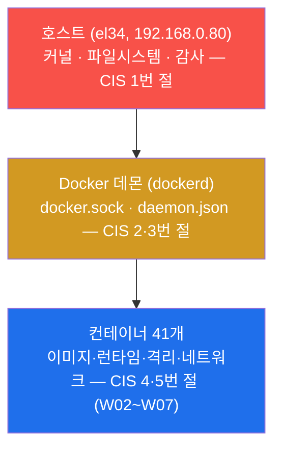

위 그림이 본 주차의 시선 전환을 보여 준다. 지금까지는 **맨 위 칸(파랑, 컨테이너)** 만 봤지만, 본 주차는
**그 아래의 데몬(주황)과 호스트(빨강)** 로 내려간다. 아래로 갈수록 한 번의 침해가 미치는 범위가 넓다 —
컨테이너 한 칸의 갭은 그 칸의 문제지만, **데몬의 갭은 41개 전부의 문제, 호스트의 갭은 토대 전체의
문제** 다. 그래서 데몬·호스트 점검은 컨테이너 점검보다 더 근본적인 토대 점검이다.

### 1.2 핵심 위협은 "토대 장악 = 전부 장악"이다

데몬·호스트를 따로 배우는 가장 큰 이유는 **폭발 반경(blast radius, W04 §0.5.6)** 때문이다. W04 에서는
컨테이너 한 칸의 런타임 갭(root·특권)이 escape 와 결합해 호스트로 번지는 경로를 봤다. 본 주차의 갭은
한 단계 더 직접적이다 — **데몬 제어 소켓(docker.sock)이 노출되면, escape 라는 어려운 단계를 거칠 필요도
없이** 곧장 데몬에게 "호스트 `/` 를 마운트한 컨테이너를 띄워라"라고 명령해 호스트를 장악할 수 있다.

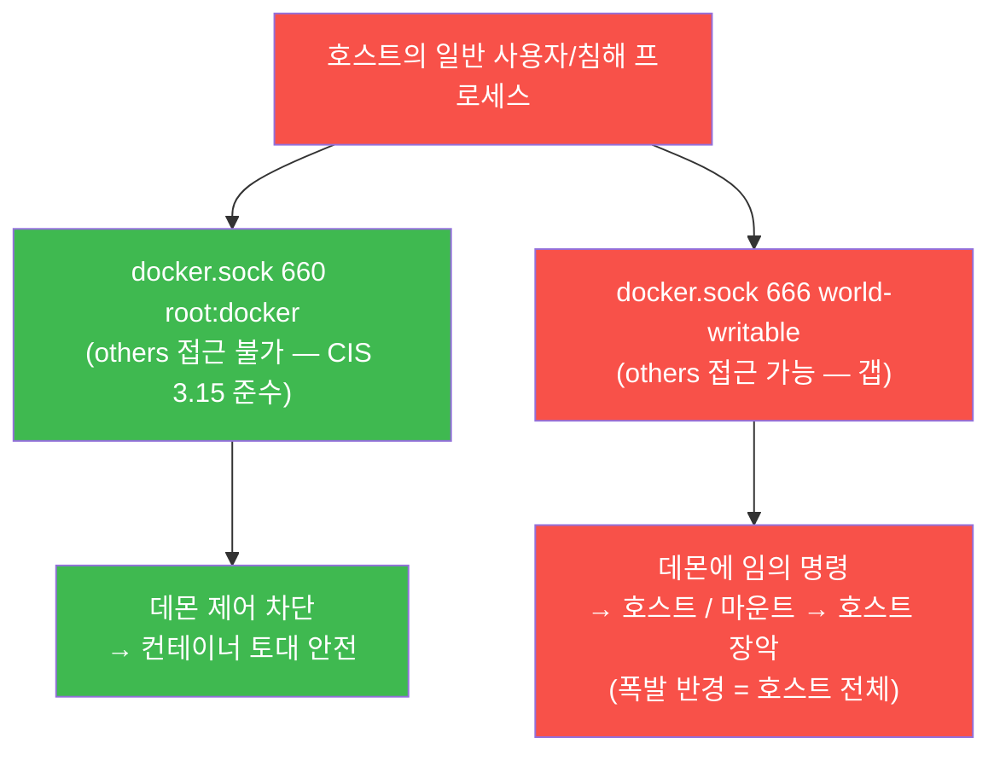

같은 침해 시도라도, docker.sock 권한이 양호하면(초록) 데몬 제어가 차단돼 토대가 안전하고, 권한이
허술하면(빨강) 데몬을 통해 곧장 호스트 전체가 장악된다. 이 차이를 만드는 것이 데몬·호스트 구성이며,
본 주차가 점검하려는 핵심이다.

### 1.3 한계 — 데몬·호스트만으로 끝나지 않는다

데몬·호스트를 CIS 기준으로 완벽히 강화해도, 그것이 컨테이너 한 칸의 갭(root 실행 W04 · env 비밀 W06 ·
넓은 이미지 표면 W02)을 대신하지는 않는다. 본 주차의 토대 점검은 컨테이너 보안의 **밑바닥 한 층**이며,
W02~W07 에서 본 컨테이너 계층 점검과 **함께** 가야 전체가 닫힌다. 컨테이너 보안 4 계층(W01) 중 본 주차는
주로 **호스트·데몬·오케스트레이션** 에 걸친 토대를 다루고, 그 위의 이미지·런타임 계층은 앞 주차들이
맡는다. 둘 다 점검해야 비로소 "토대부터 컨테이너까지" 한 바퀴가 완성된다.

---

## 2. docker.sock — 데몬 제어 소켓 (CIS Docker 3.15)

### 2.1 한 줄 정의와 왜 중요한가

**`/var/run/docker.sock`** 은 Docker 데몬에 명령을 보내는 유닉스 소켓이다(§0.5.3). 이것이 중요한
이유는 명확하다 — **이 소켓에 접근할 수 있는 주체는 데몬에게 무엇이든 시킬 수 있고, 데몬은 컨테이너
생성·호스트 마운트까지 할 수 있으므로, docker.sock 접근은 사실상 호스트 root 권한** 과 같기 때문이다.
그래서 docker.sock 의 권한을 좁히는 것은 데몬·호스트 보안의 첫 번째 잠금장치다.

> **용어 — CIS Docker Benchmark 3.15.** CIS Docker 기준의 **3번 절(데몬 설정 파일·디렉터리)** 항목으로,
> **"docker.sock 의 소유와 권한을 올바르게 설정하라"** 를 요구한다. 구체적으로 소유자 `root`, 그룹
> `docker`, 권한 **`660`**(소유자·그룹만 읽기·쓰기, 기타는 접근 불가)이 기준이다. 이렇게 두면 root 와
> docker 그룹 사용자만 데몬을 제어하고, 그 밖의 일반 사용자는 무전기에 손도 못 댄다.

### 2.2 왜 그토록 위험한가 — 무전기를 주운 사람이 관제탑을 점령한다

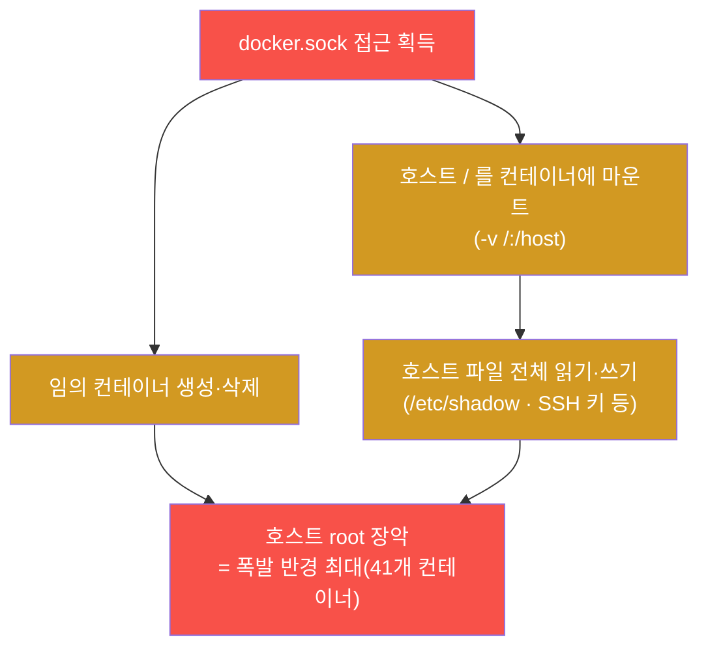

docker.sock 이 위험한 이유는 escape 같은 어려운 취약점 악용이 **전혀 필요 없다**는 점이다. 소켓에 닿기만
하면, 공격자는 데몬에게 정상 API 요청으로 "호스트 `/` 를 마운트한 컨테이너를 띄워라"라고 시키고, 그
컨테이너 안에서 호스트의 `/etc/shadow`(비밀번호 해시)·SSH 키·다른 컨테이너의 데이터를 읽고 쓴다. 즉
**docker.sock 노출은 그 자체로 호스트 장악과 거의 동의어** 다. 실무에서 컨테이너에 docker.sock 을
볼륨으로 마운트해 주는 경우(예: 컨테이너 안에서 docker 를 쓰는 CI 도구·모니터링 에이전트)가 흔한데,
그 컨테이너가 침해되면 곧장 호스트가 뚫리는 이유가 이것이다.

### 2.3 el34 에서 어떻게 — el34 는 660 root:docker (CIS 3.15 준수)

el34 호스트(`ssh ccc@192.168.0.80`, 비밀번호 1)에서 docker.sock 의 소유·권한을 다음과 같이 점검한다
(미션 2).

```bash
ls -la /var/run/docker.sock
P=$(stat -c '%a' /var/run/docker.sock 2>/dev/null)
case "$P" in 660|600) echo "compliant=sock_$P";; *) echo "gap=sock_$P";; esac
```

- `ls -la /var/run/docker.sock` — 소켓의 소유자·그룹·권한을 한눈에 보여 준다. 출력 맨 앞의
  `srw-rw----` 에서 맨 앞 `s` 는 이것이 소켓(socket) 파일이라는 표시이고, 이어지는
  `rw-`(소유자)·`rw-`(그룹)·`---`(기타)가 곧 권한이다.
- `stat -c '%a'` — 그 권한을 **8진수 숫자(예: 660)** 로 뽑는다. `%a` 가 8진수 권한을 뜻하는 포맷이다.
- `case` 문은 그 값이 `660`(root:docker 표준) 또는 `600`(더 엄격)이면 `compliant=sock_660`(준수)을,
  그 밖이면 `gap=sock_$P`(갭)를 출력하는 판정 자동화다. `666` 같은 world-writable 이 나오면 갭이다.

el34 를 점검하면 docker.sock 은 **소유자 root · 그룹 docker · 권한 660** 으로 나온다 — **CIS Docker 3.15
준수** 다(`compliant=sock_660`). 즉 root 와 docker 그룹 사용자만 데몬을 제어하고, 그 밖의 일반
사용자(others)는 무전기에 닿지 못한다. 본 주차의 점검에서도 W04 처럼 "전부 갭"이 아니라 **준수 항목과
갭 항목이 섞여 있다** — docker.sock 은 양호(준수), healthcheck 는 갭(§4)이다. 점검자는 갭만 나열하는
사람이 아니라 무엇이 양호하고 무엇이 갭인지를 **균형 있게** 보고한다.

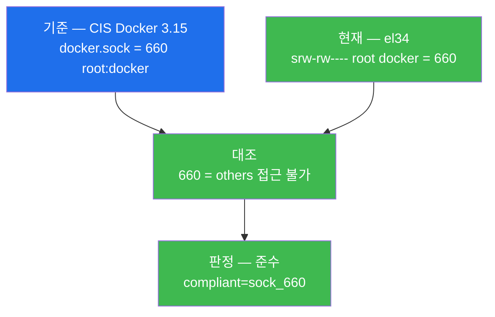

### 2.4 한계 — 소켓 권한이 양호해도 끝이 아니다

`660 root:docker` 는 docker.sock 보안의 필요조건이지 충분조건이 아니다. 첫째, **docker 그룹에 누가
들어 있는가** 가 또 다른 문제다 — docker 그룹에 일반 사용자를 함부로 넣으면 그 사용자는 사실상 root
권한을 갖게 되므로, 그룹 구성원도 최소로 유지해야 한다. 둘째, 컨테이너에 docker.sock 을 **볼륨으로
마운트(`-v /var/run/docker.sock:...`)** 해 주면, 호스트 권한이 아무리 양호해도 그 컨테이너가 침해되면
소켓 접근이 새어 나간다(§2.2). 따라서 완전한 점검은 (a) 소켓 파일 권한(이 절) + (b) docker 그룹 구성원
+ (c) 소켓을 마운트한 컨테이너가 있는지를 함께 봐야 한다. 본 주차는 소켓 파일 권한 점검(CIS 3.15)을
중심으로 다룬다.

---

## 3. Docker 데몬 설정 — daemon.json

### 3.1 한 줄 정의와 왜 중요한가

**`/etc/docker/daemon.json`** 은 Docker 데몬의 전역 보안·동작 옵션을 담는 설정 파일이다(§0.5.4). 이것이
중요한 이유는, 이 한 파일의 옵션이 **그 데몬이 굴리는 모든 컨테이너에 한꺼번에 적용** 되기 때문이다 —
컨테이너 하나하나에 옵션을 거는 것과 달리, 데몬 설정은 토대 전체의 기본 보안 자세를 정한다. CIS Docker
는 이 파일에 여러 보안 옵션(`icc`·`userns-remap`·`live-restore` 등)을 권고한다.

### 3.2 대표 보안 옵션 세 가지

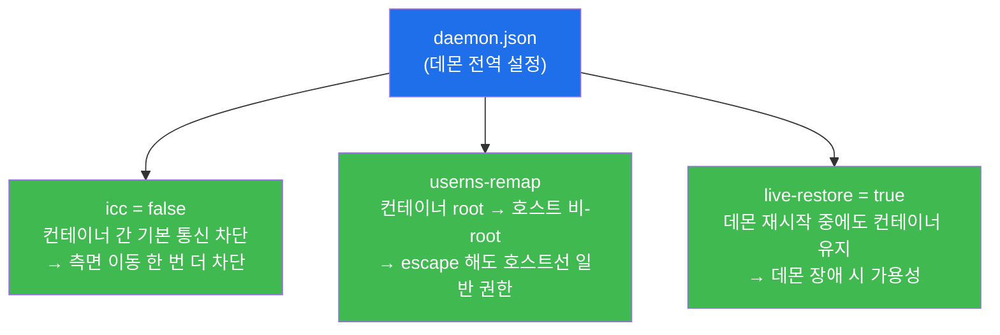

- **`icc=false`** — 기본 bridge 망에 붙은 컨테이너끼리의 **자유 통신을 데몬 차원에서 차단** 한다(기본값
  `true`). W07 에서 네트워크 분리로 측면 이동(east-west)을 막았는데, `icc=false` 는 같은 망 안에서도
  필요한 통신만 명시적으로 허용하게 해 측면 이동을 한 번 더 좁힌다.
- **`userns-remap`** — 컨테이너의 **root(uid 0)를 호스트의 비-root 로 매핑** 한다(§0.5.4). W04 에서
  본 "컨테이너 root = 호스트 root" 등식을 데몬 차원에서 깨, **컨테이너가 escape 해도 호스트에서는 일반
  권한밖에 못 쓰게** 만드는 강력한 강화책이다. W04 §4.4 에서 예고한 user namespace 가 바로 이것이다.
- **`live-restore=true`** — 데몬(`dockerd`)이 재시작·중단되는 동안에도 **컨테이너는 계속 돌게** 해
  데몬 장애 시 가용성을 지킨다(§0.5.4).

### 3.3 el34 에서 어떻게 — daemon.json 존재 확인 + 옵션 점검

el34 호스트에서 daemon.json 의 존재와 내용을 다음과 같이 점검한다(미션 3).

```bash
cat /etc/docker/daemon.json 2>/dev/null | head -8 || echo no_daemon_json
echo daemon_checked
```

- `cat /etc/docker/daemon.json` — 데몬 설정 파일의 내용을 출력한다(JSON 형식). `head -8` 은 앞 8 줄만
  보여 화면을 정돈한다.
- `2>/dev/null || echo no_daemon_json` — 파일이 **없으면** `cat` 이 실패하므로 `no_daemon_json` 을
  대신 찍는다. 즉 이 한 줄로 "파일이 있는가, 있다면 어떤 옵션인가"를 동시에 확인한다.
- 끝의 `echo daemon_checked` 는 이 단계 점검이 완료됐음을 나타내는 **확인 토큰** 이다(§7 의 점검
  관용구).

el34 호스트에는 **daemon.json 이 존재** 한다 — 즉 `no_daemon_json` 이 아니라 실제 설정 내용이 출력된다.
점검자는 출력된 JSON 에서 §3.2 의 CIS 권고 옵션(`icc`·`userns-remap`·`live-restore` 등)이 어떻게
설정됐는지를 읽는다. **중요한 해석 규칙** — daemon.json 이 **없으면** 데몬은 모든 옵션을 **기본값**으로
동작하는데(예: `icc` 기본 `true` = 자유 통신, userns-remap 미적용 = 컨테이너 root ≈ 호스트 root), 그
기본값들은 보안보다 편의에 맞춰져 있어 그 자체로 여러 CIS 권고를 충족하지 못한다. 따라서 daemon.json
의 **존재 자체** 가 "데몬을 의식적으로 설정했다"는 1차 신호이고, 그다음은 **그 안에 어떤 보안 옵션이
켜져 있는가** 가 본 점검이다.

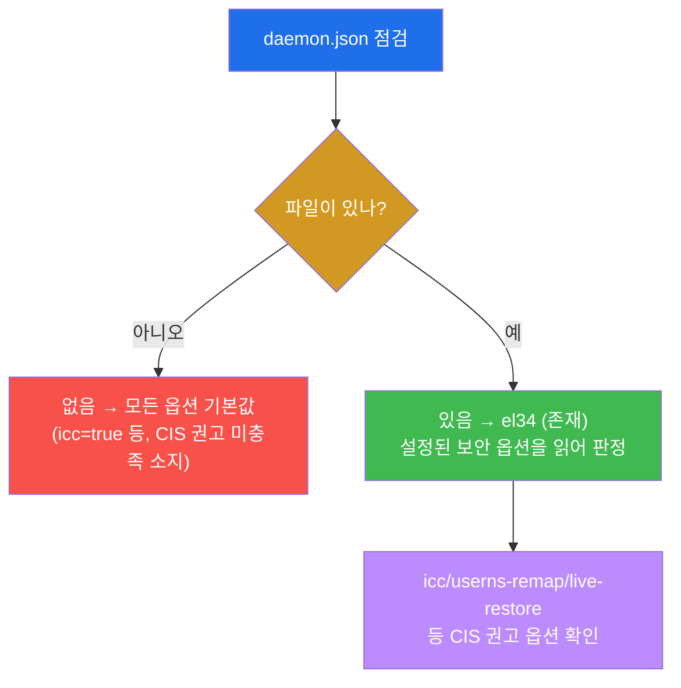

### 3.4 한계 — 옵션은 양날의 검이며 호환성을 함께 봐야 한다

daemon.json 의 보안 옵션은 강력하지만 무작정 켤 수 없다. **`userns-remap`** 을 켜면 컨테이너 root 가
호스트 비-root 로 매핑되면서, 호스트 디렉터리를 볼륨으로 공유할 때 **파일 소유권(uid)이 어긋나** 기존
워크로드가 깨질 수 있다 — 그래서 운영 환경에 적용하려면 볼륨·권한을 함께 재설계해야 한다. **`icc=false`**
도 컨테이너 간 통신에 의존하던 구성을 미리 명시적으로 허용(`--link` 또는 사용자 정의 네트워크)하지 않으면
서비스가 끊길 수 있다. 즉 데몬 옵션은 "켜면 무조건 좋은" 것이 아니라 **앱의 실제 요구를 파악한 뒤
단계적으로** 적용해야 한다. 본 주차는 "어떤 옵션이 무엇을 통제하는가와 daemon.json 이 설정됐는가"를
점검·이해하는 데 초점을 둔다.

---

## 4. Healthcheck — 컨테이너 가용성 통제 (CIS Docker 5.26)

### 4.1 한 줄 정의와 왜 중요한가

**Healthcheck** 는 컨테이너 내부 상태를 주기적으로 점검해 healthy / unhealthy 를 판정하는 기능이다
(§0.5.5). 이것이 중요한 이유는, 컨테이너가 **프로세스로는 살아 있어도 실제로는 응답을 못 하는** 좀비
상태를 단순한 "running 여부"로는 잡지 못하기 때문이다. healthcheck 가 있어야 그런 비정상을 자동으로
감지하고, 자동 재시작·교체로 이어 **가용성** 을 지킬 수 있다.

> **용어 — CIS Docker Benchmark 5.26.** CIS Docker 기준의 **5번 절(컨테이너 런타임)** 항목으로,
> **"컨테이너의 상태를 HEALTHCHECK 로 점검하라"** 를 권고한다. 시정은 이미지의 Dockerfile 에
> `HEALTHCHECK CMD curl -f http://localhost/ || exit 1` 같은 지시어를 넣거나, 실행 시 `--health-cmd`
> 옵션으로 점검 명령을 지정하는 것이다. (W04 에서 본 5.3·5.4 는 권한 통제였고, 5.26 은 같은 5번 절의
> **가용성** 항목이다.)

### 4.2 왜 "running" 만으로는 부족한가 — 좀비 컨테이너

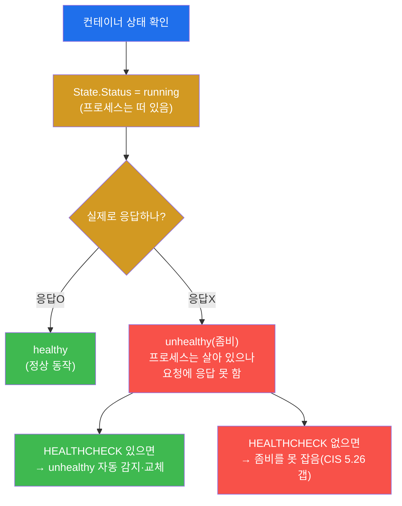

위 그림의 핵심은 **`running` 과 `healthy` 는 다르다** 는 것이다. `docker ps` 가 보여 주는 "running"은
"프로세스가 떠 있다"는 뜻일 뿐, 그 컨테이너가 실제로 요청에 답하는지는 보장하지 않는다. healthcheck 가
없으면 운영자는 좀비 컨테이너(프로세스는 살아 있으나 먹통)를 놓치고, 장애가 길어진다. healthcheck 가
있으면 그 좀비를 자동으로 잡아 재시작·교체할 수 있다.

### 4.3 el34 에서 어떻게 — el34-web 은 healthcheck 없음 (CIS 5.26 갭)

el34-web 의 healthcheck 설정 여부는 `docker inspect` 의 `Config.Healthcheck` 필드로 본다(미션 4).

```bash
H=$(docker inspect el34-web --format '{{if .Config.Healthcheck}}yes{{else}}none{{end}}')
echo "healthcheck=$H"
[ "$H" = "none" ] && echo "gap=no_healthcheck" || echo "compliant=healthcheck"
```

- `--format '{{if .Config.Healthcheck}}yes{{else}}none{{end}}'` — Go 템플릿의 `if` 조건으로,
  `Config.Healthcheck` 필드가 **설정돼 있으면 `yes`, 비어 있으면 `none`** 을 출력한다.
- 셋째 줄은 그 값이 `none` 이면 `gap=no_healthcheck`(갭)를, 아니면 `compliant=healthcheck`(준수)를
  출력하는 판정 자동화다.

el34-web 을 점검하면 `healthcheck=none` 이 나온다 — **el34-web 에는 HEALTHCHECK 가 설정돼 있지 않아
CIS Docker 5.26 갭** 이다(`gap=no_healthcheck`). 즉 el34-web 이 좀비 상태(프로세스는 떠 있으나 요청에
응답 못 함)가 돼도 자동으로 감지·교체되지 못한다. 정석 시정은 이미지의 Dockerfile 에 `HEALTHCHECK`
지시어(예: `curl -f http://localhost/ || exit 1`)를 넣어, web 의 응답 가능 여부를 주기적으로 점검하게
하는 것이다.

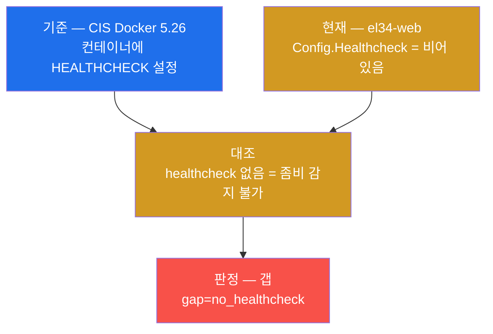

### 4.4 한계 — healthcheck 는 잘 설계해야 효과가 있다

healthcheck 는 있다고 무조건 좋은 게 아니라 **점검 명령을 잘 짜야** 한다. 점검 명령이 너무 가벼우면
(예: 단지 포트가 열렸는지만) 좀비를 못 잡고, 너무 무거우면 점검 자체가 부하가 된다. 또 healthcheck 가
unhealthy 를 판정해도, 그것을 보고 **재시작·교체하는 주체(오케스트레이터나 restart 동작)** 가 있어야
실제 복구로 이어진다 — healthcheck 는 "판정"이고 restart policy(§5)는 "실행"이라, 둘이 함께 있어야
가용성이 완성된다(§0.5.5의 비교). 본 주차는 healthcheck 가 설정됐는지(존재 여부)를 점검의 중심으로
다루고, 점검 명령의 설계는 이후 운영 단계의 주제다.

---

## 5. Restart Policy — 복원력 통제

### 5.1 한 줄 정의와 왜 중요한가

**restart policy(재시작 정책)** 는 컨테이너가 죽었을 때 자동으로 다시 켤지를 정하는 정책이다(§0.5.5).
이것이 중요한 이유는, 운영 중 컨테이너는 앱 오류·자원 부족·일시 장애 등으로 언제든 죽을 수 있는데,
restart policy 가 없으면 한 번 죽은 컨테이너가 **사람이 손으로 켤 때까지 멈춰 있어** 가용성이 깨지기
때문이다. 비정상 종료 시 자동 복구는 곧 **복원력(resilience)** 통제다.

### 5.2 네 가지 값과 그 의미

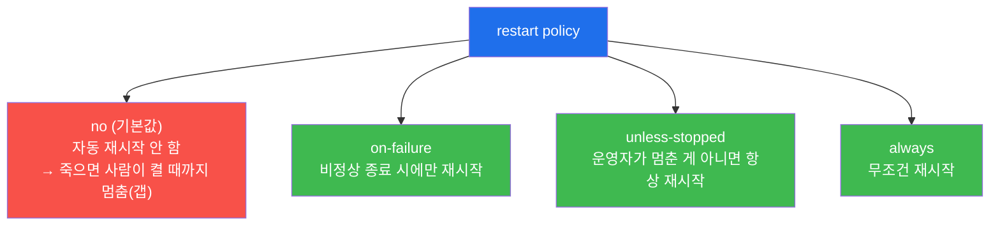

- **`no`**(빨강, 기본값) — 자동 재시작을 하지 않는다. 컨테이너가 죽으면 운영자가 손으로 켤 때까지 멈춰
  있어, 가용성 관점에서 갭이다.
- **`on-failure`**(초록) — **비정상 종료**(0이 아닌 종료 코드) 시에만 재시작한다. 정상 종료는 그대로 둔다.
- **`unless-stopped`**(초록) — 운영자가 일부러 `docker stop` 으로 멈춘 게 아니라면 항상 재시작한다.
  호스트 재부팅 후에도(직전에 멈춰 둔 게 아니면) 다시 켜진다.
- **`always`**(초록) — 종료 이유를 가리지 않고 무조건 재시작한다(운영자가 멈춰도 호스트 재부팅 시 다시
  켜짐).

`on-failure`·`unless-stopped`·`always` 는 모두 비정상 종료 시 자동 복구가 되므로 **복원력 준수** 이고,
`no` 만 갭이다.

### 5.3 el34 에서 어떻게 — el34-web 은 unless-stopped (준수)

el34-web 의 restart policy 는 `docker inspect` 의 `HostConfig.RestartPolicy.Name` 필드로 본다(미션 5).

```bash
R=$(docker inspect el34-web --format '{{.HostConfig.RestartPolicy.Name}}')
echo "restart=$R"
case "$R" in unless-stopped|on-failure|always) echo "compliant=restart_$R";; *) echo "gap=no_restart";; esac
```

- `--format '{{.HostConfig.RestartPolicy.Name}}'` — 그 컨테이너에 설정된 재시작 정책 이름을 뽑는다.
- `case` 문은 그 값이 `unless-stopped`·`on-failure`·`always` 중 하나면 `compliant=restart_$R`(준수)를,
  그 밖(`no` 등)이면 `gap=no_restart`(갭)를 출력하는 판정 자동화다.

el34-web 을 점검하면 `restart=unless-stopped` 가 나온다 — **el34-web 은 restart policy `unless-stopped`
로 준수** 다(`compliant=restart_unless-stopped`). 즉 web 이 비정상 종료되거나 호스트가 재부팅돼도(운영자가
일부러 멈춘 게 아닌 한) 자동으로 다시 켜져, 복원력·가용성 통제가 적용돼 있다. 본 주차 점검에서 el34-web
은 **restart 는 준수(이 절)지만 healthcheck 는 갭(§4)** 이라, "죽으면 다시 켜지긴 하나 살아서 좀비가 된
상태는 못 잡는" 절반의 가용성 상태임을 함께 읽어야 한다.

### 5.4 한계 — 재시작이 근본 원인을 고치는 것은 아니다

restart policy 는 일시 장애에는 효과적이지만 **근본 원인을 해결하지는 않는다.** 컨테이너가 설정 오류나
지속적 결함으로 계속 죽는다면, restart policy 는 무한 재시작 루프(crash loop)에 빠질 뿐 문제를 고치지
못한다(그래서 Docker 는 재시작 사이 간격을 점점 늘리는 backoff 를 둔다). 또 restart 는 컨테이너를 다시
**띄울** 뿐, 그 컨테이너가 다시 **건강하게 응답하는지** 는 보장하지 않는다 — 그 판정은 healthcheck(§4)의
몫이다. 따라서 restart policy 는 healthcheck 와 짝지어, 그리고 반복 장애의 근본 원인 분석(로그·모니터링,
W10)과 함께 가야 진짜 복원력이 된다. 본 주차는 restart policy 의 설정 여부 점검을 중심으로 다룬다.

---

## 6. CIS Docker 자동화 — docker-bench-security

### 6.1 한 줄 정의와 왜 중요한가

**docker-bench-security** 는 CIS Docker Benchmark 를 자동으로 점검하는 Docker 공식 셸 스크립트다(§0.5.2의
검사 로봇). 이것이 중요한 이유는, CIS Docker Benchmark 가 **수백 개 항목** 에 이르러 사람이 매번 손으로
훑는 것이 비현실적이기 때문이다 — 본 주차의 미션 2~5 가 손으로 점검한 docker.sock·daemon.json·
healthcheck·restart 는 그 수백 항목 중 **극히 일부** 일 뿐이다. 정기적으로 전 항목을 점검하려면 자동화가
필수다.

### 6.2 docker-bench 가 점검하는 범위와 출력

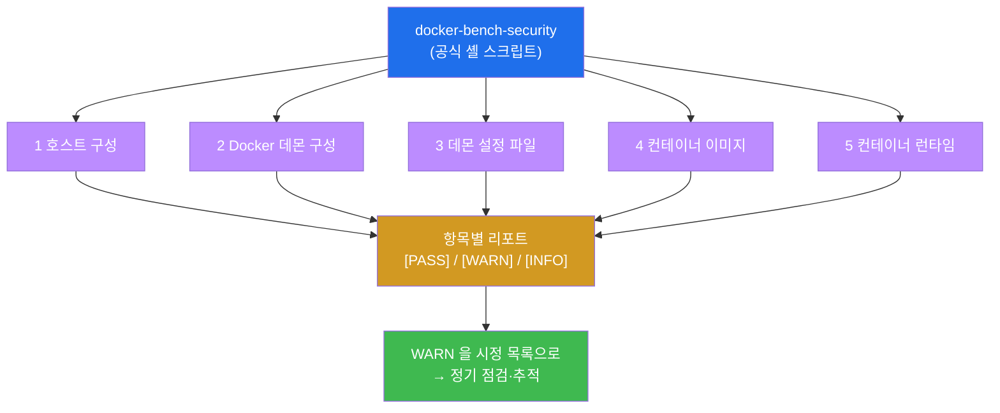

docker-bench-security 는 호스트(1)·데몬(2)·데몬 설정 파일(3)·이미지(4)·런타임(5) 항목을 한 번에 훑어,
각 항목을 세 등급으로 판정한다 — **`[PASS]`**(준수) · **`[WARN]`**(갭, 시정 필요) · **`[INFO]`**(참고
사항). 점검자는 이 리포트에서 **`[WARN]` 만 추려 시정 목록** 으로 삼고, 시정 뒤 다시 돌려 WARN 이 줄었는지
추적한다. 즉 본 주차에서 손으로 한 점검(미션 2~5)을 docker-bench 가 수백 항목 규모로, 그리고 **반복
가능하게** 자동화하는 것이다.

> **본 주차 lab 의 점검 방식.** 미션 6 의 lab 은 docker-bench 를 el34 에서 **실제로 실행하지는 않는다**
> — docker-bench 는 호스트 전체를 훑으며 변경을 일으킬 수 있는 무거운 스크립트라, 인가된 읽기 전용
> 점검 원칙(§9)에 맞게 본 주차에서는 **그 점검 범위·출력·운영 방식을 개념으로 정리** 하는 것까지를
> 다룬다. 실제 도입은 운영팀이 변경관리 절차에 따라 정기 잡(job)으로 돌린다.

### 6.3 한계 — 자동 점검은 만능이 아니다

docker-bench 같은 자동 점검 도구도 한계가 있다. 첫째, 도구가 점검하는 것은 **그 도구가 아는 항목** 뿐
이다 — 환경 특유의 위험(예: 잘못 마운트된 docker.sock 을 가진 특정 컨테이너)이나 새로 알려진 위협은
스크립트가 갱신돼야 잡는다. 둘째, **`[WARN]` 의 일부는 그 환경에서 의도된 예외** 일 수 있어(예: 실습용
으로 일부러 둔 설정), 결과를 사람이 맥락으로 해석해야 한다 — 기계적으로 모든 WARN 을 갭으로 단정하면
오탐이 된다. 셋째, 자동 점검은 "현재 상태"의 스냅샷이라, 그 사이 표류한 설정은 **다음 점검 때** 잡힌다.
따라서 docker-bench 는 사람의 판단을 **대체** 하는 것이 아니라 **확장** 하는 도구이며, 정기 실행 + 결과
검토 + 시정 추적의 운영 절차와 함께 써야 의미가 있다.

---

## 7. 점검 명령 빠른 복습 — "무엇을 어디서 보나"

본 주차의 점검은 모두 el34 호스트(`ssh ccc@192.168.0.80`, 비밀번호 1)에서 `docker` CLI 와 파일 점검
(`ls`·`stat`·`cat`)으로 수행하며, **신규 도구 설치는 없다.** 점검 대상은 인가된 el34 호스트·데몬과
컨테이너 `el34-web` 뿐이고, 모든 명령은 **읽기 전용**이다(설정을 바꾸지 않는다). 각 명령이 무엇을
보여 주는지 한눈에 정리한다.

| 무엇을 | 명령(핵심) | 무엇을 보나 / el34 결과 |
|--------|------------|--------------------------|
| 점검 환경 | `docker version --format '{{.Server.Version}}'` | el34 호스트 docker 가동(`docker`/`docker_ok`) |
| docker.sock (CIS 3.15) | `stat -c '%a' /var/run/docker.sock` | 660 root:docker = **준수**(`compliant=sock_660`) |
| 데몬 설정 | `cat /etc/docker/daemon.json` | daemon.json **존재** → 보안 옵션(icc/userns-remap/live-restore) 확인 |
| healthcheck (CIS 5.26) | `docker inspect el34-web --format '{{if .Config.Healthcheck}}yes{{else}}none{{end}}'` | none = **갭**(`gap=no_healthcheck`) |
| restart policy | `docker inspect el34-web --format '{{.HostConfig.RestartPolicy.Name}}'` | unless-stopped = **준수**(`compliant=restart_unless-stopped`) |
| CIS 자동화 | (개념 정리) | docker-bench-security 로 수백 항목 자동 점검 |
| 방어 종합 | (개념 정리) | sock 권한 + daemon 옵션 + healthcheck + 최소권한 런타임 + docker-bench |

> **점검 관용구.** 본 주차의 점검 명령들은 끝에 `echo docker_ok` / `compliant=sock_660` /
> `daemon_checked` / `gap=no_healthcheck` / `compliant=restart_...` 같은 **확인 토큰·판정 토큰** 을
> 찍어 둔다. `compliant=...`(준수) 또는 `gap=...`(갭)는 "기준(CIS 3.15·5.26 등) + 현재(설정 출력) +
> 판정(준수/갭)"의 삼박자 증적이고, `*_checked` 류는 그 단계 점검이 끝까지 수행됐다는 표식이다.
> el34 의 핵심 산출물은 **`compliant=sock_660`(양호) · `gap=no_healthcheck`(갭) ·
> `compliant=restart_unless-stopped`(양호)** 세 줄이다.

---

## 8. 실습 안내 — lab 8 미션 (4 축 설명)

본 주차 lab 은 8 미션으로 구성되며, lab 의 `order` 와 1:1 로 대응한다. 미션은 점검 환경 확인 →
docker.sock 권한(CIS 3.15) → daemon.json → healthcheck(CIS 5.26) → restart policy → CIS 자동화
(docker-bench) → 방어 종합 → CIS Docker 보고서의 순서로 흐른다. 각 미션을 **4 축**으로 설명한다 —
왜 하는가 / 무엇을 알 수 있는가 / 결과 해석(준수 vs 갭) / 실전 활용.

> **실습 진행 원칙.** 모든 명령은 el34 호스트(`ssh ccc@192.168.0.80`)에서 `docker` CLI 와 파일
> 점검(`ls`·`stat`·`cat`)으로 수행한다. 이번 주는 **신규 설치가 없고**, 점검 대상은 인가된 el34
> 호스트·데몬과 컨테이너(주로 `el34-web`)뿐이다. 본 주차의 명령은 모두 **읽기 전용**이며 데몬 설정·
> 컨테이너를 바꾸지 않는다(시정은 운영팀의 변경관리로). 합격 임계값은 0.7 이다.

### 미션 1 — 점검 환경 확인 (10점)

> **왜 하는가?** 모든 데몬·호스트 점검의 전제는 점검 환경(el34 호스트의 docker)이 실제로 동작한다는
> 것이다. 본격 점검 전 docker 가 응답하는지부터 확인한다 — docker 가 안 되면 이후 점검이 무의미하다.
>
> **무엇을 알 수 있는가?** `docker version` 으로 el34 호스트 docker 의 가동 여부. CIS Docker Benchmark
> 가 호스트·데몬·이미지·런타임의 6개 절로 구성된다는 점검의 큰 그림도 이 단계에서 환기한다.
>
> **결과 해석.** 정상: 출력에 `docker`(버전 문자열 또는 `docker_ok`)가 나옴(환경 확인 성공). 비정상:
> 응답이 없거나 오류면 호스트 SSH·docker 데몬 가동·권한부터 점검한다.
>
> **실전 활용.** CIS Docker 점검 착수 시 첫 확인. 점검 환경(데몬)이 살아 있고 조회 가능한지 검증하는
> 단계다.

### 미션 2 — docker.sock 권한 (CIS 3.15) (14점, 핵심)

> **왜 하는가?** 본 주차의 가장 중요한 토대 점검이다. docker.sock 접근은 사실상 호스트 root 권한과
> 같으므로(§2), 그 권한이 좁게 잠겨 있는지를 가장 먼저 확인한다.
>
> **무엇을 알 수 있는가?** `stat -c '%a'`/`ls -la` 로 docker.sock 의 8진수 권한과 소유·그룹. el34 는
> **660 root:docker**(others 접근 불가) — CIS Docker 3.15 준수, 데몬 제어를 root·docker 그룹으로 제한한
> 양호 항목.
>
> **결과 해석.** 정상(준수): 출력에 `compliant=sock_660`(또는 600)이 나옴 — others 가 데몬에 닿지
> 못한다는 뜻. 만약 `gap=sock_666` 처럼 world-writable 이면 호스트 장악으로 직결되는 치명적 갭이다.
>
> **실전 활용.** 모든 Docker 호스트 점검의 1순위 확인. "docker.sock 이 world-writable 인가"는 한 줄로
> 가장 먼저 걸러야 하는 치명 항목이다.

### 미션 3 — Docker 데몬 설정 (daemon.json) (12점)

> **왜 하는가?** 데몬 설정은 그 데몬이 굴리는 모든 컨테이너에 한꺼번에 적용되는 전역 보안 자세다(§3).
> daemon.json 이 설정됐는지, 어떤 CIS 권고 옵션이 켜져 있는지를 봐야 데몬의 보안 기본기를 안다.
>
> **무엇을 알 수 있는가?** `cat /etc/docker/daemon.json` 으로 데몬 전역 옵션. el34 호스트에는
> **daemon.json 이 존재** 하며, 그 안의 보안 옵션(icc/userns-remap/live-restore 등)을 읽어 무엇이
> 설정됐는지 확인한다.
>
> **결과 해석.** 정상: daemon.json 내용(또는 부재 시 `no_daemon_json`)과 `daemon_checked` 가 나옴(점검
> 완료). daemon.json 이 **없으면** 데몬은 기본값으로 동작 — icc=true 등 CIS 권고가 미충족일 수 있다.
> el34 는 파일이 존재하므로 설정된 옵션을 읽어 판정한다.
>
> **실전 활용.** 데몬 보안 기본기 점검의 표준 절차. "이 데몬이 의식적으로 설정됐는가, 어떤 강화 옵션이
> 켜졌는가"를 확인하는 단계다.

### 미션 4 — Healthcheck (CIS 5.26) (12점)

> **왜 하는가?** 보안만이 아니라 가용성도 CIS 통제다. 컨테이너가 좀비(running 이지만 응답 못 함) 상태가
> 돼도 자동 감지·교체되려면 healthcheck 가 필요하다(§4). el34-web 의 healthcheck 갭을 본인 손으로 찾는다.
>
> **무엇을 알 수 있는가?** `Config.Healthcheck` 필드로 el34-web 의 healthcheck 설정 여부. el34-web 은
> healthcheck 가 **없음**(none) → CIS Docker 5.26 갭.
>
> **결과 해석.** 정상(갭 판정 성공): 출력에 `gap=no_healthcheck` 가 나옴 — healthcheck 가 없어 좀비
> 컨테이너를 자동 감지·교체하지 못한다는 갭이다. 만약 `compliant=healthcheck` 면 HEALTHCHECK 가 설정된
> 양호 상태다.
>
> **실전 활용.** 컨테이너 가용성 점검의 표준 절차. "running ≠ healthy"를 구분하고, HEALTHCHECK 부재를
> 가용성 갭으로 잡는 근거가 된다.

### 미션 5 — Restart Policy (12점)

> **왜 하는가?** 컨테이너가 죽었을 때 자동 복구되는지는 복원력(가용성) 통제다(§5). el34-web 의 재시작
> 정책을 읽어 비정상 종료 시 자동 복구 여부를 확인한다.
>
> **무엇을 알 수 있는가?** `HostConfig.RestartPolicy.Name` 으로 el34-web 의 재시작 정책. el34-web 은
> **`unless-stopped`** — 운영자가 일부러 멈춘 게 아니면 항상 재시작 = 복원력 준수(양호).
>
> **결과 해석.** 정상(준수): 출력에 `compliant=restart_unless-stopped`(또는 on-failure/always)가 나옴 —
> 비정상 종료 시 자동 복구된다는 뜻. 만약 `gap=no_restart`(정책이 `no`)면 한 번 죽으면 멈춰 있는 갭이다.
>
> **실전 활용.** 컨테이너 복원력 점검의 표준 절차. healthcheck(미션 4)와 짝지어 "죽으면 다시 켜지는가 +
> 좀비를 잡는가"의 두 축으로 가용성을 본다.

### 미션 6 — CIS Docker Benchmark 자동화 (12점)

> **왜 하는가?** 미션 2~5 는 수백 항목 중 일부를 손으로 점검한 것이다. 전 항목을 정기적으로 점검하려면
> 자동화가 필수이며, 그 표준 도구가 docker-bench-security 다(§6).
>
> **무엇을 알 수 있는가?** docker-bench-security 가 호스트·데몬·데몬설정·이미지·런타임을 자동 점검해
> 항목별 `[PASS]`/`[WARN]`/`[INFO]` 리포트를 낸다는 것, 그리고 그 WARN 을 시정 목록으로 삼아 정기
> 추적하는 운영 방식.
>
> **결과 해석.** 정상: 출력에 `docker-bench` 가 포함됨(CIS 자동화 개념 정리 성공). 비정상: docker-bench
> 의 점검 범위·출력이 빠지면 §6.2 를 다시 읽는다.
>
> **실전 활용.** CIS Docker 점검의 운영 자동화. 손 점검(미션 2~5)을 docker-bench 로 정기 잡으로 돌려
> baseline 표류를 막는 근거가 된다.

### 미션 7 — 방어 종합 (12점)

> **왜 하는가?** 점검(미션 2~5)과 자동화(미션 6)를 보였으면, 그것들을 **어떻게 막을지** 하나의 방어
> 그림으로 꿰어야 한다. 데몬·호스트·런타임·운영을 아우르는 CIS Docker 방어를 정리한다(§아래 §방어).
>
> **무엇을 알 수 있는가?** docker.sock 권한(660) + daemon.json 보안 옵션(icc=false·userns-remap·
> live-restore) + healthcheck + 최소권한 런타임(W04 비-root·cap-drop·특권 금지) + docker-bench 정기
> 자동화의 다섯 축, 그리고 이번 미션의 갭(healthcheck)을 어느 통제로 메우는지.
>
> **결과 해석.** 정상: 출력에 `docker-bench`(정기 자동화)가 포함되고 호스트/데몬/런타임 방어가 정리됨 —
> 다섯 축을 한 그림으로 꿰었다는 뜻. 비정상: 핵심 축이 빠지면 §방어의 다섯 노드를 다시 확인한다.
>
> **실전 활용.** Docker 호스트 보안 baseline 의 골격. 데몬·호스트를 정기 점검·강화하는 운영 정책의
> 기준이 된다.

### 미션 8 — CIS Docker 보고서 (14점)

> **왜 하는가?** 점검의 산출물은 보고서다. 미션 1–7 을 점검(sock 준수·daemon 존재·healthcheck 갭·
> restart 준수) → 준수/갭 → 방어(docker-bench 자동화)의 한 흐름으로 종합해야 본 주차 학습이 완성된다.
>
> **무엇을 알 수 있는가?** 준수(sock·restart)와 갭(healthcheck)을 함께 제시하는 균형 잡힌 보고법. CIS
> Docker 항목 번호(3.15·5.26 등)로 판정 근거를 명시하는 법.
>
> **결과 해석.** 정상: 보고서에 점검·갭·방어가 포함되고 `CIS`(기준 근거)가 명시됨(종합 성공). 비정상:
> 갭이나 방어가 빠지면 미션 8 의 보고서 양식을 다시 채운다.
>
> **실전 활용.** CIS Docker 점검 보고서의 표준 구조(점검 → 준수/갭 → 방어 → 결론). 운영팀·심사에
> 제출하는 산출물이며, 다음 점검(W10 런타임 위협 탐지)의 토대가 된다.

---

## 9. 점검 수칙 — 인가된 점검과 증적 중심

데몬·호스트 점검은 컨테이너 한 칸보다 영향 범위가 크므로, **허가받은 대상에 대해서만** 더욱 신중히
한다. 다음 수칙을 지킨다.

- **인가된 대상만 점검한다.** el34 의 정해진 호스트·데몬과 컨테이너(`el34-web` 등)에 대해서만 조회하며,
  같은 명령을 그 밖의 어떤 시스템·데몬에도 함부로 던지지 않는다. 특히 docker.sock·daemon.json 은 토대
  파일이므로 조회 범위를 인가된 호스트로 엄격히 한정한다.
- **점검만, 변경은 하지 않는다.** 본 주차의 명령(`stat`·`ls`·`cat`·`docker inspect`·`docker version`)은
  모두 **읽기 전용 조회**다. 데몬 설정(daemon.json)·docker.sock 권한·컨테이너의 healthcheck·restart 를
  실제로 바꾸지 않는다 — 시정은 운영팀의 변경관리 절차로 한다. docker-bench 같은 무거운 점검 스크립트도
  본 주차에서는 **개념으로만** 다루고 실제 실행은 운영팀 정기 잡으로 미룬다(§6.2).
- **증적 우선.** "위험하다"가 아니라 **기준(CIS Docker 3.15·5.26 등) + 현재(권한·설정 출력) + 판정
  (준수/갭)** 의 삼박자로 보고한다. `stat`·`docker inspect` 의 출력값 자체가 증적이다.
- **준수와 갭을 균형 있게.** el34 처럼 양호(sock 권한·restart·daemon.json 존재)와 갭(healthcheck)이 섞인
  경우, 갭만 나열하지 않고 무엇이 양호한지도 함께 보고한다.

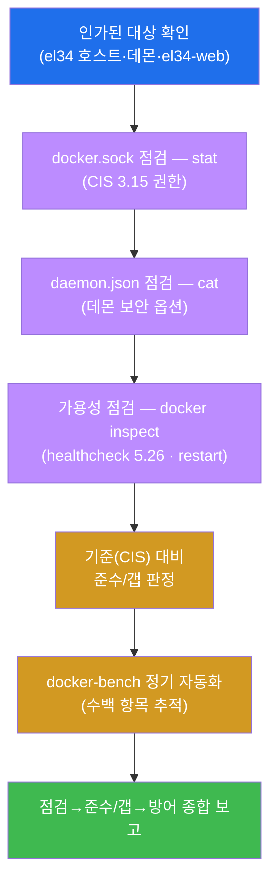

---

## 방어 — CIS Docker 기준선 (데몬·호스트·런타임·운영)

본 주차의 갭(특히 healthcheck)과 양호(sock 권한·restart)를 통제와 짝지으면, CIS Docker 방어는 다섯
축으로 정리된다 — 데몬·호스트를 잠그고, 컨테이너 가용성을 갖추고, 런타임을 최소권한으로 두며, 이
전부를 정기 자동 점검으로 유지하는 것이다.

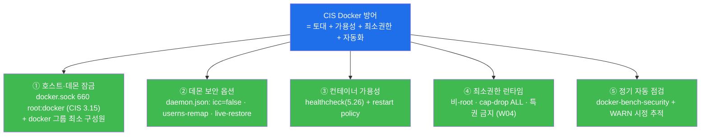

- **① 호스트·데몬 잠금** — docker.sock 을 `660 root:docker` 로 유지하고(el34 이미 준수), docker 그룹
  구성원을 최소로 둔다. 데몬 제어 무전기를 인가된 손에만 쥐어 주는 것이 토대 보안의 첫걸음이다.
- **② 데몬 보안 옵션** — daemon.json 에 `icc=false`(측면 이동 추가 차단)·`userns-remap`(컨테이너 root →
  호스트 비-root)·`live-restore`(데몬 장애 시 가용성)를 앱 호환성을 확인하며 단계적으로 적용한다.
- **③ 컨테이너 가용성** — el34-web 의 healthcheck 갭(§4)을 HEALTHCHECK 지시어로 메우고, restart
  policy(이미 준수)와 짝지어 "좀비 감지 + 자동 복구"의 두 축을 완성한다.
- **④ 최소권한 런타임** — W04 의 비-root 실행·`cap-drop ALL`·특권 금지를 적용해, 데몬·호스트 토대 위에
  올리는 컨테이너 한 칸의 폭발 반경도 함께 좁힌다.
- **⑤ 정기 자동 점검** — docker-bench-security 를 정기 잡으로 돌려 수백 항목을 반복 점검하고, `[WARN]`
  을 시정 목록으로 추적해 baseline 표류를 막는다.

핵심은 개별 옵션의 나열이 아니라, **"토대(데몬·호스트)를 잠그고, 그 위 컨테이너의 가용성·최소권한을
갖춘 뒤, 전부를 정기 자동 점검으로 유지한다"** 는 한 흐름으로 다섯 축을 꿰는 것이다. 미션 7 의 합격
기준은 이 방어 정리에 `docker-bench`(정기 자동화)가 포함되는지다.

---

## 10. 핵심 정리 (1줄씩)

1. **CIS Docker Benchmark** — Docker 보안 설정의 표준 점검표(수백 항목·6개 절: 호스트·데몬·데몬설정·
   이미지·런타임·운영). 본 주차는 데몬·호스트(1·2·3)와 가용성(5.26)을 본다.
2. **docker.sock(CIS 3.15)** — 데몬 제어 소켓 = 사실상 호스트 root 권한. el34 는 **660 root:docker =
   준수**(`compliant=sock_660`). 666(world-writable)이면 치명 갭.
3. **daemon.json** — 데몬 전역 보안 옵션(icc=false·userns-remap·live-restore). el34 호스트에 **존재**.
   부재면 모든 옵션이 기본값(보안 권고 미충족 소지).
4. **Healthcheck(CIS 5.26)** — running ≠ healthy. el34-web 은 healthcheck **없음 = 갭**
   (`gap=no_healthcheck`). 좀비 컨테이너를 자동 감지·교체 못 함.
5. **Restart policy** — 비정상 종료 시 자동 복구(복원력). el34-web 은 **`unless-stopped` = 준수**
   (`compliant=restart_unless-stopped`). healthcheck 와 짝지어야 가용성 완성.
6. **docker-bench-security** — CIS 수백 항목을 자동 점검(`[PASS]`/`[WARN]`/`[INFO]`)하는 공식 스크립트.
   손 점검을 정기 자동화·추적으로. 방어 = 토대 잠금 + 가용성 + 최소권한 + 자동화.

---

## 11. 다음 주차 (W10) 예고 — 컨테이너 런타임 위협 탐지 (Wazuh·Falco)

본 주차(W09)까지 학생은 컨테이너를 **정적으로 점검** 하는 한 바퀴를 마쳤다 — 이미지(W02·W03)·런타임
(W04)·격리(W05)·시크릿(W06)·네트워크(W07), 그리고 본 주차의 데몬·호스트(W09)까지. 이 점검들은 모두
**"설정이 기준선에 맞는가"를 한 시점에 확인** 하는 정적 점검이다. 그런데 한 가지 빈틈이 있다 — **설정이
아무리 양호해도, 실행 중인 컨테이너가 침해돼 예상 밖의 행동을 시작하면** 정적 점검은 그것을 실시간으로
잡지 못한다.

W10 은 이 빈틈을 메운다 — 정적 점검을 넘어 **실행 중 컨테이너의 비정상 행위(예상 밖 프로세스 실행 ·
파일 변경 · 의심스러운 아웃바운드 통신)를 실시간으로 탐지** 하는 **런타임 위협 탐지** 로 들어간다.
el34 는 **Wazuh(siem, dmz .100)** 와 호스트 **Sysmon** 으로 컨테이너·호스트의 행위를 포착하며, 컨테이너
전용 런타임 탐지 도구인 **Falco** 의 개념도 다룬다. 본 주차에서 익힌 "기준선 점검"이, W10 의 "실시간
행위 탐지"와 만나 — **사전(설정 점검)과 사후(행위 탐지)** 의 두 축으로 컨테이너 방어의 그림을 완성한다.

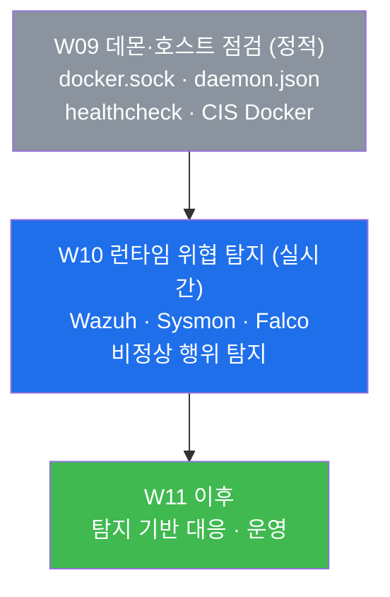
