# 클라우드·컨테이너 W10 — 런타임 위협 탐지 (Wazuh·Falco 행위 모니터링)

> **본 주차의 한 줄 요약**
>
> W03~W09 까지 우리는 컨테이너의 **"설정"** 을 점검했다 — 이미지에 취약점은 없는가(W02·W03), 컨테이너가
> root·특권으로 떠 있지 않은가(W04), 격리·시크릿·네트워크가 제대로인가(W05~W07), 데몬·호스트 구성이
> 기준에 맞는가(W09). 이 모든 점검은 **"배포 시점의 상태"** 를 본다. 그러나 깨끗하게 배포된 컨테이너도
> 실행 중에 침해될 수 있다 — 웹 앱이 뚫려 컨테이너 안에서 **예상 밖 프로세스(셸·리버스셸)** 가 뜨고,
> **민감 파일이 바뀌고**, **알 수 없는 곳으로 아웃바운드 연결**이 나간다. 이런 **실행 중 비정상 행위**
> 는 정적 점검이 절대 잡지 못한다. 본 주차는 그 사각을 메우는 마지막 안전망 — **런타임 위협 탐지
> (runtime threat detection)** — 를 배운다. el34 는 **Wazuh**(siem 컨테이너)로 컨테이너 호스트의
> 로그·파일무결성·행위를 수집하고, **호스트 Sysmon**(eBPF)으로 컨테이너 내부 프로세스까지 포착하며,
> 여기에 컨테이너 런타임 전용 표준인 **Falco** 의 개념을 더한다.
>
> **점검자 한 줄 결론**: 컨테이너 보안은 "배포 전에 잘 막았는가(정적·예방)"로 끝나지 않는다. 예방을
> 뚫고 들어온 침해를 **실행 중 행위로 탐지**하고(Wazuh·Falco·Sysmon), 침해된 컨테이너를 **격리·재배포**
> 로 빠르게 복구하는 **예방 + 탐지 + 대응의 삼중 체계**가 완성된 컨테이너 보안이다.

---

## 학습 목표

본 주차 종료 시 학생은 다음 6 가지를 **본인 손으로** 할 수 있어야 한다.

1. **정적 점검(W03~W09)의 한계** 를 "배포 시점 상태 vs 실행 중 행위"로 명확히 설명하고, 정적으로
   깨끗한 컨테이너가 어떻게 런타임에 침해될 수 있는지(웹셸·리버스셸·예상 밖 프로세스) 근거를 들어
   말한다.
2. **런타임 위협 탐지** 가 무엇을 보는지를 세 신호(예상 밖 **프로세스** · **파일 변경** · 비정상
   **아웃바운드**)로 정리하고, 왜 이 세 신호가 침해의 핵심 단서인지 설명한다.
3. el34 의 **Wazuh**(siem 컨테이너)가 컨테이너 호스트의 로그·FIM·행위를 수집해 비정상을 탐지함을
   `ssh ccc@10.20.32.100` 로 `/var/ossec/logs/alerts/alerts.json` 적재로 확인한다.
4. **호스트 Sysmon(eBPF)이 컨테이너 내부 프로세스까지 포착하는 원리** — 컨테이너 프로세스가 곧 호스트
   커널의 프로세스라는 점 — 를 그림으로 설명하고, 왜 비특권 컨테이너에 에이전트를 못 넣어도 호스트
   레벨에서 런타임 가시성을 확보하는지 말한다.
5. **Falco** 가 컨테이너 런타임 위협 탐지의 CNCF 표준임을 설명하고, syscall(시스템콜) 규칙으로
   "컨테이너 내 셸 실행"·"민감 파일 읽기"·"예상 밖 아웃바운드" 같은 행위를 실시간 탐지하는 원리와,
   Wazuh(로그·FIM)와의 **보완 관계**를 정리한다.
6. **예방 + 탐지 + 대응의 삼중 체계** 를 정리하고, 컨테이너가 **불변(immutable)** 이라 침해 시
   **깨끗한 이미지로 재배포** 하는 대응이 왜 빠른지를 설명해, 정적 한계 → Wazuh·Sysmon 모니터링 →
   Falco → 예방/탐지/대응을 **런타임 위협 탐지 보고서** 한 장으로 종합한다.

> **점검자의 시선** — 본 주차는 컨테이너를 "강화하는(hardening)" 주가 아니라, 이미 돌고 있는
> 컨테이너의 **행위(behavior)를 감시하는** 주다. 채점은 "위험해 보인다"가 아니라, **무엇이(어떤
> 행위·어떤 탐지 소스) 왜 런타임 침해의 신호이며, el34 의 Wazuh·Sysmon·Falco 가 그것을 어떻게
> 포착하는가**를 명령 출력과 함께 보였는가를 본다. 핵심 산출물은 정적 한계의 인식 + Wazuh 적재 확인 +
> 호스트 Sysmon 의 컨테이너 가시성 + Falco 개념을, 예방/탐지/대응 체계에 자리매김한 런타임 위협 탐지
> 보고서다.

---

## 0. 용어 해설 (런타임 위협 탐지 입문)

본 주차에 처음 등장하거나 특히 중요한 용어를 먼저 정리한다. 한 줄 정의로는 부족한 핵심어(정적 vs
런타임 · 행위 탐지 · eBPF · 불변 인프라)는 다음 절(0.5)에서 일상 비유로 다시 풀어 설명한다. 본문
(§1~§7)에서 같은 용어가 다시 나올 때 막히면 이 표로 돌아오면 흐름이 끊기지 않는다.

| 용어 | 영문 | 뜻 | 비유 |
|------|------|----|------|
| **정적 점검** | static check | 실행 전/배포 시점의 **설정·상태**(이미지·권한·구성)를 검사하는 것 | 출고 전 차량 정비 점검 |
| **런타임 위협 탐지** | runtime threat detection | 실행 중인 컨테이너의 **비정상 행위**(예상 밖 프로세스·파일 변경·아웃바운드)를 잡아내는 것 | 주행 중 블랙박스·이상감지 |
| **행위 모니터링** | behavior monitoring | "무엇이 설정됐나"가 아니라 "무엇을 하고 있나"를 보는 것 | 사람의 상태가 아닌 행동을 봄 |
| **Wazuh** | — | 로그·파일무결성·행위를 수집·상관해 보안 이벤트를 탐지하는 오픈소스 보안 플랫폼(SIEM/HIDS) | 건물 통합 관제실 |
| **SIEM** | Security Information and Event Management | 여러 소스의 보안 로그를 한곳에 모아 상관·경보하는 시스템 | 모든 CCTV·센서를 모은 관제실 |
| **HIDS** | Host-based Intrusion Detection System | 호스트 안의 로그·파일·행위를 보고 침입을 탐지하는 방식 | 건물 내부에 둔 감시 요원 |
| **FIM** | File Integrity Monitoring | 보호 대상 파일이 **변경**되면 탐지·경보하는 기능 | 봉인 스티커가 뜯겼는지 감시 |
| **alert(경보)** | alert | 탐지 규칙에 걸린 비정상을 기록한 한 건의 보안 이벤트 | 경보벨이 울린 기록 |
| **Sysmon for Linux** | System Monitor for Linux | 호스트 커널의 프로세스·연결·파일 이벤트를 기록하는 도구(eBPF 기반) | 호스트의 비행기록장치 |
| **eBPF** | extended Berkeley Packet Filter | 커널 안에서 안전하게 이벤트를 가로채는 현대 커널 기술 | 커널에 심은 안전한 센서 |
| **syscall(시스템콜)** | system call | 프로세스가 커널에 기능(파일 열기·프로세스 실행·연결 등)을 요청하는 통로 | 직원이 본사에 올리는 결재 요청 |
| **Falco** | — | 커널 syscall 을 규칙으로 보고 컨테이너 런타임 위협을 실시간 탐지하는 CNCF 도구 | 결재 요청을 실시간 감시하는 감사관 |
| **CNCF** | Cloud Native Computing Foundation | 쿠버네티스 등 클라우드 네이티브 오픈소스를 관리하는 재단(사실상 표준의 산실) | 업계 표준을 정하는 협회 |
| **리버스셸** | reverse shell | 침해된 호스트가 공격자에게 거꾸로 셸(원격 명령권)을 내주는 연결 | 안에서 밖으로 거는 비상 전화 |
| **웹셸** | web shell | 웹 서버에 심어 둔, 브라우저로 명령을 실행하는 악성 스크립트 | 몰래 설치한 원격 조종기 |
| **C2** | Command and Control | 공격자가 침해 호스트를 조종하는 서버(아웃바운드 콜백의 목적지) | 도둑이 무전을 받는 본부 |
| **불변 인프라** | immutable infrastructure | 한 번 만든 것을 고치지 않고, 바꿀 땐 **새로 만들어 교체**하는 운영 방식 | 수리 대신 새 부품으로 통째 교체 |
| **예방·탐지·대응** | prevent·detect·respond | 침해를 미리 막고(예방), 뚫린 걸 잡고(탐지), 복구하는(대응) 세 축 | 자물쇠·경보기·소화기 |

---

## 0.5 핵심 개념

위 표는 한 줄 정의에 그치므로, 런타임 위협 탐지를 처음 다루는 학생이 헷갈리기 쉬운 핵심 개념을 일상
비유로 다시 풀어 설명한다. 본 절을 먼저 읽어두면 본문에서 같은 용어가 다시 나올 때 흐름이 끊기지
않는다.

### 0.5.1 정적 점검 vs 런타임 탐지 — 출고 정비와 주행 블랙박스

학생이 자동차 안전을 책임진다고 하자. 두 가지 일을 한다.

- **정적 점검(출고 전 정비).** 차가 공장을 나서기 전에 브레이크·타이어·엔진을 점검한다. "이 차는
  안전한 상태로 출고됐는가"를 본다. 매우 중요하지만, 이것은 **출고 시점의 상태**일 뿐이다.
- **런타임 탐지(주행 중 감지).** 차가 실제 도로를 달리는 동안 급제동·이상 진동·경로 이탈을 블랙박스와
  센서가 실시간으로 기록·경보한다. "지금 이 차가 무슨 일을 겪고 있는가"를 본다.

W03~W09 의 점검이 전부 **출고 정비**다 — 이미지 CVE(W02·W03), root·특권(W04), 격리(W05), 시크릿
(W06), 네트워크(W07), 데몬·호스트 구성(W09). 모두 **배포 시점의 설정**을 본다. 그러나 완벽히 정비된
차도 주행 중 사고가 날 수 있듯, 정적으로 깨끗한 컨테이너도 **실행 중 침해**될 수 있다. 공격자가 웹
앱의 취약점을 뚫고 컨테이너 안에서 셸을 띄우거나(웹셸·리버스셸), 설정을 바꾸거나, 외부 C2 로 연결을
빼낸다. 이런 **실행 중 행위**는 출고 정비(정적 점검)로는 절대 보이지 않는다. 그래서 **주행 중
감지(런타임 탐지)** 가 따로 필요하다. 본 주차의 출발 명제가 바로 이것이다 — **정적 점검을 통과해도
런타임에 침해될 수 있다. 둘은 경쟁이 아니라 보완이다.**

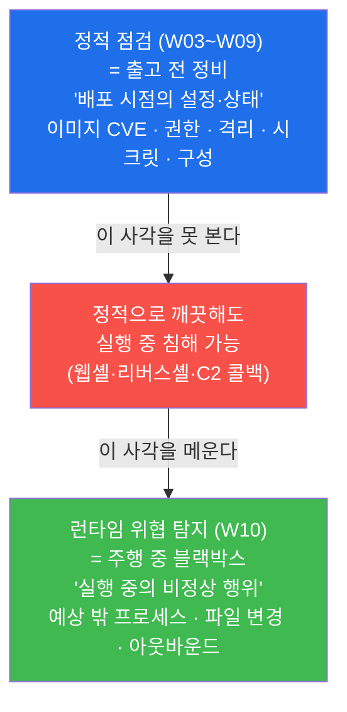

### 0.5.2 행위 탐지가 보는 세 신호 — 누가 들어왔나·뭘 만졌나·어디로 전화했나

런타임 탐지는 막연히 "이상한 것"을 찾는 게 아니라, 침해가 거의 항상 남기는 **세 가지 행위 신호**를
집중적으로 본다. 사무실에 도둑이 들었다고 상상하면 쉽다.

- **① 예상 밖 프로세스(누가 들어왔나).** 웹 서버 컨테이너는 평소 웹 서버 프로세스만 돌아야 한다.
  그런데 갑자기 `bash`·`sh`·`nc`·`python` 으로 셸이 뜬다면, 누군가 침입해 명령을 실행하고 있다는
  뜻이다. CCTV 에 "출입 명단에 없는 사람"이 찍힌 것과 같다.
- **② 파일 변경(뭘 만졌나).** 공격자는 설정 파일을 바꾸거나(`/etc` 수정), 백도어·페이로드 파일을
  떨어뜨린다. 봉인 스티커가 뜯겼는지를 보는 것 — 이것이 **FIM(파일 무결성 모니터링)** 이다.
- **③ 비정상 아웃바운드(어디로 전화했나).** 침해된 컨테이너는 외부의 **C2 서버**로 콜백 연결을 맺어
  명령을 받거나 데이터를 빼낸다(리버스셸이 대표적). 정상적으로는 안 나가던 곳으로 나가는 연결 —
  도둑이 본부에 무전을 거는 순간이다.

런타임 탐지 도구(Wazuh·Falco·Sysmon)는 모두 결국 이 세 신호를 본다. **무엇을 설정했나가 아니라,
무엇을 하고 있나** 를 보는 것이 행위 탐지의 핵심이다.

### 0.5.3 eBPF — 컨테이너 안까지 들여다보는 호스트 커널의 센서

컨테이너 보안의 큰 난제 하나는 "**컨테이너 안에서 무슨 일이 벌어지는지 어떻게 보는가**"이다. 보안상
응용 컨테이너는 **비특권(unprivileged)** 으로 떠 있어, 그 안에 무거운 감시 에이전트를 넣기 어렵다.
그렇다면 컨테이너 안은 깜깜한 사각일까? 아니다. 여기서 **컨테이너의 본질**을 떠올려야 한다.

컨테이너는 **네임스페이스(namespace, W05)** 로 격리될 뿐, 자기 커널을 따로 갖지 않는다 — 같은 호스트
커널을 공유하는 **칸막이 방**일 뿐이다. 그래서 컨테이너 안에서 실행되는 프로세스도 **결국 호스트
커널이 실행하는 프로세스**다. 즉 **호스트 커널 한 곳에 센서를 달면, 그 위의 모든 컨테이너 활동을
한꺼번에 볼 수 있다.** 이 "커널에 안전하게 심는 센서"가 바로 **eBPF(extended Berkeley Packet
Filter)** 다.

eBPF 는 커널을 다시 컴파일하거나 위험한 커널 모듈을 직접 올리지 않고도, 커널 안에서 이벤트(프로세스
생성·네트워크 연결·파일 생성 등)를 **안전하게 가로채** 기록하는 현대 커널 기술이다. 커널이 eBPF
프로그램을 검증한 뒤에만 실행하므로 시스템을 망가뜨릴 위험이 낮다. el34 의 **호스트 Sysmon** 과
**Falco** 가 모두 이 eBPF 를 센서로 써서, 비특권 컨테이너 안의 행위까지 호스트 레벨에서 포착한다.

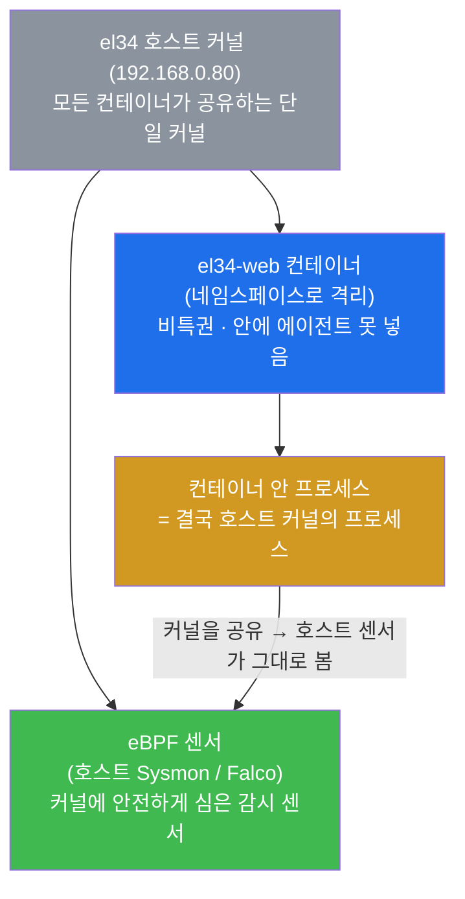

### 0.5.4 불변 인프라 — 고치지 않고 통째로 새것으로 교체

마지막 핵심은 **대응**의 발상이 컨테이너에서 어떻게 달라지는가다. 전통적인 서버에서 침해가 일어나면,
관리자는 그 서버에 접속해 악성코드를 찾아 지우고, 백도어를 제거하고, 설정을 되돌리는 **수리(repair)**
를 한다. 시간이 오래 걸리고, 공격자가 숨긴 흔적을 완전히 지웠는지 확신하기 어렵다.

컨테이너는 다르다. 컨테이너는 **불변 인프라(immutable infrastructure)** 원칙을 따른다 — 한 번 만든
이미지는 고치지 않고, 바꿀 일이 있으면 **새 이미지를 만들어 통째로 교체**한다. 마치 고장 난 부품을
수리하는 대신 새 부품으로 갈아 끼우는 것과 같다. 그래서 컨테이너가 침해되면, **그 컨테이너를
종료·격리하고, 검증된 깨끗한 이미지로 다시 띄우면(재배포)** 침해 흔적이 통째로 사라진다. "공격자가
무엇을 숨겼을까"를 고민할 필요 없이, 알려진 깨끗한 상태로 즉시 돌아간다. **이 빠른 재배포가 컨테이너
보안에서 대응을 강력하게 만드는 핵심 장점**이다(단, 침해 원인 분석을 위한 포렌식은 교체 전에 한다).

---

이 네 개념(정적 vs 런타임 · 세 행위 신호 · eBPF · 불변 인프라)이 본 주차 본문의 기반이다. 본문에서
다시 등장할 때 막히면 본 절로 돌아오면 흐름이 끊기지 않는다.

---

## 1. 왜 정적 점검만으로는 부족한가

### 1.1 한 줄 답: 정적 점검은 "배포 시점"만, 침해는 "실행 중"에 일어난다

W03~W09 동안 학생은 컨테이너의 **설정과 상태**를 한 바퀴 점검했다 — 이미지에 알려진 취약점은 없는가
(W02·W03), 컨테이너가 root·특권으로 떠 있지 않은가(W04), 격리·시크릿·네트워크가 제대로인가(W05~W07),
데몬·호스트 구성이 CIS 기준에 맞는가(W09). 이 점검들은 모두 강력하고 꼭 필요하지만, 한 가지 공통의
한계를 갖는다 — **모두 "배포 시점의 상태"를 본다.** 이미지를 스캔한 순간, 컨테이너를 띄운 순간의
모습이 기준이다.

그런데 공격은 **그 이후, 실행 중**에 일어난다. 정적으로 완벽히 깨끗한 컨테이너라도, 그 위에서 도는
웹 애플리케이션에 취약점(SQLi·RCE 등, web-vuln 트랙)이 있으면 공격자는 실행 중인 컨테이너 안으로
파고든다. 그러면 컨테이너 안에서 **예상 밖 프로세스**(셸)가 뜨고, **파일이 바뀌고**, **외부로
아웃바운드**가 나간다. 이 실행 중 행위는 배포 시점을 본 정적 점검에는 잡히지 않는다.

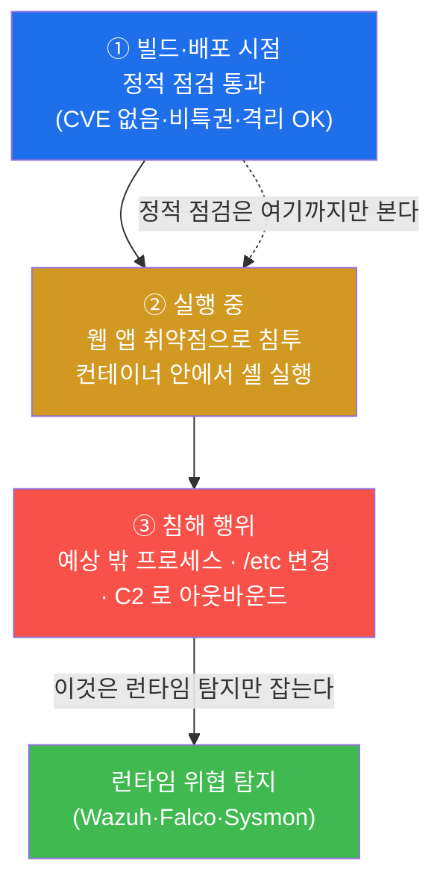

### 1.2 왜 중요한가 — "깨끗하게 배포됐다"는 침해가 없다는 뜻이 아니다

실무에서 자주 빠지는 함정이 "이미지 스캔도 통과했고 비특권으로 띄웠으니 안전하다"는 착각이다. 정적
점검은 **알려진 취약점과 잘못된 설정**을 줄여 침해 **표면(가능성)** 을 낮출 뿐, 침해가 **일어나지
않음**을 보장하지 않는다. 제로데이(아직 패치 없는 취약점), 애플리케이션 로직 취약점, 탈취된 자격증명
등은 정적 점검을 그대로 통과한다. 그래서 성숙한 컨테이너 보안은 정적 점검을 마치고 끝내지 않고, **그
위에 런타임 행위 탐지를 한 겹 더 올린다.** 정적이 "들어오지 못하게"라면, 런타임은 "들어왔다면
들키게"다.

### 1.3 el34 에서 어떻게 — 정적 vs 런타임을 한 문장으로

el34 에서 이 차이는 곧 점검 소스의 차이로 드러난다. 정적 점검은 `docker inspect`·`trivy` 로
**설정·이미지**를 보았다(W02~W09). 런타임 탐지는 **el34-siem(Wazuh)** 과 **호스트 Sysmon** 으로
**실행 중 행위**를 본다. 본 주차의 lab 미션 2 가 바로 이 차이를 학생이 직접 한 문장으로 정리하게
한다 — **"정적(W03~09): 이미지 CVE·런타임 설정 = 배포 시점 상태 / 런타임 탐지: 실행 중 컨테이너의
비정상 행위(예상 밖 프로세스·파일 변경·아웃바운드 C2)."** 핵심 확인 토큰은 `static_vs_runtime` 이다.

### 1.4 한계 — 런타임 탐지도 정적 점검을 대신하지 못한다

반대 방향의 오해도 경계해야 한다. "런타임에서 잡으면 되니 정적 점검은 대충 해도 된다"는 것도 틀렸다.
런타임 탐지는 침해를 **사후에**(또는 진행 중에) 잡는 것이라, 이미 일부 피해가 발생한 뒤일 수 있다.
가장 좋은 것은 정적 강화로 **애초에 침해 가능성을 줄이고**, 그래도 뚫린 것을 런타임으로 **빠르게
잡는** 것이다 — 둘은 어느 하나가 우월한 게 아니라 **순서가 다른 보완재**다(§6 의 예방+탐지+대응).

---

## 2. 런타임 위협 탐지가 보는 것 — 세 가지 행위 신호

### 2.1 한 줄 정의와 왜 중요한가

**런타임 위협 탐지(runtime threat detection)** 는 실행 중인 컨테이너의 **비정상 행위**를 잡아내는
것이다(§0.5.1·§0.5.2). 막연히 "이상한 것"을 찾는 게 아니라, 침해가 거의 항상 남기는 **세 가지 행위
신호 — 예상 밖 프로세스 · 파일 변경 · 비정상 아웃바운드 —** 를 집중해서 본다. 이 셋이 중요한 이유는,
컨테이너가 침해되면 공격자가 **무언가를 실행하고(프로세스), 무언가를 남기고(파일), 어딘가와
통신하기(아웃바운드)** 때문이다 — 침해의 행위적 본질이 거의 항상 이 셋으로 나타난다.

### 2.2 세 가지 신호

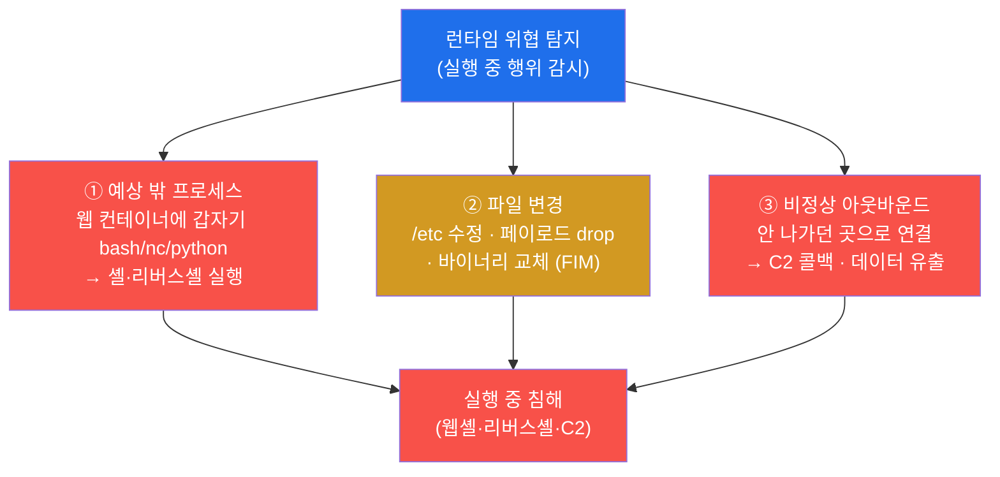

- **① 예상 밖 프로세스.** 컨테이너는 보통 **하나의 역할(예: 웹 서버)** 만 한다. 따라서 그 안에서 도는
  프로세스 목록은 평소 매우 단순하고 예측 가능하다. 웹 서버 컨테이너에 갑자기 `bash`·`sh`·`nc`(netcat)
  ·`python` 으로 대화형 셸이 뜬다면, 이는 거의 확실히 침해 신호다 — 정상 운영에서는 셸을 띄울 일이
  없기 때문이다. 이 "예측 가능성"이 컨테이너 런타임 탐지를 일반 서버보다 **오히려 쉽게** 만든다.
- **② 파일 변경.** 공격자는 설정 파일을 바꾸거나(`/etc/passwd`·웹 루트 등), 백도어·페이로드 파일을
  떨어뜨리거나, 정상 바이너리를 악성으로 교체한다. 보호 대상 파일이 바뀌면 경보하는 것이 **FIM(File
  Integrity Monitoring, 파일 무결성 모니터링)** 이며, Wazuh 의 핵심 기능 중 하나다.
- **③ 비정상 아웃바운드.** 침해된 컨테이너는 외부의 **C2(Command and Control) 서버**로 연결을 맺어
  명령을 받거나(리버스셸) 데이터를 빼낸다. 평소 그 컨테이너가 통신하지 않던 목적지로 나가는 연결은
  강한 침해 신호다.

### 2.3 el34 에서 어떻게 — 이 세 신호를 누가 잡나

el34 에서 이 세 신호는 서로 다른(그러나 보완적인) 소스가 잡는다. **프로세스 생성**과 **아웃바운드
연결**, **파일 생성**은 **호스트 Sysmon(eBPF)** 이 컨테이너 내부까지 이벤트로 남기고(§4), **로그
이상**과 **FIM(파일 무결성)** 은 **Wazuh** 가 수집·상관해 alert 로 남긴다(§3). 그리고 syscall
레벨에서 "컨테이너 내 셸"·"민감 파일 읽기" 같은 행위를 실시간 규칙으로 잡는 것이 **Falco** 다(§5).
즉 세 신호를 여러 소스가 다각으로 본다.

### 2.4 한계 — 정상과 비정상의 경계는 baseline 에 달렸다

행위 탐지의 어려움은 "무엇이 비정상인가"를 정하는 데 있다. 어떤 컨테이너에서는 정상인 행위(예: 배치
작업이 임시 셸을 띄움)가 다른 컨테이너에서는 침해일 수 있다. 그래서 런타임 탐지는 각 컨테이너의 **정상
행위 기준선(baseline)** 을 알아야 오탐(정상을 침해로 오인)·미탐(침해를 놓침)을 줄인다. 컨테이너가
역할이 단순해 baseline 을 잡기 쉽다는 것이 장점이지만(§2.2), 그래도 baseline 설계와 규칙 튜닝은
런타임 탐지 운영의 핵심 과제다(§6).

---

## 3. el34 의 Wazuh — 컨테이너 호스트의 로그·FIM·행위 수집

### 3.1 한 줄 정의와 왜 중요한가

**Wazuh** 는 호스트·컨테이너의 **로그·파일무결성(FIM)·행위**를 수집·상관해 보안 이벤트를 탐지하는
오픈소스 보안 플랫폼이다. 흔히 **SIEM**(여러 소스의 보안 로그를 한곳에 모아 상관·경보하는 시스템)이자
**HIDS**(호스트 안의 로그·파일·행위로 침입을 탐지하는 방식)로 분류된다. el34 에서 Wazuh 가 중요한
이유는, 이것이 **런타임 위협 탐지의 1차 원천(SIEM)** 이기 때문이다 — 여러 컨테이너·호스트에서 일어난
이상 행위가 모두 Wazuh 로 모여 **alert(경보)** 로 남는다.

> **용어 — Wazuh 와 secuops/soc 트랙.** Wazuh 는 본 클라우드·컨테이너 트랙만의 도구가 아니라,
> secuops·soc(방어·관제) 트랙이 SIEM 으로 쓰는 **바로 그 엔진**이다(버전 4.10). 본 주차는 같은
> Wazuh 를 "컨테이너 행위 탐지"라는 렌즈로 본다 — 같은 관제실이 컨테이너의 런타임 침해까지 본다는
> 뜻이다.

### 3.2 el34 에서 어떻게 — siem 컨테이너의 alerts.json

el34 의 Wazuh 는 **siem 컨테이너**(el34-siem, dmz .100)로 가동되며, 탐지된 모든 보안 이벤트를
**`/var/ossec/logs/alerts/alerts.json`** 에 적재한다. 이 파일이 적재되고 있다는 것은 Wazuh 가 살아서
로그·FIM·행위를 받아 탐지하고 있다는 직접 증거다. lab 미션 3 은 이 적재를 확인한다.

```bash
ssh ccc@10.20.32.100 'tail -1 /var/ossec/logs/alerts/alerts.json | head -c 60; echo; echo wazuh_active'
```

- `ssh ccc@10.20.32.100` — el34 의 siem(Wazuh) 컨테이너 안에서 명령을 실행한다. el34 의 모든 점검은
  호스트(`ssh ccc@192.168.0.80`, 비밀번호 1)에서 `docker exec` 로 인가된 컨테이너에만 들어간다.
- `tail -1 .../alerts.json` — alert 로그의 가장 최근 한 줄을 본다. `head -c 60` 은 그 줄의 앞 60
  글자만 잘라 보여 줘(한 alert 가 매우 길기 때문) 적재 여부만 가볍게 확인한다.
- `echo wazuh_active` — 명령이 끝까지 수행됐음을 나타내는 **확인 토큰**이다. 학생은 출력에 이 토큰이
  나오는지로 단계 통과를 확인한다.

el34 에서 Wazuh 가 수집하는 것은 크게 세 가지다 — **(a) 로그**(컨테이너·호스트의 시스템/서비스 로그),
**(b) FIM**(보호 경로 파일 변경 무결성, el34 는 web 에 적용), **(c) 행위/상관**(여러 신호를 규칙으로
엮어 이상 판정). 이 세 가지가 모두 alert 로 모여 `alerts.json` 에 남는다.

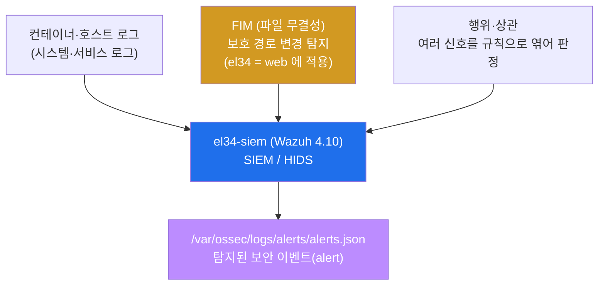

### 3.3 한계 — Wazuh 는 로그·FIM 이 강하고, 순간 syscall 은 보완이 필요하다

Wazuh 는 **로그 상관과 파일 무결성**에 매우 강하지만, "컨테이너 안에서 셸이 떴다"처럼 **커널 syscall
레벨의 순간 행위**를 빠짐없이 보는 데는 별도 소스가 보완으로 필요하다. 그래서 el34 는 Wazuh 에 더해
**호스트 Sysmon(eBPF, §4)** 으로 프로세스·연결·파일 이벤트를 잡고, 컨테이너 런타임 전용으로는 **Falco
(§5)** 가 syscall 규칙을 본다. 즉 Wazuh 는 런타임 탐지의 **중심(SIEM)** 이되, 다른 소스와 합쳐질 때
가장 강하다.

---

## 4. 호스트 Sysmon — 컨테이너 내부 프로세스까지 보는 eBPF 가시성

### 4.1 한 줄 정의와 왜 중요한가

**Sysmon for Linux** 는 호스트 커널의 **프로세스 생성·네트워크 연결·파일 생성** 이벤트를 기록하는
도구로, **eBPF** 를 센서로 쓴다(§0.5.3). 본 주차에서 중요한 이유는, Sysmon 이 **비특권 컨테이너 안의
행위까지 호스트 레벨에서 포착**하기 때문이다 — 컨테이너 안에 무거운 에이전트를 못 넣어도, 호스트에 둔
센서 하나로 그 위의 모든 컨테이너 행위를 본다.

### 4.2 핵심 원리 — 컨테이너 프로세스 = 호스트 커널 프로세스

가장 중요한 통찰은 §0.5.3 에서 본 것이다 — **컨테이너는 네임스페이스로 격리될 뿐 자기 커널을 따로
갖지 않는다.** 컨테이너 안에서 실행되는 프로세스도 결국 **호스트 커널이 실행하는 프로세스**다. 따라서
호스트 커널에 eBPF 센서(Sysmon)를 달면, 그 위에서 도는 어떤 컨테이너의 프로세스든 그 생성 순간을
호스트가 그대로 본다. 비특권 컨테이너라 그 **안**에는 센서를 못 넣어도, **밖(호스트)**에서 안을
들여다보는 셈이다.

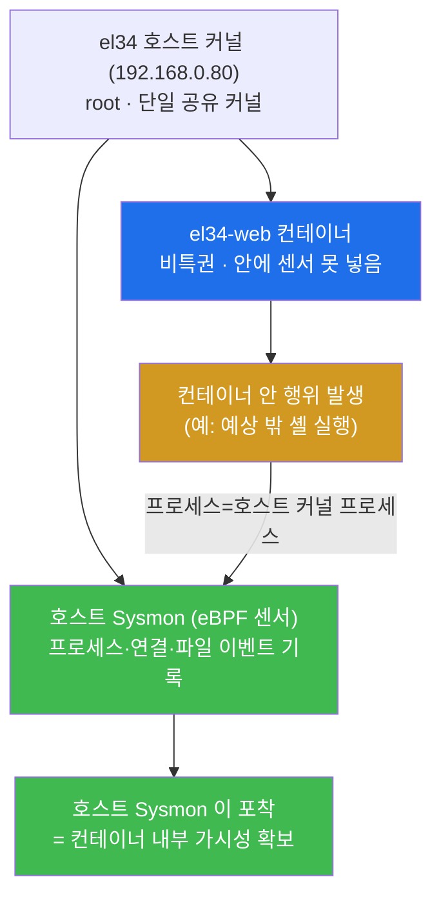

### 4.3 el34 에서 어떻게 — 컨테이너 안 행위를 만들어 호스트 가시성 확인

이 원리를 학생이 직접 확인하는 것이 lab 미션 4 다. el34-web 컨테이너 **안**에서 작은 행위(프로세스
실행)를 발생시킨다.

```bash
ssh ccc@10.20.32.80 "echo runtime_event_$(id -u) > /dev/null; echo behavior_generated"
```

- `ssh ccc@10.20.32.80 "..."` — el34-web 컨테이너 안에서 한 줄 명령을 실행한다(=컨테이너 내부
  행위 발생). 이 `sh` 프로세스 자체가 곧 호스트 커널의 프로세스이므로, 호스트의 Sysmon(eBPF)이 그
  생성 순간을 관측할 수 있다.
- `echo runtime_event_$(id -u) > /dev/null` — 컨테이너 안에서 무언가를 실행하는(=프로세스를 만드는)
  대표 행위다. 출력은 버리고(`/dev/null`), 중요한 것은 **"행위가 일어났다"는 사실** 자체다.
- `echo behavior_generated` — 컨테이너 내 행위가 발생했음을 나타내는 확인 토큰이다. 이 토큰이 나오면,
  호스트 Sysmon 이 관측 가능한 런타임 이벤트가 컨테이너 안에서 일어난 것이다.

> **el34 사실 — Sysmon 은 호스트에 산다.** Sysmon(eBPF)은 컨테이너가 아니라 **호스트
> (192.168.0.80)** 에 설치돼 있다. 그 이유와 설치 과정, EventID(ProcessCreate 1 / NetworkConnect 3
> / FileCreate 11)의 자세한 내용은 **secuops 트랙 W11** 에서 다룬다. 본 주차는 "호스트 Sysmon 이
> 컨테이너 내부 행위까지 본다"는 **컨테이너 보안 관점의 의미**에 집중한다.

### 4.4 한계 — 호스트 가시성은 컨테이너 식별·필터에 주의해야 한다

호스트 Sysmon 이 모든 컨테이너 행위를 본다는 것은 강력하지만, 동시에 **노이즈가 크다** — 한 호스트의
모든 컨테이너 이벤트가 한곳에 섞여 들어온다. 그래서 실무에서는 어느 이벤트가 어느 컨테이너의 것인지
식별하고(컨테이너 ID·네임스페이스 매핑), 관심 행위에 필터를 거는 작업이 필요하다. el34 호스트는 공유
자원이라 Sysmon config 가 특정 마커에 한정해 기록하도록 좁혀져 있다(secuops W11 참고). 즉 호스트
레벨 가시성은 "다 보인다"는 장점과 "다 섞여 시끄럽다"는 과제를 함께 갖는다.

---

## 5. Falco — 컨테이너 런타임 위협 탐지의 CNCF 표준

### 5.1 한 줄 정의와 왜 중요한가

**Falco** 는 커널 **syscall(시스템콜)** 을 규칙으로 보고 컨테이너 런타임 위협을 **실시간**으로 탐지하는
도구로, **CNCF(Cloud Native Computing Foundation)** 가 관리하는 컨테이너 런타임 탐지의 **사실상 표준**
이다. 중요한 이유는, Falco 가 "**컨테이너 안에서 셸이 실행됨**"·"**민감 파일을 읽음**"·"**예상 밖
아웃바운드**" 같은 행위를 **그 행위가 일어나는 순간** 규칙으로 잡아 경보하기 때문이다 — 사후 로그
분석이 아니라 실시간 탐지다.

> **용어 — syscall(시스템콜).** 프로세스가 파일을 열거나, 새 프로세스를 실행하거나, 네트워크 연결을
> 맺으려면 반드시 커널에 그 작업을 **요청**해야 하는데, 이 요청 통로가 syscall 이다(직원이 본사에
> 올리는 결재 요청에 비유). 모든 의미 있는 행위는 syscall 로 커널을 거치므로, **syscall 을 보면 그
> 프로세스가 실제로 무엇을 하는지** 가장 낮은 수준에서 알 수 있다. Falco 는 이 syscall 흐름을 eBPF 로
> 보고 규칙과 대조한다.

### 5.2 원리 — syscall 을 규칙으로 본다

Falco 의 동작은 단순하고 강력하다 — 커널 syscall 을 eBPF 센서로 가로채(§0.5.3), 미리 정의된 **규칙
(rule)** 과 실시간으로 대조한다. 규칙은 사람이 읽을 수 있는 형태로 "이런 행위는 의심스럽다"를 기술한다.

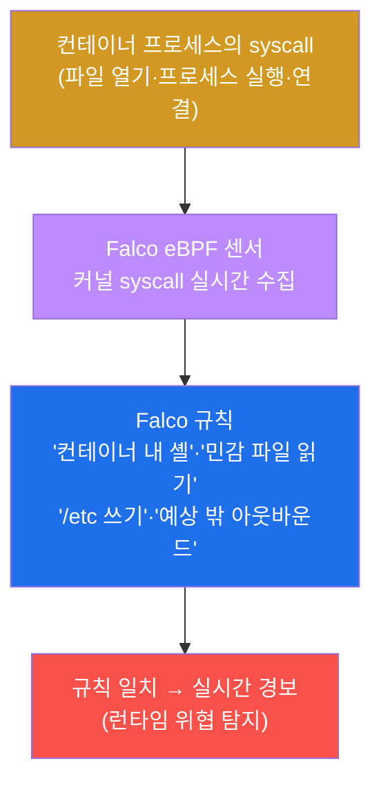

Falco 가 잡는 대표적 행위(규칙 예)는 다음과 같다 — 모두 §2 의 세 신호와 정확히 대응한다.

- **컨테이너 내 셸 실행** — 컨테이너 안에서 `bash`/`sh` 같은 대화형 셸이 뜨는 syscall(① 예상 밖
  프로세스). 가장 고전적인 침해 신호다.
- **민감 파일 읽기/쓰기** — `/etc/shadow` 읽기, `/etc` 하위 쓰기 등(② 파일 변경).
- **예상 밖 아웃바운드** — 허용되지 않은 목적지로의 연결(③ C2 콜백).
- **권한상승 시도** — `setuid` 호출, 특권 획득 시도 등.

### 5.3 el34 에서 어떻게 — 개념으로 다루고 Wazuh 와 보완

lab 미션 5 는 Falco 를 **개념으로** 정리한다(el34 에 신규 설치는 하지 않으므로). 학생은 Falco 가
"syscall 규칙 기반의 컨테이너 런타임 탐지 CNCF 표준"임과, **Wazuh(로그·FIM) + Falco(syscall)** 가
서로를 보완한다는 점을 정리한다. 핵심 확인 토큰은 `Falco` 다. 두 도구의 보완 관계는 이렇다.

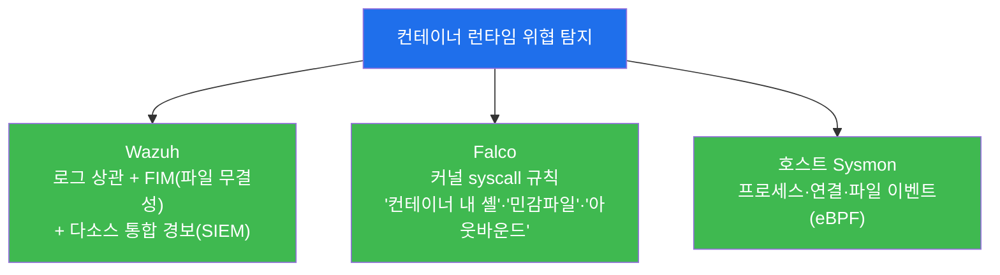

세 소스는 같은 침해를 다른 각도에서 본다 — Wazuh 는 **로그·파일 무결성**으로, Falco 는 **syscall
규칙**으로, Sysmon 은 **프로세스·연결·파일 이벤트**로. 어느 하나만 쓰면 사각이 생기고, 합치면 런타임
행위를 다각으로 잡는다.

### 5.4 한계 — 규칙 기반의 숙명(오탐·미탐)과 운영 부담

Falco 는 강력하지만 **규칙 기반 탐지의 숙명**을 갖는다. 규칙이 너무 느슨하면 정상 행위를 침해로 오인
(오탐)하고, 너무 빡빡하면 변종 침해를 놓친다(미탐). 그래서 각 환경의 정상 행위에 맞게 규칙을 **튜닝**
하는 운영 부담이 따른다. 또 Falco·Sysmon 모두 eBPF 를 쓰므로 충분히 새 커널과 커널 권한이 필요하다.
완전한 런타임 탐지는 도구 설치로 끝나는 게 아니라, baseline 설계·규칙 튜닝·경보 대응까지의 **운영**이
함께 가야 한다(§6).

---

## 6. 예방 · 탐지 · 대응 — 컨테이너 보안의 삼중 체계

### 6.1 한 줄 정의와 왜 중요한가

컨테이너 보안은 어느 한 통제로 완성되지 않고, **예방(prevent) · 탐지(detect) · 대응(respond)** 의
세 축이 함께 작동할 때 완성된다 — 정적 강화로 침해를 미리 막고(예방), 그래도 뚫린 것을 런타임 행위로
잡고(탐지), 침해된 컨테이너를 격리·재배포로 복구한다(대응). 이 세 축이 중요한 이유는, **완벽한 예방은
불가능**하기 때문이다. 예방만 믿으면 뚫렸을 때 무방비이고, 탐지만 있으면 막을 수 있는 것도 다 들어오게
두는 셈이다.

### 6.2 세 축의 관계

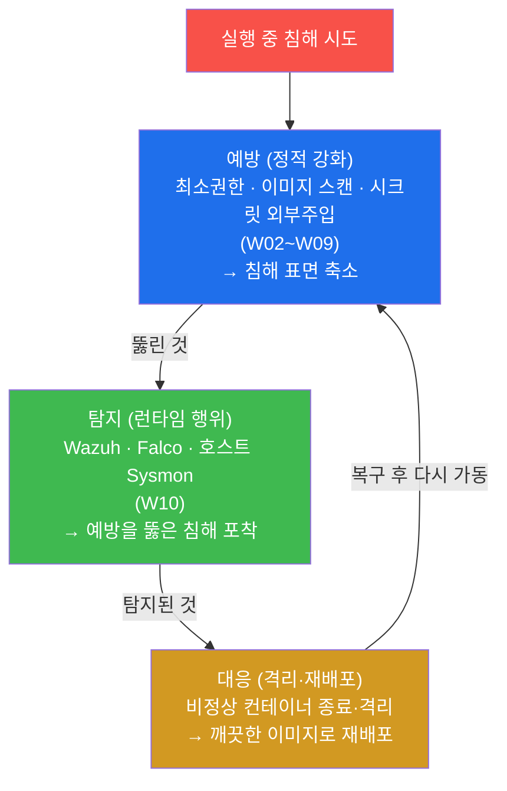

- **예방(prevent)** — W02~W09 에서 배운 정적 강화가 전부 여기 속한다 — 최소권한(비특권·non-root),
  이미지 취약점 스캔, 시크릿 외부 주입, 네트워크 분리·최소 노출, 데몬·호스트 구성 강화. 침해가
  **가능한 표면 자체를 줄인다.**
- **탐지(detect)** — 본 주차의 주제다. 예방을 뚫고 들어온 침해를 **실행 중 행위**(예상 밖 프로세스·
  파일 변경·아웃바운드)로 잡는다. el34 의 Wazuh + Falco + 호스트 Sysmon 이 이 역할을 한다.
- **대응(respond)** — 탐지된 침해를 복구한다. 비정상 컨테이너를 **격리·종료**하고, **깨끗한 이미지로
  재배포**한다(§6.3).

> **자동 대응(active response).** Wazuh 같은 도구는 고위험 탐지 시 사람의 개입 없이 **자동 대응
> (active response)** 을 실행할 수 있다 — 예를 들어 의심 IP 를 차단하거나 침해 컨테이너를 격리하는
> 스크립트를 즉시 돌린다. 탐지에서 대응까지의 시간을 줄이는 것이 핵심이다.

### 6.3 el34 에서 어떻게 — 컨테이너는 불변이라 대응이 빠르다

컨테이너 보안에서 **대응**이 특히 강력한 이유가 **불변 인프라(immutable infrastructure)** 다(§0.5.4).
컨테이너 이미지는 한 번 만들면 고치지 않는 것이 원칙이라, 침해된 컨테이너를 **수리하지 않고** 종료한
뒤 **검증된 깨끗한 이미지로 다시 띄우면(재배포)** 침해 흔적이 통째로 사라진다. 전통적 서버처럼 "공격자가
무엇을 숨겼을까"를 일일이 찾아 지울 필요가 없다 — **알려진 깨끗한 상태로 즉시 되돌아간다.** 단, 침해
원인 분석을 위한 **포렌식(이미지·로그·alert 보존)** 은 교체 전에 수행한다. 이 "빠른 재배포 대응"이
컨테이너 보안의 큰 장점이고, 그래서 컨테이너 환경에서는 **탐지 → 격리 → 재배포** 가 표준 대응 흐름이
된다.

### 6.4 한계 — 재배포는 "원인"을 고치지 않는다

재배포의 함정은, 침해의 **근본 원인**(예: 웹 앱 취약점, 노출된 시크릿)을 그대로 둔 채 깨끗한 이미지로
바꾸면 **같은 방식으로 또 뚫린다**는 점이다. 재배포는 침해된 인스턴스를 빠르게 치우는 것이지, 침해를
**불러온 취약점을 고치는 것이 아니다.** 그래서 대응은 항상 **(a) 침해 인스턴스 격리·재배포 + (b)
원인(취약점) 분석·수정 + (c) 그 수정을 새 이미지에 반영** 까지 가야 완결된다 — 탐지가 알려 준 침해
경로를 예방(정적 강화)으로 되먹임하는 것이다. 즉 삼중 체계는 한 바퀴 도는 **순환**이다.

---

## 7. 점검 명령 빠른 복습 — "무엇을 어디서 보나"

본 주차의 점검은 모두 el34 호스트(`ssh ccc@192.168.0.80`, 비밀번호 1)에서 `docker` CLI 로 수행하며,
**신규 도구 설치는 없다**(이미 가동 중인 Wazuh·호스트 Sysmon 을 확인하고, Falco 는 개념으로 다룬다).
점검 대상은 인가된 el34 컨테이너(`el34-siem`·`el34-web`)뿐이다.

| 무엇을 | 명령 | 무엇을 보나 |
|--------|------|-------------|
| 대상(SIEM) 확인 | `ssh ccc@10.20.32.100 "hostname; echo target_ok"` | 런타임 탐지 원천(Wazuh)이 가동 중인가(`target_ok`) |
| 정적 점검의 한계 | (개념 정리) | 정적=배포 시점 설정 vs 런타임=실행 중 행위(`static_vs_runtime`) |
| Wazuh 모니터링 | `ssh ccc@10.20.32.100 'tail -1 /var/ossec/logs/alerts/alerts.json ...'` | Wazuh alert 적재(로그·FIM·행위 탐지, `wazuh_active`) |
| 호스트 Sysmon 가시성 | `ssh ccc@10.20.32.80 "...; echo behavior_generated"` | 컨테이너 내 행위 발생(호스트 Sysmon 이 관측 가능, `behavior_generated`) |
| Falco | (개념 정리) | syscall 규칙 기반 컨테이너 런타임 탐지 CNCF 표준(`Falco`) |
| 탐지 vs 예방 | (개념 정리) | 예방+탐지+대응 삼중 체계(`탐지`) |
| 런타임 탐지 방어 | (개념 정리) | Falco+Wazuh+Sysmon 다각 + baseline 이탈 + 자동 격리(`Falco`) |
| 런타임 탐지 보고 | (보고서) | 정적 한계 + 모니터링 + Falco + 체계(`Falco`) |

> **점검 관용구.** 본 주차의 명령들은 끝에 `echo target_ok` / `echo wazuh_active` / `echo
> behavior_generated` 같은 **확인 토큰**을 찍는다. 이는 명령이 끝까지 수행됐고 그 단계 점검이
> 완료됐음을 나타내는 표식이다 — 학생은 이 토큰이 출력에 나오는지로 각 단계 통과를 확인한다.
> 개념 정리 미션(2·5·6·7·8)은 `static_vs_runtime`·`Falco`·`탐지` 같은 핵심어가 답에 포함됐는지로
> 통과를 본다.

---

## 8. 실습 안내 — lab 8 미션 (4 축 설명)

본 주차 lab 은 8 미션으로 구성되며, lab 의 `order` 와 1:1 로 대응한다. 미션은 대상(siem) 확인 → 정적
점검의 한계 → Wazuh 모니터링 → 호스트 Sysmon 가시성 → Falco → 탐지 vs 예방 → 런타임 탐지 운영(방어)
→ 종합 보고의 순서로 흐른다. 각 미션을 **4 축**으로 설명한다 — 왜 하는가 / 무엇을 알 수 있는가 / 결과
해석(정상 vs 갭) / 실전 활용.

> **실습 진행 원칙.** 모든 명령은 el34 호스트(`ssh ccc@192.168.0.80`)에서 `docker exec` 로 인가된
> 컨테이너(`el34-siem`·`el34-web`)에만 실행한다. 이번 주는 **신규 설치가 없고**(가동 중인 Wazuh·호스트
> Sysmon 확인 + Falco 개념), 본 주차의 명령은 모두 **읽기 전용 점검**(상태 확인·작은 행위 발생)이며
> 컨테이너 구성을 바꾸지 않는다. 합격 임계값은 0.7 이다.

### 미션 1 — 점검: 대상(SIEM) 확인 (10점)

> **왜 하는가?** 런타임 위협 탐지의 원천은 Wazuh(el34-siem)다. 모든 탐지 점검의 전제는 그 탐지
> 엔진이 실제로 돌고 있다는 것 — 점검자는 본격 분석 전 항상 대상(siem)이 가동·조회 가능한지부터
> 확인한다.
>
> **무엇을 알 수 있는가?** `ssh ccc@10.20.32.100` 으로 siem 컨테이너의 가동 상태. 정적 점검이
> '설정'을 봤다면, 런타임 탐지는 '행위'를 보며, 그 행위를 모으는 곳이 바로 이 Wazuh 다.
>
> **결과 해석.** 정상: 출력에 `target_ok` 가 나옴(대상 확인 성공). 비정상: 응답이 없거나 오류면 호스트
> SSH·siem 컨테이너 상태(`docker ps`)·docker 권한부터 점검한다.
>
> **실전 활용.** 런타임 탐지 운영의 첫 헬스체크. 탐지 엔진(SIEM)이 살아 있어야 그 뒤의 모든 행위
> 탐지가 의미를 갖는다.

### 미션 2 — 정적 점검의 한계 (12점)

> **왜 하는가?** 런타임 탐지를 배우는 출발점은 "왜 정적 점검만으로는 부족한가"를 분명히 아는 것이다.
> W03~W09 의 정적 점검이 무엇을 못 보는지를 정리해야 본 주차 학습의 동기가 선다(§1).
>
> **무엇을 알 수 있는가?** 정적(W03~09: 이미지 CVE·런타임 설정 = 배포 시점 상태) vs 런타임(실행 중
> 컨테이너의 비정상 행위 = 예상 밖 프로세스·파일 변경·아웃바운드 C2)의 차이. 정적으로 깨끗해도
> 런타임에 침해될 수 있어 둘이 보완이라는 것.
>
> **결과 해석.** 정상: 출력에 `static_vs_runtime` 이 나옴(정적 vs 런타임 차이 정리 성공). 비정상:
> "배포 시점 vs 실행 중 행위" 구분이 빠지면 §1·§0.5.1 을 다시 읽는다.
>
> **실전 활용.** 컨테이너 보안 점검 설계의 사고 틀. "이미지 스캔도 통과했는데 왜 또 봐야 하나"라는
> 질문에 배포 시점 vs 실행 중 행위로 답하는 근거가 된다.

### 미션 3 — Wazuh 모니터링 확인 (14점)

> **왜 하는가?** el34 런타임 탐지의 1차 원천은 Wazuh 다. 그것이 실제로 컨테이너 호스트의 로그·FIM·
> 행위를 받아 탐지하고 있는지(alert 적재)를 확인해야 탐지 체계가 살아 있다고 말할 수 있다(§3).
>
> **무엇을 알 수 있는가?** `/var/ossec/logs/alerts/alerts.json` 적재로 Wazuh 가 가동 중임을. Wazuh 가
> 컨테이너 호스트의 로그/FIM/행위를 수집·탐지해 비정상을 alert 로 남긴다는 것(secuops/soc 트랙과 동일
> 엔진).
>
> **결과 해석.** 정상: alerts.json 적재 일부 + `wazuh_active` 가 나옴(Wazuh 모니터링 확인 성공).
> 비정상: 적재가 비면 siem 컨테이너 상태·Wazuh 서비스·로그 경로를 재점검한다.
>
> **실전 활용.** SIEM 운영의 기본 점검 — "탐지가 실제로 들어오고 있나"를 alert 적재로 30초에 확인하는
> 표준 절차.

### 미션 4 — 호스트 Sysmon 의 컨테이너 가시성 (12점)

> **왜 하는가?** 비특권 컨테이너 안에는 감시 에이전트를 못 넣는다. 그렇다면 컨테이너 내부는 사각일까?
> 호스트 Sysmon(eBPF)이 컨테이너 내부 행위까지 본다는 핵심 원리를 직접 재현해 확인한다(§4).
>
> **무엇을 알 수 있는가?** el34-web 안에서 작은 행위(프로세스 실행)를 일으키면, 그 프로세스가 곧 호스트
> 커널의 프로세스라 호스트 Sysmon 이 관측 가능하다는 것. 비특권 컨테이너도 호스트 레벨에서 런타임
> 가시성을 확보한다는 것.
>
> **결과 해석.** 정상: 출력에 `behavior_generated` 가 나옴(컨테이너 내 행위 발생 — 호스트 Sysmon 이
> 관측 가능). 비정상: 명령이 실패하면 컨테이너 이름·docker 권한을 점검한다.
>
> **실전 활용.** "컨테이너 안이 안 보인다"는 통념을 깨는 핵심 절차. 호스트 한 곳에 센서를 두고 그 위
> 모든 컨테이너 행위를 보는 컨테이너 가시성의 표준 발상이다.

### 미션 5 — Falco (컨테이너 전용 런타임 탐지) (12점)

> **왜 하는가?** Wazuh(로그·FIM)·Sysmon(이벤트)에 더해, 컨테이너 런타임 전용 표준인 Falco 를 알아야
> 런타임 탐지의 그림이 완성된다. Falco 가 무엇을 어떻게 잡는지 정리한다(§5).
>
> **무엇을 알 수 있는가?** Falco 가 CNCF 컨테이너 런타임 탐지의 사실상 표준이며, 커널 syscall 을 eBPF
> 로 보고 규칙과 대조해 '컨테이너 내 셸'·'/etc 쓰기'·'민감 파일 읽기'·'예상 밖 아웃바운드'·'권한상승
> 시도'를 실시간 탐지한다는 것. Wazuh(로그/FIM) + Falco(syscall)의 보완 관계.
>
> **결과 해석.** 정상: 출력에 `Falco` 가 포함됨(Falco 개념 정리 성공). 비정상: syscall 규칙 기반·CNCF
> 표준·Wazuh 와 보완이라는 핵심이 빠지면 §5 를 다시 읽는다.
>
> **실전 활용.** 컨테이너 런타임 탐지 도구 선택의 기준 — 로그·FIM 은 Wazuh, syscall 행위는 Falco 라는
> 역할 분담을 설계하는 근거가 된다.

### 미션 6 — 탐지 vs 예방 (12점)

> **왜 하는가?** 탐지(런타임)를 배웠으면, 그것이 예방(정적)·대응과 어떻게 맞물리는지를 정리해야 컨테이너
> 보안 전체 그림이 선다. 세 축의 관계를 분명히 한다(§6).
>
> **무엇을 알 수 있는가?** 예방(정적 강화: 최소권한·이미지 스캔·시크릿 외부주입)으로 침해 표면을 줄이고,
> 탐지(런타임 행위 모니터링)로 예방을 뚫은 침해를 잡고, 대응(격리·종료·재배포)으로 복구한다는 삼중
> 체계. 컨테이너는 불변·재배포 용이라 대응이 빠르다는 것.
>
> **결과 해석.** 정상: 출력에 `탐지` 가 포함됨(예방·탐지·대응 관계 정리 성공). 비정상: 삼중 체계 중
> 한 축이 빠지면 §6.2 를 다시 확인한다.
>
> **실전 활용.** 컨테이너 보안 전략 수립의 골격. "막는 것"과 "잡는 것"과 "복구하는 것"을 한 체계로
> 묶어 투자 우선순위를 정하는 근거가 된다.

### 미션 7 — 방어 (런타임 탐지 운영) (12점)

> **왜 하는가?** 탐지·예방·대응의 원리를 알았으면(미션 6) 그것을 실제로 어떻게 운영하는지가 따라와야
> 한다. 런타임 탐지를 돌리는 방어 운영을 정리한다(§5·§6).
>
> **무엇을 알 수 있는가?** (1) Falco syscall 룰 + Wazuh 로그/FIM + 호스트 Sysmon 의 다각 수집, (2)
> 이미지의 정상 행위 baseline 대비 이탈(예상 밖 프로세스/포트) 알림, (3) 고위험 탐지 시 자동 대응
> (격리·종료, active response), (4) 컨테이너 불변 → 포렌식 후 깨끗한 이미지 재배포라는 운영 흐름.
>
> **결과 해석.** 정상: 출력에 `Falco`(다각 탐지의 핵심 축)가 포함됨(런타임 탐지 운영 정리 성공).
> 비정상: 다각 탐지·baseline·자동 대응·재배포 중 핵심이 빠지면 §6.2~§6.3 을 다시 확인한다.
>
> **실전 활용.** 런타임 탐지 운영 표준(보안 baseline)의 골격. 새 컨테이너 서비스를 띄울 때 적용할 탐지
> ·대응 정책의 기준이 된다.

### 미션 8 — 런타임 위협 탐지 보고서 (14점)

> **왜 하는가?** 점검의 산출물은 보고서다. 미션 1–7 을 정적 한계 → Wazuh·Sysmon 모니터링 → Falco →
> 예방/탐지/대응 체계의 한 흐름으로 종합해야 본 주차 학습이 완성된다.
>
> **무엇을 알 수 있는가?** 전 미션을 한 문서로 묶는 법 — 정적 점검(W03~09)은 배포 시점만 본다는 한계
> + el34 의 Wazuh(로그/FIM)·호스트 Sysmon(eBPF) 모니터링 + Falco(syscall 규칙, CNCF) + 예방+탐지+대응
> 체계(컨테이너는 재배포로 빠른 복구). 모니터링·Falco·체계를 균형 있게 제시하는 보고 구조.
>
> **결과 해석.** 정상: 보고서에 `Falco` 가 포함되고 모니터링·Falco·체계가 모두 담김(종합 성공).
> 비정상: 모니터링이나 예방/탐지/대응 체계가 빠지면 보고서 양식(미션 8 instruction)을 다시 채운다.
>
> **실전 활용.** 컨테이너 런타임 보안 점검 보고서의 표준 구조(정적 한계 → 런타임 모니터링 → 런타임
> 탐지 도구 → 예방/탐지/대응 → 결론). 운영팀·심사에 제출하는 산출물이며, 다음 점검의 토대가 된다.

---

## 9. 실습 수칙 — 인가된 점검과 증적 중심

런타임 위협 탐지도 **허가받은 대상에 대해서만** 한다. 다음 수칙을 지킨다.

- **인가된 대상만 점검한다.** el34 의 정해진 컨테이너(`el34-siem`·`el34-web`)와 그 호스트만 조회하며,
  같은 명령을 그 밖의 어떤 시스템·컨테이너에도 시도하지 않는다. 런타임 탐지 학습이라 해서 실제 공격
  (셸 투입·실 리버스셸·아웃바운드 C2)을 일으키지 않는다 — 본 주차는 탐지 소스가 살아 있고 컨테이너
  행위가 호스트에서 보이는지를 **읽기 전용**으로 확인하는 데 그친다.
- **점검만, 침해 행위는 하지 않는다.** 미션 4 의 작은 행위 발생조차 출력을 버리는 무해한 명령
  (`echo ... > /dev/null`)이며, 컨테이너 구성·파일·계정을 바꾸지 않는다. 공유 호스트(el34)에 흔적을
  남기지 않는 것까지가 SOP 다.
- **증적 우선.** "탐지가 잘된다/위험하다"가 아니라 **무엇이(Wazuh alert 적재·컨테이너 내 행위 발생·
  Falco 규칙 대상) 왜 런타임 탐지의 신호인가 + 명령 출력**의 삼박자로 보고한다. `alerts.json` 적재와
  확인 토큰 자체가 증적이다.

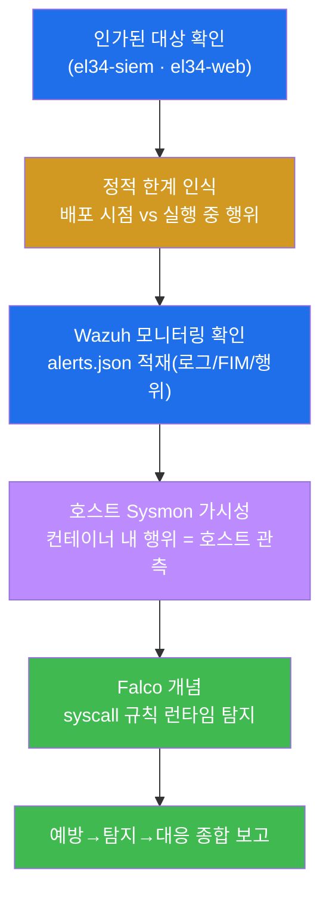

---

## 10. 핵심 정리 (1줄씩)

1. **정적 점검 ≠ 런타임 탐지** — 정적(W03~09)은 "배포 시점의 설정·상태", 런타임(W10)은 "실행 중의
   비정상 행위". 정적으로 깨끗해도 실행 중 침해될 수 있어 둘은 보완이다.
2. **런타임 탐지의 세 신호** — 예상 밖 프로세스(셸) · 파일 변경(FIM) · 비정상 아웃바운드(C2). 침해는
   거의 항상 이 셋으로 나타난다.
3. **Wazuh = 런타임 탐지의 중심(SIEM)** — el34-siem 이 컨테이너 호스트의 로그·FIM·행위를 수집해
   `/var/ossec/logs/alerts/alerts.json` 에 alert 로 남긴다(secuops/soc 와 동일 엔진).
4. **호스트 Sysmon = 컨테이너 가시성** — 컨테이너 프로세스는 곧 호스트 커널 프로세스라, 호스트의
   Sysmon(eBPF)이 비특권 컨테이너 안 행위까지 포착한다.
5. **Falco = 컨테이너 런타임 탐지 CNCF 표준** — 커널 syscall 을 규칙으로 보고 '컨테이너 내 셸'·'민감
   파일'·'아웃바운드'를 실시간 탐지. Wazuh(로그/FIM)와 보완.
6. **예방 + 탐지 + 대응의 삼중 체계** — 정적 강화로 막고(예방), 런타임 행위로 잡고(탐지), 격리·재배포로
   복구(대응). 컨테이너는 불변·재배포 용이라 대응이 빠르다(단, 원인은 예방으로 되먹임).

---

## 11. 다음 주차 (W11) 예고 — 레지스트리·이미지 신뢰 (다이제스트·서명·출처)

본 주차(W10)로 학생은 컨테이너의 **실행 중 행위**를 감시하는 런타임 탐지까지 한 바퀴 돌았다 — 정적
강화(W02~W09)로 막고, 런타임 행위(Wazuh·Falco·Sysmon)로 잡고, 재배포로 복구하는 그림이다. 그런데 한
가지 더 근본적인 질문이 남는다 — **"우리가 배포하고 탐지하는 그 이미지 자체는 진짜 신뢰할 수 있는
것인가?"** 침해는 실행 중에만 들어오는 게 아니라, **이미지를 가져오는 단계(공급망)** 에서 위조·변조된
이미지로도 들어온다.

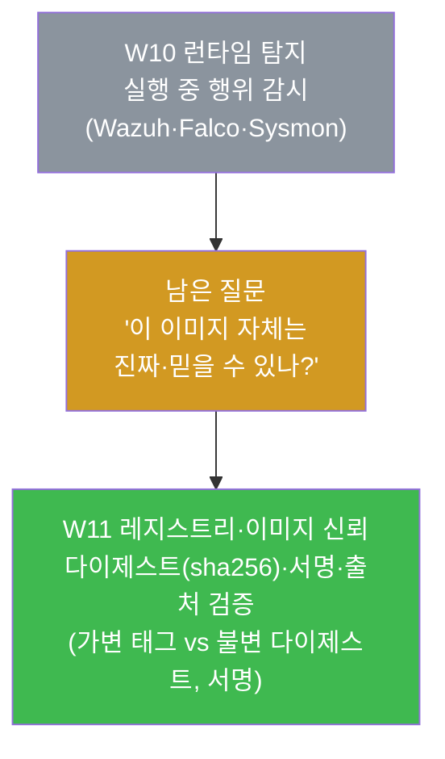

W11 에서는 이미지를 **어디서 가져오고(레지스트리) 진짜인지(서명·다이제스트) 어떻게 보증하나**를 다룬다 —
`docker inspect` 로 이미지 다이제스트(sha256)를 확인하고, **가변 태그(예: `:latest`) vs 불변
다이제스트**의 차이, **Docker Content Trust / cosign 서명**으로 이미지의 출처와 무결성을 검증하는 법을
배운다. 런타임에서 "무엇을 하고 있나"를 본 데서 한 걸음 더 나아가, "이 이미지가 애초에 믿을 수 있는
것인가"라는 **공급망 신뢰**의 단계로 들어간다.
