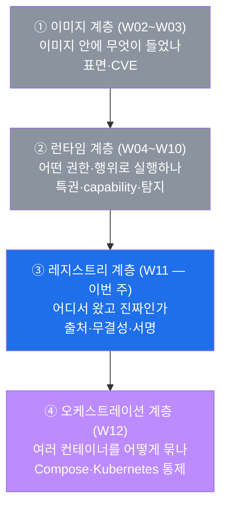
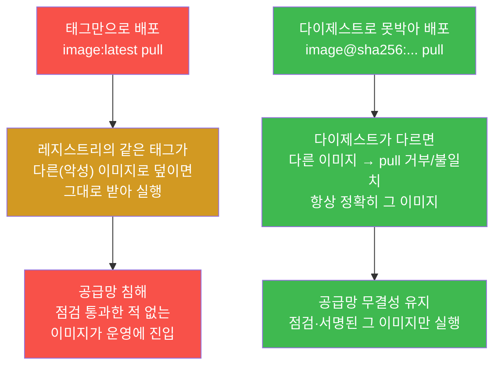
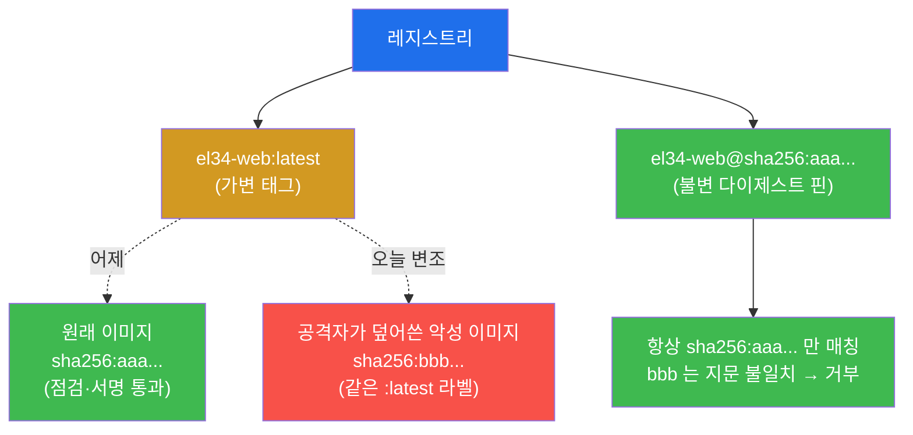
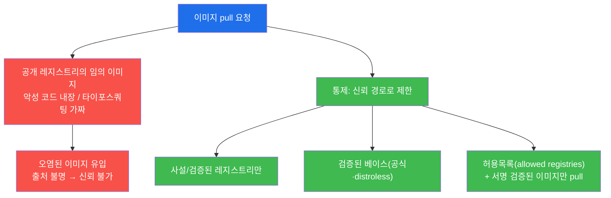
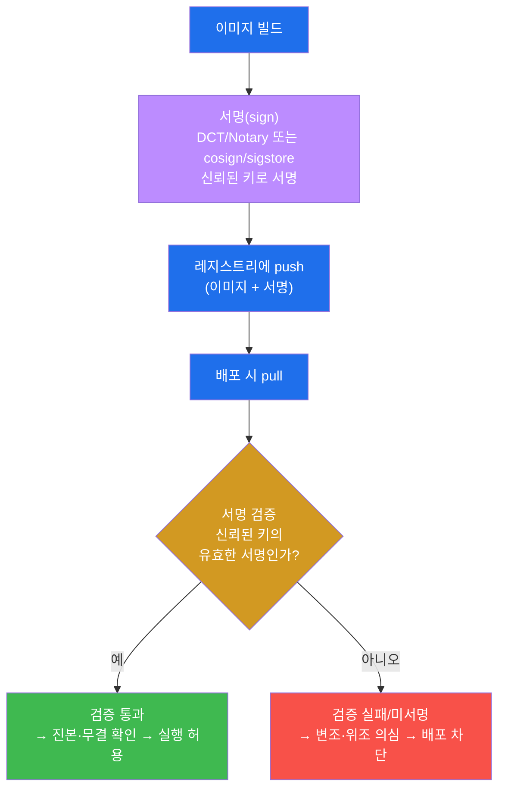
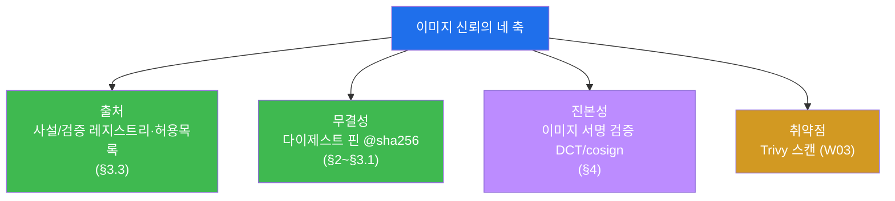
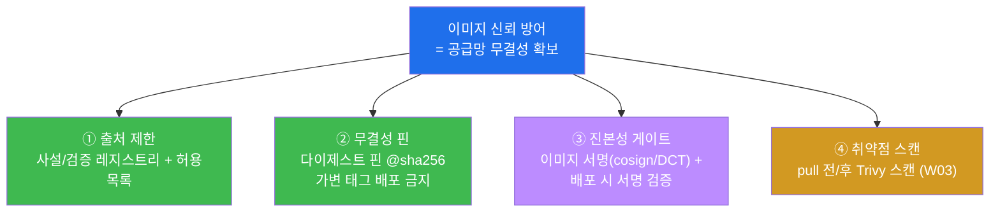
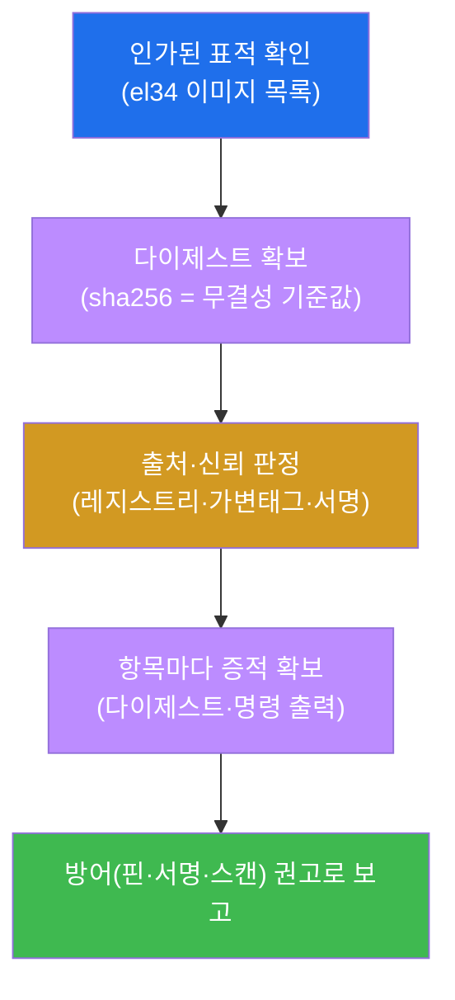
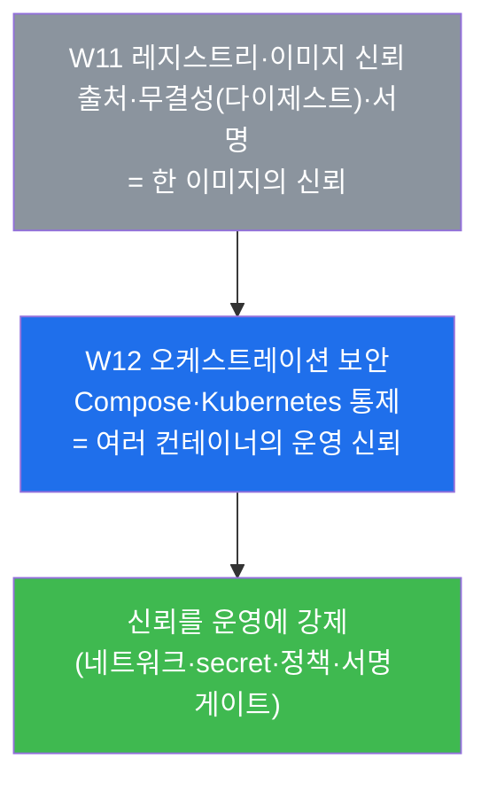

# 클라우드·컨테이너 W11 — 레지스트리·이미지 신뢰 (다이제스트·서명·출처 검증)

> **본 주차의 한 줄 요약**
>
> 컨테이너 보안 4계층(**이미지 → 런타임 → 레지스트리 → 오케스트레이션**) 중 W02~W03 은 첫 계층(이미지)을,
> W04~W10 은 둘째 계층(런타임)을 다뤘다. 본 주차는 **세 번째 계층, 레지스트리(registry)** 로 올라간다.
> 지금까지는 "이 이미지 안에 무엇이 들었나(W02 표면·W03 CVE)", "그 이미지를 어떤 권한으로 돌리나(W04~
> 런타임)"를 봤다면, 본 주차의 질문은 한 단계 앞 — **"애초에 이 이미지를 *어디서 가져왔고*, 그것이 정말
> *내가 받으려던 그 이미지가 맞는가*"** 이다. 학생은 el34 호스트의 docker CLI 로 실제 이미지(`el34-web`
> 등)의 **이미지 다이제스트(sha256)** 를 직접 읽어 무결성을 확인하고, **가변 태그(`:latest`) 대 불변
> 다이제스트 핀** 의 차이와 위험을 가른 뒤, **레지스트리 신뢰(타이포스쿼팅 방어)** 와 **이미지 서명
> (Docker Content Trust/Notary, cosign/sigstore)** 으로 출처를 보증하는 법을 정리한다. 신규 도구 설치는
> 없다.
>
> **점검자 한 줄 결론**: 이미지 신뢰는 "이 이미지가 돌아가는가"가 아니라 **"이 이미지가 신뢰된 출처에서
> 왔고(레지스트리), 비트 하나 변조되지 않았으며(다이제스트), 신뢰된 주체가 만들었음을 증명할 수 있는가
> (서명)"** 를 보증하는 일이다. 출처·무결성·서명, 이 셋이 무너지면 W02~W10 에서 아무리 이미지를 깨끗이
> 점검해도 *깨끗한 줄 알았던 다른 이미지를 받는* 공급망 공격(supply-chain attack)에 그대로 노출된다.

---

## 학습 목표

본 주차 종료 시 학생은 다음 6가지를 **본인 손으로** 할 수 있어야 한다.

1. **레지스트리(registry)** 가 이미지를 보관·배포하는 저장소임을 설명하고, `docker images` 로 el34
   호스트가 보유한 이미지 목록을 점검해 "신뢰 점검의 대상이 어떤 이미지들인가"를 식별한다.
2. **이미지 다이제스트(image digest, `sha256:...`)** 가 이미지 내용의 해시(불변 식별자)임을 설명하고,
   `docker image inspect el34-web:latest --format '{{.Id}}'` 로 el34-web 의 다이제스트를 직접 읽어
   무결성의 기준값을 확보한다.
3. **가변 태그(mutable tag, `:latest`) 대 불변 다이제스트 핀(immutable digest pin, `@sha256:...`)** 의
   차이를 설명하고, 같은 태그가 언제든 다른 이미지로 덮일 수 있는 공급망 변조 위험과 다이제스트 핀이
   그것을 막는 원리를 본인 말로 설명한다.
4. **레지스트리 신뢰**의 위협(공개 레지스트리의 악성 이미지·**타이포스쿼팅(typosquatting)**)을 식별하고,
   사설/검증 레지스트리 · 검증된 베이스 · **허용목록(allowed registries)** 으로 출처를 신뢰 경로에
   가두는 통제를 설명한다.
5. **이미지 서명(image signing)** — **Docker Content Trust(DCT)/Notary** 와 **cosign/sigstore** — 이
   "신뢰된 주체가 만들었고 변조되지 않았다"를 암호학적으로 보증하는 원리를 설명하고, 다이제스트(무결성)와
   서명(출처 보증)이 이미지 신뢰의 **두 축**임을 구분한다.
6. 본 주차의 점검·개념(다이제스트·가변 태그 위험·레지스트리 신뢰·서명)과 방어(사설 레지스트리+다이제스트
   핀+서명 검증 게이트+스캔)를 **레지스트리·이미지 신뢰 보고서** 한 장으로 종합하고, "이미지 신뢰 =
   출처 + 무결성 + 출처 보증 + 취약점"이라는 **공급망 무결성(supply-chain integrity)** 의 결론을 제시한다.

---

## 0. 용어 해설 (레지스트리·이미지 신뢰 입문)

본 주차에 처음 등장하거나 특히 중요한 용어를 먼저 정리한다. 본문에서 다시 나올 때 막히면 이 표로
돌아오면 흐름이 끊기지 않는다.

| 용어 | 영문 | 뜻 | 비유 |
|------|------|----|------|
| **레지스트리** | Registry | 컨테이너 이미지를 보관·배포하는 저장소(서버) — 여기서 `pull`/`push` 한다 | 이미지의 창고·물류센터 |
| **태그** | Tag | 이미지에 붙이는 사람이 읽는 이름표(`:latest`, `:1.0`) — 가리키는 대상이 바뀔 수 있다 | 택배 상자에 붙인 종이 라벨 |
| **이미지 다이제스트** | Image digest | 이미지 내용 전체의 sha256 해시(`sha256:...`) — 내용이 1비트만 달라도 값이 바뀐다 | 내용물의 위변조 방지 봉인번호 |
| **sha256** | SHA-256 | 임의 데이터를 256비트(64자리 16진수) 고정 지문으로 바꾸는 표준 해시 함수 | 지문 채취기 |
| **불변** | Immutable | 한번 정해지면 바뀌지 않는 성질(다이제스트는 불변, 태그는 가변) | 새겨 넣은 각인 |
| **다이제스트 핀** | Digest pin | 태그 대신 다이제스트(`image@sha256:...`)로 이미지를 못박아 지정하는 것 | 일련번호로 정확히 그 부품만 주문 |
| **타이포스쿼팅** | Typosquatting | 유명 이미지명과 한두 글자만 다른 가짜 이미지를 올려 오타·실수를 노리는 공격 | 유명 상표를 살짝 베낀 짝퉁 간판 |
| **공급망 공격** | Supply-chain attack | 내가 *받아 쓰는* 부품(이미지·라이브러리) 자체를 오염시켜 침투하는 공격 | 식자재 유통 단계에서의 독극물 혼입 |
| **이미지 서명** | Image signing | 이미지에 "신뢰된 주체가 만들었고 변조 없음"을 암호학적으로 증명하는 서명을 붙이는 것 | 공문서의 관인·인감 |
| **Docker Content Trust** | DCT / Notary | 도커 기본 서명 체계 — 태그에 서명하고 pull 시 서명을 검증한다(`DOCKER_CONTENT_TRUST=1`) | 등기우편의 본인 확인 |
| **cosign / sigstore** | — | 컨테이너 이미지 서명의 현대 표준 — 키리스 서명 + 공개 투명성 로그 | 공증사무소 + 공개 등기부 |
| **공급망 무결성** | Supply-chain integrity | 받아 쓰는 모든 구성요소의 출처·무결성을 끝까지 보증하는 상태 | 농장→식탁 전 과정 추적·봉인 |

> **헷갈리기 쉬운 한 쌍 — 태그 vs 다이제스트.** 둘 다 이미지를 "가리키는" 이름이지만 성질이 정반대다.
> **태그**(`el34-web:latest`)는 **사람이 읽기 좋은 라벨**이고, **가변(mutable)** 이다 — 택배 상자에 붙인
> 종이 라벨처럼, 같은 라벨을 떼서 *다른 상자*에 붙일 수 있다. 즉 `:latest` 라는 같은 이름이 오늘과 내일
> 서로 다른 이미지를 가리킬 수 있다. **다이제스트**(`sha256:abc...`)는 **이미지 내용 그 자체의 지문**이고,
> **불변(immutable)** 이다 — 내용이 바뀌면 지문도 반드시 바뀌므로, 같은 다이제스트는 *비트 단위로 똑같은
> 이미지*임을 보증한다. 본 주차의 핵심 통찰이 여기서 나온다: **신뢰하려면 가변 라벨이 아니라 불변 지문을
> 봐야 한다.**
>
> **헷갈리기 쉬운 또 한 쌍 — 무결성 vs 출처(진본성).** 이미지 신뢰는 두 개의 다른 질문으로 갈린다.
> **무결성(integrity)** 은 "내용이 *변조되지 않았는가*"이고, 이것은 **다이제스트(sha256)** 가 답한다 —
> 받은 이미지의 해시가 기대값과 같으면 도중에 바뀌지 않은 것이다. **출처/진본성(authenticity)** 은 "이걸
> *누가 만들었는가, 신뢰된 주체가 맞는가*"이고, 이것은 **서명(DCT/cosign)** 이 답한다 — 다이제스트만으로는
> "안 바뀌었다"는 알아도 "*공격자가 처음부터* 만들어 올린 깨끗한(그러나 악의적인) 이미지"는 거를 수 없다.
> 그래서 **다이제스트(무결성) + 서명(출처)** 이 둘 다 있어야 이미지 신뢰가 완성된다(§4.4).

---

## 1. 이번 주의 통찰 — 점검한 이미지가 "그 이미지"가 맞는가

### 1.1 한 줄 답: 출처와 무결성이 무너지면 앞선 모든 점검이 무의미해진다

W02~W03 에서 학생은 이미지의 **표면(레이어·베이스·크기·포트)** 과 **취약점(CVE)** 을 점검했고, W04~W10
에서는 그 이미지를 **어떤 권한·행위로 실행하는가**를 단속했다. 그런데 이 모든 점검에는 조용한 전제가
하나 깔려 있다 — **"내가 점검하고 실행하는 이미지가, 내가 받으려던 바로 그 이미지다"** 라는 전제다.

이 전제가 깨지면 어떻게 될까. 가령 운영 배포 설정이 `el34-web:latest` 처럼 **태그**로만 이미지를
가리킨다고 하자. 공격자가 레지스트리에 침투해 같은 `:latest` 태그에 악성 이미지를 덮어 올리면, 다음
배포는 *겉보기 이름은 똑같지만 내용은 다른* 이미지를 받아 실행한다. W03 에서 통과한 깨끗한 스캔 결과도,
W04 에서 확인한 안전한 실행 권한도, 모두 **이전 이미지에 대한 것**이라 새로 들어온 악성 이미지에는
적용되지 않는다. 즉 **출처(어디서)와 무결성(진짜인가)이 무너지면, 앞에서 한 모든 점검이 헛것이 된다.**

이것이 본 주차가 다루는 **공급망 공격(supply-chain attack)** 의 핵심이다 — 공격자가 내 시스템을 직접
뚫는 대신, 내가 *받아서 신뢰하고 실행하는* 이미지 자체를 오염시킨다. 그래서 레지스트리 계층의 보안은
"이미지를 어디서 가져오고(출처), 그것이 변조되지 않았으며(무결성), 신뢰된 주체가 만들었음을 증명할 수
있는가(서명)"를 보증하는 일이다.

### 1.2 4계층에서 레지스트리의 자리 — 출처를 책임지는 계층



레지스트리 계층이 이미지·런타임 계층보다 **한 단계 앞**에 있다는 점이 중요하다. 이미지가 컨테이너로
실행되기 *전에*, 이미지는 먼저 레지스트리에서 **pull(내려받기)** 되어 온다. 출처와 무결성은 바로 이
"받아오는 순간"의 신뢰 문제다 — 잘못된 이미지를 받아오면 그 뒤의 점검·실행이 아무리 엄격해도 이미
오염된 것을 다루는 셈이다.

### 1.3 왜 중요한가 — 태그만 믿는 배포 vs 다이제스트로 못박은 배포



왼쪽(태그만 믿는 배포)이 위험한 이유는, 신뢰의 기준이 **언제든 바뀔 수 있는 라벨**이기 때문이다. 같은
`:latest` 가 어제는 깨끗한 이미지, 오늘은 악성 이미지를 가리켜도 배포 설정은 그 차이를 알지 못한다.
오른쪽(다이제스트로 못박은 배포)은 신뢰의 기준이 **내용 그 자체의 지문(sha256)** 이라, 내용이 바뀌면
지문이 어긋나 곧바로 드러난다 — 공격자가 같은 태그에 다른 이미지를 올려도, 다이제스트가 다르므로 "내가
지정한 그 이미지"가 아님이 즉시 판명된다. **무엇을 신뢰의 기준으로 삼는가(가변 라벨 vs 불변 지문)** 가
공급망 침해의 갈림길이다.

### 1.4 한계 — 다이제스트·서명도 운영에 박혀야 효과가 난다

미리 못박아 둘 것이 있다. 다이제스트와 서명은 **그 자체로 자동 방어가 아니다.** 다이제스트는 *배포
설정이 태그가 아닌 다이제스트로 이미지를 지정*하고, 받은 이미지의 해시를 *실제로 대조*할 때 비로소
효과가 난다. 서명도 *배포 파이프라인에 서명 검증 게이트를 박아*, 서명 없는/검증 실패 이미지의 배포를
*실제로 막을* 때 의미가 있다. 단지 이미지에 서명만 붙여 두고 아무도 검증하지 않으면 관인 없는 공문과
다를 바 없다. 그래서 본 주차는 다이제스트·서명의 *원리*를 확실히 이해한 뒤(§2~§4), 그것을 운영에
*박는* 방어(§5~§6)까지를 한 묶음으로 다룬다. 또한 다이제스트·서명은 **출처·무결성**을 보증할 뿐,
*서명된 이미지 안에 CVE 가 없다*는 보증은 아니다 — 그건 W03 의 스캔이 따로 책임진다(§4.4).

---

## 2. 레지스트리와 이미지 다이제스트 — 출처와 불변 식별

### 2.1 레지스트리란 무엇인가 — 이미지의 창고

**한 줄 정의.** 레지스트리(registry)는 **컨테이너 이미지를 보관·배포하는 저장소(서버)** 다 — 여기에
이미지를 올리고(`docker push`) 내려받는다(`docker pull`). 이미지의 창고이자 물류센터에 해당한다.

레지스트리는 크게 두 갈래다. **공개 레지스트리(public registry)** 는 Docker Hub 처럼 누구나 이미지를
올리고 받을 수 있는 공용 저장소이고, **사설 레지스트리(private registry)** 는 조직이 자체 운영하며
인증된 사용자만 접근하는 저장소다. 이미지의 전체 이름은 보통 `레지스트리/저장소:태그`(예:
`registry.example.com/web/el34-web:latest`) 형태이며, 레지스트리 주소를 생략하면 도커는 기본 레지스트리
(Docker Hub)에서 찾는다. **이미지를 어느 레지스트리에서 받는가가 곧 그 이미지의 "출처"** 이고, 이것이
§3 의 레지스트리 신뢰 문제로 직결된다.

> **el34 에서의 레지스트리 관점.** el34 의 모든 이미지·컨테이너는 타깃 VM(192.168.0.151) 한 대 위에
> 이미 빌드·보관되어 있다. 본 주차의 점검은 외부 레지스트리에서 새로 pull 하는 것이 아니라, **호스트가
> 이미 보유한 이미지 목록을 `docker images` 로 확인**하는 것에서 출발한다 — 즉 "신뢰 점검의 대상이
> 어떤 이미지들인가"를 먼저 식별한다. 신규 도구 설치나 외부 레지스트리 접근은 없다.

el34 호스트(`ssh ccc@192.168.0.151`, 비밀번호 1)에서 이미지 목록은 다음과 같이 본다.

```bash
docker images --format '{{.Repository}}:{{.Tag}}' | head -5
```

- `{{.Repository}}` — 이미지의 저장소 이름(예: `el34-web`).
- `{{.Tag}}` — 그 이미지에 붙은 태그(예: `latest`).

출력에 `el34-web:latest` 같은 줄들이 보이면, 그것이 본 주차의 이미지 신뢰 점검 대상이다.

### 2.2 이미지 다이제스트 — 내용의 sha256 지문

**한 줄 정의.** 이미지 다이제스트(image digest)는 **이미지 내용 전체를 sha256 해시 함수로 압축한
고정 길이 지문**(`sha256:` 다음에 64자리 16진수)으로, **내용이 단 1비트만 달라도 값이 완전히 바뀐다.**
그래서 같은 다이제스트는 "비트 단위로 정확히 같은 이미지"임을 보증한다.

> **용어 — sha256(SHA-256) 해시.** 해시 함수는 *임의 크기의 데이터*를 *고정 크기의 지문*으로 바꾸는
> 수학 함수다. sha256 은 그 결과가 256비트(64자리 16진수)인 표준 해시다. 두 가지 성질이 핵심이다.
> 첫째, **결정적(deterministic)** — 같은 입력은 항상 같은 지문을 낸다. 둘째, **민감(avalanche)** —
> 입력이 아주 조금만 달라져도 지문이 완전히 달라진다. 이 두 성질 덕분에 sha256 지문은 "이 데이터가
> 그 데이터가 맞는지"를 확인하는 봉인번호로 쓸 수 있다 — 봉인번호가 같으면 내용이 같고, 다르면 어딘가
> 바뀐 것이다. 이미지 다이제스트는 이 sha256 을 이미지(레이어 구성 + 메타데이터)에 적용한 것이다.

### 2.3 왜 중요한가 — 무결성의 객관적 기준값

다이제스트가 중요한 이유는, 이미지의 무결성을 **사람의 판단이 아니라 수학으로** 확인해 주기 때문이다.
"이 이미지가 변조되지 않았다"를 눈으로 확인할 방법은 없다 — 악성 코드 한 줄이 끼어든 이미지도 겉보기는
똑같다. 그러나 다이제스트는 다르다. 받은 이미지의 sha256 을 기대했던 다이제스트와 대조하기만 하면,
같으면 무결, 다르면 변조로 **기계적으로 판정**된다. 그래서 다이제스트는 **무결성 검증의 객관적
기준값(reference value)** 이며, 다음 절의 "다이제스트 핀"과 §4 의 서명이 모두 이 기준값 위에 쌓인다.

### 2.4 el34 에서 어떻게 보나 — el34-web 의 다이제스트

el34 의 `el34-web` 이미지(W01 에서 본 dmz 의 웹/WAF 컨테이너)도 고유한 sha256 다이제스트를 가지며,
호스트에서 직접 읽어 확인할 수 있다.

```bash
docker image inspect el34-web:latest --format 'digest={{.Id}}' | head -c 50; echo
```

- `docker image inspect` — 이미지의 상세 메타데이터를 출력하는 읽기 전용 명령.
- `{{.Id}}` — 이미지의 sha256 다이제스트(이미지 콘텐츠의 식별자). 무결성·출처 검증의 기준값이다.

출력은 `digest=sha256:` 다음에 긴 16진수가 이어지는 형태다(예: `digest=sha256:a1b2c3...`). 이 값이
**el34-web 이미지의 불변 지문**이며, 같은 다이제스트를 가진 이미지는 어디서 받든 비트 단위로 동일한
el34-web 임을 보증한다. 여기서 학생이 잡아야 할 것은 *특정 16진수 값을 외우는 것*이 아니라, **"이미지마다
이런 sha256 지문이 존재하고, 그것으로 무결성을 못박을 수 있다"는 사실**이다.

> **용어 보강 — `.Id` 와 RepoDigests 의 차이.** `docker image inspect` 의 `{{.Id}}` 는 이미지의
> *로컬 콘텐츠 다이제스트*(이미지 설정 + 레이어 구성의 sha256)다. 한편 `RepoDigests` 는 그 이미지가
> *레지스트리에서 가지는* 다이제스트(매니페스트 다이제스트)로, `image@sha256:...` 핀에 쓰이는 값이다.
> 둘 다 sha256 기반의 불변 식별자라는 본질은 같다 — 본 주차는 `{{.Id}}` 로 "이미지에 sha256 지문이
> 있다"는 것을 확인하는 데 초점을 둔다. 운영에서 다이제스트 핀(§3)에 쓰는 것은 보통 RepoDigests 쪽이다.

---

## 3. 가변 태그 vs 불변 다이제스트, 그리고 레지스트리 신뢰

### 3.1 가변 태그 vs 불변 다이제스트 핀

**한 줄 정의.** 태그(`:latest`, `:1.0`)는 **가변(mutable)** — 레지스트리에서 같은 태그가 언제든 다른
이미지를 가리키도록 덮일 수 있다. 다이제스트 핀(`image@sha256:...`)은 **불변(immutable)** — 항상
정확히 그 내용의 이미지만 가리킨다.

이 차이가 보안적으로 결정적이다. `el34-web:latest` 로 이미지를 받는다는 것은 "현재 `:latest` 라는
*라벨이 붙어 있는* 이미지를 달라"는 뜻이다. 그런데 라벨은 떼었다 붙일 수 있으므로, **누군가 레지스트리에
같은 `:latest` 라벨을 다른 이미지에 붙이면, 같은 명령이 다른 이미지를 받아 온다.** 반면
`el34-web@sha256:a1b2...` 로 받는다는 것은 "이 *내용(지문)* 을 가진 바로 그 이미지를 달라"는 뜻이라,
내용이 다르면 지문이 어긋나 애초에 그 이미지가 아니다.



**왜 중요한가.** 운영 배포가 태그로만 이미지를 지정하면, 레지스트리 변조 한 번에 *점검한 적 없는*
이미지가 통째로 운영에 들어올 수 있다. 그래서 보안 권고는 **운영 배포에서 이미지를 다이제스트로
핀(`image@sha256:...`)** 하라는 것이다 — 사람이 읽기 좋은 태그는 개발·참조용으로 쓰되, *실제로 실행할
이미지는 불변 지문으로 못박는다.* 이렇게 하면 공격자가 같은 태그에 악성 이미지를 올려도, 다이제스트가
어긋나 그대로 받지 않는다.

> **el34 점검 관점.** el34 의 이미지는 학습 편의상 `:latest` 태그로 참조하지만(미션 1~2), 본 주차의
> 학습 목표는 그 `:latest` 가 **가변**임을 이해하고, §2 에서 읽은 다이제스트로 **핀**하는 것이 왜 안전한지를
> 설명할 수 있게 되는 것이다. 다이제스트는 §2.4 의 `docker image inspect ... {{.Id}}` 로 이미 확인했다.

### 3.2 한계 — 다이제스트 핀의 운영 비용

다이제스트 핀이 만능은 아니다. 다이제스트는 사람이 읽거나 기억하기 어렵고(64자리 16진수), 이미지를
패치해 새로 빌드하면 다이제스트가 바뀌므로 **배포 설정의 핀 값도 함께 갱신**해야 한다. 즉 핀은 "안전
대신 갱신 수고"라는 트레이드오프가 있다. 실무에서는 이 갱신을 자동화한다 — CI 파이프라인이 새 이미지를
빌드·스캔·서명한 뒤 *새 다이제스트로 배포 설정을 자동 갱신*하는 식이다. 핵심은 "사람이 외우는 태그"가
아니라 "도구가 관리하는 다이제스트"를 신뢰의 기준으로 삼는 것이다.

### 3.3 레지스트리 신뢰 — 출처를 신뢰 경로에 가둔다

**한 줄 정의.** 레지스트리 신뢰는 **이미지를 신뢰할 수 있는 출처(사설/검증된 레지스트리)에서만 받도록
제한**하는 것이다. 공개 레지스트리의 임의 이미지는 악성 코드가 내장돼 있거나 **타이포스쿼팅**일 수 있다.

> **용어 — 타이포스쿼팅(typosquatting).** 공격자가 유명한 이미지·패키지 이름과 **한두 글자만 다른**
> 가짜를 레지스트리에 올려, 사람이 오타를 내거나 무심코 받기를 노리는 공격이다(유명 상표를 살짝 베낀
> 짝퉁 간판). 예컨대 정품 `library/nginx` 대신 `libary/nginx`(오타) 같은 이름을 올려, 악성 이미지를
> 정품인 양 받게 만든다. 이미지 이름을 사람이 손으로 적는 한 이런 실수는 늘 가능하므로, **출처 자체를
> 허용목록으로 제한**하는 통제가 필요하다.



**왜 중요한가.** 이미지의 출처가 통제되지 않으면, 개발자가 편의로 받은 공개 이미지 하나가 조직 전체의
공급망 침투 경로가 된다. 그래서 레지스트리 신뢰의 통제는 세 겹이다. 첫째, **사설/검증된 레지스트리만
사용** — 출처를 신뢰하는 저장소로 좁힌다. 둘째, **검증된 베이스만 사용** — 공식 이미지나 distroless 처럼
출처가 분명한 베이스에서 출발한다(W02 의 베이스 선택과 직결). 셋째, **허용목록(allowed registries)** —
정책으로 허용된 레지스트리 외에서는 아예 pull 을 막고, 더 나아가 **서명이 검증된 이미지만** 받도록
한다(§4). 외부 의존이 꼭 필요하면 *내부 미러*로 한 번 받아 검증한 뒤 그 미러에서만 받게 해 외부 노출을
줄인다. 요컨대 **이미지의 "출처"를 신뢰 경로로 가두는 것**이 레지스트리 신뢰다.

### 3.4 한계 — 출처 통제만으로 진본성을 보장하진 못한다

레지스트리를 사설로 좁혀도 빈틈이 남는다. *사설 레지스트리 자체가 침해*되면 그 안의 이미지도 변조될 수
있고(§3.1 의 태그 덮어쓰기는 사설에서도 가능하다), 내부 미러로 받은 외부 이미지가 *받는 시점에 이미
오염*돼 있었을 수도 있다. 즉 출처를 좁히는 것은 *공격 표면을 줄일* 뿐, "이 이미지를 정말 신뢰된 주체가
만들었는가(진본성)"를 끝까지 보장하진 못한다. 그 마지막 보증을 하는 것이 다음 절의 **이미지 서명**이다 —
출처를 좁히고(레지스트리 신뢰) + 내용을 못박고(다이제스트) + 만든 주체를 증명한다(서명).

---

## 4. 이미지 서명 — 진본성의 암호학적 보증

### 4.1 이미지 서명이란 무엇인가

**한 줄 정의.** 이미지 서명(image signing)은 이미지에 **"이 이미지를 신뢰된 주체가 만들었고 변조되지
않았다"를 암호학적으로 증명하는 디지털 서명**을 붙이는 것이다(공문서의 관인·인감에 해당). 받는 쪽은 그
서명을 검증해, 신뢰된 키로 서명된 진본 이미지만 받아들인다.

서명이 다이제스트와 다른 점을 분명히 하자. **다이제스트는 "내용이 안 바뀌었다"(무결성)** 만 보증한다 —
그러나 *공격자가 처음부터 만들어 올린* 악성 이미지도 그 나름의 다이제스트가 있으니, 다이제스트만으로는
"누가 만들었는가"를 알 수 없다. **서명은 바로 그 "누가"를 보증한다** — 신뢰된 주체의 비밀키로 서명하고
공개키로 검증하므로, 그 키를 가진 정당한 주체가 만든 이미지만 검증을 통과한다. 그래서 §0 에서 말한
무결성(다이제스트)과 진본성(서명)이 서명 단계에서 합쳐진다.

### 4.2 두 가지 서명 체계 — DCT/Notary 와 cosign/sigstore

이미지 서명에는 대표적으로 두 갈래가 있다.

> **용어 — Docker Content Trust(DCT) / Notary.** **DCT** 는 도커에 내장된 서명·검증 체계로, 내부적으로
> **Notary** 라는 서명 서버를 쓴다. `DOCKER_CONTENT_TRUST=1` 환경 변수를 켜면, `docker push` 시 이미지
> 태그에 서명이 붙고 `docker pull` 시 서명이 검증된다 — 서명이 없거나 검증에 실패한 이미지는 받지
> 않는다(등기우편의 본인 확인에 해당). 도커 생태계에서 가장 오래된 표준 서명 방식이다.

> **용어 — cosign / sigstore.** **sigstore** 는 컨테이너 이미지 서명을 쉽고 투명하게 만든 현대 표준
> 프로젝트이고, **cosign** 은 그 핵심 CLI 도구다. 두 가지 특징이 있다. 첫째, **키리스(keyless) 서명** —
> 장기 보관해야 하는 개인키 없이, 단기 인증서로 서명할 수 있어 키 유출 위험을 줄인다. 둘째, **투명성
> 로그(transparency log)** — 누가 무엇에 언제 서명했는지를 *공개 등기부*(Rekor)에 기록해, 사후에 검증·감사할
> 수 있다(공증사무소 + 공개 등기부에 해당). 최근 컨테이너 공급망 보안의 사실상 표준으로 자리 잡았다.



흐름의 핵심은 **검증 단계**다. 서명은 "붙이는 것"보다 "검증하는 것"에서 효과가 난다 — 배포 시점에 서명을
검증해, **서명이 없거나 검증에 실패한 이미지의 배포를 막는** 게이트가 있어야 비로소 위조·변조 이미지가
걸러진다. 효과를 한 줄로 하면: **서명 검증 게이트가 미서명·변조 이미지의 배포를 차단해 공급망 무결성을
지킨다.**

### 4.3 el34 관점 — 서명은 운영 통제로 이해한다

el34 환경의 이미지들은 학습용으로 호스트에 직접 빌드·보관되어 있어, 외부 서명 인프라(Notary 서버·sigstore
Rekor)를 갖추고 있지는 않다. 따라서 본 주차에서 서명은 **명령으로 직접 검증하는 실습이 아니라, 운영에서
"왜·어떻게 서명을 검증하는가"를 설명·정리하는 통제 개념**으로 다룬다. 학생은 §2 에서 다이제스트(무결성)를
손으로 확인했고, 서명(진본성)은 그 위에 얹히는 출처 보증 계층임을 개념으로 잡는다 — 운영에서는
`DOCKER_CONTENT_TRUST=1`(DCT) 또는 `cosign verify`(sigstore)로 pull/배포 시 서명을 검증하는 게이트를
둔다.

### 4.4 한계 — 서명도 "키 신뢰"와 "스캔"이 받쳐줘야

서명에도 전제와 한계가 있다. 첫째, 서명의 신뢰는 **키의 신뢰**에 달려 있다 — 서명 키가 유출되면 공격자가
정당한 서명을 위조할 수 있으므로, 키 관리(보관·회전·키리스 전환)가 핵심이다. 둘째, 서명은 **진본성·무결성**만
보증할 뿐, *서명된 이미지 안에 취약점(CVE)이 없다*는 보증은 **아니다** — 정당한 주체가 서명한 이미지에도
HIGH CVE 가 들어 있을 수 있다(그건 W03 의 스캔이 따로 잡는다). 그래서 이미지 신뢰는 네 가지가 함께 가야
한다 — **출처(레지스트리 신뢰) + 무결성(다이제스트) + 진본성(서명) + 취약점(스캔)**. 이 넷의 결합이
다음 절의 종합 방어다.



---

## 5. 방어 종합 — 공급망 신뢰를 운영에 박는다

이미지 신뢰의 방어는 한 문장으로 "**믿는 곳에서 받고(출처), 정확히 그것을 받고(무결성), 만든 이를 확인하고
(진본성), 안에 구멍이 없는지 본다(취약점)**"로 요약된다. §2~§4 의 개념을 운영 통제로 묶으면 다음과 같다.



### 5.1 출처 제한 — 받는 곳을 신뢰 경로로 좁힌다

§3.3 의 통제를 운영 표준으로 강제한다. 정책으로 **허용된 레지스트리(사설/검증된 곳) 외에서는 pull 을
막고**, 외부 의존이 필요하면 내부 미러로 한 번 받아 검증한 뒤 그 미러에서만 받게 한다. 베이스 이미지도
공식·distroless 처럼 출처가 분명한 것으로 제한한다(W02). 이로써 타이포스쿼팅·악성 공개 이미지의 유입
경로 자체를 닫는다.

### 5.2 무결성 핀 — 실행할 이미지를 지문으로 못박는다

§3.1 의 다이제스트 핀을 배포에 박는다. **운영 배포는 가변 태그(`:latest`)가 아니라 불변 다이제스트
(`image@sha256:...`)로 이미지를 지정**한다. 이로써 레지스트리에서 같은 태그가 다른 이미지로 덮여도, 핀한
지문과 어긋나는 이미지는 받지 않는다 — 점검·서명된 그 이미지만 실행된다.

### 5.3 진본성 게이트 — 서명을 검증해야만 배포한다

§4 의 서명을 게이트로 만든다. 배포 파이프라인에 **서명 검증 단계**(DCT `DOCKER_CONTENT_TRUST=1` 또는
`cosign verify`)를 박아, **서명이 없거나 검증에 실패한 이미지의 배포를 자동으로 차단**한다. 서명은 붙이는
것보다 *검증하는 게이트*가 핵심이라는 §4.2 의 원칙을 운영으로 구현한 것이다.

### 5.4 취약점 스캔 — 받기 전·후로 구멍을 본다

서명·핀이 "출처·무결성·진본성"을 보증해도 *이미지 안의 CVE* 는 별개다(§4.4). 그래서 W03 의 Trivy 스캔을
공급망에 함께 건다 — pull 전(또는 직후) 이미지를 스캔해 HIGH/CRITICAL 이 있으면 배포를 막는다. 이로써
"믿는 곳에서 받은, 변조 없는, 진본 이미지"가 *동시에 취약점도 통과한* 것임을 보증한다.

### 5.5 한계 — 방어는 도구가 아니라 운영의 일관성이다

네 통제를 안다고 공급망이 저절로 안전해지는 것은 아니다. 허용목록·핀 갱신·서명 검증·정기 스캔이 **모든
배포 경로에서 빠짐없이** 작동해야 효과가 난다 — 한 곳이라도 게이트를 끄거나 우회하면 그 틈으로 오염된
이미지가 들어온다. 또 핀·서명 키·허용목록은 누군가 *관리*해야 한다(핀 갱신 자동화, 키 회전, 목록 검토).
즉 이미지 신뢰 방어는 도구 설치가 아니라 **빌드→서명→핀→배포 게이트로 이어지는 파이프라인의 일관성과
운영 책임**의 문제다. 본 주차는 그 네 축의 "무엇을·왜"를 정리하고, 파이프라인 전체의 통제는 W12
(오케스트레이션)·CI/CD 운영으로 이어진다.

---

## 6. 점검 명령 빠른 복습 — "무엇을 어디서 보나"

본 주차의 점검은 모두 el34 호스트(`ssh ccc@192.168.0.151`, 비밀번호 1)에서 `docker` CLI 로 수행하며,
신규 도구 설치는 없다. 다이제스트는 호스트에서 직접 읽고, 가변 태그·레지스트리 신뢰·서명은 개념·운영
원칙으로 정리한다.

> **점검 경로.** el34 의 모든 이미지는 타깃 VM(192.168.0.151, target_vm: web) 한 대 위에 보관돼 있다.
> 점검자는 호스트에 SSH 로 들어간 뒤, 이미지 목록과 다이제스트는 `docker images`·`docker image inspect`
> 로 호스트에서 직접 읽는다. 외부 레지스트리 접근이나 실제 서명 인프라 구축은 없다.

### 6.1 이미지 목록 — 레지스트리 점검 대상 (§2.1)

```bash
docker images --format '{{.Repository}}:{{.Tag}}' | head -5
```

무엇을 보나 — 호스트가 보유한 이미지 목록(저장소:태그). 신뢰 점검의 대상이 어떤 el34 이미지들인지 식별한다.

### 6.2 이미지 다이제스트 — 무결성 기준값 (§2.4)

```bash
docker image inspect el34-web:latest --format 'digest={{.Id}}' | head -c 50; echo
```

무엇을 보나 — el34-web 의 sha256 다이제스트(`digest=sha256:...`). 내용 해시 = 무결성·출처 검증의 기준값.
같은 다이제스트 = 비트 단위 동일 이미지 보증.

### 6.3 가변 태그 vs 불변 다이제스트 (§3.1)

이것은 명령 점검이 아니라 **개념 판정**이다. `:latest`(가변, 같은 라벨이 다른 이미지로 덮일 수 있음) 대
`@sha256:...`(불변, 항상 그 이미지)의 차이를 정리하고, **운영 배포는 다이제스트 핀을 권고**한다는 결론을
보고서에 적는다.

### 6.4 레지스트리 신뢰 (§3.3)

마찬가지로 **개념·운영 원칙**이다. 공개 임의 이미지의 위험(악성·타이포스쿼팅)과, 사설/검증 레지스트리 +
검증 베이스 + 허용목록(서명 검증된 이미지만 pull)으로 **출처를 신뢰 경로에 가두는** 통제를 정리한다.

### 6.5 이미지 서명 (§4)

이것도 **개념·운영 원칙**이다. DCT/Notary(`DOCKER_CONTENT_TRUST=1`)와 cosign/sigstore(키리스 서명·투명성
로그)로 **배포 시 서명을 검증**해 미서명·변조 이미지를 차단함을, 그리고 다이제스트(무결성)+서명(진본성)이
신뢰의 두 축임을 정리한다.

---

## 7. 실습 안내 — lab 7 미션 (4 축 설명)

본 주차 실습은 7 미션으로 구성된다. 각 미션을 **4 축**으로 설명한다 — 왜 하는가 / 무엇을 알 수 있는가 /
결과 해석(정상 vs 비정상) / 실전 활용. 미션은 이미지 목록(레지스트리) → 다이제스트(무결성) → 가변 태그 vs
다이제스트 → 레지스트리 신뢰 → 이미지 서명 → 방어 종합 → 종합 보고 순서로 흐르며, lab 의 `order` 와
1:1 로 대응한다.

> **실습 진행 원칙.** 모든 명령은 el34 호스트(`ssh ccc@192.168.0.151`, 비밀번호 1)에서 `docker` CLI 로
> 수행한다(target_vm: web). 신규 도구 설치나 외부 레지스트리 접근은 없으며, 각 미션은 **인가된 표적(el34
> 이미지)** 만 점검한다. 합격 임계값은 0.7 이다.

### 미션 1 — 이미지 목록: 레지스트리 점검 대상 (10점)

> **왜 하는가?** 모든 신뢰 점검의 전제는 "대상이 무엇인가"를 아는 것이다(§2.1). 점검자는 본격 분석 전
> 호스트가 보유한 이미지 목록부터 확인해 신뢰 점검의 범위를 잡는다.
>
> **무엇을 알 수 있는가?** `docker images` 로 el34 이미지 목록(저장소:태그). 레지스트리 = 이미지를
> 보관·배포하는 저장소이며, 이 이미지들이 본 주차 신뢰 점검의 대상임을 식별한다.
>
> **결과 해석.** 정상: 이미지 목록과 `images_listed` 마커가 출력됨(대상 식별 성공). 비정상: 출력이 없으면
> 호스트 SSH·도커 상태(`docker ps`)부터 점검한다.
>
> **실전 활용.** 이미지 신뢰 점검 착수 시 첫 확인. 어떤 이미지를 어느 출처에서 받았는지 인벤토리를 잡는
> 단계다.

### 미션 2 — 이미지 다이제스트: 불변 식별 (14점)

> **왜 하는가?** 이미지 무결성을 사람의 눈이 아니라 수학(sha256)으로 확인하기 위함이다(§2.2~§2.4).
> 다이제스트는 이후 핀·서명이 쌓이는 무결성의 기준값이다.
>
> **무엇을 알 수 있는가?** `docker image inspect el34-web:latest --format '{{.Id}}'` 로 el34-web 의
> sha256 다이제스트. 내용이 1비트만 달라도 값이 바뀌므로, 같은 다이제스트 = 정확히 같은 이미지 보증.
>
> **결과 해석.** 정상: `sha256:...` 다이제스트와 `digest_shown` 마커가 출력됨(무결성 기준값 확보).
> 비정상: 값이 안 나오면 이미지 이름·존재 여부를 재확인한다.
>
> **실전 활용.** 이미지 무결성 검증의 기준값 확보. 받은 이미지의 해시를 이 기준값과 대조해 변조 여부를
> 기계적으로 판정하고, 다이제스트 핀(미션 3)의 토대로 쓴다.

### 미션 3 — 가변 태그 vs 불변 다이제스트 (12점)

> **왜 하는가?** 신뢰의 기준을 "바뀔 수 있는 라벨(태그)"이 아니라 "불변 지문(다이제스트)"에 두기 위함이다
> (§3.1). 이 구분이 공급망 변조 방어의 핵심이다.
>
> **무엇을 알 수 있는가?** `:latest`(가변 — 같은 태그가 레지스트리에서 다른 이미지로 덮일 수 있음) 대
> `@sha256:...`(불변 — 항상 그 이미지)의 차이. 운영 배포는 다이제스트 핀을 권고한다는 원칙.
>
> **결과 해석.** 정상: 가변/불변 차이와 다이제스트 핀 권고가 정리됨(개념 확립). 비정상: 차이가 모호하면
> §3.1 의 다이어그램(같은 태그가 다른 이미지로 덮이는 그림)으로 돌아간다.
>
> **실전 활용.** 운영 배포 설정 작성의 원칙. 사람이 읽는 태그는 참조용, 실제 실행 이미지는 다이제스트로
> 못박아 레지스트리 변조에도 점검된 그 이미지만 받게 한다.

### 미션 4 — 레지스트리 신뢰 (12점)

> **왜 하는가?** 이미지의 "출처"를 신뢰 경로로 제한하기 위함이다(§3.3). 출처가 통제되지 않으면 공개
> 이미지 하나가 공급망 침투 경로가 된다.
>
> **무엇을 알 수 있는가?** 공개 레지스트리 임의 이미지의 위험(악성 코드 내장 / 타이포스쿼팅)과, 사설/검증
> 레지스트리 + 검증 베이스 + 허용목록(서명 검증된 이미지만 pull)으로 출처를 가두는 통제.
>
> **결과 해석.** 정상: 레지스트리 신뢰 원칙(출처 제한)이 정리됨(개념 확립). 비정상: 타이포스쿼팅·허용목록
> 개념이 빠지면 §3.3 을 다시 본다.
>
> **실전 활용.** 조직 이미지 정책의 기본. 허용된 레지스트리 외 pull 차단, 내부 미러로 외부 의존 축소,
> 검증된 베이스만 사용을 표준으로 박는다.

### 미션 5 — 이미지 서명 (12점)

> **왜 하는가?** "변조되지 않았다(무결성)"를 넘어 "신뢰된 주체가 만들었다(진본성)"까지 보증하기 위함이다
> (§4). 다이제스트만으로는 공격자가 처음부터 만든 이미지를 거르지 못한다.
>
> **무엇을 알 수 있는가?** DCT/Notary(`DOCKER_CONTENT_TRUST=1`로 push 서명·pull 검증)와 cosign/sigstore
> (키리스 서명·투명성 로그)의 원리. 다이제스트(무결성)+서명(진본성)이 신뢰의 두 축.
>
> **결과 해석.** 정상: 서명(DCT/cosign)의 개념과 "서명 검증으로 미서명·변조 차단"이 정리됨(개념 확립).
> 비정상: 서명과 다이제스트를 혼동하면 §4.1(무결성 vs 진본성)을 다시 본다.
>
> **실전 활용.** 배포 파이프라인의 서명 검증 게이트 설계 근거. 서명은 붙이는 것보다 *검증 게이트*가
> 핵심이며, 미서명/검증 실패 이미지의 배포를 자동 차단한다.

### 미션 6 — 방어 종합 (14점)

> **왜 하는가?** 출처·무결성·진본성·취약점의 통제를 하나의 공급망 방어로 묶기 위함이다(§5). 개별 통제는
> 함께 박혀야 효과가 난다.
>
> **무엇을 알 수 있는가?** ① 출처(사설/검증 레지스트리+허용목록) ② 무결성(다이제스트 핀, 가변 태그
> 배포 금지) ③ 진본성(서명 검증 게이트) ④ 취약점(Trivy 스캔, W03)의 네 축 결합.
>
> **결과 해석.** 정상: 출처/무결성/서명/스캔이 모두 포함된 방어가 정리됨(종합 성공). 비정상: 한 축이라도
> 빠지면 §5 의 네 축 다이어그램으로 돌아간다.
>
> **실전 활용.** 컨테이너 공급망 보안의 표준 통제 묶음. 빌드→서명→핀→배포 게이트로 이어지는 파이프라인에
> 네 축을 빠짐없이 박는다.

### 미션 7 — 레지스트리·이미지 신뢰 보고서 (14점)

> **왜 하는가?** 점검의 산출물은 보고서다. 미션 1–6 의 결과(다이제스트·가변 태그 위험·레지스트리·서명·방어)를
> 한 문서로 종합해야 점검이 완성된다.
>
> **무엇을 알 수 있는가?** 다이제스트(무결성)/가변 태그 위험 · 레지스트리 신뢰/이미지 서명 · 방어(핀·서명·스캔)를
> 묶어, "이미지 신뢰 = 출처(레지스트리) + 무결성(다이제스트) + 진본성(서명) + 취약점(스캔)"을 증적과 함께
> 제시하는 법.
>
> **결과 해석.** 정상: 보고서에 다이제스트·서명·방어가 모두 포함됨(종합 성공). 비정상: 서명 또는 방어가
> 빠지면 "무결성 다음의 진본성·운영 게이트"를 다시 연결한다.
>
> **실전 활용.** 레지스트리·이미지 신뢰 보고서의 표준 구조(무결성/태그 위험 → 레지스트리/서명 → 방어 →
> 결론). 운영팀·심사에 제출하는 산출물이며, 다음 점검(W12 오케스트레이션)의 토대가 된다.

---

## 8. 점검 수칙 — 인가된 점검과 증적 중심

이미지 신뢰 점검도 **허가받은 표적에 대해서만** 한다. 다음 수칙을 지킨다.

- **인가된 표적만 점검한다.** el34 의 정해진 이미지(`el34-web` 등)에 대해서만 `docker images`·`docker
  image inspect` 를 돌리며, 같은 명령을 그 밖의 시스템·외부 레지스트리에 함부로 던지지 않는다. 외부
  레지스트리에 임의의 pull/push 를 시도하지 않는다.
- **점검만, 변경은 하지 않는다.** 본 주차의 명령(`docker images`·`docker image inspect`)은 모두
  **읽기 전용 조회**다. 이미지를 새로 빌드·서명·push 하거나 레지스트리 설정을 바꾸지 않는다(핀·서명·허용목록은
  조치 *계획* 으로 보고서에 정리할 뿐, 본 실습에서 실제 구성은 하지 않는다).
- **증적 우선.** "신뢰할 수 없다"가 아니라 **무엇이(다이제스트 값·가변 태그·출처) 왜 위험·안전인가 +
  명령 출력**의 삼박자로 보인다. 근거 없는 인상은 점검이 아니다.
- **재현 가능하게 기록한다.** 모든 판정은 같은 `docker` 명령으로 다른 점검자가 재현할 수 있어야 한다.
  다이제스트는 그 자체가 재현 가능한 기준값이므로, 점검 시점의 다이제스트 값을 증적으로 기록한다.



---

## 9. 다음 주차 (W12) 예고 — 오케스트레이션 보안 (Compose·Kubernetes 통제)

본 주차까지 학생은 컨테이너 보안 4계층 중 **세 계층**을 끝냈다 — 이미지(W02~W03: 표면·CVE), 런타임
(W04~W10: 권한·행위·탐지), 그리고 레지스트리(W11: 출처·무결성·서명). 레지스트리 계층의 질문은 "이
이미지를 *어디서 가져왔고 진짜인가*"였고, 그 답으로 출처(레지스트리 신뢰)·무결성(다이제스트)·진본성(서명)의
세 보증과 스캔을 묶었다.

W12 부터는 **마지막 계층, 오케스트레이션(orchestration)** 으로 올라간다. 지금까지는 *한 이미지·한
컨테이너*의 신뢰와 실행을 봤다면, 실제 운영은 **여러 컨테이너를 묶어 함께 띄우고 관리**한다 — 도커
**Compose** 나 **Kubernetes** 같은 오케스트레이터가 그 일을 한다. 여기에는 새로운 표면이 생긴다:
컨테이너들 사이의 네트워크 통제, 비밀(secret) 주입 방식, 권한·정책(예: Kubernetes 의 Pod Security·RBAC),
그리고 *본 주차에서 정리한 이미지 신뢰(다이제스트 핀·서명 검증)를 어떻게 오케스트레이터 단에서 강제하는가*
까지. 즉 W11 이 "신뢰할 이미지를 가려내는" 일이었다면, W12 는 "그 신뢰를 *여러 컨테이너를 묶는 운영
단계에서 일관되게 강제하는*" 일이다.


