# 클라우드·컨테이너 W12 — 오케스트레이션 보안 (Compose·Kubernetes)

> **본 주차의 한 줄 요약**
>
> 컨테이너는 한두 개가 아니라 **수십 개가 한 덩어리로 묶여** 하나의 서비스를 이룬다. 이렇게 다수
> 컨테이너를 자동으로 배포·확장·운영하는 계층이 **오케스트레이션(orchestration)** 이며, 그 도구가 작게는
> **Docker Compose**, 크게는 **Kubernetes(k8s)** 다. W01 에서 학생은 컨테이너 보안 4계층(이미지 → 런타임
> → 레지스트리 → **오케스트레이션**)을 배웠고, W02~W11 에서 앞의 세 계층을 한 컨테이너·한 이미지 단위로
> 깊이 팠다. 본 주차는 **마지막 4번째 계층인 오케스트레이션**으로 들어간다. 핵심 통찰은 하나다 — 앞에서
> 배운 모든 통제(비-root·cap-drop·시크릿·네트워크 분리)는 **컨테이너 한 개씩** 적용하면 표류(drift)하기
> 쉽지만, 오케스트레이션 계층은 그 통제를 **스택(stack) 전체에 일관되게, 선언적으로 강제**한다. 학생은
> el34 호스트의 `docker` CLI 로 스택 전체의 **재시작(restart) 정책 일관성**을 본인 손으로 점검해 el34 가
> `unless-stopped` 로 일관됨(복원력 준수)을 확인하고, 그 위에 **Compose 보안(secrets·특권·포트)** 과
> **Kubernetes Pod 보안(SecurityContext·RBAC·NetworkPolicy·Secret·PodSecurity)** 이 어떻게 같은
> 최소권한을 스택 단위로 강제하는지를 증적과 개념으로 정리한다.
>
> **점검자 한 줄 결론**: 오케스트레이션 보안은 "컨테이너 하나가 안전한가"가 아니라, **"스택 전체에 같은
> 보안 정책이 일관되게·자동으로 강제되는가, 그리고 그 강제를 지휘하는 컨트롤플레인은 보호되는가"** 를
> 점검하는 일이다. 한 컨테이너의 갭보다 **오케스트레이션 계층의 갭이 더 무서운 이유는, 그 한 번의 침해가
> 스택 전체 침해로 직결**되기 때문이다.

---

## 학습 목표

본 주차 종료 시 학생은 다음 6가지를 **본인 손으로** 할 수 있어야 한다.

1. **오케스트레이션(orchestration)** 이 무엇인지(다수 컨테이너의 배포·확장·운영 자동화)와, 왜 그것이
   컨테이너 보안 4계층(W01)의 마지막 계층인지를 설명하고, 컨테이너 단위 통제(W04~W11)와 오케스트레이션
   계층 통제가 어떻게 다른지(개별 적용 vs 스택 전체 선언적 강제) 근거와 함께 말한다.
2. **운영 일관성(restart 정책)** 이 왜 보안·복원력 통제인지를 설명하고, el34 호스트에서 `docker inspect`
   로 스택 전체의 `RestartPolicy` 를 훑어 el34 가 **`unless-stopped` 로 일관**(복원력 준수)임을 증적과
   함께 판정하며, 일부만 다른 컨테이너가 왜 "약한 고리"가 되는지 설명한다.
3. **Docker Compose 가 IaC(코드형 인프라)** 임을 설명하고, compose 파일에 담기는 위험(평문 env 비밀·
   `privileged: true`·과한 ports·호스트 볼륨)과 그 통제(**`secrets:` 블록**·`read_only`·`cap_drop`·`user`·
   최소 ports)를 정리해, compose 파일도 코드 리뷰·비밀 스캔 대상임을 설명한다.
4. **Kubernetes Pod 보안의 다섯 핵심 통제** — **SecurityContext**(비-root/읽기전용 루트FS/특권상승 금지/
   cap drop) · **RBAC**(최소 권한) · **NetworkPolicy**(통신 화이트리스트) · **Secret**(비밀 관리) ·
   **PodSecurity(Admission)** — 가 각각 무엇을 막는지 설명하고, 이들이 W04~W07 의 컨테이너 단위 통제를
   어떻게 선언적으로 스택 전체에 강제하는지를 연결한다.
5. **오케스트레이션 계층의 대표 위협**(k8s API 서버 노출·과한 RBAC·NetworkPolicy 부재(평면)·etcd 평문
   비밀·**컨트롤플레인** 침해)을 정리하고, 왜 "오케스트레이션 계층 침해 = 스택 전체 침해"인지, 컨트롤
   플레인 보호가 왜 핵심인지 설명한다.
6. 오케스트레이션 **방어**(compose secrets·일관 정책 + k8s SecurityContext/RBAC 최소/NetworkPolicy 기본
   deny/Secret 암호화 + **정책 엔진 OPA/Kyverno**)를 정리하고, 점검(운영 일관성) → 위협(컨트롤플레인) →
   방어(선언적 최소권한 강제)를 **오케스트레이션 보안 보고서** 한 장으로 종합한다.

> **점검자의 시선** — 본 주차는 컨테이너를 "오케스트레이션하는" 주가 아니라, 이미 한 덩어리로 묶여 도는
> 스택을 **점검자(auditor)의 눈으로** 들여다보는 주다. el34 는 Kubernetes 가 아니라 Docker Compose 로
> 운영되는 단일 호스트 스택이므로, **본인 손으로 직접 점검하는 것은 Compose 계층의 운영 일관성(restart)**
> 이고, **Kubernetes Pod 보안은 "대규모로 가면 같은 통제를 선언적으로 어떻게 강제하는가"를 개념으로**
> 다룬다(인가되지 않은 k8s 클러스터를 실제로 건드리지 않는다). 채점은 "오케스트레이션이 중요하다"는
> 막연한 선언이 아니라, **스택 일관성을 증적과 함께 보였는가 + compose/k8s 의 핵심 통제를 정확히 짚었는가
> + 그것을 컨트롤플레인 보호·선언적 최소권한의 맥락에 자리매김했는가** 를 본다.

---

## 0. 용어 해설 (오케스트레이션 보안 입문)

본 주차에 처음 등장하거나 특히 중요한 용어를 먼저 정리한다. 한 줄 정의로는 부족한 핵심어(오케스트레이션·
IaC·secrets·SecurityContext·RBAC·NetworkPolicy·컨트롤플레인)는 다음 절(0.5)에서 일상 비유로 다시 풀어
설명한다. 본문(§1~§7)에서 같은 용어가 다시 나올 때 막히면 이 표로 돌아오면 흐름이 끊기지 않는다.

| 용어 | 영문 | 뜻 | 비유 |
|------|------|----|------|
| **오케스트레이션** | orchestration | 다수 컨테이너의 배포·확장·운영을 자동화하는 계층(compose / Kubernetes) | 여러 연주자를 한 악보로 지휘하는 지휘자 |
| **스택** | stack | 한 서비스를 이루려고 함께 묶여 도는 컨테이너 묶음 | 한 곡을 연주하는 오케스트라 전원 |
| **Docker Compose** | Docker Compose | 한 호스트에서 다수 컨테이너 스택을 YAML 파일로 정의·운영하는 도구 | 소규모 합주단의 한 장짜리 악보 |
| **IaC(코드형 인프라)** | Infrastructure as Code | 인프라 구성을 사람이 손으로가 아니라 **코드(파일)** 로 선언·관리하는 방식 | 손으로 짓지 않고 설계도(코드)로 짓기 |
| **compose secrets** | compose `secrets:` | 비밀을 환경변수(env)가 아니라 **파일로** 컨테이너에 주입하는 compose 기능 | 비밀번호를 게시판이 아니라 봉인 봉투로 전달 |
| **restart 정책** | restart policy | 컨테이너가 비정상 종료됐을 때 자동 재시작할지의 규칙(`unless-stopped` 등) | 쓰러지면 자동으로 일으켜 세우는 규칙 |
| **복원력** | resilience | 장애가 나도 자동 복구되어 서비스가 유지되는 성질 | 넘어져도 다시 일어서는 오뚝이 |
| **Kubernetes(k8s)** | Kubernetes | 다수 호스트에 걸쳐 대규모 컨테이너를 오케스트레이션하는 표준 플랫폼 | 여러 공연장을 동시에 운영하는 본사 관제 |
| **Pod** | Pod | k8s 의 최소 배포 단위. 한 개 이상의 컨테이너를 묶은 묶음 | 같은 분장실을 쓰는 한 팀 |
| **SecurityContext** | SecurityContext | Pod/컨테이너의 보안 실행 옵션(비-root·읽기전용FS·특권상승 금지·cap)을 선언하는 항목 | 무대 출연자의 안전 수칙 명세 |
| **RBAC** | Role-Based Access Control | "누가 무엇을 할 수 있는가"를 역할(role)로 부여하는 권한 제어 | 직급별 출입·결재 권한표 |
| **NetworkPolicy** | NetworkPolicy | Pod 간 통신을 화이트리스트로 통제하는 k8s 네트워크 규칙(기본 deny) | 부서 간 통화 허용 목록 |
| **Secret** | Secret | k8s 가 비밀번호·키 같은 비밀을 따로 보관·주입하는 객체 | 잠긴 금고에 보관하는 기밀 |
| **PodSecurity(Admission)** | Pod Security Admission | 네임스페이스별로 Pod 가 지켜야 할 보안 표준을 입구에서 강제하는 기능 | 무대 입구의 안전검사 게이트 |
| **컨트롤플레인** | control plane | 클러스터 전체를 지휘하는 두뇌(API 서버·스케줄러·etcd 등) | 공연 전체를 통제하는 관제실 |
| **etcd** | etcd | k8s 가 클러스터의 모든 설정·상태·비밀을 저장하는 키-값 저장소 | 관제실의 마스터 장부 |
| **OPA / Kyverno** | Open Policy Agent / Kyverno | 배포되는 설정이 보안 정책을 지키는지 자동 검사·차단하는 정책 엔진 | 모든 출연 신청서를 검사하는 심사관 |

> **CIS Docker / NIST SP 800-190 에서 오케스트레이션의 위치.** W01 에서 본 **NIST SP 800-190**
> (컨테이너 보안 가이드)은 컨테이너 위험을 **이미지 · 런타임 · 레지스트리 · 오케스트레이션** 4계층으로
> 나눈다. 본 주차는 그 **마지막 4번째 계층**이다. NIST 800-190 은 오케스트레이션 위험으로 "무제한 관리
> 접근(과한 RBAC)·노출된 클러스터 API·노드 신뢰 부재·비밀 관리 미흡" 등을 든다 — 본 주차의 §5(위협)가
> 바로 이 항목들을 다룬다. 보고서에 "오케스트레이션 = NIST 800-190 의 4번째 계층"이라고 자리매김하면,
> 감(感)이 아니라 표준 분류에 근거한 점검이 된다.

---

## 0.5 신입생 친화 핵심 용어 개념 설명

위 표는 한 줄 정의에 그치므로, 오케스트레이션을 처음 다루는 학생이 헷갈리기 쉬운 핵심 용어를 일상 비유와
함께 풀어 설명한다. 본 절을 먼저 읽어두면 본문(§1~§7)에서 같은 용어가 다시 나올 때 흐름이 끊기지 않는다.

### 0.5.1 오케스트레이션 — 여러 연주자를 한 악보로 지휘하기

학생이 오케스트라(관현악단)를 떠올려 보자. 바이올린·첼로·관악기 연주자(= 컨테이너) 수십 명이 제각기
훌륭해도, **한 사람의 지휘자(= 오케스트레이션)** 가 같은 악보로 박자를 맞춰 주지 않으면 음악이 되지
않는다. 컨테이너도 마찬가지다. 웹 서버·앱·DB·캐시·로그 수집기 같은 컨테이너가 따로따로는 돌더라도,
**누가 먼저 뜨고, 몇 개로 늘리고, 죽으면 어떻게 되살리고, 서로 어떻게 통신하는가**를 자동으로 지휘하는
계층이 있어야 하나의 서비스가 된다. 그 지휘자가 **오케스트레이션(orchestration)** 이다.

지휘 도구는 규모에 따라 둘로 나뉜다. **한 무대(= 한 호스트)** 안의 작은 합주단이면 **Docker Compose** —
한 장짜리 악보(YAML 파일)로 그 호스트의 컨테이너들을 정의·운영한다. **여러 공연장(= 여러 호스트)** 에
걸친 대규모면 **Kubernetes(k8s)** — 여러 노드를 가로질러 수백·수천 컨테이너를 자동 배치·확장·복구한다.
el34 는 단일 호스트(192.168.0.80)에서 41개 컨테이너가 도는 **Docker Compose 스택**이다.

여기서 본 주차의 핵심 메시지가 나온다. W04~W11 에서 학생은 "컨테이너 하나를 어떻게 안전하게 실행하는가"
(비-root·cap-drop·시크릿·네트워크 분리)를 배웠다. 그러나 컨테이너가 41개라면, 그 41개에 **일일이 손으로**
같은 설정을 다 거는 것은 비현실적이고 빠뜨리기 쉽다. 오케스트레이션 계층의 가치는 바로 여기 있다 —
**"악보(설정)에 한 번 적으면 전 연주자(전 컨테이너)가 그대로 따른다."** 즉 오케스트레이션은 보안을
**스택 전체에 일관되게, 선언적으로(declaratively) 강제**하는 계층이다.

### 0.5.2 운영 일관성과 복원력 — 쓰러지면 자동으로 일으켜 세우기

오케스트레이션이 스택 전체에 거는 정책 중 가장 기본적인 것이 **재시작(restart) 정책** 이다. 컨테이너는
버그·자원 부족·일시 오류로 비정상 종료될 수 있다. 이때 **자동으로 다시 일으켜 세우느냐**가 서비스가
계속 돌지(가용성), 장애를 견디고 복구되는지(**복원력, resilience**)를 좌우한다. 쓰러뜨려도 다시 일어서는
오뚝이를 떠올리면 된다.

Docker 의 재시작 정책은 몇 가지가 있다 — `no`(되살리지 않음), `on-failure`(오류 종료 시만), `always`
(항상), 그리고 **`unless-stopped`**(운영자가 의도적으로 멈춘 게 아니면 항상 되살림). 여기서 핵심은 어떤
정책을 골랐느냐 못지않게 **스택 전체가 같은 정책으로 일관되는가** 다. 오케스트라에서 한 연주자만 다른
박자로 연주하면 그 사람이 곡 전체를 무너뜨리듯, **스택의 다른 컨테이너는 다 자동 복구되는데 한 컨테이너만
`no`(안 되살림)** 라면, 그 컨테이너가 장애 시 조용히 죽어 버리는 **"약한 고리(weak link)"** 가 된다.
오케스트레이션은 이런 정책을 컨테이너마다가 아니라 **스택 단위로 일관 적용**하게 해 준다.

el34 는 스택 전반이 **`unless-stopped`** 로 일관돼 있다(미션 2에서 본인 손으로 확인). 즉 어느 컨테이너가
비정상 종료돼도 자동으로 되살아나, 복원력 정책을 **일관되게 준수**한다 — 이것이 오케스트레이션이 운영
일관성을 강제하는 살아 있는 예다.

### 0.5.3 Docker Compose 와 IaC — 손이 아니라 설계도(코드)로 짓기

옛날에는 서버를 만들 때 사람이 콘솔에 명령을 한 줄씩 쳐서(손으로) 구성했다. 그러면 누가·언제·무엇을
바꿨는지 기록이 안 남고, 똑같은 환경을 다시 만들기도 어렵다. 그래서 현대 인프라는 **구성을 코드(파일)로
선언**한다 — 이것이 **IaC(Infrastructure as Code, 코드형 인프라)** 다. 손으로 짓는 대신 **설계도**를
적어 두면, 그 설계도만 있으면 누구나 똑같은 건물을 다시 지을 수 있고, 설계도 자체를 검토(리뷰)할 수도
있다.

**Docker Compose 파일(`docker-compose.yml`)** 이 바로 한 호스트 스택의 설계도(IaC)다. 어떤 이미지를,
어떤 포트로, 어떤 볼륨·환경변수·권한으로 띄울지를 한 YAML 파일에 선언한다. 그래서 좋은 점은 명확하다 —
스택 전체 구성이 한곳에 코드로 모여 일관 관리된다. 그런데 보안 관점에서는 **양날의 칼**이다. 설계도에
나쁜 것을 적으면 그 나쁜 것이 **스택 전체에 그대로 퍼지기** 때문이다. 대표적으로 다음이 compose 파일에
숨는 위험이다.

- **평문 비밀** — `environment:` 에 DB 비밀번호·API 키를 그대로 적어 넣는 것. 파일(코드)에 비밀이 박혀
  버려, 그 파일을 보는 모두에게(그리고 git 에 올리면 영원히) 비밀이 노출된다.
- **특권/과한 권한** — `privileged: true`(W04 의 특권 컨테이너) 한 줄이면 그 서비스가 격리를 잃는다.
- **과한 포트** — 내부 서비스(DB)까지 `ports:` 로 호스트에 매핑하면(W07 의 과노출) 외부 공격 표면이 된다.
- **호스트 볼륨 마운트** — `volumes: - /:/host` 처럼 호스트 디렉터리를 통째로 마운트하면 escape 통로가 된다.

이 위험들을 통제하는 핵심 장치가 **compose `secrets:` 블록** 이다 — 비밀을 `environment:`(평문 env)가
아니라 **파일로** 컨테이너에 주입한다. 비밀번호를 모두가 보는 게시판(env)에 붙이는 대신, **봉인 봉투
(파일)** 로 그 컨테이너에만 건네는 것이다(이것이 W06 의 시크릿 관리 원칙을 오케스트레이션 계층에서
구현한 것이다). 그리고 compose 파일도 코드이므로, **코드 리뷰와 비밀 스캔(예: gitleaks)** 의 대상으로
삼아 나쁜 설정이 들어오지 못하게 막는다.

### 0.5.4 Kubernetes Pod 와 SecurityContext — 무대 출연자의 안전 수칙

규모가 커져 한 호스트로 부족하면 **Kubernetes(k8s)** 로 간다. k8s 의 최소 배포 단위는 컨테이너 하나가
아니라 **Pod** — 같은 분장실(네트워크·저장소)을 공유하는 한 개 이상의 컨테이너 묶음이다. k8s 에서
보안의 출발점은 각 Pod/컨테이너의 **SecurityContext** 다.

**SecurityContext** 는 한마디로 **"이 출연자(컨테이너)가 무대에서 지켜야 할 안전 수칙 명세"** 다.
놀랍게도 그 항목들은 W04~W05 에서 이미 배운 런타임 통제 그대로다 — 다만 명령줄 플래그(`--user`,
`--cap-drop`)가 아니라 **YAML 에 선언**한다는 점만 다르다.

- **`runAsNonRoot: true`** — 비-root 로 실행(W04 의 `--user`, CIS 4.1).
- **`readOnlyRootFilesystem: true`** — 읽기전용 루트FS(W04 의 `--read-only`).
- **`allowPrivilegeEscalation: false`** — 실행 중 권한 상승 금지(W04 의 no-new-privileges).
- **`capabilities: drop: ["ALL"]`** — capability 전부 제거 후 필요한 것만 add(W04 의 `--cap-drop ALL`,
  CIS 5.3).

즉 **SecurityContext 는 "컨테이너 한 개씩 손으로 걸던 런타임 통제(W04)를, 스택 전체에 선언적으로 거는
방식"** 이다. 손으로 41번 거는 대신 악보(매니페스트)에 한 번 적어 두면 모든 Pod 이 그대로 따른다.

### 0.5.5 RBAC · NetworkPolicy · Secret — 누가·어디로·무엇을

SecurityContext 가 "한 컨테이너가 자기 안에서 얼마나 위험한가"를 좁힌다면, 나머지 세 통제는 **컨테이너
바깥의 관계** — 누가 클러스터를 조작할 수 있고, 누가 누구와 통신하며, 비밀은 어떻게 다루는가 — 를 통제한다.

- **RBAC(Role-Based Access Control, 역할 기반 접근 제어)** — "**누가 무엇을 할 수 있는가**"를 직급별
  권한표로 정한다. k8s 에서 어떤 사용자·서비스가 Pod 을 만들고·지우고·비밀을 읽을 수 있는지를 역할(role)
  로 부여한다. 핵심 원칙은 W04 와 같은 **최소권한** — 모두에게 `cluster-admin`(전권)을 주면, 한 워크로드만
  뚫려도 클러스터 전체가 털린다.
- **NetworkPolicy** — Pod 사이의 통신을 **화이트리스트**로 통제한다(W07 의 네트워크 분리를 k8s 에서
  구현한 것). 기본값이 "다 통신 가능(평면)"이면 측면 이동의 고속도로가 되므로, **기본 deny(거부) 후 꼭
  필요한 통신만 허용**하는 것이 원칙이다.
- **Secret** — 비밀번호·인증서·키를 Pod 에 따로 보관·주입하는 객체로(W06 의 시크릿 관리), 비밀을 컨테이너
  이미지나 env 에 박는 대신 **마운트**해 쓰고, 저장소(etcd)에서는 **암호화**해 둔다.

이 셋의 공통점은, **앞 주차들에서 컨테이너 한 개 단위로 배운 통제(권한·네트워크 분리·시크릿)를, k8s 가
클러스터 전체의 객체로 선언적으로 강제한다**는 것이다.

### 0.5.6 컨트롤플레인 — 오케스트라 전체를 지휘하는 관제실

오케스트레이션의 가장 민감한 급소가 **컨트롤플레인(control plane)** 이다. 컨트롤플레인은 클러스터 전체를
지휘하는 **두뇌·관제실** 로, k8s 에서는 **API 서버**(모든 명령이 들어오는 정문), **스케줄러**(어느 노드에
Pod 을 올릴지 결정), 그리고 **etcd**(클러스터의 모든 설정·상태·비밀을 저장하는 마스터 장부)로 이뤄진다.

왜 이것이 급소인가. 개별 연주자(컨테이너) 한 명이 실수하면 그 부분만 어긋나지만, **지휘자·관제실(컨트롤
플레인)이 장악되면 오케스트라 전체가 공격자의 손에 들어간다.** 공격자가 API 서버를 장악하면 임의의 Pod
을 띄우고(악성 컨테이너 배포), 모든 비밀을 읽고, 워크로드를 조작할 수 있다. etcd 가 평문이면 거기 저장된
**클러스터의 모든 비밀이 한 번에** 새어 나간다. 그래서 본 주차가 거듭 강조하는 명제가 이것이다 —
**"오케스트레이션 계층(특히 컨트롤플레인)의 침해 = 스택 전체의 침해."** 개별 컨테이너를 아무리 잘
강화해도, 그것들을 지휘하는 컨트롤플레인이 뚫리면 그 강화가 무의미해진다. 그래서 컨트롤플레인 보호
(API 서버 인증·감사, etcd 암호화, 최소 RBAC)가 오케스트레이션 보안의 핵심이다.

---

이 6개념(오케스트레이션 · 운영 일관성/복원력 · IaC/compose secrets · SecurityContext · RBAC/NetworkPolicy/
Secret · 컨트롤플레인)이 본 주차 본문의 기반이다. 본문에서 다시 등장할 때 막히면 본 절로 돌아오면 흐름이
끊기지 않는다.

---

## 1. 오케스트레이션이란 무엇인가 — 4계층의 마지막

### 1.1 한 줄 답: 다수 컨테이너를 한 덩어리로 지휘하는 계층

컨테이너는 혼자 돌지 않는다(W07 §1.1 에서 이미 봤다). 하나의 서비스는 웹·앱·DB·캐시·로그 등 여러
컨테이너가 모여 이뤄지며, el34 만 해도 단일 호스트에서 **41개 컨테이너**가 함께 돈다. 이렇게 다수
컨테이너를 **자동으로 배포·확장·운영(되살리기 포함)** 하는 계층이 **오케스트레이션(orchestration)** 이다
(§0.5.1). 그 도구가 한 호스트면 **Docker Compose**, 여러 호스트의 대규모면 **Kubernetes(k8s)** 다.

이것이 컨테이너 보안 4계층(W01) 중 **마지막 4번째 계층**이라는 점이 본 주차의 출발점이다.

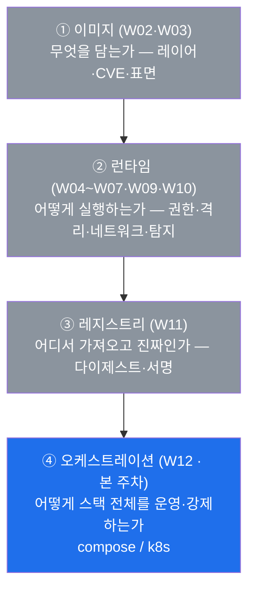

W02~W11 이 앞의 세 계층을 **한 컨테이너·한 이미지 단위**로 깊이 팠다면, 본 주차는 그 위에서 **여러
컨테이너를 한 덩어리(스택)로 묶어 지휘하는** 계층을 본다. 이 계층은 앞 계층들을 대체하는 것이 아니라,
앞에서 배운 통제들을 **스택 전체에 일관 적용·강제하는 상위 틀**이다.

### 1.2 핵심 차이: 컨테이너 단위 적용 vs 스택 전체 선언적 강제

본 주차를 이전 주차들과 가르는 핵심은 **통제를 거는 단위**다. 같은 통제(예: 비-root 실행)라도, 컨테이너
한 개씩 손으로 거느냐, 스택 전체에 한 번에 선언적으로 강제하느냐는 운영·보안에서 큰 차이를 만든다.

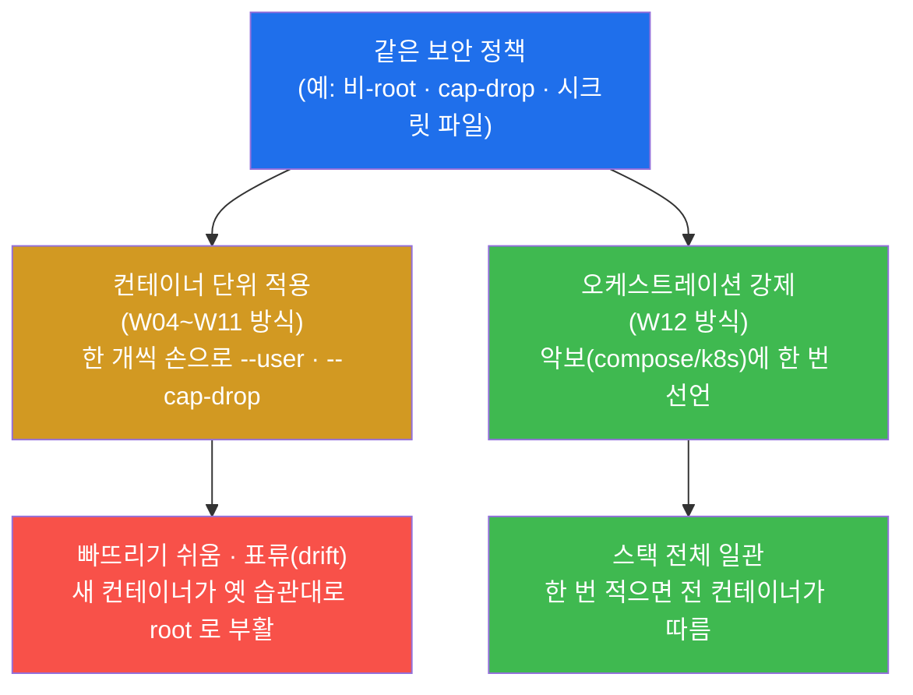

컨테이너가 몇 개일 때는 한 개씩 거는 것(주황)도 가능하지만, 수십·수백 개가 되면 빠뜨림과 **표류(drift)**
가 불가피하다 — 누군가 새 컨테이너를 옛 습관대로 root·특권으로 띄우면 baseline 이 조용히 무너진다(W04
§7.4 에서 예고한 그 표류다). 오케스트레이션(초록)은 정책을 **악보 한 곳에 선언**해, 전 컨테이너가 그대로
따르고 **새로 뜨는 컨테이너도 자동으로 같은 정책을 적용**받게 한다. **이것이 오케스트레이션이 보안에서
갖는 본질적 가치 — "일관성과 선언적 강제"** 다.

### 1.3 왜 중요한가 — 오케스트레이션 갭은 "스택 전체의 갭"

오케스트레이션 계층이 보안에서 결정적인 이유는, 그 계층의 통제(또는 갭)가 **한 컨테이너가 아니라 스택
전체에 동시에 미치기** 때문이다. 컨트롤플레인(§0.5.6)이 그 정점이다 — 컨트롤플레인이 침해되면 공격자는
임의의 Pod 을 배포하고 모든 비밀을 읽을 수 있어, **그 한 번의 침해가 곧 스택 전체의 침해**가 된다. 반대로
오케스트레이션 계층에서 정책을 잘 강제하면(기본 deny 네트워크·최소 RBAC·일관 정책), 그 효과 또한 스택
전체에 일관되게 퍼진다. 즉 오케스트레이션은 **보안의 "증폭기"이자 "일괄 적용기"** 다 — 잘못하면 갭이
일괄로 번지고, 잘하면 통제가 일괄로 강제된다.

### 1.4 한계 — 오케스트레이션이 하위 계층을 대신하지 않는다

오케스트레이션 통제를 완벽히 해도 그것이 하위 계층(이미지의 CVE·런타임 오설정·레지스트리 신뢰)을 대신
하지는 않는다. 예컨대 k8s 가 NetworkPolicy 로 통신을 잘 막아도, 그 Pod 이 도는 이미지에 RCE 취약점이
있으면(W02·web-vuln) 침투 자체는 막지 못한다. 오케스트레이션은 **하위 계층의 통제를 스택 전체에 강제·
조율하는 상위 틀**이지, 하위 계층을 없애는 마법이 아니다. 4계층은 **함께** 닫혀야 전체 방어가 된다 —
본 주차는 그 마지막 4번째 계층으로 4계층의 그림을 완성한다.

---

## 2. 운영 일관성 — 스택 전체의 재시작 정책 (복원력)

### 2.1 한 줄 정의와 왜 중요한가

**운영 일관성** 은 스택 전체의 컨테이너가 같은 운영 정책(여기서는 **재시작 정책**)으로 묶여 있는가다
(§0.5.2). 이것이 중요한 이유는, 재시작 정책이 곧 **복원력(resilience)** — 장애 시 자동 복구되어 서비스가
유지되는 성질 — 의 통제이기 때문이다. 오케스트레이션의 가장 기본적인 역할이 "죽은 컨테이너를 되살려
스택을 계속 돌리는 것"이며, 그 정책이 **일부 컨테이너에만 누락**되면 그 컨테이너가 장애 시 조용히 죽는
**약한 고리**가 된다.

> **용어 — 재시작 정책(restart policy).** Docker 가 컨테이너 비정상 종료 시 자동 재시작할지 정하는 규칙
> 이다. `no`(되살리지 않음) · `on-failure`(오류 종료 시만) · `always`(항상) · **`unless-stopped`**
> (운영자가 의도적으로 멈춘 게 아니면 항상 되살림)가 있다. 복원력 관점에서 `unless-stopped`·`on-failure`·
> `always` 는 자동 복구(준수)이고, `no` 는 자동 복구 없음(갭)이다.

### 2.2 일관성이 왜 보안·복원력 문제인가

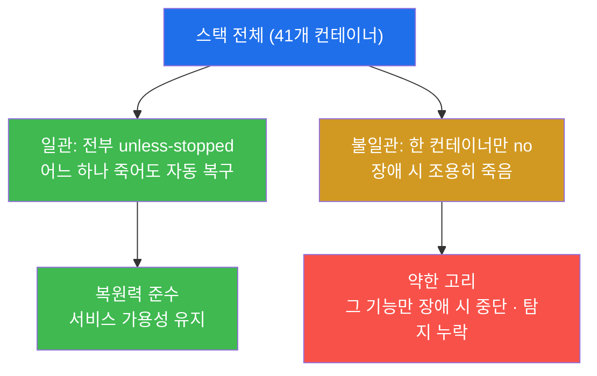

복원력은 단순한 "편의" 기능이 아니라 보안·운영 통제다. 보안 관제(SIEM)·침입탐지(IPS) 같은 **방어
컨테이너가 죽었는데 자동 복구되지 않으면**, 그 사이 공격을 놓친다(탐지 공백). 그래서 오케스트레이션은
재시작 정책을 **컨테이너마다 따로**가 아니라 **스택 단위로 일관** 적용해, 어느 한 컨테이너도 복구
정책에서 누락되지 않게 한다. 점검자는 "정책이 있는가"만이 아니라 **"스택 전체가 같은 정책으로 일관
되는가"** 를 본다.

### 2.3 el34 에서 어떻게 — 스택 전반 unless-stopped 로 일관(준수)

el34 스택의 재시작 정책 일관성은 el34 호스트(`ssh ccc@192.168.0.80`, 비밀번호 1)에서 다음과 같이 훑는다
(미션 2).

```bash
docker ps -q | head -6 | while read c; do docker inspect "$c" --format '{{.Name}} restart={{.HostConfig.RestartPolicy.Name}}'; done; echo restart_audited
```

- `docker ps -q` 는 가동 중인 컨테이너 ID 목록을, `head -6` 은 그중 앞쪽 몇 개를 추린다. 그 각각에 대해
  `docker inspect ... '{{.Name}} restart={{.HostConfig.RestartPolicy.Name}}'` 로 **컨테이너 이름과
  재시작 정책**을 한 줄씩 찍는다.
- 마지막 `echo restart_audited` 는 점검이 끝까지 수행됐음을 나타내는 **확인 토큰**이다(W07 §7 의 점검
  관용구와 같다).

출력은 `/el34-web restart=unless-stopped` 처럼, 컨테이너마다 `restart=unless-stopped` 가 나온다 — 이
출력값 자체가 증적이다. W09(데몬·호스트 점검)에서 el34-web 단일 컨테이너의 재시작 정책이
`compliant=restart_unless-stopped`(양호)임을 이미 확인했는데, 본 주차는 그것을 **스택 전반으로 넓혀**
"여러 컨테이너가 모두 같은 정책으로 일관되는가"를 본다. el34 는 **스택 전반이 `unless-stopped` 로 일관**
되어 복원력 정책을 일관 준수한다 — 만약 어느 컨테이너가 `restart=no` 로 나온다면, 그것이 장애 시 자동
복구되지 않는 **약한 고리**이며 시정 대상이다.

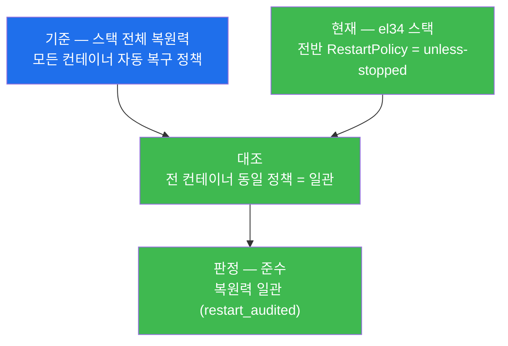

### 2.4 한계 — 일관성은 운영 정책의 한 단면일 뿐

재시작 정책의 일관성은 운영 일관성의 한 예일 뿐, 오케스트레이션이 강제하는 정책의 전부가 아니다. 자원
한도(W05 의 cgroups)·헬스체크(W09 의 healthcheck)·로그 정책·이미지 핀(W11 의 다이제스트) 등도 스택
전체에 일관 적용돼야 할 정책들이다. 또 `unless-stopped` 자체는 "되살리는가"만 보장할 뿐, **왜 죽었는가**
(근본 원인)는 따로 조사해야 한다 — 무한 재시작 루프(crash loop)는 자동 복구가 오히려 문제를 가릴 수도
있다. 본 주차는 점검 가능한 대표 일관성 항목으로 재시작 정책을 다루고, 그 위에서 compose·k8s 의 더 넓은
선언적 강제로 이어 간다.

---

## 3. Compose 보안 — IaC 파일의 비밀·특권·포트

### 3.1 한 줄 정의와 왜 중요한가

**Docker Compose 파일** 은 한 호스트 스택의 구성을 코드로 선언하는 **IaC(코드형 인프라)** 다(§0.5.3).
이것이 보안에서 중요한 이유는 **양날의 칼**이기 때문이다 — 스택 전체 구성을 한곳에 모아 일관 관리하는
장점이 있지만, 그 파일에 나쁜 설정(평문 비밀·특권·과한 포트)을 적으면 그 위험이 **스택 전체에 그대로
퍼진다.** 즉 compose 파일은 "스택의 보안 수준을 한 파일에서 결정짓는" 급소다.

### 3.2 compose 파일에 숨는 네 가지 위험

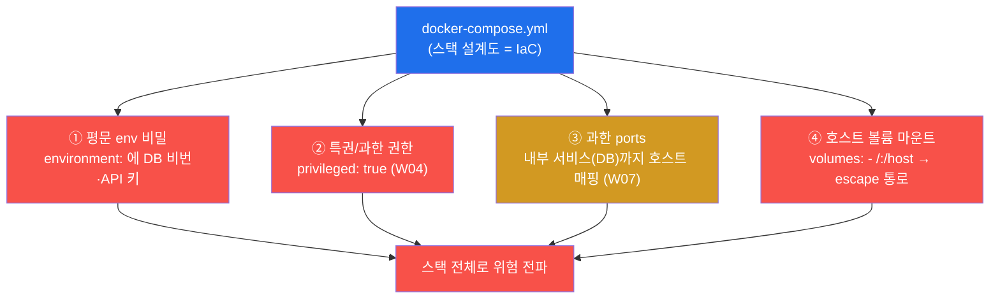

각 위험은 앞 주차에서 컨테이너 단위로 배운 갭이 **compose 파일이라는 코드에 박힌** 형태다.

- **① 평문 env 비밀** — `environment:` 에 비밀번호·키를 그대로 적으면, 파일을 보는 모두에게 노출되고
  git 에 올리면 영구히 새어 나간다(W06 의 env 비밀 노출 갭이 코드에 박힌 것).
- **② 특권/과한 권한** — `privileged: true` 한 줄이면 그 서비스가 격리를 잃는다(W04 의 특권 컨테이너).
- **③ 과한 ports** — 내부 서비스(DB 등)까지 `ports:` 로 호스트에 매핑하면 외부 공격 표면이 된다(W07 의
  과노출).
- **④ 호스트 볼륨 마운트** — `volumes: - /:/host` 처럼 호스트 디렉터리를 통째로 마운트하면, 컨테이너
  안에서 호스트 파일에 닿는 escape 통로가 생긴다.

### 3.3 통제 — secrets 블록과 최소 설정

compose 파일의 위험을 메우는 통제는 각 위험에 정확히 대응한다. 핵심은 **`secrets:` 블록** 이다.

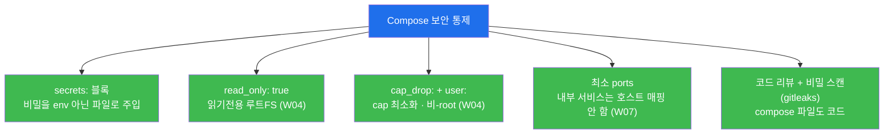

- **`secrets:` 블록** — 비밀을 `environment:`(평문 env)가 아니라 **파일로** 컨테이너에 주입한다. 비밀은
  컨테이너 안 `/run/secrets/<이름>` 같은 경로에 파일로 들어와, 환경변수처럼 프로세스 목록·로그·이미지에
  쉽게 새어 나가지 않는다(W06 의 시크릿 관리를 compose 계층에서 구현).
- **`read_only: true` · `cap_drop:` · `user:`** — W04 에서 명령줄 플래그로 걸던 런타임 강화(읽기전용
  루트FS·cap 최소화·비-root)를 compose 파일에 **선언**한다. 한 번 적으면 그 서비스가 항상 그렇게 뜬다.
- **최소 ports** — 외부로 꼭 필요한 포트만 `ports:` 로 매핑하고, 내부 서비스(DB·캐시)는 호스트로 매핑
  하지 않는다(컨테이너끼리는 같은 compose 네트워크로 통신).
- **코드 리뷰 + 비밀 스캔** — compose 파일은 **코드**이므로, 변경을 코드 리뷰로 검토하고 **gitleaks**
  같은 비밀 스캐너로 평문 비밀이 들어왔는지 자동 검사한다.

> **el34 에서의 의미.** el34 는 Docker Compose 로 운영되는 스택이며, 본 주차에서 본인 손으로 점검하는
> Compose 계층의 항목이 바로 §2 의 재시작 정책 일관성이다. compose 의 secrets·특권·포트 통제는 "el34
> 같은 compose 스택을 어떻게 안전하게 선언하는가"의 원칙으로 다룬다. 미션 3 의 합격은 이 compose 보안
> 요점(secrets·특권·포트)이 정리됐음(`compose_secured`)을 확인하는 것이다.

### 3.4 한계 — compose 보안은 단일 호스트의 한계 안에 있다

Compose 통제를 잘해도 그것은 **한 호스트 안의** 스택을 다스릴 뿐이다. 여러 호스트로 확장·자동 복구·롤링
업데이트가 필요해지면 compose 만으로는 부족하고, 그때 **Kubernetes** 가 같은 통제를 더 큰 규모로
선언적으로 강제한다(§4). 또 compose 의 `secrets:` 는 k8s 의 Secret·외부 비밀 관리(Vault)만큼 정교하지는
않다(단일 파일 기반). 즉 compose 보안은 소규모 스택의 1차 방어이고, 규모가 커지면 오케스트레이션 도구
자체가 k8s 로 올라가며 통제도 함께 확장된다.

---

## 4. Kubernetes Pod 보안 — 다섯 핵심 통제

### 4.1 한 줄 정의와 왜 중요한가

규모가 커져 여러 호스트가 필요해지면 **Kubernetes(k8s)** 로 오케스트레이션한다(§0.5.4). k8s 의 최소 배포
단위는 **Pod**(한 개 이상의 컨테이너 묶음)이며, k8s 보안의 핵심은 **다섯 가지 통제** — SecurityContext ·
RBAC · NetworkPolicy · Secret · PodSecurity(Admission) — 다. 이것이 중요한 이유는, 이 다섯이 **W04~W07
에서 컨테이너 한 개씩 배운 통제(권한·격리·네트워크·시크릿)를 클러스터 전체에 선언적으로 강제하는** k8s
의 방식이기 때문이다.

### 4.2 다섯 통제와 각각이 막는 것

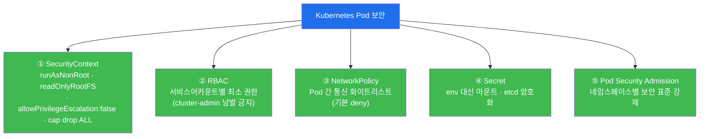

- **① SecurityContext** — Pod/컨테이너의 런타임 보안 옵션을 YAML 에 선언한다(§0.5.4). `runAsNonRoot:
  true`(비-root, W04 의 CIS 4.1) · `readOnlyRootFilesystem: true`(읽기전용 루트FS) ·
  `allowPrivilegeEscalation: false`(권한 상승 금지, no-new-privileges) · `capabilities.drop: ["ALL"]`
  (cap 전부 제거, W04 의 CIS 5.3). **W04 의 런타임 통제를 그대로, 명령줄이 아니라 선언으로** 거는 것이다.
- **② RBAC(역할 기반 접근 제어)** — "누가 무엇을 할 수 있는가"를 역할로 부여한다(§0.5.5). 원칙은 **최소
  권한** — 워크로드별 서비스어카운트에 꼭 필요한 권한만 주고, 모두에게 `cluster-admin`(전권)을 주지
  않는다. 과한 RBAC 은 한 워크로드 침해를 클러스터 전체 장악으로 키운다.
- **③ NetworkPolicy** — Pod 간 통신을 화이트리스트로 통제한다(W07 의 네트워크 분리를 k8s 에서 구현).
  k8s 의 기본은 "모든 Pod 이 서로 통신 가능(평면)"이므로, **기본 deny 후 꼭 필요한 통신만 허용**해야
  측면 이동(east-west, W07 §0.5.2)을 막는다.
- **④ Secret** — 비밀번호·키를 Pod 에 따로 보관·주입하는 객체다(W06 의 시크릿 관리). 비밀을 env 가 아닌
  **마운트**로 쓰고, 저장소 **etcd 에서는 암호화**해 둔다(암호화하지 않으면 etcd 한 번 유출로 모든 비밀이
  샌다 — §5).
- **⑤ Pod Security Admission(PSA)** — Pod 이 클러스터에 들어오는 **입구에서** 보안 표준을 강제한다. 네임
  스페이스별로 "특권 금지·비-root 필수" 같은 표준을 정해, 그를 어기는 Pod 의 배포 자체를 막는다. ①~④
  가 "각 Pod 이 무엇을 갖는가"라면, ⑤ 는 "표준을 어긴 Pod 은 아예 못 뜨게" 입구에서 거르는 강제 장치다.

### 4.3 핵심 통찰 — 컨테이너 단위 통제를 선언적으로 스택에 강제

이 다섯 통제의 공통점은 분명하다. **W04~W07 에서 학생이 컨테이너 한 개 단위로 점검·이해한 통제(특권·cap·
user·시크릿·네트워크 분리)를, k8s 가 클러스터 전체의 선언적 객체로 강제**한다는 것이다.

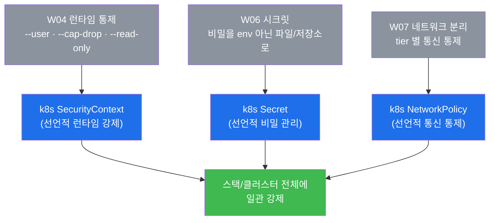

즉 본 주차는 W04~W07 에서 배운 것을 버리고 새것을 배우는 게 아니라, **같은 통제를 "한 개씩 손으로"에서
"스택 전체에 선언적으로"로 끌어올리는** 주다. 미션 4 의 합격은 이 k8s 핵심 통제(특히 `SecurityContext`)
가 정리됐음을 확인하는 것이다.

### 4.4 한계 — 통제는 선언만으로 끝나지 않는다

다섯 통제를 매니페스트에 적어 둔다고 자동으로 안전해지는 것은 아니다. SecurityContext 를 정의해도 그것을
**입구에서 강제(⑤ PSA/정책 엔진)** 하지 않으면, 그를 빠뜨린 Pod 이 그냥 떠 버린다. NetworkPolicy 도 이를
**지원하는 CNI 플러그인**이 없으면 적용되지 않는다. RBAC 도 정기적으로 과한 권한을 점검(권한 표류)하지
않으면 시간이 지나며 느슨해진다. 그래서 k8s 보안은 "한 번 선언"이 아니라 **정책 엔진(OPA/Kyverno, §6)으로
강제 + 정기 점검**이 함께 가야 한다. 본 주차는 다섯 통제의 "무엇을·왜"를 이해하는 데 초점을 두고, 클러스터
운영의 세부는 이후 심화의 몫으로 둔다.

---

## 5. 오케스트레이션 위협 — 컨트롤플레인이 급소

### 5.1 한 줄 정의와 왜 중요한가

오케스트레이션 계층의 대표적 **위협**은 네 가지다 — **k8s API 서버 노출 · 과한 RBAC · NetworkPolicy 부재
(평면) · etcd 평문 비밀**. 그리고 이 넷이 향하는 정점이 **컨트롤플레인 침해** 다(§0.5.6). 이 위협들이
무서운 이유는 모두 **스택/클러스터 전체에 한 번에** 영향을 미치기 때문이다 — 개별 컨테이너 하나의 갭과
달리, 오케스트레이션 계층의 갭은 **그 한 번의 침해가 스택 전체 침해로 직결**된다.

### 5.2 네 가지 위협과 컨트롤플레인

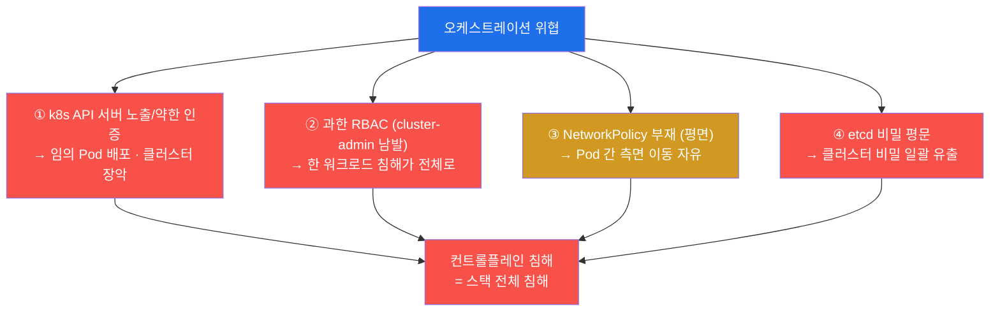

- **① k8s API 서버 노출/약한 인증** — API 서버는 모든 명령이 들어오는 정문(컨트롤플레인의 얼굴)이다.
  이것이 인증 없이/약한 인증으로 외부에 노출되면, 공격자가 임의의 Pod 을 띄우고(악성 컨테이너 배포) 모든
  자원을 조작해 **클러스터를 통째로 장악**한다. (NIST 800-190 의 "노출된 컨테이너 API" 항목이다.)
- **② 과한 RBAC** — 워크로드·사용자에게 `cluster-admin`(전권)을 남발하면, **한 워크로드만 뚫려도 그
  과한 권한으로 클러스터 전체**가 털린다. 최소권한(W04)의 RBAC 판이다.
- **③ NetworkPolicy 부재(평면)** — k8s 기본은 모든 Pod 이 서로 통신 가능한 평면이다. NetworkPolicy 로
  막지 않으면, 한 Pod 침해가 옆 Pod 으로 자유롭게 **측면 이동(east-west)** 한다(W07 §5 의 평면 네트워크
  위험이 k8s 에서 재현된 것).
- **④ etcd 비밀 평문** — etcd 는 클러스터의 모든 설정·상태·비밀을 저장하는 마스터 장부다. 여기 저장된
  Secret 이 평문이면, **etcd 한 번 유출로 클러스터의 모든 비밀이 일괄로** 새어 나간다.

이 넷의 공통 종착점이 **컨트롤플레인 침해** 다(빨강). 핵심 명제를 다시 못 박는다 — **오케스트레이션 계층
(특히 컨트롤플레인) 침해는 스택 전체 침해이며, 그래서 컨트롤플레인 보호가 오케스트레이션 보안의 핵심**
이다. 미션 5 의 합격은 이 위협(특히 `RBAC` 을 포함한)이 정리됐음을 확인하는 것이다.

### 5.3 한계 — 위협이 이 넷뿐인 것은 아니다

위 네 가지는 가장 대표적이고 점검의 출발점이 되는 위협이지만 전부는 아니다. 공급망 공격(악성 이미지가
오케스트레이터를 통해 일괄 배포)·취약한 admission/operator·노드(호스트) 자체의 침해·잘못된 시크릿 마운트
등도 오케스트레이션 위협이다. 또 el34 는 Compose 스택이므로 위 k8s 특유의 위협(API 서버·etcd)은 직접
해당하지 않지만, **"오케스트레이션 계층의 갭은 스택 전체에 미친다"** 는 원리는 compose 에도 똑같이
적용된다(예: compose 파일 한 곳의 평문 비밀이 스택 전체 위험). 본 주차는 대표 네 위협으로 원리를 익힌다.

---

## 6. 방어 — 선언적 최소권한을 스택 전체에 강제

### 6.1 한 줄 정의와 왜 중요한가

오케스트레이션 방어의 핵심 원칙은 **"선언적 최소권한을 스택 전체에 강제한다"** 이다 — 앞 주차들에서 배운
최소권한(W04)·시크릿(W06)·네트워크 분리(W07)를, 컨테이너마다 손으로가 아니라 **오케스트레이션 계층에서
한 번 선언해 전 스택에 일관 강제**하는 것. 왜 중요한가 — §5 의 위협이 모두 "스택 전체에 미치는 갭"이므로,
방어 또한 **스택 전체에 일관되게** 적용돼야 효과가 있기 때문이다. 한두 컨테이너만 강화하고 나머지를
빠뜨리면 그 빠진 곳이 약한 고리가 된다.

### 6.2 네 갈래 방어

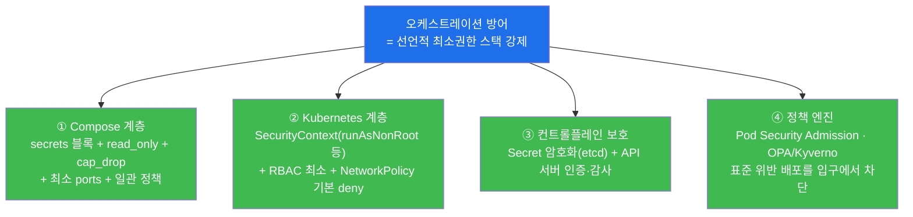

- **① Compose 계층** — `secrets:` 블록(비밀 파일 주입) + `read_only`·`cap_drop`·`user`(런타임 강화 선언)
  + 최소 ports + **스택 전반 일관 정책**(재시작 등). 소규모 스택의 1차 방어다(§3).
- **② Kubernetes 계층** — SecurityContext(`runAsNonRoot`·`readOnlyRootFilesystem`·cap drop ALL) +
  RBAC 최소권한 + NetworkPolicy **기본 deny**. 컨테이너 단위 최소권한을 선언적으로 강제한다(§4).
- **③ 컨트롤플레인 보호** — Secret 을 **etcd 에서 암호화**하고, API 서버에 **인증·감사(audit)** 를 건다.
  §5 의 급소(컨트롤플레인)를 직접 지키는 통제다.
- **④ 정책 엔진** — **Pod Security Admission** 과 **OPA(Open Policy Agent)/Kyverno** 로, 보안 표준을
  어긴 배포를 **입구에서 자동 차단**한다. 선언만으로는 빠뜨리기 쉬운 통제를(§4.4) "표준을 안 지키면 아예
  못 뜬다"로 강제하는 마지막 빗장이다.

> **용어 — OPA / Kyverno(정책 엔진).** **OPA(Open Policy Agent)** 와 **Kyverno** 는 k8s 에 배포되는
> 설정(매니페스트)이 조직의 보안 정책을 지키는지 **자동으로 검사·차단**하는 정책 엔진이다. 예를 들어
> "특권 컨테이너 금지" "비-root 필수" "신뢰된 레지스트리(W11)에서만 이미지 허용" 같은 규칙을 코드로 적어
> 두면, 그를 어기는 Pod 의 배포 요청을 입구(admission)에서 거부한다. 모든 출연 신청서를 검사하는 심사관
> 에 해당한다 — 사람이 매번 리뷰하지 않아도 정책이 자동으로 강제된다.

### 6.3 el34 에서 어떻게

el34 는 Compose 스택이므로, 본 주차에서 본인 손으로 확인한 방어의 예는 **① Compose 계층의 일관 정책** —
스택 전반의 재시작 정책이 `unless-stopped` 로 일관돼 복원력을 일관 준수하는 것(§2)이다. compose 의
secrets·최소 권한과, ②~④ 의 k8s·컨트롤플레인·정책 엔진은 "대규모로 가면 같은 최소권한을 어떻게 선언적
으로 강제하는가"의 방어 원칙으로 정리한다. 핵심은 **개별 옵션의 나열이 아니라, "컨테이너 단위 최소권한
(W04~W07)을 오케스트레이션이 선언적으로 스택 전체에 일관 강제한다"는 한 원칙**으로 네 갈래를 꿰는 것이다.
미션 6 의 합격은 이 방어(특히 `NetworkPolicy` 를 포함한)가 정리됐음을 확인하는 것이다.

### 6.4 한계 — 방어도 설정하고 끝이 아니라 점검·강제해야 한다

위 네 갈래 방어는 효과가 크지만, **선언만 하고 강제·점검하지 않으면 표류**한다(W04 §7.4 와 같은 원리).
SecurityContext 를 정의해도 정책 엔진(④)이 없으면 누군가 그를 빠뜨린 Pod 을 띄울 수 있고, RBAC 도 정기
점검이 없으면 권한이 슬금슬금 넓어진다. 그래서 오케스트레이션 방어의 완성은 **정책 엔진으로 자동 강제 +
정기적 baseline 점검**이다 — 본 주차의 운영 일관성 점검(§2)이 바로 그 정기 점검의 한 예다. 또 오케스트
레이션은 4계층의 마지막 층이므로, 이미지(W02·W03)·런타임(W04~W10)·레지스트리(W11) 통제와 **함께** 가야
전체가 닫힌다.

---

## 7. 점검 명령 빠른 복습 — "무엇을 어디서 보나"

본 주차의 직접 점검은 el34 호스트(`ssh ccc@192.168.0.80`, 비밀번호 1)에서 `docker` CLI 로 수행하며,
**신규 도구 설치는 없다.** 점검 대상은 인가된 el34 컨테이너(스택)뿐이고, 모든 명령은 **읽기 전용**이다
(스택 구성을 바꾸지 않는다). Kubernetes 항목은 인가되지 않은 클러스터를 건드리지 않고 **개념으로** 다룬다.

| 무엇을 | 명령 / 형태 | 무엇을 보나 / el34 결과 |
|--------|-------------|--------------------------|
| 스택 확인 | `docker ps -q \| wc -l` | 스택 컨테이너 수(`target_ok`) |
| 운영 일관성(restart) | `docker ps -q \| head -6 \| while read c; do docker inspect "$c" --format '{{.Name}} restart=...'; done` | 스택 전반 `unless-stopped` = 복원력 일관(준수, `restart_audited`) |
| Compose 보안 | (개념 정리) | secrets 블록·특권·포트·볼륨 통제(`compose_secured`) |
| k8s Pod 보안 | (개념 정리) | SecurityContext·RBAC·NetworkPolicy·Secret·PSA |
| 오케스트레이션 위협 | (개념 정리) | API 노출·과한 RBAC·평면·etcd 평문 → 컨트롤플레인 |
| 방어 | (개념 정리) | compose secrets/일관 + k8s 최소권한 + 컨트롤플레인 보호 + 정책 엔진 |

> **점검 관용구.** 본 주차의 점검 명령들은 끝에 `echo target_ok` / `echo restart_audited` /
> `echo compose_secured` 같은 **확인 토큰**을 찍어 둔다(W07 §7 과 같은 관용구). 이는 명령이 끝까지
> 수행됐고 그 단계 점검이 완료됐음을 나타내는 표식이다 — 학생은 이 토큰이 출력에 나오는지로 각 단계
> 통과를 확인한다. 본 주차의 핵심 증적은 **스택 전반 `restart=unless-stopped`(운영 일관성 준수)** 한
> 줄과, 그 위에 정리한 compose·k8s 통제·컨트롤플레인 위협·선언적 방어다.

---

## 8. 실습 안내 — lab 7 미션 (4 축 설명)

본 주차 lab 은 **7 미션**으로 구성되며, lab 의 `order` 와 1:1 로 대응한다. 미션은 스택 확인 → 운영
일관성(restart) → Compose 보안 → Kubernetes Pod 보안 → 오케스트레이션 위협 → 방어 → 종합 보고의 순서로
흐른다. 각 미션을 **4 축**으로 설명한다 — 왜 하는가 / 무엇을 알 수 있는가 / 결과 해석(정상 vs 갭) / 실전
활용.

> **실습 진행 원칙.** 직접 점검(미션 1·2)은 el34 호스트(`ssh ccc@192.168.0.80`)에서 `docker` CLI 로
> 수행한다. 이번 주는 **신규 설치가 없고**, 점검 대상은 인가된 el34 스택뿐이며, 명령은 모두 **읽기 전용**
> (`docker ps`·`docker inspect`)이라 스택을 멈추거나 바꾸지 않는다. Compose 보안·Kubernetes·위협·방어
> (미션 3~7)는 **개념 정리** 미션으로, 인가되지 않은 어떤 클러스터·시스템도 실제로 건드리지 않는다.
> 합격 임계값은 0.7 이다.

### 미션 1 — 스택 확인 (10점)

> **왜 하는가?** 오케스트레이션 점검의 전제는 "여러 컨테이너가 한 스택으로 돌고 있다"는 사실 확인이다.
> 점검자는 본격 분석 전 스택이 실제로 가동 중인지(컨테이너 수)부터 확인한다.
>
> **무엇을 알 수 있는가?** `docker ps -q | wc -l` 로 가동 중인 스택 컨테이너 수. 오케스트레이션은 "다수
> 컨테이너의 운영 자동화"이므로(§0.5.1), 그 다수가 실제로 떠 있는 스택임을 먼저 확인한다.
>
> **결과 해석.** 정상: 컨테이너 수와 `target_ok` 가 출력됨(스택 확인 성공). 비정상: 응답이 없거나 0
> 이면 호스트 SSH·docker 데몬·권한부터 점검한다.
>
> **실전 활용.** 오케스트레이션 점검 착수 시 첫 확인. "이 호스트가 다수 컨테이너 스택인가"를 한 줄로
> 파악하는 단계다.

### 미션 2 — 운영 일관성 (restart 정책) (14점, 핵심)

> **왜 하는가?** 오케스트레이션의 가장 기본 역할이 "죽은 컨테이너를 되살려 스택을 계속 돌리는 것"이다.
> 재시작 정책이 스택 전체에 일관되는가를 봐야 복원력 준수 여부를 안다(§2). 본 주차의 직접 점검 핵심이다.
>
> **무엇을 알 수 있는가?** `docker inspect ... '{{.HostConfig.RestartPolicy.Name}}'` 를 스택 여러
> 컨테이너에 훑어 본 재시작 정책. el34 는 스택 전반이 `unless-stopped` 로 일관 — 어느 컨테이너가 비정상
> 종료돼도 자동 복구되는 복원력 준수.
>
> **결과 해석.** 정상: 각 컨테이너 `restart=unless-stopped` 와 `restart_audited` 가 출력됨(일관성 점검
> 성공, 준수). 만약 어느 컨테이너가 `restart=no` 면 장애 시 자동 복구 안 되는 **약한 고리**(갭)다.
>
> **실전 활용.** 스택 운영 점검의 표준 절차. "스택 전체가 같은 복원력 정책으로 일관되는가"를 30초 만에
> 판단하며, 방어 컨테이너(SIEM·IPS)의 복구 누락 같은 위험을 잡아낸다.

### 미션 3 — Compose 보안 (12점)

> **왜 하는가?** el34 같은 Compose 스택은 compose 파일(IaC)이 스택의 보안 수준을 결정짓는다. 그 파일에
> 숨는 위험과 통제를 정리해야 "스택을 어떻게 안전하게 선언하는가"를 안다(§3).
>
> **무엇을 알 수 있는가?** compose 파일(IaC)에 담기는 위험(평문 env 비밀·`privileged: true`·과한 ports·
> 호스트 볼륨)과 통제(**`secrets:` 블록**·`read_only`·`cap_drop`·`user`·최소 ports), 그리고 compose
> 파일도 코드 리뷰·비밀 스캔(gitleaks) 대상이라는 것.
>
> **결과 해석.** 정상: compose 보안 요점(secrets·특권·포트)이 정리되고 `compose_secured` 가 출력됨(정리
> 성공). 비정상: secrets 블록이나 특권/포트 통제가 빠지면 §3.2·§3.3 을 다시 읽는다.
>
> **실전 활용.** Compose 스택 보안 리뷰의 사고 틀. compose 파일을 받았을 때 "평문 비밀·특권·과노출"부터
> 점검하고 secrets 블록으로 시정하는 표준 절차다.

### 미션 4 — Kubernetes Pod 보안 (12점)

> **왜 하는가?** 규모가 커지면 k8s 로 오케스트레이션한다. W04~W07 의 컨테이너 단위 통제가 k8s 에서 어떤
> 객체로 선언적으로 강제되는지를 정리해야, 오케스트레이션 보안의 큰 그림이 완성된다(§4).
>
> **무엇을 알 수 있는가?** k8s Pod 보안 다섯 통제 — SecurityContext(`runAsNonRoot`/`readOnlyRootFS`/
> 권한상승 금지/cap drop) · RBAC(최소 권한) · NetworkPolicy(기본 deny) · Secret(마운트·etcd 암호화) ·
> Pod Security Admission — 가 각각 무엇을 막고, W04~W07 의 무엇에 대응하는지.
>
> **결과 해석.** 정상: 다섯 통제(특히 `SecurityContext`)가 정리됨(정리 성공). 비정상: SecurityContext·
> RBAC·NetworkPolicy 중 핵심이 빠지면 §4.2·§4.3 을 다시 확인한다.
>
> **실전 활용.** k8s 보안 baseline 의 골격. Pod 매니페스트를 검토할 때 다섯 통제가 선언됐는지 확인하는
> 점검 항목 표가 된다.

### 미션 5 — 오케스트레이션 위협 (12점)

> **왜 하는가?** 통제를 알았으면 그것이 깨졌을 때의 위험도 알아야 한다. 오케스트레이션 계층 침해가 왜
> 스택 전체 침해인지, 컨트롤플레인이 왜 급소인지를 정리해 방어(미션 6)와 연결한다(§5).
>
> **무엇을 알 수 있는가?** k8s API 서버 노출 · 과한 RBAC(cluster-admin 남발) · NetworkPolicy 부재(평면)
> · etcd 평문 비밀이 왜 위협인지, 그리고 이 넷이 향하는 **컨트롤플레인 침해 = 스택 전체 침해** 라는 핵심.
>
> **결과 해석.** 정상: 위협(특히 `RBAC`)이 정리됨(정리 성공). 비정상: 컨트롤플레인·과한 RBAC 개념이
> 빠지면 §5.2·§0.5.6 을 다시 읽는다.
>
> **실전 활용.** 오케스트레이션 위험 평가의 사고 틀. 어떤 오설정(API 노출·과 RBAC·평면·etcd 평문)부터
> 시정할지 우선순위를 "스택 전체 영향" 기준으로 매기는 근거가 된다.

### 미션 6 — 방어 (14점)

> **왜 하는가?** 위협을 알았으면(미션 5) 막는 법이 따라와야 한다. 컨테이너 단위 최소권한을 오케스트레이션
> 이 선언적으로 스택 전체에 강제하는 방어를 정리한다(§6).
>
> **무엇을 알 수 있는가?** Compose(secrets·일관 정책) + k8s(SecurityContext·RBAC 최소·NetworkPolicy 기본
> deny·Secret 암호화) + 컨트롤플레인 보호 + 정책 엔진(Pod Security Admission/OPA/Kyverno)의 네 갈래
> 방어, 그리고 그것이 어떻게 "선언적 최소권한의 스택 강제"로 귀결되는지.
>
> **결과 해석.** 정상: 방어(특히 `NetworkPolicy`)가 정리됨(정리 성공). 비정상: 네 갈래 중 핵심이 빠지면
> §6.2 를 다시 확인한다.
>
> **실전 활용.** 오케스트레이션 보안 baseline 의 골격. compose/k8s 스택을 띄울 때 적용할 정책의 기준이
> 되며, 정책 엔진으로 자동 강제하는 출발점이다.

### 미션 7 — 오케스트레이션 보안 보고서 (14점)

> **왜 하는가?** 점검의 산출물은 보고서다. 미션 1–6 을 운영 일관성(점검) → compose/k8s 보안 → 위협
> (컨트롤플레인) → 방어(선언적 최소권한)의 한 흐름으로 종합해야 본 주차 학습이 완성된다.
>
> **무엇을 알 수 있는가?** 전 미션을 한 문서로 묶는 법 — el34 스택 restart 일관(`unless-stopped`, 복원력
> 준수) · compose 비밀은 secrets 블록 · k8s SecurityContext/RBAC/NetworkPolicy/Secret · 선언적 최소권한
> 강제 + 정책 엔진. 점검·위협·방어를 균형 있게 제시하는 보고 구조.
>
> **결과 해석.** 정상: 보고서에 운영 일관성·k8s 보안(특히 `NetworkPolicy`)·방어가 모두 담김(종합 성공).
> 비정상: 일관성·k8s·방어 중 하나가 빠지면 미션 7 의 보고서 양식을 다시 채운다.
>
> **실전 활용.** 오케스트레이션 보안 점검 보고서의 표준 구조(운영 일관성 → 위협 → 방어 → 결론). 운영팀·
> 심사에 제출하는 산출물이며, 컨테이너 보안 4계층 전체(W01~W12) 점검의 마지막 조각이다.

---

## 9. 실습 수칙 — 인가된 점검과 증적 중심

오케스트레이션 보안 점검도 **허가받은 대상에 대해서만** 한다. 다음 수칙을 지킨다.

- **인가된 대상만 점검한다.** el34 의 정해진 스택(인가된 컨테이너)에 대해서만 조회하며, 같은 명령을 그
  밖의 어떤 시스템·스택·클러스터에도 함부로 던지지 않는다. 특히 **Kubernetes 부분은 개념 학습**이며,
  인가되지 않은 어떤 k8s 클러스터의 API 서버·etcd 에도 접근하지 않는다.
- **점검만, 변경은 하지 않는다.** 본 주차의 명령(`docker ps`·`docker inspect`)은 모두 **읽기 전용 조회**
  다. 컨테이너를 멈추거나 재시작 정책·compose 구성을 실제로 바꾸지 않는다 — 시정은 운영팀의 변경관리
  절차(compose 파일 수정·재배포)로 한다.
- **증적 우선.** "오케스트레이션이 안전하다/위험하다"가 아니라 **무엇이(스택 전반 restart 정책) 왜 일관/
  복원력의 의미를 갖는가 + 명령 출력**의 삼박자로 보고한다. `docker inspect` 의 출력값(예: `restart=
  unless-stopped`) 자체가 증적이다.
- **준수와 갭을 균형 있게.** el34 처럼 운영 일관성이 준수(unless-stopped)인 경우, 그 양호함도 함께 보고
  하고, k8s 로 갔을 때 점검해야 할 항목(과한 RBAC·평면·etcd 평문)을 권고로 덧붙인다.

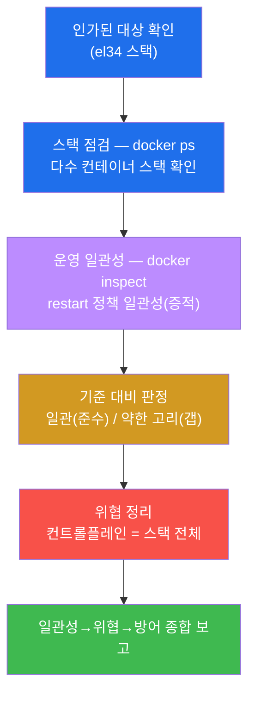

---

## 10. 핵심 정리 (1줄씩)

1. **오케스트레이션 = 4계층의 마지막** — 다수 컨테이너의 배포·확장·운영 자동화(compose / k8s). 컨테이너
   단위 통제(W04~W11)를 **스택 전체에 선언적으로 일관 강제**하는 계층이다.
2. **운영 일관성(restart)** — 스택 전체가 같은 복원력 정책으로 묶였는가. el34 는 **`unless-stopped` 로
   일관**(준수, `restart_audited`). 일부만 `no` 면 장애 시 죽는 약한 고리.
3. **Docker Compose = IaC** — 스택 설계도(코드). 평문 env 비밀·특권·과 ports·호스트 볼륨이 위험. 통제는
   **`secrets:` 블록**(비밀 파일 주입) + `read_only`·`cap_drop`·최소 ports + 코드 리뷰·비밀 스캔.
4. **Kubernetes Pod 보안 5통제** — **SecurityContext**(비-root·읽기전용FS·권한상승 금지·cap drop) ·
   **RBAC**(최소 권한) · **NetworkPolicy**(기본 deny) · **Secret**(마운트·etcd 암호화) ·
   **PodSecurity(Admission)**. W04~W07 통제를 선언적으로 스택에 강제.
5. **위협 = 컨트롤플레인** — API 서버 노출·과한 RBAC·NetworkPolicy 부재·etcd 평문 → **컨트롤플레인 침해
   = 스택 전체 침해.** 컨트롤플레인 보호가 핵심.
6. **방어 = 선언적 최소권한의 스택 강제** — compose secrets/일관 + k8s SecurityContext/RBAC 최소/
   NetworkPolicy + Secret 암호화 + **정책 엔진(OPA/Kyverno)** 으로 표준 위반 배포를 입구에서 차단.

---

## 11. 다음 주차 예고 — 4계층을 넘어 통합 운영으로

본 주차(W12)로 학생은 컨테이너 보안 **4계층(W01) 전체** — ① 이미지(W02·W03) · ② 런타임(W04~W10) ·
③ 레지스트리(W11) · ④ **오케스트레이션(W12)** — 을 한 바퀴 다 돌았다. 핵심 통찰을 한 문장으로 모으면
이렇다 — **컨테이너 보안은 한 계층만 잘해서는 닫히지 않으며, 네 계층이 함께 강해야 하고, 그 네 계층의
통제를 스택 전체에 일관 강제하는 것이 오케스트레이션 계층의 역할이다.**

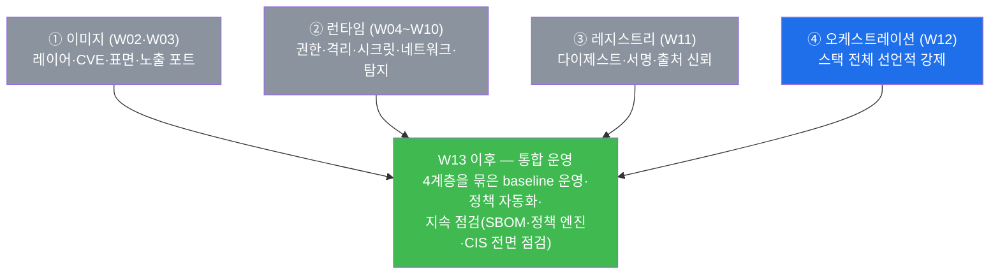

다음 주차들은 이 4계층의 점검을 **하나의 지속 운영(continuous operation)** 으로 묶는다 — 본 주차에서
본 정책 엔진(OPA/Kyverno)·일관성 점검을 확장해, 새 컨테이너가 뜰 때마다 4계층 baseline(이미지 CVE·비-root·
서명·최소권한·일관 정책)을 자동으로 검사·강제하고, CIS Docker / NIST SP 800-190 전면 점검과 SBOM(소프트
웨어 구성표) 기반 공급망 관리로 나아간다. 본 주차에서 익힌 **"스택 전체에 선언적으로 일관 강제"** 라는
사고가, 그 통합 운영의 토대가 된다.
