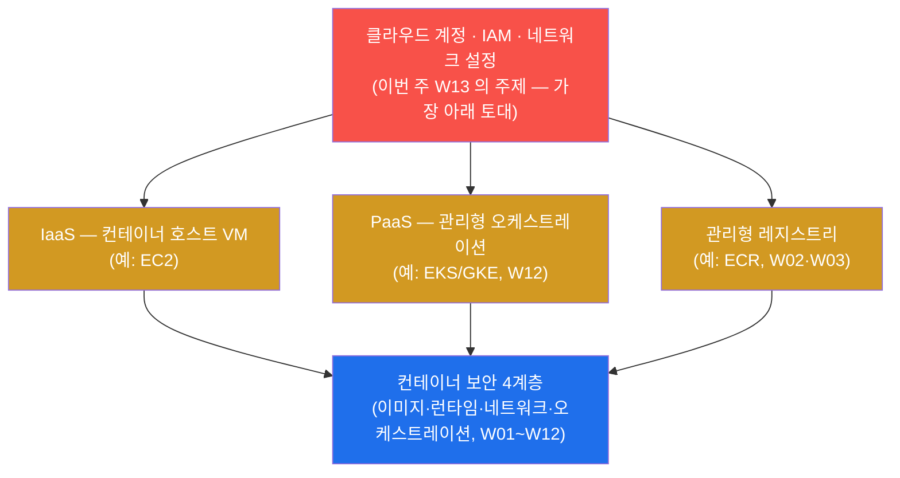
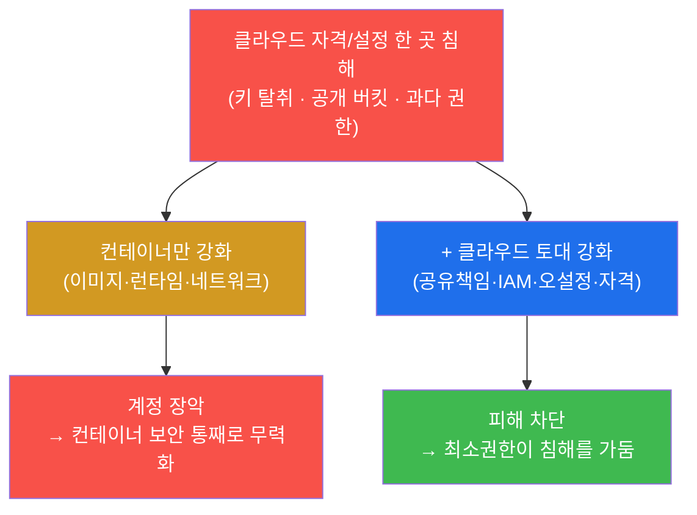
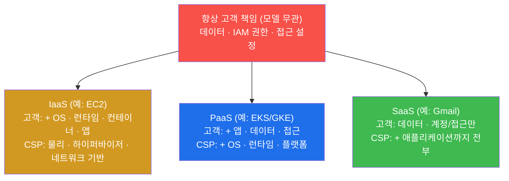
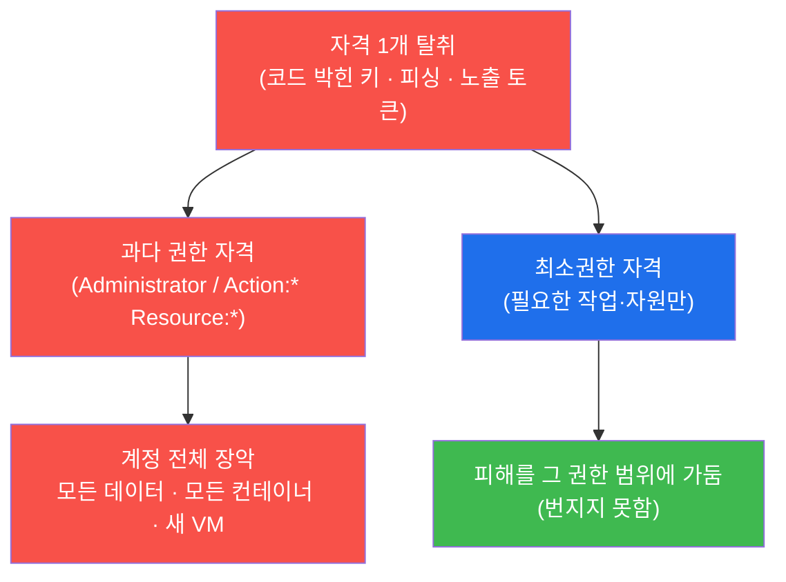
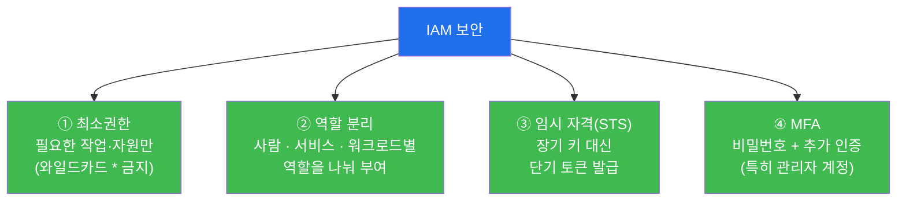
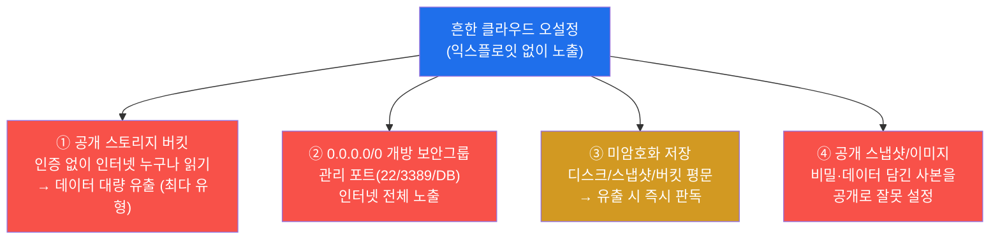
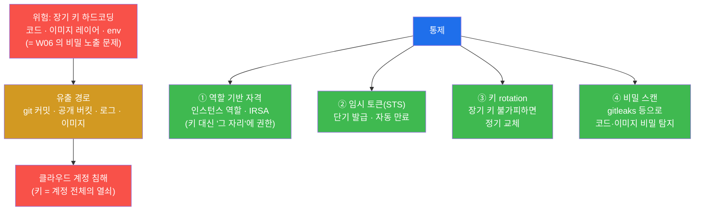
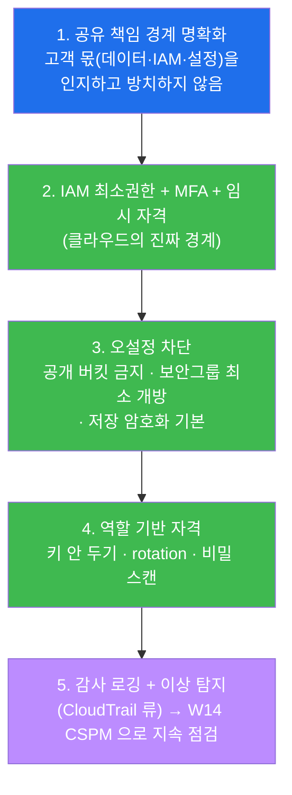
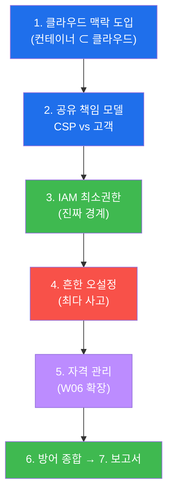
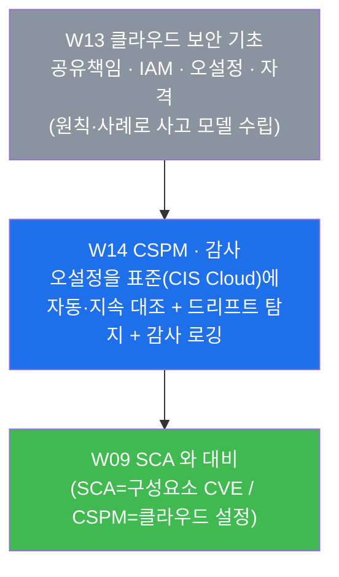

# 클라우드·컨테이너 W13 — 클라우드 보안 기초: 공유 책임 모델·IAM

> **본 주차의 한 줄 요약**
>
> 지난 12주 동안 학생은 컨테이너 **한 칸의 안쪽**(이미지·런타임·격리·시크릿)과 컨테이너들 **사이의
> 망·오케스트레이션**(W07 네트워크, W12 Compose/k8s)을 점검해 왔다. 그러나 현실에서 그 컨테이너들은
> 대부분 **클라우드(AWS·GCP·Azure)** 라는 더 큰 땅 위에서 돈다 — 컨테이너를 띄우는 VM(IaaS),
> 관리형 쿠버네티스(PaaS), 이미지를 보관하는 레지스트리가 모두 클라우드 서비스다. 그래서 컨테이너를
> 아무리 단단히 굳혀도, **그 아래 클라우드 계정·IAM·설정이 뚫리면 컨테이너 보안은 통째로 무력**해진다.
> 본 주차는 컨테이너의 토대인 클라우드 보안의 기초를 배운다 — ① 책임이 어디까지 누구의 것인가(공유
> 책임 모델), ② 클라우드의 진짜 경계인 IAM(누가 무엇을 할 수 있는가), ③ 사고의 최다 원인인 흔한
> 오설정(공개 버킷·개방 보안그룹), ④ 클라우드 자격 증명의 올바른 관리(W06 의 시크릿 원칙이 클라우드로
> 확장된다).
>
> **중요 — 본 주차는 "개념 중심"이다.** 우리 실습 환경 **el34 는 온프레미스(자체 호스트)** 라서 실제
> 클라우드 계정이 없다. 따라서 본 주차는 클라우드의 **원칙과 실제 사고 사례**로 학습한다(실습 명령은
> `echo` 로 개념을 정리·체득하는 형태다). el34 가 진짜 AWS 계정을 가진 것처럼 꾸며낸 사실은 쓰지
> 않는다 — 클라우드 사실은 **공개된 실제 사고와 표준**에 근거한다.
>
> **점검자 한 줄 결론**: 클라우드 보안은 "클라우드니까 제공자가 알아서 해 주겠지"가 아니라, **무엇이
> 제공자(CSP)의 몫이고 무엇이 고객의 몫인지(공유 책임)를 정확히 알고**, 클라우드의 진짜 경계인
> **IAM 을 최소권한으로** 통제하며, 사고의 최다 원인인 **오설정(공개·개방·미암호화)을 막고**, 자격
> 증명을 **역할 기반·임시 토큰**으로 관리하는 일이다. 컨테이너 보안의 모든 층은 이 클라우드 토대 위에
> 선다.

---

## 학습 목표

본 주차 종료 시 학생은 다음 6가지를 **본인 손으로** 할 수 있어야 한다.

1. 클라우드 서비스 모델 **IaaS·PaaS·SaaS** 를 구분하고, 컨테이너가 이 중 어디(IaaS 의 VM·PaaS 의
   관리형 k8s·관리형 레지스트리) 위에서 도는지를 설명하며, "컨테이너 보안은 클라우드 보안과 분리될
   수 없다"는 명제를 근거와 함께 말한다.
2. **공유 책임 모델(shared responsibility model)** 의 두 영역 — **"of the cloud"(CSP 책임: 물리·
   하이퍼바이저)** 와 **"in the cloud"(고객 책임: 데이터·IAM·설정)** — 을 구분하고, 서비스 모델이
   IaaS→PaaS→SaaS 로 갈수록 고객 책임 경계가 어떻게 이동하는지를 설명한다.
3. **IAM(Identity and Access Management)** 이 클라우드의 "진짜 경계"인 이유를 설명하고, **과다 권한**
   (Administrator·`Action:*`)이 왜 침해 1순위인지, **최소권한·역할 분리·임시 자격(STS)·MFA** 가 왜
   필요한지를 실제 사고 맥락으로 말한다.
4. 클라우드 유출의 최다 원인인 **흔한 오설정** — 공개 스토리지 버킷 · `0.0.0.0/0` 개방 보안그룹 ·
   미암호화 저장 · 공개 스냅샷/이미지 — 를 나열하고, 각각이 왜 "익스플로잇 없이 그대로 노출"되는
   사고인지를 실제 사례로 설명한다.
5. 클라우드 **자격 증명 관리**의 원칙을 정리하고, 하드코딩 키의 위험(W06 의 env 비밀과 동일 문제)이
   클라우드에서 왜 더 치명적인지, **역할 기반 자격(인스턴스 역할·IRSA)·임시 토큰·키 rotation·비밀
   스캔**이 왜 정답인지를 설명한다.
6. 위 네 축(공유 책임·IAM·오설정·자격)을 **클라우드 보안 보고서** 한 장으로 종합하고, "컨테이너를
   강화해도 그 아래 클라우드 IAM·설정이 뚫리면 무력하다 — 클라우드의 경계는 IAM 과 설정"이라는 결론을
   증적(원칙·사례) 기반으로 제시한다.

> **점검자의 시선** — 본 주차는 명령을 던져 갭을 "탐지"하는 주가 아니라(우리 환경엔 클라우드 계정이
> 없으므로), 클라우드 보안의 **사고 모델(threat model)** 을 정확히 세우는 주다. 채점은 "클라우드는
> 위험하다"는 막연한 선언이 아니라, **무엇이 누구의 책임이고(공유 책임) · 어디가 진짜 경계이며(IAM) ·
> 무엇이 최다 사고이고(오설정) · 자격을 어떻게 관리하는가**를 원칙과 실제 사례로 정확히 말했는가를
> 본다. 핵심 산출물은 이 네 축을 컨테이너 보안의 토대로 자리매김한 클라우드 보안 보고서다.

---

## 강의 시간 배분 (총 3시간 40분)

| 시간        | 내용                                                                          | 유형      |
|-------------|-------------------------------------------------------------------------------|-----------|
| 0:00–0:20   | 이론 — 왜 컨테이너 보안이 클라우드 보안과 분리될 수 없는가 (IaaS/PaaS/SaaS)      | 강의      |
| 0:20–0:55   | 이론 — 공유 책임 모델: of the cloud(CSP) vs in the cloud(고객), 경계 이동       | 강의      |
| 0:55–1:05   | 휴식                                                                          | —         |
| 1:05–1:35   | 이론 — IAM 이 클라우드의 진짜 경계 + 흔한 오설정(실제 사고 사례)               | 강의/토론 |
| 1:35–2:00   | 실습 1, 2 — 클라우드 맥락 도입 + 공유 책임 모델 정리                           | 실습      |
| 2:00–2:30   | 실습 3, 4 — IAM 최소권한 + 흔한 클라우드 오설정                                | 실습      |
| 2:30–2:40   | 휴식                                                                          | —         |
| 2:40–3:10   | 실습 5, 6 — 자격 증명 관리(W06 연계) + 방어 종합                               | 실습      |
| 3:10–3:30   | 실습 7 — 클라우드 보안 보고서                                                  | 실습      |
| 3:30–3:40   | 정리 + 채점 기준 안내 + 다음 주차(W14 — CSPM·감사) 예고                        | 정리      |

---

## 0. 용어 해설 (이번 주 처음 나오는 핵심어)

본 주차는 컨테이너에서 한 단계 내려가 그 토대인 **클라우드** 를 다루므로 새 용어가 여럿 등장한다.
처음 나오는 용어를 먼저 한 줄 정의와 일상 비유로 정리한다. 한 줄 정의로는 부족한 핵심어(공유 책임·
IAM·임시 자격)는 다음 절(0.5)에서 비유로 다시 풀어 설명한다. 본문(§1~§7)에서 같은 용어가 다시 나올
때 막히면 이 표로 돌아오면 흐름이 끊기지 않는다.

| 용어 | 영문 | 뜻 | 비유 |
|------|------|----|------|
| **클라우드** | cloud | 남(제공자)이 운영하는 서버·저장소·네트워크를 인터넷으로 빌려 쓰는 방식 | 집을 사는 대신 빌려 쓰는 임대 아파트 단지 |
| **CSP** | Cloud Service Provider | 클라우드 인프라를 제공·운영하는 사업자(AWS·GCP·Azure 등) | 아파트 단지를 짓고 관리하는 건물주 |
| **IaaS** | Infrastructure as a Service | VM·디스크·네트워크 같은 **기반 인프라**만 빌려주는 모델(예: EC2) | 빈 사무 공간만 빌려 내가 가구·집기를 다 채움 |
| **PaaS** | Platform as a Service | 앱이 돌 **플랫폼**(관리형 k8s·DB 등)까지 제공하는 모델(예: EKS/GKE) | 책상·전기까지 갖춘 공유 오피스(앱만 들고 입주) |
| **SaaS** | Software as a Service | 완성된 **소프트웨어**를 서비스로 쓰는 모델(예: Gmail·Slack) | 완비된 호텔 객실(가서 자기만 하면 됨) |
| **공유 책임 모델** | shared responsibility model | 클라우드 보안 책임을 CSP 와 고객이 나눠 갖는 원칙 | 임대 아파트: 건물 골조는 건물주, 우리 집 문단속은 세입자 |
| **of the cloud** | security *of* the cloud | 클라우드 인프라 **자체**의 보안(CSP 책임: 물리·하드웨어·하이퍼바이저) | 건물 골조·외벽·소방설비(건물주 몫) |
| **in the cloud** | security *in* the cloud | 클라우드 **안에 올린 것**의 보안(고객 책임: 데이터·IAM·설정) | 우리 집 안의 물건·문단속(세입자 몫) |
| **IAM** | Identity and Access Management | "누가(신원) 무엇을 할 수 있는가(권한)"를 정하는 클라우드의 접근통제 | 단지 출입·각 시설 이용 권한을 정한 출입카드 체계 |
| **최소권한** | least privilege | 꼭 필요한 작업·자원에만 권한을 주는 원칙 | 청소부에게 청소 구역 열쇠만, 마스터키는 안 줌 |
| **과다 권한** | excessive / over-privilege | 필요 이상으로 넓은 권한(관리자·와일드카드 `*`)을 가진 상태 | 모든 사람에게 마스터키를 쥐여 준 상태 |
| **임시 자격(STS)** | temporary credentials / Security Token Service | 짧은 시간만 유효한 일회성 접근 토큰(만료되면 무효) | 하루만 쓰고 반납하는 방문증 |
| **MFA** | Multi-Factor Authentication | 비밀번호 외에 추가 인증(OTP·하드웨어 키)을 더하는 것 | 카드 + 지문을 둘 다 대야 문이 열림 |
| **보안그룹** | security group | 클라우드 VM 앞단의 가상 방화벽(어떤 IP·포트를 허용할지 규칙) | 우리 집 현관 앞의 출입 허용 명단 |
| **0.0.0.0/0** | — | "모든 IP"를 뜻하는 표기(보안그룹에서 = 인터넷 전체 개방) | 현관문을 활짝 열어 누구나 들어옴 |
| **버킷** | (storage) bucket | 클라우드 객체 스토리지의 저장 단위(파일을 담는 큰 통, 예: S3) | 클라우드에 둔 거대한 파일 보관함 |
| **공개 버킷** | public bucket | 인증 없이 인터넷 누구나 읽을 수 있게 잘못 열린 스토리지 | 자물쇠 없이 길가에 내놓은 보관함 |
| **스냅샷** | snapshot | 디스크·볼륨의 한 시점 사본(백업·복제용) | 어느 순간의 데이터를 통째로 찍은 사진 |
| **IRSA** | IAM Roles for Service Accounts | 쿠버네티스 Pod(워크로드)에 IAM 역할을 부여하는 방식 | 직원증 대신 "그 자리(역할)"에 출입권을 묶음 |
| **CSPM** | Cloud Security Posture Management | 클라우드 설정을 표준에 자동·지속 대조해 오설정을 찾는 체계(W14) | 단지 전체를 돌며 열린 문·꺼진 CCTV 를 자동 점검하는 순찰 |

---

## 0.5 신입생 친화 핵심 용어 개념 설명

위 표는 한 줄 정의에 그치므로, 클라우드를 처음 다루는 학생이 가장 헷갈리기 쉬운 핵심 용어를 일상
비유로 다시 풀어 설명한다. 본 절을 먼저 읽어두면 본문에서 같은 용어가 다시 나올 때 흐름이 끊기지
않는다.

### 0.5.1 클라우드와 IaaS/PaaS/SaaS — 임대 아파트 vs 공유 오피스 vs 호텔

**클라우드** 는 한마디로 "남이 운영하는 컴퓨터 자원을 인터넷으로 빌려 쓰는 것"이다. 내 건물(서버)을
직접 짓고 관리하는 온프레미스(on-premises, 자체 보유 — 우리 el34 가 바로 이 방식이다)와 달리, 클라우드는
**CSP(클라우드 사업자)** 가 지어 둔 거대한 단지에 세 들어 산다. 그런데 "어디까지 빌리느냐"에 따라 세
가지 모델로 나뉜다.

**IaaS(Infrastructure as a Service)** 는 **빈 사무 공간만 빌리는 것**에 가깝다. CSP 는 전기·건물 골조
(VM·디스크·네트워크)까지만 제공하고, 그 안에 들어갈 가구·집기(운영체제·미들웨어·앱)는 내가 다 채우고
관리한다. 대표 예가 AWS 의 EC2(가상 머신)다. **컨테이너를 직접 띄우는 VM 이 보통 이 IaaS** 다.

**PaaS(Platform as a Service)** 는 **책상·전기·인터넷까지 갖춰진 공유 오피스에 입주하는 것**이다. 앱이
돌아갈 플랫폼(관리형 데이터베이스, 관리형 쿠버네티스 등)을 CSP 가 운영해 주므로, 나는 내 앱만 들고
들어가면 된다. AWS 의 EKS, GCP 의 GKE 같은 **관리형 쿠버네티스**가 대표적이다 — 컨테이너 오케스트레이션
(W12)을 CSP 가 대신 운영해 주는 형태다.

**SaaS(Software as a Service)** 는 **완비된 호텔 객실**이다. 완성된 소프트웨어를 그냥 쓰기만 한다
(Gmail·Slack·Microsoft 365). 인프라는 물론 소프트웨어까지 전부 CSP 가 관리하고, 나는 내 데이터와
계정만 신경 쓴다.

이 셋의 핵심은 **"위로 갈수록(IaaS→SaaS) 내가 관리할 게 줄어든다"** 는 것이다 — 그리고 바로 이 "관리
범위"가 다음 절의 공유 책임 모델로 이어진다.

### 0.5.2 공유 책임 모델 — 임대 아파트의 건물주와 세입자

클라우드 보안에서 가장 먼저, 가장 자주 오해되는 것이 **"보안은 누구 책임인가"** 다. "클라우드 사업자가
세계 최고 수준 보안팀을 두니, 우리 데이터도 알아서 지켜 주겠지"라는 생각이 가장 흔한 사고 원인이다.
정답은 **책임이 나뉜다(공유된다)** 는 것이다.

임대 아파트로 생각해 보자. **건물주(CSP)** 는 건물 골조·외벽·소방설비·전기 배선 같은 **건물 자체의
안전**을 책임진다. 이것이 **"of the cloud"(클라우드 인프라 자체의 보안)** 다 — 물리 데이터센터, 서버
하드웨어, 하이퍼바이저(VM 을 돌리는 기반)는 CSP 의 몫이다. 그러나 **우리 집 현관문을 잠갔는지, 귀중품을
어디에 뒀는지, 누구에게 열쇠를 줬는지** 는 전적으로 **세입자(고객)** 의 책임이다. 이것이 **"in the
cloud"(클라우드 안에 올린 것의 보안)** 다 — 데이터, 접근 권한(IAM), 네트워크 설정, (IaaS 라면) OS·
컨테이너까지 모두 고객이 지켜야 한다.

핵심 함정은 이것이다 — **"건물이 튼튼한 것"과 "우리 집 문을 잠그는 것"은 별개**다. CSP 의 인프라가
아무리 견고해도, 고객이 버킷을 공개로 열어두거나(현관문을 열어둠) 관리자 권한을 아무에게나 주면(마스터
키를 뿌림), 그 사고의 책임은 100% 고객에게 있다. 실제 대형 클라우드 유출의 절대다수가 CSP 인프라
해킹이 아니라 **고객 측 설정·IAM 실수**에서 나온다. "공유 책임"을 모르면, 내가 지켜야 할 절반을 통째로
방치하게 된다.

### 0.5.3 IAM 과 최소권한 — 출입카드와 마스터키

전통적 보안은 "담장(네트워크 방화벽)"을 경계로 삼았다. 그러나 클라우드에서는 자원이 인터넷 위에
흩어져 있고, 모든 작업이 **API 호출(누가 무엇을 요청)** 로 이뤄진다. 그래서 클라우드의 진짜 경계는
담장이 아니라 **IAM(누가 무엇을 할 수 있는가)** 이다.

비유하면 IAM 은 거대한 단지의 **출입카드 체계**다. 각 사람(사용자·서비스·컨테이너)에게 어떤 문을 열
수 있는 카드를 줄지 정하는 것이다. 여기서 **최소권한(least privilege)** 은 "청소부에게는 청소 구역
열쇠만 주고, 마스터키는 절대 주지 않는다"는 원칙이다. 반대로 **과다 권한(over-privilege)** 은 편하다는
이유로 **모두에게 마스터키(Administrator 권한, `Action:* Resource:*`)** 를 쥐여 준 상태다.

왜 이것이 치명적인가 — 클라우드 침해의 전형적 경로는 이렇다. 공격자가 **자격 하나(키 한 개)** 를 탈취한다
(코드에 박힌 키, 피싱, 노출된 토큰). 만약 그 키가 최소권한이면 피해는 그 권한 범위에 갇힌다. 그러나 그
키가 마스터키(과다 권한)면, **단 하나의 탈취로 계정 전체가 장악**된다. 그래서 "한 키가 뚫려도 더 못
번지게" 하는 것이 최소권한의 본질이며, 이는 W07 에서 배운 네트워크 분리(침해를 한 구역에 가둠)의
**권한 버전**이다.

### 0.5.4 임시 자격(STS) — 하루만 쓰고 반납하는 방문증

자격 증명(키)이 위험한 가장 큰 이유는 **"오래 살아 있기 때문"** 이다. 한 번 만든 장기 키(long-lived
key)는 폐기하기 전까지 영원히 유효하므로, 코드·로그·노트북 어딘가에 새어 나가면 공격자가 두고두고
악용한다. **임시 자격(temporary credentials, STS=Security Token Service)** 은 이 문제를 시간으로
해결한다 — **몇 분~몇 시간만 유효한 일회성 토큰**을 그때그때 발급받아 쓰고, 만료되면 자동으로 무효가
된다.

비유하면 장기 키는 "복사해 둔 정문 열쇠"이고, 임시 자격은 "그날 하루만 쓰고 반납하는 방문증"이다.
방문증이 길에 떨어져도 다음 날이면 이미 무효라 쓸모가 없다. 그래서 클라우드 보안의 정석은 **장기 키를
아예 두지 않고**, 작업할 때마다 임시 토큰을 받아 쓰는 것이다. 컨테이너·워크로드도 마찬가지로 — 키를
코드에 박는 대신, **그 자리(역할)에 권한을 묶어**(인스턴스 역할, 또는 쿠버네티스의 **IRSA**) 단기
토큰을 자동으로 받게 한다(§5).

---

이 네 개념(IaaS/PaaS/SaaS · 공유 책임 · IAM 최소권한 · 임시 자격)이 본 주차 본문의 기반이다. 본문에서
다시 등장할 때 막히면 본 절로 돌아오면 흐름이 끊기지 않는다.

---

## 1. 왜 컨테이너 보안이 클라우드 보안과 분리될 수 없는가

### 1.1 한 줄 답: 컨테이너는 클라우드라는 땅 위에서 돈다

컨테이너는 허공에 뜨지 않는다. 어딘가의 **호스트(컴퓨터)** 위에서 돌아야 하는데, 현실의 그 호스트는
대부분 **클라우드 위의 자원**이다. 컨테이너를 직접 띄우는 VM 은 **IaaS**(예: AWS EC2)이고, 다수
컨테이너를 자동 운영하는 관리형 쿠버네티스(W12 의 오케스트레이션)는 **PaaS**(예: EKS·GKE)이며, 이미지를
보관하는 레지스트리(W02·W03)도 관리형 클라우드 서비스(예: ECR)인 경우가 많다.

즉 컨테이너 보안의 **모든 층**(이미지·런타임·네트워크·오케스트레이션)은 그 아래에 **클라우드 계정·
IAM·네트워크 설정**이라는 토대를 깔고 있다. 이 토대가 무너지면 위에 쌓은 컨테이너 보안은 함께
무너진다.

이 그림이 본 주차의 출발점이다 — 위쪽(컨테이너)을 아무리 굳혀도 맨 아래(빨강, 클라우드 계정·IAM)가
뚫리면 전부 무력하다. 그래서 컨테이너 보안 트랙의 끝자락에서 그 토대인 클라우드 보안을 반드시 짚고
가야 한다.

### 1.2 핵심 위협은 "토대가 뚫리는 것"이다

구체적으로, 클라우드 토대가 뚫리는 경로는 컨테이너 내부의 취약점과는 결이 다르다. 공격자는 굳이
컨테이너 안의 SQLi 를 찾을 필요 없이, **클라우드 계정의 자격 하나**를 얻으면 된다 — 코드에 박힌
액세스 키(§5), 공개로 열린 버킷에 들어 있던 설정 파일, 과다 권한 역할(§3). 일단 클라우드 계정에
들어오면, 공격자는 API 한 번으로 **모든 컨테이너 이미지를 바꾸거나, 모든 데이터를 내려받거나, 새
VM 을 띄워 채굴을 돌릴** 수 있다.

같은 침해 시도라도, 컨테이너만 강화한 환경(주황)에서는 클라우드 토대가 무너지며 전체가 장악되고(빨강),
클라우드 토대까지 챙긴 환경(파랑)에서는 최소권한·올바른 자격 관리가 피해를 가둔다(초록). 이 차이를
만드는 것이 본 주차가 가르치는 클라우드 보안 기초다.

### 1.3 한계 — 클라우드 보안만으로 끝나지 않는다(그리고 el34 는 온프레미스다)

두 가지를 분명히 해 둔다. 첫째, 클라우드 토대를 잘 지킨다고 해서 컨테이너 내부의 취약점(이미지 CVE·
특권 컨테이너·앱의 SQLi)이 사라지는 것은 아니다 — 클라우드 보안과 컨테이너 보안은 **함께** 작동해야
전체 방어가 된다. 본 주차는 그 둘 중 그동안 다루지 않았던 **토대(클라우드)** 를 채운다.

둘째이자 더 중요한 점 — **우리 실습 환경 el34 는 온프레미스(자체 호스트)** 다. el34 는 단일 호스트
(192.168.0.151) 위에서 docker 컨테이너들이 도는 환경이지, AWS·GCP 계정 위에 있는 것이 아니다. 따라서
본 주차의 실습은 실제 클라우드 콘솔에서 버킷을 점검하거나 IAM 정책을 읽는 형태가 **아니다**. 대신
클라우드의 **원칙과 실제 공개 사고 사례**를 정리·체득하는 개념 중심으로 진행한다(실습 명령은 `echo`
로 핵심을 정리하는 형태다). 이 강의는 el34 가 클라우드인 것처럼 꾸며낸 사실을 쓰지 않으며, 모든
클라우드 사실은 **공개된 표준(공유 책임 모델 문서 등)과 실제 보도된 사고**에 근거한다.

---

## 2. 공유 책임 모델 — 무엇이 누구의 몫인가

### 2.1 한 줄 정의와 왜 중요한가

**한 줄 정의.** **공유 책임 모델(shared responsibility model)** 은 클라우드 보안의 책임을 **CSP(제공자)**
와 **고객**이 나눠 갖는다는 원칙으로, 경계를 한 문장으로 줄이면 **"of the cloud"(클라우드 인프라
자체)는 CSP, "in the cloud"(그 안에 올린 데이터·IAM·설정)는 고객**이다(§0.5.2).

**왜 중요한가.** 이 경계를 모르면 **내가 지켜야 할 절반을 통째로 방치**하게 되기 때문이다. "클라우드니까
사업자가 다 해 주겠지"가 가장 흔하고 가장 큰 사고 원인이다. CSP 가 책임지는 것(물리·하이퍼바이저)은
실제로 매우 견고하지만, 고객이 책임지는 것(공개 버킷을 닫았는가, IAM 을 최소화했는가, 데이터를
암호화했는가)은 **오직 고객만이 할 수 있다**. 사고 통계가 일관되게 가리키는 것은, 유출의 절대다수가
CSP 인프라 해킹이 아니라 **고객 측 설정·권한 실수**라는 점이다.

### 2.2 두 영역과 경계의 이동 (IaaS→PaaS→SaaS)

공유 책임의 경계는 고정이 아니라 **서비스 모델에 따라 이동**한다. 핵심 규칙은 **"위로 갈수록(IaaS→
SaaS) 고객 책임이 줄고 CSP 책임이 는다"** 는 것이다 — §0.5.1 의 "빈 사무실 → 공유 오피스 → 호텔"
비유 그대로다.

- **IaaS(예: EC2)** — CSP 는 물리 데이터센터·서버 하드웨어·하이퍼바이저·기반 네트워크까지만 책임진다.
  그 위의 **운영체제, 컨테이너 런타임, 컨테이너, 애플리케이션**은 모두 고객이 패치·강화·운영한다.
  컨테이너를 직접 VM 에 띄우는 경우가 여기 해당하므로, **W04~W07 에서 배운 컨테이너 강화가 곧 IaaS
  에서의 고객 책임**이다.
- **PaaS(예: 관리형 쿠버네티스 EKS/GKE)** — CSP 가 OS·런타임·플랫폼(컨트롤 플레인)까지 운영해 주므로,
  고객은 **그 위에 올리는 앱·데이터·접근 설정**에 집중한다. 단, 쿠버네티스의 워크로드 설정(W12 의
  SecurityContext·RBAC·NetworkPolicy)과 그 Pod 에 묶는 IAM 권한(IRSA, §5)은 여전히 고객 몫이다.
- **SaaS(예: Gmail·Slack)** — 애플리케이션까지 전부 CSP 가 운영하므로, 고객의 책임은 **자신의 데이터와
  계정/접근(누구에게 권한을 줬는가, MFA 를 켰는가)** 으로 좁혀진다.

> **모델이 무엇이든 변하지 않는 것 — 데이터·IAM·접근 설정.** 위 그림의 맨 위(빨강)가 핵심이다.
> IaaS 든 SaaS 든, **데이터 자체와 "누가 접근할 수 있는가(IAM·접근 설정)"는 언제나 고객 책임**이다.
> 그래서 다음 절(§3 IAM, §4 오설정)이 본 주차의 무게중심이다 — 어떤 클라우드 모델을 쓰든 고객이 반드시
> 책임지는 부분이기 때문이다.

### 2.3 한계 — 경계는 "선언"이 아니라 "운영"으로 지켜진다

공유 책임 모델을 안다고 해서 자동으로 안전해지는 것은 아니다. 경계의 고객 쪽(데이터·IAM·설정)은
**실제로 매일 운영하며 지켜야** 한다 — 새 버킷을 만들 때마다 공개 여부를 점검하고, 새 역할을 만들
때마다 최소권한인지 검토하고, 새 데이터를 올릴 때마다 암호화를 확인해야 한다. 또한 모델별 경계의
세부는 CSP 마다 문서로 명시돼 있으므로(각 CSP 의 공유 책임 모델 문서), 실무에서는 **자신이 쓰는
서비스의 정확한 경계를 그 문서로 확인**해야 한다. 본 주차는 경계의 원리를 세우고, 그 고객 쪽 핵심
(IAM·오설정·자격)을 §3~§5 에서 구체화한다.

---

## 3. IAM — 클라우드의 진짜 경계

### 3.1 한 줄 정의와 왜 중요한가

**한 줄 정의.** **IAM(Identity and Access Management)** 은 "**누가(신원) 무엇을(권한) 할 수 있는가**"를
정하는 클라우드의 접근통제 체계다. 사용자·서비스·컨테이너 같은 주체에게, 어떤 자원에 어떤 작업
(읽기·쓰기·삭제 등)을 허용할지를 정책(policy)으로 부여한다.

**왜 중요한가.** 클라우드에서는 **IAM 이 곧 경계**이기 때문이다(§0.5.3). 전통적 망에서는 방화벽(담장)이
경계였지만, 클라우드 자원은 인터넷 위에 흩어져 있고 모든 조작이 인증된 API 호출로 이뤄진다. 그래서
"담장을 넘었는가"보다 **"유효한 권한을 가졌는가"** 가 접근을 가른다. 실제로 클라우드 침해는 네트워크를
뚫는 것보다 **자격(IAM 키·토큰)을 탈취하는 것**에서 시작하는 경우가 훨씬 흔하다 — IAM 이 진짜 경계라는
말의 뜻이다.

### 3.2 과다 권한이 침해 1순위인 이유

IAM 사고의 핵심은 **과다 권한(over-privilege)** 이다. 편의상 또는 무지로, 사용자·서비스에 필요 이상의
넓은 권한 — 최악은 **Administrator(전권)** 나 와일드카드 **`Action:* Resource:*`**(모든 작업을 모든
자원에) — 을 주는 것이다. 이것이 왜 치명적인지는 "한 자격이 탈취되면 어디까지 번지는가"로 갈린다.

같은 키 한 개가 새어 나가도, 과다 권한(빨강)이면 계정 전체가 장악되고, 최소권한(파랑)이면 피해가 그
좁은 권한 안에 갇힌다(초록). 이것이 W07 의 네트워크 분리(침해를 한 구역에 가둠)와 똑같은 사고이며,
권한의 세계에서의 "분리"다.

### 3.3 IAM 보안의 네 원칙

- **① 최소권한(least privilege)** — 각 주체에 **꼭 필요한 작업·자원만** 허용한다. "일단 넓게 주고
  나중에 줄이자"는 거의 항상 줄여지지 않으므로, 처음부터 좁게 시작해 필요할 때 더한다.
- **② 역할 분리** — 사람 사용자, 애플리케이션 서비스, 컨테이너 워크로드는 **각각 다른 역할**로 권한을
  받는다. 하나의 만능 역할을 공유하면 그 하나가 뚫릴 때 전부 노출된다.
- **③ 임시 자격(STS)** — 폐기 전까지 영원히 유효한 장기 키 대신, **짧게 만료되는 임시 토큰**을 그때그때
  발급받아 쓴다(§0.5.4). 새어도 곧 무효가 되므로 피해 창이 좁다.
- **④ MFA(다중 인증)** — 비밀번호 하나로는 부족하다. **추가 인증(OTP·하드웨어 키)** 을 더해, 비밀번호가
  유출돼도 계정 탈취를 막는다. 특히 강력한 권한을 가진 관리자 계정에는 필수다.

> **컨테이너와의 연계 — 워크로드도 최소 IAM 역할.** 컨테이너(Pod·태스크)가 클라우드 자원(예: 버킷·DB)에
> 접근해야 할 때, **키를 컨테이너 안에 박지 말고**(이것이 W06 의 env 비밀 문제다), 그 **워크로드에
> 최소권한 IAM 역할을 묶어** 단기 토큰을 자동으로 받게 한다. 쿠버네티스에서 이를 구현하는 표준이
> **IRSA(IAM Roles for Service Accounts)** — "직원증(키)"이 아니라 "그 자리(서비스 계정=역할)"에 권한을
> 묶는 방식이다(§5에서 자세히).

### 3.4 한계 — IAM 은 강력한 만큼 복잡하다

IAM 은 클라우드의 경계이자 가장 다루기 까다로운 영역이다. 정책 언어가 표현력이 높은 만큼, 무심코 넓게
쓴 와일드카드나 정책 간의 상호작용으로 **의도보다 넓은 권한**이 생기기 쉽다. 그래서 실무에서는 IAM
정책을 사람이 눈으로만 검토하는 데 그치지 않고, **권한 분석 도구**(과다 권한·미사용 권한 탐지)와
**정기 권한 검토**로 관리한다. 또한 IAM 의 잘못된 설정 자체가 다음 절의 "오설정"의 한 종류이며,
W14 의 CSPM 이 이를 자동으로 점검하는 대상이 된다. 본 주차는 IAM 의 원리와 네 원칙을 세우는 것이
목표다.

---

## 4. 흔한 클라우드 오설정 — 익스플로잇 없이 나는 사고

### 4.1 한 줄 정의와 왜 중요한가

**한 줄 정의.** 클라우드 오설정(misconfiguration)은 자원의 **설정을 잘못해 의도치 않게 노출**시키는
실수로, 대표적인 것이 **공개 스토리지 버킷 · `0.0.0.0/0` 개방 보안그룹 · 미암호화 저장 · 공개 스냅샷/
이미지**다.

**왜 중요한가.** 오설정은 **클라우드 데이터 유출의 최다 원인**이며, 그 무서움은 **익스플로잇(공격 코드)이
전혀 필요 없다**는 데 있다. 취약점을 찾아 뚫는 게 아니라, **이미 열려 있는 문으로 그냥 걸어 들어가는**
것이다. 공개로 잘못 열린 버킷은 주소만 알면 인증 없이 누구나 내려받을 수 있고, `0.0.0.0/0` 으로 열린
관리 포트는 인터넷 전체에서 무차별 대입의 표적이 된다. 그래서 화려한 공격 기법보다, 이 단순한
오설정이 실제로는 가장 크고 흔한 사고를 만든다.

### 4.2 네 가지 흔한 오설정

- **① 공개 스토리지 버킷** — 객체 스토리지(예: S3)를 인증 없이 인터넷 누구나 읽을 수 있게 열어 둔
  것이다. 클라우드 데이터 유출의 **가장 흔한 유형**으로, 수많은 기업·기관이 고객 개인정보·백업을
  공개 버킷으로 통째 유출했다. 주소(URL)만 알면 자물쇠 없는 보관함처럼 그대로 열린다.
- **② `0.0.0.0/0` 개방 보안그룹** — **보안그룹**(클라우드 VM 앞단의 가상 방화벽)에서 출처를
  `0.0.0.0/0`(= 모든 IP, 인터넷 전체)으로 열어 둔 것이다. 특히 **관리 포트(SSH 22, RDP 3389)나
  데이터베이스 포트**가 이렇게 열리면, 전 세계에서 무차별 대입·자동 스캔의 표적이 된다.
- **③ 미암호화 저장** — 디스크(예: EBS)·스냅샷·버킷의 **저장 데이터를 암호화하지 않은** 상태다.
  암호화는 다른 통제가 뚫렸을 때의 마지막 방어선인데, 이것이 없으면 한 번 새어 나간 데이터가 즉시
  판독된다. 클라우드는 보통 "켜기만 하면 되는" 저장 암호화를 제공하므로, 끄는 것이 곧 오설정이다.
- **④ 공개 스냅샷/이미지** — **스냅샷**(디스크의 시점 사본)이나 머신 이미지(AMI 등)를 실수로 공개로
  설정한 것이다. 그 사본 안에 비밀·고객 데이터가 들어 있으면, 공개 버킷과 같은 방식으로 유출된다.

> **el34(온프레미스)에서의 의미.** 우리 el34 는 클라우드 계정이 없으므로 이 오설정들을 실제로 점검하지는
> 않는다(개념 중심). 다만 발상은 그대로 이어진다 — el34 에서 배운 **최소 노출(W07: 필요한 포트만 열기)**,
> **시크릿을 평문으로 두지 않기(W06)** 의 원칙이 클라우드에서는 "버킷을 공개로 열지 않기 · 보안그룹을
> `0.0.0.0/0` 으로 열지 않기 · 저장을 암호화하기"로 나타난다. 즉 같은 보안 원칙이 클라우드 설정의
> 언어로 번역된 것이다.

### 4.3 한계 — 오설정은 사람의 실수이자 "표류"한다

오설정의 근본 어려움은, 그것이 악의가 아니라 **편의·무지·실수**에서 나오고 시간이 지나며 **표류
(drift)** 한다는 점이다. 처음엔 잘 닫아 두었어도, 누군가 디버깅하느라 버킷을 잠깐 열었다가 잊거나,
급해서 보안그룹을 `0.0.0.0/0` 으로 열고 되돌리지 않으면서 환경은 서서히 위험해진다. 그래서 오설정은
한 번 점검으로 끝낼 수 없고, **표준(CIS Cloud Benchmark 등)에 자동·지속 대조**하는 체계가 필요하다 —
이것이 바로 다음 주(W14)의 **CSPM(Cloud Security Posture Management)** 이다. 본 주차는 어떤 오설정이
왜 위험한지를 정확히 아는 것까지를 다룬다.

---

## 5. 클라우드 자격 증명 관리 — W06 의 확장

### 5.1 한 줄 정의와 왜 중요한가

**한 줄 정의.** 클라우드 자격 증명(credential) 관리는 클라우드에 접근하는 **키·토큰을 어떻게 발급·
보관·만료**할 것인가의 문제이며, 핵심은 **장기 키를 코드·이미지·env 에 박지 않고, 역할 기반·임시
토큰으로 대체**하는 것이다.

**왜 중요한가.** 이것은 **W06(컨테이너 시크릿 관리)에서 배운 문제가 클라우드로 확장된 것**이다. W06
에서 학생은 `docker inspect` 로 컨테이너 env 에 박힌 비밀(el34-web 의 `SSH_PASS` 갭)을 찾고, 비밀을
env/이미지 레이어에 두면 안 되는 이유를 배웠다. 클라우드 액세스 키도 **똑같은 비밀**이며, 차이는
**유출 시 피해가 훨씬 크다**는 것이다 — 컨테이너 하나의 SSH 비밀이 아니라, **클라우드 계정 전체로 가는
열쇠**이기 때문이다. 코드 저장소에 무심코 커밋된 액세스 키 한 줄로 계정이 통째로 털리는 사고가 끊이지
않는다.

### 5.2 위험과 통제

- **① 역할 기반 자격(role-based credentials)** — 가장 좋은 답은 **키를 아예 두지 않는** 것이다. VM 에는
  **인스턴스 역할**을, 컨테이너 워크로드에는 **IRSA(IAM Roles for Service Accounts)** 나 태스크 역할을
  부여해, 키를 박는 대신 **"그 자리(역할)"에 권한을 묶는다**. 그러면 실행 환경이 단기 토큰을 자동으로
  받아 쓰므로, 코드에 박을 키 자체가 없어진다.
- **② 임시 토큰(STS)** — 역할이 발급하는 자격은 본질적으로 **짧게 만료되는 임시 토큰**이다(§0.5.4).
  새어도 곧 무효가 되어 피해 창이 좁다. 장기 키와 정반대의 성질이다.
- **③ 키 rotation(교체)** — 사람 사용자처럼 장기 키가 불가피한 경우에는, **정기적으로 키를 교체
  (rotation)** 해 한 키가 오래 살아 있지 않게 한다. 오래된 키일수록 어딘가 새어 있을 확률이 높기
  때문이다.
- **④ 비밀 스캔** — 코드·이미지에 비밀이 박히는 것을 **자동으로 탐지**한다. `gitleaks` 같은 스캐너를
  커밋·CI 단계에 걸어, 액세스 키가 저장소에 들어가기 전에 잡는다. 이미 노출된 키는 **즉시 폐기**한다
  (rotation 이 아니라 폐기 — 노출된 키는 교체가 아니라 무효화가 정답이다).

> **W06 → W13 의 한 줄 연결.** W06 의 결론은 "비밀은 env·이미지에 두지 말고 마운트/secret/vault 로
> 주입하라"였다. W13 은 그 결론을 클라우드로 확장한다 — "클라우드 키는 **아예 두지 말고(역할 기반)**,
> 불가피하면 **단기·교체·스캔**하라." 비밀을 다루는 원칙은 컨테이너든 클라우드든 동일하며, 다만
> 클라우드에서는 그 비밀이 계정 전체의 열쇠라 더 엄격해야 한다.

### 5.3 한계 — 역할 기반도 권한이 넓으면 소용없다

역할 기반 자격은 "키를 안 두는" 강력한 통제지만, 그 **역할 자체가 과다 권한이면 의미가 줄어든다** —
키를 박지 않아도, 그 워크로드가 침해되면 역할이 가진 넓은 권한이 그대로 악용되기 때문이다. 그래서
자격 관리(이 절)는 반드시 **IAM 최소권한(§3)** 과 짝을 이뤄야 한다 — "키를 안 두고(자격 관리) + 그
역할조차 최소권한(IAM)"이 완성형이다. 또한 비밀 스캔은 "이미 아는 패턴"만 잡으므로, 새로운 형태의
비밀은 놓칠 수 있어 역할 기반 전환이 근본 해법이다. 본 주차는 클라우드 자격 관리의 원칙을 W06 과
이어 정리한다.

---

## 6. 클라우드 보안 방어 — 네 축의 통합

### 6.1 방어의 다섯 단계

앞의 네 축(공유 책임·IAM·오설정·자격)을 하나의 운영 방어로 묶으면 다음과 같다. 핵심은 **고객 책임
영역(데이터·IAM·설정)을 최소·암호화·감사로 통제**하는 것이다.

이 다섯이 따로 노는 점검이 아니라 **하나의 묶음**이라는 점이 중요하다. 공유 책임(1)으로 "내가 무엇을
지켜야 하는가"를 알고, IAM(2)으로 진짜 경계를 좁히며, 오설정 차단(3)으로 이미 열린 문을 닫고, 자격
관리(4)로 열쇠가 새지 않게 하며, 마지막으로 감사 로깅(5)으로 "누가 무엇을 했는가"를 남겨 사고를 탐지·
추적한다.

> **용어 — 감사 로깅(예: CloudTrail).** 클라우드에서 일어난 **모든 API 호출(누가·언제·무엇을)** 을
> 기록하는 것이 감사 로깅이다(AWS 의 CloudTrail 이 대표적). IAM 으로 권한을 통제하더라도, 실제로 그
> 권한이 어떻게 쓰였는지를 로그로 남겨야 침해를 탐지하고 사후에 추적할 수 있다 — 이는 SOC 트랙에서 배운
> "탐지·관제는 로그에서 시작한다"는 원칙의 클라우드 버전이다.

### 6.2 핵심 — 한 문장으로

클라우드 보안 방어는 결국 한 문장으로 줄어든다 — **클라우드의 진짜 경계는 IAM 과 설정이니, 그 둘을
최소(최소권한·최소 노출)·암호화·감사로 통제하라.** 컨테이너를 아무리 강화해도 이 토대가 뚫리면 전부
무력하므로, 클라우드 보안은 컨테이너 보안의 선택이 아니라 **전제**다.

### 6.3 한계 — 방어도 지속돼야 한다

이 다섯 통제도 "한 번 했다"로 끝나지 않는다. 새 자원이 생길 때마다 오설정이 끼어들고(§4.3 표류),
권한은 시간이 지나며 넓어지며, 키는 어딘가 새어 나간다. 그래서 클라우드 보안은 **지속적으로 설정·
권한을 재점검**해야 유지되며, 이를 자동·지속으로 수행하는 체계가 다음 주(W14)의 **CSPM** 이다. 본
주차는 그 토대가 되는 네 축의 원리와 통합 방어를 세운다.

---

## 7. 핵심 정리 (1줄씩)

1. **컨테이너는 클라우드 위에서 돈다** — IaaS(VM)·PaaS(관리형 k8s)·레지스트리가 컨테이너의 토대이며,
   클라우드 계정·IAM·설정이 뚫리면 컨테이너 보안은 통째로 무력하다.
2. **공유 책임 모델** — "of the cloud"(물리·하이퍼바이저)는 CSP, "in the cloud"(데이터·IAM·설정)는
   고객. IaaS→SaaS 로 고객 책임이 줄지만, **데이터·IAM·접근은 언제나 고객 몫**이다.
3. **IAM = 클라우드의 진짜 경계** — 과다 권한(Administrator·`*`)이 침해 1순위. 최소권한·역할 분리·
   임시 자격(STS)·MFA 로 통제. 한 키가 뚫려도 못 번지게 하는 것이 본질(W07 분리의 권한 버전).
4. **흔한 오설정** — 공개 버킷·`0.0.0.0/0` 개방 보안그룹·미암호화 저장·공개 스냅샷. 익스플로잇 없이
   그대로 노출되는 **최다 사고 유형**이며, 표류하므로 지속 점검(W14 CSPM)이 필요하다.
5. **클라우드 자격 관리(W06 확장)** — 키를 코드·이미지·env 에 박지 말고(W06), **역할 기반(인스턴스
   역할·IRSA)+임시 토큰+rotation+비밀 스캔**. 노출된 키는 교체가 아니라 즉시 폐기.
6. **방어 = 네 축의 통합** — 공유책임 인지 + IAM 최소권한/MFA + 오설정 차단 + 역할 기반 자격 + 감사
   로깅. 클라우드의 경계는 IAM 과 설정, 컨테이너 보안의 전제다.

---

## 8. 실습 수칙 — 개념 중심, 인가된 환경

본 주차의 실습은 **개념 중심**이다(el34 는 온프레미스라 클라우드 계정이 없다). 다음 수칙을 지킨다.

- **개념을 정확히 정리한다(꾸며내지 않는다).** 실습 명령은 `echo` 로 클라우드 보안 원칙을 정리·체득하는
  형태다. el34 가 실제 AWS 계정을 가진 것처럼 지어내지 말고, **공개된 표준(공유 책임 모델)과 실제 보도된
  사고**에 근거해 답한다.
- **el34 의 온프레미스 원칙을 클라우드로 번역한다.** W06(시크릿)·W07(최소 노출)에서 본인 손으로 점검한
  원칙이 클라우드에서 어떤 설정으로 나타나는지(키→역할 기반, 포트 최소화→보안그룹 최소 개방)를 잇는다.
- **증적은 "원칙 + 사례"다.** "클라우드는 위험하다"가 아니라, **무엇이 누구 책임이고(공유 책임)·어디가
  경계이며(IAM)·무엇이 최다 사고이고(오설정)·자격을 어떻게 관리하는가**를 근거와 함께 제시해야 점수다.

---

## 9. 실습 안내 — lab 7 미션 (4 축 설명)

본 주차 lab 은 **7 미션**으로 구성되며, lab 의 `order` 와 1:1 로 대응한다. 미션은 클라우드 맥락 도입 →
공유 책임 모델 → IAM 최소권한 → 흔한 오설정 → 자격 관리 → 방어 종합 → 보고서의 순서로 흐른다. 각
미션을 **4 축**으로 설명한다 — 왜 하는가 / 무엇을 알 수 있는가 / 결과 해석(정상 vs 미흡) / 실전 활용.

> **실습 진행 원칙.** 본 주차는 개념 중심이라 실습 명령이 `echo` 로 핵심을 정리하는 형태이며(대상
> `target_vm` 은 점검 흐름상 `web` 으로 지정돼 있다), 클라우드 환경을 실제로 조작하지 않는다. 각 미션의
> 합격은 해당 개념의 **핵심 토큰**(예: `cloud_context`·`공유 책임`·`최소권한`·`오설정`·`rotation`·
> `IAM`)이 출력에 담겨, 그 개념을 정확히 정리했음을 보이는 것으로 판정한다. 합격 임계값은 0.7 이다.

### 미션 1 — 클라우드 맥락 도입 (10점)

> **왜 하는가?** 본 주차의 전제는 "컨테이너는 클라우드 위에서 돈다"는 인식이다. 컨테이너 보안(W01~W12)이
> 왜 클라우드 보안과 분리될 수 없는지를 먼저 자리매김해야, 이후 네 축(공유책임·IAM·오설정·자격)이
> 의미를 갖는다(§1).
>
> **무엇을 알 수 있는가?** 컨테이너가 도는 기반 — IaaS(EC2 등 VM)·PaaS(EKS/GKE 관리형 k8s)·관리형
> 레지스트리(ECR 등) — 와, 그 아래 클라우드 계정·IAM 이 뚫리면 컨테이너를 아무리 강화해도 무력하다는
> 핵심 명제.
>
> **결과 해석.** 정상: 출력에 `cloud_context` 가 나옴(맥락 정리 성공). 미흡: 컨테이너-클라우드 연계가
> 빠지면 §1.1·§0.5.1 을 다시 읽는다.
>
> **실전 활용.** 클라우드 보안 학습의 출발점. "왜 컨테이너 담당자가 클라우드 IAM·설정까지 알아야
> 하는가"를 설명하는 근거가 된다.

### 미션 2 — 공유 책임 모델 (14점)

> **왜 하는가?** 클라우드 보안에서 가장 먼저, 가장 자주 오해되는 것이 "보안은 누구 책임인가"다. 경계를
> 정확히 그어야 내가 지켜야 할 절반(데이터·IAM·설정)을 방치하지 않는다(§2).
>
> **무엇을 알 수 있는가?** CSP 책임("of the cloud": 물리·하이퍼바이저)과 고객 책임("in the cloud":
> 데이터·IAM·네트워크 설정·(IaaS 면) OS/컨테이너·앱)의 구분, 그리고 IaaS→PaaS→SaaS 로 고객 책임이
> 줄어드는 경계 이동. 핵심은 **'클라우드니까 CSP 가 다 해주겠지'가 가장 흔한 오해**라는 것.
>
> **결과 해석.** 정상: 출력에 `공유 책임` 과 CSP vs 고객 구분이 나옴(경계 정리 성공). 미흡: 경계가
> 흐리면 §0.5.2·§2.2 의 임대 아파트 비유로 돌아간다.
>
> **실전 활용.** 클라우드 도입 시 "우리가 무엇을 책임지는가"를 정하는 출발점. 모든 후속 통제(IAM·
> 오설정·자격)가 "고객 책임 영역"이라는 인식의 기반이 된다.

### 미션 3 — IAM 최소권한 (12점)

> **왜 하는가?** 클라우드의 진짜 경계는 방화벽이 아니라 IAM 이다. 클라우드 침해의 대부분이 과다 권한
> 자격에서 시작하므로, 최소권한 원칙을 정확히 세워야 한다(§3).
>
> **무엇을 알 수 있는가?** 과다 권한(AdministratorAccess, `Action:* Resource:*`)의 위험 — 한 자격
> 탈취가 계정 전체 장악으로 번진다는 것 — 과, 최소권한·역할 분리·임시 자격(STS/AssumeRole)·MFA 라는
> 네 원칙. 컨테이너 워크로드도 최소 IAM 역할(IRSA/태스크 역할)을 받아야 한다는 연계.
>
> **결과 해석.** 정상: 출력에 `최소권한` 과 과다권한 위험이 나옴(원칙 정리 성공). 미흡: "한 키가 뚫리면
> 어디까지 번지나"의 관점이 빠지면 §3.2·§0.5.3 을 다시 읽는다.
>
> **실전 활용.** 클라우드 권한 설계의 핵심 사고 틀. "왜 넓은 권한을 주면 안 되는가"를 침해 확산 차단
> (W07 분리의 권한 버전)으로 설명하는 근거가 된다.

### 미션 4 — 흔한 클라우드 오설정 (12점)

> **왜 하는가?** 대형 클라우드 유출의 다수는 정교한 익스플로잇이 아니라 단순 오설정에서 난다. 어떤
> 오설정이 왜 "그대로 노출"되는 사고인지 알아야 막을 수 있다(§4).
>
> **무엇을 알 수 있는가?** 네 가지 최다 오설정 — ① 공개 스토리지 버킷(데이터 대량 유출, 최다 유형) ②
> `0.0.0.0/0` 개방 보안그룹(관리 포트·DB 인터넷 노출) ③ 미암호화 저장 ④ 공개 스냅샷/이미지 — 와, 이들이
> **익스플로잇 없이 그대로 노출**된다는 공통점.
>
> **결과 해석.** 정상: 출력에 `오설정` 과 공개버킷/개방 보안그룹이 나옴(오설정 정리 성공). 미흡: "취약점
> 없이도 사고가 난다"는 핵심이 빠지면 §4.1 을 다시 읽는다.
>
> **실전 활용.** 클라우드 점검의 1순위 체크리스트. W07 의 최소 노출·W06 의 시크릿 원칙이 클라우드
> 설정으로 어떻게 번역되는지를 잇는다.

### 미션 5 — 자격 증명 관리 (12점)

> **왜 하는가?** 하드코딩된 클라우드 키는 유출 시 즉시 계정 침해로 이어진다 — W06 의 시크릿 문제가
> 클라우드에서 더 치명적으로 반복된다. 올바른 자격 관리를 정리해야 한다(§5).
>
> **무엇을 알 수 있는가?** 위험(코드/이미지/env 에 박힌 액세스 키 = W06 과 동일 문제, 단 피해가 계정
> 전체)과 통제 — 역할 기반 자격(인스턴스 역할·Pod IRSA)·임시 토큰(STS)·키 rotation·비밀 스캔
> (gitleaks)·노출 키 즉시 폐기.
>
> **결과 해석.** 정상: 출력에 `rotation` 과 역할 기반/임시 자격이 나옴(자격 관리 정리 성공). 미흡:
> W06 과의 연결(env 비밀 = 클라우드 키)이 흐리면 §5.1·§5.2 를 다시 읽는다.
>
> **실전 활용.** 클라우드 자격 운영의 정석. "키는 아예 안 두기(역할 기반)"가 최선이고, 불가피하면 단기·
> 교체·스캔이라는 원칙의 근거가 된다.

### 미션 6 — 방어 종합 (12점)

> **왜 하는가?** 네 축(공유책임·IAM·오설정·자격)을 따로 알면 흩어진 지식이다. 하나의 운영 방어로 묶어야
> 실제로 클라우드를 지킬 수 있다(§6).
>
> **무엇을 알 수 있는가?** 방어의 다섯 단계 — 공유 책임 경계 명확화 → IAM 최소권한/MFA/임시 자격 →
> 오설정 차단(공개 금지·암호화) → 역할 기반 자격 → 감사 로깅(CloudTrail)+이상 탐지(W14 CSPM). 핵심은
> **클라우드의 경계는 IAM 과 설정, 둘을 최소·암호화·감사로 통제**한다는 것.
>
> **결과 해석.** 정상: 출력에 `IAM` 과 오설정/자격 통제가 함께 나옴(방어 종합 성공). 미흡: 다섯 단계가
> 따로 놀면 §6.1 의 "하나의 묶음" 설명을 다시 본다.
>
> **실전 활용.** 클라우드 보안 baseline 의 골격. 새 클라우드 환경을 구축·점검할 때 적용할 통제 묶음의
> 기준이 된다.

### 미션 7 — 클라우드 보안 보고서 (14점)

> **왜 하는가?** 학습의 산출물은 보고서다. 미션 1–6 의 네 축과 방어를 한 문서로 종합해야 본 주차
> 학습이 완성된다(§6·§7).
>
> **무엇을 알 수 있는가?** 클라우드 보안 보고서의 구조 — ① 공유 책임/IAM 최소권한 → ② 흔한 오설정/자격
> 관리 → ③ 방어(IAM/오설정/감사). "컨테이너를 강화해도 그 아래 클라우드 IAM·설정이 뚫리면 무력 —
> 클라우드의 경계는 IAM 과 설정"이라는 결론으로 닫는다.
>
> **결과 해석.** 정상: 보고서에 `공유 책임` 과 IAM·방어가 포함됨(종합 성공). 미흡: 방어가 빠지고 위험만
> 나열되면 §7 핵심 정리의 여섯 줄로 보고서를 보강한다.
>
> **실전 활용.** 클라우드 보안 점검 보고서의 표준 구조(공유책임 → IAM/오설정/자격 → 방어 → 결론).
> 컨테이너 보안 보고서(W08)의 토대 계층으로 이어지는 산출물이다.

---

## 10. 다음 주차 (W14) 예고 — 클라우드 보안 태세 관리(CSPM)·감사

본 주차(W13)에서 학생은 클라우드 보안의 **네 축**(공유 책임·IAM·오설정·자격)을 원칙과 사례로 세웠다.
그런데 §4.3 에서 본 결정적 한계가 있었다 — **오설정은 한 번 닫아도 시간이 지나며 표류(drift)한다.**
누군가 디버깅하느라 버킷을 잠깐 열고 잊거나, 급해서 보안그룹을 `0.0.0.0/0` 으로 열고 되돌리지 않으면
환경은 서서히 위험해진다. 사람이 매번 손으로 점검하는 것으로는 이 표류를 따라잡을 수 없다.

W14 는 이 한계를 **자동·지속 점검**으로 메운다 — **CSPM(Cloud Security Posture Management)** 이다.
CSPM 은 클라우드 계정의 설정을 표준(**CIS Cloud Benchmark**)에 **자동·지속으로 대조**해, 본 주차에서
배운 오설정(공개 버킷·개방 보안그룹·미암호화)을 찾아내고 시정으로 잇는다. 이는 W09 에서 배운 **SCA
(이미지·패키지의 CVE 자동 점검)** 의 클라우드 설정 버전이다 — SCA 가 "내 구성요소에 알려진 취약점이
있는가"를 자동 대조했듯, CSPM 은 "내 클라우드 설정이 표준에서 벗어났는가"를 자동 대조한다. 여기에 본
주차 §6 에서 짚은 **감사 로깅(CloudTrail 류)** 과 **설정 드리프트 탐지**, 그리고 컨테이너 스캔 연계가
W14 의 주제다.

W13 이 "클라우드 보안의 무엇을·왜"를 세웠다면, W14 는 "그것을 어떻게 자동·지속으로 점검·유지하는가"를
연다. 본 주차에서 정리한 오설정·IAM 의 위험이 W14 에서 CSPM 이 점검하는 구체적 항목으로 그대로
이어진다 — 클라우드 보안 트랙(W13~W14)이 "기초 → 지속 점검"으로 완결된다.
