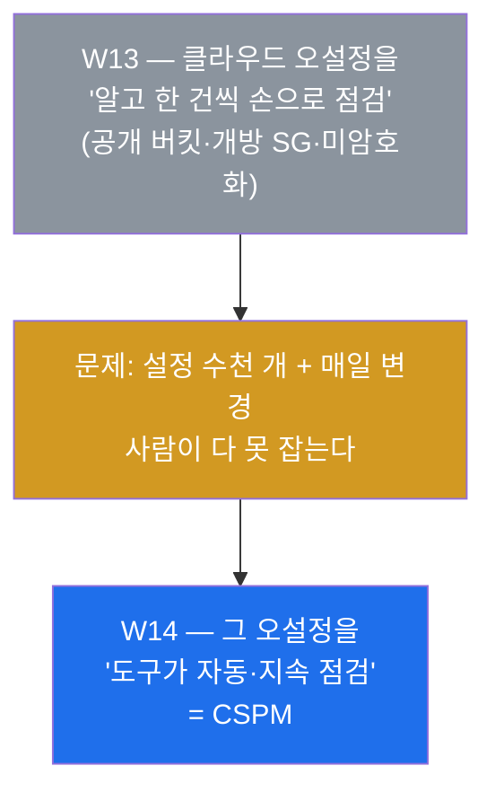
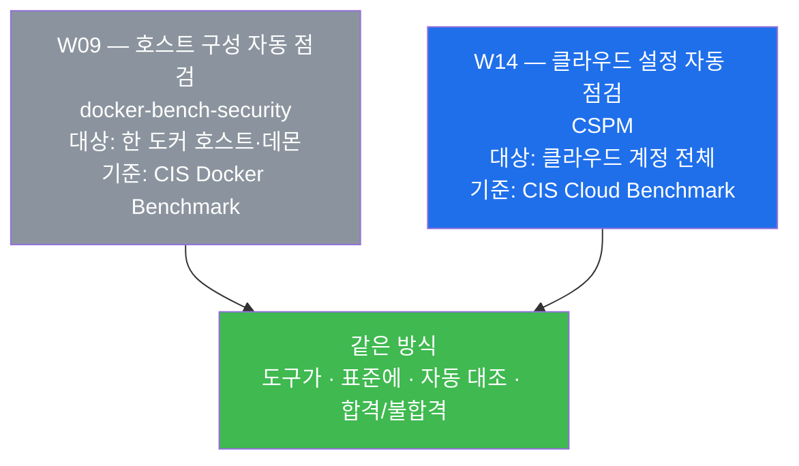
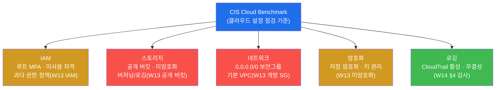
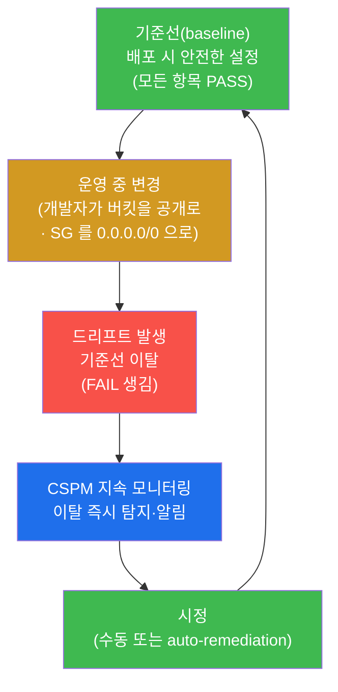
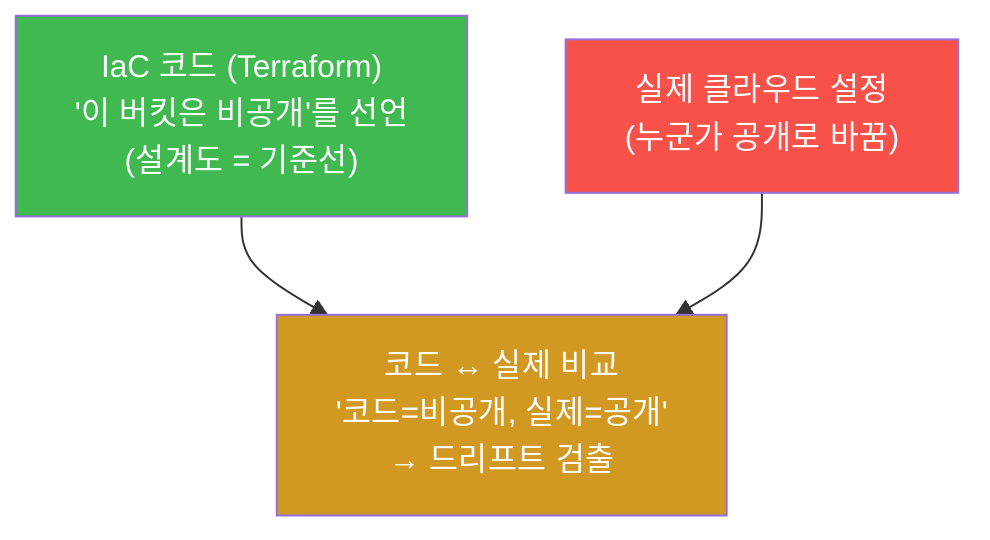
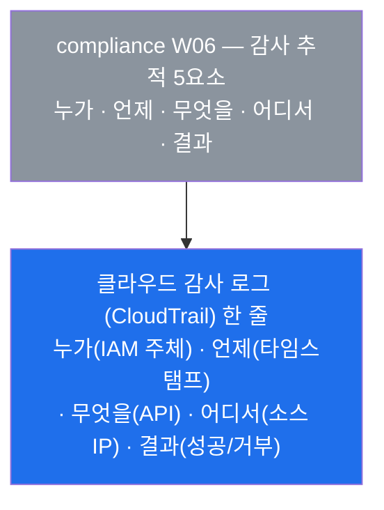
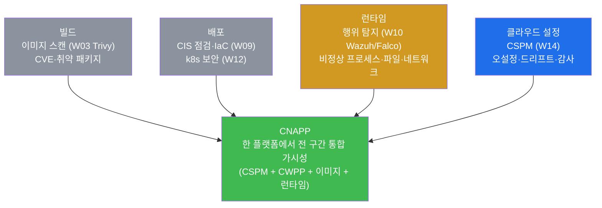
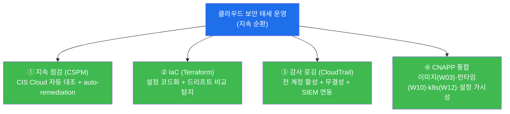
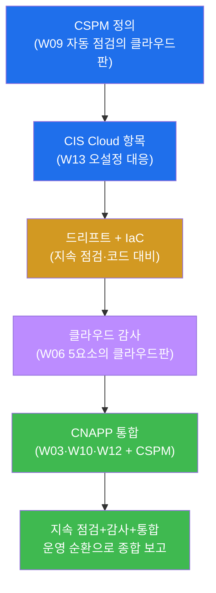
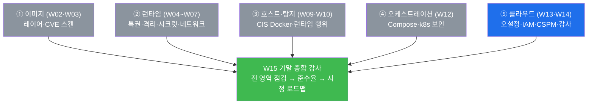

# 클라우드·컨테이너 W14 — 클라우드 보안 태세 관리 (CSPM·감사)

> **본 주차의 한 줄 요약**
>
> W13 에서 학생은 클라우드 보안의 토대(공유 책임·IAM 최소권한)와 함께, 가장 흔한 사고의 정체가
> 익스플로잇이 아니라 **오설정**(공개 스토리지 버킷 · 0.0.0.0/0 개방 보안그룹 · 미암호화 · 공개
> 스냅샷)임을 배웠다. 그런데 그 오설정을 한 번 손으로 찾았다고 끝이 아니다. 클라우드 계정에는 수천
> 개의 설정 항목이 있고, 그것들은 운영 중에도 끊임없이 바뀐다. 본 주차는 이 수많은 설정을 **사람이
> 아니라 도구가, 한 번이 아니라 지속적으로** 표준에 대조해 오설정을 찾아내는 체계 — **CSPM(Cloud
> Security Posture Management, 클라우드 보안 태세 관리)** 을 배운다. 핵심 통찰은 **"CSPM 은 W09 에서
> 배운 호스트 구성 자동 점검(CIS Docker Benchmark)을 클라우드 계정 전체로 확장한 것"** 이고, 그
> 점검의 근거가 되는 **클라우드 감사 로깅(CloudTrail 류)은 compliance W06 의 감사 추적을 클라우드
> API 호출에 적용한 것** 이라는 점이다. el34 는 온프레미스 컨테이너 환경이라 실제 클라우드 계정이
> 없으므로, 본 주차는 **개념 중심**으로 — CSPM 의 원리를 학생이 이미 손으로 익힌 W09(자동 점검)·
> W13(오설정)·W10(런타임 탐지)과 **대비**하며 — 정리한다.
>
> **점검자 한 줄 결론**: 클라우드 보안 태세 관리는 "한 번 점검해 안전하게 만드는 일"이 아니라,
> **자동(도구가) · 지속(상시) · 표준 대조(CIS Cloud Benchmark)** 의 세 축으로 오설정과 그 이후의
> **설정 드리프트**(기준선 이탈)를 끊임없이 찾아 시정하고, 그 모든 변경을 **감사 로깅**으로 추적해
> 빌드부터 런타임·클라우드 설정까지 한 플랫폼(**CNAPP**)에서 가시화하는 운영의 순환이다.

---

## 학습 목표

본 주차 종료 시 학생은 다음 6 가지를 **본인의 언어로 설명**할 수 있어야 한다. 본 주차는 el34 에 실제
클라우드 계정이 없는 개념 중심 주차이므로, 목표는 "손으로 명령을 친다"가 아니라 **"왜·무엇을·어떻게를
근거와 함께 정리한다"** 에 둔다.

1. **CSPM** 이 무엇인지(클라우드 계정 설정을 표준에 자동·지속 대조해 오설정을 찾는 체계)를 정의하고,
   그것이 **W09 의 호스트 구성 자동 점검(CIS Docker Benchmark)을 클라우드로 확장한 것** 이며 **W13 의
   오설정을 사람이 아니라 도구가 상시 찾아내는 것** 임을 설명한다.
2. CSPM 이 점검하는 **영역별 항목**(IAM · 스토리지 · 네트워크 · 암호화 · 로깅)을 **CIS Cloud
   Benchmark** 기준으로 나열하고, 각 항목이 W13 의 어떤 오설정에 대응하는지 짝지어 말한다.
3. **설정 드리프트(configuration drift)** 가 무엇인지(배포 시 안전했던 설정이 운영 중 기준선에서
   이탈하는 것)를 정의하고, 그것이 왜 **일회성 점검으로는 못 막고 지속 모니터링이 필요한가** 를
   W10(런타임 탐지)과 대비해 설명한다.
4. **클라우드 감사 로깅(AWS CloudTrail / GCP Audit Logs / Azure Activity Log)** 이 "누가 · 무엇을 ·
   언제 했나"의 클라우드판임을 설명하고, 그것이 **compliance W06 의 감사 5요소** 를 클라우드 API 호출에
   적용한 것이며 CSPM·침해 조사의 **근거 데이터** 가 됨을 밝힌다.
5. **IaC(Infrastructure as Code, Terraform)** 로 설정을 코드화하면 드리프트를 어떻게 예방·탐지하는지
   (코드 대비 비교)와, **auto-remediation(자동 시정)** 의 개념과 한계를 설명한다.
6. CSPM(클라우드 설정) · 이미지 스캔(W03) · 런타임 탐지(W10) · 쿠버네티스 보안(W12)을 하나로 묶는
   **CNAPP(Cloud-Native Application Protection Platform)** 통합의 의미를 설명하고, 점검(CSPM) →
   드리프트 탐지 → 감사 → 통합 가시성을 **CSPM 보고서** 한 장으로 종합한다.

> **점검자의 시선** — 본 주차는 새 도구를 손에 쥐는 주가 아니라, 지금까지 손으로 익힌 점검 방식을
> **클라우드 규모로 자동화·지속화하는 사고 틀** 을 세우는 주다. 채점은 "클라우드는 위험하다"가 아니라,
> **CSPM 의 세 축(자동·지속·표준 대조)을 W09·W13·W06 과 정확히 연결해 설명했는가, 드리프트·감사·통합의
> 의미를 근거와 함께 짚었는가** 를 본다. 핵심 산출물은 CSPM 의 역할(W09 의 클라우드판)·CIS Cloud 점검
> 항목·드리프트·클라우드 감사(W06 의 클라우드판)·CNAPP 통합을 한 흐름으로 자리매김한 CSPM 보고서다.

---

## 0. 용어 해설 (CSPM·클라우드 감사 입문)

본 주차에 처음 등장하거나 특히 중요한 용어를 먼저 정리한다. 한 줄 정의로는 부족한 핵심어(CSPM ·
설정 드리프트 · 클라우드 감사 로깅 · CNAPP · IaC)는 다음 절(0.5)에서 일상 비유로 다시 풀어 설명한다.
본문(§1~§6)에서 같은 용어가 다시 나올 때 막히면 이 표로 돌아오면 흐름이 끊기지 않는다.

| 용어 | 영문 | 뜻 | 비유 |
|------|------|----|------|
| **CSPM** | Cloud Security Posture Management | 클라우드 계정의 설정을 표준에 자동·지속 대조해 오설정을 찾아 시정하는 도구·체계 | 건물 전체를 매일 도는 자동 안전점검 시스템 |
| **보안 태세** | security posture | 한 시점에 시스템이 얼마나 안전하게 "설정"돼 있는가의 전반적 상태 | 오늘 현재 건물의 안전 등급 |
| **CIS Cloud Benchmark** | CIS Cloud Benchmark | CIS 가 펴낸 클라우드(AWS/GCP/Azure)별 보안 설정 권고 기준(체크리스트) | 클라우드용 안전 점검 표준 체크리스트 |
| **설정 드리프트** | configuration drift | 배포 시 안전했던 설정이 운영 중 변경되어 기준선에서 이탈한 상태 | 점검 후 누군가 비상문을 다시 열어 둔 것 |
| **기준선** | baseline | "이래야 안전하다"고 정해 둔 설정의 기준 상태 | 점검 합격 시의 표준 상태 |
| **클라우드 감사 로깅** | cloud audit logging | 클라우드 API 호출(누가·무엇을·언제·어디서)을 모두 기록하는 로그 | 건물의 모든 출입·조작을 찍는 CCTV·출입대장 |
| **CloudTrail** | AWS CloudTrail | AWS 의 클라우드 감사 로깅 서비스(API 호출 기록). GCP=Audit Logs, Azure=Activity Log | AWS 판 출입대장 |
| **IaC** | Infrastructure as Code | 인프라 설정을 코드(파일)로 선언해 배포·관리하는 방식 | 건물 설계도를 코드로 보관·재시공 |
| **Terraform** | Terraform | 대표적 IaC 도구(클라우드 설정을 코드로 선언·적용) | 설계도를 그대로 짓는 시공 로봇 |
| **auto-remediation** | auto-remediation | 오설정·드리프트를 탐지하면 사람을 거치지 않고 자동으로 안전 상태로 되돌리는 것 | 비상문이 열리면 자동으로 다시 닫히는 장치 |
| **CNAPP** | Cloud-Native Application Protection Platform | CSPM·워크로드 보호·이미지 스캔·런타임 탐지를 한 플랫폼으로 통합한 것 | 출입·화재·설비를 한 관제실에서 보는 통합 시스템 |
| **CWPP** | Cloud Workload Protection Platform | 실행 중인 워크로드(VM·컨테이너)를 보호하는 영역(CNAPP 의 한 축) | 입주자(워크로드) 개개인을 지키는 경비 |

---

## 0.5 신입생 친화 핵심 용어 개념 설명

위 표는 한 줄 정의에 그치므로, CSPM 을 처음 다루는 학생이 헷갈리기 쉬운 핵심 용어를 일상 비유로
다시 풀어 설명한다. 본 절을 먼저 읽어두면 본문에서 같은 용어가 다시 나올 때 흐름이 끊기지 않는다.

### 0.5.1 CSPM — 건물 전체를 매일 도는 자동 안전점검 시스템

W13 에서 학생은 "공개 버킷이 있으면 위험하다"는 것을 한 건 한 건 손으로 점검했다. 그런데 큰 회사의
클라우드 계정은 건물 한 채가 아니라 **수십 동의 거대한 단지** 와 같다. 그 안에는 스토리지 버킷이
수백 개, 보안그룹 규칙이 수천 줄, IAM 사용자·역할·정책이 수백 개 있고, 매일 개발자들이 새 자원을
만들고 설정을 바꾼다. 이 모든 문을 **사람이 매일 일일이 돌며** "이 문 잠겼나, 저 창문 열렸나"를
확인하는 것은 불가능하다. 한 명이 놓친 열린 창문 하나가 곧 데이터 유출이 된다.

**CSPM(Cloud Security Posture Management)** 은 바로 이 점검을 **자동화한 시스템** 이다. 사람 대신
도구가 클라우드 계정에 연결해, 모든 자원의 설정을 **표준 체크리스트(CIS Cloud Benchmark)** 에 대조해
"이 버킷은 공개됨(FAIL), 이 보안그룹은 0.0.0.0/0 개방(FAIL), 이 디스크는 암호화됨(PASS)" 식으로
**항목마다 합격/불합격을 자동으로 매긴다.** 그리고 한 번이 아니라 **상시(지속적으로)** 돌며 새로 생긴
위험한 설정을 즉시 알린다.

여기서 가장 중요한 연결고리는 이것이다 — **CSPM 은 새로운 발상이 아니라, 학생이 이미 W09 에서 손으로
익힌 것의 클라우드판** 이다. W09 에서 학생은 `docker-bench-security` 라는 도구가 **호스트·데몬 구성을
CIS Docker Benchmark 에 자동 대조** 해 PASS/WARN 을 매기는 것을 봤다. CSPM 은 그 대상을 "한 대의 도커
호스트"에서 "클라우드 계정 전체"로 넓히고, 기준을 "CIS Docker"에서 "CIS Cloud"로 바꾼 것일 뿐이다.
점검 방식(도구가 · 표준에 · 자동 대조해 · 합격/불합격)은 똑같다.

### 0.5.2 보안 태세(posture)와 설정 드리프트 — 점검 후 누군가 다시 연 비상문

**보안 태세(posture)** 라는 말은 "지금 이 순간, 이 시스템이 얼마나 안전하게 설정돼 있는가"의 전반적
상태를 뜻한다. 자세(posture)가 좋다·나쁘다처럼, 클라우드의 설정 상태가 표준에 비춰 얼마나 좋은가를
말하는 것이다. CSPM 의 P 가 바로 이 Posture 다 — **태세를 관리(Management)** 한다.

문제는 태세가 **고정돼 있지 않다** 는 데 있다. 오늘 점검해서 모든 문을 잠가 안전 등급 A 를 받았다고
하자. 그런데 내일 누군가 배포를 하면서 편의상 한 버킷을 공개로 바꾸고, 디버깅하느라 보안그룹을
0.0.0.0/0 으로 열어 둔다. 점검 직후의 안전한 상태(이것이 **기준선, baseline**)에서 슬그머니 벗어나는
이 현상이 **설정 드리프트(configuration drift)** 다. 비유하자면, 안전점검을 통과한 건물에서 누군가
화재 비상문을 **다시 열어 고임목을 받쳐 둔 것** 과 같다 — 점검표에는 "비상문 닫힘"으로 적혀 있지만
실제로는 열려 있다.

드리프트의 핵심 교훈은 이것이다 — **보안은 일회성 사건이 아니라 지속 상태** 다. 한 번 점검해 안전하게
만들어도, 변경이 일어나는 한 다시 위험해질 수 있다. 그래서 CSPM 은 한 번 스캔하고 끝내는 것이 아니라
**상시 모니터링** 으로 드리프트를 즉시 잡아낸다. 이 "한 번이 아니라 지속"이라는 성질은 학생이 W10 에서
배운 **런타임 위협 탐지** 와 정확히 같은 발상이다 — W10 의 정적 점검(W03~W09)이 "배포 전·시점의 점검"
이라면 런타임 탐지는 "실행 중 계속 지켜보는 것"이었듯, 드리프트 탐지는 "배포 후에도 설정을 계속
지켜보는 것"이다. 다만 W10 이 **행위(프로세스·파일·네트워크)** 를 지켜봤다면, CSPM 의 드리프트 탐지는
**설정(버킷·보안그룹·IAM)** 을 지켜본다는 점이 다르다.

### 0.5.3 클라우드 감사 로깅(CloudTrail) — 모든 조작을 찍는 CCTV·출입대장

CSPM 이 "지금 설정이 안전한가"를 본다면, **클라우드 감사 로깅** 은 "그 설정을 **누가 언제 어떻게
바꿨는가**"를 기록한다. 둘은 짝이다. 비유하면, CSPM 은 매일 도는 안전점검이고 감사 로깅은 건물의 모든
출입과 조작을 찍는 **CCTV 와 출입대장** 이다. 비상문이 열려 있는 것(드리프트)을 점검이 발견하면, 출입
대장(감사 로그)을 뒤져 "누가 몇 시에 이 문을 열었나"를 추적할 수 있다.

클라우드에서 모든 변경은 결국 **API 호출** 로 일어난다 — 버킷을 공개로 바꾸는 것도, 보안그룹을 여는
것도, 사용자에게 관리자 권한을 주는 것도 전부 API 호출이다. **클라우드 감사 로깅** 은 이 API 호출을
빠짐없이 기록한다. AWS 에서는 이 서비스를 **CloudTrail**, GCP 에서는 **Audit Logs**, Azure 에서는
**Activity Log** 라고 부른다(이름만 다를 뿐 역할은 같다).

여기서도 핵심 연결고리가 있다 — **클라우드 감사 로깅은 compliance 트랙 W06 에서 배운 "감사 추적(audit
trail)"을 클라우드 API 호출에 그대로 적용한 것** 이다. W06 에서 학생은 좋은 감사 기록이 갖춰야 할
**5요소 — 누가(주체) · 언제(시각) · 무엇을(행위) · 어디서(출처) · 결과** 를 배웠다. CloudTrail 의 한
줄은 정확히 그 5요소다 — 누가(어떤 IAM 주체가) · 언제(타임스탬프) · 무엇을(어떤 API 를) · 어디서(소스
IP) · 결과(성공/거부). 즉 W06 의 감사 원칙이 클라우드라는 새 무대에서 그대로 작동한다.

### 0.5.4 IaC(Terraform)와 auto-remediation — 설계도로 짓고, 어긋나면 자동으로 되돌리기

드리프트를 가장 근본적으로 막는 방법은 무엇일까? "사람이 콘솔에서 손으로 설정을 바꾸지 못하게 하고,
모든 설정을 **코드(설계도)로만** 관리하는 것"이다. 이것이 **IaC(Infrastructure as Code)** 다 — 인프라
설정을 사람이 매번 손으로 클릭하는 대신, **코드 파일에 선언해 두고 그 코드를 적용** 해 인프라를
만든다. 대표 도구가 **Terraform** 이다. 비유하면, 건물을 그때그때 임시로 고치는 게 아니라 **공식
설계도** 를 두고 그 설계도대로만 짓고 고치는 것이다.

IaC 가 드리프트를 막는 원리는 두 가지다. 첫째, **예방** — 설정이 코드에만 존재하므로 콘솔에서 임의로
바꾸는 길 자체를 줄인다. 둘째, **탐지** — 누군가 콘솔에서 몰래 바꿔도, 실제 설정을 **코드(설계도)와
비교** 하면 "코드에는 닫힘인데 실제는 열림"이라는 어긋남(=드리프트)이 즉시 드러난다.

**auto-remediation(자동 시정)** 은 한 발 더 나간다. CSPM 이 드리프트나 오설정을 탐지하면 사람의 손을
거치지 않고 **자동으로 안전 상태로 되돌린다** — 예를 들어 누군가 버킷을 공개로 바꾸면 CSPM 이 즉시
다시 비공개로 돌리는 식이다. 비유하면, 열린 비상문이 **자동으로 다시 닫히는 장치** 다. 다만 자동 시정은
강력한 만큼 위험도 있다 — 정상적인 변경까지 잘못 되돌리면 서비스가 깨질 수 있어, 보통 위험이 명백한
항목(공개 버킷 등)에 한해 신중히 적용한다(이 한계는 §3.4 에서 다시 다룬다).

### 0.5.5 CNAPP — 출입·화재·설비를 한 관제실에서 보는 통합 시스템

학생은 지금까지 컨테이너 보안을 여러 조각으로 배웠다 — 이미지 스캔(W03, Trivy 로 CVE), 런타임 행위
탐지(W10, Wazuh/Falco), 쿠버네티스 보안(W12), 그리고 본 주차의 클라우드 설정 점검(CSPM). 문제는 이
조각들이 **따로 놀면** 전체 그림이 안 보인다는 것이다 — 이미지 담당, 런타임 담당, 클라우드 담당이
각자 자기 화면만 보면, "이 한 취약점이 빌드부터 런타임·클라우드 설정까지 어떻게 이어지는가"를 아무도
못 본다.

**CNAPP(Cloud-Native Application Protection Platform)** 은 이 조각들을 **한 플랫폼(한 관제실)** 으로
모은 것이다. 비유하면, 출입 통제·화재 경보·전기 설비를 각각 다른 경비실에서 보던 것을 하나의 통합
관제실에서 한눈에 보는 것이다. CNAPP 안에서는 **CSPM(클라우드 설정) + CWPP(워크로드 보호) + 이미지
스캔(W03) + 런타임 탐지(W10)** 가 연결돼, **빌드 → 배포 → 런타임 → 클라우드 설정** 전 구간을 하나로
추적한다. 한 취약한 이미지가 어느 클러스터(W12)에 배포돼, 런타임에 무슨 행위(W10)를 하고, 어떤
클라우드 권한(W13 IAM)에 닿는지를 한 화면에서 잇는 것이 CNAPP 의 가치다.

---

이 다섯 개념(CSPM · 드리프트 · 클라우드 감사 · IaC/auto-remediation · CNAPP)이 본 주차 본문의
기반이다. 본문에서 다시 등장할 때 막히면 본 절로 돌아오면 흐름이 끊기지 않는다.

---

## 1. 왜 CSPM 을 배우는가 — 오설정은 사람이 다 못 잡는다

### 1.1 한 줄 답: 클라우드 설정은 너무 많고, 너무 자주 바뀐다

W13 에서 학생은 클라우드 사고의 다수가 익스플로잇이 아니라 **오설정**(공개 버킷 · 0.0.0.0/0 보안그룹 ·
미암호화 · 공개 스냅샷)임을 배웠다. 그렇다면 "오설정을 안 만들면 되지 않나"라고 생각할 수 있다.
문제는 규모다. 큰 조직의 클라우드 계정에는 **수천 개의 설정 항목** 이 있고, 매일 수많은 개발자가 새
자원을 만들고 설정을 바꾼다. 이 모든 것을 사람이 일일이, 그것도 빠짐없이 매일 점검하는 것은 불가능
하다. 한 명이 놓친 공개 버킷 하나가 곧 대량 유출이 된다.

그래서 W13 의 "오설정을 알자"에서 한 걸음 더 나아가, 본 주차는 **"그 오설정을 사람이 아니라 도구가,
한 번이 아니라 상시 찾아내자"** 를 다룬다. 그 도구·체계가 CSPM 이다.

W13 이 **무엇이 위험한가(오설정의 종류)** 를 가르쳤다면, W14 는 **그것을 어떻게 빠짐없이·상시 찾아
내는가(CSPM)** 를 가르친다. 둘은 같은 위험(오설정)을 다루되, 전자는 지식이고 후자는 그 지식을 규모에
맞게 자동화·지속화하는 운영 체계다.

### 1.2 CSPM 은 W09(호스트 자동 점검)의 클라우드 확장이다

본 주차의 가장 중요한 연결고리다(§0.5.1). 학생은 이미 **"도구가 표준에 자동 대조해 합격/불합격을
매기는"** 점검을 W09 에서 손으로 해 봤다. W09 의 `docker-bench-security` 는 **한 대의 도커 호스트·데몬
구성을 CIS Docker Benchmark 에 자동 대조** 해 항목별 PASS/WARN 을 냈다. CSPM 은 그 발상을 **클라우드
계정 전체** 로 확장한 것이다.

> **용어 — SCA(보안 구성 평가).** 본 주차 lab 과 일부 자료는 W09 의 이 점검을 **SCA(Security
> Configuration Assessment, 보안 구성 자동 평가)** 라고도 부른다. SCA 는 "시스템의 구성(설정)을
> 정해진 보안 기준선에 자동으로 대조해 준수/미준수를 평가"하는 일반 용어이며, W09 의 docker-bench
> (호스트 구성 평가)가 그 대표 예다. CSPM 은 바로 이 **SCA 를 클라우드 계정에 적용한 것** 이라고 보면
> 정확하다 — 대상만 호스트에서 클라우드로 넓어졌을 뿐, "구성을 기준에 자동 대조"라는 본질은 같다.

이 연결을 분명히 해 두면 CSPM 이 갑자기 튀어나온 낯선 개념이 아니라, **이미 익힌 점검 방식의 무대만
바뀐 것** 임을 알 수 있다. 채점에서도 "CSPM = 클라우드판 자동 구성 점검(W09 의 확장)"이라는 연결을
짚는 것을 본다.

### 1.3 한계 — CSPM 은 "설정"을 보지, "코드 취약점·실행 행위"를 대신하지 않는다

CSPM 이 강력하지만 만능은 아니다. CSPM 은 어디까지나 **클라우드 자원의 "설정"** 을 점검한다 — 버킷이
공개인가, 보안그룹이 열렸는가, 디스크가 암호화됐는가. 그러나 그것은 **애플리케이션 코드의 취약점**
(SQLi·RCE 등, web-vuln 트랙)이나 **이미지 안의 알려진 CVE**(W03 Trivy)나 **실행 중 컨테이너의 비정상
행위**(W10 런타임 탐지)를 대신 잡아 주지 못한다. 설정이 완벽해도 그 위에서 도는 앱에 취약점이 있으면
뚫린다. 그래서 CSPM 은 컨테이너·클라우드 보안의 **한 축(설정 태세)** 이며, 다른 축들(이미지 스캔·런타임
탐지·k8s 보안)과 **함께** 작동해야 전체 방어가 된다 — 이 "함께"를 한 플랫폼으로 묶은 것이 §5 의
CNAPP 다.

---

## 2. CSPM 의 점검 항목 — CIS Cloud Benchmark

### 2.1 한 줄 정의와 왜 중요한가

CSPM 이 "자동·지속 점검한다"고 할 때, **무엇을 어떤 기준으로** 점검하는가가 핵심이다. 그 기준이
**CIS Cloud Benchmark** 다 — CIS(Center for Internet Security)가 클라우드 제공자(AWS/GCP/Azure)별로
펴낸 **보안 설정 권고 기준(체크리스트)** 이다. CSPM 은 이 체크리스트의 각 항목을 클라우드 계정의 실제
설정과 대조해 PASS/FAIL 을 매긴다. 이것이 중요한 이유는, 점검에 **객관적 기준** 이 있어야 "위험해
보인다"는 주관이 아니라 "CIS 1.x 항목 위반"이라는 **표준 근거** 로 판정할 수 있기 때문이다(W09 에서
CIS Docker 항목 번호로 판정한 것과 같다 — 예: CIS Docker 3.15 docker.sock 권한).

> **용어 — CIS Benchmark.** CIS Benchmark 는 특정 기술(도커·리눅스·AWS 등)에 대해 보안 전문가
> 합의로 만든 **설정 권고 표준** 이다. 각 항목은 "무엇을 어떻게 설정해야 안전한가"를 번호와 함께
> 규정한다. 학생은 이미 W09 에서 **CIS Docker Benchmark**(호스트·데몬·이미지·런타임 항목)를 봤고,
> compliance 트랙에서 CIS 가 ISMS-P·ISO27001·PCI-DSS 와 함께 쓰이는 통제 기준임을 다뤘다. **CIS
> Cloud Benchmark** 는 그 클라우드판이다.

### 2.2 영역별 점검 항목 — W13 오설정과의 대응

CSPM 은 클라우드 설정을 영역별로 나눠 점검한다. 핵심은 **각 영역의 점검 항목이 W13 에서 배운 오설정과
그대로 대응** 한다는 것이다 — W13 이 "이런 게 위험하다"였다면, CSPM 은 "그 위험을 항목별로 자동
점검한다"이다.

- **IAM** — 루트 계정에 MFA 가 걸려 있는가, 오래 안 쓴 자격(키·사용자)이 방치돼 있지 않은가, 과다
  권한 정책(`Action:*` `Resource:*`)이 없는가. **W13 의 IAM 최소권한** 위반을 자동으로 찾는 항목이다.
- **스토리지** — 공개로 열린 버킷이 없는가, 저장 데이터가 암호화돼 있는가, 버저닝·접근 로깅이
  켜졌는가. **W13 최다 사고 유형인 공개 버킷** 을 자동으로 찾는 항목이다.
- **네트워크** — 보안그룹에 0.0.0.0/0(전체 개방) 규칙이 없는가, 위험한 기본 VPC·미사용 규칙이 없는가.
  **W13 의 개방 보안그룹** 을 자동으로 찾는 항목이다.
- **암호화** — 저장(at-rest) 데이터·디스크·스냅샷이 암호화돼 있는가, 키가 적절히 관리되는가. **W13 의
  미암호화 저장** 을 자동으로 찾는 항목이다.
- **로깅** — CloudTrail 등 감사 로깅이 전 리전·전 계정에 활성인가, 로그 무결성이 보호되는가(§4).
  점검 자체의 **근거 데이터** 가 갖춰졌는지를 점검하는, 다소 메타적인 항목이다.

각 항목은 W09 의 docker-bench 와 똑같이 **PASS/FAIL(또는 WARN) + 심각도(severity)** 로 결과를 낸다.
CSPM 의 산출물은 이 결과들의 목록 — "어느 자원이 어떤 CIS 항목을 위반했고 얼마나 위험한가"의 표다.
점검자는 이 표에서 **심각도 높은 FAIL** 부터 시정 우선순위를 잡는다(W09 에서 WARN 을 시정 목록으로
삼은 것과 같다).

### 2.3 한계 — 표준 항목이 조직의 모든 위험을 담지는 않는다

CIS Cloud Benchmark 는 좋은 출발점이지만, 그것이 모든 위험을 다 담는 것은 아니다. 표준은 **공통적·
일반적** 항목을 다루므로, 조직 고유의 위험(특정 데이터 등급, 산업 규제, 내부 정책)은 별도 룰로 보강
해야 한다. 또 CSPM 은 "설정이 기준을 따르는가"를 보지, 그 설정이 **실제 비즈니스 맥락에서 적절한가**
까지는 판단하지 못한다 — 예컨대 어떤 공개 버킷은 의도된 정적 웹사이트일 수도 있다(그래서 예외 처리·
맥락 검토가 필요하다). 따라서 CSPM 결과는 **자동 점검 + 사람의 맥락 검토** 를 함께 거쳐야 한다.

---

## 3. 설정 드리프트 — 한 번 안전했다고 계속 안전하지 않다

### 3.1 한 줄 정의와 왜 중요한가

**설정 드리프트(configuration drift)** 는 배포 시점에는 안전했던 설정이 운영 중에 변경되어 **기준선
(baseline)에서 이탈** 한 상태다(§0.5.2). 이것이 중요한 이유는, 보안 점검이 **한 시점의 사진** 이 아니라
**계속 흐르는 영상** 이어야 함을 말해 주기 때문이다 — 오늘 모든 항목이 PASS 여도, 내일 누군가의 변경
한 번으로 FAIL 이 생길 수 있다. 그래서 CSPM 의 P(Posture)는 "한 번 좋게 만드는 것"이 아니라 "좋은
상태를 **지속적으로 유지** 하도록 관리하는 것"이다.

### 3.2 드리프트는 왜 생기고 어떻게 탐지하나

드리프트의 원인은 대부분 악의가 아니라 **편의** 다 — 디버깅하려고 잠깐 보안그룹을 열고 닫는 걸 잊거나,
급한 배포에서 버킷 공개 설정을 무심코 켜는 식이다. 그래서 탐지의 핵심은 **상시 모니터링** 이다. CSPM 은
설정을 주기적(또는 변경 이벤트마다)으로 다시 점검해, 기준선과 달라진 부분을 즉시 잡아 알린다. 그림의
마지막 화살표가 다시 기준선으로 돌아가는 데 주목하자 — 드리프트 관리는 **탐지 → 시정 → 다시 기준선
유지** 가 도는 **순환(loop)** 이다.

### 3.3 드리프트의 예방·탐지 — IaC(Terraform)

드리프트를 사후 탐지만 하는 것을 넘어 **근본적으로 줄이는** 방법이 **IaC(Infrastructure as Code,
Terraform)** 다(§0.5.4). 설정을 코드(설계도)로 선언해 두면 두 가지 효과가 있다.

첫째, **예방** — 모든 설정이 코드에만 존재하고 콘솔에서 손으로 바꾸는 길을 막으면, 임의 변경(드리프트의
원인)이 애초에 줄어든다. 둘째, **탐지** — Terraform 같은 도구는 **코드(선언된 기준선)와 실제 설정을
비교** 해, 둘이 어긋나면 "코드에는 비공개인데 실제는 공개"라는 드리프트를 즉시 드러낸다. 즉 IaC 는
드리프트 탐지의 **기준선을 코드로 못 박는** 역할을 한다.

> **용어 — IaC / Terraform.** IaC(Infrastructure as Code)는 서버·네트워크·스토리지 같은 인프라를
> 사람이 콘솔에서 클릭하는 대신 **코드 파일로 선언** 해 만들고 관리하는 방식이다. **Terraform** 은
> 그 대표 도구로, 원하는 인프라 상태를 코드(.tf 파일)로 적으면 그대로 클라우드에 적용하고, 실제 상태가
> 코드와 다르면 그 차이(drift)를 알려 준다. 본 주차는 el34 에 클라우드가 없어 개념으로만 다루지만,
> "설정을 코드로 못 박아 드리프트를 비교 탐지한다"는 원리를 이해하는 것이 핵심이다.

### 3.4 auto-remediation 과 그 한계

탐지를 넘어 **자동 시정(auto-remediation)** 까지 가면, CSPM 이 드리프트·오설정을 발견하는 즉시 사람을
거치지 않고 **자동으로 안전 상태로 되돌린다**(§0.5.4) — 누가 버킷을 공개로 바꾸면 CSPM 이 곧장 다시
비공개로 돌리는 식이다. 이는 가장 위험한 오설정에 대한 **즉각 대응** 으로 강력하다.

다만 한계가 분명하다. 자동 시정은 "이 설정은 무조건 이래야 한다"는 확신이 있을 때만 안전하다 — 잘못
적용하면 **정상적인 변경까지 되돌려 서비스를 깨뜨릴** 수 있다(예: 일부러 공개로 둔 정적 웹 버킷을
자동으로 닫아 버림). 그래서 실무에서는 (a) 위험이 명백한 소수 항목에만 자동 시정을 걸고, (b) 나머지는
**알림 → 사람 검토 → 수동 시정** 으로 처리하며, (c) 자동 시정 동작 자체도 감사 로그(§4)에 남겨
추적한다. 자동화의 편의와 오작동 위험 사이의 균형이 핵심이다.

### 3.5 한계 — 드리프트 탐지는 변경관리와 함께 가야 한다

드리프트를 기술로 탐지·시정해도, 애초에 **변경이 통제되지 않으면** 드리프트는 끝없이 생긴다. 그래서
드리프트 관리는 compliance 트랙의 **변경관리(change management)** 와 짝을 이룬다 — 모든 설정 변경이
승인·기록·검토되는 절차가 있어야, CSPM 이 잡은 드리프트가 "승인된 변경인지, 무단 변경인지"를 가릴 수
있다. 즉 CSPM 의 드리프트 탐지는 **변경관리의 클라우드 자동화 버전** 이며, 둘이 함께 돌 때 비로소
"좋은 태세를 지속 유지"가 가능해진다.

---

## 4. 클라우드 감사 로깅 — "누가 무엇을 언제 했나"의 클라우드판

### 4.1 한 줄 정의와 왜 중요한가

**클라우드 감사 로깅(cloud audit logging)** 은 클라우드에서 일어나는 **모든 API 호출** — 자원 생성·
설정 변경·권한 부여 등 — 을 **누가·무엇을·언제·어디서·결과** 와 함께 기록하는 것이다(§0.5.3). 이것이
중요한 이유는 두 가지다. 첫째, **침해·드리프트 조사의 근거** — "이 버킷이 언제 누구에 의해 공개로
바뀌었나"는 감사 로그에만 답이 있다. 둘째, **CSPM 의 데이터 원천** — CSPM 이 변경을 탐지하고 추적하는
근거가 바로 이 로그다. 점검(CSPM)이 "지금 무엇이 잘못됐나"라면, 감사 로깅은 "그것이 어떻게 그렇게
됐나"를 답한다.

### 4.2 compliance W06 감사 5요소의 클라우드 적용

본 주차의 또 하나의 핵심 연결고리다(§0.5.3). compliance 트랙 **W06** 에서 학생은 좋은 감사 추적의
**5요소** 를 배웠다. 클라우드 감사 로그(CloudTrail)의 한 줄은 정확히 그 5요소를 담는다.

- **누가** — 어떤 IAM 주체(사용자·역할·서비스)가 호출했나.
- **언제** — 호출 시각(타임스탬프).
- **무엇을** — 어떤 API 작업을 했나(예: 버킷 정책 변경).
- **어디서** — 소스 IP·요청 출처.
- **결과** — 성공했나, 권한 부족으로 거부됐나.

즉 W06 의 감사 원칙은 새 무대(클라우드)에서 그대로 작동한다. 다른 점은 **대상** 뿐이다 — W06 이
시스템·애플리케이션의 행위를 기록했다면, 클라우드 감사 로깅은 **클라우드 제어 평면(control plane)의
API 호출** 을 기록한다. AWS=CloudTrail, GCP=Audit Logs, Azure=Activity Log 로 이름만 다르고 역할은
같다.

### 4.3 클라우드 감사 로깅의 요건

감사 로그가 제 역할을 하려면 단지 "켜 두는" 것으로 부족하다. W06 에서 배운 감사 로그의 요건이 여기에도
그대로 적용된다.

- **완전성** — 전 리전·전 계정에 활성화해야 한다. 한 리전만 켜 두면 다른 리전의 활동은 사각지대가 된다
  (이것도 CIS Cloud 로깅 항목, §2.2 의 점검 대상이다).
- **무결성** — 로그 자체가 변조·삭제되지 않도록 보호해야 한다. 공격자가 침입 후 자기 흔적을 지우는
  것을 막아야, 로그가 조사에 쓸모 있다(W06 의 "감사 로그 무결성"과 같은 원칙).
- **보존** — 침해는 몇 달 뒤에 발견되는 경우가 많으므로, 장기 보존이 필요하다.
- **연동** — 로그를 SIEM 으로 보내 상관 분석·이상 탐지에 쓴다. 학생이 W10 에서 본 Wazuh 같은 SIEM 이
  컨테이너·호스트 로그를 모았듯, 클라우드 감사 로그도 SIEM 으로 모아 통합 분석한다.

### 4.4 한계 — 로그는 "기록"이지 "탐지·차단"이 아니다

감사 로그는 어디까지나 **사후 기록** 이다. 로그가 있다고 해서 그 자체로 위험한 변경을 **막거나 실시간
경보** 하는 것은 아니다 — 로그를 누군가(또는 SIEM·CSPM 규칙)가 분석해야 비로소 의미가 생긴다. 또
로그가 너무 많으면 정작 중요한 신호가 묻힌다(W10 에서 본 탐지 피로와 같은 문제). 그래서 감사 로깅은
**CSPM(이상 설정 탐지)·SIEM(상관 분석)·알림 규칙** 과 함께 쓰여야 "기록"을 넘어 "탐지·대응"이 된다.
감사 로깅은 그 모든 분석의 **신뢰할 수 있는 원천 데이터** 를 대는 역할이다.

---

## 5. CNAPP 통합 — 빌드부터 런타임·클라우드 설정까지 한 화면에

### 5.1 한 줄 정의와 왜 중요한가

성숙한 클라우드·컨테이너 운영은 지금까지 배운 보안 조각들을 **따로 운영하지 않고 한 플랫폼으로 통합**
한다. 그 통합 플랫폼이 **CNAPP(Cloud-Native Application Protection Platform)** 다(§0.5.5). 이것이
중요한 이유는, 보안 조각들이 따로 놀면 **한 위협이 여러 계층에 걸쳐 어떻게 이어지는가** 를 아무도 못
보기 때문이다 — 통합해야 "이 취약한 이미지 → 이 클러스터에 배포 → 이 런타임 행위 → 이 클라우드 권한"의
연결이 보인다.

### 5.2 CNAPP 가 통합하는 것 — 빌드~배포~런타임~클라우드

CNAPP 는 학생이 한 학기 동안 배운 영역들을 한 줄로 꿴다.

- **빌드 단계 — 이미지 스캔(W03)**: Trivy 로 이미지의 CVE·취약 패키지를 찾는다.
- **배포 단계 — CIS 점검·IaC(W09)·k8s 보안(W12)**: 호스트·데몬 구성과 쿠버네티스 Pod 보안을 기준에
  대조한다.
- **런타임 단계 — 행위 탐지(W10)**: 실행 중 컨테이너의 비정상 행위(예상 밖 프로세스·파일 변경·아웃
  바운드)를 Wazuh/Falco 로 탐지한다.
- **클라우드 설정 — CSPM(W14)**: 그 모든 것이 올라간 클라우드 계정의 설정 오류·드리프트를 점검하고
  감사 로깅으로 추적한다.

> **용어 — CWPP.** CNAPP 안에서 CSPM 의 짝이 **CWPP(Cloud Workload Protection Platform)** 다. CSPM 이
> **설정(태세)** 을 본다면, CWPP 는 **실행 중인 워크로드(VM·컨테이너) 자체** 를 보호한다 — 학생이
> W10 에서 본 런타임 행위 탐지가 바로 CWPP 의 한 축이다. CNAPP 는 "설정을 보는 CSPM"과 "워크로드를
> 보는 CWPP"를 한데 묶어 설정과 실행을 동시에 가시화한다.

CNAPP 의 가치는 **연결** 이다. 분절된 도구로는 "이미지에 CVE 가 있다", "런타임에 이상 행위가 있다",
"클라우드에 공개 버킷이 있다"가 각각 따로 떴지만, CNAPP 는 이를 **한 위협의 여러 단면** 으로 잇는다 —
한 취약한 이미지가 어디에 배포돼, 무슨 행위를 하고, 어떤 클라우드 권한에 닿는지를 한 화면에서 추적해
**우선순위(가장 위험한 연결)** 를 가려낸다.

### 5.3 한계 — 통합 도구가 각 영역의 깊이를 다 대체하지는 않는다

CNAPP 는 가시성을 통합하지만, 그것이 각 영역 전문 점검의 깊이를 완전히 대체하는 것은 아니다. 통합
플랫폼은 넓게 보는 대신 특정 영역에서는 전용 도구만큼 깊지 않을 수 있고, 도입·운영 비용도 크다.
또 통합했다고 자동으로 안전해지는 것이 아니라, **각 축(이미지·런타임·설정)의 점검이 제대로 켜지고
튜닝돼 있어야** 통합 화면이 의미를 갖는다. 즉 CNAPP 는 지금까지 배운 개별 통제들을 **잇는** 것이지,
그것들을 **건너뛰는** 것이 아니다.

---

## 6. CSPM·클라우드 보안 운영 — 지속 점검 + 자동 시정 + 감사의 순환

### 6.1 한 줄 정의와 왜 중요한가

본 주차의 모든 개념을 운영 관점에서 묶으면, 클라우드 보안 태세 관리는 하나의 **순환(loop)** 이다 —
**지속 점검(CSPM) → 드리프트 탐지(IaC 대비) → 시정(수동/자동) → 감사 추적 → 다시 점검.** 왜 중요한가
— §3 에서 본 대로 설정은 계속 바뀌므로, 보안은 "한 번 만드는 것"이 아니라 "**계속 도는 순환으로
유지하는 것**"이기 때문이다. 이는 학생이 secuops/소크 트랙에서 본 **탐지→대응→복구의 순환** 과 같은
구조이며, 그것을 클라우드 설정에 적용한 것이다.

### 6.2 운영의 네 기둥

- **① 지속 점검(CSPM)** — CIS Cloud Benchmark 에 설정을 **자동·지속** 대조하고, 위험이 명백한 항목은
  **auto-remediation** 으로 즉시 시정한다(§2·§3.4).
- **② IaC(Terraform)** — 설정을 코드로 못 박아 임의 변경을 줄이고, 코드 대비 비교로 드리프트를
  탐지한다(§3.3).
- **③ 감사 로깅(CloudTrail)** — 모든 API 호출을 전 계정에 기록하고, 무결성을 지키며 SIEM 으로 보내
  상관 분석한다(§4).
- **④ CNAPP 통합** — 이미지(W03)·런타임(W10)·k8s(W12)·클라우드 설정(CSPM)을 한 플랫폼으로 묶어 빌드
  부터 런타임·클라우드까지 통합 가시성을 확보한다(§5).

핵심은 이 넷이 **따로가 아니라 한 순환으로** 돈다는 것이다 — CSPM 이 드리프트를 탐지하면(①) IaC 코드와
비교해 원인을 가리고(②) 감사 로그로 누가 바꿨는지 추적하며(③) 이 모든 것을 CNAPP 한 화면에서 본다(④).
**클라우드 설정도 결국 "지속 점검 + 자동 시정 + 감사"의 순환으로 관리** 한다는 것이 본 주차의 결론이다.

### 6.3 한계 — 도구는 운영과 문화가 받쳐야 작동한다

CSPM·IaC·감사·CNAPP 라는 도구를 다 갖춰도, 그것을 **운영하는 절차와 문화** 가 없으면 무력하다. CSPM 이
매일 수백 개 FAIL 을 떠도 아무도 시정하지 않으면 경보 피로만 쌓이고, IaC 를 도입해도 개발자가 콘솔에서
몰래 바꾸면 드리프트는 계속 생긴다. 그래서 클라우드 보안 태세 관리는 **기술(CSPM 등) + 절차(변경관리·
시정 SLA) + 책임(누가 무엇을 본다)** 이 함께 가야 한다 — 이는 compliance 트랙이 강조한 "통제는 도구가
아니라 운영"이라는 원칙의 클라우드판이다.

---

## 7. 핵심 정리 (1줄씩)

1. **CSPM = 클라우드 설정 자동·지속 점검** — 클라우드 계정의 수많은 설정을 표준(CIS Cloud Benchmark)에
   자동·상시 대조해 오설정을 찾는 체계. **W09 의 호스트 자동 점검(SCA)을 클라우드로 확장** 한 것.
2. **점검 항목 = IAM·스토리지·네트워크·암호화·로깅** — 각 항목이 W13 의 오설정(과다 권한·공개 버킷·
   개방 SG·미암호화)과 그대로 대응. 결과는 PASS/FAIL + 심각도.
3. **설정 드리프트 = 기준선 이탈** — 배포 후 변경으로 안전했던 설정이 어긋남. 일회성 점검으로 못 잡고
   **지속 모니터링** 이 필요(W10 런타임 탐지의 설정판). IaC(Terraform)로 코드 대비 비교 탐지.
4. **클라우드 감사 로깅(CloudTrail) = W06 감사 5요소의 클라우드판** — 누가·언제·무엇을·어디서·결과를
   API 호출 단위로 기록. CSPM·침해 조사의 근거 데이터. 전 계정 활성·무결성·SIEM 연동이 요건.
5. **auto-remediation** — 명백한 오설정은 자동 시정으로 즉시 되돌림. 단, 정상 변경 오작동 위험 때문에
   위험 명백한 항목에만 신중히 적용.
6. **CNAPP 통합** — CSPM(설정)+CWPP(워크로드)+이미지 스캔(W03)+런타임 탐지(W10)+k8s(W12)를 한 플랫폼
   으로. 빌드~배포~런타임~클라우드를 한 화면에서 잇는다. 운영은 **지속 점검+자동 시정+감사의 순환.**

---

## 8. 실습 안내 — lab 7 미션 (개념 정리 중심)

본 주차 lab(`lab_week14.yaml`)은 **7 미션** 으로 구성되며, lab 의 `order` 와 1:1 로 대응한다. el34 에
실제 클라우드 계정이 없으므로, 미션의 실행 명령은 클라우드 자원을 직접 조작하는 것이 아니라 **각 개념을
`echo` 로 정리해 보안 사실을 본인의 언어로 진술** 하는 형태다(survey/analysis/report 유형). 즉 본 주차의
"실습"은 손으로 자원을 만지는 것이 아니라 **개념을 정확히·근거와 함께 정리** 하는 것이며, 채점도 그
정리의 정확성을 본다. 미션은 CSPM 도입 → 점검 항목(CIS Cloud) → 드리프트 → 클라우드 감사 → CNAPP
통합 → 방어 종합 → 보고서의 순서로 흐른다. 각 미션을 **4 축** 으로 설명한다 — 왜 하는가 / 무엇을 알 수
있는가 / 결과 해석(정상 vs 부족) / 실전 활용.

> **실습 진행 원칙.** 모든 미션의 명령은 el34 호스트(`ssh ccc@192.168.0.151`, 비밀번호 1)의 셸에서
> `echo`/`cat` 으로 실행하며, **클라우드 자원을 만들거나 바꾸지 않는다**(el34 는 온프레미스, 개념
> 정리 중심). 각 미션은 출력에 정해진 **확인 토큰**(예: `cspm_defined`, `CIS Cloud`, `드리프트`,
> `CloudTrail`, `CNAPP`, `CSPM`)이 나오면 통과한다 — 이 토큰은 해당 개념을 정리했음을 나타내는
> 표식이다. 합격 임계값은 0.7 이다.

### 미션 1 — CSPM 도입 (10점)

> **왜 하는가?** 본 주차의 출발점은 "CSPM 이 무엇인가"를 명확히 정의하는 것이다. W13 에서 손으로 찾은
> 오설정을, 사람이 아니라 **도구가 자동·지속** 찾아내는 체계가 CSPM 임을 세운다(§1).
>
> **무엇을 알 수 있는가?** CSPM 의 정의(클라우드 계정 설정을 표준 CIS 에 자동·지속 대조)와, 그것이
> **W09 의 호스트 구성 자동 점검(SCA)의 클라우드 버전** 이라는 핵심 연결. 출력 토큰 `cspm_defined`.
>
> **결과 해석.** 정상: 출력에 CSPM 정의와 `cspm_defined` 가 나옴(정의 성공). 부족: "자동 점검" 또는
> W09/W13 연결이 빠지면 §0.5.1·§1.2 를 다시 읽는다.
>
> **실전 활용.** 클라우드 보안 도구를 검토할 때 "CSPM = 설정 자동 점검"이라는 범주를 잡는 기준. 무엇이
> CSPM 의 일이고 무엇이 아닌지(코드 취약점·런타임은 별도, §1.3)를 가르는 출발점이다.

### 미션 2 — CSPM 점검 항목 (CIS Cloud) (12점)

> **왜 하는가?** CSPM 이 "자동 점검한다"면 **무엇을 어떤 기준으로** 점검하는지를 알아야 한다. 영역별
> 점검 항목과 그 기준(CIS Cloud Benchmark)을 정리한다(§2).
>
> **무엇을 알 수 있는가?** IAM·스토리지·네트워크·암호화·로깅의 영역별 점검 항목과, 각 항목이 W13 의
> 오설정(과다 권한·공개 버킷·개방 SG·미암호화)과 어떻게 대응하는지. 결과는 PASS/FAIL + 심각도(W09 와
> 같은 구조). 출력 토큰 `CIS Cloud`.
>
> **결과 해석.** 정상: 영역별 항목과 `CIS Cloud` 가 나옴(항목 정리 성공). 부족: 영역 구분이나 W13
> 오설정 대응이 빠지면 §2.2 를 다시 확인한다.
>
> **실전 활용.** CSPM 리포트를 읽는 사고 틀. "이 FAIL 이 어느 영역(IAM/스토리지/…)의 어떤 CIS 항목
> 위반인가"를 영역별로 분류해 시정 우선순위를 잡는 기준이 된다.

### 미션 3 — 설정 드리프트 (12점)

> **왜 하는가?** 한 번 점검해 PASS 여도 운영 중 변경으로 다시 FAIL 이 생긴다. 이 **드리프트** 개념을
> 세워야 "왜 CSPM 이 일회성이 아니라 지속이어야 하는가"가 이해된다(§3).
>
> **무엇을 알 수 있는가?** 드리프트의 정의(기준선 이탈)와 탐지(CSPM 지속 모니터링)·예방(IaC Terraform
> 코드 대비 비교)·자동 시정(auto-remediation). 그리고 그것이 W10 런타임 탐지의 "설정판"이자 변경관리의
> 클라우드 자동화임을. 출력 토큰 `드리프트`.
>
> **결과 해석.** 정상: 드리프트 정의·지속 점검과 `드리프트` 가 나옴(개념 정리 성공). 부족: "지속 점검"
> 이나 IaC 대비 비교가 빠지면 §0.5.2·§3 을 다시 읽는다.
>
> **실전 활용.** 클라우드 운영에서 "안전 상태를 유지"하는 사고 틀. 점검은 사진이 아니라 영상이어야
> 한다는 원칙, 그리고 IaC 로 기준선을 못 박는 실무의 근거가 된다.

### 미션 4 — 클라우드 감사 로깅 (12점)

> **왜 하는가?** 드리프트·침해를 조사하려면 "누가 언제 바꿨나"를 알아야 한다. 그 근거가 되는 클라우드
> 감사 로깅을 정리한다(§4).
>
> **무엇을 알 수 있는가?** CloudTrail(AWS)/Audit Logs(GCP)/Activity Log(Azure)가 모든 API 호출을
> 기록한다는 것, 그것이 **compliance W06 감사 5요소(누가·언제·무엇을·어디서·결과)의 클라우드 적용**
> 이라는 것, 그리고 요건(전 계정 활성·무결성·보존·SIEM 연동). 출력 토큰 `CloudTrail`.
>
> **결과 해석.** 정상: 감사 5요소·요건과 `CloudTrail` 이 나옴(개념 정리 성공). 부족: W06 5요소 연결이나
> SIEM 연동이 빠지면 §4.2·§4.3 을 다시 확인한다.
>
> **실전 활용.** 클라우드 침해 조사·규제 대응의 토대. "이 변경을 누가 했나"에 답하려면 감사 로깅이
> 켜져 있어야 함을, 그리고 그 로그가 CSPM·SIEM 의 원천 데이터임을 이해하는 근거가 된다.

### 미션 5 — 컨테이너+클라우드 통합 (CNAPP) (12점)

> **왜 하는가?** CSPM(설정)은 컨테이너 보안의 한 축일 뿐이다. 이미지(W03)·런타임(W10)·k8s(W12)와
> 어떻게 **한 플랫폼으로 통합** 되는지를 보아야 전체 그림이 닫힌다(§5).
>
> **무엇을 알 수 있는가?** CNAPP 가 CSPM+CWPP(워크로드)+이미지 스캔+런타임 탐지를 통합한다는 것, 그리고
> 빌드(W03)→배포(W09·W12)→런타임(W10)→클라우드 설정(CSPM) 전 구간을 한 화면에서 잇는다는 것. 출력
> 토큰 `CNAPP`.
>
> **결과 해석.** 정상: CNAPP 통합 범위와 `CNAPP` 가 나옴(개념 정리 성공). 부족: 빌드~런타임~클라우드의
> 전 구간 연결이 빠지면 §0.5.5·§5.2 를 다시 읽는다.
>
> **실전 활용.** 보안 도구 스택을 설계하는 사고 틀. 분절된 도구들을 한 위협의 단면으로 잇는 통합
> 가시성의 가치를, 그리고 그것이 각 영역 점검을 대체가 아니라 연결하는 것임을 이해하는 근거가 된다.

### 미션 6 — 방어 종합 (12점)

> **왜 하는가?** 개념을 다 봤으면(미션 1~5) 그것을 **운영의 한 순환** 으로 묶어야 학습이 의미를 갖는다.
> CSPM 지속 점검·IaC 드리프트·감사·CNAPP 통합을 하나로 정리한다(§6).
>
> **무엇을 알 수 있는가?** 클라우드 보안 태세 운영의 네 기둥 — ① CSPM 지속 점검(+auto-remediation)
> ② IaC(Terraform) 코드화·드리프트 ③ CloudTrail 감사·SIEM ④ CNAPP 통합 — 과 그것이 "지속 점검+자동
> 시정+감사"의 순환으로 돈다는 것. 출력 토큰 `CSPM`.
>
> **결과 해석.** 정상: 네 기둥과 `CSPM` 이 나옴(방어 정리 성공). 부족: "지속 점검/통합" 같은 순환의
> 핵심이 빠지면 §6.2 를 다시 확인한다.
>
> **실전 활용.** 클라우드 보안 운영 표준(baseline)의 골격. 새 클라우드 환경을 맡았을 때 무엇부터
> 갖춰야 하는지(점검·코드화·감사·통합)의 체크리스트가 된다.

### 미션 7 — CSPM 보고서 (14점)

> **왜 하는가?** 점검의 산출물은 보고서다. 미션 1~6 을 CSPM 역할 → 드리프트·감사 → CNAPP 통합의 한
> 흐름으로 종합해야 본 주차 학습이 완성된다(§7).
>
> **무엇을 알 수 있는가?** 전 미션을 한 문서로 묶는 법 — CSPM(W09 의 클라우드판)·CIS Cloud 항목 +
> 드리프트·클라우드 감사(W06 의 클라우드판) + CNAPP 통합(W03·W10·W12)을, 지속 점검·감사·자동 시정의
> 결론으로 정리하는 보고 구조. 출력 토큰 `CSPM`.
>
> **결과 해석.** 정상: 보고서에 CSPM·감사·통합이 모두 담기고 `CSPM` 이 나옴(종합 성공). 부족: 감사
> (CloudTrail)나 통합(CNAPP)이 빠지면 보고서 양식(미션 7 instruction)을 다시 채운다.
>
> **실전 활용.** 클라우드 보안 태세 보고서의 표준 구조(CSPM 역할 → 드리프트/감사 → 통합 → 결론).
> 경영진·심사에 "우리 클라우드 설정을 어떻게 지속 점검·감사·통합 관리하는가"를 보이는 산출물이며,
> W15 기말 종합 감사로 이어진다.

---

## 9. 실습 수칙 — 개념 정리도 증적 중심으로

본 주차는 손으로 클라우드 자원을 만지지 않는 개념 중심 주차이지만, 정리의 **정확성과 근거** 는 손
실습 못지않게 중요하다. 다음 수칙을 지킨다.

- **el34 사실을 지어내지 않는다.** el34 는 온프레미스 컨테이너 환경이므로 실제 클라우드 계정·CloudTrail
  로그가 없다. 본 주차는 **CSPM 의 원리** 를 정리하는 것이며, "el34 의 어떤 버킷이 공개다" 같은 존재
  하지 않는 클라우드 사실을 만들어 내지 않는다.
- **연결을 근거로 댄다.** "CSPM 은 좋다"가 아니라 **무엇이(자동·지속·표준 대조) 왜 W09(자동 점검)·
  W13(오설정)·W06(감사)과 이어지는가** 를 짚는다. 본 주차 채점의 핵심은 이 연결의 정확성이다.
- **개념을 문장으로 정리한다.** 미션의 `echo` 출력은 단어 나열이 아니라, 각 개념(CSPM·드리프트·감사·
  CNAPP)을 "정의 → 왜 중요 → 무엇과 연결"의 짧은 문장으로 진술한다.

---

## 10. 다음 주차 (W15) 예고 — 기말: 컨테이너 보안 종합 감사

본 주차(W14)로 학생은 컨테이너 보안의 마지막 층 — **그 컨테이너가 올라간 클라우드 계정의 설정 태세**
(CSPM) — 까지 한 바퀴를 돌았다. 한 학기를 통틀어 학생은 **이미지(W02·W03) → 런타임(W04·W05·W06·W07) →
호스트·데몬 구성(W09) → 런타임 탐지(W10) → 오케스트레이션(W12) → 클라우드 기초·오설정(W13) → 클라우드
태세(W14)** 의 전 영역을 손과 개념으로 익혔다. **W15** 는 이 W01~W14 의 모든 점검을 하나로 묶어, el34
컨테이너(주로 `el34-web`)를 **전 영역으로 종합 감사** 해 준수율·갭·시정 로드맵을 산출하는 **기말 종합
감사** 다.

W15 에서는 지금까지 본인 손으로 익힌 점검들 — 이미지 CVE(W03) · 런타임 특권/시크릿(W04·W06) · 네트워크
분리(W07) · CIS Docker 구성(W09) · 런타임 탐지(W10) — 과, 본 주차에서 개념으로 익힌 **클라우드 태세
(CSPM·드리프트·감사)** 를 한 감사 보고서로 종합한다. 본 주차의 핵심 사고 틀 — **"보안은 한 번이 아니라
지속 점검 + 감사 + 통합의 순환"** — 은 W15 의 종합 감사에서 "이 컨테이너 환경이 빌드부터 런타임·클라우드
설정까지 기준에 비춰 어디가 준수이고 어디가 갭인가, 무엇부터 시정할 것인가"를 판정하는 관점으로 그대로
이어진다.
