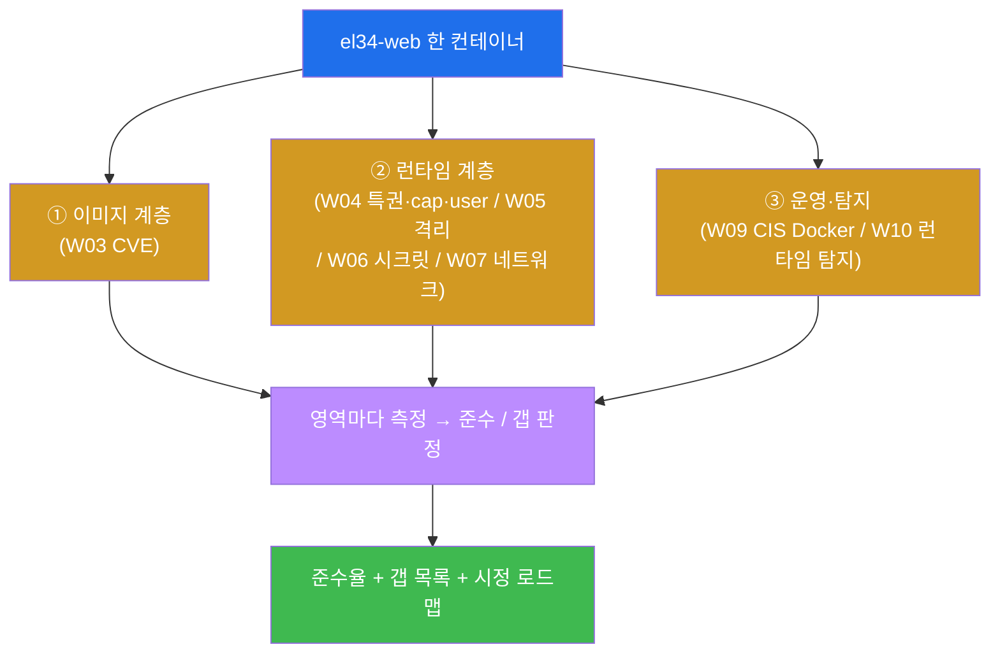
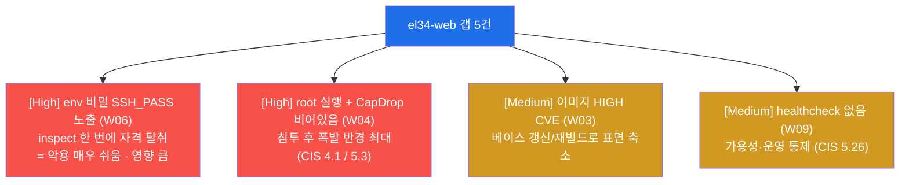
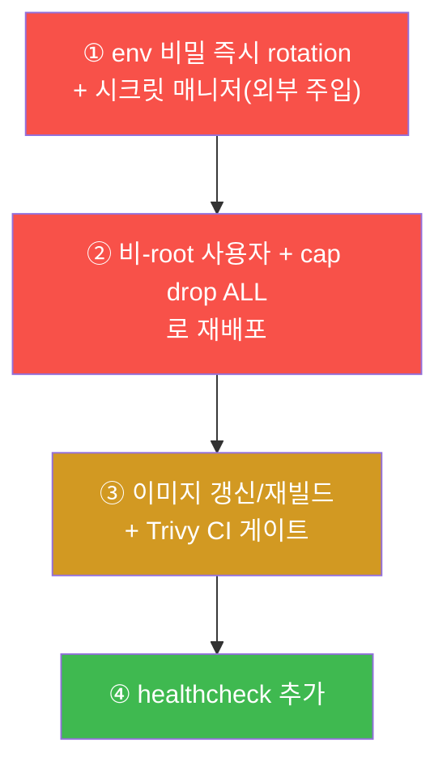
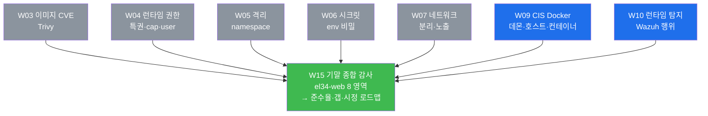
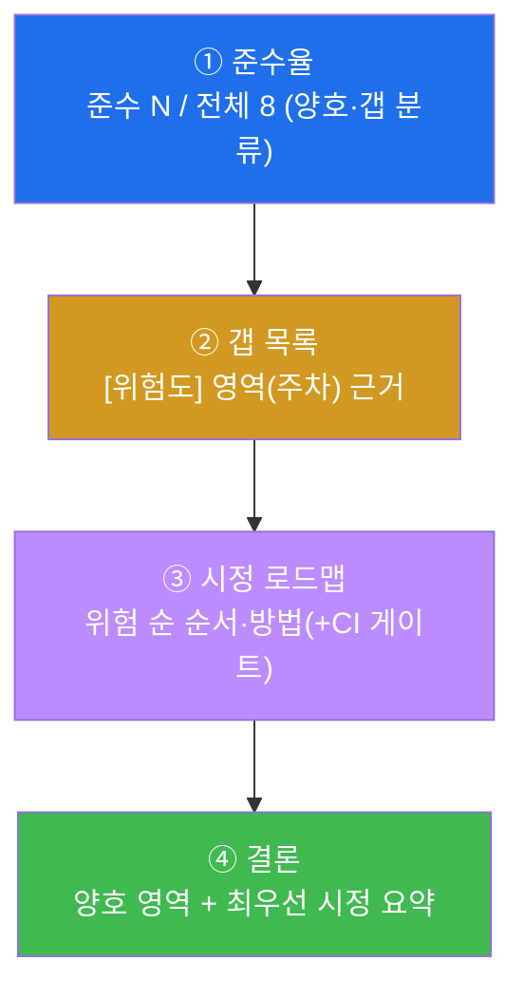
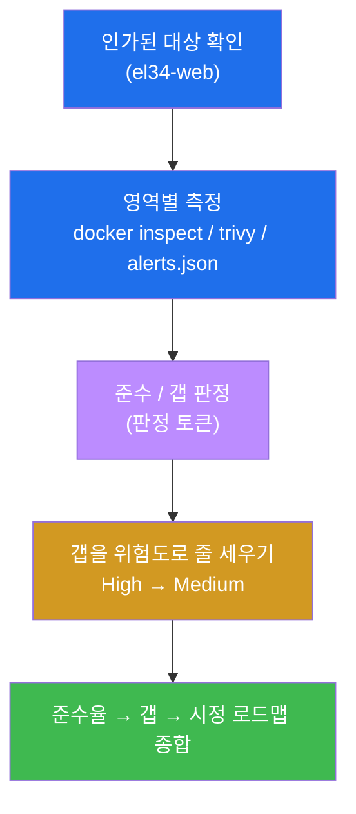
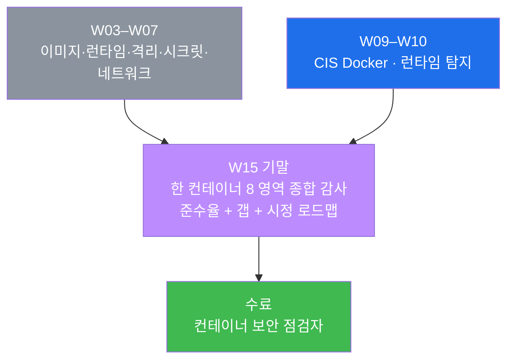

# 클라우드·컨테이너 W15 — 기말(종합 감사): 한 컨테이너를 전 영역으로 감사해 준수율·갭·시정 로드맵 산출

> **본 주차의 한 줄 요약**
>
> 지난 14주 동안 학생은 이미지 취약점 스캔(W03) · 런타임 특권/capability/user(W04) · 격리
> namespace(W05) · 시크릿(W06) · 네트워크 분리·노출(W07) · CIS Docker Benchmark(W09) · 런타임
> 위협 탐지(W10) 를 **한 영역씩** 점검하는 법을 익혔다. 매주 한 칼을 갈았다면, 기말은 그 모든
> 칼을 한 자루에 모은다 — **el34-web 한 컨테이너를 전 영역(8 항목)으로 한 바퀴 감사**해, 각
> 항목이 **준수(compliant)인지 갭(gap)인지** 를 `docker`·`trivy` 명령의 증적으로 판정하고, 그
> 결과를 **준수율(준수/전체) + 갭 목록 + 위험 기반 시정 로드맵** 으로 종합한다. 개별 점검은
> W03~W10 도 했지만, 기말은 그것을 **한 대상 위에서 통합**하고 **무엇부터 고칠지(우선순위)** 까지
> 한 보고서로 답하는 것을 요구한다.
>
> **점검자(auditor) 한 줄 결론**: 컨테이너 보안 감사는 "취약하다/안전하다"는 막연한 인상이
> 아니라, **각 영역을 한 명령으로 측정해 준수/갭으로 판정하고(증적), 갭을 위험도로 줄 세워(우선
> 순위) 무엇부터 고칠지를 로드맵으로 답하는** 일이다. el34-web 은 **격리·네트워크 분리·특권
> 없음·docker.sock 권한·런타임 모니터링은 양호**하지만 **이미지 CVE · capability 미드롭 · root
> 실행 · env 비밀(SSH_PASS) · healthcheck 없음** 의 다섯 갭을 가진 — "잘된 곳과 못된 곳이 섞인"
> 현실적인 감사 대상이다. 이걸 전 영역으로 측정·판정·종합할 수 있으면 컨테이너 보안 과정을
> **수료** 할 자격이 있다.

---

## 학습 목표

본 주차(기말 평가) 종료 시 학생은 다음 6 가지를 **본인 손으로** 할 수 있어야 한다.

1. 컨테이너 보안의 **두 계층(이미지 / 런타임)** 과 그 아래 8 개 점검 영역(이미지 CVE · 특권 ·
   capability/user · 시크릿 · 격리 · 네트워크 · CIS Docker(healthcheck/docker.sock) · 런타임
   탐지)이 14 주의 어느 주차에서 왔는지를 한 표로 그리고, 각 영역을 **어느 한 명령** 으로
   측정하는지를 말한다.
2. el34-web 한 컨테이너를 대상으로 **이미지 취약점(Trivy HIGH/CRITICAL 집계)** 과 **특권 여부
   (Privileged)** 를 측정해, 전자는 갭(이미지 CVE), 후자는 준수(특권 없음, CIS 5.4)임을 증적으로
   판정한다.
3. **capability 드롭(CapDrop) 과 실행 사용자(uid)** 를 측정해 el34-web 이 **CapDrop 비어있음 +
   root(uid 0) 실행** 이라는 갭(CIS 5.3 / 4.1)을, **env 비밀**(`SSH_PASS`)이 `docker inspect`
   한 번에 평문 노출되는 갭(W06)을 직접 짚어낸다.
4. **격리(namespace 수) · 네트워크 소속 · CIS Docker(healthcheck 유무·docker.sock 권한) ·
   런타임 탐지(Wazuh 적재)** 를 측정해, 격리·네트워크 분리·docker.sock 660·런타임 모니터링은
   준수이고 healthcheck 없음(CIS 5.26)은 갭임을 판정한다.
5. 8 개 영역의 측정 결과를 모아 **준수율(준수 항목 수 / 전체)** 을 산정하고, 갭들을 **위험도
   (High/Medium)** 로 줄 세워 우선순위를 매긴다 — 무엇이 왜 High 이고 무엇이 Medium 인지를 근거와
   함께 말한다.
6. 위 모든 측정·판정·우선순위를 **종합 감사 보고서**(준수율 → 갭 목록 → 위험 기반 시정 로드맵 →
   결론)로 종합하고, 모든 점검이 **인가된 대상에 대한 읽기 전용** 임을 지킨다.

---

## 0. 용어 해설 (기말에서 다시 쓰는 핵심어)

본 주차는 W01~W14 의 용어를 한 컨테이너 위에서 종합한다. 처음 나오거나 기말에서 특히 중요한
용어를 다시 정리한다. 이미 앞 주차에서 정의한 용어라도, 기말에서 **이 의미로 쓴다** 는 것을
분명히 하기 위해 다시 적는다.

| 용어 | 영문 | 뜻 | 비유 |
|------|------|----|------|
| **종합 감사** | comprehensive audit | 대상의 여러 영역을 한 바퀴 점검해 준수/갭을 판정하고 종합하는 일 | 건물 전체 안전 종합 점검 |
| **준수** | compliant | 점검 기준을 충족한 상태(통제가 제대로 적용됨) | 기준 통과 항목 |
| **갭** | gap / finding | 기준을 충족하지 못한 상태(고쳐야 할 발견 사항) | 점검에서 적발된 결함 |
| **준수율** | compliance rate | 전체 점검 항목 중 준수한 항목의 비율 | 100점 만점 중 받은 점수 |
| **증적** | evidence | 판정의 근거가 되는 실제 명령 출력·로그 | 점검 결과를 찍은 사진·계측값 |
| **위험 기반 우선순위** | risk-based prioritization | 갭을 위험도로 줄 세워 고칠 순서를 정함 | 응급실 중증도 분류(트리아지) |
| **시정 로드맵** | remediation roadmap | 어떤 갭을 어떤 순서·방법으로 고칠지 정리한 계획 | 보수 공사 일정표 |
| **CVE** | Common Vulnerabilities and Exposures | 공개된 알려진 취약점에 붙는 고유 식별 번호(예: CVE-2023-xxxx) | 알려진 결함의 일련번호 |
| **특권 컨테이너** | privileged container | 호스트의 거의 모든 권한을 갖는 컨테이너(격리 사실상 해제) | 마스터키를 쥔 입주자 |
| **capability(권능)** | Linux capability | root 권한을 잘게 쪼갠 단위(필요한 것만 줄 수 있음) | 통째 마스터키 대신 방별 열쇠 |
| **CapDrop** | — | 컨테이너가 **버린** capability 목록(ALL 이면 전부 버림) | 반납한 열쇠 목록 |
| **시크릿** | secret | 비밀번호·토큰·키 같은 민감 자격 정보 | 금고 비밀번호 |
| **namespace(이름공간)** | namespace | 프로세스가 보는 자원(PID·네트워크·마운트 등)을 컨테이너별로 분리하는 커널 기능 | 각 세대를 가르는 칸막이 |
| **healthcheck** | — | 컨테이너가 정상 동작 중인지 주기적으로 자가 점검하는 명령 | 환자 활력징후 모니터 |
| **docker.sock** | Docker socket | docker 데몬을 조종하는 UNIX 소켓(쥐면 호스트 장악 가능) | 데몬을 부리는 마스터 리모컨 |
| **CIS Docker Benchmark** | — | 컨테이너를 안전하게 운영하는 항목별 점검 기준(번호로 식별) | 컨테이너 안전 체크리스트 |
| **NIST SP 800-190** | — | 미국 표준기관(NIST)의 컨테이너 보안 가이드(이미지·런타임·오케스트레이션 위험 정리) | 컨테이너 보안 표준 지침서 |
| **읽기 전용 점검** | read-only audit | 대상을 바꾸지 않고 조회만 하는 점검 | 손대지 않고 눈으로만 검사 |

> **헷갈리기 쉬운 한 쌍 — 준수(compliant) vs 갭(gap).** 감사 결과는 영역마다 둘 중 하나로
> 떨어진다. **준수** 는 그 영역의 통제가 기준대로 적용된 상태(예: 특권이 꺼져 있다 →
> `compliant=not_privileged`)이고, **갭** 은 기준을 못 채운 발견 사항(예: root 로 실행된다 →
> `gap=runs_as_root`)이다. 핵심은, 감사가 "느낌"이 아니라 **한 명령의 출력으로 준수/갭이
> 결정** 된다는 점이다 — 그래서 본 기말의 각 미션은 끝에 `compliant=...` 또는 `gap=...` 같은
> 판정 토큰을 찍는다. 이 토큰이 곧 증적이자 채점 기준이다.

---

## 1. 감사란 무엇이고, 왜 한 영역만 보면 안 되는가

### 1.1 한 줄 답: 감사는 전 영역을 측정해 준수/갭으로 판정하고 종합하는 일이다

**보안 감사(audit)** 는 대상의 여러 영역을 한 바퀴 점검해, 각 영역이 정해진 기준을 충족하는지를
**측정하고 판정** 한 뒤, 그 결과를 종합하는 일이다. 매주 한 영역씩 배운 점검(이미지·특권·격리…)이
"한 칼"이었다면, 감사는 그 칼들을 **한 대상 위에서 전부 휘둘러** "이 컨테이너는 전체적으로 어디가
괜찮고 어디가 문제인가"를 답하는 것이다.

여기서 결정적인 것은, 감사가 **인상이 아니라 측정** 이라는 점이다. "이 컨테이너 위험해 보인다"는
감사가 아니다. **각 영역을 한 명령으로 재서**(예: `docker inspect ... Privileged`), 그 출력으로
준수/갭을 판정하고, 그 출력 자체를 증적으로 남기는 것이 감사다. 본 기말이 측정하는 능력이 바로
이것이다.

### 1.2 왜 한 영역만 보면 안 되는가 — 보안은 가장 약한 고리로 무너진다

컨테이너 한 대를 안전하게 운영하려면 여러 영역이 **동시에** 갖춰져야 한다. 이미지에 알려진
취약점이 없어도(W03 양호) root 로 돌고 capability 를 통째로 쥐고 있으면(W04 갭) 침투 후 피해
반경이 커지고, 격리가 잘돼 있어도(W05 양호) 환경변수에 비밀번호가 평문으로 박혀 있으면(W06 갭)
`docker inspect` 한 번에 자격이 새어 나간다. 즉 **한 영역이 양호하다고 컨테이너가 안전한 것이
아니다** — 보안은 가장 약한 고리(갭)에서 무너진다. 그래서 감사는 반드시 **전 영역을 한 바퀴**
돌아야 한다.



이 그림이 기말 전체의 지도다. 한 대상(파랑)을 세 계층의 8 영역(주황)으로 재고, 영역마다 준수/갭을
판정한(보라) 뒤, 마지막에 준수율·갭·로드맵으로 종합한다(초록). 학생이 시험에서 할 일은 이 지도를
실제 명령과 증적으로 채우는 것이다.

### 1.3 핵심 평가 — 측정·판정·우선순위·종합

기말의 채점 시선은 매주의 점검과 같되 더 넓다. **개별 영역을 점검할 줄 아는가** 가 아니라, **한
대상을 전 영역으로 측정해 준수/갭으로 판정하고, 갭을 위험도로 줄 세워, 무엇부터 고칠지를 한
보고서로 종합하는가** 다. 이미지만 봤다면 root·비밀 갭을 놓쳤을 것이고, 런타임만 봤다면 이미지
CVE 를 놓쳤을 것이며, 갭을 찾고도 위험도로 줄 세우지 못하면 "무엇부터 고치라는 건가"라는 실무의
질문에 답하지 못한다. 그래서 전 영역 측정 + 위험 기반 우선순위 + 종합이 정답이다.

### 1.4 한계 — 이 감사가 다루는 범위

본 기말은 W01~W14 의 범위 안에서 한 컨테이너를 종합 감사한다. 실제 감사는 이보다 넓다 — 호스트
OS 강화, 오케스트레이터(Kubernetes) 정책(W12), 클라우드 IAM·CSPM(W13~W14), 공급망 서명 검증
(W11)까지 포함한다. 본 시험은 그중 **한 컨테이너 인스턴스에서 docker/trivy CLI 한 명령으로 측정
가능한** 8 영역에 집중한다. 또한 모든 점검은 **인가된 대상(el34-web)에 대한 읽기 전용** 이며,
구성을 바꾸지 않는다(시정은 운영팀의 변경관리 몫이다, §9).

---

## 2. 8 개 점검 영역 상세 — 무엇을, 어떤 명령으로, 어떻게 판정하나

이번 시험의 대상은 **el34-web 한 컨테이너** 다. el34 호스트(`ssh ccc@192.168.0.80`, 비밀번호 1)
에서 `docker` 와 `trivy` CLI 로 각 영역을 한 명령씩 측정한다. 모든 명령은 **읽기 전용 조회** 이고,
**신규 설치는 없다.** 각 영역을 "무엇을 / 어떤 명령으로 / el34-web 에서 어떤 판정인지 / 한계"로
설명한다.

### 2.1 ① 이미지 취약점 (W03) — Trivy 로 알려진 CVE 집계

**한 줄 정의.** 이미지 취약점 점검은 컨테이너 이미지(파일 시스템 + 설치된 패키지)에 **알려진
취약점(CVE)** 이 몇 개나 들어 있는지를 스캐너로 세는 것이다.

> **용어 — CVE / Trivy.** **CVE**(Common Vulnerabilities and Exposures)는 공개된 알려진
> 취약점마다 붙는 고유 번호(예: CVE-2023-1234)다. **Trivy** 는 이미지 안의 패키지 목록을 알려진
> CVE 데이터베이스와 대조해 "이 이미지에 어떤 CVE 가 몇 개 있는가"를 알려 주는 오픈소스
> 스캐너다(W03). 심각도는 LOW/MEDIUM/**HIGH/CRITICAL** 로 나뉜다.

**어떤 명령으로.** el34 호스트의 `/usr/local/bin/trivy` 로 el34-web 이미지를 스캔하되, 운영에서
가장 먼저 봐야 할 **HIGH·CRITICAL** 만 집계한다(lab STEP 2).

```bash
/usr/local/bin/trivy image --scanners vuln --severity HIGH,CRITICAL --no-progress el34-web:latest 2>/dev/null | grep -iE 'Total:'
```

- `--scanners vuln` — 취약점 스캐너만 켠다(시크릿·설정 스캐너는 끔). `--severity HIGH,CRITICAL`
  은 그 두 등급만 센다. `--no-progress` 는 진행 막대를 끈다. 끝의 `grep 'Total:'` 로 **합계
  줄만** 뽑는다.

**el34-web 판정.** el34-web 이미지에는 HIGH/CRITICAL CVE 가 잡힌다 → **갭(이미지 CVE)**. 시정은
**최소 베이스 이미지 + 패키지 갱신/재빌드** 다 — 베이스를 가볍게 하고 최신으로 올리면 알려진
취약점 표면이 줄어든다.

**한계.** 스캐너는 **알려진(공개된) CVE** 만 잡는다. 아직 공개되지 않은 0-day 나 잘못된 설정 자체
(이건 다른 영역에서 본다)는 이미지 스캔으로 보이지 않는다. 또 "CVE 가 있다 = 즉시 악용된다"는
아니므로, 실제 노출 경로와 함께 위험을 판단한다.

### 2.2 ② 특권 (W04) — Privileged 플래그

**한 줄 정의.** **특권 컨테이너(privileged)** 는 `--privileged` 로 띄워 호스트의 거의 모든 권한
(모든 capability + 디바이스 접근)을 갖는 컨테이너로, 사실상 격리가 해제된 상태다.

**어떤 명령으로.** `docker inspect` 의 `HostConfig.Privileged` 를 읽어 false(특권 아님)인지
판정한다(lab STEP 3).

```bash
P=$(docker inspect el34-web --format '{{.HostConfig.Privileged}}'); [ "$P" = "false" ] && echo "compliant=not_privileged" || echo "gap=privileged"
```

- `.HostConfig.Privileged` 가 `true` 면 특권 컨테이너다. 위 한 줄은 그 값을 읽어 false 면
  `compliant=not_privileged`, true 면 `gap=privileged` 를 찍는다.

**el34-web 판정.** el34-web 은 `Privileged=false` → **준수(특권 없음, CIS Docker 5.4)**. 특권
컨테이너는 침해 시 곧장 호스트 장악으로 이어지므로, 특권을 쓰지 않는 것은 가장 기본적인 런타임
통제다.

> **용어 — CIS Docker 5.4.** CIS Docker Benchmark 의 항목 번호다(§2.7 에서 더 설명). **5.4** 는
> "컨테이너를 특권 모드로 실행하지 말 것"을 권고한다. 감사 보고에서 "특권 없음(CIS 5.4 준수)"
> 처럼 표준 번호를 함께 적으면 판정의 근거가 명확해진다.

**한계.** 특권이 꺼져 있어도(이 항목 준수) capability 를 많이 쥐고 있거나 root 로 돌면(다음 항목)
여전히 위험할 수 있다. 특권은 런타임 권한의 **한 축** 일 뿐, 권능·사용자와 함께 봐야 한다.

### 2.3 ③ Capability·User (W04) — CapDrop 과 실행 uid

**한 줄 정의.** **capability(권능)** 는 root 의 강력한 권한을 잘게 쪼갠 단위로, 컨테이너에는 꼭
필요한 것만 남기고 나머지는 **버리는(drop)** 것이 원칙이다. 또한 컨테이너는 가능하면 **root 가
아닌 사용자(non-root)** 로 실행해야 한다.

> **용어 — capability / CapDrop / uid.** 옛 Linux 는 root(uid 0)냐 아니냐의 이분법이었지만,
> 지금은 root 권한을 `CAP_NET_BIND_SERVICE`(낮은 포트 바인딩) 등 수십 개 **capability** 로
> 쪼갠다. **CapDrop** 은 컨테이너가 버린 권능 목록으로, `ALL` 이면 전부 버린 뒤 필요한 것만 다시
> 추가하는 게 모범이다. **uid 0** 은 컨테이너 안의 root 를 뜻한다 — 컨테이너 root 가 곧 호스트
> root 는 아니지만, 다른 갭(특권·cap)과 겹치면 탈출(escape)의 발판이 된다.

**어떤 명령으로.** `CapDrop` 이 비어 있는지와 실행 uid 가 0(root)인지를 함께 측정한다(lab STEP 4).

```bash
D=$(docker inspect el34-web --format '{{.HostConfig.CapDrop}}'); echo "$D" | grep -qiE 'ALL|CAP_' && echo "caps_ok" || echo "gap=no_capdrop"
docker exec el34-web id -u | grep -q '^0$' && echo "gap=runs_as_root" || echo "nonroot"
```

- 첫 줄: `CapDrop` 출력에 `ALL` 이나 `CAP_` 가 보이면 무언가 버렸다는 뜻(`caps_ok`), 비어 있으면
  아무것도 안 버린 것(`gap=no_capdrop`). 둘째 줄: 컨테이너 안 `id -u` 가 `0` 이면 root 실행
  (`gap=runs_as_root`), 아니면 `nonroot`.

**el34-web 판정.** el34-web 은 **CapDrop 이 비어 있고(아무 권능도 안 버림) + root(uid 0)로
실행** → **갭(CIS Docker 5.3 capability 미드롭 / 4.1 비-root 미준수)**. 두 갭이 겹치면 침투 후
"폭발 반경(blast radius)"이 커진다 — 침입자가 컨테이너 안에서 곧장 강력한 권한을 쥔다. 시정은
**비-root 사용자로 실행 + `cap drop ALL` 후 필요한 권능만 추가** 다.

**한계.** capability·uid 는 컨테이너 안의 권한 수준을 말해 줄 뿐, 그 권한으로 실제 무엇을 할 수
있는지(마운트·소켓 노출 등)는 다른 영역(시크릿·docker.sock)과 함께 봐야 전체 위험이 보인다.

### 2.4 ④ 시크릿 (W06) — 환경변수(env)의 비밀 노출

**한 줄 정의.** 시크릿 점검은 비밀번호·토큰·키 같은 **민감 자격이 컨테이너 환경변수(env)에 평문
으로 박혀 있는지** 를 보는 것이다. env 비밀은 `docker inspect` 한 번에 그대로 드러나므로 위험하다.

**어떤 명령으로.** `Config.Env` 를 모두 뽑아 `pass|secret|token|key` 패턴에 걸리는 항목 수를
센다(lab STEP 5).

```bash
D=$(docker inspect el34-web --format '{{range .Config.Env}}{{println .}}{{end}}' | grep -ciE 'pass|secret|token|key'); [ "$D" -gt 0 ] && echo "gap=secret_in_env" || echo "no_env_secret"
```

- `.Config.Env` 는 컨테이너의 환경변수 목록이다. 변수명에 `PASS/SECRET/TOKEN/KEY` 가 들어가면
  비밀일 가능성이 높으므로, 그 패턴으로 후보를 세서 하나라도 있으면 `gap=secret_in_env` 를 찍는다.

**el34-web 판정.** el34-web 은 env 에 **`SSH_PASS`(SSH 비밀번호)** 가 평문으로 들어 있다 →
**갭(시크릿 노출, W06)**. 이건 컨테이너 권한이 없는 사람도 `docker inspect` 권한만 있으면 자격을
가져갈 수 있는 직접적 노출이다. 시정은 **즉시 rotation(해당 비밀 폐기·교체) + 시크릿 매니저
(외부 주입)** 로, env 가 아니라 마운트된 secret 이나 Vault 같은 비밀 저장소에서 주입한다.

**한계.** 변수명 패턴 탐지는 **이름이 비밀스러운** 후보를 잡을 뿐, 이름이 평범한데 값이 비밀인
경우나 이미지 레이어 안에 박힌 비밀(W11 영역)은 이 한 명령으로는 못 잡는다. 완전한 시크릿 점검은
env + 이미지 레이어 + 마운트를 함께 본다.

### 2.5 ⑤ 격리 (W05) — namespace 분리

**한 줄 정의.** **namespace(이름공간)** 는 프로세스가 보는 자원(PID·네트워크·마운트·UTS·IPC 등)을
컨테이너별로 분리하는 커널 기능으로, 컨테이너 격리의 토대다.

**어떤 명령으로.** 컨테이너 1 번 프로세스의 namespace 개수를 센다(lab STEP 6).

```bash
docker exec el34-web sh -c "ls /proc/1/ns/ | wc -l"
```

- `/proc/1/ns/` 는 PID 1 프로세스에 적용된 namespace 들을 파일로 보여 주는 커널 인터페이스다.
  여기에 항목이 여러 개 있으면(예: pid·net·mnt·uts·ipc 등) 그만큼 자원이 분리돼 있다는 뜻이다.

**el34-web 판정.** namespace 들이 분리돼 있다 → **준수(격리 적용)**. el34-web 은 host 의 PID·
네트워크를 통째로 공유하지 않고 자기 namespace 를 갖는다(W05 의 `--net=host` 갭과 대비). 다만
**컨테이너는 호스트와 커널을 공유** 하므로 namespace 만으로 완벽하지 않고, **seccomp/AppArmor 로
시스템콜·접근을 더 좁혀야** 한다는 한계가 함께 있다.

**한계.** namespace 가 있다는 것은 "자원이 분리됐다"는 사실일 뿐, 커널 공유에서 오는 위험(커널
취약점을 통한 탈출)까지 막아 주지는 않는다. 그래서 격리는 seccomp 프로파일·AppArmor/SELinux 와
함께 강화하는 것이 정석이다.

### 2.6 ⑥ 네트워크 (W07) — 소속 네트워크(분리)

**한 줄 정의.** 네트워크 점검은 컨테이너가 **어떤 docker 네트워크에 붙어 있는가**(소속)를 보고,
망이 역할별로 분리(segmentation)됐는지를 확인하는 것이다.

**어떤 명령으로.** `docker inspect` 의 `NetworkSettings.Networks` 로 소속 네트워크 이름을 본다
(lab STEP 7).

```bash
docker inspect el34-web --format '{{range $k,$v := .NetworkSettings.Networks}}{{$k}} {{end}}'
```

- `.NetworkSettings.Networks` 는 컨테이너가 붙은 네트워크들의 맵이다. `{{range $k,$v := ...}}`
  로 네트워크 이름(`$k`)을 하나씩 출력한다.

**el34-web 판정.** el34-web 은 **dmz·int 두 네트워크에 붙은 다리(bridge) 컨테이너** 로, el34 의
**4-tier(ext/pipe/dmz/int) 분리** 구조 안에 있다(W07) → **준수(네트워크 분리)**. 내부 앱(int)은
외부에서 직접 닿지 못하고 web 을 거치므로, 한 구역 침해가 다른 구역으로 자동 확산(측면 이동)되지
않는다.

**한계.** 소속은 "어디에 붙었나"를 알려 줄 뿐, 그 안에서의 세밀한 통신 정책까지는 보여 주지
않는다(W07 §3.3). 또 web 은 두 망의 다리이므로 침해 시 양쪽이 노출되는 민감 지점이라, 분리가
준수여도 다리 컨테이너는 가장 단단히 지켜야 한다.

### 2.7 ⑦ CIS Docker (W09) — healthcheck 와 docker.sock

**한 줄 정의.** **CIS Docker Benchmark** 는 컨테이너·데몬·호스트를 안전하게 운영하기 위한 항목별
점검 기준(번호로 식별)이다. 본 미션은 그중 컨테이너 수준의 두 항목 — **healthcheck 유무** 와
**docker.sock 권한** — 을 본다.

> **용어 — CIS Docker Benchmark / healthcheck / docker.sock.** **CIS Docker** 는 미국 CIS
> (Center for Internet Security)가 만든 컨테이너 보안 체크리스트로, 각 항목에 5.4·5.26 같은
> 번호가 붙는다. **healthcheck** 는 컨테이너가 정상 동작 중인지 주기적으로 자가 점검하는 명령
> (Dockerfile `HEALTHCHECK` 또는 `--health-cmd`)으로, 없으면 죽은(unhealthy) 컨테이너를 제때
> 못 걸러낸다(CIS 5.26). **docker.sock**(`/var/run/docker.sock`)은 docker 데몬을 조종하는 UNIX
> 소켓으로, 이걸 쥔 사람은 사실상 호스트를 장악할 수 있어 권한이 엄격해야 한다.

**어떤 명령으로.** healthcheck 설정 유무를 보고, docker.sock 의 권한을 함께 찍는다(lab STEP 8).

```bash
H=$(docker inspect el34-web --format '{{if .Config.Healthcheck}}yes{{else}}none{{end}}'); [ "$H" = "none" ] && echo "gap=no_healthcheck" || echo "healthcheck_ok"
ls -la /var/run/docker.sock 2>/dev/null | awk '{print "sock="$1}'
```

- 첫 줄: `Config.Healthcheck` 가 설정돼 있으면 `healthcheck_ok`, 없으면 `gap=no_healthcheck`.
  둘째 줄: docker.sock 파일의 권한 문자열(예: `srw-rw----` = 660)을 찍어 노출 여부를 본다.

**el34-web 판정.** el34-web 은 **healthcheck 가 없음 → 갭(CIS Docker 5.26)**. 반면
docker.sock 은 **660 권한(소유자/그룹만)으로 준수** 다 — 아무나 읽고 쓰지 못한다. 즉 같은 미션
안에 갭(healthcheck)과 준수(sock 권한)가 섞여 있다. healthcheck 시정은 **컨테이너에 적절한
HEALTHCHECK 추가** 다.

**한계.** CIS Docker 는 항목이 수백 개에 이르며, 본 미션은 그중 컨테이너 수준의 두 항목만 본다.
데몬·호스트 수준 항목(W09 의 본 영역)은 별도 점검이 필요하고, healthcheck 가 있다고 컨테이너가
보안상 안전해지는 것은 아니다(가용성 통제에 가깝다).

### 2.8 ⑧ 런타임 탐지 (W10) — Wazuh 행위 모니터링

**한 줄 정의.** 런타임 탐지는 컨테이너가 **돌고 있는 동안의 행위**(파일 변경·프로세스·이상 활동)를
모니터링해 침해 징후를 잡는 것으로, 정적 점검(앞의 ①~⑦)을 보완한다.

> **용어 — Wazuh.** 오픈소스 보안 모니터링 플랫폼(SIEM/EDR)으로, el34 에서는 `el34-siem`
> 컨테이너에 manager(4.10)가 있고, 경보는 `/var/ossec/logs/alerts/alerts.json` 에 JSON 라인으로
> 쌓인다(W10). 정적 점검이 "지금 설정이 어떤가"를 본다면, 런타임 탐지는 "지금 무슨 일이
> 일어나는가"를 본다.

**어떤 명령으로.** SIEM 에 경보가 적재되고 있는지 확인한다(lab STEP 9).

```bash
docker exec el34-siem sh -c 'tail -1 /var/ossec/logs/alerts/alerts.json 2>/dev/null | head -c 40; echo; echo runtime_mon_ok'
```

- `alerts.json` 의 마지막 한 줄(앞 40 바이트)을 찍어 경보가 실제로 쌓이는지 확인하고,
  `runtime_mon_ok` 토큰으로 그 단계가 끝났음을 표시한다.

**el34-web 판정.** Wazuh 경보가 적재되고, 호스트의 Sysmon 과 함께 행위가 모니터링된다 →
**준수(런타임 탐지 가동)**. 이는 ①~⑦의 정적 점검이 못 보는 "실행 중 이상 행위"를 보완하는 축이다.

**한계.** 런타임 탐지가 가동된다는 것은 "보고 있다"는 사실일 뿐, 모든 위협을 잡는다는 보장은
아니다(룰이 없으면 못 잡는다). 그래서 정적 점검(설정 강화)과 런타임 탐지(행위 감시)는 **둘 다**
필요한 보완 관계다.

---

## 3. 준수율 산정과 위험 기반 시정 로드맵 — 감사의 종합

8 영역을 다 측정했으면, 마지막은 그 결과를 **하나의 판단** 으로 종합하는 것이다. 종합은 세 걸음
이다 — (1) **준수율** 을 세고, (2) 갭을 **위험도로 줄 세우고**, (3) **시정 로드맵** 으로 무엇부터
고칠지 답한다.

### 3.1 el34-web 의 8 영역 측정 결과 — 준수율

본 기말 대상 el34-web 의 영역별 판정은 다음과 같다(lab STEP 1~9 의 측정 결과).

| # | 영역 (주차) | 측정 명령 | 판정 | 근거 |
|---|-------------|-----------|------|------|
| ① | 이미지 CVE (W03) | `trivy image --severity HIGH,CRITICAL` | **갭** | HIGH/CRITICAL CVE 존재 |
| ② | 특권 (W04) | `inspect .HostConfig.Privileged` | **준수** | Privileged=false (CIS 5.4) |
| ③ | capability·user (W04) | `inspect .CapDrop` + `id -u` | **갭** | CapDrop 비어있음 + root 실행 (CIS 5.3/4.1) |
| ④ | 시크릿 (W06) | `inspect .Config.Env \| grep pass…` | **갭** | env 에 SSH_PASS 평문 노출 |
| ⑤ | 격리 (W05) | `ls /proc/1/ns/` | **준수** | namespace 분리 적용 |
| ⑥ | 네트워크 (W07) | `inspect .NetworkSettings.Networks` | **준수** | 4-tier 분리(dmz/int) |
| ⑦ | CIS Docker (W09) | `inspect .Config.Healthcheck` + sock 권한 | **갭** | healthcheck 없음 (CIS 5.26) / sock 660 준수 |
| ⑧ | 런타임 탐지 (W10) | `siem alerts.json` 적재 확인 | **준수** | Wazuh + Sysmon 모니터링 |

**준수율 산정.** 8 영역 중 **준수 4(②특권 · ⑤격리 · ⑥네트워크 · ⑧런타임 탐지) / 갭 4(①이미지 ·
③cap·user · ④시크릿 · ⑦healthcheck)** 이다. 단, ③은 "cap 미드롭"과 "root 실행"의 두 갭을 한
미션에 담으므로, lab 보고서 양식은 이를 풀어 **"양호(특권 없음 · namespace 격리 · 4-tier 분리 ·
docker.sock 660 · 런타임 모니터링) / 갭(이미지 CVE · cap 미드롭 · root 실행 · env 비밀 ·
healthcheck 없음)"** 의 형태로 종합한다. 준수율은 "갭이 절반"이라는 **현실적인 중간 점수** —
잘된 곳도 있지만 고칠 곳이 분명한 컨테이너다.

### 3.2 갭을 위험도로 줄 세우기 — 무엇부터 고치나

감사가 갭을 **나열만** 하면 실무자는 "그래서 뭐부터 고치라는 건가"라고 묻는다. 그래서 갭은 반드시
**위험도(High/Medium)** 로 줄을 세워야 한다. 위험도는 보통 **악용 용이성 × 영향** 으로 판단한다.



- **[High] env 비밀(SSH_PASS) 노출** — `docker inspect` 권한만 있으면 즉시 자격이 새어 나가므로
  **악용이 가장 쉽고 영향이 크다.** 가장 먼저 고친다.
- **[High] root 실행 + cap 미드롭** — 그 자체로 자격이 새지는 않지만, 일단 침투되면 **피해 반경이
  최대** 가 된다. 두 갭이 겹쳐 위험이 증폭된다.
- **[Medium] 이미지 HIGH CVE** — 악용에 특정 취약점·경로가 필요하므로 High 보다는 낮지만,
  방치하면 침투 경로가 된다. 베이스 갱신·재빌드로 표면을 줄인다.
- **[Medium] healthcheck 없음** — 직접적 침해 통제라기보다 **가용성·운영** 통제에 가까워 위험도가
  상대적으로 낮다.

### 3.3 시정 로드맵 — 순서와 방법

위험도 순서가 곧 시정 순서다. el34-web 의 시정 로드맵은 다음과 같다(lab STEP 10 결론).



핵심은 **High 부터** 라는 것이다 — ① 노출된 비밀을 즉시 폐기·교체하고 시크릿 매니저로 옮긴 뒤,
② 비-root + `cap drop ALL` 로 재배포해 폭발 반경을 줄이고, ③ 이미지를 갱신·재빌드하면서 **Trivy
를 CI 파이프라인의 게이트** 로 걸어 앞으로 취약 이미지가 배포되지 않게 하고, ④ 마지막으로
healthcheck 를 더한다. **결론** 은 한 문장으로 — *격리·분리·특권·런타임 모니터링은 양호하나,
최소권한(root/cap) · 시크릿 외부 주입 · 이미지 갱신이 최우선 시정* 이다.

> **용어 — CI 게이트.** CI(Continuous Integration, 지속적 통합) 파이프라인에 Trivy 스캔을 넣어,
> HIGH/CRITICAL CVE 가 있으면 **빌드를 통과시키지 않는** 자동 검문이다. 한 번 고친 이미지가 다시
> 취약해지는 것을 막는 "재발 방지"의 컨테이너판이다.

---

## 4. 감사 판단 프레임워크 — "어느 영역을 어떻게 판정하나"

기말의 가장 중요한 능력은 **"이 영역은 어떤 명령으로 재서, 무엇이 나오면 준수/갭인가"** 를 즉시
판단하는 것이다. 다음 표가 그 판단의 정답지다. 학생은 이 표를 머릿속에 두고, 각 영역을 알맞은
명령으로 측정한 뒤 그 출력을 증적으로 제시한다.

| 영역 (주차) | 측정 (한 명령) | 준수 토큰 | 갭 토큰 | el34-web 판정 |
|-------------|----------------|-----------|---------|---------------|
| ① 이미지 CVE (W03) | `trivy image --severity HIGH,CRITICAL` | (Total 0) | Total>0 | **갭** |
| ② 특권 (W04) | `inspect .HostConfig.Privileged` | `compliant=not_privileged` | `gap=privileged` | **준수** |
| ③ cap·user (W04) | `inspect .CapDrop` + `id -u` | `caps_ok` / `nonroot` | `gap=no_capdrop` / `gap=runs_as_root` | **갭** |
| ④ 시크릿 (W06) | `inspect .Config.Env \| grep` | `no_env_secret` | `gap=secret_in_env` | **갭** |
| ⑤ 격리 (W05) | `ls /proc/1/ns/` | namespace 다수 | (host 공유) | **준수** |
| ⑥ 네트워크 (W07) | `inspect .Networks` | 분리 소속(dmz/int) | (평면) | **준수** |
| ⑦ CIS Docker (W09) | `inspect .Healthcheck` + sock | `healthcheck_ok` / sock 660 | `gap=no_healthcheck` | **갭** |
| ⑧ 런타임 탐지 (W10) | `siem alerts.json` | `runtime_mon_ok` | (적재 없음) | **준수** |

이 표를 읽는 법은 두 방향이다. **"무엇으로 재나"** — 영역마다 한 명령이 정해져 있다(거의 모두
`docker inspect`, 이미지만 `trivy`, 런타임 탐지만 SIEM 로그). 그리고 **"무엇이 나오면 갭인가"** —
판정 토큰(`gap=...` / `compliant=...`)이 곧 답이다. 두 방향을 모두 말할 수 있으면 컨테이너 감사의
원리를 체득한 것이다.

> **시험의 채점 포인트.** 각 영역을 올바른 명령으로 측정하고, 그 출력(판정 토큰)을 증적으로
> 제시하며, 마지막에 8 영역을 **준수율 + 갭 목록 + 위험 기반 시정 로드맵** 으로 종합하는 것.
> "안전하다/위험하다"는 선언이 아니라 **명령 출력과 위험도 우선순위** 가 점수다.

---

## 5. 한눈에 보는 14주 → 기말 — 모든 칼을 한 자루에

14 주 동안 한 영역씩 익힌 점검이 기말에서 한 대상 위에 전부 배치된다. 어느 주차의 무기가 어느
영역의 측정으로 쓰이는지를 겹쳐 보면 다음과 같다.



이 그림이 보여 주듯, 기말은 새로운 도구를 배우는 주가 아니라 **이미 익힌 점검을 한 대상 위에서
통합** 하는 주다. 그래서 신규 설치가 없고, 명령은 모두 앞 주차에서 본 `docker inspect`·`trivy`·
`alerts.json` 조회다. 달라지는 것은 **범위(한 영역 → 전 영역)와 산출물(점검 결과 → 준수율·갭·
로드맵)** 이다.

---

## 6. 점검 명령 빠른 복습 — "무엇을 어디서 보나"

기말의 점검은 모두 el34 호스트(`ssh ccc@192.168.0.80`, 비밀번호 1)에서 `docker`/`trivy` CLI 로
수행하며, **신규 도구 설치는 없다.** 점검 대상은 인가된 컨테이너 `el34-web`(런타임 탐지만
`el34-siem` 로그 조회)뿐이다.

| 무엇을 | 명령(요지) | 무엇을 보나 |
|--------|-----------|-------------|
| 대상 식별 | `docker inspect el34-web ... .State.Status` | el34-web 가동(`target_ok`) |
| ① 이미지 CVE | `trivy image --severity HIGH,CRITICAL ... \| grep Total:` | HIGH/CRITICAL 합계(갭) |
| ② 특권 | `inspect .HostConfig.Privileged` | `compliant=not_privileged`(준수, CIS 5.4) |
| ③ cap·user | `inspect .CapDrop` + `exec id -u` | `gap=runs_as_root`(갭, CIS 5.3/4.1) |
| ④ 시크릿 | `inspect .Config.Env \| grep pass…` | `gap=secret_in_env`(갭, SSH_PASS) |
| ⑤ 격리 | `exec ls /proc/1/ns/ \| wc -l` | namespace 수(준수) |
| ⑥ 네트워크 | `inspect .NetworkSettings.Networks` | dmz/int 분리 소속(준수) |
| ⑦ CIS Docker | `inspect .Config.Healthcheck` + sock 권한 | `gap=no_healthcheck`(갭) / sock 660(준수) |
| ⑧ 런타임 탐지 | `el34-siem ... alerts.json` | Wazuh 적재(`runtime_mon_ok`, 준수) |
| 종합 | (보고서) | 준수율 + 갭 + 시정 로드맵 |

> **점검 관용구.** 본 기말의 명령들은 끝에 `target_ok` / `compliant=...` / `gap=...` /
> `runtime_mon_ok` 같은 **판정·확인 토큰** 을 찍는다. 이는 그 단계의 측정이 끝까지 수행됐고 무엇
> 으로 판정됐는지를 한 줄로 보여 주는 증적이다 — 학생은 이 토큰이 출력에 나오는지로 각 영역의
> 준수/갭을 확인한다.

---

## 7. 실습 안내 — 기말 lab 10 미션 (4 축 설명)

기말 실습은 10 미션으로 구성되며, lab 의 `order` 와 1:1 로 대응한다. 미션은 대상 식별 → ① 이미지
→ ② 특권 → ③ cap·user → ④ 시크릿 → ⑤ 격리 → ⑥ 네트워크 → ⑦ CIS Docker → ⑧ 런타임 탐지 → 종합
보고의 순서로 흐른다. 각 미션을 **4 축** 으로 설명한다 — 왜 하는가 / 무엇을 알 수 있는가 / 결과
해석(준수 vs 갭) / 실전 활용.

> **시험 진행 원칙.** 모든 명령은 el34 호스트(`ssh ccc@192.168.0.80`)에서 `docker`/`trivy`
> CLI 로 실행한다(런타임 탐지만 `el34-siem` 로그). 이번 기말은 **신규 설치가 없고**, 점검 대상은
> 인가된 컨테이너(주로 `el34-web`)뿐이며, 모든 명령은 **읽기 전용 조회** 로 구성을 바꾸지 않는다.
> 합격 임계값은 0.7 이다.

### 미션 1 — 대상 식별 (8점)

> **왜 하는가?** 모든 감사의 전제는 대상이 실제로 돌고 있고 조회 가능하다는 것이다. 기말 종합
> 감사 대상(el34-web)이 가동 중인지부터 확인한 뒤 전 영역 점검에 들어간다.
>
> **무엇을 알 수 있는가?** 호스트에 돌고 있는 컨테이너 수와 el34-web 의 가동 상태 — 8 영역을 잴
> 대상이 살아 있고 조회 가능한지.
>
> **결과 해석.** 정상: 출력에 `target_ok` 가 나옴(대상 식별 성공). 비정상: 응답이 없거나 오류면
> 호스트 SSH·컨테이너 상태(`docker ps`)·docker 권한부터 점검한다.
>
> **실전 활용.** 감사 착수 시 첫 확인. 대상이 실제 가동·조회 가능한지 검증하는 단계로, 이게
> 안 되면 이후 모든 측정이 무의미하다.

### 미션 2 — ① 이미지 취약점 (W03) (10점)

> **왜 하는가?** 컨테이너 보안의 첫 계층은 이미지다. 알려진 CVE 가 몇 개 들어 있는지를 재서
> 이미지 위생(hygiene)을 판정한다(§2.1).
>
> **무엇을 알 수 있는가?** Trivy 로 el34-web 이미지의 **HIGH/CRITICAL CVE 합계**. 운영에서 가장
> 먼저 봐야 할 고위험 등급만 집계해, 이미지가 갱신이 필요한지를 한 줄로 안다.
>
> **결과 해석.** 정상(측정 성공): 출력에 `Total:` 줄이 나옴. el34-web 은 HIGH/CRITICAL 이
> 잡힌다 → **갭(이미지 CVE)**. 시정은 최소 베이스 + 갱신/재빌드. 비정상: Total 줄이 안 나오면
> trivy 경로·이미지 이름을 재확인한다.
>
> **실전 활용.** 배포 전·정기 점검에서 이미지의 알려진 취약점을 집계하는 표준 절차. CI 게이트로
> 자동화하면 취약 이미지의 배포를 막을 수 있다.

### 미션 3 — ② 특권 (W04) (10점)

> **왜 하는가?** 특권 컨테이너는 격리가 사실상 해제된 상태로, 침해 시 곧장 호스트 장악으로
> 이어진다. 가장 기본적인 런타임 통제인 특권 여부부터 판정한다(§2.2).
>
> **무엇을 알 수 있는가?** `HostConfig.Privileged` 로 el34-web 이 특권 모드인지. false 면 준수
> (CIS Docker 5.4), true 면 갭이다.
>
> **결과 해석.** 정상: 출력에 `compliant=not_privileged` 가 나옴 — el34-web 은 특권이 아니다
> (준수). 비정상: `gap=privileged` 가 나오면 특권 컨테이너이므로 즉시 시정 대상.
>
> **실전 활용.** 런타임 점검의 첫 항목. "이 컨테이너가 호스트 권한을 통째로 쥐고 있는가"를 30 초
> 만에 판정하는 명령이다.

### 미션 4 — ③ Capability·User (W04) (10점)

> **왜 하는가?** 특권이 꺼져 있어도(미션 3 준수) 권능을 통째로 쥐고 root 로 돌면 침투 후 폭발
> 반경이 커진다. 최소권한이 적용됐는지를 capability·실행 사용자로 판정한다(§2.3).
>
> **무엇을 알 수 있는가?** `CapDrop`(버린 권능)이 비어 있는지와 컨테이너가 **root(uid 0)** 로
> 도는지. 둘 다 최소권한의 핵심 지표다.
>
> **결과 해석.** 정상(이 미션의 채점 기준): 출력에 `gap=runs_as_root` 가 나옴 — el34-web 은
> **CapDrop 이 비어 있고 root 로 실행** 되는 갭(CIS 5.3/4.1)이다. 핵심 깨달음 — 특권은 꺼졌어도
> (미션 3) 최소권한은 미준수다. 시정은 비-root + `cap drop ALL`. 비정상: 토큰이 안 나오면
> 컨테이너 이름·docker 권한을 점검.
>
> **실전 활용.** 최소권한 감사의 표준. 침투 후 피해 반경을 줄이는 가장 효과적인 런타임 통제가
> 비-root + cap drop 임을 근거로 제시한다.

### 미션 5 — ④ 시크릿 (W06) (10점)

> **왜 하는가?** env 에 박힌 비밀은 `docker inspect` 한 번에 평문으로 새어 나간다. 컨테이너
> 자격이 노출됐는지를 환경변수에서 직접 사냥한다(§2.4).
>
> **무엇을 알 수 있는가?** `Config.Env` 에서 `pass/secret/token/key` 패턴으로 비밀 후보를 세는
> 법. el34-web 은 env 에 **SSH_PASS** 가 있어 비밀이 노출된다.
>
> **결과 해석.** 정상(이 미션의 채점 기준): 출력에 `gap=secret_in_env` 가 나옴 — env 비밀 노출
> 발견 성공. 핵심 — inspect 권한만으로 자격이 새므로 **즉시 rotation 대상**(High). 비정상: 토큰이
> 안 나오면 명령·컨테이너를 재확인.
>
> **실전 활용.** 시크릿 누출 점검의 1차 절차. 발견 시 즉시 폐기·교체하고 시크릿 매니저(마운트/
> secret/Vault)로 외부 주입하도록 시정한다.

### 미션 6 — ⑤ 격리 (W05) (10점)

> **왜 하는가?** namespace 격리는 컨테이너가 호스트와 자원을 분리해 도는 토대다. 격리가 적용됐
> 는지를 namespace 수로 확인한다(§2.5).
>
> **무엇을 알 수 있는가?** `/proc/1/ns/` 의 namespace 개수 — 컨테이너 1 번 프로세스가 PID·네트
> 워크·마운트 등을 호스트와 분리해 보는지.
>
> **결과 해석.** 정상: namespace 수와 `ns_ok` 가 나옴 — 격리 적용(준수). 핵심 — 단, 커널은
> 호스트와 공유하므로 namespace 만으로 완벽하지 않고 seccomp/AppArmor 로 더 좁혀야 한다. 비정상:
> `ns_ok` 가 안 나오면 컨테이너·명령을 재확인.
>
> **실전 활용.** 격리 점검의 표준. namespace 분리가 됐다는 사실과, 커널 공유의 한계까지 함께
> 보고하는 것이 균형 잡힌 감사다.

### 미션 7 — ⑥ 네트워크 (W07) (10점)

> **왜 하는가?** 컨테이너가 어느 망에 붙어 있는지가 곧 통신 범위이자 침해 확산 경로다. 망 분리가
> 적용됐는지를 소속 네트워크로 확인한다(§2.6).
>
> **무엇을 알 수 있는가?** `NetworkSettings.Networks` 로 el34-web 의 소속 네트워크. web 은
> **dmz·int 두 망에 붙은 다리** 로, el34 의 4-tier 분리 구조 안에 있다.
>
> **결과 해석.** 정상: 소속 네트워크와 `nets_ok` 가 나옴 — 망 분리(준수). 내부 앱(int)은 외부
> 에서 직접 닿지 못하고 web 을 거친다(측면 이동 차단). 비정상: 출력이 비면 컨테이너·명령을 재확인.
>
> **실전 활용.** 망 분리 감사의 표준. 분리가 준수여도 다리 컨테이너(web)는 침해 시 양쪽이 노출
> 되는 민감 지점이므로 가장 단단히 지켜야 함을 함께 보고한다.

### 미션 8 — ⑦ CIS Docker (W09) — healthcheck (10점)

> **왜 하는가?** CIS Docker Benchmark 의 컨테이너 항목 중 healthcheck 유무와 docker.sock 권한을
> 판정한다. 같은 미션 안에 갭과 준수가 섞여 있어, 감사가 흑백이 아님을 보여 준다(§2.7).
>
> **무엇을 알 수 있는가?** `Config.Healthcheck` 로 자가 점검 설정 유무, 그리고 docker.sock 권한
> 문자열. el34-web 은 **healthcheck 가 없고(갭, CIS 5.26)**, docker.sock 은 **660(준수)** 이다.
>
> **결과 해석.** 정상(이 미션의 채점 기준): 출력에 `gap=no_healthcheck` 가 나옴 — healthcheck
> 미설정 갭. 함께 찍힌 `sock=srw-rw----`(660)는 준수. 비정상: 토큰이 안 나오면 명령을 재확인.
>
> **실전 활용.** CIS Docker 항목별 점검의 표준. 한 미션에서 갭(healthcheck)과 준수(sock)를 동시에
> 판정해, 감사 결과를 항목별로 분리해 보고하는 법을 익힌다.

### 미션 9 — ⑧ 런타임 탐지 (W10) (10점)

> **왜 하는가?** 앞의 ①~⑦은 모두 **정적(설정) 점검** 이다. 컨테이너가 도는 동안의 이상 행위를
> 잡는 런타임 탐지가 가동되는지를 확인해, 정적 점검을 보완한다(§2.8).
>
> **무엇을 알 수 있는가?** `el34-siem` 의 `alerts.json` 에 Wazuh 경보가 적재되는지 — 호스트
> Sysmon 과 함께 행위 모니터링이 살아 있는지.
>
> **결과 해석.** 정상: alerts 한 줄과 `runtime_mon_ok` 가 나옴 — 런타임 모니터링 가동(준수).
> 핵심 — 정적 점검(설정)과 런타임 탐지(행위)는 둘 다 필요한 보완 관계다. 비정상: 적재가 없으면
> siem 컨테이너·agent 상태를 점검.
>
> **실전 활용.** 정적 감사만으로는 못 보는 "실행 중 이상 행위"를 잡는 런타임 탐지의 존재를 감사에
> 포함해, 설정+행위의 양면 점검을 완성한다.

### 미션 10 — 종합 감사 보고서: 준수율·갭·시정 로드맵 (12점)

> **왜 하는가?** 미션 1~9 의 측정을 **하나의 판단** 으로 종합하는 것이 감사의 정점이다. 준수율을
> 세고, 갭을 위험도로 줄 세워, 무엇부터 고칠지를 보고서로 답한다(§3). 수료의 핵심 산출물이다.
>
> **무엇을 알 수 있는가?** 8 영역 측정 결과를 **준수율(준수/전체) + 갭 목록(위험도) + 위험 기반
> 시정 로드맵 + 결론** 으로 종합하는 법. 양호(특권 없음·격리·분리·sock 660·런타임 모니터링)와
> 갭(이미지 CVE·cap 미드롭·root·env 비밀·healthcheck)을 균형 있게 제시하는 보고 구조.
>
> **결과 해석.** 정상: 보고서에 `시정` 이 포함되고 준수율/갭/로드맵이 모두 담김(종합 성공). 갭은
> High(env 비밀·root/cap) → Medium(이미지·healthcheck) 순으로 줄 세워야 한다. 비정상: 준수율이나
> 위험 우선순위가 빠지면 보고서 양식(미션 10 instruction)을 다시 채운다.
>
> **실전 활용.** 컨테이너 보안 감사 보고서의 표준 구조(준수율 → 갭 → 위험 기반 로드맵 → 결론).
> 운영팀·심사·경영진에 제출하는 최종 산출물이며, 다음 점검·재배포의 토대가 된다.

---

## 8. 종합 감사 보고서 — 8 영역을 한 판단으로 (수료의 마무리)

기말의 마무리는 **종합 감사 보고서** 다. 개별 측정을 넘어, 8 영역을 준수율로 종합하고 갭을 위험
순으로 줄 세워 시정 로드맵으로 답하는 것이 컨테이너 보안 점검자의 최종 산출물이다.

### 8.1 보고서가 채워야 할 세 부분

| 부분 | 내용 | 핵심 |
|------|------|------|
| 1. 준수율 | 8 영역 중 준수 N / 전체 | 양호: 특권 없음·격리·분리·sock 660·런타임 모니터링 / 갭: 이미지 CVE·cap 미드롭·root·env 비밀·healthcheck |
| 2. 갭 목록 | 갭마다 [위험도] + 영역(주차) + 근거 | [High] env 비밀(W06)·root+cap(W04) / [Medium] 이미지 CVE(W03)·healthcheck(W09) |
| 3. 시정 로드맵 | 위험 순 시정 순서·방법 | ① 비밀 rotation+매니저 → ② 비-root+cap drop ALL → ③ 이미지 갱신+Trivy CI → ④ healthcheck |

이 세 부분을 **증적과 함께** 채울 수 있으면 컨테이너 보안 과정을 수료할 자격이 있다. 핵심은
2~3 부분 — "갭이 있다"가 아니라 **위험도로 줄 세운 시정 순서** 가 점수다.

### 8.2 보고서의 표준 구조

좋은 감사 보고서는 다음 흐름을 따른다(lab STEP 10 양식).



이 구조는 실제 보안 점검 후 운영팀·심사·경영진에 제출하는 보고서의 표준이다 — 준수율 → 갭 목록 →
시정 로드맵 → 결론. 특히 마지막 결론은 한 문장으로 압축한다 — *격리·분리·특권·런타임 모니터링은
양호하나, 최소권한(root/cap) · 시크릿 외부 주입 · 이미지 갱신이 최우선 시정* 이다. 일반 점검은
"갭을 찾았다"로 끝나지만, 좋은 감사는 **"무엇부터 어떻게 고치면 되는가"** 까지 답해야 완결된다.

---

## 9. 시험 수칙 — 인가된 점검과 증적 중심

el34 는 여러 학생이 함께 쓰는 공유 인프라다. 기말 감사도 다음 수칙을 반드시 지킨다.

- **인가된 대상만 점검한다.** el34 의 정해진 컨테이너(`el34-web`, 런타임 탐지만 `el34-siem`
  로그)만 조회하며, 같은 명령을 그 밖의 어떤 시스템·컨테이너·이미지에도 시도하지 않는다.
- **점검만, 변경은 하지 않는다.** 본 기말의 명령(`docker inspect`·`trivy image`·`alerts.json`
  조회)은 모두 **읽기 전용** 이다. 컨테이너 구성·이미지·네트워크·비밀을 바꾸지 않는다(시정은 운영
  팀의 변경관리로). 발견한 갭은 **보고서에 적을 뿐 직접 고치지 않는다.**
- **증적 우선.** "안전하다/취약하다"가 아니라, **무엇이(어느 영역) 어떤 명령 출력으로 준수/갭인가
  + 갭의 위험도** 의 삼박자로 보고한다. 판정 토큰(`compliant=...` / `gap=...`)과 명령 출력 자체가
  증적이다.



---

## 10. 핵심 정리 (1줄씩)

1. **컨테이너 감사 = 전 영역 측정 → 준수/갭 판정 → 종합** — 인상이 아니라 한 명령의 출력으로
   영역마다 준수/갭을 가른다.
2. **두 계층·8 영역** — 이미지(CVE) + 런타임(특권·cap·user·격리·시크릿·네트워크) + 운영·탐지(CIS
   Docker·런타임 탐지). 14 주의 점검을 한 대상에 모은다.
3. **el34-web 준수** — 특권 없음(CIS 5.4) · namespace 격리 · 4-tier 분리(dmz/int) · docker.sock
   660 · Wazuh 런타임 모니터링.
4. **el34-web 갭** — 이미지 HIGH CVE(W03) · CapDrop 비어있음 + root 실행(CIS 5.3/4.1) · env 비밀
   SSH_PASS(W06) · healthcheck 없음(CIS 5.26).
5. **위험 기반 우선순위** — [High] env 비밀(즉시 탈취) · root+cap(폭발 반경) → [Medium] 이미지
   CVE · healthcheck. 갭은 반드시 위험도로 줄 세운다.
6. **시정 로드맵** — ① 비밀 rotation+시크릿 매니저 → ② 비-root + cap drop ALL → ③ 이미지 갱신+
   Trivy CI 게이트 → ④ healthcheck 추가. "갭을 찾았다"가 아니라 "무엇부터 고치나"까지 답한다.

---

## 11. 수료 — 컨테이너 보안 점검자가 되었다

15 주 동안 학생은 컨테이너 보안을 **이미지에서 스캔하고(W03), 런타임 권한을 점검하고(W04),
namespace 로 격리를 확인하고(W05), 시크릿 노출을 사냥하고(W06), 네트워크 분리를 검증하고(W07),
CIS Docker 로 데몬·호스트를 점검하고(W09), Wazuh 로 런타임 행위를 모니터링하는(W10)** 컨테이너
보안 점검의 전 영역을 익혔다.

기말에서는 그 모든 점검을 **el34-web 한 컨테이너** 에 총동원해, 8 영역을 한 바퀴 측정하고 준수/갭
으로 판정한 뒤, 준수율을 세고 갭을 위험도로 줄 세워 시정 로드맵으로 종합했다. 이제 학생은 한
컨테이너를 전 영역으로 감사해 **"무엇이 준수이고, 무엇이 갭이며, 무엇부터 고쳐야 하는가"** 를
증적과 함께 답하는 **컨테이너 보안 점검자** 다.



다음 단계는 더 넓은 실전이다 — 오케스트레이터(Kubernetes) 정책 감사, 클라우드 보안 태세 관리
(CSPM)와 IAM 최소권한, 공급망(이미지 서명·SBOM) 검증, 그리고 감사의 자동화(정책 as code, CI
게이트). 하지만 그 모든 것의 토대 — **전 영역을 측정해 준수/갭으로 판정하고, 갭을 위험도로 줄
세워, 증적으로 말하고, 무엇부터 고칠지로 답하는** 사고방식 — 을 학생은 이미 갖추었다. 수료를
축하한다. 🎓
