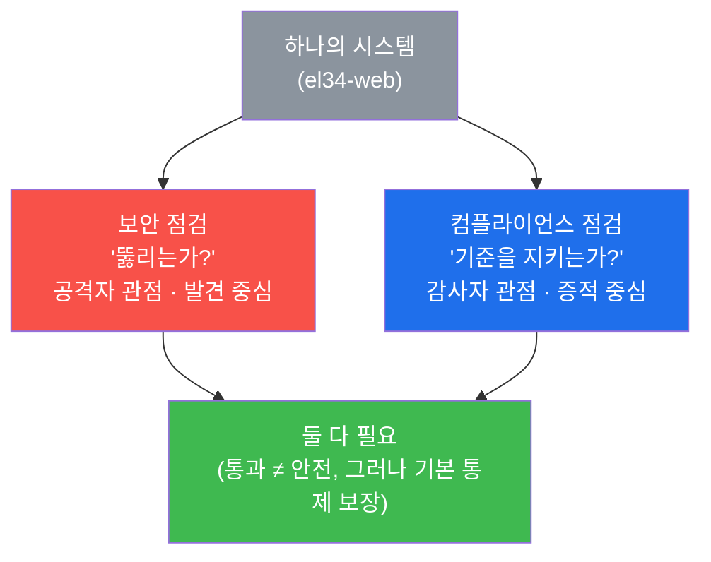
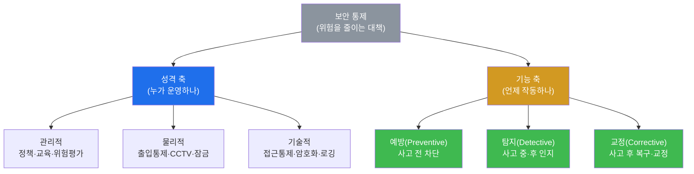
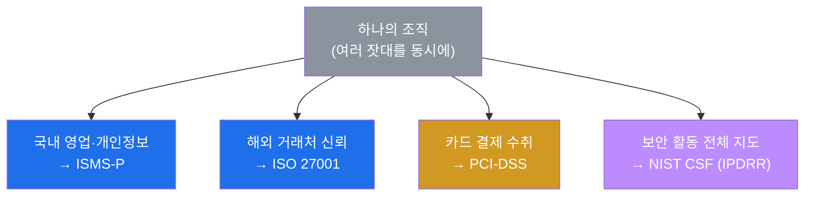
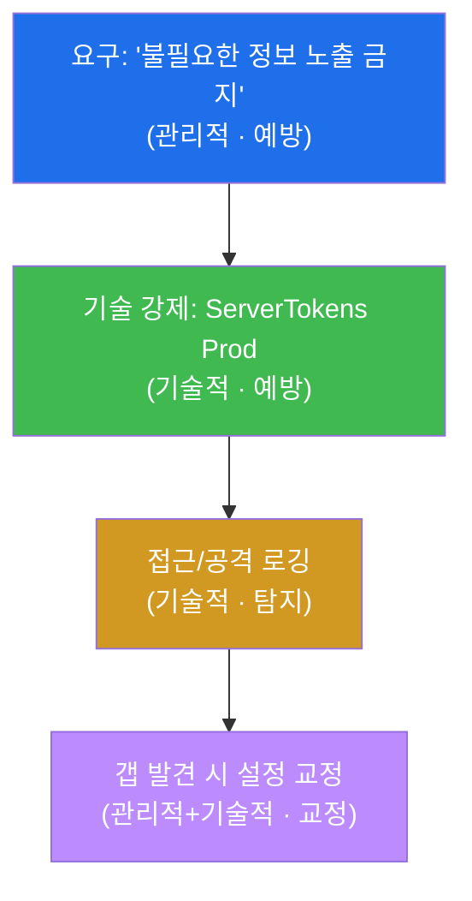
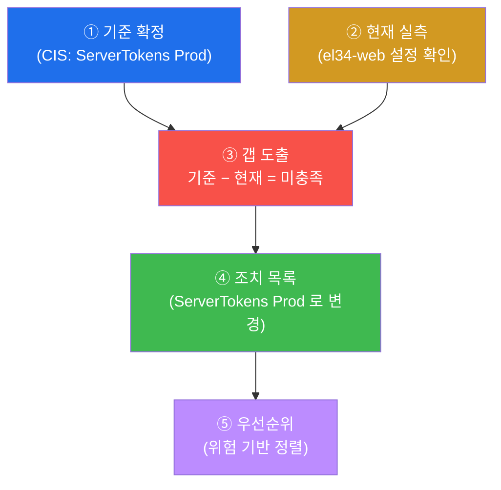
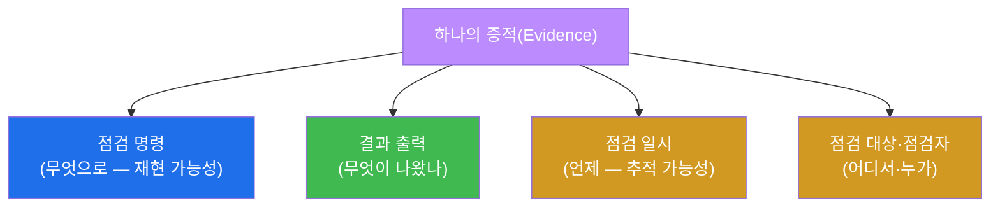
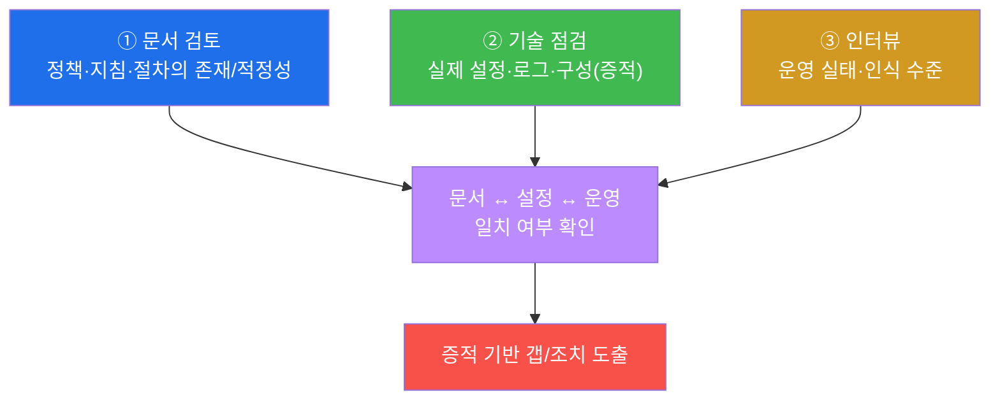
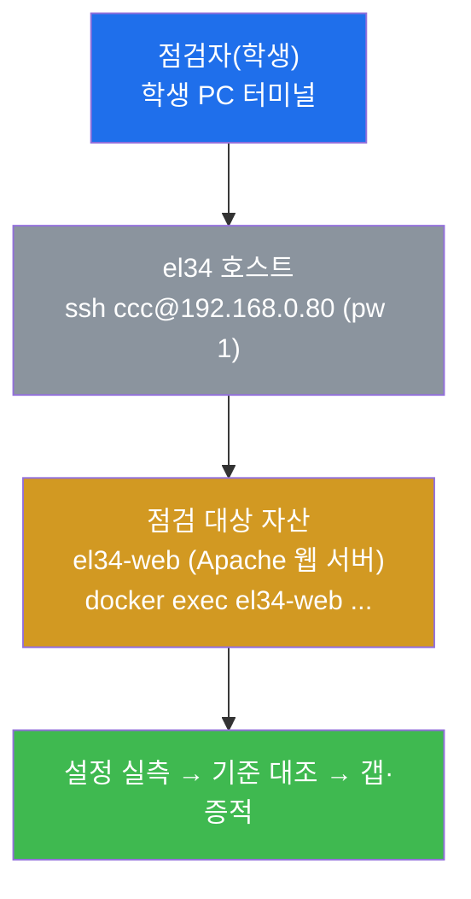
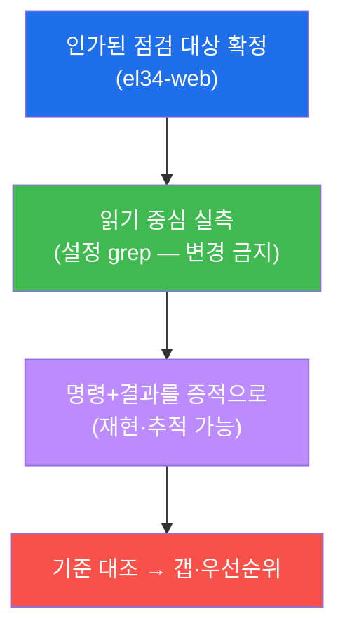
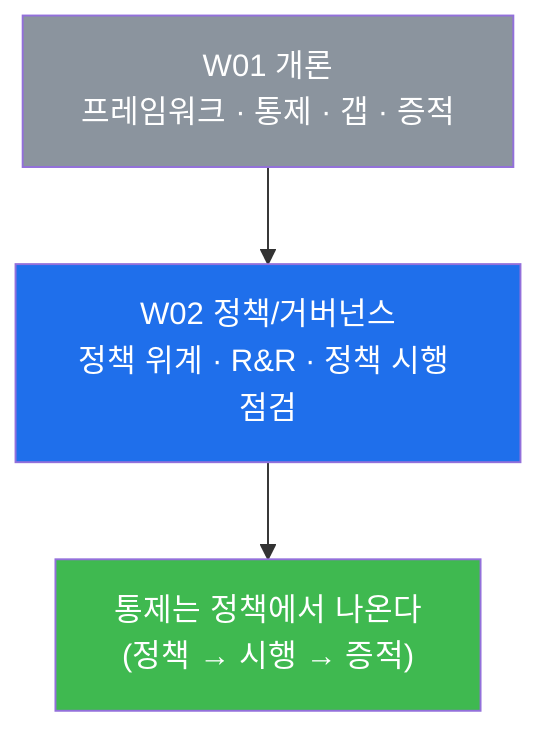

# 컴플라이언스 W01 — 개론: 프레임워크 · 통제 · 갭 분석

> **본 주차의 한 줄 요약**
>
> 공격·웹취약점 트랙이 "이 시스템이 뚫리는가?"를 묻는다면, 컴플라이언스 트랙은 **"이 시스템이
> 지켜야 할 기준을 실제로 지키고 있는가, 그리고 그것을 증거로 증명할 수 있는가?"** 를 묻는다.
> 1주차에는 감사자(auditor)의 시선으로 보안을 다시 바라보는 법을 익힌다. 학생은 주요
> 컴플라이언스 **프레임워크**(ISMS-P / ISO 27001 / PCI-DSS / NIST CSF)가 무엇을 요구하는지,
> 보안 **통제**를 어떤 유형으로 나누는지, 그리고 "지켜야 할 기준"과 "실제 현재 상태"의 차이를
> 찾아내는 **갭 분석(gap analysis)** 이 무엇인지 배운다. 마지막엔 el34 의 실제 웹 서버
> 설정(`el34-web` 의 Apache `ServerTokens`)을 직접 점검해, 기준 미달(갭)을 **증적과 함께**
> 발견하는 한 바퀴를 손으로 돌려 본다.
>
> **감사자 한 줄 결론**: 컴플라이언스는 "안전하다"는 느낌이 아니라, **"기준을 지킨다는 사실을
> 재현 가능한 증거로 증명"** 하는 일이다. 통제가 문서에만 있고 실제로 동작하지 않으면 그것은
> 통제가 아니라 "문서상 보안"이며, 감사에서 인정받지 못한다.

---

## 학습 목표

본 주차 종료 시 학생은 다음 6가지를 **본인 손으로** 할 수 있어야 한다.

1. 주요 컴플라이언스 프레임워크 4종(ISMS-P · ISO 27001 · PCI-DSS · NIST CSF)이 각각 **어느 업종·
   규제를 위해 무엇을 요구하는지**, 그리고 한 조직이 왜 둘 이상을 동시에 따르게 되는지 설명한다.
2. 임의의 보안 통제를 **관리적 / 물리적 / 기술적**(통제의 성격) 그리고 **예방 / 탐지 / 교정**(통제의
   기능)이라는 두 축으로 분류하고, 왜 한 유형만으로는 부족한지(심층 방어) 설명한다.
3. el34 호스트(`ssh ccc@192.168.0.80`)에서 점검 대상 컨테이너(`el34-web`)에 `docker exec` 로
   진입해, 컴플라이언스 점검의 첫 단계인 **점검 대상 자산 확정**을 수행한다.
4. el34-web 의 Apache `ServerTokens` 실제 설정값을 점검해, **CIS 기준(Prod)과 현재 상태(OS)의 차이
   = 갭(버전 배너 노출)** 을 본인 손으로 발견한다.
5. 발견한 갭을 **기준(요구) − 현재(실측) = 조치 목록** 형태로 정리하고, 그 점검 결과가 감사에서
   인정받기 위한 **증적(evidence)의 요건**(재현 가능·추적 가능)을 충족시킨다.
6. 컴플라이언스 점검의 **3축 방법론**(문서 검토 · 기술 점검 · 인터뷰)을 이해하고, 이번 주차의 모든
   발견을 프레임워크 · 통제 · 갭 분석 · 증적이 담긴 1페이지 개요 보고서로 종합한다.

> **이번 주차의 시선** — W01 은 새로운 공격 기법을 배우는 주가 아니라, **보안을 "감사자의 눈"으로
> 보는 사고의 틀**을 세우는 주다. 같은 Apache 설정 한 줄이라도, 공격자는 "이걸로 뭘 뚫을까"를
> 보지만 감사자는 "이게 어떤 기준의 어느 조항을 위반하며, 그 증거는 무엇인가"를 본다. 이 시선의
> 전환이 컴플라이언스 트랙 전체의 출발점이다.

---

## 0. 용어 해설 (컴플라이언스 입문)

본 주차에 처음 등장하는 핵심 용어를 먼저 정리한다. 본문에서 다시 나올 때 막히면 이 표로 돌아오면
흐름이 끊기지 않는다.

| 용어 | 영문 | 뜻 | 비유 |
|------|------|----|------|
| **컴플라이언스** | Compliance | 규제·계약·인증이 요구하는 기준을 지키고 그것을 증명하는 활동 | 식당이 위생 기준을 지키고 위생 등급을 받는 것 |
| **프레임워크** | Framework | 무엇을·어떻게 통제해야 하는지를 정리한 표준 체계 | 건축 법규(어떻게 지어야 안전한가의 기준집) |
| **ISMS-P** | Information Security Management System-Privacy | 한국의 정보보호·개인정보보호 관리체계 인증 | 한국형 종합 안전 인증 |
| **ISO 27001** | — | 국제 정보보안 관리체계(ISMS) 표준 | 국제 통용 안전 자격증 |
| **PCI-DSS** | Payment Card Industry Data Security Standard | 카드 결제 데이터를 다루면 의무인 보안 표준 | 현금 취급 매장의 금고·CCTV 의무 규정 |
| **NIST CSF** | NIST Cybersecurity Framework | 미국 NIST 의 사이버보안 5단계 기능 모델 | 화재 대응 매뉴얼(예방→감지→진압→복구) |
| **통제** | Control | 위험을 줄이기 위해 적용하는 구체적 대책 | 안전을 위한 개별 장치(자물쇠·CCTV·교육) |
| **갭 분석** | Gap Analysis | 요구 기준과 현재 상태의 차이(미충족)를 찾는 활동 | 점검표와 실제를 대조해 빠진 항목 찾기 |
| **증적** | Evidence | 점검 결과를 뒷받침하는 재현·추적 가능한 증거 | 점검 사진·서명·일시가 찍힌 점검 확인서 |
| **감사** | Audit | 기준 준수 여부를 제3자가 증거 기반으로 검증하는 절차 | 위생 검사관의 매장 실사 |
| **벤치마크** | Benchmark | 특정 제품의 권장 보안 설정 기준집(예: CIS) | 차종별 정비 매뉴얼 |
| **CIS** | Center for Internet Security | 제품별 보안 설정 벤치마크를 발행하는 비영리 단체 | 정비 매뉴얼을 펴내는 표준 기관 |
| **ServerTokens** | — | Apache 가 응답에 자기 버전·OS 를 얼마나 노출할지 정하는 설정 | 가게가 간판에 상호만 쓸지 주인 주소까지 쓸지 |

> **참고 — "표준 / 프레임워크 / 벤치마크"의 관계.** 셋은 추상도가 다르다. **프레임워크/표준**(ISO
> 27001, PCI-DSS)은 "암호화하라", "접근을 통제하라"처럼 **무엇을** 해야 하는지를 정한다.
> **벤치마크**(CIS)는 그것을 특정 제품에서 **어떻게** 구현하는지를 "Apache 의 `ServerTokens` 는
> `Prod` 로 설정하라"처럼 구체적 설정값까지 내려준다. 갭 분석에서 "현재 상태"를 실측할 때 우리가
> 대조하는 잣대가 바로 이 벤치마크다.

---

## 0.5 핵심 개념 — 비유로 먼저 잡기

위 용어 표는 한 줄 정의라 신입생에게는 부족하다. 본 절에서는 컴플라이언스를 처음 만나는 학생이
가장 헷갈리는 4가지를 일상 비유로 풀어 설명한다.

### 0.5.1 컴플라이언스 vs 보안 점검 — "위생 등급" 비유

학생이 식당을 차렸다고 하자. 식당을 안전하게 운영하는 데에는 성격이 다른 두 가지 점검이 있다.

하나는 **"실제로 식중독이 나는가?"** 를 보는 점검이다. 누군가 일부러 상한 재료를 넣어 보거나,
주방의 약한 고리를 찾아 공격해 본다. 이것이 보안 트랙으로 치면 **공격·웹취약점 점검**(penetration
testing)이다 — "뚫리는가?"를 발견 중심으로 본다.

다른 하나는 **"위생 기준을 지키고 있는가?"** 를 보는 점검이다. 위생 검사관이 체크리스트를 들고
와서 "냉장고 온도 기준을 지키는가", "손 씻는 절차가 게시되어 있는가", "그 증거(온도 기록지)가
있는가"를 하나씩 대조한다. 이것이 **컴플라이언스 점검**이다 — "기준을 지키는가?"를 증적 중심으로
본다.

두 점검은 보완 관계이지 대체 관계가 아니다. 위생 등급 A 를 받았다고 식중독이 절대 안 나는 것은
아니듯, **컴플라이언스 통과 ≠ 절대 안전**이다. 그러나 컴플라이언스는 "최소한 지켜야 할 기본
통제가 갖춰졌고 그것이 증거로 입증된다"를 보장한다. 그래서 둘 다 필요하다.



### 0.5.2 프레임워크 — "건축 법규" 비유

집을 지을 때, 목수 한 명 한 명이 각자 생각하는 대로 지으면 안전을 보장할 수 없다. 그래서 나라는
**건축 법규**를 둔다. "기둥은 이 굵기 이상", "비상구는 몇 개 이상", "내화 자재를 써라" 같은
기준을 한곳에 정리해 둔 것이다. 건축가는 이 법규를 잣대로 설계하고, 검사관은 이 법규를 잣대로
준공을 검사한다.

보안에서 이 건축 법규에 해당하는 것이 **프레임워크**다. **프레임워크**는 "보안을 위해 무엇을·
어떻게 통제해야 하는가"를 항목별로 정리해 둔 표준 체계다. 조직은 이 프레임워크를 잣대로 통제를
설계하고, 감사자는 이 프레임워크를 잣대로 준수 여부를 검사한다.

법규가 나라마다·용도마다 다르듯, 프레임워크도 여럿이다. 국내 종합 인증용(ISMS-P), 국제
통용용(ISO 27001), 카드 결제 전용(PCI-DSS), 미국 정부·기관용(NIST CSF) 등. 한 조직이 여러 법규를
동시에 받듯, 한 회사가 여러 프레임워크를 동시에 따르는 일도 흔하다(예: 국내 영업이라 ISMS-P, 해외
거래처 요구로 ISO 27001, 카드 결제를 받으니 PCI-DSS).

### 0.5.3 통제의 두 축 — "집 안전"으로 묶어 보기

집을 안전하게 지키는 방법을 떠올려 보자. 방법은 성격이 제각각이다 — 가족에게 "문단속 규칙"을
교육하는 것, 현관에 자물쇠를 다는 것, 마당에 CCTV 를 다는 것, 보험에 드는 것. 이렇게 위험을 줄이는
개별 대책 하나하나가 **통제(control)** 다.

통제는 두 가지 축으로 분류하면 머릿속이 정리된다.

첫째, **성격(누가 운영하나)** 축이다. **관리적 통제**는 사람·절차로 하는 것(문단속 규칙 교육,
방문자 명부), **물리적 통제**는 물리 장치로 하는 것(자물쇠, 담장, CCTV), **기술적 통제**는 IT
기술로 하는 것(현관 디지털 도어록의 비밀번호, 침입 알림 앱)이다.

둘째, **기능(언제 작동하나)** 축이다. **예방(Preventive) 통제**는 사고가 나기 전에 막는 것(자물쇠),
**탐지(Detective) 통제**는 사고가 나는 중·후에 알아채는 것(CCTV, 침입 알림), **교정(Corrective)
통제**는 사고 후 복구·교정하는 것(보험, 자물쇠 교체)이다.

핵심은, **한 종류만으로는 부족하다**는 것이다. 자물쇠(예방)만 있고 CCTV(탐지)가 없으면 누가
언제 침입했는지 모르고, CCTV(탐지)만 있고 자물쇠(예방)가 없으면 침입은 막지 못한다. 그래서 여러
유형을 겹겹이 배치한다 — 이것이 보안의 **심층 방어(Defense in Depth)** 원리다. 컴플라이언스 점검은
"통제가 한쪽에만 쏠려 있지 않은가"를 이 두 축으로 본다.



### 0.5.4 갭 분석 — "체크리스트와 실제의 차이" 비유

위생 검사관이 식당에 와서 점검표를 펼친다. 점검표 왼쪽에는 "지켜야 할 기준"이 적혀 있다 —
"냉장고 5℃ 이하", "유통기한 라벨 부착", "손 소독제 비치". 검사관은 한 항목씩 **실제 매장 상태**와
대조하며 "충족 / 미충족"을 표시한다. 미충족으로 표시된 항목들의 묶음이 곧 **고쳐야 할 일의
목록**이 된다.

이 "기준 ↔ 현재 대조 → 미충족 도출"이 보안에서는 **갭 분석(gap analysis)** 이다. 수식으로 적으면
간단하다.

```
 갭(Gap) = 요구 기준(있어야 할 상태) − 현재 상태(실측한 상태)
 → 갭의 목록 = 조치(remediation) 목록
```

예컨대 기준이 "Apache 는 버전을 숨겨라(`ServerTokens Prod`)"인데 실측해 보니 현재가 "버전+OS 를
노출(`ServerTokens OS`)"이라면, 그 차이가 갭이고, "`ServerTokens` 를 `Prod` 로 바꿔라"가 조치다.
갭 분석의 핵심은 **추측이 아니라 실측**이라는 점이다 — "아마 됐을 것이다"가 아니라, 실제 설정을
명령으로 확인해 증거와 함께 차이를 적는다. 이번 주차 실습의 lab 4·5 가 바로 이 한 바퀴다.

---

## 1. 컴플라이언스란 무엇인가 — 감사자의 시선

### 1.1 한 줄 정의

**컴플라이언스(Compliance)** 는 규제·계약·인증이 요구하는 보안 기준을 **지키고, 지킨다는 사실을
증거로 증명**하는 활동이다.

### 1.2 왜 중요한가 — "느낌"이 아니라 "증명"

보안 담당자가 "우리는 안전합니다"라고 말하는 것만으로는 규제 기관도, 거래처도, 고객도 믿어 주지
않는다. 컴플라이언스가 중요한 이유는 보안을 **주관적 느낌에서 객관적 증명으로** 끌어올리기
때문이다. 컴플라이언스가 답해야 하는 질문은 세 가지다.

첫째, **무엇을 지켜야 하는가?** — 우리 업종·규제에 맞는 기준(프레임워크)이 무엇인지 정한다.

둘째, **실제로 지키고 있는가?** — 그 기준 대비 현재 상태를 실측해 차이(갭)를 찾는다.

셋째, **지킨다는 것을 어떻게 증명하는가?** — 점검 결과를 재현·추적 가능한 증적으로 남긴다.

이 세 질문이 곧 이번 주차의 본문 §2(무엇을), §4(실제로 지키나=갭), §5(증명=증적)의 골격이다.

### 1.3 보안 점검과의 차이

앞의 위생 등급 비유(§0.5.1)에서 보았듯, 보안 점검과 컴플라이언스 점검은 **시선의 방향**이 다르다.
보안 점검은 공격자의 시선으로 "뚫리는 약점"을 **발견**하고, 컴플라이언스 점검은 감사자의 시선으로
"지켜야 할 기준의 충족 여부"를 **증명**한다. 둘은 같은 시스템을 다른 각도에서 비추는 두 개의
조명이다.

| 구분 | 보안 점검(공격·웹취약점 트랙) | 컴플라이언스 점검(본 트랙) |
|------|------------------------------|----------------------------|
| 핵심 질문 | "이게 뚫리는가?" | "기준을 지키는가?" |
| 관점 | 공격자(attacker) | 감사자(auditor) |
| 산출물의 중심 | 취약점 발견·익스플로잇 | 기준 대비 갭 + 증적 |
| 합격의 의미 | 뚫리지 않음(시점 한정) | 기준 충족을 증거로 입증 |

### 1.4 한계 — 컴플라이언스가 보장하지 못하는 것

컴플라이언스에는 분명한 한계가 있다. **컴플라이언스 통과가 곧 안전을 뜻하지는 않는다.** 기준은
대개 "최소한"을 정하므로, 기준을 다 충족해도 신종 공격(0-day)이나 기준이 미처 다루지 못한
빈틈으로 뚫릴 수 있다. 또한 점검은 **시점**의 사진이라, 점검 후 설정이 바뀌면 다시 갭이 생긴다.
그래서 컴플라이언스는 보안 점검·관제와 함께 가야 하며, 1회성 행사가 아니라 주기적으로 반복하는
공정이어야 한다.

---

## 2. 주요 프레임워크 4종

이번 트랙에서 잣대로 쓰는 대표 프레임워크 4종을 살펴본다. 각 프레임워크가 **누구를 위해 무엇을
요구하는지**를 이해하면, "우리 조직은 어느 잣대로 점검받아야 하는가"를 판단할 수 있다.

### 2.1 ISMS-P — 한국형 종합 인증

**한 줄 정의.** ISMS-P(Information Security Management System-Privacy)는 한국 정부가 운영하는
**정보보호 + 개인정보보호 통합 관리체계 인증**이다.

**왜 중요한가.** 일정 규모 이상의 정보통신서비스 제공자(대형 포털·쇼핑몰 등)는 법적으로 ISMS
인증이 의무다. 즉 국내에서 사업하려면 "지키면 좋은" 것이 아니라 "안 지키면 안 되는" 강제 기준인
경우가 많다. ISMS-P 는 크게 세 영역으로 통제를 나눈다 — **관리체계 수립·운영**(경영진 참여·위험
관리 등), **보호대책 요구사항**(접근통제·암호화·로깅 등 기술/물리 통제), **개인정보 처리단계별
요구사항**(수집·이용·파기 등).

**el34 에서 어떻게.** el34-web 의 접근통제 설정(예: SSH `PermitRootLogin no`, W02 에서 점검)이나
로깅·암호화 설정은 ISMS-P 의 보호대책 영역에 해당하는 통제다. 이번 주차에는 그중 가장 단순한
기술 통제 하나(버전 노출 최소화)를 점검한다.

**한계.** ISMS-P 는 국내 인증이라 해외 거래처가 직접 요구하는 경우는 드물다. 글로벌 신뢰가
필요하면 ISO 27001 을 함께 받는다.

### 2.2 ISO 27001 — 국제 통용 표준

**한 줄 정의.** ISO 27001 은 정보보안 관리체계(ISMS)에 대한 **국제 표준**으로, 전 세계에서 통용되는
보안 자격증 격이다.

**왜 중요한가.** 해외 거래처나 글로벌 고객은 "당신 회사가 보안을 체계적으로 관리한다는 국제적
증명"을 요구한다. 그 표준 답이 ISO 27001 인증이다. ISO 27001 본문은 관리체계 요구사항(PDCA —
Plan-Do-Check-Act 순환으로 보안을 지속 개선)을 정하고, 부속서 **Annex A** 에 구체적 통제 목록을
둔다(2022 개정판 기준 93개 통제).

> **용어 — PDCA / Annex A.** **PDCA** 는 계획(Plan) → 실행(Do) → 점검(Check) → 개선(Act) 을 반복해
> 관리체계를 끊임없이 개선하는 순환 모델이다. **Annex A** 는 ISO 27001 의 부속서로, "접근통제",
> "암호화", "로깅·모니터링" 같은 통제 항목을 카테고리별로 나열한 통제 카탈로그다. 갭 분석 시
> "Annex A 의 어느 통제가 미충족인가"를 항목 번호로 짚는다.

**el34 에서 어떻게.** el34-web 의 로깅 설정은 Annex A 의 "로깅 및 모니터링" 통제에, 버전 배너 숨김은
"기술적 취약점 관리/정보 최소화" 통제에 매핑된다.

**한계.** ISO 27001 은 "무엇을" 하라까지만 정하고, 특정 제품에서 "어떻게" 설정하라는 구체값은 주지
않는다. 그 구체값은 CIS 같은 벤치마크가 보완한다(§0 참고 박스).

### 2.3 PCI-DSS — 카드 결제 데이터 전용

**한 줄 정의.** PCI-DSS(Payment Card Industry Data Security Standard)는 **신용카드 데이터를 저장·처리·
전송하는 모든 조직에 적용되는 보안 표준**이다.

**왜 중요한가.** 카드 결제를 받는 순간(쇼핑몰·결제대행사 등) 이 표준은 카드사 계약상 의무가 된다.
ISO 27001 이 폭넓은 "관리체계"라면, PCI-DSS 는 카드 데이터라는 **특정 자산**에 초점을 맞춰 매우
구체적인 12개 요구사항을 제시한다. 대표적으로 요구사항 **3·4**(저장·전송 시 카드 데이터 암호화),
**8**(접근 식별·인증), **10**(모든 접근을 로그로 추적), **11**(정기 취약점 점검) 등이 있다.

**el34 에서 어떻게.** el34-web 의 TLS(HTTPS) 설정은 PCI-DSS 요구사항 4(전송 암호화)에, 접근 로그는
요구사항 10(추적)에 해당한다. 버전 배너 노출 같은 "불필요한 정보 노출"은 공격 표면을 넓히므로
PCI-DSS 가 강조하는 "정보 최소화" 원칙에 어긋난다.

**한계.** PCI-DSS 는 카드 데이터에 특화되어 있어, 카드와 무관한 영역의 보안은 별도 프레임워크로
다뤄야 한다.

### 2.4 NIST CSF — 기능 중심 5단계 모델

**한 줄 정의.** NIST CSF(Cybersecurity Framework)는 미국 표준기술연구소(NIST)가 만든 사이버보안
프레임워크로, 보안 활동을 **5개의 기능(function)** 으로 나눠 본다.

**왜 중요한가.** 위 세 프레임워크가 "통제 항목 목록"에 가깝다면, NIST CSF 는 보안을 **활동의 흐름**
으로 본다 — 식별(Identify) → 보호(Protect) → 탐지(Detect) → 대응(Respond) → 복구(Recover). 영문
머리글자를 따 **IPDRR** 로 외운다. 이 흐름은 화재 대응(예방 점검 → 차단 → 화재 감지 → 진압 → 복구)과
구조가 같아 직관적이다.

> **용어 — IPDRR(Identify·Protect·Detect·Respond·Recover).** **식별**은 무엇을 지켜야 하는지(자산·
> 위험)를 파악하는 단계, **보호**는 사고를 막는 통제를 적용하는 단계, **탐지**는 사고를 알아채는
> 단계, **대응**은 사고에 조치하는 단계, **복구**는 정상으로 되돌리는 단계다. §0.5.3 의 예방/탐지/
> 교정 기능 축과도 통한다(예방=Protect, 탐지=Detect, 교정=Respond/Recover).

**el34 에서 어떻게.** el34 인프라 전체가 이 IPDRR 흐름을 모사한다 — 자산 식별(컨테이너 인벤토리),
보호(방화벽·WAF), 탐지(IDS·SIEM), 대응·복구(분석·조치). 이번 주차 점검(자산 확정 → 설정 점검 →
갭 도출)은 그중 식별·보호 단계에 해당한다.

**한계.** NIST CSF 는 "기능의 틀"이라 인증 제도가 아니다(통과/불통과로 인증서를 주지 않는다). 보안
프로그램을 **구성하는 지도**로 쓰되, 인증이 필요하면 ISMS-P/ISO 27001/PCI-DSS 를 함께 쓴다.

### 2.5 한눈에 비교 — 어느 잣대를 언제 쓰나

네 프레임워크는 경쟁 관계가 아니라, **목적이 다른 네 자루의 잣대**다. 한 조직이 동시에 여럿을
따르는 일이 흔하다.

| 프레임워크 | 누구를 위해 | 핵심 구조 | 인증 여부 |
|-----------|------------|----------|----------|
| **ISMS-P** | 한국 내 정보통신서비스(법적 의무 많음) | 관리체계 + 보호대책 + 개인정보 | 인증 제도 |
| **ISO 27001** | 국제 통용·글로벌 거래 | PDCA + Annex A 통제(93개) | 인증 제도 |
| **PCI-DSS** | 카드 결제를 다루는 조직 | 12개 요구사항(암호화·로깅·점검) | 준수 검증 |
| **NIST CSF** | 보안 프로그램의 전체 지도 | IPDRR 5 기능 | 인증 아님(틀) |



> **이번 주차 lab 과의 연결.** lab 미션 2 에서 학생은 이 네 프레임워크를 직접 식별하는 명령을
> 실행한다. 핵심은 이름을 외우는 것이 아니라, **"어느 업종·규제에는 어느 잣대"** 를 연결하는
> 판단력이다.

---

## 3. 통제 — 두 축으로 분류하기

### 3.1 통제란 무엇인가

**한 줄 정의.** 통제(control)는 식별된 위험을 줄이기 위해 적용하는 **구체적 대책**이다.

**왜 중요한가.** 프레임워크가 "이런 위험을 통제하라"는 요구라면, 통제는 그 요구를 실제 현실에
구현한 개별 장치다. 컴플라이언스 점검의 핵심은 "요구된 통제가 (1) 존재하는가, (2) 실제로
작동하는가"를 확인하는 것이다. 그래서 통제를 체계적으로 분류할 줄 알아야, 점검에서 빠뜨리는
영역이 없게 된다.

### 3.2 첫째 축 — 성격(관리적 / 물리적 / 기술적)

§0.5.3 의 집 비유에서 보았듯, 통제는 **누가·무엇으로 운영하느냐**에 따라 세 가지로 나뉜다.

**관리적(Administrative) 통제**는 사람과 절차로 하는 통제다. 보안 정책 문서, 직원 보안 교육, 위험
평가, 접근 권한 승인 절차가 여기에 속한다. el34 맥락에서는 "원격 root 직접 로그인 금지"라는
**정책 자체**가 관리적 통제다(그것을 기술로 강제한 설정은 기술적 통제).

**물리적(Physical) 통제**는 물리 장치·환경으로 하는 통제다. 서버실 출입통제, CCTV, 잠금장치,
화재 진압 설비가 여기에 속한다. el34 는 가상 실습 환경이라 물리 통제를 직접 점검하지는 않지만,
실제 데이터센터에서는 중요한 축이다.

**기술적(Technical) 통제**는 IT 기술로 하는 통제다. 접근통제(인증·권한), 암호화, 로깅, 방화벽,
WAF 가 여기에 속한다. **이번 주차에 점검하는 ServerTokens 설정이 바로 기술적 통제**다 — 정책이
"불필요한 정보를 노출하지 마라"라고 요구하면, 그것을 Apache 설정으로 강제하는 것이 기술적 통제다.

### 3.3 둘째 축 — 기능(예방 / 탐지 / 교정)

같은 통제를 **언제 작동하느냐**로 보면 또 다르게 나뉜다.

**예방(Preventive)** 통제는 사고가 나기 전에 막는다 — 방화벽 차단, 접근 권한 제한, 입력 검증.
**탐지(Detective)** 통제는 사고가 나는 중·후에 알아챈다 — IDS, SIEM 알림, 로그 모니터링.
**교정(Corrective)** 통제는 사고 후 복구·교정한다 — 백업 복원, 패치 적용, 사고 대응 절차.

이 기능 축은 NIST CSF 의 Protect / Detect / Respond·Recover 와 자연스럽게 대응한다(§2.4).

### 3.4 왜 두 축으로 보나 — 심층 방어 점검

통제를 두 축으로 보는 이유는 **균형**을 점검하기 위해서다. 통제가 한쪽(예: 예방)에만 쏠려 있으면,
그 한 겹이 우회되는 순간 무방비가 된다. 그래서 예방·탐지·교정을, 그리고 관리·물리·기술을 **겹겹이
배치**하는 것이 심층 방어(Defense in Depth)다. 감사자는 "이 조직의 통제가 한쪽으로 쏠려 있지
않은가, 빠진 유형은 없는가"를 이 두 축으로 점검한다.



위 그림은 하나의 요구(정보 노출 금지)가 어떻게 여러 유형의 통제로 겹겹이 구현되는지를 보여 준다.
**한계** — 통제가 많다고 무조건 좋은 것은 아니다. 운영 부담·비용도 위험에 비례해야 하므로, 통제는
"위험 기반(risk-based)"으로 우선순위를 두어 배치한다.

---

## 4. 갭 분석 — 기준과 현재의 차이

### 4.1 한 줄 정의

**갭 분석(gap analysis)** 은 **요구 기준(있어야 할 상태)과 현재 상태(실측한 상태)의 차이(미충족)**
를 찾아 조치 목록으로 만드는 활동이다.

### 4.2 왜 중요한가 — 추측이 아니라 실측

갭 분석이 컴플라이언스의 심장인 이유는, 이것이 **"잘 되고 있겠지"라는 추측을 "실제로 이렇다"는
실측으로** 바꾸기 때문이다. 점검자는 "아마 버전이 숨겨졌을 것"이라고 가정하지 않는다. 실제 설정을
명령으로 확인해, 기준과 다르면 그 차이를 증거와 함께 적는다. 갭의 목록이 곧 조치(remediation)의
목록이 되고, 그 우선순위는 위험의 크기로 정한다.



### 4.3 el34 에서 어떻게 — ServerTokens 갭

이번 주차의 실제 점검 대상은 el34-web(Apache 웹 서버)의 **ServerTokens** 설정이다.

> **용어 — ServerTokens.** Apache 가 HTTP 응답의 `Server:` 헤더와 오류 페이지에 **자기 자신의 정보를
> 얼마나 노출할지**를 정하는 설정이다. 값에 따라 노출 범위가 다르다 — `Full`/`OS` 는 제품 버전과 OS
> 까지(`Apache/2.4.52 (Ubuntu)`), `Prod` 는 제품명만(`Apache`) 노출한다. 가게가 간판에 "OO상회"만
> 쓸지(`Prod`), "OO상회 — 주인 김OO, 서울 OO동 거주"까지 쓸지(`OS`)의 차이로 생각하면 된다.

**왜 이것이 갭인가.** CIS Apache 2.4 벤치마크는 공격 표면 최소화를 위해 **`ServerTokens Prod`**(제품명
만 노출)를 권장한다. 공격자에게 정확한 버전·OS 를 알려 주면, 그 버전에 맞는 알려진 취약점(CVE)을
바로 찾아 공격하기 쉬워지기 때문이다. el34-web 은 현재 `ServerTokens OS` 로 설정되어 있어
`Apache/2.4.52 (Ubuntu)` 처럼 제품 버전과 OS 를 노출한다. 즉 **설정은 되어 있으나(`OS`) 기준이
요구하는 값(`Prod`)이 아니므로, 버전 배너 노출이라는 갭**이 존재한다.

실측 명령은 다음과 같다(lab 미션 4 와 동일).

```bash
docker exec el34-web sh -c 'V=$(grep -rhiE "^[[:space:]]*ServerTokens" /etc/apache2/ 2>/dev/null | head -1); echo "current:$V"; echo "$V" | grep -qi "Prod" && echo "compliant" || echo "gap=not_Prod"'
```

이 명령을 한 부분씩 읽어 보면 점검 논리가 그대로 드러난다.

- `docker exec el34-web sh -c '...'` — el34 호스트에서 점검 대상 컨테이너(el34-web) 안에 명령을 보낸다.
- `grep -rhiE "^[[:space:]]*ServerTokens" /etc/apache2/` — Apache 설정 디렉터리 전체를 뒤져
  `ServerTokens` 로 시작하는 줄을 찾는다(`-r` 하위 포함, `-h` 파일명 숨김, `-i` 대소문자 무시,
  `-E` 확장 정규식, `^[[:space:]]*` 는 줄 앞 공백 허용).
- `echo "$V" | grep -qi "Prod" && echo "compliant" || echo "gap=not_Prod"` — 찾은 값에 `Prod` 가
  있으면 `compliant`, 없으면 `gap=not_Prod` 를 출력한다. **이 한 줄이 곧 자동 갭 판정 로직**이다.

**예상 출력**:
```
current:	ServerTokens OS
gap=not_Prod
```

`current:` 줄이 현재 실측값(증적), `gap=not_Prod` 줄이 갭 판정 결과다. 이렇게 "현재값 + 판정"을 한
번에 출력하면 그 자체로 작은 증적이 된다.

### 4.4 한계

갭 분석의 결과는 **점검 시점의 사진**이다. 오늘 갭을 조치했더라도 누군가 설정을 되돌리면 갭이
재발한다. 그래서 갭 분석은 1회성으로 끝내지 않고, 정책·자동화로 **지속 점검**하는 것이 원칙이다.
또한 갭이 발견됐다고 모두 같은 시급도로 고치는 것은 아니다 — 위험이 큰 갭부터 우선 조치한다.

---

## 5. 증적 — 감사에서 인정받는 증거

### 5.1 한 줄 정의

**증적(evidence)** 은 점검 결과를 뒷받침하는, **재현 가능하고 추적 가능한 증거**다.

### 5.2 왜 중요한가 — "했다"가 아니라 "이렇게 했다"

감사에서 "점검했습니다"라는 말은 증거가 아니다. 감사자는 **"무엇을·언제·누가·어떤 명령으로
점검했고, 그 결과가 무엇이었는가"** 를 본다. 증적이 없는 점검 결과는 감사에서 인정받지 못한다.
좋은 증적은 두 요건을 갖춘다.

첫째, **재현 가능성**이다 — 같은 명령을 다시 실행하면 같은 결과가 나와야 한다. 그래서 증적에는
"실행한 명령"이 반드시 포함된다.

둘째, **추적 가능성**이다 — 그 결과가 언제·어느 대상에서·누가 수집했는지 출처가 명확해야 한다.
그래서 증적에는 "점검 일시·대상·점검자"가 함께 기록된다.

### 5.3 증적의 구성

하나의 증적은 다음 네 요소로 구성된다.



### 5.4 el34 에서 어떻게

§4.3 의 ServerTokens 점검이 좋은 증적의 예다. 점검 명령(`grep ... ServerTokens`)과 그 결과
출력(`ServerTokens OS` / `gap=not_Prod`)을 함께 캡처하고, 점검한 일시와 대상(el34-web)을 적으면,
이 묶음이 "el34-web 의 버전 배너 노출 갭"에 대한 재현·추적 가능한 증적이 된다. 누군가 의심하면
같은 명령을 다시 돌려 검증할 수 있다.

### 5.5 한계

증적은 수집 시점의 상태만 증명한다. 또한 출력만 캡처하고 명령을 빠뜨리면 재현이 불가능해 증적
가치가 떨어진다. 증적은 **명령과 결과를 항상 한 쌍으로** 남기는 것이 원칙이다.

---

## 6. 점검 방법론 — 3축

### 6.1 한 줄 정의

컴플라이언스 점검은 **문서 검토 · 기술 점검 · 인터뷰** 세 축을 교차해, "문서상 통제"와 "실제 통제"가
일치하는지를 증적으로 확인하는 활동이다.

### 6.2 세 축이 왜 모두 필요한가

한 축만으로는 진실을 다 보지 못한다. 세 축은 서로의 사각을 메운다.

**문서 검토**는 정책·지침·절차가 존재하고 적정한지를 본다. 그러나 문서가 있다고 실제로 지켜지는
것은 아니다(문서상 보안의 함정).

**기술 점검**은 실제 설정·로그·구성을 확인한다(이번 주차의 ServerTokens 점검이 여기 속한다).
이것이 "실제로 지켜지는가"의 가장 강력한 증거다. 그러나 기술 점검만으로는 운영자가 그 통제를
**이해하고 일상에서 운영하는지**까지는 알 수 없다.

**인터뷰**는 운영 실태와 담당자의 인식 수준을 본다. "이 로그를 매일 누가 보나요?"처럼 묻는다.
문서와 설정이 갖춰져 있어도 아무도 운영하지 않으면 통제는 죽은 것이다.

이 세 축을 교차하면 "문서에는 있다 / 설정도 됐다 / 그러나 아무도 안 본다"처럼 **층위별 불일치**를
잡아낼 수 있다. 컴플라이언스 점검의 정수는 바로 이 **문서–설정–운영의 일치 확인**이다.



### 6.3 한계

세 축 중 인터뷰는 주관적 진술이라 그 자체로는 증적이 약하다. 그래서 인터뷰에서 나온 주장은 가능한
한 문서·설정으로 교차 검증한다. 또한 이번 주차 실습은 단일 호스트 환경이라 기술 점검 중심으로
진행하지만, 실제 감사에서는 세 축이 함께 간다는 점을 기억해야 한다.

---

## 7. el34 점검 환경 — 접근 모델

이번 주차의 모든 점검 명령은 el34 호스트에 SSH 로 접속한 뒤, 점검 대상 컨테이너에 `docker exec` 로
명령을 보내는 방식으로 실행한다. **신규 도구 설치는 없다** — 점검은 대상에 이미 있는 설정을 "읽기"
중심으로 확인한다.



이번 주차에 점검 대상으로 삼는 자산은 **el34-web** 이다. el34 인프라에서 el34-web 은 외부 요청을
받는 Apache 웹 서버(+ WAF)로, 외부에 직접 노출되는 자산이라 컴플라이언스 점검의 1순위 대상이 되기에
적합하다. 점검의 첫걸음은 항상 "이 대상에 접근 가능한가"를 확인하는 것이다(lab 미션 1).

```bash
ssh ccc@192.168.0.80                          # el34 호스트 접속 (비밀번호: 1)
docker exec el34-web sh -c "hostname; echo target_ok"   # 점검 대상 도달 확인
```

> **왜 el34-web 인가.** 컴플라이언스 점검은 모든 자산을 동시에 보지 않고, **위험이 큰 자산부터**
> 본다. el34-web 은 외부에 노출된 진입점이자 여러 vhost 를 서비스하는 핵심 자산이라, 버전 노출 같은
> 작은 설정 미흡도 공격 표면을 직접 넓힌다. 그래서 개론 실습의 대상으로 삼는다.

---

## 8. 실습 안내 — lab 8 미션 (4축 설명)

이번 주차 실습은 8 미션으로 구성된다. 각 미션을 **4축**으로 설명한다 — 왜 하는가 / 무엇을 알 수
있는가 / 결과 해석(정상 vs 비정상) / 실전 활용. 미션은 컴플라이언스 점검의 한 바퀴를 따라
**점검 대상 확정 → 프레임워크·통제 식별 → 기술 점검 → 갭 분석 → 증적 → 방법론 → 종합 보고** 순으로
흐른다.

> **실습 진행 원칙.** 모든 명령은 el34 호스트(`ssh ccc@192.168.0.80`, 비밀번호 1)에서 `docker exec
> el34-web ...` 로 실행한다. 신규 도구 설치는 없다. 합격 임계값(pass_threshold)은 0.7 이다.

### 미션 1 — 점검 대상 도달 (10점)

> **왜 하는가?** 모든 점검의 전제는 대상에 접근할 수 있다는 것이다. 감사자는 본격 점검 전 항상
> "점검 대상 자산이 실제로 살아 있고 접근 가능한가"부터 확정한다. 접근이 안 되면 이후 모든 점검이
> 무의미하다.
>
> **무엇을 알 수 있는가?** 점검 대상(el34-web)에 `docker exec` 로 접근해 hostname 을 응답받음으로써,
> 대상 자산이 가동 중이며 점검 가능한 상태임을 확인한다.
>
> **결과 해석.** 정상: 출력에 `target_ok` 가 보임(대상 도달 성공). 비정상: 명령이 실패하거나
> 컨테이너를 찾지 못하면, 호스트 접속·컨테이너 이름(el34-web)을 먼저 점검한다.
>
> **실전 활용.** 컴플라이언스 점검 착수 시 첫 단계 — 점검 범위(scope)에 든 자산이 실재하고 접근
> 가능한지 확정하는 절차다.

### 미션 2 — 프레임워크 식별 (12점)

> **왜 하는가?** 컴플라이언스의 첫 질문은 "무엇을 지켜야 하는가"다. 우리 조직·업종에 맞는 잣대
> (프레임워크)를 먼저 정해야, 무엇을 기준으로 점검할지가 정해진다.
>
> **무엇을 알 수 있는가?** 주요 프레임워크 4종(ISMS-P=국내 종합, ISO 27001=국제 ISMS, PCI-DSS=카드
> 결제, NIST CSF=IPDRR 기능 모델)이 각각 누구를 위해 무엇을 요구하는지, 그리고 한 조직이 왜 여럿을
> 동시에 따르는지를 식별한다(§2).
>
> **결과 해석.** 정상: 출력에 `ISMS-P` 등 프레임워크 이름과 그 영역이 나열됨. 핵심은 이름 암기가
> 아니라 "어느 업종·규제 → 어느 잣대"의 연결이다. 비정상: 출력이 비면 명령을 재확인한다.
>
> **실전 활용.** 컴플라이언스 프로젝트 착수 시 "대상 적용 프레임워크 선정"이 가장 먼저 하는 일이다.
> 잘못된 잣대를 고르면 점검 전체가 어긋난다.

### 미션 3 — 통제 유형 분류 (12점)

> **왜 하는가?** 통제를 체계적으로 분류할 줄 알아야 점검에서 빠뜨리는 영역이 없다. 통제가 한쪽으로
> 쏠려 있지 않은지(심층 방어)를 보려면 분류 기준이 필요하다.
>
> **무엇을 알 수 있는가?** 통제를 성격 축(관리적/물리적/기술적)과 기능 축(예방/탐지/교정)으로
> 나누는 법(§3). 예컨대 ServerTokens 설정은 "기술적 · 예방" 통제임을 분류할 수 있게 된다.
>
> **결과 해석.** 정상: 출력에 `기술적` 등 통제 유형이 분류되어 나타남. 비정상: 분류가 빠지면 §3 의
> 두 축을 다시 본다.
>
> **실전 활용.** 점검 체크리스트를 통제 유형별로 구성하면, "물리 통제는 봤는데 관리 통제를 빼먹는"
> 식의 누락을 막는다. 통제 균형 진단의 기본 틀이다.

### 미션 4 — 기술 점검: ServerTokens 갭 (14점)

> **왜 하는가?** 컴플라이언스의 진짜 힘은 추측이 아니라 **실측**에 있다. 실제 설정을 명령으로
> 확인해, 문서상 통제와 실제 통제가 일치하는지를 본다. 이 미션이 이번 주차의 핵심 실습이다.
>
> **무엇을 알 수 있는가?** el34-web 의 Apache `ServerTokens` 실제 값을 확인하고, CIS 기준(Prod)
> 대비 갭이 있는지를 자동 판정한다. 현재 값은 `ServerTokens OS`(제품 버전+OS 노출)로, 기준이 요구
> 하는 `Prod`(제품명만)가 아니므로 **버전 배너 노출 갭**임을 직접 발견한다(§4.3).
>
> **결과 해석.** 정상(갭 발견): 출력에 `gap=` 이 나타남(`current:ServerTokens OS` + `gap=not_Prod`).
> 핵심 깨달음 — "설정이 되어 있다"가 곧 "기준을 충족한다"는 아니다(`OS` 는 설정됐으나 `Prod` 가
> 아니다). 비정상: 출력에 `compliant` 가 나오면 표적·설정을 재확인한다.
>
> **실전 활용.** 기술 점검은 컴플라이언스 점검에서 가장 강력한 증거를 만드는 단계다. "버전을 숨겨
> 공격 표면을 줄여라"는 CIS·PCI-DSS 정보 최소화 요구를 실설정으로 검증하는 표준 절차다.

### 미션 5 — 갭 분석: 기준 vs 현재 (12점)

> **왜 하는가?** 갭을 발견하는 것에서 끝나면 안 된다. 발견을 "기준 − 현재 = 조치"의 구조로 정리해야
> "무엇을 어떻게 고쳐야 하는가"가 명확해진다.
>
> **무엇을 알 수 있는가?** ServerTokens 사례로 갭 분석의 전 과정을 정리하는 법 — 기준(CIS:
> ServerTokens Prod, ServerSignature Off) ↔ 현재(el34-web: ServerTokens OS) → 갭(버전 배너 노출) →
> 조치(apache 설정에 ServerTokens Prod 적용)(§4).
>
> **결과 해석.** 정상: 출력에 `갭` 이 포함되며 기준·현재·조치가 함께 정리됨. 비정상: 조치까지
> 이어지지 않으면 "갭 = 기준 − 현재 = 조치 목록" 수식을 다시 적용한다.
>
> **실전 활용.** 갭 분석 결과표는 컴플라이언스 보고서의 핵심 산출물이다. 각 갭에 위험도를 매겨 조치
> 우선순위(remediation roadmap)로 이어진다.

### 미션 6 — 증적: 재현 가능 증거 (12점)

> **왜 하는가?** 점검 결과는 증적이 있어야 감사에서 인정된다. "점검했다"가 아니라 "이 명령으로 이런
> 결과가 나왔다"를 남기는 법을 익힌다.
>
> **무엇을 알 수 있는가?** 증적의 구성(점검 명령 + 결과 출력 + 점검 일시 + 점검자)과 두 요건(재현
> 가능·추적 가능)을 정리한다(§5). ServerTokens 점검 명령과 그 출력을 한 쌍으로 남기면 그 자체가
> 증적이 됨을 이해한다.
>
> **결과 해석.** 정상: 출력에 `증적` 이 포함되며 재현·추적 가능성 요건이 정리됨. 비정상: 명령 없이
> 결과만 적었다면 "재현 가능성"이 깨지므로 명령을 함께 남기도록 보강한다.
>
> **실전 활용.** 증적 수집·보관은 모든 감사 대응의 기본기다. 증적 없는 점검은 감사에서 통째로
> 부정될 수 있다.

### 미션 7 — 점검 방법론: 3축 (12점)

> **왜 하는가?** 기술 점검만으로는 "문서에 있나", "실제로 운영되나"를 알 수 없다. 세 축을 교차해야
> 문서–설정–운영의 일치를 본다.
>
> **무엇을 알 수 있는가?** 컴플라이언스 점검의 3축 방법론(문서 검토 + 기술 점검 + 인터뷰)과 그
> 교차로 "문서상 통제"와 "실제 통제"의 일치를 확인하는 원리(§6).
>
> **결과 해석.** 정상: 출력에 `기술 점검` 을 포함한 3축이 정리됨. 비정상: 한 축만 적혔다면 세 축이
> 서로의 사각을 어떻게 메우는지(§6.2)를 다시 정리한다.
>
> **실전 활용.** 실제 감사는 문서·설정·인터뷰를 함께 본다. 세 축을 교차할 줄 알아야 "문서상 보안"의
> 함정(문서·설정은 있으나 운영은 죽은 통제)을 잡아낼 수 있다.

### 미션 8 — 컴플라이언스 개요 보고서 (12점)

> **왜 하는가?** 점검의 산출물은 보고서다. 미션 1–7 의 발견(프레임워크·통제·갭·증적·방법론)을 한
> 문서로 종합해야 점검이 완성된다.
>
> **무엇을 알 수 있는가?** 프레임워크/통제 유형 + 갭 분석(ServerTokens) + 증적/방법론을 담은 1페이지
> 개요 보고서를 구성하는 법. 이 구조가 컴플라이언스 사고의 기본 틀이다.
>
> **결과 해석.** 정상: 보고서에 `갭`(프레임워크 + 갭 분석 + 방법론)이 포함됨. 비정상: 갭 분석이나
> 방법론이 빠지면 §2·§4·§6 을 보고서에 반영한다.
>
> **실전 활용.** 컴플라이언스 개요 보고서는 경영진·감사자에게 제출하는 첫 산출물이다. "무엇을
> 기준으로, 무엇이 충족·미충족이며, 어떻게 증명하는가"를 한 장으로 전달하는 능력이 트랙 전체의
> 토대가 된다.

---

## 9. 점검 수칙 — 읽기 중심·증적 중심

컴플라이언스 점검은 시스템을 망가뜨리지 않고 **현재 상태를 읽어 증거로 남기는** 활동이다. 다음
수칙을 지킨다.

- **읽기 중심으로 점검한다.** 이번 주차의 모든 점검은 설정을 **읽기**(grep/확인)만 한다. 점검 중
  설정을 임의로 변경하지 않는다(조치는 별도 승인·변경 절차로 한다).
- **명령과 결과를 한 쌍으로 남긴다.** "점검했다"가 아니라 "이 명령 → 이 결과"를 증적으로 남겨야
  재현·추적이 가능하다(§5).
- **갭은 위험 기반으로 우선순위를 둔다.** 모든 갭을 같은 시급도로 다루지 않고, 위험이 큰 것부터
  조치한다.
- **인가된 대상만 점검한다.** el34 의 정해진 점검 대상(el34-web 등) 안에서만 점검하며, 그 밖의
  시스템에는 같은 점검을 시도하지 않는다.



---

## 10. 다음 주차 (W02) 예고 — 보안 정책과 거버넌스

W01 에서 학생은 컴플라이언스의 큰 그림을 잡았다 — **무엇을** 지켜야 하는가(프레임워크), 통제를
어떻게 분류하는가, 기준과 현재의 차이(갭)를 어떻게 찾고 증적으로 남기는가.

그런데 이 모든 기술 통제(ServerTokens 설정 같은)는 사실 **상위의 무언가가 요구하기 때문에** 존재
한다. 그 상위가 바로 **정책(policy)** 이다. W02 에서는 모든 통제의 뿌리인 정책과 거버넌스를 다룬다 —
정책 → 지침 → 절차 → 기준으로 내려가는 **정책 위계**, 경영진·정보보호위원회·CISO·담당자로 이어지는
**거버넌스 R&R**(역할과 책임), 그리고 정책이 실제로 시행되는지를 설정으로 확인하는 점검(예:
`PermitRootLogin no` 가 정책대로 강제되는가). W01 이 "무엇을 점검하나"였다면, W02 는 "그 점검의
근거인 정책이 어디서 와서 어떻게 시행되는가"를 연다.


