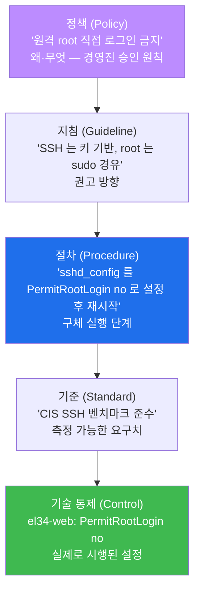
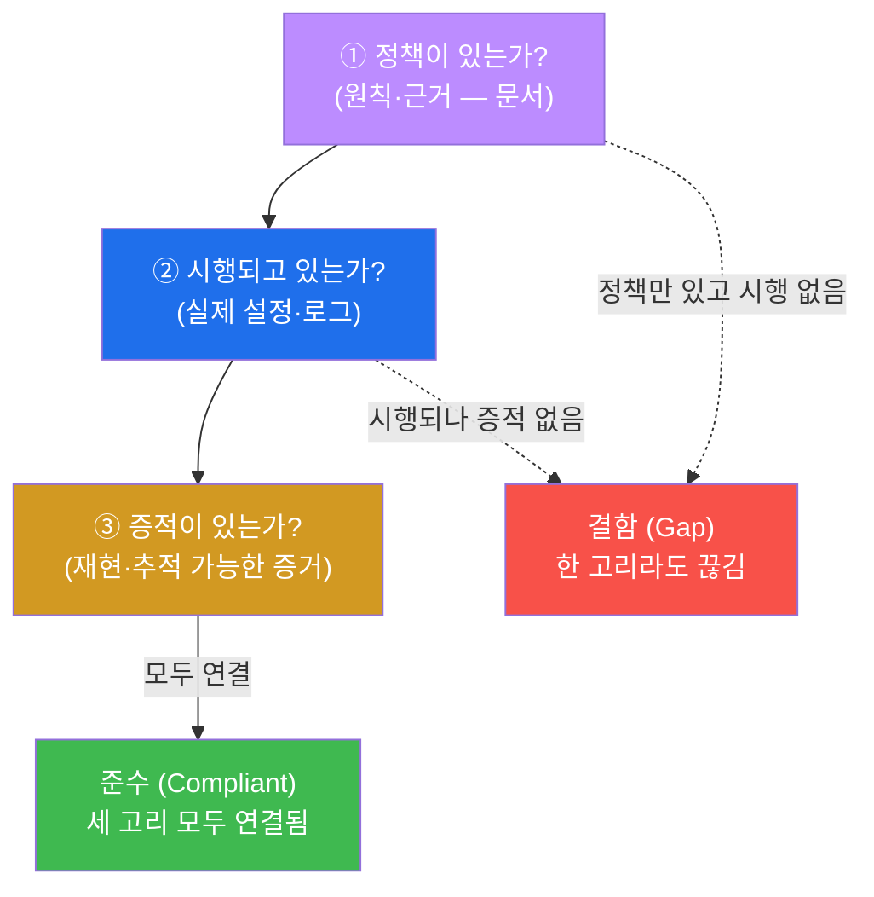
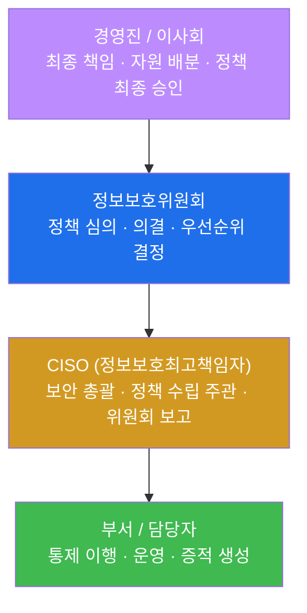
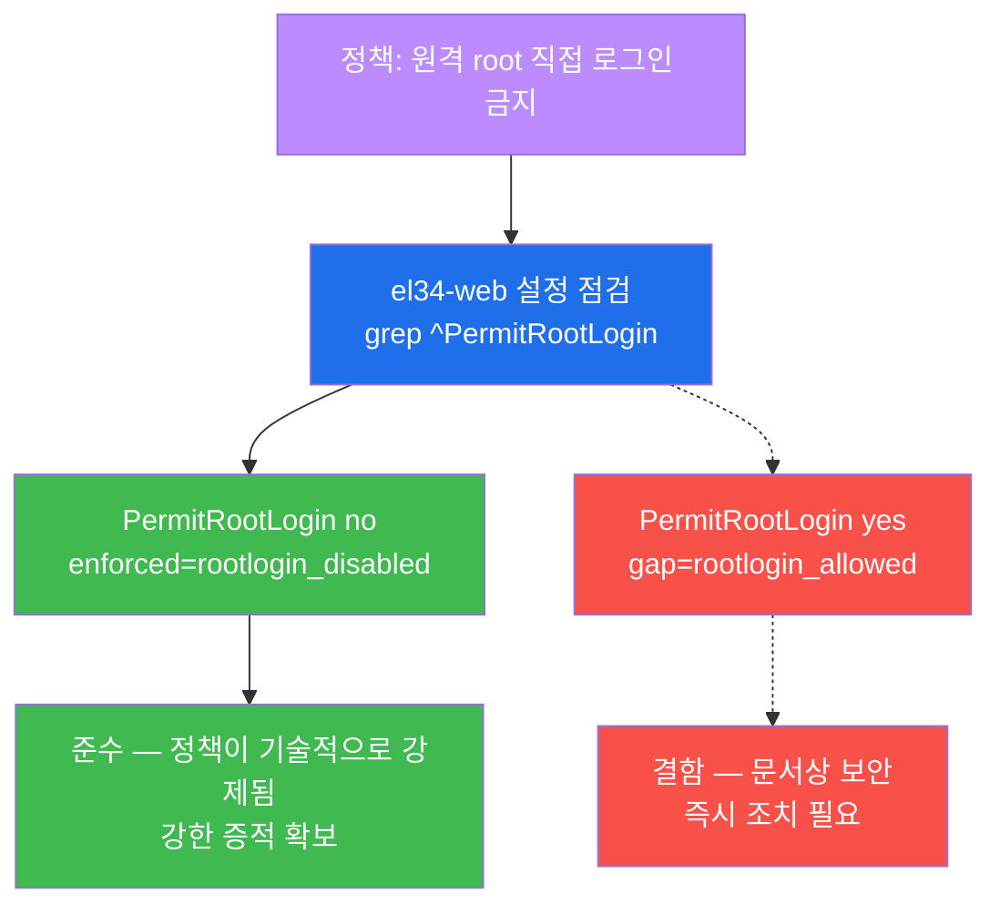
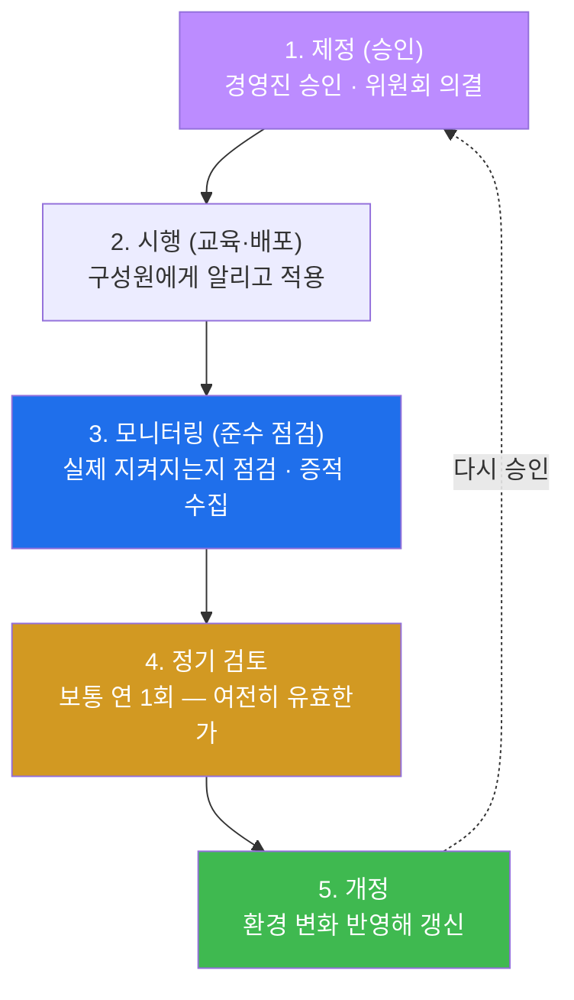
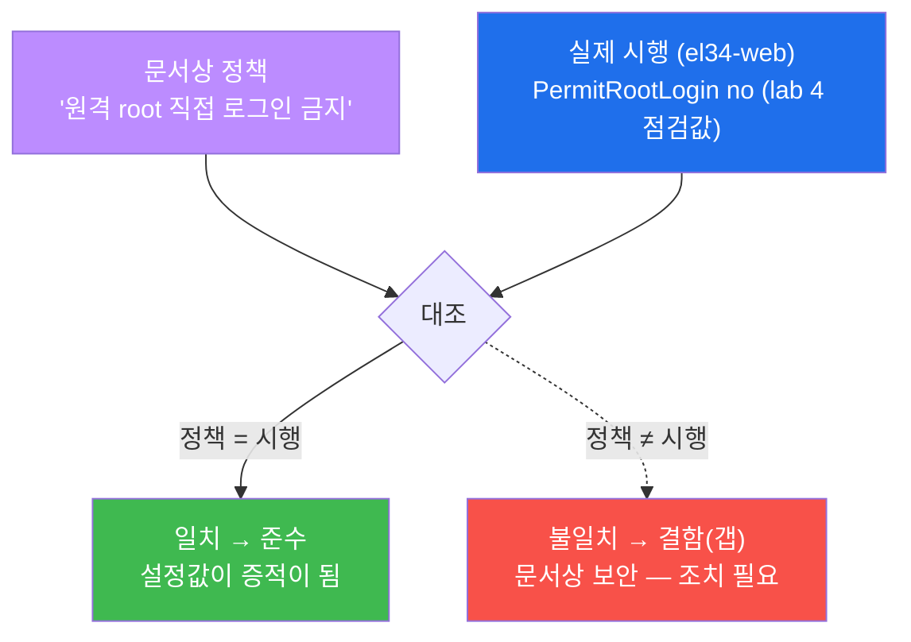
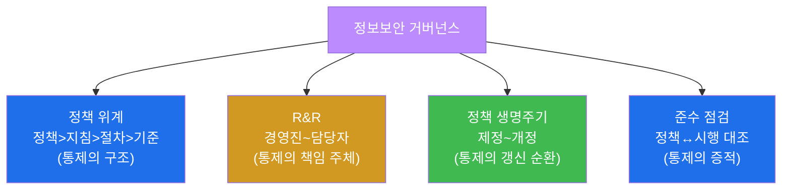
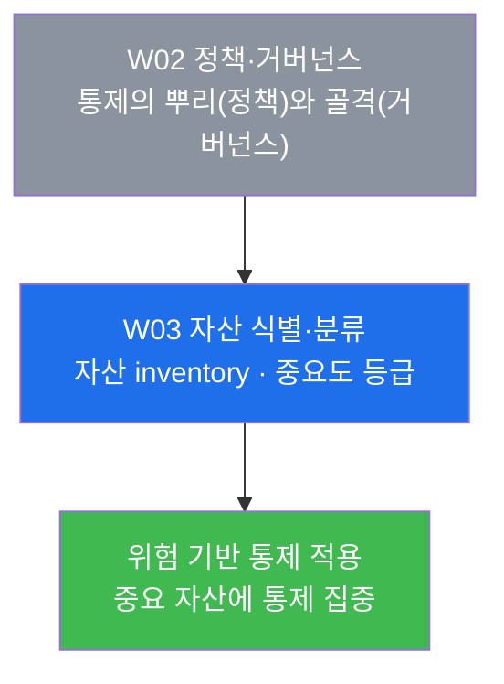

# 컴플라이언스 W02 — 보안 정책과 거버넌스: 정책은 모든 통제의 뿌리

> **본 주차의 한 줄 요약**
>
> W01 에서 학생은 컴플라이언스가 "안전하다"를 **증적과 함께 증명하는 일**임을 배웠다. 그렇다면 그
> 통제들은 애초에 **무엇을 근거로** 존재하는가? 답은 **정책(policy)** 이다. 방화벽 규칙 한 줄, 비밀번호
> 길이 8자, 원격 root 로그인 금지 — 이 모든 기술 통제는 조직이 먼저 "우리는 이렇게 하기로 한다"고
> **정책으로 선언**했기 때문에 존재한다. W02 는 그 정책이 어떻게 **위계(정책>지침>절차>기준)** 로
> 구체화되고, 누가 그것을 **책임지고 운영(거버넌스 R&R)** 하며, 정책이 종이 위 선언에 그치지 않고 실제
> 시스템에 **기술적으로 강제**되는지를, el34-web 의 실제 SSH 설정으로 본인 손으로 확인한다.
>
> **감사자 한 줄 결론**: 컴플라이언스 감사는 "통제가 좋아 보인다"가 아니라 **"이 통제가 어떤 정책을
> 근거로, 누구의 책임 아래, 실제로 시행되고 있으며, 그 증적이 무엇인가"** 를 추적하는 일이다. 정책 →
> 시행 → 증적의 연결 고리 중 하나라도 끊기면 그것이 곧 **컴플라이언스 결함(gap)** 이다.

---

## 학습 목표

본 주차 종료 시 학생은 다음 5가지를 **본인 손으로** 할 수 있어야 한다.

1. 보안 문서의 **4단 위계(정책 → 지침 → 절차 → 기준)** 를 각 층의 역할·작성 주체·구체성 차이와 함께
   설명하고, 임의의 보안 요구사항(예: "원격 root 로그인 금지")을 이 네 층으로 분해한다.
2. 정보보안 **거버넌스의 R&R(경영진/이사회 · 정보보호위원회 · CISO · 부서 담당자)** 을 ISMS-P 1.1
   관점에서 설명하고, 각 역할이 정책 생명주기의 어느 단계에서 무엇을 책임지는지 매핑한다.
3. 종이 위 정책이 시스템에 **기술적으로 강제(technical enforcement)** 되는지를, el34-web 의
   `/etc/ssh/sshd_config` 에서 `PermitRootLogin no` 설정을 직접 점검하여 **정책-시행 일치(준수)** 또는
   **불일치(갭)** 로 판정한다.
4. 정책 **생명주기(제정 → 시행 → 모니터링 → 정기 검토 → 개정)** 의 각 단계를 설명하고, 정기 검토가
   없는 정책이 왜 "stale(낡아 결함이 된) 정책"이 되는지 근거를 댄다.
5. **준수 점검(compliance check)** 의 원리 — 문서상 정책과 실제 설정/로그를 대조해 일치는 증적으로,
   불일치는 갭으로 판정하는 절차 — 를 적용해 정책·거버넌스 종합 보고서를 작성한다.

> **본 주차의 시선** — W02 는 새로운 공격 기법이나 스캐너를 배우는 주가 아니다. 모든 기술 통제의
> **뿌리(정책)와 그것을 떠받치는 골격(거버넌스)** 을 보는 주다. 채점은 "명령을 실행했다"가 아니라,
> **정책이 어떤 위계로 구체화되고, 누가 책임지며, 실제 설정으로 강제되는지를 정책-시행-증적의 연결로
> 설명했는가** 를 본다.

---

## 0. 용어 해설 (정책·거버넌스 입문)

본 주차에서 처음 등장하거나 특히 중요한 용어를 먼저 정리한다. 본문에서 다시 만나면 이 표로 돌아오면
흐름이 끊기지 않는다.

| 용어 | 영문 | 뜻 | 비유 |
|------|------|----|------|
| **정책** | Policy | 조직의 의지·원칙을 담은 최상위 보안 문서(경영진 승인) | 회사의 헌법 |
| **지침** | Guideline | 정책을 따르기 위한 권고 방향(강제 아닌 권고) | 헌법을 풀어 쓴 안내서 |
| **절차** | Procedure | 누가·무엇을·어떻게 하는지 구체 실행 단계 | 작업 매뉴얼(체크리스트) |
| **기준** | Standard | 측정 가능한 요구치(버전·길이·주기 등 숫자) | 합격선을 적은 시방서 |
| **거버넌스** | Governance | 보안을 누가 책임지고 어떻게 운영·감독하는가의 체계 | 회사의 의사결정 조직도 |
| **R&R** | Role & Responsibility | 역할과 책임의 분담 | 누가 무엇을 맡는지의 명패 |
| **CISO** | Chief Information Security Officer | 정보보호 최고책임자(보안 총괄) | 보안의 선장 |
| **정보보호위원회** | Information Security Committee | 보안 정책을 심의·의결하는 협의체 | 안건을 의결하는 이사회 |
| **정책 생명주기** | Policy lifecycle | 제정→시행→모니터링→검토→개정의 순환 | 법의 제정·개정 절차 |
| **기술적 강제** | Technical enforcement | 정책을 시스템 설정으로 실제 시행함 | 규칙을 자물쇠로 잠가버림 |
| **준수 점검** | Compliance check | 문서상 정책과 실제 시행을 대조해 일치 여부 판정 | 시방서 대조 검수 |
| **증적** | Evidence | 재현·추적 가능한 통제 작동의 증거 | 법정에 제출하는 물증 |
| **갭** | Gap | 요구 기준과 현재 상태의 미충족 차이 | 시방서와 시공의 차이 |
| **ISMS-P** | Information Security Management System - Privacy | 한국 정보보호·개인정보 관리체계 인증 | 국가 공인 보안 검정 |
| **sshd_config** | SSH daemon configuration | SSH 서버의 동작을 정하는 설정 파일 | 정문 경비실의 출입 규칙판 |

> **헷갈리기 쉬운 한 쌍 — 정책(Policy) vs 절차(Procedure).** 학생이 가장 자주 혼동하는 짝이다. **정책**은
> "**무엇을·왜**"를 선언한다 — "원격에서 root 로 직접 로그인하는 것을 **금지한다**(권한 오남용·추적성
> 확보를 위해)". 절대 "어떻게"를 말하지 않는다. **절차**는 그 정책을 이행하기 위한 "**어떻게**"의 구체적
> 단계다 — "`/etc/ssh/sshd_config` 파일을 열어 `PermitRootLogin no` 로 설정하고 `sshd` 를 재시작한다".
> 정책은 거의 바뀌지 않지만(원칙이므로), 절차는 기술이 바뀌면 자주 갱신된다(예: SSH 서버가 다른
> 제품으로 바뀌면 절차도 바뀐다). 이 구분을 못 하면 보고서에서 "정책"란에 명령어를 적고 "절차"란에
> 원칙을 적는 식의 오류가 난다.

> **헷갈리기 쉬운 한 쌍 — 거버넌스(Governance) vs 매니지먼트(Management).** **거버넌스**는 "**무엇을 왜
> 할지 정하고 그것이 되는지 감독**"하는 상위 활동이다(이사회·정보보호위원회·CISO 의 영역 — 방향 설정과
> 감독). **매니지먼트(운영 관리)** 는 그 방향을 받아 "**실제로 실행**"하는 활동이다(부서·담당자가
> 방화벽을 설정하고 로그를 보는 일). 감사에서 "거버넌스가 있는가"를 물을 때는 정책을 의결하는 협의체와
> 책임자(R&R)가 실재하고 작동하는지를 본다 — 담당자가 열심히 일한다는 것만으로는 거버넌스가 있다고
> 하지 않는다.

---

## 1. 통제는 어디서 오는가 — 정책이 모든 통제의 뿌리

### 1.1 한 줄 답: 모든 기술 통제는 정책이 요구했기 때문에 존재한다

W01 에서 우리는 갭 분석으로 `ServerTokens` 설정의 미흡을 찾았다. 그런데 잠시 멈추고 물어보자 — **왜
ServerTokens 를 점검해야 하는가? 누가 그것을 점검하라고 정했는가?** 방화벽 규칙, 비밀번호 8자 제한,
원격 root 로그인 금지 — 보안 운영자가 매일 만지는 이 통제들은 운영자가 임의로 만든 것이 아니다. 모두
조직이 먼저 **정책으로 "우리는 이렇게 하기로 한다"고 선언**했기 때문에 존재한다.



위 그림이 W02 전체의 핵심이다. 맨 위의 **정책(원칙)** 이 아래로 내려오며 점점 구체화되어, 맨 아래의
**실제 시스템 설정(통제)** 이 된다. 컴플라이언스 감사자는 이 사슬을 **위에서 아래로**(정책이 시행으로
이어졌나) 그리고 **아래에서 위로**(이 설정은 어떤 정책을 근거로 하나) 양방향으로 추적한다.

### 1.2 "왜 중요한가" — 정책 없는 통제, 시행 없는 정책

정책과 통제의 연결이 끊기면 두 가지 전형적 실패가 생긴다. 둘 다 감사에서 결함으로 지적된다.

- **정책 없는 통제 (근거 없는 통제).** 어떤 서버는 `PermitRootLogin no`, 다른 서버는 `yes`. 운영자마다
  제각각이다. 왜 그런지 물으면 "그냥 예전부터" 라는 답뿐이다. 근거(정책)가 없으니 **일관성이 없고**,
  새 서버가 추가될 때 어떻게 설정해야 하는지 **기준도 없다**. 통제가 운영자 개인의 습관에 의존하면,
  그 사람이 떠나는 순간 보안 수준이 무너진다.
- **시행 없는 정책 (문서상 보안).** 반대로, 정책 문서에는 "원격 root 로그인을 금지한다"고 멋지게 적혀
  있는데, 정작 서버를 열어보니 `PermitRootLogin yes` 다. 이것이 가장 위험한 **"문서상 보안(paper
  security)"** 이다. 감사 서류는 통과할지 몰라도 실제로는 전혀 보호되지 않는다. 컴플라이언스가 단순한
  문서 검토에 그치지 않고 **반드시 실제 설정·로그까지 확인**하는 이유가 바로 이것이다.

### 1.3 컴플라이언스가 보는 것 — 정책-시행-증적의 사슬

따라서 컴플라이언스 감사의 핵심 질문은 언제나 다음 세 가지의 연결이다.



이번 주 lab 의 4번 미션(PermitRootLogin 점검)이 바로 이 사슬의 ②와 ③을 동시에 확인하는 실습이다.
"원격 root 금지"라는 ① 정책이, el34-web 에서 `PermitRootLogin no` 라는 ② 시행으로 존재하는지를,
`grep` 으로 직접 끌어낸 설정값이라는 ③ 증적과 함께 입증한다.

---

## 2. 정책 위계 — 정책 > 지침 > 절차 > 기준

### 2.1 한 줄 정의와 4단 구조

**정책 위계(policy hierarchy)** 는 보안 문서가 추상적 원칙에서 구체적 실행으로 내려가는 4단 구조다.
위로 갈수록 **변하지 않는 원칙**이고, 아래로 갈수록 **자주 바뀌는 구체적 실행**이다. 같은 보안
요구사항이 각 층에서 어떻게 표현되는지 하나의 예("원격 root 직접 로그인 금지")로 끝까지 따라가 보자.

| 층 | 영문 | 무엇을 담나 | 작성/승인 주체 | 변경 빈도 | "원격 root 금지" 예시 |
|----|------|------------|---------------|----------|----------------------|
| **정책** | Policy | 조직의 의지·원칙(무엇을·왜) | 경영진 승인 | 거의 안 바뀜 | "권한 오남용·추적성 확보를 위해 원격 root 직접 로그인을 금지한다" |
| **지침** | Guideline | 정책을 따르는 권고 방향 | 보안팀 | 가끔 | "SSH 접속은 키 기반 인증을 권장하고, 관리 작업은 일반 계정 로그인 후 sudo 로 수행한다" |
| **절차** | Procedure | 누가·무엇을·어떻게(실행 단계) | 운영팀 | 자주(기술 변화 시) | "① sshd_config 를 연다 ② `PermitRootLogin no` 로 설정 ③ `sshd` 재시작 ④ 접속 테스트" |
| **기준** | Standard | 측정 가능한 요구치(숫자·버전) | 보안팀 | 가끔 | "SSH 설정은 CIS Benchmark for Linux 의 SSH 항목을 충족한다(PermitRootLogin=no 포함)" |

### 2.2 왜 위계가 중요한가

위계가 명확해야 **정책이 실행으로 빠짐없이 연결**된다. 정책만 있고 절차가 없으면 운영자는 "금지하라는
건 알겠는데 정확히 무엇을 어떻게 설정하라는 거지?"에서 막힌다. 반대로 절차만 있고 정책이 없으면 "이
명령을 왜 실행해야 하지?"의 근거가 없어, 환경이 바뀌었을 때 그 절차를 유지해야 할지 폐기해야 할지
판단할 수 없다.

또한 위계는 **변경 관리의 효율**을 만든다. SSH 서버를 다른 제품으로 교체하면 **절차(어떻게)** 만
고치면 되고, **정책(원격 root 금지라는 원칙)** 은 그대로 둔다. 만약 모든 것이 한 문서에 뒤섞여 있다면
사소한 기술 변경에도 경영진 승인 문서 전체를 다시 결재받아야 하는 비효율이 생긴다.

### 2.3 el34 에서 어떻게 보이나

이번 주 lab 의 2번 미션에서 학생은 이 4단 위계를 직접 정리한다. el34 환경의 실제 통제 하나
(`PermitRootLogin no`)를 골라, 그것이 어느 정책의 어느 절차의 결과물인지 위에서 아래로 분해해 본다.
한 줄짜리 설정값 뒤에 네 층의 문서 구조가 숨어 있음을 체득하는 것이 목적이다.

> **흔한 오해 — "기준(Standard)"과 "지침(Guideline)"은 같은 것 아닌가?** 다르다. **지침은 권고(should)**
> 라 따르지 않아도 위반은 아니다("키 기반 인증을 **권장**한다"). **기준은 강제(must)** 이며 측정 가능한
> 합격선이다("비밀번호는 **최소 8자**여야 한다"). 감사에서 "기준 미달"은 곧 갭이지만, "지침 미준수"는
> 정상참작의 여지가 있는 권고 사항이다. 다만 조직에 따라 두 용어를 섞어 쓰기도 하므로, 보고서에서는
> 항상 "강제인가 권고인가"를 명시하는 것이 안전하다.

---

## 3. 거버넌스 — 누가 보안을 책임지고 운영하는가

### 3.1 한 줄 정의

**거버넌스(governance)** 는 정책을 **누가 정하고, 누가 의결하고, 누가 운영하며, 누가 감독하는가**의
체계, 즉 보안의 **R&R(Role & Responsibility, 역할과 책임)** 구조다. §0 에서 짚었듯 거버넌스는 "방향
설정과 감독"이고, 그 방향을 받아 실제로 실행하는 "운영 관리(management)"와는 구분된다.

### 3.2 거버넌스 R&R 4계층

ISMS-P 와 ISO 27001(A.5 조직적 통제)이 공통으로 요구하는 거버넌스 구조는 다음 4계층이다. 위에서
아래로 **책임의 무게**가 다르고, 정책 생명주기에서 맡는 역할도 다르다.



각 계층의 책임을 풀어 보면 다음과 같다.

- **경영진 / 이사회** — 보안의 **최종 책임자**다. 정책을 최종 승인하고, 보안에 필요한 **예산·인력 같은
  자원을 배분**한다. 경영진이 보안을 "비용"으로만 보고 자원을 주지 않으면 아래의 모든 활동이 형해화된다.
  그래서 ISMS-P 는 경영진의 참여를 관리체계의 **출발점**으로 본다.
- **정보보호위원회** — 경영진과 실무를 잇는 **협의·의결체**다. CISO 가 올린 정책 초안을 **심의·의결**하고,
  여러 보안 과제 중 무엇을 먼저 할지 우선순위를 정한다. 위원회가 있어야 보안이 한 사람(CISO)의 독단이
  아니라 **조직의 합의된 의사결정**이 된다.
- **CISO (정보보호최고책임자)** — 보안을 **총괄**하는 실무 최고 책임자다. 정책을 **수립·주관**하고, 그
  결과와 보안 현황을 위원회·경영진에 **보고**한다. 거버넌스(방향)와 매니지먼트(운영) 사이를 잇는
  핵심 위치다.
- **부서 / 담당자** — 정책을 받아 **실제로 통제를 이행**하는 실행 계층이다. 방화벽 규칙을 넣고,
  `sshd_config` 를 설정하고, 로그를 모은다. 이들이 만드는 설정·로그가 곧 감사에서 쓰이는 **증적**이 된다.

### 3.3 왜 중요한가 — ISMS-P 1.1

> **표준 — ISMS-P 1.1(경영진의 참여).** ISMS-P 의 관리체계 영역 첫 항목은 "**경영진 참여, R&R, 자원
> 배분**이 관리체계의 출발점"임을 요구한다. 즉 아무리 좋은 기술 통제가 많아도, 그것을 책임지는 사람
> (R&R)이 정해져 있지 않고 경영진이 자원을 대지 않으면 ISMS-P 인증의 **첫 관문부터 통과하지 못한다**.

거버넌스가 중요한 이유는, 거버넌스가 **모든 기술 통제의 근거이자 일관성의 원천**이기 때문이다. R&R 이
명확하면 어떤 통제든 "누가 책임지는가"가 분명해 사고 시 대응 주체가 즉시 정해지고, 사람이 바뀌어도
역할이 인계되어 보안 수준이 유지된다. R&R 이 없으면 사고가 나도 "그건 제 일이 아닌데요"가 반복된다.

### 3.4 R&R 과 정책 생명주기의 매핑

거버넌스 R&R 은 §5 의 정책 생명주기와 맞물려 돌아간다. 누가 어느 단계를 책임지는지 미리 짚어 두면
두 개념이 한 그림으로 연결된다.

| 정책 생명주기 단계 | 주된 책임 R&R |
|--------------------|---------------|
| 제정(승인) | 경영진(최종 승인) + 정보보호위원회(의결) + CISO(초안) |
| 시행(교육·배포) | CISO(주관) + 부서/담당자(이행) |
| 모니터링(준수 점검) | 부서/담당자(증적 생성) + CISO(점검 총괄) |
| 정기 검토 | 정보보호위원회(검토) + CISO(보고) |
| 개정 | CISO(개정안) → 위원회(의결) → 경영진(승인) |

---

## 4. 정책의 기술적 강제 — 종이 위 정책이 시스템에서 시행되는가

### 4.1 한 줄 정의

**기술적 강제(technical enforcement)** 는 종이 위에 쓰인 정책을 **시스템 설정으로 실제로 시행**하는
것이다. "원격 root 로그인 금지"라는 정책이 단순히 문서에만 있으면 누구나 무시할 수 있다. 하지만 SSH
서버 설정에 `PermitRootLogin no` 를 넣으면, 그 정책은 **자물쇠가 되어 물리적으로(기술적으로) 강제**된다
— 정책을 어기고 싶어도 시스템이 허용하지 않는다.

### 4.2 왜 중요한가

§1.2 에서 본 "문서상 보안"의 정반대가 기술적 강제다. 감사자가 가장 신뢰하는 증적은 **사람의 약속이
아니라 시스템의 설정**이다. "우리는 원격 root 로그인을 안 합니다"라는 운영자의 말(인터뷰)은 약한
증적이지만, `grep` 으로 끌어낸 `PermitRootLogin no` 라는 설정값은 **재현 가능하고 반박 불가능한** 강한
증적이다. 그래서 컴플라이언스는 정책의 존재 확인에서 멈추지 않고 **반드시 그 정책이 기술적으로
강제되는지**까지 설정으로 확인한다.

### 4.3 el34 에서 어떻게 — SSH 의 PermitRootLogin

> **용어 — sshd_config / PermitRootLogin.** `sshd_config`(보통 `/etc/ssh/sshd_config`)는 SSH 서버
> 데몬(`sshd`)의 동작을 정하는 설정 파일이다. 그중 **`PermitRootLogin`** 항목은 "원격에서 root 계정으로
> 직접 SSH 로그인하는 것을 허용할지"를 정한다. 값이 **`no`** 면 root 직접 로그인이 **차단**되고
> (정책 준수), **`yes`** 면 허용된다(정책 위반). root 직접 로그인을 막는 이유는 두 가지다 — ① root 는
> 모든 권한을 가지므로 비밀번호가 뚫리면 즉시 전체 장악되고, ② 모두가 root 로 들어오면 "누가
> 들어왔는지" 개인을 추적할 수 없다(추적성 상실). 그래서 일반 계정으로 로그인한 뒤 `sudo` 로 권한을
> 올리는 방식을 표준으로 삼는다.

이번 주 핵심 실습(lab 4번)은 el34-web 컨테이너에서 이 설정을 직접 끌어내 정책 강제 여부를 판정한다.
명령은 el34 호스트(`ssh ccc@192.168.0.151`, 비밀번호 1)에서 `docker exec` 로 실행한다.

```bash
docker exec el34-web sh -c 'V=$(grep -iE "^PermitRootLogin" /etc/ssh/sshd_config 2>/dev/null); echo "current:$V"; echo "$V" | grep -qi "no" && echo "enforced=rootlogin_disabled" || echo "gap=rootlogin_allowed"'
```

이 한 줄이 무엇을 하는지 부분별로 읽어 보자.

- `grep -iE "^PermitRootLogin" /etc/ssh/sshd_config` — 설정 파일에서 줄 맨 앞(`^`)이
  `PermitRootLogin` 인 줄만 대소문자 구분 없이(`-i`) 끌어낸다. 줄 앞에 `^` 를 붙이는 이유는, 주석
  처리된(`#PermitRootLogin ...`) 줄이 아니라 **실제로 적용되는 설정 줄**만 잡기 위해서다.
- `echo "current:$V"` — 끌어낸 현재 설정값을 그대로 보여준다(증적).
- `echo "$V" | grep -qi "no" && echo "enforced=..." || echo "gap=..."` — 그 값에 `no` 가 들어 있으면
  **`enforced=rootlogin_disabled`**(정책이 기술적으로 강제됨 = 준수)를, 아니면
  **`gap=rootlogin_allowed`**(정책 미시행 = 갭)를 출력한다.

**결과 해석.** el34-web 에서는 `current:PermitRootLogin no` → `enforced=rootlogin_disabled` 가
출력된다. 이는 "원격 root 직접 로그인 금지"라는 정책이 **실제 설정으로 강제되어 있음(정책-시행 일치,
준수)** 을 뜻한다. 만약 출력이 `gap=rootlogin_allowed` 였다면, 정책은 있는데 시행이 안 된
**문서상 보안 결함**이므로 즉시 조치 대상이 된다.



### 4.4 한계

기술적 강제 점검이 강력하긴 하지만, 설정 파일 한 줄을 본 것만으로 "완벽히 준수"라고 단정하면 안 된다.
세 가지 한계를 알아야 한다.

- **설정과 실행 상태는 다를 수 있다.** `sshd_config` 에 `no` 라고 적혀 있어도, 그 설정 변경 후 `sshd` 를
  재시작하지 않았다면 **메모리에서 돌고 있는 서버는 여전히 옛 설정**일 수 있다. 엄밀한 점검은 설정
  파일과 실제 동작(예: root 로그인 시도가 정말 거부되는지)을 함께 본다.
- **한 항목이 전부가 아니다.** `PermitRootLogin` 하나만 막아도 다른 약점(약한 비밀번호 허용,
  `PasswordAuthentication yes` 등)이 있으면 SSH 는 여전히 취약하다. CIS Benchmark 가 SSH 만 해도 수십
  항목을 점검하는 이유다.
- **컨테이너 환경의 특수성.** el34-web 은 학습용 컨테이너다. 실제 운영 서버라면 설정 관리 도구(Ansible
  등)로 강제하고 변경을 감사 로그로 남기는 추가 통제가 따른다.

---

## 5. 정책 생명주기 — 정책은 살아 움직인다

### 5.1 한 줄 정의와 5단계

**정책 생명주기(policy lifecycle)** 는 정책이 한 번 만들어지고 끝나는 것이 아니라 **제정 → 시행 →
모니터링 → 정기 검토 → 개정**의 순환을 돈다는 것이다. 정책은 "한 번 쓰면 영원한 비석"이 아니라
환경 변화에 맞춰 갱신되는 **살아 있는 문서**다.



각 단계를 풀어 보면 다음과 같다.

- **제정(승인)** — 정책 초안을 만들어 정보보호위원회가 의결하고 경영진이 승인한다. 승인 없는 문서는
  정책이 아니라 초안일 뿐이다.
- **시행(교육·배포)** — 승인된 정책을 구성원에게 교육하고 시스템에 적용한다. 아무도 모르는 정책은
  지켜질 수 없으므로, 배포와 교육이 시행의 필수 요소다.
- **모니터링(준수 점검)** — 정책이 실제로 지켜지는지 점검하고 증적을 수집한다(이번 주 lab 4번의
  PermitRootLogin 점검이 바로 이 단계의 활동이다).
- **정기 검토** — 보통 **연 1회** 정책이 여전히 유효한지 다시 본다. 기술·법규·조직이 바뀌었는데 정책이
  그대로면 현실과 어긋나기 때문이다.
- **개정** — 검토 결과 필요하면 정책을 갱신하고, 다시 제정(승인) 단계로 돌아간다(순환).

### 5.2 왜 중요한가 — stale 정책의 위험

정기 검토 없는 정책은 시간이 지나면 **stale(낡아 결함이 된) 정책**이 된다. 예를 들어 "비밀번호 6자
이상"이라는 정책을 10년 전에 만들고 한 번도 검토하지 않았다면, 오늘날 기준으로는 턱없이 약한
요구치(현재는 보통 8~12자 이상 권고)인데도 "정책을 지키고 있으니 괜찮다"는 착각에 빠진다. 정책 자체가
시대에 뒤떨어졌기 때문이다. 그래서 감사자는 정책 문서에서 **최종 검토일(또는 개정 이력)** 을 반드시
확인한다 — 검토일이 수년 전이면 그 자체가 거버넌스 결함의 신호다.

> **el34 와의 연결.** 이번 주 lab 5번 미션에서 학생은 이 5단계를 직접 정리한다. el34-web 의 SSH 정책을
> 예로 들면, "원격 root 금지" 정책이 **제정**되었고, 설정으로 **시행**되며, lab 4번 점검이 **모니터링**에
> 해당한다. 만약 이 정책을 매년 검토하지 않는다면, 새로운 SSH 취약점이 나와도 정책에 반영되지 못해
> stale 정책이 될 수 있다.

---

## 6. 준수 점검 — 문서상 정책과 실제 시행의 대조

### 6.1 한 줄 정의

**준수 점검(compliance check)** 은 **문서상 정책**(무엇을 하기로 했나)과 **실제 상태**(설정·로그가 실제
어떤가)를 **대조**해, 일치하면 **준수(증적 확보)** 로, 불일치하면 **결함(갭)** 으로 판정하는 활동이다.
W01 의 갭 분석이 "기준 vs 현재"의 대조였다면, 준수 점검은 그것을 정책 차원으로 확장한 것이다 —
"정책 vs 시행"의 대조다.

### 6.2 왜 문서만으로는 불충분한가

§1.2 와 §4.2 에서 거듭 강조한 이유가 여기서 하나로 모인다. 정책 문서만 읽으면 "원격 root 금지라고 잘
적혀 있네"에서 끝나지만, 그것이 **실제로 시행되는지는 알 수 없다**. 준수 점검은 문서 검토를 넘어
**반드시 실제 설정·로그를 끌어와 대조**한다. 이 대조가 일치하면 그 설정값 자체가 강력한 증적이 되고,
불일치하면 "정책은 있으나 시행 안 됨"이라는 가장 흔한 컴플라이언스 결함을 잡아낸다.



### 6.3 el34 에서 어떻게

이번 주 lab 6번 미션은 이 대조의 원리를 정리하는 실습이다. lab 4번에서 끌어낸 `PermitRootLogin no`
(실제 시행)를 "원격 root 금지"(문서상 정책)와 나란히 놓고, 일치하므로 **준수(증적 확보)** 라고
판정하는 논리를 명확히 적는다. 핵심은 **판정에는 반드시 증적이 따라야 한다**는 점이다 — "준수합니다"가
아니라 "정책 X 가 설정값 Y(증적)로 시행되므로 준수"라고 써야 감사에서 인정받는다.

---

## 7. 거버넌스 종합 — 네 요소가 어떻게 맞물리는가

지금까지 본 네 요소 — **정책 위계 · R&R · 정책 생명주기 · 준수 점검** — 는 따로 노는 개념이 아니라
하나의 거버넌스로 맞물려 돌아간다. 이번 주 lab 7번 미션은 이 종합을 요구한다.



네 요소의 관계를 한 문장으로 묶으면 이렇다 — **R&R(누가)** 이 정해진 사람들이, **위계(어떤 구조)** 로
정책을 구체화하고, **생명주기(어떤 순환)** 로 그것을 갱신하며, **준수 점검(어떤 증적)** 으로 시행을
확인한다. 이 네 톱니가 모두 돌아갈 때 비로소 "거버넌스가 작동한다"고 말할 수 있고, 그것이 곧 모든
기술 통제의 **근거이자 일관성의 원천**이 된다. 하나라도 빠지면 — 책임자가 없거나, 위계가 뒤섞였거나,
검토가 멈췄거나, 시행 확인이 없으면 — 그 지점이 컴플라이언스 결함이 된다.

---

## 8. 실습 안내 — lab 8 미션 (4 축 설명)

이번 주 실습은 8 미션으로 구성된다. 각 미션을 **4 축**으로 설명한다 — 왜 하는가 / 무엇을 알 수
있는가 / 결과 해석(정상 vs 비정상) / 실전 활용. 미션은 점검(도달성) → 정책 위계 → 거버넌스 R&R →
**정책 기술 강제(핵심)** → 생명주기 → 준수 점검 → 거버넌스 종합 → 보고서 순으로 흐른다.

> **실습 진행 원칙.** 모든 명령은 el34 호스트(`ssh ccc@192.168.0.151`, 비밀번호 1)에서 `docker exec
> el34-web` 으로 실행한다. 신규 도구 설치는 없다. 점검 대상 컨테이너는 **el34-web** 이다. 합격
> 임계값은 0.7 이다.

### 미션 1 — 점검: el34-web 에 도달하나 (10점)

> **왜 하는가?** 정책 강제 점검의 전제는 점검 대상 시스템에 접근할 수 있어야 한다는 것이다. 감사자는
> 본격 점검 전에 늘 대상의 도달성부터 확인한다.
>
> **무엇을 알 수 있는가?** `docker exec el34-web` 으로 hostname 을 받아오고 `target_ok` 가 출력되는지
> 확인해, 이번 주 정책 강제 점검의 대상(el34-web)에 접근 가능한지.
>
> **결과 해석.** 정상: 출력에 `target_ok` 가 보임(대상 접근 성공). 비정상: 응답이 없거나 오류면 el34
> 호스트 SSH 접속과 컨테이너 이름(el34-web)부터 재확인.
>
> **실전 활용.** 모든 기술 점검의 0 단계 — 점검 범위(scope)의 대상이 실제 살아 있고 접근 가능한지 먼저
> 확인하는 절차.

### 미션 2 — 정책 위계: 정책>지침>절차>기준 (12점)

> **왜 하는가?** 모든 기술 통제는 정책 위계의 맨 아래(설정)에 해당한다. 위계를 정리할 수 있어야
> 임의의 통제를 보고 "이건 어떤 정책의 어떤 절차의 결과"인지 거꾸로 추적할 수 있다.
>
> **무엇을 알 수 있는가?** 보안 문서의 4단 위계(정책=원칙 → 지침=권고 → 절차=실행단계 → 기준=측정치)와
> 각 층의 역할 차이. 하나의 요구사항이 층마다 어떻게 다르게 표현되는지.
>
> **결과 해석.** 정상: 출력에 `절차` 가 포함되며 정책>지침>절차>기준의 4단이 정리됨. 비정상: 정책과
> 절차를 뒤바꿔 적었다면 §2.1 의 "무엇을·왜(정책) vs 어떻게(절차)" 구분으로 되돌아가 점검.
>
> **실전 활용.** 정책 문서 체계를 설계하거나 감사할 때의 기본 틀. 통제의 근거를 위계로 추적하는 능력.

### 미션 3 — 거버넌스 R&R: 경영진/위원회/CISO/담당자 (12점)

> **왜 하는가?** 거버넌스 R&R 은 ISMS-P 인증의 첫 관문(1.1)이다. R&R 이 정의되어 있지 않으면 아무리
> 통제가 많아도 관리체계 자체가 성립하지 않는다.
>
> **무엇을 알 수 있는가?** 정보보안 거버넌스의 4계층 역할·책임(경영진=최종책임/자원, 위원회=심의/의결,
> CISO=총괄, 담당자=이행)과 ISMS-P 1.1 이 경영진 참여를 출발점으로 보는 이유.
>
> **결과 해석.** 정상: 출력에 `CISO` 가 포함되며 4계층 R&R 이 정리됨. 비정상: 거버넌스(방향·감독)와
> 운영 관리(실행)를 혼동했다면 §0 의 헷갈리기 쉬운 한 쌍으로 되돌아가 점검.
>
> **실전 활용.** 보안 조직 설계·감사의 기본. 사고 발생 시 "누가 책임지는가"를 즉시 가리키는 근거.

### 미션 4 — 정책 강제 점검: PermitRootLogin (16점, 핵심)

> **왜 하는가?** 이번 주의 핵심 — 종이 위 정책이 실제 시스템에 **기술적으로 강제**되는지를 직접 확인한다.
> "문서상 보안"과 "실제 시행된 보안"의 차이를 본인 손으로 끌어낸 설정값으로 가른다.
>
> **무엇을 알 수 있는가?** el34-web 의 `/etc/ssh/sshd_config` 에서 `PermitRootLogin` 값을 끌어내,
> "원격 root 직접 로그인 금지" 정책이 `no` 설정으로 강제되는지. 끌어낸 설정값 자체가 강한 증적이 된다.
>
> **결과 해석.** 정상: `current:PermitRootLogin no` → `enforced=rootlogin_disabled` 출력
> (정책-시행 일치 = 준수). 만약 `gap=rootlogin_allowed` 면 정책은 있으나 시행 안 된 문서상 보안 결함이다.
> 비정상(명령 오류): 출력 자체가 없으면 컨테이너 접근(미션 1)과 `^` 정규식을 재확인.
>
> **실전 활용.** 컴플라이언스 점검의 가장 전형적 형태 — 인터뷰(말)가 아니라 설정(증적)으로 통제 시행을
> 입증하는 절차. CIS Benchmark·ISMS-P 기술 점검의 핵심 방식이다.

### 미션 5 — 정책 생명주기: 제정~개정 (12점)

> **왜 하는가?** 정책은 한 번 만들고 끝이 아니다. 생명주기를 모르면 "오래된 정책을 지키고 있으니
> 안전하다"는 stale 정책의 함정에 빠진다.
>
> **무엇을 알 수 있는가?** 정책의 5단계 순환(제정→시행→모니터링→정기 검토→개정)과 각 단계의 활동.
> 정기 검토(보통 연 1회)가 왜 stale 정책을 막는 안전장치인지.
>
> **결과 해석.** 정상: 출력에 `생명주기` 가 포함되며 제정~개정 5단계가 정리됨. 비정상: 단계를 빠뜨렸다면
> §5.1 의 5단계 그림으로 되돌아가 점검.
>
> **실전 활용.** 정책 문서의 최종 검토일·개정 이력을 확인하는 감사 관점. 검토일이 수년 전이면 그 자체가
> 거버넌스 결함의 신호다.

### 미션 6 — 준수 점검: 정책 vs 시행 (12점)

> **왜 하는가?** 컴플라이언스의 본질은 문서와 현실의 **대조**다. 문서만 읽으면 "잘 적혀 있다"에서 끝나
> 가장 흔한 결함(정책은 있으나 시행 안 됨)을 놓친다.
>
> **무엇을 알 수 있는가?** 준수 점검 = (문서상 정책) ↔ (실제 설정·로그)의 대조. 일치=준수(증적 확보),
> 불일치=결함. 미션 4 의 `PermitRootLogin no`(시행)를 "원격 root 금지"(정책)와 대조하는 논리.
>
> **결과 해석.** 정상: 출력에 `준수` 가 포함되며 정책↔시행 대조 논리가 정리됨. 핵심 — 판정에는 반드시
> 증적(설정값)이 따라야 한다. 비정상: "준수합니다"만 적고 증적이 없으면 §6.3 의 "증적이 따라야 한다"로
> 되돌아가 점검.
>
> **실전 활용.** 감사의 핵심 절차. "통제가 있다"가 아니라 "정책 X 가 증적 Y 로 시행됨"을 입증하는 보고
> 방식.

### 미션 7 — 거버넌스 종합 (12점)

> **왜 하는가?** 정책 위계·R&R·생명주기·준수 점검은 따로 노는 개념이 아니라 하나의 거버넌스로
> 맞물린다. 이 종합이 곧 "거버넌스가 작동한다"의 의미다.
>
> **무엇을 알 수 있는가?** 네 요소(위계=구조, R&R=책임, 생명주기=갱신, 준수=증적)가 어떻게 하나의
> 거버넌스로 맞물려 모든 기술 통제의 근거·일관성을 만드는지.
>
> **결과 해석.** 정상: 출력에 `거버넌스` 가 포함되며 네 요소가 종합됨. 비정상: 한 요소라도 빠졌다면
> §7 의 종합 그림으로 되돌아가 네 톱니를 다시 맞춤.
>
> **실전 활용.** 경영진·감사에 "우리 보안 거버넌스는 이렇게 작동한다"를 한 장으로 설명하는 능력.

### 미션 8 — 정책/거버넌스 보고서 (12점)

> **왜 하는가?** 컴플라이언스 활동의 산출물은 보고서다. 미션 2–7 의 결과를 한 문서로 종합해야 점검이
> 완성된다.
>
> **무엇을 알 수 있는가?** 정책 위계 + R&R + 정책 강제 점검(PermitRootLogin no) + 생명주기 + 준수
> 점검을 하나의 보고서로 묶는 법. 정책-시행-증적의 연결이 보고서의 골격임을.
>
> **결과 해석.** 정상: 보고서에 위계/R&R · 정책 강제(준수) · 생명주기/준수 점검이 포함되고 `준수` 가
> 명시됨. 비정상: 증적(PermitRootLogin no) 없이 주장만 있으면 미션 4 의 설정값을 증거로 보강.
>
> **실전 활용.** ISMS-P·내부 감사에 제출하는 정책/거버넌스 점검 보고서의 표준 구조(위계→강제→증적→결론).

---

## 9. 다음 주차 (W03) 예고 — 자산 식별·분류

W02 에서 학생은 모든 통제의 **뿌리(정책)와 골격(거버넌스)** 을 보았다. 그런데 정책과 통제는 결국
**무언가를 보호**하기 위한 것이다 — 그 "무언가"가 바로 **자산(asset)** 이다. 무엇을 보호해야 하는지
모르면 어떤 통제가 얼마나 필요한지도 정할 수 없다.

W03 부터는 그 **자산 식별·분류(asset inventory & classification)** 로 들어간다. 조직이 가진 정보 자산
(서버·데이터·계정 등)을 빠짐없이 식별(inventory)하고, 각 자산의 **중요도를 등급으로 분류**해 — 중요한
자산에 더 강한 통제를 집중하는 — 위험 기반 보안의 기초를 다진다. W02 가 "통제를 누가·어떤 근거로
정하는가"를 보였다면, W03 은 "그 통제로 **무엇을** 얼마나 강하게 보호할 것인가"를 연다.


