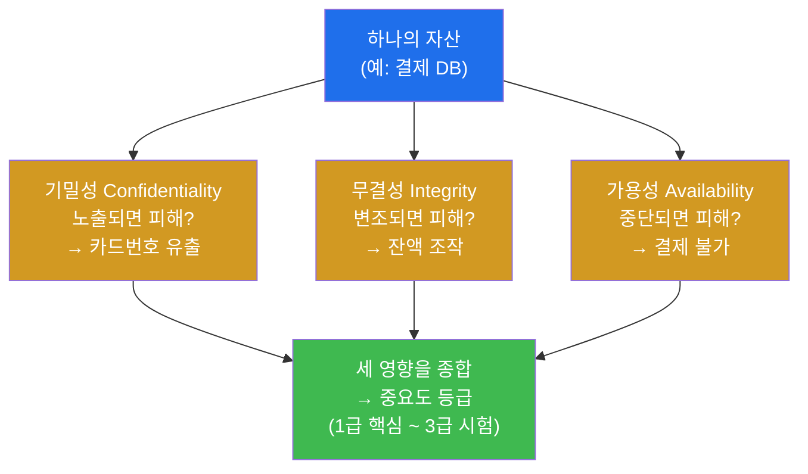
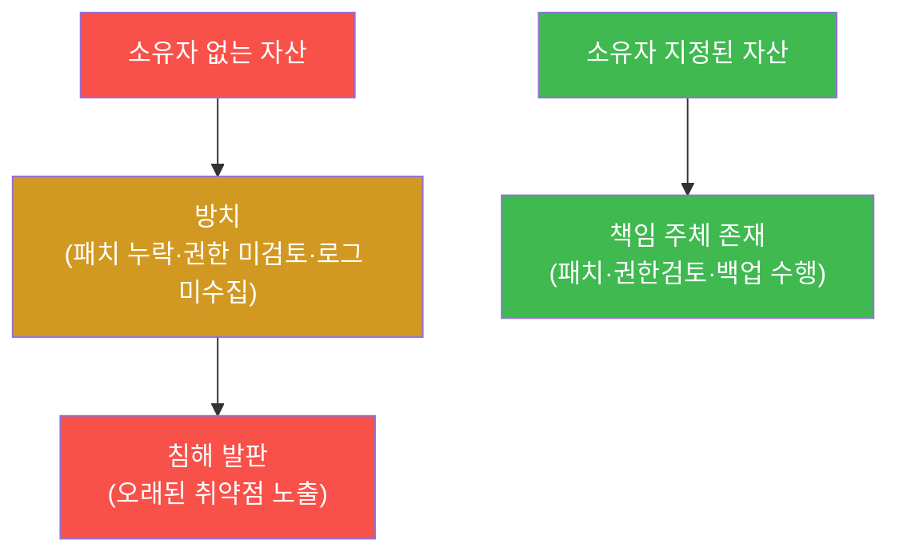
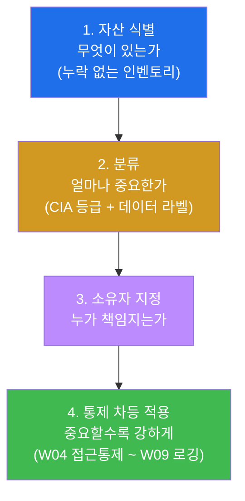
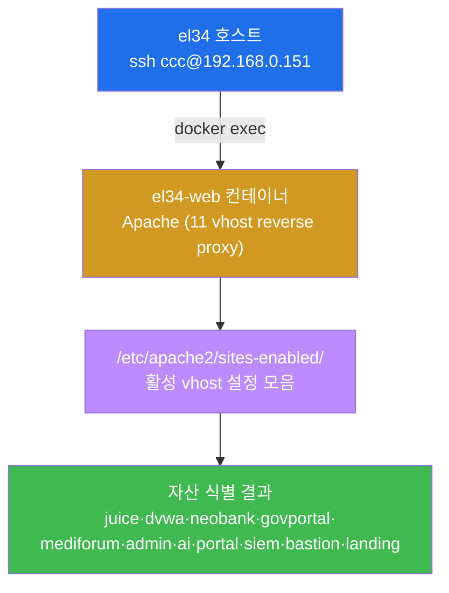
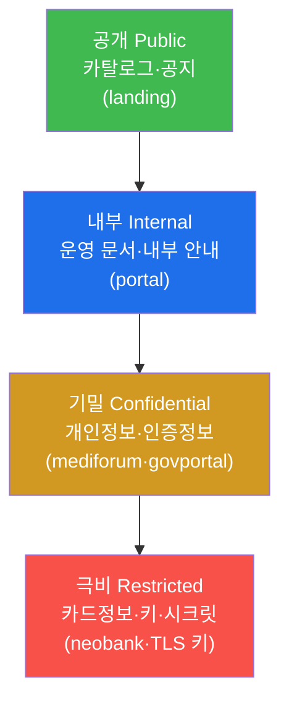
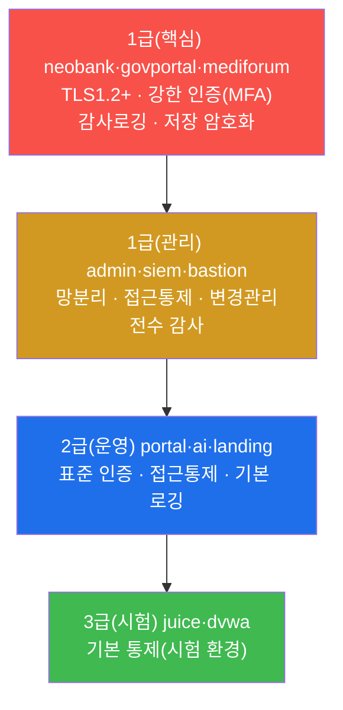
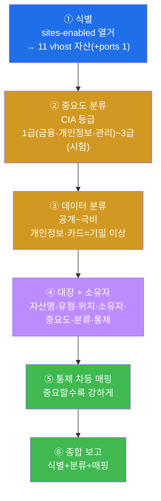
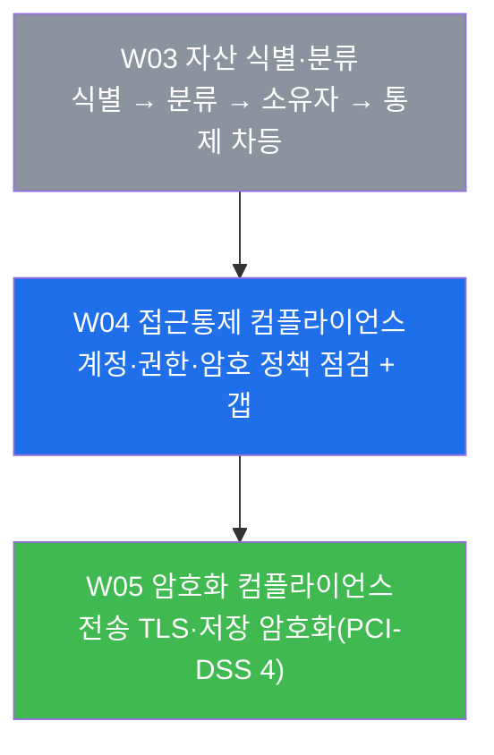

# 컴플라이언스 W03 — 자산 식별과 분류

> **본 주차의 한 줄 요약**
>
> "모르는 것은 지킬 수 없다." 컴플라이언스의 가장 첫 통제는 **무엇이 있는지(자산 식별)**, 그것이
> **얼마나 중요한지(중요도·데이터 분류)**, 그리고 **누가 책임지는지(소유자)** 를 빠짐없이 적은
> **자산 대장(臺帳)** 을 만드는 일이다. 본 주차에 학생은 el34 의 실제 자산(web 컨테이너의 11개 vhost)을
> **본인 손으로 열거**하고, 각 자산에 **CIA 중요도 등급**과 **데이터 분류 라벨**을 매겨, 중요도에 비례한
> **차등 통제**를 매핑하는 **감사자(auditor)** 의 한 바퀴를 돈다.
>
> **감사자 한 줄 결론**: 자산 관리는 "장비 목록을 적는 일"이 아니라, **보호해야 할 대상을 빠짐없이
> 식별하고(누락=가장 큰 위험), 중요도에 따라 통제를 차등 배치할 근거를 만드는 일**이다. 이번 주의
> 대장이 W04 이후 모든 통제(접근통제·암호화·로깅)의 기준점이 된다.

---

## 학습 목표

본 주차 종료 시 학생은 다음 6가지를 **본인 손으로** 할 수 있어야 한다.

1. **자산 식별(asset inventory)** 의 개념과, "있는 줄 몰랐던 자산(shadow IT·방치 서비스)이 가장
   위험하다"는 원칙을 감사 관점에서 설명한다.
2. el34 호스트(`ssh ccc@192.168.0.151`)에서 `docker exec el34-web` 로 **Apache `sites-enabled`**
   디렉터리를 열거하여, 실제 웹 애플리케이션 자산(11개 vhost)을 **빠짐없이 식별·집계**하고, 그중 자산이
   아닌 항목(ports 설정 파일)을 가려낸다.
3. **CIA(기밀성·무결성·가용성) 중요도 등급**의 의미를 풀어 설명하고, el34 의 각 vhost 자산을 1급(핵심)~
   3급(시험)으로 **등급화**한다.
4. **데이터 분류(공개~극비)** 라벨을 매기고, 개인정보·카드정보·인증정보가 왜 최소 "기밀" 이상이어야
   하는지를 ISMS-P/ISO 27001 근거로 설명한다.
5. **자산 대장(Inventory)** 의 구성 항목(자산명·유형·위치·소유자·중요도·데이터분류·통제수준)을 채우고,
   **소유자(Owner) 지정** 이 왜 방치를 막는 핵심인지를 설명한다.
6. 위 분류를 근거로 **자산-통제 차등 매핑**(중요할수록 강한 통제)을 작성하고, 그 결과를 **자산 관리
   보고서**로 종합한다.

> **본 주차의 시선 — 점검자가 아니라 감사자.** web-vuln/attack 트랙이 "이 앱이 뚫리는가"를 *발견*하는
> 점검자의 시선이라면, 컴플라이언스 트랙은 "보호 대상을 빠짐없이 알고, 중요도에 맞게 통제를 배치했음을
> *증명*"하는 **감사자(auditor)** 의 시선이다(W01 §1 복습). 같은 el34 인프라를 보지만, 이번 주의 산출물은
> 공격 성공이 아니라 **재현 가능한 자산 대장과 분류 근거**다.

---

## 0. 용어 해설 (자산 관리 입문)

본 주차에 처음 등장하는 핵심 용어를 먼저 정리한다. 한 줄 정의가 부족한 핵심어는 §0.5 에서 일상 비유로
다시 풀어 설명한다.

| 용어 | 영문 | 뜻 | 비유 |
|------|------|----|------|
| **자산** | Asset | 보호 가치가 있는 모든 것(시스템·데이터·계정·서비스) | 회사가 가진 재산 목록의 한 항목 |
| **자산 식별** | Asset Identification | 무엇이 있는지 빠짐없이 찾아내는 일 | 이사하기 전 집 안 물건을 전부 적기 |
| **인벤토리(자산 목록)** | Inventory | 식별된 자산을 모은 목록 | 물건 목록표 |
| **자산 대장** | Asset Register / CMDB | 자산에 속성(소유자·중요도 등)까지 붙인 공식 장부 | 부동산 등기부등본 |
| **CMDB** | Configuration Management DataBase | 자산·구성요소와 그 관계를 관리하는 DB | 항상 최신으로 유지되는 자산 장부 시스템 |
| **소유자** | Asset Owner | 자산의 보호·결정에 책임지는 주체 | 그 물건의 주인(관리 책임자) |
| **CIA 삼원칙** | Confidentiality·Integrity·Availability | 정보보안의 세 가치(기밀·무결·가용) | 금고의 3대 요구: 비밀유지·내용보존·필요시열람 |
| **기밀성** | Confidentiality | 인가된 자만 본다(노출되면 피해) | 금고 안을 아무나 못 봄 |
| **무결성** | Integrity | 내용이 위·변조되지 않는다 | 금고 안 서류가 바꿔치기 안 됨 |
| **가용성** | Availability | 필요할 때 쓸 수 있다(중단되면 피해) | 필요할 때 금고가 열림 |
| **중요도 등급** | Criticality / Asset Classification | 자산이 얼마나 중요한지의 등급(1급~) | 재산의 가치 등급(귀중품 vs 소모품) |
| **데이터 분류** | Data Classification | 데이터를 민감도로 나눈 라벨(공개~극비) | 서류 도장: 대외비/극비 |
| **차등 통제** | Risk-based / Tiered Control | 중요할수록 강하게, 덜 중요하면 기본만 | 귀중품은 금고에, 소모품은 서랍에 |
| **shadow IT** | Shadow IT | 관리 목록에 없이 몰래 운영되는 시스템·서비스 | 등록 안 된 비밀 창고 |
| **vhost** | Virtual Host | 같은 IP/포트에서 도메인별 다른 웹 사이트 | 한 건물 안 여러 매장(간판으로 구분) |
| **CMDB 최신성** | — | 대장이 현실과 일치하도록 갱신된 정도 | 등기부가 실제 소유와 맞는지 |

> **용어 — ISMS-P / ISO 27001(이번 주의 근거 표준).** **ISMS-P** 는 한국의 정보보호·개인정보보호
> 관리체계 인증 제도이고, **ISO 27001** 은 그 국제판 표준이다(W01 §2). 두 표준 모두 **자산 관리를 가장
> 기초적인 통제**로 둔다 — ISMS-P 통제 **2.1(정보자산 식별·분류)**, ISO 27001 부속서 **A.5.9(정보 및
> 관련 자산의 목록)** 이 본 주차가 다루는 항목이다. 즉 "자산 대장을 만들고 분류하라"는 건 좋은 습관이
> 아니라 **인증이 요구하는 통제**다.

---

## 0.5 신입생 친화 핵심 용어 개념 설명

위 표의 한 줄 정의만으로는 헷갈리기 쉬운 핵심 4 용어를 일상 비유로 풀어 설명한다. 본문에서 다시
막히면 이 절로 돌아오면 흐름이 끊기지 않는다.

### 0.5.1 자산 식별 — 이사 전 짐 목록 비유

학생이 이사를 간다고 하자. 이삿짐센터가 가장 먼저 하는 일은 "이 집에 무엇이 있는지" 방을 돌며 전부
적는 것이다. 이때 가장 큰 사고는 **목록에 없던 물건**에서 난다 — 베란다 구석의 상자, 다용도실의 오래된
가전. 목록에 없으니 포장도 안 되고, 깨지거나 분실돼도 아무도 책임지지 않는다.

보안에서 이 "짐 목록 만들기"가 **자산 식별(Asset Identification)** 이다.

**자산 식별** 은 조직이 보유한 보호 대상(시스템·서비스·데이터·계정·네트워크)을 **빠짐없이** 찾아내는
일이다. 그리고 이사와 똑같이, **목록에 없는 자산이 가장 위험하다.** 보안에서는 이렇게 관리 목록에 없이
몰래 돌아가는 시스템을 **shadow IT** 또는 **방치 서비스(orphaned service)** 라 부른다.

| 이사 짐 목록 | 자산 식별 |
|--------------|-----------|
| 방을 돌며 물건을 전부 적음 | 인프라를 훑어 시스템·서비스를 전부 열거 |
| 목록에 없던 베란다 상자 | shadow IT(관리 안 되는 비밀 서비스) |
| 깨져도 책임자 없음 | 소유자 미지정 → 패치·점검 누락 |
| 목록표 | 자산 인벤토리 |

> **왜 "없는 자산"이 가장 위험한가.** 보안 통제(패치·방화벽·로그·암호화)는 모두 **목록에 있는 자산에만**
> 적용된다. 식별되지 않은 자산은 패치도, 방화벽 규칙도, 모니터링도 받지 못한 채 인터넷에 노출돼 있을 수
> 있다. 실제 침해의 상당수가 "있는 줄 몰랐던 오래된 테스트 서버·관리 콘솔"에서 시작된다(W01 §6.1 의 KISA
> 사례 중 "인터넷 노출 관리 콘솔" 유형). 그래서 자산 관리는 "완벽한 목록"이 아니라 **누락 없는 목록**이
> 목표다.

### 0.5.2 CIA 삼원칙 — 금고의 세 가지 요구 비유

집에 금고가 하나 있다고 하자. 좋은 금고가 만족해야 할 요구는 세 가지다.

- **아무나 안을 보면 안 된다** → 비밀이 지켜져야 한다.
- **안에 든 서류가 몰래 바꿔치기되면 안 된다** → 내용이 보존돼야 한다.
- **정작 내가 필요할 때 열 수 없으면 안 된다** → 필요할 때 쓸 수 있어야 한다.

이 세 요구가 정보보안의 **CIA 삼원칙** 이다.

- **기밀성(Confidentiality)** — 인가된 사람만 정보를 볼 수 있어야 한다. 노출되면 피해가 큰 자산일수록
  기밀성 요구가 높다(예: 카드정보, 개인정보).
- **무결성(Integrity)** — 정보가 허가 없이 위·변조되지 않아야 한다. 변조되면 피해가 큰 자산일수록
  무결성 요구가 높다(예: 계좌 잔액, 거래 내역).
- **가용성(Availability)** — 필요할 때 쓸 수 있어야 한다. 중단되면 피해가 큰 자산일수록 가용성 요구가
  높다(예: 결제 서비스).



**핵심.** 자산의 중요도는 이 세 영향을 **종합**해 매긴다. 세 가지가 모두 높으면(기밀 H·무결 H·가용 H)
최상위 등급(1급)이고, 가용성만 약간 중요한 공개 게시판이면 하위 등급이다. 같은 인프라 안에서도 자산마다
CIA 프로파일이 다르므로 등급이 갈린다 — 이것이 **차등 통제**의 출발점이다.

### 0.5.3 데이터 분류 — 서류 도장 비유

회사에서 서류를 다룰 때, 표지에 "대외비", "극비" 같은 도장이 찍혀 있다. 이 도장 하나가 그 서류를
**어떻게 다뤄야 하는지**를 결정한다 — 극비 서류는 금고에 보관하고 사본을 못 만들지만, 공개 안내문은
복사해서 게시판에 붙여도 된다.

데이터에 찍는 이 도장이 **데이터 분류(Data Classification)** 다.

**데이터 분류** 는 데이터를 민감도(노출 시 피해 크기)에 따라 라벨로 나누는 것이다. 보통 4단계를 쓴다.

| 라벨 | 영문 | 뜻 | el34 예시 |
|------|------|----|-----------|
| **공개** | Public | 외부에 공개해도 무방 | 서비스 카탈로그·공지 |
| **내부** | Internal | 조직 내부용(외부 비공개) | 운영 문서·내부 안내 |
| **기밀** | Confidential | 유출 시 피해(개인정보·인증정보) | mediforum/govportal 개인정보, 인증정보 |
| **극비** | Restricted | 유출 시 치명적(카드정보·키) | neobank 카드정보, TLS 키·시크릿 |

**핵심 — 라벨이 통제 수준을 정한다.** 데이터 분류는 단순한 표시가 아니라, **암호화·접근통제·로깅의
수준을 결정하는 입력**이다. "기밀" 이상은 저장·전송 암호화와 접근통제가 의무가 되고, "공개"는 무결성
정도만 챙기면 된다. 그래서 **개인정보·카드정보·인증정보는 최소 "기밀" 이상**으로 분류하는 것이 ISMS-P/
ISO 27001/PCI-DSS 공통 요구다.

### 0.5.4 소유자 — 물건의 주인 비유

다시 이사 비유로 돌아가자. 짐 목록에 물건은 다 적혀 있는데 "이 상자는 누구 거지?"가 불분명한 물건이
있다고 하자. 그런 물건은 아무도 챙기지 않아 결국 버려지거나 방치된다. 반대로 주인이 분명한 물건은
주인이 알아서 포장하고 관리한다.

자산도 똑같다. **소유자(Asset Owner)** 는 그 자산의 보호·결정에 **책임지는 주체**다.

**소유자 지정이 왜 핵심인가.** 자산을 식별·분류만 하고 소유자를 정하지 않으면, "이 서버는 누가
패치하지? 이 권한은 누가 검토하지?"가 공백이 되어 자산이 방치된다. 소유자가 정해져야 비로소
패치·접근권한 검토·백업 같은 후속 통제에 **책임 주체**가 생긴다. ISMS-P 2.1 이 자산 식별·분류와 함께
**책임자(소유자) 지정**을 요구하는 이유다.



---

## 1. 왜 자산 관리가 모든 통제의 출발점인가

### 1.1 한 줄 답 — 보호 대상을 모르면 통제를 배치할 수 없다

컴플라이언스의 모든 후속 통제는 "어떤 자산을, 얼마나 강하게 보호할 것인가"를 전제한다. 접근통제(W04)도,
암호화(W05)도, 로그 관리(W09)도 **대상 자산이 정해져 있어야** 적용할 곳이 생긴다. 그래서 자산 관리는
"있으면 좋은 문서"가 아니라 **다른 모든 통제가 딛고 서는 토대**다.

이 순서를 그림으로 보면 다음과 같다.



이 네 단계가 본 주차 실습의 골격이다. **식별**로 빠짐없이 찾고(미션 2), **분류**로 중요도·데이터 라벨을
매기고(미션 3·4), **소유자**를 정해 대장에 적고(미션 5), 마지막에 **차등 통제**로 매핑한다(미션 6).

### 1.2 왜 중요한가 — "누락"이 가장 큰 위험인 이유

다른 통제는 "약하게 했다"가 문제지만, 자산 관리는 **"아예 빠뜨렸다"** 가 가장 큰 사고다. 식별되지 않은
자산은 어떤 통제도 받지 못하기 때문이다.

- 패치 대상 목록에 없으니 **취약점이 영구히 방치**된다.
- 방화벽·접근통제 규칙의 대상이 아니니 **무방비로 노출**된다.
- SIEM(W09)의 로그 수집 대상이 아니니 **침해가 일어나도 탐지되지 않는다**.

실제 사고의 상당수가 이런 "그림자 자산"에서 출발한다 — 누가 잠깐 띄워두고 잊은 테스트 서버, 인수인계가
끊긴 관리 콘솔, 퇴직자가 만든 스크립트 서비스. 그래서 감사에서 자산 관리는 **"완벽한 목록"보다 "누락
없는 목록"** 을 본다.

### 1.3 el34 에서 어떻게 — 이번 주의 점검 표면

이번 주의 자산 식별 대상은 el34 의 **web 컨테이너(Apache)** 가 운영하는 **웹 애플리케이션 자산
(vhost)** 이다. el34 의 web 은 같은 IP/포트에서 `Host:` 헤더에 따라 여러 사이트(vhost)를 응답하는데(W01),
이 **vhost 하나하나가 보호 대상 자산**이다. Apache 는 활성 vhost 설정을 `/etc/apache2/sites-enabled/`
디렉터리에 모아두므로, 이 디렉터리를 열거하면 "지금 이 서버가 실제로 운영 중인 웹 자산"을 한눈에 식별할
수 있다.



> **한계 — vhost 만이 자산은 아니다.** 본 실습은 **웹 애플리케이션 자산**을 다루지만, 실제 자산 대장은
> 훨씬 넓다 — 서버·컨테이너 자체, 데이터베이스, 사용자 계정, 네트워크 세그먼트(ext/pipe/dmz/int), TLS
> 인증서·키, 로그 저장소까지 모두 자산이다. 이번 주는 "식별→분류→통제"의 방법론을 **vhost 라는 다루기
> 쉬운 대상**으로 체득하고, 같은 방법을 다른 자산 유형에도 적용할 수 있게 하는 것이 목표다.

---

## 2. 자산 식별 — 무엇이 있는가

### 2.1 한 줄 정의와 점검 명령

**자산 식별** 은 보호 대상을 빠짐없이 열거해 인벤토리에 등록하는 일이다(§0.5.1). el34 에서는 web 의
활성 vhost 설정 디렉터리를 열거해 웹 자산을 식별한다.

```bash
# el34 호스트(ssh ccc@192.168.0.151)에서 실행
docker exec el34-web sh -c 'N=$(ls /etc/apache2/sites-enabled/ 2>/dev/null | wc -l); echo "assets=$N"; ls /etc/apache2/sites-enabled/'
```

**예상 출력(el34 실측)**:
```
assets=12
000-landing.conf
010-juice.conf
020-dvwa.conf
030-neobank.conf
040-govportal.conf
050-mediforum.conf
060-admin.conf
070-ai.conf
080-portal.conf
090-siem.conf
100-bastion.conf
200-ports.conf
```

### 2.2 결과 해석 — 12개 파일, 그러나 자산은 11개

여기서 감사자의 눈이 필요하다. 디렉터리에는 **12개 파일**이 있지만, 그중 `200-ports.conf` 는 **vhost(웹
사이트 자산)가 아니라 Apache 가 어떤 포트(80/443)를 열지 정의하는 설정 파일**이다. 즉 **실제 웹
애플리케이션 자산은 11개**다.

| 설정 파일 | 자산 vhost | 백엔드(ProxyPass 대상) | 비고 |
|-----------|-----------|------------------------|------|
| `000-landing.conf` | `el34.lab` (랜딩) | web Apache 자체 | 정상 baseline |
| `010-juice.conf` | `juice.el34.lab` | juiceshop:3000 | 시험용 취약앱(WAF 적용) |
| `020-dvwa.conf` | `dvwa.el34.lab` | dvwa:80 | 시험용 취약앱(WAF 적용) |
| `030-neobank.conf` | `neobank.el34.lab` | neobank:3001 | 금융(인증/IDOR) |
| `040-govportal.conf` | `govportal.el34.lab` | govportal:3002 | 공공/개인정보 |
| `050-mediforum.conf` | `mediforum.el34.lab` | mediforum:3003 | 의료포럼/개인정보 |
| `060-admin.conf` | `admin.el34.lab` | adminconsole:3004 | 관리 콘솔 |
| `070-ai.conf` | `ai.el34.lab` | aicompanion:3005 | AI 컴패니언 |
| `080-portal.conf` | `portal.el34.lab` | portal:8000 | 운영 포털 |
| `090-siem.conf` | `siem.el34.lab` | wazuh-dashboard:5601 | SIEM 대시보드 |
| `100-bastion.conf` | `bastion.el34.lab` | bastion:9100 | Bastion API |
| `200-ports.conf` | (자산 아님) | — | **포트 설정 파일** |

> **감사 포인트 — "집계 수치"를 그대로 믿지 말 것.** `ls | wc -l` 은 12 를 돌려주지만, 감사자는 그
> 목록을 한 줄씩 보고 **무엇이 진짜 보호 대상 자산인지** 가려내야 한다. 자동 집계가 준 숫자(12)와
> 실제 자산 수(11)가 다를 수 있다는 것 자체가, 자산 식별이 "명령 한 번"이 아니라 **사람의 판단이
> 들어가는 통제**임을 보여준다. 실무에서도 자산 스캐너의 결과를 그대로 대장에 올리지 않고, 검토를 거쳐
> 분류·소유자를 붙인다.

### 2.3 왜 vhost 가 각각 "자산"인가

vhost 하나는 단순한 설정 줄이 아니라, **그 뒤에 독립된 애플리케이션·데이터·사용자**가 붙어 있는 보호
단위다. 예를 들어 `neobank.el34.lab` 은 금융 앱(neobank:3001)과 그 계정·거래 데이터를 대표하고,
`siem.el34.lab` 은 보안 관제 대시보드 전체를 대표한다. 그래서 vhost 를 자산으로 등록하면, "이 사이트는
얼마나 중요하고, 어떤 데이터를 다루며, 누가 책임지는가"를 자산 단위로 관리할 수 있다.

### 2.4 한계 — 활성 목록은 "지금 켜진 것"만 보여준다

`sites-enabled` 는 **현재 활성화된** vhost 만 보여준다. Apache 에는 보통 `sites-available`(정의는 돼
있으나 비활성)도 있어, 거기에 잠들어 있는 vhost 가 "방치 자산"일 수 있다. 또한 vhost 외에도 직접 포트로
노출된 서비스(예: SSH, DB 포트)는 이 목록에 안 잡힌다. 따라서 실무 자산 식별은 `sites-enabled` 만이
아니라 열린 포트·프로세스·컨테이너 목록까지 교차 확인한다(secuops W01 의 `docker ps` 인벤토리와 같은
맥락).

---

## 3. 자산 분류 — CIA 중요도 등급

### 3.1 한 줄 정의

**중요도 분류(criticality classification)** 는 각 자산이 침해됐을 때의 피해를 **CIA(기밀·무결·가용)
영향**으로 평가해 등급(1급~)을 매기는 일이다(§0.5.2). 등급이 높을수록 강한 통제를 배치할 근거가 된다.

### 3.2 el34 vhost 의 CIA 등급화

각 vhost 가 다루는 데이터·역할로 CIA 영향을 가늠해 등급을 매긴다. 본 실습의 기준 등급은 다음과 같다.

| 등급 | 자산 | 기밀성 | 무결성 | 가용성 | 등급 근거 |
|------|------|--------|--------|--------|-----------|
| **1급(핵심)** | `neobank` | H | H | H | 금융 — 계좌·거래·인증정보. 노출·변조·중단 모두 치명 |
| **1급(핵심)** | `govportal`·`mediforum` | H | M~H | M | 개인정보(공공/의료) — 노출 시 법적·사회적 피해 |
| **1급(관리)** | `admin`·`siem`·`bastion` | H | H | H | 관리·관제·진입 통로 — 침해 시 **전체 인프라 영향** |
| **2급(운영)** | `portal`·`ai`·`landing` | M | M | M | 운영 포털·부가 서비스 — 중간 영향 |
| **3급(시험)** | `juice`·`dvwa` | L | L | L | 의도적으로 취약하게 만든 **시험용** 앱 — 실데이터 없음 |

> **왜 관리·관제 자산(admin/siem/bastion)이 1급인가.** 이들은 그 자체에 개인정보가 많지 않더라도,
> **침해되면 다른 모든 자산을 장악**하는 통로다. bastion 은 내부망 진입점이고(W01 §0.5.7), siem 은 보안
> 관제의 눈이며, admin 은 관리 기능 전체를 쥔다. 감사에서 "관리 평면(management plane)"을 최상위로
> 보는 이유다 — 하나가 뚫리면 연쇄로 전부 위험해진다.

> **왜 juice/dvwa 가 3급인가.** 이 둘은 학습을 위해 **일부러 취약하게** 만든 시험용 앱이고(secuops W01,
> web-vuln 트랙의 표적), 실제 고객 데이터를 담지 않는다. 따라서 침해의 CIA 영향이 낮아 하위 등급이다.
> 단, "시험용이라 통제를 안 해도 된다"가 아니라 **기본 통제는 적용하되 자원을 1급에 집중**한다는 뜻이다.

### 3.3 결과 해석 — 등급은 "통제 강도의 근거"

등급화의 목적은 자산에 점수를 매기는 것 자체가 아니라, **다음 단계(통제 차등)의 근거**를 만드는 것이다.
1급(neobank·govportal·관리 자산)에는 강한 통제(암호화·MFA·감사로깅·망분리)를 집중하고, 3급(juice·dvwa)
에는 기본 통제만 둔다. 통제 자원은 유한하므로, 등급이 **"어디에 자원을 더 쓸지"** 를 결정한다.

### 3.4 한계 — 등급은 주관·맥락에 의존한다

CIA 등급은 자산의 **맥락**(어떤 데이터를 다루나, 어떤 규제를 받나, 사고 시 영향 범위)에 따라 달라진다.
같은 "게시판"이라도 익명 공개 게시판이면 3급, 의료 상담 게시판(개인정보)이면 1급이다. 그래서 등급은
한 번 매기고 끝이 아니라, **데이터·역할이 바뀌면 재평가**해야 하며(§5 의 CMDB 최신성), 조직마다
등급 기준표(예: 영향 H/M/L 정의)를 문서화해 일관성을 유지한다.

---

## 4. 데이터 분류 — 공개에서 극비까지

### 4.1 한 줄 정의

**데이터 분류** 는 데이터를 민감도에 따라 **공개·내부·기밀·극비** 라벨로 나누는 일이다(§0.5.3). 자산
중요도(§3)가 "시스템의 등급"이라면, 데이터 분류는 "그 시스템이 다루는 데이터의 등급"이다 — 둘은 함께
통제 수준을 정한다.

### 4.2 el34 자산의 데이터 분류 예시



| 라벨 | el34 데이터 예시 | 요구 통제(라벨이 결정) |
|------|------------------|------------------------|
| **공개(Public)** | 서비스 카탈로그, 공지 | 무결성(변조 방지) 정도 |
| **내부(Internal)** | 운영 문서, 내부 안내 | 내부 접근통제 |
| **기밀(Confidential)** | 개인정보(mediforum/govportal), 인증정보(비밀번호 해시) | 저장·전송 암호화 + 접근통제 + 감사 |
| **극비(Restricted)** | 카드정보(neobank), 암호키·시크릿 | 최강 통제 — 강암호화 + 최소권한 + 전수 감사 |

### 4.3 왜 개인정보·카드·인증정보는 최소 "기밀" 이상인가

데이터 분류의 핵심 규칙은 **민감 데이터의 하한선**이다. 개인정보·카드정보·인증정보는 유출 시 개인 피해와
법적 책임이 크므로, 어떤 경우에도 **"기밀" 이상**으로 분류한다. 이는 표준의 직접 요구다.

- **개인정보** — ISMS-P 의 개인정보 보호 영역이 수집·저장 단계의 암호화·접근통제를 요구한다.
- **카드정보** — PCI-DSS 요구사항 3·4 가 저장·전송 시 암호화를 명시한다(W01 §2).
- **인증정보(비밀번호 등)** — 평문 저장 금지, 해시·암호화가 기본 통제다(W04 와 연결).

> **핵심 — 라벨이 곧 통제 사양.** 데이터 분류는 표시가 아니라 **통제의 입력값**이다. "이 데이터는 극비"
> 라고 라벨링하는 순간, 그 데이터에는 자동으로 "저장 암호화 필수, 접근은 최소권한, 모든 접근을 로깅"
> 같은 통제 사양이 따라붙는다. 그래서 분류를 정확히 하는 것이 곧 통제를 정확히 배치하는 것이다.

### 4.4 한계 — 분류는 데이터 흐름을 따라가야 한다

데이터는 한곳에 머물지 않는다. 극비 데이터가 로그·백업·캐시로 **복제**되면, 그 사본도 같은 극비 통제를
받아야 한다(예: 카드번호가 로그에 남으면 그 로그도 극비). 따라서 데이터 분류는 "원본"만이 아니라
**데이터가 흘러가는 모든 곳**을 따라가야 하며, 이 데이터 흐름 추적은 W05(암호화)·W09(로그 관리)에서
더 깊이 다룬다.

---

## 5. 자산 대장과 소유자

### 5.1 한 줄 정의

**자산 대장(Asset Register)** 은 식별된 자산에 **속성**(소유자·중요도·데이터분류·통제수준 등)을 붙여
관리하는 공식 장부다. 단순 목록(인벤토리)에 책임·등급·통제 정보를 더한 것이며, 최신성을 유지하는 시스템
형태로 운영하면 **CMDB(Configuration Management DataBase)** 라 부른다.

### 5.2 자산 대장의 구성 항목

자산 대장의 한 행(자산 하나)은 최소 다음 항목을 담는다.

| 항목 | 의미 | el34 예시(neobank) |
|------|------|--------------------|
| **자산명** | 자산 식별 이름 | `neobank.el34.lab` |
| **유형** | 자산 종류 | 웹앱(vhost) |
| **위치** | 어디서 운영되나 | el34-web(프록시) → neobank:3001 |
| **소유자** | 책임 주체 | (예: 금융서비스팀) |
| **중요도** | CIA 등급(§3) | 1급(핵심) |
| **데이터분류** | 민감도 라벨(§4) | 극비(카드정보) |
| **통제수준** | 적용 통제(§6) | 강함(TLS+접근통제+감사+저장암호화) |

이 7개 항목이 채워지면, 그 자산에 대해 "무엇이고, 얼마나 중요하며, 누가 책임지고, 어떤 통제를 받는가"를
한 줄로 알 수 있다. 감사는 바로 이 대장을 증적으로 본다.

### 5.3 왜 소유자 지정이 핵심인가

대장의 모든 항목 중 감사가 가장 중요하게 보는 것이 **소유자**다(§0.5.4). 소유자가 없으면 그 자산은
패치·권한검토·백업의 **책임 공백**에 빠져 방치되기 때문이다. 소유자가 정해져야 비로소:

- 취약점이 나왔을 때 **누가 패치할지**가 분명해진다.
- 접근권한을 **누가 주기적으로 검토할지**(W04)가 정해진다.
- 자산이 바뀌거나 폐기될 때 **누가 대장을 갱신할지**가 명확해진다.

### 5.4 CMDB 최신성 — 대장은 살아 있어야 한다

자산 대장의 가치는 **현실과 일치할 때**만 나온다. 새 서비스가 떠도 대장에 없으면 그것이 곧 shadow IT 이고,
폐기된 서비스가 대장에 남아 있으면 통제 자원이 허비된다. 그래서 CMDB 는 자산이 추가·변경·폐기될 때마다
갱신되어야 하며(변경관리와 연동), 감사는 "대장이 마지막으로 갱신된 시점"과 "실제 인프라"의 일치 여부를
점검한다.

> **한계 — 대장은 만들기보다 유지가 어렵다.** 한 번 잘 만든 대장도 인프라가 바뀌면 금세 낡는다. 그래서
> 자산 관리의 실제 난이도는 "대장 작성"이 아니라 **"지속적 최신성 유지"** 에 있다. 자동 자산 발견(asset
> discovery) 도구와 변경관리 프로세스가 이 최신성을 떠받친다.

---

## 6. 자산-통제 차등 매핑

### 6.1 한 줄 정의

**자산-통제 매핑** 은 자산의 중요도(§3)·데이터 분류(§4)에 **비례**해 통제 강도를 배치하는 일이다. 중요한
자산에는 강한 통제를, 덜 중요한 자산에는 기본 통제만 둔다 — 이것이 위험기반(risk-based) 통제의 핵심이다.

### 6.2 왜 "차등"인가 — 과·부족 모두 비효율

모든 자산에 똑같이 강한 통제를 걸면 비용·운영 부담이 폭증하고(과잉), 똑같이 약한 통제를 걸면 핵심 자산이
위험해진다(부족). 통제 자원은 유한하므로, **위험이 큰 곳에 자원을 집중**하는 것이 합리적이다. 자산
분류는 바로 이 "어디에 자원을 더 쓸지"의 객관적 근거를 제공한다.

### 6.3 el34 자산-통제 매핑 예시



| 등급 | 자산 | 차등 통제 |
|------|------|-----------|
| 1급(핵심) | neobank·govportal·mediforum | TLS 1.2+ 전송 암호화, 강한 인증(MFA), 감사로깅, 저장 암호화 |
| 1급(관리) | admin·siem·bastion | 망분리, 엄격한 접근통제, 변경관리, 접근 전수 감사 |
| 2급(운영) | portal·ai·landing | 표준 인증, 접근통제, 기본 로깅 |
| 3급(시험) | juice·dvwa | 기본 통제(시험 환경, 자원 최소 투입) |

### 6.4 결과 해석 — 이 매핑이 W04 이후의 작업 목록

이 차등 매핑이 단순한 표가 아닌 이유는, 이것이 곧 **다음 주차들의 실제 작업 목록**이 되기 때문이다.
1급 자산의 "TLS·암호화"는 W05(암호화 컴플라이언스)에서, "강한 인증·접근통제"는 W04(접근통제)에서,
"감사로깅"은 W09(로그 관리)에서 실제로 점검·구현한다. 즉 이번 주의 자산 분류가 **이후 모든 통제 작업의
우선순위표**다.

---

## 7. 자산 관리 한 바퀴 — 종합

지금까지의 흐름을 한 장으로 요약하면 다음과 같다. 이 한 바퀴가 본 주차 실습(미션 1~8)의 전체 골격이다.



**감사자의 한 문장 결론**: 자산 관리는 "식별 → 분류 → 소유자 → 차등 통제"의 한 바퀴이며, **모르는
자산은 지킬 수 없으므로 식별의 누락이 가장 큰 위험**이다. 이 대장과 분류가 W04 이후 모든 통제(접근통제·
암호화·로깅)의 기준점이 된다.

### 7.1 표준 매핑 — 이번 주가 충족하는 통제

| 표준 | 통제 항목 | 본 주차 활동 |
|------|-----------|-------------|
| **ISMS-P** | 2.1 정보자산 식별·분류 | vhost 식별 + CIA/데이터 분류 + 소유자 지정 |
| **ISO 27001** | A.5.9 정보·자산 목록 | 자산 대장 작성 |
| **ISO 27001** | A.5.12 정보 분류 | 데이터 분류(공개~극비) |
| **ISO 27001** | A.5.13 정보 라벨링 | 분류 라벨 부여 → 통제 수준 결정 |
| **PCI-DSS** | 3·4(저장·전송 암호화) | 카드정보(neobank) = 극비 → 암호화 통제 매핑 |

---

## 8. 실습 안내 — lab 8 미션 (4 축 설명)

본 주차 실습은 8 미션으로 구성된다. 각 미션을 **4 축**으로 설명한다 — 왜 하는가 / 무엇을 알 수 있는가 /
결과 해석(정상 vs 비정상) / 실전 활용. 미션은 자산 관리 한 바퀴를 따라 점검(도달성) → 식별 → 중요도
분류 → 데이터 분류 → 대장 → 통제 매핑 → 정리 → 보고 순서로 흐른다.

> **실습 진행 원칙.** 모든 명령은 el34 호스트(`ssh ccc@192.168.0.151`, 비밀번호 1)에서 `docker exec
> el34-web` 으로 실행한다. **신규 도구 설치는 없다.** 분류·대장·매핑 미션은 `echo`/`cat` 으로 학생이
> 작성한 분류 결과를 출력하는 형태이며, 채점은 그 결과에 핵심 키워드(예: `1급`, `기밀`, `소유자`,
> `차등`)가 포함됐는지를 본다. 합격 임계값은 0.7 이다.

### 미션 1 — 점검: 대상 자산(el34-web)에 도달하나 (10점)

> **왜 하는가?** 자산 점검의 전제는 점검 대상에 접근할 수 있다는 것이다. 자산 식별의 출발점인 web
> 컨테이너에 `docker exec` 가 닿는지부터 확인한다.
>
> **무엇을 알 수 있는가?** `docker exec el34-web` 으로 hostname 이 응답하고 `target_ok` 가 출력되는지 —
> 자산 식별 대상(el34-web)이 점검 가능한 상태인지.
>
> **결과 해석.** 정상: 출력에 `target_ok` 가 보임. 비정상: 응답이 없으면 호스트 SSH(`ssh
> ccc@192.168.0.151`)·컨테이너 상태(`docker ps`)부터 점검한다.
>
> **실전 활용.** 모든 점검의 1 단계 — 대상이 살아있고 접근 가능한지 확인하는 도달성 점검.

### 미션 2 — 자산 식별: vhost 목록 열거·집계 (14점)

> **왜 하는가?** 자산 관리의 첫 통제는 식별이다. "있는 줄 몰랐던 자산이 가장 위험하다"는 원칙에 따라,
> 실제 운영 중인 웹 자산을 빠짐없이 열거한다(§2).
>
> **무엇을 알 수 있는가?** `sites-enabled` 디렉터리를 열거해 활성 vhost 자산을 식별·집계한다. 출력의
> `assets=` 수치(12)와 실제 자산 수(11, `200-ports.conf` 제외)의 차이를 직접 본다.
>
> **결과 해석.** 정상: `assets=12` 와 함께 `000-landing.conf`~`200-ports.conf` 목록이 출력. 핵심 깨달음
> — 집계 수치(12)를 그대로 자산 수로 믿지 말고, `ports.conf` 같은 비-자산을 가려내야 한다(감사자의 눈).
> 비정상: 목록이 비면 web 컨테이너 상태를 점검.
>
> **실전 활용.** 자산 인벤토리 작성의 핵심 단계. 자동 집계 결과를 사람이 검토해 대장에 올리는 실무
> 과정의 축소판이다.

### 미션 3 — 자산 분류: CIA 중요도 등급화 (14점)

> **왜 하는가?** 식별만으로는 "어디에 자원을 더 쓸지"를 모른다. CIA(기밀·무결·가용) 영향으로 등급을
> 매겨야 차등 통제의 근거가 선다(§3).
>
> **무엇을 알 수 있는가?** 금융(neobank)·개인정보(govportal/mediforum)·관리(admin/siem/bastion)
> 자산을 1급으로, 시험용(juice/dvwa)을 하위 등급으로 자리매김하는 법. 등급의 근거가 CIA 영향임을 이해.
>
> **결과 해석.** 정상: 분류 결과에 `1급` 등 등급이 출력되고, 금융·개인정보·관리 자산이 1급으로 분류됨.
> 비정상: 등급 근거가 없으면 각 자산의 기밀/무결/가용 영향을 다시 따진다.
>
> **실전 활용.** 자산 등급은 통제 우선순위와 예산 배분의 객관적 근거 — 1급에 자원을 집중한다.

### 미션 4 — 데이터 분류: 공개에서 극비까지 (12점)

> **왜 하는가?** 자산(시스템) 등급과 별개로, 그 자산이 다루는 **데이터의 민감도**를 라벨링해야 한다.
> 라벨이 암호화·접근통제 수준을 결정하기 때문이다(§4).
>
> **무엇을 알 수 있는가?** 데이터를 공개·내부·기밀·극비로 나누고, 개인정보(mediforum/govportal)·
> 카드정보(neobank)·인증정보가 최소 "기밀" 이상이어야 함을 입증.
>
> **결과 해석.** 정상: 분류 결과에 `기밀`(과 극비)이 포함되고, 개인정보·카드정보가 기밀 이상으로 분류됨.
> 비정상: 민감 데이터가 "내부" 이하로 분류되면 ISMS-P/PCI-DSS 하한선을 다시 확인한다.
>
> **실전 활용.** 데이터 분류 라벨이 곧 통제 사양(암호화·접근통제·로깅)의 입력이 된다.

### 미션 5 — 자산 대장: 구성 항목과 소유자 (12점)

> **왜 하는가?** 식별·분류 결과를 관리하려면 공식 장부(대장)가 필요하다. 특히 소유자 지정이 자산
> 방치를 막는 핵심이다(§5).
>
> **무엇을 알 수 있는가?** 자산 대장의 7개 구성 항목(자산명·유형·위치·소유자·중요도·데이터분류·
> 통제수준)을 채우는 법과, 소유자 없는 자산이 왜 방치되는지.
>
> **결과 해석.** 정상: 대장 항목 정리에 `소유자` 가 포함됨. 핵심 깨달음 — 소유자가 없으면 패치·권한
> 검토의 책임 공백이 생긴다. 비정상: 항목에 소유자가 빠지면 §5.3 을 다시 본다.
>
> **실전 활용.** 자산 대장(CMDB)은 감사가 보는 핵심 증적이며, 소유자는 모든 후속 통제의 책임 주체다.

### 미션 6 — 자산-통제 매핑: 중요도별 차등 (12점)

> **왜 하는가?** 분류의 목적은 통제 배치다. 중요도에 비례한 차등 통제를 매핑해야 자원을 효율적으로
> 쓴다(§6).
>
> **무엇을 알 수 있는가?** 1급(neobank/govportal)에 강한 통제(TLS·MFA·감사·암호화)를, 3급(juice/dvwa)
> 에 기본 통제를 매핑하는 법. "과·부족 모두 비효율"이라는 위험기반 통제 원칙.
>
> **결과 해석.** 정상: 매핑 결과에 `차등` 이 포함되고, 1급=강함·하위=기본 구조가 보임. 비정상: 모든
> 자산에 같은 통제가 매핑되면 §6.2(과·부족 비효율)를 다시 본다.
>
> **실전 활용.** 이 매핑이 곧 W04(접근통제)·W05(암호화)·W09(로그)의 실제 작업 우선순위표가 된다.

### 미션 7 — 정리: 자산 관리 흐름 종합 (12점)

> **왜 하는가?** 미션 2~6 을 한 흐름으로 꿰어, "식별→분류→소유자→통제차등"이 하나의 관리 사이클임을
> 체득한다(§7).
>
> **무엇을 알 수 있는가?** 자산 관리의 네 단계가 어떻게 연결되는지, 그리고 "모르는 자산은 못 지킨다"는
> 원칙이 왜 출발점인지.
>
> **결과 해석.** 정상: 종합 정리에 `자산`(식별~통제차등 흐름)이 포함됨. 비정상: 단계가 빠지면 §1.1 의
> 4 단계 그림을 다시 본다.
>
> **실전 활용.** 자산 관리 사이클은 모든 컴플라이언스 통제 배치의 기준점 — 이 흐름을 말로 설명할 수
> 있어야 한다.

### 미션 8 — 자산 관리 보고서: 식별+분류+매핑 종합 (12점)

> **왜 하는가?** 컴플라이언스의 산출물은 보고서(증적)다. 미션 1~7 의 결과를 한 문서로 종합해야 감사가
> 인정하는 자산 관리 활동이 완성된다.
>
> **무엇을 알 수 있는가?** 자산 식별(11 vhost)·중요도/데이터 분류·자산-통제 매핑을 하나의 보고서로
> 묶는 법. 보고서가 "재현 가능한 증적"이어야 한다는 감사 원칙(W01 §5).
>
> **결과 해석.** 정상: 보고서에 식별·분류(`1급` 등)·매핑이 모두 포함됨. 비정상: 증적(실제 식별 결과)
> 없이 결론만 있으면 미션 2 의 실제 출력을 첨부해 보강한다.
>
> **실전 활용.** 자산 관리 보고서는 ISMS-P/ISO 27001 심사에 제출하는 기초 증적 — 식별→분류→소유자→
> 차등 통제가 한 문서로 추적 가능해야 한다.

---

## 9. 다음 주차 (W04) 예고 — 접근통제 컴플라이언스

이번 주에 학생은 자산을 **식별·분류**하고 소유자를 정해, 중요도에 따라 통제를 차등 배치할 근거를 만들었다.
이제 그 통제를 실제로 점검할 차례다.

W04 부터는 차등 통제의 첫 항목인 **접근통제(Access Control)** 로 들어간다. "누가(계정·식별·인증) →
무엇에(인가·최소권한) → 어떻게(암호 정책·세션) 접근하는가"의 전 주기를, el34-web 의 실제 설정
(`/etc/passwd`, `login.defs`, `/etc/shadow` 권한)으로 점검하고 표준(ISMS-P 2.5, PCI-DSS 7·8, CIS)과
대조해 **갭**을 도출한다. 이번 주의 "1급 자산에는 강한 인증을"이라는 매핑이, W04 에서 "그 인증이 실제로
강한가"를 점검하는 작업으로 이어진다.


