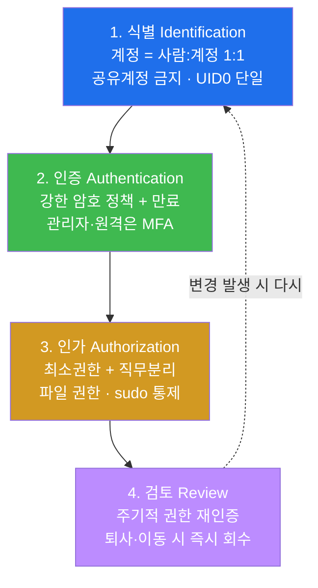
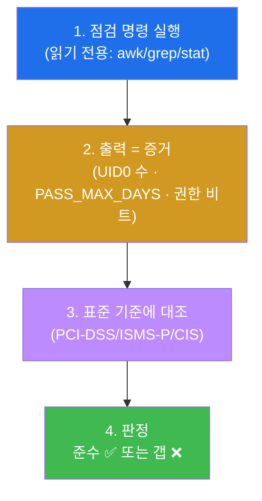
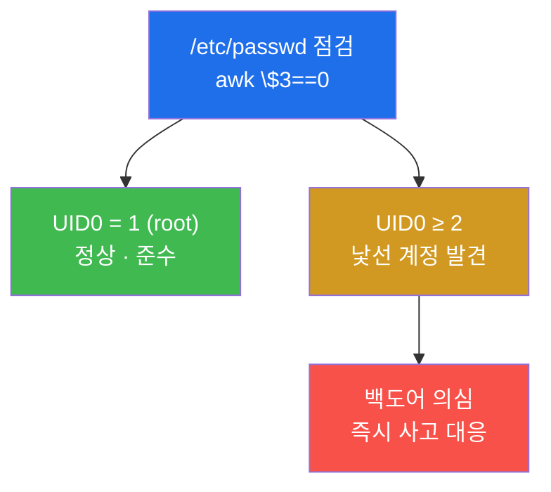
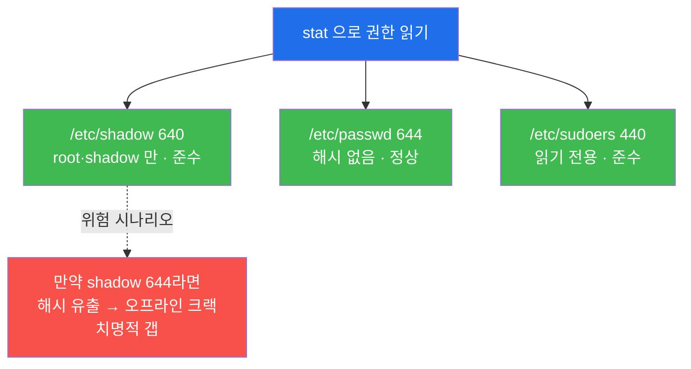
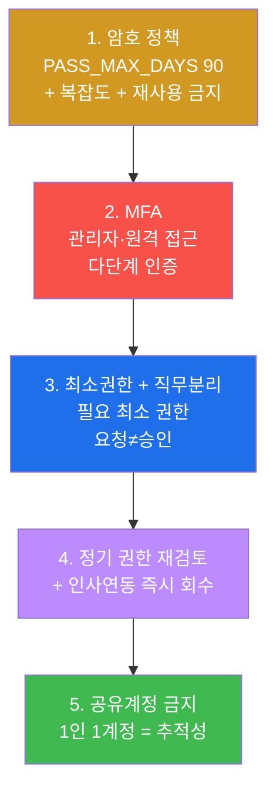
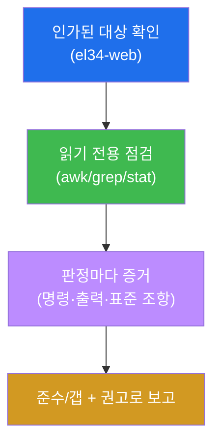
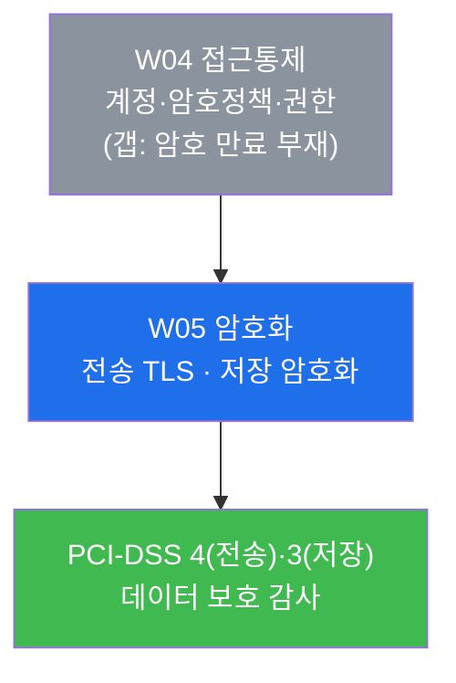

# 컴플라이언스 W04 — 접근통제 컴플라이언스: 계정·암호정책·권한을 감사하다

> **본 주차의 한 줄 요약**
>
> 컴플라이언스 4주차다. 지난 3주가 정책·자산·로깅의 "관리 기반"을 점검했다면, W04 는 보안의
> **가장 자주 깨지는 통제**인 **접근통제(Access Control)** 를 감사한다. 학생은 한 명의 **감사자
> (auditor)** 가 되어 el34-web 한 대의 OS 설정을 증거로 들춰, "**누가**(계정 식별) → **무엇으로**
> (인증·암호정책) → **무엇까지**(파일 권한·최소권한) 접근하는가"의 전 주기를 표준(PCI-DSS 7·8,
> ISMS-P 2.5, CIS Benchmark)에 비추어 본다.
>
> **감사자 한 줄 결론**: 접근통제 감사는 "공격이 됐다"가 아니라 **"통제가 표준 요건을 충족하는가,
> 그 증거는 무엇이며, 미달(갭)은 어디인가"를 명령 출력으로 입증**하는 일이다. el34-web 은 대부분의
> 통제(UID0 단일·shadow 640·sudoers 440)는 준수하지만 **암호 만료 정책 부재(PASS_MAX_DAYS 99999)**
> 라는 한 가지 명확한 갭을 품고 있다 — 이 한 줄을 찾아 표준 조항과 함께 보고하는 것이 본 주차의 핵심이다.

---

## 학습 목표

본 주차 종료 시 학생은 다음 6가지를 **본인 손으로** 할 수 있어야 한다.

1. 접근통제의 4단계(**식별 → 인증 → 인가 → 검토**)가 무엇이며 각 단계가 어느 표준 조항(PCI-DSS
   7·8, ISMS-P 2.5)에 대응하는지 비유 없이 1분 안에 설명한다.
2. el34-web 의 `/etc/passwd` 를 읽어 **UID 0(root) 계정 수**를 식별하고, 단일 UID0 가 왜 정상이며
   다중 UID0 가 왜 백도어 신호인지 증거와 함께 판정한다.
3. `/etc/login.defs` 의 **PASS_MAX_DAYS** 값을 확인해 암호 만료 정책이 표준 기준(≤90일)을 충족하는지
   판정하고, el34-web 의 `99999`(사실상 무기한) 가 **갭**임을 PCI-DSS 8.3.9 조항을 들어 입증한다.
4. `stat` 으로 `/etc/shadow`·`/etc/passwd`·`/etc/sudoers` 의 권한 비트를 읽어 CIS Benchmark
   기준(shadow ≤640, sudoers 440) 충족 여부를 판정하고, world-readable shadow 가 왜 치명적 갭인지
   설명한다.
5. **최소권한(Least Privilege)** 과 **직무분리(SoD)**, **권한 재검토**의 관리적 원칙을 정리하고, 이
   원칙들이 기술 점검만으로는 보이지 않는 "운영상의 갭"을 어떻게 드러내는지 설명한다.
6. 위 점검을 종합해 **준수 항목 / 갭 / 방어 권고**를 구분한 **접근통제 감사 보고서**를 작성하고,
   발견된 갭(암호 만료 부재)에 표준 조항·심각도·시정 방안을 붙여 보고한다.

---

## 0. 용어 해설 (접근통제 감사 입문)

본 주차에 처음 등장하거나 특히 중요한 용어를 먼저 정리한다. 표는 한 줄 정의에 그치므로, 신입생이
헷갈리기 쉬운 핵심 용어는 §0.5 에서 일상 비유로 다시 풀어 설명한다.

| 용어 | 영문 | 뜻 | 비유 |
|------|------|----|------|
| **접근통제** | Access Control | 누가·무엇에·어디까지 접근 가능한지를 정하고 강제하는 통제 전반 | 건물의 출입 정책 + 자물쇠 전부 |
| **식별** | Identification | 사용자가 "나는 누구다"라고 자신을 밝히는 것(계정) | 출입증에 적힌 이름 |
| **인증** | Authentication | 그 신원이 진짜임을 증명하는 것(암호·MFA) | 출입증이 위조가 아님을 확인 |
| **인가** | Authorization | 인증된 사용자가 무엇까지 할 수 있는지 결정 | 출입증으로 들어갈 수 있는 층 |
| **계정** | Account | 시스템이 사람을 식별하는 단위(사용자명+UID) | 직원 한 명당 하나의 출입증 |
| **UID** | User ID | 리눅스가 계정을 식별하는 숫자. **UID 0 = root(전권)** | 사번. 0번은 회장(전권) |
| **root** | superuser | UID 0 의 최고 권한 계정. 시스템의 모든 것을 할 수 있다 | 모든 문을 여는 마스터키 |
| **암호 정책** | Password Policy | 암호의 길이·복잡도·**만료 주기** 등을 강제하는 규칙 | 비밀번호를 며칠마다 바꾸라는 사규 |
| **PASS_MAX_DAYS** | — | 암호를 최대 며칠까지 쓸 수 있는지(만료 주기) 정하는 설정값 | 비밀번호 유효기간(일) |
| **/etc/passwd** | — | 계정 목록(사용자명·UID·홈·셸). 누구나 읽기 가능 | 직원 명부(이름·사번) |
| **/etc/shadow** | — | 암호 **해시**가 든 민감 파일. root·shadow 그룹만 읽기 | 비밀번호 금고 |
| **/etc/sudoers** | — | 누가 sudo(권한 상승)를 쓸 수 있는지 정하는 파일 | 마스터키 대여 명단 |
| **파일 권한(모드)** | file permission / mode | 파일을 누가 읽고·쓰고·실행할 수 있는지 나타내는 비트(예: 640) | 서류함 잠금 등급 |
| **최소권한** | Least Privilege | 업무에 필요한 **최소한의 권한만** 부여하는 원칙 | 필요한 층 열쇠만 주기 |
| **직무분리** | Separation of Duties (SoD) | 한 사람이 처음부터 끝까지 못 하게 권한을 나눔(요청≠승인) | 결재자와 신청자를 분리 |
| **권한 재검토** | access review / recertification | 부여한 권한이 아직 필요한지 주기적으로 다시 확인 | 출입증 정기 회수·갱신 |
| **PCI-DSS** | Payment Card Industry Data Security Standard | 카드 정보를 다루는 시스템의 의무 보안 표준 | 카드사가 정한 보안 의무 규정 |
| **ISMS-P** | 정보보호·개인정보보호 관리체계 | 한국의 정보보호 인증 제도(통제 항목으로 구성) | 국내 보안 인증 시험 |
| **CIS Benchmark** | Center for Internet Security Benchmark | OS·소프트웨어의 구체적 보안 설정 권고 모음 | 시스템 설정 점검 체크리스트 |
| **갭(미준수)** | gap / non-compliance | 표준 요건을 충족하지 못한 항목 | 점검표에서 "불합격"인 칸 |
| **감사자** | auditor / assessor | 통제가 표준을 충족하는지 증거로 점검·판정하는 사람 | 안전 점검을 나온 검사관 |

---

## 0.5 신입생 친화 핵심 용어 개념 설명

위 표만으로는 부족한, 본 주차에서 가장 중요한 6 용어를 일상 비유로 풀어 설명한다. 본문에서 다시
막히면 이 절로 돌아오면 흐름이 끊기지 않는다.

### 0.5.1 식별·인증·인가 — 회사 정문의 세 관문 비유

학생이 회사에 출근하는 장면을 떠올려 보자. 정문을 통과하기까지 세 관문을 지난다.

- **첫째 관문 — 식별(Identification).** 학생이 출입증을 단말기에 댄다. 출입증에는 이름과 사번이 적혀
  있다. 이 단계는 "**나는 누구다**"라고 시스템에 **밝히는** 것이다. 아직 진짜인지 확인하지는 않는다.
- **둘째 관문 — 인증(Authentication).** 단말기가 출입증이 진짜인지, 잃어버린 것은 아닌지 검사하고,
  필요하면 추가로 지문이나 PIN 을 요구한다. 이 단계는 "**그 신원이 진짜임을 증명**"하는 것이다.
  리눅스에서는 암호(그리고 더 안전하게는 MFA)가 이 역할을 한다.
- **셋째 관문 — 인가(Authorization).** 신원이 확인됐다고 모든 층에 갈 수 있는 것은 아니다. 출입증에
  부여된 권한에 따라 갈 수 있는 층이 정해진다. 이 단계가 "**무엇까지 할 수 있는가**"를 정하는 인가다.

이 세 관문을 컴퓨터 용어로 옮기면 그대로 **접근통제의 앞 세 단계**가 된다.

| 회사 정문 | 리눅스/접근통제 | el34-web 에서 점검 대상 |
|-----------|-----------------|-------------------------|
| 출입증에 적힌 이름·사번 | 식별 = 계정(사용자명·UID) | `/etc/passwd` (계정·UID0) |
| 출입증 진위·지문 확인 | 인증 = 암호 정책·MFA | `/etc/login.defs` (PASS_MAX_DAYS) |
| 갈 수 있는 층 | 인가 = 파일 권한·sudo·최소권한 | `/etc/shadow`·`/etc/sudoers` 권한 |

> **왜 이 순서가 중요한가.** 감사할 때 이 4단계(식별→인증→인가→**검토**)를 순서대로 훑으면 빠짐없이
> 점검할 수 있다. 순서 없이 아무 데나 보면 "암호는 봤는데 계정 식별을 빼먹는" 식의 구멍이 생긴다.
> 네 번째 단계인 **검토**는 "부여한 권한이 아직 필요한지 다시 확인"하는 운영 단계로, §5 에서 다룬다.

### 0.5.2 UID 0(root) — 회사의 회장(마스터키) 비유

리눅스의 모든 계정에는 **UID(User ID)** 라는 숫자가 붙는다. 회사로 치면 사번이다. 그런데 이 사번 중
**0번은 특별하다 — root, 곧 전권을 가진 최고 관리자**다. 회사로 치면 회장이고, 물리적으로는 모든
문을 여는 **마스터키**를 가진 사람이다.

회사에 마스터키가 **하나**만 있고 그것을 회장 한 사람만 가졌다면 통제가 가능하다. 마스터키를 누가
들고 있는지 분명하고, 분실하면 즉시 알 수 있다. 그런데 만약 마스터키가 **여러 개** 돌아다닌다면?
누가 어느 문을 열었는지 추적이 불가능해지고, 그중 하나만 도둑 손에 들어가도 전체가 뚫린다.

리눅스도 똑같다. **UID 0(root) 계정은 단 하나여야 정상**이다. `/etc/passwd` 를 읽었을 때 UID 가 0인
줄이 **둘 이상** 나오면, 그것은 누군가 몰래 만든 **백도어 계정**(예: `backdoor:x:0:0:...`)일 가능성이
높다. 공격자가 권한을 유지하려고 자기 계정의 UID 를 0으로 만들어 두는 것이 고전적인 수법이기 때문이다.
그래서 계정 식별 점검의 첫 질문은 언제나 "**UID 0 계정이 정확히 하나인가**"다.

### 0.5.3 PASS_MAX_DAYS — 비밀번호 유효기간 비유

회사가 직원에게 "비밀번호는 **90일마다 바꾸라**"고 정해 두는 사규를 떠올려 보자. 이 규칙이 있으면,
설령 누군가의 비밀번호가 유출되더라도 길어야 90일 안에 새 비밀번호로 바뀌어 **유출된 비밀번호의 수명이
끝난다**. 만약 이런 규칙이 없다면, 한 번 유출된 비밀번호는 그 직원이 회사를 떠날 때까지 **영원히
유효**하다.

리눅스에서 이 "비밀번호 유효기간"을 정하는 설정이 `/etc/login.defs` 파일의 **PASS_MAX_DAYS** 값이다.
이름 그대로 "암호를 최대 며칠까지 쓸 수 있는가"다.

- `PASS_MAX_DAYS 90` → 90일마다 변경 강제. **표준 준수.**
- `PASS_MAX_DAYS 99999` → 99999일 ≈ **약 274년**. 사실상 **무기한(만료 없음)**. **갭.**

el34-web 은 `PASS_MAX_DAYS 99999` 로 설정되어 있다. 이는 리눅스의 흔한 기본값이지만, 카드 정보를
다루는 시스템의 표준인 **PCI-DSS 8.3.9** 와 **CIS Benchmark** 는 암호 만료 주기를 **≤90일**로 권고하므로
이 값은 명백한 미준수다. 본 주차에서 학생이 찾아야 할 **핵심 갭**이 바로 이것이다.

> **표준 조항 — PCI-DSS 8.3.9.** PCI-DSS(카드 정보 보안 표준)의 요건 8은 "사용자 식별과 인증"을
> 다루며, 그중 8.3.9 는 비밀번호를 인증 요소로 쓸 때 일정 주기마다 변경하도록 요구한다(전통적으로
> 90일 기준). 만료 정책이 없으면 유출된 자격이 무기한 악용되므로 이 조항을 둔다.

### 0.5.4 파일 권한(모드) — 서류함 잠금 등급 비유

사무실에 서류함이 여럿 있다고 하자. 어떤 서류함은 누구나 열어 볼 수 있고(공개 게시판), 어떤 서류함은
부서원만, 어떤 서류함은 오직 책임자만 열 수 있다. 이 "누가 열 수 있는가"를 등급으로 매긴 것이 리눅스의
**파일 권한(모드)** 이다.

리눅스 권한은 세 자리(또는 네 자리) 숫자로 표현된다. 각 자리는 **소유자 / 그룹 / 기타(everyone)** 의
권한을 뜻하고, 숫자는 읽기(4)+쓰기(2)+실행(1)의 합이다. 예를 들어:

- `640` = 소유자 읽기·쓰기(6) / 그룹 읽기(4) / 기타 없음(0). → 소유자·그룹만 접근, 외부 차단.
- `644` = 소유자 읽기·쓰기(6) / 그룹 읽기(4) / **기타 읽기(4)**. → **누구나 읽을 수 있음(world-readable)**.
- `440` = 소유자 읽기(4) / 그룹 읽기(4) / 기타 없음(0). → 읽기 전용, 외부 차단.

이 권한 등급이 민감 파일에서는 곧 보안의 생명줄이 된다. el34-web 에서 점검할 세 파일은 다음과 같다.

| 파일 | 안에 든 것 | 안전한 권한 | 위험한 권한 |
|------|-----------|-------------|-------------|
| `/etc/passwd` | 계정 목록(이름·UID·홈) — 민감하지 않음 | `644`(누구나 읽기, 정상) | — |
| `/etc/shadow` | **암호 해시** — 매우 민감 | `640`(root·shadow 만) | `644`면 해시 유출 = **치명** |
| `/etc/sudoers` | sudo 권한 명단 — 민감 | `440`(읽기 전용) | 쓰기 허용 시 권한 탈취 |

핵심은 **`/etc/shadow`** 다. 이 파일에는 모든 계정의 암호 해시가 들어 있어서, 만약 권한이 `644`라
**누구나 읽을 수 있게(world-readable)** 되어 있으면, 일반 사용자가 해시를 통째로 빼내 오프라인에서
무차별 대입(crack)으로 암호를 알아낼 수 있다. el34-web 은 `/etc/shadow` 가 `640`, `/etc/sudoers` 가
`440` 으로 설정되어 **CIS Benchmark 를 준수**한다 — 이것은 보고서에서 "준수" 항목으로 기록할 부분이다.

### 0.5.5 최소권한 vs 직무분리 — 헷갈리기 쉬운 한 쌍

두 원칙은 이름이 비슷해 자주 혼동되지만 막는 위험이 다르다.

- **최소권한(Least Privilege)** 은 **한 사람에게 주는 권한의 양**에 관한 원칙이다. "업무에 꼭 필요한
  최소한만 주라"는 것. 신입 개발자에게 운영 서버 root 를 주지 않는 것이 최소권한이다. 막는 위험은
  "권한이 너무 많아 실수나 탈취 시 피해가 커지는 것"이다.
- **직무분리(SoD, Separation of Duties)** 는 **하나의 위험한 작업을 여러 사람에게 나누는** 원칙이다.
  "한 사람이 처음부터 끝까지 못 하게 하라"는 것. 송금을 신청하는 사람과 승인하는 사람을 분리하거나,
  코드를 개발하는 사람과 운영에 배포하는 사람을 분리하는 것이 SoD 다. 막는 위험은 "한 사람이 단독으로
  부정을 저지르는 것"이다.

한 문장으로 구분하면 — **최소권한은 "얼마나 주느냐", 직무분리는 "한 사람이 다 하게 두지 않느냐"** 다.
둘은 함께 쓰여 서로를 보완한다.

### 0.5.6 컴플라이언스 갭(gap) — 점검표의 "불합격" 칸 비유

건물 안전 점검을 나온 검사관이 체크리스트를 들고 항목을 하나씩 확인한다고 하자. 소화기(합격),
비상구 표시(합격), 스프링클러(불합격 — 일부 미작동). 이 "불합격" 칸이 컴플라이언스에서는 **갭(gap)**,
곧 **표준 요건을 충족하지 못한 항목**이다.

감사의 산출물은 "취약하다/안전하다"는 막연한 인상이 아니라, **항목별로 준수/갭을 가른 표**다. 그리고
각 갭에는 (1) **어느 표준 조항**을 위반했는지, (2) **무엇이 증거**인지(명령 출력), (3) **얼마나 위험**한지
(심각도), (4) **어떻게 고치는지**(시정 방안)를 붙인다. el34-web 감사의 결론은 명확하다 — 대부분의
통제는 **준수**(UID0 단일, shadow 640, sudoers 440)이고, **갭은 단 하나**(PASS_MAX_DAYS 무기한)다.
좋은 감사 보고서는 이 "준수도 정직하게, 갭도 정확히" 적는다. 모든 것을 "위험"으로 칠하면 신뢰를 잃고,
갭을 빠뜨리면 사고로 이어진다.

---

## 1. 왜 접근통제가 "가장 자주 깨지는 통제"인가

### 1.1 한 줄 답: 접근통제는 사람·계정·권한이 끊임없이 변하기 때문

방화벽 규칙이나 암호화 설정은 한 번 잘 잡아두면 비교적 오래 유지된다. 하지만 접근통제는 다르다.
사람이 입사·퇴사·부서이동하고, 임시 권한이 부여됐다 회수되지 않고, 협력업체 계정이 만들어졌다 잊히고,
개발자가 디버깅용으로 만든 root 계정이 그대로 남는다. **통제 대상(계정·권한)이 끊임없이 변하기 때문에**,
접근통제는 한 번 맞춰도 시간이 지나면 어긋난다. 그래서 모든 보안 프레임워크가 접근통제를 핵심 통제로
두고 **주기적 재검토**를 요구한다.

### 1.2 실 사고 3건 (이 강의의 동기)

| 사고 | 접근통제 측 원인 | 어느 단계가 실패했나 |
|------|------------------|----------------------|
| 2013 Target (4천만 카드 유출) | 협력업체(공조업체) 계정이 과도한 내부망 접근 권한 보유 | 인가(최소권한) 실패 |
| 2021 Colonial Pipeline (송유관 마비) | 폐기됐어야 할 VPN 계정이 살아있고 **MFA 없는 단일 암호** | 인증(MFA 부재)·검토(미회수) 실패 |
| 2019 Capital One (1억 건 PII) | 과도한 권한의 역할(role)이 내부 자원에 광범위 접근 | 인가(최소권한) 실패 |

세 사고의 공통점은 **화려한 0-day 가 아니라 "계정·권한 관리의 느슨함"** 이 발판이 됐다는 것이다.
폐기 안 된 계정, MFA 없는 암호, 너무 많은 권한 — 모두 본 주차가 점검하는 항목이다. 사고 후 분석의
공통 결론은 "기본적인 접근통제만 지켰어도 막거나 줄일 수 있었다"는 것이다.

### 1.3 접근통제 4단계 — 정식 모델

접근통제는 다음 네 단계의 생애주기로 본다. 한 단계라도 느슨하면 그 지점이 침해의 발판이 된다.



각 단계는 서로 다른 점검 대상과 표준 조항을 가진다. 식별은 계정의 유일성을, 인증은 암호의 강도와
만료를, 인가는 권한의 최소화를, 검토는 권한의 시의성을 본다. 본 주차의 실습은 이 4단계를 순서대로
따라간다 — lab 2(식별) → lab 3(인증) → lab 4–5(인가) → lab 6(갭) → lab 7–8(검토·보고).

### 1.4 표준 매핑 — PCI-DSS 7·8 / ISMS-P 2.5 / CIS

같은 접근통제를 세 표준이 각자의 언어로 요구한다. 감사자는 발견을 이 표준 조항에 자리매김해야 보고서가
설득력을 가진다.

| 접근통제 단계 | PCI-DSS | ISMS-P | CIS Benchmark | 본 주차 점검(el34-web) |
|---------------|---------|--------|---------------|------------------------|
| 식별(계정·UID0) | 8.2(고유 ID) | 2.5.1(사용자 등록) | 계정/UID 정책 | `/etc/passwd` UID0 수 |
| 인증(암호·만료) | 8.3(강한 인증), **8.3.9(만료)** | 2.5.3(인증) | 5.x 암호 정책 | `/etc/login.defs` PASS_MAX_DAYS |
| 인가(최소권한·파일권한) | **7.x(필요 최소 접근)** | 2.5.5(접근권한 부여) | 6.x 파일 권한 | `/etc/shadow`·`sudoers` 권한 |
| 검토(재인증·회수) | 7.2.5(주기 검토) | 2.5.6(접근권한 검토) | — | 관리적 점검(lab 5) |

> **표준 조항 — PCI-DSS 7 과 8 의 차이.** **요건 7**은 "**인가(Authorization)** — 업무상 알 필요(need
> to know)에 따라 접근을 제한하라"이고, **요건 8**은 "**식별·인증(Identification & Authentication)** —
> 사용자를 고유하게 식별하고 인증하라"다. 즉 7은 "무엇까지", 8은 "누구인가·진짜인가"를 다룬다. 본
> 주차는 8(계정·암호)과 7(권한·파일권한)을 함께 감사한다.

---

## 2. 감사자의 시선 — 증거 기반 점검과 갭 판정

본격 점검에 들어가기 전에, 컴플라이언스 트랙이 다른 트랙(공격·방어)과 어떻게 다른 시선을 갖는지
분명히 해 두자. 이 시선의 차이가 본 주차 실습의 채점 기준을 결정한다.

### 2.1 감사는 "공격"이 아니라 "증거로 하는 판정"이다

공격 트랙(attack)이라면 권한 상승에 **성공**하는 것이 목표다. 방어 트랙(soc)이라면 그 시도를 **탐지**
하는 것이 목표다. 그러나 컴플라이언스 감사자는 둘 다 하지 않는다. 감사자는 시스템 설정을 **읽어서**,
그것이 표준 요건을 충족하는지 **판정**한다. 무차별 대입으로 암호를 깨거나, 백도어를 심거나, 권한을
실제로 상승시키지 않는다 — 그것은 인가 범위를 벗어난 행위이자, 애초에 감사의 목적이 아니다.

따라서 본 주차의 모든 명령은 **읽기 전용 점검**이다. `awk` 로 계정을 세고, `grep` 으로 설정값을 읽고,
`stat` 으로 권한 비트를 확인한다. 시스템을 **변경하지 않는다**. 이것이 감사자의 직업 윤리이자, 운영
중인 시스템을 망가뜨리지 않고 점검하는 안전한 방법이다.

### 2.2 모든 판정에는 증거가 따른다

감사 보고서의 신뢰는 주장이 아니라 **증거**에서 나온다. "암호 정책이 약하다"는 인상이 아니라, "`grep
PASS_MAX_DAYS /etc/login.defs` 의 출력이 `99999` 이며, 이는 PCI-DSS 8.3.9 의 ≤90일 요건을 초과한다"는
**재현 가능한 명령 + 출력 + 조항**이 증거다. 본 주차의 실습은 각 점검을 이 형태로 기록하게 한다 —
무엇을 실행했고, 무엇이 나왔고, 어느 기준에 비추어 준수/갭인지.



### 2.3 el34-web 진입 경로 — 호스트 SSH + docker exec

본 주차의 감사 대상은 **el34-web 컨테이너 한 대**다. el34 의 모든 컨테이너는 타깃 VM 192.168.0.151
한 대 위에서 docker 로 돌고, 표준 접근은 호스트에 SSH 로 들어간 뒤 `docker exec` 로 대상 컨테이너에
명령을 보내는 것이다.

```bash
ssh ccc@192.168.0.151                     # el34 호스트 접속 (비밀번호: 1)
docker exec el34-web sh -c "hostname"     # 대상 컨테이너에 점검 명령 실행
```

> **왜 web 컨테이너인가.** el34-web 은 Apache + ModSecurity(WAF)가 도는 DMZ 의 핵심 서버(dmz
> 10.20.32.80)다. 외부에 노출된 서버일수록 계정·권한 관리가 중요하므로, 접근통제 감사의 대표 대상으로
> 삼는다. 본 주차의 모든 lab step 은 `target_vm: web` 으로 이 컨테이너를 점검한다.

> **점검 vs 공격의 경계.** 본 주차는 컨테이너 안의 파일을 **읽기만** 한다. `/etc/shadow` 의 해시를
> 실제로 빼내 크랙하거나, `/etc/sudoers` 를 수정하거나, 새 UID0 계정을 만드는 행위는 감사 범위를
> 벗어난다. 감사자는 "그렇게 할 수 있는 위험이 있는가"를 권한 비트로 **판정**할 뿐, 실행하지 않는다.

---

## 3. 점검 1 — 계정 식별 (UID0)

### 3.1 한 줄 정의와 왜 중요한가

**계정 식별**은 시스템에 어떤 계정이 존재하며, 그중 전권(UID 0)을 가진 계정이 무엇인지 파악하는
점검이다. 식별이 무너지면 그 위의 모든 통제가 의미를 잃는다 — 누가 누구인지 모르면 인증도 인가도
추적할 수 없기 때문이다. 특히 **UID 0 계정의 유일성**은 접근통제의 가장 기본적인 무결성 지표다.

### 3.2 el34-web 에서 어떻게 보나

`/etc/passwd` 는 한 줄에 한 계정씩, 콜론(`:`)으로 구분된 필드(사용자명:x:UID:GID:설명:홈:셸)를 담는다.
세 번째 필드가 UID 이므로, `awk` 로 그 필드가 0인 줄을 골라 세면 UID0 계정 수를 알 수 있다.

```bash
docker exec el34-web sh -c 'echo "uid0_count=$(awk -F: "\$3==0" /etc/passwd | wc -l)"; awk -F: "\$3==0 {print \$1}" /etc/passwd'
```

이 명령을 한 부분씩 해석하면 — `awk -F:` 는 콜론을 필드 구분자로 삼고, `$3==0` 은 세 번째 필드(UID)가
0인 줄만 통과시키며, `wc -l` 은 그 줄 수를 센다. 두 번째 `awk` 는 그 계정들의 이름(`$1`)을 출력한다.

**예상 출력**:
```
uid0_count=1
root
```

`uid0_count=1` 이고 그 계정이 `root` 하나뿐 → **정상(준수)**. 만약 `uid0_count=2` 이고 `root` 외에
`backdoor` 같은 낯선 이름이 보이면, 그것은 공격자가 심은 **백도어 계정**일 가능성이 높은 **치명적 갭**
이다. 이 경우 즉시 사고 대응으로 전환해야 한다.



### 3.3 한계

UID0 점검은 "전권 계정의 유일성"만 본다. UID 가 0이 아니어도 sudo 로 root 권한을 얻는 계정, 공유로
쓰이는 계정, 만료되지 않은 퇴사자 계정 등은 이 점검에 잡히지 않는다. 그래서 계정 식별은 다음 점검(암호
정책·sudoers·권한 검토)과 함께 보아야 완성된다.

---

## 4. 점검 2 — 암호 정책 (PASS_MAX_DAYS)

### 4.1 한 줄 정의와 왜 중요한가

**암호 정책 점검**은 암호의 길이·복잡도·**만료 주기**가 표준 기준을 충족하는지 보는 것이다. 본 주차의
핵심은 **만료 주기(PASS_MAX_DAYS)** 다. 만료 정책이 없으면, 한 번 유출된 암호가 **무기한** 유효해
공격자가 언제든 다시 들어올 수 있다. 이것이 §1.2 의 Colonial Pipeline 사고(MFA 없는 단일 암호)가
치명적이었던 이유다.

### 4.2 el34-web 에서 어떻게 보나

암호 정책은 `/etc/login.defs` 에 정의된다. `PASS_MAX_DAYS` 줄을 읽어 값을 추출하고, 그 값이 표준
기준(90)을 넘는지 비교한다.

```bash
docker exec el34-web sh -c 'V=$(grep "^PASS_MAX_DAYS" /etc/login.defs | tr -dc "0-9"); echo "max_days=$V"; [ "$V" -gt 90 ] 2>/dev/null && echo "gap=no_expiry" || echo "compliant"'
```

명령 해석 — `grep "^PASS_MAX_DAYS"` 로 해당 줄을 찾고, `tr -dc "0-9"` 로 숫자만 남겨 값 `V` 를 얻은
뒤, `[ "$V" -gt 90 ]` 로 90을 초과하면 갭으로 판정한다.

**예상 출력**:
```
max_days=99999
gap=no_expiry
```

`max_days=99999` 는 약 274년으로 사실상 **무기한**이며, `gap=no_expiry` 가 출력된다 → **갭(미준수)**.
PCI-DSS 8.3.9 와 CIS Benchmark 가 요구하는 ≤90일을 크게 초과하기 때문이다. 이것이 본 주차 감사에서
학생이 찾아야 할 **핵심 갭**이다.

> **el34 사실 정확히.** el34-web 의 `PASS_MAX_DAYS` 는 리눅스 기본값인 `99999` 다. 이는 별도로 강화하지
> 않은 전형적 상태이며, 본 주차는 이 "기본값을 그대로 둔 것"이 곧 컴플라이언스 갭임을 보여준다. 값이
> 99999 라는 사실을 정확히 보고하고, 임의의 다른 값으로 지어내지 않는다.

### 4.3 한계

PASS_MAX_DAYS 한 줄만으로 인증 강도를 다 평가할 수는 없다. 암호 **최소 길이**(PASS_MIN_LEN), **복잡도**,
**재사용 금지**, 그리고 무엇보다 **MFA(다단계 인증)** 가 함께 있어야 인증이 견고해진다. 만료 주기는
"유출된 암호의 수명을 제한"할 뿐, 애초에 유출·추측을 막는 것은 길이·복잡도·MFA 의 몫이다. 그래서
방어 권고(§6, lab 7)에서는 만료뿐 아니라 MFA 를 함께 제시한다.

---

## 5. 점검 3 — 파일 권한과 최소권한·직무분리

### 5.1 민감 파일 권한 — shadow / passwd / sudoers

**한 줄 정의.** 파일 권한 점검은 계정·인증과 관련된 **민감 파일**이 권한 밖 사용자에게 노출되지 않는지
보는 것이다. 아무리 암호 정책이 좋아도, 암호 해시가 든 `/etc/shadow` 를 누구나 읽을 수 있다면(world-
readable) 그 모든 통제가 무력해진다.

**el34-web 에서 어떻게 보나.** `stat -c "%n %a"` 는 파일 이름(`%n`)과 권한을 8진수(`%a`)로 출력한다.
세 민감 파일의 권한을 한 번에 읽고, 그중 가장 중요한 `/etc/shadow` 의 권한이 안전 기준(600 또는 640)
인지 판정한다.

```bash
docker exec el34-web sh -c 'stat -c "%n %a" /etc/shadow /etc/passwd /etc/sudoers; S=$(stat -c "%a" /etc/shadow); case "$S" in 600|640) echo "compliant=shadow_$S";; *) echo "gap=shadow_$S";; esac'
```

**예상 출력**:
```
/etc/shadow 640
/etc/passwd 644
/etc/sudoers 440
compliant=shadow_640
```

해석 — `/etc/shadow` 가 `640`(root·shadow 그룹만 읽기), `/etc/sudoers` 가 `440`(읽기 전용)으로 **CIS
Benchmark 를 준수**한다. `/etc/passwd` 의 `644`(누구나 읽기)는 **정상**이다 — passwd 에는 해시가 없고
계정 목록만 있어 공개돼도 무방하기 때문이다. 만약 shadow 가 `644` 였다면 `gap=shadow_644` 가 출력되며,
이는 암호 해시 유출로 이어지는 **치명적 갭**이다.



### 5.2 최소권한 — 업무에 필요한 만큼만

**한 줄 정의.** 최소권한(Least Privilege)은 모든 계정·프로세스에 **업무에 필요한 최소한의 권한만**
부여하는 원칙이다(PCI-DSS 7, ISMS-P 2.5.5).

**왜 중요한가.** 권한이 많을수록 그 계정이 탈취되거나 실수했을 때 피해가 커진다. §1.2 의 Target·Capital
One 사고가 모두 "필요 이상의 권한"에서 비롯됐다. 최소권한은 사고의 **폭발 반경(blast radius)** 을
줄이는 가장 효과적인 설계 원칙이다.

**el34 에서의 적용 예.** sudo 권한을 모든 사용자가 아니라 운영자에게만 부여하고, root 직접 로그인을
차단하며(W02 에서 `PermitRootLogin no` 점검), 각 서비스를 전용 계정으로 분리하는 것이 최소권한의
실천이다.

### 5.3 직무분리(SoD) — 한 사람이 다 하게 두지 않기

**한 줄 정의.** 직무분리(Separation of Duties)는 하나의 민감한 작업을 **여러 사람에게 나누어**, 한
사람이 단독으로 부정을 저지르지 못하게 하는 원칙이다.

**왜 중요한가.** 요청자와 승인자가 같으면, 또는 개발자가 곧바로 운영에 배포할 수 있으면, 단 한 사람의
악의나 실수로 통제가 무너진다. SoD 는 "권한의 견제와 균형"이다.

**대표 분리 쌍** — 요청자 ≠ 승인자(예: 권한 부여를 신청하는 사람과 승인하는 사람), 개발 ≠ 운영(코드
작성자와 운영 배포자), 운영 ≠ 감사(시스템을 운영하는 사람과 그 로그를 감사하는 사람).

### 5.4 권한 재검토 — 가장 자주 누락되는 단계

접근통제 4단계의 마지막인 **검토(Review)** 는 부여한 권한이 **아직 필요한지** 주기적으로 다시 확인하는
것이다(PCI-DSS 7.2.5, ISMS-P 2.5.6). 실무에서 권한은 **부여보다 회수가 훨씬 자주 누락**된다 — 새 권한은
업무가 막히니 즉시 주지만, 더 이상 필요 없어진 권한은 아무도 막히지 않으니 그대로 방치된다. 그 결과
퇴사자 계정이 살아있고(Colonial Pipeline), 부서이동 후에도 옛 권한이 남는다. 그래서 정기 재인증과
인사 연동 즉시 회수가 접근통제의 마지막 안전장치다.

---

## 6. 갭 도출과 방어 — 무엇이 미달이고 어떻게 고치나

### 6.1 el34-web 접근통제 갭 종합

앞의 세 점검을 종합하면 el34-web 의 접근통제 상태가 한눈에 정리된다.

| 점검 항목 | 결과 | 표준 기준 | 판정 |
|-----------|------|-----------|------|
| UID0 계정 수 | 1 (root) | 단일 | ✅ 준수 |
| PASS_MAX_DAYS | 99999 (무기한) | ≤90일 (PCI 8.3.9) | ❌ **갭** |
| /etc/shadow 권한 | 640 | ≤640 (CIS) | ✅ 준수 |
| /etc/sudoers 권한 | 440 | 440 (CIS) | ✅ 준수 |
| root 직접 로그인 | no (W02 점검) | 차단 권고 | ✅ 준수 |

결론 — el34-web 은 **계정·파일권한·root 로그인은 모두 준수**하며, **유일한 갭은 암호 만료 정책 부재
(PASS_MAX_DAYS 99999)** 다. 감사 보고서는 이 정직한 그림을 그대로 담는다: 준수는 준수로, 갭은 갭으로.

### 6.2 핵심 갭 — 암호 만료 정책 부재

**갭의 내용.** `PASS_MAX_DAYS 99999` 는 암호가 사실상 영구 유효함을 뜻한다.
**위반 조항.** PCI-DSS 8.3.9(주기적 변경), CIS Benchmark(≤90일).
**위험(심각도: Medium~High).** 한 번 유출·추측된 암호가 무기한 악용된다. 특히 MFA 가 없으면 단일
암호가 유일한 방어선이므로 위험이 커진다.
**시정 방안.** `/etc/login.defs` 의 `PASS_MAX_DAYS` 를 90 이하로 설정하고, 기존 계정에도 적용한다.

### 6.3 방어 권고 — 접근통제 강화

갭 하나를 고치는 데 그치지 않고, 접근통제 전반을 견고하게 하는 방어를 단계로 정리한다.



핵심 우선순위는 **만료 정책 도입(즉시 가능한 설정 변경) + MFA(가장 효과적인 인증 강화) + 정기
재검토(권한의 시의성 유지)** 다. 만료 정책은 비용 없이 즉시 적용할 수 있어 가장 먼저 처리하고, MFA 는
유출·추측을 근본적으로 막으므로 그다음 우선이다.

### 6.4 공유계정 금지 — 추적성의 전제

여러 사람이 하나의 계정(예: `admin`)을 함께 쓰면, 사고가 났을 때 "누가 했는가"를 추적할 수 없다.
**1인 1계정**은 모든 행위를 개인에게 귀속시켜 **추적성(accountability)** 을 확보하는 전제이며, ISMS-P
2.5 와 PCI-DSS 8.2(고유 ID)가 공통으로 요구한다. 공유계정은 식별 단계에서부터 접근통제를 무너뜨린다.

---

## 7. 실습 안내 — lab 8 미션 (4 축 설명)

본 주차 실습은 8 미션으로, 접근통제 4단계를 따라 **점검(도달성) → 계정 식별 → 암호 정책 → 파일 권한
→ 최소권한·직무분리 → 갭 도출 → 방어 → 보고서** 순으로 흐른다. 각 미션을 **4 축**으로 설명한다 —
왜 하는가 / 무엇을 알 수 있는가 / 결과 해석(준수 vs 갭) / 실전 활용.

> **실습 진행 원칙.** 모든 명령은 el34 호스트(`ssh ccc@192.168.0.151`, 비밀번호 1)에서 `docker exec
> el34-web` 으로 실행한다. 신규 도구 설치는 없다 — `awk`·`grep`·`stat` 등 기본 도구만 쓴다. 모든
> 점검은 **읽기 전용**이며 시스템을 변경하지 않는다. 합격 임계값은 0.7 이다.

### 미션 1 — 점검: 감사 대상 el34-web 에 도달하나 (10점)

> **왜 하는가?** 감사의 전제는 대상에 접근할 수 있다는 것이다. 점검 착수 전 항상 대상의 도달성부터
> 확인한다 — 접근이 안 되면 이후의 모든 음성 결과가 무의미하다.
>
> **무엇을 알 수 있는가?** `docker exec el34-web` 으로 hostname 을 받아, 감사 대상 컨테이너에 명령을
> 보낼 수 있는 상태인지.
>
> **결과 해석.** 정상: `target_ok` 가 출력 → 대상 접근 가능. 비정상: 응답이 없으면 호스트 SSH·컨테이너
> 상태(`docker ps`)부터 점검한다.
>
> **실전 활용.** 모든 시스템 감사의 1단계 — 점검 범위(scope)가 실제로 살아있고 접근 가능한지 확인.

### 미션 2 — 계정 식별: UID0 계정 수 (14점)

> **왜 하는가?** 접근통제 4단계의 첫째인 식별이다. 전권(UID 0) 계정의 유일성은 접근통제 무결성의
> 가장 기본 지표다.
>
> **무엇을 알 수 있는가?** `/etc/passwd` 를 `awk` 로 읽어 UID 0 계정의 수와 이름을. el34-web 은
> `root` 하나여야 정상이다.
>
> **결과 해석.** 준수: `uid0_count=1` + `root` 만 출력. 갭(치명): `uid0_count` 가 2 이상이고 낯선
> 계정이 보이면 백도어 의심 → 즉시 사고 대응.
>
> **실전 활용.** 침해 흔적 점검의 단골 항목. 공격자가 권한 유지를 위해 UID0 계정을 심는 수법을 잡는다.

### 미션 3 — 암호 정책: PASS_MAX_DAYS 갭 (16점)

> **왜 하는가?** 접근통제 둘째인 인증의 핵심. 암호 만료 정책이 없으면 유출된 자격이 무기한 악용된다.
> 본 주차의 **핵심 갭**을 찾는 미션이다.
>
> **무엇을 알 수 있는가?** `/etc/login.defs` 의 `PASS_MAX_DAYS` 값과, 그것이 표준 기준(≤90일)을
> 초과하는지. el34-web 은 `99999`(무기한)다.
>
> **결과 해석.** 정상 점검 결과: `max_days=99999` + `gap=no_expiry` 출력 → 갭 발견 성공. PCI-DSS
> 8.3.9/CIS 의 ≤90일 미달이 그 근거다. (≤90 이었다면 `compliant` 가 나온다.)
>
> **실전 활용.** 가장 흔한 컴플라이언스 갭. 설정 한 줄로 즉시 시정 가능해 감사 보고서의 대표 시정
> 권고가 된다.

### 미션 4 — 파일 권한: shadow / sudoers (14점)

> **왜 하는가?** 접근통제 셋째인 인가의 기반. 암호 해시가 든 `/etc/shadow` 가 권한 밖에 노출되면
> 모든 인증이 무력해진다.
>
> **무엇을 알 수 있는가?** `stat` 으로 `/etc/shadow`·`/etc/passwd`·`/etc/sudoers` 의 권한 비트를. CIS
> 기준은 shadow ≤640, sudoers 440 이다.
>
> **결과 해석.** 준수: `/etc/shadow 640` + `compliant=shadow_640` 출력(passwd 644 는 해시가 없어
> 정상). 갭(치명): shadow 가 644(world-readable)면 `gap=shadow_644` → 해시 유출 위험.
>
> **실전 활용.** OS 보안 베이스라인 점검의 필수 항목. world-readable shadow 는 즉시 시정 대상.

### 미션 5 — 최소권한·직무분리 (12점)

> **왜 하는가?** 기술 점검만으로는 보이지 않는 **관리적 통제**를 정리한다. 사고의 폭발 반경을 줄이는
> 설계 원칙이다.
>
> **무엇을 알 수 있는가?** 최소권한(필요 최소만)·직무분리(요청≠승인, 개발≠운영)·권한 재검토(인사이동·
> 정기)의 원칙과, 그중 무엇이 실무에서 가장 자주 누락되는지(회수·재검토).
>
> **결과 해석.** 정상: 세 원칙이 정리되어 출력. 핵심 깨달음 — 권한은 부여보다 회수·재검토가 더 자주
> 누락된다.
>
> **실전 활용.** ISMS-P 2.5.5/2.5.6, PCI-DSS 7 의 관리적 요건. 인터뷰·정책 문서 점검으로 감사한다.

### 미션 6 — 갭 도출 (12점)

> **왜 하는가?** 점검 결과를 "준수/갭"으로 가려야 보고서의 골격이 선다. 나열이 아니라 판정이 감사의
> 산출물이다.
>
> **무엇을 알 수 있는가?** el34-web 의 접근통제 상태 — 갭은 **PASS_MAX_DAYS 무기한** 하나이고, 나머지
> (UID0 단일·shadow 640·sudoers 440·root 로그인 차단)는 준수임을.
>
> **결과 해석.** 정상: `갭1: PASS_MAX_DAYS 99999` + 준수 항목이 함께 정리됨. 핵심 — 갭도 정확히,
> 준수도 정직하게.
>
> **실전 활용.** 감사 보고서의 "발견사항(findings)" 절. 각 갭에 표준 조항·증거·심각도를 붙인다.

### 미션 7 — 방어: 접근통제 강화 (12점)

> **왜 하는가?** 감사의 가치는 "고치는 길"을 제시하는 데 있다. 갭을 메우고 접근통제 전반을 견고하게
> 하는 권고를 정리한다.
>
> **무엇을 알 수 있는가?** 암호 만료(90)·MFA·최소권한+직무분리·정기 재검토·공유계정 금지의 다섯 방어와
> 그 우선순위(만료+MFA+재검토가 핵심).
>
> **결과 해석.** 정상: 다섯 방어가 정리되고 `MFA` 가 포함됨. 우선순위 근거 — 만료는 즉시 가능, MFA 는
> 가장 효과적.
>
> **실전 활용.** 보고서의 "권고(recommendation)" 절. 의뢰인의 보안 로드맵으로 직접 이어진다.

### 미션 8 — 접근통제 감사 보고서 (12점)

> **왜 하는가?** 감사의 최종 산출물은 보고서다. 미션 1–7 의 점검·갭·방어를 한 문서로 종합해야 감사가
> 완성된다.
>
> **무엇을 알 수 있는가?** **점검 결과(대부분 준수) → 갭(PASS_MAX_DAYS 무기한) → 방어(만료/MFA/재검토)**
> 구조로 접근통제 감사를 한 보고서로 묶는 법.
>
> **결과 해석.** 정상: 보고서에 준수 항목·갭(표준 조항 포함)·방어 권고·결론이 모두 포함됨. 비정상:
> 증거 없는 주장만 있으면 점검 명령·출력을 보강한다.
>
> **실전 활용.** 컴플라이언스 감사 보고서의 표준 구조(범위 → 점검 결과 → 발견사항/갭 → 권고 → 결론).
> 인증 심사·내부 감사에 제출하는 최종 산출물.

---

## 8. 감사 수칙 — 읽기 전용·증거 중심

컴플라이언스 감사는 **인가된 대상을 읽어서 판정**하는 일이다. 다음 수칙을 반드시 지킨다.

- **읽기 전용으로 점검한다.** 계정을 추가·삭제하거나, 설정을 변경하거나, 권한을 실제로 상승시키지
  않는다. `awk`·`grep`·`stat` 같은 읽기 명령만 쓴다. 감사는 "위험이 있는가"를 판정하는 것이지 위험을
  실현하는 것이 아니다.
- **증거 중심으로 보고한다.** "약하다"가 아니라 **명령 + 출력 + 표준 조항**을 제시한다. `PASS_MAX_DAYS
  99999` 와 PCI-DSS 8.3.9 를 함께 적어야 갭이 입증된다.
- **준수도 정직하게 적는다.** 모든 것을 위험으로 칠하면 보고서의 신뢰를 잃는다. el34-web 처럼 대부분이
  준수라면 준수로 적고, 갭만 정확히 짚는다.
- **인가된 대상만 점검한다.** el34 의 정해진 대상(el34-web)에 대해서만 점검하며, 같은 명령을 다른
  시스템에 임의로 실행하지 않는다.



---

## 9. 다음 주차 (W05) 예고 — 암호화 컴플라이언스

W04 에서 학생은 접근통제를 감사했다 — **누가**(계정) **무엇으로**(암호) **무엇까지**(권한) 접근하는가를
점검하고, 암호 만료 정책 부재라는 갭을 찾았다. 그런데 접근통제가 완벽해도, **데이터 자체가 평문으로
오가거나 저장되면** 통제를 우회해 데이터가 새어 나간다.

W05 부터는 그 **데이터 보호의 마지막 층 — 암호화 컴플라이언스**로 들어간다. 전송 구간의 **TLS**(통신
암호화)와 저장 데이터의 **암호화**, 그리고 이를 요구하는 **PCI-DSS 요건 4(전송 암호화)·3(저장 데이터
보호)** 을 본격적으로 감사한다. 접근통제(W04)가 "문과 자물쇠"를 점검했다면, 암호화(W05)는 "그 안의
서류 자체를 읽을 수 없게 만들었는가"를 점검한다.


