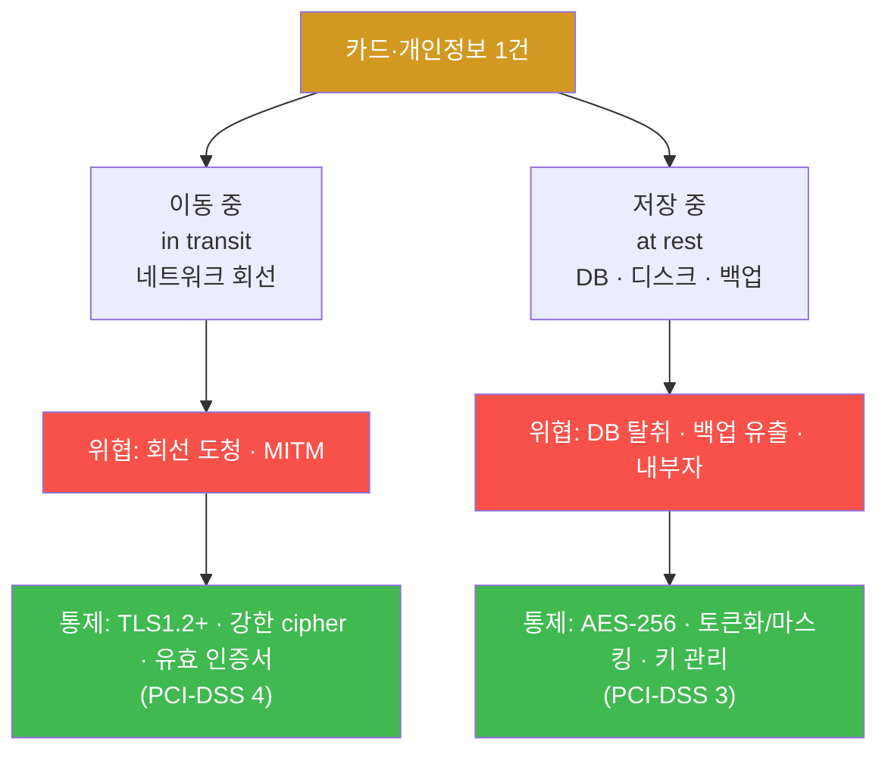
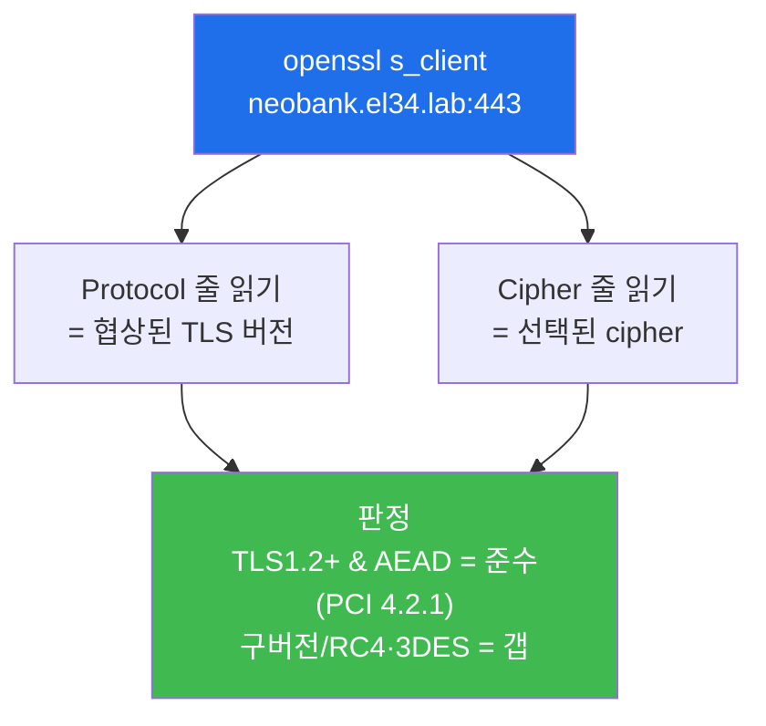
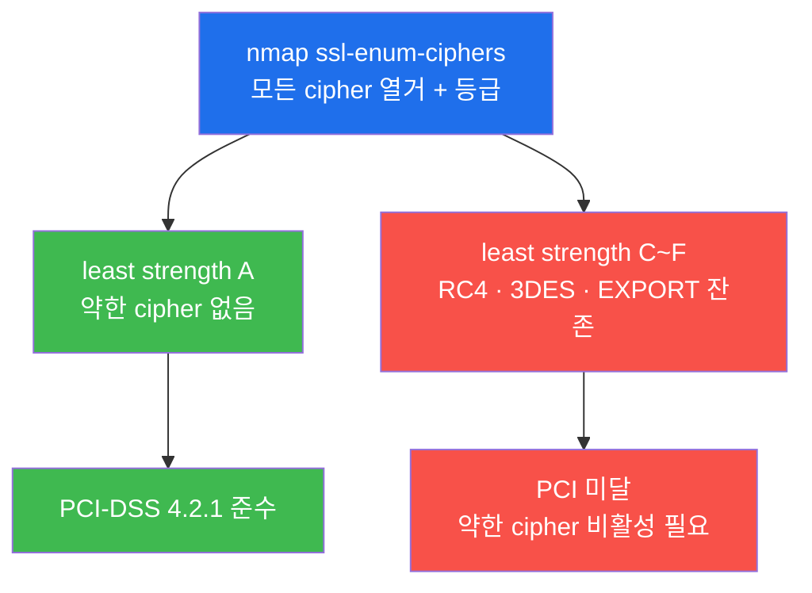
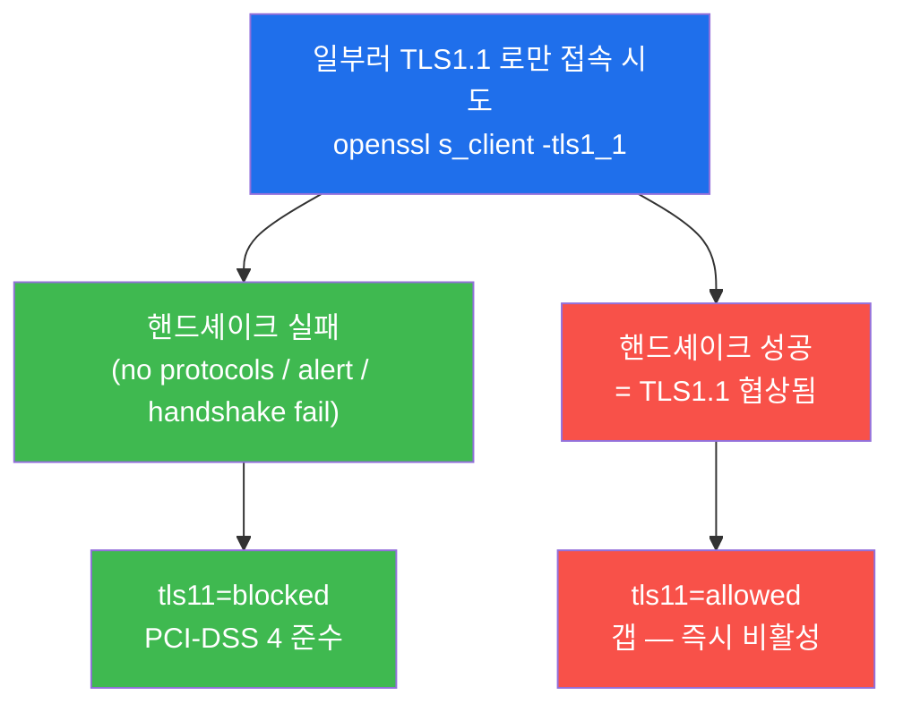
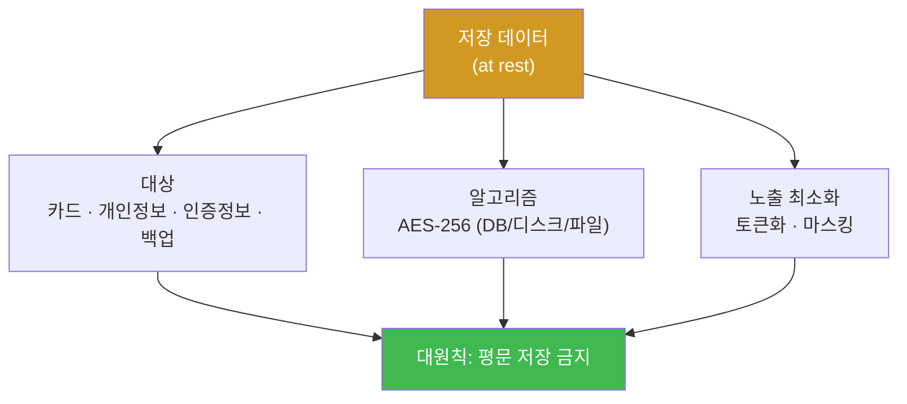
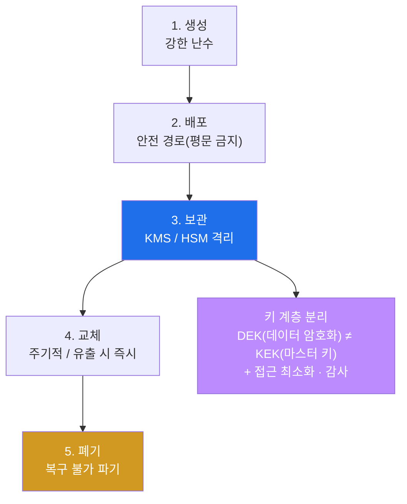
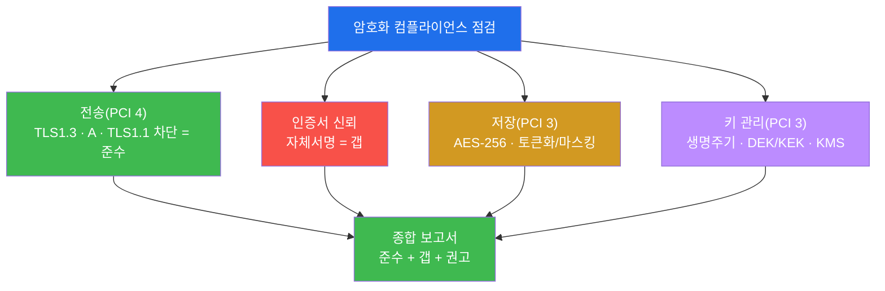
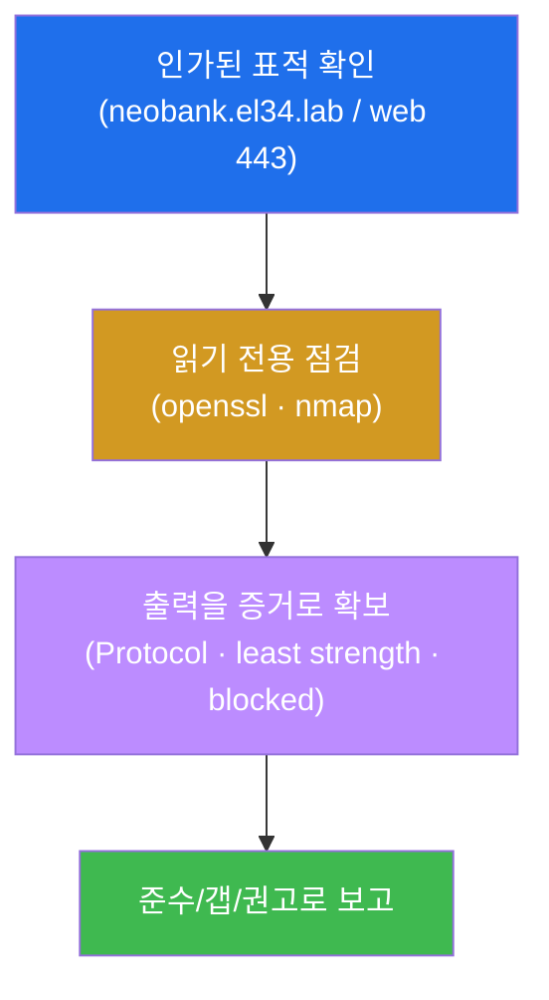
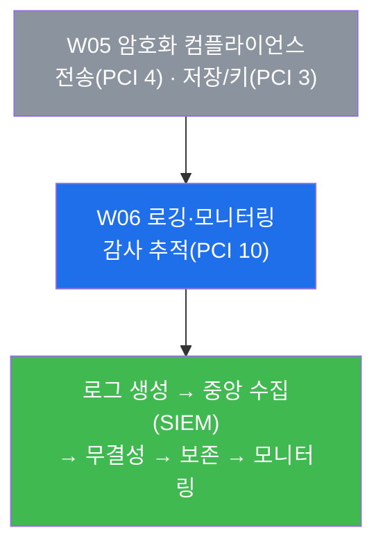

# 컴플라이언스 W05 — 암호화 컴플라이언스: 데이터를 전송·저장 양쪽에서 지키기 (PCI-DSS 4·3)

> **본 주차의 한 줄 요약**
>
> 지난 주(W04)에 학생은 "누가 무엇에 접근하는가"를 통제하는 접근통제 컴플라이언스를 점검했다.
> 그러나 접근통제가 완벽해도, **데이터 자체가 평문이면** 회선을 엿듣거나(전송) DB 파일을 통째로
> 빼가면(저장) 그대로 노출된다. 본 주차는 **데이터를 두 곳 — 이동 중(in transit)과 저장 중(at
> rest) — 에서 암호화**하는 통제를 **감사자(auditor)의 눈**으로 점검한다. 학생은 el34 의 금융
> vhost(`neobank.el34.lab`, web 443)에 직접 `openssl`·`nmap` 을 던져 **TLS 버전·cipher 강도·폐기
> 프로토콜 차단**을 증적으로 확인하고(전송, PCI-DSS 4), **저장 암호화(AES-256)와 키 관리(KMS·DEK·
> KEK)** 의 요건을 정리한 뒤, 발견한 **갭(자체서명 인증서)** 까지 묶어 암호화 컴플라이언스 보고서를
> 작성한다.
>
> **감사자 한 줄 결론**: 암호화 컴플라이언스는 "HTTPS 자물쇠가 떴다"가 아니라, **어떤 프로토콜·
> 어떤 cipher 로·어떤 키 관리 아래** 암호화되는지를 **증거로 확인**하고, 부족한 부분을 **갭으로
> 문서화**하는 일이다. 강한 알고리즘이라도 키가 데이터 옆에 평문으로 있으면 암호화는 무의미하다.

---

## 학습 목표

본 주차 종료 시 학생은 다음 6가지를 **본인 손으로** 할 수 있어야 한다.

1. 데이터 보호를 **전송(in transit)** 과 **저장(at rest)** 의 두 축으로 나누어 설명하고, 각 축이
   PCI-DSS 의 어느 요구사항(전송=요구사항 4, 저장=요구사항 3)에 대응하는지 말한다.
2. el34 의 web 443(`neobank.el34.lab`)에 `openssl s_client` 를 던져 **협상된 TLS 버전과 cipher**
   를 읽고, 그것이 PCI-DSS 4.2.1(강한 암호) 을 충족하는지 판정한다.
3. `nmap --script ssl-enum-ciphers` 의 **least strength 등급**을 읽어, 약한 cipher(RC4·3DES·
   EXPORT)의 잔존 여부를 한 줄로 판정한다(A=준수, C~F=미달).
4. `openssl s_client -tls1_1` 로 **폐기 프로토콜(TLS1.0/1.1)이 거부되는지** 확인하고, 협상 실패가
   곧 PCI-DSS 준수임을 설명한다.
5. **저장 암호화(AES-256)** 의 대상(카드·개인정보·백업)과 **키 관리 생명주기**(생성→배포→보관→
   교체→폐기) 및 **DEK/KEK 분리** 원칙을 감사 관점에서 정리한다.
6. el34 의 전송 암호화가 **알고리즘·프로토콜은 강하나 자체서명 인증서라는 신뢰 체인 갭**을 가짐을
   식별하고, 전송·저장·키 관리 3축을 묶은 암호화 컴플라이언스 보고서(준수/갭/권고)를 작성한다.

> **감사자의 시선** — 본 주차는 암호를 *깨는* 주가 아니라, 암호화가 **규정대로 적용되어 있는지**를
> 점검하는 주다. 채점은 "암호화가 되어 있다"는 선언이 아니라, **각 통제(TLS 버전·cipher·폐기
> 프로토콜·저장·키)를 표준 조항에 매핑해 증거와 함께 판정하고, 갭을 도출했는가**를 본다.

---

## 강의 시간 배분 (총 3시간 40분)

| 시간        | 내용                                                                       | 유형      |
|-------------|----------------------------------------------------------------------------|-----------|
| 0:00–0:20   | 이론 — 왜 전송·저장을 모두 암호화해야 하나 (단일 보호의 함정 + 실 사례)     | 강의      |
| 0:20–0:55   | 이론 — 전송 암호화: TLS 버전·cipher·폐기 프로토콜 (PCI-DSS 4)               | 강의      |
| 0:55–1:05   | 휴식                                                                        | —         |
| 1:05–1:35   | 이론 — 저장 암호화 + 키 관리(KMS/DEK/KEK) (PCI-DSS 3) + el34 진입 경로      | 강의/토론 |
| 1:35–2:00   | 실습 — 점검(도달성) + 전송 TLS 버전 점검 (lab 1–2)                          | 실습      |
| 2:00–2:30   | 실습 — cipher 강도(nmap) + 폐기 프로토콜 차단(openssl) (lab 3–4)            | 실습      |
| 2:30–2:40   | 휴식                                                                        | —         |
| 2:40–3:10   | 실습 — 저장 암호화 요건 + 키 관리 생명주기 정리 (lab 5–6)                   | 실습      |
| 3:10–3:30   | 실습 — 암호화 방어 종합 + 갭 포함 컴플라이언스 보고서 (lab 7–8)             | 실습      |
| 3:30–3:40   | 정리 + 채점 기준 안내 + 다음 주차(W06 — 로깅·모니터링 컴플라이언스) 예고    | 정리      |

---

## 0. 용어 해설 (암호화 컴플라이언스 핵심어)

본 주차에서 처음 나오거나 특히 중요한 용어를 먼저 정리한다. 본문에서 다시 등장할 때 막히면 이 표로
돌아오면 흐름이 끊기지 않는다.

| 용어 | 영문 | 뜻 | 비유 |
|------|------|----|------|
| **전송 암호화** | encryption in transit | 회선을 지나가는(이동 중) 데이터를 암호화 | 내용물을 봉인한 채 배송하는 택배 |
| **저장 암호화** | encryption at rest | 디스크·DB 에 저장된(멈춰 있는) 데이터를 암호화 | 금고에 넣어 보관하는 서류 |
| **TLS** | Transport Layer Security | 인터넷 전송 구간을 암호화하는 표준 프로토콜(HTTPS 의 S) | 봉인된 보안 봉투 |
| **TLS 버전** | TLS version | TLS 의 세대(1.0/1.1/1.2/1.3). 높을수록 안전 | 자물쇠의 세대(구형 vs 신형) |
| **cipher (suite)** | cipher suite | TLS 가 실제로 쓰는 암호 알고리즘 묶음(키교환+암호+해시) | 자물쇠의 내부 기계 부품 |
| **AEAD** | Authenticated Encryption with Associated Data | 암호화와 무결성(위변조 탐지)을 함께 하는 현대 cipher 방식(GCM 등) | 봉인 + 위조 방지 홀로그램 동시 |
| **폐기 프로토콜** | deprecated protocol | 보안 결함으로 더 이상 쓰면 안 되는 구버전(TLS1.0/1.1) | 마스터키가 유출된 구형 자물쇠 |
| **least strength** | — | nmap 이 매기는, 서버가 허용하는 cipher 중 **가장 약한 것**의 등급(A~F) | 사슬 중 가장 약한 고리 |
| **인증서** | certificate | 서버의 신원과 공개키를 담아 CA 가 서명한 전자 문서 | 서버의 신분증 |
| **CA** | Certificate Authority | 인증서를 발급·서명하는 신뢰받는 제3자 | 신분증을 발급하는 공공기관 |
| **자체서명 인증서** | self-signed certificate | CA 가 아니라 서버 자신이 발급·서명한 인증서(신뢰 체인 없음) | 자기가 만든 신분증 |
| **AES-256** | Advanced Encryption Standard 256-bit | 저장 암호화의 사실상 표준 대칭키 알고리즘(키 길이 256비트) | 256자리 비밀번호 금고 |
| **KMS** | Key Management Service | 키의 생성·보관·교체·폐기를 전담하는 시스템 | 열쇠를 따로 보관하는 금고 관리실 |
| **HSM** | Hardware Security Module | 키를 하드웨어에 격리·보호하는 전용 장비 | 절대 안 열리는 물리 금고 |
| **DEK** | Data Encryption Key | 실제 데이터를 직접 암호화하는 키 | 서류함을 여는 열쇠 |
| **KEK** | Key Encryption Key (master key) | DEK 를 다시 암호화해 보호하는 상위(마스터) 키 | 서류함 열쇠를 넣어둔 금고의 열쇠 |
| **토큰화** | tokenization | 카드번호 등을 의미 없는 대체값(토큰)으로 바꿔 저장 | 진짜 번호 대신 보관증 번호만 남김 |
| **마스킹** | masking | 표시할 때 일부만 보이게 가림(예: `**** **** **** 1234`) | 신분증 번호 일부를 검게 가림 |
| **PCI-DSS** | Payment Card Industry Data Security Standard | 카드 데이터를 다루는 모든 곳에 강제되는 보안 표준 | 카드 취급점의 안전 의무 규정 |

> **헷갈리기 쉬운 한 쌍 — 전송 암호화 vs 저장 암호화.** 둘은 보호하는 **순간**이 다르다. **전송
> 암호화(in transit)** 는 데이터가 A 에서 B 로 **이동하는 동안** 회선을 엿듣지 못하게 한다(TLS/
> HTTPS). **저장 암호화(at rest)** 는 데이터가 디스크·DB 에 **멈춰 있는 동안** 파일을 빼가도 읽지
> 못하게 한다(AES-256). 흔한 오해는 "HTTPS 를 쓰니 암호화 끝"인데, HTTPS 는 **이동 중**만 지킨다 —
> DB 가 평문이면 내부자나 DB 백업 유출 한 번에 그대로 노출된다. **두 축을 모두** 봐야 암호화
> 컴플라이언스가 성립한다.

---

## 1. 왜 데이터를 전송·저장 양쪽에서 암호화하는가

### 1.1 한 줄 답: 데이터는 두 상태로 존재하고, 한쪽만 막으면 다른 쪽으로 샌다

같은 한 건의 카드 정보도 그 생애 동안 두 가지 상태를 오간다 — 네트워크를 타고 **이동 중(in
transit)** 일 때와, DB·디스크·백업에 **저장 중(at rest)** 일 때다. 공격자는 둘 중 **더 약한 쪽**을
노린다. 회선을 엿듣는 중간자 공격(MITM)은 이동 중을, DB 탈취·백업 유출·내부자는 저장 중을 노린다.
그래서 전송만 암호화하고 저장을 평문으로 두면 DB 유출 한 번에 무너지고, 저장만 암호화하고 전송을
평문(HTTP)으로 두면 로그인 패킷 한 번에 자격이 새어 나간다. **두 상태를 모두 암호화**해야 비로소
데이터가 끝에서 끝까지 보호된다.



이 그림이 본 주차 전체의 지도다. 왼쪽 가지(전송)는 §2~§4 에서 `openssl`·`nmap` 으로 실제 점검하고,
오른쪽 가지(저장·키)는 §5~§6 에서 요건으로 정리한다. 두 가지가 만나는 곳이 §7 의 종합 보고서다.

### 1.2 왜 중요한가 — 한쪽만 막아 무너진 실 사례

암호화 컴플라이언스가 "양쪽"을 요구하는 이유는 한쪽만 막아 일어난 실제 사고들에서 나왔다.

| 사고 | 무엇이 약했나 | 어느 축이 실패했나 |
|------|-------------|------------------|
| 회선 도청형 카드 유출(POS·공용 와이파이) | 결제 트래픽이 평문 또는 약한 cipher | **전송**(TLS 미적용/약한 cipher) |
| DB 백업 탈취형 대량 유출 | DB·백업이 평문 저장 | **저장**(at rest 미암호화) |
| 키를 데이터 옆에 둔 유출 | 암호화는 했으나 키도 같이 유출 | **키 관리**(DEK/KEK 미분리, 키 평문 보관) |

세 번째 사례가 특히 중요하다 — **암호화 알고리즘이 아무리 강해도 키가 데이터 옆에 평문으로 있으면
공격자는 데이터와 키를 한 번에 가져가 즉시 복호화한다.** 그래서 PCI-DSS 는 알고리즘뿐 아니라 **키
관리**까지 통제로 명시한다(§6).

### 1.3 PCI-DSS 가 암호화를 나누는 방식 — 요구사항 4(전송)와 3(저장)

> **용어 — PCI-DSS(Payment Card Industry Data Security Standard).** 신용카드 데이터를 저장·처리·
> 전송하는 **모든 조직**에 카드 브랜드(Visa·Mastercard 등)가 강제하는 보안 표준이다. 12개 요구사항
> 으로 구성되며, 그중 **요구사항 3 = 저장된 카드 데이터 보호(저장 암호화)**, **요구사항 4 = 공개망
> 전송 시 카드 데이터 암호화(전송 암호화)** 가 본 주차의 두 기둥이다.

PCI-DSS 는 암호화를 정확히 두 조항으로 나눠 둔다. 본 주차의 실습·보고서는 모두 이 두 조항에 매핑된다.

| 데이터 상태 | PCI-DSS 요구사항 | 핵심 통제 | 본 주차 실습 |
|------------|-----------------|----------|-------------|
| 이동 중(in transit) | **요구사항 4** (특히 4.2.1 강한 암호) | TLS1.2+ · 강한 cipher(AEAD) · 유효 인증서 · 폐기 프로토콜 차단 | lab 2·3·4 |
| 저장 중(at rest) | **요구사항 3** | AES-256 등 강한 알고리즘 · 토큰화/마스킹 · 키 관리 | lab 5·6 |

> **참고 — 다른 프레임워크와의 관계.** 한국 **ISMS-P** 의 통제 2.7(암호화 적용)도 같은 두 축(전송·
> 저장)을 요구하고, **ISO 27001** 의 A.8.24(암호 사용)도 마찬가지다. 본 주차는 가장 구체적인
> PCI-DSS 4·3 을 기준으로 점검하되, 그 결론은 ISMS-P 2.7 보고서에도 그대로 옮길 수 있다.

### 1.4 한계 — 이 주차가 다루지 않는 것

본 주차는 **이미 적용된 암호화가 규정에 맞는지**를 점검한다. 따라서 암호 알고리즘 자체를 수학적으로
깨는 암호 해독(cryptanalysis), 키 길이의 안전성 계산, TLS 핸드셰이크의 패킷 단위 분석 같은 깊은
암호공학은 범위 밖이다. 또한 **로그·모니터링**(암호화 설정 변경의 감사 추적)은 다음 주차 W06 의
주제다. 본 주차의 점검은 어디까지나 **인가된 표적(el34 의 정해진 vhost)** 에 대해서만 수행한다(§8).

---

## 2. 전송 암호화 점검 — TLS 버전 (PCI-DSS 4)

### 2.1 한 줄 정의와 왜 중요한가

**전송 암호화**는 데이터가 네트워크 회선을 지나는 동안 제3자가 엿보거나 변조하지 못하게 하는 통제
이며, 웹에서는 **TLS**(HTTPS 의 'S')가 이를 담당한다. 감사자가 가장 먼저 보는 것은 **어떤 TLS
버전으로 협상되는가**다. TLS 는 세대가 있고, 구버전일수록 알려진 결함이 많기 때문이다.

> **용어 — TLS(Transport Layer Security)와 그 버전.** TLS 는 전송 구간을 암호화하는 인터넷 표준
> 프로토콜이다. 세대(버전)는 다음과 같다.
> - **TLS 1.0 / 1.1** — 구버전. BEAST·POODLE 등 알려진 공격에 취약 → **폐기(deprecated)**, 사용 금지.
> - **TLS 1.2** — 현재 허용되는 최소선. 강한 cipher(AEAD) 선택 시 안전.
> - **TLS 1.3** — 최신. 약한 알고리즘을 프로토콜 차원에서 제거, 핸드셰이크도 단순·빠름. 권장.
>
> PCI-DSS 4.2.1 은 **"강한 암호(strong cryptography)"** 를 요구하며, 실무에서 이는 **TLS 1.2 이상
> + 강한 cipher** 를 뜻한다.

### 2.2 el34 에서 어떻게 — `openssl s_client` 로 협상 결과 읽기

el34 의 금융 vhost(`neobank.el34.lab`)에 TLS 핸드셰이크를 한 번 맺고, 협상된 버전과 cipher 를 읽는다.

> **용어 — `openssl s_client`.** OpenSSL 이 제공하는, **TLS 서버에 직접 접속해 핸드셰이크 결과를
> 보여주는** 진단 명령이다. `-connect <IP:포트>` 로 대상을, `-servername <도메인>` 으로 SNI(어느
> vhost 인지 알리는 확장)를 지정한다. 출력의 `Protocol:` 줄이 협상된 TLS 버전, `Cipher:` 줄이
> 선택된 cipher 다. 앞의 `echo |` 는 핸드셰이크 직후 입력을 닫아(빈 입력 전송) 명령이 멈추지 않고
> 결과만 출력하게 하는 관용구다.

```bash
docker exec el34-attacker sh -c "echo | openssl s_client -connect 10.20.30.1:443 -servername neobank.el34.lab 2>/dev/null | grep -iE 'Protocol|Cipher' | head -3"
```

**el34 의 실제 결과 해석.** el34 의 web 은 다음처럼 협상된다.

- `Protocol  : TLSv1.3`
- `Cipher    : TLS_AES_256_GCM_SHA384`

`TLSv1.3` 은 최신 버전이고, `AES_256_GCM` 의 **GCM** 은 AEAD(암호화 + 무결성 동시) 방식이다.
즉 **버전·cipher 모두 PCI-DSS 4.2.1 의 강한 암호 요건을 충족**한다. 만약 여기서 `TLSv1.0`/`TLSv1.1`
이 보이거나 cipher 에 `RC4`·`3DES` 가 보이면 즉시 갭으로 기록해야 한다.



### 2.3 한계 — 버전·cipher 가 강해도 "신뢰"는 별개

`openssl s_client` 로 본 버전·cipher 는 **암호화의 세기**를 말해 줄 뿐, **그 서버가 진짜 그 서버인지
(신뢰)** 는 별개다. el34 의 인증서는 CA 가 아니라 서버 자신이 서명한 **자체서명 인증서**라, 알고리즘은
강해도 **신뢰 체인 갭**이 남는다(§4.3 에서 자세히, §7 보고서의 핵심 갭). 그래서 감사 보고서는 "TLS1.3
이니 준수"로 끝나지 않고 "강하나 인증서 신뢰가 갭"까지 적는다.

---

## 3. Cipher 강도 점검 — nmap ssl-enum (PCI-DSS 4.2.1)

### 3.1 한 줄 정의와 왜 중요한가

`openssl s_client` 는 **이번 한 번의 협상**에서 고른 cipher 하나만 보여준다. 하지만 서버는 보통 여러
cipher 를 **허용 목록**으로 갖고 있고, 클라이언트가 약한 cipher 를 고르자고 하면 받아줄 수도 있다.
감사자는 **서버가 허용하는 모든 cipher 중 가장 약한 것**을 봐야 한다 — 사슬은 가장 약한 고리에서
끊어지기 때문이다. 이 "가장 약한 고리"를 한눈에 등급으로 보여주는 것이 nmap 의 **least strength** 다.

> **용어 — nmap 과 `ssl-enum-ciphers` 스크립트.** **nmap** 은 표준 네트워크 스캐너다. 그 NSE(nmap
> Scripting Engine) 스크립트 중 **`ssl-enum-ciphers`** 는 대상이 지원하는 **모든 TLS 버전과 cipher
> 를 열거**하고, 각 cipher 에 보안 등급(A~F)을 매긴 뒤, 맨 아래에 **`least strength: <등급>`** —
> 즉 가장 약한 cipher 의 등급 — 을 출력한다. **A** 면 약한 cipher 가 하나도 없다는 뜻이고, **C~F**
> 면 RC4·3DES·EXPORT 같은 취약 cipher 가 섞여 있다는 뜻이다.

### 3.2 el34 에서 어떻게 — least strength 한 줄로 판정

```bash
docker exec el34-attacker sh -c "timeout 55 nmap --script ssl-enum-ciphers -p 443 10.20.30.1 2>/dev/null | grep -iE 'TLSv|least strength'"
```

> **명령 풀이.** `--script ssl-enum-ciphers` 가 cipher 열거 스크립트를, `-p 443` 이 대상 포트를
> 지정한다. 앞의 `timeout 55` 는 스캔이 길어질 때 55초에서 강제 종료시키는 안전장치다(채점 시간 내
> 끝내기 위함). `grep` 으로 TLS 버전 줄과 `least strength` 줄만 추려 본다.

**el34 의 실제 결과 해석.** 출력 맨 아래의 `least strength: A` 가 핵심이다.

- `least strength: A` → 서버가 허용하는 cipher 중 **가장 약한 것조차 A 등급** = 약한 cipher(RC4·
  3DES·EXPORT)가 **하나도 없다** = **PCI-DSS 준수**.
- 만약 `C`~`F` 였다면 → 취약 cipher 가 잔존 = **PCI 미달**, 해당 cipher 를 서버 설정에서 즉시 비활성
  해야 한다.



### 3.3 한계 — 등급은 알고리즘만, 운영은 더 본다

least strength 는 **cipher 알고리즘의 강도**만 본다. 실제 운영 점검은 여기에 더해 인증서 만료일,
키 길이(RSA 2048+ 등), HSTS 헤더(브라우저에 HTTPS 강제) 같은 항목까지 확인한다. 본 주차는 핵심인
버전·cipher·폐기 프로토콜·신뢰(자체서명)에 집중하고, 헤더 등 세부는 web-vuln 트랙(W10·W13)에서 더
깊이 다룬다.

---

## 4. 폐기 프로토콜 차단 점검 (PCI-DSS 4)

### 4.1 한 줄 정의와 왜 중요한가

**폐기 프로토콜(deprecated protocol)** 은 보안 결함이 발견되어 더는 쓰면 안 되는 구버전 TLS
(1.0·1.1)다. 서버가 최신 TLS 1.3 을 지원하더라도, **구버전을 동시에 열어두면(하위 호환)** 공격자가
일부러 약한 TLS 1.0/1.1 로 협상을 끌어내려(다운그레이드) 알려진 공격을 시도할 수 있다. 그래서 PCI-DSS
는 강한 버전을 켜는 것뿐 아니라 **약한 버전을 확실히 닫았는지**까지 요구한다.

> **용어 — 다운그레이드(downgrade) 공격.** 클라이언트와 서버가 협상할 때, 중간자가 끼어들어 "이
> 서버는 약한 TLS1.0 만 된다"고 속여 **일부러 낮은 버전으로 협상**하게 만드는 공격이다. 서버가 구
> 버전을 닫아 두면(협상 거부) 이 수법이 통하지 않는다.

### 4.2 el34 에서 어떻게 — 일부러 TLS1.1 을 요청해 거부를 확인

점검 방법은 직관적이다. **일부러 폐기 프로토콜(TLS1.1)로만 접속을 시도**해서, 서버가 **거부(handshake
실패)** 하는지 본다. 거부되면 준수, 협상되면 갭이다.

> **용어 — `openssl s_client -tls1_1`.** `-tls1_1` 옵션은 핸드셰이크를 **TLS 1.1 로만** 시도하도록
> 강제한다. 서버가 TLS1.1 을 닫아 두었다면 핸드셰이크가 실패하며, 출력에 `no protocols available`·
> `alert`·`handshake failure`·`no peer certificate available` 같은 거부 신호가 나타난다. 아래
> 명령은 이 신호가 보이면 `tls11=blocked`(차단=준수), 안 보이면 `tls11=allowed`(허용=갭)로 한 줄
> 판정한다.

```bash
docker exec el34-attacker sh -c 'if echo | openssl s_client -connect 10.20.30.1:443 -tls1_1 2>&1 | grep -qiE "no protocols|alert|handshake fail|no peer cert"; then echo "tls11=blocked"; else echo "tls11=allowed"; fi'
```

**결과 해석.** `tls11=blocked` 이 나오면 **TLS 1.1 협상 거부 = PCI-DSS 준수**다. el34 의 web 은 구
버전을 닫아 두므로 `blocked` 가 기대값이다. 반대로 `tls11=allowed` 가 나오면 **폐기 프로토콜이 열려
있다는 갭** — 서버 설정에서 즉시 TLS1.0/1.1 을 비활성해야 한다.



### 4.3 el34 전송 점검의 결론과 자체서명 갭

§2~§4 를 종합하면 el34 의 전송 암호화는 **버전(TLS1.3)·cipher(AEAD A 등급)·폐기 프로토콜(차단)**
세 항목 모두 PCI-DSS 4 를 충족한다. 그러나 한 가지 갭이 남는다 — **자체서명 인증서**다.

> **용어 — 자체서명 인증서(self-signed certificate)와 신뢰 체인.** 인증서는 원래 신뢰받는 제3자
> **CA(Certificate Authority)** 가 발급·서명해, "이 서버는 진짜 이 도메인이 맞다"를 브라우저가 CA
> 까지 거슬러 올라가며 검증한다(신뢰 체인). **자체서명 인증서**는 CA 가 아니라 **서버가 스스로
> 서명**한 것이라, 거슬러 올라갈 CA 가 없다 — 즉 **신원 보증이 없다**. 암호화 자체는 정상 동작하지만,
> 중간자가 자기 자체서명 인증서로 위장해도 구별이 어려워 **MITM 위험**이 남는다. el34 의 web 443 은
> 학습 환경이라 자체서명 인증서를 쓰며, 운영 환경이라면 이는 **유효 CA 인증서로 교체해야 할 갭**이다
> (web-vuln W10 에서 subject 와 issuer 를 비교해 자체서명을 식별하는 법을 다룬다).

핵심 메시지 — **암호화의 세기(버전·cipher)와 신원의 신뢰(인증서)는 별개 통제**다. el34 는 전자는
강하나 후자가 갭이므로, 감사 보고서는 "전송 알고리즘 준수 + 인증서 신뢰 갭"으로 나누어 기록한다.

---

## 5. 저장 암호화 점검 — at rest (PCI-DSS 3)

### 5.1 한 줄 정의와 왜 중요한가

**저장 암호화(at rest)** 는 디스크·DB·파일·백업에 **멈춰 있는** 데이터를 암호화해, 매체나 백업을
통째로 빼가도 읽지 못하게 하는 통제다. 전송 암호화가 회선을 지키는 동안, 저장 암호화는 **저장 매체와
백업**을 지킨다. 전송만 암호화하고 저장을 평문으로 두면, DB 백업 파일 유출·디스크 도난·내부자 접근
한 번에 데이터가 그대로 노출된다.

### 5.2 무엇을·어떻게 — 대상·알고리즘·원칙

저장 암호화 점검은 세 가지를 본다.

- **대상.** 카드정보(PCI-DSS 3 의 직접 대상)·개인정보·인증정보(비밀번호 해시)·그리고 이들을 담은
  **백업**까지 모두 암호화 대상이다. 운영 DB 만 암호화하고 백업을 평문으로 두는 실수가 흔하다.
- **알고리즘.** **AES-256**(키 256비트의 대칭키 표준)이 사실상의 기준이며, DB 레벨(투명 암호화 TDE)·
  디스크 레벨(LUKS 등)·파일 레벨 중 하나 이상으로 적용한다.
- **원칙.** **평문 저장 금지**가 대원칙이고, 카드번호처럼 굳이 원본을 보관할 필요가 없으면 **토큰화**
  (의미 없는 대체값으로 치환)하거나 화면 표시 시 **마스킹**(`**** **** **** 1234`)한다.

> **용어 — AES-256 / 토큰화 / 마스킹.** **AES-256** 은 미국 표준(NIST) 대칭키 암호로, 키 길이 256
> 비트는 현재 기술로 사실상 깰 수 없다. **토큰화**는 카드번호 자체를 DB 에서 없애고 의미 없는 토큰
> 으로 바꿔, 유출돼도 원본이 없는 상태로 만든다. **마스킹**은 저장은 하되 **표시**할 때 일부만
> 보여주는(끝 4자리 등) 노출 최소화 기법이다.



### 5.3 한계 — 알고리즘만으로는 부족, 키가 핵심

저장 암호화를 AES-256 으로 했다 해도, **그 데이터를 푸는 키가 데이터 옆에 평문으로 있으면 암호화는
무의미**하다. DB 를 빼간 공격자가 키도 같이 가져가 즉시 복호화하기 때문이다. 그래서 저장 암호화의
실효성은 다음 절의 **키 관리**에 달려 있다 — 저장 암호화와 키 관리는 한 쌍이다.

---

## 6. 키 관리 점검 — 생명주기와 DEK/KEK 분리

### 6.1 한 줄 정의와 왜 중요한가

**키 관리(key management)** 는 암호화 키의 **생성→배포→보관→교체→폐기**라는 생애 전 주기를 안전하게
통제하는 것이다. §1.2·§5.3 에서 봤듯 암호화의 강도는 알고리즘이 아니라 **키를 얼마나 잘 보호하느냐**
에서 갈린다. 키가 새면 암호화가 통째로 무력화되므로, 감사자는 알고리즘만큼이나 키 관리를 비중 있게
본다.

### 6.2 무엇을 — 키 생명주기와 키 계층(DEK/KEK)

**키 생명주기.** 키는 한 번 만들고 끝이 아니라 다음 단계를 거쳐 관리된다.

1. **생성(generate)** — 충분히 강한 난수로 키를 만든다.
2. **배포(distribute)** — 키를 안전한 경로로만 전달한다(평문 전송 금지).
3. **보관(store)** — **KMS** 나 **HSM** 에 격리 보관한다(데이터와 분리).
4. **교체(rotate)** — 주기적으로(또는 유출 의심 시 즉시) 새 키로 바꾼다.
5. **폐기(destroy)** — 수명이 끝난 키는 복구 불가능하게 파기한다.

**키 계층 — DEK 와 KEK 분리.** 키를 한 겹으로 두지 않고 두 겹으로 나눈다.

> **용어 — DEK / KEK.** **DEK(Data Encryption Key)** 는 실제 데이터를 직접 암호화하는 키다. **KEK
> (Key Encryption Key, 마스터 키)** 는 그 DEK 를 다시 암호화해 보호하는 상위 키다. 데이터 옆에는
> "암호화된 DEK"만 두고, 그것을 푸는 **KEK 는 KMS/HSM 에 따로 격리**한다. 이렇게 하면 DB 를 통째로
> 빼가도 KEK 가 없어 DEK 를 못 풀고, 따라서 데이터도 못 푼다. 비유하면 **서류함 열쇠(DEK)는 서랍에
> 두되, 그 열쇠를 넣어둔 금고의 열쇠(KEK)는 다른 방의 금고에 보관**하는 것이다.



### 6.3 한계 — 키 접근도 통제·감사 대상

KMS/HSM 에 키를 넣고 DEK/KEK 를 분리해도, **누가 그 키에 접근하는지**를 통제·기록하지 않으면 내부자
한 명이 키를 꺼낼 수 있다. 그래서 키 관리에는 **접근 최소화(꼭 필요한 주체만)와 키 접근 감사 로그**
가 함께 따라야 한다 — 이 "접근 통제"는 W04 의 주제와, 이 "접근 감사"는 W06 의 주제와 이어진다.

---

## 7. 암호화 컴플라이언스 종합 — 3축을 한 보고서로

### 7.1 전송·저장·키를 묶는 판단 프레임

본 주차의 모든 점검은 **전송·저장·키**의 세 축으로 수렴한다. 발견을 만났을 때 **어느 축이고, 어느
PCI-DSS 조항이며, 준수인가 갭인가**를 즉시 자리매김하는 것이 핵심 역량이다. 다음 표가 그 정답지다.

| 축 | 점검 항목 | 도구·근거 | PCI-DSS 조항 | el34 판정 |
|----|----------|----------|-------------|----------|
| 전송 | TLS 버전 | `openssl s_client` Protocol | 4.2.1 | TLSv1.3 → **준수** |
| 전송 | cipher 강도 | `nmap ssl-enum` least strength | 4.2.1 | A → **준수** |
| 전송 | 폐기 프로토콜 차단 | `openssl -tls1_1` 거부 | 4 | blocked → **준수** |
| 전송 | 인증서 신뢰 | subject/issuer (자체서명 여부) | 4 | 자체서명 → **갭** |
| 저장 | at rest 암호화 | AES-256 · 토큰화/마스킹 | 3 | 요건 정리 |
| 키 | 키 관리 | 생명주기 · DEK/KEK 분리 · KMS | 3 | 요건 정리 |

이 표를 읽는 법은 두 방향이다. **세로(축)** 로 읽으면 "데이터를 전송·저장·키 세 곳에서 빠짐없이
봤는가"를 확인하고, **가로(판정)** 로 읽으면 "각 항목이 PCI 조항을 충족하는가, 갭은 무엇인가"를
보고서에 옮긴다. el34 의 결론은 **알고리즘·프로토콜은 강하나 인증서 신뢰가 갭**이다.



### 7.2 보고서의 구조 — 준수 / 갭 / 권고

암호화 컴플라이언스 보고서는 다음 세 부분으로 쓴다. 이것이 W04 의 접근통제 보고서, W06 의 로깅
보고서와 같은 일관된 감사 보고 구조다.

1. **준수 사항** — 증거와 함께. (예: 전송 TLSv1.3 / least strength A / TLS1.1 차단 → PCI-DSS 4 준수)
2. **갭(미흡 사항)** — 무엇이·왜 부족한가. (예: 자체서명 인증서 → 신뢰 체인 결함, MITM 위험)
3. **권고** — 갭을 어떻게 메우나. (예: 유효 CA 인증서로 교체, 저장 AES-256·토큰화, 키 관리 KMS·
   DEK/KEK 분리)

핵심은 **"준수"로 끝내지 않는 것**이다. el34 처럼 알고리즘이 강해도 인증서 신뢰라는 갭이 있으면, 그
갭과 권고를 명시해야 감사 보고서로서 가치가 있다.

---

## 8. 점검 수칙 — 인가된 점검과 증거 중심

암호화 컴플라이언스 점검도 보안 점검인 만큼 다음 수칙을 지킨다.

- **인가된 표적만 점검한다.** el34 의 정해진 vhost(`neobank.el34.lab` 등)와 컨테이너에 대해서만
  `openssl`·`nmap` 을 던지며, 그 밖의 어떤 시스템에도 같은 명령을 시도하지 않는다.
- **점검만, 변경하지 않는다.** 본 주차의 명령은 **읽기(진단)** 만 한다 — 서버의 TLS 설정·인증서·키를
  바꾸지 않는다. 갭의 수정(설정 변경)은 권고로 보고하고, 실제 변경은 운영자의 승인된 절차로 한다.
- **증거 중심.** "TLS 가 강하다"가 아니라 **`Protocol: TLSv1.3`·`least strength: A`·`tls11=blocked`**
  같은 **명령 출력(증거)** 을 보고서에 붙인다. 결론 선언만으로는 감사 증적이 되지 않는다.
- **신규 설치 없음.** 본 주차 도구(`openssl`·`nmap`)는 el34-attacker 에 이미 있다. 별도 설치 없이
  진행한다.



---

## 9. 실습 안내 — lab 8 미션 (4 축 설명)

본 주차 실습은 8 미션으로, **점검(도달성) → 전송(버전·cipher·폐기) → 저장 → 키 → 방어 → 보고**의
순서로 흐른다. 각 미션을 **4 축**으로 설명한다 — 왜 하는가 / 무엇을 알 수 있는가 / 결과 해석(정상 vs
비정상) / 실전 활용.

> **실습 진행 원칙.** 모든 명령은 el34 호스트(`ssh ccc@192.168.0.151`, 비밀번호 1)에서 `docker exec
> el34-attacker`(점검) 로 실행한다. 점검 대상은 web 443 의 금융 vhost(`neobank.el34.lab`)다. 합격
> 임계값은 0.7 이며, 명령은 모두 읽기 전용이다.

### 미션 1 — 점검: HTTPS 에 도달하나 (10점)

> **왜 하는가?** 모든 점검의 전제는 대상에 요청이 닿는다는 것이다. 암호화 점검 전, 먼저 web 443
> (`neobank.el34.lab`)에 HTTPS 로 도달 가능한지 확인한다 — 연결이 안 되면 이후 모든 음성 결과가
> 무의미하다.
>
> **무엇을 알 수 있는가?** `curl -k` 로 보낸 HTTPS 요청이 fw → web 경로를 거쳐 응답 코드를
> 돌려주는지. 즉 점검 대상이 살아있고 도달 가능한지.
>
> **결과 해석.** 정상: `https=<코드>`(200/302 등)가 출력. 비정상: 응답이 없거나 연결 실패면 Host
> 헤더·게이트웨이(10.20.30.1)·포트(443)부터 재확인한다.
>
> **실전 활용.** 암호화 점검 착수 시 첫 확인. 점검 범위(scope)가 실제 도달 가능한지 검증하는 단계다.

### 미션 2 — 전송: TLS 버전 (PCI-DSS 4) (14점)

> **왜 하는가?** 전송 암호화 점검의 첫 항목은 "어떤 TLS 버전으로 협상되는가"다. 구버전이면 그 자체로
> 갭이므로 가장 먼저 본다.
>
> **무엇을 알 수 있는가?** `openssl s_client` 의 `Protocol:`·`Cipher:` 줄에서 협상된 TLS 버전과
> cipher 를. el34 는 `TLSv1.3` + `TLS_AES_256_GCM_SHA384`(AEAD)로, PCI-DSS 4.2.1 강한 암호를
> 충족한다.
>
> **결과 해석.** 정상(준수): 출력에 `TLSv1.2` 또는 `TLSv1.3`. 비정상(갭): `TLSv1.0`/`TLSv1.1` 이나
> cipher 에 `RC4`·`3DES` 가 보이면 즉시 갭으로 기록. 출력이 비면 `-servername`(SNI)을 점검.
>
> **실전 활용.** 모든 HTTPS 서버 점검의 1 단계. 협상 버전·cipher 는 보고서의 전송 준수/갭 판정의
> 직접 증거가 된다.

### 미션 3 — cipher 강도: nmap least strength (14점)

> **왜 하는가?** `openssl` 은 이번 협상의 cipher 하나만 보여준다. 감사는 서버가 **허용하는 모든
> cipher 중 가장 약한 것**을 봐야 한다 — 사슬은 가장 약한 고리에서 끊어진다.
>
> **무엇을 알 수 있는가?** `nmap --script ssl-enum-ciphers` 의 `least strength` 등급으로 약한
> cipher(RC4·3DES·EXPORT)의 잔존 여부를 한 줄로. el34 는 `A` = 약한 cipher 없음.
>
> **결과 해석.** 정상(준수): `least strength: A`. 비정상(갭): `C`~`F` 면 취약 cipher 잔존 = PCI
> 미달, 해당 cipher 비활성 필요. 스캔이 안 끝나면 `timeout` 값·네트워크를 점검.
>
> **실전 활용.** TLS 설정 감사의 표준 명령. 한 줄 등급으로 cipher 정책의 합격/불합격을 즉시 판정한다.

### 미션 4 — 폐기 프로토콜: TLS1.1 차단 (14점)

> **왜 하는가?** 강한 버전을 켜는 것만으로는 부족하다 — **약한 버전을 닫았는지**까지 봐야 다운그레이드
> 공격을 막는다. PCI-DSS 는 TLS1.0/1.1 사용을 금지한다.
>
> **무엇을 알 수 있는가?** 일부러 `-tls1_1` 로만 접속을 시도해, 서버가 거부(`no protocols`/`alert`/
> `handshake fail`)하는지. el34 는 구버전을 닫아 `tls11=blocked` 가 기대값이다.
>
> **결과 해석.** 정상(준수): `tls11=blocked`(TLS1.1 협상 거부). 비정상(갭): `tls11=allowed` 면 폐기
> 프로토콜이 열린 것 = 즉시 비활성 필요.
>
> **실전 활용.** "약한 것을 닫았는가"를 능동적으로 시험하는 점검 기법. 차단 확인은 전송 보고서의
> 핵심 준수 증거다.

### 미션 5 — 저장 암호화: at rest (PCI-DSS 3) (12점)

> **왜 하는가?** 전송만 막고 저장을 평문으로 두면 DB·백업 유출 한 번에 데이터가 노출된다. 저장 축의
> 요건을 정리해 전송과 짝을 맞춘다.
>
> **무엇을 알 수 있는가?** 저장 암호화의 **대상**(카드·개인정보·인증정보·백업), **알고리즘**(AES-256,
> DB/디스크/파일 레벨), **원칙**(평문 금지, 토큰화/마스킹)을. PCI-DSS 3 의 핵심을 한 화면에.
>
> **결과 해석.** 정상: 출력에 `AES-256` 과 대상·원칙이 정리됨. 핵심 깨달음 — 전송만 암호화하고 저장이
> 평문이면 DB 유출 시 그대로 노출된다. 비정상: 대상/알고리즘/원칙 중 빠진 것이 있으면 보강.
>
> **실전 활용.** 저장 데이터 보호 정책 수립·점검의 기준선. 운영 DB 뿐 아니라 백업까지 대상임을
> 빠뜨리지 않는 것이 실무 포인트다.

### 미션 6 — 키 관리: 생명주기와 DEK/KEK (12점)

> **왜 하는가?** 암호화 알고리즘이 강해도 키가 데이터 옆에 평문이면 무의미하다. 키 관리는 암호화의
> 실효성을 결정하는 통제다.
>
> **무엇을 알 수 있는가?** 키 **생명주기**(생성→배포→보관(KMS/HSM)→교체→폐기)와 **DEK/KEK 분리**,
> **키 접근 최소화·감사**의 원칙을. 데이터와 키를 분리·격리하는 이유를.
>
> **결과 해석.** 정상: 출력에 `키 관리`(생명주기·DEK≠KEK·접근통제)가 정리됨. 핵심 깨달음 — 키가
> 데이터 옆 평문이면 암호화가 무력화된다. 비정상: 생명주기·키 분리·접근통제 중 빠진 축을 보강.
>
> **실전 활용.** KMS/HSM 도입과 키 정책 수립의 기준. DEK/KEK 분리는 클라우드 KMS 의 envelope
> encryption 으로 그대로 이어진다.

### 미션 7 — 방어: 암호화 컴플라이언스 종합 (12점)

> **왜 하는가?** 전송·저장·키의 점검 결과를 흩어진 채 두면 안 된다. 한 화면으로 묶어 **무엇을 갖추면
> PCI-DSS 4·3 을 충족하는가**를 종합한다.
>
> **무엇을 알 수 있는가?** 암호화 방어의 4 기둥 — ① 전송(TLS1.2+/AEAD + 유효 CA 인증서) ② 저장
> (AES-256 + 토큰화/마스킹) ③ 키 관리(KMS/HSM + DEK/KEK 분리 + 주기 교체) ④ 폐기 프로토콜 차단 — 을.
>
> **결과 해석.** 정상: 출력에 전송·저장·키·폐기 프로토콜 차단이 종합됨(자체서명 → 유효 CA 교체 포함).
> 핵심 — 전송과 저장 **양쪽** + 키 보호가 모두 있어야 PCI 4·3 을 충족한다. 비정상: 한 축이라도 빠지면
> 보강.
>
> **실전 활용.** 암호화 정책 수립·이행의 체크리스트. 감사 보고서의 "권고" 절로 직접 옮겨 쓴다.

### 미션 8 — 암호화 컴플라이언스 보고서 (12점)

> **왜 하는가?** 점검의 산출물은 보고서다. 미션 1–7 의 발견을 **준수 / 갭 / 권고** 구조로 묶어야
> 점검이 완성된다.
>
> **무엇을 알 수 있는가?** 전송(TLSv1.3/least strength A/TLS1.1 차단 → PCI 4 준수), 저장·키(AES-256·
> 토큰화·KMS·DEK≠KEK → PCI 3), 갭(자체서명 인증서 → 유효 CA 교체)을 한 보고서로 종합하는 법.
>
> **결과 해석.** 정상: 보고서에 전송 점검 + 저장/키 + 갭(자체서명)이 모두 포함되고 `PCI-DSS` 매핑이
> 들어감. 결론은 "알고리즘·프로토콜은 강하나 인증서 신뢰가 갭". 비정상: 증거 없는 주장만 있으면 명령
> 출력을 증거로 보강.
>
> **실전 활용.** 암호화 컴플라이언스 감사 보고서의 표준 구조(준수 → 갭 → 권고 → 결론). PCI-DSS 심사·
> ISMS-P 인증의 암호화(2.7) 항목 증적으로 제출한다.

---

## 10. 다음 주차 (W06) 예고 — 로깅·모니터링 컴플라이언스

본 주차에서 학생은 데이터를 **전송·저장 양쪽에서 암호화**하는 통제를 점검했다. 그러나 암호화로 데이터를
지켜도, **누가 언제 무엇에 접근했는지 기록이 없으면** 침해가 일어났을 때 추적·대응·법적 대응이 모두
무너진다. 심지어 본 주차에서 본 암호화 설정이나 키에 누가 손댔는지조차 로그가 없으면 알 수 없다.

W06 부터는 그 **로깅·모니터링 컴플라이언스**로 들어간다. PCI-DSS 요구사항 10(모든 접근에 대한 감사
추적)을 기준으로, **로그 생성(누가/언제/무엇을/결과) → 중앙 수집(SIEM) → 무결성 보호 → 보존 →
모니터링·알림**의 전 주기를 el34 의 web 로그와 siem(Wazuh)에서 점검한다. 본 주차가 "데이터를 어떻게
지키는가"였다면, W06 은 "지킨 일을 어떻게 기록·감시하는가"를 연다.


