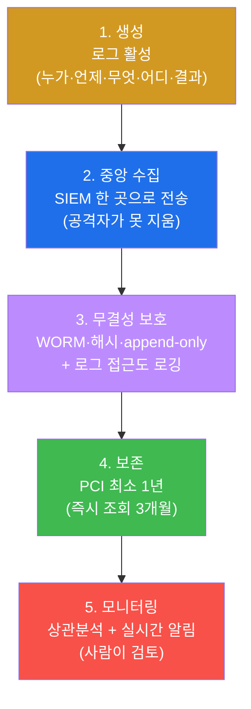
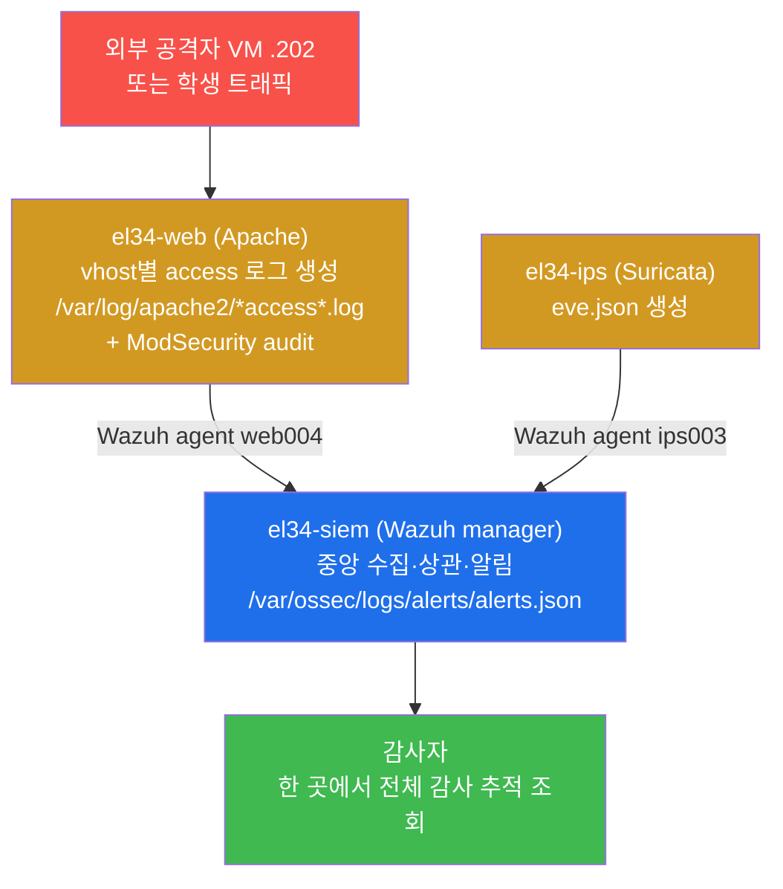
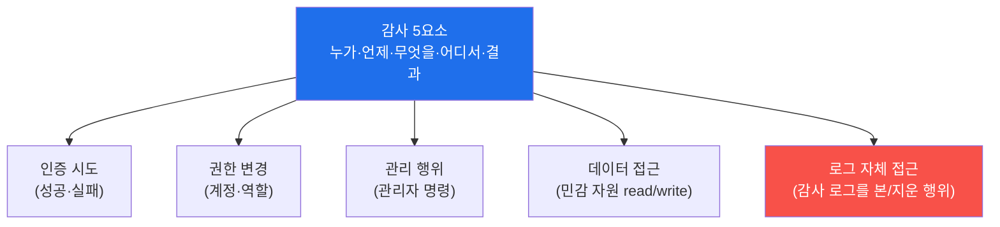
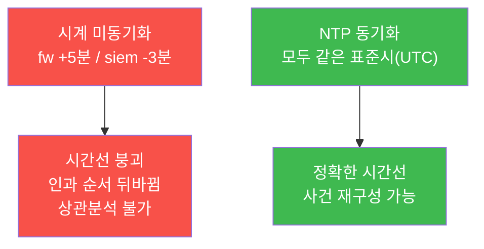
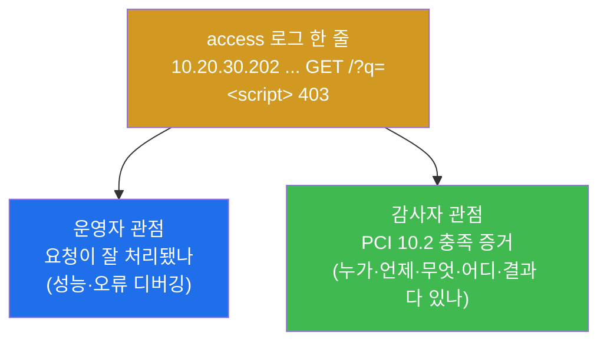
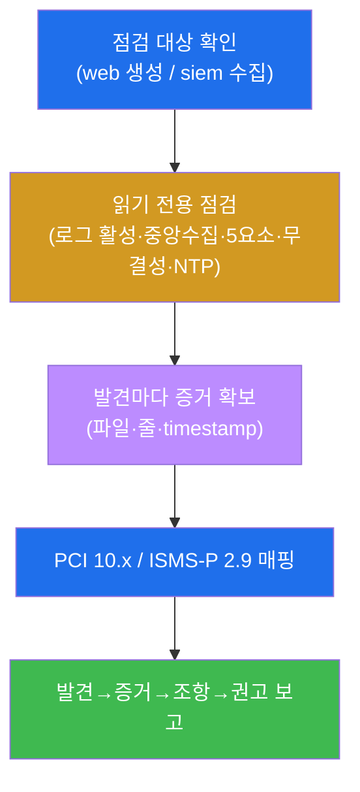
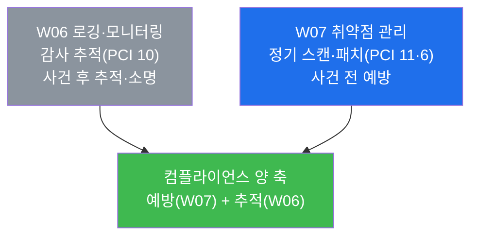

# 컴플라이언스 W06 — 로깅·모니터링 컴플라이언스: 감사 추적(PCI-DSS 10)

> **본 주차의 한 줄 요약**
>
> 침해는 막지 못할 수 있다. 그러나 **"무슨 일이, 누구에 의해, 언제 있었는가"를 나중에 추적할 수
> 없다면** 대응도, 법적 소명도, 재발 방지도 모두 무너진다. 본 주차에서 학생은 **감사자(auditor)의
> 시선**으로 el34 인프라의 로깅 체계를 점검한다 — 로그가 **생성**되는가(Apache access 로그), 한 곳으로
> **중앙 수집**되는가(Wazuh SIEM), 그 로그에 **감사 5요소**(누가·언제·무엇을·어디서·결과)가 담기는가,
> 그리고 무결성·보존·시간동기화 요건을 갖추었는가를 PCI-DSS **요구사항 10** 의 조항 하나하나에 비추어
> 확인하고, 그 결과를 컴플라이언스 보고서로 종합한다.
>
> **감사자 한 줄 결론**: 보안 통제는 "설치했다"가 아니라 **"동작한 증거(로그)가 남고, 그 증거가 보존·
> 보호된다"** 로 입증된다. 로그가 없으면 모든 통제는 "주장"일 뿐이고, 감사는 통과하지 못한다.

---

## 학습 목표

본 주차 종료 시 학생은 다음 6가지를 **본인 손으로** 할 수 있어야 한다.

1. PCI-DSS **요구사항 10**(로깅·모니터링)이 무엇을·왜 요구하는지, 그리고 그것이 한국 **ISMS-P 2.9
   (시스템 및 서비스 운영관리)** 의 로그 관리 통제와 어떻게 대응하는지 1분 안에 설명한다.
2. el34-web 컨테이너에서 **로그가 실제로 생성되고 있음**(Apache vhost별 access 로그)을 직접 점검하고,
   그것이 PCI 10.2 의 "접근 기록" 요건을 충족하는 증거임을 판정한다.
3. el34-siem(Wazuh manager)에서 **분산된 로그가 한 곳으로 중앙 수집·적재되고 있음**을 확인하고, 왜
   중앙 수집이 무결성·통합 모니터링의 전제인지 설명한다.
4. **감사 추적의 5요소**(누가·언제·무엇을·어디서·결과)를 열거하고, 어느 한 요소라도 빠지면 사건
   재구성이 왜 불가능해지는지 구체적 사례로 설명한다.
5. 로그의 **무결성**(WORM·해시·append-only), **보존**(PCI 최소 1년), **시간동기화**(NTP, PCI 10.4)
   요건을 각각 정의하고, el34 환경에서 그 충족/미흡 상태를 판정한다.
6. 점검 결과를 **발견 → 증거 → 표준 조항 → 권고** 구조의 로깅 컴플라이언스 보고서로 종합하고, 미흡
   항목의 개선 우선순위를 제시한다.

---

## 0. 용어 해설 (로깅·감사 컴플라이언스 입문)

본 주차에서 처음 나오거나 정확히 짚어야 하는 핵심 용어를 먼저 정리한다. 본문에서 다시 등장할 때 막히면
이 표로 돌아오면 흐름이 끊기지 않는다.

| 용어 | 영문 | 뜻 | 비유 |
|------|------|----|------|
| **감사 추적** | Audit Trail | "누가·언제·무엇을·어디서·어떤 결과로" 했는지를 시간순으로 남긴 기록의 사슬 | CCTV + 출입기록부의 시간순 영상 |
| **로그** | Log | 시스템·앱이 자기가 한 일을 한 줄씩 적은 기록 | 일지(日誌)의 한 줄 |
| **로그 활성** | Logging enabled | 시스템이 실제로 로그를 "생성하도록" 켜져 있는 상태 | CCTV 전원이 켜져 녹화 중 |
| **중앙 수집** | Centralized logging / Log aggregation | 흩어진 여러 서버의 로그를 한 곳으로 모으는 것 | 각 층 CCTV 영상을 관제실 한 곳에 모음 |
| **SIEM** | Security Information & Event Management | 로그를 통합 수집·정규화·상관분석·알림 하는 플랫폼 | CCTV 관제실 |
| **감사 5요소** | the 5 W's of audit | 누가(who)·언제(when)·무엇을(what)·어디서(where)·결과(outcome) | 사건 보고서의 육하원칙 |
| **무결성** | Integrity | 로그가 변조·삭제되지 않았음이 보장되는 성질 | 봉인된 증거물(손대면 표시) |
| **WORM** | Write Once Read Many | 한 번 쓰면 더는 못 고치는 저장 방식 | 잉크로 쓴 장부(지우개 불가) |
| **append-only** | append-only | 끝에 추가만 되고 기존 줄은 못 고치는 로그 | 계속 이어 쓰는 두루마리(앞장 못 찢음) |
| **해시 체인** | hash chaining | 각 로그 줄에 앞줄의 해시를 묶어 한 줄만 고쳐도 사슬이 깨지게 함 | 봉인 스티커를 줄마다 이어 붙임 |
| **보존** | Retention | 로그를 일정 기간(법규상 의무) 지우지 않고 보관 | 서류 보관 의무 기간 |
| **NTP** | Network Time Protocol | 모든 시스템의 시계를 표준 시간에 맞추는 프로토콜 | 모든 시계를 표준시에 동기화 |
| **시간선** | timeline | 사건을 시간순으로 재구성한 흐름 | 사건 발생 순서표 |
| **상관분석** | correlation | 여러 로그를 시간·출처로 엮어 한 사건으로 잇는 분석 | 흩어진 단서를 한 사건으로 연결 |
| **PCI-DSS 10** | Payment Card Industry Data Security Standard, Req. 10 | 카드 데이터 환경의 **모든 접근에 감사 추적을 의무화**한 표준 조항 | 금고 접근 전부를 기록하라는 규정 |
| **ISMS-P** | 정보보호 및 개인정보보호 관리체계 | 한국의 정보보호 인증제도(통제 2.9 가 로그 관리) | 국내판 보안 관리 인증 |
| **Apache access 로그** | access log | 웹서버가 받은 모든 HTTP 요청을 한 줄씩 기록한 파일 | 건물 출입구 방문자 기록부 |
| **Wazuh** | — | el34 가 쓰는 오픈소스 SIEM(로그 중앙 수집·탐지·알림) | el34 의 관제실 시스템 |

---

## 0.5 핵심 개념 — "왜 로그가 보안의 마지막 보루인가"

위 표는 한 줄 정의에 그치므로, 본 절에서는 감사 컴플라이언스에서 가장 헷갈리기 쉬운 핵심 개념 셋을
일상 비유로 풀어 설명한다.

### 0.5.1 감사 추적(Audit Trail) — 은행 금고의 출입 영상 비유

은행 금고를 떠올려보자. 금고 문에는 두꺼운 잠금장치(예방 통제)가 달려 있다. 하지만 아무리 좋은 잠금
장치도 언젠가는 누군가 열쇠를 복제하거나 내부자가 정당한 열쇠로 들어갈 수 있다. 그래서 모든 은행은
금고 앞에 **24시간 CCTV** 와 **출입 기록부**를 둔다.

- 잠금장치(예방)는 "막는" 통제다.
- CCTV·출입기록부(탐지·기록)는 "막지 못했어도 **누가 언제 무엇을 했는지 나중에 추적**하게" 해주는
  통제다.

이 CCTV + 출입기록부에 해당하는 것이 보안에서는 **감사 추적(Audit Trail)** 이다.

> **핵심.** 컴플라이언스 감사관이 가장 먼저 묻는 질문은 "막았느냐"가 아니라 **"기록이 남느냐, 그리고
> 그 기록을 믿을 수 있느냐"** 다. 침해를 100% 막는 것은 불가능하다는 전제 위에서, 사후 추적·소명·재발
> 방지를 가능하게 하는 마지막 보루가 감사 추적이기 때문이다. PCI-DSS 가 요구사항 10 전체를 로깅에
> 할애한 이유가 여기 있다.

### 0.5.2 중앙 수집(Centralized Logging) — 왜 로그를 한 곳에 모으나

각 층에 CCTV가 따로 달려 있고, 영상이 **그 층의 캐비닛에만** 저장된다고 하자. 두 가지 문제가 생긴다.

1. **사건 재구성이 어렵다.** 도둑이 1층으로 들어와 3층으로 올라갔다면, 1층 캐비닛과 3층 캐비닛을 따로
   뒤져 시간을 맞춰야 한다. 층이 41개라면(el34 컨테이너 수만큼) 사실상 불가능하다.
2. **증거가 쉽게 사라진다.** 도둑이 3층에 도달해 **그 층 캐비닛의 영상을 지워버리면** 자기 흔적이
   없어진다. 침입자가 침투한 바로 그 서버에 로그가 있으면, 공격자는 가장 먼저 그 로그를 지운다.

그래서 영상을 각 층이 아니라 **침입자가 닿을 수 없는 관제실 한 곳으로 즉시 전송**해 모은다. 이것이
**중앙 수집(centralized logging)** 이고, 그 관제실 시스템이 **SIEM** 이다. el34 에서는 **Wazuh** 가 이
관제실 역할을 한다.

> **핵심.** 중앙 수집은 단순한 편의가 아니라 **무결성(공격자가 침투 서버에서 로그를 못 지움) + 통합
> 모니터링(흩어진 단서를 한 사건으로 상관분석)** 의 전제다. 그래서 PCI-DSS 10 은 로그를 생성만 하는
> 것을 넘어, 즉시 중앙으로 모으고 보호할 것을 요구한다.

### 0.5.3 감사 5요소 — 사건 보고서의 육하원칙

경찰 사건 보고서가 "어제 도난이 있었음" 한 줄이면 수사가 불가능하다. 반드시 **누가·언제·어디서·무엇을·
어떻게·왜** 의 육하원칙이 채워져야 한다. 로그도 똑같다. 감사 추적이 쓸모 있으려면 한 줄 한 줄에 다음
**5요소**가 담겨야 한다.

| 요소 | 영문 | 로그에서 | 빠지면 |
|------|------|----------|--------|
| **누가** | who | user 계정·인증 주체 | 누구 책임인지 모름 |
| **언제** | when | timestamp(시각) | 시간선을 못 그림 |
| **무엇을** | what | event/object(어떤 행위·대상) | 무슨 일인지 모름 |
| **어디서** | where | source IP·출처 | 어디서 왔는지 모름(외부? 내부?) |
| **결과** | outcome | success / fail | 시도인지 성공인지 모름 |

> **핵심.** 5요소 중 특히 **source IP(어디서)** 와 **결과(성공/실패)** 가 자주 누락되는데, 이 둘이 없으면
> "외부 공격자가 로그인에 **성공**했는지, 그냥 실패만 반복했는지"를 구분할 수 없다 — 사건의 심각도
> 자체를 판정 불가다. el34 의 fw 는 출처 IP 를 보존(SNAT 안 함)하므로, web access 로그에 공격자의 진짜
> source IP 가 그대로 남는다(이것이 PCI 10.2 의 "어디서" 요건을 충족하는 el34 의 구조다).

---

## 1. 왜 "로그 없는 보안"은 감사에서 탈락하는가

### 1.1 한 줄 답: 통제는 동작한 증거(로그)로만 입증된다

컴플라이언스 감사관 앞에서 "우리는 방화벽·WAF·SIEM 을 다 갖추었습니다"라고 말하는 것은 점수가 되지
않는다. 감사관은 반드시 되묻는다 — **"그 통제가 실제로 동작한 증거(로그)를 보여주세요. 그 로그가 변조
되지 않았다는 것은 어떻게 보장합니까? 1년 전 사건도 조회됩니까?"** 입증할 로그가 없으면, 아무리 좋은
장비를 사 두었어도 그 통제는 감사에서 "미입증(주장)"으로 처리되어 탈락한다.

이것이 본 주차의 출발점이다. W01~W05 에서 학생은 정책·자산식별·접근통제·암호화 같은 **예방·보호** 통제를
다루었다. W06 은 그 통제들이 "**실제로 동작했고, 그 사실이 기록·보존된다**"를 입증하는 **탐지·기록**
통제 — 즉 로깅·모니터링을 다룬다.

### 1.2 실 사례 — 로그가 없거나 안 봐서 커진 사고

| 사고 | 무엇이 문제였나 | 로깅 관점의 실패 |
|------|-----------------|------------------|
| 2013 Target (4천만 카드) | 침해 탐지 도구가 alert 를 냈으나 **아무도 보지 않음** | 로그·alert 는 있었으나 **모니터링(사람의 검토)** 부재 — PCI 10.6 위반 |
| 2017 Equifax (1.45억 PII) | 침입 후 **76일간** 데이터 유출이 지속되도록 탐지 못함 | 로그 모니터링·상관분석 미흡으로 장기간 미탐지 |
| 다수 랜섬웨어 사고 | 공격자가 침투 서버의 **로컬 로그를 삭제**해 초기 침투 경로 소실 | 중앙 수집·무결성 보호 부재 → 사후 추적 불가 |

세 사고의 공통 결론은 같다. **로그를 "생성"만 하는 것으로는 부족하다.** 한 곳에 **중앙 수집**하고
(공격자가 못 지우게), **무결성**을 보호하고(변조 표시), 사람이 **모니터링**(검토·알림)해야 비로소 감사
추적이 작동한다. PCI-DSS 10 은 바로 이 전 과정을 조항으로 의무화한 것이다.

### 1.3 로그의 수명주기 — 생성에서 모니터링까지

감사 추적은 한 번의 행위가 아니라 **다섯 단계의 수명주기**다. 이 다섯 단계 전부가 갖춰져야 하나의
완결된 감사 통제가 된다. 본 주차의 lab 8 미션이 이 다섯 단계를 따라 흐른다.



각 단계를 어느 하나라도 빼면 사슬이 끊긴다 — 생성만 하고 중앙 수집을 안 하면 공격자가 지우고, 수집은
하되 무결성 보호가 없으면 변조되며, 보존을 안 하면 과거 사건을 못 보고, 모니터링을 안 하면 Target
처럼 alert 가 떠도 아무도 모른다.

---

## 2. PCI-DSS 요구사항 10 전체 지도와 ISMS-P 2.9 매핑

### 2.1 PCI-DSS 요구사항 10 이란

> **용어 — PCI-DSS(Payment Card Industry Data Security Standard).** 카드 결제 데이터를 다루는 모든
> 조직이 지켜야 하는 국제 보안 표준이다. 12개 요구사항으로 구성되며, 그중 **요구사항 10** 이 통째로
> **"카드 데이터와 시스템 자원에 대한 모든 접근을 추적·모니터링하라"** 는 로깅·모니터링 조항이다. 12개
> 요구사항 중 단 하나를 로깅에 통째로 할애했다는 사실 자체가, 감사 추적이 컴플라이언스에서 차지하는
> 비중을 보여준다.

요구사항 10 은 다시 하위 조항으로 나뉜다. 본 주차에서 직접 점검하는 핵심 조항은 다음과 같다.

| 조항 | 요구 내용 | 본 주차 점검(lab) |
|------|-----------|-------------------|
| **10.2** | 모든 시스템 구성요소의 **접근·행위를 기록**(감사 추적 생성) | lab 2(로그 활성) · lab 4(감사 5요소) |
| **10.2.x** | 기록 대상: 사용자 접근, 관리자 행위, **로그 자체 접근**, 인증 시도, 권한 변경 | lab 4 |
| **10.3 / 10.5** | 감사 추적을 **변조로부터 보호**(무결성·접근 제한) | lab 5(무결성) |
| **10.4** | 모든 시스템의 **시계를 NTP 로 동기화** | lab 6(시간동기화) |
| **10.5.1** | 로그를 **즉시 조회 가능 3개월 + 최소 1년 보존** | lab 5(보존) |
| **10.6 / 10.7** | 로그를 **검토·모니터링**하고 이상 시 **알림**(중앙 수집의 목적) | lab 3(중앙 수집) · lab 7(방어) |

### 2.2 한국 ISMS-P 2.9 와의 대응

국내 환경에서는 PCI-DSS 와 함께 **ISMS-P** 인증을 받는다. 본 주차의 로깅 통제는 ISMS-P 의 다음 통제에
대응한다.

> **용어 — ISMS-P(정보보호 및 개인정보보호 관리체계).** 한국 정부(KISA)가 운영하는 정보보호 인증제도
> 다. 영역 2(보호대책)의 통제 중 **2.9.1~2.9.5(시스템 및 서비스 운영관리)** 가 로그·접속기록의 생성·
> 보존·검토를 규정하며, 특히 **2.9.4(로그 및 접속기록 관리)** 가 PCI 10 과 직접 대응한다.

| PCI-DSS 10 | ISMS-P | 공통 요구 |
|------------|--------|-----------|
| 10.2 감사 추적 생성 | 2.9.4 로그 및 접속기록 관리 | 접근·행위를 기록하라 |
| 10.5 로그 보호·보존 | 2.9.4 / 2.9.5 | 변조 방지하고 일정 기간 보존하라 |
| 10.4 시간동기화 | 2.9.x 운영관리 | 시각을 표준에 맞춰라 |
| 10.6 모니터링·알림 | 2.9.5 로그 검토 | 정기적으로 검토하고 이상 시 대응하라 |

두 표준은 표현은 달라도 **요지가 동일**하다 — 생성·중앙화·무결성·보존·모니터링. 본 주차에서 한 점검은
PCI-DSS 와 ISMS-P 두 감사에 모두 그대로 쓰인다.

---

## 3. el34 의 로깅 체계 — 무엇이 어디서 어떻게 기록되나

본 주차의 점검 대상은 두 컨테이너다. 하나는 로그를 **생성**하는 곳(el34-web), 다른 하나는 그것을 한
곳으로 **중앙 수집**하는 곳(el34-siem)이다.



### 3.1 로그 생성 — el34-web 의 Apache access 로그

**한 줄 정의.** Apache access 로그는 웹서버가 받은 **모든 HTTP 요청을 한 줄씩** 기록한 파일로, 건물
출입구의 방문자 기록부에 해당한다.

**왜 중요한가.** el34-web 은 여러 vhost(juice/dvwa/neobank 등)를 운영하며, **vhost마다 별도의 access
로그**를 남긴다. 이 로그가 있다는 것은 곧 "웹 접근에 대한 감사 추적이 생성되고 있다"는 PCI 10.2 의
직접 증거다. 로그 한 줄에는 출처 IP(어디서), 시각(언제), 요청한 경로·메서드(무엇을), 응답 코드(결과)가
담긴다 — 감사 5요소 중 네 가지가 자동으로 채워진다.

**el34 에서 어떻게.** `/var/log/apache2/` 디렉터리에 `*access*.log` 형태의 파일이 vhost 수만큼 존재
한다. lab 2 에서 그 파일 개수를 세어 "로그가 활성화되어 있음"을 정량적으로 입증한다.

```
# Apache access 로그 한 줄의 구조(개념 예시)
10.20.30.202 - - [14/Jun/2026:11:06:44 +0000] "GET /?q=<script> HTTP/1.1" 403 512
```

위 한 줄을 감사 5요소로 읽으면 — **어디서**(출처 IP `10.20.30.202`) · **언제**(시각
`14/Jun/2026:11:06:44`) · **무엇을**(요청 `GET /?q=<script>`) · **결과**(응답 코드 `403`, 즉 WAF
차단)다. "누가"(인증 계정)는 익명 요청이라 여기선 비어 있다(아래 한계 참고).

**한계.** access 로그는 "요청이 왔다"는 사실은 남기지만, **"누가"(인증된 사용자 계정)** 는 익명 요청의
경우 비어 있을 수 있다. 그래서 인증 로그(앱 레벨)와 함께 봐야 5요소가 완성된다. 또한 로컬 파일에만
있으면 공격자가 지울 수 있으므로 반드시 중앙 수집과 결합해야 한다(다음 절).

### 3.2 중앙 수집 — el34-siem 의 Wazuh

**한 줄 정의.** el34-siem 은 오픈소스 SIEM 인 **Wazuh** 를 가동해, web·ips 등에서 발생한 로그를 **한
곳으로 모아** 정규화·상관분석·알림 하는 관제실이다.

**왜 중요한가.** §0.5.2 에서 보았듯, 중앙 수집은 (a) 공격자가 침투 서버에서 로그를 못 지우게 하고(무결성),
(b) 흩어진 단서를 한 사건으로 잇게(상관분석) 한다. el34 의 web·ips 컨테이너에는 **Wazuh agent** 가
설치되어, 자기 로그를 실시간으로 siem(manager)에 전송한다 — web 은 agent `web004`, ips 는 agent
`ips003` 으로 등록되어 있다.

**el34 에서 어떻게.** Wazuh manager 는 수집·상관 결과를 `/var/ossec/logs/alerts/alerts.json` 에
한 줄씩 JSON 으로 적재한다. lab 3 에서 이 파일의 최근 줄을 확인해 "중앙 수집이 살아 있음"을 입증한다.
이 alerts.json 한 곳을 보면, 감사자는 여러 서버를 일일이 뒤지지 않고 전체 보안 이벤트를 조회할 수 있다.

**한계.** 중앙 수집이 곧 "완벽한 무결성"은 아니다. SIEM 자체가 침해되면 모인 로그도 위험하므로, SIEM 의
접근 통제·로그 자체 접근 로깅(10.2 의 "로그 접근도 기록")이 추가로 필요하다. 또한 Wazuh 가 **수집**은
해도, 룰·디코더가 없으면 raw 로 쌓일 뿐이라 의미 있는 알림(10.6)을 내려면 룰 튜닝이 필요하다(secuops/
soc 트랙 영역).

---

## 4. 감사 추적의 품질 — 5요소·무결성·보존·시간

로그가 "있다"는 것만으로는 감사를 통과하지 못한다. 그 로그가 **쓸모 있는 품질**을 갖추었는지를 네 축으로
점검한다.

### 4.1 감사 5요소 (PCI 10.2)

§0.5.3 에서 정의한 **누가·언제·무엇을·어디서·결과**가 모든 로그 줄에 담겨야 한다. PCI 10.2 는 특히 다음
**행위들**이 반드시 기록될 것을 요구한다 — 이 목록이 lab 4 의 점검 기준이다.



특히 **"로그 자체 접근"(E5)** 이 중요하다 — 공격자가 자기 흔적을 지우려 로그에 손대는 것 자체가 가장
강력한 침해 신호이기 때문에, "로그를 본·지운 행위"도 반드시 로깅해야 한다는 것이 PCI 의 요구다.

### 4.2 무결성 (PCI 10.5)

**한 줄 정의.** 무결성은 로그가 **생성된 뒤 변조·삭제되지 않았음**이 보장되는 성질이다.

세 가지 기법으로 확보한다.

- **append-only** — 로그를 끝에 추가만 할 수 있고 기존 줄은 못 고치게 한다(두루마리에 이어 쓰되 앞장은
  못 찢음).
- **해시 체인** — 각 줄에 앞줄의 해시를 묶어, 한 줄만 고쳐도 그 뒤 사슬 전체가 깨져 변조가 드러나게
  한다(줄마다 봉인 스티커를 이어 붙임).
- **WORM(Write Once Read Many)** — 한 번 쓰면 물리적으로 못 고치는 저장매체/모드를 쓴다(잉크 장부).

여기에 더해 **"로그 접근 자체를 로깅"**(§4.1 E5)하면, 누가 로그에 손댔는지도 추적된다. el34 에서는
중앙 수집(Wazuh)이 1차 무결성 장치다 — 공격자가 web 컨테이너의 로컬 로그를 지워도, 이미 siem 으로
전송된 사본은 침입자 손이 닿지 않는다.

### 4.3 보존 (PCI 10.5.1)

**한 줄 정의.** 보존은 로그를 법규가 정한 기간만큼 **지우지 않고 보관**하는 것이다.

PCI-DSS 의 기준은 명확하다 — **최소 1년 보관**하되, 그중 **최근 3개월은 즉시 조회 가능**해야 한다. 1년인
이유는, 침해가 평균적으로 수개월간 탐지되지 않는다는 통계(Equifax 76일 사례 참고) 때문이다. 사건을
나중에 발견했을 때 그 시점의 로그가 이미 지워졌다면 수사가 불가능하다.

> **주의 — 법규별로 보존 기간이 다르다.** PCI 는 1년이지만, 국내 개인정보보호법·통신비밀보호법 등은
> 자료 유형별로 다른 보존 기간을 요구한다. 감사자는 "PCI 1년"만 외울 게 아니라, 해당 조직에 적용되는
> 모든 법규의 최댓값을 보존 정책에 반영했는지를 점검한다.

### 4.4 시간동기화 (PCI 10.4 / NTP)

**한 줄 정의.** 시간동기화는 모든 시스템의 시계를 **NTP(Network Time Protocol)** 로 하나의 표준 시간에
맞추는 것이다.

**왜 중요한가.** 사건 재구성은 **시간선(timeline)** 위에서 이루어진다. fw 의 시계가 web 보다 5분 빠르고
siem 은 3분 느리다면, "공격자가 fw 를 통과한 뒤 web 을 공격했다"는 인과의 순서가 로그상으로 뒤바뀌어
버린다 — **상관분석이 통째로 무너진다.** 그래서 PCI 10.4 는 모든 시스템 시계를 NTP 로 동기화하라고
명시한다. lab 6 에서 el34-web 의 UTC 시각을 확인해 시간 기준이 일관됨을 점검한다.



---

## 5. 감사자 관점과 운영자 관점 — 같은 로그의 두 얼굴

본 주차의 핵심 시야는, **같은 로그 한 줄이 운영자에게는 '디버깅 정보'이고 감사자에게는 '준수 증거'** 라는
것이다. el34-web 의 access 로그 한 줄을 두 관점에서 보면 다음과 같다.



| 관점 | 무엇을 보나 | 핵심 질문 |
|------|-------------|-----------|
| 운영자 | 응답 코드·지연·오류 | "서비스가 정상인가?" |
| 감사자 | 5요소 충족·보존·무결성 | "이 로그가 통제의 동작을 입증·보존하는가?" |

감사자는 로그를 "잘 처리됐나"가 아니라 **"이 로그가 PCI 10 의 어느 조항을 충족하는 증거이며, 변조되지
않고 1년 보존되는가"** 로 읽는다. 본 주차의 모든 lab 은 이 감사자의 눈으로 진행한다 — 정상 동작 확인이
아니라 **준수 입증**이 목표다.

---

## 6. 실습 안내 — lab 8 미션 (4 축 설명)

본 주차 실습은 8 미션으로 구성되며, §1.3 의 로그 수명주기(생성 → 중앙수집 → 무결성·보존 → 시간 → 모니터링
→ 보고)를 따라 흐른다. 각 미션을 **4 축**으로 설명한다 — 왜 하는가 / 무엇을 알 수 있는가 / 결과 해석
(정상 vs 비정상) / 실전 활용.

> **실습 진행 원칙.** 모든 명령은 el34 호스트(`ssh ccc@192.168.0.80`, 비밀번호 1)에서 `docker exec
> el34-web` 또는 `docker exec el34-siem` 으로 실행한다. **신규 설치는 없다** — 이미 가동 중인 로깅
> 체계를 감사자 관점에서 점검한다. 합격 임계값은 0.7 이다.

### 미션 1 — 점검: 로깅 점검 대상 확인 (10점)

> **왜 하는가?** 모든 점검의 전제는 대상 시스템에 접근이 된다는 것이다. 감사자는 본격 점검 전 항상
> 점검 범위(scope)에 닿는지부터 확인한다. 본 주차의 대상은 로그를 **생성**하는 el34-web 과 그것을
> **중앙 수집**하는 el34-siem 두 곳이다.
>
> **무엇을 알 수 있는가?** `docker exec el34-web` 으로 대상 컨테이너에 접근해 hostname 을 받아오는지 —
> 즉 점검을 시작할 수 있는 상태인지.
>
> **결과 해석.** 정상: `target_ok` 가 출력되어 대상 접근 확인. 비정상: 응답이 없으면 호스트 SSH·컨테이너
> 가동 상태(`docker ps`)부터 점검한다.
>
> **실전 활용.** 컴플라이언스 현장 점검의 첫 단계 — 점검 대상 자산이 실재하고 접근 가능한지 확인하는
> scope 검증.

### 미션 2 — 로그 활성: Apache access 로그 (14점)

> **왜 하는가?** PCI 10.2 의 출발점은 "접근이 **기록되고 있는가**"다. 로그가 아예 생성되지 않으면 그
> 뒤의 모든 통제(중앙수집·보존·모니터링)가 무의미하다. 그래서 가장 먼저 로그 생성 여부를 정량 확인한다.
>
> **무엇을 알 수 있는가?** el34-web 의 `/var/log/apache2/` 에 `*access*.log` 파일이 vhost 수만큼
> 존재함 — 즉 웹 접근에 대한 감사 추적이 실제로 생성되고 있음. 출력되는 파일 개수가 그 정량 증거다.
>
> **결과 해석.** 정상: `access_logs=N`(N≥1, 보통 vhost 수만큼) 과 파일 목록이 출력 → 로그 활성(PCI 10.2
> 접근 기록 충족). 비정상: `access_logs=0` 이면 로깅이 꺼진 것 — 즉시 시정해야 할 중대 결함이다.
>
> **실전 활용.** 감사의 1차 증거 수집 — "로그가 켜져 있다"를 파일 존재로 객관 입증한다. 운영자가 "당연히
> 켜져 있죠"라고 말해도, 감사자는 파일로 확인한다.

### 미션 3 — 중앙 수집: Wazuh 적재 (14점)

> **왜 하는가?** 로그를 생성만 하고 로컬에 두면 공격자가 지운다(§0.5.2). 중앙 수집은 무결성·통합
> 모니터링의 전제이며 PCI 10.6/10.7 의 토대다. 그래서 로그가 한 곳(SIEM)으로 모이는지 확인한다.
>
> **무엇을 알 수 있는가?** el34-siem(Wazuh manager)의 `/var/ossec/logs/alerts/alerts.json` 에 이벤트가
> 적재되고 있음 — 즉 web·ips 의 로그가 중앙으로 수집·상관되고 있음.
>
> **결과 해석.** 정상: alerts.json 의 최근 줄 일부와 `siem_ingest_ok` 가 출력 → 중앙 수집 동작. 비정상:
> 파일이 비었거나 없으면 Wazuh manager·agent 연결(`ips003`/`web004`) 상태를 점검한다.
>
> **실전 활용.** 감사자는 "로그가 분산 서버에 흩어져 있지 않고 한 곳에서 조회·보호되는가"를 확인한다 —
> 이것이 중앙 로그관리(log management) 통제의 핵심 증거다.

### 미션 4 — 감사 추적 요소 (PCI 10.2) (12점)

> **왜 하는가?** 로그가 있어도 **5요소**(누가·언제·무엇을·어디서·결과)가 빠지면 사건 재구성이 불가능하다
> (§0.5.3). 감사자는 로그의 "존재"를 넘어 "품질(필수 요소 포함)"을 점검한다.
>
> **무엇을 알 수 있는가?** 감사 추적의 5요소와, PCI 10.2 가 반드시 기록하라고 요구하는 행위 목록(인증
> 시도·권한 변경·관리 행위·데이터 접근·로그 자체 접근)을 정리·이해한다.
>
> **결과 해석.** 정상: 5요소와 필수 기록 행위가 정리되어 출력. 핵심 깨달음 — 특히 **source IP(어디서)와
> 결과(성공/실패)** 가 빠지면 "외부 공격자가 로그인에 성공했는가"를 판정할 수 없다. 비정상: 요소가 누락
> 되면 어느 요소가 왜 필요한지 다시 확인한다.
>
> **실전 활용.** 감사 체크리스트의 핵심 항목 — 수집된 로그 샘플을 열어 5요소가 실제로 채워지는지 대조
> 하는 현장 점검 기준.

### 미션 5 — 무결성·보존 (PCI 10.5) (12점)

> **왜 하는가?** 공격자가 가장 먼저 노리는 것이 로그다. 변조·삭제를 막는 **무결성**과, 사후 추적을
> 가능하게 하는 **보존**이 없으면 감사 추적은 신뢰할 수 없다.
>
> **무엇을 알 수 있는가?** 무결성 기법(append-only·해시 체인·WORM + 로그 접근 로깅)과 보존 요건(PCI
> 최소 1년, 즉시 조회 3개월)을 정리하고, el34 에서 중앙 수집(Wazuh)이 1차 무결성 장치임을 이해한다.
>
> **결과 해석.** 정상: 무결성·보존 요건이 정리되어 출력. 핵심 깨달음 — 로그는 공격자의 1순위 삭제 대상
> 이므로 "중앙화 + 무결성 보호"가 함께 가야 한다. 비정상: 무결성/보존 개념이 흐릿하면 §4.2~4.3 으로
> 돌아간다.
>
> **실전 활용.** 감사자는 "로그가 변조 방지되고 1년 보존되는가"를 정책·증거로 확인한다 — 보존 기간 미달·
> 무결성 미보호는 PCI 10.5 위반으로 직접 지적된다.

### 미션 6 — 시간 동기화 (NTP, PCI 10.4) (12점)

> **왜 하는가?** 사건 재구성은 시간선 위에서 한다. 시스템 간 시계가 어긋나면 인과 순서가 뒤바뀌어
> 상관분석이 무너진다(§4.4). PCI 10.4 가 NTP 동기화를 명시하는 이유다.
>
> **무엇을 알 수 있는가?** el34-web 의 UTC 시각을 확인해 시간 기준의 일관성을 점검하고, 시간동기화가
> 왜 상관분석의 전제인지 이해한다.
>
> **결과 해석.** 정상: UTC 시각(`YYYY-MM-DDThh:mm:ssZ`)과 `time_checked` 가 출력 → 시간 기준 확인.
> 핵심 깨달음 — 모든 시스템이 같은 UTC 를 쓰면 로그를 한 시간선에 올릴 수 있다. 비정상: 시각이 크게
> 어긋나면 NTP 설정을 점검한다.
>
> **실전 활용.** 감사자는 여러 시스템 로그의 timestamp 가 동일 기준(NTP/UTC)인지 확인한다 — 시계
> 불일치는 모든 상관분석·포렌식의 신뢰를 깨뜨린다.

### 미션 7 — 방어: 감사 추적 강화 (12점)

> **왜 하는가?** 앞 미션들이 "현재 상태 점검"이라면, 이 미션은 그 점검 결과를 **개선 방안(방어)** 으로
> 종합한다. 로그 수명주기 전 단계를 빠짐없이 강화하는 것이 감사 추적 통제의 완성이다.
>
> **무엇을 알 수 있는가?** 감사 추적 강화의 전 주기 통제 — ① 전 시스템 로깅 ② 중앙 SIEM 수집 + 상관
> ③ 무결성 보호 + 로그 접근 로깅 ④ 보존 1년 + NTP ⑤ 실시간 알림 — 을 한 묶음으로 정리한다.
>
> **결과 해석.** 정상: 다섯 단계 강화책이 정리되어 출력. 핵심 깨달음 — 어느 한 단계만 빠져도 사슬이
> 끊긴다(생성→중앙화→무결성→보존→모니터링 전 주기). 비정상: 단계가 누락되면 §1.3 수명주기로 돌아간다.
>
> **실전 활용.** 감사 보고서의 "권고(remediation)" 절 — 발견된 미흡을 어떻게 보강할지 제시하는 실질적
> 산출물.

### 미션 8 — 로깅 컴플라이언스 보고서 (12점)

> **왜 하는가?** 컴플라이언스 점검의 산출물은 보고서다. 미션 1–7 의 점검·발견을 한 문서로 종합해야
> 점검이 완성되고, 그 보고서가 PCI/ISMS-P 감사에 제출된다.
>
> **무엇을 알 수 있는가?** 로그 활성·중앙 수집(준수) + 감사 5요소 + 무결성·보존 + 방어(전 주기)를
> **발견 → 증거 → 표준 조항 → 권고 → 결론** 구조로 묶는 법.
>
> **결과 해석.** 정상: 보고서에 점검 결과(로그 활성·Wazuh 중앙수집=준수) + 감사요소 + 무결성/보존/NTP +
> 방어 + 결론(로그 생성·중앙화는 양호, 무결성·보존·NTP 를 표준에 맞춰 운영)이 포함되고 `PCI` 가 언급됨.
> 비정상: 증거 없는 주장만 있으면 미션 2–6 의 점검 결과(증거)를 보고서에 연결한다.
>
> **실전 활용.** PCI-DSS / ISMS-P 감사에 제출하는 최종 산출물 — "통제가 동작하고 그 증거가 보존됨"을
> 입증하는 문서. 감사의 합격·불합격이 이 보고서로 갈린다.

---

## 7. 점검 수칙 — 증거 중심·읽기 전용

로깅 컴플라이언스 점검은 **운영 중인 시스템의 증거를 확인**하는 일이다. 따라서 다음 수칙을 지킨다.

- **읽기 전용으로 점검한다.** 로그 파일을 조회·집계만 하고, 절대 수정·삭제하지 않는다(감사자가 로그를
  변조하면 그 자체가 무결성 위반이다).
- **증거로 말한다.** "로그가 있다"가 아니라 **파일 개수·실제 줄·timestamp** 등 객관 증거를 제시해야
  점검이 성립한다. 운영자의 구두 주장은 증거가 아니다.
- **조항에 매핑한다.** 모든 발견을 PCI-DSS 10.x / ISMS-P 2.9 의 구체 조항에 자리매김해 보고한다 —
  표준 조항 없는 발견은 감사 보고서에서 효력이 약하다.
- **인가된 대상만 점검한다.** el34 의 정해진 대상(web/siem)에 대해서만 점검한다.



---

## 8. 다음 주차 (W07) 예고 — 취약점 관리 컴플라이언스

W06 에서 학생은 보안 통제가 **동작한 증거(로그)** 를 남기고 보존·보호하는지를 감사자 관점에서 점검했다.
즉 "사건이 일어났을 때 추적·소명할 수 있는가"를 다룬 것이다.

W07 은 시선을 **사건이 일어나기 전**으로 옮긴다 — 시스템에 **알려진 취약점이 남아 있지 않도록 정기적으로
스캔하고 패치하는가**를 다루는 **취약점 관리 컴플라이언스(PCI-DSS 11·6, ISMS-P 2.11)** 다. W06 이
"탐지·기록"의 사후 통제였다면, W07 은 "정기 점검·조치"의 예방 통제다. 두 주차가 합쳐져 "취약점을 미리
줄이고(W07), 그래도 뚫리면 추적한다(W06)"는 컴플라이언스의 양 축을 이룬다.


