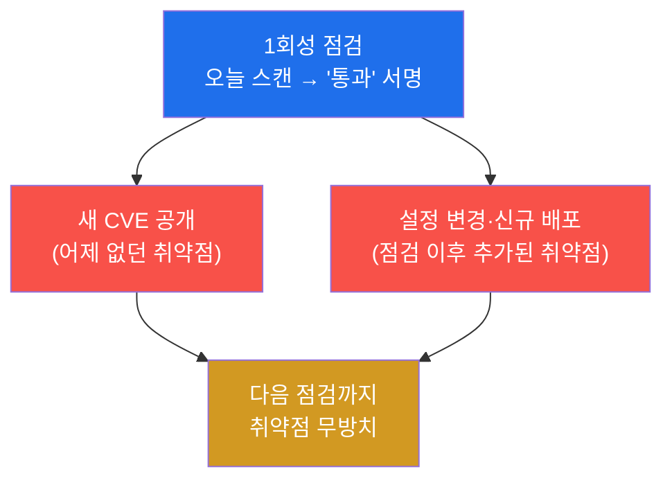
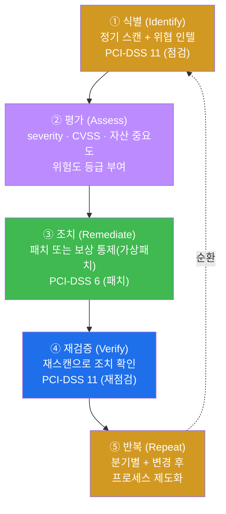
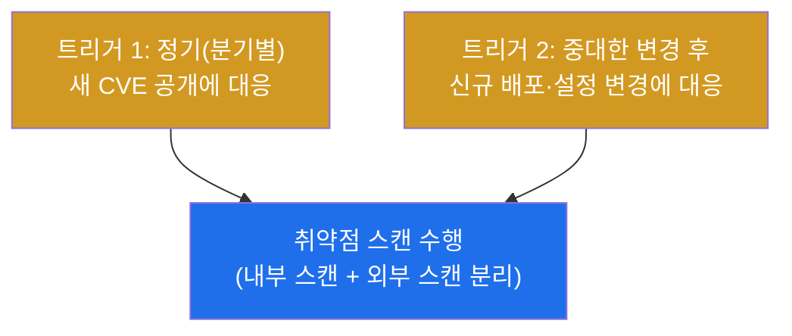
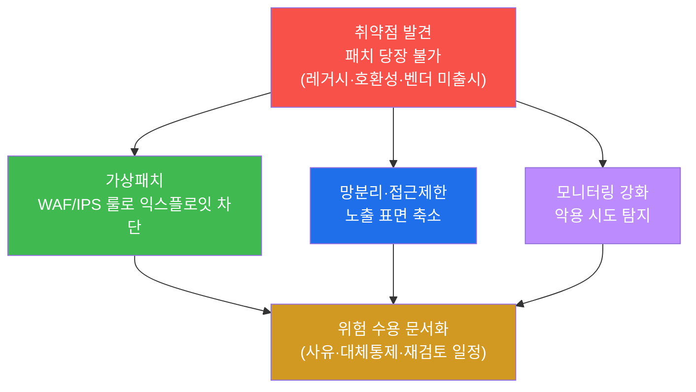
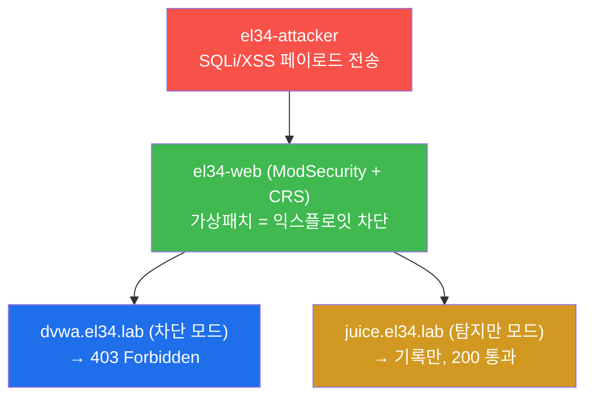
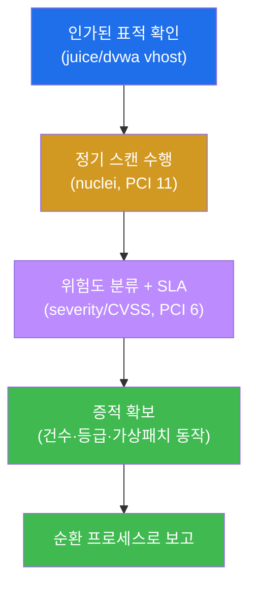
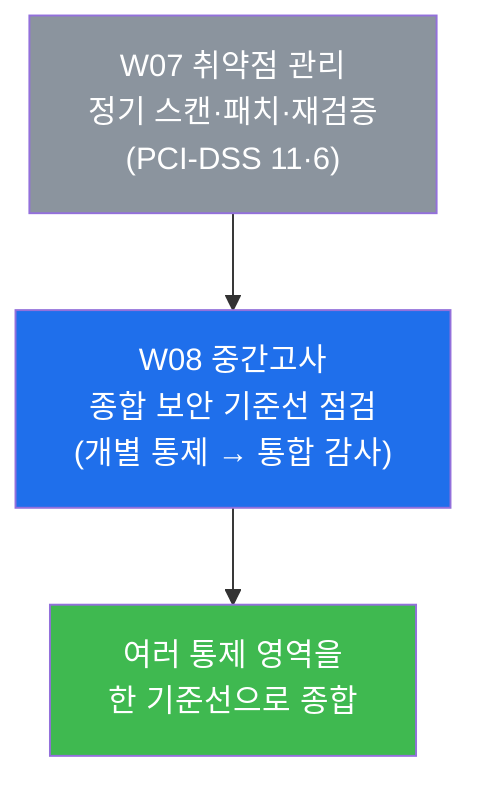

# 컴플라이언스 W07 — 취약점 관리 컴플라이언스: 정기 스캔·패치·재검증 (PCI-DSS 11·6)

> **본 주차의 한 줄 요약**
>
> 취약점은 매일 새로 생긴다 — 한 번 점검해 "깨끗하다"고 끝낼 수 있는 대상이 아니다. 본 주차에서 학생은
> **감사자(auditor)의 눈**으로, 한 조직이 취약점을 **정기적으로 스캔하고(PCI-DSS 11), 위험도에 따라 정해진
> 기한 안에 패치하고(PCI-DSS 6), 패치 후 다시 스캔해 확인하는** 순환 프로세스를 갖추었는지 점검한다.
> el34 인프라 위에서 실제로 nuclei 스캔을 돌려 취약점을 찾고, 그 결과를 위험도로 분류하고, 패치 SLA·보상
> 통제(ModSecurity 가상패치)까지 증적으로 확인한다.
>
> **감사자 한 줄 결론**: 컴플라이언스에서 중요한 것은 "스캔을 한 번 돌렸다"가 아니라, **정기 스캔 → 위험도
> 분류 → 기한 내 패치 → 재검증이 제도(프로세스)로 돌아간다는 증거**를 제시하는 일이다. 본 주차는 그 한
> 바퀴를 직접 돌리며, 각 단계가 어느 PCI-DSS 조항을 충족하는지를 증적과 함께 자리매김한다.

---

## 학습 목표

본 주차 종료 시 학생은 다음 6가지를 **본인 손으로** 할 수 있어야 한다.

1. **취약점 관리 순환**(식별 → 평가 → 조치 → 재검증 → 반복)의 다섯 단계를 비유 없이 1분 안에 설명하고,
   각 단계가 어느 PCI-DSS 조항(11=점검·스캔 / 6=개발·패치)에 대응하는지 자리매김한다.
2. el34 호스트(`ssh ccc@192.168.0.151`)에서 `docker exec el34-attacker` 로 **nuclei 정기 스캔**을 직접
   수행하고, 발견 건수를 집계해 "정기 점검을 프로세스화했다"는 증적을 만든다.
3. 스캔 결과를 **severity(critical / high / medium / low / info)** 등급으로 분류하고, 이 등급이 왜 그 자체로
   끝이 아니라 **CVSS·자산 중요도와 연계**되어 패치 우선순위가 되는지 설명한다.
4. **위험도별 패치 SLA**(Critical ≤ 7일 / High 30일 / Medium 90일)와 변경관리 절차(테스트 → 승인 → 배포
   → 검증)를 정리하고, "SLA 없는 패치 정책"이 왜 무기한 방치로 이어지는지 논증한다.
5. 패치가 당장 불가능한 경우의 **보상 통제(compensating control)** — 특히 **가상패치(virtual patching)** —
   를 설명하고, el34 의 **ModSecurity(WAF)가 어떻게 가상패치 사례가 되는지**를 실제 동작으로 확인한다.
6. 정기 스캔 결과·위험도 분류·패치 SLA·관리 순환·보상 통제를 묶어, **감사 제출용 취약점 관리 보고서**를
   작성한다.

> **감사자의 시선** — 본 주차는 새로운 공격 기법을 배우는 주가 아니다. 학생은 침투 테스터가 아니라
> **감사자**의 모자를 쓴다. nuclei 를 돌리는 이유도 "해킹"이 아니라 **"이 조직이 정기 점검 통제를 실제로
> 운영한다는 증거를 내가 직접 확인"** 하기 위함이다. 채점은 "취약점을 찾았다"가 아니라, **각 단계를 표준
> 조항에 매핑하고 그 증적(스캔 건수·severity 등급·SLA 표·가상패치 동작)을 제시했는가**를 본다.

---

## 0. 용어 해설 (취약점 관리 컴플라이언스 입문)

본 주차에서 처음 등장하거나 특히 중요한 용어를 먼저 정리한다. 한 줄 정의로 부족한 핵심어는 §0.5 에서
일상 비유로 다시 푼다.

| 용어 | 영문 | 뜻 | 비유 |
|------|------|----|------|
| **취약점 관리** | Vulnerability Management | 취약점을 식별·평가·조치·재검증하는 **순환 프로세스** | 건강검진을 1회가 아니라 정기적으로 반복 |
| **정기 스캔** | Periodic Scanning | 정해진 주기마다 자동 도구로 취약점을 점검하는 통제 | 분기마다 받는 정기 건강검진 |
| **nuclei** | nuclei | 템플릿(YAML 서명) 기반 오픈소스 취약점 스캐너 | 표준 점검 항목표를 들고 빠르게 훑는 검사관 |
| **severity** | severity | 발견 취약점의 위험 등급(critical~info) | 검진 소견의 위험 등급(중증~경미) |
| **CVSS** | Common Vulnerability Scoring System | 취약점 위험을 0.0~10.0 점수로 표준화한 체계 | 위험도를 숫자로 매기는 공통 척도 |
| **CVE** | Common Vulnerabilities and Exposures | 공개된 취약점에 붙는 전 세계 공통 식별번호 | 질병에 붙는 표준 질병코드 |
| **패치** | Patch | 취약점을 고치는 소프트웨어 수정 | 발견된 결함을 메우는 수리 |
| **SLA** | Service Level Agreement | "언제까지" 처리한다는 약속된 기한 | 수리 기사가 약속한 방문 기한 |
| **변경관리** | Change Management | 테스트 → 승인 → 배포 → 검증의 통제된 변경 절차 | 함부로 고치지 않고 결재받아 고치는 규정 |
| **보상 통제** | Compensating Control | 본 통제(패치)가 불가할 때 대신 두는 대체 방어 | 문을 못 고치면 경비를 더 세우는 임시 조치 |
| **가상패치** | Virtual Patching | 코드를 고치지 않고 WAF/IPS 룰로 익스플로잇을 막는 보상 통제 | 깨진 유리를 갈기 전 그 앞에 막을 치는 것 |
| **WAF** | Web Application Firewall | HTTP L7 페이로드를 검사·차단하는 응용 계층 방화벽 | 입구 금속탐지기 |
| **위험 수용** | Risk Acceptance | 못 고치는 위험을 책임자가 승인하고 문서로 남김 | 못 고친 결함을 "알고 감수한다"고 결재 |
| **PCI-DSS** | Payment Card Industry Data Security Standard | 카드 데이터를 다루는 조직의 보안 요구 표준 | 카드 취급점이 지켜야 할 안전 규정집 |
| **증적** | evidence / audit trail | 통제가 실제 작동했음을 증명하는 기록 | 검진을 받았다는 검진 결과지 |

---

## 0.5 신입생 친화 핵심 용어 개념 설명

위 표는 한 줄 정의라 처음 보는 학생에게는 부족하다. 본 절에서는 취약점 관리 컴플라이언스를 처음 만나는
학생이 가장 헷갈리는 핵심 4 용어를 일상 비유와 함께 풀어 설명한다.

### 0.5.1 취약점 "관리" — 1회 검진이 아니라 정기 검진 비유

학생이 건강검진을 떠올려보자. 한 번 검진을 받아 "지금은 건강하다"는 결과가 나왔다고 해서, 평생 건강이
보장되는 것은 아니다. 시간이 지나면 새로운 문제가 생기고, 작년에 없던 수치가 올해 이상으로 나타난다.
그래서 건강은 **정기적으로 반복 검진**하고, 이상이 나오면 치료하고, 치료 후 다시 검사해 확인한다.

취약점도 똑같다. 어제까지 안전했던 소프트웨어에 오늘 새로운 **CVE(공개 취약점 식별번호)** 가 붙는다.
전 세계에서 매일 수십~수백 건의 새 취약점이 공개된다. 따라서 보안 점검을 한 번 해서 "통과"라고 끝내면,
그 순간부터 시스템은 다시 위험에 노출되기 시작한다.

이것이 컴플라이언스가 취약점을 **"관리(management)"** 라고 부르는 이유다. 취약점 관리는 **일회성 이벤트가
아니라, 식별 → 평가 → 조치 → 재검증을 끝없이 도는 순환 프로세스**다. 감사자가 보려는 것도 "한 번 깨끗했던
스냅샷"이 아니라 **"이 순환이 실제로 돌고 있다는 증거"** 다.

| 정기 건강검진 | 취약점 관리 |
|----------------|-------------|
| 분기/연 1회 검진 | 정기 스캔(PCI 분기별 + 변경 후) |
| 검진 소견의 위험 등급 | severity / CVSS 등급 |
| 치료(수술/투약) | 패치 |
| 치료 후 재검사 | 패치 후 재스캔(재검증) |
| 검진 결과지 보관 | 증적 보관(감사 제출) |

### 0.5.2 severity 와 CVSS — 위험 등급은 "분류"이지 "점수"가 아니다

학생이 스캐너 결과를 처음 보면 `critical`, `high`, `medium`, `low`, `info` 같은 단어가 붙어 나온다. 이것이
**severity(위험 등급)** 다. 스캐너(nuclei)가 "이 발견이 대략 얼마나 위험한지"를 다섯 단계로 **분류**해 준
것이다.

그런데 severity 만으로는 우선순위를 정하기에 부족하다. 같은 `high` 라도, 그 취약점이 **인터넷에 노출된
결제 서버**에 있는지 **내부망 깊숙한 테스트 서버**에 있는지에 따라 실제 위험은 천차만별이다. 그래서 조직은
severity 를 **CVSS 점수(0.0~10.0)** 와 **자산 중요도**에 연계해 최종 위험도를 매긴다.

> **용어 — CVSS.** 취약점의 위험을 **공격 난이도·필요 권한·기밀성/무결성/가용성 영향** 등을 따져 0.0~10.0
> 점수로 표준화한 국제 체계다. 보통 점수대로 Critical(9.0+) · High(7.0+) · Medium(4.0+) · Low 로 등급을
> 나눈다. severity 가 "스캐너의 대략적 분류"라면, CVSS 는 "그 위험을 숫자로 표준화한 척도"다.

비유하면, severity 는 검진 소견에 적힌 "중증/경증" 같은 **꼬리표**이고, CVSS 는 "혈압 150/95" 같은 **표준
수치**다. 꼬리표만 보지 말고 수치와 환자의 상태(자산 중요도)를 함께 봐야 무엇부터 치료할지 정해진다.

### 0.5.3 패치 SLA — "언제까지" 고칠지를 미리 약속하는 비유

학생의 집 보일러가 고장 났다고 하자. 수리 기사가 "고쳐드릴게요"라고만 하고 언제 올지 약속하지 않으면,
그 수리는 무기한 미뤄질 수 있다. 그래서 좋은 서비스는 **"긴급 고장은 24시간 내, 일반 고장은 3일 내"** 처럼
위험도별로 **방문 기한(SLA)** 을 미리 약속한다.

패치도 똑같다. "취약점을 고친다"는 정책만으로는 부족하다. 위험도가 높은 취약점이 무기한 방치되는 것을 막으려면,
**위험도별로 "언제까지 패치한다"는 기한(SLA)** 을 정책으로 못 박아야 한다. PCI-DSS 6 이 요구하는 것이
바로 이 기한 있는 패치 정책이다.

> **용어 — SLA(Service Level Agreement).** 원래는 서비스 제공자가 "어느 수준으로 언제까지 제공한다"고
> 약속한 협약을 뜻한다. 패치 관리에서는 **"이 위험 등급의 취약점은 발견 후 며칠 안에 패치한다"는 내부
> 기한 약속**으로 쓴다. 본 주차에서 쓰는 예시 기준은 **Critical ≤ 7일 / High 30일 / Medium 90일** 이다.

SLA 가 없으면 "언젠가 고치겠지"가 되고, 그 "언젠가"는 사고가 난 뒤에야 온다. 감사자는 패치 정책에 **위험도별
기한이 명시되어 있는지**, 그리고 그 기한이 **실제로 지켜졌다는 기록**이 있는지를 함께 본다.

### 0.5.4 가상패치 — 유리를 갈기 전 막을 치는 비유

학생의 가게 유리창이 깨졌다고 하자. 새 유리로 교체(=진짜 패치)하는 것이 근본 해결이지만, 유리 주문에
일주일이 걸린다면 그동안 가게를 그냥 둘 수는 없다. 그래서 깨진 유리 앞에 **임시 가림막을 치고 경비를
강화**한다 — 근본 해결은 아니지만, 그 사이의 위험을 막는 임시 방어다.

소프트웨어에서 이 임시 가림막이 **가상패치(virtual patching)** 다. 취약한 코드를 **당장 고칠 수 없을 때**(레거시
시스템, 호환성 문제, 벤더 패치 미출시 등), 코드 대신 **WAF(웹 방화벽)나 IPS 의 룰로 그 취약점을 노리는
공격(익스플로잇)을 입구에서 막는** 방식이다. 취약점 자체는 여전히 거기 있지만, 그것을 찌르려는 공격이
도달하지 못하게 한다.

> **용어 — 가상패치 / 보상 통제.** **보상 통제(compensating control)** 는 본래 요구되는 통제(여기서는
> 코드 패치)를 당장 충족할 수 없을 때, 동등한 보호를 위해 두는 **대체 통제**다. **가상패치**는 그중
> WAF/IPS 룰로 익스플로잇을 차단하는 대표적 형태다. PCI-DSS 도 정당한 사유가 있으면 보상 통제를 인정하되,
> 반드시 **문서화(왜 패치 못 하는지, 무엇으로 대신 막는지, 언제 재검토하는지)** 를 요구한다.

**el34 에서의 실제 사례.** el34 의 web 컨테이너에는 **ModSecurity(ModSec) WAF** 가 OWASP CRS 룰셋과 함께
동작한다. SQL Injection·XSS 같은 공격 페이로드가 들어오면, 백엔드 앱의 코드를 고치지 않고도 WAF 가 입구에서
이를 차단한다(차단 모드 vhost 는 403 응답). 이것이 바로 **가상패치가 동작하는 모습**이다 — §5 와 실습 6 에서
직접 확인한다.

---

## 1. 왜 취약점은 "점검"이 아니라 "관리"의 대상인가

### 1.1 한 줄 답: 취약점은 줄지 않는다, 매일 새로 생긴다

W01~W06 에서 학생은 컴플라이언스의 여러 통제 영역(접근통제·암호화·로깅 등)을 **한 번 점검해 충족 여부를
확인하는** 방식으로 다뤘다. 그러나 취약점은 성격이 다르다. **오늘 깨끗해도 내일 새 CVE 가 공개되면 다시
취약**해진다. 즉 취약점은 한 시점의 상태가 아니라 **시간에 따라 끊임없이 변하는 대상**이다.

그래서 컴플라이언스는 취약점을 "점검(한 번 확인)"이 아니라 **"관리(지속 운영)"** 의 대상으로 본다. 한 번
스캔해 "통과"라고 서명하는 것은 의미가 없다 — 그 서명은 서명한 순간에만 유효하기 때문이다. 감사자가
확인하려는 것은 **"정기적으로 스캔하고, 발견을 위험도로 분류하고, 기한 내 패치하고, 재검증하는 순환이
제도로 돌아간다"는 증거**다.

### 1.2 일회성 점검이 놓치는 것 — 두 가지 실패 패턴

일회성 점검은 두 방향에서 구멍이 난다. 첫째, **새로 공개되는 CVE** — 점검한 다음 날 공개된 취약점은 다음
점검 때까지 그대로 방치된다. 둘째, **점검 이후의 변경** — 새 기능을 배포하거나 설정을 바꾸면 그 변경이
새 취약점을 끌고 들어올 수 있는데, 일회성 점검은 이를 보지 못한다. 그래서 PCI-DSS 는 **"정기적(분기별)**
스캔 + **중대한 변경 후** 스캔"을 모두 의무화한다 — 두 구멍을 모두 막기 위함이다.

### 1.3 "왜 중요한가" — 미패치는 실제 대형 사고의 1순위 원인

실제 대형 침해의 상당수는 정교한 0-day 가 아니라 **이미 패치가 나와 있는데 적용하지 않은 취약점**에서
비롯된다. W01 의 사례에서 본 2017 Equifax 사고(1.45억 건 PII 유출)도, Apache Struts 의 RCE 취약점
(CVE-2017-5638)에 패치가 이미 공개되어 있었음에도 **기한 내 적용되지 않아** 발생했다. 취약점 관리
프로세스(정기 스캔으로 식별 → SLA 내 패치)가 돌고 있었다면 막을 수 있었던 사고다. 이것이 PCI-DSS 가
취약점 관리를 별도의 핵심 요구사항(11·6)으로 둔 이유다.

### 1.4 한계 — 본 주차가 다루지 않는 것

본 주차는 **취약점 관리를 "컴플라이언스 통제"로서** 다룬다. 따라서 nuclei 같은 스캐너의 **정밀 운용·커스텀
템플릿 제작·자동화의 구조적 한계**는 본격 대상이 아니다(그 깊이는 web-vuln 트랙의 자동화 스캐닝 주차에서
다룬다). 또한 본 주차의 모든 스캔은 **인가된 실습 표적(el34 의 juice/dvwa vhost)** 에 대해서만 수행하며,
그 밖의 어떤 시스템에도 같은 도구를 향해서는 안 된다(§7 점검 수칙).

---

## 2. 취약점 관리 순환 — 다섯 단계와 PCI-DSS 매핑

취약점 관리는 다섯 단계가 끝없이 도는 순환이다. 각 단계가 **어느 PCI-DSS 조항에 대응하는지**를 함께
자리매김하는 것이 감사자의 핵심 역량이다.

이 순환이 본 주차 lab 8 미션의 골격이다. **식별**로 취약점을 찾고(lab 2), **평가**로 위험도를 매기고(lab 3),
**조치**로 패치 SLA 와 보상 통제를 정하고(lab 4·6), **재검증**으로 조치를 확인하며, 이 전체가 **반복**되도록
제도화한다(lab 5·7). 아래에서 각 단계를 "한 줄 정의 → 왜 중요한가 → el34 에서 어떻게 → 한계" 로 본다.

### 2.1 ① 식별 — 정기 스캔 (PCI-DSS 11)

**한 줄 정의.** 식별은 자동 스캐너·위협 인텔리전스로 환경에 어떤 취약점이 존재하는지 **정기적으로 찾아내는**
단계다.

**왜 중요한가.** 찾지 못한 취약점은 고칠 수도 없다. 식별이 일회성이면 §1.2 의 두 구멍(새 CVE·변경)이 그대로
열린다. PCI-DSS 요구사항 11 은 보안 통제의 **정기 시험·점검**을 요구하며, 그 핵심이 **취약점 스캔
(분기별 + 중대한 변경 후, 내부/외부 분리)** 이다.

> **용어 — PCI-DSS 11 / 6.** PCI-DSS(Payment Card Industry Data Security Standard)는 카드 데이터를 다루는
> 조직이 지켜야 하는 보안 표준이다. **요구사항 11("보안 시스템·프로세스를 정기적으로 시험하라")** 은 취약점
> 스캔·침투 테스트 등 **점검 활동**을 규정하고, **요구사항 6("안전한 시스템·소프트웨어를 개발·유지하라")** 은
> 안전한 개발과 **취약점 패치**를 규정한다. 즉 11 은 "찾는 통제", 6 은 "고치는 통제"다.

**el34 에서 어떻게.** el34 의 `el34-attacker` 컨테이너에 설치된 **nuclei** 스캐너로 표적 vhost 를 자동 점검한다.
본 주차에서는 대표적으로 **보안 헤더 누락(http-missing-security-headers)** 템플릿을 돌려, 정기 스캔이 무엇을
어떻게 찾아내는지를 직접 본다(실습 2).

> **용어 — nuclei.** ProjectDiscovery 가 만든 오픈소스 취약점 스캐너로, 핵심은 **점검 로직을 코드가 아니라
> 데이터(YAML 템플릿)로 분리**했다는 점이다. 엔진은 그대로 두고 "무엇을 어떻게 점검할지"를 템플릿 파일로
> 갈아끼운다. el34-attacker 의 nuclei 는 **v3.3.5** 이며, 템플릿은 `/root/nuclei-templates/http/` 하위에
> 설치되어 있다. (참고: 이 컨테이너는 외부 인터넷 접속이 막혀 있어 `nuclei -update-templates` 가 불가능하므로,
> 템플릿은 호스트에서 받아 주입해 두었다 — web-vuln 트랙 자동화 스캐닝 주차에서 다룬 방식이다.)

> **주의 — 출력 순서는 비결정적이다.** nuclei 는 여러 요청을 **병렬로** 보내므로, 같은 표적이라도 결과의
> 줄 순서가 매번 달라진다. 그래서 본 주차의 합격 판정은 "몇 번째 줄"이 아니라 **결과에 특정 키워드(예:
> `findings=`)가 포함되는가**로 한다.

**한계.** 스캐너는 **알려진 패턴**만 찾는다. 0-day 나 비즈니스 로직 결함은 자동 스캔으로 잡히지 않으므로,
정기 스캔은 침투 테스트·수동 점검·위협 인텔리전스와 **병행**해야 완전한 식별이 된다.

### 2.2 ② 평가 — 위험도 분류 (severity / CVSS)

**한 줄 정의.** 평가는 식별된 취약점 각각에 **위험 등급**을 매겨, 무엇부터 고칠지 우선순위를 세우는 단계다.

**왜 중요한가.** 발견을 나열만 하면 "무엇부터 고쳐야 하는가"를 알 수 없다. 자원은 한정되어 있으므로, **위험도
순서**로 처리해야 한다. 평가는 다음 단계(조치)의 SLA 가 적용되는 기준점이 된다.

**el34 에서 어떻게.** nuclei 결과의 **severity(critical~info)** 를 1차 분류로 쓰고, 이를 **CVSS 점수·자산
중요도**와 연계해 최종 위험도를 정한다. 예를 들어 실습에서 보는 "보안 헤더 누락"은 단독 severity 는 `info`로
낮지만, 심층방어(defense in depth)를 약화시키므로 다른 취약점과 결합 시 위험이 커질 수 있다 — 이처럼 등급은
**맥락과 함께** 읽어야 한다.

**한계.** severity 등급은 스캐너의 일반적 판단일 뿐, **우리 환경에서의 실제 위험**과 다를 수 있다. 같은
등급도 노출 위치(인터넷 vs 내부망)·자산 중요도에 따라 재조정해야 하며, 이 판단은 자동화할 수 없다.

### 2.3 ③ 조치 — 패치와 보상 통제 (PCI-DSS 6)

**한 줄 정의.** 조치는 위험도에 따라 **정해진 기한(SLA) 안에 패치**하거나, 당장 패치가 불가능하면 **보상
통제(가상패치 등)** 로 위험을 낮추는 단계다.

**왜 중요한가.** 식별·평가까지 해놓고 조치하지 않으면 아무 의미가 없다. PCI-DSS 6 은 안전한 개발과 함께
**취약점의 적시 패치**를 요구한다. 핵심은 **위험도별 기한(SLA)** 이다 — 기한 없는 패치 정책은 무기한 방치와
같다(§3.2).

**el34 에서 어떻게.** 본 주차는 실제 운영 시스템을 패치하지는 않되, **패치 SLA 표**(Critical ≤ 7 / High 30 /
Medium 90)와 **변경관리 절차**(테스트 → 승인 → 배포 → 검증)를 증적으로 정리하고(실습 4), 패치가 불가능한
경우의 보상 통제로 **el34 의 ModSecurity 가상패치**가 실제로 공격을 막는 것을 확인한다(실습 6).

**한계.** 보상 통제(가상패치)는 **임시 완화**이지 근본 해결이 아니다 — 취약점 자체는 그대로 남는다. 따라서
보상 통제는 반드시 **문서화 + 재검토 일정**과 함께 운영하고, 가능해지면 진짜 패치로 대체해야 한다.

### 2.4 ④ 재검증 — 패치 후 재스캔

**한 줄 정의.** 재검증은 조치(패치/완화)가 **실제로 취약점을 없앴는지** 다시 스캔해 확인하는 단계다.

**왜 중요한가.** "패치했다"는 주장과 "패치가 효과 있었다"는 증거는 다르다. 패치가 잘못 적용되거나, 재부팅
누락으로 반영되지 않거나, 우회 경로가 남아 있을 수 있다. **재스캔으로 확인**해야 비로소 그 취약점을
"닫혔다"고 기록할 수 있다. 재검증은 식별과 같은 도구(스캔)를 쓰므로, PCI-DSS 11 의 점검 통제가 여기서도
적용된다.

**el34 에서 어떻게.** 본 주차의 순환 정리(실습 5)에서, 식별에 쓴 스캔을 조치 후 **다시 돌려** 발견 건수가
줄었는지 확인하는 것이 재검증임을 자리매김한다.

**한계.** 재검증은 "해당 취약점이 닫혔는가"만 확인할 뿐, 그 사이 **새로 생긴 취약점**은 다음 정기 스캔에서
잡힌다 — 그래서 순환은 ⑤ 반복으로 이어진다.

### 2.5 ⑤ 반복 — 프로세스 제도화

**한 줄 정의.** 반복은 위 ①~④ 를 **분기별 + 변경 후**로 끊임없이 돌도록 **제도(정책·일정·책임자)로**
못 박는 단계다.

**왜 중요한가.** 한 사람이 한 번 잘 돌린 것은 통제가 아니다. **누가·언제·어떻게 돌리는지가 문서로 정해져
있어야** 사람이 바뀌어도 순환이 유지된다. 감사자가 가장 무겁게 보는 것이 바로 이 **제도화의 증거**다 —
정기 스캔 일정표, 패치 SLA 정책 문서, 예외(위험 수용) 승인 기록 등.

**한계.** 제도가 문서로만 있고 실제로 돌지 않으면(이른바 "서류상 통제") 의미가 없다. 그래서 감사자는 정책
문서와 함께 **실제 실행 증적**(최근 스캔 결과·패치 이력)을 교차 확인한다.

---

## 3. 정기성·위험도 분류·패치 SLA — 세 기둥 상세

### 3.1 정기성 — "분기별 + 변경 후" 두 트리거

PCI-DSS 의 취약점 스캔은 **두 가지 시점**에 의무화된다. 이 둘이 §1.2 의 두 구멍에 정확히 대응한다.

**정기(분기별)** 스캔은 시간이 흐르며 새로 공개되는 CVE 를 따라잡는다. **변경 후** 스캔은 새 배포·설정
변경이 끌고 들어온 취약점을 즉시 잡는다. 또한 PCI 는 **내부 스캔(내부망 관점)** 과 **외부 스캔(인터넷
관점)** 을 **분리**해 수행할 것을 요구한다 — 같은 시스템도 안에서 보는 노출과 밖에서 보는 노출이 다르기
때문이다.

### 3.2 패치 SLA — 위험도별 기한이 핵심

패치 정책의 핵심은 **"위험도가 높을수록 짧은 기한"** 이다. 본 주차에서 쓰는 예시 기준은 다음과 같다.

| 위험 등급 | 패치 SLA (예시) | 의미 |
|-----------|----------------|------|
| **Critical** | 즉시 ~ 7일 이내 | 활발히 악용되거나 치명적 영향 — 최우선 |
| **High** | 30일 이내 | 높은 위험 — 다음 정기 주기 전 처리 |
| **Medium** | 90일 이내 | 중간 위험 — 계획적으로 처리 |
| **Low / Info** | 차기 유지보수 주기 | 낮은 위험 — 다른 작업과 함께 |

> **주의 — 위 기한은 "예시"다.** 정확한 SLA 일수는 조직의 정책·규제·자산 중요도에 따라 다르게 정한다. 본
> 주차가 강조하는 것은 특정 숫자가 아니라 **"위험도별로 기한이 명시되어 있어야 한다"** 는 원칙이다. SLA
> 없는 패치 정책("취약점은 고친다"만 있는)은 우선순위도 책임 시한도 없어, 결국 무기한 방치로 이어진다.

패치는 SLA 만으로 끝나지 않는다. **변경관리 절차(테스트 → 승인 → 배포 → 검증)** 를 거쳐야 한다 — 검증
없이 운영에 바로 패치를 밀어넣으면 그 패치가 서비스를 망가뜨릴 수 있기 때문이다. 즉 "빨리"와 "안전하게"를
모두 만족시키는 통제된 절차가 패치 관리다.

### 3.3 보상 통제 — 패치가 불가능할 때

현실에서는 당장 패치할 수 없는 경우가 늘 있다 — 레거시 시스템이라 패치가 호환되지 않거나, 벤더가 아직
패치를 내지 않았거나, 패치 시 다른 시스템이 깨지는 경우다. 이때 **위험을 그냥 방치하지 않고** 대체 방어를
두는 것이 **보상 통제**다.

보상 통제의 대표가 **가상패치(WAF/IPS 룰로 차단)** 이고, 그 외에 **망분리·접근제한**(취약 시스템을 격리해
노출을 줄임), **모니터링 강화**(악용 시도를 즉시 탐지)가 함께 쓰인다. 무엇을 쓰든 핵심은 마지막의
**문서화** 다 — 왜 패치를 못 하는지, 무엇으로 대신 막는지, 언제 다시 검토할지를 책임자가 승인해 기록으로
남겨야(위험 수용) 컴플라이언스 통제로 인정된다.

---

## 4. el34 에서 보는 가상패치 — ModSecurity 의 실제 동작

본 주차에서 학생이 직접 확인하는 가상패치의 실물은 el34 의 **ModSecurity(WAF)** 다. el34 의 web 컨테이너는
Apache + ModSecurity + OWASP CRS 룰셋으로 구성되어, 들어오는 HTTP 요청의 페이로드를 검사한다.

핵심은 **백엔드 앱의 취약한 코드는 그대로인데, WAF 룰이 공격을 입구에서 막는다**는 점이다 — 이것이 가상패치의
정의 그대로다. el34 는 두 동작 모드를 함께 보여준다. **dvwa.el34.lab 은 차단(blocking) 모드**라 SQLi/XSS
페이로드에 **403(Forbidden)** 으로 응답해 실제 차단을 시연하고, **juice.el34.lab 은 탐지만(DetectionOnly)
모드**라 공격을 **기록만 하고 통과(200)** 시킨다.

이 두 모드의 대비가 컴플라이언스 관점에서 중요한 교훈을 준다. **탐지만 모드는 "가상패치"가 아니다** — 공격이
그대로 통과하므로 보호 효과가 없고, 로그를 사람이 보지 않으면 무용하다. 보상 통제로서의 가상패치는 반드시
**차단 모드**여야 하며, 감사자는 WAF 가 "켜져 있다"가 아니라 **"실제로 차단하는가(403 을 주는가)"** 를
증적으로 확인해야 한다.

---

## 5. 감사자의 판단 프레임 — "이 단계는 어느 조항·어떤 증적"

본 주차의 핵심 역량은 취약점 관리의 각 단계를 만났을 때 **그것이 어느 PCI-DSS 조항이고, 무엇을 증적으로
제시해야 하는가**를 즉시 자리매김하는 것이다. 다음 표가 그 판단의 정답지다.

| 관리 단계 | PCI-DSS 조항 | 감사자가 보는 증적 | 본 주차 실습 |
|-----------|-------------|--------------------|--------------|
| ① 식별(정기 스캔) | **11** (점검) | 정기 스캔 일정 + 최근 스캔 결과(건수) | lab 2 |
| ② 평가(위험도 분류) | (11 의 일부) | severity/CVSS 등급표 + 자산 연계 | lab 3 |
| ③ 조치(패치) | **6** (패치) | 위험도별 SLA 정책 + 패치 이력 | lab 4 |
| ③ 조치(보상 통제) | **6** (대체) | 가상패치 동작 + 위험 수용 문서 | lab 6 |
| ④ 재검증(재스캔) | **11** (재점검) | 패치 후 재스캔 결과(건수 감소) | lab 5 |
| ⑤ 반복(제도화) | 11 · 6 | 정책 문서 + 정기 실행 증적 | lab 5·7 |

이 표를 읽는 법은 세 방향이다. **"어느 통제인가"**(PCI 조항) — 보고서에 표준 조항으로 자리매김한다.
**"무엇으로 증명하나"**(증적) — 통제가 실제 돌았다는 기록을 제시한다. **"어디서 확인하나"**(실습) — 본
주차에서 직접 만든 증적과 연결한다. 세 방향을 모두 말할 수 있으면 취약점 관리 감사의 판단력을 갖춘 것이다.

> **감사의 채점 포인트.** 각 단계를 PCI-DSS 조항에 매핑하고, 그 **증적**(스캔 건수·severity 등급·SLA 표·
> 가상패치의 403 응답)을 제시하며, 발견을 **순환 프로세스로 종합 보고**하는 것. "스캔을 돌렸다"는 선언이
> 아니라 **재현 가능한 증적**이 점수다.

---

## 6. 실습 안내 — lab 8 미션 (4 축 설명)

본 주차 실습은 8 미션으로, 취약점 관리 순환을 따라 흐른다 — 점검(도달성) → ① 정기 스캔 → ② 결과 분류 →
③ 패치 SLA → ④ 관리 순환 → ⑤ 보상 통제 → 방어(제도화) → 보고서. 각 미션을 **4 축**으로 설명한다 — 왜
하는가 / 무엇을 알 수 있는가 / 결과 해석(정상 vs 비정상) / 실전 활용.

> **실습 진행 원칙.** 모든 명령은 el34 호스트(`ssh ccc@192.168.0.151`, 비밀번호 1)에서 `docker exec
> el34-attacker`(스캔) 로 실행한다. 표적은 **인가된 vhost(juice/dvwa)** 뿐이며, nuclei 템플릿은 이미
> 설치되어 있어 신규 설치가 필요 없다. 합격 임계값은 0.7 이다.

### 미션 1 — 점검: 표적 JuiceShop 에 도달하나 (10점)

> **왜 하는가?** 모든 스캔의 전제는 표적에 요청이 닿는다는 것이다. 연결이 안 되면 스캐너의 "무탐"이
> "취약점 없음"인지 "표적 미도달"인지 구분할 수 없으므로, 항상 도달성부터 확인한다.
>
> **무엇을 알 수 있는가?** `Host: juice.el34.lab` 로 보낸 요청이 fw → web 경로를 거쳐 JuiceShop 에 닿아
> HTTP 응답 코드를 돌려주는지. 점검 대상이 살아있고 도달 가능한지.
>
> **결과 해석.** 정상: 출력에 `juice` 가 포함되고 응답 코드(보통 `juice=200`)가 돌아옴. 비정상: 응답이
> 없거나 연결 실패면 Host 헤더·게이트웨이(`10.20.30.1`)부터 점검한다.
>
> **실전 활용.** 취약점 점검 착수 시 첫 확인 — 점검 범위(scope)가 실제 도달 가능한지 검증하는 단계.

### 미션 2 — ① 정기 스캔: nuclei (PCI-DSS 11) (14점)

> **왜 하는가?** 취약점 관리의 첫 단계는 식별이고, 그 핵심 통제가 **정기 스캔(PCI 11)** 이다. 자동
> 스캐너로 점검을 프로세스화하는 것이 일회성 수동 점검과의 결정적 차이다.
>
> **무엇을 알 수 있는가?** nuclei 로 보안 헤더 누락 등을 자동 점검하고 **발견 건수(`findings=`)** 를 집계해,
> "정기 점검을 도구로 자동화했다"는 증적을 만드는 법. 건수 집계는 추세 관리(주기별 증감 추적)의 기초다.
>
> **결과 해석.** 정상: 스캔이 수행되고 출력에 `findings=<숫자>` 가 나옴. 비정상: 템플릿 경로 오류나 표적
> 미도달이면 미션 1 의 도달성과 템플릿 경로(`/root/nuclei-templates/...`)를 재확인. (nuclei 출력 순서는
> 병렬 실행이라 매번 다르므로 줄 순서가 아니라 `findings=` 포함 여부로 판정한다.)
>
> **실전 활용.** PCI 11 의 정기 스캔 통제 그 자체 — 분기별·변경 후 자동 스캐너로 점검을 제도화한다.

### 미션 3 — ② 결과 분류: severity (12점)

> **왜 하는가?** 발견을 나열만 하면 우선순위를 정할 수 없다. severity 로 분류해야 다음 단계(패치 SLA)의
> 기준이 선다.
>
> **무엇을 알 수 있는가?** nuclei 의 severity 등급(critical / high / medium / low / info)이 무엇이고, 이를
> **CVSS·자산 중요도와 연계**해 최종 위험도를 매기는 법. 보안 헤더 누락처럼 단독 위험은 낮아도(info)
> 심층방어를 약화시키는 발견을 어떻게 읽는지.
>
> **결과 해석.** 정상: 출력에 `severity=` 와 등급 분류가 나옴. 비정상: 등급 근거가 없으면 CVSS 의
> 영향(기밀성/무결성/가용성)과 노출 위치를 다시 따진다.
>
> **실전 활용.** 위험도 분류는 패치 우선순위·SLA 적용의 출발점 — 한정된 자원을 위험순으로 배분하는 근거.

### 미션 4 — ③ 패치 관리: 위험도별 SLA (PCI-DSS 6) (14점)

> **왜 하는가?** 식별·평가까지 해도 기한 없이 "고친다"만 있으면 무기한 방치된다. **위험도별 SLA(PCI 6)** 가
> 패치 관리의 핵심이다.
>
> **무엇을 알 수 있는가?** Critical ≤ 7일 / High 30일 / Medium 90일 같은 **위험도별 패치 기한**과,
> 변경관리 절차(테스트 → 승인 → 배포 → 검증)를 증적으로 정리하는 법.
>
> **결과 해석.** 정상: 출력에 `SLA` 와 위험도별 기한이 정리됨. 비정상: 기한이 없으면 "SLA 없는 정책=무기한
> 방치"의 문제를 상기하고 위험도별 기한을 명시한다.
>
> **실전 활용.** PCI 6 의 패치 통제 — 감사자는 SLA 정책 문서와 그 기한이 지켜진 패치 이력을 함께 본다.

### 미션 5 — ④⑤ 취약점 관리 순환: 식별~재검증 (12점)

> **왜 하는가?** 개별 단계를 익혔으니, 이들이 **하나의 순환**으로 돈다는 것을 정리한다. 일회성이 아니라
> 순환이라는 점이 컴플라이언스의 본질이다.
>
> **무엇을 알 수 있는가?** 식별(스캔) → 평가(CVSS) → 조치(패치/완화) → **재검증(재스캔)** → 반복(분기/변경
> 후)의 다섯 단계와, 재검증이 왜 "패치했다"가 아니라 "패치가 효과 있었다"를 증명하는 단계인지.
>
> **결과 해석.** 정상: 출력에 `재검증` 을 포함한 다섯 단계가 정리됨. 비정상: 순환이 끊기면(재검증·반복
> 누락) 그 단계가 왜 필요한지(§2.4·§2.5)를 다시 본다.
>
> **실전 활용.** 취약점 관리 프로세스 정의서의 골격 — 감사 시 "프로세스가 순환으로 정의되어 있는가"의 증거.

### 미션 6 — ⑤ 보상 통제: 가상패치 (12점)

> **왜 하는가?** 패치가 당장 불가능한 현실(레거시·호환성·벤더 미출시)에서, 위험을 방치하지 않는 대체 방어가
> 보상 통제다.
>
> **무엇을 알 수 있는가?** 패치 불가 시 **가상패치(ModSec 룰로 익스플로잇 차단)·망분리·모니터링 + 위험
> 수용 문서화**라는 보상 통제 묶음. 특히 el34 의 ModSecurity 가 SQLi/XSS 를 차단하는 것이 가상패치의 실제
> 사례임을 자리매김한다.
>
> **결과 해석.** 정상: 출력에 `가상패치` 와 보상 통제 요소가 정리됨. 비정상: 문서화가 빠지면 "보상 통제는
> 문서화(사유·대체통제·재검토)가 있어야 컴플라이언스로 인정"임을 상기한다.
>
> **실전 활용.** 패치 예외 처리의 표준 — 가상패치로 막고, 위험 수용으로 승인받아 기록하고, 재검토 일정을
> 건다.

### 미션 7 — 방어: 취약점 관리 프로세스 제도화 (12점)

> **왜 하는가?** 한 번 잘 돌린 것은 통제가 아니다. 정기 스캔·분류·SLA 패치·재검증·보상 통제·예외 관리가
> **제도(프로세스)** 로 돌아가야 한다.
>
> **무엇을 알 수 있는가?** 취약점 관리를 ① 정기 스캔(분기+변경 후, 내부/외부) ② 위험도 분류(CVSS+자산)
> ③ SLA 패치 ④ 재검증 ⑤ 보상 통제 + 예외 관리의 **제도화된 프로세스**로 묶는 법.
>
> **결과 해석.** 정상: 출력에 `재검증` 을 포함한 프로세스 전체가 정리됨. 비정상: 일회성 절차로만 적혀 있으면
> "제도화(누가·언제·어떻게)"의 관점을 보강한다.
>
> **실전 활용.** 취약점 관리 정책서의 본문 — 감사자가 가장 무겁게 보는 "서류상이 아니라 실제로 도는 통제"의
> 증거.

### 미션 8 — 취약점 관리 보고서 (12점)

> **왜 하는가?** 취약점 관리의 산출물은 보고서다. 미션 1~7 을 한 문서로 종합해야 감사에 제출할 증적이 된다.
>
> **무엇을 알 수 있는가?** 정기 스캔 결과 → 위험도 분류·패치 SLA → 관리 순환·보상 통제를 **PCI-DSS 11·6 에
> 매핑**해 한 보고서로 묶는 법.
>
> **결과 해석.** 정상: 보고서에 `SLA` 를 포함한 스캔·분류·순환이 종합됨. 비정상: 증적 없는 주장만 있으면
> 스캔 건수·severity·SLA 표 같은 재현 가능한 증적을 보강한다.
>
> **실전 활용.** 취약점 관리 통제의 감사 제출용 최종 산출물 — 정기 스캔 + SLA 패치 + 재검증의 제도화가
> 컴플라이언스임을 증거로 보인다.

---

## 7. 점검 수칙 — 인가된 스캔과 증적 중심

취약점 스캔은 그 자체가 표적에 대한 **공격성 행위**이므로, 반드시 다음 수칙을 지킨다.

- **인가된 표적만 스캔한다.** el34 의 정해진 표적(`juice.el34.lab`/`dvwa.el34.lab`) vhost 에 대해서만
  nuclei 를 향하며, 같은 도구를 그 밖의 어떤 시스템에도 겨누지 않는다. 허가 없는 스캔은 불법이다.
- **증적 우선.** "스캔했다"가 아니라 **스캔 결과(건수·severity)·SLA 표·가상패치의 403 응답** 같은 재현
  가능한 증적을 제시해야 점수다. 컴플라이언스는 주장이 아니라 증거다.
- **표적을 망가뜨리지 않는다.** juice/dvwa 는 공유 학습 인프라다. 가용성을 해치는 무차별 대량 스캔은 피하고,
  본 주차에 정의된 범위의 스캔만 정확히 수행한다.

---

## 8. 다음 주차 (W08) 예고 — 중간고사

W01~W07 동안 학생은 컴플라이언스의 개별 통제 영역을 하나씩 점검해 왔다 — 자산·정책(W01~W05), 로깅·감사
추적(W06), 그리고 본 주차의 취약점 관리(W07). W08 은 **중간고사** 로, 이 개별 영역들을 **하나의 종합 보안
기준선(baseline) 점검**으로 묶는다.

중간고사는 새로운 통제를 배우는 주가 아니라, 지금까지의 통제들을 **감사자의 종합 점검 한 바퀴**로 꿰는
능력을 본다 — 취약점 관리도 그 기준선의 한 항목으로 다시 등장한다.
