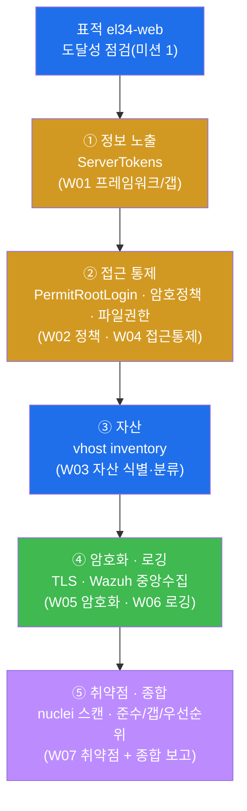
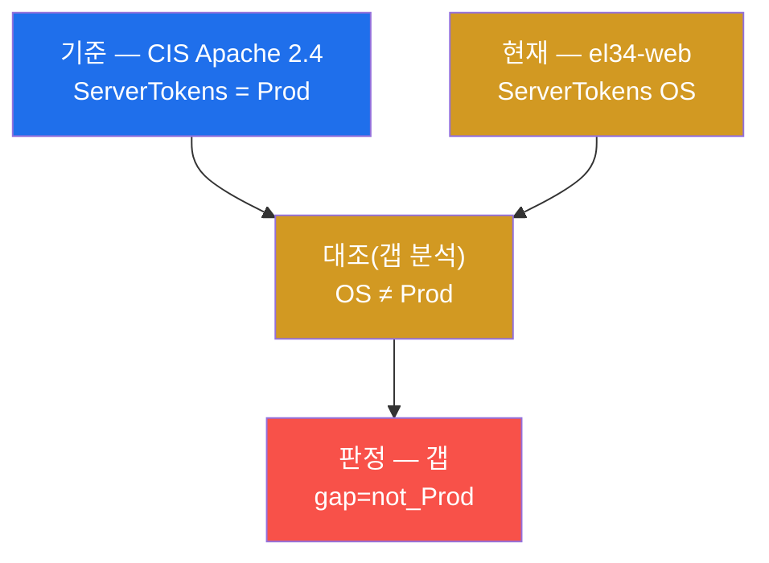
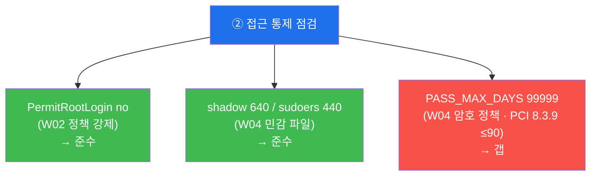
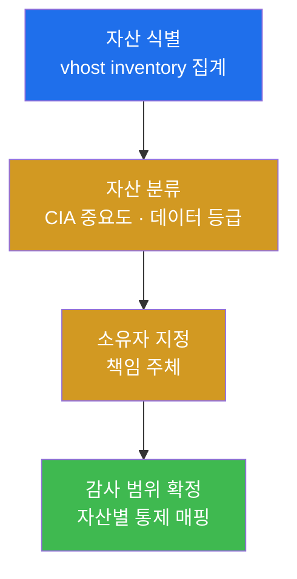
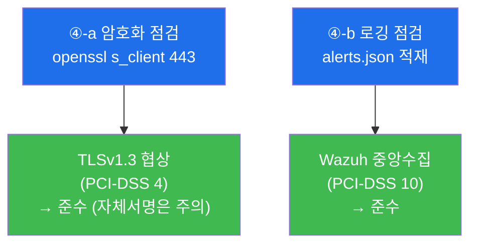
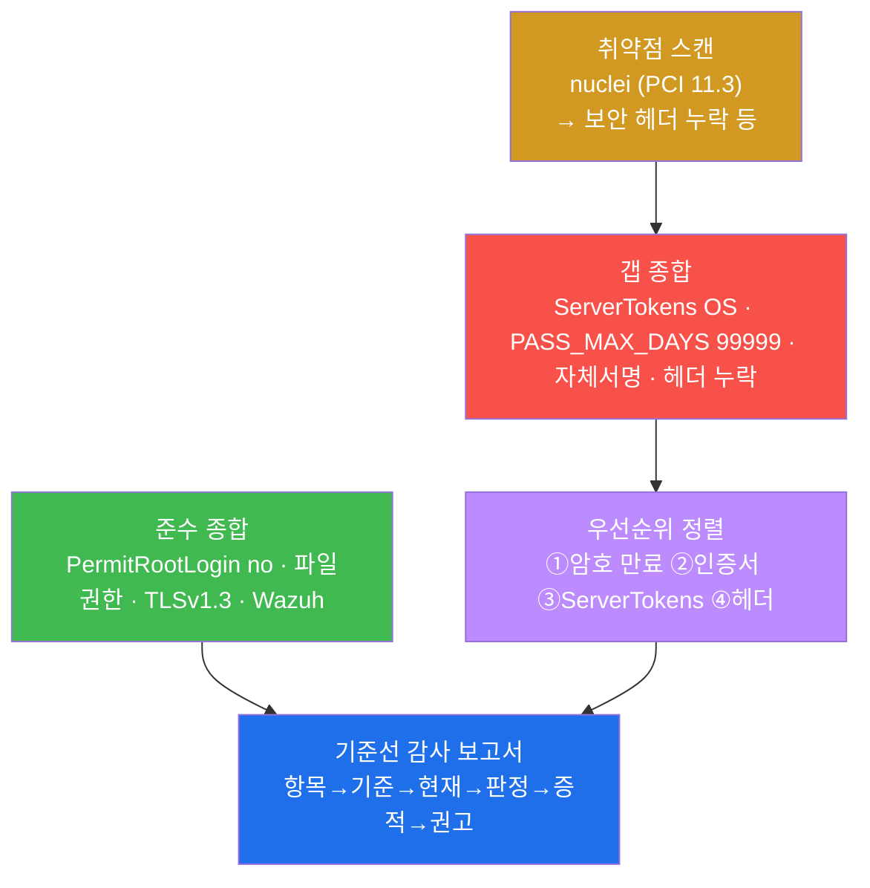
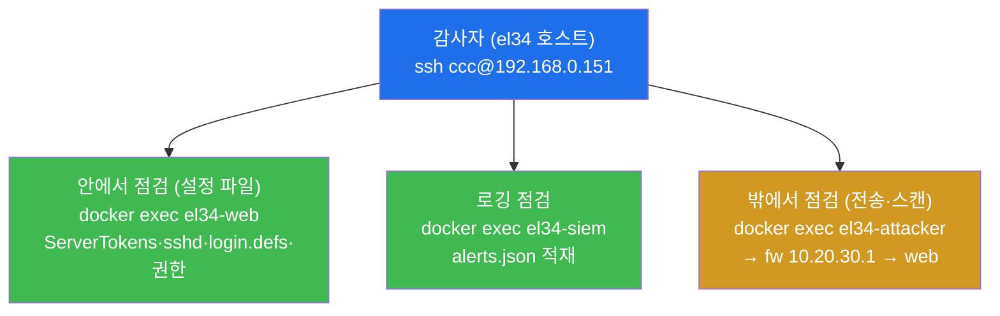
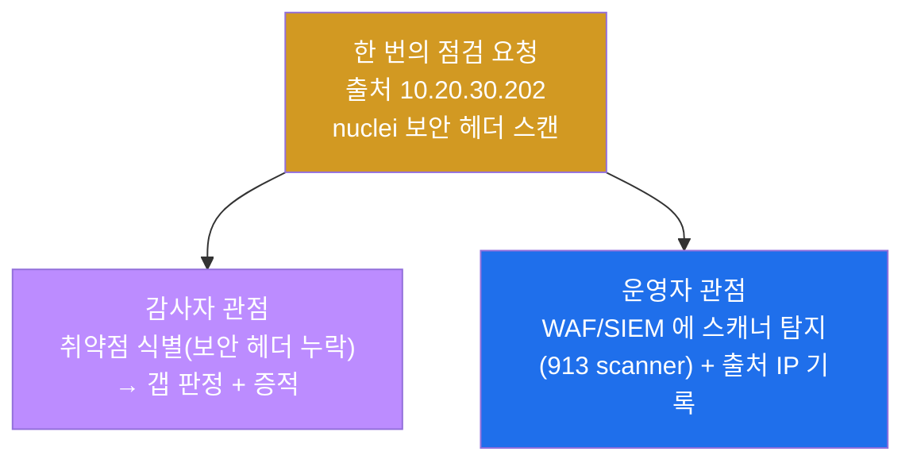
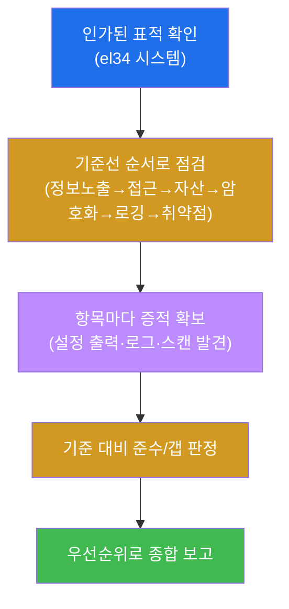
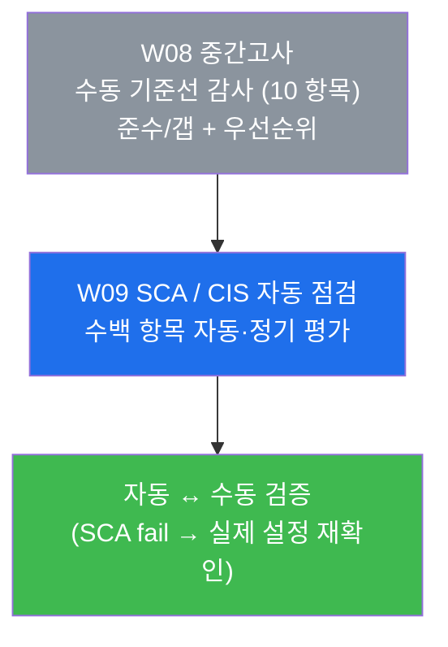

# 컴플라이언스 W08 — 중간고사: 한 시스템을 종합 기준선(Baseline)으로 끝까지 감사하기

> **본 주차의 한 줄 요약**
>
> 지난 7주 동안 학생은 컴플라이언스의 기둥을 **하나씩** 익혔다 — 프레임워크/갭 분석(W01) ·
> 정책/거버넌스(W02) · 자산 식별·분류(W03) · 접근통제(W04) · 암호화(W05) · 로깅/감사 추적(W06) ·
> 취약점 관리(W07). 중간고사는 이 7개 점검 역량을 **따로따로**가 아니라, **단 하나의 표적
> 시스템(`el34-web`)** 위에 올려놓고 **CIS Benchmark 기준선(baseline)의 한 바퀴**(정보 노출 → 접근 →
> 자산 → 암호화 → 로깅 → 취약점 → 종합)로 통합 적용한다. 학생은 한 명의 **감사자(auditor)** 가 되어
> 각 기준 항목을 **점검 → 준수/갭 판정 → 증적 확보 → 우선순위와 함께 종합 보고**까지 끝낸다.
>
> **감사자 한 줄 결론**: 컴플라이언스 감사는 "뚫리는가"가 아니라 **"합의된 기준을 지키는가, 그
> 증거는 무엇이며, 못 지킨 것(갭)은 무엇부터 고쳐야 하는가"를 문서로 입증**하는 일이다. 중간고사는
> 7주의 단편 점검을 **하나의 기준선 감사 보고서**로 꿰는 능력을 본다.

---

## 학습 목표

본 주차(중간 평가) 종료 시 학생은 다음 6가지를 **본인 손으로** 할 수 있어야 한다.

1. **CIS Benchmark 기준선(baseline) 감사**의 한 바퀴(정보 노출 → 원격 접근 → 자산 → 암호 정책 →
   파일 권한 → 암호화 → 로깅 → 취약점 → 종합)를 **단 하나의 표적 시스템(`el34-web`)** 에 처음부터
   끝까지 적용한다.
2. W01–W07 에서 배운 7개 점검 역량(프레임워크/갭 · 정책 강제 · 자산 인벤토리 · 접근통제 · 암호화 ·
   로깅 · 취약점 스캔)이 각각 **어느 프레임워크 조항**(CIS / PCI-DSS / ISMS-P)에 대응하는지 설명한다.
3. 각 점검 항목에서 **기준(요구치) ↔ 현재 상태**를 대조해 **준수(compliant) / 갭(gap)** 을 명확히
   판정하고, 그 판정을 뒷받침하는 **증적(설정 출력·로그)** 을 확보한다.
4. el34-web 의 실제 설정값(`ServerTokens` · `PermitRootLogin` · `PASS_MAX_DAYS` · 파일 권한 · TLS ·
   Wazuh 중앙 수집)을 점검해, 어느 것이 **준수**이고 어느 것이 **갭**인지를 증거로 보인다.
5. 감사 과정에서 던진 점검·스캔 요청이 **방어 측(WAF·SIEM)** 에 어떻게 보이는지(점검자/방어자 양면)를
   인지하고, **컴플라이언스 감사와 보안 운영이 같은 사건의 양면**임을 설명한다.
6. 발견한 준수·갭을 **위험 기반 우선순위(priority)** 로 정렬하고, **항목 → 기준 → 현재 → 판정 → 증적
   → 권고** 구조의 종합 기준선 감사 보고서를 작성한다.

> **중간고사의 시선** — 본 주차는 새 통제를 배우는 주가 아니라, 지금까지 배운 점검 기법을 **한 표적
> 위에서 기준선 감사라는 방법론으로 통합**하는 주다. 채점은 "갭을 찾았다"는 결과 선언이 아니라, **각
> 영역을 기준선 순서대로 점검하고 그 증적(설정 출력·로그)을 제시했는가**, 그리고 **준수/갭을 우선순위와
> 함께 종합 보고했는가**를 본다.

---

## 강의 시간 배분 (총 3시간 40분)

중간고사는 시험이지만, 본 강의 시간은 시험 직전의 **종합 복습 + 기준선 감사 방법론 정립 + 실기
평가**로 구성한다.

| 시간        | 내용                                                                          | 유형      |
|-------------|-------------------------------------------------------------------------------|-----------|
| 0:00–0:20   | 이론 — 감사자란 무엇인가, 왜 "기준선(baseline)"으로 감사하는가                 | 강의      |
| 0:20–0:55   | 이론 — 기준선 한 바퀴: 정보노출→접근→자산→암호화→로깅→취약점 + W01~W07 매핑    | 강의      |
| 0:55–1:05   | 휴식                                                                           | —         |
| 1:05–1:30   | 이론 — 표적 `el34-web` 의 구조 + 점검 경로(호스트 SSH + docker exec) 재확인     | 강의/토론 |
| 1:30–2:00   | 실기 — 점검(대상 도달) + ① 정보 노출(ServerTokens) (미션 1–2)                  | 시험      |
| 2:00–2:30   | 실기 — ② 원격 접근(PermitRootLogin) + 자산(vhost inventory) (미션 3–4)         | 시험      |
| 2:30–2:40   | 휴식                                                                           | —         |
| 2:40–3:10   | 실기 — ③ 암호 정책/파일 권한 + ④ 암호화(TLS)/로깅(Wazuh) (미션 5–8)            | 시험      |
| 3:10–3:30   | 실기 — 취약점 스캔(nuclei) + 기준선 종합 보고서(준수/갭/우선순위) (미션 9–10)  | 시험      |
| 3:30–3:40   | 정리 + 채점 기준 안내 + 다음 주차(W09 — SCA/CIS 자동 평가) 예고                | 정리      |

---

## 0. 용어 해설 (중간고사에서 다시 쓰는 핵심어)

본 주차는 W01–W07 의 용어를 종합한다. 처음 나오거나 시험에서 특히 중요한 용어를 다시 정리한다. 이미
앞 주차에서 정의한 용어라도, 중간고사에서 **이 의미로 쓴다**는 것을 분명히 하기 위해 다시 적는다.

| 용어 | 영문 | 뜻 | 비유 |
|------|------|----|------|
| **감사자** | auditor / assessor | 기준에 맞는지 점검하고 준수/갭을 증적과 함께 판정·보고하는 사람 | 건물 안전 점검을 의뢰받은 검사관 |
| **기준선** | baseline | 합의된 보안 설정의 최소 기준(이 선 아래로는 안 됨) | 건물이 통과해야 할 최소 안전 기준 |
| **CIS Benchmark** | Center for Internet Security Benchmark | OS/앱별로 합의된 보안 설정 항목을 모은 표준 점검 기준서 | 시설 종류별 표준 안전 점검 체크리스트 |
| **준수** | compliant | 점검 항목이 기준(요구치)을 충족한 상태 | 안전 기준을 통과한 항목 |
| **갭** | gap / non-compliant | 점검 항목이 기준에 **미달**한 상태(고쳐야 할 거리) | 기준 미달로 시정이 필요한 결함 |
| **증적** | evidence | 판정을 뒷받침하는 재현·추적 가능한 증거(설정 출력·로그) | 검사 결과를 입증하는 사진·기록 |
| **갭 분석** | gap analysis | 기준 ↔ 현재 상태를 대조해 미충족(갭)을 도출하는 작업 | 기준표와 실제를 한 줄씩 대조 |
| **우선순위** | priority | 갭을 위험도 기준으로 무엇부터 고칠지 정렬한 순서 | 결함 시정의 위험 등급순 작업 순서 |
| **ServerTokens** | — | Apache 가 응답 헤더에 제품·OS 정보를 얼마나 노출할지 결정하는 설정 | 건물 외벽에 붙은 설비 사양 안내판 |
| **PermitRootLogin** | — | SSH 로 root 가 직접 원격 로그인할 수 있는지 결정하는 설정 | 마스터키로 정문을 바로 여는 것의 허용 여부 |
| **PASS_MAX_DAYS** | — | 암호를 며칠 후 강제 만료(변경)시킬지 정하는 설정 | 출입증의 유효기간 |
| **TLS** | Transport Layer Security | 전송 구간 암호화 표준(HTTPS 의 보안 계층) | 봉인된 보안 우편 봉투 |
| **PCI-DSS** | Payment Card Industry Data Security Standard | 카드 결제 데이터 보호를 위한 12개 요구사항 표준 | 카드사가 요구하는 금고 규격서 |
| **ISMS-P** | 정보보호 및 개인정보보호 관리체계 | 한국의 정보보호·개인정보 관리체계 인증 기준 | 국가 공인 안전 관리체계 인증 |

> **헷갈리기 쉬운 한 쌍 — 준수(compliant) vs 갭(gap).** 중간고사에서 학생이 내리는 모든 판정은 이 둘
> 중 하나다. **준수**는 점검한 설정이 기준(요구치)을 **충족**한 상태다(예: `PermitRootLogin no` → 원격
> root 차단 기준 충족). **갭**은 기준에 **미달**한 상태다(예: `ServerTokens OS` → CIS 의 `Prod` 요구
> 미달). 핵심은 **판정에는 반드시 두 가지가 붙는다**는 것 — (1) "기준이 무엇인가"(예: CIS Prod, PCI
> ≤90일)와 (2) "현재가 무엇인가"(증적). 기준 없이 "안 좋아 보인다"는 감사가 아니다.
>
> **헷갈리기 쉬운 또 한 쌍 — 감사자 관점 vs 보안 운영 관점.** 중간고사에서 학생은 두 모자를 번갈아
> 쓴다. **감사자(컴플라이언스)** 관점에서는 설정을 점검해 기준 대비 준수/갭을 **판정**한다(예:
> ServerTokens 갭). 같은 점검을 **보안 운영(방어 측)** 관점에서 보면, 감사 중 던진 스캔 요청이
> WAF(ModSecurity)·SIEM(Wazuh)에 **흔적으로 남는다**(미션 9). 같은 한 번의 점검이 감사자에게는 "갭
> 판정"이고 운영자에게는 "탐지 로그"다 — 이 양면을 모두 말할 수 있어야 종합 감사를 체득한 것이다.

---

## 1. 왜 단편 점검이 아니라 "기준선(baseline)"으로 감사하는가

### 1.1 한 줄 답: 감사는 빠짐없이·재현 가능하게·증거와 함께 해야 한다

W01–W07 에서 학생은 통제를 **영역별로** 배웠다 — 프레임워크, 정책, 자산, 접근통제, 암호화, 로깅,
취약점. 하지만 실무에서 한 시스템을 감사하라는 의뢰를 받으면, 이 점검들을 **아무 순서로 무작위로**
던지는 것이 아니라 **정해진 기준선(baseline)으로 빠짐없이** 한 바퀴 돈다. 그 이유는 세 가지다.

- **누락 방지.** 절차가 없으면 암호 정책은 봤는데 로깅을 빼먹는 식의 구멍이 생긴다. 기준선(CIS
  Benchmark 같은 항목 목록)은 점검 대상을 항목으로 나눠 빠짐없이 훑게 한다. 감사에서 "점검 안 한
  영역"은 곧 "보장되지 않은 영역"이다.
- **재현 가능성.** 같은 시스템을 다른 감사자가 점검해도 같은 기준선이면 같은 판정에 도달한다. 감사는
  1 회성 인상(印象)이 아니라 **반복 가능한 공정**이어야 한다. 그래야 작년 감사와 올해 감사를 비교해
  "갭이 줄었는가"를 추적할 수 있다.
- **증거 중심.** 기준선 감사는 각 판정을 "기준은 이것 → 현재는 이것(증적) → 따라서 준수/갭"의 형태로
  기록하게 한다. 보고서의 신뢰는 감사자의 주장이 아니라 **재현 가능한 증적**에서 나온다(W01 §6 의
  증적 원칙).

> **용어 — 기준선(baseline)과 CIS Benchmark.** **기준선(baseline)** 은 "이 선 아래로는 안 된다"는
> 합의된 최소 보안 설정 수준이다. 그 기준선을 구체적인 항목 목록으로 정리한 대표적 표준이 **CIS
> Benchmark**(Center for Internet Security 가 OS·앱별로 펴내는 보안 설정 점검 기준서)다. 예를 들어 CIS
> Apache 2.4 Benchmark 는 "ServerTokens 는 Prod 로 설정하라" 같은 수백 개 항목을 담는다. 기준선
> 감사 = 이 항목 하나하나에 대해 **현재 상태를 점검 → 준수/갭 판정 → 증적 확보**하는 일이다.

### 1.2 7주를 한 표적으로 — 기준선 한 바퀴의 지도

중간고사는 W01–W07 의 점검을 **기준선의 순서**로 재배치해 `el34-web` 한 대에 적용한다. 다음이 시험
전체의 지도다.



이 지도가 중간고사 lab 10 미션의 골격이다. **정보 노출**로 표면을 훑고(W01), **접근 통제**(원격
로그인·암호 정책·파일 권한)를 점검하고(W02·W04), **자산**을 집계해 감사 범위를 확정하고(W03),
**암호화·로깅**의 기본 통제를 확인한 뒤(W05·W06), 마지막에 **취약점 스캔과 종합 보고**로 준수/갭을
우선순위와 함께 마무리한다(W07). 미션의 순서는 lab 의 `order` 와 1:1 로 대응한다.

### 1.3 "왜 중요한가" — 단편 점검이 놓치는 것

실제 침해의 상당수는 **하나의 치명적 결함**이 아니라 **여러 사소한 갭의 연쇄**에서 비롯된다. el34-web
으로 예를 들면, 암호 만료 정책 갭(`PASS_MAX_DAYS 99999`) 하나만 봐도 위험하지만, 거기에 **제품·OS
정보 노출**(ServerTokens 갭)과 **자체서명 인증서**(암호화 신뢰 갭)가 더해지면, 공격자는 표적의
소프트웨어 버전을 알아내고(정보 노출) → 그에 맞는 취약점을 골라(취약점) → 만료되지 않는 자격으로
무기한 발판을 유지한다(암호 정책). 단편 점검은 이 중 하나만 보고 끝나기 쉽지만, 기준선 종합 감사는
**여러 영역을 한 바퀴 돌며 갭의 조합**을 드러낸다 — 이것이 중간고사가 "하나의 시스템을 끝까지"
감사하게 하는 이유다.

또한 종합 감사는 **준수도 함께 본다**. el34-web 은 `PermitRootLogin no`(원격 root 차단), 적절한 파일
권한(shadow 640/sudoers 440), TLSv1.3, Wazuh 중앙 수집처럼 **이미 기준을 충족한 통제**도 갖고 있다.
감사 보고서는 갭만 나열하는 것이 아니라 "무엇이 잘 되어 있고(준수), 무엇이 부족한가(갭)"를 함께
제시해야 의뢰인이 현재 보안 수준의 전체 그림을 본다.

### 1.4 한계 — 이 시험이 다루지 않는 것

본 중간고사는 W01–W07 의 범위 안에서 종합을 평가한다. 따라서 **W09 이후에 배울 내용**(SCA/CIS 자동
점검, 변경관리·FIM, 사고 대응, 백업·BCP/DR, 제3자 위험 같은 심화 통제)은 본격적인 평가 대상이
아니다. 또한 본 시험은 **수동 기준선 감사**다 — W08 의 모든 점검은 학생이 직접 명령을 던져 설정을
확인하고 판정한다. 이 수동 점검을 **자동·정기 수행**하는 도구(Wazuh SCA)는 바로 다음 주차 W09 의
주제다. 마지막으로, 본 시험은 **인가된 표적**만을 대상으로 한다 — el34 의 정해진 시스템(`el34-web`
등)에 대해서만 감사하며, 그 밖의 어떤 시스템에도 같은 점검을 시도해서는 안 된다(§8 감사 수칙).

---

## 2. 기준선 한 바퀴 — 감사 5 단계 상세

이번 시험의 시나리오는 한 감사자가 `el34-web` 을 기준선 순서로 한 바퀴 점검하는 것이다. 명령은 el34
호스트(`ssh ccc@192.168.0.151`, 비밀번호 1)에 접속한 뒤 `docker exec el34-web`(설정 점검) 또는
`docker exec el34-attacker`(전송 암호화·취약점 스캔)로 실행한다. 각 단계마다 **한 줄 정의 → 무엇을
점검하나 → el34 에서 어떻게 보이나(준수/갭) → 한계**의 4축으로 설명한다.

> **왜 docker exec 인가.** el34 의 모든 보안 컨테이너는 타깃 VM(192.168.0.151) 한 대 위에서 돈다.
> 감사자는 호스트에 SSH 로 들어간 뒤 `docker exec` 로 점검 대상 컨테이너에 진입해 설정 파일·로그를
> 직접 읽는다. 신규 도구 설치는 없으며, 기존 OS 명령(`grep`/`stat`/`openssl`)과 컨테이너에 이미 깔린
> 도구(`nuclei`)만 쓴다.

### 2.1 ① 정보 노출 — ServerTokens (W01: 프레임워크·갭 분석)

**한 줄 정의.** 정보 노출 점검은 시스템이 외부에 **불필요한 내부 정보**(제품명·버전·OS)를 흘리고
있는지 보는 단계다.

**무엇을 점검하나.** Apache 의 `ServerTokens` 설정값을 읽어, 응답 헤더에 어디까지 노출되는지 확인한다.
`ServerTokens` 는 5 단계로 설정할 수 있다 — `Full`(가장 많이 노출) → `OS`(제품+OS) → `Minor` →
`Minimal` → `Prod`(제품명만, 가장 적게 노출). CIS Apache 2.4 Benchmark 는 **`Prod`** 를 요구한다.

> **용어 — ServerTokens.** Apache 가 HTTP 응답의 `Server:` 헤더와 에러 페이지에 자신의 정보를 얼마나
> 보여줄지 정하는 설정이다. `OS` 면 `Apache/2.4.52 (Ubuntu)` 처럼 **제품 버전과 OS** 가 그대로 드러난다.
> 공격자는 이 버전 정보로 표적에 맞는 알려진 취약점(CVE)을 고른다. 그래서 정보 최소화 원칙(공격자에게
> 단서를 주지 않는다)에 따라 CIS 는 제품명만 노출하는 `Prod` 를 권고한다.

**el34 에서 어떻게 보이나 — 갭.** el34-web 의 `ServerTokens` 는 **`OS`** 로 설정되어 있다. CIS 가
요구하는 `Prod` 에 미달하므로 **갭(`gap=not_Prod`)** 으로 판정한다. 이것은 W01 에서 처음 만난 그
갭이며, 중간고사에서 기준선 감사의 첫 항목으로 다시 점검한다.



**한계.** ServerTokens 정보 노출은 그 자체로 시스템을 직접 무너뜨리지 않는 **낮은~중간 위험**의 갭이다.
하지만 공격자에게 표적의 버전을 알려줘 **다음 공격의 정찰을 쉽게** 만드는 단서이므로, 우선순위는
낮더라도 시정 대상으로 보고한다.

### 2.2 ② 접근 통제 — 원격 접근·암호 정책·파일 권한 (W02 정책 · W04 접근통제)

**한 줄 정의.** 접근 통제 점검은 "누가 어떻게 시스템에 접근하고, 그 자격이 안전하게 관리되는가"를
보는 단계로, 본 시험에서 **세 항목**(원격 root 로그인 · 암호 만료 · 민감 파일 권한)을 함께 다룬다.

**무엇을 점검하나.**

- **원격 접근(PermitRootLogin).** `sshd_config` 의 `PermitRootLogin` 값을 읽어 root 가 SSH 로 직접
  원격 로그인할 수 있는지 본다. 정책("원격 root 직접 로그인 금지", W02)이 **실제로 설정으로
  강제**되는지를 확인하는 것이다. 기준은 `no`(차단).
- **암호 정책(PASS_MAX_DAYS).** `/etc/login.defs` 의 `PASS_MAX_DAYS` 를 읽어 암호 강제 만료 주기를
  본다. PCI-DSS 8.3.9 / CIS 는 **≤90일**을 권고한다. 값이 `99999` 면 사실상 **무기한(만료 없음)** 이다.
- **파일 권한(shadow/sudoers).** `/etc/shadow`(암호 해시)와 `/etc/sudoers`(권한 상승 규칙)의 권한
  비트를 `stat` 으로 읽는다. shadow 는 640(또는 600), sudoers 는 440 이 CIS 기준이다. shadow 가
  world-readable(644)이면 누구나 해시를 읽어가는 치명적 갭이다.

> **용어 — PermitRootLogin / PASS_MAX_DAYS / stat.** **`PermitRootLogin no`** 는 root 의 직접 SSH
> 로그인을 막아, 침입자가 곧장 최고 권한으로 들어오는 경로를 차단한다(대신 일반 계정 로그인 후 sudo
> 경유). **`PASS_MAX_DAYS`** 는 암호 유효기간(일)으로, 만료가 없으면 한 번 유출된 암호가 무기한
> 악용된다. **`stat -c '%a' <파일>`** 은 파일의 권한을 8진수 3자리(예: `640`)로 출력하는 명령으로,
> 민감 파일이 과도하게 열려 있는지 확인하는 표준 방법이다.

**el34 에서 어떻게 보이나 — 준수 2 + 갭 1.** el34-web 의 세 항목은 판정이 갈린다.

- **PermitRootLogin no → 준수.** 원격 root 직접 로그인이 차단되어 있다. 정책이 설정으로 강제된
  대표적 준수 사례(W02).
- **shadow 640 / sudoers 440 → 준수.** 민감 파일이 CIS 기준대로 보호되어 있다(W04).
- **PASS_MAX_DAYS 99999 → 갭.** 암호가 사실상 무기한이라 PCI-DSS 8.3.9(≤90일) 미달이다(`gap=no_expiry`).
  계정 보호 측면에서 **우선순위가 높은 갭**이다.



**한계.** 설정값 점검은 "정책이 설정으로 강제됐는가"까지를 보장한다. 실제 운영에서 누가 root 로 무엇을
했는지, 만료된 계정이 제때 정리되는지 같은 **운영 실태**는 로그·인터뷰(W01 의 3축 방법론)로 보완해야
완전한 접근통제 감사가 된다.

### 2.3 ③ 자산 — vhost inventory (W03: 자산 식별·분류)

**한 줄 정의.** 자산 점검은 "보호해야 할 대상이 무엇이고 몇 개인가"를 집계해 **감사의 범위(scope)를
확정**하는 단계다.

**무엇을 점검하나.** `el34-web` 의 Apache 가 서비스하는 **vhost(가상 호스트) 목록**을 집계한다(W01
§0.5.3 에서 정의한 그 vhost). 각 vhost 는 하나의 웹 자산이며, 자산마다 중요도(CIA)·소유자·통제 수준이
매핑되어야 한다. 모르는 것은 지킬 수 없으므로, 자산 인벤토리는 모든 감사의 출발점이다(W03).

> **용어 — 자산 인벤토리(asset inventory)와 vhost.** **자산 인벤토리**는 보호 대상(서버·서비스·계정·
> 데이터)을 빠짐없이 등록한 대장(臺帳)이다. el34-web 의 경우 Apache 가 `Host:` 헤더로 구분해 서비스하는
> 여러 **vhost**(`juice.el34.lab`, `dvwa.el34.lab`, `siem.el34.lab` 등)가 각각 하나의 웹 자산이다.
> "있는 줄 몰랐던 자산"(shadow IT, 방치 서비스)이 가장 위험하므로, 감사는 먼저 자산 수를 센다.

**el34 에서 어떻게 보이나.** `ls /etc/apache2/sites-enabled/ | wc -l` 로 활성 vhost 수를 집계한다.
이 수가 곧 감사 범위의 웹 자산 개수이며, 각 자산에 W03 의 분류(중요도·데이터 등급)와 통제를 매핑한다.



**한계.** 자산 수를 세는 것은 시작일 뿐이다. 진짜 자산 관리는 각 자산에 **소유자·중요도·데이터
분류·통제 수준**을 부여하고 최신성을 유지(CMDB)하는 것이다. 본 시험에서는 인벤토리 집계(범위 확정)
까지를 점검하고, 분류·통제 매핑은 보고서에서 설명으로 제시한다.

### 2.4 ④ 암호화 · 로깅 — TLS · Wazuh 중앙수집 (W05 암호화 · W06 로깅)

**한 줄 정의.** 이 단계는 데이터의 **전송 구간 보호**(암호화)와 **사후 추적 가능성**(로깅)이라는 두
기본 통제가 동작하는지를 함께 확인한다.

**무엇을 점검하나.**

- **암호화(TLS).** `openssl s_client` 로 HTTPS(443) 핸드셰이크를 맺어 협상된 프로토콜 버전을 본다.
  PCI-DSS 요구사항 4 는 전송 구간 암호화를 의무화하며, 기준은 **TLS1.2 이상**(TLS1.0/1.1 은 폐기
  대상). 이 점검은 표적의 외부 진입점인 fw 게이트웨이(`10.20.30.1:443`)에 `Host` 헤더(servername)를
  지정해 수행한다.
- **로깅(Wazuh 중앙수집).** `el34-siem`(Wazuh manager)의 알림 적재 파일(`/var/ossec/logs/alerts/
  alerts.json`)에 이벤트가 쌓이는지 확인한다. PCI-DSS 요구사항 10 은 모든 접근에 **감사 추적(audit
  trail)** 을, 그리고 그 로그의 **중앙 수집**을 요구한다. 중앙 수집은 로그 변조·삭제 방지와 통합
  모니터링의 전제다(W06).

> **용어 — TLS / openssl s_client / Wazuh.** **TLS(Transport Layer Security)** 는 HTTPS 의 암호화
> 계층으로, 도청·변조로부터 전송 데이터를 보호한다. **`openssl s_client -connect <ip:443> -servername
> <vhost>`** 는 명령줄에서 TLS 핸드셰이크를 직접 맺어 협상된 프로토콜(`Protocol:`)·암호군(`Cipher:`)을
> 보여주는 점검 도구다. **Wazuh** 는 el34 의 SIEM(로그 중앙 수집·상관·알림 플랫폼)으로, IPS·web 의
> 로그를 한 곳(`alerts.json`)에 모아 통합 감사·모니터링을 가능하게 한다.

**el34 에서 어떻게 보이나 — 준수(주의 1건).**

- **TLSv1.3 → 준수.** el34 는 TLS1.3 으로 협상되어 PCI-DSS 4(강한 전송 암호화)를 충족한다.
  다만 인증서가 **자체서명(self-signed)** 이라 신뢰 체인이 없다 — 학습 환경이라 준수로 보지만, 실제
  운영이라면 신뢰된 CA 인증서로 교체해야 할 **주의(갭) 사항**이다(W05/W10 연계).
- **Wazuh 중앙수집 → 준수.** `alerts.json` 에 이벤트가 적재되어 PCI-DSS 10(감사 추적·중앙 수집)을
  충족한다.



**한계.** 프로토콜 버전이 TLS1.2+ 라는 것이 곧 "전송 암호화 완벽"은 아니다 — 인증서 신뢰성·약한
cipher 차단·HSTS 같은 항목을 함께 봐야 한다(W05). 로깅도 "적재된다"가 끝이 아니라 **무결성(변조
방지)·보존 기간(PCI 최소 1년)·시간 동기화(NTP)** 까지 보장되어야 완전하다(W06). 본 시험은 핵심 한
항목씩으로 통제의 존재를 확인하고, 나머지는 보고서에서 짚는다.

### 2.5 ⑤ 취약점 · 종합 — nuclei 스캔 · 준수/갭/우선순위 (W07 취약점 + 종합 보고)

**한 줄 정의.** 마지막 단계는 **알려진 취약점을 정기 스캔으로 식별**하고(W07), 앞의 모든 점검 결과를
**준수/갭으로 종합해 우선순위와 함께 보고**하는 단계다.

**무엇을 하나.**

- **취약점 스캔(nuclei).** `nuclei` 로 표적에 알려진 취약점·구성 오류(예: 보안 헤더 누락)를 자동
  스캔한다. PCI-DSS 11.3 은 **정기(분기별)·변경 후** 스캔을 의무화한다. 한 번 점검으로 끝나지 않고
  "식별 → 평가(CVSS) → 조치(패치) → 재검증"의 순환을 도는 것이 취약점 관리다(W07).
- **종합 보고.** 미션 1–9 의 판정을 **준수 항목 / 갭 항목 / 우선순위**로 묶는다. 갭은 위험도 기준으로
  무엇부터 고칠지 정렬한다.

> **용어 — nuclei / 보안 헤더.** **nuclei** 는 템플릿 기반 취약점 스캐너로, 미리 정의된 점검
> 템플릿(`.yaml`)을 표적에 던져 알려진 취약점·구성 오류를 빠르게 찾는다. 본 시험에서는 보안 헤더 누락
> 템플릿을 쓴다. **보안 헤더(security headers)** 는 `X-Frame-Options`·`Content-Security-Policy` 등
> 브라우저에 보안 동작을 지시하는 응답 헤더로, 누락 시 클릭재킹·XSS 등의 방어가 약해진다.

**el34 에서 어떻게 보이나.** nuclei 스캔으로 보안 헤더 누락 등의 발견이 나온다(`findings=<n>`).
종합 보고서는 다음과 같이 정리된다.



**우선순위는 위험으로 정한다.** 갭을 나열만 하면 "무엇부터 고칠지" 알 수 없다. 위험도(계정 보호
영향이 큰 것부터)로 정렬하면 — ① **암호 만료 정책**(만료 없는 자격은 유출 시 무기한 악용, 계정 보호
직결) → ② **자체서명 인증서 교체**(전송 신뢰) → ③ **ServerTokens Prod**(정보 노출 축소) → ④ **보안
헤더 추가**(브라우저 방어) 순이 된다.

**한계.** 본 시험의 취약점 스캔은 "정기 스캔으로 식별까지"다. 그 결과를 CVSS 로 정밀 평가하고 패치
SLA(Critical 즉시 ~ Low 계획적)로 관리하는 전체 순환은 W07 의 주제이고, 자동·정기 구성 평가(SCA)는
W09 의 주제다. 종합 보고서도 "준수/갭/우선순위"의 골격까지이며, 실무 보고서는 각 갭에 시정 계획·담당·
기한을 더한다.

---

## 3. 표적 `el34-web` 의 구조와 감사 점검 경로

중간고사의 표적은 el34 의 **web 컨테이너**다. 이 시스템이 무엇이고 왜 감사의 표적인지, 그리고 점검
명령이 el34 안에서 어떤 경로로 흐르는지 이해해야 "어느 증적이 어디서 나오는가"를 추적할 수 있다.

### 3.1 왜 `el34-web` 이 기준선 감사의 표적인가

`el34-web` 은 el34 4-tier 의 **dmz 계층**에 있는 Apache + ModSecurity 컨테이너로(W01), L7 vhost
라우팅과 WAF 를 함께 담당하는 **가장 표면이 넓은 시스템**이다. 외부 트래픽이 반드시 거치는 길목이라,
이 한 대에 컴플라이언스의 모든 영역(웹 설정·계정·암호 정책·파일 권한·로깅 에이전트)이 응축되어 있다.
그래서 W01–W07 의 점검 거리가 대부분 이 한 시스템에서 나오며, 중간고사의 종합 기준선 감사 표적으로
적합하다.

단, **암호화(TLS)와 취약점 스캔**은 표적의 **외부에서** 보는 점검이라, web 컨테이너 내부가 아니라
점검자 컨테이너(`el34-attacker`)에서 fw 게이트웨이(`10.20.30.1`)를 향해 수행한다. 즉 같은 표적을
**안에서(설정 파일)** 와 **밖에서(전송·스캔)** 양쪽으로 점검한다.

### 3.2 점검 요청의 경로 — 안에서 보기 vs 밖에서 보기



감사자는 호스트(`192.168.0.151`)에 한 번 들어간 뒤, 점검 성격에 따라 진입 컨테이너를 바꾼다 —
설정·권한은 `el34-web` 안에서 직접 읽고(증적이 설정 파일에서 나옴), 로깅은 `el34-siem` 에서, 전송
암호화·취약점 스캔은 `el34-attacker` 에서 fw 를 통해 표적의 공개 면(`10.20.30.1`)을 본다. el34 의
fw 는 SNAT 를 하지 않으므로, attacker(`10.20.30.202`)에서 보낸 스캔 요청의 **출처 IP 가 web 의
로그·WAF audit 에 그대로 보존**된다 — 이것이 §4 의 "감사자/운영자 양면"으로 이어진다.

el34 의 4-tier 세그먼트는 `ext 10.20.30` / `pipe 10.20.31` / `dmz 10.20.32` / `int 10.20.40` 이며,
점검자(ext .202) → fw(ext .1) → web(dmz .80) 경로로 흐른다(W01 토폴로지 복습).

---

## 4. 감사자 관점과 운영자 관점 — 한 점검의 두 얼굴

종합 감사의 정점은 **같은 한 번의 점검이 감사자에게는 '갭 판정'이고 운영자(방어 측)에게는 '탐지
로그'** 임을 이해하는 것이다. 예를 들어 미션 9 에서 attacker 가 web 에 보낸 nuclei 스캔 요청 하나는
두 관점에서 다음과 같이 보인다.



| 관점 | 무엇을 보나 | 핵심 단서 |
|------|-------------|----------|
| 감사자(컴플라이언스) | 점검 결과로 기준 대비 준수/갭 판정 | 설정값·응답·스캔 발견 → 준수/갭 + 증적 |
| 운영자(보안 운영) | 점검 요청이 방어 측에 남긴 흔적 | WAF CRS 룰 번호(913 scanner 등) + 출처 IP |

이 양면을 함께 볼 수 있으면, 감사 보고서에 "이 갭은 이렇게 점검해 판정했고, 그 점검 자체는 방어
측(WAF·SIEM)에 이렇게 탐지되더라"까지 적을 수 있다 — 이것이 단순 체크리스트 점검을 넘어 **보안 운영과
연결되는 감사자**의 시야다. 같은 출처 IP(`10.20.30.202`)가 두 관점을 한 사건으로 묶는다는 점은
secuops/soc 트랙의 상관 분석과도 이어진다.

---

## 5. 판단 프레임워크 — "이 항목은 어느 기준·무엇·준수/갭·우선순위"

중간고사의 가장 중요한 능력은 점검 항목을 만났을 때 **그것이 W01–W07 의 어느 영역이고, 어느 프레임워크
조항이며, 준수인가 갭인가, 우선순위는 얼마인가**를 즉시 자리매김하는 것이다. 다음 표가 그 판단의
정답지이며, lab 10 미션의 순서와 1:1 로 대응한다.

| 미션 | 점검 항목 | 대응 W주차 | 기준(프레임워크 조항) | el34-web 현재 | 판정 | 우선순위 |
|------|-----------|-----------|----------------------|--------------|------|----------|
| 1 | 대상 도달 | — | (점검 전제) | `el34-web` 접근 | (전제) | — |
| 2 | 정보 노출 ServerTokens | W01 | CIS Apache 2.4 = Prod | `OS` | **갭** | ③ |
| 3 | 원격 접근 PermitRootLogin | W02 | CIS SSH = no | `no` | 준수 | — |
| 4 | 자산 vhost inventory | W03 | ISMS-P 2.1 자산 식별 | vhost 집계 | 범위 확정 | — |
| 5 | 암호 정책 PASS_MAX_DAYS | W04 | PCI-DSS 8.3.9 ≤90 | `99999` | **갭** | **①** |
| 6 | 파일 권한 shadow/sudoers | W04 | CIS = 640/440 | 640/440 | 준수 | — |
| 7 | 암호화 TLS | W05 | PCI-DSS 4 = TLS1.2+ | TLSv1.3 | 준수(자체서명 주의) | ② |
| 8 | 로깅 Wazuh 중앙수집 | W06 | PCI-DSS 10 = 중앙 수집 | 적재됨 | 준수 | — |
| 9 | 취약점 스캔 nuclei | W07 | PCI-DSS 11.3 정기 스캔 | 헤더 누락 등 | **갭** | ④ |
| 10 | 기준선 종합 보고 | (종합) | 준수/갭/우선순위 | 종합 | 산출물 | — |

이 표를 읽는 법은 네 방향이다. **"어디서 배웠나"**(W주차) — 시험은 전 주차를 한 표적에 모은다.
**"어느 기준인가"**(프레임워크 조항) — 판정에는 항상 근거 기준이 붙는다. **"준수인가 갭인가"**(판정)
— 기준 대비 현재 상태의 대조 결과다. **"무엇부터 고치나"**(우선순위) — 갭을 위험순으로 정렬한다. 네
방향을 모두 말할 수 있으면 종합 기준선 감사의 판단력을 갖춘 것이다.

> **시험의 채점 포인트.** 각 항목을 기준선 순서로 점검하고, 그 **증적**(설정값·로그·스캔 발견)을
> 제시하며, **준수/갭을 기준과 함께 판정**하고, 마지막에 **갭을 우선순위로 종합 보고**하는 것. "갭이
> 있다"는 선언이 아니라 **기준 + 현재 + 증적**의 삼박자가 점수다.

---

## 6. 점검 명령 빠른 복습 — "무엇을 어디서 보나"

시험에서 각 항목을 점검하는 핵심 명령을 한 번에 정리한다. 모든 명령은 el34 호스트(`ssh
ccc@192.168.0.151`, 비밀번호 1)에서 `docker exec` 로 실행하며, 신규 도구 설치는 없다.

> **용어 — grep / 판정 관용구.** 본 시험의 점검은 대부분 "설정을 `grep` 으로 읽고 → 기준값과 비교해
> `compliant` 또는 `gap=...` 을 출력"하는 형태다. lab 의 명령은 이 판정을 셸 한 줄로 자동화해 두었다
> (예: `... && echo compliant || echo gap=...`). 학생은 출력에 `compliant` 가 나오는지 `gap=` 이
> 나오는지로 판정 결과를 읽는다.

### 6.1 정보 노출 (ServerTokens — W01)

```bash
docker exec el34-web sh -c 'V=$(grep -rhiE "^[[:space:]]*ServerTokens" /etc/apache2/ 2>/dev/null | head -1); echo "current:$V"; echo "$V" | grep -qi "Prod" && echo "compliant" || echo "gap=not_Prod"'
```

무엇을 보나 — `current:` 뒤의 실제 설정값과 판정. el34-web 은 `OS` 라 `gap=not_Prod`(CIS Prod 미달).

### 6.2 접근 통제 (PermitRootLogin · PASS_MAX_DAYS · 파일 권한 — W02·W04)

```bash
# 원격 root 로그인 (준수 기대)
docker exec el34-web sh -c 'V=$(grep -iE "^PermitRootLogin" /etc/ssh/sshd_config 2>/dev/null); echo "$V"; echo "$V" | grep -qi "no" && echo "compliant=rootlogin_off" || echo "gap"'
# 암호 만료 (갭 기대)
docker exec el34-web sh -c 'V=$(grep "^PASS_MAX_DAYS" /etc/login.defs | tr -dc "0-9"); echo "max_days=$V"; [ "$V" -gt 90 ] 2>/dev/null && echo "gap=no_expiry" || echo "compliant"'
# 민감 파일 권한 (준수 기대)
docker exec el34-web sh -c 'stat -c "%n %a" /etc/shadow /etc/sudoers'
```

무엇을 보나 — PermitRootLogin `no`(준수), PASS_MAX_DAYS `99999`(갭, PCI 8.3.9 미달), shadow 640 /
sudoers 440(준수).

### 6.3 자산 인벤토리 (vhost — W03)

```bash
docker exec el34-web sh -c 'echo "assets=$(ls /etc/apache2/sites-enabled/ 2>/dev/null | wc -l)"'
```

무엇을 보나 — 활성 vhost 수 = 감사 범위의 웹 자산 개수.

### 6.4 암호화 · 로깅 (TLS · Wazuh — W05·W06)

```bash
# 전송 암호화 (attacker 에서 fw 게이트웨이로)
docker exec el34-attacker sh -c "echo | openssl s_client -connect 10.20.30.1:443 -servername neobank.el34.lab 2>/dev/null | grep -iE 'Protocol|Cipher' | head -2"
# 로깅 중앙 수집 (siem 에서)
docker exec el34-siem sh -c 'tail -1 /var/ossec/logs/alerts/alerts.json 2>/dev/null | head -c 60; echo; echo siem_ingest_ok'
```

무엇을 보나 — `Protocol: TLSv1.3`(PCI 4 준수), `alerts.json` 적재(PCI 10 준수).

### 6.5 취약점 스캔 (nuclei — W07)

```bash
docker exec el34-attacker sh -c "nuclei -u http://10.20.30.1 -H 'Host: juice.el34.lab' -t /root/nuclei-templates/http/misconfiguration/http-missing-security-headers.yaml -silent -nc 2>/dev/null | head -4"
```

무엇을 보나 — 보안 헤더 누락 등 발견. PCI-DSS 11.3(정기 스캔)의 한 회차.

---

## 7. 실습 안내 — 중간고사 lab 10 미션 (4 축 설명)

중간고사 실습은 10 미션으로 구성된다. 각 미션을 **4 축**으로 설명한다 — 왜 하는가 / 무엇을 알 수
있는가 / 결과 해석(준수 vs 갭) / 실전 활용. 미션은 기준선 한 바퀴를 따라 점검(도달성) → ① 정보 노출 →
② 접근(원격 로그인) → 자산 → 암호 정책/권한 → ④ 암호화/로깅 → 취약점 → 종합 보고 순서로 흐르며,
lab 의 `order` 와 1:1 로 대응한다.

> **시험 진행 원칙.** 모든 명령은 el34 호스트(`ssh ccc@192.168.0.151`)에서 `docker exec
> el34-web`(설정 점검) / `el34-siem`(로깅) / `el34-attacker`(전송·스캔)로. 각 미션은 **독립적**이며,
> **인가된 표적(el34)** 만 감사한다. 합격 임계값은 0.7 이다.

### 미션 1 — 점검: 표적 `el34-web` 에 도달하나 (8점)

> **왜 하는가?** 감사의 전제는 표적에 접근이 된다는 것이다. 감사자는 본격 점검 전 항상 대상의
> 도달성부터 확인한다(접근이 안 되면 모든 음성 결과가 무의미하다).
>
> **무엇을 알 수 있는가?** `docker exec el34-web` 으로 hostname 이 응답하는지 — 기준선 감사 대상이
> 실제 살아있고 점검 가능한 상태인지.
>
> **결과 해석.** 정상: 출력에 `target_ok` 가 나옴(대상 접근 성공). 비정상: 응답이 없으면 호스트 SSH·
> 컨테이너 상태(`docker ps`)부터 점검해야 한다.
>
> **실전 활용.** 감사 착수 시 첫 확인. 감사 범위(scope)의 시스템이 실제 가동·접근 가능한지 검증하는
> 단계.

### 미션 2 — ① 정보 노출: ServerTokens (10점)

> **왜 하는가?** 기준선의 첫 항목은 정보 최소화다. 시스템이 제품·OS 버전을 흘리면 공격자의 정찰을
> 도와준다(W01 에서 처음 만난 갭).
>
> **무엇을 알 수 있는가?** Apache `ServerTokens` 의 실제 값과, CIS Apache 2.4 기준(`Prod`) 대비
> 준수/갭. el34-web 은 `OS` 라 기준 미달이다.
>
> **결과 해석.** 정상(갭 판정 성공): 출력에 `gap=not_Prod` 가 나옴 — 현재 `OS` 가 CIS `Prod` 에
> 미달한 갭이다. 비정상: 설정을 못 읽으면 경로(`/etc/apache2/`)·권한을 점검.
>
> **실전 활용.** 모든 웹 시스템 기준선 점검의 단골 항목. 낮은 우선순위지만 정보 노출은 후속 공격의
> 단서이므로 시정 대상으로 보고한다.

### 미션 3 — ② 원격 접근: PermitRootLogin (10점)

> **왜 하는가?** 원격 root 직접 로그인은 침입자가 곧장 최고 권한으로 들어오는 가장 위험한 경로다.
> 정책("root 직접 로그인 금지", W02)이 **설정으로 강제**되는지 확인한다.
>
> **무엇을 알 수 있는가?** `sshd_config` 의 `PermitRootLogin` 값과 준수/갭. el34-web 은 `no` 라
> 원격 root 가 차단된 **준수** 사례다.
>
> **결과 해석.** 정상(준수 확인): 출력에 `compliant=rootlogin_off` 가 나옴. 비정상: `gap` 이 나오면
> 원격 root 가 열려 있는 것 — 즉시 시정 대상.
>
> **실전 활용.** 정책-시행 일치의 대표 점검. "문서상 금지"가 실제 설정으로 강제되는지를 증적으로
> 보이는 표준 절차(W02).

### 미션 4 — 자산: vhost inventory (10점)

> **왜 하는가?** 모르는 것은 지킬 수 없다. 감사는 먼저 보호 대상(자산)을 집계해 **범위를 확정**한다
> (W03).
>
> **무엇을 알 수 있는가?** `el34-web` 이 서비스하는 활성 vhost 수 — 곧 감사 범위의 웹 자산 개수.
> 각 자산에 중요도·소유자·통제를 매핑할 토대다.
>
> **결과 해석.** 정상: 출력에 `assets=<수>` 가 나옴(인벤토리 집계 성공). 비정상: 0 이거나 못 읽으면
> 경로(`sites-enabled`)를 재확인.
>
> **실전 활용.** 모든 감사의 1 단계. "있는 줄 몰랐던 자산"을 드러내고, 자산별 통제 차등의 출발점이
> 된다.

### 미션 5 — ③ 암호 정책: PASS_MAX_DAYS (10점)

> **왜 하는가?** 만료 없는 암호는 한 번 유출되면 무기한 악용된다. 암호 만료 주기는 계정 보호의 핵심
> 통제다(W04).
>
> **무엇을 알 수 있는가?** `/etc/login.defs` 의 `PASS_MAX_DAYS` 값과, PCI-DSS 8.3.9(≤90일) 대비
> 준수/갭. el34-web 은 `99999`(사실상 무기한)라 **갭**이다.
>
> **결과 해석.** 정상(갭 판정 성공): 출력에 `gap=no_expiry` 가 나옴 — 만료가 없어 기준 미달이다.
> 비정상: 값이 90 이하로 나오면 표적·설정을 재확인.
>
> **실전 활용.** 접근통제 감사의 단골 갭. 계정 보호에 직결되어 **우선순위가 높은** 시정 항목이다
> (보고서 우선순위 ①).

### 미션 6 — ③ 파일 권한: shadow / sudoers (10점)

> **왜 하는가?** `/etc/shadow`(암호 해시)가 과도하게 열려 있으면 누구나 해시를 읽어가는 치명적
> 갭이다. 민감 파일 권한은 기본 중의 기본 통제다(W04).
>
> **무엇을 알 수 있는가?** shadow/sudoers 의 실제 권한 비트와 CIS 기준(shadow 640/600, sudoers 440)
> 대비 준수/갭. el34-web 은 shadow 640 라 **준수**다.
>
> **결과 해석.** 정상(준수 확인): 출력에 `compliant=shadow_640`(또는 600)이 나옴. 비정상:
> `gap=shadow_644` 같은 값이면 world-readable — 즉시 시정 대상.
>
> **실전 활용.** 호스트 기준선 점검의 필수 항목. 권한 한 비트의 차이가 해시 유출로 이어지므로 반드시
> 증적으로 남긴다.

### 미션 7 — ④ 암호화: TLS (10점)

> **왜 하는가?** 전송 구간 암호화는 도청·변조 방어의 기본이다. PCI-DSS 4 는 TLS1.2+ 를 의무화한다
> (W05).
>
> **무엇을 알 수 있는가?** HTTPS(443) 핸드셰이크에서 협상된 프로토콜 버전과 준수/갭. el34 는 TLSv1.3
> 라 **준수**(단 자체서명 인증서는 신뢰 체인 주의).
>
> **결과 해석.** 정상(준수 확인): 출력에 `TLSv1.2` 또는 `TLSv1.3` 이 나옴(PCI 4 충족). 비정상: 협상이
> 안 되면 표적 게이트웨이(`10.20.30.1:443`)·servername(Host)을 점검.
>
> **실전 활용.** 암호화 컴플라이언스의 첫 점검. 프로토콜 버전 외에 인증서 신뢰성·cipher 강도도 함께
> 봐야 완전하다(W05).

### 미션 8 — ④ 로깅: Wazuh 중앙수집 (10점)

> **왜 하는가?** 로그 없는 보안은 사후 추적이 불가능하다. PCI-DSS 10 은 감사 추적과 그 중앙 수집을
> 요구한다(W06).
>
> **무엇을 알 수 있는가?** `el34-siem`(Wazuh)의 `alerts.json` 에 이벤트가 적재되는지 — 분산 로그가
> 한 곳에 모여 통합 감사·변조 방지의 전제가 되는지. el34 는 적재되어 **준수**다.
>
> **결과 해석.** 정상(준수 확인): 출력에 `siem_ingest_ok` 가 나옴(중앙 수집 동작). 비정상: 적재가
> 비면 SIEM 상태·에이전트 연결을 점검.
>
> **실전 활용.** 로깅 컴플라이언스의 핵심 점검. 중앙 수집 외에 무결성·보존(1년+)·NTP 동기화까지
> 보장돼야 완전하다(W06).

### 미션 9 — 취약점 스캔: nuclei (10점)

> **왜 하는가?** 취약점은 매일 새로 생긴다. 한 번이 아니라 **정기 스캔**으로 식별·재검증하는 순환이
> 컴플라이언스의 요구다(W07, PCI-DSS 11.3).
>
> **무엇을 알 수 있는가?** nuclei 스캔으로 표적의 알려진 취약점·구성 오류(보안 헤더 누락 등)를
> 자동으로 식별하는 법. 발견 수(`findings=`)가 정기 스캔의 한 회차 결과다.
>
> **결과 해석.** 정상(스캔 수행 성공): 출력에 `findings=<수>` 가 나옴 — 보안 헤더 누락 등이 식별된
> 갭. 비정상: 발견이 비거나 오류면 템플릿 경로·표적 도달성을 점검.
>
> **실전 활용.** 취약점 관리 순환(식별→평가→조치→재검증)의 "식별" 단계. 정기 스캔으로 추세를 관리하고
> 패치 우선순위의 근거로 쓴다.

### 미션 10 — 기준선 종합 보고서: 준수/갭/우선순위 (12점)

> **왜 하는가?** 감사의 산출물은 보고서다. 미션 1–9 의 판정을 한 문서로 종합해야 감사가 완성된다.
>
> **무엇을 알 수 있는가?** 전 영역의 점검을 **준수 항목 / 갭 항목 / 우선순위**로 묶는 법. 준수
> (PermitRootLogin no·파일권한·TLSv1.3·Wazuh)와 갭(ServerTokens·암호 만료·자체서명·헤더 누락)을 함께
> 제시하고, 갭을 위험순으로 정렬한다.
>
> **결과 해석.** 정상: 보고서에 준수/갭/`우선순위`(①암호 만료 ②인증서 ③ServerTokens ④헤더)와 결론이
> 포함됨. 비정상: 우선순위 근거(위험도)가 없으면 각 갭의 영향(계정 보호·전송 신뢰·정보 노출)을 다시
> 따진다.
>
> **실전 활용.** 컴플라이언스 감사 보고서의 표준 구조(개요 → 항목별 기준/현재/판정/증적 → 갭 우선순위
> → 결론). 경영진·인증 심사에 제출하는 최종 산출물이며, 다음 감사와의 비교 기준선이 된다.

---

## 8. 시험 수칙 — 인가된 감사와 증적 중심

컴플라이언스 감사는 **허가받은 표적에 대해서만** 한다. 따라서 다음 수칙을 반드시 지킨다.

- **인가된 표적만 감사한다.** el34 의 정해진 시스템(`el34-web` 등)에 대해서만 점검하며, 같은 명령을
  그 밖의 어떤 시스템에도 시도해서는 안 된다. 특히 취약점 스캔(nuclei)은 인가 없이 외부에 던지면
  불법이 될 수 있다.
- **점검만, 변경은 하지 않는다.** 감사자는 설정을 **읽어서 판정**할 뿐, 점검 중 시스템 설정을
  바꾸거나 데이터를 변조하지 않는다. 시정(remediation)은 감사 후 운영팀의 변경관리 절차로 한다.
- **증적 우선.** "갭이 있다"가 아니라 **기준(요구치) + 현재 상태(설정 출력·로그) + 판정** 의 삼박자를
  제시해야 점수다. 근거 기준 없는 인상(印象)은 채점되지 않는다.
- **재현 가능하게 기록한다.** 모든 판정은 같은 명령으로 다른 감사자가 재현할 수 있어야 한다. 증적은
  명령·출력 형태로 남겨 추적 가능하게 한다(W01 §6 증적 원칙).



---

## 9. 다음 주차 (W09) 예고 — 보안 구성 평가 (SCA / CIS 자동 점검)

중간고사에서 학생은 기준선 항목을 **하나하나 수동으로** 점검하고 준수/갭을 판정했다. 항목이 10 개일
때는 손으로 충분하지만, 실제 CIS 벤치마크는 한 OS/앱에 **수백 개 항목**이 있다 — 수작업은 느리고
누락된다.

W09 부터는 이 점검을 **자동·정기로** 수행하는 길로 들어간다. **SCA(Security Configuration Assessment,
보안 구성 평가)** 는 CIS 정책(yml)을 에이전트가 각 항목별로 자동 점검해 pass/fail 점수와 알림을 낸다.
Wazuh 가 이 SCA 모듈을 내장한다. 흥미로운 점은, **W08(그리고 W01)에서 수동으로 발견한 ServerTokens
갭이 SCA 정책(CIS Apache 8.1)에 그대로 정의**되어 있다는 것 — 자동 점검과 수동 검증이 같은 갭을
가리킨다. 중간고사가 "수동 기준선 감사가 무엇인가"를 보였다면, W09 는 "그 감사를 어떻게 자동·정기로
확장하고, 자동 결과를 어떻게 수동으로 재검증하는가"를 연다.


