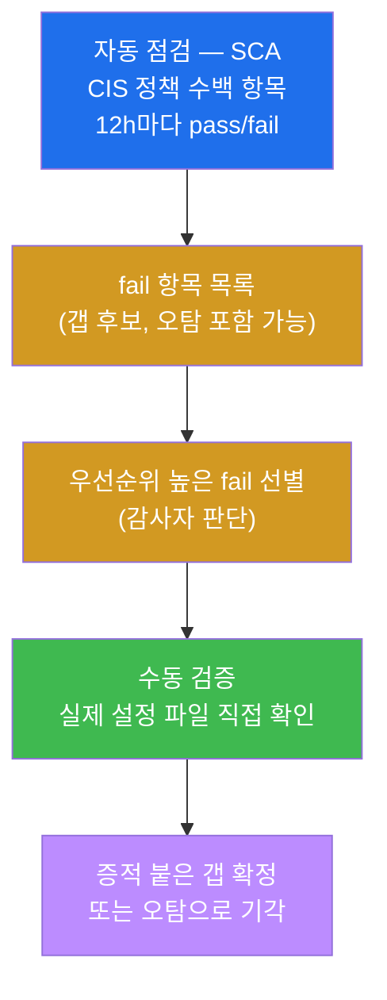
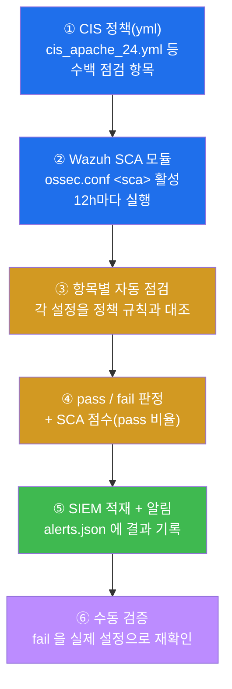
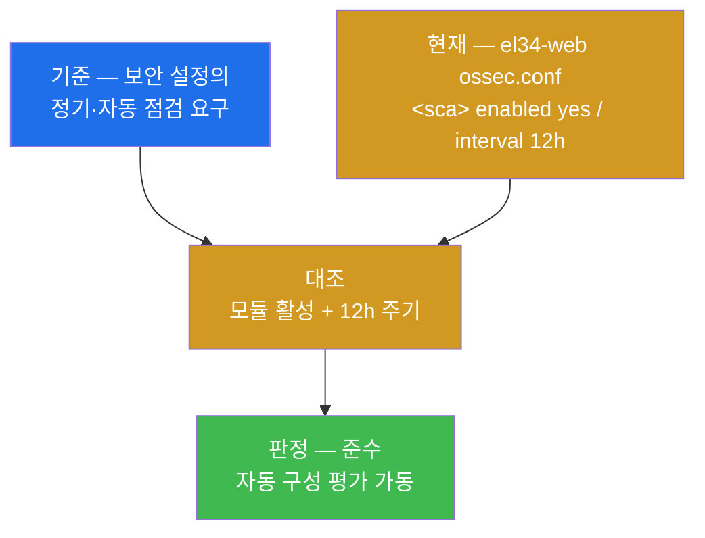
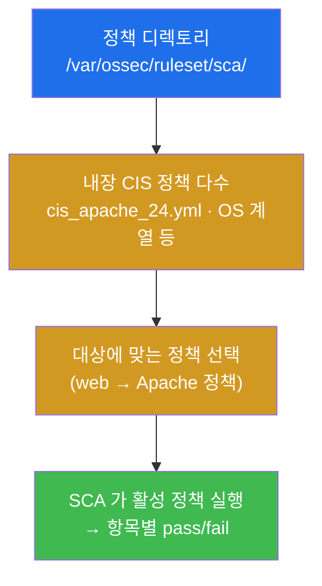
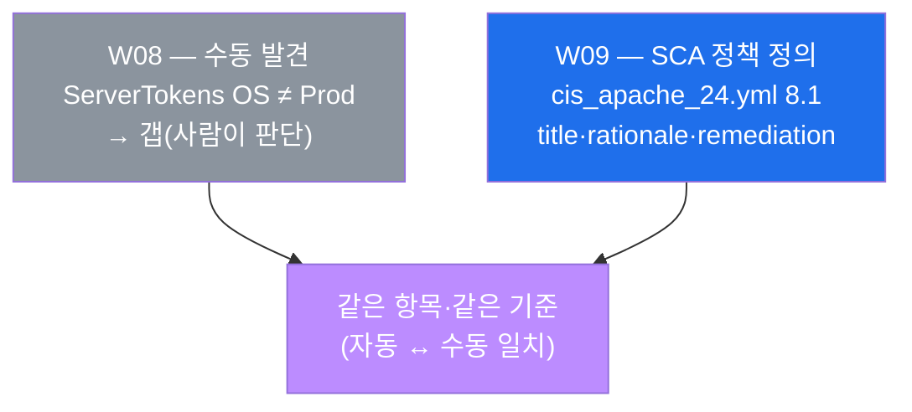
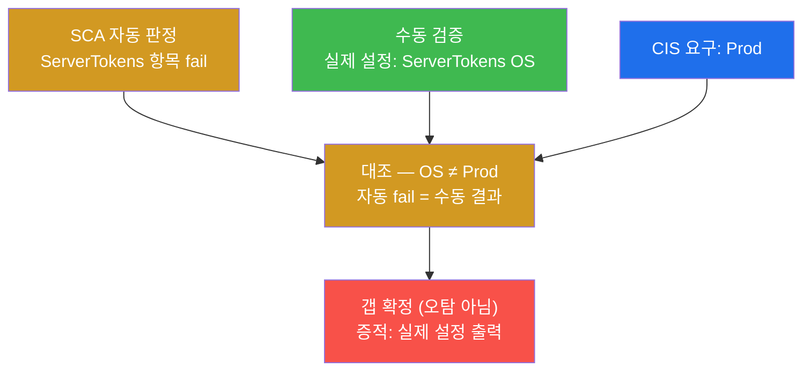
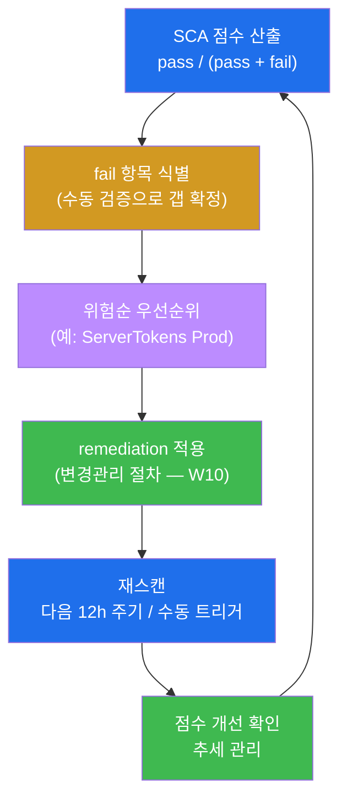
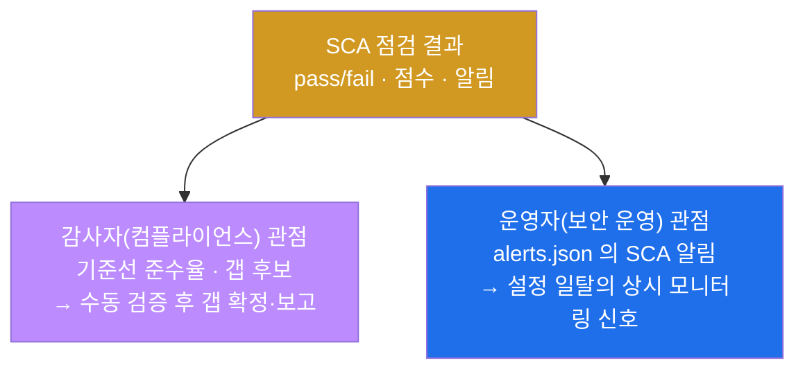
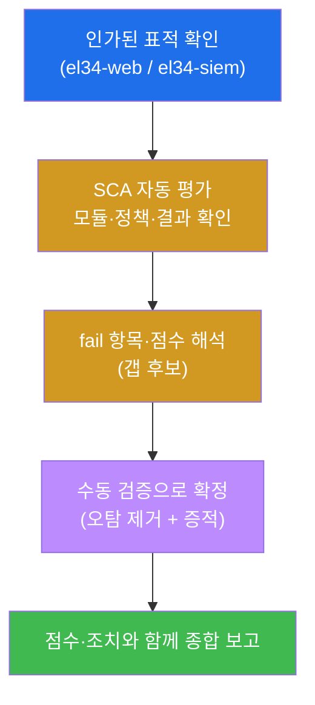
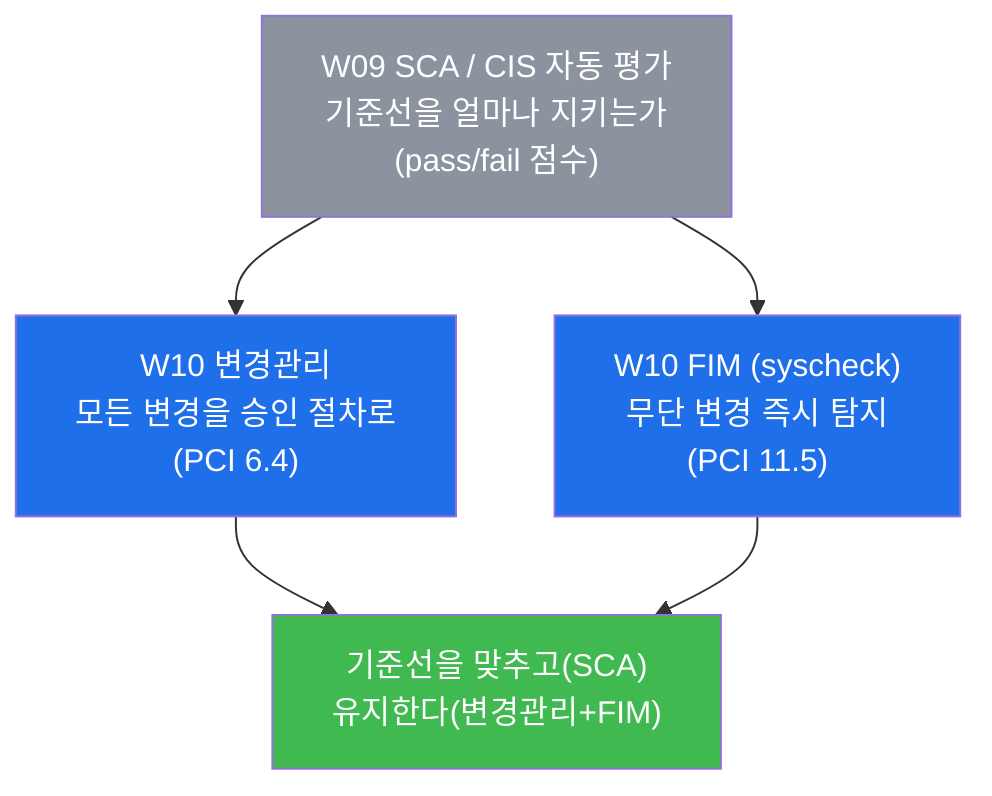

# 컴플라이언스 W09 — 보안 구성 평가(SCA): 수백 개 기준선 항목을 자동·정기로 점검하기

> **본 주차의 한 줄 요약**
>
> 지난 W08 중간고사에서 학생은 한 표적(`el34-web`)을 **CIS Benchmark 기준선**으로 한 바퀴 점검하되,
> 모든 항목을 **손으로 하나하나** 던져 준수/갭을 판정했다. 항목이 10 개일 때는 손이 충분하지만, 실제
> CIS Apache 2.4 Benchmark 한 종만 해도 **수백 개 항목**이고, OS·DB·컨테이너까지 더하면 수천 개가
> 된다 — 수작업은 느리고 빠뜨린다. 본 주차는 이 점검을 **자동·정기로** 수행하는 도구인 **SCA(Security
> Configuration Assessment, 보안 구성 평가)** 를 배운다. SCA 는 CIS 정책(yml)을 에이전트가 항목별로
> 자동 점검해 **pass/fail 점수와 알림**을 내며, el34 의 SIEM 인 **Wazuh** 가 이 SCA 모듈을 내장한다.
> 학생은 SCA 모듈이 가동 중인지 확인하고, 내장된 CIS 정책과 그 안의 한 점검 항목(`ServerTokens`,
> CIS Apache 8.1)을 열어보고, SCA 가 fail 로 판정한 항목을 **실제 설정으로 수동 재검증**해 자동 결과를
> 증적으로 확정하는 한 바퀴를 돈다.
>
> **감사자 한 줄 결론**: 자동화(SCA)는 감사자를 **대체하지 않고 증폭**한다. SCA 는 "수백 항목을 빠짐없이
> 반복 가능하게" 훑어 갭 후보를 쏟아내지만, 그 결과가 진짜 갭인지(오탐이 아닌지)·무엇부터 고칠지는
> 여전히 감사자가 **수동 검증과 위험 판단**으로 확정한다. W08 의 수동 기준선 감사와 W09 의 자동 평가는
> 대립이 아니라 **한 쌍**이다 — 자동으로 넓게 훑고, 수동으로 깊게 확정한다.

---

## 학습 목표

본 주차 종료 시 학생은 다음 6가지를 **본인 손으로** 할 수 있어야 한다.

1. **SCA(Security Configuration Assessment, 보안 구성 평가)** 가 무엇이고, W08 의 수동 기준선 감사와
   어떻게 같은 일(CIS 항목 점검)을 **자동·정기**로 하는지를 비유 없이 설명한다.
2. el34-web 에서 Wazuh **SCA 모듈이 활성**(`<sca> enabled`)이고 **12시간 주기**(`interval 12h`)로 자동
   실행되도록 구성돼 있음을 `ossec.conf` 에서 직접 확인하고, 그 의미(정기 자동 평가)를 해석한다.
3. Wazuh 에 내장된 **CIS 정책 파일**(`cis_apache_24.yml` 등)이 어디 있는지(`/var/ossec/ruleset/sca/`)를
   찾고, 정책 한 개가 어떤 구조(점검 항목들의 목록)인지 설명한다.
4. SCA 점검 결과가 SIEM 의 **알림(`alerts.json`)에 적재**됨을 확인해, 자동 평가가 실제로 돌고 있다는
   증적을 확보한다.
5. CIS 정책 안의 한 점검 항목(`ServerTokens`, CIS Apache 8.1)의 정의를 열어, **W08·W01 에서 손으로
   발견했던 그 갭이 SCA 정책에 그대로 코드화**되어 있음을 확인한다(자동 ↔ 수동의 일치).
6. SCA 가 **fail** 로 표시한 항목을 **실제 설정으로 수동 재검증**해 오탐을 거르고, **pass 점수 → fail
   항목 remediation → 재스캔으로 점수 개선**이라는 SCA 운영 순환을 종합 보고한다.

> **본 주차의 시선** — W09 는 새 통제 영역을 배우는 주가 아니라, W08 까지 익힌 **수동 점검을 자동화**하는
> 주다. 따라서 핵심은 "도구가 신기하다"가 아니라 **"자동 결과를 어떻게 믿을 만한 증적으로 만드는가"**다.
> 채점도 SCA 를 켰다는 사실이 아니라, **모듈 가동 → 정책 확인 → 결과 적재 → 항목 해석 → 수동 재검증 →
> 점수·조치 종합**의 한 바퀴를 증적과 함께 돌았는지를 본다.

---

## 강의 시간 배분 (총 3시간 40분)

| 시간        | 내용                                                                       | 유형      |
|-------------|----------------------------------------------------------------------------|-----------|
| 0:00–0:20   | 이론 — 왜 수동 점검만으로는 안 되는가 (수백 항목·반복·누락) + W08 연결      | 강의      |
| 0:20–0:55   | 이론 — SCA 란 무엇인가: CIS 정책 → 자동 점검 → pass/fail → 점수·알림         | 강의      |
| 0:55–1:05   | 휴식                                                                        | —         |
| 1:05–1:35   | 이론 — Wazuh SCA 모듈 구조 + el34 점검 경로(호스트 SSH + docker exec) 확인   | 강의/토론 |
| 1:35–2:00   | 실습 1–2 — 대상 도달 + SCA 모듈 활성(ossec.conf) 확인                       | 실습      |
| 2:00–2:30   | 실습 3–4 — 내장 CIS 정책 목록 + SCA 결과 SIEM 적재 확인                     | 실습      |
| 2:30–2:40   | 휴식                                                                        | —         |
| 2:40–3:10   | 실습 5–6 — CIS 점검 항목(ServerTokens 8.1) + 자동 ↔ 수동 재검증             | 실습      |
| 3:10–3:30   | 실습 7–8 — SCA 점수·조치(remediation·재스캔) + SCA 보고서                   | 실습      |
| 3:30–3:40   | 정리 + 채점 기준 안내 + 다음 주차(W10 — 변경관리·FIM) 예고                  | 정리      |

---

## 0. 용어 해설 (자동 구성 평가 입문)

본 주차에서 처음 나오거나 특히 중요한 용어를 먼저 정리한다. 표로 한 줄 정의를 보고, 헷갈리기 쉬운
핵심 용어는 이어지는 §0.5 에서 일상 비유로 풀어 설명한다.

| 용어 | 영문 | 뜻 | 비유 |
|------|------|----|------|
| **SCA** | Security Configuration Assessment | 보안 설정 항목을 정책에 따라 **자동·정기**로 점검해 pass/fail 점수를 내는 기능 | 점검표를 들고 자동으로 도는 무인 안전 점검 로봇 |
| **CIS Benchmark** | Center for Internet Security Benchmark | OS/앱별 권장 보안 설정을 모은 표준 점검 기준서 | 시설 종류별 표준 안전 점검 체크리스트 |
| **SCA 정책** | SCA policy | CIS Benchmark 항목을 SCA 가 읽을 수 있게 `yml` 로 코드화한 점검 규칙 파일 | 체크리스트를 기계가 읽을 양식으로 옮긴 것 |
| **Wazuh SCA 모듈** | Wazuh SCA module | Wazuh 에이전트에 내장된, SCA 정책을 주기적으로 실행하는 부품 | 점검 로봇을 움직이는 모터 |
| **pass / fail** | pass / fail | 한 점검 항목이 기준을 충족(pass)/미달(fail)한 결과 | 점검표의 합격/불합격 도장 |
| **SCA 점수** | SCA score | `pass / (pass + fail)` 비율(%) — 기준선 준수율 | 안전 점검 종합 점수 |
| **자동 점검** | automated check | 사람 개입 없이 도구가 설정을 읽어 pass/fail 판정 | 로봇이 알아서 도는 점검 |
| **수동 검증** | manual verification | 자동 결과(특히 fail)를 사람이 실제 설정으로 재확인해 오탐을 거르는 일 | 로봇 결과를 검사관이 눈으로 재확인 |
| **오탐** | false positive | 실제로는 준수인데 자동 점검이 fail 로 잘못 판정한 것 | 멀쩡한데 불합격 도장이 잘못 찍힌 경우 |
| **remediation** | remediation | fail 항목을 기준에 맞게 고치는 시정 조치 | 결함을 규격대로 보수 |
| **재스캔** | rescan | 시정 후 SCA 를 다시 돌려 점수가 개선됐는지 확인 | 보수 후 재점검 |
| **ossec.conf** | — | Wazuh 에이전트/매니저의 설정 파일(SCA·FIM 등 모듈을 켜고 끔) | 점검 로봇의 설정 패널 |
| **ServerTokens** | — | Apache 가 응답 헤더에 제품·OS 정보를 얼마나 노출할지 정하는 설정(CIS Apache 8.1) | 건물 외벽의 설비 사양 안내판 |

> **헷갈리기 쉬운 한 쌍 — 자동 점검(SCA) vs 수동 검증(W08).** 둘은 **같은 CIS 항목을 보지만 손이
> 다르다**. **자동 점검(SCA)** 은 Wazuh 가 정책(yml)을 읽어 **수백 항목을 12시간마다 빠짐없이** 훑고
> pass/fail 점수를 낸다 — 넓고 반복적이지만, 정책이 가정한 경로·문맥과 실제가 다르면 **오탐**이 날 수
> 있다. **수동 검증(W08 방식)** 은 사람이 **그 한 항목을 실제 설정 파일로** 다시 확인한다 — 좁지만
> 정확하다. 실무는 둘을 **이어 붙인다**: SCA 가 fail 을 쏟아내면(넓게), 감사자가 우선순위 높은 fail 을
> 골라 수동으로 확정한다(깊게). W09 의 미션 5–6 이 바로 이 "자동 → 수동" 이어 붙이기다.
>
> **헷갈리기 쉬운 또 한 쌍 — fail vs 갭(gap).** **fail** 은 SCA(기계)가 매긴 **자동 판정**이고, **갭**은
> 감사자가 **수동 검증으로 확정**한 진짜 미달이다. 모든 fail 이 곧 갭은 아니다 — fail 중 오탐을 거른
> 나머지가 갭이다. 반대로, 정책에 항목이 없어 SCA 가 아예 점검하지 못한 갭도 있을 수 있다. 그래서
> 점수(pass 비율)는 "현재 정책으로 본 준수율"일 뿐, "보안 수준 전부"가 아니라는 점을 항상 기억한다.

---

## 0.5 신입생 친화 핵심 개념 설명

위 표는 한 줄 정의라 처음 접하는 학생에게는 부족하다. 본 절에서는 W09 본문을 시작하기 전에, 학생이
헷갈리기 쉬운 핵심 개념 세 가지를 일상 비유로 풀어 설명한다.

### 0.5.1 SCA — 점검표를 들고 자동으로 도는 안전 점검 로봇

학생이 큰 건물의 안전 관리자라고 하자. W08 에서 학생은 **직접** 손에 체크리스트를 들고 층마다 다니며
"소화기 있나? 비상구 표시등 켜졌나? 배선 규격 맞나?"를 하나씩 확인했다. 10개 항목이면 할 만하다. 그런데
체크리스트가 **수백 항목**이고, 그걸 **매주** 반복해야 한다면? 사람은 지치고, 빠뜨리고, 매번 결과가
조금씩 달라진다.

그래서 **점검 로봇**을 들인다고 하자. 로봇에게 체크리스트(정책)를 입력해두면, 로봇은 정해진 시각마다
건물을 돌며 항목을 하나하나 확인하고 "147개 합격, 23개 불합격, 종합 86점"이라고 보고서를 낸다. 사람은
이제 처음부터 다 돌 필요 없이, 로봇이 찍은 **불합격 항목만** 골라 직접 눈으로 재확인하면 된다.

이 점검 로봇이 보안 설정 세계에서는 **SCA(Security Configuration Assessment, 보안 구성 평가)** 다.

**SCA** 는 CIS Benchmark 같은 **점검 기준(정책 파일)** 을 입력받아, 시스템의 보안 설정을 항목별로 자동·정기
점검하고 **pass/fail 점수**를 내는 기능이다. el34 에서는 SIEM 인 Wazuh 가 이 SCA 모듈을 내장하고 있어,
별도 도구 설치 없이 에이전트가 12시간마다 CIS 정책을 돌린다.

| 안전 점검 로봇 | el34 의 SCA |
|----------------|--------------|
| 로봇에 입력하는 체크리스트 | CIS 정책 파일(`cis_apache_24.yml`) |
| 로봇을 움직이는 모터 | Wazuh SCA 모듈(`ossec.conf` 의 `<sca>`) |
| "매주 점검" 같은 일정 | `<interval>12h</interval>` (12시간 주기) |
| "147 합격 / 23 불합격" 보고 | pass/fail 결과 → `alerts.json` 적재 |
| 종합 86점 | SCA 점수 = pass / (pass + fail) |
| 불합격 항목을 검사관이 재확인 | 미션 6 의 수동 검증 |

핵심은 SCA 가 **사람을 대체하는 게 아니라 증폭**한다는 것이다. 로봇은 빠짐없이·반복 가능하게 훑는 일을
맡고, 사람은 결과를 **해석하고 확정**하는 일을 맡는다. 이 역할 분담이 W09 전체를 관통한다.

### 0.5.2 SCA 정책(yml) — 체크리스트를 기계가 읽을 양식으로 옮긴 것

점검 로봇은 사람 말을 못 알아듣는다. "소화기가 적절한 위치에 충분히 있는지 봐줘" 같은 문장으로는 못
움직인다. 로봇이 실행하려면 **기계가 읽을 정확한 양식**으로 항목을 적어줘야 한다 — "3층 복도 끝, 빨강
원통, 압력 게이지가 초록 영역이면 합격" 처럼.

이 "기계가 읽을 양식"이 SCA 에서는 **SCA 정책(yml)** 이다. CIS Benchmark 는 원래 사람이 읽는 문서(PDF)인데,
이걸 SCA 가 실행할 수 있도록 **항목마다 점검 규칙을 yml 로 코드화**한 것이 SCA 정책 파일이다. el34 의
Wazuh 에는 이런 정책 파일이 `/var/ossec/ruleset/sca/` 에 여러 개 내장돼 있다(`cis_apache_24.yml` 등).

정책 파일 안의 한 항목은 대략 다음 요소를 갖는다(미션 5 에서 직접 열어본다).

| 정책 항목의 요소 | 뜻 |
|------------------|----|
| `title` | 점검 항목 이름(예: "Ensure ServerTokens is Set to 'Prod'") |
| `rationale` | 왜 이 점검이 필요한가(근거) |
| `remediation` | fail 이면 어떻게 고치나(시정 방법) |
| `compliance` | 어느 기준 조항인가(예: `cis: ["8.1"]`) |
| `condition` / `rules` | 실제 점검 규칙(설정 파일에서 무엇을 어떻게 확인하나) |

즉 SCA 정책은 "W08 에서 학생이 머릿속으로 했던 판단(기준 → 점검 방법 → 판정)"을 **파일로 박제**한
것이다. 그래서 미션 5 에서 `cis_apache_24.yml` 안의 ServerTokens 항목을 열면, W08·W01 에서 손으로
발견했던 바로 그 갭이 `title`·`rationale`·`remediation` 형태로 그대로 적혀 있는 것을 보게 된다.

### 0.5.3 자동 점검 ↔ 수동 검증 — 로봇과 검사관의 협업

점검 로봇이 "3층 소화기 불합격"이라고 보고했다고 곧장 시설을 뜯어고치지는 않는다. 로봇이 **잘못 봤을
수도** 있기 때문이다(소화기는 멀쩡한데 게이지에 먼지가 껴서 빨강으로 인식했을 수 있다). 그래서 검사관은
**불합격 항목만 골라 직접 가서 눈으로 재확인**한다. 진짜 불합격이면 시정하고, 로봇 오류면 정책을
보정한다.

보안 설정에서도 똑같다. SCA 가 어떤 항목을 **fail** 로 찍었다고 해서 그게 자동으로 "갭 확정"은 아니다.
정책이 가정한 경로·문맥과 실제 시스템이 다르면 **오탐(false positive)** 일 수 있다. 그래서 감사자는 SCA
fail 중 우선순위 높은 것을 골라 **실제 설정 파일을 직접 읽어** 재검증한다(미션 6). 이 수동 검증을 거쳐야
fail 이 비로소 **증적이 붙은 갭**이 된다.



이 협업 구조 — **자동으로 넓게, 수동으로 깊게** — 가 W09 가 가르치려는 핵심 한 문장이다. W08 이 "수동
점검이 무엇인가"였다면, W09 는 "그 수동 점검을 자동으로 확장하되, 자동 결과를 다시 수동으로 확정한다"
이다.

---

## 1. 왜 수동 점검만으로는 부족한가 — SCA 의 동기

### 1.1 한 줄 답: 항목은 수백 개, 점검은 반복돼야 하고, 사람은 빠뜨린다

W08 에서 학생은 `el34-web` 을 기준선으로 점검하며 ServerTokens·PermitRootLogin·PASS_MAX_DAYS 등
**10개 항목**을 손으로 확인했다. 시험이라 10개로 추렸지만, 실제 CIS Apache 2.4 Benchmark 한 종만 해도
**수백 개 항목**이 있고, 거기에 OS(CIS Ubuntu), 데이터베이스, Docker(CIS Docker)까지 더하면 한 호스트에
점검해야 할 항목이 수천 개가 된다. 이를 수동으로 하려면 세 가지 벽에 부딪힌다.

- **규모의 벽.** 수백~수천 항목을 한 사람이 손으로 다 보는 것은 현실적으로 불가능하다. 시간이 모자라
  결국 "중요해 보이는 것만" 추려 보게 되는데, 그 추림 자체가 누락의 시작이다. 감사에서 "점검하지 않은
  항목"은 곧 "보장되지 않은 항목"이다(W08 §1.1 의 누락 방지 원칙).
- **반복의 벽.** 보안 설정은 한 번 맞다고 영원히 맞는 게 아니다. 패치·배포·운영자 실수로 설정은 계속
  바뀐다(W10 의 변경관리 주제로 이어진다). 그래서 기준선 점검은 **정기적으로 반복**해야 하는데, 수백
  항목을 매주·매월 손으로 다시 도는 것은 지속 불가능하다.
- **일관성의 벽.** 같은 항목도 점검하는 사람·날·컨디션에 따라 판정이 미묘하게 달라진다. 감사는 **재현
  가능한 공정**이어야 작년 대비 "갭이 줄었는가"를 추적할 수 있는데(W08 §1.1 재현 가능성), 손점검은
  이 일관성을 보장하기 어렵다.

SCA 는 이 세 벽을 정확히 겨눈다 — **규모**(수백 항목 자동), **반복**(12시간 주기 정기), **일관성**(같은
정책이면 항상 같은 판정).

### 1.2 SCA 가 하는 일 — 한 그림으로

SCA 의 동작은 "정책 → 자동 점검 → pass/fail → 점수·알림"의 흐름이다. el34 의 Wazuh 가 이 전 과정을
에이전트(`el34-web`)에서 12시간마다 자동으로 돌린다.



이 6 단계가 곧 W09 lab 8 미션의 골격이다. 대상에 도달하고(미션 1), **②** 모듈 활성을 확인하고(미션 2),
**①** 내장 CIS 정책을 보고(미션 3), **⑤** 결과가 적재됨을 확인하고(미션 4), **①** 정책 속 한 항목을
해석하고(미션 5), **⑥** 그 항목을 수동 검증한 뒤(미션 6), **④** 점수·조치를 정리하고(미션 7),
종합 보고로 마무리한다(미션 8).

### 1.3 왜 중요한가 — "점검의 자동화"가 컴플라이언스의 성숙도다

컴플라이언스 표준은 점점 **"한 번 점검했는가"가 아니라 "지속적으로 점검·관리되는가"**를 요구하는 쪽으로
간다. ISMS-P 의 통제는 보안 설정의 **주기적 점검과 그 이력 관리**를 요구하고, PCI-DSS 도 설정 표준을
세우고 그것이 유지되는지 **지속적으로 검증**할 것을 본다. 수동 점검은 "어느 시점의 스냅샷"만 줄 수
있지만, SCA 같은 자동 평가는 **시점마다의 점수 추세**(이번 달 86점 → 다음 달 91점)를 만들어, 보안
기준선이 **유지·개선되고 있다는 것 자체를 증적으로** 보여준다. 즉 SCA 는 단순 편의 도구가 아니라,
컴플라이언스 운영을 "1회성 점검"에서 "지속 관리"로 끌어올리는 성숙도의 지표다.

### 1.4 한계 — SCA 가 풀어주지 않는 것

자동화는 강력하지만 만능이 아니다. 학생은 SCA 의 결과를 다룰 때 세 한계를 반드시 의식해야 한다.

- **오탐(false positive).** SCA 정책은 일반적인 경로·배포를 가정한다. 실제 시스템의 설정 위치·문맥이
  정책 가정과 다르면, 준수인데도 fail 이 나거나 그 반대가 생긴다. 그래서 **fail = 갭 확정이 아니다** —
  반드시 수동 검증으로 확정한다(미션 6, §0.5.3).
- **정책의 범위가 곧 점검의 범위.** SCA 는 정책에 적힌 항목만 본다. 정책에 없는 보안 약점은 점수가
  100점이어도 그대로 남는다. 점수(pass 비율)는 "이 정책으로 본 준수율"일 뿐, "보안 전부"가 아니다.
- **점검일 뿐, 시정은 아니다.** SCA 는 fail 을 알려줄 뿐 고쳐주지 않는다. remediation(시정)은 운영팀이
  변경관리 절차(W10)로 적용하고, 그 후 **재스캔**으로 점수가 올랐는지 확인해야 순환이 닫힌다(미션 7).

이 한계들이 바로 "자동(SCA) + 수동(검증·시정·판단)"을 한 쌍으로 묶어야 하는 이유다.

---

## 2. SCA 한 바퀴 — el34 에서 6 단계 상세

이번 주의 시나리오는 한 감사자가 `el34-web` 의 SCA 를 6 단계로 점검하는 것이다. 명령은 el34
호스트(`ssh ccc@192.168.0.151`, 비밀번호 1)에 접속한 뒤, **에이전트** 점검은 `docker exec el34-web`,
**매니저/정책/결과** 점검은 `docker exec el34-siem` 으로 실행한다. 각 단계마다 **한 줄 정의 → 무엇을
점검하나 → el34 에서 어떻게 보이나 → 한계**의 4축으로 설명한다.

> **왜 web 과 siem 을 나눠 보는가.** el34 의 Wazuh 는 **에이전트-매니저** 구조다(W01 §2.4). **SCA
> 모듈은 점검 대상인 에이전트(`el34-web`)에서 돌고**, 그 결과는 **매니저(`el34-siem`)로 보내져
> 알림·정책 형태로 모인다**. 그래서 "모듈이 켜졌나"는 에이전트(web)의 `ossec.conf` 에서 보고, "어떤
> 정책이 있나·결과가 쌓였나"는 매니저(siem)에서 본다. 신규 도구 설치는 없으며, 기존 OS 명령
> (`grep`/`ls`/`tail`)만 쓴다.

### 2.1 ① 점검 대상 — 누구를 평가하나 (미션 1)

**한 줄 정의.** 모든 점검의 전제는 표적에 접근이 된다는 것이다. SCA 도 예외가 아니라, 먼저 점검 대상이
살아있고 도달 가능한지부터 확인한다.

**무엇을 점검하나.** `el34-web` 에 `docker exec` 로 들어가 hostname 이 응답하는지 본다. el34 의 SCA
구도에서 **점검 대상(에이전트) = `el34-web`**, **결과를 모으는 곳(매니저) = `el34-siem`** 이다. 이번
주의 평가는 web 의 Apache·OS 설정을 CIS 기준으로 보는 것이므로, 표적은 web 이다.

**el34 에서 어떻게 보이나.** 명령 출력에 `target_ok` 가 나오면 대상 접근 성공이다. 이것은 판정이
아니라 **점검의 전제**다 — 대상에 못 닿으면 이후 모든 결과가 무의미하기 때문이다.

**한계.** 도달성 확인은 "점검을 시작할 수 있다"까지만 보장한다. 실제 SCA 가 정상 동작하는지는 다음
단계들(모듈 활성·결과 적재)로 확인한다.

### 2.2 ② SCA 모듈 활성 — 자동 점검이 켜져 있나 (미션 2)

**한 줄 정의.** SCA 모듈 점검은 "에이전트에서 SCA 가 켜져 있고, 얼마나 자주 자동으로 도는가"를 확인하는
단계다.

**무엇을 점검하나.** `el34-web` 의 `ossec.conf` 에서 `<sca>` 블록을 읽어, 모듈이 **활성**(`enabled`)
이고 **정기 실행**(`interval`)되도록 구성됐는지 본다.

> **용어 — ossec.conf 와 `<sca>` 블록.** **`ossec.conf`**(경로 `/var/ossec/etc/ossec.conf`)는 Wazuh
> 에이전트/매니저의 설정 파일로, FIM(`<syscheck>`)·SCA(`<sca>`) 같은 모듈을 켜고 끄는 패널이다.
> `<sca>` 블록 안의 `<enabled>yes</enabled>` 는 SCA 모듈을 켜고, `<scan_on_start>yes</scan_on_start>`
> 는 에이전트 시작 시 즉시 한 번 점검하며, `<interval>12h</interval>` 은 이후 12시간마다 반복하라는
> 뜻이다.

**el34 에서 어떻게 보이나 — 준수.** el34-web 의 `<sca>` 는 다음과 같이 구성돼 있다.

```
<sca>
  <enabled>yes</enabled>
  <scan_on_start>yes</scan_on_start>
  <interval>12h</interval>
</sca>
```

`enabled yes` + `interval 12h` 는 **12시간마다 보안 구성을 자동 평가**한다는 뜻으로, "설정 점검을 정기·
자동으로 수행하라"는 기준선 요구를 충족한 **준수** 상태다. 수동 점검(W08)이라면 사람이 직접 돌려야 할
점검을, 여기서는 모듈이 하루 두 번 알아서 돈다.



**한계.** 모듈이 켜져 있다는 것이 "점검이 의미 있게 돌고 있다"를 100% 보장하지는 않는다 — 어떤 정책이
활성인지, 결과가 실제로 적재되는지를 다음 단계(미션 3–4)로 이어서 확인해야 한다.

### 2.3 ③ SCA 정책 — 어떤 CIS 기준으로 점검하나 (미션 3)

**한 줄 정의.** 정책 점검은 "SCA 가 어떤 기준(어떤 CIS Benchmark)으로 점검하는가"를 확인하는 단계다.

**무엇을 점검하나.** Wazuh 매니저(`el34-siem`)의 SCA 정책 디렉토리(`/var/ossec/ruleset/sca/`)를 열어,
어떤 CIS 정책 파일이 내장돼 있는지 본다. 점검의 **기준이 무엇인지**를 아는 것은 모든 판정의 출발점이다
(W08: 판정에는 항상 근거 기준이 붙는다).

> **용어 — `/var/ossec/ruleset/sca/` 와 `.disabled`.** Wazuh 는 OS·앱별 CIS 정책 파일을 이 디렉토리에
> 다수 내장한다(예: `cis_apache_24.yml` = CIS Apache 2.4 Benchmark). 파일명 끝에 **`.disabled`** 가
> 붙은 것은 "내장돼 있으나 현재 비활성"이라는 뜻으로, 대상에 맞는 정책을 골라 활성화해 쓴다. 즉
> 디렉토리에 정책이 있다고 다 도는 게 아니라, **활성화된 정책만** SCA 가 실행한다.

**el34 에서 어떻게 보이나.** `ls /var/ossec/ruleset/sca/ | grep -i cis` 로 CIS 정책 목록을 본다. CIS
Apache 와 OS 계열 정책이 다수 내장돼 있어, 대상(web)에 맞는 정책을 활성화해 자동 점검에 쓴다.



**한계.** 정책이 존재한다는 것과 그 정책이 **대상에 맞게 활성화돼 실제 점검에 쓰인다**는 것은 다르다.
또 내장 CIS 정책의 버전이 표적의 실제 소프트웨어 버전과 어긋나면 점검 정확도가 떨어지므로, 정책의
대상·버전 정합을 함께 확인해야 한다.

### 2.4 ④ SCA 결과 — 자동 평가가 실제로 도나 (미션 4)

**한 줄 정의.** 결과 점검은 "SCA 가 말로만 켜진 게 아니라 실제로 돌아서 결과를 남기고 있는가"를 증적으로
확인하는 단계다.

**무엇을 점검하나.** 매니저(`el34-siem`)의 알림 적재 파일(`/var/ossec/logs/alerts/alerts.json`)에서 SCA
관련 알림 수를 센다. SCA 점검 결과는 일반 보안 알림과 같은 경로로 SIEM 에 적재되므로, 여기에 SCA
알림이 쌓여 있으면 자동 평가가 실제로 동작하고 있다는 증적이 된다.

> **용어 — alerts.json 과 SCA 알림.** **`alerts.json`**(경로 `/var/ossec/logs/alerts/`)은 Wazuh
> 매니저가 모든 알림을 한 줄에 한 JSON 으로 적재하는 중앙 로그다(W08 미션 8 의 그 파일). SCA 점검이
> 끝나면 그 요약·항목 결과가 이 파일에 알림으로 기록되므로, `grep -c sca` 로 그 수를 세면 SCA 가
> 결과를 남기고 있는지(=실제로 돌고 있는지)를 확인할 수 있다.

**el34 에서 어떻게 보이나.** 명령 출력에 `sca_alerts=<수>` 가 나온다. 수가 0 보다 크면 SCA 점검 결과가
SIEM 에 적재되고 있다는 뜻 — 미션 2 에서 본 "12시간 주기 자동 평가"가 말이 아니라 실제 동작임을
증적으로 확인한 것이다.

**한계.** 알림 수가 곧 점수나 갭의 수는 아니다 — 이 단계는 "SCA 가 결과를 남기고 있다"는 **가동 증적**
까지만 본다. 어떤 항목이 fail 인지, 점수가 몇 점인지의 해석은 다음 단계(미션 5, 7)에서 다룬다.

### 2.5 ⑤ SCA 점검 항목 — ServerTokens, 자동과 수동이 만나는 지점 (미션 5)

**한 줄 정의.** 항목 점검은 CIS 정책 안의 **개별 점검 항목 하나**를 열어, 그것이 무엇을·왜·어떻게
점검하는지 정책 정의 수준에서 이해하는 단계다.

**무엇을 점검하나.** CIS Apache 정책 파일(`cis_apache_24.yml`)에서 **ServerTokens** 항목(CIS Apache
**8.1**)의 정의를 읽는다. 이 항목은 W01·W08 에서 학생이 **손으로** 발견했던 바로 그 갭이다 — 여기서는
같은 갭이 SCA 정책에 **코드로** 어떻게 적혀 있는지를 본다.

> **용어 — CIS Apache 8.1 (ServerTokens).** CIS Apache 2.4 Benchmark 의 8.1 항목은 *"Ensure
> ServerTokens is Set to 'Prod'"* 다. ServerTokens 는 Apache 가 `Server:` 헤더와 에러 페이지에 제품·OS
> 정보를 얼마나 노출할지 정하는 설정으로(W08 §2.1), `Prod`(제품명만 노출)가 권고치다. SCA 정책에서 이
> 항목은 `title`(이름)·`rationale`(근거: 버전 노출이 공격 정찰을 돕는다)·`remediation`(시정:
> `ServerTokens Prod` 로 설정)·`compliance`(`cis: 8.1`)의 구조로 정의돼 있다.

**el34 에서 어떻게 보이나 — 자동 ↔ 수동의 일치.** 정책 파일을 열면 ServerTokens 항목의 title·
rationale·remediation·compliance(cis 8.1)가 그대로 보인다. 즉 **W08 에서 학생이 머릿속으로 했던 판단
(기준 Prod → 점검 방법 → 갭 판정)이 SCA 정책에 박제**되어 있다. 자동 점검과 수동 검증이 **같은 항목·같은
기준**을 가리킨다는 것을 정책 수준에서 확인하는 순간이다.



**한계.** 정책에 항목이 정의돼 있다는 것은 "SCA 가 이 항목을 점검할 수 있다"까지다. 그 점검 결과(이
표적에서 pass 인가 fail 인가)와 그 결과가 맞는지(오탐 여부)는 다음 단계(미션 6)의 수동 검증으로
확정한다.

### 2.6 ⑥ 자동 ↔ 수동 검증 — fail 을 실제 설정으로 확정 (미션 6)

**한 줄 정의.** 수동 검증은 SCA 가 fail 로 표시한 항목을 **실제 설정 파일로 직접 재확인**해, 오탐을
거르고 진짜 갭임을 증적으로 확정하는 단계다 — W09 의 정점이다.

**무엇을 점검하나.** `el34-web` 의 실제 Apache 설정에서 `ServerTokens` 값을 직접 읽어, CIS 가 요구하는
`Prod` 인지 본다. SCA 가 이 항목을 fail 로 봤다면, 실제 설정도 정말 `Prod` 가 아닌지를 사람이 눈으로
확인하는 것이다.

> **용어 — 수동 검증과 오탐 제거.** **수동 검증(manual verification)** 은 자동 도구의 판정을 사람이
> 실제 증거로 재확인하는 일이다. SCA 가 fail 을 냈을 때 곧장 갭으로 단정하지 않고 실제 설정을 보는
> 이유는 **오탐(false positive)** — 정책 가정과 실제가 달라 멀쩡한 설정이 fail 로 찍히는 경우 — 을
> 거르기 위해서다. 자동 결과와 수동 결과가 **일치**하면 그 fail 은 비로소 "증적이 붙은 갭"으로 확정된다.

**el34 에서 어떻게 보이나 — fail 일치, 갭 확정.** el34-web 의 실제 설정은 `ServerTokens OS` 다. CIS
요구치 `Prod` 에 미달하므로 명령은 `fail=not_Prod` 를 출력한다. 즉 **SCA 의 자동 fail 과 수동 검증
결과가 일치**한다 — 이로써 ServerTokens 갭은 오탐이 아니라 실제 갭으로 **확정**되고, 자동 결과가 증적
(실제 설정 출력)으로 뒷받침된다.



**한계.** 수동 검증은 우선순위 높은 fail 에 집중해야 한다 — 수백 fail 을 전부 손으로 재확인하면 자동화의
이점이 사라진다. 실무는 위험도 높은 fail(예: 인증·암호·권한 관련)부터 표본·전수 검증하고, 낮은 위험
항목은 정책 신뢰도에 따라 자동 결과를 수용한다.

---

## 3. SCA 점수와 조치 순환 — pass 비율 → remediation → 재스캔

SCA 의 가치는 "지금 점수"가 아니라 **"점수를 개선해 가는 순환"**에 있다. 한 번 fail 을 찾는 데서 끝나면
수동 점검과 다를 게 없다 — SCA 는 점수를 시점마다 만들어 **추세로 관리**하게 해준다(미션 7).

### 3.1 SCA 점수 — 무엇을, 어떻게 읽나

**SCA 점수**는 `pass / (pass + fail)` 의 비율(%)로, 한 정책에 대한 **기준선 준수율**이다. 예를 들어 CIS
Apache 정책 150 항목 중 129개 pass, 21개 fail 이면 점수는 86%다. 이 한 숫자가 "이 시스템이 이 기준선을
얼마나 지키고 있는가"를 요약한다.

> **점수를 해석하는 두 주의.** 첫째, 점수는 **그 정책 범위 안에서의** 준수율이다 — 정책에 없는 약점은
> 점수에 반영되지 않으므로(§1.4) 100점이 "완벽"을 뜻하지 않는다. 둘째, 점수는 **추세로** 봐야 의미가
> 크다 — 이번 회차 86점이 좋은지 나쁜지는 지난 회차(80점 → 개선, 90점 → 악화)와 비교해야 알 수 있다.
> 그래서 SCA 는 12시간마다 점수를 남겨 시계열을 만든다.

### 3.2 조치 순환 — fail → remediation → 재스캔

점수를 올리는 길은 정해져 있다. fail 항목을 **remediation(시정)** 으로 고치고, 다음 SCA 주기(또는 수동
트리거)로 **재스캔**해 점수가 올랐는지 확인하는 것이다. 이 순환이 닫혀야 "지속 관리"가 된다.



el34-web 의 ServerTokens 갭을 예로 들면 — SCA fail(미션 5) → 수동 검증으로 갭 확정(미션 6) →
remediation 으로 `ServerTokens Prod` 설정 → 다음 SCA 주기에 재스캔하면 이 항목이 pass 로 바뀌어 점수가
한 칸 오른다. 한 항목의 작은 개선이지만, 수백 항목에 같은 순환을 적용하면 기준선 준수율 전체가 추세로
관리된다.

> **remediation 은 감사자가 직접 하지 않는다.** W08 §8 의 수칙과 같다 — 감사자는 갭을 **판정·보고**하고,
> 실제 설정 변경(remediation)은 운영팀이 **변경관리 절차**(승인·테스트·배포·기록)로 적용한다. 그 변경관리
> 절차와, 무단 변경을 탐지하는 FIM 이 바로 다음 주차(W10)의 주제다.

---

## 4. 점검 명령 빠른 복습 — "무엇을 어디서 보나"

이번 주의 각 단계를 점검하는 핵심 명령을 한 번에 정리한다. 모든 명령은 el34 호스트(`ssh
ccc@192.168.0.151`, 비밀번호 1)에서 `docker exec` 로 실행하며, 신규 도구 설치는 없다. 에이전트 점검은
`el34-web`, 매니저/정책/결과 점검은 `el34-siem` 에서 본다.

> **용어 — grep / 판정 관용구.** 본 주차 점검도 W08 처럼 "설정·파일을 `grep`/`ls`/`tail` 로 읽고 →
> 출력의 표식(`sca`·`cis`·`sca_alerts=`·`ServerTokens`·`fail=`)으로 결과를 읽는" 형태다. 학생은 각
> 명령 출력에서 그 표식이 나오는지로 점검 성공·판정을 확인한다.

### 4.1 SCA 모듈 활성 (ossec.conf — 미션 2, web)

```bash
docker exec el34-web sh -c "grep -A4 '<sca>' /var/ossec/etc/ossec.conf | head -6"
```

무엇을 보나 — `<sca>` 블록의 `enabled yes` + `interval 12h`. 12시간 주기 자동 평가가 켜져 있으면 준수.

### 4.2 내장 CIS 정책 목록 (ruleset/sca — 미션 3, siem)

```bash
docker exec el34-siem sh -c "ls /var/ossec/ruleset/sca/ | grep -i cis | head -8"
```

무엇을 보나 — `cis_apache_24.yml` 등 내장 CIS 정책. 대상(web)에 맞는 정책을 활성화해 점검에 쓴다.

### 4.3 SCA 결과 적재 (alerts.json — 미션 4, siem)

```bash
docker exec el34-siem sh -c 'N=$(tail -8000 /var/ossec/logs/alerts/alerts.json 2>/dev/null | grep -c sca); echo "sca_alerts=$N"'
```

무엇을 보나 — `sca_alerts=<수>`. 0 보다 크면 SCA 점검 결과가 SIEM 에 적재되는 중(자동 평가 실제 동작).

### 4.4 CIS 점검 항목 정의 (cis_apache_24 8.1 — 미션 5, siem)

```bash
docker exec el34-siem sh -c "grep -B1 -A2 'ServerTokens' /var/ossec/ruleset/sca/cis_apache_24.yml.disabled | head -6"
```

무엇을 보나 — ServerTokens 항목(CIS 8.1)의 정의. W08·W01 의 수동 갭이 정책에 그대로 코드화돼 있다.

### 4.5 수동 검증 — 실제 설정 대조 (미션 6, web)

```bash
docker exec el34-web sh -c 'V=$(grep -rhiE "^[[:space:]]*ServerTokens" /etc/apache2/ 2>/dev/null | head -1); echo "actual:$V"; echo "$V" | grep -qi "Prod" && echo "pass" || echo "fail=not_Prod"'
```

무엇을 보나 — `actual:` 의 실제값과 판정. el34-web 은 `ServerTokens OS` 라 `fail=not_Prod`(SCA fail 과
일치 → 갭 확정).

---

## 5. SCA 와 보안 운영 — 한 점검의 두 얼굴(컴플라이언스 ↔ 방어)

W08 에서 배운 "한 점검의 두 얼굴"은 SCA 에도 이어진다. SCA 는 표적의 설정을 **읽기만** 하므로 W08 의
공격적 스캔(nuclei)처럼 WAF 에 강한 흔적을 남기지는 않지만, **SCA 의 출력 자체가 두 관점에서 다르게
읽힌다**.



| 관점 | 무엇을 보나 | 핵심 단서 |
|------|-------------|----------|
| 감사자(컴플라이언스) | 기준선 준수율과 갭 후보 | pass 비율 점수 + fail 항목 → 수동 검증 → 갭 |
| 운영자(보안 운영) | 설정이 기준선에서 벗어나는 신호 | `alerts.json` 의 SCA 알림(설정 일탈 가시화) |

같은 SCA 결과가 감사자에게는 "이번 분기 준수율과 시정 대상"이고, 운영자에게는 "설정이 기준선에서
일탈하면 SIEM 에 뜨는 상시 신호"다. 특히 SCA 알림이 SIEM(`alerts.json`)에 모인다는 점은, 설정
드리프트(W10 의 변경관리·FIM 주제)를 **보안 운영의 상시 모니터링 대상**으로 끌어들인다 — 컴플라이언스
점검과 보안 운영이 같은 데이터(alerts.json)에서 만나는 지점이다.

---

## 6. 판단 프레임워크 — "이 단계는 무엇을·어디서·무엇으로 판정하나"

본 주차의 핵심 능력은 SCA 점검의 각 단계를 만났을 때 **무엇을 점검하는 단계이고, 어디서(web/siem)
보며, 무엇으로 판정하는가**를 즉시 자리매김하는 것이다. 다음 표가 그 정답지이며, lab 8 미션의 순서와
1:1 로 대응한다.

| 미션 | 점검 단계 | 어디서 | 무엇을 보나 | 성공 표식 | 의미 |
|------|-----------|--------|-------------|-----------|------|
| 1 | 대상 도달 | web | hostname 응답 | `target_ok` | (점검 전제) |
| 2 | SCA 모듈 활성 | web | `<sca>` enabled / interval | `sca` | 12h 자동 평가 가동(준수) |
| 3 | 내장 CIS 정책 | siem | `ruleset/sca/` CIS 목록 | `cis` | 점검 기준 확인 |
| 4 | SCA 결과 적재 | siem | `alerts.json` SCA 알림 수 | `sca_alerts=` | 자동 평가 실제 동작(증적) |
| 5 | CIS 점검 항목 | siem | ServerTokens(CIS 8.1) 정의 | `ServerTokens` | 자동 ↔ 수동 같은 항목 |
| 6 | 자동↔수동 검증 | web | 실제 ServerTokens 값 | `fail=` | 오탐 제거·갭 확정 |
| 7 | 점수·조치 | (정리) | pass 비율 → remediation → 재스캔 | `remediation` | 점수 개선 순환 |
| 8 | SCA 종합 보고 | (정리) | 운영+항목 검증+조치 | `ServerTokens` | 산출물 |

이 표를 읽는 법은 네 방향이다. **"무엇을 점검하나"**(점검 단계) — SCA 한 바퀴의 6 단계 + 점수 + 보고.
**"어디서 보나"**(web/siem) — 모듈은 에이전트(web), 정책·결과는 매니저(siem). **"무엇으로 판정하나"**
(성공 표식) — 출력의 표식으로 점검 성공·판정을 읽는다. **"그래서 무슨 의미인가"**(의미) — 각 단계가
SCA 운영에서 차지하는 자리. 네 방향을 모두 말할 수 있으면 자동 구성 평가의 운영 감각을 갖춘 것이다.

> **본 주차 채점 포인트.** SCA 를 "켰다"가 아니라, **모듈 가동(증적) → 정책 확인 → 결과 적재(증적) →
> 항목 해석 → 수동 재검증(자동 fail 과 일치) → 점수·조치 종합**의 한 바퀴를 증적과 함께 돌았는지를 본다.
> 특히 미션 6 의 **자동 fail ↔ 수동 결과 일치**가 W09 의 핵심 학습 증거다.

---

## 7. 실습 안내 — lab 8 미션 (4 축 설명)

본 주차 실습은 8 미션으로 구성된다. 각 미션을 **4 축**으로 설명한다 — 왜 하는가 / 무엇을 알 수 있는가 /
결과 해석(정상 vs 비정상) / 실전 활용. 미션은 SCA 한 바퀴를 따라 대상 도달 → 모듈 활성 → 정책 → 결과
적재 → 항목 → 수동 검증 → 점수·조치 → 종합 보고 순서로 흐르며, lab 의 `order` 와 1:1 로 대응한다.

> **실습 진행 원칙.** 모든 명령은 el34 호스트(`ssh ccc@192.168.0.151`)에서 `docker exec
> el34-web`(에이전트 점검) / `el34-siem`(정책·결과 점검)로 실행한다. 신규 도구 설치는 없으며, 각 미션은
> 독립적이고, 인가된 표적(el34)만 점검한다. 합격 임계값은 0.7 이다.

### 미션 1 — 점검: 대상 `el34-web` 에 도달하나 (10점)

> **왜 하는가?** SCA 점검의 전제는 표적에 접근이 된다는 것이다. 본격 점검 전 항상 대상의 도달성부터
> 확인한다 — 대상에 못 닿으면 이후 모든 결과가 무의미하다.
>
> **무엇을 알 수 있는가?** `docker exec el34-web` 으로 hostname 이 응답하는지 — SCA 점검 대상(에이전트)
> 이 살아있고 점검 가능한 상태인지. el34 의 SCA 구도에서 점검 대상은 `el34-web`(에이전트), 결과를 모으는
> 곳은 `el34-siem`(매니저)이다.
>
> **결과 해석.** 정상: 출력에 `target_ok` 가 나옴(대상 접근 성공). 비정상: 응답이 없으면 호스트 SSH·
> 컨테이너 상태(`docker ps`)부터 점검해야 한다.
>
> **실전 활용.** 자동 구성 평가 착수 시 첫 확인. 점검 대상이 실제 가동·접근 가능한지 검증하는 단계.

### 미션 2 — SCA 모듈 활성: ossec.conf (14점)

> **왜 하는가?** 자동 평가의 출발점은 "SCA 모듈이 켜져 있고 정기적으로 도는가"다. 모듈이 꺼져 있으면
> 점수도 결과도 없다.
>
> **무엇을 알 수 있는가?** `el34-web` 의 `ossec.conf` `<sca>` 블록에서 모듈 활성(`enabled`)과 점검
> 주기(`interval`)를. el34-web 은 `enabled yes` + `interval 12h` 라 12시간마다 자동 평가하는 **준수**
> 상태다.
>
> **결과 해석.** 정상: 출력에 `<sca>` 블록과 `enabled yes`(표식 `sca`)가 나옴 — 자동 평가 가동. 비정상:
> 블록이 없거나 `enabled no` 면 모듈이 꺼진 것, 경로(`/var/ossec/etc/ossec.conf`)를 재확인.
>
> **실전 활용.** SCA 운영의 첫 점검. "구성 점검을 정기·자동으로 하라"는 컴플라이언스 요구가 설정으로
> 강제되는지를 증적으로 보이는 절차.

### 미션 3 — SCA 정책: 내장 CIS 목록 (12점)

> **왜 하는가?** 판정에는 항상 근거 기준이 붙는다(W08). SCA 가 **어떤 CIS Benchmark 로** 점검하는지를
> 알아야 결과를 해석할 수 있다.
>
> **무엇을 알 수 있는가?** 매니저(`el34-siem`)의 `/var/ossec/ruleset/sca/` 에 내장된 CIS 정책 목록.
> CIS Apache·OS 계열 정책이 다수 있어, 대상(web)에 맞는 정책을 활성화해 점검에 쓴다.
>
> **결과 해석.** 정상: 출력에 `cis_*.yml`(표식 `cis`)이 나옴 — 내장 CIS 정책 확인. 비정상: 비거나 못
> 읽으면 경로·매니저 상태를 점검.
>
> **실전 활용.** SCA 도입 시 "어떤 기준선으로 점검할지" 정하는 단계. 대상별로 맞는 CIS 정책을 선택·활성화
> 하는 운영의 출발점.

### 미션 4 — SCA 결과: SIEM 적재 확인 (14점)

> **왜 하는가?** 모듈이 켜졌다는 것과 실제로 돌아 결과를 남긴다는 것은 다르다. 자동 평가가 **실제
> 동작**한다는 증적을 확보한다.
>
> **무엇을 알 수 있는가?** 매니저(`el34-siem`)의 `alerts.json` 에 SCA 알림이 쌓이는지 — SCA 점검 결과가
> SIEM 에 적재되어, 미션 2 의 "12h 자동 평가"가 말이 아니라 실제임을.
>
> **결과 해석.** 정상: 출력에 `sca_alerts=<수>`(0 초과)가 나옴 — 결과 적재 확인. 비정상: 0 이거나 못
> 읽으면 SCA 가 아직 안 돌았거나(scan_on_start·interval 대기) 매니저 적재 경로를 점검.
>
> **실전 활용.** 자동 평가의 가동 증적. SCA 결과를 SIEM 으로 모으면 설정 일탈을 상시 모니터링 대상으로
> 끌어올릴 수 있다(§5).

### 미션 5 — 점검 항목: ServerTokens (CIS 8.1) (14점)

> **왜 하는가?** 정책 전체를 다 보기 전에, 점검 항목 하나가 어떻게 정의되는지 이해해야 한다. 특히
> ServerTokens 는 W01·W08 에서 손으로 발견한 갭이라, 자동과 수동이 만나는 지점이다.
>
> **무엇을 알 수 있는가?** `cis_apache_24.yml` 의 ServerTokens 항목(CIS 8.1) 정의 — title·rationale·
> remediation·compliance 구조. W08·W01 의 수동 갭이 SCA 정책에 그대로 코드화돼 있음을.
>
> **결과 해석.** 정상: 출력에 `ServerTokens` 항목 정의가 나옴 — 자동 점검과 수동 검증이 같은 항목·같은
> 기준(Prod)을 가리킴. 비정상: 못 읽으면 정책 파일명(`cis_apache_24.yml.disabled`)·경로를 점검.
>
> **실전 활용.** SCA 정책을 읽고 "이 항목이 무엇을·왜·어떻게 점검하나"를 해석하는 능력. 오탐 판단과
> 정책 튜닝의 토대다.

### 미션 6 — 수동 검증: 실제 설정 대조 (12점)

> **왜 하는가?** SCA 의 fail 이 곧 갭 확정은 아니다(오탐 가능). 우선순위 높은 fail 을 실제 설정으로
> 재확인해 오탐을 거르고 갭을 확정한다 — W09 의 정점이다.
>
> **무엇을 알 수 있는가?** `el34-web` 의 실제 `ServerTokens` 값과 CIS 요구치(`Prod`) 대비 판정. SCA 의
> 자동 fail 과 수동 검증 결과가 **일치**하는지.
>
> **결과 해석.** 정상(갭 확정): 출력에 `actual:ServerTokens OS` 와 `fail=not_Prod` 가 나옴 — 실제 설정이
> CIS Prod 에 미달, SCA fail 과 일치하므로 오탐이 아닌 진짜 갭으로 확정. 비정상: 값이 `Prod` 로 나오면
> 표적·설정 경로를 재확인.
>
> **실전 활용.** 자동 결과를 신뢰할 만한 증적으로 만드는 표준 절차. "SCA 가 fail 했다 → 실제로도 그렇다
> → 갭 확정"의 삼박자가 감사 보고의 근거가 된다.

### 미션 7 — 점수·조치 (12점)

> **왜 하는가?** SCA 의 가치는 한 번의 fail 발견이 아니라 **점수를 개선해 가는 순환**에 있다. 점수가
> 무엇이고 어떻게 올리는지를 정리한다.
>
> **무엇을 알 수 있는가?** SCA 점수 = `pass / (pass + fail)` 비율(기준선 준수율)과, fail → remediation →
> 재스캔으로 점수를 개선하는 조치 순환. el34 의 ServerTokens 갭이 시정·재스캔으로 어떻게 점수를 올리는지.
>
> **결과 해석.** 정상: 출력에 점수 공식·`remediation`·재스캔 흐름이 나옴 — 점수 개선 순환 정리 성공.
> 비정상: 순환의 한 고리(시정 또는 재스캔)가 빠지면 "1회성 점검"에 그쳐 지속 관리가 안 된다.
>
> **실전 활용.** SCA 운영의 핵심. 점수를 시점마다 남겨 추세로 관리하고, 시정 우선순위의 근거로 쓴다.
> 실제 remediation 은 운영팀의 변경관리 절차(W10)로 적용한다.

### 미션 8 — SCA 종합 보고서 (12점)

> **왜 하는가?** 자동 평가의 산출물도 결국 보고서다. 미션 1–7 을 한 문서로 종합해야 SCA 한 바퀴가
> 완성된다.
>
> **무엇을 알 수 있는가?** SCA 운영(활성·정책·결과 적재) + 항목 수동 검증(ServerTokens 자동 fail ↔ 수동
> 일치) + 점수·조치(pass 비율 → remediation → 재스캔)를 한 보고서로 묶는 법. 자동과 수동을 결합한
> 결론을.
>
> **결과 해석.** 정상: 보고서에 SCA 운영·항목 검증(`ServerTokens`)·점수·조치가 포함되고 "자동+수동 결합"
> 결론이 나옴. 비정상: 수동 검증이나 조치 순환이 빠지면 "도구를 켰다"는 보고에 그친다.
>
> **실전 활용.** 자동 구성 평가 운영 보고의 표준 구조(SCA 운영 → 항목 검증 → 점수·조치). 정기 SCA
> 보고서는 점수 추세와 함께 경영진·인증 심사의 지속 관리 증적이 된다.

---

## 8. 점검 수칙 — 인가된 평가와 증적·검증 중심

자동 구성 평가도 컴플라이언스 점검의 일부이므로 W08 §8 의 수칙을 그대로 따른다.

- **인가된 표적만 평가한다.** el34 의 정해진 시스템(`el34-web`/`el34-siem`)에 대해서만 SCA·수동 검증을
  수행하며, 같은 명령을 그 밖의 어떤 시스템에도 시도하지 않는다.
- **점검·검증만, 변경은 하지 않는다.** 감사자는 SCA 결과를 읽고 수동으로 확정·판정할 뿐, 점검 중 설정을
  바꾸지 않는다. remediation(시정)은 감사 후 운영팀의 변경관리 절차(W10)로 한다.
- **fail 은 곧 갭이 아니다 — 검증으로 확정한다.** 자동 fail 을 그대로 보고하지 않고, 우선순위 높은 항목은
  실제 설정으로 재확인해 오탐을 거른 뒤 증적과 함께 갭으로 확정한다(미션 6).
- **증적·재현 우선.** "점수가 86점"이 아니라 **기준(CIS 항목) + 현재(설정 출력·SCA 결과) + 판정** 의
  삼박자를 남긴다. 모든 판정은 같은 명령으로 다른 감사자가 재현할 수 있어야 한다(W08 §8).



---

## 9. 다음 주차 (W10) 예고 — 변경관리와 파일 무결성 모니터링(FIM)

W09 에서 학생은 보안 설정을 **자동·정기로 평가**하고, fail 을 수동 검증으로 확정하는 한 바퀴를 돌았다.
그런데 한 가지 질문이 남는다 — **SCA 점수를 애써 올려놔도, 누군가 설정을 다시 망가뜨리면?** 패치·배포·
운영자 실수, 혹은 침해(웹셸 업로드·백도어)로 설정·파일이 **무단 변경**되면, 어렵게 맞춰둔 기준선이 다시
깨진다. SCA 가 "기준선을 얼마나 지키는가"를 점검했다면, W10 은 그 기준선이 **유지되는가**를 본다.

W10 은 두 통제를 다룬다. 첫째 **변경관리(change management)** — 모든 설정 변경이 요청 → 영향평가 → 승인
→ 테스트 → 배포 → 검증 → 기록의 절차를 거치게 해, 변경이 통제 아래 일어나도록 한다(PCI-DSS 6.4). 둘째
**FIM(File Integrity Monitoring, 파일 무결성 모니터링)** — Wazuh 의 `syscheck` 모듈로 핵심 파일·디렉토리
(`/etc`, `/etc/apache2` 등)를 감시해, **승인되지 않은 변경을 즉시 탐지·알림**한다(PCI-DSS 11.5). 흥미로운
점은, W09 에서 본 그 `ossec.conf` 가 W10 에서는 `<sca>` 대신 `<syscheck>` 블록으로 FIM 을 켜고, 그
결과도 같은 `alerts.json` 에 모인다는 것 — 자동 구성 평가(SCA)와 무결성 감시(FIM)가 한 SIEM 위에서 만나
"기준선을 맞추고(SCA), 유지하는(FIM)" 한 쌍을 이룬다.


