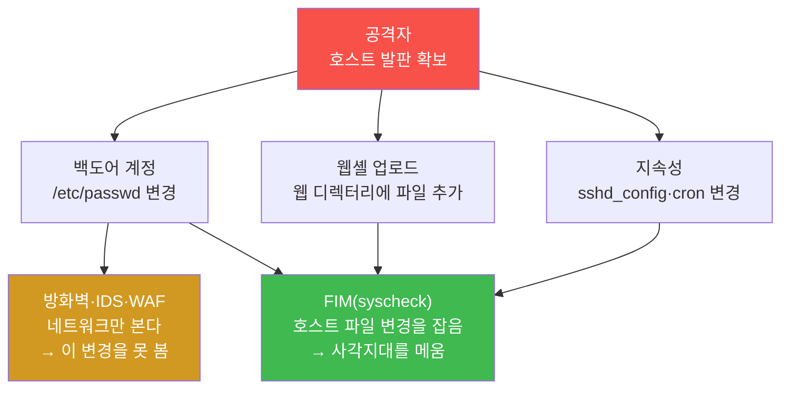
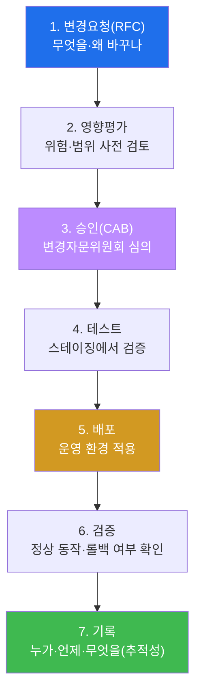
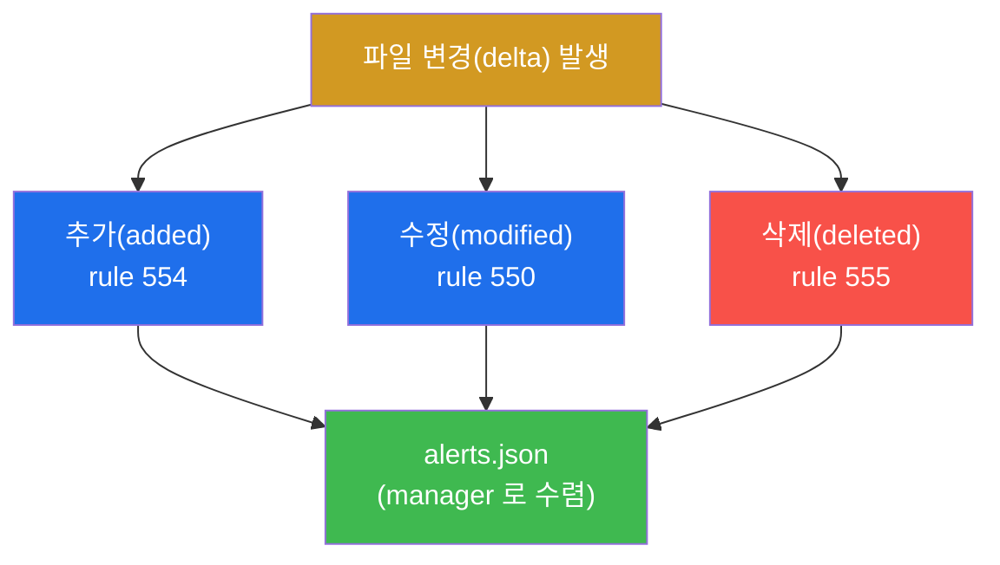
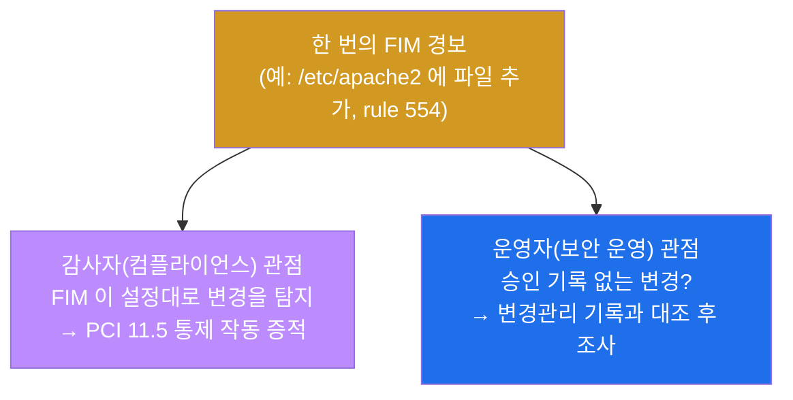
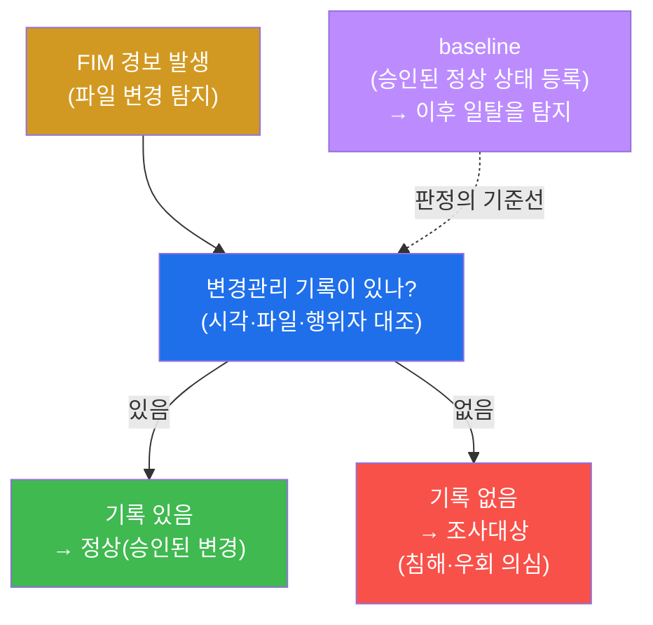
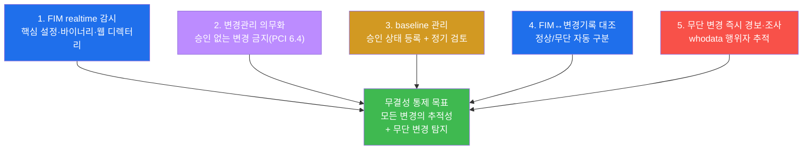
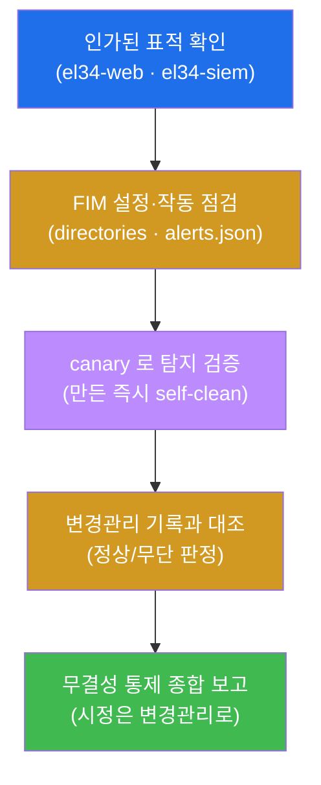
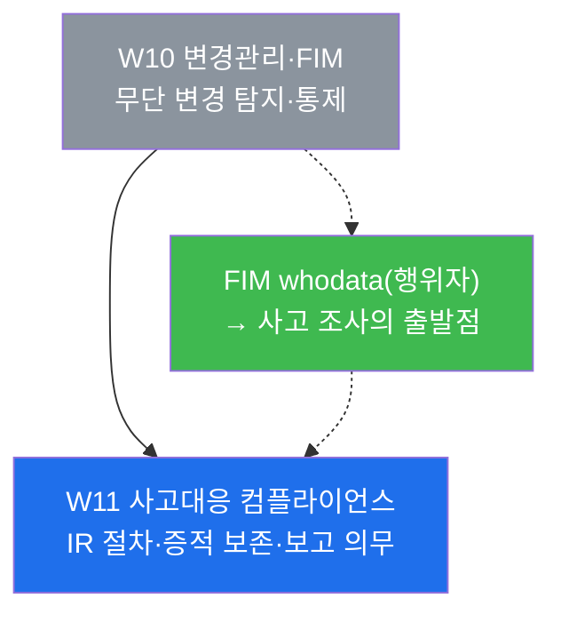

# 컴플라이언스 W10 — 변경관리(Change Management)와 파일 무결성 모니터링(FIM)

> **본 주차의 한 줄 요약**
>
> 설정 파일·시스템 바이너리·웹 콘텐츠가 **누군가의 손에 바뀌었다**는 사실은, 그 변경이
> 승인된 작업이면 정상 운영이고 승인 없이 일어났으면 침해(웹셸 업로드·백도어 계정)거나
> 통제 우회다. 컴플라이언스는 두 가지를 동시에 요구한다 — **(1) 모든 변경은 승인된
> 변경관리(change management) 절차를 거치고**, **(2) 절차를 거치지 않은 무단 변경은
> 파일 무결성 모니터링(FIM)이 즉시 탐지**할 것. 학생은 한 명의 **감사자(auditor)** 가
> 되어, el34-web 에 실제로 설정된 Wazuh FIM(syscheck)이 어떤 디렉터리를 어떻게 감시하는지
> 점검하고, 감시 디렉터리에 카나리(canary) 파일을 떨어뜨려 FIM 이 그 변경을 잡는지를
> 증적으로 확인한 뒤, 그 탐지를 변경관리 기록과 대조하는 한 바퀴를 끝낸다.
>
> **감사자 한 줄 결론**: 무결성 통제의 핵심은 "파일이 바뀌었다"를 잡는 기술(FIM)
> 하나가 아니라, **"승인된 변경인가, 그 증거(변경관리 기록)는 있는가, 없는데 바뀌었다면
> 누가·언제·무엇을 바꿨는가"를 대조해 정상/조사대상을 가르는 절차(변경관리)와의 결합**이다.
> FIM 만으로는 정상 변경과 침해를 구분하지 못한다.

---

## 학습 목표

본 주차 종료 시 학생은 다음 6가지를 **본인 손으로** 할 수 있어야 한다.

1. **변경관리(change management)** 의 7단계(요청 → 영향평가 → 승인 → 테스트 → 배포 →
   검증 → 기록)와 **CAB(변경자문위원회)**·**긴급변경(사후 승인)** 의 역할을 설명하고,
   이것이 PCI-DSS 6.4 / ISMS-P 2.9 의 어느 요구에 대응하는지 자리매김한다.
2. **FIM(파일 무결성 모니터링)** 의 한 줄 정의(파일을 해싱해 두고 이전 상태 대비
   변경분 delta 가 생기면 경보)와, 왜 방화벽·IDS·WAF 가 못 보는 **호스트 변조의 사각지대**를
   FIM 이 메우는지를 설명한다.
3. el34-web 의 `ossec.conf` `<syscheck>` 설정을 읽어, 어느 디렉터리가 **realtime(실시간)**
   감시이고 어느 디렉터리가 **주기(frequency) 스캔**인지를 구분하고, 그 차이가 곧
   비용/적시성의 트레이드오프임을 증적으로 보인다.
4. realtime 감시 디렉터리(`/etc/apache2`)에 **카나리(canary) 파일**을 만들어 FIM 이 그
   변경을 잡는지 확인하고, FIM 의 세 가지 기본 변경 이벤트(rule 554 추가 / 550 수정 /
   555 삭제)와 **whodata(누가 바꿨나)** 의 의미를 해석한다.
5. FIM 경보를 **변경관리 기록과 대조**해, "기록 있음 + FIM 경보 = 정상", "기록 없음 +
   FIM 경보 = 조사대상(침해·우회 의심)"으로 판정하는 연계 원리를 설명하고, **기준선
   (baseline)** 이 이 판정의 출발점임을 설명한다.
6. 점검 결과(준수/갭)와 변경관리·FIM 연계를 **무결성 통제 종합 보고서**로 정리하고,
   감사자가 점검만 하고 시정은 변경관리 절차로 넘긴다는 감사 수칙을 지킨다.

> **감사자의 시선** — 본 주차는 새 공격 기법을 배우는 주가 아니라, **무단 변경이라는
> 한 사건을 절차(변경관리)와 기술(FIM)의 양면으로 통제**하는 방법론을 익히는 주다. 채점은
> "FIM 이 있다"는 결과 선언이 아니라, **FIM 의 감시 설정을 점검하고 그 작동 증적(syscheck
> 경보·canary 탐지)을 제시했는가**, 그리고 **그 탐지를 변경관리 기록과 대조하는 연계
> 원리를 설명했는가**를 본다.

---

## 0. 용어 해설 (변경관리·무결성 통제 입문)

본 주차에서 처음 나오거나 특히 중요한 용어를 한자리에 모은다. 본문에서 막히면 이 절로
돌아와 확인하면 흐름이 끊기지 않는다.

| 용어 | 영문 | 뜻 | 비유 |
|------|------|----|------|
| **변경관리** | change management | 모든 변경을 요청·승인·기록의 절차로 통제하는 관리 체계 | 건물 개·보수 공사 허가·기록 제도 |
| **RFC** | Request for Change | 변경요청서 — 무엇을·왜·어떻게 바꿀지 적은 신청 | 공사 신청서 |
| **CAB** | Change Advisory Board | 변경을 심의·승인하는 변경자문위원회 | 공사 허가를 심의하는 위원회 |
| **영향평가** | impact assessment | 그 변경이 미칠 위험·범위를 사전에 따지는 단계 | 공사가 건물에 줄 영향 검토 |
| **긴급변경** | emergency change | 장애 등으로 즉시 해야 하는 변경(사후 승인·기록 필수) | 누수 응급 보수 후 사후 신고 |
| **무결성** | integrity | 데이터·파일이 인가 없이 변경되지 않은 상태(CIA 의 I) | 봉인이 뜯기지 않은 상태 |
| **FIM** | File Integrity Monitoring | 파일 변경(추가/수정/삭제)을 감지·경보하는 기능 | 금고를 비추는 24시간 CCTV |
| **syscheck** | wazuh-syscheckd | el34 에서 FIM 을 수행하는 Wazuh 데몬 | 금고 CCTV 를 돌리는 경비원 |
| **delta** | delta / change | 이전 상태 대비 달라진 변경분(추가·수정·삭제) | 어제 사진과 오늘 사진의 차이 |
| **realtime 감시** | realtime monitoring | 파일이 바뀌는 **그 순간** 경보를 올리는 방식 | 실시간 생중계 CCTV |
| **주기 스캔** | periodic scan | 정한 간격(`frequency`)마다 한 번씩 훑는 방식 | 하루 한 번 순찰 |
| **whodata** | `whodata="yes"` | 변경 시 **누가**(사용자·프로세스) 바꿨는지까지 추적 | CCTV 에 찍힌 사람 얼굴 |
| **baseline** | baseline | "이것이 승인된 정상 상태"로 등록해 둔 기준선 | 공사 전 정상 도면(원본) |
| **canary** | canary file | 탐지가 살아 있는지 확인하려 일부러 만드는 테스트 파일 | 경보기가 켜졌나 눌러 보는 테스트 버튼 |
| **PCI-DSS 11.5** | — | 변경 탐지 메커니즘(FIM) 배치·주기 비교를 요구 | 카드사가 요구하는 금고 CCTV 규격 |
| **PCI-DSS 6.4** | — | 변경관리 절차(영향평가·승인·테스트)를 요구 | 카드사가 요구하는 공사 허가 절차 |
| **ISMS-P 2.9** | — | 시스템·서비스 운영 관리(변경·구성·무결성) 통제 | 국가 인증의 운영 관리 항목 |

### 0.5 헷갈리기 쉬운 핵심 개념 풀이

용어 표는 한 줄 정의에 그치므로, 신입생이 가장 헷갈리는 세 가지 개념·한 쌍을 일상 비유로
풀어 둔다.

**FIM = 금고 CCTV.** 집에 금고가 있고 그 안에 중요한 서류가 들어 있다고 하자. 학생은 금고
위에 24시간 CCTV(=FIM)를 달았다. 누군가 금고에 손을 대 무언가를 넣거나(추가), 서류를
바꾸거나(수정), 빼 가면(삭제) CCTV 가 **그 순간(realtime)** 또는 **순찰 때(주기 스캔)**
이를 잡아 학생에게 경보를 보낸다. 파일 시스템에서 이 CCTV 역할을 하는 것이 FIM 이고,
el34 에서 그 CCTV 를 실제로 돌리는 경비원이 Wazuh 의 **syscheck** 데몬이다.

**변경관리 = 건물 공사 허가 제도.** 같은 건물이라도 누군가 멋대로 벽을 허물면 사고지만,
관리사무소에 공사 신청(RFC)을 내고 → 위험을 검토받고(영향평가) → 위원회 승인(CAB)을 받고
→ 시험 시공(테스트) → 본 공사(배포) → 점검(검증) → 대장에 기록하면 그것은 정상 작업이다.
변경관리는 시스템에 대한 **모든 변경을 이 허가·기록 절차로 통제**하는 관리 체계다.

> **헷갈리기 쉬운 한 쌍 — 정상 변경 vs 무단 변경.** 본 주차의 모든 판정은 결국 이 둘 중
> 하나다. 핵심은 **FIM 만으로는 이 둘을 구분하지 못한다**는 것이다. FIM(CCTV)은 "금고에
> 손이 닿았다"는 사실만 알린다. 그것이 **허가받은 수리공(정상 변경)** 인지 **도둑(무단
> 변경)** 인지는, 그날 공사 허가 대장(변경관리 기록)을 대조해야 비로소 갈린다. 그래서
> 무결성 통제는 **FIM(탐지) + 변경관리(기록)** 가 반드시 한 쌍으로 움직인다 — 이것이 이번
> 주차 전체를 관통하는 한 줄이다.

> **헷갈리기 쉬운 또 한 쌍 — realtime 감시 vs 주기 스캔.** 같은 FIM 이라도 감시 방식이
> 둘이다. **realtime(실시간 생중계 CCTV)** 은 파일이 바뀌는 그 순간 경보를 올리지만 비용
> (CPU·메모리)이 커서 모든 경로에 걸 수 없다. **주기 스캔(하루 한 번 순찰)** 은 정해진
> 간격마다 한 번씩 전체를 해싱해 비교하므로 가볍지만, 다음 순찰까지 탐지가 지연된다. 그래서
> el34 는 **민감한 설정 디렉터리는 realtime, 광범위한 시스템 영역은 주기 스캔**으로 나눈다
> (§3.3). 비용과 적시성을 절충한 설계다.

---

## 1. 왜 무단 변경이 곧 침해의 신호인가

### 1.1 한 줄 답: 침해 이후의 행위는 거의 모두 "파일 변경"으로 남는다

방화벽·IDS·WAF 는 모두 **네트워크를 지나가는 트래픽**을 본다. 그런데 공격자가 일단 호스트
안에 자리를 잡으면, 그 다음 행위는 **네트워크를 거치지 않는** 경우가 많다 — 예를 들어
`/etc/passwd` 에 백도어 계정을 끼워 넣거나, 웹 디렉터리에 웹셸(`shell.php`)을 떨어뜨리거나,
SSH 설정(`sshd_config`)을 몰래 고쳐 지속성을 확보하는 것이다. 이 행위들의 공통점은 **호스트
파일을 바꾼다**는 것이다. 그래서 침해 이후 단계(지속성 확보·권한 상승·통제 우회)는 거의
모두 "어떤 파일이 인가 없이 바뀌었다"는 흔적으로 남으며, 이 흔적을 잡는 것이 무결성 통제의
존재 이유다.



### 1.2 그러나 "파일이 바뀌었다"만으로는 침해를 단정할 수 없다

여기에 함정이 있다. 정상 운영에서도 파일은 끊임없이 바뀐다 — 운영자가 패치를 적용하면
바이너리가 바뀌고, 설정을 튜닝하면 `apache2.conf` 가 바뀌고, 인증서를 갱신하면 키 파일이
바뀐다. 이 정상 변경마다 FIM 은 똑같이 경보를 올린다. 즉 **FIM 경보 = 침해**가 아니다.
FIM 경보는 "변경이 일어났다"는 사실일 뿐이고, 그것이 **승인된 변경(정상)** 인지 **승인
없는 변경(조사대상)** 인지는 FIM 스스로 판단하지 못한다.

이 한계를 메우는 것이 바로 **변경관리**다. 모든 정상 변경이 변경관리 기록(누가·언제·무엇을·
왜)을 남기도록 강제해 두면, FIM 경보가 떴을 때 그 시각·파일·행위자를 변경관리 기록과
대조할 수 있다. **기록이 있으면 정상, 기록이 없는데 FIM 경보가 떴으면 조사대상**이다. 이것이
변경관리와 FIM 이 따로가 아니라 한 쌍으로 움직이는 이유다(§5).

### 1.3 왜 컴플라이언스가 이 둘을 함께 요구하는가 — 표준 매핑

무결성 통제는 어느 한 표준의 변덕이 아니라, 주요 컴플라이언스 표준이 공통으로 요구하는
기본 통제다. 본 주차가 다루는 두 축(변경관리·FIM)은 각각 다음 조항에 대응한다.

| 통제 축 | PCI-DSS | ISMS-P | 핵심 요구 |
|---------|---------|--------|-----------|
| **변경관리(절차)** | 6.4 (변경관리 절차) | 2.9 (운영 관리: 변경·구성) | 변경에 영향평가·승인·테스트·기록을 의무화 |
| **FIM(탐지)** | 11.5 (변경 탐지 메커니즘) | 2.9 (구성·무결성 관리) | 중요 파일 변경을 탐지하는 메커니즘을 배치하고 주기적으로 비교 |

> **용어 — PCI-DSS 6.4 / 11.5 와 ISMS-P 2.9.** **PCI-DSS 6.4** 는 시스템·소프트웨어 변경에
> 대해 **영향평가·승인·테스트·롤백 절차**를 갖추라는 변경관리 요구다(절차의 축). **PCI-DSS
> 11.5** 는 중요 파일(설정·콘텐츠)의 무단 변경을 잡는 **변경 탐지 메커니즘(=FIM)** 을
> 배치하고 변경을 **주기적으로 비교**하라는 탐지 요구다(기술의 축). **ISMS-P 2.9(시스템 및
> 서비스 운영 관리)** 는 한국 인증 체계에서 변경·구성·무결성 관리를 묶어 요구한다. 즉 세
> 조항이 합쳐져 "**변경은 절차로 통제하고(6.4/2.9), 절차를 벗어난 변경은 기술로 탐지하라
> (11.5/2.9)**"는 한 문장을 이룬다.

### 1.4 한계 — 이 주차가 다루지 않는 것

본 주차는 무결성 통제의 **점검(감사)** 에 집중한다. FIM 경보가 떴을 때 그것을 위험도로
격상하는 커스텀 룰 설계나 자동 차단(active response)은 secuops/soc 트랙(방어 운영)의 주제이며,
본 컴플라이언스 트랙에서는 **"FIM 이 설정대로 작동하고, 그 탐지가 변경관리 기록과 대조
가능한가"** 까지를 감사자 관점에서 본다. 또한 본 주차의 점검은 **인가된 표적(el34)** 만을
대상으로 하며, 감사자는 설정을 **읽어서 판정**할 뿐 시스템을 변경하지 않는다(canary 는 즉시
self-clean 으로 원상 복구한다, §8).

---

## 2. 변경관리(Change Management) — 무단 변경을 줄이는 절차

### 2.1 한 줄 정의 — 모든 변경을 요청·승인·기록의 궤도에 올리는 체계

**변경관리(change management)** 는 시스템·소프트웨어·설정에 대한 **모든 변경을 정해진 절차
(요청 → 승인 → 기록)로 통제**해, 검증되지 않은 변경이 운영 환경에 들어가는 것을 막는 관리
체계다. 핵심 목표는 두 가지다 — **(1) 변경으로 인한 장애·보안 사고를 예방**하고, **(2)
모든 변경을 추적 가능하게(누가·언제·무엇을·왜) 기록**하는 것.

### 2.2 왜 중요한가 — 추적성이 없으면 정상/무단을 가를 수 없다

변경관리가 없는 조직을 상상해 보자. 누군가 운영 서버의 설정을 바꿔 장애가 났는데, **누가
언제 무엇을 바꿨는지 아무도 모른다.** 원상 복구도, 책임 규명도, 재발 방지도 불가능하다.
보안 측면은 더 심각하다 — 공격자가 백도어를 심어도, "원래 그런 변경이 있었나 보다"와 "침해다"를
구분할 근거가 없다. 즉 **변경관리 기록의 부재 자체가 침해 탐지를 무력화**한다. 무결성 통제가
성립하려면 정상 변경이 빠짐없이 기록으로 남아야(추적성), FIM 경보를 그 기록과 대조해 무단
변경만 가려낼 수 있다(§5).

### 2.3 변경관리 7단계와 두 가지 변경 유형

표준적인 변경관리는 다음 7단계의 궤도를 돈다. 각 단계가 무엇을 보장하는지 함께 읽는다.



- **1. 변경요청(RFC, Request for Change).** 변경의 시작점. 무엇을·왜·어떻게 바꿀지, 영향
  범위와 롤백 계획을 적어 제출한다. RFC 없는 변경은 추적 불가능한 변경이다.
- **2. 영향평가(impact assessment).** 그 변경이 가용성·보안·다른 시스템에 줄 위험을 사전에
  따진다. "이 패치가 결제 모듈을 멈추지 않는가" 같은 질문에 미리 답하는 단계다.
- **3. 승인(CAB, Change Advisory Board).** **변경자문위원회**가 RFC 와 영향평가를 심의해
  승인/반려/보류를 결정한다. 위험이 큰 변경일수록 더 높은 승인 권한이 필요하다.
- **4. 테스트.** 운영과 분리된 스테이징 환경에서 변경을 먼저 적용해 부작용을 확인한다.
- **5. 배포.** 검증된 변경을 운영 환경에 적용한다. 이 시점에 FIM 은 변경을 탐지하게 된다.
- **6. 검증.** 배포 후 시스템이 의도대로 동작하는지, 문제가 있으면 롤백이 되는지 확인한다.
- **7. 기록.** 누가·언제·무엇을·왜 바꿨는지를 변경 대장에 남긴다 — **이 기록이 FIM 경보와
  대조되는 증거**이며, 추적성의 핵심이다.

> **용어 — RFC / CAB / 긴급변경.** **RFC(변경요청서)** 는 변경의 신청서로, 모든 변경의
> 출발점이다. **CAB(변경자문위원회)** 는 그 신청을 심의·승인하는 의사결정 주체로, 변경이
> 한 사람의 임의 판단이 아니라 검토를 거치게 만든다. **긴급변경(emergency change)** 은
> 장애·보안 사고처럼 절차를 다 밟을 시간이 없는 변경으로, **먼저 조치하고 사후에 승인·기록을
> 반드시 남기는** 예외 경로다. 긴급변경도 "기록 없이 넘어가는 변경"은 없다 — 사후라도
> 추적성은 지켜야 한다.

### 2.4 한계 — 절차는 "정상 변경의 추적성"까지만 보장한다

변경관리는 정상 변경이 빠짐없이 기록되도록 만들지만, **절차를 무시하고 일어나는 변경(공격자의
무단 변경, 또는 절차를 건너뛴 운영자)** 자체를 물리적으로 막지는 못한다. 누군가 마음먹고
RFC 없이 파일을 바꾸면 변경관리 대장에는 아무것도 남지 않는다. 바로 이 "기록 없는 변경"을
**기술적으로 잡아내는 것이 FIM**이다(§3). 즉 변경관리(절차)와 FIM(기술)은 서로의 빈틈을
메우는 한 쌍이다.

---

## 3. FIM(파일 무결성 모니터링) — el34 의 Wazuh syscheck

### 3.1 한 줄 정의 — 파일의 변경(delta)을 잡는 호스트 감시

**FIM(File Integrity Monitoring)** 은 지정한 디렉터리의 파일을 **해싱해 두고**, 이전 상태
대비 **변경분(delta — 추가/수정/삭제)** 이 생기면 경보로 올리는 기능이다. el34 에서 이를
수행하는 Wazuh 데몬이 **syscheck**(`wazuh-syscheckd`)다. §0.5 의 "금고 CCTV" 가 바로
이것이며, FIM 은 호스트(엔드포인트) 위에서 동작하는 통제라는 점에서 네트워크를 보는
방화벽·IDS·WAF 와 계층이 다르다.

### 3.2 왜 중요한가 — 네트워크 3계층이 못 보는 호스트 변조의 사각지대

§1.1 에서 보았듯, 침해 이후의 행위(백도어 계정·웹셸·지속성)는 호스트 파일을 바꾸지만
네트워크를 거치지 않는 경우가 많다. 방화벽(L3/L4)·IDS(페이로드)·WAF(L7)가 통째로 못 보는
이 사각지대를, **호스트에서 파일 변경 그 자체를 감시**하는 FIM 이 메운다. 그래서 FIM 은
PCI-DSS 11.5(변경 탐지 메커니즘)의 직접적인 구현 수단이며, 침해의 **사후 추적**과 무단
변경의 **즉시 가시화**에 결정적이다.

### 3.3 el34 에서 어떻게 — realtime vs 주기, 그리고 감시 디렉터리

el34-web 의 Wazuh agent `ossec.conf` 의 `<syscheck>` 블록은 **디렉터리마다 다른 방식**으로
감시한다. 핵심은 민감도/적시성에 따라 realtime 과 주기 스캔을 나눈 설계다.

| 대상 경로 | 감시 방식 | 반응 속도 |
|-----------|-----------|-----------|
| `/etc`, `/usr/bin`, `/bin`, `/boot` | `frequency`(주기 스캔, 약 12시간) | 다음 스캔 때(지연) |
| `/etc/apache2`, `/etc/modsecurity` | **`realtime="yes"`**(+`whodata`) | **즉시(초 단위)** |

광범위하지만 덜 급한 시스템 영역(`/etc`, `/usr/bin` 등)은 주기 스캔으로 가볍게 훑고, **웹
서버의 핵심 설정 디렉터리(`/etc/apache2`, `/etc/modsecurity`)는 realtime 으로 즉시
감시**한다 — 웹셸·설정 변조처럼 결정적인 변경이 일어나는 곳을 실시간으로 지키는 것이다.
이 설정은 다음 명령으로 확인한다(lab 미션 2).

```bash
ssh ccc@10.20.32.80 "grep -E '<directories' /var/ossec/etc/ossec.conf | head -8"
```

출력에는 `<directories ...>/etc,/usr/bin,...</directories>` 같은 주기 스캔 경로와,
`<directories realtime="yes" whodata="yes">/etc/apache2</directories>` 같은 realtime 경로가
함께 보인다. `realtime="yes"` 가 붙은 줄이 실시간 감시 대상이다.

### 3.4 FIM 작동 증적 — syscheck 경보와 rule 554/550/555

설정이 켜져 있는 것과 실제로 작동하는 것은 다르다. 감사자는 FIM 이 **실제 변경을 탐지해
경보로 적재 중**임을 증적으로 확인해야 한다. el34 의 모든 Wazuh 경보는 manager(el34-siem)의
`alerts.json` 한 파일로 수렴하므로, 거기서 `syscheck` 경보 수를 센다(lab 미션 3).

```bash
ssh ccc@10.20.32.100 'N=$(tail -8000 /var/ossec/logs/alerts/alerts.json | grep -c syscheck); echo "fim_alerts=$N"'
```

`fim_alerts=` 뒤의 수가 0 보다 크면 FIM 이 실제 변경을 탐지·기록 중이라는 증적이다. FIM 의
세 가지 기본 변경 이벤트와 대응하는 Wazuh 내장 룰은 다음과 같다 — 학생은 경보에서 이 rule
id 로 어떤 종류의 변경인지 즉시 읽어낸다.



- **rule 554 — File added.** 감시 경로에 파일이 **추가**됐다(예: 웹셸 업로드).
- **rule 550 — Integrity checksum changed.** 기존 파일이 **수정**됐다(예: 설정 변조).
- **rule 555 — File deleted.** 감시 경로에서 파일이 **삭제**됐다(예: 로그 은폐).

### 3.5 무단 변경 탐지 — canary 로 탐지가 살아 있음을 증명

FIM 이 설정대로 동작하는지를 **직접 일으켜 확인**하는 것이 카나리(canary) 점검이다. realtime
감시 디렉터리에 테스트 파일을 만들면, 그 생성은 곧 FIM 이 잡아야 할 "추가(rule 554)"
이벤트가 된다. lab 은 realtime 경로인 `/etc/apache2` 에 카나리를 만들고 **즉시 self-clean**
한다(미션 4).

```bash
ssh ccc@10.20.32.80 'echo x > /etc/apache2/cp10_canary.txt; test -f /etc/apache2/cp10_canary.txt && echo "fim_canary=created_in_monitored_dir"; rm -f /etc/apache2/cp10_canary.txt; echo cleaned'
```

이 한 줄은 (1) realtime+whodata 디렉터리(`/etc/apache2`)에 카나리를 만들고, (2) 만들어졌음을
확인(`fim_canary=...`)한 뒤, (3) 즉시 삭제해 원상 복구(`cleaned`)한다. 핵심 해석은 두 가지다.
첫째, **정상 변경관리 절차를 거치지 않은 어떤 변경이든 realtime 디렉터리에서는 즉시
가시화**된다는 것 — 공격자의 웹셸 업로드가 정확히 이 경로다. 둘째, **`whodata="yes"`** 덕분에
FIM 은 "파일이 추가됐다"를 넘어 **"누가(어떤 사용자·프로세스가) 추가했는지"** 까지 기록한다 —
침해 분석에서 행위자 식별의 결정적 증거다.

> **canary 와 self-clean.** canary 는 "탐지가 켜져 있나"를 확인하려 일부러 만드는 테스트
> 파일이다(경보기 테스트 버튼). 감사자는 점검 후 시스템을 원상 복구해야 하므로(§8 감사 수칙),
> canary 는 만든 즉시 `rm` 으로 지워 baseline 을 보존한다 — 이것이 self-clean 이다.

### 3.6 한계 — FIM 은 "정상/침해"를 스스로 판단하지 못한다

realtime FIM 도 만능은 아니다. realtime 은 비용이 커서 모든 경로에 걸 수 없고(그래서 일부는
주기 스캔), 주기 스캔은 다음 순찰까지 탐지가 지연된다. 더 근본적인 한계는 §1.2 에서 짚은
것이다 — FIM 은 "파일이 바뀌었다"는 **사실**만 알릴 뿐, 그 변경이 **승인된 정상 변경인지
침해인지**를 스스로 가르지 못한다. 그 판단은 FIM 경보를 변경관리 기록과 대조해야 비로소
가능하다(§5).

---

## 4. 무결성 통제의 두 얼굴 — 감사자 관점과 운영자 관점

같은 한 번의 FIM 경보가, 컴플라이언스 감사자에게는 "**통제가 작동한다는 증적**"이고 보안
운영자(방어 측)에게는 "**조사해야 할 탐지 이벤트**"다. 이 양면을 함께 볼 수 있어야 무결성
통제를 체득한 것이다.



| 관점 | 무엇을 보나 | 핵심 단서 |
|------|-------------|----------|
| 감사자(컴플라이언스) | FIM 이 설정대로 변경을 탐지·적재하는가 | syscheck 경보 적재(`fim_alerts`)·canary 탐지 → PCI 11.5 준수 증적 |
| 운영자(보안 운영) | 이 변경이 승인된 것인가, 누가 했나 | rule id(554/550/555)·whodata(행위자)·변경관리 기록 대조 |

감사 보고서에는 이 양면을 함께 적을 수 있어야 한다 — "FIM 이 realtime 으로 설정돼 작동
중임을 canary 로 확인했고(감사자: 통제 작동 증적), 그 탐지는 whodata 로 행위자까지 남겨
변경관리 기록과 대조하면 정상/조사대상을 가를 수 있다(운영자: 사고 대응의 단서)." 이것이
단순 체크리스트를 넘어 보안 운영과 연결되는 감사자의 시야다.

---

## 5. 변경관리 ↔ FIM 연계 — 정상과 조사대상을 가르는 대조

### 5.1 한 줄 정의 — FIM 경보를 변경관리 기록과 맞춰 보는 일

무결성 통제의 정점은 **FIM 경보(기술)와 변경관리 기록(절차)을 대조**해, 일어난 변경이
정상인지 조사대상인지를 판정하는 것이다. FIM 경보 단독은 "변경이 있었다"는 사실일 뿐
의미가 없고, 변경관리 기록과 맞춰야 비로소 판정이 된다.

### 5.2 판정 논리 — 기록의 유무가 가른다



- **승인된 변경 = 정상.** FIM 경보의 시각·파일·행위자가 변경관리 기록(RFC·CAB 승인)과
  매칭되면 정상 운영이다. 예: "오늘 14:00 CAB 승인된 Apache 설정 변경 → 같은 시각
  `/etc/apache2` 의 rule 550(modified) 경보" → 매칭 → 정상.
- **무단 변경 = 조사대상.** FIM 경보는 떴는데 대응하는 변경관리 기록이 **없으면** 침해나
  통제 우회를 의심해 조사한다. 예: "새벽 03:00 `/etc/apache2` 에 rule 554(added) 경보 +
  변경관리 기록 없음" → 무단 변경 → 조사. 이때 **whodata 의 행위자 정보**가 조사의 출발점이
  된다.

> **용어 — baseline(기준선).** **baseline** 은 "이것이 승인된 정상 상태"라고 등록해 둔
> 기준선이다(공사 전 원본 도면). FIM 은 이 baseline 대비 일탈(delta)을 탐지하고, 감사자는
> 정상 변경이 일어나면 baseline 을 **갱신**해 다음 비교의 기준으로 삼는다. baseline 이
> 없으면 "무엇이 정상인지" 기준이 없어 모든 변경이 잡음이 된다 — baseline 은 정상/무단
> 판정의 출발점이다.

### 5.3 한계 — 연계는 변경관리 기록의 질에 달려 있다

이 대조가 성립하려면 **변경관리 기록이 충실해야** 한다. 정상 변경인데 기록을 빠뜨리면
거짓 양성(정상을 조사대상으로 오인)이 늘고, 기록이 부실하면 무단 변경을 정상으로 흘려보낼
수 있다. 그래서 §2 의 변경관리(특히 7단계의 마지막 "기록")가 충실해야 §5 의 연계가 작동한다 —
절차와 기술은 끝까지 한 쌍이다.

---

## 6. 무결성 통제 방어 — 무엇을 갖춰야 준수인가

감사자는 갭을 찾는 데 그치지 않고, 무결성 통제가 갖춰야 할 모습(권고)을 종합 보고서에
제시한다. el34 에서 점검한 통제와 연결해 다섯 가지로 정리한다.



1. **FIM realtime 감시.** 핵심 설정·바이너리·웹 디렉터리를 realtime 으로 감시한다(el34 는
   `/etc/apache2`·`/etc/modsecurity` 가 realtime). 결정적 경로일수록 즉시 탐지가 중요하다.
2. **변경관리 의무화.** 모든 변경에 RFC·영향평가·승인(CAB)을 강제해, 승인 없는 변경을
   원칙적으로 금지한다(PCI-DSS 6.4). 긴급변경도 사후 기록을 남긴다.
3. **baseline 관리.** 승인된 정상 상태를 baseline 으로 등록하고 정기적으로 검토·갱신한다.
   정상 변경 후 baseline 을 갱신해야 다음 비교가 정확하다.
4. **FIM↔변경기록 대조.** FIM 경보를 변경관리 기록과 대조하는 흐름을 자동화해, 정상/무단을
   빠르게 구분한다(§5).
5. **무단 변경 즉시 경보·조사.** 기록 없는 변경은 즉시 경보하고, whodata 의 행위자 정보로
   조사를 시작한다.

이 다섯이 합쳐진 **목표는 한 줄**이다 — **모든 변경의 추적성을 확보하고, 그 궤도를 벗어난
무단 변경을 탐지하는 것.** 추적성(변경관리)과 탐지(FIM)가 빠짐없이 맞물릴 때 무결성 통제가
완성된다.

---

## 7. 실습 안내 — lab 8 미션 (4 축 설명)

본 주차 실습은 8 미션으로 구성되며, 각 미션은 lab 의 `order` 와 1:1 로 대응한다. 각 미션을
**4 축**으로 설명한다 — 왜 하는가 / 무엇을 알 수 있는가 / 결과 해석(준수 vs 갭·정상 vs 무단)
/ 실전 활용. 모든 명령은 el34 호스트(`ssh ccc@192.168.0.80`, 비밀번호 1)에서 `docker exec
el34-web`(설정·canary) 또는 `el34-siem`(경보 적재)로 실행하며, 신규 도구 설치는 없다.
canary 는 만든 즉시 self-clean 한다. 합격 임계값은 0.7 이다.

### 미션 1 — 점검: 대상 도달성 (10점)

> **왜 하는가?** 감사의 전제는 표적에 접근이 된다는 것이다. FIM 점검 대상은 에이전트가 도는
> `el34-web` 과 그 경보가 모이는 매니저 `el34-siem` 두 곳이다. 접근이 안 되면 이후 모든
> 음성 결과가 무의미하다.
>
> **무엇을 알 수 있는가?** `ssh ccc@10.20.32.80` 으로 hostname 이 응답하는지 — 점검 대상이
> 실제 가동·접근 가능한 상태인지.
>
> **결과 해석.** 정상: 출력에 `target_ok` 가 나옴(대상 접근 성공). 비정상: 응답이 없으면
> 호스트 SSH·컨테이너 상태(`docker ps`)부터 점검한다.
>
> **실전 활용.** 무결성 감사 착수 시 첫 확인. FIM 은 agent(el34-web)와 manager(el34-siem)의
> 두 축으로 동작하므로, 두 대상의 가용성이 점검의 전제다.

### 미션 2 — FIM 설정: 모니터링 디렉터리 (14점)

> **왜 하는가?** FIM 이 무엇을 지키는지는 감시 디렉터리 설정에 달려 있다. 핵심 설정 경로가
> realtime 으로 감시되는지가 PCI-DSS 11.5 준수의 출발점이다.
>
> **무엇을 알 수 있는가?** `ossec.conf` 의 `<directories>` 항목 — 어느 경로가 주기 스캔
> (`/etc`·`/usr/bin` 등)이고 어느 경로가 realtime(`/etc/apache2`·`/etc/modsecurity`)인지.
> `realtime="yes"`·`whodata="yes"` 가 붙은 줄이 실시간+행위자 추적 대상이다.
>
> **결과 해석.** 정상: 출력에 `directories` 항목과 핵심 디렉터리가 보임 — FIM 감시 범위
> 확인. 비정상: 설정을 못 읽으면 경로(`/var/ossec/etc/ossec.conf`)·컨테이너를 재확인.
>
> **실전 활용.** FIM 감사의 1단계 — "무엇을 지키도록 설정돼 있나"를 증적으로 확보한다.
> 결정적 경로(웹 디렉터리·설정)가 realtime 인지가 핵심 점검 포인트다.

### 미션 3 — FIM 작동: syscheck 경보 (14점)

> **왜 하는가?** 설정이 켜진 것과 실제 작동하는 것은 다르다. FIM 이 실제 변경을 탐지해
> 경보로 적재 중인지를 증적으로 확인해야 한다.
>
> **무엇을 알 수 있는가?** manager(el34-siem)의 `alerts.json` 에 쌓인 `syscheck` 경보 수
> (`fim_alerts=`). 이 수가 0 보다 크면 FIM 이 실제로 변경을 잡아 기록 중이라는 증적이다.
> 이 경보들은 rule 550(수정)/554(추가)/555(삭제)로 분류된다.
>
> **결과 해석.** 정상: 출력에 `fim_alerts=<수>` 가 나옴(작동 증적). 비정상: 적재가 비면
> SIEM 상태·에이전트 연결을 점검.
>
> **실전 활용.** "FIM 이 존재한다"가 아니라 "FIM 이 작동한다"를 증명하는 핵심 점검.
> 컴플라이언스 심사에서 가장 많이 요구되는 작동 증적이다.

### 미션 4 — 무단 변경 탐지: canary (14점)

> **왜 하는가?** FIM 이 무단 변경을 정말 잡는지를 직접 일으켜 확인한다. realtime 디렉터리에
> 파일을 만드는 것은 공격자의 웹셸 업로드와 같은 경로의 변경이다.
>
> **무엇을 알 수 있는가?** realtime+whodata 디렉터리(`/etc/apache2`)에 카나리를 만들면 FIM 이
> 이를 추가(rule 554)로 인지하고 whodata 로 행위자까지 기록한다는 것. 점검 후 즉시 삭제
> (self-clean)해 baseline 을 보존한다.
>
> **결과 해석.** 정상: 출력에 `fim_canary=created_in_monitored_dir` 와 `cleaned` 가 나옴
> (변경 발생→탐지 대상화→원상 복구). 비정상: 생성이 안 되면 경로·권한을 점검.
>
> **실전 활용.** FIM 탐지 능력을 비파괴적으로 검증하는 표준 기법. 정상 변경관리 절차를 벗어난
> 변경이 realtime 경로에서 즉시 가시화됨을 보이는 증적이다.

### 미션 5 — 변경관리 프로세스 (12점)

> **왜 하는가?** FIM(탐지)만으로는 정상/무단을 가를 수 없다. 정상 변경의 추적성을 보장하는
> 변경관리 절차가 무결성 통제의 다른 한 축이다(PCI-DSS 6.4).
>
> **무엇을 알 수 있는가?** 변경관리 7단계(요청 RFC → 영향평가 → 승인 CAB → 테스트 → 배포 →
> 검증 → 기록)와 긴급변경(사후 승인·기록)의 흐름. 핵심은 "모든 변경은 누가·왜·언제·무엇을이
> 추적 가능해야 한다"는 추적성이다.
>
> **결과 해석.** 정상: 출력에 `변경관리` 절차가 정리되어 나옴. 비정상: 단계가 빠지면 7단계와
> 추적성 원칙을 다시 확인.
>
> **실전 활용.** 변경관리 절차를 문서로 정립하는 표준 형식. FIM 경보 대조의 전제가 되는
> "정상 변경의 기록"을 만드는 절차다.

### 미션 6 — FIM ↔ 변경관리 연계 (12점)

> **왜 하는가?** 무결성 통제의 정점은 FIM 경보를 변경관리 기록과 대조해 정상/조사대상을
> 가르는 것이다. 둘을 따로 보면 의미가 없고, 맞춰야 판정이 된다.
>
> **무엇을 알 수 있는가?** "승인 변경(기록 있음) + FIM 경보 = 정상", "무단 변경(기록 없음) +
> FIM 경보 = 조사대상(침해·우회 의심)"의 대조 논리와, baseline(승인 상태 등록 → 이후 일탈
> 탐지)의 역할.
>
> **결과 해석.** 정상: 출력에 `무단` 변경과 정상 변경을 구분하는 논리가 정리되어 나옴.
> 비정상: 구분 기준이 모호하면 "기록의 유무"가 가른다는 원리를 다시 확인.
>
> **실전 활용.** SOC·감사의 실무 절차 — FIM 경보가 떴을 때 가장 먼저 변경관리 기록을 대조한다.
> 기록 없는 변경의 whodata 가 사고 조사의 출발점이 된다.

### 미션 7 — 방어: 무결성 통제 (12점)

> **왜 하는가?** 감사는 갭을 찾는 데 그치지 않고, 무결성 통제가 갖춰야 할 모습(권고)을
> 제시한다. 절차와 기술이 맞물려야 통제가 완성된다.
>
> **무엇을 알 수 있는가?** 다섯 가지 통제 — (1) FIM realtime 감시, (2) 변경관리 의무화,
> (3) baseline 관리, (4) FIM↔변경기록 대조, (5) 무단 변경 즉시 경보·조사. 목표는 "모든 변경의
> 추적성 + 무단 변경 탐지" 한 줄이다.
>
> **결과 해석.** 정상: 출력에 `baseline` 을 포함한 다섯 통제가 정리되어 나옴. 비정상: 통제가
> 누락되면 추적성(변경관리)과 탐지(FIM)의 두 축을 다시 확인.
>
> **실전 활용.** 무결성 통제 설계·평가의 체크리스트. 컴플라이언스 보고서의 권고(remediation)
> 항목을 구성하는 표준 골격이다.

### 미션 8 — 변경관리/FIM 종합 보고서 (12점)

> **왜 하는가?** 감사의 산출물은 보고서다. 미션 1–7 의 점검을 한 문서로 종합해야 무결성
> 감사가 완성된다.
>
> **무엇을 알 수 있는가?** FIM 작동(설정·증적)·무단 변경 탐지(canary)·변경관리 연계(정상/무단
> 구분·baseline)를 묶는 보고서 구조. 결론은 "변경관리(절차)와 FIM(탐지)의 결합으로 무단
> 변경을 통제하며, 추적성이 핵심"이다.
>
> **결과 해석.** 정상: 보고서에 `FIM`·변경관리·연계가 모두 포함됨. 비정상: 한 축이 빠지면
> 절차/기술 두 축이 모두 들어갔는지 확인.
>
> **실전 활용.** 무결성 통제 감사 보고서의 표준 구조(FIM 설정·작동 → 무단 변경 탐지 → 변경관리
> 연계 → 결론). 경영진·인증 심사에 제출하는 최종 산출물이다.

---

## 8. 감사 수칙 — 점검만, 변경은 self-clean

무결성 감사는 **인가된 표적에 대해, 시스템을 바꾸지 않고** 수행한다. 다음 수칙을 지킨다.

- **인가된 표적만 점검한다.** el34 의 정해진 시스템(`el34-web`·`el34-siem`)에 대해서만
  점검하며, 같은 명령을 그 밖의 어떤 시스템에도 시도하지 않는다.
- **점검만, 변경은 즉시 원상 복구한다.** 감사자는 설정을 **읽어서 판정**할 뿐이다. 단
  하나의 예외인 canary 점검도 만든 즉시 `rm` 으로 지워 baseline 을 보존한다(self-clean) —
  점검이 시스템에 흔적을 남기지 않게 한다.
- **증적 우선.** "FIM 이 있다"가 아니라 **설정(`<directories>`) + 작동(`fim_alerts`) +
  탐지(canary)** 의 증적을 제시해야 점수다. 근거 없는 인상(印象)은 채점되지 않는다.
- **시정은 변경관리로 넘긴다.** 감사에서 발견한 갭의 시정(remediation)은 감사자가 직접 하지
  않고, 운영팀의 **변경관리 절차**로 처리한다 — 이 주차의 주제(변경관리)가 곧 시정의 통로다.



---

## 9. 다음 주차 (W11) 예고 — 사고대응 컴플라이언스

W10 에서 학생은 변경관리(절차)와 FIM(기술)으로 **무단 변경을 통제**하는 법을 배웠다. 그런데
무단 변경이 실제 침해로 확인되면, 그 다음은 **사고대응(Incident Response)** 이다. W11 은
사고대응의 컴플라이언스 측면 — IR 절차(탐지·분석·격리·복구·교훈), 증적 보존(chain of
custody), 그리고 PCI-DSS·ISMS-P·개인정보보호법이 요구하는 **신고·보고 의무**(기한 내
통지)를 다룬다. W10 의 FIM 경보(whodata 행위자)가 W11 사고 조사의 출발점이 된다는 점에서,
두 주차는 "탐지 → 대응"으로 이어진다.


