# 컴플라이언스 W11 — 사고대응 컴플라이언스: IR 생명주기·증적·신고 의무

> **본 주차의 한 줄 요약**
>
> 침해는 막지 못할 수 있다. 그렇다면 **"사고가 일어났을 때, 정해진 절차대로·증거를 남기며·법이 정한
> 기한 안에 대응했는가"** 가 조직의 책임을 가른다. 본 주차에서 학생은 **감사자(auditor)의 시선**으로
> el34 인프라의 사고대응 체계를 점검한다 — 사고가 **탐지**되는가(SIEM 고위험 알림), 그 대응이 **표준
> 생명주기**(NIST SP 800-61 의 준비→탐지·분석→봉쇄·근절·복구→사후)를 따르는가, 수집한 증거가 **법적
> 증거능력**(chain of custody)을 갖추는가, 그리고 개인정보 유출 시 **법정 기한(개인정보보호법 72시간)**
> 안에 신고할 체계가 마련되어 있는가를, 각 표준·법 조항에 비추어 점검하고 그 결과를 사고대응 컴플라이언스
> 보고서로 종합한다.
>
> **감사자 한 줄 결론**: 사고대응은 "막았는가"가 아니라 **"준비했는가, 절차대로 했는가, 증거가 남는가,
> 기한을 지켰는가"** 로 평가된다. 준비 없는 대응은 우왕좌왕이고, 증거 없는 대응은 법적으로 무력하며,
> 기한을 넘긴 신고는 그 자체로 위반(과징금)이다.

---

## 학습 목표

본 주차 종료 시 학생은 다음 6가지를 **본인 손으로** 할 수 있어야 한다.

1. **NIST SP 800-61 사고대응(IR) 생명주기**의 4단계(준비 → 탐지·분석 → 봉쇄·근절·복구 → 사후)를
   순서대로 설명하고, 각 단계가 한국 **ISMS-P 2.11(사고 예방 및 대응)** 의 어느 통제에 대응하는지
   1분 안에 말한다.
2. el34-siem(Wazuh manager)에서 **고위험 알림(level≥10)** 을 직접 집계해, 그것이 IR 생명주기의
   **탐지 단계 입력**이 됨을 증거로 보인다(탐지 없는 IR 은 시작조차 못 한다).
3. **증적 보존(chain of custody)** 의 3대 원칙 — 휘발성 우선 수집(메모리 > 네트워크 연결 > 디스크 >
   로그), 무결성(SHA-256 해시·수집 시각/자 기록·원본 보존+사본 분석), 연속성 문서화 — 을 열거하고,
   왜 이 셋이 갖춰져야 증거가 **법정에서 채택**되는지 설명한다.
4. 개인정보 유출 시 **개인정보보호법상 신고 의무**(인지 후 72시간 내 개인정보보호위원회/KISA 신고 +
   정보주체 통지)를 정확히 진술하고, 기한 초과가 왜 **그 자체로 위반**(과징금·과태료)인지 설명한다.
5. **사고 심각도 분류**(영향 범위 × 데이터 민감도 × 지속·확산성)의 기준을 세우고, 그 등급이
   에스컬레이션·신고 여부·대응 SLA 를 어떻게 결정하는지 판정한다.
6. 사고대응 **체계(CSIRT·플레이북·SIEM 탐지·증적 절차·신고 체계·정기 훈련)** 의 구성 요소를 열거하고,
   탐지 → IR 생명주기 → 증적/신고 → 체계의 흐름을 하나의 사고대응 컴플라이언스 보고서로 종합한다.

> **감사자의 시선** — 본 주차는 "어떻게 해커를 막는가"가 아니라 **"사고가 났을 때 조직이 책임 있게
> 대응할 준비가 되어 있는가"** 를 점검하는 주다. 채점은 "사고를 막았다"가 아니라, **탐지를 확인하고 ·
> 표준 생명주기를 정리하며 · 증적/신고 요건을 진술하고 · 그것을 체계로 종합**했는가를 본다. 이것이
> 컴플라이언스가 보는 사고대응이다.

---

## 0. 용어 해설 (사고대응 컴플라이언스 입문)

본 주차에서 처음 나오거나 특히 중요한 용어를 먼저 정리한다. 한 줄 정의로 부족한 핵심 용어는 §0.5 에서
일상 비유로 다시 풀어 설명한다.

| 용어 | 영문 | 뜻 | 비유 |
|------|------|----|------|
| **사고대응** | Incident Response (IR) | 보안 사고를 탐지·분석·봉쇄·복구하고 교훈을 남기는 일련의 절차 | 화재 발생 시의 대피·진압·복구 매뉴얼 |
| **NIST SP 800-61** | Computer Security Incident Handling Guide | 미국 NIST 가 펴낸 사고대응 표준 지침(IR 생명주기의 사실상 표준) | 소방 대응 표준 교범 |
| **IR 생명주기** | IR lifecycle | 준비 → 탐지·분석 → 봉쇄·근절·복구 → 사후의 4단계 순환 | 화재 예방→발견→진압→사후조사의 순환 |
| **CSIRT** | Computer Security Incident Response Team | 사고대응을 전담하는 조직(역할·연락망 포함) | 상시 대기하는 소방대 |
| **플레이북** | playbook | 사고 유형별로 "무엇을 어떤 순서로" 할지 미리 적은 대응 절차서 | 화재 종류별 대응 시나리오 매뉴얼 |
| **트리아지** | triage | 쏟아지는 알림 중 진짜 사고를 가려내고 우선순위를 매기는 1차 선별 | 응급실에서 환자 중증도를 분류하는 일 |
| **증적** | evidence | 사고 분석·법적 대응을 뒷받침하는 추적 가능한 증거 | 사건 현장의 지문·CCTV |
| **chain of custody** | 증거 연속성/보관 연속성 | 증거를 누가·언제·어떻게 다뤘는지 끊김 없이 기록한 이력 | 압수물 인계 인수 대장 |
| **휘발성 우선 수집** | order of volatility | 사라지기 쉬운 증거(메모리)부터 먼저 수집하는 포렌식 원칙 | 녹기 전에 눈사람 사진부터 찍기 |
| **SHA-256** | Secure Hash Algorithm 256-bit | 데이터의 무결성을 증명하는 256비트 지문(해시) | 봉인 스티커의 고유 일련번호 |
| **개인정보보호법 72시간** | — | 개인정보 유출 인지 후 72시간 내 신고 의무(개인정보보호위/KISA) | 사고 신고 법정 마감 시계 |
| **정보주체** | data subject | 개인정보의 주인이 되는 본인(유출 시 통지 대상) | 사고 피해 당사자 |
| **사고 심각도** | incident severity | 영향 범위·데이터 민감도·확산성으로 매긴 사고 등급 | 화재의 경보 등급(1급/2급/3급) |
| **에스컬레이션** | escalation | 사고를 상급자·관계기관으로 격상 보고하는 것 | 큰불을 인근 소방서·본부로 확대 신고 |
| **ISMS-P** | 정보보호 및 개인정보보호 관리체계 | 한국의 정보보호·개인정보 관리체계 인증 기준 | 국가 공인 안전 관리체계 인증 |
| **lessons learned** | 교훈 도출 | 사고 종료 후 원인·대응을 복기해 재발 방지로 잇는 사후 활동 | 화재 후 원인 조사 보고서 |

> **헷갈리기 쉬운 한 쌍 — 봉쇄(containment) vs 근절(eradication) vs 복구(recovery).** IR 의 3번째
> 단계는 사실 세 동작이 이어진다. **봉쇄**는 불이 더 번지지 않게 막는 것(예: 침해된 호스트를 네트워크에서
> 격리) — 원인을 없애기 전에 **확산부터 멈춘다**. **근절**은 불씨 자체를 제거하는 것(악성코드 삭제·백도어
> 제거·취약점 패치). **복구**는 시스템을 정상 운영으로 되돌리는 것(클린 백업 복원·서비스 재개·모니터링
> 강화). 순서가 중요하다 — 봉쇄 없이 근절부터 하면 그사이 사고가 옆 시스템으로 번진다.
>
> **헷갈리기 쉬운 또 한 쌍 — 탐지(detection) vs 신고(notification).** **탐지**는 조직 **내부**에서
> 사고를 알아채는 것(SIEM 알림, 분석가 인지)으로, IR 생명주기의 한 단계다. **신고**는 사고를 **외부**의
> 규제기관·정보주체에게 법적 의무로 알리는 것(개인정보보호위/KISA 72시간 신고)이다. 둘은 다르다 —
> 탐지했다고 신고가 끝난 게 아니고, 신고 의무는 **"인지(탐지) 시점"부터 시계가 돌기 시작**한다. 그래서
> 탐지 시각의 기록이 곧 신고 기한 산정의 출발점이 된다.

---

## 0.5 핵심 개념

위 표의 한 줄 정의로는 부족한 핵심 4 용어를, 본격 학습 전에 일상 비유로 풀어 설명한다.

### 0.5.1 IR 생명주기 — 화재 대응 매뉴얼 비유

학생이 사는 건물에 화재 대응 매뉴얼이 있다고 하자. 좋은 매뉴얼은 불이 난 **다음**만 다루지 않는다.

- **불이 나기 전(준비)** — 소화기를 비치하고, 비상구를 표시하고, 소방대 연락망을 붙이고, 대피 훈련을
  한다. 평소의 이 준비가 실제 화재 때의 생사를 가른다.
- **불이 났을 때(탐지·분석)** — 화재 경보기가 울리고, 어디서·얼마나 큰 불인지 파악한다.
- **불을 끌 때(봉쇄·근절·복구)** — 방화문을 닫아 번짐을 막고(봉쇄), 불씨를 끄고(근절), 그을린 곳을
  복구한다(복구).
- **불을 끈 후(사후)** — 왜 불이 났는지 조사하고, 다음엔 안 나도록 매뉴얼을 고친다.

이 순환이 보안에서는 **IR(사고대응) 생명주기** 다. 미국 **NIST SP 800-61**(컴퓨터 보안 사고 처리
지침)이 이 4단계를 사실상의 표준으로 정의했고, 한국 **ISMS-P 2.11(사고 예방 및 대응)** 도 같은 골격을
요구한다.

**핵심은 "준비가 전부"라는 점이다.** 화재 매뉴얼의 가치가 평소 훈련에 있듯, IR 의 성패도 사고가 나기
**전에** CSIRT·플레이북·SIEM·증적 절차·신고 체계를 갖춰뒀는지에 달려 있다. 본 주차의 미션 7(IR 체계
방어)이 바로 이 "준비"를 점검하는 이유다.

### 0.5.2 chain of custody — 압수물 인계 인수 대장 비유

경찰 드라마에서 증거물에 봉인 스티커를 붙이고, "누가 언제 이 증거를 받았다"를 한 줄씩 적는 장면을
떠올려보자. 이 대장이 끊기거나 봉인이 뜯긴 흔적이 있으면, 법정에서 변호인은 "이 증거는 중간에 조작됐을
수 있다"고 공격한다. 그러면 **아무리 결정적인 증거라도 채택되지 않는다.**

이 증거 관리 절차가 디지털 포렌식에서는 **chain of custody(증거 연속성)** 다.

- **누가** 수집·보관·분석했는가 — 모든 취급자를 기록한다.
- **언제** 다뤘는가 — 수집·이관 시각을 남긴다.
- **무엇이 바뀌지 않았는가** — 수집 즉시 **SHA-256 해시**(데이터의 고유 지문)를 떠두고, 나중에 같은
  해시가 나오면 "원본이 한 비트도 변하지 않았다"가 수학적으로 증명된다.

el34 환경에서 학생이 다루는 로그(`alerts.json` 등)도 사고 증거가 될 수 있다. 그래서 **원본은 건드리지
않고 사본을 분석**하며, 수집한 파일의 해시·시각·수집자를 기록하는 습관을 들인다. 이것이 "증거가 법정에서
살아남게" 하는 절차다.

### 0.5.3 휘발성 우선 수집 — 녹기 전에 눈사람 사진부터 찍기

눈사람과 돌탑을 둘 다 사진으로 남겨야 한다면, 무엇부터 찍어야 할까? 당연히 **녹아 사라지는 눈사람**
부터다. 돌탑은 나중에 찍어도 그대로 있다.

증거도 마찬가지로 **사라지는 속도가 다르다**. 이 순서를 **휘발성 우선 수집(order of volatility)** 이라
한다.

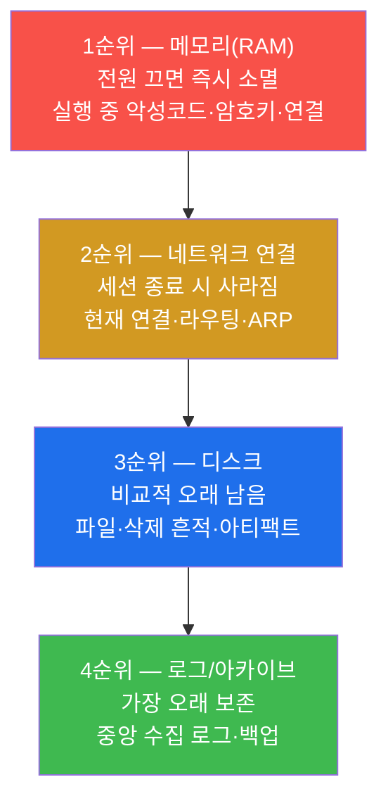

가장 먼저 사라지는 **메모리**부터 수집하고, 가장 오래 남는 **로그**를 마지막에 수집한다. 순서를
뒤집으면(예: 디스크 이미징을 먼저 하느라 시간을 끌면) 그사이 메모리의 결정적 증거(실행 중이던 악성
프로세스, 복호화된 암호키)가 전원 종료·세션 만료로 영영 사라진다.

### 0.5.4 신고 의무 72시간 — 멈추지 않는 법정 마감 시계

개인정보가 유출됐다는 것을 조직이 **인지하는 순간**, 보이지 않는 시계가 돌기 시작한다. 한국
**개인정보보호법**은 개인정보 유출을 **인지한 때로부터 72시간 이내**에 개인정보보호위원회 또는 KISA(한국
인터넷진흥원)에 신고하고, **정보주체(개인정보의 주인)** 에게도 통지하도록 정한다.

이 시계의 무서운 점은 **결과와 무관하게 기한 초과 자체가 위반**이라는 것이다. 사고를 잘 막았어도,
피해가 작았어도, 72시간을 넘겨 신고했다면 그 지연 자체로 과징금·과태료 대상이 될 수 있다. 그래서
"언제·무엇을·누구에게 신고하는가"를 **사고가 나기 전에**(준비 단계) 플레이북으로 정해두는 것이 핵심이다.

> **주의 — 정확한 기한·창구는 법령으로 확인하라.** 본 강의는 "유출 인지 후 72시간 이내 신고 + 정보주체
> 통지"라는 개인정보보호법의 원칙을 다룬다. 다만 신고 대상·예외·구체 기한·창구는 법 개정과 사안(유출
> 규모·정보 유형)에 따라 달라질 수 있으므로, 실무에서는 **반드시 최신 개인정보보호법·시행령 및 관계기관
> 고시**로 확인한다. 컴플라이언스의 기본자세는 "외워서 단언"이 아니라 "근거 조항으로 확인"이다.

---

## 1. 왜 "막기"가 아니라 "준비·절차·증거·기한"인가

### 1.1 한 줄 답: 침해는 시간 문제이고, 컴플라이언스는 "그 다음"을 본다

완벽한 방어는 없다. 충분한 시간과 동기를 가진 공격자, 0-day 취약점, 내부자, 협력업체 경유 침투 앞에서는
어떤 조직도 "절대 안 뚫린다"고 장담할 수 없다. 그래서 성숙한 보안과 컴플라이언스의 질문은 **"뚫리는가"
가 아니라 "뚫렸을 때 책임 있게 대응할 준비가 되어 있는가"** 로 옮겨간다. 사고대응 컴플라이언스가 보는
것은 정확히 네 가지다.

- **준비했는가(preparedness).** 사고가 나기 전에 CSIRT·플레이북·탐지 체계·증적 절차·신고 창구를
  갖췄는가. 준비 없는 조직은 사고 당일에 "누구한테 보고하지?"부터 헤맨다.
- **절차대로 했는가(process).** 우왕좌왕이 아니라 표준 생명주기(NIST SP 800-61)를 따라 탐지→봉쇄→
  근절→복구→사후를 밟았는가.
- **증거가 남는가(evidence).** 무엇이 언제 어떻게 침해됐는지, 그리고 우리가 어떻게 대응했는지가
  추적·재현 가능하게 기록됐는가(chain of custody).
- **기한을 지켰는가(timeliness).** 개인정보 유출 같은 법정 신고 의무를 정해진 기한(72시간) 안에
  이행했는가.

### 1.2 실 사고가 주는 교훈 3가지 (이 강의의 동기)

특정 사고의 세부는 사안마다 다르지만, 사고 후 분석이 반복해서 지적하는 **실패 유형**은 다음 세 가지로
모인다. 본 강의는 이 세 실패를 각각 방지하는 통제를 다룬다.

| 실패 유형 | 무엇이 잘못됐나 | 어느 통제가 막았어야 했나 |
|-----------|----------------|---------------------------|
| **탐지 지연** | 침해를 수개월간 알아채지 못함(평균 체류 시간 dwell time 이 길수록 피해 확대) | SIEM 고위험 알림·트리아지(탐지 단계, 미션 2) |
| **증거 멸실** | 대응 중 원본을 덮어쓰거나 휘발성 증거를 놓쳐 원인 규명·법적 소명 실패 | 휘발성 우선 수집·chain of custody(증적, 미션 4) |
| **신고 지연·누락** | 개인정보 유출을 법정 기한 내 신고하지 않아 과징금·신뢰 추락 | 72시간 신고 체계·플레이북(신고, 미션 5) |

> **핵심.** 위 세 실패는 모두 "방화벽이 약해서"가 아니라 **"사고 다음을 준비하지 않아서"** 생긴다.
> 컴플라이언스 감사는 바로 이 "다음의 준비"를 점검한다.

### 1.3 IR 생명주기를 ISMS-P 통제에 매핑하기

본 주차의 표준은 두 축이다 — 국제 표준 **NIST SP 800-61**(IR 생명주기의 사실상 표준)과 한국 인증 기준
**ISMS-P 2.11(사고 예방 및 대응)**. 둘은 다른 문서지만 같은 골격을 요구한다. 감사자는 한 사고대응 활동을
보며 "이건 NIST 의 어느 단계이고, ISMS-P 의 어느 통제 증거인가"를 동시에 자리매김할 수 있어야 한다.

| NIST SP 800-61 단계 | 핵심 활동 | 대응 ISMS-P 2.11 관점 |
|---------------------|-----------|------------------------|
| ① 준비(Preparation) | CSIRT·플레이북·도구·연락망·훈련 | 사고 대응 체계 수립, 모의훈련 |
| ② 탐지·분석(Detection & Analysis) | 알림 트리아지, 범위·영향 파악 | 침해 시도 모니터링·탐지 |
| ③ 봉쇄·근절·복구(Containment·Eradication·Recovery) | 확산 차단 → 원인 제거 → 정상화 | 사고 대응 및 복구 절차 |
| ④ 사후(Post-Incident) | 교훈 도출, 재발 방지, 보고 | 사고 재발 방지, 관계기관 통지·보고 |

### 1.4 한계 — 이 주차가 다루지 않는 것

본 주차는 **컴플라이언스 관점의 사고대응** — 즉 "절차·증거·신고 요건이 갖춰졌는가"의 점검에 집중한다.
따라서 다음은 본격 범위가 아니다. 첫째, **실전 디지털 포렌식의 기술적 깊이**(메모리 덤프 도구 사용,
디스크 이미징, 타임라인 분석 등)는 SOC/포렌식 트랙의 영역이며, 본 주차는 그 **원칙**(휘발성 순서·해시·
연속성)만 다룬다. 둘째, **정확한 법령 조문·기한·예외**는 개정에 따라 달라지므로 본 주차는 "72시간 신고"
같은 **원칙**을 익히되 실무 단언은 최신 법령 확인을 전제로 한다(§0.5.4 주의). 셋째, 본 주차의 점검은
**el34 의 인가된 시스템**에 대해서만 수행하며, 그 밖의 시스템에 같은 점검을 시도해서는 안 된다.

---

## 2. 사고대응 컴플라이언스 한 바퀴 — 점검 5 영역 상세

본 주차의 점검은 한 감사자가 el34 의 사고대응 준비 상태를 한 바퀴 점검하는 흐름이다. 명령은 el34
호스트(`ssh ccc@192.168.0.80`, 비밀번호 1)에 접속한 뒤 `docker exec el34-siem`(SIEM 탐지) 등으로
실행한다. 신규 도구 설치는 없다. 각 영역은 **한 줄 정의 → 무엇을 점검하나 → el34 에서 어떻게 보이나 →
한계**의 4축으로 설명한다.

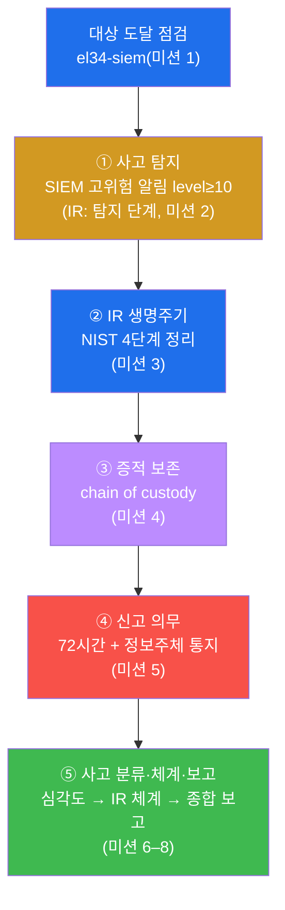

### 2.1 ① 사고 탐지 — SIEM 고위험 알림 (IR: 탐지 단계)

**한 줄 정의.** 사고 탐지는 SIEM 이 모은 이벤트 중 **고위험 알림**을 가려내, IR 생명주기의 **탐지 단계
입력**으로 삼는 것이다.

**무엇을 점검하나.** el34 의 SIEM 인 **Wazuh manager**(`el34-siem`)가 적재하는 알림 파일
`/var/ossec/logs/alerts/alerts.json` 에서 **고위험(level≥10)** 알림이 발생하는지 집계한다. Wazuh 는
각 알림에 0~15 의 **rule level**(심각도 점수)을 매기며, 운영 관례상 **level 이 높을수록 더 위험**하다.
본 점검은 그중 두 자리(10 이상) 알림을 사고 후보로 본다.

> **용어 — Wazuh rule level 과 alerts.json.** **Wazuh** 는 el34 의 SIEM(로그 중앙 수집·상관·알림
> 플랫폼, W01·W06 에서 다룸)이다. Wazuh 가 분석한 모든 알림은 한 줄에 한 JSON 으로
> `/var/ossec/logs/alerts/alerts.json` 에 적재되며, 각 알림에는 `rule.level` 필드(심각도)가 붙는다.
> **level≥10** 은 운영에서 즉시 주목해야 하는 고위험 알림의 통상 기준선이다(반대로 level 1~3 은 정보성
> 잡음에 가깝다). 사고대응은 이 고위험 알림을 트리아지의 출발점으로 삼는다.

**el34 에서 어떻게 보이나.** 최근 알림 일부(예: 마지막 3000줄)를 표본으로 고위험 알림 수를 센다.
출력의 `incidents=<수>` 가 탐지 단계로 넘길 사고 후보의 개수다. 수가 0 이라도 절차는 동일하다 — "현재
표본에 고위험 알림이 없음"이라는 것도 하나의 탐지 결과다.

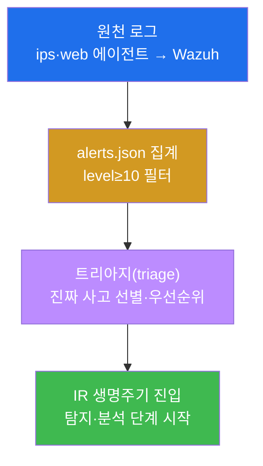

> **점검 명령의 표본(tail) 의미.** 본 미션의 명령은 `tail -3000 ... | grep -oE '"level":1[0-9]' | wc -l`
> 형태로, alerts.json 의 **최근 3000줄을 표본**으로 두 자리 level(10~19) 알림 수를 센다. 이는 거대한
> 로그 전체를 매번 훑지 않고 최근 상태를 빠르게 보는 운영 관용구다 — "전수 통계"가 아니라 "최근 표본의
> 고위험 알림 유무"를 확인하는 것이 목적임을 이해하고 결과를 읽는다.

**한계.** SIEM 고위험 알림은 탐지의 **입력**일 뿐, 그 자체가 "사고 확정"은 아니다. 오탐(false positive)
일 수 있고, 반대로 룰이 없는 신종 공격은 알림이 아예 안 뜰 수도 있다(미탐). 그래서 탐지 뒤에는 반드시
**사람의 트리아지·분석**(범위·영향 파악)이 따라야 IR 의 탐지·분석 단계가 완성된다.

### 2.2 ② IR 생명주기 — NIST SP 800-61 4단계

**한 줄 정의.** IR 생명주기는 사고를 **준비 → 탐지·분석 → 봉쇄·근절·복구 → 사후**의 순서로 다루는
표준 절차다.

**무엇을 점검하나.** 조직이 이 4단계를 **명확히 정의·문서화**하고 있는지를 본다. 컴플라이언스 점검에서는
학생이 각 단계의 핵심 활동을 정확히 진술하는 것으로 이 역량을 보인다(미션 3 의 명령은 4단계를 출력해
정리한다).

> **왜 "준비"가 맨 앞이자 토대인가.** NIST 가 생명주기의 첫 단계를 "준비"로 둔 것은, 나머지 세 단계의
> 품질이 전적으로 준비에 달려 있기 때문이다. 탐지가 빠르려면 미리 SIEM·룰이 있어야 하고, 봉쇄가
> 매끄러우려면 미리 플레이북이 있어야 하며, 사후가 의미 있으려면 미리 증적·로깅 체계가 있어야 한다.
> 준비가 부실하면 사고 당일에 모든 것을 즉흥으로 해야 한다.

**el34 에서 어떻게 보이나.** el34 는 이 생명주기를 학습할 토대를 갖추고 있다 — Wazuh(탐지), vhost별
로그·중앙 수집(분석·증적), 격리 가능한 컨테이너 구조(봉쇄 실습). 학생은 각 단계가 el34 의 어느
구성요소로 실현되는지를 연결해 이해한다.

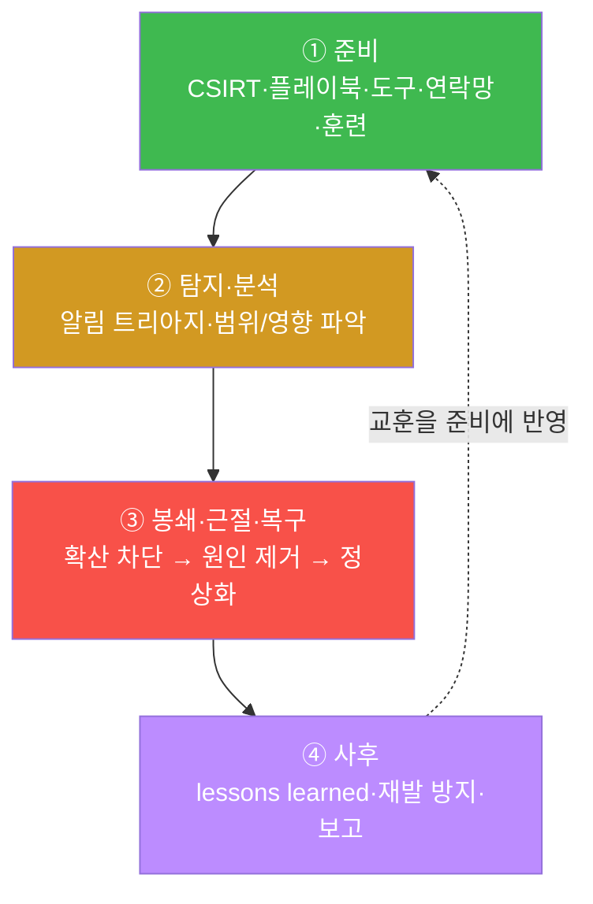

위 그림의 점선(사후 → 준비)이 핵심이다. IR 은 한 번 쓰고 끝나는 직선이 아니라 **순환(lifecycle)** 이다.
한 사고의 교훈(lessons learned)이 다음 사고를 위한 준비를 개선한다 — 이 되먹임이 조직의 대응 성숙도를
키운다.

**한계.** 생명주기를 "안다"와 "할 수 있다"는 다르다. 문서로 4단계를 적어두어도, 실제 사고 때 역할이
불분명하거나 연락이 닿지 않거나 플레이북이 현실과 다르면 무너진다. 그래서 ISMS-P 도 **정기 모의훈련**
(테이블탑)으로 이 절차의 실효성을 검증할 것을 요구한다(미션 7 의 체계 점검으로 이어짐).

### 2.3 ③ 증적 보존 — Chain of Custody

**한 줄 정의.** 증적 보존은 사고의 증거를 **사라지기 전에 올바른 순서로 수집**하고, **변조되지 않았음을
증명**하며, **취급 이력을 끊김 없이 기록**해 법적 증거능력을 확보하는 일이다.

**무엇을 점검하나.** 다음 3대 원칙이 절차로 정의되어 있는지를 본다.

- **휘발성 우선 수집(order of volatility).** 사라지는 속도 순으로 수집한다 — 메모리(RAM) > 네트워크
  연결 > 디스크 > 로그/아카이브(§0.5.3). 가장 먼저 사라지는 메모리부터 확보한다.
- **무결성(integrity).** 수집 즉시 **SHA-256 해시**를 떠 데이터의 지문을 남기고, **수집 시각·수집자**를
  기록하며, **원본은 보존하고 사본을 분석**한다(원본 미변경 원칙).
- **연속성(chain of custody).** 증거를 누가·언제·어떻게 다뤘는지 인계 인수 이력을 끊김 없이 문서화한다.
  이 연속성이 깨지면 법정에서 증거의 신뢰성이 부정된다.

> **용어 — SHA-256 해시와 "원본 미변경".** **SHA-256** 은 임의의 데이터를 256비트(64자 16진수)의 고유
> 지문으로 바꾸는 해시 함수다. 같은 데이터는 항상 같은 해시를, 한 비트라도 다르면 전혀 다른 해시를 낸다.
> 그래서 수집 시점의 해시와 분석 시점의 해시가 같으면 "그사이 데이터가 변조되지 않았다"가 수학적으로
> 증명된다. **원본 미변경**이란, 증거 원본은 읽기 전용으로 봉인해 두고 **복제한 사본에서만 분석**한다는
> 원칙이다 — 분석 중 실수로 원본을 덮어써 증거를 망치는 것을 막는다.

**el34 에서 어떻게 보이나.** el34 환경에서 사고 증거가 될 수 있는 대표 자료는 SIEM 의
`alerts.json`·ips 의 `eve.json`·web 의 vhost별 로그다. 이들을 다룰 때도 동일한 원칙을 적용한다 — 원본을
직접 편집하지 않고(`tail`/`grep` 으로 **읽기만**), 보존이 필요하면 사본을 떠 해시·수집 시각을 남긴다.

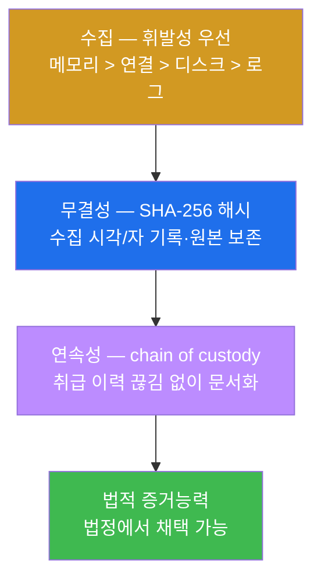

**한계.** 본 주차는 증적 보존의 **원칙**을 점검한다. 실제 포렌식에서는 도구(메모리 덤프·디스크 이미징·
무결성 검증 도구)의 정확한 사용, 법 집행기관 인계 절차, 증거 보관 시설(evidence locker) 관리까지가
포함되며, 이는 포렌식 전문 영역이다. 컴플라이언스 감사는 "이 원칙을 따르는 절차가 정의·이행되는가"를
확인하는 데 초점을 둔다.

### 2.4 ④ 신고 의무 — 개인정보보호법 72시간

**한 줄 정의.** 신고 의무는 개인정보가 유출됐을 때 **법정 기한(인지 후 72시간) 안에** 규제기관에 신고하고
정보주체에게 통지해야 하는 법적 책임이다.

**무엇을 점검하나.** 조직이 다음을 **사전에 정의**하고 있는지를 본다 — **언제**(유출 인지 시점부터 72시간),
**무엇을**(유출 항목·시점·원인·대응·문의처), **누구에게**(개인정보보호위원회/KISA 신고 + 정보주체 통지).
핵심은 이 신고 절차가 사고 당일에 즉흥으로 만들어지는 게 아니라 **준비 단계의 플레이북**으로 미리 정해져
있어야 한다는 점이다.

> **용어 — 정보주체 통지 vs 규제기관 신고.** 개인정보 유출 시 의무는 **두 방향**이다. (1) **규제기관
> 신고** — 개인정보보호위원회 또는 KISA 에 사고를 알린다. (2) **정보주체 통지** — 개인정보의 주인 본인
> 에게 "당신의 어떤 정보가, 언제, 어떻게 유출됐고, 우리가 무엇을 하고 있으며, 어디로 문의하면 되는지"를
> 알린다. 통지는 피해 당사자가 2차 피해(예: 유출된 정보로 인한 사칭·피싱)에 대비할 수 있게 하는, 정보
> 주체의 권리 보호 장치다.

**el34 에서 어떻게 보이나.** el34 는 실 개인정보를 다루는 운영계가 아닌 학습 환경이므로, 본 점검은 실제
신고가 아니라 **신고 의무의 내용·기한·절차를 정확히 진술**하는 것으로 역량을 확인한다(미션 5). 실무라면
이 시계는 SIEM 이 유출 정황을 탐지해 사고로 확정한 시점부터 돌기 시작한다 — 그래서 §2.1 의 **탐지 시각
기록**이 신고 기한 산정의 출발점이 된다.

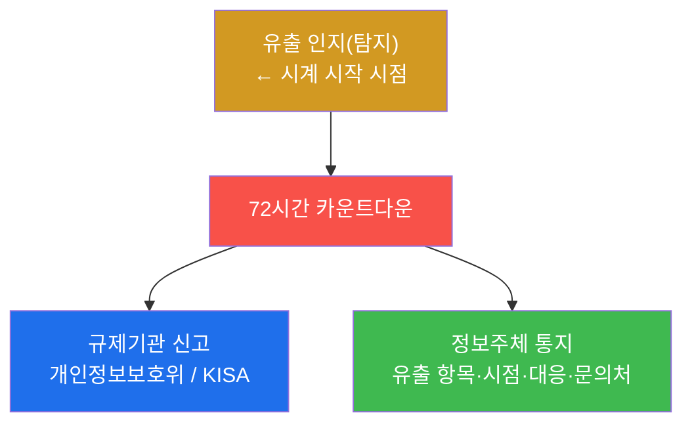

**한계.** "72시간"은 개인정보보호법의 대표 원칙이지만, **정확한 기한·신고 대상·예외·창구는 법 개정과
사안(유출 규모·정보 유형)에 따라 달라진다**(§0.5.4 주의). 또한 산업·규제(금융·의료·해외 GDPR 등)마다
별도의 신고 의무가 추가될 수 있다. 컴플라이언스 실무의 정답은 "외운 숫자"가 아니라 **그때그때 최신 법령
조항으로 확인**하는 습관이다.

### 2.5 ⑤ 사고 분류·체계·종합 — 심각도 → IR 체계 → 보고

**한 줄 정의.** 마지막 영역은 사고를 **심각도로 분류**하고(미션 6), 그 대응을 떠받치는 **IR 체계**를
점검하며(미션 7), 전체를 하나의 **사고대응 보고서**로 종합하는 것이다(미션 8).

**무엇을 점검하나.**

- **사고 심각도 분류.** 심각도는 **영향 범위 × 데이터 민감도 × 지속·확산성**으로 결정한다. 등급(예:
  Critical/High/Medium/Low)이 **에스컬레이션 여부·신고 여부·대응 SLA(대응 속도)** 를 좌우한다. 예컨대
  개인정보 대량 유출이나 핵심 시스템 장악은 Critical 로, 즉시 에스컬레이션 + 신고 검토 대상이다.
- **IR 체계(준비).** 사고대응을 떠받치는 6개 구성요소 — CSIRT(조직·연락망), 플레이북(유형별 절차),
  SIEM 탐지·자동 알림, 증적 절차(chain of custody) 표준화, 신고 체계(기한·창구) 사전 정의, 정기
  훈련(테이블탑/모의훈련) — 이 갖춰졌는지 점검한다.
- **종합 보고.** 탐지/IR 생명주기 + 증적/신고 + 체계를 하나의 보고서로 묶는다.

> **용어 — 심각도와 SLA·에스컬레이션.** **심각도(severity)** 는 사고의 위험 등급이다. **SLA**
> (Service Level Agreement)는 등급별로 "몇 분/시간 안에 대응을 시작·완료한다"는 약속된 대응 속도다.
> **에스컬레이션(escalation)** 은 사고를 상급자·CISO·관계기관으로 격상 보고하는 것으로, 심각도가 높을수록
> 더 빨리·더 높은 곳으로 올린다. 즉 **심각도가 대응의 속도와 범위를 결정**한다.

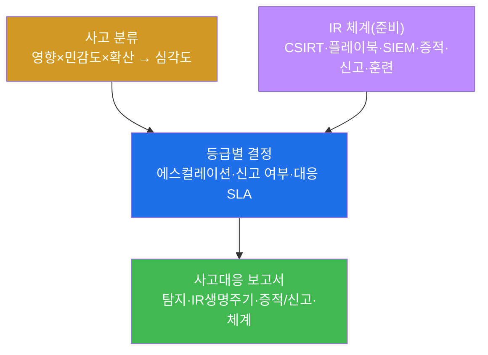

**한계.** 심각도 기준은 조직마다 달라 절대 정답이 없다 — 같은 사고도 업종·규제·자산 가치에 따라 다르게
분류된다. 중요한 것은 **일관된 기준을 미리 정의**해 두는 것이다. IR 체계도 "문서로 존재"가 끝이 아니라
**훈련으로 작동을 검증**해야 실효가 있다(테이블탑 훈련). 종합 보고서 역시 본 주차는 골격까지이며, 실무
보고서에는 타임라인·근본원인분석(RCA)·재발 방지 계획·담당·기한이 더해진다.

---

## 3. 점검 대상 `el34-siem` 의 구조와 점검 경로

본 주차 점검의 중심 대상은 el34 의 **siem 컨테이너**(`el34-siem`, Wazuh manager)다. 사고대응의
출발점인 "탐지"가 여기서 나오기 때문이다.

### 3.1 왜 `el34-siem` 이 사고대응 점검의 중심인가

`el34-siem` 은 el34 4-tier 의 **dmz 계층**에 있는 **Wazuh manager**(SIEM 의 두뇌, W01·W06 에서 다룸)
이다. ips(`el34-ips`)와 web(`el34-web`)에 설치된 Wazuh 에이전트가 보낸 로그·이벤트를 한곳으로 모아
상관·평가하고, 결과를 `/var/ossec/logs/alerts/alerts.json` 에 적재한다. 사고대응의 첫 단추인 **탐지**가
바로 이 적재된 고위험 알림에서 시작되므로, 사고대응 컴플라이언스 점검의 중심 대상이 된다.

### 3.2 점검 명령의 경로 — 호스트 SSH + docker exec

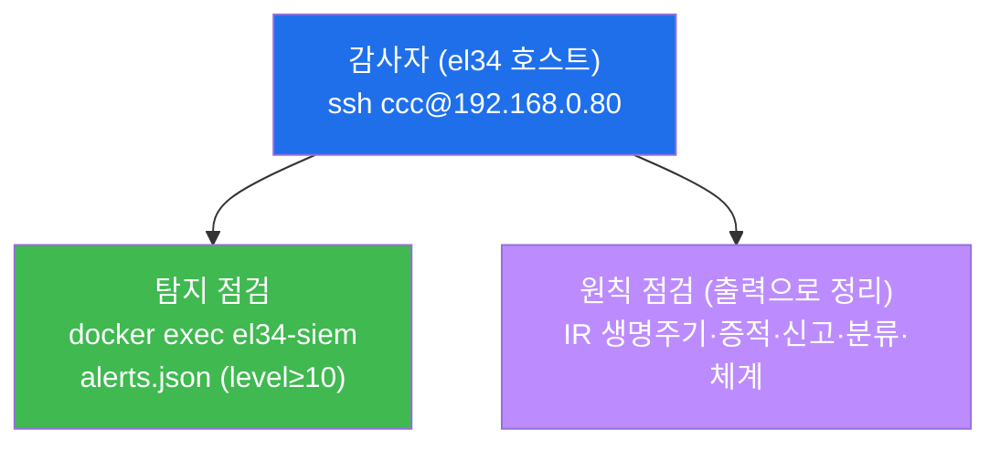

감사자는 호스트(`192.168.0.80`)에 한 번 SSH 로 들어간 뒤, `docker exec el34-siem` 으로 SIEM 컨테이너에
진입해 알림 파일을 **읽는다**(탐지 점검, 미션 2). IR 생명주기·증적·신고·분류·체계 같은 **절차/원칙**
점검은 그 내용을 정확히 정리·진술하는 형태(미션 3–8)로 이뤄진다. 신규 도구 설치는 없고, 기존 OS
명령(`tail`/`grep`/`echo`)과 컨테이너에 이미 있는 로그만 쓴다.

> **el34 사실 복습.** el34 의 4-tier 세그먼트는 `ext 10.20.30` / `pipe 10.20.31` / `dmz 10.20.32` /
> `int 10.20.40` 이다. Wazuh 에이전트는 현재 **ips(003)** 와 **web(004)** 가 활성이며, 이들이 보낸
> 이벤트가 siem(dmz .100)의 `alerts.json` 에 모인다(W01 토폴로지·W06 로깅 복습).

---

## 4. 감사자 관점과 운영자 관점 — 한 알림의 두 얼굴

사고대응 컴플라이언스의 정점은, **같은 한 건의 SIEM 고위험 알림이 운영자(SOC)에게는 '대응할 사고'이고
감사자(컴플라이언스)에게는 '체계가 작동한 증거'** 임을 이해하는 것이다.

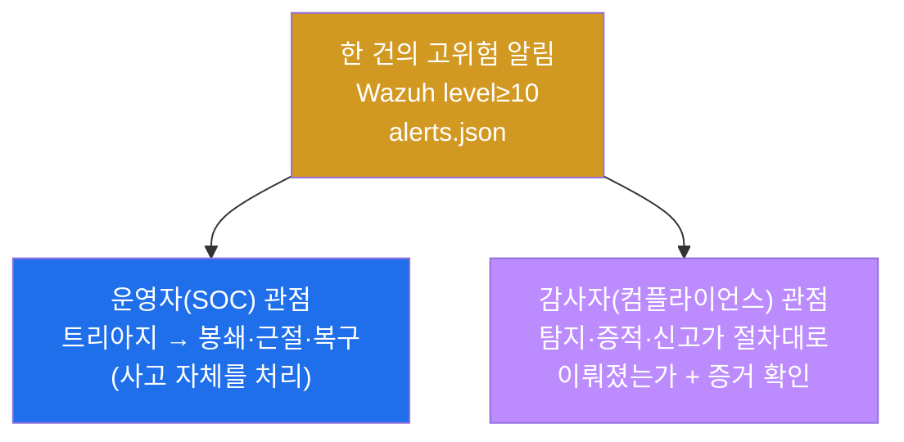

| 관점 | 무엇을 보나 | 핵심 산출물 |
|------|-------------|------------|
| 운영자(SOC) | 알림을 사고로 처리 — 트리아지→봉쇄→근절→복구 | 사고가 실제로 수습됨 |
| 감사자(컴플라이언스) | 그 처리가 절차·증거·기한 요건을 지켰는가 | 준수/갭 판정 + 증적(보고서) |

같은 `alerts.json` 한 줄을, SOC 는 "막아야 할 일"로 보고 감사자는 "체계가 작동했다는 증거"로 본다. 이
양면을 함께 볼 수 있으면, 사고대응 보고서에 "이 사고를 어떻게 수습했고(운영), 그 수습이 NIST 생명주기·
증적·신고 요건을 어떻게 충족했는가(감사)"까지 적을 수 있다 — 이것이 단순 사고 처리를 넘어 **컴플라이언스
와 연결되는 사고대응**의 시야다. 이 연결은 secuops/soc 트랙의 IR 실무와도 곧장 이어진다.

---

## 5. 판단 프레임워크 — "이 미션은 어느 단계·무엇·어떻게 판정"

본 주차의 핵심 능력은 점검 항목을 만났을 때 **그것이 IR 의 어느 단계이고, 어느 표준/법 조항이며, 무엇을
확인하는가**를 즉시 자리매김하는 것이다. 다음 표가 그 판단의 정답지이며, lab 8 미션의 순서와 1:1 로
대응한다.

| 미션 | 점검 영역 | IR 단계 | 표준/법 | 무엇을 확인 | 합격 신호(증적) |
|------|-----------|---------|---------|-------------|------------------|
| 1 | 대상 도달 | (전제) | — | el34-siem 접근 | `target_ok` |
| 2 | 사고 탐지 | 탐지·분석 | Wazuh level≥10 | 고위험 알림 집계 | `incidents=<수>` |
| 3 | IR 생명주기 | (전체 4단계) | NIST SP 800-61 / ISMS-P 2.11 | 4단계 정리 | `봉쇄` 포함 출력 |
| 4 | 증적 보존 | 분석·사후 | 포렌식 원칙(chain of custody) | 휘발성·무결성·연속성 | `휘발성` 포함 출력 |
| 5 | 신고 의무 | 사후 | 개인정보보호법(72h) | 기한·신고처·통지 | `72` 포함 출력 |
| 6 | 사고 분류 | 탐지·분석 | 심각도 모델 | 영향×민감도×확산 | `심각도` 포함 출력 |
| 7 | IR 체계(방어) | 준비 | NIST/ISMS-P | CSIRT·플레이북·훈련 등 | `플레이북` 포함 출력 |
| 8 | 종합 보고 | (종합) | — | 탐지·생명주기·증적/신고·체계 | `72` 포함 보고서 |

이 표를 읽는 법은 네 방향이다. **"IR 의 어느 단계인가"** — 모든 점검은 생명주기의 한 지점에 놓인다.
**"어느 표준/법인가"** — 판정에는 항상 근거(NIST·개인정보보호법·ISMS-P)가 붙는다. **"무엇을
확인하는가"** — 탐지 수치인지, 절차 진술인지, 보고서인지. **"증적은 무엇인가"** — 출력의 어떤 신호로
합격을 읽는지. 네 방향을 모두 말할 수 있으면 사고대응 컴플라이언스의 판단력을 갖춘 것이다.

> **채점 포인트.** 본 주차는 "사고를 막았다"가 아니라, **탐지를 확인하고 · 표준 생명주기를 정리하며 ·
> 증적/신고 요건을 진술하고 · 그것을 체계로 종합**했는가를 본다. 각 미션의 합격 신호(증적)를 출력으로
> 남기는 것이 점수다. 합격 임계값은 0.7 이다.

---

## 6. 점검 명령 빠른 복습 — "무엇을 어디서 보나"

본 주차에서 각 영역을 점검하는 핵심 명령을 한 번에 정리한다. 모든 명령은 el34 호스트(`ssh
ccc@192.168.0.80`, 비밀번호 1)에서 실행하며, 신규 도구 설치는 없다.

### 6.1 사고 탐지 (SIEM 고위험 알림 — 미션 2)

```bash
docker exec el34-siem sh -c 'N=$(tail -3000 /var/ossec/logs/alerts/alerts.json 2>/dev/null | grep -oE "\"level\":1[0-9]" | wc -l); echo "incidents=$N"'
```

무엇을 보나 — `incidents=` 뒤의 수. alerts.json 최근 3000줄 표본에서 두 자리 level(10~19) 고위험 알림의
개수다(IR 탐지 단계 입력).

### 6.2 IR 생명주기 (NIST 4단계 — 미션 3)

```bash
echo "준비→탐지·분석→봉쇄·근절·복구→사후(교훈)"
```

무엇을 보나 — NIST SP 800-61 의 4단계. **봉쇄/근절/복구**가 한 단계로 묶이는 점, **사후→준비**의
되먹임이 핵심이다.

### 6.3 증적 보존 (chain of custody — 미션 4)

```bash
echo "휘발성 우선(메모리>연결>디스크>로그), 해시(SHA-256), 수집시각/자, 원본보존+사본분석"
```

무엇을 보나 — 증적 3대 원칙(휘발성 우선 수집·무결성·연속성). 셋이 갖춰져야 법적 증거능력이 생긴다.

### 6.4 신고 의무 (72시간 — 미션 5)

```bash
echo "개인정보 유출: 인지 후 72시간 내 신고(개인정보보호위/KISA) + 정보주체 통지"
```

무엇을 보나 — 신고의 **언제(72h)·누구에게(보호위/KISA)·무엇을(정보주체 통지)**. 기한 초과 자체가
위반임을 기억한다.

### 6.5 사고 분류·체계 (심각도·IR 체계 — 미션 6–7)

```bash
# 사고 분류(심각도)
echo "심각도: 영향범위×데이터민감도×지속성. Critical(개인정보 대량 유출) 즉시 에스컬레이션"
# IR 체계(준비)
echo "CSIRT+플레이북+SIEM탐지+증적절차+신고체계+정기훈련(테이블탑)"
```

무엇을 보나 — 심각도가 에스컬레이션·신고·SLA 를 결정하고, IR 체계 6요소가 대응을 떠받친다.

---

## 7. 실습 안내 — lab 8 미션 (4 축 설명)

본 주차 실습은 8 미션으로 구성된다. 각 미션을 **4 축**으로 설명한다 — 왜 하는가 / 무엇을 알 수 있는가 /
결과 해석 / 실전 활용. 미션은 점검(도달성) → 사고 탐지 → IR 생명주기 → 증적 보존 → 신고 의무 → 사고
분류 → IR 체계 → 종합 보고 순서로 흐르며, lab 의 `order` 와 1:1 로 대응한다.

> **진행 원칙.** 모든 명령은 el34 호스트(`ssh ccc@192.168.0.80`)에서 `docker exec el34-siem`(탐지) 또는
> `echo`(원칙 정리)로. 각 미션은 **독립적**이며, **인가된 표적(el34)** 만 점검한다. 합격 임계값은 0.7 이다.

### 미션 1 — 점검: 표적 `el34-siem` 에 도달하나 (10점)

> **왜 하는가?** 사고대응 점검의 전제는 탐지의 원천인 SIEM 에 접근이 된다는 것이다. 감사자는 본격 점검
> 전 항상 대상의 도달성부터 확인한다(접근이 안 되면 모든 음성 결과가 무의미하다).
>
> **무엇을 알 수 있는가?** `docker exec el34-siem` 으로 hostname 이 응답하는지 — 사고대응 점검의 중심
> 대상(Wazuh manager)이 실제 살아있고 점검 가능한 상태인지.
>
> **결과 해석.** 정상: 출력에 `target_ok` 가 나옴(대상 접근 성공). 비정상: 응답이 없으면 호스트 SSH·
> 컨테이너 상태(`docker ps`)부터 점검한다.
>
> **실전 활용.** 사고대응 점검 착수 시 첫 확인. 탐지 원천(SIEM)이 가동·접근 가능한지를 검증하는 단계다.

### 미션 2 — 사고 탐지: SIEM 고위험 알림 (14점)

> **왜 하는가?** 탐지 없는 IR 은 시작조차 못 한다. 사고대응의 첫 단추는 SIEM 이 모은 이벤트에서 고위험
> 알림을 가려내는 것이다.
>
> **무엇을 알 수 있는가?** Wazuh 가 `alerts.json` 에 적재한 알림 중 **고위험(level≥10)** 알림의 수.
> 이 수가 IR 생명주기 탐지 단계로 넘길 사고 후보의 개수다. level 이 높을수록 위험하다.
>
> **결과 해석.** 정상: 출력에 `incidents=<수>` 가 나옴(탐지 집계 성공). 수가 0 이어도 "현재 표본에
> 고위험 알림 없음"이라는 정상적 탐지 결과다. 비정상: 명령 오류·파일 없음이면 SIEM 상태·경로
> (`/var/ossec/logs/alerts/alerts.json`)를 점검한다.
>
> **실전 활용.** SOC 의 일상 1순위 — 고위험 알림 집계로 사고 후보를 매일 트리아지한다. 이 수가 곧
> 분석가가 들여다볼 사건 큐(queue)다.

### 미션 3 — IR 생명주기: NIST SP 800-61 4단계 (12점)

> **왜 하는가?** 사고는 즉흥이 아니라 **표준 절차**로 다뤄야 우왕좌왕을 막는다. NIST SP 800-61 의 4단계는
> IR 의 사실상 표준이다.
>
> **무엇을 알 수 있는가?** 준비 → 탐지·분석 → 봉쇄·근절·복구 → 사후의 4단계와 각 단계의 핵심 활동. 특히
> **준비가 토대**이고, **사후의 교훈이 다음 준비로 되먹임**되는 순환 구조.
>
> **결과 해석.** 정상: 출력에 4단계가 정리되고 `봉쇄`(3단계의 핵심어)가 포함됨. 비정상: 단계가 빠지거나
> 순서가 틀리면 §2.2 로 돌아가 4단계를 다시 정리한다.
>
> **실전 활용.** 모든 IR 플레이북·사고 보고서의 골격. "우리가 지금 어느 단계인가"를 항상 자리매김하는
> 기준이 된다(ISMS-P 2.11 의 사고 대응 체계 증거).

### 미션 4 — 증적 보존: Chain of Custody (12점)

> **왜 하는가?** 증거 없는 대응은 원인 규명도, 법적 소명도 불가능하다. 사고 증거는 **사라지기 전에·
> 변조 없이·이력을 남기며** 다뤄야 법정에서 살아남는다.
>
> **무엇을 알 수 있는가?** 증적 3대 원칙 — 휘발성 우선 수집(메모리>연결>디스크>로그), 무결성(SHA-256
> 해시·수집 시각/자·원본 보존+사본 분석), 연속성(chain of custody 문서화). 셋이 갖춰져야 **법적 증거능력**
> 이 생긴다.
>
> **결과 해석.** 정상: 출력에 수집 순서·무결성·연속성이 정리되고 `휘발성`이 포함됨. 비정상: 한 원칙이라도
> 빠지면 §2.3 으로 돌아가 보완한다.
>
> **실전 활용.** 디지털 포렌식·법적 대응의 기본기. el34 의 로그(`alerts.json` 등)를 다룰 때도 원본을
> 직접 편집하지 않고 읽기만 하는 습관이 이 원칙의 실천이다.

### 미션 5 — 신고 의무: 개인정보보호법 72시간 (14점)

> **왜 하는가?** 개인정보 유출은 **법정 기한 내 신고**가 의무이고, 기한 초과는 그 자체로 위반(과징금)
> 이다. 잘 막았어도 늦게 신고하면 처벌받을 수 있다.
>
> **무엇을 알 수 있는가?** 신고의 **언제**(인지 후 72시간), **누구에게**(개인정보보호위원회/KISA 신고 +
> 정보주체 통지), **무엇을**(유출 항목·시점·대응·문의처). 그리고 이 절차를 **준비 단계에서 미리 정의**
> 해야 한다는 원칙.
>
> **결과 해석.** 정상: 출력에 `72`(시간)·신고처·정보주체 통지가 정리됨. 비정상: 기한·창구가 빠지면
> §2.4 와 §0.5.4 주의를 다시 확인한다.
>
> **실전 활용.** 사고 플레이북의 필수 항목. 실무에서는 정확한 기한·대상·예외를 **최신 개인정보보호법·
> 시행령**으로 확인하는 것이 정답이다(외운 숫자로 단언하지 않는다).

### 미션 6 — 사고 분류: 심각도 (12점)

> **왜 하는가?** 모든 사고를 똑같이 다룰 수는 없다. 심각도가 **무엇부터·얼마나 빨리·어디까지** 대응할지를
> 결정한다.
>
> **무엇을 알 수 있는가?** 심각도 = **영향 범위 × 데이터 민감도 × 지속·확산성**. 등급(Critical/High/
> Medium/Low)이 에스컬레이션·신고 여부·대응 SLA 를 좌우한다. 개인정보 대량 유출은 Critical 로 즉시
> 에스컬레이션·신고 검토 대상.
>
> **결과 해석.** 정상: 출력에 분류 기준과 `심각도`가 정리됨. 비정상: 기준 축이 빠지면 §2.5 로 돌아가
> 보완한다.
>
> **실전 활용.** 트리아지의 핵심 도구. 일관된 심각도 기준을 미리 정의해 두어야 사고마다 흔들리지 않는
> 대응이 가능하다.

### 미션 7 — 방어: IR 체계 (12점)

> **왜 하는가?** IR 의 성패는 사고 당일이 아니라 **그 전의 준비**에서 갈린다. 대응을 떠받치는 체계가
> 미리 갖춰져 있어야 한다.
>
> **무엇을 알 수 있는가?** IR 체계 6요소 — CSIRT(조직·연락망), 플레이북(유형별 절차), SIEM 탐지·자동
> 알림, 증적 절차(chain of custody) 표준화, 신고 체계(기한·창구) 사전 정의, 정기 훈련(테이블탑/모의훈련).
>
> **결과 해석.** 정상: 출력에 체계 구성요소가 정리되고 `플레이북`이 포함됨. 비정상: 요소가 빠지면 §2.5
> 의 체계 그림을 다시 확인한다.
>
> **실전 활용.** ISMS-P 2.11 의 "사고 예방 및 대응 체계" 증거. 특히 **정기 훈련**으로 이 체계의 실제
> 작동을 검증하는 것이 컴플라이언스의 요구다(문서만으로는 부족).

### 미션 8 — 사고대응 보고서 (12점)

> **왜 하는가?** 사고대응의 산출물은 보고서다. 미션 1–7 의 점검을 한 문서로 종합해야 대응이 완성되고,
> 경영진·관계기관에 소명할 수 있다.
>
> **무엇을 알 수 있는가?** 전 영역을 하나로 묶는 법 — **탐지/IR 생명주기 + 증적/신고(72h) + IR 체계**.
> "사고는 불가피하나 준비가 차이를 만든다"는 결론으로 닫는다.
>
> **결과 해석.** 정상: 보고서에 IR 생명주기·증적·신고(`72`)·체계가 포함됨. 비정상: 신고 기한·체계가
> 빠지면 해당 미션(5·7)으로 돌아가 보완한다.
>
> **실전 활용.** 사고대응 보고서의 표준 구조(개요 → 탐지/생명주기 → 증적/신고 → 체계 → 결론). 경영진
> 보고·관계기관 신고·다음 사고를 위한 lessons learned 의 토대가 된다.

---

## 8. 점검 수칙 — 인가된 점검과 원본 보존

사고대응 점검은 **허가받은 표적에 대해서만**, 그리고 **증거를 훼손하지 않으며** 한다. 다음 수칙을 반드시
지킨다.

- **인가된 표적만 점검한다.** el34 의 정해진 시스템(`el34-siem` 등)에 대해서만 점검하며, 같은 명령을 그
  밖의 어떤 시스템에도 시도해서는 안 된다.
- **읽기만, 원본은 보존한다.** 점검은 로그를 **읽어서 확인**할 뿐, alerts.json 등 원본을 편집·삭제·이동
  하지 않는다. 증거가 될 수 있는 자료는 사본을 떠 해시·시각·취급자를 남긴다(chain of custody).
- **탐지 시각을 기록한다.** 신고 기한(72시간)은 탐지(인지) 시점부터 시작하므로, 탐지 시각의 기록이 곧
  법적 기한 산정의 근거가 된다.
- **법령은 최신본으로 확인한다.** "72시간" 같은 원칙을 익히되, 실무 신고는 반드시 최신 개인정보보호법·
  시행령·관계기관 고시로 정확한 기한·대상·창구를 확인한다.

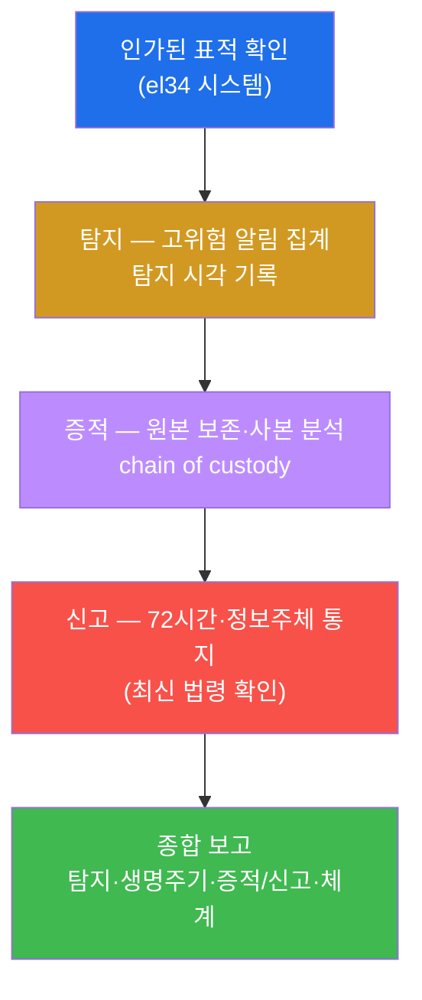

---

## 9. 다음 주차 (W12) 예고 — 데이터 보호와 개인정보

본 주차에서 학생은 사고가 **일어난 뒤**의 컴플라이언스 — 탐지·대응·증적·신고 — 를 점검했다. 그중 신고
의무(개인정보 유출 72시간)에서 자연스럽게 떠오르는 질문이 있다. **"그 개인정보는 애초에 어떻게 보호
되어야 했는가?"**

W12 는 사고의 "뒤"가 아니라 "앞"으로 시선을 옮겨 **데이터 보호와 개인정보**를 다룬다 — 한국
**개인정보보호법**과 유럽 **GDPR**(General Data Protection Regulation, 일반 개인정보보호 규정)의 처리
원칙(수집 최소화·목적 제한·보유 기간), 정보주체의 권리(열람·정정·삭제·이동), 그리고 그것이 el34 의 실제
서비스(juice)에서 어떻게 점검되는지를 본다. W11 의 "유출 후 신고"와 W12 의 "유출 전 보호"가 합쳐져야
개인정보 컴플라이언스의 전체 그림이 완성된다.

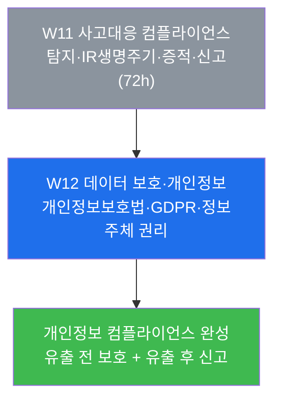
