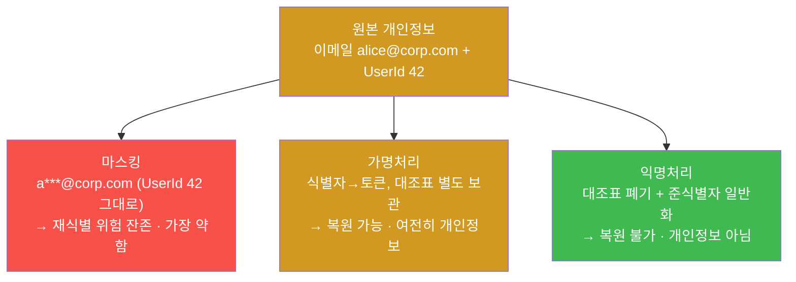
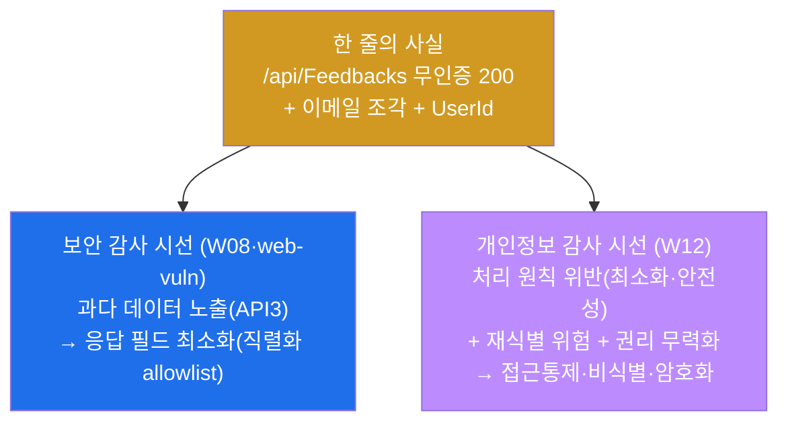
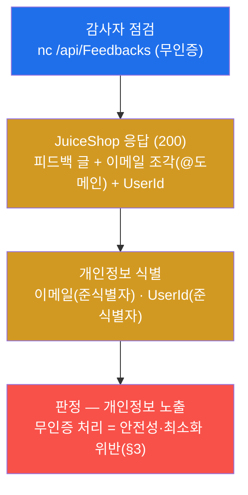
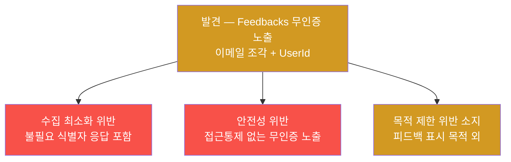
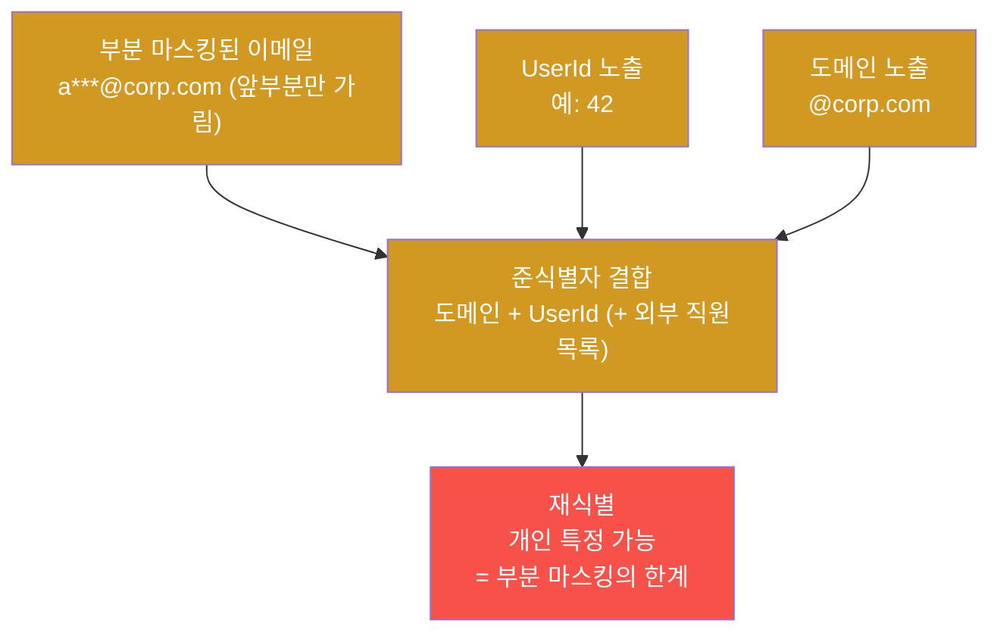
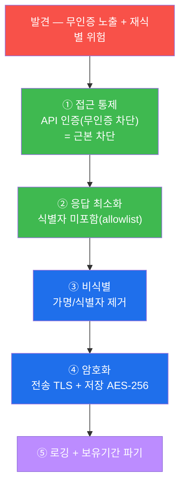
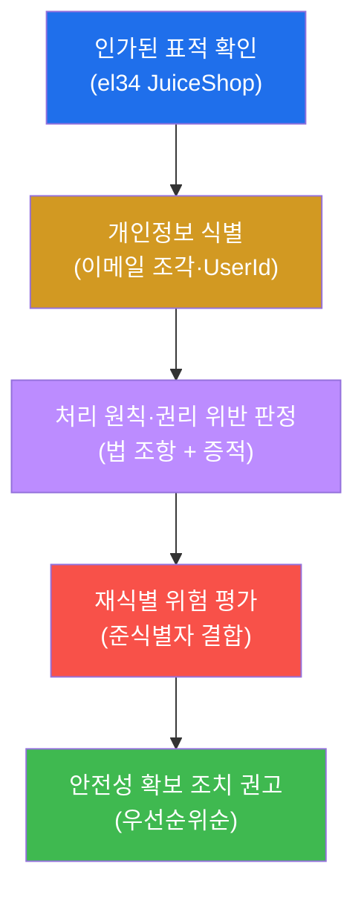
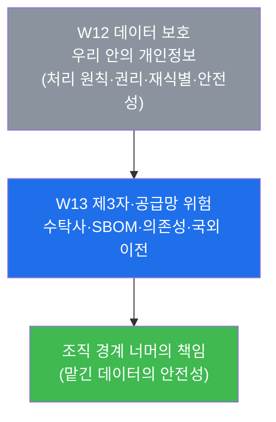

# 컴플라이언스 W12 — 데이터 보호와 개인정보 (개인정보보호법·GDPR, 처리 원칙·정보주체 권리·재식별)

> **본 주차의 한 줄 요약**
>
> 지금까지의 컴플라이언스 점검은 "시스템이 합의된 보안 기준을 지키는가"를 보았다. 12주차는 그 시선을
> **개인정보(personal data)** 한 가지로 좁힌다. 개인정보는 조직의 소유물이 아니라 **정보주체(개인)에게
> 빌린 것**이고, 그래서 수집·이용·보관·파기의 전 과정에 **개인정보보호법**과 **GDPR**이라는 별도의 법적
> 의무가 따른다. 학생은 한 명의 **개인정보 감사자(privacy auditor)** 가 되어, el34 의 JuiceShop
> `/api/Feedbacks` 가 무인증으로 **이메일 조각과 UserId** 를 흘리는 실제 결함을 표적으로, 그 위에
> **처리 원칙(최소화·목적 제한·보유 제한) → 정보주체 권리 → 재식별 위험 → 가명·익명·마스킹 → 안전성
> 확보 조치 → 종합 보고**의 한 바퀴를 적용한다.
>
> **개인정보 감사자 한 줄 결론**: 데이터 보호 감사는 "데이터가 새는가"만이 아니라, **"이 데이터가
> 개인정보인가, 어떤 법적 원칙을 어겼는가, 정보주체의 권리는 보장되는가, 그리고 무엇으로(비식별·접근
> 통제·암호화) 안전성을 확보할 것인가"를 법과 증적으로 입증**하는 일이다. 같은 한 줄의 API 응답이
> 보안 감사에서는 "과다 데이터 노출(W08·web-vuln W12)"이고, 개인정보 감사에서는 "처리 원칙 위반 +
> 재식별 위험"이다 — 본 주차는 그 두 번째 시선을 익힌다.

---

## 학습 목표

본 주차 종료 시 학생은 다음 6가지를 **본인 손으로** 할 수 있어야 한다.

1. 임의의 데이터를 보고 그것이 **개인정보인가, 가명정보인가, 익명정보인가** 를 개인정보보호법/GDPR의
   정의에 따라 판정하고, el34 의 `/api/Feedbacks` 응답에서 **이메일 조각·UserId** 라는 개인정보를
   직접 식별한다.
2. 개인정보 **처리 원칙 6가지**(목적 제한·수집 최소화·정확성·보유 제한·안전성·투명성)를 설명하고, 각
   원칙이 **어느 조항**(개인정보보호법 / GDPR 제5조)에 대응하는지, el34 의 Feedbacks 노출이 그중
   **어느 원칙을 위반**했는지 증적과 함께 판정한다.
3. **정보주체의 권리**(열람·정정·삭제·처리정지·동의철회, GDPR의 이동권·잊힐 권리)를 열거하고, 개인정보가
   무인증으로 노출될 때 이 권리들이 왜 실질적으로 무력화되는지 설명한다.
4. **재식별(re-identification) 위험**의 개념을 이해하고, **부분 마스킹**(예: `a***@도메인`)만으로는
   안전하지 않음을 — UserId·도메인 등 **준식별자(quasi-identifier)의 결합**으로 개인을 특정할 수
   있음을 el34 응답으로 입증한다.
5. **가명처리·익명처리·마스킹** 세 비식별 기법의 강도 차이와 법적 지위(가명정보는 여전히 개인정보,
   익명정보는 개인정보 아님)를 구분하고, Feedbacks 같은 결함에 어느 기법이 적정한지 판단한다.
6. 발견한 노출·위반·재식별 위험을 **안전성 확보 조치**(접근 통제·암호화·응답 필드 최소화·비식별·접근
   로깅·보유기간 파기)로 정렬하고, **노출 → 처리 원칙/권리 → 안전성 조치** 구조의 데이터 보호 감사
   보고서를 작성한다.

> **개인정보 감사의 시선** — 본 주차는 새 공격 기법을 배우는 주가 아니라, **이미 확인된 하나의 노출
> 결함**(JuiceShop Feedbacks)을 **개인정보 보호법의 렌즈**로 다시 보는 주다. 채점은 "데이터가 새더라"는
> 선언이 아니라, **그 데이터가 개인정보임을 식별하고 → 위반한 처리 원칙을 법 조항과 함께 짚고 →
> 재식별 위험을 증거로 보이고 → 안전성 확보 조치를 우선순위와 함께 제시**했는가를 본다.

---

## 0. 용어 해설 (데이터 보호·개인정보 입문)

본 주차는 법·정책 용어가 많다. 처음 나오는 핵심어를 먼저 한 줄 정의와 비유로 정리하고, 특히
헷갈리기 쉬운 한 쌍(개인정보 vs 가명정보 vs 익명정보)은 다음 절에서 더 풀어 설명한다.

| 용어 | 영문 | 뜻 | 비유 |
|------|------|----|------|
| **개인정보** | personal data / PII | 살아 있는 개인을 **식별할 수 있는** 정보(이름·이메일·전화·식별번호 등). 다른 정보와 결합해 식별 가능한 것도 포함 | 그 사람을 콕 집어낼 수 있는 이름표 |
| **정보주체** | data subject | 그 개인정보가 가리키는 **본인**(권리의 주인) | 이름표의 실제 주인 |
| **개인정보 처리자** | data controller | 개인정보를 수집·이용·보관하며 그 책임을 지는 조직 | 남의 물건을 맡아 보관하는 창고지기 |
| **개인정보보호법** | PIPA | 한국의 개인정보 보호 기본법(수집·이용·제공·파기 전 과정 규율) | 빌린 물건 다루는 국내 규칙 |
| **GDPR** | General Data Protection Regulation | EU의 개인정보 보호 규정(전 세계 EU 시민 데이터에 적용, 강한 권리·과징금) | 빌린 물건 다루는 EU 규칙 |
| **처리** | processing | 개인정보의 수집·이용·저장·제공·파기 등 **모든 취급 행위** | 맡은 물건을 만지는 모든 행동 |
| **처리 원칙** | processing principles | 개인정보를 다룰 때 지켜야 할 기본 규칙(최소화·목적 제한 등) | 보관 시 지켜야 할 수칙 |
| **정보주체 권리** | data subject rights | 본인이 자기 정보에 대해 행사할 수 있는 권리(열람·정정·삭제 등) | 주인이 맡긴 물건에 대해 가진 권리 |
| **재식별** | re-identification | 비식별된(가린) 데이터를 다른 정보와 **결합해 다시 개인을 특정**하는 것 | 가린 이름표를 단서로 짜맞춰 알아내기 |
| **준식별자** | quasi-identifier | 단독으론 식별 못 하나 **결합하면 식별**되는 정보(생년월일·우편번호·도메인 등) | 한 조각씩은 모호하나 모으면 드러나는 단서 |
| **가명처리** | pseudonymization | 추가정보 없이는 식별 못 하게 변환(추가정보로는 **복원 가능**, 여전히 개인정보) | 본명 대신 사번으로 부르기(대조표 있으면 복원) |
| **익명처리** | anonymization | **복원 불가**하게 식별성을 제거(법적으로 개인정보 아님) | 이름표 자체를 영구히 폐기 |
| **마스킹** | masking | 화면·응답에서 일부만 가림(예: `a***@도메인`) | 이름표 일부에 스티커를 붙임 |
| **안전성 확보 조치** | safeguards / security measures | 개인정보를 지키는 기술·관리 조치(암호화·접근통제·로깅 등) | 창고의 자물쇠·출입대장·금고 |
| **동의** | consent | 정보주체가 처리에 **자유로이·구체적으로** 허락하는 것 | 물건을 어디까지 써도 되는지 받은 허락 |

> **el34 의 핵심 사실(본 주차의 표적).** OWASP **JuiceShop** 의 `/api/Feedbacks`(고객 피드백)
> 엔드포인트는 **무인증으로 200** 을 주는데, 그 응답 본문에 피드백을 남긴 사용자의 **이메일 조각(부분
> 마스킹된 `@도메인`)** 과 **UserId** 가 함께 내려온다. 이는 web-vuln W12 에서 "과다 데이터
> 노출(API3)"로, W08 중간고사에서 "정보 노출 갭"으로 본 바로 그 결함이다. 본 주차에서는 이것을
> **개인정보 보호의 결함**(개인정보를 무인증·과다하게 처리)으로 다시 판정한다. 이 사실 외의 노출
> 항목(예: 평문 비밀번호·주민번호 등)은 el34 에 확인된 바 없으므로 보고서에 지어내지 않는다.

---

## 0.5 헷갈리기 쉬운 핵심 개념 — 개인정보 / 가명정보 / 익명정보

본 주차에서 학생이 가장 자주 혼동하는 것이 이 세 가지의 경계다. 법적 지위가 다르고, 그에 따라 적용
의무도 다르기 때문에 먼저 분명히 짚는다.

### 0.5.1 무엇이 "개인정보"인가 — "식별 가능성"이 기준

개인정보의 핵심 판단 기준은 **"그 정보로 특정 개인을 알아낼 수 있는가(식별 가능성)"** 다. 이름·이메일
처럼 그 자체로 식별되는 것은 물론, **단독으로는 모호하지만 다른 정보와 쉽게 결합하면 식별되는 것**도
개인정보다. 예를 들어 "강남구에 사는 1990년 3월생 남성"은 한 조각씩 보면 여러 명이지만, 세 조각을
합치면 한 사람으로 좁혀질 수 있다 — 이런 결합 식별 가능성 때문에 우편번호·생년월일·성별 같은 정보도
**준식별자(quasi-identifier)** 로서 개인정보 보호의 대상이 된다.

el34 의 Feedbacks 응답에 담긴 **이메일 조각(부분 마스킹된 `@도메인`)** 과 **UserId** 는 바로 이
준식별자다. 부분 마스킹으로 이메일 앞부분이 가려져 있어도, **도메인 + UserId** 라는 두 단서를
결합하면 개인을 특정할 가능성이 생긴다(§5 재식별).

### 0.5.2 가명정보 — "추가정보 있으면 복원 가능", 그래서 여전히 개인정보

**가명처리(pseudonymization)** 는 이름·이메일 같은 식별자를 **사번·토큰 같은 가명**으로 바꿔, **추가
정보(대조표) 없이는** 누구인지 알 수 없게 만드는 것이다. 비유하면, 직원을 본명 대신 "사번 7421"로
부르되, 본명-사번 **대조표를 따로 금고에 보관**하는 것이다. 대조표가 있으면 언제든 복원되므로,
가명정보는 법적으로 **여전히 개인정보**다(보호 의무가 남는다). 다만 통계·연구 등 제한된 목적에는
정보주체 동의 없이도 활용할 길을 연다(개인정보보호법의 가명정보 특례).

### 0.5.3 익명정보 — "복원 불가", 그래서 개인정보가 아님

**익명처리(anonymization)** 는 식별성을 **복원 불가능하게** 제거하는 것이다. 대조표 자체를 없애고,
준식별자까지 일반화(예: 정확한 생년월일 → "1990년대생")해 **누구도 다시 개인을 특정할 수 없게** 만든다.
이렇게 되면 법적으로 **개인정보가 아니므로** 개인정보보호법의 적용을 받지 않는다. 다만 "정말로 복원이
불가능한가"는 결합 가능한 외부 데이터까지 고려해 신중히 판단해야 한다 — 어설픈 익명화는 재식별로
무너진다.

### 0.5.4 마스킹 — "일부만 가림", 비식별의 가장 약한 형태

**마스킹(masking)** 은 화면·응답에서 값의 **일부만 가리는 것**(예: 전화번호 `010-****-5678`, 이메일
`a***@도메인`)이다. 빠르고 직관적이지만, **가리지 않은 나머지 + 다른 단서**가 남으면 재식별 위험이
그대로다. el34 의 Feedbacks 가 정확히 이 경우다 — 이메일 앞부분만 가렸을 뿐 **도메인과 UserId 는
그대로** 노출되어, 부분 마스킹의 한계를 보여준다.



> **헷갈리기 쉬운 한 줄 정리.** **마스킹**은 "일부만 가림(약함, 재식별 위험)", **가명**은 "복원 가능
> (여전히 개인정보)", **익명**은 "복원 불가(개인정보 아님)". 강도는 마스킹 < 가명 < 익명 순이다. el34
> Feedbacks 는 **부분 마스킹**에 그쳐, 무인증 노출 상황에서는 **접근 통제 + 응답 최소화(또는 가명·익명)**
> 가 함께 필요하다.

---

## 1. 왜 개인정보는 "조직의 데이터"가 아니라 "빌린 것"인가

### 1.1 한 줄 답: 개인정보의 주인은 조직이 아니라 정보주체다

기업의 데이터베이스에 고객 이메일이 들어 있다고 해서, 그 이메일이 기업의 소유물이 되는 것은 아니다.
개인정보의 주인은 언제나 그 정보가 가리키는 **개인(정보주체)** 이며, 조직은 **정해진 목적 안에서
잠시 맡아 처리하는 수탁자**에 가깝다. 그래서 개인정보 처리에는 다음 세 가지가 항상 따라붙는다.

- **목적과 한계가 있다.** 빌린 물건을 빌린 용도로만 써야 하듯, 개인정보도 **수집한 목적 안에서만**
  이용할 수 있다(목적 제한). 마케팅 동의 없이 받은 배송지 정보를 광고에 쓰면 안 되는 이유다.
- **주인의 권리가 살아 있다.** 맡긴 물건의 주인이 언제든 돌려달라거나 어떻게 보관 중인지 물을 수
  있듯, 정보주체는 **열람·정정·삭제·처리정지**를 요구할 수 있다(정보주체 권리, §4).
- **잘못 다루면 책임이 따른다.** 맡은 물건을 잃어버리면 배상하듯, 개인정보를 안전하게 지키지 못해
  유출하면 **과징금·손해배상**의 책임을 진다. GDPR은 위반 시 **전 세계 매출의 최대 4%(또는 2천만
  유로 중 큰 금액)** 까지 과징금을 매길 수 있고, 한국 개인정보보호법도 매출 기반 과징금과 형사처벌을
  둔다.

이 "빌린 것"이라는 관점이 본 주차 전체의 출발점이다. 보안 감사가 "시스템이 뚫리는가"를 본다면,
개인정보 감사는 **"맡은 정보를 약속(법·원칙)대로 다루고, 주인의 권리를 보장하며, 안전하게 지키는가"**
를 본다.

### 1.2 개인정보보호법과 GDPR — 두 기준을 한눈에

본 주차에서 근거로 삼는 두 표준을 처음 만나는 학생을 위해 정리한다. 둘은 세부는 다르지만 **처리
원칙·정보주체 권리·안전성 확보**라는 골격이 매우 닮아 있다.

| 항목 | 개인정보보호법 (PIPA, 한국) | GDPR (EU) |
|------|----------------------------|-----------|
| 적용 대상 | 국내에서 개인정보를 처리하는 자 | EU 거주자의 개인정보를 처리하는 전 세계 조직 |
| 처리 원칙 | 제3조(최소 수집·목적 제한 등) | 제5조(lawfulness·purpose limitation·minimisation 등) |
| 정보주체 권리 | 열람·정정·삭제·처리정지·동의철회 | + 데이터 이동권(제20조)·잊힐 권리(제17조) |
| 가명/익명 | 가명정보 특례(통계·연구 활용) | pseudonymisation 명시(제4조·제25조) |
| 안전성 조치 | 안전성 확보조치 기준(접근통제·암호화·로깅 등) | 제32조(security of processing) |
| 위반 제재 | 매출 기반 과징금 + 형사처벌 | 전 세계 매출 최대 4% 또는 2천만 유로 |

> **용어 — 개인정보보호법 / GDPR.** **개인정보보호법(PIPA)** 은 한국에서 개인정보의 수집·이용·제공·
> 파기 전 과정을 규율하는 기본법이다. **GDPR(General Data Protection Regulation)** 은 EU의 개인정보
> 보호 규정으로, EU 시민의 데이터를 다루면 **국적·소재지와 무관하게** 적용되고(역외 적용) 권리·제재가
> 강하다. 한국 기업이 글로벌 서비스를 하면 두 법을 **동시에** 만족해야 하는 경우가 많다.

### 1.3 왜 중요한가 — 같은 결함, 두 개의 시선

W08 중간고사와 web-vuln W12 에서 학생은 JuiceShop `/api/Feedbacks` 가 무인증으로 UserId·이메일을
흘리는 것을 **보안 결함**으로 보았다. 본 주차는 **같은 한 줄의 응답**을 **개인정보 보호의 결함**으로
다시 본다. 두 시선은 다음과 같이 갈린다.



같은 사실이지만 개인정보 시선은 **"무엇이 노출됐나"를 넘어 "그것이 개인정보인가, 어떤 원칙을 어겼나,
주인의 권리는 어떻게 됐나"** 까지 묻는다. 그래서 동일한 노출에 대해서도 보고서의 권고가 더 넓어진다 —
응답 필드 최소화(보안)뿐 아니라 접근 통제·가명/익명·보유기간 파기(개인정보)까지 포함한다.

### 1.4 한계 — 본 주차가 다루지 않는 것

본 주차는 **데이터 보호·개인정보**의 핵심(처리 원칙·권리·재식별·비식별·안전성 조치)에 집중한다.
따라서 **제3자 제공·국외 이전·수탁사 관리**(W13 제3자·공급망 위험), **사고 대응·유출 통지 의무**
(W14 IR 영역), **DPIA(개인정보 영향평가)·동의 관리 시스템** 같은 심화 절차는 본격적인 점검 대상이
아니라 개념으로만 언급한다. 또한 본 주차의 모든 점검은 **읽기 전용**이다 — 노출된 개인정보를 수집·
저장·재배포하지 않으며, 표적의 설정을 바꾸지 않는다(§8 감사 수칙). 마지막으로, 점검은 **인가된
표적(el34 JuiceShop)** 에 대해서만 수행한다.

---

## 2. 개인정보 처리 식별 — el34 Feedbacks 에서 무엇이 새는가

### 2.1 한 줄 정의: 감사의 1단계는 "여기 개인정보가 있는가"를 식별하는 것

데이터 보호 감사의 첫 단계는 **표적이 어떤 개인정보를 처리하고 있는지를 식별**하는 것이다. 보호할
대상이 무엇인지 모르면 어떤 원칙도 적용할 수 없기 때문이다(자산 식별이 모든 감사의 출발점이라는
W03 의 원칙이 개인정보에도 그대로 적용된다). 본 주차의 식별 대상은 **JuiceShop 의 API 응답에
실리는 개인정보**다.

### 2.2 무엇을 점검하나 — 무인증 응답 본문 검사

점검은 외부 공격자 위치(`att@192.168.0.202`)에서 `nc`(raw HTTP)로 `/api/Feedbacks` 를 **인증 없이**
호출해, 응답 본문에서 개인을 식별할 수 있는 필드(이메일 조각·UserId)가 추출되는지를 본다. 화면(브라우저)으로 보면 피드백 글만
멀쩡히 보이지만, **API 응답 본문 자체** 를 검사하면 정작 화면에 쓰지 않는 식별자가 함께 내려오는 것이
드러난다 — 이것이 개인정보 노출의 증거다.

> **용어 — nc / 무인증(unauthenticated) 점검.** **nc**(netcat)는 명령줄에서 TCP 소켓에 raw HTTP 요청을
> 그대로 흘려보내고 응답을 받아 보는 표준 도구다. `echo -en` 으로 만든 `GET /api/Feedbacks` 요청을
> `nc -w3` 로 보내고, 요청 헤더의 `Host` 로 가상 호스트(JuiceShop)를 지정한다. **무인증 점검** 은
> 로그인·토큰 없이 그냥 호출하는 것으로, **누구나 접근 가능한 상태에서 개인정보가 새는가**를 보는 가장
> 기본적인 점검이다. 무인증으로 개인정보가 나온다는 것은 접근 통제가 없다는 뜻이라 위험도가 높다.

### 2.3 el34 에서 어떻게 보이나 — 개인정보 노출 확인

```bash
ssh att@192.168.0.202 "echo -en 'GET /api/Feedbacks HTTP/1.0\r\nHost: juice.el34.lab\r\nConnection: close\r\n\r\n' | nc -w3 192.168.0.161 80 | grep -oE '@[a-zA-Z0-9.-]+' | head -3"
```

이 명령은 응답에서 `@도메인` 형태의 이메일 조각을 뽑아낸다. 출력에 `@...` 도메인이 보이면, **무인증
응답에 개인정보(이메일)가 실려 있다**는 것이 확인된 것이다. 같은 응답에서 `UserId` 필드도 추출되는데
(§5 에서 다룬다), 이메일 도메인과 UserId 가 **함께** 나오는 것이 본 주차 분석의 핵심이다.



### 2.4 한계/주의

응답에 식별 필드가 있다는 것을 **증거로 기록**하되, 노출된 실제 이메일·UserId 를 **수집·저장·재배포
하지 않는다**(§8). 또한 화면으로는 정상으로 보이므로, 반드시 **API 응답 본문**을 검사해야 잡힌다.
식별은 "여기 개인정보가 있다"까지이고, "그것이 어느 원칙을 어겼는가"의 판정은 다음 절(처리 원칙)에서
이어진다.

---

## 3. 개인정보 처리 원칙 6 — 무엇을 어겼는가

### 3.1 한 줄 정의: 처리 원칙은 개인정보를 다룰 때 항상 지켜야 할 기본 규칙

개인정보보호법 제3조와 GDPR 제5조는 개인정보를 **수집·이용·보관·파기**하는 모든 단계에서 지켜야 할
원칙을 정해 둔다. 이 원칙들은 개별 통제(암호화·접근통제)의 **상위 기준**이며, 감사자는 발견한 결함이
어느 원칙을 위반했는지로 그 의미를 설명한다.

### 3.2 6가지 원칙 — 정의와 el34 매핑

| 원칙 | 영문 | 뜻 | el34 Feedbacks 와의 관계 |
|------|------|----|--------------------------|
| **목적 제한** | purpose limitation | 수집한 목적 안에서만 이용 | 피드백 표시 목적인데 UserId·이메일까지 노출 = 목적 외 과다 |
| **수집 최소화** | data minimisation | 필요한 최소한만 수집·처리 | 화면에 불필요한 식별자를 응답에 포함 = **최소화 위반** |
| **정확성** | accuracy | 최신·정확하게 유지 | (본 결함과 직접 관련 적음) |
| **보유 제한** | storage limitation | 목적 달성 시 지체없이 파기 | 보유기간 정책·파기 절차 점검 필요 |
| **안전성** | integrity & confidentiality | 암호화·접근통제·로깅으로 보호 | **무인증 노출 = 안전성 위반(핵심)** |
| **투명성** | lawfulness, fairness & transparency | 처리방침 공개·적법한 근거·동의 | 처리방침·동의 절차의 적정성 점검 |

> **용어 — 수집 최소화 / 목적 제한 / 보유 제한.** **수집 최소화** 는 "꼭 필요한 항목만 받는다"는
> 원칙으로, 응답에서도 **필요한 필드만** 내보내야 한다(과다 노출 금지). **목적 제한** 은 "받은 목적
> 안에서만 쓴다"는 원칙이다. **보유 제한** 은 "목적을 다하면 지체없이 파기한다"는 원칙으로, 영구
> 보관은 그 자체로 위험을 키운다. 세 원칙 모두 "개인정보는 적게·정해진 용도로·짧게"라는 한 방향을
> 가리킨다.

### 3.3 el34 에서 어떻게 보이나 — 어느 원칙을 어겼나

```bash
echo "=== 개인정보 처리 원칙 점검 (Feedbacks 대비) ==="
echo "목적 제한: 피드백 표시 목적 — UserId/이메일은 목적 외 → 위반 소지"
echo "수집 최소화: 응답에 불필요한 식별자 포함 → 위반"
echo "안전성: 무인증 200 노출 → 위반(핵심)"
```

el34 의 Feedbacks 노출은 **수집 최소화**(불필요한 식별자를 응답에 포함)와 **안전성**(접근 통제 없이
무인증 노출)을 정면으로 위반한다. **목적 제한** 도 위반 소지가 있다(피드백 표시라는 목적에 사용자
식별자는 불필요). 감사자는 "노출됐다"가 아니라 **"최소화·안전성 원칙을 위반했다(증적: 무인증 응답에
이메일·UserId)"** 라고 원칙을 짚어 판정한다.



### 3.4 한계/주의

처리 원칙 위반 판정은 **응답이라는 한 단면**으로 내린다. 완전한 원칙 점검은 수집 동의서·처리방침·
보유기간 정책·내부 접근 권한까지 함께 봐야 한다(투명성·보유 제한은 응답만으로는 확인되지 않는다).
본 주차는 노출이라는 증적으로 **최소화·안전성**을 중심으로 판정하고, 나머지 원칙은 보고서에서
설명으로 짚는다.

---

## 4. 정보주체의 권리 — 주인이 행사할 수 있는 것들

### 4.1 한 줄 정의: 정보주체 권리는 "내 정보를 내가 통제할" 권리

개인정보의 주인(정보주체)은 자기 정보가 어떻게 처리되는지에 대해 **능동적으로 개입할 권리**를 가진다.
처리자는 이 권리 행사 요청에 **법정 기한 내에** 응해야 한다. 권리를 모르면 보장할 수 없으므로,
감사자는 표적이 이 권리들을 실질적으로 보장하는 절차를 갖췄는지를 함께 본다.

### 4.2 권리 목록 — 개인정보보호법 + GDPR

| 권리 | 뜻 | 근거 |
|------|----|----|
| **열람** | 내 정보가 무엇이 어떻게 처리되는지 확인 | PIPA·GDPR |
| **정정** | 틀린 정보를 바로잡음 | PIPA·GDPR |
| **삭제** | 더 필요 없는 내 정보를 지움 | PIPA·GDPR |
| **처리정지** | 처리를 멈추도록 요구 | PIPA·GDPR |
| **동의철회** | 한 번 준 동의를 거둠 | PIPA·GDPR |
| **데이터 이동권** | 내 정보를 구조화된 형식으로 받아 다른 곳으로 옮김 | GDPR 제20조 |
| **잊힐 권리** | 일정 조건에서 완전 삭제를 요구 | GDPR 제17조 |

> **용어 — 데이터 이동권 / 잊힐 권리.** **데이터 이동권(right to data portability)** 은 내 정보를
> 기계가 읽을 수 있는 형식(예: JSON·CSV)으로 받아 **다른 서비스로 가져갈** 권리다(서비스 전환의
> 자유). **잊힐 권리(right to erasure)** 는 더 이상 처리 근거가 없을 때 **완전 삭제**를 요구하는
> 권리로, 단순 삭제보다 강하다(검색 결과·백업까지 포함될 수 있다). 둘 다 GDPR 이 특히 강하게 보장한다.

### 4.3 el34 에서 어떻게 보이나 — 노출이 권리를 어떻게 무력화하나

```bash
echo "=== 정보주체 권리 점검 ==="
echo "열람 · 정정 · 삭제 · 처리정지 · 동의철회 (+GDPR: 이동권 · 잊힐 권리)"
# → Feedbacks 무인증 노출 시: 정보주체가 모르는 사이 제3자가 열람 → 통제권 상실
```

el34 의 Feedbacks 처럼 개인정보가 **무인증으로 아무에게나 노출**되면, 정보주체 권리는 형식적으로
존재해도 **실질적으로 무력화**된다. 정보주체가 "삭제해 달라"고 요청해도, 이미 무인증으로 누구나 응답을
받아 갈 수 있는 상태라면 그 정보는 통제 범위를 벗어난 것이다. 즉 **안전성 확보(§7)가 무너지면
정보주체 권리도 함께 무너진다** — 두 영역은 분리되지 않는다.

### 4.4 한계/주의

권리 점검은 "권리 목록을 아는가"를 넘어, 실제로 **권리 행사 창구·법정 기한 내 대응 절차**가 있는지
확인해야 완전하다. 본 주차는 권리 목록과 "노출이 권리를 어떻게 무력화하는가"의 연결까지를 다루고,
권리 행사 프로세스 점검은 개념으로 짚는다.

---

## 5. 재식별 위험 — 부분 마스킹은 왜 충분하지 않은가

### 5.1 한 줄 정의: 재식별은 "가린 것을 단서로 다시 알아내는 것"

**재식별(re-identification)** 은 비식별 처리(가림)된 데이터를 **다른 정보와 결합**해 다시 특정 개인을
알아내는 것이다. 데이터 보호에서 가장 자주 과소평가되는 위험이 바로 이것이다 — "일부를 가렸으니
안전하다"는 가정이 결합 공격으로 무너지기 때문이다.

### 5.2 무엇을 점검하나 — 준식별자의 결합

el34 Feedbacks 의 이메일은 **부분 마스킹**(예: `a***@corp.com`)이 되어 있다고 가정해도, 응답에는
**도메인(@corp.com)** 과 **UserId** 가 그대로 남는다. 이 둘은 각각 단독으론 모호한 **준식별자**지만,
결합하면(그리고 다른 데이터, 예컨대 회사 직원 목록과 다시 결합하면) 개인을 특정할 통로가 된다.
점검은 응답에서 `UserId` 필드를 추출해, **마스킹된 이메일 + UserId 결합**의 재식별 가능성을 증거로
보이는 것이다.

> **용어 — 준식별자(quasi-identifier)와 결합 공격.** **준식별자** 는 그 자체로는 개인을 식별하지
> 못하지만(예: 도메인·생년월일·우편번호·UserId), **여러 개를 결합하면** 식별되는 정보다. **결합
> 공격(linkage attack)** 은 이런 준식별자들과 외부 데이터를 짜맞춰 비식별 데이터를 재식별하는 기법이다.
> 그래서 비식별의 안전성은 "무엇을 가렸는가"가 아니라 **"남은 것들을 결합해 식별이 되는가"** 로
> 판단해야 한다.

### 5.3 el34 에서 어떻게 보이나 — 재식별 위험 확인

```bash
ssh att@192.168.0.202 "echo -en 'GET /api/Feedbacks HTTP/1.0\r\nHost: juice.el34.lab\r\nConnection: close\r\n\r\n' | nc -w3 192.168.0.161 80 | grep -oE 'UserId[^,]*' | head -2; echo reident_check"
```

이 명령은 응답에서 `UserId` 필드를 뽑는다. **이메일 도메인 + UserId** 가 함께 추출되면, 부분
마스킹에도 불구하고 **준식별자 결합으로 재식별이 가능**하다는 것이 확인된 것이다. 출력의
`reident_check` 는 점검이 수행됐다는 표지다.



### 5.4 한계/주의

재식별 "위험"은 가능성의 판단이지, 본 실습에서 실제로 누구인지를 특정하지는 않는다(§8 — 노출 정보를
수집·악용하지 않는다). 핵심 교훈은 **"부분 마스킹 = 비식별 완료"가 아니라는 것**이다. 무인증 노출
상황에서 진짜 안전성은 마스킹이 아니라 **접근 통제 + 응답 필드 최소화(또는 가명·익명)** 에서 나온다 —
이것이 §7 안전성 확보 조치로 이어진다.

---

## 6. 가명·익명·마스킹 — 어느 비식별을 써야 하나

### 6.1 한 줄 정의: 비식별 기법은 강도와 법적 지위가 다르다

비식별(de-identification)은 개인정보의 식별성을 줄이는 모든 처리를 통칭하며, 대표적으로 **마스킹·가명
처리·익명처리** 세 가지가 있다(§0.5 에서 개념 정의). 감사자는 결함의 성격에 따라 **어느 기법이 적정
한지**를 판단한다 — 모든 데이터를 익명화할 수는 없고(분석 가치가 사라짐), 모든 데이터를 마스킹만으로
끝낼 수도 없다(재식별 위험).

### 6.2 무엇을 점검하나 — 세 기법의 구분과 적정성

| 기법 | 복원 가능성 | 법적 지위 | 활용 | 한계 |
|------|------------|----------|------|------|
| **마스킹** | 가린 것 외 그대로 | 개인정보 | 화면 표시 즉시 적용 | 재식별 위험 잔존(가장 약함) |
| **가명처리** | 추가정보로 복원 가능 | **여전히 개인정보** | 통계·연구(특례) | 대조표 유출 시 복원 |
| **익명처리** | 복원 불가 | **개인정보 아님** | 자유 활용 | 어설프면 재식별로 무너짐 |

> **용어 — 비식별 적정성.** 같은 데이터라도 **목적**에 따라 적정한 기법이 다르다. 화면에 잠깐
> 보여줄 뿐이면 마스킹으로 충분할 수 있으나, **무인증으로 외부에 응답**되는 데이터라면 마스킹만으로는
> 부족하다(재식별). 분석에 써야 하면 가명처리(여전히 보호 의무), 더는 식별이 불필요하면 익명처리가
> 적정하다. "강하게 가릴수록 항상 좋다"가 아니라 **목적에 맞는 최소한의 식별성**이 정답이다.

### 6.3 el34 에서 어떻게 보이나 — Feedbacks 에 적정한 기법

```bash
echo "=== 가명·익명·마스킹 구분 (Feedbacks 적용 판단) ==="
echo "마스킹: 부분 가림 — 무인증 노출엔 부족(재식별 위험)"
echo "가명처리: UserId→토큰화, 여전히 개인정보(보호 의무 유지)"
echo "익명처리: 식별·준식별자 제거 — 분석엔 좋으나 피드백 표시 목적엔 과함"
# → Feedbacks: 우선 접근 통제 + 응답 필드 최소화(식별자 미포함)가 정답
```

el34 Feedbacks 의 결함에는 **부분 마스킹만으로는 부족**하다(무인증 노출 + 재식별 위험). 가장 적정한
조치는 **응답에서 식별자(UserId·이메일)를 아예 빼는 최소화 + 접근 통제**이며, 분석·통계 목적이 있다면
**가명처리**(UserId 토큰화, 대조표 분리 보관)를 더한다. 즉 "어떤 비식별을 쓸 것인가"는 §7 안전성
확보 조치의 한 축으로 결정된다.

### 6.4 한계/주의

비식별은 한 번 적용하고 끝나는 것이 아니라, **결합 가능한 외부 데이터의 변화**에 따라 안전성이
달라지므로 주기적으로 재평가해야 한다(특히 익명화의 "복원 불가" 주장). 본 주차는 세 기법의 구분과
적정성 판단까지를 다루고, 비식별 적정성 평가의 정량 절차는 심화 주제로 남긴다.

---

## 7. 안전성 확보 조치 — 무엇으로 개인정보를 지키는가

### 7.1 한 줄 정의: 안전성 확보 조치는 개인정보를 지키는 기술·관리 통제의 묶음

**안전성 확보 조치(safeguards)** 는 개인정보보호법의 안전성 확보조치 기준과 GDPR 제32조가 요구하는,
개인정보를 지키기 위한 **기술적·관리적 통제**다. 앞에서 발견한 노출·위반·재식별 위험을 실제로
줄이는 것이 이 단계이며, 감사 보고서의 권고가 여기에 모인다.

### 7.2 무엇을 점검/권고하나 — el34 Feedbacks 대비

| 조치 | 내용 | el34 Feedbacks 적용 |
|------|------|---------------------|
| **최소 수집·목적 제한** | 필요 항목만, 정해진 용도만 | 응답에 식별자 미포함(필드 최소화) |
| **접근 통제** | 인증·인가로 접근 제한 | 무인증 노출 차단(인증 요구) — **최우선** |
| **암호화** | 전송(TLS)·저장(예: AES-256) 암호화 | 전송 TLS + 저장 암호화 |
| **비식별** | 가명·익명 처리 | UserId 토큰화(가명) 또는 식별자 제거 |
| **접근 로깅** | 누가 언제 접근했는지 기록 | 접근 감사 추적(W06 로깅과 연계) |
| **보유기간 파기** | 목적 달성 시 지체없이 삭제 | 보유기간 정책 + 자동 파기 |

> **용어 — 안전성 확보조치 / 접근 통제.** **안전성 확보조치** 는 "개인정보가 분실·도난·유출·위조·
> 변조·훼손되지 않도록" 하는 통제 묶음이다. 그중 **접근 통제(access control)** 는 "권한 있는 자만
> 접근"하게 하는 것으로, 무인증 노출 같은 결함에는 **가장 먼저** 적용해야 할 조치다 — 비식별·암호화도
> 중요하나, 애초에 아무나 접근하지 못하게 하는 것이 노출의 근본 차단이다.

### 7.3 el34 에서 어떻게 보이나 — 우선순위가 있는 권고

```bash
echo "=== 안전성 확보 조치 (Feedbacks 권고, 우선순위순) ==="
echo "1) 접근 통제: API 인증 요구 — 무인증 노출 근본 차단(최우선)"
echo "2) 응답 최소화: UserId/이메일 등 식별자 미포함(직렬화 allowlist)"
echo "3) 비식별: 식별자 토큰화(가명) 또는 제거"
echo "4) 암호화: 전송(TLS)+저장(AES-256)"
echo "5) 접근 로깅 + 보유기간 만료 시 파기"
```

el34 Feedbacks 에 대한 안전성 확보 조치는 **위험을 가장 많이 줄이는 순서**로 권고한다 — ① **접근
통제(무인증 차단)** 가 노출의 근본 원인을 없애므로 최우선이고, ② **응답 필드 최소화**(보안 감사의
직렬화 allowlist 와 동일)가 그다음, ③ **비식별**(가명/식별자 제거), ④ **암호화**(전송·저장), ⑤
**접근 로깅·보유기간 파기** 순이다. 단순 나열이 아니라 우선순위를 붙여야 의뢰인이 무엇부터 고칠지
안다.



### 7.4 한계/주의

안전성 확보 조치는 한 번 적용으로 끝나지 않고 **지속 운영**되어야 한다(인증 우회·키 유출·로그 변조에
대비). 또한 기술적 조치(암호화·접근통제)만으로는 부족하며, 내부 권한 관리·교육·계약 같은 **관리적
조치**가 함께 가야 완전하다. 본 주차는 발견 결함에 직결되는 핵심 조치를 우선순위와 함께 권고하고,
조치의 지속 운영·관리적 측면은 보고서에서 짚는다.

---

## 8. 데이터 보호 감사 수칙 — 읽기 전용·증적 중심

개인정보 감사는 **개인정보를 다루는 일** 자체이므로, 다음 수칙을 반드시 지킨다.

- **인가된 표적만 점검한다.** el34 의 정해진 시스템(JuiceShop)에 대해서만 점검하며, 같은 명령을 그
  밖의 어떤 시스템에도 시도하지 않는다. 무인증으로 개인정보를 가져오는 행위는 인가 없이 외부에 하면
  불법이다.
- **노출된 개인정보를 수집·저장·재배포하지 않는다.** 점검은 "노출되는가(증거)"를 확인할 뿐, 노출된
  실제 이메일·UserId 를 모아두거나 다른 곳에 옮기지 않는다. 증적은 **노출 사실과 필드 종류**까지만
  기록한다.
- **점검만, 변경은 하지 않는다.** 감사자는 응답을 읽어 판정할 뿐, 데이터를 수정·삭제하지 않는다.
  시정(접근 통제 추가 등)은 감사 후 운영팀의 변경관리 절차로 한다.
- **법·원칙과 함께 판정한다.** "데이터가 새더라"가 아니라 **개인정보 식별 → 위반 원칙(법 조항) →
  재식별 위험 → 안전성 조치**의 구조로 증적과 함께 기록해야 점수다.



---

## 9. 판단 프레임워크 — "이 항목은 무엇을·어느 원칙·어떻게 판정하나"

본 주차의 가장 중요한 능력은, 개인정보 결함을 만났을 때 **무엇을 보고, 어느 처리 원칙·권리에 닿으며,
어떻게 판정하고, 무엇으로 막을지**를 즉시 자리매김하는 것이다. 다음 표가 그 판단의 정답지이며, lab 8
미션의 순서와 1:1 로 대응한다.

| 미션 | 점검 항목 | 무엇을 보나 | 닿는 원칙·개념 | el34 결과/판정 |
|------|-----------|-------------|----------------|----------------|
| 1 | 대상 도달 | JuiceShop 접근 | (점검 전제) | 도달 확인 |
| 2 | 개인정보 식별 | Feedbacks 응답의 이메일 조각 | 자산 식별 / 개인정보 정의 | 이메일(@도메인) 노출 |
| 3 | 처리 원칙 | 6 원칙 정리·위반 | 최소화·목적 제한·안전성(법 제3조/GDPR 5조) | 최소화·안전성 **위반** |
| 4 | 정보주체 권리 | 권리 목록·무력화 | 열람~삭제 + 이동권·잊힐 권리 | 노출 시 권리 무력화 |
| 5 | 재식별 위험 | UserId 결합 | 준식별자 결합 / 부분 마스킹 한계 | 재식별 **가능** |
| 6 | 가명·익명·마스킹 | 세 기법 구분 | 비식별 강도·법적 지위 | 마스킹 부족 → 통제+최소화 |
| 7 | 안전성 확보 조치 | 통제 권고 | 접근통제·암호화·비식별·파기 | 무인증 차단 **최우선** |
| 8 | 종합 보고서 | 노출+원칙+조치 | 데이터 보호 보고 구조 | 산출물 |

이 표를 읽는 법은 네 방향이다. **"무엇을 보나"**(증적의 출처) — 응답·원칙·권리에서 증거가 나온다.
**"어느 원칙인가"**(법 조항) — 판정에는 항상 근거 원칙이 붙는다. **"준수인가 위반인가"**(판정) —
원칙 대비 현재의 대조 결과다. **"무엇으로 막나"**(조치) — 위험을 가장 많이 줄이는 순서로 정렬한다.
네 방향을 모두 말할 수 있으면 데이터 보호 감사의 판단력을 갖춘 것이다.

> **채점 포인트.** 각 항목에서 **개인정보를 식별**하고, 그 **증적**(응답 필드)을 제시하며, **위반
> 원칙을 법과 함께 판정**하고, **재식별 위험**을 보이고, 마지막에 **안전성 조치를 우선순위로 권고**
> 하는 것. "데이터가 새더라"는 선언이 아니라 **식별 + 원칙 + 증적 + 조치**의 네 박자가 점수다.

---

## 10. 실습 안내 — lab 8 미션 (4 축 설명)

본 주차 실습은 8 미션으로, 데이터 보호의 한 바퀴(점검 → 개인정보 식별 → 처리 원칙 → 정보주체 권리 →
재식별 위험 → 가명·익명·마스킹 → 안전성 조치 → 종합 보고)를 따라 흐르며, lab 의 `order` 와 1:1 로
대응한다. 각 미션을 **4 축**으로 설명한다 — 왜 하는가 / 무엇을 알 수 있는가 / 결과 해석(준수 vs 위반)
/ 실전 활용.

> **실습 진행 원칙.** 모든 점검 명령은 외부 공격자 위치(`ssh att@192.168.0.202`)에서 공인 진입점으로
> 실행한다. 신규 도구 설치는 없으며(nc·grep), **인가된 표적(JuiceShop)** 만 점검한다. 노출된 개인정보는
> 수집·재배포하지 않는다(§8). 합격 임계값은 0.7 이다.

### 미션 1 — 점검: 표적 JuiceShop 에 도달하나 (10점)

> **왜 하는가?** 데이터 보호 감사의 전제는 표적에 접근이 된다는 것이다. 감사자는 본격 점검 전 항상
> 대상의 도달성부터 확인한다(접근이 안 되면 모든 음성 결과가 무의미하다).
>
> **무엇을 알 수 있는가?** `nc`(raw HTTP)로 JuiceShop 의 응답 코드(`juice=...`)가 돌아오는지 — 개인정보
> 처리 앱이 실제로 가동·접근 가능한 상태인지.
>
> **결과 해석.** 정상: 출력에 `juice` 와 응답 코드가 나옴(대상 도달). 비정상: 응답이 없으면 호스트
> SSH·컨테이너 상태(`docker ps`)·vhost(`Host: juice.el34.lab`)부터 점검한다.
>
> **실전 활용.** 개인정보 감사 착수 시 첫 확인. 점검 범위의 시스템이 실제 가동·접근 가능한지 검증
> 하는 단계.

### 미션 2 — 개인정보 식별: Feedbacks 노출 (14점)

> **왜 하는가?** 데이터 보호의 1단계는 "여기 개인정보가 있는가"를 식별하는 것이다. 보호 대상을 모르면
> 어떤 원칙도 적용할 수 없다(자산 식별 = 감사의 출발점, §2).
>
> **무엇을 알 수 있는가?** 무인증으로 접근되는 `/api/Feedbacks` 의 응답 본문에서 **이메일 조각
> (@도메인)** 이라는 개인정보가 추출됨 — 화면엔 안 보여도 응답에는 식별자가 실려 있다는 사실.
>
> **결과 해석.** 정상(개인정보 식별 성공): 출력에 `@...` 도메인이 나옴 → 무인증 응답에 개인정보
> 노출 확인. 비정상: 추출이 비면 vhost·엔드포인트(`/api/Feedbacks`) 경로를 재확인.
>
> **실전 활용.** 모든 데이터 보호 감사의 1단계. API·로그·백업 어디에 개인정보가 들어 있는지를 먼저
> 찾아내는 데이터 매핑(data mapping)의 축소판이다.

### 미션 3 — 개인정보 처리 원칙 (12점)

> **왜 하는가?** 발견한 노출이 "왜 문제인가"는 처리 원칙으로 설명된다. 원칙을 짚어야 "노출됐다"를
> 넘어 "최소화·안전성 원칙을 위반했다"로 판정할 수 있다(§3).
>
> **무엇을 알 수 있는가?** 6가지 처리 원칙(목적 제한·수집 최소화·정확성·보유 제한·안전성·투명성)과,
> Feedbacks 노출이 그중 **수집 최소화·안전성**을 위반함.
>
> **결과 해석.** 정상(원칙 정리 성공): 출력에 `최소화` 를 포함한 원칙 목록이 나옴 — 무인증 노출이
> 최소화·안전성 위반임을 짚는다. 비정상: 원칙 누락 시 §3 표로 재정리.
>
> **실전 활용.** 개인정보 감사 보고서의 판정 근거. 모든 결함을 "어느 원칙 위반"으로 환원해 법적
> 의미를 부여하는 표준 절차.

### 미션 4 — 정보주체 권리 (12점)

> **왜 하는가?** 개인정보의 주인은 정보주체이고, 그 권리 보장이 데이터 보호의 목적이다. 노출이 권리를
> 어떻게 무력화하는지 이해해야 안전성과 권리가 한 묶음임을 안다(§4).
>
> **무엇을 알 수 있는가?** 정보주체 권리 목록(열람·정정·삭제·처리정지·동의철회 + GDPR 이동권·잊힐
> 권리)과, 무인증 노출이 이 권리를 실질적으로 무력화한다는 점.
>
> **결과 해석.** 정상(권리 정리 성공): 출력에 `처리정지` 를 포함한 권리 목록이 나옴. 비정상: 권리
> 누락 시 §4 표로 재정리.
>
> **실전 활용.** 권리 행사 창구·법정 기한 대응 점검의 기초. "권리가 문서상 있다"와 "실질적으로
> 보장된다"의 차이를 짚는 출발점.

### 미션 5 — 노출 점검: 재식별 위험 (12점)

> **왜 하는가?** "일부 가렸으니 안전하다"는 가정은 가장 흔한 착각이다. 부분 마스킹이 준식별자 결합으로
> 무너짐을 증거로 보여야 한다(§5).
>
> **무엇을 알 수 있는가?** 응답에서 `UserId` 가 추출되며, **마스킹된 이메일 도메인 + UserId** 결합으로
> 재식별이 가능함 — 부분 마스킹의 한계.
>
> **결과 해석.** 정상(재식별 위험 확인): 출력에 `reident_check` (와 UserId)가 나옴 → 준식별자 결합
> 재식별 가능. 비정상: UserId 추출이 비면 응답 본문·필드명을 재확인.
>
> **실전 활용.** 비식별 적정성 평가의 핵심 관점. "무엇을 가렸나"가 아니라 "남은 것으로 식별되나"로
> 안전성을 판단하는 실무 시각.

### 미션 6 — 가명·익명 처리, 마스킹 (12점)

> **왜 하는가?** 결함마다 적정한 비식별 기법이 다르다. 세 기법의 강도·법적 지위를 구분해야 "무엇으로
> 가릴까"를 옳게 결정한다(§6).
>
> **무엇을 알 수 있는가?** 가명(복원 가능·여전히 개인정보)·익명(복원 불가·개인정보 아님)·마스킹(부분
> 가림·재식별 잔존)의 차이와, Feedbacks 에는 마스킹만으로 부족하다는 판단.
>
> **결과 해석.** 정상(구분 성공): 출력에 `가명처리` 를 포함한 세 기법 구분이 나옴. 비정상: 구분이
> 모호하면 §6 표(복원 가능성·법적 지위)로 재정리.
>
> **실전 활용.** 비식별 설계의 출발점. 분석 활용(가명)·완전 비식별(익명)·화면 표시(마스킹)의 목적별
> 선택을 내리는 표준 판단.

### 미션 7 — 방어: 안전성 확보 조치 (12점)

> **왜 하는가?** 발견한 노출·위반·재식별 위험을 실제로 줄이는 것이 감사의 목적이다. 조치를 우선순위
> 없이 나열하면 "무엇부터 고칠지" 알 수 없다(§7).
>
> **무엇을 알 수 있는가?** 안전성 확보 조치(접근 통제·응답 최소화·비식별·암호화·로깅·파기)와, 무인증
> 노출에는 **접근 통제(무인증 차단)** 가 최우선이라는 점.
>
> **결과 해석.** 정상(조치 정리 성공): 출력에 `접근통제` 를 포함한 조치 목록이 나옴 — 무인증 차단이
> 근본 조치임을 짚는다. 비정상: 조치 누락 시 §7 표로 재정리.
>
> **실전 활용.** 개인정보 감사 보고서의 권고 부분. 각 조치를 위험 감소 효과순으로 정렬해 시정 로드맵을
> 만드는 표준 절차.

### 미션 8 — 데이터 보호 보고서 (14점)

> **왜 하는가?** 감사의 산출물은 보고서다. 미션 1–7 의 식별·판정·위험·조치를 한 문서로 종합해야 감사가
> 완성된다.
>
> **무엇을 알 수 있는가?** 데이터 보호 보고서의 표준 구조 — **① 개인정보 노출(Feedbacks)/재식별 위험
> → ② 처리 원칙/정보주체 권리 → ③ 안전성 확보 조치** 를 한 문서로 묶는 법.
>
> **결과 해석.** 정상: 보고서에 `재식별` 을 포함해 노출·원칙·조치가 모두 담김. 비정상: 어느 한 축이
> 빠지면(예: 조치 없음) 미션 2·3·7 의 결과를 다시 종합한다.
>
> **실전 활용.** 개인정보 감사·DPIA 보고서의 골격(노출/위험 → 법적 판정 → 시정 조치). 경영진·인증
> 심사·규제기관에 제출하는 최종 산출물이며, 위반 시 과징금 대응의 근거 문서가 된다.

---

## 11. 다음 주차 (W13) 예고 — 제3자·공급망 위험

본 주차는 **우리 시스템 안의 개인정보**(JuiceShop Feedbacks)를 데이터 보호의 렌즈로 점검했다. 그러나
실제 조직은 개인정보를 **혼자 처리하지 않는다** — 클라우드·결제대행·분석 SaaS·오픈소스 의존성처럼
**제3자(수탁사·공급망)** 와 데이터를 주고받는다. 우리 시스템이 완벽해도 데이터를 맡긴 수탁사가
허술하면 개인정보는 그쪽에서 샌다.

W13 은 이 **제3자·공급망 위험**을 다룬다 — 수탁사 관리(위탁 계약·점검 의무), 소프트웨어 공급망(SBOM,
의존성 취약점), 제3자 제공·국외 이전의 법적 요건. 본 주차에서 "개인정보는 빌린 것"이라 배웠다면,
W13 은 "그 빌린 것을 또 다른 곳에 맡길 때의 책임"으로 시야를 넓힌다.


