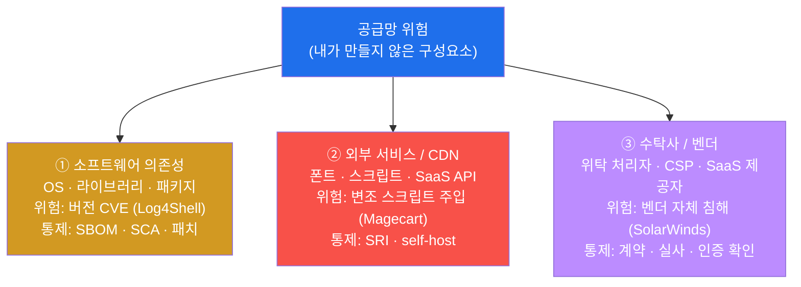
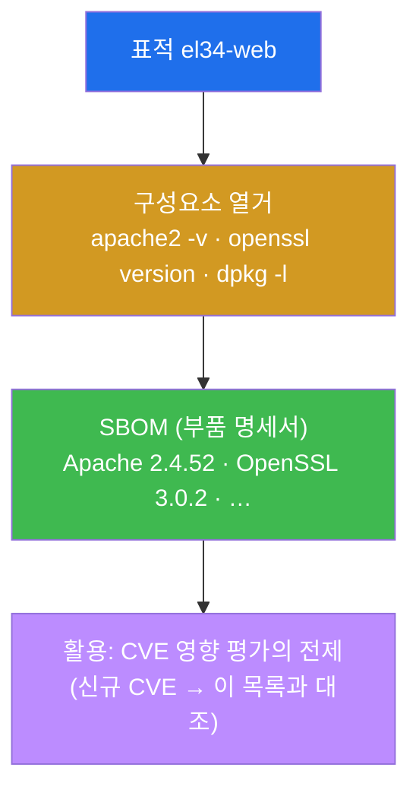
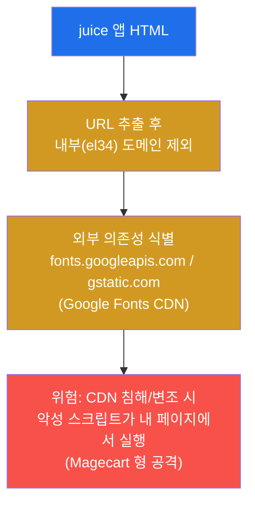
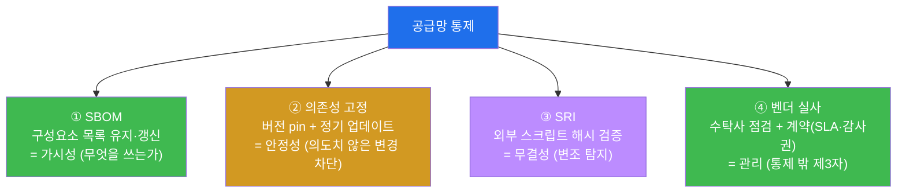
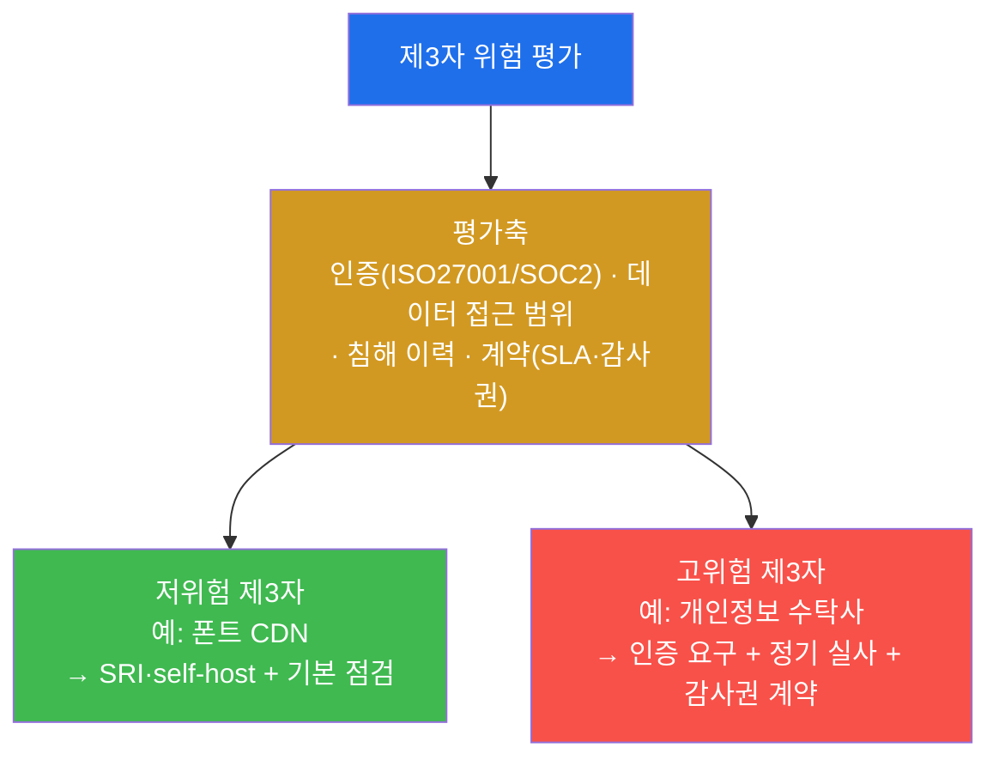
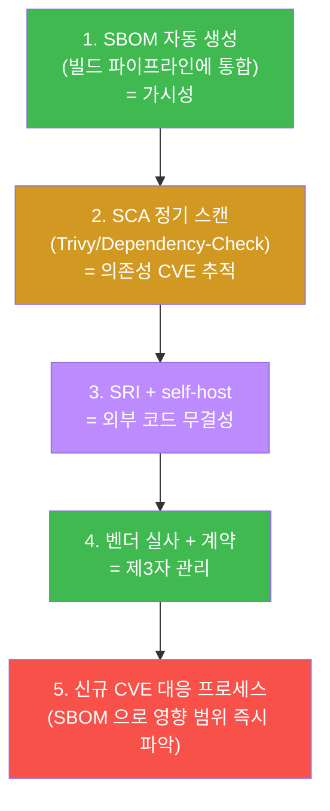
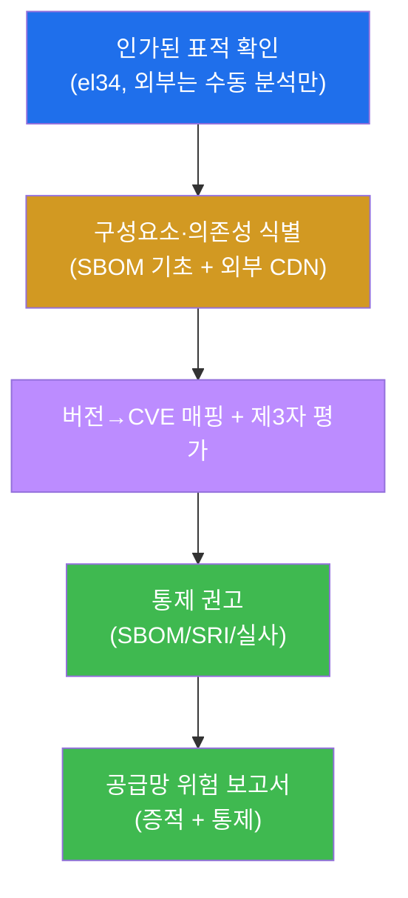
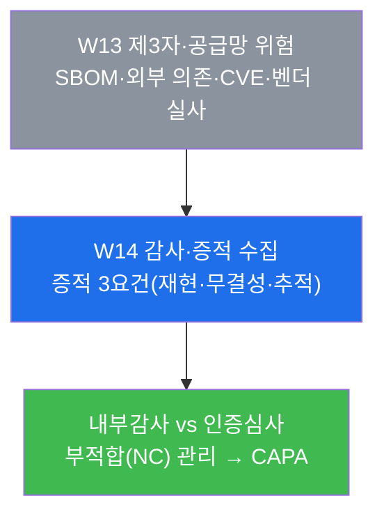

# 컴플라이언스 W13 — 제3자·공급망 위험: 내가 만들지 않은 코드까지 감사하기

> **본 주차의 한 줄 요약**
>
> 지난 12주 동안 학생은 **자기 시스템 안**의 통제를 감사해 왔다 — 정보 노출, 접근통제, 암호화,
> 로깅, 취약점, 데이터 보호(W12). 하지만 현대 시스템은 학생이 직접 만든 코드만으로 돌지 않는다.
> OS·라이브러리·외부 CDN·SaaS·수탁사처럼 **내가 통제하지 못하는 제3자 구성요소**가 시스템의 대부분을
> 차지하며, 침해는 바로 이 "내가 만들지 않은 부분"을 통해 들어온다(SolarWinds·Log4Shell). 본 주차는
> 감사자(auditor)가 되어 `el34-web`/`juice` 의 **공급망**을 점검한다 — ① 무엇으로 구성됐는지
> 목록화(SBOM)하고 → ② 외부 의존성(Google Fonts CDN)을 식별하고 → ③ 그 버전을 알려진 취약점(CVE)에
> 매핑하고 → ④ 수탁사·벤더의 위험을 평가하고 → ⑤ SBOM·SRI·실사 같은 공급망 통제를 권고한다.
>
> **감사자 한 줄 결론**: "내 보안은 가장 약한 협력사만큼 강하다." 공급망 감사는 **내가 만든 코드가
> 아니라 내가 의존하는 모든 것**을 가시화(SBOM)하고, 그 무결성(SRI)을 보장하며, 통제권이 없는
> 제3자(수탁사·CDN·SaaS)의 위험을 계약·실사로 관리하는가를 증적으로 입증하는 일이다.

---

## 학습 목표

본 주차 종료 시 학생은 다음 6가지를 **본인 손으로** 할 수 있어야 한다.

1. **공급망 위험(supply-chain risk)** 의 세 갈래 — 소프트웨어 의존성(라이브러리/패키지 CVE) · 외부
   서비스/CDN · 수탁사/벤더 — 를 구분하고, 각각이 어떤 침해 경로가 되는지 실제 사례(Log4Shell·
   SolarWinds·Magecart)로 설명한다.
2. `el34-web` 의 설치 구성요소(Apache 2.4.52 · OpenSSL 3.0.2 등)를 **목록화(SBOM 의 기초)** 하고, 이
   목록이 왜 CVE 영향 평가의 전제인지를 증적과 함께 보인다.
3. `juice` 앱이 끌어오는 **외부 의존성(Google Fonts CDN — fonts.googleapis.com / fonts.gstatic.com)** 을
   HTML 분석으로 식별하고, 그 CDN 이 침해될 때 무엇이 위험한지를 설명한다.
4. 구성요소의 **버전을 알려진 취약점(CVE)에 매핑**하는 방법(수동 대조 + 자동 도구 nuclei/Trivy/
   Dependency-Check)을 정리하고, SBOM 이 없으면 신규 CVE 공개 시 영향 범위를 알 수 없음을 설명한다.
5. **제3자/수탁사 위험 평가**의 항목(보안 인증 ISO27001/SOC2 · 데이터 접근 범위 · 침해 이력 · 계약
   SLA·감사권)을 정리하고, 위험이 위탁 범위에 비례함을 설명한다.
6. 발견을 **공급망 위험 보고서**(구성 식별 → 외부 의존 → CVE/제3자 위험 → 통제 권고)로 종합하고,
   SBOM(가시성) · SRI(무결성) · 벤더 실사(관리)의 세 축으로 통제를 제시한다.

> **감사자의 시선** — 본 주차는 "공격이 뚫리는가"가 아니라 **"내가 의존하는 제3자 구성요소를 알고
> (가시성) · 무결하게 유지하며(무결성) · 통제 밖 벤더를 관리(실사)하는가"를 문서로 입증**하는 주다.
> 채점은 "위험을 찾았다"는 선언이 아니라, **무엇으로 구성됐는지(SBOM) · 무엇에 의존하는지(외부 CDN) ·
> 어떤 취약점에 노출되는지(CVE) · 어떻게 통제하는지(SBOM/SRI/실사)** 를 증적과 함께 제시했는가를 본다.

---

## 0. 용어 해설 (이번 주 처음 나오는 핵심어)

본 주차는 "내가 만들지 않은 코드"를 다루므로 새 용어가 여럿 등장한다. 처음 나오는 용어를 먼저 한
줄 정의와 일상 비유로 정리한다. 본문에서 막히면 이 표로 돌아오면 흐름이 끊기지 않는다.

| 용어 | 영문 | 뜻 | 비유 |
|------|------|----|------|
| **공급망 위험** | supply-chain risk | 내가 만들지 않은 구성요소(OS·라이브러리·CDN·SaaS·수탁사)를 통해 들어오는 위험 | 내가 산 완제품 속 모든 부품 공장의 안전까지 책임지는 일 |
| **제3자** | third party | 내가 직접 통제하지 못하는 외부 주체(벤더·수탁사·CDN·SaaS 제공자) | 내 가게에 납품하는 외부 거래처 |
| **수탁사** | data processor / 위탁 처리자 | 내 업무(특히 개인정보 처리)를 위탁받아 대신 처리하는 외부 업체 | 우리 회사 급여를 대행하는 외주 노무법인 |
| **구성요소** | component | 시스템을 이루는 개별 소프트웨어 조각(OS·웹서버·라이브러리·패키지) | 자동차를 이루는 엔진·타이어·전장 부품 하나하나 |
| **SBOM** | Software Bill of Materials | 시스템에 들어간 모든 구성요소·버전을 적은 "소프트웨어 부품 명세서" | 자동차 부품 명세서(어느 부품이 어느 버전인지) |
| **CDN** | Content Delivery Network | 폰트·스크립트·이미지 같은 정적 자원을 외부 서버에서 빨리 내려주는 망 | 동네마다 둔 물류 창고(가까운 곳에서 빨리 배송) |
| **외부 의존성** | external dependency | 내 앱이 동작하려고 끌어오는 외부(제3자) 자원·코드 | 내 요리에 꼭 들어가는 외부에서 사 오는 소스 |
| **CVE** | Common Vulnerabilities and Exposures | 공개된 알려진 취약점에 붙이는 전 세계 공통 식별 번호(예: CVE-2021-44228) | 리콜 대상 부품에 붙는 전 세계 공통 리콜 번호 |
| **버전→CVE 매핑** | version-to-CVE mapping | "이 구성요소 이 버전"이 어떤 CVE 에 해당하는지 대조하는 작업 | 내 차 부품 번호를 리콜 목록과 대조하기 |
| **SCA** | Software Composition Analysis | 구성요소·의존성을 분석해 알려진 취약점을 자동으로 찾아내는 점검 기법 | 부품 명세서를 리콜 DB 와 자동 대조하는 검사기 |
| **SRI** | Subresource Integrity | 외부에서 불러오는 스크립트/스타일의 해시를 박아 변조를 탐지하는 브라우저 표준 | 택배 상자에 봉인 스티커를 붙여 개봉 흔적을 보는 것 |
| **의존성 고정** | dependency pinning | 의존 구성요소의 버전을 특정값으로 못 박아 의도치 않은 변경을 막는 것 | 늘 같은 규격의 부품만 받겠다고 계약에 명시 |
| **벤더 실사** | vendor due diligence | 거래/위탁 전·중에 제3자의 보안 수준을 점검·검증하는 절차 | 거래처 공장을 직접 방문해 안전 점검하는 것 |
| **Magecart** | — | 결제 페이지에 끼어든 외부 스크립트로 카드정보를 빼내는 공급망 공격 유형 | 계산대 카드 단말기에 몰래 단 스키머 |

> **헷갈리기 쉬운 한 쌍 — 가시성(SBOM) vs 무결성(SRI).** 둘은 공급망 통제의 서로 다른 축이다.
> **SBOM** 은 "내가 **무엇으로** 구성됐는지 안다"는 가시성의 문제다 — 부품 명세서가 있어야 신규 리콜
> (CVE)이 떴을 때 내 차에 그 부품이 있는지 즉시 확인한다. **SRI** 는 "외부에서 받아온 것이 **변조되지
> 않았는지** 안다"는 무결성의 문제다 — 봉인 스티커가 있어야 운송 중 누가 내용물을 바꿔치기했는지
> 안다. SBOM 만 있고 SRI 가 없으면 "내 부품 목록은 알지만 외부 CDN 이 보낸 스크립트가 진짜인지는
> 모르는" 상태고, 반대면 "받은 건 무결하지만 내가 무엇을 쓰는지 목록이 없는" 상태다. 공급망 감사는 두
> 축을 함께 본다.
>
> **헷갈리기 쉬운 또 한 쌍 — 의존성(코드) vs 수탁사(사람·조직).** 공급망 위험을 처음 배우면 "외부
> 라이브러리 CVE"만 떠올리기 쉽다. 하지만 공급망에는 **코드로 들어오는 위험**(라이브러리·CDN
> 스크립트 — 기술적 통제 SBOM/SCA/SRI 로 다룸)과 **조직으로 들어오는 위험**(수탁사·SaaS — 관리적 통제
> 계약·실사·인증 확인으로 다룸)이 함께 있다. 개인정보를 위탁받은 수탁사가 부실하면, 내 코드가 아무리
> 안전해도 정보주체의 데이터는 그 수탁사를 통해 샌다(W12 데이터 보호와 직결). 감사는 코드와 조직
> 양쪽을 모두 본다.

---

## 1. 왜 "공급망"이 가장 큰 사각지대인가

### 1.1 한 줄 답: 시스템의 대부분은 내가 만들지 않았기 때문

현대 웹 애플리케이션 한 대가 동작하기까지 실제로 실행되는 코드를 따져 보면, 개발팀이 **직접 작성한
코드는 전체의 일부**에 불과하다. 나머지 대부분은 운영체제, 웹서버(Apache), 암호화 라이브러리
(OpenSSL), 수많은 오픈소스 패키지, 그리고 브라우저가 외부에서 끌어오는 폰트·스크립트(CDN)다. 즉
시스템의 공격 표면 대부분이 **내가 만들지 않았고, 내가 직접 통제하지도 못하는** 제3자 구성요소다.

지금까지(W01–W12) 학생이 감사한 것은 거의 전부 "내 시스템 안에서 내가 설정한 것"이었다 —
ServerTokens, 접근통제, 암호 정책, TLS, 로깅, 개인정보 처리. 그러나 침해는 이 "내가 관리하는 부분"이
아니라, 시야 밖에 있던 **제3자 구성요소**에서 터지는 경우가 점점 늘고 있다. 그래서 컴플라이언스 표준
(ISMS-P 의 외부자·수탁사 통제, NIST SSDF, EO 14028 의 SBOM 요구)이 공급망 가시성과 제3자 위험관리를
명시적으로 요구하게 됐다.

> **용어 — SSDF / SBOM 요구의 배경.** **SSDF**(Secure Software Development Framework, NIST SP
> 800-218)는 소프트웨어를 안전하게 개발·공급하기 위한 미국 표준 지침이며, 그 핵심 요구 중 하나가
> **SBOM**(소프트웨어 부품 명세서)이다. 2021년 미국 행정명령(EO 14028) 이후 정부 납품 소프트웨어에
> SBOM 제출이 의무화되는 흐름이 생겼다. 한국 ISMS-P 도 외부자·수탁사 보안(통제 영역의 "외부자 보안",
> "정보시스템 도입 및 개발 보안")으로 공급망을 다룬다. 즉 공급망 관리는 "있으면 좋은 것"이 아니라
> **인증·법규가 요구하는 통제**다.

### 1.2 실 침해 사례 3건 (이 강의의 동기)

| 사고 | 공급망 갈래 | 무슨 일이 있었나 |
|------|------------|-----------------|
| **2021 Log4Shell** (CVE-2021-44228) | 소프트웨어 의존성 | 자바 로깅 라이브러리 Log4j 의 RCE 취약점. 직접 쓰지 않아도 **다른 라이브러리가 끌어온** Log4j 때문에 전 세계 수많은 시스템이 노출 — SBOM 이 없으면 "내가 Log4j 를 쓰는지조차" 몰랐다. |
| **2020 SolarWinds Orion** | 빌드/벤더(소프트웨어 공급) | 신뢰하던 벤더의 **빌드 파이프라인이 침해**돼 정상 서명된 업데이트에 백도어가 섞였다. 고객은 "믿을 수 있는 벤더의 정식 업데이트"를 설치했을 뿐인데 침해됐다 — 제3자(벤더) 신뢰의 위험. |
| **2018 Magecart / British Airways** | 외부 서비스/CDN 스크립트 | 결제 페이지가 불러오던 **외부 스크립트가 변조**돼 입력된 카드정보를 공격자 서버로 빼돌렸다. 사이트 자체 서버는 멀쩡했고, **외부에서 받아온 스크립트**가 무기였다 — SRI(무결성)가 있었다면 변조를 탐지했다. |

세 사고의 공통점은 **피해자 자신의 코드·서버에는 결함이 없었다**는 점이다. 결함은 의존한 라이브러리,
신뢰한 벤더, 끌어온 외부 스크립트에 있었다. 단편적인 "내 시스템 점검"만으로는 절대 잡히지 않는
위험이며, 그래서 별도의 **공급망 감사**가 필요하다.

### 1.3 공급망 위험의 3 갈래

공급망 위험은 들어오는 경로에 따라 세 갈래로 나뉜다. 본 주차의 실습(미션)도 이 세 갈래를 차례로
점검한다.



- **① 소프트웨어 의존성** — 시스템에 깔린 OS·웹서버·암호 라이브러리·오픈소스 패키지가 가진 알려진
  취약점(CVE)이다. el34-web 의 Apache 2.4.52 나 OpenSSL 3.0.2 같은 구성요소가 여기 해당한다. 통제의
  출발점은 "무엇이 깔렸는지" 목록화하는 **SBOM** 이다(§2).
- **② 외부 서비스 / CDN** — 앱이 실행 중 외부에서 끌어오는 자원(폰트·자바스크립트·SaaS API)이다.
  el34 의 juice 가 불러오는 **Google Fonts CDN** 이 대표적이다. CDN 이 침해·변조되면 악성 코드가 내
  앱 안에서 실행된다 — 통제는 무결성 검증(**SRI**)과 외부 의존 최소화(self-host)다(§3, §5).
- **③ 수탁사 / 벤더** — 내 업무(특히 개인정보 처리)를 위탁받은 외부 조직, 클라우드 사업자(CSP),
  SaaS 제공자다. 이들의 보안 수준은 내 통제 밖이므로 **계약·실사·인증 확인**이라는 관리적 통제로
  다룬다(§4의 위험 평가).

### 1.4 왜 중요한가 — 한 시스템에 세 갈래가 모두 있다

el34 의 한 시스템만 봐도 세 갈래가 모두 존재한다. web 컨테이너에는 Apache·OpenSSL 같은 **소프트웨어
의존성**(①)이 깔려 있고, juice 앱은 **Google Fonts CDN**(②)이라는 외부 의존성을 끌어오며, 가상의
운영 시나리오에서는 개인정보를 위탁한 **수탁사·SaaS**(③)가 존재한다. 단편 점검은 이 중 하나만 보고
끝나기 쉽지만, 공급망 감사는 세 갈래를 한 바퀴 돌며 **내가 통제하지 못하는 표면 전체**를 드러낸다.
이것이 W13 이 "내가 만들지 않은 코드까지 감사한다"는 이유다.

### 1.5 한계 — 이 주차가 다루지 않는 것

본 주차는 공급망 위험의 **식별·평가·통제 권고**까지를 감사자 관점에서 다룬다. 따라서 실제 빌드
파이프라인에 SBOM 자동 생성을 통합하거나, 사내 패키지 저장소를 운영하거나, 수탁사와 실제 계약을
체결하는 **운영·구축 작업**은 범위 밖이다(보고서에서 권고로 제시). 또한 본 실습은 **인가된
표적(el34)** 만 점검한다 — 외부 CDN(Google Fonts)에 대한 점검도 el34 내부에서 받은 HTML 을 분석하는
선에서 하며, 실제 외부 서비스를 능동적으로 스캔하지 않는다(§8 감사 수칙).

---

## 2. 소프트웨어 구성 식별 — SBOM 의 기초 (공급망 위험 ①)

### 2.1 한 줄 정의와 왜 중요한가

**한 줄 정의.** 소프트웨어 구성 식별은 시스템에 **무엇이(어떤 구성요소가) 어느 버전으로** 깔려
있는지를 빠짐없이 목록화하는 단계이며, 그 목록이 곧 **SBOM(소프트웨어 부품 명세서)** 의 기초다.

**왜 중요한가.** 목록이 없으면 신규 취약점(CVE)이 공개됐을 때 **"내가 그 구성요소를 쓰는지조차"**
알 수 없다. Log4Shell 당시 수많은 조직이 며칠을 허비한 이유가 바로 이것이다 — 자기 시스템 어디에
Log4j 가 박혀 있는지 몰라 일일이 뒤져야 했다. SBOM 이 있었다면 "Log4j 2.x 를 쓰는 시스템"을 즉시
질의해 영향 범위를 1분 만에 파악했을 것이다. 그래서 SBOM 은 공급망 관리의 출발점이자, CVE 영향
평가(§4)의 전제다.

> **용어 — SBOM 의 표준 형식.** 실무의 SBOM 은 사람이 보는 표가 아니라 기계가 읽는 표준 형식으로
> 만든다 — 대표적으로 **SPDX**(Linux Foundation)와 **CycloneDX**(OWASP)다. 각 구성요소의 이름·버전·
> 라이선스·고유 식별자(PURL)·해시를 담아, SCA 도구가 자동으로 CVE 와 대조할 수 있게 한다. 본
> 실습에서는 도구 없이 OS 명령(`apache2 -v`, `openssl version`, `dpkg -l`)으로 **수동 SBOM 의
> 기초**를 만들어, "구성요소를 목록화한다"는 개념을 직접 체득한다.

### 2.2 el34 에서 어떻게 보이나

el34-web 컨테이너에는 웹서버 **Apache 2.4.52**, 암호화 라이브러리 **OpenSSL 3.0.2** 를 비롯한 여러
패키지가 깔려 있다. 다음 명령으로 핵심 구성요소의 버전과 관련 패키지 수를 한 번에 집계한다.

```bash
docker exec el34-web sh -c 'apache2 -v | head -1; openssl version; echo "components=$(dpkg -l | grep -ciE "apache2|openssl|libssl")"'
```

- `apache2 -v | head -1` — 웹서버 제품·버전(예: `Server version: Apache/2.4.52 (Ubuntu)`). **버전이
  곧 CVE 매핑의 키**다.
- `openssl version` — 암호화 라이브러리 버전(예: `OpenSSL 3.0.2 ...`). OpenSSL 은 과거 Heartbleed
  같은 치명적 CVE 의 무대였으므로 버전 추적이 특히 중요하다.
- `dpkg -l | grep -ciE "apache2|openssl|libssl"` — apache2/openssl/libssl 관련 설치 패키지 **개수**.
  출력의 `components=<수>` 가 "이 시스템이 추적해야 할 핵심 구성요소가 몇 개인지"의 단서다. `dpkg -l`
  은 데비안 계열에서 설치된 패키지 전체를 나열하는 표준 명령이고, `grep -ci` 는 대소문자 무시(`i`)로
  일치 줄을 세는(`c`) 옵션이다.

이 출력이 곧 **수동 SBOM 의 한 조각**이다. 실무에서는 이를 패키지 전체로 확장해 표준 형식(SPDX/
CycloneDX)으로 저장하고, 정기적으로 갱신한다.



### 2.3 한계

버전 목록을 얻는 것은 시작일 뿐이다. 완전한 SBOM 은 직접 설치한 패키지뿐 아니라 **그 패키지가 다시
끌어오는 전이 의존성(transitive dependency)** 까지 담아야 한다(Log4Shell 이 바로 전이 의존성이었다).
또한 SBOM 은 한 번 만들고 끝이 아니라 **빌드/배포 때마다 갱신**돼야 신선도를 유지한다. 본 실습은 핵심
구성요소 식별로 개념을 잡고, 전 패키지 SBOM 자동 생성은 보고서에서 권고로 제시한다.

---

## 3. 외부 의존성 식별 — CDN (공급망 위험 ②)

### 3.1 한 줄 정의와 왜 중요한가

**한 줄 정의.** 외부 의존성 식별은 앱이 **실행 중 외부(제3자)에서 끌어오는 자원**(폰트·스크립트·
이미지·SaaS API)을 찾아내는 단계다. 가장 흔한 형태가 **CDN(Content Delivery Network)** 에서 불러오는
폰트·자바스크립트다.

**왜 중요한가.** 브라우저가 외부 CDN 에서 스크립트를 받아 실행하면, 그 스크립트는 **내 페이지 안에서
내 권한으로** 돈다. 즉 CDN 이 침해·변조되면 공격자의 코드가 내 사용자 브라우저에서 실행된다 — 이것이
Magecart 공격의 핵심이다. 내 서버는 멀쩡한데, 외부에서 받아온 코드 한 줄이 사용자의 카드정보·세션을
빼낸다. 따라서 감사자는 "이 앱이 **누구의 코드를** 외부에서 끌어오는가"를 반드시 목록화해야 한다.

> **용어 — CDN 과 제3자 스크립트.** **CDN** 은 폰트·라이브러리 같은 정적 자원을 전 세계 가까운
> 서버에서 빨리 내려주는 망으로, 속도·편의 때문에 널리 쓰인다(예: Google Fonts, jsDelivr,
> cdnjs). 문제는 그 코드의 **통제권이 제3자(CDN 운영자)에게 있다**는 점이다. 내가 `<script
> src="https://cdn.example/lib.js">` 한 줄을 넣는 순간, 그 cdn.example 이 보내주는 무엇이든 내
> 페이지에서 실행된다. CDN 이 해킹당하거나 운영자가 악의를 품으면, 그 변경이 즉시 내 모든 사용자에게
> 전파된다.

### 3.2 el34 에서 어떻게 보이나

el34 의 **juice**(OWASP Juice Shop) 앱은 화면 폰트를 위해 **Google Fonts CDN**(`fonts.googleapis.com`,
`fonts.gstatic.com`)을 외부에서 끌어온다. 이 외부 의존성은 앱이 반환하는 HTML 에서 식별할 수 있다.
점검은 점검자 컨테이너(`el34-attacker`)에서 fw 게이트웨이(`10.20.30.1`)에 `Host: juice.el34.lab` 을
지정해 페이지를 받아온 뒤, el34 내부 도메인이 아닌 외부 도메인만 추려서 본다.

```bash
docker exec el34-attacker sh -c "curl -sk -H 'Host: juice.el34.lab' http://10.20.30.1/ | grep -oE 'https?://[a-zA-Z0-9.-]+' | grep -viE '10.20|el34' | sort -u | head -3"
```

- `curl -sk -H 'Host: juice.el34.lab' http://10.20.30.1/` — fw 게이트웨이로 juice 의 첫 페이지를
  받아온다(`-s` 진행표시 끔, `-k` 자체서명 인증서 허용). el34 의 fw 는 SNAT 를 하지 않으므로 이
  요청의 출처 IP(`10.20.30.202`)는 web 로그에 그대로 남는다(W08 의 감사자/운영자 양면과 동일).
- `grep -oE 'https?://[a-zA-Z0-9.-]+'` — HTML 안의 모든 URL 호스트 부분만 뽑아낸다(`-o` 일치 부분만,
  `-E` 확장 정규식).
- `grep -viE '10.20|el34'` — el34 내부 자원(`10.20.x`, `*.el34.lab`)을 제외(`-v` 반전)해 **외부
  의존성만** 남긴다.
- `sort -u | head -3` — 중복 제거 후 상위 몇 개를 본다. 출력에 **`fonts.gstatic.com` /
  `fonts.googleapis.com`** 이 보이면, 이 앱이 Google Fonts CDN 에 의존함을 확인한 것이다.



### 3.3 한계

HTML 첫 페이지만 보는 것은 외부 의존성의 일부만 드러낸다. 실제로는 동적으로 로드되는 스크립트, iframe
안의 자원, API 호출로 끌어오는 SaaS 까지 모두 외부 의존성이다. 완전한 식별은 브라우저 개발자도구의
네트워크 탭이나 전용 도구로 **실제 로드되는 모든 외부 출처**를 수집해야 한다. 본 실습은 대표적 외부
의존(Google Fonts)을 HTML 에서 식별해 개념을 잡고, 통제(SRI/self-host)는 §5 에서 다룬다.

---

## 4. 알려진 취약점 매핑 — 버전→CVE (공급망 위험 ①의 평가)

### 4.1 한 줄 정의와 왜 중요한가

**한 줄 정의.** 취약점 매핑은 §2 에서 식별한 **구성요소의 버전**을, 공개된 **알려진 취약점
(CVE)** 데이터베이스에 대조해 "이 버전이 어떤 취약점에 노출됐는가"를 알아내는 단계다.

**왜 중요한가.** 구성요소를 목록화(SBOM)한 목적이 바로 이 매핑이다. 새 CVE 가 공개될 때마다 "우리가
그 영향권에 있는가"를 즉시 답할 수 있어야 하며, 그 답은 **SBOM(무엇을 쓰는가) × CVE DB(무엇이
위험한가)** 의 대조에서 나온다. SBOM 이 없으면 이 매핑 자체가 불가능하다 — Log4Shell 의 교훈이 바로
이것이다.

> **용어 — CVE 와 CVSS.** **CVE**(Common Vulnerabilities and Exposures)는 공개된 취약점마다 붙는
> 전 세계 공통 식별 번호다(예: `CVE-2021-44228` = Log4Shell). **CVSS**(Common Vulnerability Scoring
> System)는 그 취약점의 심각도를 0.0–10.0 점수와 등급(Low/Medium/High/Critical)으로 매긴 척도로,
> 무엇부터 패치할지 우선순위의 근거가 된다. 감사에서 "버전 X 는 CVE-YYYY-NNNNN(CVSS 9.8 Critical)에
> 해당"처럼 적어야 시정 우선순위가 선다.

### 4.2 매핑 방법 — 수동과 자동

버전→CVE 매핑은 수동·자동 두 길이 있고, 실무는 둘을 병행한다.

```bash
echo "구성요소 버전(Apache 2.4.52, OpenSSL 3.0.2) → CVE 데이터베이스 대조"
echo "자동화: nuclei CVE 템플릿, Trivy(컨테이너 SCA), OWASP Dependency-Check"
```

- **수동 대조** — 식별한 버전(예: Apache 2.4.52)을 NVD(National Vulnerability Database)나 벤더
  보안 공지에서 검색해 해당 CVE 를 확인한다. 정확하지만 구성요소가 수백 개면 현실적으로 불가능하다.
- **자동 도구(SCA)** — SBOM 또는 시스템을 입력받아 CVE 를 자동 매핑한다. el34 환경에서 쓸 수 있는
  도구는 다음과 같다.
  - **nuclei** — 템플릿 기반 스캐너로, CVE별 점검 템플릿(`nuclei-templates`)을 표적에 던져 알려진
    취약점·노출을 찾는다(attacker 컨테이너에 설치됨, W07/W08 에서 사용).
  - **Trivy** — 컨테이너 이미지·파일시스템을 스캔해 패키지 CVE 를 매핑하는 대표적 **SCA** 도구
    (el34 호스트에 설치됨).
  - **OWASP Dependency-Check** — 애플리케이션 의존성(라이브러리)을 CVE 에 매핑하는 도구로,
    소프트웨어 구성 분석의 고전이다.

> **용어 — SCA(Software Composition Analysis).** 직접 작성한 코드의 결함을 찾는 SAST 와 달리,
> **SCA** 는 **가져다 쓴 구성요소(오픈소스·라이브러리·패키지)** 의 알려진 취약점·라이선스 문제를
> 분석한다. SBOM 을 입력으로 받아 CVE 와 자동 대조하는 것이 SCA 의 핵심 동작이며, 공급망 통제의
> 자동화 엔진이다. 컴플라이언스 표준(PCI-DSS 6, ISMS-P 개발보안)은 이런 정기 구성 분석을 요구한다.

### 4.3 el34 에서의 의미와 한계

el34-web 의 Apache 2.4.52·OpenSSL 3.0.2 같은 버전은 그 자체로 특정 CVE 들의 영향권에 있을 수 있다.
핵심은 **"SBOM 이 있어야 신규 CVE 가 떴을 때 영향 범위를 즉시 판단한다"** 는 점이다 — 버전을 모르면
대조할 수 없다. **한계**: 버전 매칭만으로는 **오탐**이 생긴다(백포팅 패치로 버전 번호는 그대로지만
취약점은 고쳐진 경우 — 데비안/우분투가 흔히 한다). 따라서 자동 매핑 결과는 벤더 보안 공지로
재검증해야 정확하다. 본 실습은 매핑의 **방법과 전제(SBOM)** 를 정리하는 것이 목표다.

---

## 5. 공급망 통제 — SBOM · 의존성 고정 · SRI · 벤더 실사

### 5.1 한 줄 정의와 통제의 네 기둥

**한 줄 정의.** 공급망 통제는 §1–§4 에서 식별·평가한 위험을 줄이기 위한 구체적 수단의 묶음이며, 크게
네 기둥으로 이뤄진다 — **SBOM(가시성) · 의존성 고정(안정성) · SRI(무결성) · 벤더 실사(관리)**.

```bash
echo "1) SBOM: 구성요소 목록 유지·갱신"
echo "2) 의존성 고정(버전 pin) + 정기 업데이트"
echo "3) SRI(Subresource Integrity): 외부 스크립트 변조 탐지(해시 검증)"
echo "4) 벤더 실사: 수탁사 보안 점검 + 계약(SLA·감사권)"
```



### 5.2 각 통제 상세

- **① SBOM(가시성).** §2 에서 만든 구성요소 목록을 표준 형식으로 유지하고 빌드마다 갱신한다. 모든
  통제의 전제 — 무엇을 쓰는지 알아야 패치도, CVE 대조도, 영향 평가도 가능하다.

- **② 의존성 고정(dependency pinning).** 의존 구성요소의 버전을 특정값으로 못 박아(`==1.2.3`),
  배포 때마다 의도치 않게 새 버전이 끌려와 깨지거나 악성 버전이 섞이는 일을 막는다. 단, 고정만 하면
  취약한 옛 버전에 머무르므로 **정기 업데이트**(검증 후 의도적 상향)와 짝을 이뤄야 한다. 고정 ↔
  업데이트의 균형이 핵심이다.

- **③ SRI(Subresource Integrity).** 외부에서 불러오는 스크립트·스타일에 **해시를 박아두고**, 받아온
  내용의 해시가 일치할 때만 브라우저가 실행하게 하는 표준이다. 형태는 다음과 같다 —
  `<script src="https://cdn.example/lib.js" integrity="sha384-..." crossorigin="anonymous">`. CDN 이
  보낸 코드가 한 비트라도 변조되면 해시가 어긋나 브라우저가 실행을 거부한다. Magecart 형 변조를
  막는 직접적 통제이며, §3 에서 식별한 Google Fonts 같은 외부 의존에 적용하거나, 아예 자원을 내
  서버에 두는 **self-host** 로 외부 의존 자체를 없앤다.

- **④ 벤더 실사(vendor due diligence).** 코드가 아닌 **조직**으로 들어오는 위험(수탁사·SaaS·CSP)을
  다루는 관리적 통제다. 거래·위탁 전에 제3자의 보안 인증(ISO27001/SOC2)·침해 이력·데이터 접근 범위를
  점검하고, **계약에 보안 요구사항·SLA·감사권**을 명시한다(§4의 위험 평가 결과를 계약으로 강제).

> **el34 적용 예.** §3 에서 식별한 Google Fonts CDN 같은 외부 의존에는 **SRI 를 적용하거나
> self-host**(폰트를 내 서버에 두기) 한다. §2 의 Apache/OpenSSL 같은 의존성에는 **SBOM 유지 + SCA
> 정기 스캔 + 정기 패치**를 적용한다. 가상의 수탁사·SaaS 에는 **계약·실사**를 적용한다 — 위험의
> 갈래마다 통제가 다르다.

### 5.3 한계

통제는 "도입했다"가 끝이 아니라 **지속 운영**돼야 의미가 있다 — SBOM 은 갱신돼야, SRI 해시는 정식
업데이트 때 함께 바뀌어야, 벤더 실사는 정기적으로 재수행돼야 살아 있는 통제다. 또한 어떤 통제도
**0-day**(아직 공개되지 않은 취약점)나 신뢰한 벤더의 빌드 침해(SolarWinds 형)를 완벽히 막지는 못한다 —
그래서 공급망 통제는 탐지·대응(SIEM)·최소권한과 함께 다층으로 운영한다.

---

## 6. 제3자 위험 평가 — 통제 밖 벤더를 어떻게 판단하나 (공급망 위험 ③)

### 6.1 한 줄 정의와 평가 항목

**한 줄 정의.** 제3자 위험 평가는 내 통제 밖에 있는 외부 주체(수탁사·CSP·CDN·SaaS·오픈소스
프로젝트)의 **보안 수준을 정해진 항목으로 점검**해 거래·위탁 여부와 통제 강도를 결정하는 단계다.

평가 항목은 다음과 같다.

```bash
echo "대상: 수탁사(위탁 처리자), CSP, CDN, SaaS, 오픈소스"
echo "평가축: 보안 인증(ISO27001/SOC2), 데이터 접근 범위, 침해 이력, 계약(SLA/감사권)"
```

- **보안 인증** — 제3자가 ISO27001(정보보호 관리체계)·SOC2(서비스 조직 통제) 같은 **독립적 인증**을
  보유했는가. 인증은 "검증된 통제 체계"의 증거다.
- **데이터 접근 범위** — 그 제3자가 **무슨 데이터에, 얼마나** 접근하는가. 개인정보·결제정보에 광범위
  접근하는 수탁사일수록 위험이 크다(W12 데이터 보호와 직결).
- **침해 이력** — 과거 보안 사고·대응 이력. 사고 자체보다 **대응의 투명성·재발 방지**가 판단 근거다.
- **계약(SLA·감사권)** — 보안 요구사항·가용성(SLA)·**감사권**(내가 그 제3자를 점검할 권리)이 계약에
  명시됐는가. 감사권이 없으면 위탁 후 통제가 불가능하다.

### 6.2 위험은 위탁 범위에 비례한다

핵심 원칙은 **"제3자가 처리하는 데이터·권한이 클수록 위험이 크고, 따라서 실사도 강해야 한다"** 는
것이다. 폰트만 내려주는 CDN 과 고객 개인정보 전체를 처리하는 수탁사는 같은 잣대로 볼 수 없다. 위험에
비례해 통제(실사 빈도·계약 강도·인증 요구 수준)를 차등 적용한다.



### 6.3 ISMS-P 와의 연결, 그리고 한계

한국 ISMS-P 는 **외부자 보안**과 **수탁사 관리**를 명시적 통제로 둔다 — 위탁 시 수탁사 선정·계약·
점검·교육의 절차를 요구한다. 즉 제3자 위험 평가는 감사자가 임의로 하는 일이 아니라 **인증이 요구하는
통제**다. **한계**: 평가는 시점(snapshot)의 판단이다 — 오늘 인증을 가진 벤더가 내일 침해될 수 있다.
그래서 일회 평가가 아니라 **계약 기간 내 정기 재평가 + 사고 시 즉시 재검토**가 필요하다.

---

## 7. 공급망 보안 방어 — 가시성 + 무결성 + 벤더 관리의 통합

### 7.1 방어의 다섯 단계

앞의 통제들을 운영 프로세스로 묶으면 공급망 보안 방어가 된다. 핵심은 **가시성(SBOM) + 무결성(SRI) +
벤더 관리(실사)** 의 통합이다.

```bash
echo "1) SBOM 자동 생성(빌드 파이프라인 통합)"
echo "2) SCA 정기 스캔(Trivy/Dependency-Check)으로 의존성 CVE 추적"
echo "3) SRI + 외부 의존 최소화(self-host)"
echo "4) 벤더 실사 + 계약(보안 요구사항)"
echo "5) 신규 CVE 대응 프로세스(영향 범위 즉시 파악)"
```



이 다섯이 따로 노는 점검이 아니라 **하나의 순환**이라는 점이 중요하다. SBOM 자동 생성(1)이 있어야 SCA
정기 스캔(2)이 의미를 갖고, 스캔으로 CVE 를 찾으면 대응 프로세스(5)가 SBOM 을 다시 질의해 영향 범위를
1분 만에 산정한다 — Log4Shell 때 며칠 걸린 일을 즉시 끝내는 것이 이 통합의 목표다. 외부 코드는 SRI(3)
로 무결성을 보장하고, 조직 위험은 벤더 실사(4)로 관리한다.

### 7.2 핵심 — 세 축으로 요약

공급망 방어는 결국 세 문장으로 요약된다 — **내가 무엇을 쓰는지 안다(SBOM=가시성), 외부에서 받은 것이
변조되지 않았음을 안다(SRI=무결성), 통제 밖 제3자를 계약·실사로 관리한다(벤더 관리).** 이 셋이 갖춰져야
"내 보안은 가장 약한 협력사만큼"이라는 명제를 통제로 뒤집을 수 있다.

---

## 8. 감사 수칙 — 인가된 점검과 증적 중심

공급망 감사도 컴플라이언스 감사의 일부이므로, W08 에서 세운 감사 수칙을 그대로 따른다.

- **인가된 표적만 점검한다.** el34 의 정해진 시스템(`el34-web`/`juice` 등)에 대해서만 점검한다. 외부
  의존성(Google Fonts) 식별도 el34 내부에서 받은 HTML 을 분석하는 선에서 하며, **실제 외부 서비스에
  능동적 스캔을 던지지 않는다**(인가 없는 외부 스캔은 불법이 될 수 있다).
- **점검만, 변경은 하지 않는다.** 감사자는 구성요소·의존성을 **읽어서 평가**할 뿐, 패치·교체 같은
  시정은 운영팀의 변경관리 절차로 한다(W11 변경관리와 연계).
- **증적 우선.** "공급망 위험이 있다"가 아니라 **구성요소 목록(SBOM) + 외부 의존 증거 + CVE 매핑
  근거 + 통제 권고**의 형태로 제시해야 점수다. 버전·외부 도메인·CVE 번호 같은 구체적 증적이 핵심이다.
- **재현 가능하게 기록한다.** 같은 명령으로 다른 감사자가 같은 SBOM·외부 의존 목록을 재현할 수 있어야
  한다.



---

## 9. 판단 프레임워크 — lab 8 미션 한눈에

본 주차 lab 8 미션은 공급망 위험을 ① 소프트웨어 → ② 외부 서비스 → ③ 수탁사의 순으로 한 바퀴 돈 뒤
통제·방어·보고로 마무리한다. 다음 표가 미션의 지도이며, lab 의 `order` 와 1:1 로 대응한다.

| 미션 | 점검 항목 | 공급망 갈래 | 무엇을 보나 | 핵심 증적(마커) |
|------|-----------|------------|------------|----------------|
| 1 | 점검: 대상 도달 | (전제) | `el34-web`/juice 접근 가능 | `target_ok` |
| 2 | 소프트웨어 구성(SBOM 기초) | ① 소프트웨어 | Apache 2.4.52·OpenSSL 3.0.2 등 구성요소 목록 | `components=` |
| 3 | 외부 의존성(CDN) | ② 외부 서비스 | juice 가 끌어오는 Google Fonts CDN | `gstatic` |
| 4 | 취약점 매핑(버전→CVE) | ① 소프트웨어 | 버전→CVE 대조 방법(수동+SCA) | `CVE` |
| 5 | 제3자 위험 평가 | ③ 수탁사/벤더 | 인증·데이터 범위·계약 평가 항목 | `수탁사` |
| 6 | 공급망 통제 | 전체 | SBOM·의존성 고정·SRI·벤더 실사 | `SBOM` |
| 7 | 방어: 공급망 보안 | 전체 | 가시성+무결성+벤더 관리 통합 | `SCA` |
| 8 | 공급망 위험 보고서 | (종합) | 구성/외부의존 + CVE/제3자 + 통제 | `SBOM` |

이 표를 읽는 법은 세 방향이다. **"어느 갈래인가"**(소프트웨어/외부서비스/수탁사) — 위험마다 통제가
다르다. **"무엇을 증적으로 보이나"**(버전·외부 도메인·CVE·평가 항목) — 선언이 아니라 구체적 증거가
점수다. **"어떻게 통제하나"**(SBOM/SRI/실사) — 식별로 끝내지 않고 통제 권고로 닫는다. 세 방향을 모두
말할 수 있으면 공급망 감사의 판단력을 갖춘 것이다.

> **채점 포인트.** 각 갈래를 식별하고(구성요소·외부 의존·수탁사), 그 **증적**(버전 목록·외부 도메인·
> CVE·평가 항목)을 제시하며, **통제(SBOM/SRI/실사)** 를 권고하는 것. "위험이 있다"가 아니라 **무엇이 ·
> 어떤 위험에 · 어떻게 통제되는가**의 삼박자가 점수다.

---

## 10. 실습 안내 — lab 8 미션 (4 축 설명)

본 주차 실습은 8 미션이다. 각 미션을 **4 축**으로 설명한다 — 왜 하는가 / 무엇을 알 수 있는가 / 결과
해석(정상 vs 비정상) / 실전 활용. 모든 명령은 el34 호스트(`ssh ccc@192.168.0.80`, 비밀번호 1)에서
`docker exec` 로 실행하며, 신규 도구 설치는 없다. 외부 의존성 점검(미션 3)만 `el34-attacker` 에서
fw 게이트웨이를 통해 수행하고, 나머지는 `el34-web` 에서 한다. 합격 임계값은 0.7 이다.

### 미션 1 — 점검: 표적 도달 (10점)

> **왜 하는가?** 공급망 감사의 전제는 표적에 접근이 된다는 것이다. 본격 점검 전 대상의 도달성부터
> 확인한다(접근이 안 되면 모든 음성 결과가 무의미하다).
>
> **무엇을 알 수 있는가?** `docker exec el34-web` 으로 hostname 이 응답하는지 — 공급망 점검 대상
> (el34-web=구성요소, juice=외부 의존)이 실제 가동·점검 가능한 상태인지.
>
> **결과 해석.** 정상: 출력에 `target_ok` 가 나옴(대상 접근 성공). 비정상: 응답이 없으면 호스트 SSH·
> 컨테이너 상태(`docker ps`)부터 점검해야 한다.
>
> **실전 활용.** 공급망 감사 착수 시 첫 확인. 점검 범위의 시스템이 실제 가동·접근 가능한지 검증하는
> 단계.

### 미션 2 — 소프트웨어 구성: SBOM 기초 (14점)

> **왜 하는가?** 공급망 통제의 출발점은 "무엇이 깔렸는지" 목록화(SBOM)다. 목록이 없으면 신규 CVE 가
> 떴을 때 영향 범위를 알 수 없다(Log4Shell 교훈).
>
> **무엇을 알 수 있는가?** el34-web 의 핵심 구성요소·버전(Apache 2.4.52·OpenSSL 3.0.2)과 관련 패키지
> 수 — 곧 수동 SBOM 의 기초이자 CVE 영향 평가의 전제.
>
> **결과 해석.** 정상: 출력에 `components=<수>` 와 Apache/OpenSSL 버전이 나옴(구성요소 식별 성공).
> 비정상: 버전을 못 읽으면 컨테이너 도달성·명령 경로를 재확인.
>
> **실전 활용.** 모든 공급망 관리의 1 단계. 이 목록을 표준 형식(SPDX/CycloneDX)으로 확장·갱신하면
> SCA 자동 대조의 입력이 된다.

### 미션 3 — 외부 의존성: CDN (14점)

> **왜 하는가?** 앱이 외부에서 끌어오는 코드는 내 페이지에서 내 권한으로 실행된다. 그 CDN 이 변조되면
> 악성 스크립트가 주입된다(Magecart 형). 그래서 외부 의존을 반드시 목록화한다.
>
> **무엇을 알 수 있는가?** juice 앱이 의존하는 외부 CDN — `el34-attacker` 에서 fw 게이트웨이로 받은
> HTML 을 분석하면 **Google Fonts(fonts.googleapis.com / fonts.gstatic.com)** 의존이 드러난다.
>
> **결과 해석.** 정상: 출력에 `gstatic`(또는 `googleapis`)이 나옴(외부 의존 식별 성공). 비정상: 외부
> 도메인이 안 나오면 Host 헤더(`juice.el34.lab`)·게이트웨이(`10.20.30.1`) 도달성을 점검.
>
> **실전 활용.** 외부 의존 식별은 SRI·self-host 같은 무결성 통제의 전제다. 식별이 없으면 무엇을
> 보호할지조차 모른다.

### 미션 4 — 취약점 매핑: 버전→CVE (12점)

> **왜 하는가?** 구성요소를 목록화한 목적이 CVE 매핑이다. 신규 CVE 공개 시 "우리가 영향권인가"를
> 즉시 답하려면 버전→CVE 대조가 돼야 한다.
>
> **무엇을 알 수 있는가?** 식별한 버전(Apache 2.4.52 등)을 CVE 에 대조하는 방법 — 수동 대조와 자동
> 도구(nuclei CVE 템플릿·Trivy·Dependency-Check). SBOM 이 매핑의 전제임을 정리한다.
>
> **결과 해석.** 정상: 출력에 `CVE` 와 매핑 방법(자동 도구)이 나옴(매핑 정리 성공). 비정상: 방법이
> 비면 SBOM(미션 2)과의 연결(버전이 매핑의 키)을 다시 짚는다.
>
> **실전 활용.** 취약점 관리 순환(식별→평가→조치→재검증)의 "식별". 자동 매핑은 백포팅 오탐을 벤더
> 공지로 재검증해야 정확하다.

### 미션 5 — 제3자 위험 평가 (12점)

> **왜 하는가?** 공급망에는 코드만이 아니라 조직(수탁사·SaaS·CSP)도 있다. 통제 밖 제3자의 위험을
> 정해진 항목으로 평가해야 위탁 여부·통제 강도를 정한다.
>
> **무엇을 알 수 있는가?** 제3자 위험 평가의 항목 — 대상(수탁사·CSP·CDN·SaaS·오픈소스)과 평가축(보안
> 인증 ISO27001/SOC2·데이터 접근 범위·침해 이력·계약 SLA/감사권). 위험은 위탁 범위에 비례한다.
>
> **결과 해석.** 정상: 출력에 `수탁사` 와 평가축이 나옴(평가 항목 정리 성공). 비정상: 항목이 부실하면
> "위험은 데이터 접근 범위에 비례"라는 원칙을 다시 적용한다.
>
> **실전 활용.** ISMS-P 외부자·수탁사 통제의 실무. 위탁 계약 전 실사와 계약(감사권)의 근거가 된다.

### 미션 6 — 공급망 통제 (12점)

> **왜 하는가?** 식별·평가로 끝나면 감사가 아니다. 위험을 줄이는 구체적 통제 수단을 권고해야 한다.
>
> **무엇을 알 수 있는가?** 공급망 통제의 네 기둥 — SBOM(가시성)·의존성 고정(안정성)·SRI(무결성)·벤더
> 실사(관리). 외부 의존(Google Fonts)에는 SRI/self-host 를, 의존성에는 SBOM/SCA/패치를 매핑한다.
>
> **결과 해석.** 정상: 출력에 `SBOM` 과 SRI·의존성 고정·벤더 실사가 나옴(통제 정리 성공). 비정상:
> 통제가 위험 갈래와 안 맞으면(예: 코드 위험에 계약만) 갈래별 매핑을 다시 본다.
>
> **실전 활용.** 공급망 보안 표준(SSDF·ISMS-P 개발/외부자 보안)의 통제 항목. 보고서 권고의 핵심.

### 미션 7 — 방어: 공급망 보안 (12점)

> **왜 하는가?** 개별 통제를 운영 프로세스(순환)로 묶어야 신규 CVE 에 즉시 대응할 수 있다(Log4Shell
> 때 며칠 → 즉시).
>
> **무엇을 알 수 있는가?** 공급망 방어의 다섯 단계 — SBOM 자동 생성·SCA 정기 스캔·SRI+self-host·벤더
> 실사·신규 CVE 대응 프로세스. 핵심은 가시성+무결성+벤더 관리의 통합.
>
> **결과 해석.** 정상: 출력에 `SCA` 와 다섯 단계가 나옴(방어 정리 성공). 비정상: 단계가 따로 놀면
> "SBOM 이 있어야 SCA·CVE 대응이 의미를 갖는다"는 연결을 다시 짚는다.
>
> **실전 활용.** 빌드 파이프라인(CI/CD)에 SBOM·SCA 를 통합하는 DevSecOps 의 공급망 보안 부분.

### 미션 8 — 공급망 위험 보고서 (12점)

> **왜 하는가?** 감사의 산출물은 보고서다. 미션 1–7 의 식별·평가·통제를 한 문서로 종합해야 감사가
> 완성된다.
>
> **무엇을 알 수 있는가?** 공급망 위험 보고서의 구조 — 구성 식별(SBOM)/외부 의존(CDN) → 버전 CVE/제3자
> 위험 → 통제(SBOM/SRI/실사). "내 보안은 가장 약한 협력사만큼"이라는 결론으로 닫는다.
>
> **결과 해석.** 정상: 보고서에 `SBOM` 과 외부 의존·CVE·제3자 위험·통제가 포함됨. 비정상: 통제가
> 빠지면(식별만 나열) 가시성+무결성+벤더 관리의 세 축으로 통제를 보강한다.
>
> **실전 활용.** 공급망 위험관리 보고서의 표준 구조. 경영진·인증 심사 제출용이며, 다음 감사와의 비교
> 기준선이 된다.

---

## 11. 다음 주차 (W14) 예고 — 감사와 증적 수집

본 주차에서 학생은 공급망이라는 **새 영역**을 식별·평가·통제 권고까지 감사했다. 그런데 W01–W13 을
관통하며 반복된 한 단어가 있다 — **증적(evidence)**. ServerTokens 갭도, SBOM 도, 외부 의존도 결국
"재현 가능한 증거"로 제시해야 점수였다.

W14 는 이 **증적 그 자체를 다룬다** — 어떻게 수집하면 감사·인증심사에서 인정받는가. 핵심은 **증적의
3요건(재현성·무결성·추적성)** 이다. 단순히 설정을 캡처하는 것을 넘어, **해시로 변조를 막고(무결성),
수집 시각·대상 메타데이터를 함께 남기며(추적성), 같은 명령으로 재현 가능하게(재현성)** 만든다. W13 이
"내가 만들지 않은 코드까지 본다"였다면, W14 는 "본 것을 어떻게 증거로 남겨 인증심사를 통과하는가"를
연다.


